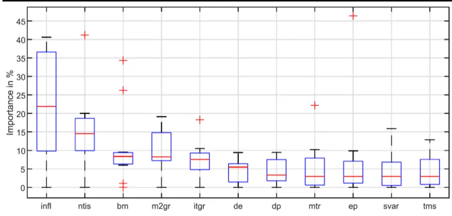
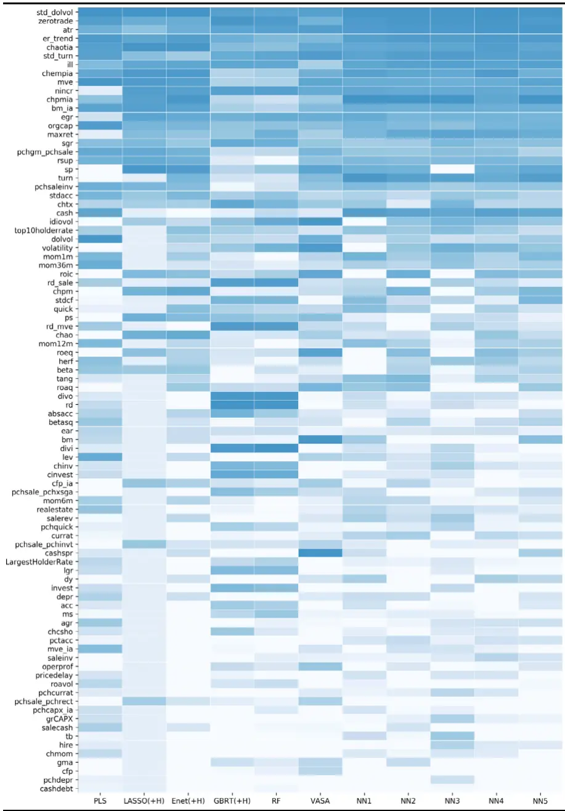
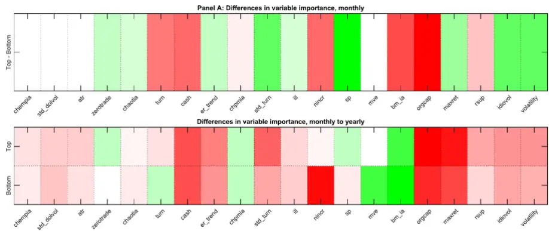
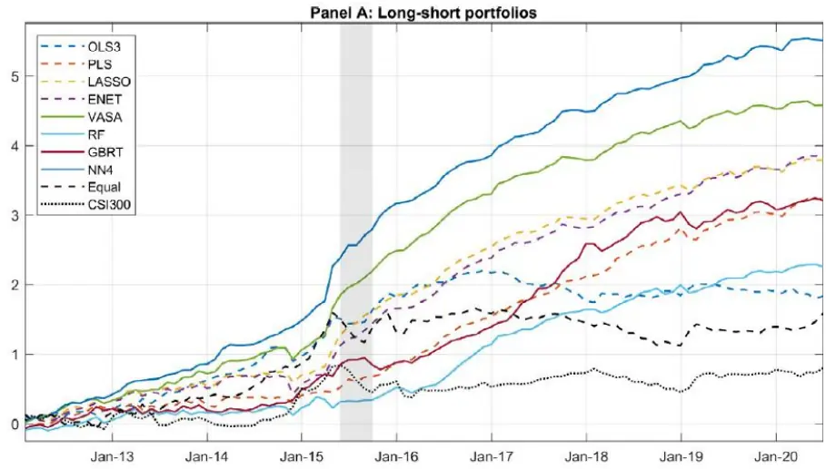
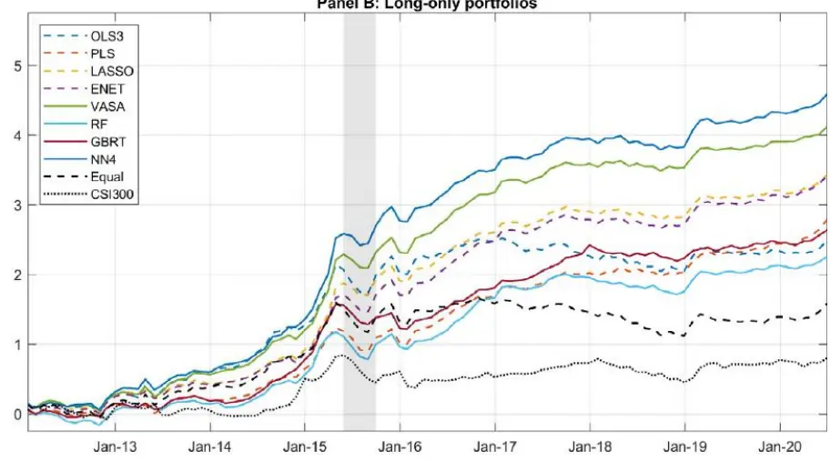

nInfo] [Table_Title] 2021.12.01

# 机器学习算法在 A股市场中的应用

## ——学界纵横系列之三十

陈奥林(分析师)

## 徐浩天(研究助理)

8 021-38674835

021-38038430

chenaolin@gtjas.com

xuhaotian@gtjas.com

证书编号 S0880516100001

S0880121070119

## 本报告导读：

本文运用11种机器学习的方法，结合中国股市特有的三个特点，探究更适用于中国股票市场的异象因子，并分析其与美国股市的异同。

le_Summary]作者认为，中国股市有以下三个有别于国际其他股市的特征：（1）散户投资者占了绝大多数，短期交易与投机行为普遍；（2）政府对股市的影响力非常大；（3）做空限制较大。基于以上三点，作者认为有必要从实证的角度对中国市场展开研究。

本文研究了 11 种机器学习方法在中国股市中的预测能力，发现神经网络模型对收益率的预测能力优于其他机器学习模型。

另外，对于中国股市而言，最重要的因子是基于流动性的交易信号，基本面因子是第二类重要的因子，而基于价格动量的信号只起着很小的作用。这一结论是与美国市场截然不同的。

作者还发现，散户投资者的短期主义在短期具有了很大的可预测性，特别是对于小盘股。同时，由于政府在中国市场发挥着至关重要的作用，作者观察到国有企业在长期的可预测性的显著提高。

- 结合我国国情，将 long-only 资产组合策略、交易成本以及 10%的涨跌幅等限制考虑在内，以上结论仍是显著的。

金融工程

## 金融工程团队：

陈奥林：（分析师）

电话：021-38674835

邮箱：chenaolin@gtjas.com

证书编号：S0880516100001

杨能：（分析师）

电话：021-38032685

邮箱：yangneng@gtjas.com

证书编号：S0880519080008

## 殷钦怡：（分析师）

电话：021-38675855

邮箱：yinqinyi@gtjas.com

证书编号：S0880519080013

## 徐忠亚：（分析师）

电话：021- 38032692

邮箱：xuzhongya@gtjas.com

证书编号：S0880120110019

## 刘昺轶：（分析师）

电话：021-38677309

邮箱：liubingyi@gtjas.com

证书编号：S0880520050001

## 赵展成：（研究助理）

电话：021-38676911

邮箱：Zhaozhancheng@gtjas.com

证书编号：S0880120110019

## 张烨垲：（研究助理）

电话：021-38038427

邮箱：zhangyekai@gtjas.com

证书编号：S0880121070118

## 徐浩天：（研究助理）

电话：021-38038430

邮箱：xuhaotian@gtjas.com

证书编号：S0880121070119

## [Table_Re相关报告

基于目标投资期限的风险偏好择时策略2021.11.28

集成了机器学习的投资组合再平衡框架 2021.11.27

“基本面信号宇宙”与横截面股票收益2021.11.26

基于多元分析的 CNN-LSTM模型 2021.11.25

## 1. 选题背景

在过去的数十年中，人们挖掘出了越来越多能够解释超额收益的异象因子，美国金融学会前主席 Cochrane（2011）称之为“因子动物园”（FactorZoo）。然而，如何充分利用这些因子信息，更有效地预测未来的股票收益，是传统研究方法面临的一大挑战。于是，在人工智能技术的不断发展的今天，涌现出大量将机器学习模型和因子策略相结合的研究。

本篇报告推荐 Leippold 等人最新发表于《Journal of Finance Economics》（2021）的文章《Machine learning in the Chinese stock market》。该文章运用 11 种机器学习的方法，探究适用于中国股票市场的异象因子，并分析其与美国市场的异同。

## 2. 核心结论

作者运用多种机器学习算法，构建出一套适用于中国市场的市场回报预测因子池。其中，流动性因子最为显著，基本面因子次之，而动量因子的影响力是非常有限的。这一结果显然有别于美国市场。

造成这一结果的原因之一是，中国股市由散户投资者主导。散户投资者更偏好投机交易，这意味着更高的换手率及更大的波动率。数据显示，相比于长期（年度），流动性因子在短期内（月度）对股票收益有显著的预测能力，尤其对小盘股而言。

中国市场区别于美国市场的另一特点是，大盘股和国有企业的长期收益率具有很高的可预测性。

值得注意的是，即使在考虑交易成本之后，模型的样本外预测结果仍然表现优秀。

## 3. 文章背景

区别于其他发达国家，中国股票市场有以下三个独特的特征：

（1）投资者主要由散户组成。根据上海证券交易所 2019 年年鉴，中国有 2.145 亿投资者，其中 70 万为机构投资者，而剩余的 2.138 亿都是个人投资者，占比高达 99.8%。许多散户投资者的投机行为和短期交易，一方面导致了换手率的增加：数据显示，2019 年中国股票的交易额占市值的 224%，对比同期美国市场，该数值仅为 108%；另一方面，导致了更高的波动性，公司股价更有可能背离真实的价值。在这种背景下，作者怀疑，投资行为产生的技术指标对资产定价的影响，可能比公司基本面指标更加重要。

（ ）中国金融体系的关键特征是国家高度参与。例如 过程需要有专门的机构审核、一些基础行业（银行、军工等）都是国有企业（SOE）。在这些企业中，政府通常扮演着重要的角色，以至于 SOE在保证盈利的同时，更要达到一些政治目标。在这一背景下，作者想探究那些对收益具有预测能力的因子是否同样适用于 SOE。

（3）中国市场的做空历史是有限的。在 2010 年之前，做空是不被允许的，直到 2010 年 3 月才部分放开。但是，空头交易量在经历了一开始的指数式增长后，又在 2015 年之后迅速回落。在这一背景下，传统研究中运用多空资产组合来探究某因子的有效性的方法似乎并不适用于中国市场。因此，作者运用只有多头的策略来探究因子的有效性。

综合以上三点原因，作者认为，有必要从实证的角度对中国市场进行深度的研究。

## 4. 数据来源与模型构建

本文选取了 2000 年 1 月至 2020 年 6 月上交所及深交所的所有 A 股数据，包括各股票每日的收益、各季度的财务信息。无风险利率定义为一年期的国债利率。本文数据均来自 WIND 数据库、CSMAR 数据库。

参考前人的研究，本文选用了 94 个因子 $c_{i,t}$ 用于刻画公司特征，80 个 0-1 变量 $\cdot d_{i,t}$ 用于划分公司行业（划分标准参照《上市公司行业分类指引》（CSRC, 2012）），以及 11 个因子 $\chi_{t}$ 用于刻画宏观特征。总的来说，可以将因子集 $:\boldsymbol{Z}_{i,t\cdot}$ 表示为下式，其中，⊗表示 Kronecker 内积。

$$
z_{i,t}=\begin{pmatrix}c_{i,t}\\\chi_{t}\otimes c_{i,t}\\d_{i,t}\end{pmatrix}\tag{1}
$$

本文考虑了 11 种机器学习的模型，包括偏最小二乘回归 PLS、LASSO、弹性网络 Enet、梯度回归 GBRT、随机森林 RF、子变量集成（VariableSubsampling Aggregation, VASA），以 及一 层 到五 层的 神经 网络 模 型（NN1-NN5）。至于基准模型，本文考虑了最小二乘回归 OLS，以及只考虑 size、book-to-market 和 momentum 三个因子的最小二乘估计模型OLS-3。

作者将数据分为训练集（2000-2008）、验证集（2009-2011）和测试集（2012-2020）。具体而言，本文用训练集估计模型参数，用验证集选择超参以最小化损失函数，再对接下来的 12 个月进行样本外预测。验证集和测试集均采用滚动窗口的形式，窗口期为一年，训练集的样本容量则不断增加。考虑到机器学习对计算机算力的巨大需求，本文参数估计值的更新频率为一年。

## 5. 实证分析

## 5.1. 哪些模型拥有较好的样本外表现

本文采用样本外预测的 $R_{oos,S}^{2}$ （详见式（2））来评估模型S的预测能力。选用这一指标的好处是能够直接和美国市场（Gu et al., 2020）对比。同时，为了探究中国市场的独有特征，作者还进一步对不同的子样本T进行了分析。实证结果见表 1。

$$
R_{oos,S}^{2}=1-\frac{\sum_{(i,t)\in\mathcal{T}}\left(r_{i,t}-\hat{r}_{i,t}^{(S)}\right)^{2}}{\sum_{(i,t)\in\mathcal{T}}r_{i,t}^{2}}\tag{2}
$$

表 1: 月度样本外预测的 $R^{2}$ （%）

|  | OLS +H | OLS-3 +H | PLS | LASSO +H | Enet +H | GBRT +H | RF | VASA | NN1 | NN2 | NN3 | NN4 | NN5 |
| --- | --- | --- | --- | --- | --- | --- | --- | --- | --- | --- | --- | --- | --- |
| All | 0.81 | 0.77 | 1.28 | 1.43 | 1.42 | 2.71 | 2.44 | 1.37 | 2.07 | 2.04 | 2.28 | 2.49 | 2.58 |
| Top 70% | -0.89 | 0.23 | 0.56 | 0.55 | 0.36 | -0.38 | -0.04 | 0.34 | 0.41 | 0.51 | 0.74 | 0.47 | 0.72 |
| Bottom 30% | 1.33 | 1.57 | 2.35 | 2.74 | 3.00 | 7.27 | 6.10 | 2.90 | 4.52 | 4.32 | 4.57 | 5.50 | 5.33 |
| A.M.C.P.S. Top 70% | 0.47 | 1.31 | 0.55 | 1.36 | 1.53 | 1.39 | 1.69 | 1.41 | 1.72 | 1.67 | 2.01 | 1.96 | 2.03 |
| A.M.C.P.S. Bottom 30% | 1.49 | -0.31 | 7.08 | 1.12 | 1.22 | 1.48 | 3.93 | 1.29 | 2.78 | 2.79 | 2.84 | 3.56 | 3.67 |
| SOE | -0.06 | 0.52 | 0.68 | 0.85 | 0.79 | 0.01 | 0.80 | 0.75 | 1.10 | 1.18 | 1.28 | 1.30 | 1.68 |
| Non-SOE | 1.12 | 0.87 | 1.50 | 1.64 | 1.65 | 3.67 | 3.02 | 1.60 | 2.41 | 2.35 | 2.64 | 2.92 | 2.90 |

数据来源：《Machine learning in the Chinese stock market》

在全样本的分析中（表 第 行），可以发现（ ）与 、 等传统的线性回归模型相比，机器学习模型表现较好， $R_{oos}^{2}$ 均大于 1%；（2）与线性模型相比，树状模型（包括 GBRT、RF、NN）的预测能力更好，$R_{oos}^{2}$ 均大于 2%；（3）与 PLS（1.28%）相比，LASSO（1.43%）和 Enet（1.42%）的 $R_{oos}^{2}$ 只提升了很小一部分，说明现在考虑的因子很大程度上存在冗余，在下一节将对此展开详细的讨论；（4）中国市场的可预测性明显高于美国市场，中国市场的 $R_{oos}^{2}$ 最高达到 2.71%，这几乎是美国市场 $R_{oos}^{2}$ 最高值的七倍。

考虑到中美市场之间巨大的差异，作者接下来对分别讨论了大盘股-小盘股，大股东-小股东、国有企业-非国有企业三类子样本。

按照市场净值，作者将股票分为大盘股（前 70%）和小盘股（后 30%），并分别对子样本分析，分析结果见表 1 的 2-3 行。可以看到，（1）所有的模型都在小盘股有更好的表现；（2）树状模型的表现依旧优于回归模型。

考虑到中国市场的投资者主要由散户构成这一特征，作者按照市值与股东数的比值（AMCPS），将股票分为大股东主导（前 70%）和小股东主导（后 30%），并分别对子样本分析，分析结果见表 1 的 4-5 行。数据显示（1）机器学习的方式在由小股东主导的股票中表现更好；（2）OLS-3

模型的 $R_{oos}^{2}$ 为负数，说明经典三因子完全对由小股东主导的股票失效。

最后考虑到国有企业对中国金融市场的重要影响，作者也对国有-非国有子样本进行了分析，分析结果见表 的 行。该结果与大盘股 小盘股子样本的分析结果非常相似，可能的原因之一是国有企业常常作为各个行业（例如银行、运输、军工）的龙头企业，往往拥有较高的市场净值。因此，企业规模与企业性质高度相关。

最后，作者将预测步长调整为一年，以评价模型的长期预测能力，分析结果见表 2。结果发现，较短期相比，模型对全样本的预测能力显著提升。另外，国有企业（SOE）、由大股东主导的股票（AMCPS top 70%）的预测表现显著提升，这一结论恰好与短期预测相反。由此，作者推断，股票收益的短期预测能力主要来自散户投资者的投机行为。

表 2: 年度样本外预测的 $lR^{2}$ （%）

|  | OLS +H | OLS-3 +H | PLS | LASSO +H | Enet +H | GBRT +H | RF | VASA | NN1 | NN2 | NN3 | NN4 | NN5 |
| --- | --- | --- | --- | --- | --- | --- | --- | --- | --- | --- | --- | --- | --- |
| All | 3.22 | 3.27 | 3.51 | 4.47 | 4.33 | 4.53 | 4.15 | 4.19 | 4.26 | 5.39 | 5.21 | 5.17 | 5.24 |
| Top 70% | 3.74 | 4.23 | 4.18 | 5.30 | 5.20 | 5.23 | 4.61 | 4.95 | 7.17 | 5.68 | 5.79 | 5.80 | 6.48 |
| Bottom 30% | 3.46 | 3.73 | 3.80 | 4.74 | 4.59 | 4.92 | 3.92 | 4.40 | 6.54 | 5.36 | 5.47 | 5.48 | 6.02 |
| A.M.C.P.S. Top 70% | 3.96 | 3.42 | 4.91 | 4.02 | 4.66 | 4.67 | 4.77 | 4.34 | 4.98 | 5.78 | 5.51 | 6.06 | 6.33 |
| A.M.C.P.S. Bottom 30% | 0.59 | 2.40 | 3.05 | 1.50 | 3.75 | 2.97 | 1.75 | 3.60 | 1.45 | 3.87 | 4.02 | 1.72 | 1.06 |
| SOE | 4.71 | 5.80 | 5.84 | 6.98 | 6.89 | 5.81 | 6.53 | 6.57 | 8.98 | 6.87 | 6.82 | 7.20 | 8.18 |
| Non-SOE | 3.08 | 3.12 | 3.09 | 4.10 | 3.99 | 4.77 | 3.22 | 3.80 | 5.88 | 4.87 | 5.07 | 4.87 | 5.32 |

数据来源：《Machine learning in the Chinese stock market》

## 5.2. 哪些因子拥有显著的预测能力

在这节，作者探究了哪些因子具有相对更显著的预测能力。采用的方式是，将该因子去掉后，用剩下的因子进行分析。比较同一的两个 $\cdot R_{oos}^{2}$ 之间的差值。差值越大，代表被排除掉的因子含有的信息越多，则说明该因子的预测能力更显著。

## 5.2.1. 宏观因子

按照上述方法，作者将 11 个宏观因子在不同机器学习中相对重要性列在表 3 中。

表 3: 宏观因子的重要程度（全样本）

|  | PLS | LASSO +H | Enlet +H | GBRT +H | RF | VASA | NN1 | NN2 | NN3 | NN4 | NN5 |
| --- | --- | --- | --- | --- | --- | --- | --- | --- | --- | --- | --- |
| dp | 0.00 | 8.65 | 4.07 | 9.11 | 9.44 | 1.34 | 2.17 | 2.96 | 3.31 | 4.01 | 1.63 |
| de | 0.00 | 1.06 | 1.78 | 9.40 | 8.59 | 1.32 | 5.46 | 5.86 | 5.28 | 6.57 | 5.78 |
| bm | 1.06 | 34.33 | 26.24 | 8.97 | 8.34 | 0.00 | 8.46 | 7.23 | 5.99 | 7.99 | 9.53 |
| svar | 0.00 | 0.00 | 0.13 | 7.76 | 8.86 | 15.88 | 2.12 | 2.93 | 3.23 | 3.97 | 1.59 |
| ep | 0.00 | 0.68 | 0.98 | 8.09 | 9.86 | 46.41 | 2.14 | 2.94 | 3.21 | 3.99 | 1.59 |
| ntis | 41.19 | 14.54 | 14.37 | 12.30 | 9.12 | 0.00 | 18.35 | 18.78 | 20.01 | 16.36 | 17.60 |
| tms | 0.00 | 0.00 | 0.52 | 8.74 | 9.17 | 12.86 | 2.13 | 2.93 | 3.31 | 4.00 | 1.58 |
| infl | 21.14 | 21.86 | 28.63 | 9.11 | 11.92 | 0.00 | 40.61 | 38.41 | 38.16 | 31.97 | 39.12 |
| mtr | 0.00 | 0.00 | 0.26 | 9.22 | 10.22 | 22.19 | 2.12 | 2.95 | 3.28 | 4.00 | 1.58 |
| m2gr | 18.33 | 16.57 | 19.12 | 8.22 | 7.12 | 0.00 | 8.19 | 7.57 | 6.63 | 8.51 | 9.50 |
| itgr | 18.28 | 2.32 | 3.91 | 9.52 | 7.36 | 0.00 | 8.24 | 7.44 | 7.57 | 8.62 | 10.50 |

数据来源：《Machine learning in the Chinese stock market》

数据显示，不同的回归模型对因子的偏好不尽相同。PLS、GBRT 模型认为股票发行（ntis）最为重要。众所周知，中国一直采用以审批为基础的

IPO 制度，中国证监会经常在市场下跌时暂停或减少 IPO 数量，这使得ntis 在预测月度回报方面发挥重要作用是合理的。因此，该因子也被别的模型认为是第二重要的因子。而 LASSO、Enet 模型则比较关注账面价值比（bm），但是 bm 在 PLS、VASA模型的权重较低。

于此同时，树状的模型对因子的偏好较为统一。他们都将通胀率（infl）排在了第一位。

将各个因子的重要程度呈现在箱线图上（见图 1），可以发现，预测能力最强的两个宏观变量是 infl和 ntis。而股利率（dp）、市场波动率（svar）、整体 EPS（ep）、期限利差（tms）、以及市场流动性（mtr）的重要性则相对较低。

图 1 宏观因子的重要程度

数据来源：《M achine learning in the Chinese stock market》

## 5.2.2. 股票特征因子

同样的方法依次检验 94 个股票特征因子。发现各个因子在不同的机器学习模型中的重要程度也不尽相同，详见图 2（颜色越深越重要，排名越靠前平均而言越重要）。

可以发现，与市场流动性有关的因子占据了首要地位，例如流动性波动率（std_dolvol 和 std_turn），零交易天数（zerotrade）， 以及非流动性指标（ill )。

第二重要的大类则是与基本面和价值有关的因子，例如行业调整资产周转率（chaotia），行业调整员工人数变化（chempia），总市值（mve），盈利预测上调次数（nincr）， 行业调整毛利率变动（chpmi），以及行业调整账面市值比（bm_ia）。

第三显著的是风险度量类因子，例如特质收益波动率（diovol），收益波动率（volatility），以及β值（beta）。

这一结论是区别于美国市场的。对美国市场来说较为重要的动量因子，除了近期最大涨幅（maxret），其他因子在中国市场的预测能力是较弱的。另一方面，反映投机交易行为的异动换手率（atr）表现出了较强的预测能力。

图 2 股票特征因子的重要程度（全样本）

数据来源：《M achine learning in the Chinese stock market》

## 5.3. 解析 NN4 的预测能力

根据前文的研究，发现神经网络模型 NN 的预测能力的表现较为突出。
在这一节，作者试图进一步探究驱动 NN 预测能力的因子。

图 3 的 PanelA展示了各因子对全样本、前 70%股票、后 30%的股票的月度预测能力的重要性。横坐标从左到右依次是对全样本而言最重要的20 个因子，纵坐标表示子样本（top70%或 bottom30%），红色表示该因子在子样本的重要程度下降了，而绿色表示该因子在子样本的重要程度上升了。可以发现，无论是对于全样本还是子样本而言，最重要的三个因子都是（1）衡量公司困境的 chempia；（2）衡量交易流动性的std_dolvol；（3）衡量投机交易行为 atr，并且他们的重要程度没有发生变化。但是大多数因子的重要程度随着子样本的不同发生了变化。比如对于小公司而言，流动性因子更为重要（zerotrade、std_turnover），以及表现突出的波动率相关因子（volatility、idiovol、max_ret），而基本面因子的重要性则较弱（cash、nincr、bm_ia、orgcap）。

图 3 前 20 因子的重要程度变化

数据来源：《M achine learning in the Chinese stock market》

但是在考察各因子的长期（yearly）预测能力的时候，各因子对子样本的的重要程度发生了变化，详见图 3 的 Panel B。chempia、std_dolvol 以及atr 不再是最重要的因子，并且衡量散户投资行为的因子的重要性也降低，反之体现公司规模、成长性的因子变得更为重要。

## 6. 稳健性检验

为了验证前文所述的方法是稳键的，作者对各模型构建资产组合，并将之与沪深 300 指数的收益率进行对比。具体而言，每月根据样本外预测的收益率，对所有股票进行排序，持有前 10%的股票，做空后 10%的股票，并按照市值加权及一般加权两种方法构建资产组合，计算该资产组合的累计收益率。详见图 4 的 Panel A。

结合中国市场的真实情况，作者考虑了 long-only 策略，见图 4 的 PanelB。结果发现，不管是 long-short 策略还是 long-only 策略，所有的模型都表现得比沪深 300 好，包括在 2015 年的股市崩盘中。神经网络模型的表现优于其他模型，这和前文的研究相符。

为了结论的严谨性，作者在考虑了交易成本之后，发现 NN 的表现依旧是最为突出的。由于篇幅的限制，这里不再详细说明。

最后，作者为了防止出现某些机构投资者将股票价格炒高到涨停再于次日卖出这种会对因子的预测能力产生破坏性的行为，设计了一种新的交易策略。这种交易策略在每月重新选股的时候，将股价接近涨停的股票排除，并且推迟卖出接近跌停的股票。结果发现，这种策略的回报及夏普率依然很高。

综上所述，本文的模型在考虑了各种现实因素之后，仍是稳键的。

Panel B: Long-only portfolios
图 4 各机器学习模型对应资产组合的累计对数收益（全样本）

数据来源：《M achine learning in the Chinese stock market》

## 7. 结论

## 7.1. 原文结论

本文研究了 11 种机器学习方法在中国股市中的预测能力，发现神经网络模型对收益率的预测能力优于其他机器学习模型。另外，对于中国股市而言，最重要的因子是基于流动性的交易信号，而基于价格动量的信号只起着很小的作用。众所周知，股票市场需要很多年才能发展出允许和鼓励基本面投资的特点，可喜的是中国股市正朝着这个方向发展。本文结果表明，基本面因子是第二类重要的因子。作者还发现，散户投资者的投机行为使得股价在短期具有了很大的可预测性，特别是对于小盘股。同时，由于政府在中国市场发挥着至关重要的作用，作者观察到国有企业在长期的可预测性的显著提高。

同时，稳健性分析表明，短期股票收益的高可预测性使得投资组合的夏普比率较高。特别是，神经网络和 VASA 在 2015 年中国股市崩盘期间也提供了强劲的表现。然而，在中国市场做空股票是不切实际的。因此，作者还分析了 long-only 的投资组合，发现其表现仍然显著。最后作者还提出了将交易成本以及涨跌幅10%的限制引起的破坏性交易行为也考虑在内，结果显示该方法仍是显著的。总体而言，机器学习方法可以成功地应用于与美国市场具有完全不同特征的中国市场，甚至表现更好。

## 7.2. 我们的思考

本文将针对国外股市的研究方法充分本土化，结合中国股市特有的三个特点，分析更适合中国市场的因子，并探究这些因子随着子样本的不同，重要程度的变化。

其实，这种本土化的文章屡见不鲜，特别是实证研究更是层出不穷。但是本文之所以能够收录于顶刊，很大的的程度是它在实证过程中，充分考虑了中国市场的特征，探究这这种背景下，显著因子与美国市场的差异，并给予合理的经济解释。这种思想，在实证研究，特别是本土化研究中，值得学习。

## 本公司具有中国证监会核准的证券投资咨询业务资格

## 分析师声明

作者具有中国证券业协会授予的证券投资咨询执业资格或相当的专业胜任能力，保证报告所采用的数据均来自合规渠道，分析逻辑基于作者的职业理解，本报告清晰准确地反映了作者的研究观点，力求独立、客观和公正，结论不受任何第三方的授意或影响，特此声明。

## 免责声明

本报告仅供国泰君安证券股份有限公司（以下简称“本公司”）的客户使用。本公司不会因接收人收到本报告而视其为本公司的当然客户。本报告仅在相关法律许可的情况下发放，并仅为提供信息而发放，概不构成任何广告。

本报告的信息来源于已公开的资料，本公司对该等信息的准确性、完整性或可靠性不作任何保证。本报告所载的资料、意见及推测仅反映本公司于发布本报告当日的判断，本报告所指的证券或投资标的的价格、价值及投资收入可升可跌。过往表现不应作为日后的表现依据。在不同时期，本公司可发出与本报告所载资料、意见及推测不一致的报告。本公司不保证本报告所含信息保持在最新状态。同时，本公司对本报告所含信息可在不发出通知的情形下做出修改，投资者应当自行关注相应的更新或修改。

本报告中所指的投资及服务可能不适合个别客户，不构成客户私人咨询建议。在任何情况下，本报告中的信息或所表述的意见均不构成对任何人的投资建议。在任何情况下，本公司、本公司员工或者关联机构不承诺投资者一定获利，不与投资者分享投资收益，也不对任何人因使用本报告中的任何内容所引致的任何损失负任何责任。投资者务必注意，其据此做出的任何投资决策与本公司、本公司员工或者关联机构无关。

本公司利用信息隔离墙控制内部一个或多个领域、部门或关联机构之间的信息流动。因此，投资者应注意，在法律许可的情况下，本公司及其所属关联机构可能会持有报告中提到的公司所发行的证券或期权并进行证券或期权交易，也可能为这些公司提供或者争取提供投资银行、财务顾问或者金融产品等相关服务。在法律许可的情况下，本公司的员工可能担任本报告所提到的公司的董事。

市场有风险，投资需谨慎。投资者不应将本报告作为作出投资决策的唯一参考因素，亦不应认为本报告可以取代自己的判断。
在决定投资前，如有需要，投资者务必向专业人士咨询并谨慎决策。

本报告版权仅为本公司所有，未经书面许可，任何机构和个人不得以任何形式翻版、复制、发表或引用。如征得本公司同意进行引用、刊发的，需在允许的范围内使用，并注明出处为“国泰君安证券研究”，且不得对本报告进行任何有悖原意的引用、删节和修改。

若本公司以外的其他机构（以下简称“该机构”）发送本报告，则由该机构独自为此发送行为负责。通过此途径获得本报告的投资者应自行联系该机构以要求获悉更详细信息或进而交易本报告中提及的证券。本报告不构成本公司向该机构之客户提供的投资建议，本公司、本公司员工或者关联机构亦不为该机构之客户因使用本报告或报告所载内容引起的任何损失承担任何责任。

## 评级说明

## 1.投资建议的比较标准

投资评级分为股票评级和行业评级。以报告发布后的 12 个月内的市场表现为比较标准，报告发布日后的 12 个月内的公司股价（或行业指数）的涨跌幅相对同期的沪深 300 指数涨跌幅为基准。

## 2.投资建议的评级标准

报告发布日后的 12 个月内的公司股价（或行业指数）的涨跌幅相对同期的沪深300 指数的涨跌幅。

| 评级 |  | 说明 |
| --- | --- | --- |
| 股票投资评级 | 增持 | 相对沪深 300 指数涨幅 15%以上 |
|  | 谨慎增持 | 相对沪深 300指数涨幅介于5%～15%之间 |
|  | 中性 | 相对沪深300指数涨幅介于-5%～5% |
|  | 减持 | 相对沪深300 指数下跌 5%以上 |
| 行业投资评级 | 增持 | 明显强于沪深 300 指数 |
|  | 中性 | 基本与沪深 300 指数持平 |
|  | 减持 | 明显弱于沪深300指数 |

## 国泰君安证券研究所

|  | 上海 | 深圳 | 北京 |
| --- | --- | --- | --- |
| 地址 | 上海市静安区新闸路669 号博华广 场20层 | 深圳市福田区益田路6009号新世界 商务中心34层 | 北京市西城区金融大街甲9号金融 街中心南楼18层 |
| 邮编 | 200041 | 518026 | 100032 |
| 电话 | （021）38676666 | （0755）23976888 | (010)83939888 |
|  | E-mail: gtjaresearch@gtjas.com |  |  |