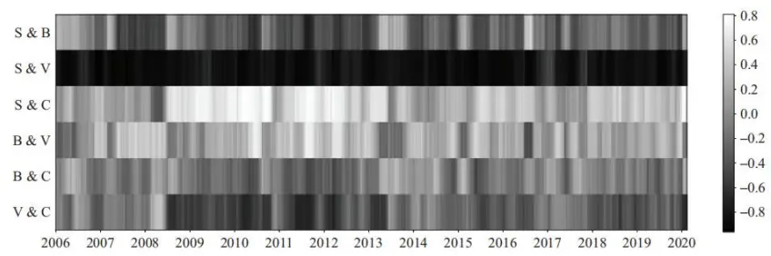
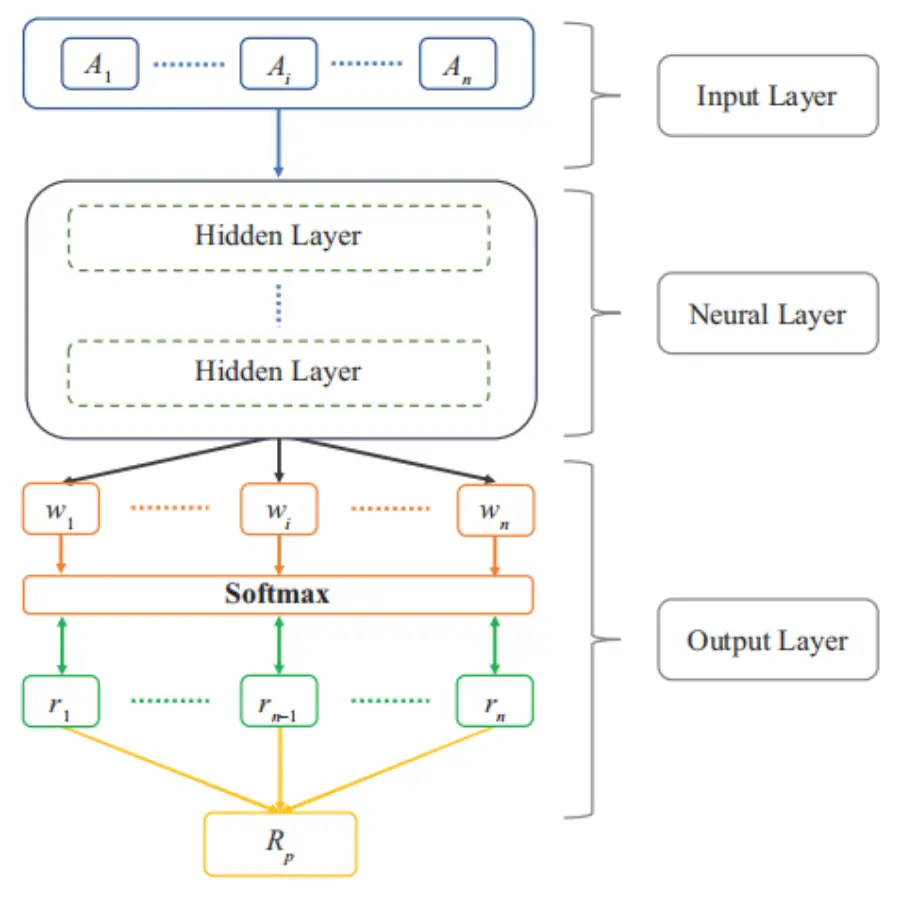
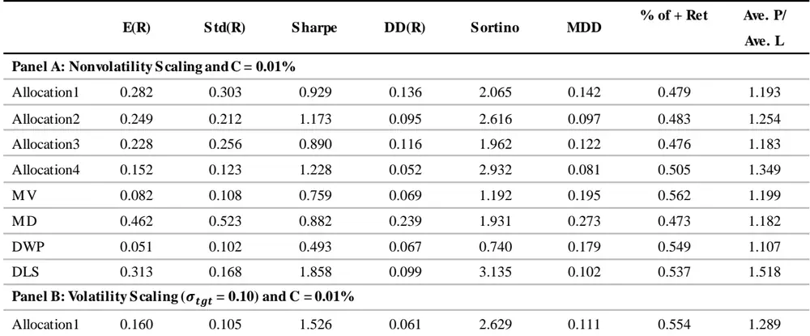
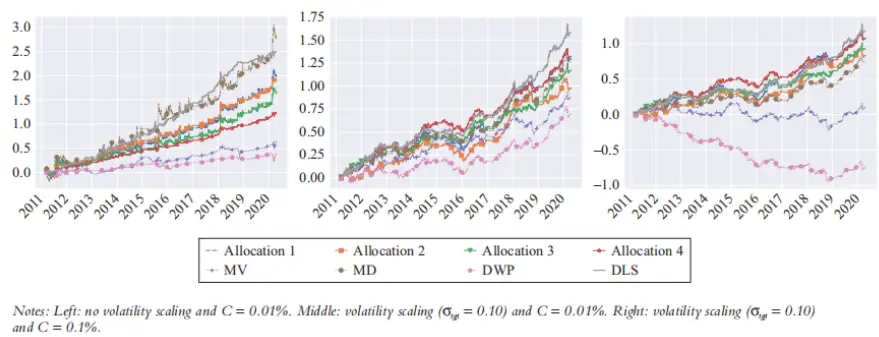
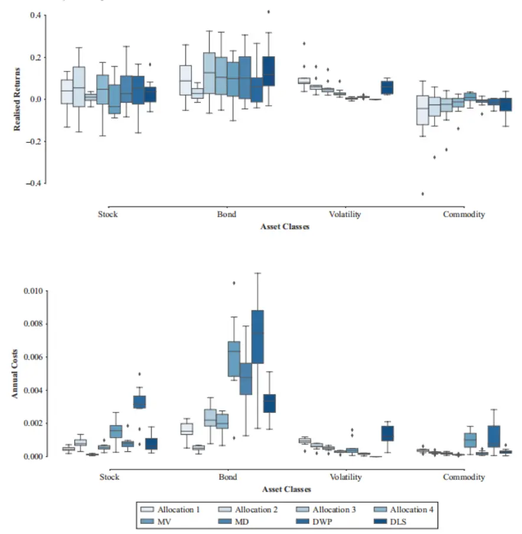
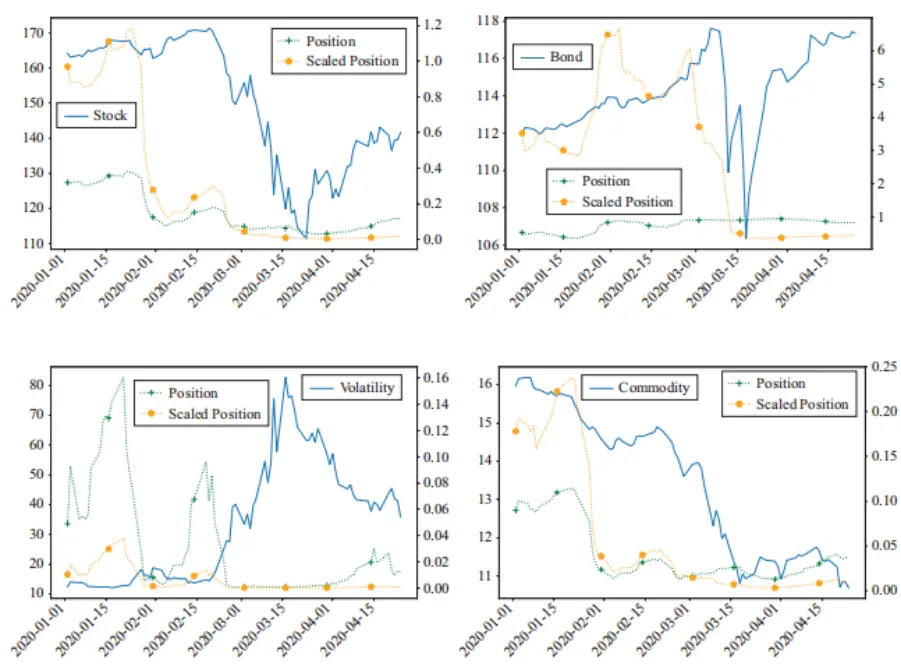

nInfo] [Table_Title] 2021.12.03

# 基于夏普比最大化的组合优化模型

## ——学界纵横系列之三十二

陈奥林(分析师)

## 徐浩天(研究助理)

8 021-38674835

021-38038430

chenaolin@gtjas.com

xuhaotian@gtjas.com

证书编号 S0880516100001

S0880121070119

## 本报告导读：

本文介绍了一种直接对夏普比率进行优化的基于深度学习的投资组合优化模型框架。

## 摘要：

le_Summary]在人工智能快速发展的今天，机器学习被应用到金融工程的各个领域。投资组合优化问题作为量化金融的重要组成部分，同样也越来越多地出现了机器学习算法的身影。

《Deep Learning for Portfolio Optimization》一文采用深度学习模型直接优化了投资组合的夏普比。该模型直接跳过了预测预期收益这一传统算法中的重要步骤，通过更新模型参数来直接优化投资组合的权重。此优化框架没有选择单个资产，而是选择市场指数的交换交易基金形成投资组合。不同资产类别的指数显示出稳健的相关性，直接对其进行交易大大减少了可选择的资产范围，降低了问题的复杂性。

作者将他们的方法与多种传统算法进行了比较。结果表明，该模型在2011 年至 2020 年 4 月底的测试期间内表现出最佳的性能，同时在2020 年第一季度市场不稳定时表现依然良好。

金融工程

## 金融工程团队：

陈奥林：（分析师）

电话：021-38674835

邮箱：chenaolin@gtjas.com

证书编号：S0880516100001

杨能：（分析师）

电话：021-38032685

邮箱：yangneng@gtjas.com

证书编号：S0880519080008

殷钦怡：（分析师）

电话：021-38675855

邮箱：yinqinyi@gtjas.com

证书编号：S0880519080013

## 徐忠亚：（分析师）

电话：021- 38032692

邮箱：xuzhongya@gtjas.com

证书编号：S0880120110019

## 刘昺轶：（分析师）

电话：021-38677309

邮箱：liubingyi@gtjas.com

证书编号：S0880520050001

## 赵展成：（研究助理）

电话：021-38676911

邮箱：Zhaozhancheng@gtjas.com

证书编号：S0880120110019

## 张烨垲：（研究助理）

电话：021-38038427

邮箱：zhangyekai@gtjas.com

证书编号：S0880121070118

徐浩天：（研究助理）

电话：021-38038430

邮箱：xuhaotian@gtjas.com

证书编号：S0880121070119

## [Table_Re相关报告

基于持仓变动与业绩表现的主动管理能力评价 2021.12.01

机器学 习算法 在 A 股 市场中 的应 用2021.12.01

基于目标投资期限的风险偏好择时策略2021.11.28

集成了机器学习的投资组合再平衡框架 2021.11.27

“基本面信号宇宙”与横截面股票收益2021.11.26

## 1. 文章背景与理论基础

## 1.1. 文章背景

投资组合优化是一个交易系统的重要组成部分，其目的是在一个投资组合中选择最佳的资产分配，以在给定的风险水平上使得收益最大化。这一理论是由马科维茨（1952）提出的，被称为现代投资组合理论（MPT）。构建一个这样的投资组合的好处主要来自于资产的多元化，以此平滑收益曲线，使得每单位风险的回报率比交易单个资产更高。这一观察结果已在研究中被证实，对于一个预先确定的预期收益，只要资产不是完全相关的，一个多头资产组合的风险一定小于单个资产。

尽管这种多样化具有不可否认的优势，但在投资组合中进行最优的资产配置并不简单，因为金融市场会随着时间的动态推移而发生显著变化。例如，过去表现出强负相关的资产在未来可能呈现正相关。这增加了投资组合的额外风险，降低了其预期表现和可靠性。此外，用于构建投资组合的可用资产的范围是巨大的，以美国股票市场为例，有 5000 多只股票可供选择。事实上，一个全面的投资组合不仅包括股票，通常还包括债券和大宗商品等作为补充，这进一步扩大了可选择的范围，提高了问题的复杂性。

文中，作者考虑使用深度学习模型直接优化投资组合，而不是像经典的方法一样先预测预期回报（通常通过计量经济学模型）。本文提出的直接最大化夏普比模型 DLS 跳过这一预测步骤，直接获得资产分配权重。一些研究已经表明，预测收益的方法不能保证使投资组合的表现最优化，因为预测过程试图使预测损失最小化，而这不能代表投资组合的整体回报。相比之下，本文的方法是直接优化夏普比率，从而最大化每单位风险的收益。该框架首先将来自不同资产的多个特征连接起来，然后使用神经网络提取特征并输出投资组合权重数值，使夏普比最大化。

文中提出的框架不是直接选择单个资产，而是选择市场指数的交易所交易基金（ETF），形成投资组合。作者使用了四个市场指数：美国总股票指数（VTI）、美国总债券指数（AGG）、美国大宗商品指数（DBC）和波动性指数（ ）。所有这些指数都是普遍交易的 ，拥有较高的流动性和相对较小的交易费用比率。直接对指数进行交易大幅减少了资产选择的范围，同时也获得了对多数证券的收益敞口。此外，这些指数通常不相关，甚至呈负相关，如图 1 所示。与之相比，同一资产类别中的个别工具往往表现出很强的正相关性。例如，超过 75%的股票与市场指数高度相关。因此，将它们单独添加到投资组合中对资产组合多样化的帮助较小。

图 1 不同指数对之间滚动相关性的热力图

B = bond index; C = commodity index; S = stock index; V = volatility index
数据来源：《Deep Learning for Portfolio Optimization》

## 1.2. 理论基础

下面，介绍几种流行的投资组合优化方法并讨论机器学习技术如何应用于这个领域。

对于投资组合优化，目前一种流行且较为实用的方法是许多养老基金所采用的重分配策略，这种方法仅通过投资股票和债券来构造投资组合。举例说明，一个典型的中等风险投资组合包括60%的股票和40%的债券，该投资组合只需要每半年或每年进行一次重分配，以维持这种分配比率。该方法长期表现良好，然而，投资组合中资产固定的分配比率意味着：那些为股票分配更大权重的投资者相对大比例持有债券的投资者在获取更高预期收益的同时需要承受在低迷的市场中可能出现的大幅下跌风险，这是因为他们的投资组合对股票的风险敞口更大且调整较不灵活。

均值方差模型，即马科维茨提出的 MPT 被许多机构投资者用来分析和构建投资组合，其通过求解约束优化问题，推导投资组合中各个资产的权重。尽管该理论目前很受欢迎，但其假设经常受到批评，因为它们往往与真实的金融市场相悖。例如，该方法假设资产和组合的收益呈现高斯分布，因此，投资者只需参考预期收益和收益的方差来进行决策和规划。然而，资产的回报往往存在肥尾（fat tail）的现象，这会导致相较于理论模型，在实践中组合更容易出现极端损失，而这是难以承受的。

最大多样性（MD）投资组合是另一种很有前途的资产组合优化方法，MD 旨在最大化投资组合中资产的多样性，从而使得资产间的相关性最小，以期比其他经典方法获得相对更高的回报和相对更低的风险。

作者将提出的 DLS 模型与以上几种传统策略进行了比较，结果表明，相较于这些使用这些策略的对照组，本文提出的优化方法表现出更良好的性能和更大的交易成本容忍性。

随机投资组合理论（SPT）是由 Fernholz（2002）和 Karatzas（2009）提出的。与其他方法不同，SPT 的中心思想是选择一个大概率超过市场指数的投资组合。在本文的实验中，作者对照了一类称为功能生成组合的SPT 策略，但实验结果表明，该方法与其他算法相比，其性能较差，并出现了较大的换手率，使其在沉重的交易成本下很难取得收益。

《Deep Learning for Portfolio Optimization》一文中提出的端到端训练框架的想法首先由 Moody（1998）和 Saffell（2001）提出。然而，他们主要关注于优化单一种类资产的表现，很少讨论应该如何利用该方法进行投资组合优化。此外，他们的回测期是 1970 年至 1994 年，而本文使用的数据集是最新的，且研究了所提出的策略在因新冠肺炎大流行导致的市场危机下的状态和表现。

## 2. 理论方法

本节主要介绍文中所提出方法的框架，并讨论如何通过梯度上升算法来优化投资组合的夏普比。此外，本节中还讨论了文中所使用的神经网络的类型，详细介绍了该方法中每个组件的功能。

## 2.1. 目标函数

夏普比率用于衡量投资组合中承受每单位风险的收益率，其定义为预期收益率除以波动率（为简单起见，本框架中不包括无风险收益率）：

$$
\mathsf{L}=\frac{E(R_{p})}{Std(R_{p})}\tag{1}
$$

其中， $E(R_{p})$ 和 $Std(R_{p})$ 是投资组合收益的期望和标准差的估计。具体来说，对于 $\mathrm{t}=\{1,\ldots,\mathrm{T}\}$ 的交易期，我们可以最大化以下目标函数：

$$
L_{T}=\frac{E(R_{p,t})}{\sqrt{E\big(R_{p,t}^{2}\big)-(E(R_{p,t}))^{2}}}\tag{2}
$$

其中，

$$
E(R_{p,t})=\frac{1}{T}\sum_{t=1}^{T}R_{p,t}\tag{3}
$$

$R_{p,t}$ 为在 t 期实现的由 n 个资产组成的投资组合的回报：

$$
R_{p,t}=\sum_{i=1}^{n}w_{i,t-1}\cdot r_{i,t}\tag{4}
$$

其中 $r_{i,t}$ 为资产 i 在第 t 期的收益， $w_{i,t}$ 为资产的分配比率，满足 $w_{i,t}\in$ $[0,1],\sum_{i=1}^{n}w_{i,t}=1$ 。在本文中，作者采用参数为θ的神经网络 f 对多头投资组合中的 $w_{i,t}$ 进行建模：

$$
w_{i,t}=f(\theta|x_{t})\tag{5}
$$

其中， $x_{t}$ 表示当前的市场信息，模型绕过经典的预测步骤，将输入与头寸联系起来，以在交易期 T 中最大化夏普比，即 $L_{T}$ 。为了对一个多头的投资组合施加约束，要求每个资产权重非负，且求和为 1，本文使用softmax 输出来满足这些要求：

$$
w_{i,t}=\frac{\exp(\widetilde{w}_{i,t})}{\sum_{j=1}^{n}\exp(\widetilde{w}_{j,t})}\tag{6}
$$

其中， $\widetilde{w}_{i,t}$ 为模型输出的原始权重。

对于该框架，我们可以使用无约束优化方法进行优化。本文中作者使用梯度上升算法来最大化夏普比率。 $L_{T}$ 相对于参数θ的梯度很容易计算，一旦我们获得了 $\partial L_{T}/\partial\theta$ ，就可以从训练数据中反复计算这个值，并使用梯度上升来更新参数值，即迭代：

$$
\theta_{new}=\theta_{old}+\alpha\frac{\partial L_{T}}{\partial\theta}\tag{7}
$$

其中，α为学习率，该迭代过程可以重复许多期，直到夏普比率收敛或性能的优化得到实现，即达到停止标准。

## 2.2. 模型结构

图 2 模型结构示意图

数据来源：《Deep Learning for Portfolio Optimization》

图 2 描述了本文所提出模型的网络结构，模型由三个主要的组成模块构建而成：输入层、神经层和输出层。该框架训练测试及应用的核心思想是利用神经网络从输入资产中提取截面特征，一旦提取出特征，模型便输出投资组合的权重，并得到所实现的收益，使夏普比率最大化。下面详细介绍该方法框架的每个组成部分：

## 2.2.1. 输入层

将每个资产用 $A_{i}$ 表示，我们有 n 个资产来构建一个投资组合。模型通过连接来自所有资产的信息来形成单个输入。例如，任何一个资产的输入特征可以是其过去的价格和收益，其维度为（k，2），其中 k 表示回测窗口数量（k 期），2 表示价格和收益两个维度。通过对所有资产的特征进行堆叠，输入向量的维度为(k，2n)。然后，模型将此输入提供给神经网络，由神经网络识别和提取其中的非线性特征。

## 2.2.2. 神经网络层

一系列隐藏层可以堆叠形成神经网络，在实践中，由于有很多不同的方法来组合隐藏层且组合结构将会直接影响模型表现，这部分的搭建通常需要进行很多实验。作者考察了很多深度学习模型，包括全连接神经网络（FCN）、卷积神经网络（CNN），以及长期短期记忆（LSTM）。总的来说，LSTM 在日常金融数据建模和其他一些类似工作中表现出最佳的性能。

FCN 的问题是可能会出现严重的过拟合。因为它为每个输入特征分配参数，这将导致过多的参数。LSTM 的单元结构具有门机制，可以总结和过滤其中的长期信息，使得最终的可训练参数更少，并获得更好的泛化结果。相比之下，具有强平滑性的 CNN 卷积神经网络往往存在欠拟合的问题，可能会得到过度平滑的解。然而，作者也注意到，CNN 似乎是对高频金融数据进行建模的最好选择。

## 2.2.3. 输出层

为了构造一个纯多头组合，该框架对输出层使用 softmax 激活函数，它对输出施加约束，以保持组合中每个资产的权重为正，且求和为 1。输出节点的数量 $(w_{1},\dots,w_{n})$ 等于所构建投资组合中的资产数量。可以通过将这些投资组合中的资产权重与相关资产的回报 $(r_{1},\ldots,r_{n})$ 相乘来计算最终实现的投资组合收益 $R_{p}{\mathrm{~}}_{\mathrm{~}}$ 。一旦得到这个收益值，我们就可以求解出夏普比率，并计算出夏普比与模型参数相关的梯度，并使用梯度上升来迭代更新参数。

## 3. 实验

## 3.1. 数据集说明

文中使用了四个市场指数：美国 VTI、AGG、DBC 和 VIX。这些都是非常流行的 ETF，已存在了 15 年以上。如前所述，这些指数通常不相关，保证了多样化，所以交易指数比交易单个资产更具优势。一个多元化的投资组合会带来更高的单位风险收益，而本框架的理念是建立一个能提供良好的收益-风险比即夏普比率的系统。

文中收集的数据集范围从 2006 年到 2020 年，包含每日的观测数据。作者每两年重新训练一次模型，并使用到这一时刻为止所有可用的数据来更新参数。实验中框架的测试期为 2011 年至 2020 年 4 月底，覆盖了由新冠肺炎导致的全球市场危机。

## 3.2. 对照模型

作者将所提出的 DLS 模型的表现与一组对照模型进行了比较。第一个对照模型是许多养老基金所采用的重分配策略，这些策略为相关资产分配固定的权重比率，定期重新平衡投资组合，以维持所分配的比率。投资者可以根据自己的风险偏好来选择不同的投资组合。例如，为股票分配更大权重的投资组合以更大的风险为代价换取更高的潜在收益。在本文中，作者建立了四种策略：配置 1（25%股票、25%债券、25%商品、25%波动指数）、配置 2（50%股票、10%债券、20%商品、20%波动指数）、配置 3（10%股票、50%债券、20%商品、20%波动指数）和配置 4（40%股票、40%债券、10%商品和 10%波动指数）。

第二组对照模型是均值-方差优化模型（MV）和 MD 模型。本文使用滚动窗口为 50 天的移动平均来估计预期回报和协方差矩阵，选择最大化夏普比的权重，每天更新一次权重分配。

最后一个对照模型是多样性加权投资组合 DWP。DWP 将投资组合的权重与资产的市值联系起来，保证其能够以极大概率优于市场指数。

## 3.3. 模型训练框架

文中，作者使用了一个包含 64 个单元的单层 LSTM 网络，来对投资组合的权重进行建模，进而优化夏普比率。为了证明这种端到端训练体系的有效性，作者有意保持了网络的简单，而避免仔细微调正确的超参数。框架的输入包含了选择的每个市场指数的收盘价和日收益，并使用过去50 天的观察结果来形成一个单一的输入。诚然，收益可以从价格中获得，但在模型中保留收益有助于评估方程 8，它们可以被视为动量特征。

因为本文关注的不是特征选择，所以作者在实验中选择了这些常用且简单的特征。作者将 的训练数据作为单独的验证集来优化超参数和控制过拟合问题，在这个过程中，任何超参数的优化都是在验证集上进行的。测试数据用于最终的性能评估，来确保实验结果的有效性。为保证充分训练模型，训练过程在进行 100 次后才会停止

## 3.4. 实验结果

在评估测试表现时，作者根据市场的波动性来调整投资组合的头寸，在这一过程中作者还考虑了交易成本。模型可以通过设定不同的波动率目标来满足具有不同风险偏好的投资者的预期，一旦波动率被调整，该优化框架的投资业绩表现便会随着投资策略而改变，且不会受到市场的严重影响。调整后的投资组合收益可以表示为：

$$
R_{p,t}=\sum_{i=1}^{n}\frac{\sigma_{tgt}}{\sigma_{i,t-1}}w_{i,t-1}r_{i,t}-M\tag{8}
$$

其中，

$$
M=C\sum_{i=1}^{n}\left|\frac{\sigma_{tgt}}{\sigma_{i,t-1}}w_{i,t-1}-\frac{\sigma_{tgt}}{\sigma_{i,t-2}}w_{i,t-2}\right|\tag{9}
$$

其中 $\sigma_{tgt}$ 为目标波动率， $\sigma_{i,t-1}$ 为资 $\cdot\dot{\vec{r}}$ i 的预期波动率，用指数加权移动均值的标准差表示。使用资产交易价值的每日变化来表示交易成本，这是由公式 表示。 为成本率，作者取不同的成本率以反映该模型在不同交易成本下的表现。

作者选取以下指标评估文中提出方法的性能：预期回报（E(R)）、回报标准偏差（Std(R)）、夏普比率（SharpeRatio）、回报下行偏差（DD(R)）和索提诺比率（Sortino Ratio），所有这些指标都是年化的。另外，本文还考察了最大回撤（MDD）、正收益百分比（% of •Ret）以及正收益和负收益之间的比率（Ave. P/Ave. L）。

表 1 给出了本文提出的模型（DLS）与其他对照模型比较的结果。表的顶部显示了不使用波动率缩放的结果，我们可以看到， 模型达到了最好的夏普比率和索提诺比率，对于承受的每个单位风险获得了最高的回报。鉴于波动率上较大的差异，直接比较不同方法的预期收益和累积回报是不合理的。因此，波动率标准化也有助于我们进行公平的比较。

表 1: 不同模型的实验结果

数据来源：《Deep Learning for Portfolio Optimization》

一旦引入波动率调整（如表 1 中间的 PanelB所示），DLS 在除 MDD 外所有评估指标维度上都表现了出最好的性能。如果观察图 3 中的累积收益，我们会发现，DLS 从长期来看表现出色，而 MDD 也在合理范围内，这确保了投资者不会承受过大的损失风险。此外，在表 1 的底部 PanelC中，作者使用了一个较大的成本率（C=0.1%），所建立的模型（DLS）仍然获得了最高的收益，并达到了最高的夏普比和索提诺比率。

图 3 累积收益（对数轴）

数据来源：《Deep Learning for Portfolio Optimization》

然而，在设置较高的成本率时，重新分配策略同样表现得很好。其中，Allocation3 和 Allocation4 获得的结果与 DLS 模型相当。为了研究为什么绩效差距随着成本率的提高而减小，作者在图 4 中给出了不同资产的年化收益和累积成本的箱形图。总的来说，DLS 模型比重新分配策略实现了更高的收益，但同时也产生了更大的交易成本，这是因为该框架的持仓每天都在调整。

Note: σg = 0.10 and C = 0.01%.

图 4 不同组合年化收益的箱形图（上）和年累计成本（下）

数据来源：《Deep Learning for Portfolio Optimization》

## 3.5. 2020 年新冠危机期间的模型表现

由于新冠肺炎大流行，全球股市在 2020 年大幅下跌，经历了剧烈的波动。这一危机开始于 2020 年 2 月 24 日，市场经历了自 2008 年金融危机以来的最大一周跌幅。在这之后，随着俄罗斯和欧佩克国家之间的石油价格战，市场进一步下跌，并遭受了自 1987 年黑色星期一以来的最大单日跌幅。截至 2020 年 3 月，美国市场已经下滑至少 25%，大多数 G20国家下滑至少 30%。这场危机粉碎了许多投资者的信心，并导致了他们财富的巨额损失。然而，危机也提供了一个很好的机会来测试作者所提出的方法，观察 DLS 模型在危机期间的表现。

图 5 中描述了算法从 2020 年 1 月至 4 月分配资产的方式，以研究模型的具体行为和表现。我们可以看到，在 2 月初市场指数小幅下跌后，DLS投资组合中几乎只有债券和一些股票，但波动性和大宗商品指数的头寸很小。当 2 月 24 日股市崩盘开始时，所建立的投资组合中的资产集中在债券指数上，而债券指数被认为是危机期间的安全资产。然而，尽管后来很快反弹，债券指数在此时（3 月中旬）也出现了下跌。在债券下跌期间，组合中最初的头寸变化不大，但由于波动性指数飙升，债券指数的规模头寸进而大幅下降。总的来说，我们可以看到，DLS 模型框架在市场出现危机期间提供了较为合理的资产配置。

图 5 Covid-19 危机期间 DLS 投资组合的权重变化

数据来源：《Deep Learning for Portfolio Optimization》

## 4. 结论

本文中，作者使用深度学习模型来直接优化投资组合的夏普比率。该方法绕过了传统的预测步骤，通过梯度上升更新模型参数来优化投资组合的权重。该框架使用市场指数的 ETF 而不是使用单个资产来构建投资组合，这样做大大减小了可选择的资产范围，而且这些指数通常为弱相关或负相关。

作者还比较了 DLS 模型与目前广泛流行的算法，如重新分配策略和经典的 MV，MD，SPT 模型。对照实验的测试期为 2011 年至 2020 年 4 月，覆盖了 2020 年上半年因 covid-19 而引发的市场危机。实验结果表明，DLS 模型具有最佳的性能，而且对危机期间模型性能的详细研究证明了该方法的合理性和实用性。

在后续的相关工作中，可以研究不同目标函数下生成的投资组合的表现。鉴于作者所提出的模型的灵活框架，只要目标函数是可微的，我们甚至可以最大化投资组合的多样化程度。同时，我们进一步注意到，用于标准化的波动估计是滞后估计，不一定代表当前的市场波动。下一步可以研究调整网络架构来预测未来的波动性，将其作为训练过程的一部分。

## 本公司具有中国证监会核准的证券投资咨询业务资格

## 分析师声明

作者具有中国证券业协会授予的证券投资咨询执业资格或相当的专业胜任能力，保证报告所采用的数据均来自合规渠道，分析逻辑基于作者的职业理解，本报告清晰准确地反映了作者的研究观点，力求独立、客观和公正，结论不受任何第三方的授意或影响，特此声明。

## 免责声明

本报告仅供国泰君安证券股份有限公司（以下简称“本公司”）的客户使用。本公司不会因接收人收到本报告而视其为本公司的当然客户。本报告仅在相关法律许可的情况下发放，并仅为提供信息而发放，概不构成任何广告。

本报告的信息来源于已公开的资料，本公司对该等信息的准确性、完整性或可靠性不作任何保证。本报告所载的资料、意见及推测仅反映本公司于发布本报告当日的判断，本报告所指的证券或投资标的的价格、价值及投资收入可升可跌。过往表现不应作为日后的表现依据。在不同时期，本公司可发出与本报告所载资料、意见及推测不一致的报告。本公司不保证本报告所含信息保持在最新状态。同时，本公司对本报告所含信息可在不发出通知的情形下做出修改，投资者应当自行关注相应的更新或修改。

本报告中所指的投资及服务可能不适合个别客户，不构成客户私人咨询建议。在任何情况下，本报告中的信息或所表述的意见均不构成对任何人的投资建议。在任何情况下，本公司、本公司员工或者关联机构不承诺投资者一定获利，不与投资者分享投资收益，也不对任何人因使用本报告中的任何内容所引致的任何损失负任何责任。投资者务必注意，其据此做出的任何投资决策与本公司、本公司员工或者关联机构无关。

本公司利用信息隔离墙控制内部一个或多个领域、部门或关联机构之间的信息流动。因此，投资者应注意，在法律许可的情况下，本公司及其所属关联机构可能会持有报告中提到的公司所发行的证券或期权并进行证券或期权交易，也可能为这些公司提供或者争取提供投资银行、财务顾问或者金融产品等相关服务。在法律许可的情况下，本公司的员工可能担任本报告所提到的公司的董事。

市场有风险，投资需谨慎。投资者不应将本报告作为作出投资决策的唯一参考因素，亦不应认为本报告可以取代自己的判断。
在决定投资前，如有需要，投资者务必向专业人士咨询并谨慎决策。

本报告版权仅为本公司所有，未经书面许可，任何机构和个人不得以任何形式翻版、复制、发表或引用。如征得本公司同意进行引用、刊发的，需在允许的范围内使用，并注明出处为“国泰君安证券研究”，且不得对本报告进行任何有悖原意的引用、删节和修改。

若本公司以外的其他机构（以下简称“该机构”）发送本报告，则由该机构独自为此发送行为负责。通过此途径获得本报告的投资者应自行联系该机构以要求获悉更详细信息或进而交易本报告中提及的证券。本报告不构成本公司向该机构之客户提供的投资建议，本公司、本公司员工或者关联机构亦不为该机构之客户因使用本报告或报告所载内容引起的任何损失承担任何责任。

## 评级说明

## 1.投资建议的比较标准

投资评级分为股票评级和行业评级。以报告发布后的 12 个月内的市场表现为比较标准，报告发布日后的 12 个月内的公司股价（或行业指数）的涨跌幅相对同期的沪深 300 指数涨跌幅为基准。

## 2.投资建议的评级标准

报告发布日后的 12 个月内的公司股价（或行业指数）的涨跌幅相对同期的沪深300 指数的涨跌幅。

| 评级 |  | 说明 |
| --- | --- | --- |
| 股票投资评级 | 增持 | 相对沪深 300指数涨幅 15%以上 |
|  | 谨慎增持 | 相对沪深 300指数涨幅介于5%～15%之间 |
|  | 中性 | 相对沪深300指数涨幅介于-5%～5% |
|  | 减持 | 相对沪深300 指数下跌5%以上 |
| 行业投资评级 | 增持 | 明显强于沪深 300 指数 |
|  | 中性 | 基本与沪深 300 指数持平 |
|  | 减持 | 明显弱于沪深300指数 |

## 国泰君安证券研究所

|  | 上海 | 深圳 | 北京 |
| --- | --- | --- | --- |
| 地址 | 上海市静安区新闸路669 号博华广 场20层 | 深圳市福田区益田路6009号新世界 商务中心34层 | 北京市西城区金融大街甲9号金融 街中心南楼18层 |
| 邮编 | 200041 | 518026 | 100032 |
| 电话 | （021）38676666 | （0755）23976888 | (010)83939888 |
|  | E-mail: gtjaresearch@gtjas.com |  |  |