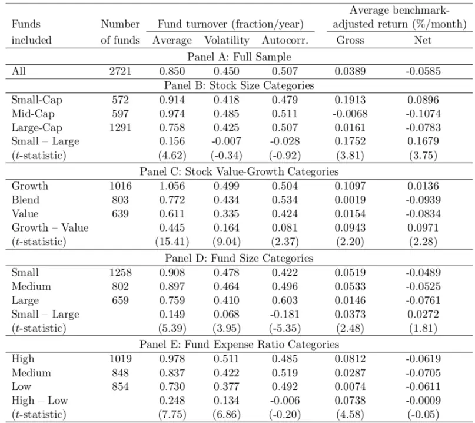
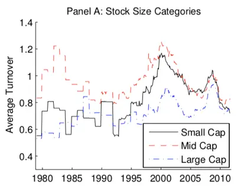
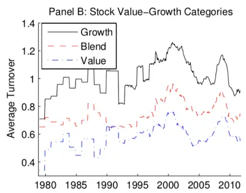
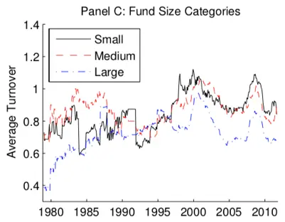
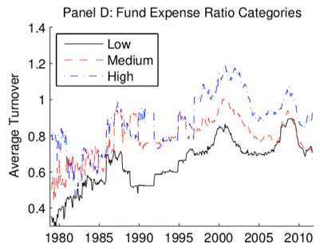
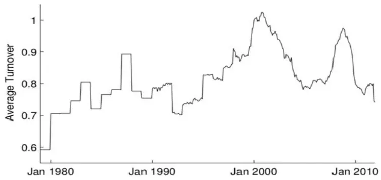
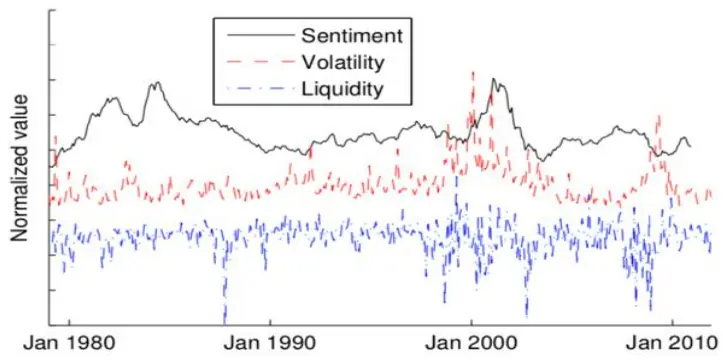

nInfo] [Table_Title] 2021.12.27

# 剖析基金换手与基金回报

## ——学界纵横系列之三十三

陈奥林(分析师)

## 杨能(分析师)

8 021-38674835

021-38032685

chenaolin@gtjas.com

证书编号 S0880516100001

yangneng@gtjas.com

S0880519080008

## 本报告导读：

文章预测主动管理型基金的换手率和回报率在时序上呈正相关性。

## 摘要：

le_Summary]Ľ Pástor, RF Stambaugh 和 LA Taylor 合作的《Do Funds Make MoreWhen They Trade More?》研究了基金换手率与基金回报率之间的关系，对基金投资具有参考价值。

主动型基金的换手率与该基金（基准调整后）回报率之间存在正相关性，且基金换手率与回报率之间的时间序列相关性比截面相关性更为显著。

- 换手率和回报率的正相关性在小盘股基金、小型基金、高费率基金中更显著。

不同基金之间的换手率存在同步性，即换手率同涨同跌现象。平均换手率与衡量错误定价的指标呈正相关关系。当投资者情绪高涨、股市横向波动较大、股市流动性较低时，错误定价更加频繁，因为在错误定价频繁的时期，基金经理更有可能发现获利机会，此时基金换手率会同时升高。

在做基金配置时，高换手基金表现好于低换手基金，但此正相关性不够显著，学界横截面相关性是否存在争议较大；但如果一个基金的换手率大幅下降，则表明其未来表现可能跑输其他同类基金，此时可以考虑对基金进行减仓，反之可以考虑加仓。换言之，基于基金换手率与基金回报率时序上的相关性，我们可以对单只基金进行择时。

风险提示：本文模型基于量化方法构建，结论部分基于海外历史数据统计得到，未来存在失效风险。

金融工程

## 金融工程团队：

陈奥林：（分析师）

电话：021-38674835

邮箱：chenaolin@gtjas.com

证书编号：S0880516100001

## 杨能：（分析师）

电话：021-38032685

邮箱：yangneng@gtjas.com

证书编号：S0880519080008

## 殷钦怡：（分析师）

电话：021-38675855

邮箱：yinqinyi@gtjas.com

证书编号：S0880519080013

## 徐忠亚：（分析师）

电话：021- 38032692

邮箱：xuzhongya@gtjas.com

证书编号：S0880519090002

## 刘昺轶：（分析师）

电话：021-38677309邮箱：liubingyi@gtjas.com证书编号：S0880520050001

## 赵展成：（研究助理）

电话：021-38676911邮箱：Zhaozhancheng@gtjas.com证书编号：S0880120110019

## 张烨垲：（研究助理）

电话：021-38038427

邮箱：zhangyekai@gtjas.com

证书编号：S0880121070118

## 徐浩天：（研究助理）

电话：021-38038430

邮箱：xuhaotian@gtjas.com

证书编号：S0880121070119

## [Table_Re相关报告

基于 夏 普 比 最 大 化 的 组 合 优 化 模 型2021.12.03

基于持仓变动与业绩表现的主动管理能力评价 2021.12.01

机器学 习算法 在 A 股 市场中 的应 用2021.12.01

基于目标投资期限的风险偏好择时策略2021.11.28

集成了机器学习的投资组合再平衡框架 2021.11.27

## 1. 选题背景

许多研究主动型基金获利机会的海外文献表明主动型基金的回报率不及经基准调整后被动型基金的回报率。主动管理型基金的基金经理能否发现市场的获利机会？基金的回报率与基金其他特征有什么相关性？

本篇报告推荐的学术文章是由 Ľ Pástor, RF Stambaugh 和 LA Taylor 合作的《Do Funds Make More When They Trade More?》，文章解释了主动型基金的换手率与该基金（基准调整后）回报率之间的正相关性，并且利用不同基金换手率之间存在的同步性预测基金的回报率。

## 2. 核心结论

文章的结论主要分为两个部分，包括基金换手率和回报率之间存在的正相关关系以及不同基金换手率之间存在同步性。

文章在大量主动管理型基金样本中发现了换手率和回报率的正相关性。基金的换手率根据基金经理识别的盈利机会的能力而变化。模型预测换手率与回报率之间的时间序列关系强于横截面关系。此外，包括交易流动性较差股票的基金的时间序列换手率 回报率关系更强；换手率和回报率的正相关关系在小盘股基金与小型基金中更为明显。文章也证明了收费率高基金换手率与回报率的关系统计上显著，因为高收费率往往意味着基金经理能够更敏锐地把握获利时机。

另一方面，文章论证了不同基金换手率之间存在的同步性。基金换手率和与衡量错误定价的指标呈正相关性。当投资者情绪高涨、股票横截面波动率高、股票市场流动性低时，错误定价更加频繁，基金经理更有可能发现获利机会，所以基金的换手率更高。不同基金的换手率存在相关性，且具有相似特的基金换手率的相关性更强。同类基金的平均换手率一定程度上可以预测基金回报率。即使控制基金本身换手率，同类型基金的平均换手率也能预测该基金的回报率。

## 3. 文章背景

Stambaugh (2014)表明主动型管理基金在很大程度上改善了股票交易市场上可能存在的错误定价。Ľ Pástor, RF Stambaugh 和 LA Taylor 合作的《Do Funds Make More When They Trade More?》的研究结果支持了这个观点， 文章表明基金经理拥有捕捉盈利机会的能力，并且在错误定价更加频繁时，基金经理更有机会发挥实现基金盈利的能力，因此有助于改善市场上的错误定价。

文章就基金换手率和衡量错误定价指标之间的关系进行了论证，当投资者情绪高涨、股票横截面波动率高、股票市场流动性低时，市场上存在错误定价的可能性越高，基金经理更有可能发现获利机会，因此基金的换手率更高。

## 4. 核心模型

## 4.1. 基础模型

基金 i回报率对换手率的时间序列回归如下：

$$
\mathrm{R_{i,t}=a_{i}+b_{i}X_{i,t-1}+\varepsilon_{i,t}}\tag{1}
$$

其中 $\mathrm{R}_{\mathrm{i,t}}$ 为基金在 t 经基准调整后的回报率， $\mathbf{X}_{\mathrm{i,t-l}}$ 为基金在 t−1 的换手率。如 $\mathbf{b}_{\mathrm{i}}$ 为正，则在 t –1 可以确定收益机会，从而在 t 获得盈利。

文章使用 Ṕastor, Stambaugh, and Taylor(2015) 构建的数据库研究换手率与回报率之间的关系，此数据库包括从 1979 年至 2011 年期间 3126 只美国主动管理型基金的样本。文章按月频率估计所有回归，但基金的换手率仅以财政年度总额的形式公布，因此，文章用 $\mathrm{FundTurn_{i,t-1}}$ 来衡量换手率 $\mathbf{X}_{\mathrm{i,t-l}}$ ，即基金在 t 月之前结束的最近一个财政年度的换手率：

$$
FundTurn_{i,t-1}=\frac{\operatorname*{min}(buys_{i,t-1},sells_{i,t-1})}{avg(TNA_{i,t-1})}\tag{2}
$$

分子取基金在 t 月结束前最近财政年度买入卖出总量的较小值，分母为基金在相同的 12 个月期间的平均总资产净值。这种衡量方式是向 SEC报告是采用的换手率衡量方法，也是 CRSP 提供的衡量方式。之后会介绍关于这种换手率测量方法的性质。

结合所有基金数据，文章进行了在公式（3）限制下的面板回归，如下：

$$
b_{1}=b_{2}=\cdots=b\tag{3}
$$

## 4.2. 时间序列和横截面估计

表 1 展示了在不同固定效应下公式 （1）中换手率的估计斜率系数 b。结合方程(1)和(3)，得到：

$$
\mathrm{R}_{\mathrm{i,t}}=\mathrm{a}_{\mathrm{i}}+\mathrm{b}\mathrm{X}_{\mathrm{i,t}-1}+\varepsilon_{\mathrm{i,t}}\tag{4}
$$

表 1 换手率-回报率在截面和时间序列中的关系

| Fund Fixed Effects | Month Fixed Effects |  |
| --- | --- | --- |
|  | No | Yes |
| Yes | 0.00125 | 0.00118 |
| No | (6.67) | (7.08) |
|  | 0.00043 | 0.00039 |
|  | (2.05) | (2.04) |

数据来源：《Do Funds Make More When They Trade More?》

从表 I 中可以得出，基金换手率与回报率之间的时间序列关系比截面关系更为显著。与文章提出的基金经理识别和利用时变获利机会的模型一致，基金的回报率与基金的滞后换后率呈正相关关系。在时间序列和截面回归中，换手率与回报率的关系均为正，这与模型预测的结果一致。此外，基金换手率-回报率的时间序列关系比横截面关系更强。

## 4.3. 结果的稳健型

基金换手率和回报率在时间序列回归中呈正相关性是文章的主要结论，这个结论具有鲁棒性。首先在不同固定效应下，显著性均存在；其次，当使用年度基金收益重新估计换手率与回报率之间的关系时，所得回归系数依然为正并且在统计上显著；最后，文章发现关于基金换手率和回报率之间的正相关性不受基金经理变化的影响，当使用基金经理的固定效应代替基金的固定效应时，结果相似。

除此之外，文章的回归证据基于完整样本，文章同样进行了样本外分析，发现即使使用样本外信息，基金换手率也有助于预测基金回报率。

## 5. 不同基金换手率和回报率相关性的差异

文章按照四个特征划分基金: 基金规模、费用比率和两种常见的风格分类——大小盘与价值成长风格。

表 2 : 换手率和回报率相关性的差异

| Panel A: Stock Size Categories |  |  |  |  |
| --- | --- | --- | --- | --- |
| Small Cap | Mid Cap | Large Cap | Small - Large | Controls |
| 0.00302 (7.60) 0.00171 | 0.00114 (3.38) 0.00014 | 0.00100 (4.17) 0.00025 (0.85) | 0.00202 (4.49) 0.00145 (3.17) | No Yes |
| (3.57) (0.35) Panel B: Stock Value-Growth Categories |  |  |  |  |
| Growth | Blend | Value | Growth-Value | Controls |
| 0.00155 (5.61) 0.00062 (1.56) | 0.00111 (4.85) 0.00014 (0.35) | 0.00184 (4.35) 0.00077 (1.42) | -0.00029 (-0.54) -0.00016 (-0.29) | No Yes |
| Panel C: Fund Size Categories |  |  |  |  |
| Small 0.00195 | Medium 0.00089 | Large 0.00037 | Small-Large 0.00158 | Controls No |
| (7.86) 0.00113 (2.76) | (4.12) 0.00014 (0.35) | (1.24) -0.00025 (-0.59) | (4.51) 0.00138 (3.49) | Yes |
| Panel D: Fund Expense Ratio Categories |  |  |  |  |
| High 0.00161 | Medium 0.00099 | Low 0.00077 | High-Low 0.00084 | Controls No |
| (6.02) 0.00065 (1.47) | (5.02) 0.00014 (0.35) | (3.60) 0.00003 (0.08) | (3.09) 0.00062 (2.05) | Yes |

数据来源：《Do Funds Make More When They Trade More?》

表 2 的 A 至 D 展示了不同类型基金换手率的斜率大小。每部分包括两组回归分析。第一组是没有额外控制变量基于公式（3）)的回归。第二组回归分析在公式（3）的基础上包括类型哑变量以及哑变量和换手率滞后项的交互项。

表 2 显示，在 12 个基于公式（3）无其他控制变量的回归中，11 个回归结果为统计显著的换手率和回报率正相关关系。小盘股基金的换手率斜率明显大于大盘股基金的换手率斜率（A组），小型基金比大型基金(C组)的换手率斜率高，高收费基金比低收费基金（D 组）的斜率要高。

## 5.1. 小盘股基金的换手率与收益率相关性更高

如果基金的交易成本较高，则当盈利机会变化时，基金换手率调整相对较小。因此，任何换手率的变化通常伴随着更大的盈利机会和基金表现的变化。一般情况下，小盘股的流动性不如大盘股，因此小盘股基金的交易成本更高。从表3 可以看出，小盘股基金的换手率自相关性小于大盘股基金。较高的交易成本和较低的换手率持久性使得小盘股基金更有可能有较高的换手率-回报率斜率。表 2 证实小盘股基金的换手率的估计斜率更高。

表 3 不同基金类别的换手率以及业绩

数据来源：《Do Funds Make More When They Trade More?》

## 5.2. 小型基金的换手率与收益率相关性更高

由于小型基金的交易金额较小，因此与大型基金相比，更适合交易流动性较差的股票。股票规模是一个不完美的流动性衡量指标，因此基金规模也有助于反映基金所持资产的流动性。同样股票规模下，小型基金的交易成本也可能大于大型基金。另外，由表 可知小型基金换手率的自相关性显著低于大型基金换手率。因此，与小盘股基金一样，拥有较高交易成本和较低的换手率持久性使得小型基金更有可能拥有较高的换手率-回报率斜率。

## 5.3. 价值基金与成长型基金、以及不同费用比率的基金

根据表 2 板块 B，价值型基金与成长型基金在换手率-回报率斜率上没有显著差异。虽然表 3 中成长型基金的换手率比价值型基金的换手率具有更高的自相关性，但是 Edelen、Evans 和 Kadlec (2013) 提到价值型基金和成长型基金的交易成本相近。

表 板块 表明基金换手率斜率的差异与费用比率有关。如果基金的盈利性越强，换手率与回报率的关系就越强。费用比率与管理费比率密切相关，管理费比率可以代表基金的盈利性。在既定的基金规模下，费用收入与费用比例成正比，捕捉盈利机会能力越强的基金经理获得更多的费用收入。除了费用，文章考虑了另外两个基金盈利性指标；第一个是基金的总 alpha 值，第二个指标是文章根据 Ṕastor, Stambaugh, andTaylor(2015)计算了基金和行业水平按规模回报调整后的总 alpha。对于这两个指标， 文章结论为与低盈利基金相比，高盈利基金换手率和回报率之间的关系更强。

表 3 中 A、B、C、D 每组中第一个回归的平均总收益和换手率都显著大于第二个回归。回归结果和关于对换手率-绩回报率关系预测的一致。此外，在表 2 中的三组回归中，第一组回归换手率-回报率斜率明显大于第二组回归。

## 6. 基金换手率之间的同步性

## 6.1. 不同基金换手率的同步性

文章指出基金换手率的时间变化是由基金盈利机会的变化所驱动的。这些盈利机会可能在不同基金之间有关联。任何定价错误的股票都给许多不同的基金提供了获利机会，因为这些基金有可能交易同一只股票。此外，如果错误定价是市场方面的原因，如流动性中断或投资者情绪变化，许多股票可能同时被错误定价。如果各个基金的盈利机会相互关联的，那么基于一组基金就可以预测其他基金换手率的变化。

要想研究不同基金换手率变化的同步性是否存在，文章基于类别计算基金换手率的平均值。基金类别与前文一致。针对每个类别，文章计算该类别中所有基金的平均换手率。图 1 为 1979 年至 2011 年每类基金换手率的时间序列。

图 1 每类基金的平均换手率

数据来源：《Do Funds Make More When They TradeMore?》

从图 1 中可以看到不同基金换手率的高度同步性。平均换手率的时间序列在四个 panel内和 panel之间都高度相关。例如，小盘股和大盘股基金平均换手率之间的关联度为 67%，价值基金和成长型基金(面板 B)、小型和大型基金(面板 C)以及高费用和低费用基金(面板 D)之间的平均换手率同样具有高度相关性。表 4 表明盈利机会在不同的基金之间呈正相关性，即使基金的特征不同。

表 4 不同基金类别平均换手率的相关性

| Stock Size | S | M | L | Stock Value-Growth | G | B | V |
| --- | --- | --- | --- | --- | --- | --- | --- |
| Small | 1.00 |  |  | Growth | 1.00 |  |  |
| Mid | 0.59 | 1.00 |  | Blend | 0.76 | 1.00 |  |
| Large | 0.67 | 0.18 | 1.00 | Value | 0.80 | 0.62 | 1.00 |
| Fund Size | S | M | L | Fund Expense Ratio | L | M | H |
| Small | 1.00 |  |  | Low | 1.00 |  |  |
| Medium | 0.54 | 1.00 |  | Medium | 0.76 | 1.00 |  |
| Large | 0.52 | 0.44 | 1.00 | High | 0.74 | 0.74 | 1.00 |

数据来源：《Do Funds Make More When They Trade More?》，国泰君安证券研究

文章不仅计算了每类基金的平均换手率，还计算了所有基金的平均换手率。图 2 第一部分展现了所有基金的平均换手率， 从 1979 年到 2011年，每年在 59%和 102%之间波动。它与每个基金换手率测量的主要指标有 95%的相关性，所以所有基金的平均换手率是衡量换手率测量主要指标最简单的方法。

图 2 平均换手率、情绪指数、波动性和流动性

数据来源：《Do Funds Make More When They Trade More?》

## 6.2. 错误定价和换手率之间的关系

基金在什么时候换手率更高？根据文章中的模型：基金在获利机会更好的时候换手率更高。如果盈利机会是因为错误定价，那么基金应该在错误定价更多的时期换手率更高。那么当错误定价更有可能发生时，基金换手率是否更高？文章使用三个指标来衡量错误定价的可能性:情绪指数、波动性和流动性。

第一个衡量错误定价的变量是情绪指数，具体为 Baker and Wurgler(2006,2007) 提出的投资者情绪指数。如果情绪驱动型投资者在情绪高的时期进行更多交易，那么由这些投资者造成的错误定价更有可能发生在那些时期。因此,文章预测基金经理将利用这种错误定价，在市场人气高涨时进行更多交易。每类基金平均换手率和所有基金平均换手率对情绪指数的时间序列回归都产生了显著的正斜率(统计量分别为 = 3.27和t = 3.17)，如表 5 的(1)和(5)列所示。

表 5 是什么解释了换手率的变化？

|  | Dependent variable: FundTurnit |  |  |  | Dependent variable: AvgTurnt |  |  |  |
| --- | --- | --- | --- | --- | --- | --- | --- | --- |
|  | (1) | (2) | (3) | (4) | (5) | (6) | (7) | (8) |
| Sentimentt | 0.0359 (3.27) |  |  | 0.0232 (2.87) | 0.0531 (3.17) |  |  | 0.0487 (4.65) |
| Volatilityt |  | 0.747 (7.69) |  | 0.540 (5.56) |  | 0.938 (7.23) |  | 0.809 (7.98) |
| Liquidityt |  |  | -0.192 (-4.53) | -0.0869 (-3.88) |  |  | -0.212 (-4.14) | -0.138 (-4.58) |
| Business Cyclet |  |  |  | -0.0122 (-1.84) |  |  |  | -0.00334 (-0.66) |
| Market Returnt |  |  |  | -0.0365 (-1.34) |  |  |  | 0.0171 (0.34) |
| Time Trendt | 0.0000 (0.06) | -0.0001 (-0.53) | -0.0001 (-0.83) | -0.0001 (-0.47) | 0.0006 (5.21) | 0.0004 (3.88) | 0.0005 (3.44) | 0.0005 (5.20) |
| R2 | 0.002 | 0.008 | 0.001 | 0.010 | 0.524 | 0.541 | 0.377 | 0.677 |
| R2 − R2(trend only) Observations | 0.002 263,895 | 0.008 272,413 | 0.001 272,413 | 0.010 263,895 | 0.171 372 | 0.188 382 | 0.024 382 | 0.324 372 |

数据来源：《Do Funds Make More When They Trade More?》

第二个衡量错误定价的变量是波动性，是美国个股在第 个月的收益横截面标准差。波动性越大，股票未来价值的不确定性就越大，因此投资者在评估股票价值时出错的可能性就越大。因此，在高波动性时期存在更大错误定价的可能性，文章预测预测基金经理利用这种错误定价在波动性高时进行更多交易。与这一预测一致，每类基金平均换手率和所有基金平均换手率对波动性的回归都产生了显著的正斜率(统计量分别为= 7.69 和 t = 7.23)，如表 5 的(2)和(6)列所示。

第三个衡量错误定价的变量是流动性。文章采用了 Ṕastor 和Stambaugh(2003)计算股票市场流动性指标的值。数据表明流动性越高意味着市场效率越高。因此，流动性较低的时期更容易出现错误定价。因此，文章预测当流动性较低时，基金经理将抓住盈利机会进行更多交易。另一方面，流动性下降也意味着交易成本上升，这可能会阻碍基金交易。回归结果表明前者的影响更强：每类基金平均换手率和所有基金平均换手率对流动性的回归都产生了显著的负斜率(统计量分别为 = -4.53 和 t$=-4.14)$ ，如表 5 的(3)和(7)列所示。

## 6.3. 预测基金回报率

文章对根据基准调整后的基金回报率 $\left(\operatorname{R}_{\mathrm{i,t}}\right)$ 和平均换手率滞后性进行回归，并考虑基金的固定效应。两个衡量基金换手率的指标分别是每类基金平均换手率（ $\mathrm{\ AvgTurnSim{\it_{i,t-1}}}$ ）和所有基金平均换手率 $(\mathrm{\ AvgTurn_{i,t-1}})$

表 6 平均换手率和回报率之间的关系

|  | (1) | (2) | (3) | (4) | (5) | (6) |
| --- | --- | --- | --- | --- | --- | --- |
| $AvgTurnSim_{i,t-1}$ | 0.00210 (3.29) |  |  | 0.00184 (2.76) |  | 0.00158 (2.92) |
| $AvgTurn_{i,t-1}$ |  | 0.00359 (1.52) |  |  | 0.00339 (1.42) | 0.00133 (0.53) |
| $FundTurn_{i,t-1}$ |  |  | 0.00125 (6.67) | 0.00135 (7.30) | 0.00118 (6.88) | 0.00134 (7.54) |
| Observations | 281,406 | 306,897 | 282,738 | 259,234 | 282,738 | 259,234 |

数据来源：《Do Funds Make More When They Trade More?》

表 6 第一列显示， $\operatorname{R}_{\mathrm{i,t}}$ 在 $\mathrm{AvgTurnSim}_{\mathrm{i},\mathrm{t}-1}$ 的回归斜率为正且显著(统计值为 t = 3.29)， 说明同类型基金的平均换手率有助于预测每个基金的回报率。由于同类基金之间换手率存在更高的同步性，因此 $\mathrm{AvgTurnSim}_{\mathrm{i,t-1}}$ 比 $\mathtt{AvgTurn}_{\mathrm{i,t-1}}$ 更好地预测回报率。从表 6 第二列可以看到 $\operatorname{R}_{\mathrm{i,t}}$ 和$\mathtt{AvgTurn}_{\mathrm{i,t-1}}$ 存在正相关关系，但在统计上不显著。

从表 6 中可以得出的核心结论为：基金的回报率可以通过同类基金的平均换手率和该基金的实际换手率进行预测。

## 7. 总结

## 7.1. 原文结论

文章结论与大部分研究主动型基金获利机会的文献不同，认为主动管理型基金可以在一定程度上纠正股票市场上的错误定价。

文章解释了主动型基金的换手率与该基金（基准调整后）回报率之间的正相关性，并且解释了不同基金换手率-回报率关系的差异。另一方面，文章论证了不同基金换手率之间存在的同步性。基金换手率和与衡量错误定价的指标呈正相关性。当投资者情绪高涨、股票横截面波动率高、股票市场流动性低时，基金的换手率更高，因为在错误定价频繁的时期，基金经理更有可能发现获利机会。

## 7.2. 我们的思考

文章对于基金投资有较大的参考的意义。文章结论表明，在做基金选择时，高换手基金表现好于低换手基金，但此正相关性不够显著，学界横截面相关性是否存在争议较大；但是如果一个基金的换手率大幅下降，则表明其未来表现可能跑输其他同类基金，此时可以考虑对基金进行减仓，反之可以考虑加仓。换言之，基于基金换手率与基金回报率时序上的相关性，我们可以对单只基金进行择时。

## 8. 风险提示

本文模型基于量化方法构建，结论部分基于海外历史数据统计得到，未来存在失效风险。

## 本公司具有中国证监会核准的证券投资咨询业务资格

## 分析师声明

作者具有中国证券业协会授予的证券投资咨询执业资格或相当的专业胜任能力，保证报告所采用的数据均来自合规渠道，分析逻辑基于作者的职业理解，本报告清晰准确地反映了作者的研究观点，力求独立、客观和公正，结论不受任何第三方的授意或影响，特此声明。

## 免责声明

本报告仅供国泰君安证券股份有限公司（以下简称“本公司”）的客户使用。本公司不会因接收人收到本报告而视其为本公司的当然客户。本报告仅在相关法律许可的情况下发放，并仅为提供信息而发放，概不构成任何广告。

本报告的信息来源于已公开的资料，本公司对该等信息的准确性、完整性或可靠性不作任何保证。本报告所载的资料、意见及推测仅反映本公司于发布本报告当日的判断，本报告所指的证券或投资标的的价格、价值及投资收入可升可跌。过往表现不应作为日后的表现依据。在不同时期，本公司可发出与本报告所载资料、意见及推测不一致的报告。本公司不保证本报告所含信息保持在最新状态。同时，本公司对本报告所含信息可在不发出通知的情形下做出修改，投资者应当自行关注相应的更新或修改。

本报告中所指的投资及服务可能不适合个别客户，不构成客户私人咨询建议。在任何情况下，本报告中的信息或所表述的意见均不构成对任何人的投资建议。在任何情况下，本公司、本公司员工或者关联机构不承诺投资者一定获利，不与投资者分享投资收益，也不对任何人因使用本报告中的任何内容所引致的任何损失负任何责任。投资者务必注意，其据此做出的任何投资决策与本公司、本公司员工或者关联机构无关。

本公司利用信息隔离墙控制内部一个或多个领域、部门或关联机构之间的信息流动。因此，投资者应注意，在法律许可的情况下，本公司及其所属关联机构可能会持有报告中提到的公司所发行的证券或期权并进行证券或期权交易，也可能为这些公司提供或者争取提供投资银行、财务顾问或者金融产品等相关服务。在法律许可的情况下，本公司的员工可能担任本报告所提到的公司的董事。

市场有风险，投资需谨慎。投资者不应将本报告作为作出投资决策的唯一参考因素，亦不应认为本报告可以取代自己的判断。
在决定投资前，如有需要，投资者务必向专业人士咨询并谨慎决策。

本报告版权仅为本公司所有，未经书面许可，任何机构和个人不得以任何形式翻版、复制、发表或引用。如征得本公司同意进行引用、刊发的，需在允许的范围内使用，并注明出处为“国泰君安证券研究”，且不得对本报告进行任何有悖原意的引用、删节和修改。

若本公司以外的其他机构（以下简称“该机构”）发送本报告，则由该机构独自为此发送行为负责。通过此途径获得本报告的投资者应自行联系该机构以要求获悉更详细信息或进而交易本报告中提及的证券。本报告不构成本公司向该机构之客户提供的投资建议，本公司、本公司员工或者关联机构亦不为该机构之客户因使用本报告或报告所载内容引起的任何损失承担任何责任。

## 评级说明

## 1.投资建议的比较标准

投资评级分为股票评级和行业评级。以报告发布后的 12 个月内的市场表现为比较标准，报告发布日后的 12 个月内的公司股价（或行业指数）的涨跌幅相对同期的沪深 300 指数涨跌幅为基准。

## 2.投资建议的评级标准

报告发布日后的 12 个月内的公司股价（或行业指数）的涨跌幅相对同期的沪深300 指数的涨跌幅。

| 评级 |  | 说明 |
| --- | --- | --- |
| 股票投资评级 | 增持 | 相对沪深 300 指数涨幅 15%以上 |
|  | 谨慎增持 | 相对沪深 300指数涨幅介于 5%～15%之间 |
|  | 中性 | 相对沪深300指数涨幅介于-5%～5% |
|  | 减持 | 相对沪深300 指数下跌 5%以上 |
| 行业投资评级 | 增持 | 明显强于沪深 300 指数 |
|  | 中性 | 基本与沪深 300指数持平 |
|  | 减持 | 明显弱于沪深300指数 |

## 国泰君安证券研究所

|  | 上海 | 深圳 | 北京 |
| --- | --- | --- | --- |
| 地址 | 上海市静安区新闸路669 号博华广 场20层 | 深圳市福田区益田路6009号新世界 商务中心34层 | 北京市西城区金融大街甲9号金融 街中心南楼18层 |
| 邮编 | 200041 | 518026 | 100032 |
| 电话 | （021）38676666 | （0755）23976888 | (010)83939888 |
|  | E-mail: gtjaresearch@gtjas.com |  |  |