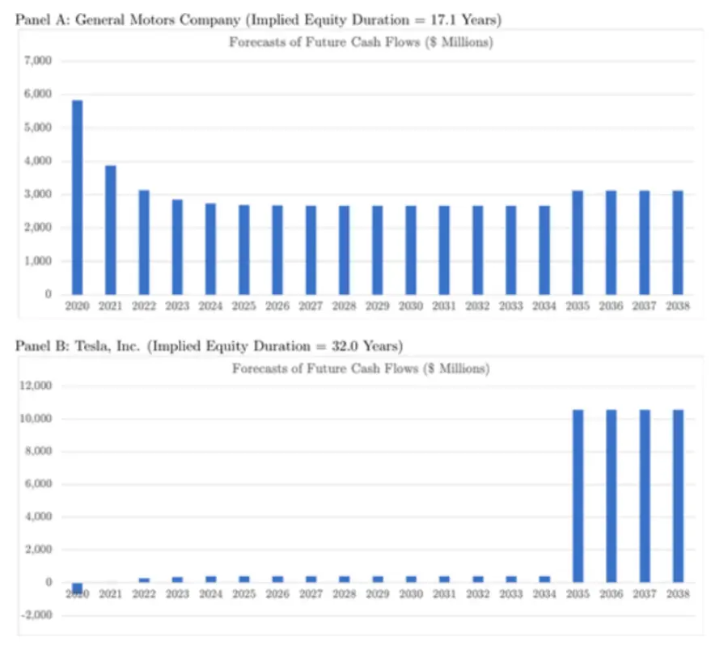
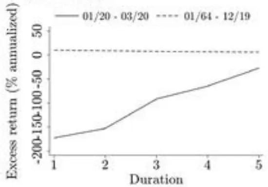
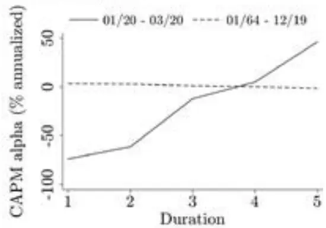
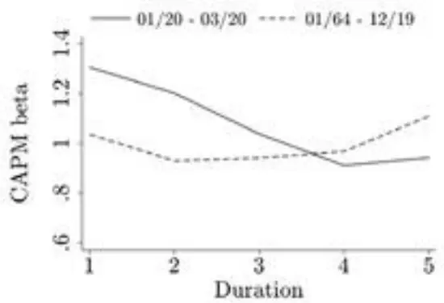
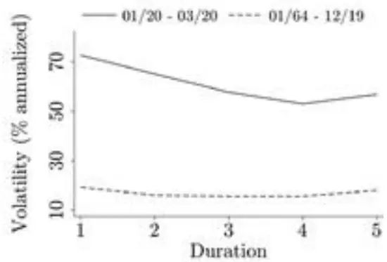
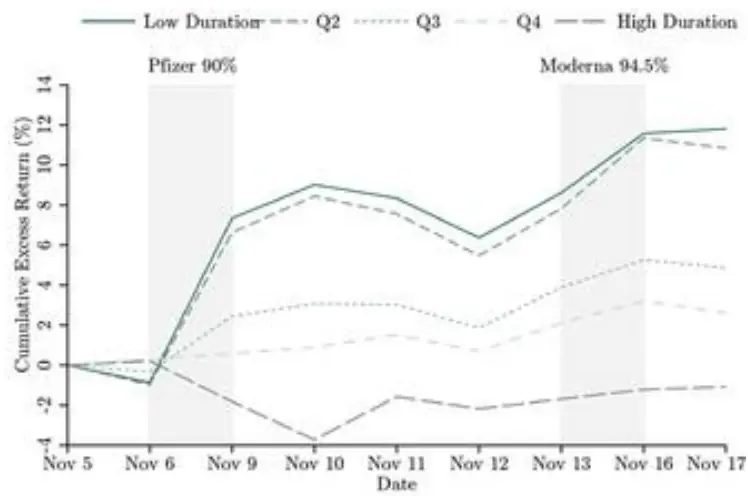
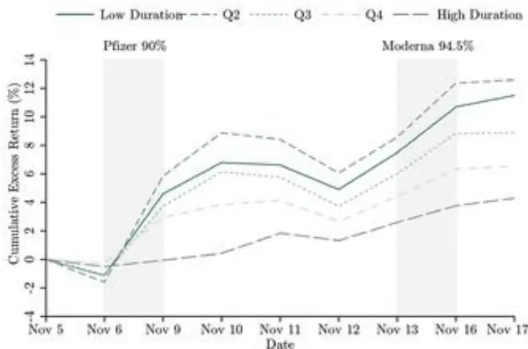
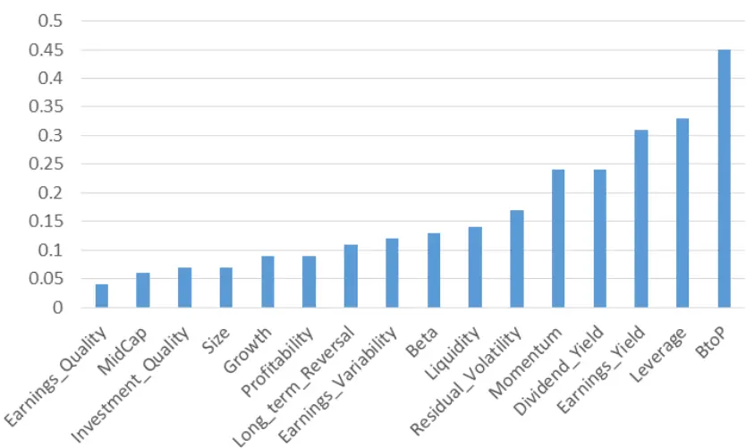
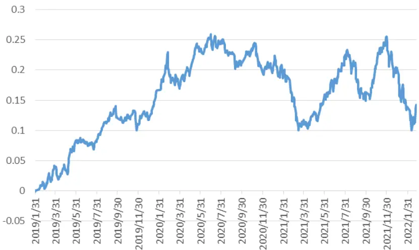

nInfo] [Table_Title] 2022.02.28

# 突发宏观利空下的风格切换

## ——学界纵横系列之三十五

陈奥林(分析师)

## 杨能(分析师)

8 021-38674835

021-38032685

chenaolin@gtjas.com

证书编号 S0880516100001

yangneng@gtjas.com

S0880519080008

## 本报告导读：

本篇报告从美股疫情冲击的历史经验探讨突发暂时性宏观利空利好何种风格。

## 摘要：

le_Summary] 从美股疫情冲击经验来看，短期宏观利空利好高久期风格。在疫情初期买入高久期股票、卖出低久期股票，可产生超过 36%的多空收益，但当疫苗研发突破性进展公布后，情况开始反转，低久期公司开始跑赢于高久期公司，2020 年 11 以来，低久期公司跑赢高久期约 12%。

价值风格为表象，久期风格为内因。价值风格和久期风格存在显著的负相关性，研究发现，使用 EP、BP 等价值因子时，分组收益差距没有久期风格大，表明价值风格只是久期风格的代理变量，久期风格是更为本质的市场风格。具体来说，疫情期间，基于久期指标的年化超额收益为 145%，而基于 EP 价值因子的年化超额收益为 130%。

A股市场实证结果与美股类似,当前市场仍将呈现高久期风格.从A股实证分析来看,国内久期风格长期多空几乎为零，高久期和低久期间的风格切换十分频繁；与美国市场类似，A 股灾 2020 上半年整体呈现为高久期风格，在下半年疫情缓解后 A 股市场呈现为低久期风格；2022 年 2 月以来高久期风格再度占优。，整体支持短期宏观利空利好高久期风格的结论，在俄乌冲突结束前，市场仍将呈现为高久期风格，应避免踏入低估值陷阱，在俄乌冲突影响逐渐消退后，价值风格有望再次成为市场主导风格。

金融工程

## 金融工程团队：

陈奥林：（分析师）

电话：021-38674835

邮箱：chenaolin@gtjas.com

证书编号：S0880516100001

杨能：（分析师）

电话：021-38032685

邮箱：yangneng@gtjas.com

证书编号：S0880519080008

殷钦怡：（分析师）

电话：021-38675855

邮箱：yinqinyi@gtjas.com

证书编号：S0880519080013

## 徐忠亚：（分析师）

电话：021- 38032692

邮箱：xuzhongya@gtjas.com

证书编号：S0880519090002

## 刘昺轶：（分析师）

电话：021-38677309

邮箱：liubingyi@gtjas.com

证书编号：S0880520050001

## 赵展成：（研究助理）

电话：021-38676911

邮箱：Zhaozhancheng@gtjas.com

证书编号：S0880120110019

## 张烨垲：（研究助理）

电话：021-38038427

邮箱：zhangyekai@gtjas.com

证书编号：S0880121070118

## 徐浩天：（研究助理）

电话：021-38038430

邮箱：xuhaotian@gtjas.com

证书编号：S0880121070119

## [Table_Re相关报告

一种多值相关的深度递归神经网络模型2021.12.30

剖析基金换手与基金回报 2021.12.27

基于 夏 普 比 最 大 化 的 组 合 优 化 模 型2021.12.03

基于持仓变动与业绩表现的主动管理能力评价 2021.12.01

机器学 习算法 在 A 股 市场中 的应 用2021.12.01

## 1. 引言

近日俄乌交战突发事件加剧了 A 股市场的恐慌情绪，但 A 股成长股表现却好于价值股，而美国疫情大爆发期间，价值股同样表现不如成长股。我们该如何理解宏观利空对风格的影响？本篇报告从美股疫情冲击的历史经验探讨突发暂时性宏观利空利好何种风格。主要参考文献为学者Dechow 等联合发表的《Implied Equity Duration: A Measure of PandemicShutdown Risk》，发布期刊为 Journal of Accounting Research。

首先我们给出暂时性宏观利空的定义，我们可以把宏观利空分为暂时利空和长期利空。暂时利空对经济的影响主要集中在未来 2 年内，不会改变投资者对长端现金流的预期，通常暂时利空发生后不久经济会迎来报复式反弹，例如新冠疫情对于美国而言就是暂时性利空，短期疫情控制后，疫苗研发快速完成，市场风格随之切换。

## 2. 核心观点

## 从美股疫情冲击经验来看，短期宏观利空利好高久期风格。

久期是衡量债券利率风险的指标，2004 年 Dechow 等将该指标引入权益市场，他们提出了股票隐含久期的算法。基于该指标，我们能够判断股票的贴现率风险。实际上，权益隐含久期同样也可用于衡量股票对黑天鹅事件的敏感度。即当公司突然出现一则负面消息导致公司短期现金流将大幅减少而长期现金流影响较少，那么如果公司的隐含久期越低，则事件对股票的影响就越大。

作者检验了疫情期间隐含久期对美股价格变化的影响，研究发现如果在疫情初期买入高久期股票、卖出低久期股票，则可产生超过 36%的多空收益，但当疫苗研发突破性进展公布后，情况开始反转，低久期公司开始跑赢于高久期公司，2020 年 11 以来，低久期公司跑赢高久期约 12%。除此之外，作者发现了疫情期间，低久期公司呈现出了更高的波动率和弹性（波动率和贝塔增大）。

低估值溢价是现金流风险溢价。隐含久期的概念同样解释了近年来价值策略的回撤，因为价值策略通常基于历史 PE或者 PB，研究发现，估值指标与久期存在正相关性，即价值股的很大一部分价值来源于近期的现金流 。基 于 Hasler， Marfe(2016) 提出 的 DQR （disasters with quickrecoveries ）模型，金融市场中充满了大量的短时效的外部冲击（例如新冠疫情爆发，不久疫苗上市），短期现金流更容易受到此类事件的冲击，从而承担了更高的风险，因此低估值股存在长期收益更高的异象（valuepremium），低估值溢价本质是风险溢价。

总而言之，在面对造成暂时性影响的黑天鹅事件时，股票久期是极为重要的风格指标。

## 3. 现有研究成果

为了更好地建立新冠疫情发生时股票收益和权益久期之间的联系，作者首先回顾了权益久期和新冠疫情对权益影响的现有研究。

## 3.1. 权益久期现有研究

权益久期概念最早由 2004 年 Dechow, Sloan, and Soliman 提出，其核心难点在于个股未来现金流的估计，大部分学者采用了基本面分析法，通过盈利和业绩增长的自回归模型计算个股权益久期，少部分学者采用了历史股利或者分析师一致预期计算权益久期。《Implied Equity Duration:A Measure of Pandemic Shutdown Risk》采用了经典的基于现金流预测的久期计算公式，将未来现金流分成前 T 期非稳定现金流和 T 期后增长率固定的永续现金流，其计算公式如下：

$$
\begin{array}{rl}&{Duration=\frac{\sum_{t=1}^{\mathrm{T}}t*CF_{t}/(1+r)^{t}}{ME_{0}}+\left(\mathrm{T}+\frac{1+r}{r}\right)*}\\&{\qquad\frac{ME_{0}-\sum_{t=1}^{T}CF_{t}/(1+r)^{t}}{ME_{0}}.}\end{array}
$$

其中，现金流通过 ROE和权益股本进行预测：

$$
CF_{t}=Eamings_{t}-\varDelta BE_{t}=BE_{t-1}\left(ROE_{t}-g_{t}\right),
$$

以同处于汽车行业的通用汽车和特斯拉为例，截止 2019 年年底，由于预期现金流的下降，通用汽车久期仅为 17.1,近期现金流占比高,是低久期风格的代表，而特斯拉虽然 PE 为负，但投资者对未来现金流预期增速较高，因而久期高达 32.0。

图 1 通用汽车和特斯拉现金流预测

数据来源: Implied Equity Duration: A Measure of Pandemic Shutdown Risk

权益久期最重要的研究结论是低久期溢价异象，即高久期股票平均收益低于低久期股。对于这一现象产生的原因，学界存在争议，有些学者认为久期是 ALPHA 因子，收益差异来源于市场的错误定价，而有些认为久期是风险，收益差异来源于承担了不同的风险。例如，Weber（2018）发现，市场情绪越高涨时，久期收益差越大,且其收益无法被Fama，French（2015）的风险因子解释；而 Goncalves（2020）发现久期因子异象来源于低久期股票承担了短期现金流的风险。作者更加认同后者理论，因为短期现金流存在被暂时性宏观利空冲击的风险，高久期股票在这些利空中反而更加安全。

权益久期也被用来更好地了解投资者如何定价违约风险。 Alagarsamy[2019] 发现违约风险较高的公司往往拥有较高的权益久期。因为高违约风险公司的近期现金流更多用于偿还债务，因而高违约风险公司需要相对较长的时间为其股东产生现金流。因而由于低久期溢价现象，高违约风险公司的未来回报低于违约风险低的公司。

## 3.2. 新冠肺炎对权益影响现有研究

新冠肺炎对美国消费者和经济的影响是前所未有的。 Coibion 等 [2020]表明，由新冠肺炎带来的防控对经济状况产生了明显的负面影响，而财政和货币政策的反应几乎没有改善消费者预期。密歇根大学消费者信心指数等指标经历了自全球金融危机爆发以来未见的暴跌。此外，截至

2020 年 4 月 30 日，美国的失业率达到创纪录的 2300 万。许多公司的销售额，尤其是餐厅、酒吧、航空旅行和酒店业务的公司的销售额急剧下降。Hassan 等人使用文本分析发现公司主要担忧近期需求的走弱、产能的减少、员工福利发放等问题。Gormsen 和 Koijen [2020] 基于不同到期日的股息期货合约，分析了新冠疫情爆发后投资者对经济的预期，他们发现短期股息预期增长率不断下降，两年合约的股息预期增长率最低，但从第 3 年开始股息预期出现反转，长期合约受到新冠疫情影响较小。

## 4. 美股实证研究

## 4.1. 疫情前后指标相关性比较

由下表可知，权益久期与账面市值比（BP）和盈利收益率（EP）呈强负相关，与销售增长呈强正相关，与现有久期理论一致。 权益久期与超额收益的 Pearson 相关性在新冠疫情流行前为负 (-0.01) ，而2020年一季度疫情爆发期时，两者相关性为正 (0.01)。 因此，在“正常”市场条件下，由于更低的风险，高久期股票的未来回报较低，而在疫情爆发期间，高久期股票的未来回报更高。

表 1 久期相关性检验

| Panel B: Correlations (Q1 2020) |  |  |  |  |  |  |  |  |
| --- | --- | --- | --- | --- | --- | --- | --- | --- |
|  | Dur | BE/ME | E/ME | SaleGr | FinLev | OpLev | ME | ExRet |
| Duration | 1.00 | -0.80 | -0.51 | 0.19 | 0.09 | 0.32 | 0.15 | 0.03 |
| Book-to-market | -0.73 | 1.00 | 0.43 | -0.16 | -0.12 | -0.26 | -0.41 | -0.04 |
| Earnings-to-price | -0.54 | 0.54 | 1.00 | 0.03 | -0.00 | -0.25 | -0.16 | -0.04 |
| Sales growth | 0.27 | -0.08 | 0.10 | 1.00 | -0.06 | -0.08 | 0.11 | 0.01 |
| Financial leverage | 0.01 | -0.01 | 0.11 | 0.03 | 1.00 | 0.08 | 0.21 | -0.01 |
| Operating leverage | 0.24 | -0.11 | -0.10 | -0.04 | -0.01 | 1.00 | -0.18 | -0.01 |
| ME ($B) | 0.08 | -0.15 | -0.10 | -0.03 | 0.07 | -0.09 | 1.00 | 0.03 |
| Excess return | 0.01 | -0.01 | -0.02 | 0.00 | -0.01 | 0.01 | 0.00 | 1.00 |

数据来源: Implied Equity Duration: A Measure of Pandemic Shutdown Risk

| Panel C: Correlations (1964–2019) |  |  |  |  |  |  |  |  |
| --- | --- | --- | --- | --- | --- | --- | --- | --- |
|  | Dur | BE/ME | E/ME | SaleGr | FinLev | OpLev | ME | ExRet |
| Duration | 1.00 | -0.86 | -0.60 | 0.28 | -0.09 | 0.17 | 0.27 | -0.00 |
| Book-to-market | -0.81 | 1.00 | 0.56 | -0.16 | 0.12 | -0.15 | -0.37 | 0.00 |
| Earnings-to-price | -0.56 | 0.53 | 1.00 | 0.02 | 0.12 | -0.08 | -0.26 | -0.00 |
| Sales growth | 0.37 | -0.09 | -0.01 | 1.00 | 0.01 | -0.01 | 0.12 | -0.00 |
| Financial leverage | -0.07 | 0.11 | 0.11 | 0.01 | 1.00 | -0.11 | -0.03 | -0.01 |
| Operating leverage | 0.12 | -0.09 | 0.03 | -0.01 | -0.12 | 1.00 | -0.23 | -0.01 |
| ME ($B) | 0.11 | -0.16 | -0.12 | -0.01 | 0.02 | -0.10 | 1.00 | 0.02 |
| Excess return | -0.01 | 0.01 | 0.01 | -0.00 | -0.00 | 0.00 | -0.00 | 1.00 |

数据来源: Implied Equity Duration: A Measure of Pandemic Shutdown Risk

## 4.2. 疫情对不同行业久期的影响

表 2 显示了疫情期间各行业的久期。低久期行业主要集中在能源和金融领域，而高久期行业主要集中在科技和医药领域。 表 2 的最后一列报告了 2020 年第一季度每个行业的平均股票回报率，期间煤炭收益最低 -63.33% ，医疗设备最高位 3.95%。2020 年第一季度平均行业久期与平均行业收益之间的（未列出的）相关性为 0.62。 行业回报可能会受到其他行业层面因素的影响，作者对此做了更为稳健的检验。

表 2 行业久期描述性统计

| Industry | Dur. Mean | Dur. SD | Dur. P25 | Dur. P50 | Dur. P75 | N | 2020 Q1 Return |
| --- | --- | --- | --- | --- | --- | --- | --- |
| Coal | 0.01 | 12.09 | -10.49 | -0.33 | 9.07 | 5 | -63.33 |
| Shipbuilding, Railroad Equipment | 12.69 | 10.63 | 5.18 | 12.69 | 20.21 | 2 | -46.76 |
| Petroleum and Natural Gas | 12.76 | 11.84 | 5.74 | 16.39 | 19.54 | 102 | -61.94 |
| Beer & Liquor | 15.21 | 12.11 | 13.07 | 21.02 | 21.76 | 8 | -17.77 |
| Non-Metallic and Metal Mining | 15.58 | 11.22 | 12.77 | 19.94 | 21.61 | 21 | -39.99 |
| Insurance | 15.85 | 5.97 | 13.6 | 17.43 | 19.57 | 80 | -24.36 |
| Communication | 15.94 | 9.26 | 13.43 | 19.29 | 21.85 | 56 | -24.62 |
| Automobiles and Trucks | 16.08 | 6.92 | 14.94 | 18.53 | 20.31 | 40 | -45.49 |
| Banking | 16.94 | 2.97 | 16.18 | 17.29 | 18.28 | 294 | -36.59 |
| Construction | 17.08 | 5.37 | 15.77 | 18.65 | 20.58 | 34 | -38.26 |
| Steel W orks Etc | 17.16 | 4.57 | 16.92 | 18.38 | 20.11 | 28 | -38.53 |
| Real Estate | 17.23 | 5.68 | 14.86 | 19.3 | 20.97 | 26 | -34.58 |
| Textiles | 17.35 | 3.24 | 16.35 | 17.55 | 19.4 | 8 | -38.06 |
| Business Supplies | 17.37 | 8.05 | 18.73 | 19.81 | 20.88 | 18 | -33.88 |
| Trading | 17.46 | 7.21 | 15.77 | 18.31 | 21.46 | 111 | -29.56 |
| Chemicals | 17.75 | 7.58 | 16.91 | 19.8 | 22.21 | 53 | -35.13 |
| Apparel | 17.76 | 7.96 | 17.09 | 19.46 | 21.99 | 21 | -43.60 |
| Retail | 18.02 | 6.79 | 15.95 | 19.33 | 22.16 | 119 | -34.66 |
| Wholesale | 18.08 | 5 | 16.11 | 19.48 | 21.31 | 99 | -33.53 |
| Fabricated Products | 18.26 | 5.26 | 16.56 | 19.92 | 20.71 | 7 | -46.15 |
| Transportation | 18.3 | 6.12 | 15.51 | 19.72 | 21.2 | 50 | -33.26 |
| Entertainment | 18.67 | 6.92 | 18.47 | 21.11 | 22.64 | 21 | -44.68 |
| Restaurants, Hotels, Motels | 18.89 | 5.41 | 16 | 20.6 | 22.54 | 35 | -50.35 |
| Printing & Publishing | 19.1 | 3.26 | 17.88 | 19.22 | 22.27 | 18 | -39.99 |
| Machinery | 19.29 | 5.72 | 18.69 | 20.78 | 21.93 | 82 | -34.63 |
| Aircraft | 19.34 | 3.74 | 16.76 | 21.15 | 21.46 | 12 | -43.70 |
| Construction Materials | 19.34 | 6.18 | 19.1 | 20.92 | 21.57 | 35 | -35.27 |
| Consumer Goods | 19.66 | 4.92 | 16.36 | 20.42 | 22.16 | 32 | -36.51 |
| Utilities | 19.86 | 1.64 | 19.21 | 20.08 | 20.84 | 70 | -17.99 |

| Agriculture | 19.88 | 1.81 | 17.95 20.08 | 20.76 | 6 | -21.71 |
| --- | --- | --- | --- | --- | --- | --- |
| Recreation | 20.1 | 4.89 | 19.39 21.57 | 22.41 | 20 | -33.02 |
| Personal Services | 20.1 | 2.31 | 17.67 20.59 | 21.8 | 23 | -29.50 |
| Electronic Equipment | 20.32 | 5.81 | 19.28 21.41 | 22.42 | 117 | -25.69 |
| Shipping Containers | 20.34 | 3.27 | 16.6 21.14 | 22.67 | 7 | -29.07 |
| Rubber and Plastic Products | 20.51 | 4.42 | 19.44 21.4 | 22.82 | 16 | -24.35 |
| Healthcare | 20.53 | 6.91 | 20.12 21.75 | 22.67 | 32 | -25.46 |
| Electrical Equipment | 20.64 | 6.42 | 18.93 21.3 | 22.72 | 32 | -29.97 |
| Business Services | 20.65 | 5.39 | 19.16 21.24 | 23.04 | 199 | -28.69 |
| Food Products | 20.7 | 4.8 | 18.68 21.05 | 22.45 | 33 | -17.30 |
| Precious Metals | 21.15 | 3.56 | 18.23 20.55 | 24.77 | 6 | -32.38 |
| Defense | 21.17 | 4.13 | 18.48 20.87 | 23.04 | 8 | -5.70 |
| Candy & Soda | 21.26 | 2.51 | 20.9 22.47 | 22.81 | 10 | -17.19 |
| Measuring and Control Equipment | 21.27 | 3.12 | 19.95 21.97 | 22.91 | 43 | -24.10 |
| Computer Hardware | 21.42 | 3.44 | 20.55 22.24 | 23.71 | 32 | -29.21 |
| Other | 21.54 | 7.39 | 18.6 22.49 | 24.41 | 568 | -27.25 |
| Pharmaceutical Products | 21.76 | 6.81 | 19.63 22.62 | 24.52 | 113 | -9.37 |
| Medical Equipment | 21.82 | 5.2 | 21.14 22.42 | 23.49 | 74 | 3.95 |
| Tobacco Products | 21.93 | 1.45 | 20.36 22.21 | 23.21 | 3 | -37.47 |
| Computer Software | 22.17 | 4.76 | 20.97 | 22.8 | 23.79 123 | -19.35 |
| Average FF49 Industry | 18.5 | 5.76 | 16.52 | 19.76 | 21.65 | 60.24 -31.96 |

数据来源: Implied Equity Duration: A Measure of Pandemic Shutdown Risk

## 4.3. 基于久期指标的分组检验

以下四图展示了不同久期分组下在疫情前后的超额收益、CAPM Alpha、CAPM Beta 以及波动率。虚线代表疫情前，实线代表疫情中。从图中可以明显看出，疫情前长期来看，久期和股票收益之间存在微弱的负相关性，但疫情中负相关性转变为了显著的正相关性。由 Panel C 可知，与非疫情期高久期组合贝塔系数最高不同，疫情期间久期最低的组合，贝塔系数最高，这反映了低久期股票对疫情事件更大的敏感性。PanelD 从波动率维度同样佐证了上述结论。

图 2 基于久期的分组检验
Panel A: Excess returns

Panel B: CAPM alphas

Panel C: CAPM betas

Panel D: Volatility

数据来源: Implied Equity Duration: A Measure of Pandemic Shutdown Risk

## 4.4. 久期风格 VS 价值风格

价值风格为表象，久期风格为内因。由 可知，价值风格和久期风格存在显著的负相关性，那么价值风格是否能够代表久期风格？为此，作者对 EP、BP 等价值风格同样做了分组检验，作者发现，使用 EP、BP 等价值因子时，分组收益差距没有久期风格大，表明价值风格只是久期风格的代理变量，久期风格是更为本质的市场风格。具体来说，疫情期间，基于久期指标的年化超额收益为 145%，而基于 EP 价值因子的年化超额收益为 130%。

## 4.5. 疫苗突破性进展后的久期风格的切换

美国于 2020 年 11 月宣布了两次成功疫苗试验，第一次为 11 月 9 日，宣布他们的疫苗在测试中呈现超过 的效力，大超市场预期；随后 Moderna 在 11 月 16 日宣布其疫苗效力超过 94%。受公告影响，原本市场对疫情蔓延至 2022 年的担忧缩短至 2021 年夏。由于对短期经济预期的改善，在 11 月 6 日至 11 月 17 日的八个交易日内，低久期投资组合（市值加权）比高久期投资组合高出 12% 以上，使用等权重时高出超过 7%。这些差异在经济上和统计学上都非常显着。

Panel A: Value-weighted

图 3 疫苗研发突破进展后基于久期的分组累计收益

Panel B: Equal-weighted

数据来源: Implied Equity Duration: A Measure of Pandemic Shutdown Risk

## 5. A股市场暂时性利空下的风格展望

参照文献久期定义，我们计算了 A股个股的久期指标，当前 A股市场平均久期在 50 年左右，相对美国市场更大。

从相关性来看，久期指标与 BP 价值风格较为接近，有 45%的绝对相关性，但不完全等价于价值风格。

图 4 A 股久期相关性检验

数据来源: 国泰君安证券研究

从分组收益来看，久期风格长期多空几乎为零，高久期和低久期间的风格切换十分频繁，表明久期是 A股市场十分重要的风格因子；与美国市场类似，A股灾 2020 上半年整体呈现为高久期风格，在下半年疫情缓解后 A股市场呈现为低久期风格；2022 年 2月以来高久期风格再度占优。

图 5 2019 年以来 A 股久期风格累计多空收益

数据来源: 国泰君安证券研究

从 股实证分析来看，整体支持短期宏观利空利好高久期风格的结论，在俄乌冲突结束前，市场仍将呈现为高久期风格，应避免踏入低估值陷阱，在俄乌冲突影响逐渐消退后，价值风格有望再次成为市场主导风格。

## 本公司具有中国证监会核准的证券投资咨询业务资格

## 分析师声明

作者具有中国证券业协会授予的证券投资咨询执业资格或相当的专业胜任能力，保证报告所采用的数据均来自合规渠道，分析逻辑基于作者的职业理解，本报告清晰准确地反映了作者的研究观点，力求独立、客观和公正，结论不受任何第三方的授意或影响，特此声明。

## 免责声明

本报告仅供国泰君安证券股份有限公司（以下简称“本公司”）的客户使用。本公司不会因接收人收到本报告而视其为本公司的当然客户。本报告仅在相关法律许可的情况下发放，并仅为提供信息而发放，概不构成任何广告。

本报告的信息来源于已公开的资料，本公司对该等信息的准确性、完整性或可靠性不作任何保证。本报告所载的资料、意见及推测仅反映本公司于发布本报告当日的判断，本报告所指的证券或投资标的的价格、价值及投资收入可升可跌。过往表现不应作为日后的表现依据。在不同时期，本公司可发出与本报告所载资料、意见及推测不一致的报告。本公司不保证本报告所含信息保持在最新状态。同时，本公司对本报告所含信息可在不发出通知的情形下做出修改，投资者应当自行关注相应的更新或修改。

本报告中所指的投资及服务可能不适合个别客户，不构成客户私人咨询建议。在任何情况下，本报告中的信息或所表述的意见均不构成对任何人的投资建议。在任何情况下，本公司、本公司员工或者关联机构不承诺投资者一定获利，不与投资者分享投资收益，也不对任何人因使用本报告中的任何内容所引致的任何损失负任何责任。投资者务必注意，其据此做出的任何投资决策与本公司、本公司员工或者关联机构无关。

本公司利用信息隔离墙控制内部一个或多个领域、部门或关联机构之间的信息流动。因此，投资者应注意，在法律许可的情况下，本公司及其所属关联机构可能会持有报告中提到的公司所发行的证券或期权并进行证券或期权交易，也可能为这些公司提供或者争取提供投资银行、财务顾问或者金融产品等相关服务。在法律许可的情况下，本公司的员工可能担任本报告所提到的公司的董事。

市场有风险，投资需谨慎。投资者不应将本报告作为作出投资决策的唯一参考因素，亦不应认为本报告可以取代自己的判断。
在决定投资前，如有需要，投资者务必向专业人士咨询并谨慎决策。

本报告版权仅为本公司所有，未经书面许可，任何机构和个人不得以任何形式翻版、复制、发表或引用。如征得本公司同意进行引用、刊发的，需在允许的范围内使用，并注明出处为“国泰君安证券研究”，且不得对本报告进行任何有悖原意的引用、删节和修改。

若本公司以外的其他机构（以下简称“该机构”）发送本报告，则由该机构独自为此发送行为负责。通过此途径获得本报告的投资者应自行联系该机构以要求获悉更详细信息或进而交易本报告中提及的证券。本报告不构成本公司向该机构之客户提供的投资建议，本公司、本公司员工或者关联机构亦不为该机构之客户因使用本报告或报告所载内容引起的任何损失承担任何责任。

## 评级说明

## 1.投资建议的比较标准

投资评级分为股票评级和行业评级。以报告发布后的 12 个月内的市场表现为比较标准，报告发布日后的 12 个月内的公司股价（或行业指数）的涨跌幅相对同期的沪深 300 指数涨跌幅为基准。

## 2.投资建议的评级标准

报告发布日后的 12 个月内的公司股价（或行业指数）的涨跌幅相对同期的沪深300 指数的涨跌幅。

| 评级 |  | 说明 |
| --- | --- | --- |
| 股票投资评级 | 增持 | 相对沪深 300 指数涨幅 15%以上 |
|  | 谨慎增持 | 相对沪深300指数涨幅介于5%～15%之间 |
|  | 中性 | 相对沪深300指数涨幅介于-5%～5% |
|  | 减持 | 相对沪深300 指数下跌 5%以上 |
| 行业投资评级 | 增持 | 明显强于沪深 300 指数 |
|  | 中性 | 基本与沪深 300 指数持平 |
|  | 减持 | 明显弱于沪深300指数 |

## 国泰君安证券研究所

|  | 上海 | 深圳 | 北京 |
| --- | --- | --- | --- |
| 地址 | 上海市静安区新闸路669 号博华广 场20层 | 深圳市福田区益田路6009号新世界 商务中心34层 | 北京市西城区金融大街甲9号金融 街中心南楼18层 |
| 邮编 | 200041 | 518026 | 100032 |
| 电话 | （021）38676666 | （0755）23976888 | (010)83939888 |
|  | E-mail: gtjaresearch@gtjas.com |  |  |