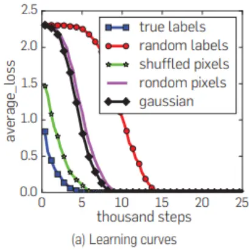
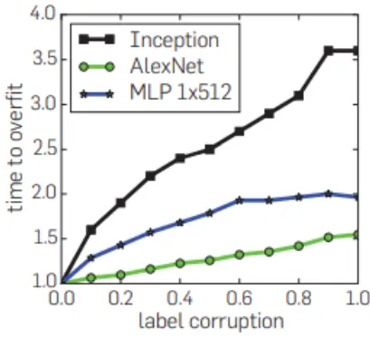
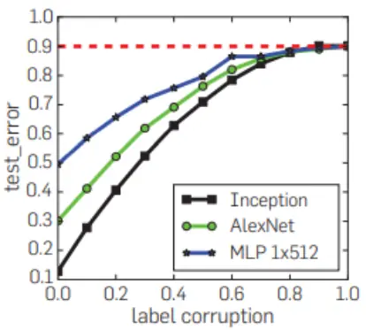
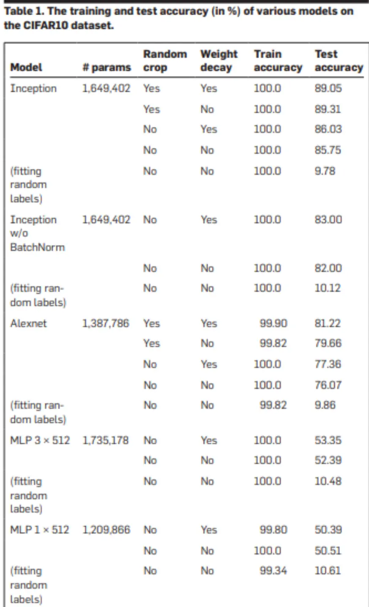
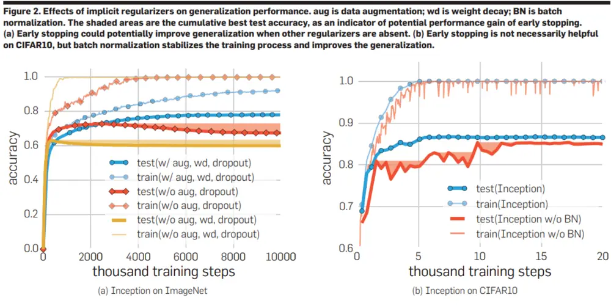

nInfo] [Table_Title] 2022.03.29

# 重新思考深度学习的泛化能力

## ——学界纵横系列之三十六

陈奥林(分析师)

## 刘昺轶(分析师)

8 021-38674835

021-38677309

chenaolin@gtjas.com

liubingyi@gtjas.com

证书编号 S0880516100001

S0880520050001

## 本报告导读：

深度学习模型下，过拟合并不是风险。正则化对泛化能力提升有限，也并非关键因素，这与传统泛化理论的结论有所冲突。

## [Table_Summar• 核心观点

- 目前深度神经网络的有效容量足够记住所有训练数据；

即使是完全随机化的标签，神经网路依旧能完成优化收敛，只增加了常数级别的训练时间。

- 通过单独随机化标签，我们可以在不改变模型、模型容量、超参数或优化器的情况下强制模型的泛化误差大幅上升。

显式正则化可以一定程度上提高泛化性能，但对于泛化误差的控制既不是必要的，也不是足够的。

- 即使线性大小，深度为 2 的神经网络已经可以表示所有的训练数据。

深度神经网络确实记住了大量的数据，它的泛化能力归因于：记忆+规律。即深度神经网络在暴力记忆的过程中或许优先学习到了规律，这种规律的提取保证了一定的泛化能力。

金融工程

## 金融工程团队：

陈奥林：（分析师）

电话：021-38674835

邮箱：chenaolin@gtjas.com

证书编号：S0880516100001

杨能：（分析师）

电话：021-38032685

邮箱：yangneng@gtjas.com

证书编号：S0880519080008

## 殷钦怡：（分析师）

电话：021-38675855

邮箱：yinqinyi@gtjas.com

证书编号：S0880519080013

## 徐忠亚：（分析师）

电话：021- 38032692

邮箱：xuzhongya@gtjas.com

证书编号：S0880519090002

## 刘昺轶：（分析师）

电话：021-38677309

邮箱：liubingyi@gtjas.com

证书编号：S0880520050001

## 赵展成：（研究助理）

电话：021-38676911

邮箱：Zhaozhancheng@gtjas.com

证书编号：S0880120110019

## 张烨垲：（研究助理）

电话：021-38038427

邮箱：zhangyekai@gtjas.com

证书编号：S0880121070118

## 徐浩天：（研究助理）

电话：021-38038430

邮箱：xuhaotian@gtjas.com

证书编号：S0880121070119

## [Table_Re相关报告

突发宏观利空下的风格切换 2022.02.28

一种多值相关的深度递归神经网络模型2021.12.30

剖析基金换手与基金回报 2021.12.27

基于 夏 普 比 最 大 化 的 组 合 优 化 模 型2021.12.03

基于持仓变动与业绩表现的主动管理能力评价 2021.12.01

## 1. 引言

## 何为泛化

从古至今，无论是科学家还是执政者，都试图从历史经验中总结规律并希望运用至未来。

在监督学习领域，这一概念通过传统统计基础被形式化。何为泛化能力？即我们通过样本数据抽取出的模型或规律运用在测试数据上，可以得到相近的结论。

## 为何泛化

这一过程在测试深度学习模型能力中时常被运用，然而为何深度学习模型能保证一定的泛化能力，却始终未得到确切的理论支持。

传统机器学习理论认为泛化能力的核心在于模型复杂度，倾向于认为复杂的模型会降低整体泛化能力。

在量化及投资领域也是如此，如果样本内表现或结论趋于一致，研究员或投资者倾向于使用更为简单的模型或逻辑，即遵循“奥卡姆剃刀”原则。然而深度学习的出现却颠覆了这一经验常识，神经网络的复杂度已远超数据本身，却依旧能获取更好的泛化能力。

## 一些实验

本文的工作偏向于实证，并未提出任何新颖的理论，而是通过一些数据实验试图寻找影响神经网络泛化能力的因素。

## 2. 核心观点

1. 目前深度神经网络的有效容量足够记住所有训练数据；

2. 即使是完全随机化的标签，神经网路依旧能完成优化收敛，只增加了常数级别的训练时间。

3. 通过单独随机化标签，我们可以在不改变模型、模型容量、超参数或优化器的情况下强制模型的泛化误差大幅上升。

4. 显式正则化可以一定程度上提高泛化性能，但对于泛化误差的控制既不是必要的，也不是足够的。

5. 即使线性大小，深度为2的神经网络已经可以表示所有的训练数据。

6. 深度神经网络确实记住了大量的数据，它的泛化能力归因于：记忆+规律。即深度神经网络在暴力记忆的过程中或许优先学习到了规律，这种规律的提取保证了一定的泛化能力。

## 3. 实验实证

## 3.1. 实验数据及模型

实验在两个图像分类数据集上运行，CIFAR10 数据集和 ImageNetILSVRC 2012 数据集。我们在 ImageNet 上测试 Inception V3 架构，在CIFAR10 上测试 Inception、Alexnet 和 MLP 的较小版本。

## 3.2. 随机数据操作

True label：无污染，原始数据

标签污染：

Partially corrupted labels：对每个样本的真实标签以一定概率替换为一个随机类别标签。

Random labels：所有样本的真实标签都替换为随机的类别标签。

样本污染：

Shuffled pixels：随机选择一种像素顺序，以这个顺序重排所有训练和测试样本的像素。

Random pixels：对每个样本各随机应用一种像素顺序。

Gaussian：对每一个样本，用和原样本一样均值和方差的高斯分布随机生成随机的图片。

图 1 随机标签及样本测试
Figure 1. Fitting random labels and random pixels on CIFAR10, (a) The training loss of various experiment settings decaving with the training steps. (b) The relative convergence time with different label corruption ratio. (c) The test error (also the generalization error since training error is 0) under different label corruptions.

(b) Convergence slowdown

(c) Generalization error growth
数据来源：《Understanding Deep Learning (Still) Requires Rethinking Generalization》

通过随机变换样本及标签，作者得到已下结论。

从图 a 中我们可以发现，不管对数据进行如何操作（污染标签或是样本，或是生成完全随机的样本），神经网络最后均能将训练误差降到 0，区别只是需要的轮数不同。

通过图我们可以发现，无论什么网络模型，随着污染的加重，训练所需

时间都随之增加。

通过图 c 可以发现，无论什么网络模型，随着污染的加重，测试集的误差，即泛化误差都在增加。

综上所述，我们可以得到深度神经网络强大的拟合能力的结论，即使是完全随机的标签和数据，均能做到完美拟合。但是与此同时，当标签没有受到污染时，神经网络在完美拟合样本内集合时，仍然保持强大的泛化能力，这一点无法被传统的泛化能力理论所解释。传统泛化能力倾向于认为越复杂的模型越容易过拟合，深度神经网络可以做到完美拟合，按照传统理论应该在样本外表现很差，然而并不是。

## 3.3. 正则化

一般我们认为在模型参数比较多的时候，加入正则是一种比较好的防止过拟合的方法。因为当模型比较复杂的时候，假设空间会变得巨大，而正则帮助我们对假设空间进行了“剪枝”。作者通过实验及相关数学推导得出其并不是控制泛化误差的关键因素的结论。

## 3.3.1. 显式正则化

## Data augmentation

通过特定领域的转换增强训练集。对于图像数据，常用的变换包括随机裁剪、亮度、饱和度、色调和对比度的随机扰动。

## Weight decay

相当于权重上的 l2 正则化；也相当于对欧几里得球的权重进行硬约束，其半径由权重衰减量决定。

## Dropout

以给定的丢弃概率随机屏蔽层输出的每个元素。在我们的实验中，只有ImageNet 的 Inception V3 使用了 dropout。

从下表中我们可以得到已下结论。

1. 显示正则化技术中，数据增广对于泛化能力的提升最为有效。

2. 即使不加任何正则化技术，神经网络在测试集的表现下降很少。

3. 对于泛化误差提升最为明显的是神经网络的自身结构。

图 2 显式正则化对于模型泛化能力的影响

Performance with and without data augmentation and weight decay are compared. The results of fitting random labels are also included.
数据来源：《Understanding Deep Learning (Still) Requires Rethinking Generalization》

## 3.3.2. 隐式正则化

## Early stop

早期停止被证明可以隐式地对一些凸学习问题进行正则化。

## Batch normalization

批量归一化是一种对每个小批量中的层响应进行归一化的算子。它已被许多现代神经网络架构广泛采用，例如 Inception 和 Residual Networks。尽管没有明确设计用于正则化，但通常发现批量标准化可以提高泛化性能。

如下图所示，早停对于泛化能力得影响视数据集而定，某些数据集上，早停不能提供任何得泛化能力提升。批量标准化可以帮助神经网络训练收敛得更为平滑，但是对于最终泛化能力的提升十分有限。

图 3 隐式正则化对于模型泛化能力的影响

数据来源：《Understanding Deep Learning (Still) Requires Rethinking Generalization》

实验结果较多，但文章最后的结论前面已经提及，虽然这些正则方法确实能提高网络的泛化能力，但是正则方法并不是网络有较好泛化能力的关键，因为网络去掉这些正则方法，也能取得一个还不错的结果；同时，网络依靠正则化提高的泛化能力，可能还不如换另一种网络结构提高得多。

## 3.4. 优化方法

尽管出于许多原因，深度神经网络仍然很神秘，但我们在本节中注意到，理解线性模型的泛化来源也不一定容易。事实上，利用线性模型的简单案例来看看是否有平行的见解可以帮助我们更好地理解神经网络是有用的。

假设我们考虑一个 n 个样本，考虑经验风险最小化问题。

$$
\operatorname*{min}_{\boldsymbol{w}\in R^{d}}\frac{1}{n}\sum_{i=1}^{n}loss\left(\boldsymbol{w^{T}}x_{i},y_{i}\right)
$$

其中 $x_{i}$ 为 d 维的特征向量，当时 $d>n$ 我们可以拟合任何标签，那么这样一个模型是否能在没有正则方法的情况下有泛化能力呢？如果令X是一个n ∗d的样本矩阵，秩为n，无论什么样的y，等式X $w=y$有无数种解。我们可以解这个线性系统得到上面经验风险最小问题的一个全局最小。但是是否所有的解都有一样的泛化能力？是否有一个方法能决定某个全局最小解比另一个泛化能力好？

对于线性问题来说，我们可以得到一系列解析解，然而神经网络即使针对线性模型仍然采用梯度下降的方法，常用的优化器如 SGD，Adam。SGD 对参数的更新可以表示为

$$
w_{t+1}=w_{t}-\eta_{t}e_{t}x_{i_{t}}
$$

其中η是步长，e是预测误差。所以如果偏置项为 0 的话，最后的解肯定可以以这个形式表示：

$$
w=\sum_{i=1}^{n}\alpha_{i}x_{i}=X^{T}
$$

如果我们再完全拟合了标签X $w=y$ ，那么可以得到：

$$
XX^{T}{\alpha}=y
$$

这个等式有唯一解。可以注意到，这个等式只依赖于样本之间的点积。当数据少于 10w 时，这个线性系统可以在一个工作站上求解。非常令人惊讶的是，拟合训练标签准确地为凸模型产生了出色的性能这篇论文在MNIST 数据集上求解 $XX^{T}{\mathfrak{a}}=y$ ，得到了 1.2%的测试误差，如果对数据进行小波变化，误差可以降到 0.6%。在 CIFAR10 上，使用了高斯核得到了 46%的测试误差。通过使用具有 32,000 个随机滤波器的随机卷积神经网络进行预处理，测试误差可以降到 17%，如果再加上 l2 正则化，则可以降到15%。作者得到的结论是正则化并不能显著得降低测试误差，而是一些其他手段。

## 4. 总结

全文的核心结论在第二章已经提及，另外作者认为对过参数化模型记忆的深入分析也将我们对过拟合的直觉从传统的 U形风险曲线扩展到“双下降”风险曲线。具体来说，在模型容量大大超过训练集大小的过度参数化机制中，拟合所有训练示例，包括噪声示例，不一定与泛化矛盾。

## 本公司具有中国证监会核准的证券投资咨询业务资格

## 分析师声明

作者具有中国证券业协会授予的证券投资咨询执业资格或相当的专业胜任能力，保证报告所采用的数据均来自合规渠道，分析逻辑基于作者的职业理解，本报告清晰准确地反映了作者的研究观点，力求独立、客观和公正，结论不受任何第三方的授意或影响，特此声明。

## 免责声明

本报告仅供国泰君安证券股份有限公司（以下简称“本公司”）的客户使用。本公司不会因接收人收到本报告而视其为本公司的当然客户。本报告仅在相关法律许可的情况下发放，并仅为提供信息而发放，概不构成任何广告。

本报告的信息来源于已公开的资料，本公司对该等信息的准确性、完整性或可靠性不作任何保证。本报告所载的资料、意见及推测仅反映本公司于发布本报告当日的判断，本报告所指的证券或投资标的的价格、价值及投资收入可升可跌。过往表现不应作为日后的表现依据。在不同时期，本公司可发出与本报告所载资料、意见及推测不一致的报告。本公司不保证本报告所含信息保持在最新状态。同时，本公司对本报告所含信息可在不发出通知的情形下做出修改，投资者应当自行关注相应的更新或修改。

本报告中所指的投资及服务可能不适合个别客户，不构成客户私人咨询建议。在任何情况下，本报告中的信息或所表述的意见均不构成对任何人的投资建议。在任何情况下，本公司、本公司员工或者关联机构不承诺投资者一定获利，不与投资者分享投资收益，也不对任何人因使用本报告中的任何内容所引致的任何损失负任何责任。投资者务必注意，其据此做出的任何投资决策与本公司、本公司员工或者关联机构无关。

本公司利用信息隔离墙控制内部一个或多个领域、部门或关联机构之间的信息流动。因此，投资者应注意，在法律许可的情况下，本公司及其所属关联机构可能会持有报告中提到的公司所发行的证券或期权并进行证券或期权交易，也可能为这些公司提供或者争取提供投资银行、财务顾问或者金融产品等相关服务。在法律许可的情况下，本公司的员工可能担任本报告所提到的公司的董事。

市场有风险，投资需谨慎。投资者不应将本报告作为作出投资决策的唯一参考因素，亦不应认为本报告可以取代自己的判断。
在决定投资前，如有需要，投资者务必向专业人士咨询并谨慎决策。

本报告版权仅为本公司所有，未经书面许可，任何机构和个人不得以任何形式翻版、复制、发表或引用。如征得本公司同意进行引用、刊发的，需在允许的范围内使用，并注明出处为“国泰君安证券研究”，且不得对本报告进行任何有悖原意的引用、删节和修改。

若本公司以外的其他机构（以下简称“该机构”）发送本报告，则由该机构独自为此发送行为负责。通过此途径获得本报告的投资者应自行联系该机构以要求获悉更详细信息或进而交易本报告中提及的证券。本报告不构成本公司向该机构之客户提供的投资建议，本公司、本公司员工或者关联机构亦不为该机构之客户因使用本报告或报告所载内容引起的任何损失承担任何责任。

## 评级说明

## 1.投资建议的比较标准

投资评级分为股票评级和行业评级。以报告发布后的 12 个月内的市场表现为比较标准，报告发布日后的 12 个月内的公司股价（或行业指数）的涨跌幅相对同期的沪深 300 指数涨跌幅为基准。

## 2.投资建议的评级标准

报告发布日后的 12 个月内的公司股价（或行业指数）的涨跌幅相对同期的沪深300 指数的涨跌幅。

| 评级 |  | 说明 |
| --- | --- | --- |
| 股票投资评级 | 增持 | 相对沪深 300指数涨幅 15%以上 |
|  | 谨慎增持 | 相对沪深 300指数涨幅介于5%～15%之间 |
|  | 中性 | 相对沪深300指数涨幅介于-5%～5% |
|  | 减持 | 相对沪深300 指数下跌5%以上 |
| 行业投资评级 | 增持 | 明显强于沪深 300 指数 |
|  | 中性 | 基本与沪深 300指数持平 |
|  | 减持 | 明显弱于沪深300指数 |

## 国泰君安证券研究所

|  | 上海 | 深圳 | 北京 |
| --- | --- | --- | --- |
| 地址 | 上海市静安区新闸路669 号博华广 场20层 | 深圳市福田区益田路6009号新世界 商务中心34层 | 北京市西城区金融大街甲9号金融 街中心南楼18层 |
| 邮编 | 200041 | 518026 | 100032 |
| 电话 | （021）38676666 | （0755）23976888 | (010)83939888 |
|  | E-mail: gtjaresearch@gtjas.com |  |  |