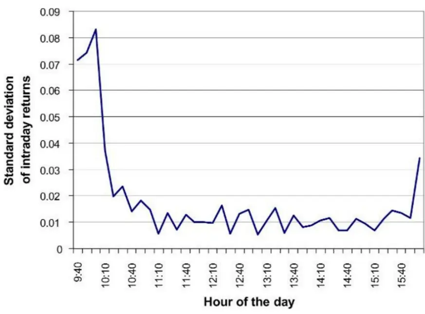
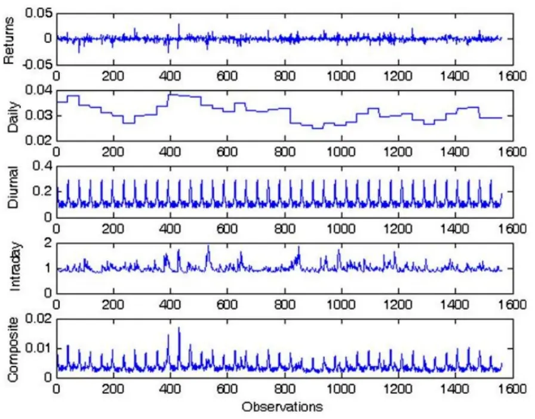
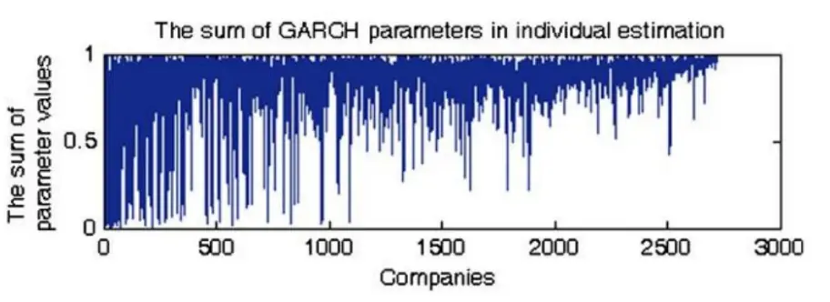
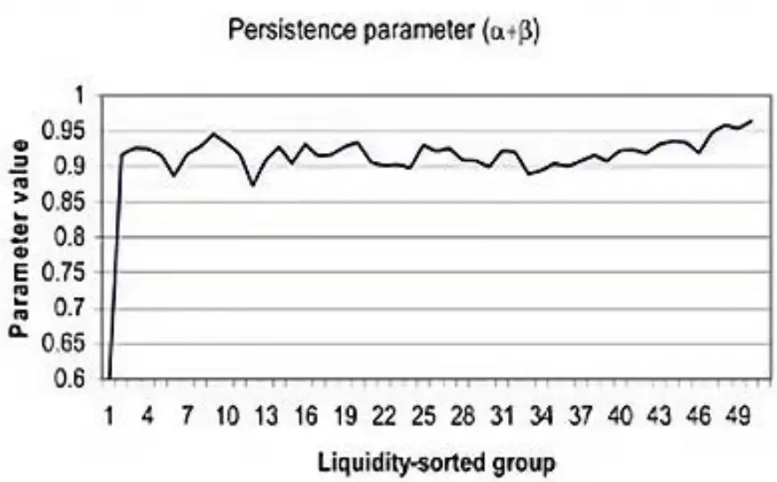

nInfo] [Table_Title] 2022.04.22

# 基于波动率分解的高频波动率预测模型

## ——学界纵横系列之三十八

陈奥林(分析师)

## 张烨垲(研究助理)

8 021-38674835

021-38038427

chenaolin@gtjas.com

zhangyekai@gtjas.com

证书编号 S0880516100001

S0880121070118

本报告导读：将日内高频波动率分解为日度波动率、日内趋势项、日内随机项，可以实现对高频波动率的更精准预测。

## 摘要：

传统模型对高频率波动率预测效果存在局限性。而在实践中，在高频策略、算法交易上都依赖对日内短周期波动率的精确预测。另一方面，期权等衍生品的日内定价也有赖于高频波动率的预测，基于低频数据的波动率预测难以满足衍生品市场发展的需求。

《Forecasting intraday volatility in the US equity market.Multiplicative component GARCH》介绍了一种预测高频波动率的方法，该方法将日内高频波动率拆分为日度波动率、日内趋势项、日内随机项，并使用两步估计的方法进行估计和预测。

文章的主要结论：（1）文章认为日内高频波动率由上述三部分决定，按照这三项进行分解可以有效提高日内高频波动率的预测准确度；（2）扩充样本数据可以提高模型参数估计的稳定性，相比于对每个股票分别建模，使用相似特征的股票联合估计参数具有更高的预测准确度和稳定性。

我们以上证50 ETF分钟频率高频交易数据为基础，借鉴文章的波动率分解模型对国内市场进行实证研究。结果显示，模型在预测结果的有效性上表现优于不含随机项的 NSTOCH模型以及直接对高频数据使用 GARCH 模型，一定程度上验证了波动率分解模型在国内市场的有效性。

金融工程

## 金融工程团队：

陈奥林：（分析师）

电话：021-38674835

邮箱：chenaolin@gtjas.com

证书编号：S0880516100001

杨能：（分析师）

电话：021-38032685

邮箱：yangneng@gtjas.com

证书编号：S0880519080008

殷钦怡：（分析师）

电话：021-38675855

邮箱：yinqinyi@gtjas.com

证书编号：S0880519080013

徐忠亚：（分析师）

电话：021- 38032692

邮箱：xuzhongya@gtjas.com

证书编号：S0880519090002

刘昺轶：（分析师）

电话：021-38677309

邮箱：liubingyi@gtjas.com

证书编号：S0880520050001

## 赵展成：（研究助理）

电话：021-38676911

邮箱：Zhaozhancheng@gtjas.com

证书编号：S0880120110019

## 张烨垲：（研究助理）

电话：021-38038427

邮箱：zhangyekai@gtjas.com

证书编号：S0880121070118

## 徐浩天：（研究助理）

电话：021-38038430

邮箱：xuhaotian@gtjas.com

证书编号：S0880121070119

## [Table_Re相关报告

基于非层次聚类的风险平价资产配置模型2022.04.14

重新思考深度学习的泛化能力 2022.03.29

突发宏观利空下的风格切换 2022.02.28

一种多值相关的深度递归神经网络模型2021.12.30

剖析基金换手与基金回报 2021.12.27

## 1. 选题背景

金融资产的波动性是一个与资产的风险密切相关的金融量，在衡量资产风险水平和特别是衍生品定价等方面有着举足轻重的影响，因此波动率一直是金融领域研究的热门主题，预测金融资产波动性对分析金融资产风险具有极其重要的理论意义和实用价值。

传统研究涵盖了从日度到年度甚至更长周期的波动率预测，但是对资产更高频率的波动率预测鲜有涉及。而在实践中，在高频策略、算法交易上都依赖对日内短周期波动率的精确预测。另一方面，期权等衍生品的日内定价也有赖于高频波动率的预测，基于低频数据的波动率预测难以满足衍生品市场发展的需求。

本篇报告推荐的文章《Forecasting intraday volatility in the US equity market.Multiplicative component GARCH》从波动率分解的角度出发提供了预测资产高频波动率的框架。借鉴本文的方法，我们对上证 50ETF 分钟频率的波动率进行预测，相比基准模型预测效果得到有效提升。

## 2. 核心结论

文章提出将股票高频波动率进行乘积分解，针对不同分量的特征相应进行建模，并通过实证检验日内波动率预测结果的准确性。

文章的主要结论：（1）文章认为日内高频波动率由三部分决定——日度波动率、日内波动率确定性趋势、日内波动率随机项，按照这三项进行分解可以有效提高日内高频波动率的预测准确度；（2）扩充样本数据可以提高模型参数估计的稳定性。相比于对每个股票分别建模，使用相似特征的股票联合估计参数具有更高的预测准确度和稳定性。

## 3. 文章背景

传统波动率模型应用于高频波动率预测效果有限。Andersen等（1997）研究发现，通过 MA(1)-GARCH(1,1)模型估计的日内波动率在不同频率数据下参变量缺乏一致性，例如 Engle（1982）和 Bollerslev（1986）提出的传统的 GARCH 模型对高频波动率的预测结果并不理想。为改进上述问题，Anderson 等（1997）将波动率拆解为日条件方差分量和日内条件方差分量的乘积，然而这种拆解对波动率的刻画仍然效果有限。

为使预测结果更加准确，Anderson 等（1998）将宏观经济公告作为影响日内方差分量的变量添加到波动率的拆解中。但该方法在实战使用中可能面临一定的困难：首先，重要的宏观经济公告通常发布在股市开盘之前，对日内波动率的变化影响不大；其次，对股市有重大影响的特殊公告公布的具体时间大多难以预测，难以构建与公告相联系的日内方差的函数；第三，股市对公告的反应取决于公告里的信息是否被市场提前消化，而提前消化的程度和时间难以估计；最后，股市中存在信息不对称，不能将公告视为唯一的信息披露渠道，其他信息也将对日内波动率产生影响。

为了更好地解决日内波动率预测的问题，文章提出一种新的日内波动率乘积拆解方式：日度波动率、日内波动率确定性趋势、日内波动率随机项，在确保统计量的一致性的前提下，提出了两步估计方法，对参数实现了简洁直观的估计。

## 4. 文章模型

模型主要分为两部分：

第一部分，对波动率进行乘积分解。文章在日度方差项和日内方差趋势项分解基础上，加入了一项随机的日内方差分量，日内连续回报与三个分量的等式关系是模型的核心假设。

第二部分，对模型进行分步求解。文章按照顺序分别估计乘积分解中的三项分量，在确定日度方差项之后，通过日度方差项与日内波动率确定性趋势项的关系推导出后者的估计值，最后利用 GARCH 模型求解随机日内方差分量。

## 4.1. 波动率的乘积分解

文章认为，高频波动率受到三个因素的影响：

（1）日度波动率。日度波动率直接决定了当天日内所有波动率的整体水平，因此可以作为高频波动率的基准；

（2）日内波动率确定性趋势。研究发现，日内波动率的变化呈现出确定性的规律，开盘、收盘的波动性高于其他时段，故可以将这种确定性趋势单独拆解

（3）日内波动率随机项。除了以上两个因素的影响之外，高频波动率还呈现出随机变化的规律，我们可以构建随机模型刻画该特征。具体的，我们假定条件方差是日方差、日内方差和随机日内方差的乘积：

$$
r_{t,i}=\sqrt{h_{t}s_{i}q_{t,i}}\varepsilon_{t,i}\tag{1}
$$

其中 $h_{t}$ 是日方差分量，对某一确定的交易日来说 $h_{t}$ 是确定的； $s_{i}$ 是日内方差分量，对某一确定的日内时间来说 $s_{\mathrm{i}}$ 是确定的，这一项反映的是日内波动率确定性趋势； $q_{t,i}$ 是随机的日内方差分量， $E(q_{t,i})=1$ ，这一项反映的是日内波动率随机项； $\varepsilon_{t,i}{\sim}N(0,1)$ 是独立同分布的误差项。

## 4.2. 模型的分步求解

由于模型中三个分项通过乘积形式叠加在一起，我们难以同时对所有变量进行估计，因此在求解中我们按照顺序分别估计这些参数，估计过程分为两步：首先通过多因素风险模型确定日方差 $h_{t}$ ，并由（1）式推导出日内方差 $s_{i}$ ；最后通过 GARCH模型刻画随机项 $q_{t,i}$ 的聚集效应并对其进行求解。

第一步，对于日方差 $\pmb{h}_{t}$ 的确定，由于模型的本质是对未来高频波动率做出预测，因此t时刻波动率的预测值作为日方差的估计 $\widehat{h}_{t^{\circ}}$ 。作者采用与时间序列分析相结合的多因素风险模型，风险因素主要包括行业因素、流动性因素（资本化程度、成交量、价差）、动量因素等。实际上，很多研究表明，更简洁的 GARCH模型或 RV（实现波动率）模型也可以实现对日度波动率的有效预测。

对于日内方差 $\pmb{s}_{i}$ 的求解使用历史均值的方法。由于 $s_{i}$ 表示的是日内波动率的确定性趋势，不同日期的日内趋势均相同，且随机趋势项期望值为1，因此在剔除日度波动率的影响之后，我们可以将剩余两项的历史均值作为日内确定性趋势项的估计。具体符号推导上，作者将（1）式化成等价形式：

$$
\begin{array}{r}{\frac{r_{t,i}^{2}}{h_{t}}=s_{i}q_{t,i}\epsilon_{t,i}^{2}}\end{array}\tag{2}
$$

对（2）式两边求期望：

$$
\begin{array}{r}{E(\frac{r_{t,i}^{2}}{h_{t}})=s_{i}E(q_{t,i})=s_{i}}\end{array}\tag{3}
$$

因此，在总交易日数为 T 的情况下，对调整后的收益平方求均值即可得到日内趋势项的估计量 $\mathbf{\hat{\boldsymbol{s}}}_{i}$ ：

$$
\begin{array}{r}{\hat{s}_{i}=\frac{1}{T}\sum_{t=1}^{T}\left(\frac{r_{t,i}^{2}}{h_{t}}\right)}\end{array}\tag{4}
$$

第二步，借助 GARCH模型刻画随机日内方差 $\pmb{q}_{t,i}$ 的运动过程。在剔除日度波动率和日内波动率确定性趋势两项的影响之后，我们可以构建随机模型刻画剩余波动率的随机变化的规律，由于波动率随机项具有聚集（Cluster）的特征，作者用 GARCH（1,1）过程为剩余波动率建模，得到 $q_{t,i}$ 的预测值：

$$
\begin{array}{rl}&{\quad z_{t,i}=r_{t,i}/\sqrt{h_{t}s_{i}}}\\&{z_{t,i}\vert F_{t,i-1}{\sim}N(0,q_{t,i}),}\\&{\quad q_{t,i}=\omega+\alpha z_{t,i-1}^{2}+\beta q_{t,i-1}}\end{array}\tag{5}
$$

上述方法本质上是一种分步估计方法而非直接寻找最优估计，很多情况下两步估计可能导致估计误差不断累积从而使得估计结果难以有效收敛，但实际上通过GMM框架进行分析，我们可以证明在模型的假设下分步法得到的估计量具有一致性，因此这里的两步估计可以帮助我们简洁高效地实现对模型的确定。

## 5. 文章实证分析

## 5.1. 数据

为了验证模型的有效性，文章使用 2721 支股票在 2000 年 4 月到 6 月的交易数据进行实证检验。具体的，文章作者在（1）单只股票；（2）多只股票分别建模；（3）多只股票按组联合建模三种情形下进行模型估计和预测，并通过损失函数来检验预测的准确性。

结果表明，按照模型中的方式进行分解可以有效提高日内高频波动率的预测准确度，扩充样本数据可以提高模型参数估计的稳定性，使用相似特征的公司联合估计参数具有更高的预测准确度和稳定性。

## 5.2. 单只股票

文章使用瓦莱罗能源公司（VLO）股票作为示例，用 10 分钟日内收益除以日波动率预测值ℎ̂ ，得到经调整的收益率具有清晰的日内波动模式。图 1 绘制了 39 个 10 分钟区间日内收益的标准差，在每个交易日的起始收益标准差有明显的增加，中间相对平缓，最后以小幅上升接近结束。实际上，这种日内波动率变化的模式具有一定的普适性，很多关于日内收益的研究均观察到这种日内波动的模式。

图 1 单支股票一日每区间收益标准差

数据来源：国泰君安证券研究，《Forecasting Intraday Volatility in the US Equity Market》

接着文章作者用 GARCH（1,1）模型对剩余波动率进行预测。对于GARCH（1,1）模型来说，关键的统计量是表征模型持久性的参数(α+β)，该值越接近 1表示波动率的聚集效应越强，对波动率的估计越持久。表 1 为 VLO 公司的预测结果，其中参数(α+β)为 0.814，略低于常规的GARCH模型，这是因为作者之前对回报进行了调整（除以日方差变量）。

## 表 1 VLO 公司的 GARCH 预测结果

| 变量 | 数值 标准误差 | T统计量 |
| --- | --- | --- |
| C 0.0065 | 0.0204 | 0.3161 |
| ω 0.1865 | 0.0302 | 6.1835 |
| β 0.7264 | 0.0387 | 18.7659 |
| α 0.0876 | 0.0121 | 7.2185 |

数据来源：国泰君安证券研究，《Forecasting Intraday Volatility in the US Equity Market》

图 2 中从上而下依次展示的分别是 VLO 公司股票的对数回报、日度波动率预测、日内波动率确定性趋势估计、日内波动率随机项以及三项乘积的平方根。从图中可以看出，对高频波动率的估计结果较为平稳，对数回报波动幅度较大的地方与乘积平方根较大的地方基本相符合。

图 2VLO 公司的多项观测值

数据来源：国泰君安证券研究，《Forecasting Intraday Volatility in the US Equity Market》

## 5.3. 多只股票

## 5.3.1. 分开估计

文章首先对 2000 年 4 月至 5 月期间的 2721 支股票进行分别单独的估计。为了消除 10 分钟收益中存在的自相关性，文章作者通过拟合 ARMA（1,1）模型对数据进行预过滤，数据点总数超过 420 万。

在图 3 中，横轴的公司从左到右按照交易强度（由日均交易量表征）从弱到强排列，纵轴表示经过 GARCH（1,1）模型预测后的参数值(α+ β)。可以看到，总体上(α+ β)值随公司交易强度上升而增大，该结果说明对于流动性较强的公司模型波动率估计的持久性更强；一些交易强度较低的公司(α+ β)值远小于 1，即对于流动性较差的公司，模型的估计持久性相对较差，因此对于这些交易不活跃的公司，不宜对其波动率进行单独的估计和预测。

图 3 不同交易强度公司的参数值(α+ β)

数据来源：国泰君安证券研究，《Forecasting Intraday Volatility in the US Equity Market》

## 5.3.2. 按组估计

正如 5.3.1 节末所讨论的，对于流动性较差的公司，由于交易数据存在某些异常值可能对模型结果产生较大的冲击，预测结果可能稳定性不高、收敛较慢。因此文章作者希望通过对公司进行分组联合估计的方法提升估计的稳定性。

文章作者分别研究了 3 种将公司分组的方式：INDUST 模式是按行业分组（共计 54 个行业）；LIQUID 模式根据每天的平均交易量进行分组（共计 50 个组）；ONEBIG 模式表示将所有公司合并成一个组，使用统一的参数对 GARCH模型进行估计。

图 4 展示了 2000 年 4 月至 5 月期间按流动性分组的日内 GARCH 模型估计结果，公司的流动性从左到右递增。可以看到，分组之后大多数组的(α+ β)值集中在 0.9 以上，这说明将公司按流动性分组后的估计持久性较强，估计得到了有效改进。

图 4 按流动性分组的日内 GARCH模型估计结果

数据来源：国泰君安证券研究，《Forecasting Intraday Volatility in the US Equity Market》

## 5.4. 检验预测准确性

在这一部分中，文章使用损失函数检验模型的有效性，并且对不同建模方式的准确性进行比较：在每个时点得到之后 10分钟波动率的预测值，将预测值与实际股票涨跌幅度进行对比，估算两者之间的差距。为了防止日波动率和确定性趋势项的不同导致计算权重出现偏离，在对比模型预测和实际涨跌时我们剔除这两个因素的影响，具体方式如下。联立 4.1节中的（1）式和 4.2 节中的（5）式，得到：

$$
z_{t,i}^{2}=r_{t,i}^{2}/h_{t}s_{i}=q_{t,i}\varepsilon_{t,i}^{2}\tag{7}
$$

由（7）式，将不同分组方式下的预测结果 $q_{t,i}^{f}\hat{\hat{\mathbf{\Gamma}}}\hat{z}_{t,i}^{2}=r_{t,i}^{2}/\widehat{h_{t}}$ ŝ进行比较可以度量误差项，进而检验预测的准确性。

## 5.4.1. 损失函数

文章作者使用两种损失函数，对数似然损失 LIK（Out-of-SampleLikelihood）和均方误差 MSE（Mean Squared Error）来刻画预测的准确性。似然函数表示在给定参数下观察到实际数据的概率大小，似然函数值越高表示模型越精确，实际使用中为了便于操作我们一般使用对数似然函数的相反数；均方误差 是指参数估计值与参数实际值的差的平方的期望值，损失函数的值越小，说明预测模型描述数据具有越高的精确度。

在文章中，两个损失函数的具体表达式为

$$
LIK:\ L_{1\{t,i\}}=lnq_{t,i}+z_{t,i}^{2}/q_{t,i}^{f}
$$

以及

$$
\begin{array}{rl}{MSE:}&{{}L_{2\left\{t,i\right\}}=(z_{t,i}^{2}-q_{t,i}^{f})^{2}}\end{array}
$$

最终的预测误差表示为

$$
L_{j}=\frac{1}{\tau N}{\sum_{t=1}^{\tau}}{\sum_{i=1}^{N}}L_{j\{t,i\}},j=1,2;\tau=22;N=39.
$$

## 5.4.2. 不同分组方式预测结果的比较

将交易数据代入 5.4.1节中的损失函数，并分别计算 5种模式（NSTOCH、UNIQUE、INDUST、LIQUID、ONEBIG）下的预测误差，其中 NSTOCH代表没有考虑随机日内方差项 $q_{t,i}$ 的模型，UNIQUE 代表对单个公司分别预测的模型，余下的 INDUST、LIQUID、ONEBIG 的含义与 5.3.2 节中一致。在两种损失函数下，5 种模式的预测结果表现的两两对比如图 5所示。

图 5 预测准确性比较

| Modes | NSTOCH | UNIQUE | INDUST | LIQUID | ONEBIG |
| --- | --- | --- | --- | --- | --- |
| LIK loss function NSTOCH |  |  |  |  |  |
| UNIQUE | 0.795 |  |  |  |  |
| INDUST | 0.849 | 0.595 |  |  |  |
| LIQUID | 0.831 | 0.604 | 0.504 |  |  |
| ONEBIG | 0.846 | 0.599 | 0.499 | 0.501 |  |
| Modes | NSTOCH | UNIQUE | INDUST | LIQUID | ONEBIG |
| MSE loss function |  |  |  |  |  |
| NSTOCH |  |  |  |  |  |
| UNIQUE | 0.618 |  |  |  |  |
| INDUST | 0.725 | 0.646 |  |  |  |
| LIQUID | 0.694 | 0.596 | 0.428 |  |  |
| ONEBIG | 0.738 | 0.661 | 0.555 | 0.623 |  |

数据来源：国泰君安证券研究，《Forecasting Intraday Volatility in the US Equity Market》

图 5中表格里的数值表示在所有的股票中行坐标方法优于列坐标方法的比例。例如 LIK损失函数表格的第 3 行第 2 列的 0.795 代表对于 79.5%的公司，UNIQUE 模式表现优于 NSTOCH模式。

由图 5 可以得出以下结论：没有考虑随机日内方差项 $q_{t,i}$ 的 NSTOCH 模式是 5 种模式中表现最差的；表现次差的是对单个公司分别预测的UNIQUE 模式；剩余的按流动性分组的 LIQUID 模式、按行业分组的INDUST 模式和将所有公司合并成一个大组的ONEBIG模式的预测准确性较为接近，但整体看 ONEBIG 模式最为理想。相较于不分组，分组的效果更理想；对条件方差的乘积拆解中，添加日内波动率随机项 $\pmb{q}_{t,i}$ 有助于提高预测准确性。

## 6. 国内市场实证

我们将文章中的方法应用于国内市场，希望检验模型方法在国内市场的有效程度。由于上证 50 ETF 期权是国内市场中交易最活跃的期权，对50 ETF 波动率的预测在期权定价方面具有较高实战价值，因此我们选取上证 50 ETF 作为预测高频波动率的目标资产。

尽管文章结论显示使用多个股票同时进行联合估计可以提高估计结果的有效性，我们这里还是选取了单一资产，主要是有三点考量：（1）上证 50 ETF 自身交易活跃，流动性高，不容易受到异常数据的影响；（2）文章中对股票分别建模有效性相对较弱一定程度上是由于样本数量较小导致估计结果不够稳定，联合估计增大了样本容量，而我们可以使用较长时间区间的样本对预测上证 50 ETF 波动率，从而避免了样本容量较小的问题；（3）上证 50 ETF 作为指数基金，其风险特征与股票有较大的差异，风格上与其他宽基指数也有所不同，因此将其与其他资产的样本合并估计可能导致结果有偏。

## 6.1. 日内高频波动率预测

我们采用 2017 年 2 月到 2022 年 1 月上证 50ETF（SH.510050）的交易数据，对超过 29 万个数据点运用文章中的模型进行分析预测。

不同于文章中用多风险因素模型估计 $h_{t}$ 的方法，我们采用更简洁GARCH 模型预测 $h_{t}.$ 。将上证50ETF的日度收益率数据代入GARCH（1,1）模型得到的 $\widehat{h_{t}}$ ，类似于文章中对日内波动率确定性趋势 $\mathbf{\nabla}_{s_{i}}$ 的计算方法，即 $\hat{s}_{i}=1/T\cdot\textstyle\sum_{t=1}^{T}(r_{t,i}^{2}/h_{t})$ ，可以得到其估计值 $\hat{s}_{i\circ}$ 。对于日内波动率随机项$q_{t,i}.$ ，我们用 GARCH（1,1）过程对其建模，得到 $q_{t,i}$ 的预测值 ${\bf q}_{\mathrm{t,i}}^{\mathrm{f}}$

## 6.2. 检验模型有效性

我们希望检验模型在上证 50 ETF 上的有效性。为了更好直观的对比模型有效性，我们选取两个基准模型：（1）使用不含随机项的模型，即文章中的“NSTOCH”模型；（2）直接使用波动率模型预测高频波动率，即不考虑日度方差以及日内波动率趋势项，直接用 GARCH 模型对高频数据建模。

我们借鉴文章的方法使用 MSE 函数来刻画预测的准确性：

$$
L_{\{t,i\}}=(z_{t,i}^{2}-q_{t,i}^{f})^{2}
$$

$$
L=\frac{1}{\tau N}{\sum_{t=1}^{\tau}}\sum_{i=1}^{N}L_{\left\{t,i\right\}},\tau=410\ ,N=240
$$

我们使用 2/3 的数据（2017 年 2 月 16 日到 2020 年 5 月 22 日）作为训练集，用于估计 GARCH 模型的参数以及日内趋势项，剩余 1/3 的数据（2020 年 5 月 25 日到 2022 年 1 月 25）作为样本外测试集，在测试集内得到波动率预测 $\mathsf{q}_{\mathrm{t,i}}^{\mathrm{f}}$ ，代入到损失函数 MSE 中，得到L = 4.637。

（1）将结果与NSTOCH模型得出的预测结果相比较：对于未添加随机日内方差项的模型而言，将 $\mathsf{q}_{\mathrm{t},\mathrm{i}}^{\mathrm{f}}$ 视作常数，由（7）式有 $E(z_{t,i}^{2})=E(q_{t,i})$ 计算后代入到损失函数 MSE中，得到L = 4.855。

（2）再将结果与直接用GARCH模型对分钟数据建模得出的预测结果相比较：对分钟数据直接运用 GARCH模型，得到相应的波动率预测 ${\sf q}_{\mathrm{t,i}}^{\mathrm{f}}$ 后代入到损失函数 MSE中，得到L = 4.856。

可以看到，添加随机日内方差项的模型的预测结果准确性优于 NSTOCH模型和直接用 GARCH模型对高频数据的预测结果。

## 7. 总结讨论

本文基于分解模型对日内股票波动率进行预测，将日内波动率分解为日度波动率、日内波动率确定性趋势和日内波动率随机项的乘积，通过两步计算得到参数的估计，并验证了变量的统计性质。在实证检验中，波动率分解模型可以提高高频波动率的预测有效性；另外，扩充样本数据可以提高模型参数估计的稳定性，相比于对每个公司分别建模，使用相似特征的公司联合估计参数具有更高的预测准确度和稳定性。

我们以上证50ETF从2017到2022年的分钟频率高频交易数据为基础，借鉴文章的波动率分解模型对国内市场进行实证研究。结果显示，模型在预测结果的有效性上表现优于不含随机项的 NSTOCH 模型以及直接对高频数据使用 GARCH 模型，一定程度上验证了波动率分解模型在国内市场的有效性。

## 本公司具有中国证监会核准的证券投资咨询业务资格

## 分析师声明

作者具有中国证券业协会授予的证券投资咨询执业资格或相当的专业胜任能力，保证报告所采用的数据均来自合规渠道，分析逻辑基于作者的职业理解，本报告清晰准确地反映了作者的研究观点，力求独立、客观和公正，结论不受任何第三方的授意或影响，特此声明。

## 免责声明

本报告仅供国泰君安证券股份有限公司（以下简称“本公司”）的客户使用。本公司不会因接收人收到本报告而视其为本公司的当然客户。本报告仅在相关法律许可的情况下发放，并仅为提供信息而发放，概不构成任何广告。

本报告的信息来源于已公开的资料，本公司对该等信息的准确性、完整性或可靠性不作任何保证。本报告所载的资料、意见及推测仅反映本公司于发布本报告当日的判断，本报告所指的证券或投资标的的价格、价值及投资收入可升可跌。过往表现不应作为日后的表现依据。在不同时期，本公司可发出与本报告所载资料、意见及推测不一致的报告。本公司不保证本报告所含信息保持在最新状态。同时，本公司对本报告所含信息可在不发出通知的情形下做出修改，投资者应当自行关注相应的更新或修改。

本报告中所指的投资及服务可能不适合个别客户，不构成客户私人咨询建议。在任何情况下，本报告中的信息或所表述的意见均不构成对任何人的投资建议。在任何情况下，本公司、本公司员工或者关联机构不承诺投资者一定获利，不与投资者分享投资收益，也不对任何人因使用本报告中的任何内容所引致的任何损失负任何责任。投资者务必注意，其据此做出的任何投资决策与本公司、本公司员工或者关联机构无关。

本公司利用信息隔离墙控制内部一个或多个领域、部门或关联机构之间的信息流动。因此，投资者应注意，在法律许可的情况下，本公司及其所属关联机构可能会持有报告中提到的公司所发行的证券或期权并进行证券或期权交易，也可能为这些公司提供或者争取提供投资银行、财务顾问或者金融产品等相关服务。在法律许可的情况下，本公司的员工可能担任本报告所提到的公司的董事。

市场有风险，投资需谨慎。投资者不应将本报告作为作出投资决策的唯一参考因素，亦不应认为本报告可以取代自己的判断。
在决定投资前，如有需要，投资者务必向专业人士咨询并谨慎决策。

本报告版权仅为本公司所有，未经书面许可，任何机构和个人不得以任何形式翻版、复制、发表或引用。如征得本公司同意进行引用、刊发的，需在允许的范围内使用，并注明出处为“国泰君安证券研究”，且不得对本报告进行任何有悖原意的引用、删节和修改。

若本公司以外的其他机构（以下简称“该机构”）发送本报告，则由该机构独自为此发送行为负责。通过此途径获得本报告的投资者应自行联系该机构以要求获悉更详细信息或进而交易本报告中提及的证券。本报告不构成本公司向该机构之客户提供的投资建议，本公司、本公司员工或者关联机构亦不为该机构之客户因使用本报告或报告所载内容引起的任何损失承担任何责任。

## 评级说明

## 1.投资建议的比较标准

投资评级分为股票评级和行业评级。以报告发布后的 12 个月内的市场表现为比较标准，报告发布日后的 12 个月内的公司股价（或行业指数）的涨跌幅相对同期的沪深 300 指数涨跌幅为基准。

## 2.投资建议的评级标准

报告发布日后的 12 个月内的公司股价（或行业指数）的涨跌幅相对同期的沪深300 指数的涨跌幅。

| 评级 |  | 说明 |
| --- | --- | --- |
| 股票投资评级 | 增持 | 相对沪深 300 指数涨幅 15%以上 |
|  | 谨慎增持 | 相对沪深 300指数涨幅介于 5%～15%之间 |
|  | 中性 | 相对沪深300指数涨幅介于-5%～5% |
|  | 减持 | 相对沪深300 指数下跌5%以上 |
| 行业投资评级 | 增持 | 明显强于沪深 300 指数 |
|  | 中性 | 基本与沪深 300指数持平 |
|  | 减持 | 明显弱于沪深300指数 |

## 国泰君安证券研究所

|  | 上海 | 深圳 | 北京 |
| --- | --- | --- | --- |
| 地址 | 上海市静安区新闸路669 号博华广 场20层 | 深圳市福田区益田路6009号新世界 商务中心34层 | 北京市西城区金融大街甲9号金融 街中心南楼18层 |
| 邮编 | 200041 | 518026 | 100032 |
| 电话 | （021）38676666 | （0755）23976888 | (010)83939888 |
|  | E-mail: gtjaresearch@gtjas.com |  |  |