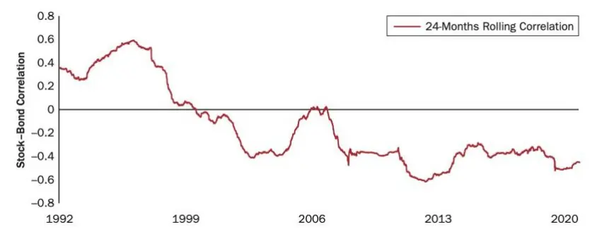
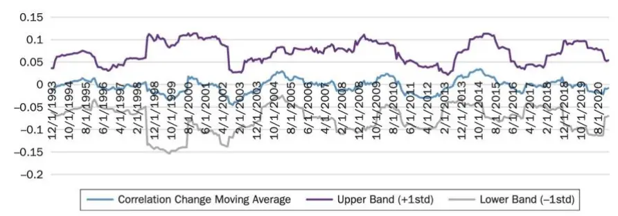
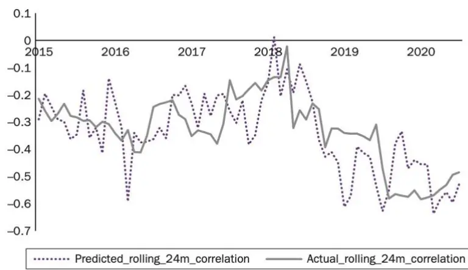
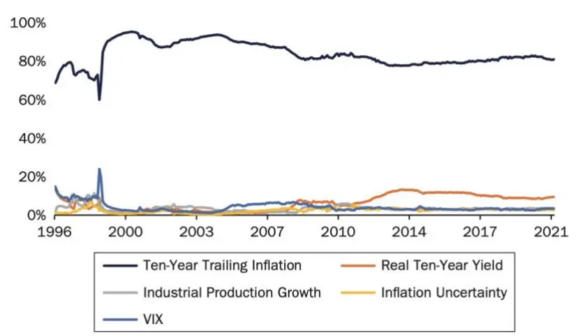

nInfo] [Table_Title] 2022.04.25

# 基于机器学习方法的股债相关性预测

## ——学界纵横系列之三十九

陈奥林(分析师)

## 徐忠亚(分析师)

8 021-38674835

021-38032692

chenaolin@gtjas.com

xuzhongya@gtjas.com

证书编号 S0880516100001

S0880519090002

## 本报告导读：

在本报告中，构建了基于随机森林识别股债收益相关性的关键决定因素的模型，并利用梯度提升回归法为预测时变的股债联动波动提供了一种稳健的方法。

## 摘要：

le_Summary]股债相关性是每一项资产配置决策的基石，但考虑到其联动性可能会根据经济状况大幅波动，因此可靠地对其进行估计是一项挑战。

基于随机森林的特征选择和特征重要性：利用监督机器学习技术，本文提出了一种新的方法，用于识别美国股债收益相关性的关键决定因素，最终发现通货膨胀、通货膨胀的不确定性、实际收益率、资产波动率、经济增长为股债相关性的关键因子，并据此预测相关性动态的变化。与现有文献相比，本文的方法允许系统地检测股债相关性的主要驱动因素，并揭示不同经济体制下每个决定因素重要性随时间的变化。

特征重要性随时间而变化：通过本文实证分析表明，特征重要性具有时变性；尽管通胀仍然是相关性长期趋势的关键驱动力，但全球金融危机后，实际收益率等其他因子的重要性开始增加。

基于梯度提升的五因子回归预测模型：在进行样本外投资组合评估后，作者表明，五因子梯度提升回归法在估计相关性的实际水平和变化趋势方面优于所有其他现有的基于因子的模型，从而为预测时变的股债联动性波动提供了一种稳健的解决方案，可进一步应用于资产配置决策和风险管理。

金融工程

## 金融工程团队：

陈奥林：（分析师）

电话：021-38674835

邮箱：chenaolin@gtjas.com

证书编号：S0880516100001

杨能：（分析师）

电话：021-38032685

邮箱：yangneng@gtjas.com

证书编号：S0880519080008

## 殷钦怡：（分析师）

电话：021-38675855

邮箱：yinqinyi@gtjas.com

证书编号：S0880519080013

## 徐忠亚：（分析师）

电话：021- 38032692

邮箱：xuzhongya@gtjas.com

证书编号：S0880519090002

## 刘昺轶：（分析师）

电话：021-38677309

邮箱：liubingyi@gtjas.com

证书编号：S0880520050001

## 赵展成：（研究助理）

电话：021-38676911

邮箱：Zhaozhancheng@gtjas.com

证书编号：S0880120110019

## 张烨垲：（研究助理）

电话：021-38038427

邮箱：zhangyekai@gtjas.com

证书编号：S0880121070118

## 徐浩天：（研究助理）

电话：021-38038430

邮箱：xuhaotian@gtjas.com

证书编号：S0880121070119

## [Table_Re相关报告

基于波动率分解的高频波动率预测模型2022.04.22

基于非层次聚类的风险平价资产配置模型2022.04.14

重新思考深度学习的泛化能力 2022.03.29

突发宏观利空下的风格切换 2022.02.28

一种多值相关的深度递归神经网络模型2021.12.30

## 1. 引言

衡量和预测股票和债券之间的联动对资产配置决策至关重要，是构建多元化投资组合的基础（Markowitz 1952；Sharpe 1964）。此外，股债相关性是风险管理中的一个重要因素，例如，利用股债相关性衡量给定投资组合的风险价值。

因此，越来越多的学术研究致力于进行股债相关性建模（Adams 2017）。Bollerslev（1990）引入的恒定条件相关（CCC）模型是最早也是最流行的用于测量相关性的多元波动率模型之一，直到 Robert Engle（2002）引入了动态条件相关模型，该模型在 CCC 模型的基础上进行了改进，其假设联动性按照简单的 GARCH 类型结构线性演化。Sheppard、Engle 和Cappiello（2006）通过引入平滑参数和条件不对称性，进一步扩展了这项工作。然而，不同相关性机制的平稳过渡性质使得在这种增强模型下，目标相关性（correlation targeting）是不可能实现的。为了克服这个问题，Kwan、Li和 Ng（2009）提出了阈值变化条件的相关性模型，该模型基于网格搜索的数据样本相关矩阵得出的准最大似然估计，可以实现离散机制转换（regime switches）和目标相关性。

尽管这些时间序列模型是预测联动性波动的伟大尝试，但人们对股债相关性的主要决定因素知之甚少，这使得投资组合经理难以解释相关性的动态波动。为了解决这一局限性，一些人建议在基于这些决定因素动态预测联动波动之前，使用动态因子线性回归来揭示相关性的驱动因素。例如，Connolly、Stivers 和 Sun（2007）发现，股债相关性和股票市场隐含波动性之间存在很强的关系，在低（高）波动率日后，联动性倾向于正（负）波动。Yang、Zhou 和 Wang（2009）利用 1855 年至 2001 年的长期历史数据表明：考虑到股票和债券贴现率的共同风险敞口，更高的股债相关性往往会跟随更高的短期利率和通货膨胀率。在一个三因素模型中，Andersson、Krylova 和 Vähämaa（2008）进一步使用通货膨胀和股票波动率预测经济增长下相关性，最终发现相关性在高通胀预期期间趋于增加，在股票波动率上升的背景下趋于减少；然而，他们没有发现经济增长在统计上的显著影响。最近，Aslanidis 和 Martinez（2021）借鉴了对相关性设置平稳过渡条件的观点，并使用股市波动性和短期利率来定义不同的相关性机制。尽管这些基于因素的机制模型建立在时间序列建模的局限性基础上，它们提供了更多关于股债相关性时变的驱动因素的透明度，但没有考虑整个投资期内每个决定因素重要性的时变，因此在样本外评估中也表现不佳。

在文献《Forecasting US Equity and Bond Correlation—A Machine LearningApproach》中，作者试图通过一个时变的监督机器学习（Verdhan 2020）特征重要性（Tirelli 2011）的模型系统地选择宏观经济因素，并使用这些因素通过非线性梯度提升（Friedman 2002）监督回归模型预测样本外相关性，从而解决上述局限性。文献中的发现为相关性研究做出了三个新的贡献。首先，文献提供了五因素模型预测相关性波动能力的实证证据。这五个因素包括 10 年期通货膨胀、10 年期通货膨胀不确定性、10 年期实际收益率、股票波动率和工业产出增长。第二，文献表明，尽管通货膨胀仍然是相关性长期趋势的关键驱动力，但其重要性随着时间的推移而变化，自全球金融危机以来，随着市场对美联储政策的增强和缩减变得更加敏感，实际收益率等其他因素的重要性开始增加。最后，基于文献的样本外投资组合评估，表明文献提出的非线性机器学习方法优于所有其他现有的基于因素的模型。

本文的结构如下：理论基础章节介绍了特征选择过程，以及使用的基于决策树模型的特征重要性和监督机器学习回归函数。第三章提供了系统的特征选择步骤和特征重要性的时变的结果。第四章给出了基于有监督的机器学习回归模型的样本外预测结果，并提供了与现有模型的比较。在原文文献结论章节，我们给出了原文中根据研究结果给出的结论和建议。最后我们给出了针对股债相关性及模型学习中的一些思考。

## 2. 理论基础

## 2.1. 特征选择

在对预测股债相关性的特征重要性进行排序之前，必须首先选择要包含在训练数据集中的特征的数量和类型。特征选择被定义为选择相关特征子集的过程，这些特征能够充分反映结果变量。在这种情况下，结果变量为美国的股债联动性。要创建一个解释相关性变动的数据集，首先必须找到影响股票和债券收益根本的宏观经济和金融因素。具体来说，可以按照以下方式分解股票与债券收益率公式：

$$
P_{stock}=E\left[\sum_{t=1}^{\infty}\left(\frac{1+G}{1+Y_{t}+ERP_{t}}\right)^{t}\times D\right]
$$

$$
P_{bond}=E\left[\sum_{t=1}^{T}\frac{C_{t}}{(1+Y_{t})^{t}}+\frac{100}{(1+Y_{T})^{T}}\right]
$$

其中 G 是指预期股息增长率， $Y_{t}$ 反映了对未来短期利率和所需债券风险溢价的预期， $ERP_{t}$ 是指除债券风险溢价外，嵌入股票贴现率中的所需股权风险溢价。在债券收益率模型中， $C_{t^{1}}$ 和 100 分别是定期息票和债券的票面价值为 100 的固定现金流。

从等式中可以明显看出，股票和债券既有共同的因素，也有相反的因素，导致它们联动或分离。文献关注宏观经济冲击影响这些因素的五个关键点，包括通货膨胀、商业周期、波动性、货币政策和不确定性冲击。通货膨胀冲击可能会导致相关性增加，因为较高的通货膨胀会直接提高预期的未来短期利率和与通货膨胀相关的债券风险溢价，从而降低债券收益。而在高通胀期间，贴现率提高将会影响现金流预期的任何正向变化，进而对股票产生负面影响（Ilmanen 2003）。另一方面，增长和波动率冲击对未来股息和股票风险溢价产生影响，它们可能会破坏股票和债券之间的关系。货币政策冲击的影响更加微妙，因为更高的实际收益率会提高股票和债券共享的折现率部分，从而增加两者相关性，但 Rankin 和Idil（2014）指出，如果伴随强劲的收益增长，这种影响有时可能会被抵消。最后，随着股票风险溢价增加（压低股价），而债券期限溢价下降（债券价格上升），增长前景不确定性的增加将降低股债相关性。

接下来，文献选择了一系列反映五次经济冲击的宏观变量，详见特征选择和特征重要性结果部分。为了降低数据集的维数，采用了主成分分析（ ），并使用 中的因子加载来消除高度相关的变量。然后，根据数据集预测相关性变化的程度，使用 Svetnik（2003）引入的随机森林分类器来选择样本中包含的最终变量集。假设随机森林 A 是 N 棵树的集合，则有 $\{T_{1}(X),T_{2}(X),\cdots,T_{n}(X)\}$ ，其中 X 是多维向量。这个集合基于每棵树产生 N 个不同的结果， $\{Y_{1}=T_{1}(X),Y_{2}=T_{2}(X),\cdots,Y_{n}=T_{n}(X)\}$ 其中 $Y_{n}$ 是基于第 N 棵树的预测。然后，通过投票法取票数最多的类别或取平均的方式，对这些树的所有输出进行聚类，以产生对随机森林 A的最终预测。

## 2.2. 基于树模型的特征重要性

在选择最终数据集后，使用基于决策树的机器学习模型（López Chau2013）对每个输入变量的重要性进行排序。对于一个单一的决策树模型，每个特征重要性可表示为：

$$
fi_{i}=\frac{\sum_{j:nodejsplitsonfeaturei}ni_{j}}{\sum_{k\epsilon allnodes}ni_{k}}
$$

其中 $fi_{i},$ 是特征i的重要性， $ni_{j})$ 是内部节点j的重要性。后者以节点j 的每个子节点的基尼不纯度减少量及到达该节点的概率加权计算得到。然后，将每个特征的重要性 $X_{I}$ 计算为内部节点误差的所有减少的总和，通过除以单个决策树上所有特征重要性值的总和，可以将其进一步标准化为如下的百分比值：

$$
normfi_{i}=\frac{fi_{i}}{\sum_{j\epsilon all\;features\;on\;decision\;tree\;fi_{j}}}
$$

为了获得多个决策树的最终特征重要性得分，计算每个树上特征重要性的总和，并除以树的总数。例如，如果模型有 M 个决策树，那么特征重要性等于

$$
fi_{i}^{2}=\frac{1}{M}\sum_{m=1}^{M}fi_{I}^{2}(T_{m})
$$

将此特征重要性函数应用于整个训练集，以获得对预测股票和债券联动波动最重要的特征的概述。此外，我们将特征重要性函数纳入一个扩展窗口，以便更动态地了解每个特征的重要性是如何随时间变化的。

## 2.3. 梯度提升回归模型

在最后一步中，使用上一节中确定的最重要变量作为梯度提升回归模型的输入来预测相关性。与随机森林模型不同，梯度提升算法通过在每次迭代中基于最小二乘法的伪残差依次拟合每个单独的决策树来建立加性回归模型。

更具体地说，梯度提升模型建立在梯度下降的基础上，使得损失函数L(θ)最小化，以获得优化的参数θ：

$$
\theta=\theta-\alpha\cdot{\frac{\partial}{\partial\theta}}L(\theta)
$$

假设有一个带有 M 个阶段的梯度提升模型；假设 $f_{m}(x)$ 是在 m 阶段的不完全预测模型，将

$$
f_{m}(x)=f_{m-1}(x)+\beta_{m}h_{m}(x)
$$

其中， $h_{m}(x)$ 是在现有弱学习器 $f_{m-1}(x)$ 的基础上改进 $f_{m}(x)$ 的新估计器。在每个阶段 m，需要最小化损失函数 $\begin{array}{r}{L(f)=\sum_{i=1}^{N}L(y_{i},f_{m}(x_{i}))}\end{array}$ ，通过使用梯度下降法，得到：

$$
f_{m}(x)=f_{m-1}(x)-\beta_{m}\cdot\frac{\partial}{\partial f_{m-1}(x)}L\big(y,f_{m-1}(x_{i})\big)
$$

结合上述两个方程，可以推出

$$
h_{m}(x)=-\frac{\partial L\big(y,f_{m-1}(x_{i})\big)}{\partial f_{m-1}(x)}
$$

## 3. 特征选择及特征重要性结果

## 3.1. 计算细节

所有的计算都是在一台拥有 60 GB 内存的 16 核机器上进行的。文献使用 Scikit Learn 0.24（Pedregosa et al.2011）进行数据标准化、PCA、随机森林和梯度提升的计算，以及计算所有评估指标。

数据选择和初步统计：样本数据集从 1988 年 1 月开始，在 2021 年 3 月结束，总共产生 399 个月观测值。为了估计股债相关性，使用标准普尔500 综合总收益指数来代表美国股票收益，使用标准普尔美国 10 年期国债总收益指数来代表债券收益。利用这些收益，文献计算了滚动 24 月期皮尔逊（Pearson）相关性，如图 1 所示。这里使用了相对较长的 24 个月滚动时间框架来反映相关性的趋势，并减少数据集中不必要的噪音。初始特征选择所考虑的 35 个宏观驱动因素的详细信息见表 1，所有这些驱 动 因 素 均 来 自 Refinitiv 和 全 球 金 融 资 料 库 (The Global FinancialDatabase)。

## 3.2. 特征选择及特征重要性

如前所述，文献首先使用 来降低数据集的维度，其中发现 个主成分可以解释样本中 个变量 的变化。在使用 中的因子载荷提取解释这 个主成分的主要变量后，继续使用随机森林分类器来预测数据集的特征变化是否能够解释随着时间的推移相关性的显著变化。具体来说，文献中构建算法，根据两个标签对特征进行分组：相关性的变化超过（正或负）一个标准偏差，相关性的变化在（正或负）一个标准偏差内（图 2）。

根据预测相关性显著变化（即相关性变化超过一个标准差）的能力对特征进行分类，可以选择与解释时变的相关性趋势最相关的特征。使用这种方法，得到最终数据集包括五个主要特征：10 年期年化 CPI 变化、10年期年化通胀不确定性、代表股市波动率的 CBOE VIX、10 年期实际收益率和工业生产增长。由于 79.1%的标签不是显著变化的相关数据点，使用合成少数过采样技术来进行样本处理。总之，这些特征可以预测相关性的变化，样本外准确率为 80%（表 2）。

为了推导这五个因素在解释相关性联动时的重要性排序，文献采用随机森林模型应用决策树特征重要性函数，结果在表 3中显示。从结果来看，每个决定因素都有助于确定相关性的显著变化，其中 10 年期的通货膨胀是最重要的决定因素。

图 1：滚动 24月股债相关性

数据来源：《Forecasting US Equity and Bond Correlation》, 国泰君安证券研究

图 2：显著相关性的动态变化

数据来源：《Forecasting US Equity and Bond Correlation》, 国泰君安证券研究

表 1：机器学习测试中考虑的宏观经济变量

| 经济因子 | 理论说明 | 机器学习测试中考虑的变量 |
| --- | --- | --- |
| 通货膨胀 | 通胀冲击可能会导致相关性增加，因为较高的通货膨胀 | ·总体消费物价指数（CPI）的10年期年化变化 |
|  | 会直接提高预期的未来短期利率和与通货膨胀相关的债 | ·核心 CPI的10年期年化变化 |
|  | 券风险溢价(Yt)，从而降低债券收益。而在高通胀期间， | ·总体 CPI的1年期变化 |
|  | 折现率（Y）提高将会影响现金流预期的任何增加变化， 进而对股票产生负面影响（Ilmanen 2003） | ·核心 CPI的 1 年期变化 |
| 不确定性 | 通胀前景的不确定性增加，将通过提高股票和债券的折 | ·总体CPI年度变化的10年期年化标准差 |
|  | 现率（Yt）来增加股债相关性。 | ·核心CPI年度变化的10年期年化标准差 |
|  | 另一方面，经济增长前景的不确定性增加，随着股票风 | ·工业生产年度变化的10年期年化标准差 |
|  | 险溢价的增加，股票价格降低，而债券期限溢价下降， 使得债券价格提高，因此将会降低股债相关性。 | ·非农业工资每月变化的10年期年化标准差 ·专业预测人员调查（SPF）总体通胀预测离散度 |
|  |  | ·SPF工业生产预测离散度 ·SPF非农工资预测离散度 ·SPF失业率预测离散度 |
| 波动率 | 股票波动率可能会触发股票和债券向相反的方向移动， 因为“Flight-to-quality”效应通常会提高所需的股票风险 溢价(降低股价)并降低债券风险溢价(提高债券价格)。 | ·标准普尔500指数总收益的10年期年化标准差 ·标准普尔500指数总收益的1年期年化标准差 •CBOE VIX ·标准普尔500指数期货合约交易量 |
| 经济增长 | 经济增长消息可能会在股票和债券表现之间产生分歧。 如果G在周期性扩张中上升，股票会受益，但债券不会， 事实上，债券可能会因增长对收益率的影响而受损。 | ·产出缺口 ·非农工资的自然对数 ·U3 失业率 ·U6 失业率(利用不足) ·3M_10Y 收益率差 ·2Y 10Y 收益率差 ·Ted 利差(3M LIBOR-3M TBILL) ·NBER 商业周期测定 |
| 政策 | 较高的实际收益率会增加股票和债券的共同贴现因子 $(\;Y_{t}\;),$ 因此除非此时伴随着强劲的收益增长（G）外， 其对应股债的正相关性。 | ·税后企业利润 ·实际10年期国债收益率 ·实际联邦基金利率 ·名义联邦基金利率 ·M2 货币供应量 ·货币政策缺口（与中性利率相比） ·货币政策缺口（与泰勒规则相比） ·美联储资产负债表占未偿还债券的百分比 |

数据来源：《Forecasting US Equity and Bond Correlation》, 国泰君安证券研究

表 2：随机森林分类模型的准确率

| 曲线下面积 |
| --- |
| 0.74 F1 得分 0.82 |
| 准确率 0.81 |

数据来源：《Forecasting US Equity and Bond Correlation》, 国泰君安证券研究

表 3：全样本特征对显著相关性变化的重要性

| 特征 | 特征重要性 |
| --- | --- |
| 通胀不确定性 | 0.132 |
| VIX | 0.231 |
| 10年期通胀率 | 0.243 |
| 实际10年期收益率 | 0.220 |
| 工业生产增长 | 0.174 |

数据来源：《Forecasting US Equity and Bond Correlation》, 国泰君安证券研究

## 4. 基于非线性梯度提升回归模型的样本外预测结果

作为文献的最后一步，使用上述五个因素作为梯度提升回归器的输入来拟合相关性，以表明这五个因素不仅具有可以识别显著的相关性变化，还有可以预测实际的相关性水平的能力。前 260 个月的数据被设置为训练集，剩下的数据集作为测试集，以获得样本外预测结果。如表 4 所示，过去五年的样本外评估结果的均方根误差（RMSE）约为 0.13，这意味着模型具有较高的准确性。对于文献中选择的其他因素，使用相同的梯度提升机器学习方法来计算样本外预测结果。如表 4 中的回归系数 1-5所示，可见五因素模型方法提供了更好的结果，这突出了通过机器学习特征选择过程系统地选择特征的好处。

表 4：基于梯度提升回归器的样本外结果

| 因子 | 样本外 RMSE |
| --- | --- |
| (1)通胀 | 0.1698 |
| (2)仅 VIX | 0.3297 |
| (3)利率+VIX | 0.1857 |
| (4)通胀+经济增长+VIX | 0.2561 |
| (5)通胀+利率 | 0.2544 |
| (7)五因子模型 | 0.1307 |

数据来源：《Forecasting US Equity and Bond Correlation》, 国泰君安证券研究

图 3 显示了五因素模型的样本外结果，该模型能够准确地捕捉到随时间变化的相关性趋势以及对应的实际相关性水平，实际相关性和预测相关性之间的平均差异远低于 0.099。

图 3：基于梯度提升模型的样本外结果表现

数据来源：《Forecasting US Equity and Bond Correlation》, 国泰君安证券研究

值得注意的是，文献还对特征重要性函数应用了一个扩展窗口，图 4 显示了五个变量在整个样本期内的时变重要性。可从这项额外的研究中得出三个结论：第一，很明显，特征重要性在不同的经济体制中是不同的；其次，在时变方法下，通货膨胀仍然是相关性趋势的主要驱动力；第三，随着市场参与者对央行政策支持的增加或减少变得更加敏感，实际收益率在过去十年中的重要性开始增加。

图 4：特征重要性随时间的变化

数据来源：《Forecasting US Equity and Bond Correlationh》, 国泰君安证券研究

## 5. 原文文献结论

如何衡量股债收益之间的联动性是资产分配者、风险管理者和学者们主要关心的内容。在文献中，作者提出了一种选择股债相关性主要决定因素的方法，并使用非线性梯度提升模型预测样本外相关性。与现有文献相比，作者的方法允许系统地检测股债相关性的主要决定因素，并揭示这些决定因素在不同经济体制中重要性的时间变化情况。此外，使用非线性梯度提升回归器，可以捕捉到各种特征之间的动态相互关系，而现有的其他线性相关模型则无法展示这种关系。

基于实证研究，我们发现通货膨胀、通货膨胀不确定性、股市波动率、实际收益率和工业生产增长是股票和债券联动波动的五个主要关键决定因素，而通货膨胀是决定随时间变化的相关性趋势的五个因素中最重要的一个。此外，自全球金融危机以来，实际收益率似乎变得越来越重要，因为市场参与者已经更加适应央行作为最后贷款人的行动。通过允许特征重要性得分随时间变化，并捕捉各种特征之间的动态关系，可以表明，文献中提出的梯度提升回归方法在预测相关性趋势和实际水平方面优于大多数线性因子模型，从而为预测随时间变化的股债联动波动提供了一种稳健的解决方案，可进一步应用于资产配置决策和风险管理。

## 6. 我们的思考

股票与债券的相关性分析是许多投资活动的关键组成部分，例如构建最优投资组合、设计对冲策略和评估风险。然而，考虑到股债相关性可能会根据经济状况大幅波动，如何准确地预测股债相关性是我们面临的挑战。一系列的研究文献提出了许多预测股债相关性的方法。本文利用机器学习方法对股债相关性进行研究。首先，采用 PCA将宏观因子构成的数据集降维，根据数据集预测相关性变化的程度，利用随机森林分类器来选择样本中包含的最终数据集，再基于决策树模型对每个输入变量的重要性进行排序，选出重要的特征。据此文中发现通货膨胀，连同实际收益率、资产波动性、经济增长和通货膨胀的不确定性为股债相关性的关键决定因素，并分析了这些因素重要性的时变情况。最后利用上述五因素通过梯度提升回归模型来预测未来的相关性。与现有文献相比，本文的方法可以系统地检测股债相关性的主要驱动因素，并揭示了每个决定因素重要性的时变情况。同时，利用五因素梯度提升回归模型在预测相关性的实际水平和变化趋势方面优于所有其他现有的基于因素的模型。

一方面，股债相关性和股债平衡策略在大类资产配置研究中具有较高的重要性。股债两类资产均有表现且收益表现负相关是股债平衡组合能够获得良好收益且能够有效对冲风险的必要条件。传统的 60/40、50/50 组合或以桥水全天候基金为代表的风险平价模型都是股债平衡的策略。通过预测得到的未来股债相关性，再结合股债两类资产的表现情况可以更好地运用股债平衡策略并进一步优化资产配置。

另一方面，在进行资产配置时，最大的困难之一就是对未来的资产分布认知不足，如何提升对资产未来分布的认知是我们的重要任务。由本文启发，我们可以通过一些机器学习的方法更好地构建预测模型，提高预测的精准度。除本文所考虑的股债相关性外，我们还可以考虑构建其他资产及其指标的预测模型，如权益资产、利率等。通过构建稳健的预测模型，不断提高对资产收益风险分布的认知，从而更好地进行资产配置。

## 本公司具有中国证监会核准的证券投资咨询业务资格

## 分析师声明

作者具有中国证券业协会授予的证券投资咨询执业资格或相当的专业胜任能力，保证报告所采用的数据均来自合规渠道，分析逻辑基于作者的职业理解，本报告清晰准确地反映了作者的研究观点，力求独立、客观和公正，结论不受任何第三方的授意或影响，特此声明。

## 免责声明

本报告仅供国泰君安证券股份有限公司（以下简称“本公司”）的客户使用。本公司不会因接收人收到本报告而视其为本公司的当然客户。本报告仅在相关法律许可的情况下发放，并仅为提供信息而发放，概不构成任何广告。

本报告的信息来源于已公开的资料，本公司对该等信息的准确性、完整性或可靠性不作任何保证。本报告所载的资料、意见及推测仅反映本公司于发布本报告当日的判断，本报告所指的证券或投资标的的价格、价值及投资收入可升可跌。过往表现不应作为日后的表现依据。在不同时期，本公司可发出与本报告所载资料、意见及推测不一致的报告。本公司不保证本报告所含信息保持在最新状态。同时，本公司对本报告所含信息可在不发出通知的情形下做出修改，投资者应当自行关注相应的更新或修改。

本报告中所指的投资及服务可能不适合个别客户，不构成客户私人咨询建议。在任何情况下，本报告中的信息或所表述的意见均不构成对任何人的投资建议。在任何情况下，本公司、本公司员工或者关联机构不承诺投资者一定获利，不与投资者分享投资收益，也不对任何人因使用本报告中的任何内容所引致的任何损失负任何责任。投资者务必注意，其据此做出的任何投资决策与本公司、本公司员工或者关联机构无关。

本公司利用信息隔离墙控制内部一个或多个领域、部门或关联机构之间的信息流动。因此，投资者应注意，在法律许可的情况下，本公司及其所属关联机构可能会持有报告中提到的公司所发行的证券或期权并进行证券或期权交易，也可能为这些公司提供或者争取提供投资银行、财务顾问或者金融产品等相关服务。在法律许可的情况下，本公司的员工可能担任本报告所提到的公司的董事。

市场有风险，投资需谨慎。投资者不应将本报告作为作出投资决策的唯一参考因素，亦不应认为本报告可以取代自己的判断。
在决定投资前，如有需要，投资者务必向专业人士咨询并谨慎决策。

本报告版权仅为本公司所有，未经书面许可，任何机构和个人不得以任何形式翻版、复制、发表或引用。如征得本公司同意进行引用、刊发的，需在允许的范围内使用，并注明出处为“国泰君安证券研究”，且不得对本报告进行任何有悖原意的引用、删节和修改。

若本公司以外的其他机构（以下简称“该机构”）发送本报告，则由该机构独自为此发送行为负责。通过此途径获得本报告的投资者应自行联系该机构以要求获悉更详细信息或进而交易本报告中提及的证券。本报告不构成本公司向该机构之客户提供的投资建议，本公司、本公司员工或者关联机构亦不为该机构之客户因使用本报告或报告所载内容引起的任何损失承担任何责任。

## 评级说明

## 1.投资建议的比较标准

投资评级分为股票评级和行业评级。以报告发布后的 12 个月内的市场表现为比较标准，报告发布日后的 12 个月内的公司股价（或行业指数）的涨跌幅相对同期的沪深 300 指数涨跌幅为基准。

## 2.投资建议的评级标准

报告发布日后的 12 个月内的公司股价（或行业指数）的涨跌幅相对同期的沪深300 指数的涨跌幅。

| 评级 |  | 说明 |
| --- | --- | --- |
| 股票投资评级 | 增持 | 相对沪深 300 指数涨幅 15%以上 |
|  | 谨慎增持 | 相对沪深 300指数涨幅介于5%～15%之间 |
|  | 中性 | 相对沪深300指数涨幅介于-5%～5% |
|  | 减持 | 相对沪深300 指数下跌5%以上 |
| 行业投资评级 | 增持 | 明显强于沪深 300 指数 |
|  | 中性 | 基本与沪深 300指数持平 |
|  | 减持 | 明显弱于沪深300指数 |

## 国泰君安证券研究所

|  | 上海 | 深圳 | 北京 |
| --- | --- | --- | --- |
| 地址 | 上海市静安区新闸路669 号博华广 场20层 | 深圳市福田区益田路6009号新世界 商务中心34层 | 北京市西城区金融大街甲9号金融 街中心南楼18层 |
| 邮编 | 200041 | 518026 | 100032 |
| 电话 | （021）38676666 | （0755）23976888 | (010)83939888 |
|  | E-mail: gtjaresearch@gtjas.com |  |  |