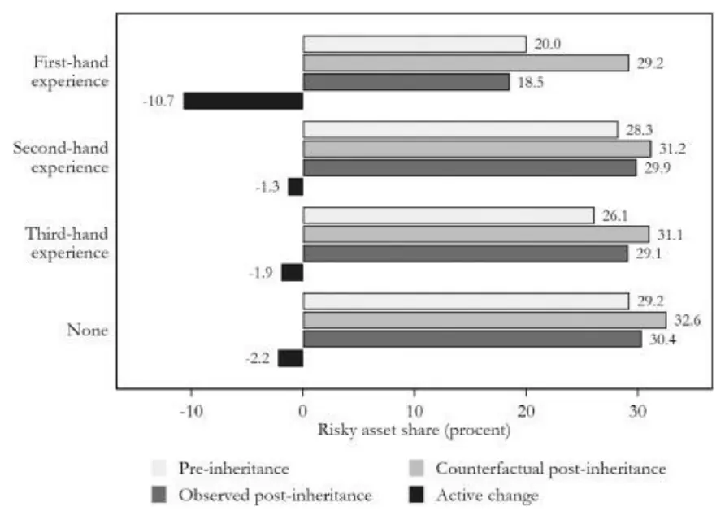
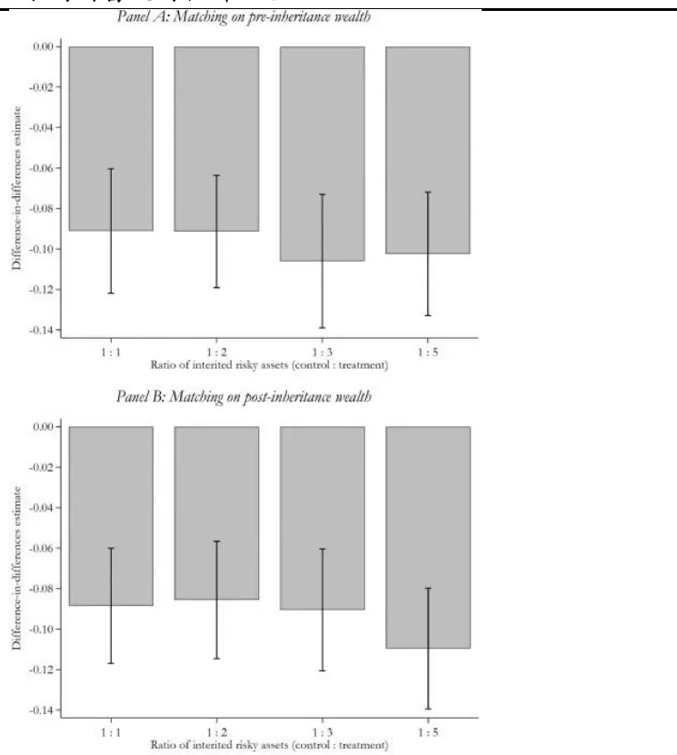
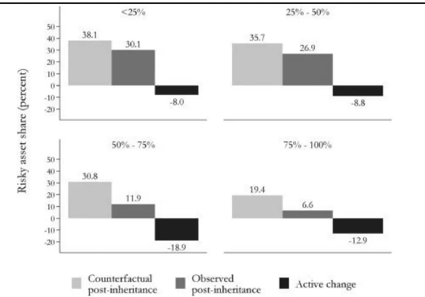
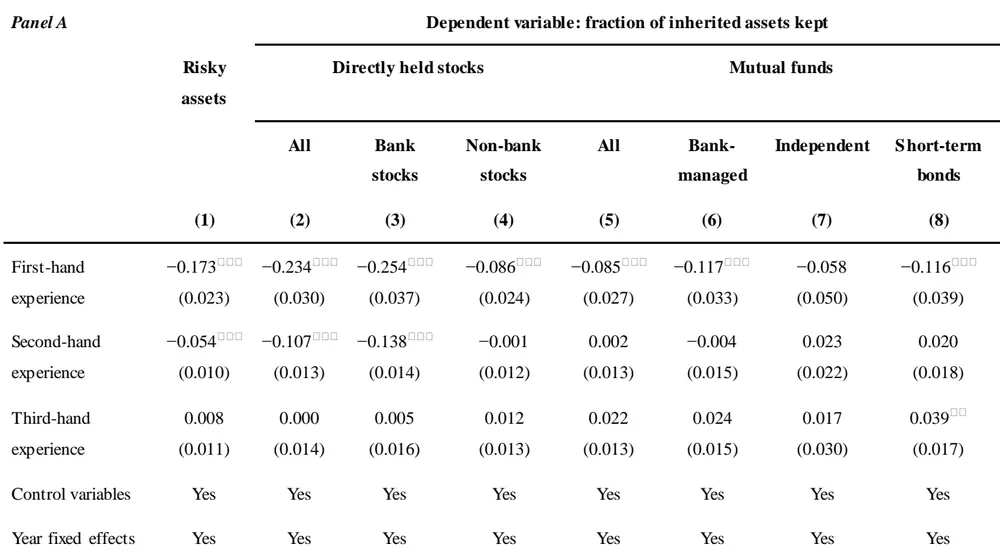
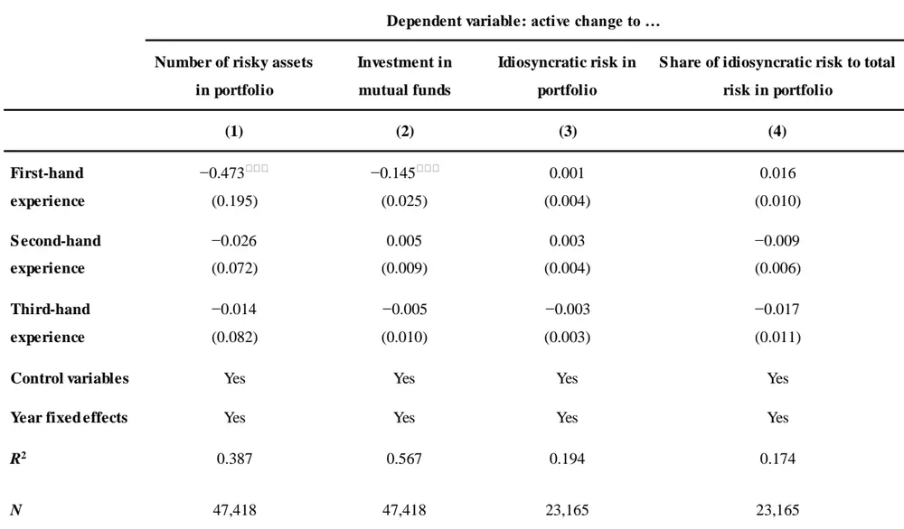

nInfo] [Table_Title] 2022.05.17

# 危机经历与个人风险偏好

## ——学界纵横系列之四十

陈奥林(分析师)

## 徐忠亚(分析师)

8 021-38674835

021-38032692

chenaolin@gtjas.com

xuzhongya@gtjas.com

证书编号 S0880516100001

S0880519090002

## 本报告导读：

在本报告中，分析了拥有负面个人经历的个人对其风险承担能力的影响。结果表明，个人获得的经验，而不是常见的冲击，使个人对风险望而却步。

## 摘要：

le_Summary]金融危机后，危机的负面个人经历是否会导致未来的风险承担能力降低是值得探讨的问题。更广泛地问，个人经历是否强大到使个人主动回避风险是我们所考虑的问题。

- 与遗产有关的投资组合决策：本文采用一种识别策略，识别因父母去世而继承风险资产组合的个人样本。该策略的主要优点是，个人可以主动回避，而不是克制承担风险的机会。

个人经历对风险承担的边际影响：本文将经验分为第一手经验，即个人损失；第二手经验，即家庭成员的损失；以及第三手经验，即违约银行所在城市的影响。研究表明第一手经验对未来的风险承担具有因果关系和相当大的影响，而二手经验和三手经验的影响程度要小得多。个人经验可以在个人层面上衡量，队列效应主要是由第一手经验驱动的，而不是由普通经验驱动的。

个人经历是如此强大，以至于使个人对风险望而却步。对本研究中显示的个人经验的适当反应是使投资组合多样化。相反，个人似乎通过出售他们继承的风险资产和持有现金来避免风险。简而言之，他们的反应正如我们所说的"一朝被蛇咬，十年怕井绳"，即“蛇咬效应”。

金融工程

## 金融工程团队：

陈奥林：（分析师）

电话：021-38674835

邮箱：chenaolin@gtjas.com

证书编号：S0880516100001

杨能：（分析师）

电话：021-38032685

邮箱：yangneng@gtjas.com

证书编号：S0880519080008

## 殷钦怡：（分析师）

电话：021-38675855

邮箱：yinqinyi@gtjas.com

证书编号：S0880519080013

## 徐忠亚：（分析师）

电话：021- 38032692

邮箱：xuzhongya@gtjas.com

证书编号：S0880519090002

## 刘昺轶：（分析师）

电话：021-38677309

邮箱：liubingyi@gtjas.com

证书编号：S0880520050001

## 赵展成：（研究助理）

电话：021-38676911

邮箱：Zhaozhancheng@gtjas.com

证书编号：S0880120110019

## 张烨垲：（研究助理）

电话：021-38038427

邮箱：zhangyekai@gtjas.com

证书编号：S0880121070118

## 徐浩天：（研究助理）

电话：021-38038430

邮箱：xuhaotian@gtjas.com

证书编号：S0880121070119

## [Table_Re相关报告

基于机器学习方法的股债相关性预测2022.04.26

基于波动率分解的高频波动率预测模型2022.04.22

基于非层次聚类的风险平价资产配置模型2022.04.14

重新思考深度学习的泛化能力 2022.03.29

突发宏观利空下的风格切换 2022.02.28

## 1. 引言

在 2007-2009 年金融危机之后，一个适当的问题是，在危机中的负面个人经历是否会导致未来的风险承担能力降低，正如大萧条时期出生的一代中所证明的那样（Malmendier and Nagel，2011）。我们更广泛地问，个人经历是否强大到使个人主动回避风险，我们研究相对于整个经济的经历，接触第一手的经历是否对主动承担风险有不同的影响。个人是否必须亲自感受到痛苦，或者普通的冲击就足以使个人主动减少对风险资产的暴露？

相关文献的研究中表明，个人经验使个人避免承担风险的机会。在本文研究中，我们分析了个人经历是否强大到使个人不仅避免了承担风险的机会，而且还主动改变了他们对风险资产的态度。我们采用了一种识别策略，该策略识别因父母去世而继承风险资产组合的个人样本。我们的识别策略的主要优点是，从持有风险资产的遗产中继承遗产的个人会改变主动决定，从选择承担风险到选择不承担风险。通过分析这种情况下风险承担的主动变化，我们表明个人经验是如此强大，以至于即使个人获得了大笔意外之财也会通过出售继承的资产来规避风险。

作为负面经验的一个合理来源，我们识别出那些投资于银行股票的个人（在金融危机之前这在丹麦是一个常见的现象），其中一些在危机发生后违约。

危机发生前丹麦人口的投资组合配置说明了个人在配置投资时对银行的明显信任。2006 年，在 1,207,278 名持有股票的个人中，有 817,547 人（67.7%）投资于银行。参与股市的个人平均将其投资组合的 47.8%分配给了银行股票，而所有股市参与者中有 40.1%只持有银行股票。

2007-2009 年的金融危机对丹麦的金融机构产生了重大影响。对房地产开发商和农田的过度敞口导致许多银行出现严重的冲销和流动性需求。由于不良贷款的冲销，8 家公开交易的银行在 2008 年至 2012 年之间违约，导致 108,744 名股东严重亏损，相当于 2006 年所有丹麦人持有的股票的 9.1%，相当于 4800 欧元，约占其投资组合的 17.9%。大多数股东也是客户。违约银行是 108,744 名股东中 85,911 名（79%）的主要银行。

除了提供高质量的行政登记数据外，制度环境也有助于排除有个人经历的人在继承方面承担较低风险的其他解释。丹麦金融监管局的临时规定为绝大多数的存款人提供了充分的违约保险。相对较低的遗产税和大量的现金持有进一步确保了 85%的遗产（或其受益人）持有足够的现金来解决遗产税而无需出售资产。因此，我们排除那些不出售资产就无法缴纳遗产税的遗产来进行分析。

为了研究个人经验程度的影响，我们调查了有第一手、第二手和第三手经验的受益人在分配继承的财富时是否与有普通经验的受益人表现不同。我们将第一手经验定义为因银行违约而失去在该银行的投资的直接影响。我们把第二手经验定义为有一个接触过第一手经验的近亲的同侪效应。我们将第三手经验定义为居住在违约银行所在城市的影响。我们发现，在没有第一手或第二手经验的情况下，第三手经验对风险承担水平的影响可以忽略不计。由于近亲的损失而有第二手经验的投资者将他们对风险资产的配置减少了大约 1%，而那些有第一手经验的投资者将配置在股票上的流动财富比例主动减少了 9%。这些影响在经济上意义重大，因为对于继承财产的受益人来说，流动财富的基线分配比例约为30%。

为了消除不同投资者的投资风格影响，我们测试了围绕遗产的风险承担的主动变化是否取决于遗产是在银行违约之前还是之后收到的。这一策略的优势在于，死亡的时间（因此也包括继承情况）与银行违约的时间无关。受试者内部差异有效地消除了我们的结果是由对遗产的部分预期驱动的可能性，而受试者之间的差异有效地控制了金融危机对风险承担的整体影响。因此，第一手经验的因果效应可以通过比较继承前后风险承担的主动变化来估计。这取决于继承情况相对于违约的时间。平均来说，在经历违约之前继承遗产的个人会主动增加 3.1%的风险承担，而在经历违约之后继承遗产的个人会主动减少流动财富中的股票部分，减少的比例为 9.2%。这一差异相当于 12.3%，在经济上和统计上都是显著的。

那些投资银行股并随后损失了相当大一部分财富的投资者不太愿意持有风险资产，即使他们获得了一笔巨大的、足以抵消损失的意外之财。目睹了宏观经济环境恶化的当地同行的投资行为，相对而言仍未受到这些经历的影响。我们的结果表明，个人风险承担的变化在很大程度上是由个人经历的事件决定的，在较小程度上是由近亲的经历或宏观经济条件决定的。

我们的结果提出了一个问题：个人如何从过去的投资经验中学到什么，以及从过去的投资经验中学到什么。对本研究中所显示的个人经验的适当反应是使投资组合多样化。相反，个人似乎通过出售他们继承的高风险资产和持有现金来规避风险，正如我们的标题所暗示的：一朝被蛇咬，十年怕井绳。虽然出售继承资产的决定对直接持有的股票来说是最强烈的，但对共同基金来说，它仍然具有经济意义。第一手经验对未来风险承担的深刻影响的一个合理解释是，个人随后修改了他们对银行可信度的预判。与这一渠道一致，我们发现有亲身经历的个人，在直接持有的股票中，更有可能卖出继承的银行股票而不是非银行股票。在共同基金中，他们更有可能出售银行管理的基金而不是独立管理的基金。这些结果表明，对银行的不信任可能是驱动较低风险承担的渠道之一。在我们的环境中，来自第一手经验的不信任可能特别严重，因为许多人是由他们的财务顾问建议投资的。

我们的研究按以下步骤进行。第 2节详细描述了我们数据的构造和来源。在第 3 节中，我们讨论了丹麦的制度环境和个人对银行股票的敞口。然后，我们研究了围绕遗产的风险承担如何受到个人经历的影响（第 4节）以及个人经历对围绕遗产的投资组合配置和投资组合多样化的影响（第5 节）。最后得出结论。

## 2. 数据来源和数据处理

该研究，使用了丹麦的高质量行政登记数据，对个人经历进行分类，并观察他们将流动财富分配到遗产周围的风险资产的情况。数据集包含有关个人及其已故父母的经济、财务和个人信息，这些数据集中在 20 岁或以上的成年人身上。

该研究的数据来源可靠客观，涉及面广。个人和家庭数据来自丹麦官方民事登记系统；收入、财富和投资组合来自丹麦税务和海关管理局(SKAT)的正式记录；死亡原因来自丹麦国家卫生委员会的丹麦死因登记册（使用这些数据集来识别继承案例，并对突然和意外死亡的个体的子样本进行分类。）；教育记录来自丹麦教育部；除了行政登记数据外，该研究还从 Datastream 和哥本哈根证券交易所获得每月的股票价格（使用这些数据来评估投资组合在个人层面的多样化）。

## 3. 个人对银行股的风险暴露

作为我们分析的起点，我们在样本中找出在全球金融危机之前对银行有投资的个人。丹麦金融监管局的一份关于向储户出售银行股票的报告（2009）描述了银行的机构性质，认为其具有本地存在的传统，本地客户支持他们的本地银行，甚至参加年度大会。随着时间的推移，这些客户中的许多人对当地银行机构及其建议建立了相当程度的信任，他们保持着包含大量银行股票持有的投资组合。

在金融危机爆发前，丹麦许多地方银行采取了一种激进的增长战略，通过向客户发行股票融资。丹麦金融监管局（2009）在其报告中得出结论，银行股票的投资往往受到直接营销活动的鼓励，这些营销活动片面关注资本收益、股息和银行特权等利益，而很少关注内在风险。银行家们直接联系客户，提供参与股票发行的机会，在许多情况下，还提供贷款为购买提供融资。许多客户似乎信任这一投资建议，在购买银行股票时没有充分考虑潜在风险或其投资组合缺乏多样化（丹麦金融监管局，2009）。个人投资于他们经常投资的公司的倾向在之前的文献中已经显示出来（Keloharju 等， 2012），这与这类投资者将股票视为消费品而不仅仅是投资的观点是一致的。

由于这些机构特征，2006 年股市参与者平均持有银行股票。2006 年，平均有 29.7%的丹麦人通过持有股票或共同基金参与了股票市场。平均参与者的投资组合的市场价值为 328,000 丹麦克朗（44,025 欧元），相当于他们流动财富的 41.1%。平均投资组合由 2.6 只股票组成，其中银行股占 0.8 只。超过一半的股票市场参与者持有银行股(67.7%)，40.0%的参与者在他们的投资组合中只持有银行股。因此，银行股在投资组合中的平均权重一般为 47.8%，其中大部分(47.8%中的 42.9%)倾向于个人自己的银行。2008 年至 2012 年间，共有 8 家上市银行违约。公开上市的银行和银行违约的存在在地理上是相对分散的。违约银行的投资者与没有违约的银行的投资者具有类似的个人和投资组合特征。

## 4. 围绕继承的个人经历及风险承担

为了确定个人经验的力量，我们研究了个人继承风险资产组合时风险承担的变化。这种方法的主要优点是，它允许我们观察风险承担的主动变化，并减少了惯性造成的潜在偏差。完全惰性的个人被动地将继承的投资组合并入其继承前的投资组合中，而对这一反事实的继承后投资组合的偏离则是由于主动选择购买或出售资产造成的。如果个人经历对风险承担有负面影响，我们预计这些人更有可能清算继承的投资组合，因此，相对于没有个人经历的人来说，他们会积极减少风险承担。

我们继承样本的出发点是记录导致家庭终止的死亡，从而导致继承案件。为了简化分析，我们把重点放在死者有后代的死亡上，在这种情况下，遗产将默认为由后代平分。丹麦的遗产平均需要 9 个月的时间来解决。此外，如果遗产的净财富超过一定数额，则直系亲属需缴纳 15%的遗产税。这一净财富的门槛在随后的几年中会根据价格指数进行膨胀。同时，死者因投资而产生的任何未实现的资本收益都不会直接被征税。因此，受益人在保留或变现继承的资产方面没有税收优惠。由于相对较低的遗产税和大量的现金持有，85%的遗产（或其受益人）持有足够的现金来解决遗产税而无需出售资产。我们使用了两个继承案例的样本：一个涵盖所有死亡的总样本，以及在稳健性检查中，一个仅涵盖突然死亡的较小子样本。后者的主要优点是，意外之财在很大程度上是未曾预料到的，而个人在获得意外之财时，在其他方面相同时应该更愿意承担风险。使用突然死亡样本的缺点是我们得到的样本较小，这使得精确估计个人经历对风险承担的影响更加困难。

表 1：继承特征

| Panel A: Household terminations | All deaths | All deaths with stocks | Sudden deaths | Sudden deaths with stocks |
| --- | --- | --- | --- | --- |
| Number of estates | 80,052 | 27,670 | 14,508 | 5190 |
| Number of beneficiaries | 139,817 | 47,418 | 24,975 | 8853 |
| Panel B: Portfolio characteristics |  | Estates with stocks | Beneficiaries who inherit stocks |  |
| Market value of stocks (thousands of DKK) |  | All deaths | Sudden deaths All deaths | Sudden deaths |
|  | 411.8 (4255.7) | 372.9 (1625.5) | 103.7 (897.8) | 101.7 (504.7) |
| Risky asset share (percent) | 34.3 | 33.9 | 14.2 | 14.8 |
|  | (23.2) | (23.4) | (24.5) | (24.9) |
| N | 27,670 | 5190 | 47,418 | 8853 |
| Panel C: Inheritance characteristics | Personal experience |  |  |  |
|  | First-hand Second-hand |  |  |  |
| Panel C: Inheritance characteristics | Personal experience |  |  |  |
| Deceased's Portfolio: |  |  |  |  |
| Market value of stocks before inheritance (thousands of 206.0 (568.2) |  | 95.7 (593.2) | 179.2 (2403.0) | 101.6 |
| DKK) |  |  |  | (838.8) |
| Market value of inherited stocks (thousands of DKK) | 212.3 (508.1) | 181.5 (409.0) | 493.0 (6619.6) | 223.7 |
|  |  |  |  | (1758.5) |
| Lost investment from bank default (thousands of DKK) | 60.9 (143.0) | 1 |  | 一 |
| N | 245 | 1277 | 1065 | 44,831 |

数据来源：《Once bitten, twice shy: The power of personal experiences in risk taking》, 国泰君安证券研究

表 1 的 A组总结了死者持有股票的死亡和猝死的数量。我们专注于2007年至 2011 年期间的死亡，因为我们需要观察死者生前的股票持有情况，并确定受益人在遗产处理后是否保留这些股票。我们在 2006 年至 2012年的年底观察投资组合持有情况，这就限制了我们可以追踪继承的股票的时间窗口在 2007 年至 2011 年之间。

我们总共有 80,052 个家庭在 2007 年和 2011 年之间终止，其中 27,670 人在死前持有股票。每个持有股票的遗产平均有 1.71 个受益人，因此有47,418 个继承股票的受益人的样本。我们的子样本要小得多，仅有 8,853位受益人因突然死亡而继承了股票。

表 1 的 B组报告了死者以及受益人的投资组合特征。我们报告了所有死亡者和突然死亡者在死亡前持有股票的条件下的投资组合特征。平均而言，死者持有价值 411,800 丹麦克朗（55,300 欧元）的股票，相当于其流动财富的 34.3%。B 组还报告了持有股票的所有死亡和突然死亡的遗产的所有受益人的投资组合特征。平均而言，受益人在继承前持有价值103,700 丹麦克朗的股票。

在 C 组中，我们报告了受益人在个人经历方面的继承特征。我们考虑不同程度的个人经历。第一手经验是一个指标，对于因银行违约而失去在银行的投资的个人来说，其数值为 。第二手经验是一个指标，如果个人的家庭成员、父母、兄弟姐妹、子女、姻亲或配偶有第一手经验，该指标等于 1。第三手经验是指居住在有违约银行的城市的个人的指标。为了避免虚假的相关性，我们排除了在继承窗口内有个人经历的个人，只对个人经历的最高程度进行编码。因此，如果一个人有第一手经验，我们将第二手和第三手经验设为零。

对于经历过银行违约的受益人来说，平均损失为 60,900 丹麦克朗（8,200欧元），平均继承的股票价值为 212,300 丹麦克朗（28,500 欧元）。此外，在所有经历过违约的受益人中，93%的人的损失明显低于他们通过继承财富得到的损失。因此，在我们的样本中，如果完全惰性，平均受益人在继承后会被动地承担更多风险。

根据受益人的个人经历，可以比较了其个人和投资组合特征。为了便于与有第一手经验的受益人进行比较，我们指出持有股票的受益人的描述性统计：1、有个人经验和没有个人经验的个人的人口统计特征具有相当的可比性，主要例外是有第一手经验的个人的性别和婚姻状况。2、有个人经历的人在违约银行的投资损失后，其风险资产份额较低，风险资产的市场价值较低，风险资产也较少。

表 2：个人经验对风险承担的影响

|  | Dependent variable: active change in risky asset share |  |  |  |
| --- | --- | --- | --- | --- |
|  | (1) | (2) | (3) | (4) |
| First-hand experience | -0.093(0.012) -0.092(0.012) |  |  | -0.093(0.012) |
| First-hand investor and customer experience |  |  | -0.095(0.013) |  |
| First-hand investor and noncustomer experience |  |  | -0.084(0.029) |  |
| First-hand customer experience |  |  | 0.019 (0.025) |  |
| First-hand experience in nonbank stocks |  |  |  | 0.046 (0.038) |
| Second-handexperience | -0.001 (0.005) | -0.002 (0.005) | -0.002 (0.005) | −0.002 (0.005) |
| Third-hand experience | 0.001 (0.005) | 0.000 (0.004) | 0.000 (0.004) | 0.000 (0.004) |
| Control variables | No | Yes | Yes | Yes |
| Year fixed effects | Yes | Yes | Yes | Yes |
| R² | 0.462 | 0.463 | 0.463 | 0.463 |
| N | 47,418 | 47,418 | 47,418 | 47,418 |

数据来源：《Once bitten, twice shy: The power of personal experiences in risk taking》, 国泰君安证券研究

表 2 考察了个人经历对围绕继承的风险承担变化的影响。我们估计以下方程：

$$
\Delta\alpha_{i,t,2k}=\beta X_{i,t}+\gamma E_{i,b}+\varphi\omega\big(\alpha_{t-k}^{i}-\alpha_{t-k}\big)+\varepsilon_{i,t},\tag{1}
$$

其中因变量 $\Delta\alpha_{i,t,2k}$ 为个体i从t −k年到t+k年的风险承担变化量，t年为遗传年，且k = 1。 $X_{i,t}$ 是控制变量的向量， $E_{i,b}$ 是继承前个人经验的向量(即 $b<t-k),\omega\big(\alpha_{t-k}^{i}-\alpha_{t-k}\big)$ 控制惰性。如果受益人是惰性的，惰性决定了风险承担的变化是在获得遗产前的风险承担 $\alpha_{t-k}$ 和继承财富的风险承担 $.\alpha_{t-k}^{i}$ 的加权平均：

$$
Inert_{t}=(1-\omega)\alpha_{t-k}+\omega\alpha_{t-k}^{i}-\alpha_{t-k}=\omega\big(\alpha_{t-k}^{i}-\alpha_{t-k}\big),
$$

其中，参数ω表示继承财富相对于继承后流动财富的比例。

我们衡量的是风险资产份额的主动变化，该份额由股票和共同基金相对于流动财富的市场价值计算得出，在父母去世的那一年前后的两年时间里，以确保遗产得到解决，从而确保继承的财富转移给受益人。主动变化是观察到的风险资产份额的变化减去由于继承引起的反事实的变化。风险资产份额的反事实变化是通过合并继承的投资组合和受益人继承前的投资组合并将市场价格更新到t+ 1年来计算的。因此，主动变化反映了受益人在风险资产配置上的变化，而不是由惯性引起的被动变化。由于我们从死者和他们的受益人的年度持有量中推断出遗产，我们在第

5 节末尾分析了这对测量偏差是否是一个担忧的问题。

我们使用线性回归模型，并控制收入、净财富、年龄、性别、教育、家庭中已婚和有孩子的指标，以及年度固定效应。标准误差在市级层面上进行了分组，以缓解违约对特定地理位置的影响过大的担忧。为了考虑不同的个人经历对风险承担变化的作用，我们包括三个经验指标。为了避免个人经历和风险承担变化之间的虚假相关性，我们排除了在他们有第一手、第二手或第三手经验的时间段内继承的个人。也就是说，在我们的分析中，个人要么在t− 1年之前有第一手经验，要么在t + 1年之后有第一手经验，但绝不会在t− 1年和t+ 1年之间，也就是我们衡量围绕继承的风险承担变化的时期。

表 2 的第 1 栏显示，第一手经验减少了风险承担。在继承前经历过违约的个人，其风险承担减少了 9.3%。这种影响在经济上和统计上都是显著的。有第二和第三手经验的受益人不会主动减少对风险资产的配置。在第 2 栏中，我们引入控制变量，发现有第一手经验的受益人主动减少了9.2%对风险资产的配置。

一个重要的问题是，金融损失是否产生了个人经验的影响，或者由于银行违约造成的共同损失是否特别不利于未来的风险承担，是否是因为个人对金融系统失去了信任。因此，在表 2 的第 3 栏中，我们考虑了不同类型的第一手经验：投资者和客户经验，投资者和非客户经验，（非投资者）客户经验，以及非投资者和非客户经验，也就是参考组。这种分解对于理解起作用的渠道很有帮助。例如，在违约之后，如果违约导致他们的流动性受限，有第一手经验的个人可以减少风险承担。或者，因为有第一手投资者和客户经验的个人相信银行的建议并投资于银行股票，所以可以减少风险承担。

如果有第一手经验的个人也是他们银行的客户，他们会更多地减少风险承担。有第一手经验的个人，如果他们也是客户的话，会减少 9.5%的风险承担，而不是客户的个人会减少 8.4%的风险承担。对于 1.1%的差异，一个合理的解释是，也是客户的个人可以相信他们银行的建议，并投资于银行股票。表 2 第 3 栏还显示，个人经历对风险承担的影响不是由存款被冻结导致的流动性限制造成的。作为违约银行的客户但不是投资者的个人，并没有围绕着遗产积极改变他们对风险资产的配置。

我们考虑的最后一个个人经历是非银行股票的违约。我们在 2007 年和2011 年之间确定了六起非银行违约事件。这六起非银行违约事件大约有五千名个人投资者，其中 53 人在违约经历后获得了遗产。表 2 的第 4 栏比较了银行和非银行违约的个人经历对个人风险承担的影响。违约的非银行股票的投资者在继承遗产前后增加了他们的风险股票配置，但这种影响在统计上是不明显的。尽管我们发现的结果表明，银行违约对风险承担有明显更强的负面作用，但值得注意的是，非银行违约的观测数据数量有限，因此很难精确地估计标准误差。

图 1：围绕继承的经历和投资组合的再平衡程度

数据来源：《Once bitten, twice shy: The power of personal experiences in risk taking》,国泰君安证券研究

图 1 显示了受个人经验水平影响的围绕继承的风险承担的基本变化。该图报告了在第t− 1年分配给股票的流动资产的继承前水平，以及如果个人被动地将其继承的投资组合并入其现有投资组合的反事实的继承后风险承担水平。反事实的继承后风险承担水平是通过合并t− 1年的投资组合并将市场价格更新到t+ 1年来计算的。继承前和反事实后的差异显示，无论个人经历如何，如果受益人被动地接受遗产，会增加对风险资产的配置。对于没有个人经历的个人，反事实的被动效应会使他们对股票的配置从 29.2%增加到 32.6%。这种增加是一个自然的结果，因为平均来说，他们的父母把他们的流动财富的较高部分分配给风险资产。因此，如果个人被动地接受遗产，他们在继承后会承担更多风险。相反，图 1 显示，个人倾向于围绕继承做出积极的投资组合决策。观察到的继承后的风险承担明显偏离了反事实的继承后水平。平均而言，没有个人经历的个人积极地将其对风险资产的配置减少了 2.2%，占其流动财富的。尽管个人平均撤销了三分之二的被动变化（相对于 的被动变化，2.2%的主动变化），但相对于继承前的水平，继承仍然导致风险资产增加 1.2%。

现在对比一下没有亲身经历的人和有亲身经历的人在风险承担方面的变化。在继承前（即第t− 1年之前）有第一手经验的个人会被动地将风险资产的配置从继承前的 20.0%增加到 29.2%。相反，他们通过卖出股票主动减少对风险资产的配置。观察到的继承后的风险资产配置减少到18.5%，低于他们继承前的 20.0%的水平。这一积极变化相当于风险承担减少了 10.7%。由此可见，个人经历对围绕遗产的风险承担的影响来自于主动选择减少风险。与没有个人经历的个人相比，有第一手经验的人似乎没有保持他们的风险资产份额不变，而是表现出越来越多的相对风险厌恶。

图 1 还报告了有第二和第三手经验的个人的主动变化。较低的风险承担

水平来自于主动选择，尽管风险承担的减少比没有个人经验的个人要低。

一个值得关注的问题是，有个人经历的受益人得到的遗产可能与没有个人经历的受益人得到的遗产有某种程度的不同。因此，有个人经历的个人承担较低的风险可能是由遗产构成的差异所驱动的，而不是由对风险的态度的变化所驱动的。我们用安慰剂测试来估计个人经历的影响，在这种测试中，我们根据第一手经验相对于遗产的时间来观察风险承担的差异。安慰剂测试的优势有两个方面。首先，死亡的时间，也就是继承的时间，与银行违约的时间无关。其次，在第一手经验之前继承的个人和在第一手经验之后继承的个人之间的风险承担差异，有效地消除了我们的结果是由遗产构成或投资风格的差异驱动的可能性。因此，安慰剂检验有助于控制归因于遗产构成和投资风格的差异。为了解决这些问题，我们估计了以下方程式:

$$
\Delta\alpha_{i,t,2k}=\beta X_{i,t}+\gamma_{b}E_{i,b}+\gamma_{a}E_{i,a}+\varphi\omega\big(\alpha_{t-k}^{i}-\alpha_{t-k}\big)+\varepsilon_{i,t},
$$

其中因变量 $\Delta\alpha_{i,t,2k}$ 为个体i从t −k年到t+k年的风险承担变化量，t年为继承年， $k\;=\;1_{\circ}X_{i,t}$ 是控制变量的向量, $E_{i,b}$ 是个人经验继承开始前窗口的向量(例如, $\mathbf{,}b<t-k)$ $E_{i,a}$ 是个人经验继承结束后窗口的向量(例如,$a>t+k)$ ; $\omega\big(\alpha_{t-k}^{i}-\alpha_{t-k}\big)$ 控制惯性。 $\gamma_{b}和\gamma_{a}$ 的不同允许我们的结果被由继承组成和投资风格的差异所影响。通过安慰剂测试，我们发现较低的风险承担不是投资风格或继承的投资组合的 $产$ 物，因为在银行尚未违约时，投资于银行的个人增加了他们的股票暴露。

表 3：个人经历对风险承担的影响的匹配样本估计
Dependent variable: active change in risky asset share

|  | (1) | (2) | (3) | (4) | (5) |
| --- | --- | --- | --- | --- | --- |
| First-hand | -0.08200 | -0.12500 | -0.100 | -0.087 | -0.086□□ |
| experience Control group | (0.014) Stock market | (0.016) Counterfactual risky | (0.017) Invested in own bank & | (0.014) Pre-inheritance wealth & | (0.016) Post-inheritance |
|  | participants | asset share | third-hand experience | inherited wealth | wealth |
| Control variables | Yes | Yes | Yes | Yes | Yes |
| Year fixed effects | Yes | Yes | Yes | Yes | Yes |
| R² | 0.208 | 0.060 | 0.207 | 0.215 | 0.176 |
| N | 1,470 | 1,406 | 585 | 1,470 | 1,470 |

数据来源：《Once bitten, twice shy: The power of personal experiences in risk taking》, 国泰君安证券研究

在表 3 中，我们使用匹配的样本来考虑第一手经验的影响，以有效地排除较低的风险承担是由当地宏观经济冲击或较低的继承前或继承后财富所驱动的可能性。我们用公式（1）来比较有第一手经验的个人的流动性财富分配到股票的变化。比较有第一手经验的个人与五个对照组的变化：（1）持有股票的受益人，（2）具有相同的反事实风险资产份额的受益人，（3）持有股票的受益人，他们投资于银行股票并居住在违约城市但没有经历违约，（ ）持有与继承前财富水平和继承的股票价值相匹配的股票受益人（5）持有与继承后财富水平和继承的股票价值相匹配的股票收益人。在所有的匹配样本中，我们根据匹配标准选择五个最近的邻居。

在所有五个匹配的样本中，表 显示了与先前分析一致的结果。有第一手经验的人在继承遗产时积极减少风险承担。总体而言，匹配样本方法关注当地宏观经济冲击的强度，以及继承前和继承后财富的潜在差异。突然死亡是一种近乎随机的个人抽样，有效地排除了人们对继承时间与银行违约相关的担忧。为了衡量与第一手经验相关的混杂财富变化的程度，我们在图 2 中通过改变对照组和控制组之间继承股票的比例来形成改变的反事实。在 A组中，我们展示了当我们将继承前财富和继承的股票价值进行匹配时，第一手经验对风险承担的影响，如表 3 的第 4 列所示。在图 2 的第二根柱状图中，我们将继承股票的比例改变为 1:2，这意味着拥有第一手经验的个人与继承股票价值一半的反事实对照组相匹配。在接下来的栏目中，我们将比例改为 1:3 和 1:5。当我们改变比例时，第一手经验的影响保持稳定。即使有第一手经验的个人继承的股票价值是对照组的5倍，他们分配到股票上的流动财富仍比对照组少至少8%。B组重复了 A组的分析，与表 3 第 5 栏中的继承后财富和继承的股票交替匹配。结果与 A组相似。

图 2：对继承的财富进行估计匹配

数据来源：《Once bitten, twice shy: The power of personal experiences in risk taking》,国泰君安证券研究

最后，在图 3 中，我们考虑了第一手经验的影响，这取决于违约导致的投资组合损失的比例。我们报告了反事实的流动资产分配到股票的继承后比率，观察到的继承后比率，以及流动资产分配到股票的比率的活跃变化。根据个人投资组合因违约而损失的比例，我们将拥有第一手经验的个人分为几个子集:低于 25%、25% - 50%、50% - 75%和超过 75%。损失较大的个人比损失较小的个人更倾向于减少风险承担。相对于他们的流动财富，损失了低于 25%的风险资产投资组合的个人积极减少了8.0%的风险承担，而损失超过 75%的个人减少了 12.9%的风险资产配置。

图 3：第一手经验与投资组合的部分损失

数据来源：《Once bitten, twice shy: The power of personal experiences in risk taking》,国泰君安证券研究

## 5. 围绕继承的个人经历及投资组合分配

在本节中，我们将阐明有个人经验的个人如何积极改变他们的投资组合配置。我们分三步来做。首先，我们考虑将流动财富分配到资产类别的子类别中，以分析有个人经历的个人如何减少他们的风险承担。第二，我们分析保留继承资产和继承前资产的决定，以确保风险承担的减少是由出售资产的决定驱动的，而不是为了增加预防性储蓄。第三，我们研究投资组合多样化水平的变化，以排除受益人最终持有更好的多样化投资组合的前景。

表 4：个人经历对投资组合配置的影响

| Dependent variable: active change in allocation to ... |  |  |  |  |  |
| --- | --- | --- | --- | --- | --- |
|  | Directly held stocks | Mutual funds | Bank stocks | Bonds | Cash |
|  | (1) | (2) | (3) | (4) | (5) |
| First-hand experience | -0.053(0.008) | -0.032(0.009) | -0.028(0.004) | −0.010 (0.013) | 0.100(0.020) |
| Second-hand experience | −0.002 (0.004) | -0.001 (0.003) | -0.003 (0.003) | 0.004 (0.004) | −0.003 (0.007) |
| Third-hand experience | 0.001 (0.005) | -0.001 (0.003) | −0.002 (0.002) | -0.004 (0.004) | 0.003 (0.004) |
| Control variables | Yes | Yes | Yes | Yes | Yes |

Dependent variable: active change in allocation to …

|  | Directly held stocks | Mutual funds | Bank stocks | Bonds | Cash |
| --- | --- | --- | --- | --- | --- |
|  | (1) | (2) | (3) | (4) | (5) |
| Year fixed effects | Yes | Yes | Yes | Yes | Yes |
| R² | 0.340 | 0.585 | 0.369 | 0.559 | 0.539 |
| N | 47,418 | 47,418 | 47,418 | 47,418 | 47,418 |

数据来源：《Once bitten, twice shy: The power of personal experiences in risk taking》, 国泰君安证券研究

为了进一步确定个人经历的力量，我们考虑了个人经历对五个子类资产的影响：直接持有的股票、共同基金、银行股票、债券和现金。前三种资产涉及个人是否通过减少（增加）对直接持有的股票（共同基金）的投资组合配置来分散他们的投资组合，或者他们是否回避银行股票。最后两项资产涉及个人是否通过增加对债券或现金或两者的配置来减少风险承担。表 4 显示，有第一手经验的个人同时减少了他们的直接股票持有量和共同基金的持有量。因此，较低的风险承担并不是因为希望通过增加对共同基金的配置来实现投资组合的多样化。在第 栏中，投资组合中直接持有的股票配置的减少，大约有一半是由银行股票配置的减少引起的。虽然个人回避银行股，但风险承担的减少并不完全集中在银行股上，因为我们发现共同基金也有影响。最后，第 4 栏和第 5 栏显示，有第一手经验的个人随后将其投资组合的更高份额分配给现金（即银行存款），而对债券的影响是负的，在统计上不显著。总的来说，表 4 显示，有亲身经历的个人通过降低投资组合对风险资产的配置和增加投资组合对安全资产的配置来减少风险承担。

表 5：个人经历对保留风险资产决定的影响

数据来源：《Once bitten, twice shy: The power of personal experiences in risk taking》, 国泰君安证券研究

我们更进一步分析，对于每个资产类别的子类别，受益人保留继承资产和继承前资产的决定。我们估计个人经历对保留风险资产的决定的影响，以保留的某一子类资产的比例来衡量。我们重点关注直接持有的股票和共同基金，以及这些资产类别的子类别。使用与前文类似的分析方法，在表 5 中，我们发现：在直接持有的股票中，银行股票的比例较低。在共同基金中，第一手经验对保留的共同基金比例的影响主要是由银行管理的基金而不是独立基金所驱动的。这一结果表明，对银行的不信任，而不是对整个金融部门的不信任，是推动风险承担减少的原因。最后，我们指出有第一手经验的个人保留的短期债券基金的比例较小。乍一看，这一结果可能表明，不愿意承担风险，而不是不信任，是推动我们的结果。不幸的是，我们样本中的所有短期债券基金都是由银行管理的，这使得我们很难区分这两种影响。

表 6：围绕遗产的投资组合多元化

数据来源：《Once bitten, twice shy: The power of personal experiences in risk taking》, 国泰君安证券研究

最后，我们考虑个人经历对围绕继承的投资组合多样化的影响。尽管先前的分析表明，有第一手经验的个人通过积极出售他们继承的风险资产来回避风险资产，但他们可以出售具有高水平特异性风险的资产，并最终持有更好的分散化投资组合。为了解决这个问题，我们仿效 Calvet 等人（2007）的做法，计算了四个衡量投资组合多样化的指标：投资组合中的股票数量，共同基金的投资，投资组合的特异性风险，以及投资组合中特异性风险的份额。对于每项指标，我们将主动变化与控制变量和继承前水平以及反事实变化进行回归。表 6 列出了结果。

表 的第 栏和第 栏显示，有第一手经验的个人最终持有的风险资产减少了 0.47，持有共同基金的可能性减少了 14.5%。由于共同基金有义务为投资者提供符合其投资任务的分散化投资组合，对共同基金的较低投资似乎与更好的投资组合分散化不一致。这一发现在第 3 栏中得到了证实，该栏显示，有第一手经验的个人在投资组合中的特异性风险水平略有增加。一致的是，第 4 栏显示，有第一手经验的人在投资组合中的特异性风险部分也在增加。因此，我们的结论是，有第一手经验的人减少了风险承担，而他们的投资组合配置并不能通过更好的多样化来弥补回报损失。

先前的分析从死者生前的持有量推断出遗产，并分析个人经历对风险承担的主动变化的影响，用反事实和观察到的遗产后持有量之间的差异来衡量。这种方法引入了测量误差，原因有二。首先，父母可能在年初到死亡时间之间改变了他们的持有量。第二，当受益人的持有量是被观察时，可能在死亡和年底之间改变遗产投资组合。通过研究死亡时间和个人经历的相互作用，我们指出由年度持有量引起的测量误差并不偏向于有个人经验的投资者。

人们可能会担心多元化不足的投资者或在财务或流动性方面受到限制的投资者会推动个人经历对风险承担的影响。我们对公式（1）中的个人经历和控制变量进行了一系列的替代规范，例如控制损失比例、加入流动性约束等。经过分析发现，无论采用哪种规范，第一手经验都会显著影响未来的风险承担，这与我们之前的发现一致。

## 6. 原文文献结论

在这项研究中，我们研究了金融危机后个人经历对风险承担的影响。我们发现，对那些投资于银行股票并在银行随后违约时遭受重大投资损失的个人，是一种合理的负面个人经历。我们的研究表明，这种个人经历是如此强大，以至于即使他们获得了意外之财，仍然对风险望而却步。我们的研究结果还提供了证据，证明第一手经验对未来的风险承担有因果关系和相当大的影响，而第二手和第三手影响的幅度则小得多。

我们的研究表明，金融危机降低了未来的风险承担，这在大萧条时期出生的那一代身上得到了证明。我们研究中的个人经历可以在个人层面上进行衡量，我们的结果表明，群体效应主要是由第一手经验驱动的，而不是由共同经验驱动的。较低的风险承担水平所带来的福利成本可能是巨大的，并将导致显著降低终身消费。这些证据还提出了一个问题：个人如何从过去的投资经验中学到什么，以及从过去的投资经验中学到什么。对本研究中显示的个人经验的适当反应是使投资组合多样化。相反，个人似乎通过出售他们继承的风险资产和持有现金来避免风险。简而言之，他们的反应正如我们研究的题目："一朝被蛇咬，十年怕井绳"。

## 7. 我们的思考

股票市场上投资者的行为是由多种因素决定的。对于股票市场的认识不足、较年轻个人的有限财富、收入和背景风险以及个人对其他人和金融机构缺乏信任等均对投资者的行为造成影响。却少有研究关心个人层面的个人体验程度，即侧重于个人经历对个人风险承担的积极变化的影响。文献研究填补了此项空白。

该文献的结果展示了个人经历对风险承担的重要影响：

1、对于曾遭遇过因银行违约导致的重大投资损失的个人来说，即使获得巨大意外财富，也会使个人回避风险。

2、第一手经验对未来的风险承担具有因果关系和相当大的影响，而且二手经验和三手经验的影响程度要小得多。

3、针对个人经历的一个适当反应是使投资组合多样化来规避风险，而该文献的结果显示个人似乎更愿意通过出售他们继承的高风险资产和持有现金来规避风险。

中国有句古话“一朝被蛇咬，十年怕井绳”，移用到个人投资决策上，不但早期经济上的创伤，如经受大萧条、家庭破产等会影响个人今后的投资决策，就是非经济事件，如经历疫情、大地震、战争等也会影响个人的投资决策。个人过往在经济和投资方面的经历会对投资决策和风险偏好产生的深远影响。正如文中所提出的，如何从过去的投资经验中学到什么，以及从过去的投资经验中学到什么是我们应该进一步考虑的问题。

## 本公司具有中国证监会核准的证券投资咨询业务资格

## 分析师声明

作者具有中国证券业协会授予的证券投资咨询执业资格或相当的专业胜任能力，保证报告所采用的数据均来自合规渠道，分析逻辑基于作者的职业理解，本报告清晰准确地反映了作者的研究观点，力求独立、客观和公正，结论不受任何第三方的授意或影响，特此声明。

## 免责声明

本报告仅供国泰君安证券股份有限公司（以下简称“本公司”）的客户使用。本公司不会因接收人收到本报告而视其为本公司的当然客户。本报告仅在相关法律许可的情况下发放，并仅为提供信息而发放，概不构成任何广告。

本报告的信息来源于已公开的资料，本公司对该等信息的准确性、完整性或可靠性不作任何保证。本报告所载的资料、意见及推测仅反映本公司于发布本报告当日的判断，本报告所指的证券或投资标的的价格、价值及投资收入可升可跌。过往表现不应作为日后的表现依据。在不同时期，本公司可发出与本报告所载资料、意见及推测不一致的报告。本公司不保证本报告所含信息保持在最新状态。同时，本公司对本报告所含信息可在不发出通知的情形下做出修改，投资者应当自行关注相应的更新或修改。

本报告中所指的投资及服务可能不适合个别客户，不构成客户私人咨询建议。在任何情况下，本报告中的信息或所表述的意见均不构成对任何人的投资建议。在任何情况下，本公司、本公司员工或者关联机构不承诺投资者一定获利，不与投资者分享投资收益，也不对任何人因使用本报告中的任何内容所引致的任何损失负任何责任。投资者务必注意，其据此做出的任何投资决策与本公司、本公司员工或者关联机构无关。

本公司利用信息隔离墙控制内部一个或多个领域、部门或关联机构之间的信息流动。因此，投资者应注意，在法律许可的情况下，本公司及其所属关联机构可能会持有报告中提到的公司所发行的证券或期权并进行证券或期权交易，也可能为这些公司提供或者争取提供投资银行、财务顾问或者金融产品等相关服务。在法律许可的情况下，本公司的员工可能担任本报告所提到的公司的董事。

市场有风险，投资需谨慎。投资者不应将本报告作为作出投资决策的唯一参考因素，亦不应认为本报告可以取代自己的判断。
在决定投资前，如有需要，投资者务必向专业人士咨询并谨慎决策。

本报告版权仅为本公司所有，未经书面许可，任何机构和个人不得以任何形式翻版、复制、发表或引用。如征得本公司同意进行引用、刊发的，需在允许的范围内使用，并注明出处为“国泰君安证券研究”，且不得对本报告进行任何有悖原意的引用、删节和修改。

若本公司以外的其他机构（以下简称“该机构”）发送本报告，则由该机构独自为此发送行为负责。通过此途径获得本报告的投资者应自行联系该机构以要求获悉更详细信息或进而交易本报告中提及的证券。本报告不构成本公司向该机构之客户提供的投资建议，本公司、本公司员工或者关联机构亦不为该机构之客户因使用本报告或报告所载内容引起的任何损失承担任何责任。

## 评级说明

## 1.投资建议的比较标准

投资评级分为股票评级和行业评级。以报告发布后的 12 个月内的市场表现为比较标准，报告发布日后的 12 个月内的公司股价（或行业指数）的涨跌幅相对同期的沪深 300 指数涨跌幅为基准。

## 2.投资建议的评级标准

报告发布日后的 12 个月内的公司股价（或行业指数）的涨跌幅相对同期的沪深300 指数的涨跌幅。

| 评级 |  | 说明 |
| --- | --- | --- |
| 股票投资评级 | 增持 | 相对沪深 300 指数涨幅 15%以上 |
|  | 谨慎增持 | 相对沪深 300指数涨幅介于 5%～15%之间 |
|  | 中性 | 相对沪深300指数涨幅介于-5%～5% |
|  | 减持 | 相对沪深300 指数下跌 5%以上 |
| 行业投资评级 | 增持 | 明显强于沪深 300 指数 |
|  | 中性 | 基本与沪深 300指数持平 |
|  | 减持 | 明显弱于沪深300指数 |

## 国泰君安证券研究所

|  | 上海 | 深圳 | 北京 |
| --- | --- | --- | --- |
| 地址 | 上海市静安区新闸路669 号博华广 场20层 | 深圳市福田区益田路6009号新世界 商务中心34层 | 北京市西城区金融大街甲9号金融 街中心南楼18层 |
| 邮编 | 200041 | 518026 | 100032 |
| 电话 | （021）38676666 | （0755）23976888 | (010)83939888 |
|  | E-mail: gtjaresearch@gtjas.com |  |  |