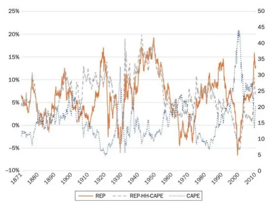
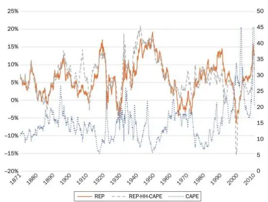
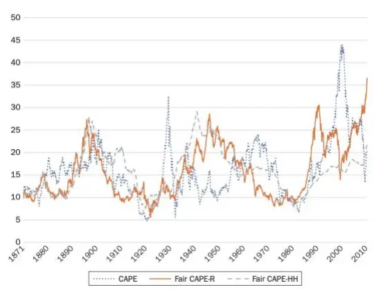
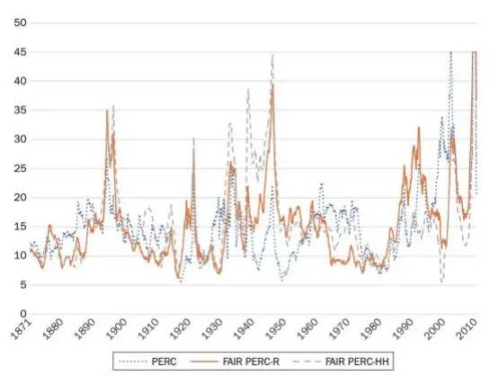

nInfo] [Table_Title] 2022.06.27

# 市盈率、商业周期和股市择时

## ——学界纵横系列之四十二

陈奥林(分析师)

## 徐忠亚(分析师)

8 021-38674835

021-38032692

chenaolin@gtjas.com

xuzhongya@gtjas.com

证书编号 S0880516100001

S0880519090002

## 本报告导读：

本文分析了市盈率与未来股市表现的关系，以及错误定价是否会为股市提供择时机会。

## 摘要：

决定市盈率的关键变量是盈利增长率、股息支付率、无风险收益率和要求的股权溢价，这些变量的变化会导致市盈率显著偏离历史平均水平，盈利增长率、股息支付率与市盈率成正比，而无风险收益率与市盈率成反比。

股市表现与基本面的度量指标：本文使用已实现的股权溢价（ ）来衡量股市表现，并在此基础上使用剔除市盈率影响的股权溢价（REP- HH），使之不受估值过高或过低（即错误定价）的影响。同时，构建了剔除股权溢价影响的市盈率（公平市盈率）来度量基本面。

市盈率对以公平市盈率衡量的股市基本面有较好的响应。通过观察市盈率偏离公平市盈率的程度，我们可以知道估值偏离基本面的程度。传统市盈率与市场基本面呈较强的正向关系。市盈率与公平市盈率在大多数情况下是一起变化的，但有两个显著的例外：一是由投资者在二战期间的悲观态度造成的，另一个则是由真正的违背市场基本面的科技泡沫造成的。

市盈率是一个有用的估值指标，它与 呈反向关系。市盈率与REP-HH 的较强反比关系突出了均值回归的重要性。市盈率和 REP之间的反比关系可能与系统性定价错误有关，但并不十分明显，如上述的两种例外，一种是可能是由投资者较为理性的预期决定的，而另一种才是错误定价所决定的。周期调整市盈率与 REP 呈较强的反向关系。

周期调整市盈率比传统市盈率更加适合择时，但获利空间小，效果较为一般。而根据已有的商业周期进行择时，似乎非常有利可图。通常情况下，股票价格在经济衰退开始前不久暴跌，并在之后迅速反弹，为择时创造了机会。

金融工程

## 金融工程团队：

陈奥林：（分析师）

电话：021-38674835

邮箱：chenaolin@gtjas.com

证书编号：S0880516100001

## 杨能：（分析师）

电话：021-38032685

邮箱：yangneng@gtjas.com

证书编号：S0880519080008

## 殷钦怡：（分析师）

电话：021-38675855

邮箱：yinqinyi@gtjas.com

证书编号：S0880519080013

## 徐忠亚：（分析师）

电话：021- 38032692

邮箱：xuzhongya@gtjas.com

证书编号：S0880519090002

## 刘昺轶：（分析师）

电话：021-38677309

邮箱：liubingyi@gtjas.com

证书编号：S0880520050001

## 赵展成：（研究助理）

电话：021-38676911

邮箱：Zhaozhancheng@gtjas.com

证书编号：S0880120110019

## 张烨垲：（研究助理）

电话：021-38038427

邮箱：zhangyekai@gtjas.com

证书编号：S0880121070118

## 徐浩天：（研究助理）

电话：021-38038430

邮箱：xuhaotian@gtjas.com

证书编号：S0880121070119

## [Table_Re相关报告

危机经历与个人风险偏好 2022.05.17

基于机器学习方法的股债相关性预测2022.04.26

基于波动率分解的高频波动率预测模型2022.04.22

基于非层次聚类的风险平价资产配置模型2022.04.14

重新思考深度学习的泛化能力 2022.03.29

## 1. 引言

股票市场一直是很不稳定的。由于暴涨暴跌反复发生，股价的快速上涨给许多投资者敲响了警钟。高市盈率（P/E）或经济衰退的高概率通常会加剧人们对股价上涨的担忧。投资者担心，企业盈利增长的速度可能不足以证明价格上涨是合理的，甚至由于经济低迷，盈利甚至可能下降。在这篇文章中，分析了这些担忧在多大程度上是合理的，并讨论了错误定价是否为股市择时提供了机会。

股价是前瞻性的（未来现金流），但市盈率是回溯性的（近期收益）。因此，在概念层面，人们无法判断市盈率是否处于正确水平。市盈率作为估值指标的有效性是一个经验问题。利用 149 年的月度股市数据，本文研究了市盈率与股市未来表现之间的关系。作为未来业绩的衡量标准，本文使用了一个已实现的股权溢价（REP），包括未来收益、股息支付和无风险回报率。本文还构建了一个与股市基本面一致的公平市盈率，并与实际市盈率进行比较，以衡量实际市盈率在多大程度上被股市基本面所解释。虽然股票价格反映了无限的现金流，但经济衰退只会在短期内影响企业的现金流。因此，典型的衰退对股价的影响应该是温和的。本文同时研究了股市是否对衰退反应过度。

主要发现如下：市盈率与长期（ 年）和短期（ 年） 均呈负相关关系。市场基本面在一定程度上解释了市盈率的变化。虽然周期调整市盈率（CAPE）与 REP 呈较强的反比关系，但传统市盈率（PERC）与市场基本面呈较强的正相关关系。尽管市盈率和 REP 之间存在很强的反比关系，但基于市盈率的市场择时的潜在利润很小。考虑到滞后的附加风险，基于市盈率的股市择时选择对长期投资者来说似乎不是一个好的投资策略。然而，基于商业周期的股市择时选择是非常有利可图的。在许多情况下，股票价格在经济衰退开始前不久开始快速下跌，并在衰退（复苏）结束前不久强劲反弹。

这些结果表明，市盈率可能反映了市场基本面和系统性的错误定价。市盈率和 之间的反比关系使得系统性错误定价的可能性很大，但并没有充足的证据证明。一种可能性是，对低概率结果的理性预期连续几次均未实现。然而，要将对经济衰退的反复过度反应与市场效率协调起来就更困难了。短期和中期的一些系统性错误定价似乎是不可否认的。

## 2. 市盈率

市盈率衡量公司当前股价相对于公司近期业绩的合理程度。股票价格应等于股票未来现金流的现值，包括股息支付和投资期结束时的销售价格。因为销售价格反映了从那时起的未来股息，所以任何给定时间点的股票价格都应该是未来无限股息流的现值。然而，准确预测未来无限股息和贴现率是不可能的。

一种可行的方法是从这些变量的历史行为推断它们的未来行为。假设决定现值的关键变量在未来保持不变，则未来股息的现值可以表示为：

$$
\mathrm{PV}=\pi_{0}=\sum_{t=1}^{\infty}\frac{(1+g)^{t}\alpha E}{(1+\rho)^{t}}=\frac{(1+g)\alpha E}{\rho-g}
$$

式中， $\pi_{0}$ 为第 0 期股价； $g$ 为盈利增长率；α是作为股息支付的收益的比例（股息支付率）；E为当期收益； $\rho.$ 是投资者要求的股票收益率，是由无风险收益率和要求的股权溢价（DEP）组成的贴现率。

从上式中，可以推导出市盈率为

$$
\frac{\pi_{0}}{E}=\frac{(1+g)\alpha}{\rho-g}
$$

在这个方程中，决定市盈率的关键变量是盈利增长率、股息支付率、无风险收益率和 DEP。如果这些决定当前价值的关键变量恢复到历史平均水平，那么市盈率是衡量股票估值的一个很好的指标。

关键变量可能会偏离历史平均水平，可能有如下原因：长期的经济停滞或技术突破可以显著地改变盈利增长率。制度因素，如公司治理和税法，可能会影响股息支付率。经济增长、经济稳定和人口构成等可能会影响无风险收益率。DEP 取决于股票相对于其他投资机会的吸引力。因此，在概念层面，人们可以很容易地证明高市盈率是由于一个关键变量偏离了历史平均水平而造成的。

让我们考虑一个使用历史平均值的数值例子。从 1871 年 1 月到 2020 年1 月，平均市盈率为 15.78，盈利增长率为 3.97%（几何平均值），派息率为 0.61，3 个月期国债利率为 2.96%（几何平均值）。几何平均值是将初始投资的价值与投资期限结束时的价值相结合的恒定的年增长率，它可能与算术平均值显著不同。本文用 个月期国债利率作为无风险利率的代表。由前面的公式可得，当市盈率、盈利增长率和派息率处于历史平均水平时，贴现率为 7.99%，对应的 DEP 为 5.03%。

表 1：市盈率的敏感性

| 盈利增长率 |  | 折现率 |  | 股息支付率 |  |
| --- | --- | --- | --- | --- | --- |
| 变动量 | 市盈率 | 变动量 | 市盈率 | 变动量 | 市盈率 |
| +1 pp | 21.20 | +1 pp | 12.63 | +0.1 | 18.36 |
| +2 pp | 32.00 | +2 pp | 10.54 | +0.2 | 20.95 |
| +3 pp | 63.97 | +3 pp | 9.03 | +0.3 | 23.54 |
| -1 pp | 12.51 | -1 pp | 21.00 | -0.1 | 13.19 |
| -2 pp | 10.33 | -2 pp | 31.40 | -0.2 | 10.60 |
| -3 pp | 8.77 | -3 pp | 62.18 | -0.3 | 8.02 |

数据来源：《The P/E Ratio, the Business Cycle, and Timing the Stock Market》，国泰君安证券研究

市盈率对公式中三个变量中的任何一个的变化都高度敏感。表 1 显示了在其他两个变量保持历史平均水平的情况下，市盈率随每个变量的变化情况。当盈利增长率高于历史平均水平 1 个百分点（从 3.97%上升到4.97%），且贴现率和派息率处于历史平均水平（分别为 7.99%和 0.61）

时，市盈率为 21.2。市盈率可以达到一个惊人的水平。例如，盈利增长率增加 3 个百分点或折现率减少 3 个百分点，市盈率就会提高到 60 以上。

虽然盈利增长率永久性地上升 3 个百分点的可能性很小，但可以想象的是，贴现率将下降 3 个百分点。折现率 7.99%是由无风险利率 2.96%和股票溢价 5.03%组成。因为股票是有风险的，DEP 应该大于零；然而，它不必超过 5%。股票的吸引力取决于它的风险和流动性。随着企业部门的稳定性和透明度的提高，股票的风险可能会比以前低。股票的流动性也更强，因为交易成本更低（例如，电子交易降低了交易成本）。Hasbrouck和 Schwartz （1988）表明了股票交易的执行成本作为交易成本的一个组成部分的重要性，根据他们的观点，分数报价（将价格四舍五入到最接近的分数，如八分之一）提高了执行成本。小数报价取代了分数报价，降低了执行成本。在风险较低、流动性较高的情况下，2%的 DEP 可能是合理的。Mehra 和 Prescott（1985）认为，直到 20 世纪 80 年代，股票溢价一直高得令人费解。更低的无风险利率也会降低贴现率。十多年来，美联储一直将短期利率维持在极低水平，并可能在未来十年继续实行低利率政策。正常情况下，低利率并不一定意味着有利的股市环境；它们通常与经济和企业盈利的缓慢增长有关，这可以抵消低贴现率的积极影响。然而，自大衰退以来，即使在经济稳定增长的时期，美联储也一直在压低利率。当低无风险利率与快速盈利增长相结合时，即使无风险利率在 10 年内暂时下降，也能大幅提高市盈率。低无风险利率和低 DEP（或非常低的 DEP）的结合，可以使贴现率接近，甚至低于盈利增长率。在前一种情况下，市盈率变得很奇怪，在后一种情况下变得无限；如果远期未来的收益比近期收益更有价值，那么收益的现值是无限的。

总而言之，市盈率在概念层面并没有太大意义。概念上的市盈率取决于未来的盈利增长率、股息支付比率、无风险利率和 DEP。这些变量的变化会导致正确的市盈率严重显著偏离历史平均水平。DEP 的变化空间相当大。因此，市盈率的相关性在很大程度上是一个经验问题。

## 3. 衡量股市表现

如果市盈率是一个很好的估值指标，那么它应该与股票市场的未来表现呈强烈的反比关系。分析股票市场的估值与业绩之间的关系不可避免地涉及到几个判断。

Shiller（2015）表明 CAPE 与 10 年股票实际回报率呈负相关。他将过去年的实际收益平均起来计算 。使用长期平均数的好处可能包括涵盖一个商业周期和中和短期的收入变动；然而，本文也可以想到一些缺点。经济基本面可能在 10 年期间发生变化，10 年的收入几乎不相关。另外，10 年平均收益受 10 年期间的增长率的影响。快速（缓慢）增长意味着相对于最新收益的 10 年平均收益低（高）。这可能会带来一些噪音影响。因此，目前还不清楚 CAPE是否优于使用最近四个季度的传统的市盈率（PERC）。使用 10 年的实际回报率作为业绩衡量标准也会引发一些问题。实际回报率是消费储蓄决策的关键变量，但相对于其他投资的回报率可能与投资决策更相关。另一个问题是，如果股票在 10 年期结束时碰巧被错误定价，那么 10 年期回报率就没有真正意义了。时间框架的选择（10 年，而不是 5 年或 15 年）也是一个棘手的问题。

Park（2000）将 PERC 对未来（1-10 年）的盈利增长率和未来无风险利率（3 个月期国债利率）进行了回归，发现这两个变量可以解释大部分的市盈率变动。这种方法避免了使用不确定性的未来价格。它的缺点是不考虑派息率。高派息率意味着公司的再投资减少，这导致了较低的盈利增长率和较慢的股价上涨。然而，投资者可以通过将股息再投资于股票来抵消这种影响。因此，如果股息支付率偏离历史平均水平，盈利增长率可能无法准确反映股市表现。

在本文中，使用 REP 作为主要的衡量股价表现的指标。REP 是允许股息再投资的年度股票回报率的几何平均值减去 3个月国债利率的几何平均值。为了计算 REP，本文假设投资者以当前价格对股息进行再投资，并在投资期结束时以市场价格出售其股票，具体计算过程如下。首先，考虑投资者在第0年购买1股股票，在接下来的n年再投资该股票的股息，并在第 n 年出售所有股票。该投资的未来价值为

$$
\mathrm{FV}=(1+\mathrm{a})\pi_{n}=\left(1+\sum_{i=1}^{n}{\frac{d_{i}}{\pi_{i}}}\right)\pi_{n}=\pi_{0}(1+r)^{n}
$$

其中，a为通过股息再投资获得的额外股份数量，π为股价，d为股息，r为使初始投资等于FV的收益率。下标为年份。在第 i 期，股息为 $d_{i}$ ，投资者购买了 $\frac{d_{i}}{\pi_{i}}$ 的股票。则 REP 由下式计算得到

$$
{\mathrm{REP}}=\left({\frac{\mathrm{FV}}{\pi_{0}}}\right)^{\frac{1}{n}}-1-r_{f}
$$

其中 $r_{f}$ 为投资期内的无风险回报率的几何平均值。

本文还试验了假设的股权溢价（REP-HH），如果投资期结束时的股票价格使市盈率达到其历史平均值（历史市盈率一致价格），那么将实现该假设的股权溢价。对于 REP-HH的计算，假设投资者以基于历史市盈率一致价格调整的价格对股息进行再投资，并以历史市盈率一致价格出售。假设价格为 100美元，投资期结束时市盈率为 20，历史平均市盈率为15。那么，历史市盈率一致价格为 $100\times15/20$ ，即 75 美元。本文还使用投资期间实际价格的平均值与初始价格平均值和历史市盈率一致价格平均值的比率，来调整通过股息再投资获得的股份数量；如果最终价格不同，中间价格也会不同。REP-HH 的具体计算过程如下：在假设下，投资的未来价值为

$$
\mathrm{FV}_{H}=(1+\mathrm{a}_{H})\pi_{nH}=\biggl(1+\frac{2\mathrm{Avg}(\pi_{i})}{\pi_{0}+\pi_{nH}}\mathrm{a}\biggr)\frac{\mathrm{PER}_{\mathrm{A}}}{\mathrm{PER}_{\mathrm{n}}}\pi_{n}=\pi_{0}(1+r)^{n}
$$

其中 $\pi_{nH}$ 是使市盈率在第 n 年达到历史平均水平的股价， $\operatorname{Avg}(\pi_{i})$ 是第 1年到第 $n$ 年的平均股价，PER $\mathbf{\nabla}\cdot\mathbf{A}\cdot\mathbf{\nabla}$ 是市盈率的历史平均水平，PER 是第 $\mathbf{\nabla}\cdot\mathbf{n}\cdot$ $n$ 年的市盈率，下标 H表示假设情况。如果价格从 $\scriptstyle{\mathcal{\pi}}_{0}$ 变化到 $\pi_{nH}$ ，而不是 $\scriptstyle{\pi_{n}}$ ，第 年和第 $n$ 年之间的价格也会不同，因此投资者可以通过股息获得的股票数量也会不同。因此，a 通过 n 年期间的平均价格与该期间假设的平均价格的比率进行调整 $\frac{\pi_{0}+\pi_{nH}}{2}$ 。假设价格在0年到n年之间线性变化。我们可以创建每个 n 年周期的假设的价格路径，并直接计算 $\cdot\mathsf{a}_{H}$ 。然而，由于 n 年周期的重叠数量非常多(当 n 为 10 时超过 1600 次)，数据工作将过于庞大，而且容易出错。相应的 REP-HH由下列公式计算得到

$$
{\mathrm{REP-HH}}=\Big(\frac{\mathrm{FV}_{H}}{\pi_{0}}\Big)^{\frac{1}{n}}-1-r_{f}
$$

REP-HH 的关键假设是，投资者估计相关经济变量在未来某一段时间内的走势，并期望这些变量在可预见的时期结束时回到历史平均水平。为简单起见，假设收益增长是唯一相关变量。第 0 年的投资者正确地估计了未来 年的快速盈利增长和此后的正常盈利增长。 年的快速盈利增长将使未来现金流的现值提高 30%。那么，市盈率在第 0 年将高于历史平均水平 30%，在第 10 年将回到历史平均水平，而 10 年期间的 REP-HH将是历史平均水平，因为更高的买入价格完全反映了这 10 年更高的收益。在这种情况下，市盈率和 REP-HH之间不存在相关性。然而，如果对 10 年期间收益增长的正确估计是历史平均水平，那么第 0 年的高市盈率将导致 10 年期间相应的低 REP-HH。

REP 作为衡量股市表现的指标有几个优点。它考虑了利率（或贴现率）和股息支付率的影响。REP-HH 在一定程度上解决了投资期限结束时股票定价错误的问题。此外，无风险收益率的净收益率比绝对收益率对投资决策的相关性更大。

## 4. 市盈率、股市表现和股市基本面

## 4.1. REP

如果市盈率是一个好的估值指标，那么它应该与 REP 负相关。由于CAPE引起了相当大的关注，本文同时关注 CAPE 和 PERC。本文使用了大量重叠的月度观察数据（本例中为 1669 例）。由于 10 年 REP 的计算需要未来 10 年的数据，最后一次观测值是在 2010 年 1 月。

图 1 绘制了 CAPE 与 10 年 REP 和 10 年 REP-HH-CAPE 的对比图，其中 10 年 REP-HH-CAPE 是根据历史 CAPE 一致的价格绘制的，是价格调整后的 REP。市场表现的两个指标（REP 和 REP-HH-CAPE）和 CAPE趋向于相反的方向，而 REP-HH-CAPE 的反向关系似乎更强。图 2 显示了 PERC 与 REP 和 REP-HH-CAPE 之间的关系，REP-HH-CAPE 由与历史 PERC 一致的价格得出，结果显示：REP 和 REP-HH-CAPE 都与 PERC成反比关系，而 REP-HH-CAPE 的反比关系更强。因为 PERC 在某些情况下非常高（超过 100），在本文中使用的 PERC 被限制在 45。

图 1 CAPE和 10 年期 REP

图 2 PERC 和 10 年期 REP

数据来源：《The P/E Ratio, the Business Cycle, and Timing the Stock Market》, 国泰君安证券研究

市盈率与股市表现之间的反比关系表明，市盈率可以作为衡量股市估值的有用指标。REP-HH 的较强反比关系突出了均值回归的重要性。市盈率作为估值指标的价值主要来自均值回归；通过使用投资期结束时的历史市盈率一致价格，REP-HH强制均值回归。这一发现还表明，在 10 年期间，相关经济变量的变化不足以证明市盈率偏离其历史平均值的合理性，从而证实了市盈率作为估价指标的有用性。

## 4.2. 公平市盈率

投资者不可能完全失去理性。为了衡量市盈率在多大程度上反映了投资者的理性预期，本文构建了一个公平市盈率，并与实际市盈率进行比较。公平市盈率是在给定 10年期间的相关经济变量和 10年期间结束时的价格的情况下，在第 0 年的市盈率，该市盈率使 10 年期间的股权溢价达到历史平均水平。为了计算公平市盈率，本文再次用实际价格和历史市盈率一致价格进行了实验。

公平市盈率是第 0 年的公平价格与收益的比率。公平价格是产生 DEP 的价格，它被假定为整个样本期间 REP 的几何平均值。公平价格为

$$
\pi_{0F}=\frac{(1+\mathsf{a}_{F})\pi_{n}}{(1+r_{D})^{n}}=\frac{\left(1+\frac{2\mathsf{Avg}(\pi_{i})}{\pi_{0F}+\pi_{n}}\mathsf{a}\right)\pi_{n}}{\left(1+\mathsf{DEP}+r_{f}\right)^{n}}
$$

其中 $r_{D}$ 为要求的回报率，等于 DEP 加 $\mathtt{L}r_{f}$ 。在计算 $\cdot\mathsf{a}_{F}$ 时，假设在投资期内价格从 $\scriptstyle{\mathcal{\pi}}_{0F}$ 到 $\pi_{n}$ 呈线性变化。因为 $\mathtt{a}_{F}$ 是 $\scriptstyle\pi_{0F}$ 的函数，代数关系很复杂。要得到 $\pi_{0F}$ ，必须使用二次公式解出下面的二次方程。

$$
{\pi_{0}}{r^{2}}+\left[\frac{\{(1+r_{D})^{n}-1\}\pi_{n}}{(1+r_{D})^{n}}\right]\pi_{0F}-\frac{{\left(\pi_{n}+2\mathrm{aAvg}(\pi_{i})\right)}\pi_{n}}{(1+r_{D})^{n}}=0
$$

用于计算第 0 年市盈率 $(\mathrm{PER}_{0})$ 的收益为 $\mathfrak{\pi}_{0}/\mathrm{PER}_{0},$ 因此基于第 n 年已实现价格的第 0 年公平市盈率（公平 PER-R）为

$$
\mathrm{PER}_{0\mathrm{F}}=\frac{\pi_{0F}}{\pi_{0}}\mathrm{PER}_{0}
$$

基于假设的第 n 年价格，第 0 年的公平价格为

$$
\pi_{0FH}=\frac{\displaystyle(1+{\bf a}_{FH})\pi_{nH}}{\displaystyle\big(1+{\bf DEP}+r_{f}\big)^{n}}=\frac{\displaystyle\left(1+\frac{2\mathrm{Avg}(\pi_{i})}{\pi_{0FH}+\pi_{nH}}{a}\right)\pi_{nH}}{\displaystyle\big(1+{\bf DEP}+r_{f}\big)^{n}}
$$

则相应的基于假设的第 n 年价格，第 0 年公平市盈率（公平 PER-HH）为

$$
\mathrm{PER}_{0\mathrm{FH}}=\frac{\pi_{0FH}}{\pi_{0}}\mathrm{PER}_{0}
$$

图 3 比较了 CAPE、基于已实现价格的公平 CAPE（公平 CAPE-R）和基于历史 CAPE 一致价格的公平 CAPE（公平 CAPE-HH）。CAPE 和两个公平 CAPE 经常朝着同一方向移动，但这种正向关系并不强。在图 4中，绘制了 PERC、基于已实现价格的 PERC（公平 PERC-R）和基于历史PERC 一致价格的 PERC（公平 PERC-HH）的关系。PERC 和公平 PERC之间的正向关系看起来更强。PERC 和公平 PERC 在大多数情况下都是一起变化的，但有两个显著的例外：20 世纪 40 年代上半年和 90 年代末。投资者在第二次世界大战中期持悲观态度是不足为奇的。只有上世纪 90 年代末的科技泡沫才是真正的例外，它违背了市场基本面。

图 3 CAPE 和公平 PE 比率

图 4 PERC 和公平 PE 比率

数据来源：《The P/E Ratio, the Business Cycle, and Timing the Stock Market》, 国泰君安证券研究

本文还用公平市盈率回归了市盈率。最直接的回归是那些基于已实现价格的市盈率和公平市盈率之间的关系（已实现价格模型）。在已实现价格模型的基础上，本文使用了基于历史 PER 一致价格的模型（历史平均模型）和基于趋势 PER 一致价格的模型，即与市盈率时间趋势一致的价格模型（时间趋势模型）来研究市盈率和公平市盈率之间的关系。本文建立时间趋势模型有两个原因：CAPE 和 PERC 在过去 40 年都表现出了明显的时间趋势，公平 CAPE-HH 和公平 PERC-HH 的糟糕表现表明，由于市场基本面的变化，市盈率可能不再应该恢复到历史平均水平。为了衡量时间趋势，本文将 1980年至 2020年的市盈率对时间趋势进行回归。经时间趋势调整后的公平市盈率(公平 PER-HT)是 1980-2010 年回归的预测值和 1871 -1979 年早期的平均值。更精细的方法也会产生类似的结果。

如前所述，股票溢价的历史平均值高得令人费解，一些制度和技术发展可能导致 DEP 呈下降趋势，市盈率呈上升趋势。如果由于市场基本面的变化，市盈率确实呈上升趋势，那么使用历史平均值将导致系统性偏差。

另一方面，很难断言不断变化的市场基本面对估计的时间趋势负有全部责任。可以说，时间趋势可能只是反映了非理性繁荣推动的长期牛市。尽管历史平均模型可能无法适应不断变化的市场基本面，但时间趋势模型可能会过度调整。因此，明智的做法是主要关注已实现的价格模型，并从历史平均模型和时间趋势模型中得出其他推论。

图 5 显示了回归结果。CAPE 是模型 1、2、3 （CAPE 模型）中的因变量，PERC 是模型 4、5、6 （PERC 模型）中的因变量。通过唯一的解释变量，模型 1 和 4 是已实现价格模型，模型 2 和 5 是历史平均模型，模型 3 和 6 是时间趋势模型。公平市盈率的系数在模型 2 的 0.3140到模型 3 的 0.6034 之间。根据已实现价格模型，公平市盈率每增加 1，实际市盈率就会增加约 0.45。这些结果表明，市盈率对以公平市盈率衡量的股市基本面有较好的响应。

在 CAPE 模型与 PERC 模型（模型 1 与模型 4，模型 2 与模型 5，模型 3与模型 6）的两两比较中，从经济和统计显著性上衡量，模型 4 和 5 的公平市盈率的解释力高于模型 1 和模型 2。根据R2衡量的回归拟合度，PERC 模型明显优于 CAPE 模型。在 CAPE 模型中，时间趋势模型表现最好，而在 PERC 模型中，已实现价格模型和时间趋势模型表现相似（模型 4 的系数较大，但R2较低）。历史平均模型在 CAPE 和 PERC 模型中表现最差。

表 2：市盈率对公平市盈率的回归

|  | 变量 |  | 估计系数 |  |  |
| --- | --- | --- | --- | --- | --- |
|  | 市盈率 | 公平市盈率 | 横截项 | 公平市盈率 | R2 |
| 模型1 | CAPE | F-CAPE-R | 9.3328 | 0.4231 | 0.1564 |
|  |  |  | (22.84) | (17.57) |  |
| 模型2 | CAPE | F-CAPE-HH | 11.0453 | 0.3140 | 0.0530 |
|  |  |  | (20.46) | (9.66) |  |
| 模型3 | CAPE | F-CAPE-HT | 6.3272 | 0.6034 | 0.2812 |
|  |  |  | (15.68) | (25.53) |  |
| 模型4 | PERC | F- PERC -R | 7.6666 | 0.4930 | 0.3056 |
|  |  |  | (25.32) | (27.08) |  |
| 模型5 | PERC | F- PERC -HH | 9.6364 | 0.3521 | 0.1728 |
|  |  |  | (29.64) | (18.66) |  |
| 模型6 | PERC | F- PERC -HT | 7.9065 | 0.4604 | 0.3345 |
|  |  |  | (28.44) | (28.95) |  |

数据来源：《The P/E Ratio, the Business Cycle, and Timing the Stock Market》, 国泰君安证券研究

总体而言，尽管 PERC 波动性很大，其预测股市基本面更加可靠。考虑到投资者情绪的波动性和股市的许多不确定性，模型 和 的R2超过令人印象深刻。PERC 与股市基本面之间的较强关系与 CAPE 与 REP 之间的较强反向关系一致。如果市盈率完全反映股市基本面，则与 REP 无关。相反，完美衡量错误定价的市盈率与股市基本面无关。与其他模型相比，历史平均模型的表现较差，这也是一个信息；这表明，投资者除了可以合理地预见短期和中期发展外，还可以很好地感知股市的长期方向。

## 5. 股市择时

股票有时可能被错误定价。一个重要的问题是，根据市盈率或商业周期来选择股市时机，投资者是否能获得显著收益。为了研究这个问题，本文查看了高市盈率案例和低市盈率案例的 REP：前 5% （T5），前 10%（T10，包括前 5%），后 5% （B5）和后 10%（B10，包括后 5%）。本文还分析了股市表现与经济衰退之间的关系。

## 5.1. 基于市盈率进行择时

表 3 显示了高 CAPE 和低 CAPE案例的 10 年和 2 年 REP。毫不奇怪，对于低 CAPE的案例，平均 REP 显著高于样本平均值，而对于高 CAPE案例，平均 REP 显著低于样本平均值。

表 3： CAPE 和 REPs（年化）

| CAPE | 平均值 | 中位数 | 标准差 | 最大值 | 最小值 |
| --- | --- | --- | --- | --- | --- |
| A组：10年投资期 |  |  |  |  |  |
| 前 5%（≥ 27.28） | -0.11% | 0.19% | 3.68% | 7.06% | -6.59% |
| 前 10%（≥ 23.50） | 2.27% | 3.72% | 4.22% | 9.26% | -6.59% |
| 后 5%（≤ 7.83） | 10.96% | 11.85% | 4.30% | 17.01% | -2.56% |
| 后 10%（≤9.13） | 9.30% | 8.99% | 4.46% | 19.23% | -2.56% |
| 整个样本 | 6.08% | 5.98% | 4.94% | 19.23% | -6.59% |
| B组：2年投资期 |  |  |  |  |  |
| 前 5%（≥ 27.65） | -1.59% | -0.27% | 15.70% | 24.80% | -38.15% |
| 前 10% （≥25.23） | 0.87% | 6.35% | 15.66% | 29.38% | -49.05% |
| 后 5%（≤7.95） | 11.06% | 12.68% | 12.51% | 51.94% | -15.12% |
| 后 10%（≤9.24） | 11.53% | 11.91% | 11.68% | 51.94% | -15.12% |
| 整个样本 | 6.81% | 6.78% | 13.49% | 52.27% | -51.52% |

数据来源：《The P/E Ratio, the Business Cycle, and Timing the Stock Market》, 国泰君安证券研究

尽管高 CAPE案例的 10 年 REP 较低，但前 10%的 10 年 REP 显著为正（2.27%）。前 5%为负（-0.11%），但幅度很小。中位数为正，最大值相当大。在 案例中，出售股票并将资金存入无风险资产的投资者，在10 年期结束时，平均领先约 1.1 个百分点（10×0.11）。这是一个税前回报。对于拥有可观资本收益的投资者来说，提前缴纳资本收益税可能会使市场时机的税后回报率变为负值。此外，尽管将资金存放在无风险资产中可以降低 10 年期回报的波动性，但也可以使长期回报更加波动。图1 显示了 CAPE 和 REP 的均值回归。REP 的均值回归将使那些坐等 10年的投资者的 20 年期的回报率更加不稳定；他们不会有 20 年的时间来相互抵消。还有其他类型的风险，落后或错过是一个严重的风险。T5 案例中的最大的年度 REP 为 7.06%，这将使 10 年累积 REP 几乎达到100%——投资者可能会错过机会。当投资者关心相对收入和绝对收入时，偏离投资组合的选择是非常不可取的（Park 2009）。因此，即使是在 T5案例中，选择无风险资产而非股票的投资者从长远来看也不太可能取得更大收益。另一方面，更多地投资 B10 和 B5 的股票似乎是有益的；10年平均和中位数的 REP 远远高于整个样本的 REP，而用最低 REP 所衡量的风险是适中的。

在 情况下，平均两年的 是适当正值，而在 的情况下是适当负值。T5 情况下的中位数也是负的，而 T5 和 T10 情况下的最小值是极度负的。选择短期市场时机的回报大于选择长期市场时机的回报。在 T5案例中，投资者将资金投入无风险资产中两年，在两年期满时平均将领先 3.2 个百分点。虽然这可能被认为是一项有意义的收益，但在许多情况下，提前缴纳资本利得税可能会抵消掉这一收益。此外，对于风险承受能力较低的长期投资者来说，选择短期的市场时机可能不是一个好策略，因为它可能会使长期回报更加不稳定。此外，对于许多专业的基金经理来说，对表现不佳的市场的惩罚可能会很严重。

表 4 是与 PERC 的表 3 对应的。在任何情况下，10 年和 2 年的平均 REP都不是负的。因此，对于卖出时机，PERC 似乎没有 CAPE 有用。对于买入时机，CAPE 和 PERC 似乎都是有用的。PERC 甚至显示出一个优势：长期投资者的下行风险更有限。在 B10 和 B5 情况下，最低 10 年的REP 都是可观的正值。

表 4：PERC 和 REPs（年化）

| PERC | 平均值 | 中位数 | 标准差 | 最大值 | 最小值 |
| --- | --- | --- | --- | --- | --- |
| A组：10年投资期 |  |  |  |  |  |
| 前 5%（≥26.27） | 2.80% | 1.01% | 6.32% | 15.91% | -6.59% |
| 前 10%（≥ 21.61） | 4.64% | 5.57% | 5.24% | 15.91% | -6.59% |
| 后 5%（≤7.74） | 12.20% | 13.34% | 4.11% | 19.23% | 5.55% |
| 后 10%（≤ 9.01） | 11.24% | 10.86% | 4.28% | 19.23% | 3.13% |
| 整个样本 | 6.08% | 5.98% | 4.94% | 19.23% | -6.59% |
| B组：2年投资期 |  |  |  |  |  |
| 前 5%（≥ 25.85） | 1.58% | 1.56% | 14.52% | 34.03% | -25.32% |
| 前 10% （≥ 22.27） | 5.01% | 7.44% | 11.89% | 34.03% | -25.32% |
| 后 5%（≤7.79） | 12.18% | 13.68% | 11.73% | 31.56% | -9.93% |
| 后 10%（≤ 9.13） | 11.39% | 12.52% | 11.15% | 31.56% | -13.98% |
| 整个样本 | 6.82% | 6.79% | 13.49% | 52.27% | -51.52% |

数据来源：《The P/E Ratio, the Business Cycle, and Timing the Stock Market》, 国泰君安证券研究

## 5.2. 基于商业周期进行择时

在样本期内，美国经济经历了 29 次衰退，持续了 6 至 65 个月。表 5 显示了在衰退开始前不久（1 个月和 3 个月）和衰退（复苏）结束前不久（ 个月和 个月）所做投资的 。对于经济衰退前的投资， 年的REP 略低于样本平均值，而对于经济复苏前的投资，则略高于样本平均值。考虑到典型的衰退是短暂的，REP 的适度差异创造了大量利润的机会。简单地说，假设经济衰退持续了一年，投资者在经济衰退前 3 个月抛售股票，将资金投入无风险资产，并在经济复苏前 3 个月回购股票。

无风险收益率为 3%。根据复苏前三个月投资的平均 10 年 REP，投资者在第一年只会获得无风险回报（3%），在第 2 年到第 11 年将获得 10.88%（3%加 7.88%的 REP）。到第 11 年年底，1 美元将涨到 2.89 美元。持有股票的投资者从第 1 年到第 10 年的回报率为 8.85%（3%加上 5.85%的REP)，第 11 年的样本平均回报率为 9.08%。然后 1 美元将增长到 2.59美元。在 11 年的期限内，这种市场时机选择将带来 30 个百分点的额外回报。以两年期的股票溢价为基础重复同样的计算，三年期的额外回报率将达到 20 个百分点。在大多数情况下，这应该足以承受税收打击。对于拥有30%资本收益的人，以15%的税率标准，税收为销售收入的4.5%。

表 5：商业周期和 REPs（年化）

| 投资择时 | 平均值 | 中位数 | 标准差 | 最大值 | 最小值 |
| --- | --- | --- | --- | --- | --- |
| A组：10年投资期 |  |  |  |  |  |
| 经济衰退开始前3个月 | 5.85% | 4.81% | 5.46% | 15.82% | -3.87% |
| 经济衰退开始前1个月 | 5.84% | 5.30% | 5.33% | 16.37% | -4.43% |
| 经济衰退结束前3个月 | 7.88% | 7.09% | 4.98% | 18.97% | 0.09% |
| 经济衰退结束前1个月 | 7.52% | 6.81% | 4.85% | 17.73% | 0.73% |
| 整个样本 | 6.08% | 6.00% | 4.95% | 19.23% | -6.59% |
| B组：2年投资期 |  |  |  |  |  |
| 经济衰退开始前3个月 | 0.44% | 0.32% | 12.75% | 28.77% | -23.69% |
| 经济衰退开始前1个月 | 1.48% | 1.00% | 13.87% | 34.20% | -27.48% |
| 经济衰退结束前3个月 | 16.76% | 19.03% | 12.64% | 40.61% | -8.48% |
| 经济衰退结束前1个月 | 13.75% | 14.81% | 11.95% | 35.98% | -9.93% |
| 整个样本 | 6.82% | 6.79% | 13.49% | 52.27% | -51.52% |

数据来源：《The P/E Ratio, the Business Cycle, and Timing the Stock Market》, 国泰君安证券研究

考察利润潜力的一种更直接的方法是观察经济衰退前后的价格变化。表6 显示了与经济衰退的前半部分重叠的不同时期的股价大幅下跌。在这些期间，平均下降幅度很大。投资者如果在衰退前 3 个月卖出股票，在复苏前 3 个月回购股票，可避免平均 15.80%的损失。这一市场时机似乎并不比在整个经济衰退期间持有股票的风险更大，若以最低回报衡量，则会涉及到巨大的下行风险。

表 6: 股票价格和经济衰退

| 周期 |  | 价格变化（非年化） |  |  |  |  |
| --- | --- | --- | --- | --- | --- | --- |
| 开始时间 | 结束时间 | 平均值 | 中位数 | 标准差 | 最大值 | 最小值 |
| 衰退开始前3个月 | 衰退结束前3个月 | -15.80% | -13.07% | 19.68% | 27.02% | -73.42% |
| 衰退开始前3个月 | 衰退结束前1个月 | -11.98% | -10.73% | 21.30% | 32.17% | -75.64% |
| 衰退开始前3个月 | 衰退结束前0个月 | -9.94% | -10.82% | 22.91% | 38.35% | -75.72% |
| 衰退开始前1个月 | 衰退结束前3个月 | -15.42% | -15.23% | 18.91% | 20.35% | -76.05% |
| 衰退开始前1个月 | 衰退结束前1个月 | -11.62% | -11.11% | 20.33% | 25.23% | -78.05% |
| 衰退开始前1个月 | 衰退结束前0个月 | -9.61% | -11.29% | 21.86% | 31.08% | -78.13% |
| 衰退开始前0个月 | 衰退结束前3个月 | -13.98% | -12.19% | 18.88% | 23.12% | -77.34% |
| 衰退开始前0个月 | 衰退结束前1个月 | -10.11% | -8.14% | 20.19% | 28.11% | -79.24% |
| 衰退开始前0个月 | 衰退结束前0个月 | -8.06% | -7.50% | 21.71% | 34.10% | -79.30% |

数据来源：《The P/E Ratio, the Business Cycle, and Timing the Stock Market》, 国泰君安证券研究

这些潜在利润大得令人费解。一个关键的问题是，投资者能否预见经济衰退。Fornari和 Lemke（2010）表明，利用衰退前一个季度可用的经济数据的模型可以相当准确地预测衰退。他们的最佳模型在单季度预测范围内正确地识别出 95%的季度是衰退或非衰退季度。即使有这样的精确度，选择市场时机也是有风险的。考虑到非衰退季度的数量远远超过衰退季度，“假阳性”（将非衰退季度归类为衰退季度）与“真阳性”（将衰退季度归类为衰退季度）的比例可能相当高。在“假阳性”的情况下抛售股票，会有大幅落后的风险。此外，计量经济模型可能无法预测由非经济因素造成的衰退，例如 2020 年的大流行病。

尽管投资者对经济衰退反应过度似乎是不可否认的，但对于这种过度反应是否会轻松地创造获利机会，还很难下定论。预测经济衰退是一项挑战。个人投资者需要考虑税收方面的后果。即使对衰退的预测能力有限，但对于那些因跑赢市场而获得高额回报的对冲基金经理来说，这应该是一个很好的投资策略。然而，对于那些因表现逊于市场而面临巨额罚款的保守基金经理而言，风险回报状况则不那么有利。巨大的潜在利润并不一定意味着风险回报对每个人都有利。

## 6. 2020 年新冠疫情

2020 年的疫情造成了严重、特殊的经济衰退。在撰写本文时（2020 年 8月中旬），经济仍处于一场涉及巨大不确定性的危机之中。由于这一事件如此具有戏剧性和独特性，股市的反应在某些方面是不同寻常的。为了使本文的分析更生动，本文接下来将讨论股票市场的发展在多大程度上与前面的分析一致，并找出可能导致不一致的因素。

直到 2020 年 2 月，COVID-19 才对美国经济构成严重威胁。2 月份非农就业人数稳步增长 25 万人。3 月和 4 月，就业人数突然分别下降 137 万和 2079 万。标准普尔 500 指数于 2 月 19 日达到 3386 点的峰值，3 月 23日跌至 2237 点（约一个月内下跌 34%），随后迅速恢复，8 月创下新纪录（8 月 18 日为 3390 点），使得估计的 PERC 近 30 点。与此同时，就业岗位减少了 2220 万个，但恢复的还不到一半（930 万个）。

如果预期企业盈利将很快反弹是合理的，那么收益下降和反弹价格所导致的高 PERC 与之前讨论的估值分析是一致的。虽然暂时的盈余冲击会显著降低 的分母，但它不会对分子有太大影响。此外，预计将持续数年的接近零的利率可以证明 PERC 的大幅提高是合理的。显著为负的实际利率还会迫使投资者承担更多风险，从而降低 DEP；即使是极度厌恶风险的投资者也可能发现负的实际回报是不可接受的，从而选择高风险的投资选项。

价格大幅下跌后出现强劲反弹，也符合投资者对经济衰退的过度反应。显然，剧烈的价格波动带来了巨大的获利机会。不过，根据官方公布的经济衰退日期，市场选择的时机可能有些偏差。价格下跌异常突然，而反弹也异常迅速。因此，在衰退前 3 个月抛售可能太早，而在复苏前 1个月买入可能太晚。经济衰退的出人意料和异乎寻常的深度很容易解释价格的突然下跌。经济的快速反弹可以归因于异常迅速和积极的货币和财政政策回应。对疫苗开发的乐观态度可能是疫情迅速反弹的另一个原因。

疫情情况仍然存在巨大的不确定性。如果新冠肺炎疫情再次出现，再加上未能开发出安全有效的疫苗，可能会导致二次衰退。通过非常规货币和财政政策注入经济的巨大流动性可能会助长资产泡沫。民主党在 2020年大选中大获全胜，可能会逆转企业所得税减税政策。急剧增加的政府债务是经济不稳定的根源。考虑到高科技部门日益重要的地位，技术进步的速度是一个很大的未知数。这些因素可能会导致股市在相当长的一段时间内剧烈波动。当尘埃落定后，经济学家们将有更多的事情要解释。

## 7. 股市基本面和投资者情绪

在前面的分析中，股市基本面只能在一定程度上解释了市盈率。因此，市盈率似乎反映了由投资者情绪引起的重大错误定价。一些发现与错误定价一致：REP 与市盈率成负相关关系；表 2 所示的公平市盈率系数在大多数模型中小于 0.5，而不是 1；股市对商业周期反应过度，创造了巨大的盈利机会。令人费解的是，系统性定价错误是如何能在本应有效的股市中持续存在的。

虽然前两个发现与系统性错误定价一致，但它们并不能构成强有力的证据。在较长的样本期内，只有少数市盈率真正偏离公允市盈率。一种可能的解释是，投资者理性地估计了出现极端结果的小概率，而这种结果碰巧没有实现。有 10%的可能性出现显著或惨淡的结果，这将极大地改变预期回报，并使市盈率大幅偏离历史平均水平成为合理的。一个有10%概率的结果连续五次没有实现是很正常的。没有实现这样的结果，并不一定意味着投资者是非理性的，也不意味着股市是无效的。

如前所述，在上世纪 40 年代的前半段和 90 年代的后半段，市盈率明显偏离了公平市盈率。第二次世界大战期间的市盈率很低是很自然的；如果美国输掉了这场战争，股票可能会变得一文不值。在 世纪 年代的后半期，人们对技术突破的期望很高。有一次期望没有实现，并不一定意味着期望太高。宽松的货币政策也有助于证明上世纪 90 年代末的高市盈率是合理的。自 2010 年代中期以来，市盈率一直很高。投资者可能期待再次出现技术突破，或者更现实地说，他们可能期待无风险利率在较长时间内保持在低位。从大衰退以来的货币政策推断，美联储似乎已经半永久性地降低了利率。考虑到人工智能的出现和持续的宽松货币政策，期待技术突破或长期低利率机制可能不是非理性的。

股市对经济衰退的反应更难解释。在经济衰退期间，企业的收益较低，但收益受到的冲击应该是暂时的。在经济衰退时期，无风险利率通常较低，这在一定程度上抵消了收益增长缓慢的影响。经济衰退增加了不确定性，进而可能增加 DEP；然而，DEP 的增加也应该是暂时的。考虑到包含 29 次衰退的大样本，出现惨淡结果的小概率很难解释在两年内大幅下跌之后出现强劲反弹的模式。另一种可能性是，即将到来的衰退促使对之前繁荣时期的过高定价进行修正，衰退前的高市盈率将支持这种可能性。然而，平均 CAPE和平均 PERC 都略低于衰退前 3 个月（分别为 16.43 和 14.23）和衰退前 1 个月（分别为 16.15 和 14.67）的历史平均水平，否认了这种可能性。股市在衰退后的强势反弹也与这种可能性不一致。似乎是投资者对经济衰退的过度反应创造了盈利机会。

尽管市场基本面应该是影响股价的主要因素，但一些系统性的错误定价似乎是不可否认的。本文可以在合理的范围内协调市盈率的适度预测能力与市场效率。然而，很难解释股市对经济衰退的频繁过度反应。在中短期和中期内，投资者情绪可能非常重要。

## 8. 原文文献结论

从概念上讲，高市盈率并不一定意味着股票被估值过高。各种因素，包括较快的盈利增长、较低的无风险利率、较低的股权溢价和较高的股息派息率，都可以证明高市盈率是合理的。特别是，考虑到股票溢价的历史平均水平非常高，一个低得多的股票溢价甚至可以证明非常高的市盈率是合理的。因此，市盈率作为估值指标的有效性是一个经验问题。

从历史上看，市盈率与以 REP 衡量的未来股市表现呈负相关，同时，市盈率在一定程度上反映了股市基本面。这些发现表明，市盈率可能既反映了被误导的市场情绪，也反映了投资者的理性预期。CAPE 似乎能更好地反映错误定价，而传统的市盈率则能更好地反映市场基本面。因此，作为一种估值指标，CAPE 似乎更有用。

错误定价应该是显著的和系统性的，以便让投资者从中获利。特别是因为市盈率与未来股市表现之间的反比关系相当强。不过，根据市盈率判断股市时机似乎很难获利，尤其是对长期投资者而言。股票溢价的历史平均水平如此之高，以至于即使市盈率非常高，也很少出现负值。短期的市场时机选择似乎有一定的空间，但预期利润很小，而且错失良机的风险很高。由市盈率所显示的错误定价，似乎并不足以产生明确的择时选择机会。根据商业周期来择时似乎更有利可图。通常情况下，股价会在经济衰退前或衰退期间下跌，然后在未来两年左右迅速反弹，从而为把握市场时机创造机会。尽管实现利润可能涉及一些与衰退预测和税收管理有关的复杂情况，其创造的潜在利润是非常大的。在市场效率的背景下解释股市对衰退的过度反应似乎是一个重大挑战。

## 9. 我们的思考

本文从实证角度分析了市盈率与未来股票市场表现之间的关系，以及过高或过低的市盈率是否为股市择时提供了机会。

市盈率对于投资者来说具有一定的作用，通过对“市盈率指标”进行调整，可以更好地分析基本面和发现错误定价的机会，为投资决策提供借鉴意见。根据市盈率与股市表现之间的反比关系，我们发现市盈率可以作为衡量股市估值的有用指标。其中，周期调整市盈率与股市表现之间的反比关系更强。同时，本文构建了公平市盈率，可以通过比较实际市盈率对其的偏离程度判断股价偏离基本面的程度。实证发现，传统市盈率似乎更能反映市场基本面。通过经过分析发现，市盈率的变化在大多数情况下可以反映股市基本面的变化。过高或过低的市盈率可能是由于短期的错误定价造成的，也可能是由投资者较为理性的预期（例如第二次世界大战）造成的。

## 本公司具有中国证监会核准的证券投资咨询业务资格

## 分析师声明

作者具有中国证券业协会授予的证券投资咨询执业资格或相当的专业胜任能力，保证报告所采用的数据均来自合规渠道，分析逻辑基于作者的职业理解，本报告清晰准确地反映了作者的研究观点，力求独立、客观和公正，结论不受任何第三方的授意或影响，特此声明。

## 免责声明

本报告仅供国泰君安证券股份有限公司（以下简称“本公司”）的客户使用。本公司不会因接收人收到本报告而视其为本公司的当然客户。本报告仅在相关法律许可的情况下发放，并仅为提供信息而发放，概不构成任何广告。

本报告的信息来源于已公开的资料，本公司对该等信息的准确性、完整性或可靠性不作任何保证。本报告所载的资料、意见及推测仅反映本公司于发布本报告当日的判断，本报告所指的证券或投资标的的价格、价值及投资收入可升可跌。过往表现不应作为日后的表现依据。在不同时期，本公司可发出与本报告所载资料、意见及推测不一致的报告。本公司不保证本报告所含信息保持在最新状态。同时，本公司对本报告所含信息可在不发出通知的情形下做出修改，投资者应当自行关注相应的更新或修改。

本报告中所指的投资及服务可能不适合个别客户，不构成客户私人咨询建议。在任何情况下，本报告中的信息或所表述的意见均不构成对任何人的投资建议。在任何情况下，本公司、本公司员工或者关联机构不承诺投资者一定获利，不与投资者分享投资收益，也不对任何人因使用本报告中的任何内容所引致的任何损失负任何责任。投资者务必注意，其据此做出的任何投资决策与本公司、本公司员工或者关联机构无关。

本公司利用信息隔离墙控制内部一个或多个领域、部门或关联机构之间的信息流动。因此，投资者应注意，在法律许可的情况下，本公司及其所属关联机构可能会持有报告中提到的公司所发行的证券或期权并进行证券或期权交易，也可能为这些公司提供或者争取提供投资银行、财务顾问或者金融产品等相关服务。在法律许可的情况下，本公司的员工可能担任本报告所提到的公司的董事。

市场有风险，投资需谨慎。投资者不应将本报告作为作出投资决策的唯一参考因素，亦不应认为本报告可以取代自己的判断。
在决定投资前，如有需要，投资者务必向专业人士咨询并谨慎决策。

本报告版权仅为本公司所有，未经书面许可，任何机构和个人不得以任何形式翻版、复制、发表或引用。如征得本公司同意进行引用、刊发的，需在允许的范围内使用，并注明出处为“国泰君安证券研究”，且不得对本报告进行任何有悖原意的引用、删节和修改。

若本公司以外的其他机构（以下简称“该机构”）发送本报告，则由该机构独自为此发送行为负责。通过此途径获得本报告的投资者应自行联系该机构以要求获悉更详细信息或进而交易本报告中提及的证券。本报告不构成本公司向该机构之客户提供的投资建议，本公司、本公司员工或者关联机构亦不为该机构之客户因使用本报告或报告所载内容引起的任何损失承担任何责任。

## 评级说明

## 1.投资建议的比较标准

投资评级分为股票评级和行业评级。以报告发布后的 12 个月内的市场表现为比较标准，报告发布日后的 12 个月内的公司股价（或行业指数）的涨跌幅相对同期的沪深 300 指数涨跌幅为基准。

## 2.投资建议的评级标准

报告发布日后的 12 个月内的公司股价（或行业指数）的涨跌幅相对同期的沪深300 指数的涨跌幅。

| 评级 |  | 说明 |
| --- | --- | --- |
| 股票投资评级 | 增持 | 相对沪深 300 指数涨幅 15%以上 |
|  | 谨慎增持 | 相对沪深 300指数涨幅介于5%～15%之间 |
|  | 中性 | 相对沪深300指数涨幅介于-5%～5% |
|  | 减持 | 相对沪深300 指数下跌 5%以上 |
| 行业投资评级 | 增持 | 明显强于沪深 300 指数 |
|  | 中性 | 基本与沪深 300指数持平 |
|  | 减持 | 明显弱于沪深300指数 |

## 国泰君安证券研究所

|  | 上海 | 深圳 | 北京 |
| --- | --- | --- | --- |
| 地址 | 上海市静安区新闸路 669 号博华广 场20层 | 深圳市福田区益田路6009号新世界 商务中心34层 | 北京市西城区金融大街甲9号金融 街中心南楼18层 |
| 邮编 | 200041 | 518026 | 100032 |
| 电话 | （021）38676666 | （0755）23976888 | (010)83939888 |
|  | E-mail: gtjaresearch@gtjas.com |  |  |