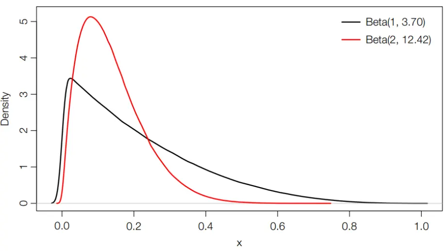

nInfo] [Table_Title] 2022.07.21

# 基于分布函数的两种非对称性测度

## ——学界纵横系列之四十四

陈奥林(分析师)

## 张烨垲(研究助理)

8 021-38674835

021-38038427

chenaolin@gtjas.com

zhangyekai@gtjas.com

证书编号 S0880516100001

S0880121070118

本报告导读：基于股票数据分布函数的非对称测度在检验股票回报的非对称性、解释预期股票回报等方面优于传统的偏度测度。

## 摘要：

le_Summary]偏度对股票回报非对称性的测量效果有限，且与股票未来期望收益的关系不确定。而在资产定价过程中，股票收益率分布非对称性对结果有重要影响，因此我们需要更有效的非对称性测度。

《Stock return asymmetry: beyond skewness》提出了两种新的基于股票回报概率分布函数的非对称测度，用于度量股票回报的非对称性以及解释高上行非对称性与低股票预期回报率的相关性。第一种是计算收益上行概率和下行概率的差值，第二种是第一种方法的熵形式，利用了收益的整个分布函数计算左侧和右侧概率密度的绝对差异。

新测度方法对非对称性的检验有效性更高：可以在每一个点比较上行与下行概率分布，因此新的测度方法可以检验出传统的偏度测度忽略的高阶非对称性，对于模拟数据、按照市值划分的投资组合、个股数据均可得到一致的结果。

新测度方法可以更好地刻画非对称性与股票未来收益的关系：通过回归模型的显著性可以发现，高偏度对股票预期收益的影响不确定，而通过文章提出的新测度测量的高上行非对称性与股票低预期回报率紧密相关。

新测度方法更稳健：偏度对波动率、投资者情绪、市场流动性以及资本利得突出量等因素的变化十分敏感，相反地新的两种度量方法效果稳定，基本不受以上众多因素的影响。

金融工程

## 金融工程团队：

陈奥林：（分析师）

电话：021-38674835

邮箱：chenaolin@gtjas.com

证书编号：S0880516100001

杨能：（分析师）

电话：021-38032685

邮箱：yangneng@gtjas.com

证书编号：S0880519080008

殷钦怡：（分析师）

电话：021-38675855

邮箱：yinqinyi@gtjas.com

证书编号：S0880519080013

徐忠亚：（分析师）

电话：021- 38032692

邮箱：xuzhongya@gtjas.com

证书编号：S0880519090002

刘昺轶：（分析师）

电话：021-38677309

邮箱：liubingyi@gtjas.com

证书编号：S0880520050001

## 赵展成：（研究助理）

电话：021-38676911

邮箱：Zhaozhancheng@gtjas.com

证书编号：S0880120110019

## 张烨垲：（研究助理）

电话：021-38038427

邮箱：zhangyekai@gtjas.com

证书编号：S0880121070118

## 徐浩天：（研究助理）

电话：021-38038430

邮箱：xuhaotian@gtjas.com

证书编号：S0880121070119

基于机器学习方法的股债相关性预测2022.04.26

基于波动率分解的高频波动率预测模型2022.04.22

## 1. 文章背景

传统的定价模型基于收益率呈正态分布的假设，然而正态分布假设有很大的局限性：实证研究中存在信息不对称、市场交易机制不完善、监管不到位等现象，导致股票收益率分布不对称，因此我们需要有效刻画股票收益非对称性的方法。

偏度是常用的刻画股票回报分布非对称性的度量方法，然而这种仅基于三阶矩的传统方法难以准确度量股票的非对称性，且与股票回报的关系是不确定的：Arditti（1971）等研究发现高偏度往往与低预期回报率相关，而 Xing 等（2010）在研究中得出了相反的结论，Bali等（2011）也进一步证实偏度对预期回报率的影响并不显著。

## 2. 核心结论

本篇报告推荐的文章《Stock return asymmetry: beyond skewness》以股票回报的分布函数为基础，提出了两种新的非对称性测度，用于度量股票非对称性和解释上行不对称与预期回报率之间的关系。第一种是计算收益上行概率和下行概率的差值，第二种是第一种方法的熵形式，利用了收益的整个分布函数计算左侧和右侧概率密度的绝对差异。这两种非对称性测度既可以更有效地检验股票回报分布的非对称性，又可以稳健地解释截面上股票高上行非对称性与低预期回报率的关系——对于一些偏度为0的分布，本文的新方法可以刻画出更高阶的非对称性，从而可以提供比偏度更多的信息。

## 3. 文章模型

## 3.1. 第一种非对称性测度

第一种度量方法通过计算收益上行概率和下行概率的差值来刻画股票收益分布的非对称性，这里的上行概率和下行概率并非股票涨跌的概率，而是上涨或下跌超过某一阈值的概率之差。文章使用超额尾部概率（ ）来表示分布非对称性，即上行超过一倍标准差与下行超过一倍标准差的概率之差：

$$
IE_{\varphi}=\int_{1}^{+\infty}f(x)dx-\int_{-\infty}^{-1}f(x)dx=\int_{1}^{+\infty}[f(x)-f(-x)]dx
$$

其中x是剔除市场风险后的股票收益残差，并对其进行均值为 0 方差为 1的标准化。当 $IE_{\varphi}$ 为正时，为上行不对称，即该股票获得大额收益的概率高于遭受大额损失的概率；当 $IE_{\varphi}$ 为负时则相反。

投资者更愿意投资收益概率高于损失概率的股票，因此直观地讲，当股票获得大额收益概率高于遭受大额损失概率时，股票价格会提高，预期回报降低，即 $IE_{\varphi}$ 越大，上行非对称性越高，预期股票收益率越低。

## 3.2. 第二种非对称性测度

第二种度量方法是第一种方法的熵形式。假设收益随机变量 X 的期望值为 $\mu$ ，概率密度函数为f(x)，我们定义 X 关于均值对称的变量X̃ = −X+$2\mu$ ，密度函数为f(x̃)。通过计算两个密度函数的差值来度量序列的非对称性：

$$
IS_{\rho}=\frac{1}{2}\int_{-\infty}^{+\infty}[f(x)^{\frac{1}{2}}-f(\tilde{x})^{\frac{1}{2}}]^{2}dx
$$

不难看出，当分布完全对称时， $IS_{\rho}=0;$ ；分布非对称性越大， $IS_{\rho}$ 越大；同时，由三角不等式可以看出， $IS_{\rho}$ 取值始终在 0 和 1 之间，因此可以方便地对不同资产以及不同时期的收益非对称性进行比较。

由于 $IS_{\rho}$ 恒非负，无法区分上行不对称和下行不对称，于是文章对 $\cdot IS_{\rho}$ 进行调整：

$$
IS_{\varphi}=sign(IE_{\varphi})\times\int_{1}^{\infty}[f(x)^{\frac{1}{2}}-f(\tilde{x})^{\frac{1}{2}}]^{2}dx
$$

从两种方法的定义中我们可以看到，第一种方法是一种较粗略的方法，只使用了分布函数的部分信息，而第二种方法利用了整个分布函数的信息，可以更全面精确地刻画分布的非对称性。尽管如此，两种方法本质都是对非对称性的刻画，具有很强的相关性， $IS_{\varphi}$ 越大， $IE_{\varphi}$ 越大。

## 3.3. 估算

第一种度量方法只用到了累计分布函数在正负一倍标准差的取值，因此可以直接用经验分布函数对其进行计算。而第二种度量方法依赖收益的分布函数，文章使用 Parzen-Rosenblatt 核密度方法对收益的分布函数进行估计：

$$
{\hat{f}}(x)={\frac{1}{nh}}\sum_{i=1}^{n}k({\frac{X_{i}-x}{h}})
$$

其中n为时间序列样本 $\{X_{t}\}_{t=1}^{T}$ 上的样本数；k(∙)是一个非负有界核函数，例如正态密度；ℎ是带宽参数，最佳带宽参数可以通过 Kullback-Leibler似然函数交叉验证方法得到。

## 4. 使用不同方法检验收益对称性

文章比较了偏度和新测度方法在三个场景（模拟数据、按市值划分的投资组合、美股个股日收益率数据）中检验股票回报分布非对称性的能力。结果显示，新测度方法对非对称性的检验能力更优。

传统的检验方法将分布的正态性作为零假设，因此在检验中可能会拒绝一些对称但非正态的分布。为了更好地检验非对称性，文章使用重抽样方法进行检验，这种方法不依赖于对标的资产收益分布的假设：将$\hat{t}_{SKEW}=\widehat{SKEW}/\hat{\sigma}_{SKEW}$ 作为偏度的 t 统计量，其中SKEŴ 表示样本偏度，$\hat{\sigma}_{SKEW}$ 是 Racine（1997）提出的重采样法计算得到的标准差；将“概率分布具有对称性”作为零假设。

## 4.1. 模拟数据

文章采用 Racine 等（2007）的 bootstrap 重采样法，从正态分布N(120,240)、卡方分布•2(10)和 Beta(1,3.7)-Beta(1.3,2.3)分布中模拟出 399 组样本数据。

结果表明，偏度和新度量方法都未拒绝正态分布N(120,240)的零假设，并都在 5%的显著水平下拒绝了卡方分布•2(10)的零假设；但是偏度没有拒绝 Beta(1,3.7)-Beta(1.3,2.3)分布的零假设，而新测度在 1%的显著水平下拒绝了该零假设。

事实上，Beta(1,3.7)和 Beta(2,12.42)具有几乎相同的偏度，但非对称性水平不同，如图 1 所示，因此当两种概率分布偏度相同、非对称性程度不同时，需要用文章提出的新度量方法来检验非对称性的差异，文章提出的新方法可以刻画出偏度之外的高阶非对称性

这个例子体现出了新方法的优越性：我们可以非常容易地举出偏度相同但非对称性不同的例子，但不存在非对称性相同但偏度不同的例子，因为文章中计算非对称性的方法可以在每一个点比较上行与下行概率分布，因此该方法有效性更高。

图 1 Beta(1,3.7)和 Beta(2,12.42)分布的密度函数

数据来源：国泰君安证券研究，《Stock return asymmetry: beyond skewness》

## 4.2. 按市值划分的投资组合

文章使用根据公司市值大小构建的投资组合的真实数据。之所以按照市值划分投资组合是因为研究发现小市值股票往往收益的非对称性更高。如图 2 所示，我们按照市值将整个股票池划分成了 10 个投资组合，在等权重的投资组合中， $IS_{\rho}$ 在 的显著水平下检测到 个投资组合的非对称性，而偏度只检测到 1 个；在非等权重的投资组合中， $IS_{\rho}$ 在 10%的显著水平下检测到 3 个投资组合的非对称性，而偏度只检测到 2 个。由此可以看出，新检测方法可以检测出更多的非对称性特征。

图 2 投资组合非对称性结果

|  | Value Weighted |  |  |  | Equal Weighted |  |  |  |
| --- | --- | --- | --- | --- | --- | --- | --- | --- |
| Portfolios | ISKEW | p-Value | ISp × 100 | p-Value | ISKEW | p-Value | ISρ × 100 | p-Value |
| Size 1 | 0.944** | 0.023 | 1.263*** | 0.000 | 1.307*** | 0.005 | 2.334*** | 0.000 |
| Size 2 | 0.796 | 0.226 | 1.151*** | 0.000 | 1.080 | 0.185 | 1.088*** | 0.003 |
| Size 3 | 0.426 | 0.243 | 0.769** | 0.030 | 0.930 | 0.120 | 0.683* | 0.063 |
| Size 4 | 0.207 | 0.607 | 0.259 | 0.454 | 0.743 | 0.308 | 0.448 | 0.228 |
| Size 5 | 0.019 | 0.932 | 0.389 | 0.343 | 1.095 | 0.248 | 0.390 | 0.506 |
| Size 6 | 0.098 | 0.564 | 0.441* | 0.085 | 0.688 | 0.143 | 0.589 | 0.125 |
| Size 7 | 0.746 | 0.185 | 0.474 | 0.246 | 0.936** | 0.038 | 0.651 | 0.140 |
| Size 8 | 0.680 | 0.341 | 0.315 | 0.722 | 0.349 | 0.125 | 0.575 | 0.286 |
| Size 9 | 0.370 | 0.303 | 0.419 | 0.266 | 1.154 | 0.378 | 0.190 | 0.927 |
| Size 10 | -0.186 | 0.717 | 0.274 | 0.333 | -0.766 | 0.160 | 0.742 | 0.221 |

数据来源：国泰君安证券研究，《Stock return asymmetry: beyond skewness》

## 4.3. 美股个股日收益率数据

文章使用 1963年 1月至 2015年 12月的 159356支美股个股日收益率数据对偏度和新度量进行检验。结果显示，在 5%的显著性水平下，偏度度量法检测到 17838 个观测样本的非对称性（11.19%），而 $IS_{\rho}$ 检测到 29348个观测样本的非对称性（ ）（这里是将一只股票一年的日度收益数据作为一个观测样本）。而且使用新检测方法检测出的具有显著非对称性的股票具有更强的“彩票”属性，这些股票有更高的最大日收益、更低的股价、更高的个体波动率、更高的个体偏度以及更高的换手率。

由此可见，不论是模拟数据还是真实数据，文章提出的新度量方法都可以比偏度更有效地检验股票回报分布的非对称性。

## 5. 实证研究：非对称性与股票收益

## 5.1. 数据

文章使用 1963 年 8 月至 2015 年 12 月在纽约证券交易所、美国证券交易所和纳斯达克交易所上市的剔除月初价格低于$5 后的普通股数据。

## 5.2. 非对称性与公司特征

文章分别实证研究 ISKEW、 $IE_{\varphi}$ $IS_{\varphi}$ 与市值因子（SIZE）、账面市值比（BM）、动量因子（MOM）、换手率（TURN）、非流动性因子（ILLQ）、市场贝塔（β）之间的关系。对以上公司特征构建 Fama-Macbeth 回归：

$$
IA_{i,t}=a_{t}+B_{t}X_{i,t}+\varepsilon_{i,t}
$$

其中 $IA_{i,t}$ 为 i公司在 t 月的 ISKEW、 $IE_{\varphi}$ 、 $IS_{\varphi}$ 值， $X_{i,t}$ 为各因子数值， $B_{t}$ 表征 ISKEW、 $IE_{\varphi}$ $IS_{\varphi}$ 与这些因子的相关性。

图 3 可以看出，ISKEW 与市值因子、账面市值比、换手率负相关，与动量因子、非流动性因子和市场贝塔正相关；除换手率外， $IE_{\varphi}$ 和 $\cdot IS_{\varphi}$ 与因子的相关性与 ISKEW 的方向相同。

图 3 非对称性与公司特征

|  | ISKEW | IEφ | ISφ |
| --- | --- | --- | --- |
| SIZE | -9.111*** (-47.33) | -0.025*** (-14.44) | –0.113*** (-19.36) |
| BM | –4.179*** (-13.29) | -0.071*** (-25.17) | -0.207*** (-22.62) |
| MOM | 0.808*** (43.85) | 0.001*** (10.78) | 0.008*** (22.69) |
| TURN | -1.141*** (-3.87) | 0.131*** (48.84) | 0.300*** (37.53) |
| ILLIQ | 1.016*** (6.52) | 0.011*** (5.64) | 0.022*** (2.42) |
| β | 1.840*** (2.86) | 0.050*** (9.72) | 0.315*** (16.37) |
| Constant | 82.386*** (61.36) | 0.152*** (12.11) | 0.545*** (15.10) |
| R2 | 0.103 | 0.028 | 0.020 |

数据来源：国泰君安证券研究，《Stock return asymmetry: beyond skewness》

## 5.3. 非对称性与预期回报率

文章实证检验了新度量方法预测股票横截面未来收益的能力并与偏度进行比较。具体来看，在公司层面构建 Fama-Macbeth 回归：

$$
R_{i,t+1}=\lambda_{0,t}+\lambda_{1,t}IA_{i,t}+\lambda_{2,t}ISKEW_{i,t}+\lambda_{t}X_{i,t}+\varepsilon_{i,t+1}
$$

其中 $R_{i,t+1}$ 是 t+1月股票的超额收益率， $IA_{i,t}$ 是 t月 i公司的 $IE_{\varphi}$ 或 $IS_{\varphi}$ 值，$X_{i,t}$ 是 t 月的市值因子（SIZE）、账面数值比（BM）、动量因子（MOM）、换手率（TURN）、短期反转因子（ILLIQ）、特质波动率（IVOL）、协偏度（COSKEW）以及协峰度（COKURT）值。

回归模型结果如图 所示。当 $IE_{\varphi}$ 、 $IS_{\varphi}$ 单独回归时，系数为负且在 1%的水平下显著，有效解释股票收益上行不对称与预期回报负相关的理论；而当 单独回归时，系数略大于零且在统计上不显著。为检验结果的稳健性，作者加入了控制变量，图 4 中 8-14 列用 Fama-French 三因子进行风险调整后的收益率代替原超额收益率，调整后 $IE_{\varphi}$ $IS_{\varphi}$ 的系数仍然在 1%的水平下显著为负，ISKEW 系数仍然为正且统计上不显著。

图 4 Fama-Macbeth 回归结果

|  | 1 | 2 | 3 | 4 | 5 | 6 | 7 | 8 | 9 | 10 | 11 | 12 | 13 | 14 |
| --- | --- | --- | --- | --- | --- | --- | --- | --- | --- | --- | --- | --- | --- | --- |
|  | R | R | R | R | R | R | R | RA | RA | RA | RA | RA | RA | RA |
| ISKEW | 0.012 (0.43) |  |  | 0.004 (0.12) | -0.005 (−0.29) | 0.012 (0.42) | 0.002 (0.10) | -0.020 (−1.08) |  |  | -0.027 (−1.38) | -0.015 (−0.94) | -0.022 (−1.12) | -0.011 (−0.68) |
| IEφ |  | -3.866*** (-2.91) |  | -4.102*** (-2.88) | -3.286*** (-4.18) |  |  |  | -2.862*** (−3.24) |  | -3.232*** (–3.49) | -2.567*** (–3.60) |  |  |
| ISφ |  |  | -0.863*** (-2.63) |  |  | -0.894*** (-2.74) | -0.738*** (−3.51) |  |  | -0.695*** (-3.21) |  |  | -0.759*** (-3.39) | -0.667*** (−3.41) |
| SIZE |  |  |  |  | -0.280*** (−8.21) |  | -0.281*** (-8.23) |  |  |  |  | -0.245*** (−12.51) |  | -0.246*** (-12.54) |
| BM |  |  |  |  | 0.185*** (3.52) |  | 0.185*** (3.52) |  |  |  |  | 0.017 (0.47) |  | 0.017 (0.48) |
| MOM |  |  |  |  | 0.008*** (5.62) |  | 0.008*** (5.59) |  |  |  |  | 0.008*** (5.65) |  | 0.008*** (5.63) |
| TURN |  |  |  |  | 0.004 (0.13) |  | 0.003 (0.11) |  |  |  |  | 0.001 (0.03) |  | 0.001 (0.05) |
| ILLIQ |  |  |  |  | 0.035** (2.40) |  | 0.035** (2.41) |  |  |  |  | 0.043*** (2.87) |  | 0.043*** (2.88) |
| β |  |  |  |  | 0.285 (1.09) |  | 0.291 (1.11) |  |  |  |  |  |  |  |
| MAX |  |  |  |  | 0.037*** (5.00) |  | 0.035*** (4.73) |  |  |  |  | 0.022*** (2.97) |  | 0.020*** (2.69) |
| IVOL |  |  |  |  | -0.445*** (-14.05) |  | -0.444*** (-14.06) |  |  |  |  | -0.342*** (-12.49) |  | -0.341*** (−12.46) |
| COSKEW |  |  |  |  | –1.313*** (-3.87) |  | –1.315*** (−3.88) |  |  |  |  | -1.113*** (-3.61) |  | –1.114** (–3.62) |
| COKURT |  |  |  |  | 0.600*** (5.32) |  | 0.598*** (5.30) |  |  |  |  | 0.681*** (8.25) |  | 0.682*** (8.26) |
| REV |  |  |  |  | –0.038*** (−10.09) |  | –0.038*** (−10.01) |  |  |  |  |  |  |  |
| REVA |  |  |  |  |  |  |  |  |  |  |  | -0.044*** (-12.28) |  | -0.044*** (-12.21) |
| Constant | 0.644*** (2.84) | 0.664*** (2.88) | 0.659*** (2.86) | 0.657*** (2.91) | 1.920*** (6.90) | 0.648*** (2.87) | 1.925*** (6.92) | 0.056 (1.59) | 0.056* (1.73) | 0.054* (1.66) | 0.066* (1.84) | 1.059*** (8.53) | 0.061* (1.73) | 1.067*** (8.59) |
| R² | 0.003 | 0.002 | 0.001 | 0.005 | 0.102 | 0.004 | 0.102 | 0.002 | 0.001 | 0.001 | 0.003 | 0.049 | 0.003 | 0.049 |

数据来源：国泰君安证券研究，《Stock return asymmetry: beyond skewness》

由此得出，高偏度对股票预期收益的影响不确定，而通过文章提出的新测度测量的高上行非对称性与股票低预期回报率紧密相关。

## 5.4. 非对称投资组合

文章按照 ISKEW、 $IE_{\varphi}\cdot IS_{\varphi}^{\ }$ 值将所有股票按从小到大的顺序分为 10 组，并计算得到每组的超额收益率、CAPM Alpha、FF3 Alpha 的均值，结果如图 5 所示。

图 5 按各非对称性测度组成的投资组合的收益

|  | ISKEW |  |  | $\underline{{1\mathsf{E}_{\varphi}}}$ |  |  | ISφ |  |  |
| --- | --- | --- | --- | --- | --- | --- | --- | --- | --- |
| Portfolio | Excess Return (%) | CAPM Alpha (%) | FF3 Alpha (%) | Excess Return (%) | CAPM Alpha (%) | FF3 Alpha (%) | Excess Return (%) | CAPM Alpha (%) | FF3 Alpha (%) |
| 1 (lowest) | 0.460** (2.19) | -0.072 (−0.77) | -0.238*** (-3.63) | 0.688*** (3.51) | 0.198** (2.16) | -0.015 (-0.28) | 0.745*** (3.45) | 0.205** (2.03) | 0.008 (0.16) |
| 2 | 0.631*** (3.23) | 0.126 (1.61) | -0.054 (-1.02) | 0.694*** (3.39) | 0.174* (1.95) | -0.031 (-0.66) | 0.750*** (3.61) | 0.223** (2.44) | 0.012 (0.24) |
| 3 | 0.637*** (3.26) | 0.132* (1.66) | -0.056 (−1.10) | 0.717*** (3.49) | 0.191** (2.20) | -0.003 (-0.06) | 0.690*** (3.43) | 0.177** (2.02) | -0.027 (-0.55) |
| 4 | 0.676*** (3.38) | 0.160** (1.97) | -0.027 (-0.56) | 0.717*** (3.44) | 0.183** (2.09) | -0.010 (-0.22) | 0.687*** (3.51) | 0.187** (2.24) | –0.013 (-0.26) |
| 5 | 0.741*** (3.60) | 0.210** (2.48) | 0.034 (0.71) | 0.694*** (3.29) | 0.151* (1.73) | -0.037 (-0.84) | 0.614*** (3.06) | 0.098 (1.17) | –0.078* (-1.72) |
| 6 | 0.782*** (3.64) | 0.234** (2.51) | 0.039 (0.83) | 0.682*** (3.19) | 0.131 (1.49) | -0.051 (−1.19) | 0.602*** (2.88) | 0.061 (0.72) | -0.113*** (-2.59) |
| 7 | 0.712*** (3.19) | 0.148 (1.48) | -0.033 (-0.68) | 0.589*** (2.75) | 0.037 (0.42) | -0.135*** (-3.16) | 0.617*** (2.91) | 0.072 (0.81) | -0.097** (-2.18) |
| 8 | 0.728*** (3.13) | 0.145 (1.35) | -0.037 (−0.73) | 0.636*** (2.93) | 0.081 (0.88) | -0.085** (-2.04) | 0.617*** (2.82) | 0.054 (0.59) | -0.116*** (-2.60) |
| 9 | 0.645*** (2.73) | 0.061 (0.53) | -0.113** (-2.17) | 0.588*** (2.66) | 0.025 (0.26) | -0.133*** (-3.06) | 0.630*** (2.79) | 0.055 (0.56) | -0.110** (-2.47) |
| 10 (highest) | 0.538** (2.45) | 0.013 (0.11) | –0.177*** (-3.13) | 0.503** (2.23) | -0.062 (-0.60) | –0.215*** (-4.49) | 0.557** (2.38) | -0.024 (−0.21) | -0.182*** (-3.50) |
| 10 – spread | 0.078 (0.82) | 0.084 (0.89) | 0.061 (0.70) | -0.186*** (-2.67) | -0.260*** (-4.02) | -0.200*** (-3.47) | -0.188*** (-3.35) | -0.229*** (-4.18) | -0.190*** (-3.69) |

数据来源：国泰君安证券研究，《Stock return asymmetry: beyond skewness》

由图中结果得到，当按照 ISKEW 进行排序时，超额收益率并不随着ISKEW 的增大而增大或减小，且最大组合和最小组合的差值并不显著；而当按照 $IE_{\varphi}$ 、 $IS_{\varphi}$ 进行排序时，超额收益单调递减且最大组合和最小组合的差值显著。结果再次证明高偏度与低预期回报率之间并无必然关系，而新度量方法捕捉到的高上行非对称性往往可以带来低预期回报率。

## 5.5. 稳定性检验

文章对偏度和新度量方法检测到的结果分别进行稳定性检验，判断其是否受到尾部风险、极端收益、财务困境、波动性、投资者情绪、市场流动性以及资本利得突出量的影响。

实证结果表明，偏度对波动率、投资者情绪、市场流动性以及资本利得突出量等因素的变化十分敏感；相反地，新的两种度量方法效果稳定，基本不受以上众多因素的影响。

## 6. 总结讨论

文章基于股票回报分布函数提出了两种新的度量收益分布非对称性的测度方法，并证明了这两种度量方法相较于偏度可以更有效地检测分布中的非对称性。实证表明，偏度对股票收益的影响是不确定的，而相比之下，新的非对称性测度可以更有效地解释高上行非对称性与低预期股票收益率之间的关系。在稳定性检验中，新的非对称测度得出的结果基本不受其他因素的影响。因此新的度量方法可以代替偏度来测量股票回报分布的非对称性，并运用在资产定价等场景中，帮助预测未来股票回报率等。

## 本公司具有中国证监会核准的证券投资咨询业务资格

## 分析师声明

作者具有中国证券业协会授予的证券投资咨询执业资格或相当的专业胜任能力，保证报告所采用的数据均来自合规渠道，分析逻辑基于作者的职业理解，本报告清晰准确地反映了作者的研究观点，力求独立、客观和公正，结论不受任何第三方的授意或影响，特此声明。

## 免责声明

本报告仅供国泰君安证券股份有限公司（以下简称“本公司”）的客户使用。本公司不会因接收人收到本报告而视其为本公司的当然客户。本报告仅在相关法律许可的情况下发放，并仅为提供信息而发放，概不构成任何广告。

本报告的信息来源于已公开的资料，本公司对该等信息的准确性、完整性或可靠性不作任何保证。本报告所载的资料、意见及推测仅反映本公司于发布本报告当日的判断，本报告所指的证券或投资标的的价格、价值及投资收入可升可跌。过往表现不应作为日后的表现依据。在不同时期，本公司可发出与本报告所载资料、意见及推测不一致的报告。本公司不保证本报告所含信息保持在最新状态。同时，本公司对本报告所含信息可在不发出通知的情形下做出修改，投资者应当自行关注相应的更新或修改。

本报告中所指的投资及服务可能不适合个别客户，不构成客户私人咨询建议。在任何情况下，本报告中的信息或所表述的意见均不构成对任何人的投资建议。在任何情况下，本公司、本公司员工或者关联机构不承诺投资者一定获利，不与投资者分享投资收益，也不对任何人因使用本报告中的任何内容所引致的任何损失负任何责任。投资者务必注意，其据此做出的任何投资决策与本公司、本公司员工或者关联机构无关。

本公司利用信息隔离墙控制内部一个或多个领域、部门或关联机构之间的信息流动。因此，投资者应注意，在法律许可的情况下，本公司及其所属关联机构可能会持有报告中提到的公司所发行的证券或期权并进行证券或期权交易，也可能为这些公司提供或者争取提供投资银行、财务顾问或者金融产品等相关服务。在法律许可的情况下，本公司的员工可能担任本报告所提到的公司的董事。

市场有风险，投资需谨慎。投资者不应将本报告作为作出投资决策的唯一参考因素，亦不应认为本报告可以取代自己的判断。
在决定投资前，如有需要，投资者务必向专业人士咨询并谨慎决策。

本报告版权仅为本公司所有，未经书面许可，任何机构和个人不得以任何形式翻版、复制、发表或引用。如征得本公司同意进行引用、刊发的，需在允许的范围内使用，并注明出处为“国泰君安证券研究”，且不得对本报告进行任何有悖原意的引用、删节和修改。

若本公司以外的其他机构（以下简称“该机构”）发送本报告，则由该机构独自为此发送行为负责。通过此途径获得本报告的投资者应自行联系该机构以要求获悉更详细信息或进而交易本报告中提及的证券。本报告不构成本公司向该机构之客户提供的投资建议，本公司、本公司员工或者关联机构亦不为该机构之客户因使用本报告或报告所载内容引起的任何损失承担任何责任。

## 评级说明

## 1.投资建议的比较标准

投资评级分为股票评级和行业评级。以报告发布后的 12 个月内的市场表现为比较标准，报告发布日后的 12 个月内的公司股价（或行业指数）的涨跌幅相对同期的沪深 300 指数涨跌幅为基准。

## 2.投资建议的评级标准

报告发布日后的 12 个月内的公司股价（或行业指数）的涨跌幅相对同期的沪深300 指数的涨跌幅。

| 评级 |  | 说明 |
| --- | --- | --- |
| 股票投资评级 | 增持 | 相对沪深 300指数涨幅 15%以上 |
|  | 谨慎增持 | 相对沪深 300指数涨幅介于5%～15%之间 |
|  | 中性 | 相对沪深300指数涨幅介于-5%～5% |
|  | 减持 | 相对沪深300 指数下跌5%以上 |
| 行业投资评级 | 增持 | 明显强于沪深 300 指数 |
|  | 中性 | 基本与沪深 300指数持平 |
|  | 减持 | 明显弱于沪深300指数 |

## 国泰君安证券研究所

|  | 上海 | 深圳 | 北京 |
| --- | --- | --- | --- |
| 地址 | 上海市静安区新闸路669 号博华广 场20层 | 深圳市福田区益田路6009号新世界 商务中心34层 | 北京市西城区金融大街甲9号金融 街中心南楼18层 |
| 邮编 | 200041 | 518026 | 100032 |
| 电话 | （021）38676666 | （0755）23976888 | (010)83939888 |
|  | E-mail: gtjaresearch@gtjas.com |  |  |