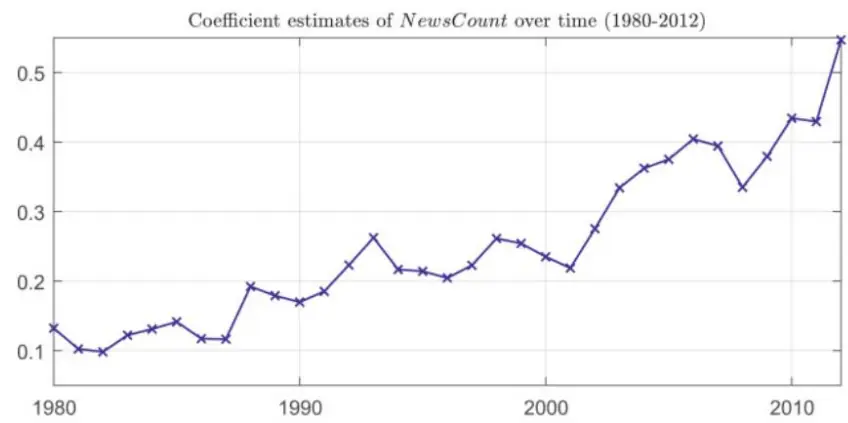

nInfo] [Table_Title] 2022.10.28

# 新闻报道对股价跳跃的影响

## ——学界纵横系列之四十五

陈奥林(分析师)

## 梁誉耀(研究助理)

8 021-38674835

021-38038665

chenaolin@gtjas.com

liangyuyao026735@gtjas.co

证书编号 S0880516100001

S0880122070051

## 本报告导读：

本文从新闻报道的频率、正负面语气词和不确定程度三个方面，分析新闻报道对股价波动的影响。

## 摘要：

le_Summary]本文探索股价跳跃与新闻报道的关系。本文使用Logistic回归检验跳跃的概率、幅度与新闻数量、正负面语气词占比之差以及不确定词语占比的关系。样本数据来自 9020 家公司和 21 万篇新闻报道。

结果显示，股价跳跃的概率、幅度与新闻报道显著相关。股价跳跃的概率与新闻报道数量、正负面语气词占比之差以及不确定词语占比正相关。其中，与新闻报道数量的关系最为强烈。

时序上，随着时间的推移，新闻报道对股价跳跃的影响力越来越大。随着互联网的广泛应用，数据提供和透明度得到提高，信息传播途径不断改进，新闻报道中公开的信息对股价的影响日益增强，尤其在2000 年之后。

截面上，大企业或者处于更透明信息环境中的公司，股票价格波动与新闻报道的关联程度更大。这些公司拥有更多的分析师，更多的独家媒体报道和更高的机构所有者。

报道类型方面，反映企业经营状况的新闻报道更能影响股价跳跃的概率和幅度。分析公司基本面的新闻，通常报道了公司的营业收入和经营利润等相关信息，这类信息对股票价格的影响程度最大。其次依次为分析师评级类报道、资本结构类信息、并购类消息、营销和投资者关系、劳工问题（包括高管更替）和产品与服务信息。

- 此外，正向报道数量与股价跳跃幅度正相关，负向报道数量与股价跳跃幅度负相关。

试验结果具有较好的稳健性。选取市值排名前20的公司和只使用新发布的新闻进行检验，结论均与使用全样本时一致。

金融工程

## 金融工程团队：

陈奥林：（分析师）

电话：021-38674835

邮箱：chenaolin@gtjas.com

证书编号：S0880516100001

## 殷钦怡：（分析师）

电话：021-38675855

邮箱：yinqinyi@gtjas.com

证书编号：S0880519080013

## 徐忠亚：（分析师）

电话：021- 38032692

邮箱：xuzhongya@gtjas.com

证书编号：S0880519090002

## 张烨垲：（研究助理）

电话：021-38038427

邮箱：zhangyekai@gtjas.com

证书编号：S0880121070118

## 徐浩天：（研究助理）

电话：021-38038430

邮箱：xuhaotian@gtjas.com

证书编号：S0880121070119

## 卢开庆：（研究助理）

电话：021-38038674

邮箱：lukaiqing026727@gtjas.com

证书编号：S0880122080144

## 梁誉耀：（研究助理）

电话：021-38038665

邮箱：liangyuyao026735@gtjas.com

证书编号：S0880122070051

## [Table_Re相关报告

基于 分 布 函 数 的 两 种 非 对 称 性 测 度2022.07.21

量化建模需放下“奥卡姆剃刀” 2022.07.13

市盈率、商业周期和股市择时 2022.06.27

危机经历与个人风险偏好 2022.05.17

基于机器学习方法的股债相关性预测2022.04.26

## 1. 引言

资产定价理论有着悠久的历史，它将信息流与资产价格的变化联系起来。
例如，导致公司未来前景不确定性解读的信息可能导致当前价格的修正。
根据这种观点，新闻报道是影响股票价格走势的一个重要因素。

资本市场价格的大幅波动，通常被称为“跳跃”。Yoontae 和 Thomas 在《News as sources of jumps in stock returns》中探究了来自 9000 家公司的21 万篇新闻报道对股价跳跃造成的影响。运用单变量回归分析、多元回归分析以及横截面回归分析，研究股价跳跃概率、跳跃幅度大小与新闻报道的数量、内容之间的关联程度。并选取市值排名前 20 的公司进行验证。同时，测试了回归结果的稳健性。

本文的正文主要有四部分内容：第一，说明股价跳跃与新闻报道显著相关；第二，随着时间推移，新闻报道对股价跳跃的影响力加大；第三，归纳了容易受新闻报道影响的企业所具有的特征。第四，反映企业经营状况的新闻更容易影响股价波动。

## 2. 股价跳跃与新闻报道

## 2.1. 数据来源与变量设置

## 2.1.1. 新闻报道特征

从 Factiva 数据库中选取 1980 年 1 月-2012 年 7 月的所有新闻报道，约有 21 万篇，覆盖 9020 家公司。我们可以利用新闻报道的数量、语气和不确定程度，作为分析股价跳跃的影响因素。

新闻数量共有 2151 万篇。各媒体的新闻报道数量严重偏向于大公司。关于市值排名前 20 公司的报道有 316 万篇，占比 15%。同时，新闻主要集中在 2000 年及以后。近 80%的新闻报道出现在 2000 年及以后。

新闻语气定义为：正面词语百分比−负面词语百分比。新闻报道的不确定程度定义为：不确定性单词的数量占每篇文章总字数的比例。其中，正面词语、负面词语和不确定性词语的选取参照 Loughran 和 McDonald（2011）的单词列表。然后，我们使用 Python 进行文本分析处理，得到所需要的相关数据。

## 2.1.2. 股价跳跃

从 CRSP 数据库中查找新闻报道中提及的公司，获取股票历史价格信息。

为了识别股票价格的跳跃，我们需要设置一个跳跃阈值。设置了四个不同标准的阈值，记为{J99,J95,J 99,J 95}，它们分别代表：如果股票日收益率的绝对值大于每日股价波动率乘以{5.1024,4.4881,3.2283,2.4565}，则识别为跳跃日。因此，根据这些标准跳跃的阈值是随时间变化的。

因变量设为股价是否跳跃，若股票 i在第 t 天价格跳跃记作 pit，取值为

1；反之，取值为 0。

## 2.2. 回归分析

我们将股价跳跃与新闻相关的因素联系起来。首先，使用 Logistic 回归检验跳跃的概率与新闻数量、新闻语气和不确定单词的百分比的关系。

$$
\begin{aligned}logit\left(p_{it}\right)=a+b_{1}\times NewCount_{it}+b_{2}\times\left|NewsTone_{it}\right|+b_{3}\\\times UncWords_{it}+b_{5}\times\left|Ret_{it-1}\right|+\epsilon_{it}\end{aligned}
$$

其中，因变量是每日跳跃的逻辑变量。我们还在回归中包含前一日股票回报率的绝对值。所有解释变量都经过标准化，以便在公司之间具有相同的均值和标准差。通过这样做，我们主要依靠解释变量中的时间序列变化来解释跳跃的概率。

回归系数估计值见表 1。可以看出，股票跳跃的概率与新闻报道数量、语气（绝对值）、不确定词语比例正相关，且与新闻报道数量关系最为强烈。

表 1: Logistic 回归系数估计值

| 系数估计 | J99 | J95 J.99 | $\mathbf{J}_{\mathfrak{g}}\mathfrak{g}5$ |
| --- | --- | --- | --- |
| $NewsCount_{it}$ | 0.2003 | 0.1915 0.1597 | 0.1318 |
| $NewsTone_{it}$ | 0.0186 | 0.0156 0.0113 | 0.0080 |
| $UncWords_{it}$ | 0.0094 | 0.0093 0.0049 | 0.0037 |
| $Ret_{it-1}$ | 0.0809 | 0.0897 0.1016 | 0.1061 |
| $R^{2}$ | 1.40% | 1.24% 1.24% | 0.61% |

数据来源：《News as sources of jumps in stock returns》，国泰君安证券研究。

接下来，我们分析新闻流如何影响跳跃幅度。我们专注于对已实现跳跃的观察，以了解新闻对跳跃幅度大小的影响。运行以下回归：

$$
\begin{aligned}r_{it}|Jupp=b_{0}+&b_{1}\times NewScount_{it}+b_{2}\times NewTone_{it}+b_{3}\\&\times UncWords_{it}+b_{5}\times r_{it-1}+\epsilon_{it}\end{aligned}
$$

其中， $r_{it}|\mathit{Jump}.$ 表示跳跃日股票的实际回报率。表 2 报告了所有公司回归的结果。对回归两边取均值，试验结果表明跳跃大小平均值在统计上与新闻内容显著相关：与新闻计数、新闻语气和不确定单词的百分比呈正相关。

表 2: 所有跳跃幅度的回归结果

| 系数估计 | J99 | J95 | $\mathbf{J}_{0}\mathbf{99}$ | $\mathbf{J}_{0}95$ |
| --- | --- | --- | --- | --- |
| $NewsCount_{it}$ | 2.96E-03 | 2.64E-03 | 2.39E-03 | 2.26E-03 |
| $NewsTone_{it}$ | 0.0126 | 0.0110 | 0.0071 | 0.0050 |
| $UncWords_{it}$ | 0.0045 | 0.0037 | 0.0020 | 0.0012 |
| $r_{t-1}$ | -0.2094 | -0.2206 | -0.2588 | -0.2850 |
| $R^{2}$ | 1.24% | 1.31% | 1.84% | 2.54% |

数据来源：《News as sources of jumps in stock returns》，国泰君安证券研究。

为了进一步探讨这一点，我们将分析分为正跳跃和负跳跃。如表 3所示，正跳转回报率与新闻计数显著正相关：更多的好消息与跳跃日的较高正回报相关。在表 4 中，负跳转回报率与新闻计数显著负相关：更多的坏消息导致跳转日更多的负回报。当我们将所有跳转回报放在相同的回归中时，效果会偏移，从而导致表 2 中新闻计数的系数较小但为正。

表 3: 正跳跃幅度的回归结果

| 系数估计 | J99 | J95 | $\mathbf{J}_{\mathbf{\theta}}\mathbf{9}\mathbf{9}$ | $\mathbf{J}_{\mathfrak{g}}\mathfrak{g}5$ |
| --- | --- | --- | --- | --- |
| $NewsCount_{it}$ | 1.04E-02 | 9.92E-03 | 8.69E-03 | 7.72E-03 |
| $NewsTone_{it}$ | 0.0014 | 0.0010 | 0.0006 | 0.0003 |
| $UncWords_{it}$ | 0.0031 | 0.0024 | 0.0015 | 0.0009 |
| $r_{t-1}$ | -0.2575 | -0.2515 | -0.2345 | -0.2222 |
| $R^{2}$ | 2.74% | 2.75% | 2.81% | 2.86% |

表 4: 负跳跃幅度的回归结果

| 系数估计 | J99 | J95 | $\mathbf{J}_{\mathbf{\theta}}\mathbf{9}\mathbf{9}$ | $\mathbf{J}_{\mathfrak{g}}\mathfrak{g}5$ |
| --- | --- | --- | --- | --- |
| $NewsCount_{it}$ | -1.07E-02 | -9.93E-03 | -8.17E-03 | -6.75E-03 |
| $NewsTone_{it}$ | 0.0046 | 0.0043 | 0.0032 | 0.0025 |
| $UncWords_{it}$ | 2.75E-05 | 1.44E-04 | -1.40E-04 | -2.94E-05 |
| $r_{t-1}$ | -0.0445 | -0.0617 | -0.0985 | -0.1268 |
| $R^{2}$ | 7.90% | 6.96% | 5.24% | 4.64% |

数据来源：《News as sources of jumps in stock returns》，国泰君安证券研究。

## 3. 新闻报道影响日益增强

下面探究新闻流与股票回报跳跃之间的关联如何随时间演变。我们使用1980 年至 2012 年每年的每日数据来估计方程（1）中的系数。图 1 的显示了样本（1980–2012 年）的 NewsCount 系数估计值的时间序列。

图 1：NewCount 系数时序图

数据来源：《News as sources of jumps in stock returns》，国泰君安证券研究

从图中可以看出一个明显的趋势：新闻流和回报跳跃之间的联系随着时间的推移而增加。例如，NewsCount 的系数在 20 世纪 80 年代介于 0.1到 0.2 之间，在 20 世纪 90 年代增加到 0.2–0.3，到 2012 年进一步增加到 0.5 以上。

随着时间的推移，价格受信息影响的增加有很多潜在原因。这与数据提供和透明度的提高，特别是信息传播技术的改进的广泛趋势是一致的。我们的研究结果表明，随着互联网的广泛应用，价格信息性的改善主要在 2000 年之后。

## 4. 不同公司受新闻报道的影响程度

下面，探讨不同公司股价跳跃受新闻报道影响的程度，并归纳出受新闻影响大的公司特征。

首先，对逐个公司用方程（1）进行逻辑回归，获得系数的估计值 $.b_{i,1}$ 。然后，运行横截面回归，以了解哪些公司特征与此系数相关联。

计算数据为同一样本期间观测的年平均值。规模变量用 CRSP 报告的市值来衡量。分析师相关数据从 I / B / E / S 文件中收集，机构所有权的比例来自 Thompson Reuters 13F。分析师覆盖率定义为分析师数量的自然对数；个人所有权定义为 1 减去机构所有权的比例；独家新闻定义为单独报道一家公司的新闻数量。

表 5：多元横截面回归的结果

|  | J99 | J95 | J099 | J095 |
| --- | --- | --- | --- | --- |
| 账面与市场比率 | -0.1715 | -0.1155 | 0.0565 | -0.0273 |
| 分析师覆盖度 | 0.1601 | 0.0994 | 0.0303 | 0.0219 |
| 个人所有权 | -0.0951 | -0.0999 | -0.0465 | -0.0081 |
| 独家新闻 | 0.1901 | 0.1694 | 0.0650 | 0.0099 |
| R² | 2.38% | 1.90% | 1.09% | 0.56% |

数据来源：《News as sources of jumps in stock returns》，国泰君安证券研究

结果表明，大公司或处于更透明和可见的信息环境中的公司，股价跳跃对新闻报道的敏感性更高。这些公司拥有更多的分析师，更多的独家媒体报道和更高的机构所有权比例，体现了这些渠道在快速将新闻纳入股价方面的重要性。

## 5. 不同新闻类型对股价跳跃的影响

为了调查不同类型的新闻文章的作用，我们使用 RavenPack 数据库。根据 RavenPack 提供的新闻组，划分为十个主要新闻类别。然后，将所有新闻分配到这十个类别中。

结果列于表 6 中。股价跳跃受新闻数量和语气（绝对值）影响最大的新闻类别是收益和收入类，其次依次为分析师评级、资本结构、并购、营销和投资者关系、劳工问题（包括高管更替）和产品与服务信息。

表 6：新闻类型的影响

| NewsCount NewsTone |
| --- |

| 并购新闻 0.055 | 0.022 |
| --- | --- |
| 分析师评级 0.094 | 0.038 |
| 资产结构 | 0.075 0.024 |
| 信用评级 | 0.018 0.009 |
| 收益和收入 | 0.174 0.097 |
| 市场营销和投资者关系 | 0.073 -0.017 |
| 劳工问题 | 0.030 0.002 |
| 产品与服务信息 | 0.033 0.023 |

数据来源：《News as sources of jumps in stock returns》，国泰君安证券研究

## 6. 稳健性分析

## 6.1. 单个公司分析

将回归模型应用于单个公司，检验结果的准确性。我们选取市值排名的前 20 的公司，使用独家新闻报道的数量、语气和不确定词语的百分比与股价跳跃进行回归。并与表 1 中的结果进行比较，结论非常相似，证明了模型的稳健性。

## 6.2. 新发布新闻与股市跳跃的关系

在上述分析中，我们使用的是所有新闻文章（包括重复的新闻）。更为重要的是，调查新颖（创新或令人惊讶）的新闻与股市跳跃的关系。

RavenPack 新闻数据集提供了一个变量，通过比较新闻文章的内容与以前关于同一公司的新闻文章来衡量新闻文章的“新颖性”。最高新奇得分为 100 分。我们只保留新奇得分为 100 的新闻文章，然后再次进行回归分析。

回归结果与表 2 的结论依然非常一致。更多的新闻报道导致更高的股价跳跃。再次证明了结果的稳健性。

## 7. 我们的思考

新闻报道对股票价格会产生较大的影响，且影响力日益增强。对于投资者来说，除了注重宏观经济层面和公司基本面的分析，还要关注新闻报道等短期事件对股票市场可能造成的影响。另外，股价对新闻所反映信息的敏感程度，与公司特征（分析师覆盖度、机构所有者比例等）、新闻类别有关。通过文本分析，使用新闻相关指标预测未来股价的变化，是较为重要的研究方向。

## 本公司具有中国证监会核准的证券投资咨询业务资格

## 分析师声明

作者具有中国证券业协会授予的证券投资咨询执业资格或相当的专业胜任能力，保证报告所采用的数据均来自合规渠道，分析逻辑基于作者的职业理解，本报告清晰准确地反映了作者的研究观点，力求独立、客观和公正，结论不受任何第三方的授意或影响，特此声明。

## 免责声明

本报告仅供国泰君安证券股份有限公司（以下简称“本公司”）的客户使用。本公司不会因接收人收到本报告而视其为本公司的当然客户。本报告仅在相关法律许可的情况下发放，并仅为提供信息而发放，概不构成任何广告。

本报告的信息来源于已公开的资料，本公司对该等信息的准确性、完整性或可靠性不作任何保证。本报告所载的资料、意见及推测仅反映本公司于发布本报告当日的判断，本报告所指的证券或投资标的的价格、价值及投资收入可升可跌。过往表现不应作为日后的表现依据。在不同时期，本公司可发出与本报告所载资料、意见及推测不一致的报告。本公司不保证本报告所含信息保持在最新状态。同时，本公司对本报告所含信息可在不发出通知的情形下做出修改，投资者应当自行关注相应的更新或修改。

本报告中所指的投资及服务可能不适合个别客户，不构成客户私人咨询建议。在任何情况下，本报告中的信息或所表述的意见均不构成对任何人的投资建议。在任何情况下，本公司、本公司员工或者关联机构不承诺投资者一定获利，不与投资者分享投资收益，也不对任何人因使用本报告中的任何内容所引致的任何损失负任何责任。投资者务必注意，其据此做出的任何投资决策与本公司、本公司员工或者关联机构无关。

本公司利用信息隔离墙控制内部一个或多个领域、部门或关联机构之间的信息流动。因此，投资者应注意，在法律许可的情况下，本公司及其所属关联机构可能会持有报告中提到的公司所发行的证券或期权并进行证券或期权交易，也可能为这些公司提供或者争取提供投资银行、财务顾问或者金融产品等相关服务。在法律许可的情况下，本公司的员工可能担任本报告所提到的公司的董事。

市场有风险，投资需谨慎。投资者不应将本报告作为作出投资决策的唯一参考因素，亦不应认为本报告可以取代自己的判断。
在决定投资前，如有需要，投资者务必向专业人士咨询并谨慎决策。

本报告版权仅为本公司所有，未经书面许可，任何机构和个人不得以任何形式翻版、复制、发表或引用。如征得本公司同意进行引用、刊发的，需在允许的范围内使用，并注明出处为“国泰君安证券研究”，且不得对本报告进行任何有悖原意的引用、删节和修改。

若本公司以外的其他机构（以下简称“该机构”）发送本报告，则由该机构独自为此发送行为负责。通过此途径获得本报告的投资者应自行联系该机构以要求获悉更详细信息或进而交易本报告中提及的证券。本报告不构成本公司向该机构之客户提供的投资建议，本公司、本公司员工或者关联机构亦不为该机构之客户因使用本报告或报告所载内容引起的任何损失承担任何责任。

## 评级说明

## 1.投资建议的比较标准

投资评级分为股票评级和行业评级。以报告发布后的 12 个月内的市场表现为比较标准，报告发布日后的 12 个月内的公司股价（或行业指数）的涨跌幅相对同期的沪深 300 指数涨跌幅为基准。

## 2.投资建议的评级标准

报告发布日后的 12 个月内的公司股价（或行业指数）的涨跌幅相对同期的沪深300 指数的涨跌幅。

| 评级 |  | 说明 |
| --- | --- | --- |
| 股票投资评级 | 增持 | 相对沪深 300指数涨幅 15%以上 |
|  | 谨慎增持 | 相对沪深 300指数涨幅介于5%～15%之间 |
|  | 中性 | 相对沪深300指数涨幅介于-5%～5% |
|  | 减持 | 相对沪深300 指数下跌5%以上 |
| 行业投资评级 | 增持 | 明显强于沪深 300 指数 |
|  | 中性 | 基本与沪深 300指数持平 |
|  | 减持 | 明显弱于沪深300指数 |

## 国泰君安证券研究所

|  | 上海 | 深圳 | 北京 |
| --- | --- | --- | --- |
| 地址 | 上海市静安区新闸路669 号博华广 场20层 | 深圳市福田区益田路6009号新世界 商务中心34层 | 北京市西城区金融大街甲9号金融 街中心南楼18层 |
| 邮编 | 200041 | 518026 | 100032 |
| 电话 | （021）38676666 | （0755）23976888 | (010)83939888 |
|  | E-mail: gtjaresearch@gtjas.com |  |  |