nInfo] [Table_Title] 2022.12.15

# 股债相关性驱动因素研究

## ——学界纵横系列之四十六

陈奥林(分析师)

## 徐忠亚(分析师)

8 021-38674835

chenaolin@gtjas.com

021-38032692

xuzhongya@gtjas.com

证书编号 S0880516100001

S0880519090002

## 本报告导读：

在本报告中，分析了股票和债券相关性的驱动因素，并提出了股票和债券负相关性减弱下的组合配置建议。

le_Summary]过去二十年，股票收益和债券收益一直持续且稳定地负相关，但宏观环境的变化导致这一负相关性发生了改变。理解改变背后的原因和股票/债券收益相关性的驱动因素是非常重要的。此外，如何找到并正确应用新的分散风险工具也是值得探讨的问题。

股票 债券收益驱动因素：本文考虑了股票 债券收益的主要宏观经济驱动因素，发现关键在于增长不确定性、通胀不确定性和增长与通胀间的相关性。之后搭建了简单线性回归模型，使用实际数据对模型变量进行估计，通过模型估计 年 并通过与实际数据对比证明了模型的高解释力度，验证了三个因素对股票/债券收益的重要性。

分散投资工具推荐：本文对三个驱动因素进行了分析，预测通胀不确定性会进一步增加从而导致 SBC 有很大概率转正。之后推荐了分散投资工具，构建了假设组合并证明了其在通胀环境下的良好表现。

针对股票/债券负相关性减弱需要早做准备：本研究中显示的股票/债券负相关性减弱甚至有大概率转正的情形对投资者们，尤其是年轻投资者们有很强的警示作用。意识是成功的一半，投资者们不仅需要为这一改变尽早做准备，也需要意识到在复杂多变的宏观环境中任何“铁律”都有改变的可能，要密切关注市场动态，对投资组合做出相应改变。

金融工程

## 金融工程团队：

陈奥林：（分析师）

电话：021-38674835

邮箱：chenaolin@gtjas.com

证书编号：S0880516100001

## 殷钦怡：（分析师）

电话：021-38675855

邮箱：yinqinyi@gtjas.com

证书编号：S0880519080013

## 徐忠亚：（分析师）

电话：021- 38032692

邮箱：xuzhongya@gtjas.com

证书编号：S0880519090002

## 张烨垲：（研究助理）

电话：021-38038427

邮箱：zhangyekai@gtjas.com

证书编号：S0880121070118

## 徐浩天：（研究助理）

电话：021-38038430

邮箱：xuhaotian@gtjas.com

证书编号：S0880121070119

## 卢开庆：（研究助理）

电话：021-38038674

邮箱：lukaiqing026727@gtjas.com

证书编号：S0880122080144

## 梁誉耀：（研究助理）

电话：021-38038665

邮箱：liangyuyao026735@gtjas.com

证书编号：S0880122070051

## [Table_Re相关报告

新闻报道对股价跳跃的影响 2022.10.28基于 分 布 函 数 的 两 种 非 对 称 性 测 度2022.07.21

## 1. 引言

股票和债券收益间的关系是传统投资组合风险的基本决定因素。过去约二十年间，股票收益和债券收益的相关性（后文称为 SBC）一直为负，投资者普遍使用债券作为股票下跌的保护。但如果再往前追溯一点，我们会发现股票/债券负相关是个例外，而不是普遍规律。目前通胀不确定性上升等宏观环境变化可能导致 70-90 年代的股票/债券正相关性重现。

SBC 升高的后果是什么? 最明显的是股票/债券投资组合的风险会更大。如果风险承受能力不变，投资者则需要减少他们的股票配置，这等同于降低投资组合的预期回报。换句话说，资产类别多样化不仅关乎风险，也关乎回报。

什么因素会促使历史上的股票/债券正相关性重新出现呢? 一些投资者认为，处于创纪录低位的短期利率和债券收益率将威胁股票/债券多元化，其他投资者则认为影响因素是通货膨胀水平，因为通货膨胀率在 SBC 为正期间通常较高。但这些都非决定因素。

本文中我们探索了 SBC 的理论驱动因素，并搭建了一个解释模型。我们发现关键的驱动因素是通胀不确定性和增长不确定性，以及这两者之间的关系。我们认为投资者要为 SBC 上升的可能性做好准备，并提供了一系列分散投资工具，帮助投资者创建更有弹性的投资组合。

我们的研究按以下步骤进行。第 2节详细描述了我们数据的构造和来源。在第 3 节中，我们研究了 SBC 的驱动因素并搭建了解释模型。然后，我们指出了模型的局限性（第 4 节）并列举了分散投资风险的工具（第 5节）。

## 2. 数据来源和数据处理

该研究中使用了来自彭博社、 和全球金融数据每月发布的近三月股票/债券收益数据，以标普 500 指数代表美国股市，以名义十年期美国国债代表美国债券，得到了近十年美国股市和美国债券的滚动相关性。在搭建了股债相关性的线性回归模型后，使用美国工业生产 10 年同比变化的滚动波动率、美国消费者价格指数 年同比变化的滚动波动率以及工业生产 12个月变化和美国消费者价格指数 12个月变化之间的滚动年相关性分别代表增长不确定性、通胀不确定性以及增长和通胀之间的相关性，输入模型对变量进行了估计。

在得到模型参数后，通过输入美国及其他国家，如德国、日本、法国等，分别的 12 个月工业生产变化的滚动 10 年波动率、12 个月 CPI变化的滚动 10 年波动率、以及 12 个月工业生产变化和 12 个月 CPI 变化之间的10 年滚动相关性得到拟合的股票/债券相关性，并与每个国家实际的股票/债券相关性进行对比，验证模型的解释效力。

## 3. 股票/债券相关性的影响因素

作为分析的起点，我们考虑了每个资产类别的主要宏观经济驱动因素。首先是增长，积极的经济增长消息提高了股票投资者对未来现金流的预期，进而提高了股价。它还提高了利率预期，因此导致债券价格下跌。换句话说，股票和债券对经济增长消息的敏感度相反。其次是通货膨胀，通胀上升的消息降低了债券固定名义现金流的价值，因此债券价格下跌。理论上股票给了投资者享有实际现金流的权利，但实际上不断上升的通胀通常导致了股价下跌。

图 1 使用 Ilmanen、Maloney 和 Ross(2014)的框架说明了上述关系。我们将 50 年的数据分为“上行”和“下行”的增长及通胀机制，并计算每种机制下股票和债券的夏普比率。该图表显示了在每个制度下，每种资产类别的夏普比率与其整个时期平均值的差异。直观地看，股票强烈倾向于“增长”，而债券则表现出相反的性质。就通货膨胀而言，两种资产类别都倾向于“通货膨胀下降”，但债券的敏感性明显更强。

图 1：宏观经济环境夏普比率与长期夏普比率之差
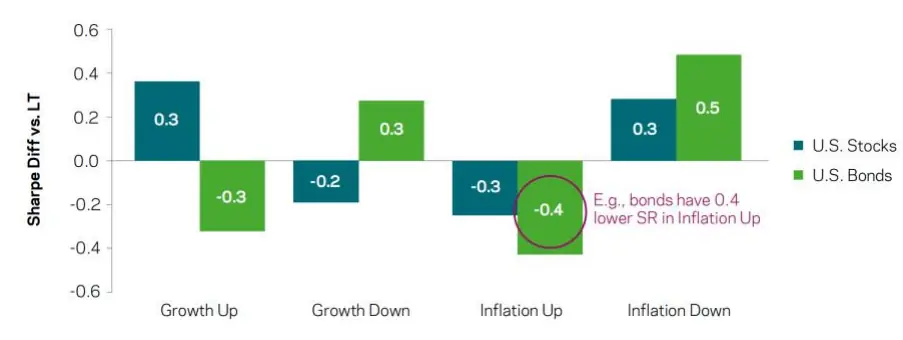
数据来源：《The Stock/Bond Correlation》，国泰君安证券研究

因此，我们发现股票和债券对经济增长的敏感性相反，但对通货膨胀的敏感性方向相同。换句话说，增长冲击将股票和债券的回报推向相反方向，而通胀冲击将它们推向相同方向。我们利用这种关系搭建了一个简单模型，将回报率与通胀和增长消息联系起来，假设股票回报率 $(r_{s})$ 和债券回报率 $(r_{b})$ 是由增长冲击 $(e_{g})$ 和通胀冲击 $(e_{\pi})$ 驱动的。

$$
\begin{array}{rl}{r_{s}=b_{s,g}e_{g}+b_{s,\pi}e_{\pi}}&{{}(1)}\\{r_{b}=b_{b,g}e_{g}+b_{b,\pi}e_{\pi}}&{{}(2)}\end{array}
$$

根据这个模型，股票和债券回报的协方差是：

$$
\mathrm{cov(r_{s},r_{b})=(b_{s,g}b_{b,g})\sigma_{g}^{2}+(b_{s,\pi}b_{b,\pi})\sigma_{\pi}^{2}+(b_{s,g}b_{b,\pi}+b_{s,\pi}b_{b,g})\sigma_{g,\pi}^{2}}\tag{3}
$$

当增长方差高时协方差趋于负，当通胀不确定性高时协方差趋于正。如果我们假设方差是对不确定性的衡量，当增长消息占主导地位时，股票和债券是较强的分散工具，而当通胀消息占主导地位时，股票和债券是较弱的分散工具。

我们可以把这个逻辑从股票 债券的协方差转化为相关性。任何协方差的驱动因素都会对相关性产生相同的方向影响。下列模型将 SBC 与增长波动率、通胀波动率以及增长-通胀相关性联系起来:

$$
\hat{\rho}_{s,b}=c_{0}+c_{g}\hat{\sigma}_{g}+c_{\pi}\hat{\sigma}_{\pi}+c_{g,\pi}\hat{\rho}_{g,\pi}+\varepsilon\left(4\right)
$$

我们可以利用实际数据估计模型变量。对于增长不确定性，我们使用美国工业生产同比变化的 10 年滚动波动率。对于通胀不确定性，我们使用CPI 同比变化的 10 年滚动波动率。这两者都可以追溯到 1936 年。第三个解释因素是增长和通胀之间的相关性，我们用 12 个月工业生产变化和 12 个月 CPI 变化之间的滚动 10 年相关性来表示。我们在图 2 中绘制了前两个解释变量，在图 3 中绘制了二者的比率。在过去几十年里，增长不确定性的相对重要性一直在增加(红色箭头)。根据我们的模型，这与股票/债券相关性的下降一致。

图 2：美国年度工业生产(IP)和消费者价格指数(CPI)十年滚动波动率
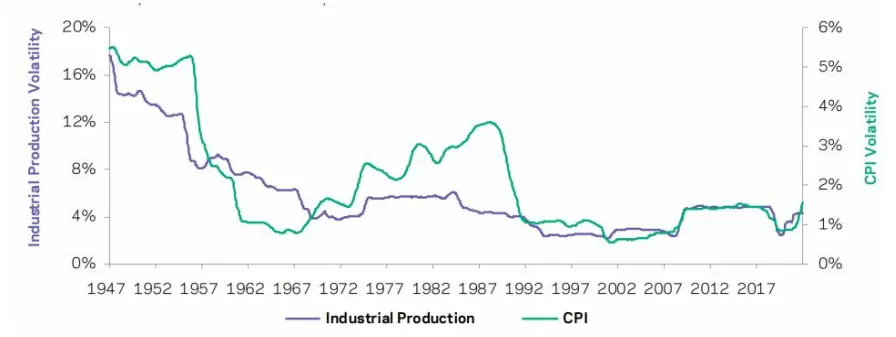
数据来源：《The Stock/Bond Correlation》，国泰君安证券研究

图 3：工业生产波动率与CPI 波动率之比
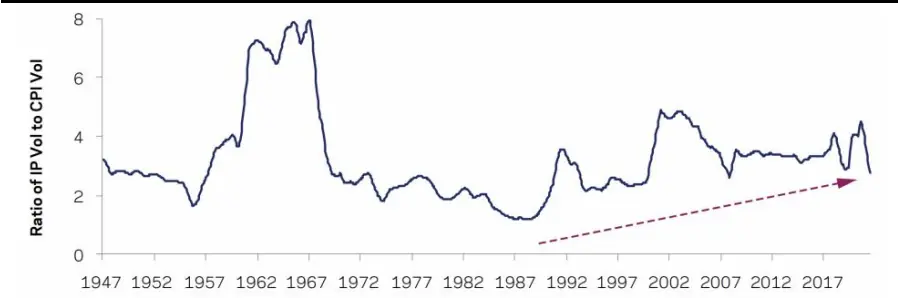
数据来源：《The Stock/Bond Correlation》，国泰君安证券研究

我们现在可以使用这些数据来对方程(4)进行回归，以滚动的 10 年美国SBC 作为因变量。结果如表 1 所示并证实了我们的假设，即 SBC 与增长风险负相关，与通胀风险正相关。由于我们的变量已经是估计量，而且我们很少有独立(10 年)的观察结果，统计显著性很难判断。但其经济意义是重大的: 通胀风险贝塔值为 12 意味着通胀波动率从 4%下降到 1%与 SBC 下降 3%*12 = 0.36 相关。在增长不确定性占主导地位的时期，比如过去 20 年，SBC 很可能为负。如果我们预计本世纪 20 年代通胀的不确定性会增加，那么我们很可能看到 SBC 上升。第三个变量增长/通胀相关性的负 beta 值在统计上明显显著。

表 1：股票/债券相关性回归结果

|  | Intercept | Growth Risk | Inflation Risk | Growth/Inflation Correlation |
| --- | --- | --- | --- | --- |
| Beta | -0.12 | -2.00 | 12.62 | -0.38 |
| t-stat | -1.5 | -2.2 | 5.5 | -5.7 |
| R² | 71% |  |  |  |

数据来源：《The Stock/Bond Correlation》，国泰君安证券研究

那么通货膨胀水平对 SBC 的影响呢? 如果我们把它作为回归的第四个变量，会发现其不显著且模型R2不变。换句话说，一旦控制了通胀的不确定性，通胀水平就不是 SBC 的主要驱动因素。

我们使用来自表 1的系数拟合 SBC，图4将其与已实现的滚动 10年SBC进行比较。拟合的 SBC 反映了三个变量的高解释力(R2为 71%)。

图 4：已实现滚动 10 年美国股票/债券相关性和宏观模型预测
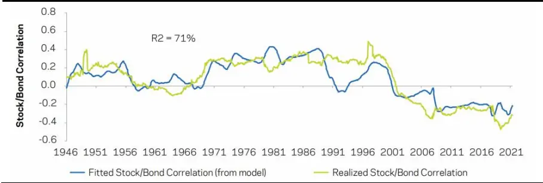
数据来源：《The Stock/Bond Correlation》，国泰君安证券研究

## 4. 模型局限性

到目前为止我们关注的是美国数据，在图 5 中我们针对德国、日本、法国、英国和意大利绘制了与图 4 相同模型的结果。我们使用了从 1960 年开始的当地股票和债券市场的回报率，以及当地工业生产和 CPI 的衡量标准。结果非常一致，特别是针对德国，该模型实现了 87%的R2。日本和英国的表现也很好，分别实现了 64%和 54%的R2。这个模型对法国的解释力度较弱，对意大利则更弱。我们认为意大利的信贷风险可能是一个重要因素，意大利债券比我们研究的其他债券有更多的信用风险(这解释了较高的平均 SBC)，也有更多信用风险的时间变化(这解释了忽略信用风险的模型解释力较低)。

图 5：已实现滚动 10 年国际股票/债券相关性和宏观模型预测
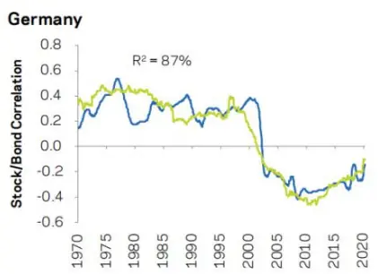

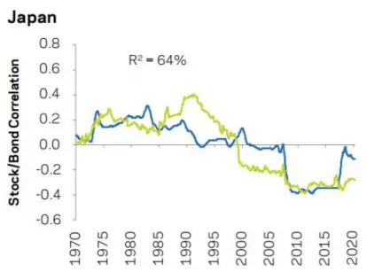

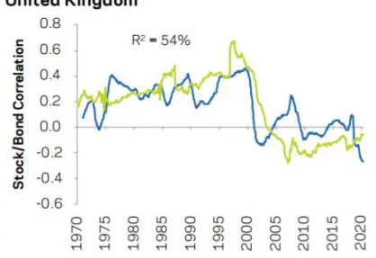

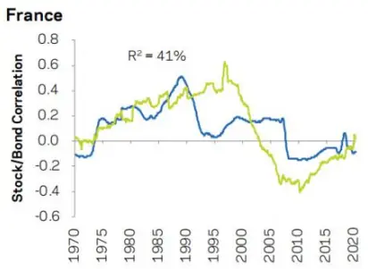

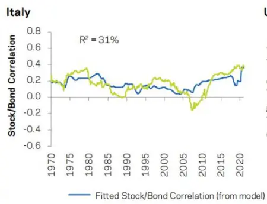

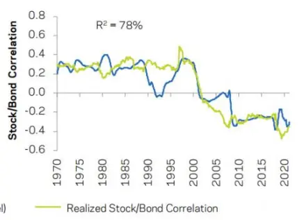
数据来源：《The Stock/Bond Correlation》，国泰君安证券研究

这显示了模型有一定的局限性。增长和通胀不确定性固然重要，但它们并不是股票和债券收益仅有的驱动因素，因此它们也不太可能是 SBC 仅有的驱动因素。这里我们列出了一些其他因素。首先，货币政策冲击会通过贴现率使股票和债券向同一个方向移动。这类冲击很难衡量，因为它们通常与增长和通胀冲击同时发生，但它们可能是 SBC 某些较高频率变化的原因。其次，前文我们提到了信用风险。此外，债券被视为安全资产往往会加剧负 SBC(例如，2008 年金融危机期间)。最后，运气可能是另一个驱动因素。负 SBC 时期的一个特点是货币政策沟通良好，央行管理通胀风险的能力高度可信。另一个特点是需求拉动型通货膨胀，这使得中央银行的工作更加容易。

我们已经展示了滚动10年变量的结果，并解释了SBC制度的长期变化。如果我们在更短的期限内(如 5 年或 3 年)测试同一模型，系数的符号保持不变，但解释力减弱。这可能是因为其他驱动因素在短期内变得更重要了，也可能是因为短期内需要用其他指标来代理变量。无论是哪种原因，SBC 的短期波动可能都更难用宏观经济基本面来解释或预测。

## 5. 分散投资风险工具推荐

如何应对变化的 SBC 呢？投资者应了解 SBC 的重要性和驱动因素；跟踪 SBC 以及通胀风险指标，如期权隐含通胀波动率和经济学家预测离散度等；执行资产配置场景分析；制定应对多样化减少的计划。

如果股票和债券变得更加相关，那么对两种传统资产类别进行分散投资的“第三种配置”可能能够弥补分散投资的不足。下面我们列举了一些分散投资工具。

1、非流动性另类投资，如私募股权和私募信贷。它们没有市场定价，可以为短期波动提供缓冲。但它们的多元化潜力有限，因为它们与公开市场上的同类公司有相同的潜在经济风险。

2、大宗商品。其与股票和债券的平均关联度较低，在通胀不确定时期实现了更强的多元化。一篮子大宗商品比任何单个大宗商品类型都有更强大的通胀保护。

3、多空策略和多资产替代风险溢价策略。使用做空和杠杆等金融工具提供与股票和债券相关性较低的回报。这些策略的表现在很大程度上与宏观环境无关，这使它们成为很好的战略分散工具。

4、动态策略，如趋势跟踪和宏观动力。这些策略可以在任何时间点给出方向性观点，但与市场的长期关联度低。这些策略往往在宏观经济波动中表现良好，比如在上行和下行通胀冲击中都表现出色。

我们使用以上分散投资工具构建了一个假设的投资组合，并检验其对股票和债券组合的分散效果。首先，我们构建了一种假设的趋势跟踪策略，根据历史 1 个月、3 个月和 12 个月的价格趋势，对全球宏观工具持有多头和空头头寸。其次，我们构建了一种假设的宏观动量策略，根据 12 个月的经济变量趋势，包括通货膨胀、增长、国际贸易、货币政策和风险情绪，对全球宏观工具持有多头和空头头寸。最后，我们以标准普尔 500指数（S&P500 index）代表美国股票投资组合，以 10 年期美国国债指数代表债券投资组合，对两者分别配比 60%和 40%，构建了传统 60/40 组合。

我们给通胀盈亏平衡、大宗商品、趋势跟踪和宏观动力都分配了 的份额，形成了假设的投资组合。我们发现假设的投资组合具有很大的正通胀敏感性，与我们的通胀指标的相关性接近 0.7。因此，即使对这个假设投资组合进行适度的分配，也可以将传统 60/40 组合与通胀的负相关性降低到接近零。比如 20%的分配可将相关性从-0.27 变为-0.05（从高度统计显著变为不显著）。在图 6 中，我们看到通过分配假设的投资组合，传统 60/40 投资组合在通胀环境中表现不佳的趋势得到了显著改善。

图 6：通货膨胀环境下的收益
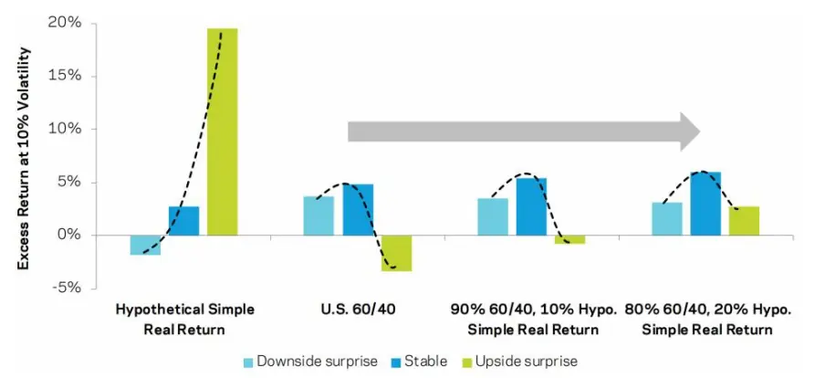
数据来源：《When Stock-Bond Diversification Fails》，国泰君安证券研究

## 6. 原文文献结论

近几十年来，股票/债券投资者不仅受益于收益率下降和估值上升，而且受益于这两种主要投资组合之间的分散化。我们已经习惯了股票和债券间的负相关性，但这不是 21 世纪之前的历史常态，20 世纪平均 SBC 为正。SBC 上升将对投资组合风险、资产配置和预期回报产生影响。

我们研究了 SBC 的理论驱动因素，并提出了一个简单模型，将其与增长不确定性、通胀不确定性以及增长与通胀之间的相关性联系起来。对该模型的实证检验证实，当增长消息占主导地位时，股票和债券是较强的分散工具，而当通胀消息占主导地位时，股票和债券是较弱的分散工具。我们在国际范围内测试了这个模型，在六个发达市场发现了类似的结果。

我们的实际建议包括教育投资者、监控 SBC 及其宏观驱动因素，以及重新考虑投资组合多元化。我们列出了一系列可选分散投资工具，它们不仅有助于管理风险和分散投资，还有助于在高估值、货币政策收紧和宏观经济风险加剧的挑战性环境中提高投资组合的回报。

## 7. 我们的思考

近 20 年来股票和债券回报间的负相关性已经被投资者，尤其是年轻投资者们视为理所应当的事情了，市场上推出的“股债轮动”类产品也被部分投资者当成了“稳定收益，没有损失”的投资对象。该文献起到了很好的警示作用，提出从更长的历史时期来看，SBC 为负并非常态，需要持有 SBC 可能转正的心态，并为此提前做准备。此外，该文献也分析了 SBC 的驱动因素，并给出了可选分散投资工具。

## 该文献的结果展示了 SBC 的驱动因素和重要意义：

1、宏观经济中的增长不确定性和通胀不确定性及两者相关关系共同组成了 SBC 的驱动因素，正增长对股票收益率有积极影响，对债券收益率有消极影响。正通胀对两者都有消极影响，对债券影响更大。

2、投资者可选用另类投资品分散风险。如大宗商品、私募股权、动态策

略，多空组合策略等。

意识是成功的一半。今年以来非同寻常的货币刺激和财政刺激，再加上新冠疫情的复杂局面，带来了通胀上行冲击持续的可能性。为了避免在“股债双杀”的情势前不知所措、在通胀上行的局面下无处投资，就需要打破股票和债券组合一定能分散风险、股票 债券收益负相关性必然成立的定式思维。我们应当意识到准备应对 SBC 转正的新投资策略的重要性，监控 SBC 及其宏观驱动因素，找到值得投资的另类投资品。如何在复杂的经济形势中做好准备，找到出路，是我们值得进一步思考的问题。

## 本公司具有中国证监会核准的证券投资咨询业务资格

## 分析师声明

作者具有中国证券业协会授予的证券投资咨询执业资格或相当的专业胜任能力，保证报告所采用的数据均来自合规渠道，分析逻辑基于作者的职业理解，本报告清晰准确地反映了作者的研究观点，力求独立、客观和公正，结论不受任何第三方的授意或影响，特此声明。

## 免责声明

本报告仅供国泰君安证券股份有限公司（以下简称“本公司”）的客户使用。本公司不会因接收人收到本报告而视其为本公司的当然客户。本报告仅在相关法律许可的情况下发放，并仅为提供信息而发放，概不构成任何广告。

本报告的信息来源于已公开的资料，本公司对该等信息的准确性、完整性或可靠性不作任何保证。本报告所载的资料、意见及推测仅反映本公司于发布本报告当日的判断，本报告所指的证券或投资标的的价格、价值及投资收入可升可跌。过往表现不应作为日后的表现依据。在不同时期，本公司可发出与本报告所载资料、意见及推测不一致的报告。本公司不保证本报告所含信息保持在最新状态。同时，本公司对本报告所含信息可在不发出通知的情形下做出修改，投资者应当自行关注相应的更新或修改。

本报告中所指的投资及服务可能不适合个别客户，不构成客户私人咨询建议。在任何情况下，本报告中的信息或所表述的意见均不构成对任何人的投资建议。在任何情况下，本公司、本公司员工或者关联机构不承诺投资者一定获利，不与投资者分享投资收益，也不对任何人因使用本报告中的任何内容所引致的任何损失负任何责任。投资者务必注意，其据此做出的任何投资决策与本公司、本公司员工或者关联机构无关。

本公司利用信息隔离墙控制内部一个或多个领域、部门或关联机构之间的信息流动。因此，投资者应注意，在法律许可的情况下，本公司及其所属关联机构可能会持有报告中提到的公司所发行的证券或期权并进行证券或期权交易，也可能为这些公司提供或者争取提供投资银行、财务顾问或者金融产品等相关服务。在法律许可的情况下，本公司的员工可能担任本报告所提到的公司的董事。

市场有风险，投资需谨慎。投资者不应将本报告作为作出投资决策的唯一参考因素，亦不应认为本报告可以取代自己的判断。
在决定投资前，如有需要，投资者务必向专业人士咨询并谨慎决策。

本报告版权仅为本公司所有，未经书面许可，任何机构和个人不得以任何形式翻版、复制、发表或引用。如征得本公司同意进行引用、刊发的，需在允许的范围内使用，并注明出处为“国泰君安证券研究”，且不得对本报告进行任何有悖原意的引用、删节和修改。

若本公司以外的其他机构（以下简称“该机构”）发送本报告，则由该机构独自为此发送行为负责。通过此途径获得本报告的投资者应自行联系该机构以要求获悉更详细信息或进而交易本报告中提及的证券。本报告不构成本公司向该机构之客户提供的投资建议，本公司、本公司员工或者关联机构亦不为该机构之客户因使用本报告或报告所载内容引起的任何损失承担任何责任。

## 评级说明

## 1.投资建议的比较标准

投资评级分为股票评级和行业评级。以报告发布后的 12 个月内的市场表现为比较标准，报告发布日后的 12 个月内的公司股价（或行业指数）的涨跌幅相对同期的沪深 300 指数涨跌幅为基准。

## 2.投资建议的评级标准

报告发布日后的 12 个月内的公司股价（或行业指数）的涨跌幅相对同期的沪深300 指数的涨跌幅。

| 评级 |  | 说明 |
| --- | --- | --- |
| 股票投资评级 | 增持 | 相对沪深 300 指数涨幅 15%以上 |
|  | 谨慎增持 | 相对沪深300指数涨幅介于5%～15%之间 |
|  | 中性 | 相对沪深300指数涨幅介于-5%～5% |
|  | 减持 | 相对沪深300 指数下跌5%以上 |
| 行业投资评级 | 增持 | 明显强于沪深 300 指数 |
|  | 中性 | 基本与沪深 300 指数持平 |
|  | 减持 | 明显弱于沪深300指数 |

## 国泰君安证券研究所

|  | 上海 | 深圳 | 北京 |
| --- | --- | --- | --- |
| 地址 | 上海市静安区新闸路669 号博华广 场20层 | 深圳市福田区益田路6009号新世界 商务中心34层 | 北京市西城区金融大街甲9号金融 街中心南楼18层 |
| 邮编 | 200041 | 518026 | 100032 |
| 电话 | （021）38676666 | （0755）23976888 | (010)83939888 |
|  | E-mail: gtjaresearch@gtjas.com |  |  |