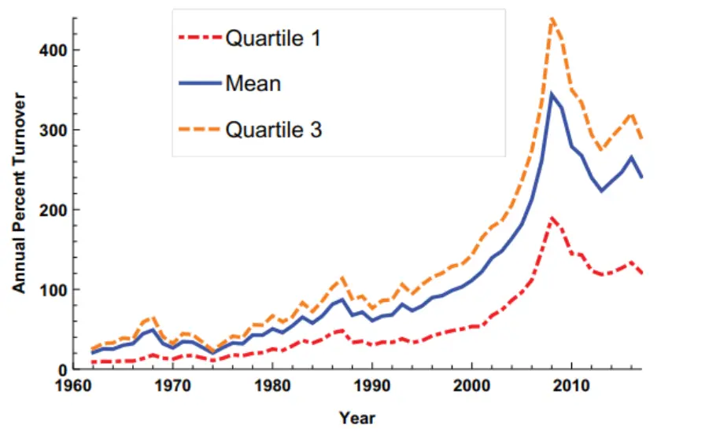
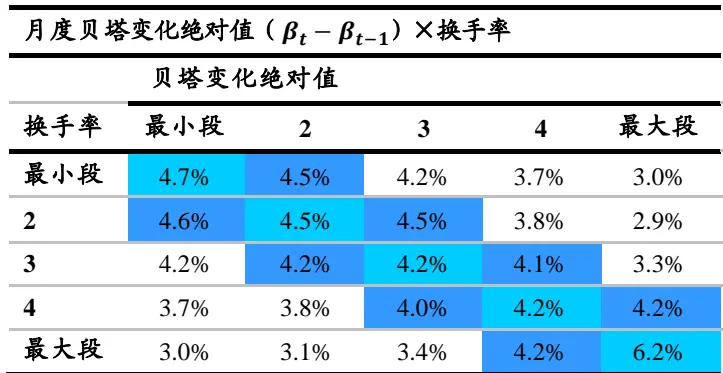
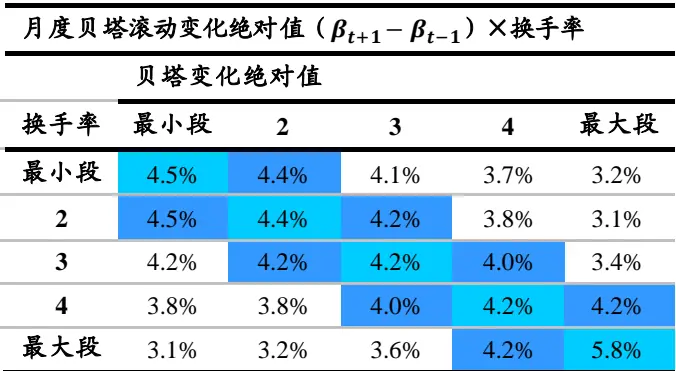
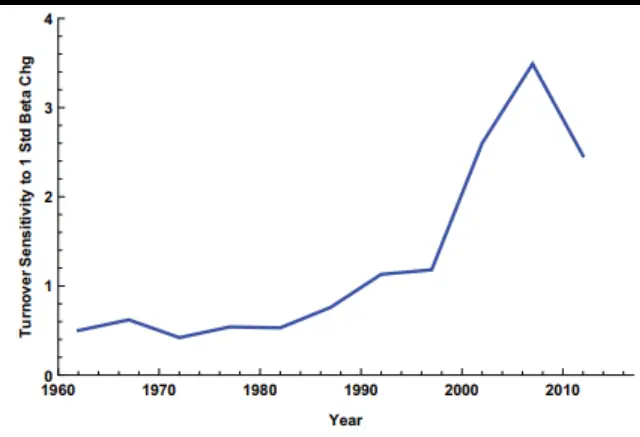
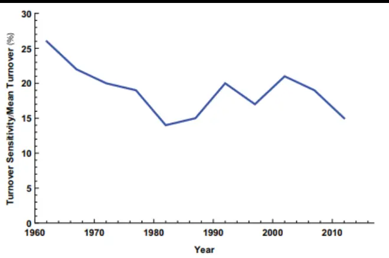
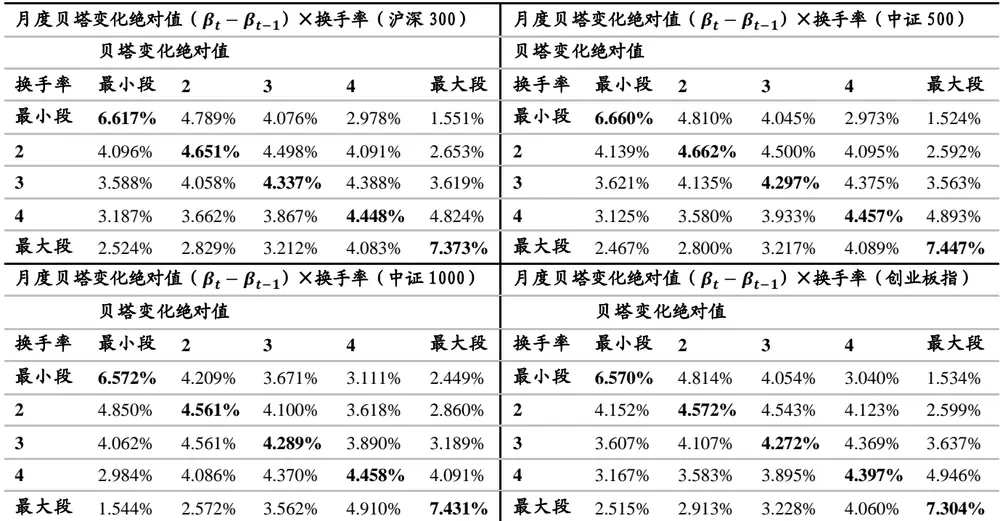

nInfo] [Table_Title] 2023.07.08

# 风险变化如何影响成交量

## ——学术纵横系列之四十八

张晗(分析师)

卢开庆(研究助理)

8 021-38676666

021-38038674

zhanghan027620@gtjas.com

lukaiqing026727@gtjas.com

证书编号 S0880522120005

S0880122080144

## 本报告导读：

本篇报告介绍了一篇文章 Trading Volume and Time Varing Betas，文章发现个股贝塔下降将带来成交量提升，并且贴现率变化导致的贝塔变化对成交量的影响更大。我们在A股市场验证了这一结论，在主要宽基指数中个股贝塔变化和成交量变化的正相关关系普遍成立。

## 摘要：

成交量反映了股价从分歧走向一致的过程，因分母端风险敞口变化引起的股价变化将带来更高的成交量。从DDM模型出发，若边际变化来自于分母端，风险敞口的变化将导致投资者额外的调仓行为；相比之下，若变化来自于分子端，价格的抬升将抵消需求的上涨，从而市场保持出清。从风险刻画的角度出发，贝塔衡量了市场系统性风险，贝塔对个股收益率的解释能力下降意味着个股承担了更多的异质性风险，从而更有可能带来更高的成交量。

个股贝塔下降将带来成交量提升。文章通过搭建列联表模型与线性回归模型，表明股票贝塔值每下降一个标准差，其成交量就会上升25%，并且这一驱动效应具有不断增强的趋势。

个股成交量变化主要受到分母端贴现率变化的影响。文章根据DDM模型对股票收益率变化的来源进行了分解，构建了分母端贴现率和分子端股利现金流冲击模型，发现成交量与贴现率冲击间的联系明显强于其与现金流冲击间的联系。文章进一步研究发现高成交量往往伴随着预期收益率的变化，低成交量则伴随着股利现金流的变化。

我们在A股市场检验了个股贝塔变化绝对值和换手率之间的联系，仿照文章构建了列联表，在A股市场验证了文章结论。结果表明在沪深 300、中证 500、中证 1000 和创业板指等宽基指数中，风险敞口变化与换手率之间均存在较为稳定的正相关关系。

风险提示：量化模型失效风险：本篇报告所述相关文章结论以及实证结论完全由量化模型和历史数据得到，请注意样本外存在失效的可能性。

## 金融工程团队：

廖静池：(分析师)

电话：0755-23976176

邮箱：liaojingchi024655@gtjas.com

证书编号：S0880522090003

张晗：（分析师）

电话：021-38676666

邮箱：zhanghan027620@gtjas.com

证书编号：S0880522120005

卢开庆：（研究助理）

电话：021-38038674

邮箱：lukaiqing026727@gtjas.com

证书编号：S0880122080144

## 梁誉耀：（研究助理）

电话：021-38038665

邮箱：liangyuyao026735@gtjas.com

证书编号：S0880122070051

## [Table_Re相关报告

股债相关性驱动因素研究 2022.12.16

新闻报道对股价跳跃的影响 2022.10.28

基于 分 布 函 数 的 两 种 非 对 称 性 测 度2022.07.21

## 1. 引言

成交量反映了股价从分歧走向一致的过程，因分母端风险敞口变化引起的股价变化将带来更高的成交量。从 DDM 模型出发，若边际变化来自于分母端，风险敞口的变化将导致投资者额外的调仓行为；相比之下，若变化来自于分子端，价格的抬升将抵消需求的上涨，从而市场保持出清。从风险刻画的角度出发，贝塔衡量了市场系统性风险，贝塔对个股收益率的解释能力下降意味着个股承担了更多的异质性风险，从而更有可能带来更高的成交量。

Trading Volume and Time Varing Betas 一文着重于研究个股成交量和个股贝塔的关系，主要结论是（1）股票贝塔值每下降一个标准差，其成交量就会上升25%，且成交量对贝塔值变化的敏感性随着时间的推移而提升；（2）成交量与贴现率变化之间的联系强于与股利现金流变化之间的联系。

## 文献信息：

Christopher Hrdlicka, Trading Volume and Time Varying Betas, Review of Finance, Volume 26, Issue 1, February 2022, Pages 79–116, https://doi.org/10.1093/rof/rfab014

## 2. 数据处理和描述性统计

文章使用了来自 CRSP 的股票收益、成交量与分红数据和来自 KennethFrench 个人网站的因子收益率数据，时间跨度为 1962 年 1 月至 2017 年月，股票范围只考虑了在纽约证券成交所上市流通的普通股。

贝塔值的估计使用日频数据，以每月为一期或每年为一期计算而来，其中该公司必须在观测期内至少超过半数的时间具有观测值才被视作有效样本，每期的所有样本的贝塔值将进行 1%缩尾处理，以减小异常值带来的影响。成交量数据以股票换手率在观测期内的平均值衡量，同样分别计算月频数据与年频数据。

成交量与贝塔值数据的描述性统计如表 1 所示。其中 $\sigma(\hat{\beta})$ 为估计贝塔值在每月或每年时截面的标准差， $而\sigma(\beta)$ 为真实贝塔值在每月或每年时截面的标准差，由于存在估计误差，两者间的关系如下：

$$
\sigma^{2}\left(\hat{\beta}\right)=\sigma^{2}\left(\beta\right)+\sigma^{2}\left(冽显误差\right)
$$

因此，文章中 $\sigma^{2}(\beta)$ 由 $\sigma^{2}({\hat{\beta}})$ 减去贝塔值估计量的均方误差得到。可以看出，成交量存在均值大（总量大），标准差大（异质性强）的特征，月度平均换手率能够达到 10%左右，年度平均换手率则超过了 100%；贝塔值即使在剔除测量误差的影响后，截面标准差的均值仍然达到 0.2 以上，说明不同公司间贝塔值的异质性也较强。

表 1:全样本描述性统计量总表
全样本描述性统计量

| 月度 |  |  |  | 年度 |  |  |
| --- | --- | --- | --- | --- | --- | --- |
|  | 成交量 | σ(B) | σ(β) | 成交量 | σ(β) | σ(β) |
| 均值 | 10.21 | 0.86 | 0.23 | 128.99 | 0.40 | 0.28 |
| 中位数 | 6.83 | 0.84 | 0.23 | 86.42 | 0.38 | 0.28 |
| 标准差 | 10.33 | 0.27 | 0.22 | 131.82 | 0.18 | 0.20 |
| 25%分位数 | 3.56 | 0.67 | 0.00 | 44.86 | 0.27 | 0.14 |
| 75%分位数 | 13.32 | 1.03 | 0.40 | 167.76 | 0.51 | 0.42 |

数据来源：《Trading Volume and Time Varing Betas》，国泰君安证券研究

此外，图 1 展示了年均换手率均值与其分位数从 1962 年至 2017 的变化趋势。直观地看，换手率随着时间的推进呈上升趋势，在 2008 年金融危机前后达到接近 450%。因此，去除趋势项将成为下文研究中所需考虑的重要问题。

图 1 年均换手率均值（蓝）、25%分位数（红）、75%分位数（黄）序列

数据来源：《Trading Volume and Time Varing Betas》

## 3. 贝塔值变化对成交量的影响机制

## 3.1. 模型假设

文章认为个股贝塔变化将导致成交量提升，提出以下三个假设：

（1）贝塔变化将导致个股成交量上升。从资产配置的角度出发，个股贝塔变化将导致组合总风险敞口变化，额外的调仓行为将带来额外的成交量。

（2）成交量对初始贝塔更高的股票产生的贝塔值变化的敏感性更低。若股票 A 的初始贝塔值大于股票 B，当两支股票的贝塔值变化量相同时，A的贝塔变化比例将相对较小，则 A导致的投资组合的整体贝塔变化比例也较小，为了再次达成最优配置引致的买卖成交量将低于 B引致的买卖成交量。

（3）贝塔值下降将比上升引致更高的成交量。假设投资者等权持有资产C 与 D，其贝塔值分别对应 1 和 0，则组合贝塔为 0.5。当 C 的贝塔值下降至 0.8 时，其权重应调整至 0.5/0.8=62.5%，意味着需要增持 12.5%；而当 C 的贝塔值上升至 1.2 时，权重应调整至 0.5/1.2=41.7%，意味着需要减持 8.3%。可以看出，后者引致的成交量更低。

## 3.2. 贝塔变化对成交量的影响

针对第一节提出的贝塔值变化将引致更高成交量的观点，文章通过建立列联表来进行初步实证检验。

对于第 t 期数据，文章计算了 t 期与 t-1 期的贝塔值变化量的绝对值与 t期的平均成交量，并分别按照这两个维度进行排序处理，每个维度划分为 5 类，最终形成 5*5=25 个单元格，每个单元格内为同时符合两个维度的公司数量占总公司数量的比值，维度划分的断点在每期都由当期排序情况决定，以控制成交量的时间固定效应。

除了对列联表的数据进行直接观察，文章进一步对其进行统计检验。Rao-Scott 卡方检验作为以 Pearson 卡方检验为基础的调整模型，涉及观察频率与预期频率之间的差异检验。对于双向列联表，其零假设为行变量与列变量之间没有关联，适用于文章中贝塔变化绝对值与成交量列联表的统计检验。

列联表实证结果如表 2 所示，可以看出主对角线（浅蓝色）与次对角线（深蓝色）上的单元格数值高于其他单元格数值，且数值随着与主对角线偏离程度的增加而减小，说明贝塔变化绝对值与换手率之间很可能存在关联。同时，考虑到可能存在隐含变量通过推动成交而改变股票贝塔值，从而导致伪相关现象出现，文章还给出了贝塔滑动变化绝对值与成交量的列联表，以第 t+1 期的贝塔值作为第 t 期贝塔值的代理变量，从而规避隐含变量带来的影响，其列联表实证结论与原列联表相同。Rao-Scott 卡方检验的结果对于两张列联表也都在 1%的显著性水平上显著。

表 2:贝塔变化绝对值×换手率列联表

数据来源：《Trading Volume and Time Varing Betas》，国泰君安证券研究

在经过列联表初步分析后，可以发现贝塔变化绝对值与成交量之间存在一定关联，观点（1）得到了初步验证。文章利用这种关系建立面板回归模型，将贝塔变化绝对值，变化方向与成交量联系起来。

模型 1：

$$
Turnover_{i,t}=\pmb{a}+\pmb{b}*\pmb{\beta}_{i,t}+\pmb{c}*\left|\Delta\pmb{\hat{\beta}}_{i,t}\right|+\epsilon_{i,t}
$$

模型 2：

$$
Turnover_{i,t}=\pmb{a}+\pmb{b}*\pmb{\beta}_{i,t}+\pmb{c}*\left|\pmb{\Delta\beta}_{i,t}\right|+\pmb{d}*\left|\pmb{\Delta\beta}_{i,t}\right|^{+}+\pmb{\epsilon}_{i,t}
$$

模型 3：

$$
\boldsymbol{Turnover}_{i,t}=\boldsymbol{a}+\boldsymbol{b}*\widehat{\boldsymbol{\beta}}_{i,t}+\boldsymbol{c}*\left|\Delta\widehat{\boldsymbol{\beta}}_{i,t}\right|+\boldsymbol{d}*\left|\Delta\widehat{\boldsymbol{\beta}}_{i,t}\right|^{+}+\boldsymbol{e}*\widehat{\boldsymbol{\beta}}_{i,t}*\left|\Delta\widehat{\boldsymbol{\beta}}_{i,t}\right|+\boldsymbol{\epsilon}_{i,t}
$$

其中Turnove $r_{i,t}$ 和 $|\Delta\widehat{\pmb{\beta}}_{i,t}|$ 为第 i 家公司在第 t 期的成交量与贝塔变化绝对值， $\left|\Delta\widehat{\pmb{\beta}}_{i,t}\right|^{+}$ 为虚拟变量，用于判别贝塔值是否为正向变化（正向变化为1）。

根据前文中的观点（1），贝塔值的变化应提高成交量数据，故模型中的系数 c 应当为正值；根据观点（2），初始值更大的贝塔变化时引致成交量变化更小，故模型中的系数 应当为负；根据观点（ ），贝塔下降比上升将引致更高成交量，故模型中的系数 d 应为负。

回归结果如表 3 所示，可以发现在控制公司固定效应、双重聚类标准误与控制公司异质波动率前后，各自变量的 t 统计量都相当显著，且系数均满足以上三个观点。此外，根据第 6 列模型 3 的系数可以得出，贝塔值每下降一个截面标准差均值（0.86），月均成交量会上升 10%左右（由于测量误差以及其他原因的影响，该结果实际上已经被弱化）；根据第 3列模型 3 的系数可以得出，贝塔值每下降一个截面标准差均值，月均成交量会上升 25%左右，若其上升一个标准差，成交量会上升 10%左右。将此模型扩展至年频数据，各自变量的回归结果依然显著，且系数与月频数据下的回归结果相一致，说明模型具有良好的稳健性。

表 3:模型回归结果

| 模型序号 | 模型1 | 模型2 | 模型3 | 模型1 | 模型2 | 模型3 |
| --- | --- | --- | --- | --- | --- | --- |
| $\beta_{t}$ | 9.96 (76.63) | 15.47 (94.50) | 18.61 (85.55) | 5.03 (12.22) | 8.78 (13.17) | 10.46 (12.95) |
| $\|\Delta\beta_{t}\|$ | 13.34 (87.61) | 19.51 (103.41) | 21.30 (103.69) | 6.22 (15.11) | 9.80 (17.07) | 10.77 (16.93) |
| $\|\Delta\pmb{\beta}_{t}\|^{+}$ |  | -13.96 (-55.03) | -10.85 (-37.37) |  | -8.38 (-11.95) | -6.88 (-10.90) |
| $\pmb{\beta}_{t}*\|\pmb{\Delta\beta}_{t}\|$ |  |  | -2.76 (-21.93) |  |  | -1.40(-6.94) |
| 时间固定效应 | Y | Y | Y | Y | Y | Y |
| 公司固定效应 | N | N | N | Y | Y | Y |
| 双重聚类标准误 | N | N | N | Y | Y | Y |
| 公司异质波动率 | N | N | N | Y | Y | Y |
| $R^{2}$ | 0.51 | 0.51 | 0.51 | $0.67$ | 0.67 | 0.67 |
| N | 428,703 | 428,703 | 428,703 | 428,703 | 428,703 | 428,703 |

数据来源：《Trading Volume and Time Varing Betas》，国泰君安证券研究

## 3.3. 成交量水平与参数敏感性

在第 2 节中，成交量的规模在随着时间的增长不断扩大，具有明显的增长趋势。在此前提条件下，成交量对贝塔值变化的敏感度是否也在随着时间的增长而不断变化就成为了一个值得关注的问题，即，成交量的趋势是否存在，如果存在趋势，又能从中获取怎样的信息。对此，文章对样本集进行分段回归，以每五年为一个子集，同样采用月频数据，并遵循模型 3 的格式与表 3 第 6 列的处理方法，得到回归结果如表 4。可以看出四个系数仍然与全样本回归模型的正负号一致，且 t 统计量显著。

表 4:不同时间段上模型回归结果

| 年份 | 1962- 1966 | 1967- 1971 | 1972- 1976 | 1977- 1981 | 1982- 1986 | 1987- 1991 | 1992- 1996 | 1997- 2001 | 2002- 2006 | 2007- 2011 | 2012- 2016 | 2017 |
| --- | --- | --- | --- | --- | --- | --- | --- | --- | --- | --- | --- | --- |
| βt | 41.87 | 34.99 | 39.65 | 37.24 | 30.26 | 24.76 | 28.72 | 35.90 | 28.83 | 35.04 | 22.75 | 7.99 |
|  | (11.50) | (12.85) | (16.39) | (16.51) | (13.51) | (11.97) | (12.02) | (14.08) | (10.37) | (10.78) | (8.61) | (3.05) |
| \|∆βt\| | 25.70 | 21.75 | 19.81 | 18.66 | 13.83 | 15.45 | 20.29 | 17.15 | 20.47 | 18.68 | 15.02 | 8.97 |
|  | (10.30) | (12.42) | (12.75) | (13.69) | (12.55) | (14.55) | (14.83) | (15.13) | (14.69) | (10.72) | (9.53) | (4.90) |
| \|∆βt\|+ | -31.35 | -26.24 | -23.08 | -19.75 | -14.64 | -9.74 | -19.67 | -16.19 | -16.69 | -14.45 | -11.63 | -7.74 |
|  | (-9.25) | (-10.9) | (-11.0) | (-9.64) | (-8.92) | (-6.57) | (-10.8) | (-8.09) | (-8.61) | (-5.81) | (-4.63) | (-3.74) |
| βt* \|∆βt\| | -3.78 | -2.69 | -2.55 | -3.74 | -4.20 | -3.36 | -2.95 | -4.15 | -2.16 | -4.45 | -3.10 | -0.14 |
|  | (-4.08) | (-3.93) | (-4.51) | (-7.61) | (-8.45) | (-7.12) | (-4.37) | (-6.70) | (-3.08) | (-5.21) | (-4.98) | (-0.13) |
| R2 | 0.34 | 0.34 | 0.25 | 0.32 | 0.16 | 0.08 | 0.11 | 0.17 | 0.15 | 0.15 | 0.22 | 0.23 |
| N | 68,856 | 73,840 | 83,711 | 85,576 | 82,529 | 79,274 | 69,761 | 86,007 | 87,978 | 80,899 | 79,599 | 15,372 |

数据来源：《Trading Volume and Time Varing Betas》，国泰君安证券研究

根据分段回归模型，在每个子集内贝塔值下降一个标准差时成交量的变化量，以衡量其敏感性。其结果如图 2 所示，敏感性随着时间的递进在不断上升，并在金融危机前后达到顶峰。然而，需要注意的是，成交量本身的规模就是在不断扩大的，故直接以成交量的变化量衡量的敏感性也可能受此影响而不断增大，因此，文章采用将成交量变化量与当月的月均成交量的比值来衡量“标准化”后的敏感性。

其结果如图 3 所示，“标准化”后的敏感性在 1962 年至 1980 年不断下降，自 1980 年后有上升趋势，且在 2002 年左右达到峰值，之后仍然呈缓慢下降趋势。由此可以看出，“标准化”后的敏感性虽然在小范围内呈震荡格局，但由于成交量自身规模的扩大，贝塔值变化所引起的成交量变化量仍然呈上升态势。

图 2 贝塔值下降一个标准差时成交量的变化量

数据来源：《Trading Volume and Time Varing Betas》

图 3 成交量变化量与月均成交量的比值

数据来源：《Trading Volume and Time Varing Betas》

## 4. 成交量与股票收益来源

在 DDM 模型中，分母端贴现率衡量了股票风险溢价水平，分子端衡量了股利现金流情况，文章将股价变化按照 模型拆分为贴现率变化和股利现金流变化。上一节的结论表明，贝塔值的变化会引发额外的调仓行为从而引起成交量升高，即风险敞口的变化与成交量之间也存在紧密关联。同时，股利现金流变化引起的价格变化在市场供需机制下不会导致成交量的增加。因此，文章认为成交量的变化与贴现率变化之间的联系强于与股利现金流变化之间的联系。

## 4.1. 贴现率冲击与股利现金流冲击

为了实证研究成交量与贴现率变化和股利现金流变化之间的联系，需要首先 构造 出贴 现率 冲击 与股 利现 金流 冲击 变量 。文 章利 用Vuolteenaho(2002)提出的向量自回归模型框架与 Chen,Da,and Zhao(2013)的变量构造方法，建立 VAR 模型如下：

模型 4：

$$
z_{i,t}=Az_{i,t-1}+u_{i,t}
$$

其中状态变量 $iz_{i,t}=\left[r_{i,t},roe_{i,t},bm_{i,t}\right]^{T}$ ，向量内部的元素分别为对数收益率、对数净资产收益率与对数账面市值比。随后，基于模型 4 的系数矩阵 A，可以构造出贴现率冲击变量与股利现金流冲击变量（ρ取 0.96）：

$$
\begin{aligned}&DRshock_{i,t}=e'_1\rho A(I-\rho A)^{-1}u_{i,t}\\&CFshock_{i,t}=e'_2\rho A(I-\rho A)^{-1}u_{i,t}\\\end{aligned}
$$

## 4.2. 成交量与两种冲击的联系

在构造了两种冲击变量后，文章搭建了回归模型以探究成交量与两种冲击的关系：

模型 5：

$$
Turnover_{i,t}=a+b\big|DRshock_{i,t}\big|+c\big|CFshock_{i,t}\big|+\epsilon_{i,t}
$$

根据前文的观点，即成交量的变化与贴现率变化之间的联系强于与股利现金流变化之间的联系，实证结果的系数 b 应大于系数 c。将数据代入后，得到回归结果如表 5 所示，在控制公司固定效应与双重聚类标准误前后，自变量的 t 统计量均显著，且系数 b 始终大于系数 c，验证了前文观点，从实证角度说明了成交量与贴现率变化的联系更为紧密。

表 5：模型 5回归结果

| 模型 | 1 | 2 | 3 |
| --- | --- | --- | --- |
| $\|DRshock_{t}\|$ | 1.46 (17.12) | 0.54 (8.16) | 0.54 (3.17) |
| $\|CFshock_{t}\|$ | 0.666 (28.92) | 0.41 (22.76) | 0.41 (8.08) |
| 时间固定效应 | Y | Y | Y |
| 公司固定效应 | N | Y | Y |
| 双重聚类标准误 | N | N | Y |
| $R^{2}$ | 0.06 | 0.56 | 0.56 |
| N | 40,920 | 40,920 | 40,920 |

数据来源：《Trading Volume and Time Varing Betas》，国泰君安证券研究

## 4.3. 成交量结合已实现收益的预测分析

上一节的结论表明，成交量与贴现率变化之间的联系强于与股利现金流变化之间的联系，结合成交量提升往往伴随着风险敞口的变化（即贴现率的变化）而与股利现金流的变化无关，文章推测，在结合已实现收益的情况下，较高成交量的出现往往意味着预期收益率的变化，较低成交量的出现则往往意味着股利现金流的变化。为了验证该观点，文章建立了以下回归模型：

模型 6：

$$
\begin{aligned}r_{i,t+h}^{adj}&=a+b*r_{i,t}^{adj}+c*Turnover_{i,t}+d*r_{i,t}^{adj}Turnover_{i,t}+controls+\epsilon_{i,t+h}\\模型7&;\end{aligned}
$$

$$
\begin{aligned}learning\;superwise_{i,q,t}=a+b*r_{i,t}^{adj}+c*Turnover_{i,t}+d*r_{i,t}^{adj}Turnover_{i,t}\\+controls+\epsilon_{i,t+h}\end{aligned}
$$

在以上两个模型中，由于根据 Lee and Swaminathan(2000)的研究，成交量与账面市值比、价值因子等一系列与收益率相关的指标具有相关性，故在模型中采用调整后收益率因子进行回归，其调整方式主要遵循Fama-French 的三因子模型，公式如下：

$$
r_{i,t+h}^{adj}=r_{i,t+h}^{e}-\alpha_{i,t-1}-\vec{\beta}_{i,t-1}^{\prime}\vec{f}_{t+h}
$$

其中 $\vec{\beta}_{i,t-1}^{\prime}$ 与 $\vec{f}_{t+h}$ 均为三因子模型中对应的因子与系数， $\alpha_{i,t-1}$ 同理。

在模型 7 中， $earningssurprise_{i,q,t}$ 主要衡量了股利现金流的变化，其构造方式如下：

$$
earnings\;surprise_{i,q,t}=\frac{actual\;eps_{i,q}-consensus\;forecast_{i,q,t-1}}{P_{i,t-1}}
$$

其中 q 的取值为（1,2,3），含义为第 t 期收益日后的第 q 个会计季度末，该模型中的预测数据与实际数据均来自于 I/B/E/S 数据库。

以上回归均控制了时间固定效应、公司固定效应与公司异质性波动，回归结果如表 5 所示。对于模型 6，其交叉项系数 d 为负，说明当成交量越大时，预期收益与已实现收益间的自相关性越弱，即已实现收益对未来收益的预测能力越低更有可能在未来出现反转效应；对于模型 7,其交叉项系数 d 同样为负而已实现收益系数 b 为正，这意味着随着成交量的升高，已实现收益对未来股利现金流的预测能力将进一步下降，甚至完全失去预测能力。以上结论验证了高成交量往往伴随着预期收益的变化（收益率的自相关性减弱），低成交量往往伴随着股利现金流的变化（低成交量下已实现收益对超预期盈利的预测能力更强）。

表 6：模型 6和模型 7 回归结果

| 窗口跨度 | h=1 | h=2 | h=3 | h=6 | h=12 | h=18 | h=24 | h=30 | h=36 | q=1 模型(10) | q=2 | q=3 |  |
| --- | --- | --- | --- | --- | --- | --- | --- | --- | --- | --- | --- | --- | --- |
|  | 模型(9) |  |  |  |  |  |  |  |  |  |  |  |  |
| $\underline{{r_{i,t}^{adj}}}$ | 0.0877 | 0.049 | 0.0744 | 0.0405 | 0.059 | 0.024 | 0.1016 | 0.019 | 0.0928 | 0.0002 | 0.0059 |  | -0.002 |
|  | (75.03) | (38.51) | (56.37) | (31.07) | (42.49) | (16.07) | (65.13) |  | (12.26) | (56.41) | (0.10) | (3.76) | (-1.56) |
| $\mathbf{\mathit{Tu}}_{i,t}\mathbf{*10^{-3}}$ | -0.4 | -1.3 | -0.8 | -0.7 | -1.7 | -0.9 | -1.4 | -1.3 |  | -1.7 | 7.7 | 1.9 | 1 |
|  | (-2.24) | (-6.50) | (-3.73) | (-3.43) | (-7.57) | (-3.87) | (-5.68) |  | (-5.37) | (-6.40) | (24.82) | (8.02) | (5.80) |
| 交叉项*102 | -0.9 | -0.72 | -1.31 | -0.87 | -0.31 | -0.61 | 1.75 |  | -0.18 | -1.13 | -0.14 | -0.74 | -0.29 |
|  | (-17.7) | (-13.1) | (-22.0) | (-14.3) | (-4.54) | (-8.15) | (-21.6) | (-2.17) |  | (-12.4) | (-1.35) | (-8.94) | (-4.48) |
| $R^{2}$ | 0.02 | 0.01 | 0.01 | 0.01 | 0.01 | 0.01 | 0.01 | 0.01 |  | 0.01 | 0.08 | 0.06 | 0.07 |
| N | 850579 | 845463 | 840370 | 825223 | 795598 | 766582 | 738058 | 710452 |  | 683916 | 340354 | 317023 | 268913 |

数据来源：《Trading Volume and Time Varing Betas》，国泰君安证券研究

## 5. A股实证结果

我们在 A股市场检验了个股贝塔变化绝对值和换手率之间的联系，仿照文章构建了列联表，在 A股市场中验证了文章关键结论。结果如表 7 所示，在不同的宽基指数中两者的相关关系均成立，并且在贝塔变化绝对值和换手率绝对值最小段和最大段上相关关系更加明显，表明在 A股市场中风险敞口变化和换手率的相关关系是普遍成立的。

表 7：国内宽基指数贝塔变化和换手率变化的列联表

数据来源：Wind，国泰君安证券研究。注：表中比例为同时符合两个分档条件的个股占比。

## 6. 结论和思考

## 6.1. 原文结论

证券风险敞口的变化不仅对资产定价至关重要，其也有助于解决成交量的相关问题。一只股票的市场贝塔系数平均每下降一个标准差，换手率就会比月平均值增加 25%。其可以解释为当风险暴露发生变化时，异质投资者的投资组合的总贝塔会发生变化，其需要通过成交以使得组合总贝塔再次达到平衡，从而刺激成交量改变；然而，当预期现金流受到正(负)冲击时，所有投资者都会表现出同样的需求增加(减少)，引发市场出清，价格变化完全抵消了这些需求变化，并不会刺激实际成交量的改变。

成交量对这两种冲击的不同反应，使得成交量与贴现率的关联相较现金流更强，其在另一方面表现为高成交量往往伴随着预期收益的变动（收益率的自相关性减弱），低成交量往往伴随着股利现金流的变化（低成交量下已实现收益对超预期盈利的预测能力更强）。

## 6.2. 我们的思考

文章结合理论与实证两个角度，对成交量、贝塔值与股票预期收益三者间的影响机制进行了分析，为判断市场成交趋势与预测股票预期收益变化提供了机会。

通过文章研究，投资者可以通过股票风险敞口判断市场整体的成交趋势。股票风险敞口发生变化时，往往意味着成交热点的到来，且风险敞口的减小会比扩大引致更大的成交量，初始敞口更低的股票会比更高的股票引致更大的成交量。同时，在成交量规模不断扩大的发展趋势下，未来成交量对贝塔值变化的敏感性也将不断增强，风险敞口的变化在未来将引起更高的换手率。

同时，结合成交量数据与已实现收益情况，投资者可以对股票的预期收益做出一定判断。当成交量走高时，股票收益率之间的自相关性将减弱，利用过往收益预测未来收益的预测力下降，投资者可以更多关注其反转效应；当成交量处在低位时，过往收益对股利现金流的每股净收益的超预期将表现出更强的预测力。

## 7. 风险提示

量化模型失效风险：本篇报告所述相关文章结论以及实证结论完全由量化模型和历史数据得到，请注意样本外存在失效的可能性。

## 本公司具有中国证监会核准的证券投资咨询业务资格

## 分析师声明

作者具有中国证券业协会授予的证券投资咨询执业资格或相当的专业胜任能力，保证报告所采用的数据均来自合规渠道，分析逻辑基于作者的职业理解，本报告清晰准确地反映了作者的研究观点，力求独立、客观和公正，结论不受任何第三方的授意或影响，特此声明。

## 免责声明

本报告仅供国泰君安证券股份有限公司（以下简称“本公司”）的客户使用。本公司不会因接收人收到本报告而视其为本公司的当然客户。本报告仅在相关法律许可的情况下发放，并仅为提供信息而发放，概不构成任何广告。

本报告的信息来源于已公开的资料，本公司对该等信息的准确性、完整性或可靠性不作任何保证。本报告所载的资料、意见及推测仅反映本公司于发布本报告当日的判断，本报告所指的证券或投资标的的价格、价值及投资收入可升可跌。过往表现不应作为日后的表现依据。在不同时期，本公司可发出与本报告所载资料、意见及推测不一致的报告。本公司不保证本报告所含信息保持在最新状态。同时，本公司对本报告所含信息可在不发出通知的情形下做出修改，投资者应当自行关注相应的更新或修改。

本报告中所指的投资及服务可能不适合个别客户，不构成客户私人咨询建议。在任何情况下，本报告中的信息或所表述的意见均不构成对任何人的投资建议。在任何情况下，本公司、本公司员工或者关联机构不承诺投资者一定获利，不与投资者分享投资收益，也不对任何人因使用本报告中的任何内容所引致的任何损失负任何责任。投资者务必注意，其据此做出的任何投资决策与本公司、本公司员工或者关联机构无关。

本公司利用信息隔离墙控制内部一个或多个领域、部门或关联机构之间的信息流动。因此，投资者应注意，在法律许可的情况下，本公司及其所属关联机构可能会持有报告中提到的公司所发行的证券或期权并进行证券或期权交易，也可能为这些公司提供或者争取提供投资银行、财务顾问或者金融产品等相关服务。在法律许可的情况下，本公司的员工可能担任本报告所提到的公司的董事。

市场有风险，投资需谨慎。投资者不应将本报告作为作出投资决策的唯一参考因素，亦不应认为本报告可以取代自己的判断。
在决定投资前，如有需要，投资者务必向专业人士咨询并谨慎决策。

本报告版权仅为本公司所有，未经书面许可，任何机构和个人不得以任何形式翻版、复制、发表或引用。如征得本公司同意进行引用、刊发的，需在允许的范围内使用，并注明出处为“国泰君安证券研究”，且不得对本报告进行任何有悖原意的引用、删节和修改。

若本公司以外的其他机构（以下简称“该机构”）发送本报告，则由该机构独自为此发送行为负责。通过此途径获得本报告的投资者应自行联系该机构以要求获悉更详细信息或进而交易本报告中提及的证券。本报告不构成本公司向该机构之客户提供的投资建议，本公司、本公司员工或者关联机构亦不为该机构之客户因使用本报告或报告所载内容引起的任何损失承担任何责任。

## 评级说明

## 1.投资建议的比较标准

投资评级分为股票评级和行业评级。以报告发布后的 12 个月内的市场表现为比较标准，报告发布日后的 12 个月内的公司股价（或行业指数）的涨跌幅相对同期的沪深 300 指数涨跌幅为基准。

## 2.投资建议的评级标准

报告发布日后的 12 个月内的公司股价（或行业指数）的涨跌幅相对同期的沪深300 指数的涨跌幅。

| 评级 |  | 说明 |
| --- | --- | --- |
| 股票投资评级 | 增持 | 相对沪深 300 指数涨幅 15%以上 |
|  | 谨慎增持 | 相对沪深 300指数涨幅介于5%～15%之间 |
|  | 中性 | 相对沪深300指数涨幅介于-5%～5% |
|  | 减持 | 相对沪深300 指数下跌5%以上 |
| 行业投资评级 | 增持 | 明显强于沪深 300 指数 |
|  | 中性 | 基本与沪深 300指数持平 |
|  | 减持 | 明显弱于沪深300指数 |

## 国泰君安证券研究所

|  | 上海 | 深圳 | 北京 |
| --- | --- | --- | --- |
| 地址 | 上海市静安区新闸路669 号博华广 场20层 | 深圳市福田区益田路6003号荣超商 务中心 B 栋27 层 | 北京市西城区金融大街甲9号金融 街中心南楼18层 |
| 邮编 | 200041 | 518026 | 100032 |
| 电话 | （021）38676666 | （0755）23976888 | (010)83939888 |
|  | E-mail: gtjaresearch@gtjas.com |  |  |