nInfo] [Table_Title]2023.07.11

# 估值分化期的价值策略

## ——学术纵横系列之四十九

张晗(分析师)

梁誉耀(研究助理)

8 021-38676666

021-38038665

zhanghan027620@gtjas.com

liangyuyao026735@gtjas.co

证书编号 S0880522120005

S0880122070051

## 本报告导读：

本篇报告介绍了 AQR 创始人 Cliff Asness 在 2021 年发表于 Journal of PortfolioManagement的文章《Deep Value》，该文章本质是对价值成长的多空策略进行了一个择时，只在两者估值分化到一定程度时进行多空操作。结果显示，这样做可以获得一定的超额收益。

## 摘要：

深度价值期定义为价值股与成长股账面价值比取对数后的差值超过历史上 80 分位数的时期，也就是价值股估值远低于成长股的时期。

导致价值股和成长股的估值差异有两个主要原因。一是投资者对价值股和成长股未来收益的预期不同；二是非理性投资者更容易因为价值股过去表现不佳而抛售价值股。

深度价值期时，价值股相对于成长股面临更强的抛售压力。因为价值股的新闻基调往往比成长股消极。而投资者会对价值股收益较差的历史表现做出过度反应，选择抛售价值股。

深度价值策略是在深度价值期，做多价值股做空成长股的投资组合。相对于普通的价值策略，它只在深度价值期执行该多空操作，其余时间不执行。

- 深度价值策略能获得较高的收益。这种价值投资在价值差较大时更有效，且会持续数年（至少有 24 个月）。

深度价值策略获得的收益与市场因子、动量因子负相关，且与动量的关系更强；与深度价值事件发生的数量呈正相关。价值股的历史收益往往为负值，而深度价值策略是多空投资组合，会在估值差上升后买入价值股卖出成长股，在估值差下降时反向操作。同时，深度价值事件发生的次数越多，风险越大，波动率越大，收益往往也越大。由于SR 是平均超额收益与波动性的比率，当分子和分母都上升时，对于深度价值策略，收益对 SR 的斜率系数 仍然显著为正。说明相对于其高风险，策略的高回报更突出。

由于价值股和成长股存在估值差异，投资者可以通过深度价值策略实现套利。但另一方面，套利者也会受到交易成本升高、卖空费用和波动性的限制。深度价值策略的套利只会在有限的程度上实现。

风险提示：量化模型失效风险：本篇报告所述相关文章结论以及实证结论完全由量化模型和历史数据得到，请注意样本外存在失效的可能性。

## 金融工程团队：

廖静池：(分析师)

电话：0755-23976176

邮箱：liaojingchi024655@gtjas.com

证书编号：S0880522090003

张晗：（分析师）

电话：021-38676666

邮箱：zhanghan027620@gtjas.com

证书编号：S0880522120005

卢开庆：（研究助理）

电话：021-38038674

邮箱：lukaiqing026727@gtjas.com

证书编号：S0880122080144

## 梁誉耀：（研究助理）

电话：021-38038665

邮箱：liangyuyao026735@gtjas.com

证书编号：S0880122070051

## [Table_Re相关报告

风险变化如何影响成交量 2023.07.08

股债相关性驱动因素研究 2022.12.16

新闻报道对股价跳跃的影响 2022.10.28

基于 分 布 函 数 的 两 种 非 对 称 性 测 度2022.07.21

量化建模需放下“奥卡姆剃刀” 2022.07.13

## 1. 引言

深度价值期存在套利机会，可以通过做多价值股做空成长股获得高额收益。在这个过程中，价值股会经历盈利基本面恶化、新闻报道中的负面情绪、抛售压力以及更高的套利限制。

深度价值期定义为价值股与成长股价值差超过历史上第 80 个百分位的时期。Cliff Asness 等人在《The Journal of Portfolio Management》中对四大股票市场（美、英、欧、日）、三种资产（股指期货、政府债券期货、货币远期）近 100 年的数据集探究了 3000 多个深度价值事件。运用回归分析从静态、动态两个角度，研究了造成成长股与价值股估值差异的原因，以及深度价值策略的表现。

本文的正文主要有四部分内容：第一，论证深度价值期采取价值策略能获得高额回报；第二，深度价值策略的收益与价值因子、动量因子以及深度价值事件发生的数量有关；第三，导致价值股和成长股估值差异的第一个原因是投资者对未来收益的预期不同；第四，导致价值股和成长股估值差异的第二个原因是非理性投资者更容易因为价值股过去表现不佳而抛售价值股；第五，价值策略的套利受到限制。

## 2. 数据来源与理论框架

## 2.1. 数据与方法论

本文研究 7 个主要市场的价值，包括美、英、欧、日四大市场的股票选择（SS）策略，以及全球发达股指期货、政府债券期货、货币远期的三种资产配置（AA）策略。

在每个市场中，考虑两种类型的价值策略。一是对于所有市场（把美、英、欧、日市场看作一个整体，覆盖全部行业），建立多空价值组合，即股票选择的 SS 策略。二是内部策略：在每个市场子集内对资产进行排序，在前三分之一处做多，后三分之一处做空，即对资产进行配置的 AA策略。

## 2.2. 价值策略

设证券i在时间t的价格为 $P_{t}^{i}$ ，账面价值 $.B_{t}^{i}$ ，则账面价值比定义为V=B/P。
高账面价值比的证券是价值型证券；低账面价值比的是成长型证券。

构建一个价值策略：做多账面价值比高的价值证券 H，做空账面价值比低的成长证券 L。该策略的特点是做多更廉价的资产，即有 $|V_{t}^{H}>V_{t}^{L}$ 估值差定义为：

$$
\mathit{Value\:spread}_{t}{:=log\:(V_{t}^{H})-log\:(V_{t}^{L})}
$$

显然，根据定义，价值投资组合策略的价值价差是正的。

## 2.3. 有关价格差的理论模型

在传统理论中，解释价格差异主要有三种模型：一是证券价格是对风险的理性补偿，风险不同导致了价格的差异；二是价格的差异是由价格中的随机噪声驱动；三是市场存在非理性的投资者，他们的行为导致了价格差异持续存在。下面我们将用上述价值差的定义刻画这三种理论。

## 2.3.1. 风险的理性补偿模型

由于价格是对风险的理性补偿，风险不同导致了价格的差异，故价值差可以用风险溢价λ、风险指数 $(\beta)$ 和证券 B/P 的增长率 $g$ 来表示：

$$
Valuespread_{t}\cong\lambda_{t}(\beta_{t}^{H}-\beta_{t}^{L})-(g_{t}^{H}-g_{t}^{L})
$$

该理论表明，如果价值股比成长股有更 $高$ 的风险指数 $\left(高\beta_{t}^{H}-\beta_{t}^{L}\right)$ ，或者价值股的增长率低于成长股 $\left(俬g_{t}^{H}-g_{t}^{L}\right)$ ，则价值差更 $\left[高\right]$ ，即两者的价格差异更大。

## 2.3.2. 价格噪声模型

价格差异是由于价格中存在随机噪 $\begin{aligned}声\end{aligned}$ ，该理论表明价值差只与噪声有关，与基本面之间没有关系，：

$$
Value_{pred_{t}}\cong Notice
$$

## 2.3.3. 行为模型

行为理论认为，证券价格差异不是反映了对风险的理性补偿， $而$ 是投资者情绪化的行为偏差所导致。非理性投资者在深度价值期会卖出价值股，考虑两个行为模型：

一是，投资者的买卖压力是由过去的回报驱动：

$$
Valuespread_{t}\cong-(1+z_{t})(g_{t}^{H}-g_{t}^{L})
$$

二是，投资者的买卖压力是对基本面变化做出的过度反应：

$$
Value\ spread_{t}\cong-\big(g_{t}^{H}-g_{t}^{L}\big)+z_{t}\big(r_{t-k,t}^{L}-r_{t-k,t}^{H}\big)
$$

本文将会探讨价值股与成长股的估值差异到底是如何导致的，实际市场更接近哪种理论模型。

## 3. 深度价值策略的收益

## 3.1. 回归分析

下面探究在深度价值时期，采取价值策略是否具有更高的未来收益。我们使用样本数据集对以下模型进行回归分析。

$$
VAL_{t+1}^{i}=\alpha+\beta\;Value\;spread_{t}^{i}+\varepsilon_{t+1}^{i}
$$

VAL 多空价值策略收益，Value spread 表示资产类别 i 对应的事前价值价差，以月为单位进行回归。

结果显示： SS 策略中，无论是所有地区还是单个每个地区，β值都显著

为正；AA策略中，也是正显著关系。说明价值策略未来的回报，与当前价值差有关，且价值差越大，未来预期回报值越大。

## 3.2. 影响价值策略收益的因素

在深度价值时期，采取价值策略能获得高额收益。下面探究该收益与哪些因素有关。

首先，构建深度价值交易策略。当交易员观察到价值价差超过 80 分位数时，实施多空价值投资组合策略（做多价值股做空成长股）。

一方面，对该策略的回报以及相应的价值因子和动量因子进行回归。

图 2：样本外价值策略的表现
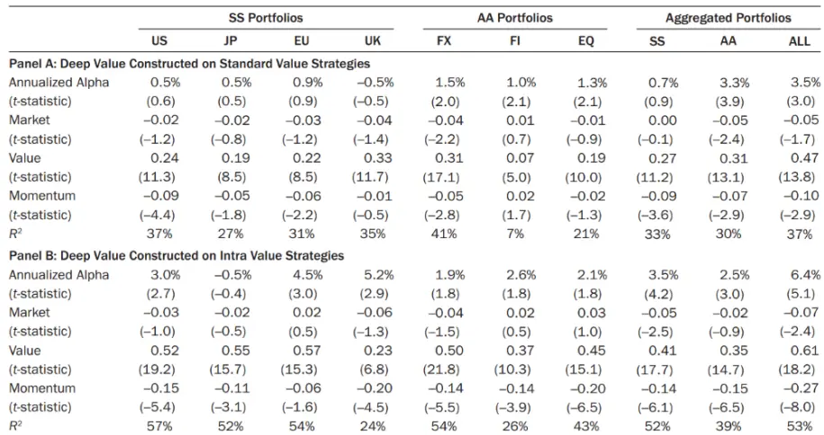
数据来源：《Deep Value》

结果显示，深度价值策略与市场因子、动量因子负相关关系，且与动量的关系更强。因为深度价值资产往往有特别负的过去收益。该策略会在账面市值比差上升后买入价值组合，在账面市值比差下降时卖出价值组合。深度价值策略的阿尔法在大多数情况下是正的，但在统计显著性方面有所差别。在 SS 中，所有的 alpha 都是无关紧要的。当所有七种策略放在一起时，alpha 显著。

另一方面，我们观察到市场中长期存在深度价值机会，并在经济泡沫或崩溃时期更为集中。那么价值策略的收益是否与深度价值事件发生的数量有关。

首先，图 3 展示了每个时间点触发的深度价值交易的数量。我们看到，深度价值事件数量的最大峰值出现在 2000 年互联网泡沫前后，较小峰值出现在 2008 年全球金融危机、80 年代初沃尔克实验、90 年代初第一次入侵伊拉克等事件，以及 2012 年欧洲危机。各个市场和资产的深度价值事件似乎都集中在经济泡沫或崩溃的时期。

图 3：深度价值策略：累计收益率和机会集
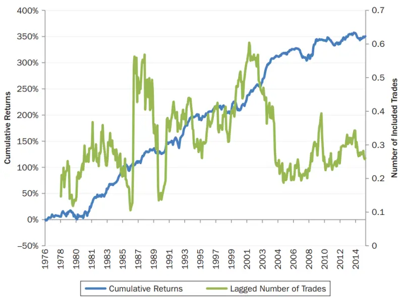
数据来源：《Deep Value》

价值策略在深度价值事件丰富的时期表现良好。然后，对回报率和事件数量进行回归：

$$
DVAL_{t+1}^{i}=\alpha+\beta\;EVENTS_{t}^{i}+\varepsilon_{t+1}^{i}
$$

$DVAL_{t+11}^{i}$ 表示股票、AA或所有资产 i的月收益，EVENTSi表示前一个月末符合深度价值过滤器的交易数量百分比。

图 4：价值策略回报与深度价值事件数量
Panel A: Regression of Level, Volatility, and Sharpe Ratio of Deep Value Returns on Number of Opportunities

|  | All Asset Portfolios |  |  | Stock Selection |  |  | Asset Allocation |  |  |
| --- | --- | --- | --- | --- | --- | --- | --- | --- | --- |
|  | Returns | Volatility | Sharpe | Returns | Volatility | Sharpe | Returns | Volatility | Sharpe |
| Estimate | 0.5 | 0.1 | 4.3 | 0.2 | 0.0 | 2.1 | 0.2 | 0.2 | 2.5 |
| (t-statistic) | (3.2) | (1.3) | (2.4) | (2.9) | (3.3) | (2.3) | (2.0) | (4.1) | (1.1) |

Panel B: Level, Volatility, and Sharpe Ratio of Deep Value in Number of Opportunity Terciles

|  | All Asset Portfolios |  |  | Stock Selection |  |  | Asset Allocation |  |  |
| --- | --- | --- | --- | --- | --- | --- | --- | --- | --- |
|  | 1 | 2 | 3 | 1 | 2 | 3 | 1 | 2 | 3 |
| Returns | 2.3% | 6.3% | 16.1% | 0.6% | 2.4% | 6.4% | 0.6% | 4.0% | 10.9% |
| Volatility | 7.5% | 9.4% | 12.3% | 4.1% | 6.5% | 8.0% | 3.5% | 5.1% | 9.2% |
| SR | 0.31 | 0.66 | 1.31 | 0.14 | 0.36 | 0.80 | 0.18 | 0.79 | 1.18 |

数据来源：《Deep Value》

结果显示，价值策略的收益与深度价值事件发生的数量正相关。对于所有资产和SS斜率系数都是显著正的，这表明当有许多深度价值事件时，深度价值策略获得了更高的平均回报。

此外，波动性和夏普比率(SR)随着事件数量的增加而上升。在面板A中，我们根据所包含的价值策略的百分比，回归了未来一年的年化收益率、波动性和年化 SR。可以看出，价值事件数量越多，风险越大，波动率越大，从而收益也会越大。由于 SR 是平均超额收益与波动性的比率，当分子和分母都上升时，SR 的变化并不明显。但对于所有资产和深度价值策略的股票，SR 的斜率系数显著为正，这一发现表明，当许多深度价值事件发生时，相对于其高风险，策略的高回报更加突出。

## 4. 深度价值期的经济基本面

接下来，研究深度价值事件发生前后经济基本面的变化。我们只研究 SS策略。以股本回报率（基于 Compustat 的数据，扣除特别项目前的收入除以股本账面价值）来衡量公司的已实现收益。

图 5：深度价值的盈利基本面
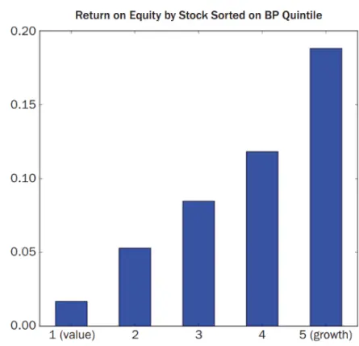
数据来源：《Deep Value》

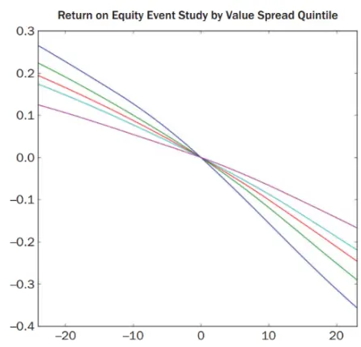

价值股的盈利能力不如成长股，且在深度价值期，价值股的基本面显著更差。具体来说，对股票的价值价差按五分位数划分，计算价值组合权重和股票净资产收益率，从而得出投资组合净资产收益率。在事件时间为零时，将其累积并重新缩放至零水平。价值型公司(价值策略中的多头头寸)的收益减去成长型公司(空头头寸)的收益在组合形成前两年多开始恶化，并将持续两年多。同时，在深度价值事件发生时，收益恶化最为严重。因此，深度价值事件中价值股和成长股价格差异较大的部分解释是，当前价格反映了对未来收益的预估。

接下来，分析师对预测进行修正。数据来自 Thompson Reuters InstitutionalBrokers’ Estimate System (IBES)中的股票分析师获利预估。定义一个获利修正比率指标：正值表明分析师变得更加乐观，负值表明分析师变得更加悲观。该指标的计算方法是，用盈利预期上调次数减去盈利预期下调次数，再除以预测者总数的三个月移动平均值。

图 6：深度价值盈利基本面的修正
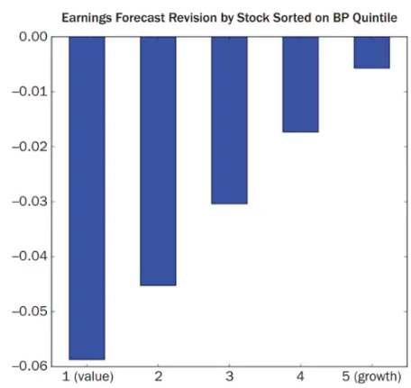

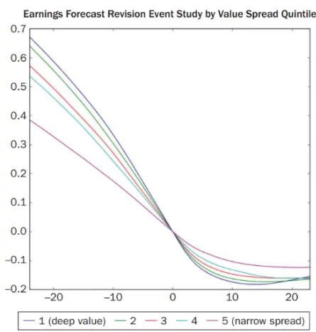

数据来源：《Deep Value》

分析师对价值股的获利预估更为悲观。图 6 为经过修正后的深度价值盈利情况。柱状图显示，分析师倾向于向下修正预测，且价值股比成长股面临更多的负面修正。折线图表明，价值投资组合在策略形成时面临负修正(即多头头寸的修正值减去空头头寸的修正值为负)，并会持续一年左右，然后修正值开始转为正值。

## 5. 投资者和套利者的行为

## 5.1. 投资者对价值股与成长股的情绪：新闻基调

首先，考虑投资者对价值股和成长股的看法。可以通过有关价值股与成长股的新闻报道基调，来衡量投资者的情绪。

新闻情绪的数据来自 RavenPack，跟踪了事件情绪评分的指标，该得分从 0 到 100，旨在捕捉有关公司的新闻报道的平均情绪（消极与积极），50 分代表中性情绪，超过 50 分代表正面情绪，低于 50 分代表负面情绪。

图 7：投资者的情绪
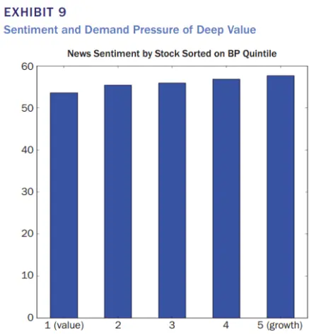
数据来源：《Deep Value》

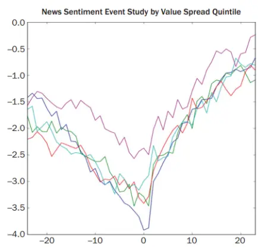

价值股的新闻基调往往比成长股悲观。在深度价值事件发生前，价值股的投资情绪变得特别消极，大约一年后恢复到正常水平。线状图显示了价值与成长股的新闻基调的演变。可以看出，在进入投资组合形成期，情绪变得特别消极，尤其对于价值股，一年后恢复到正常水平。

## 5.2. 深度价值期，投资者的抛售压力

接下来，考虑投资者是否会根据这种情绪做出买卖决定。衡量股票面临买入或卖出压力的指标：股票的净买入，定义为（买入金额-卖出金额）/（买入+卖出）。

图 8：深度价值期投资者的买卖压力
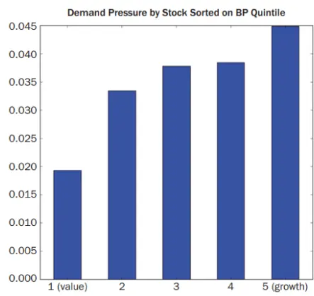
数据来源：《Deep Value》

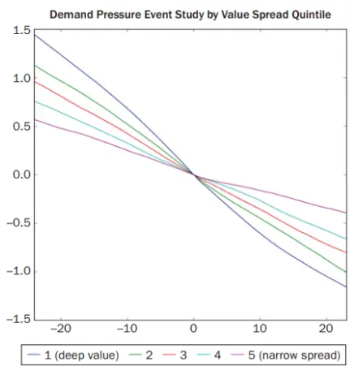

当价值股变得很便宜时，一些投资者会选择抛售价值股。从条形图可以看出，所有类别的股票平均买入多于卖出，但投资者更偏向于买入成长性股票。折线图显示了价值股经历了更强的净抛售压力。这种压力在深度价值事件发生前两年开始，并在持续了两年多。

## 5.3. 投资者抛售压力的原因

我们对需求压力（以已签署的订单流衡量）与过去回报、过去基本面变化（以股本回报率变化衡量）进行回归，结果如下：

图 9：投资者抛售压力的原因

|  | 1-Month-Ahead Demand Pressure |  |  | 1-Month-Ahead Returns |  |  |
| --- | --- | --- | --- | --- | --- | --- |
|  | Returns Only | ROE Only | Both | Returns Only | ROE Only | Both |
| Ret (2,12) | 0.019 |  | 0.019 | 0.002 |  | 0.1% |
| (t-statistic) | (14.3) |  | (13.2) | (1.5) |  | (1.2) |
| Ret (13,60) | 0.018 |  | 0.018 | -0.003 |  | -0.003 |
| (t-statistic) | (17.4) |  | (14.4) | (-3.9) |  | (-3.9) |
| ΔROE (2,12) |  | 0.002 | 0.000 |  | 0.000 | 0.000 |
| (t-statistic) |  | (7.4) | (0.1) |  | (0.1) | (1.3) |
| ΔROE (13,60) |  | 0.012 | 0.001 |  | 0.000 | 0.002 |
| (t-statistic) |  | (13.1) | (1.0) |  | (-0.4) | (2.6) |
| R² | 1.67% | 0.12% | 1.58% | 0.03% | 0.00% | 0.03% |

数据来源：《Deep Value》

投资者的反应是由于对过去收益的过度外推，而不是对基本面的过度反应。在第 3 列中看到，需求压力是由近期回报（过去一年之内）和长期回报（过去五年）驱动的，但在控制了这些影响之后，需求压力并不是由过去的基本面驱动的。第 4-6 栏报告了过去收益和基本面对未来收益的预测。第 4 列和第 6 列显示，近期收益与未来收益正相关，长期收益与未来收益负相关。第 5 列中，基本面的变化不能预测未来的回报。投资者对基本面反应不足，对过去的回报反应过度，导致短期动量和最终回报逆转，从而产生价值效应。

## 6. 价值套利的限制

成本和风险与交易相关，故套利者只会在有限的程度上实现套利。

图 10：深度价值套利的限制
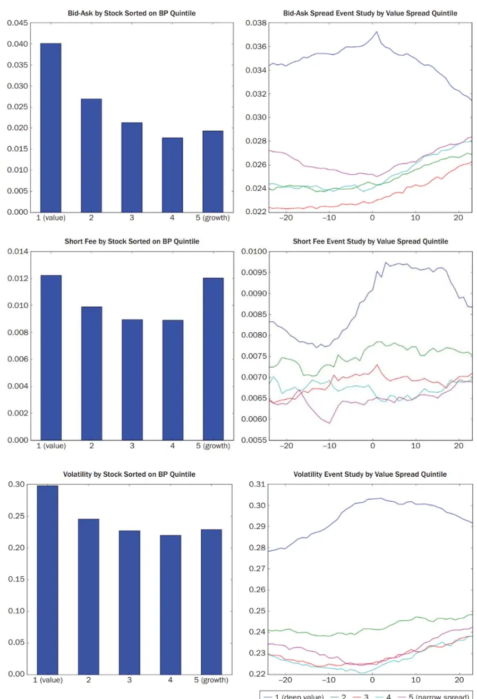
数据来源：《Deep Value》

受交易成本的限制，在深度价值事件中，只有买卖价差比较大时才存在套利机会。左上角的条形图显示，价值股的买卖价差大于成长股。右上角线图显示了，在深度价值事件期间，价值策略多头和空头的平均买卖价差，反映了套利者在价值策略上交易所产生的成本。

做空成本是深度价值投资的另一个套利限制。第二组图显示了卖空费用，数据来自 Data Explores 的简单平均卖空费用。条形图显示，做空价值股和成长型股票的成本是相似的，但双方面临的做空成本都高于普通股票(B/P 比率在第二至第四分位数的股票)。在深度价值事件期间，做空成长股的成本特别高：无论是事件发生前，还是投资组合形成后的一年多时间。

最后，利用深度价值机会的投资者必须承担更大的波动风险，这是套利的另一个潜在限制。第三组图用收益率的年化标准差来衡量波动性。条形图显示价值股往往比成长股有更高的波动率。折线图显示价值组合在深度价值期经历的波动明显大于平均水平。此外，波动性在投资组合形成期显著增加，然后在此后长达两年的时间里持续保持在高位。

综上所述，深度价值套利受到交易成本升高、卖空费用和波动性的限制。

## 7. 我们的思考

深度价值时期，价值股与成长股账面市值比差距较大，通过做多价值股做空成长股的策略组合，可以获得超额利润。该价值策略的回报与价值股的价值、动量、深度价值事件发生的数量有关。这种存在套利机会存在的原因，一方面是对未来股票价格走势的合理预测以及对风险的理性补偿；另一方面是行为投资者由于价值股较差的历史收益表现，面临更大的抛售压力做出的过度反应。但价值套利受到交易成本和波动性风险的制约，只能在有限程度上实现。

该文章本质是对价值成长的多空策略进行了一个择时，只在两者估值分化到一定程度时进行多空操作。结果显示，这样做可以获得一定的超额收益。

## 8. 风险提示

量化模型失效风险：本篇报告所述相关文章结论以及实证结论完全由量化模型和历史数据得到，请注意样本外存在失效的可能性。

## 本公司具有中国证监会核准的证券投资咨询业务资格

## 分析师声明

作者具有中国证券业协会授予的证券投资咨询执业资格或相当的专业胜任能力，保证报告所采用的数据均来自合规渠道，分析逻辑基于作者的职业理解，本报告清晰准确地反映了作者的研究观点，力求独立、客观和公正，结论不受任何第三方的授意或影响，特此声明。

## 免责声明

本报告仅供国泰君安证券股份有限公司（以下简称“本公司”）的客户使用。本公司不会因接收人收到本报告而视其为本公司的当然客户。本报告仅在相关法律许可的情况下发放，并仅为提供信息而发放，概不构成任何广告。

本报告的信息来源于已公开的资料，本公司对该等信息的准确性、完整性或可靠性不作任何保证。本报告所载的资料、意见及推测仅反映本公司于发布本报告当日的判断，本报告所指的证券或投资标的的价格、价值及投资收入可升可跌。过往表现不应作为日后的表现依据。在不同时期，本公司可发出与本报告所载资料、意见及推测不一致的报告。本公司不保证本报告所含信息保持在最新状态。同时，本公司对本报告所含信息可在不发出通知的情形下做出修改，投资者应当自行关注相应的更新或修改。

本报告中所指的投资及服务可能不适合个别客户，不构成客户私人咨询建议。在任何情况下，本报告中的信息或所表述的意见均不构成对任何人的投资建议。在任何情况下，本公司、本公司员工或者关联机构不承诺投资者一定获利，不与投资者分享投资收益，也不对任何人因使用本报告中的任何内容所引致的任何损失负任何责任。投资者务必注意，其据此做出的任何投资决策与本公司、本公司员工或者关联机构无关。

本公司利用信息隔离墙控制内部一个或多个领域、部门或关联机构之间的信息流动。因此，投资者应注意，在法律许可的情况下，本公司及其所属关联机构可能会持有报告中提到的公司所发行的证券或期权并进行证券或期权交易，也可能为这些公司提供或者争取提供投资银行、财务顾问或者金融产品等相关服务。在法律许可的情况下，本公司的员工可能担任本报告所提到的公司的董事。

市场有风险，投资需谨慎。投资者不应将本报告作为作出投资决策的唯一参考因素，亦不应认为本报告可以取代自己的判断。
在决定投资前，如有需要，投资者务必向专业人士咨询并谨慎决策。

本报告版权仅为本公司所有，未经书面许可，任何机构和个人不得以任何形式翻版、复制、发表或引用。如征得本公司同意进行引用、刊发的，需在允许的范围内使用，并注明出处为“国泰君安证券研究”，且不得对本报告进行任何有悖原意的引用、删节和修改。

若本公司以外的其他机构（以下简称“该机构”）发送本报告，则由该机构独自为此发送行为负责。通过此途径获得本报告的投资者应自行联系该机构以要求获悉更详细信息或进而交易本报告中提及的证券。本报告不构成本公司向该机构之客户提供的投资建议，本公司、本公司员工或者关联机构亦不为该机构之客户因使用本报告或报告所载内容引起的任何损失承担任何责任。

## 评级说明

## 1.投资建议的比较标准

投资评级分为股票评级和行业评级。以报告发布后的 12 个月内的市场表现为比较标准，报告发布日后的 12 个月内的公司股价（或行业指数）的涨跌幅相对同期的沪深 300 指数涨跌幅为基准。

## 2.投资建议的评级标准

报告发布日后的 12 个月内的公司股价（或行业指数）的涨跌幅相对同期的沪深300 指数的涨跌幅。

| 评级 |  | 说明 |
| --- | --- | --- |
| 股票投资评级 | 增持 | 相对沪深 300 指数涨幅 15%以上 |
|  | 谨慎增持 | 相对沪深 300指数涨幅介于5%～15%之间 |
|  | 中性 | 相对沪深300指数涨幅介于-5%～5% |
|  | 减持 | 相对沪深300 指数下跌5%以上 |
| 行业投资评级 | 增持 | 明显强于沪深 300 指数 |
|  | 中性 | 基本与沪深 300 指数持平 |
|  | 减持 | 明显弱于沪深300指数 |

## 国泰君安证券研究所

|  | 上海 | 深圳 | 北京 |
| --- | --- | --- | --- |
| 地址 | 上海市静安区新闸路669 号博华广 场20层 | 深圳市福田区益田路6003号荣超商 务中心 B 栋27 层 | 北京市西城区金融大街甲9号金融 街中心南楼18层 |
| 邮编 | 200041 | 518026 | 100032 |
| 电话 | （021）38676666 | （0755）23976888 | (010)83939888 |
|  | E-mail: gtjaresearch@gtjas.com |  |  |