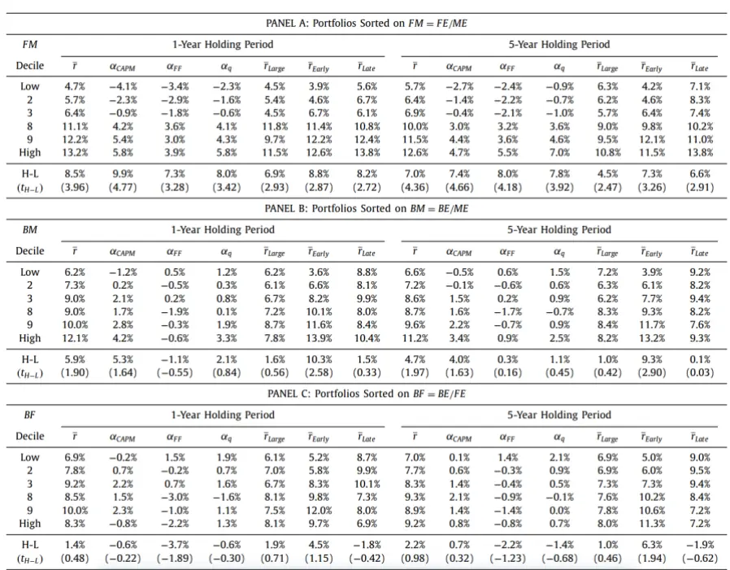

nInfo] [Table_Title] 2023.07.29

# 基于未来现金流构建新价值因子

## ——学术纵横系列之五十

## 张晗(分析师)

## 梁誉耀(研究助理)

8 021-38676666

021-38038665

zhanghan027620@gtjas.com

liangyuyao026735@gtjas.co

证书编号 S0880522120005

S0880122070051

## 本报告导读：

该文章计算了更加接近价值本质的新价值因子，该价值因子的分子为未来现金流的贴现，其因子收益较传统的账面市值比因子更强更稳定。

## 摘要：

le_Summary]价值溢价指的是高账面市值比公司比低账面市值比公司在未来会获得更高的平均回报。然而证据表明，在最近几十年里，价值溢价相对较低，甚至不存在。

我们基于未来现金流构建新的价值因子：基本市场比率。具体而言，将账面市值比的分子由所有者权益替换为公司未来现金流的贴现后即可求得基本市场比率。

从理论层面分析，公司价值源于未来现金流的贴现，传统的账面市值比因子的分子为所有者权益，仅能反映公司目前为止的财务指标，而新价值因子关注未来现金流，更加接近价值的本质。

FM 因子计算的难点在于对未来现金流的估计。本文使用 VAR 系统估1070计未来现金流，通过价值、增长、盈利和资本结构四方面共12个指标间的牵制与平衡来确保模型的稳定性与收敛性，从而实现对未来现金流的估计。

实证检验发现，虽然传统上使用账面市值比(BM = BE/ME)来定义的价值溢价已经下降，但当我们使用新的价值因子(FM = FE/ME)对股票进行分类时，强劲持久且相对稳定的价值溢价再次出现。并且在控制 FM 后，BM 的价值溢价大幅下降，且在统计上不显著。

BM 与 FM 之间的相关系数为 0.47，反映两者之间具有一定程度的关联性，加之 FM 因子从理论本质及价值溢价检验两方面均优于 BM，故可认为 BM 是 FM 的不完美的度量。通过比较前期和后期的相关系数可知，BM 对 FM 的度量能力呈现下降趋势。

量化模型失效风险：本篇报告所述相关文章结论以及实证结论完全由量化模型和历史数据得到，请注意样本外存在失效的可能性。

## 金融工程团队：

廖静池：(分析师)

电话：0755-23976176

邮箱：liaojingchi024655@gtjas.com

证书编号：S0880522090003

张晗：（分析师）

电话：021-38676666

邮箱：zhanghan027620@gtjas.com

证书编号：S0880522120005

卢开庆：（研究助理）

电话：021-38038674

邮箱：lukaiqing026727@gtjas.com

证书编号：S0880122080144

## 梁誉耀：（研究助理）

电话：021-38038665

邮箱：liangyuyao026735@gtjas.com

证书编号：S0880122070051

## [Table_Re相关报告

估值分化期的价值策略 2023.07.12

风险变化如何影响成交量 2023.07.08

股债相关性驱动因素研究 2022.12.16

新闻报道对股价跳跃的影响 2022.10.28

基于 分 布 函 数 的 两 种 非 对 称 性 测 度2022.07.21

## 1. 引言

价值溢价（Value premium）是最古老、研究最多的资产定价现象之一。它通常被表述为一个风格化的事实，即高账面市值比公司比低账面市值比公司在未来会获得更高的平均回报。然而，最近的证据表明，在最近几十年里，价值溢价相对较低，甚至不存在。

Andrei S. Gonçalves 和 Gregory Leonard 在《The fundamental-to-marketratio and the value premium decline》中将基本权益 FE 被定义为公司在共同贴现率下的未来现金流量的现值，并认为，价值溢价的明显下降是因为账面权益 BE 仅仅反映了公司到目前为止的财务状况，而公司的价值本质是未来现金流的贴现 FE，两者之间存在质的差别，故 BE不是基本权益 FE的良好代表，无法充分产生价值溢价。而事实上，我们发现，虽然传统上使用账面市值比(BM = BE/ME)来定义的价值溢价已经下降，但当我们根据基本市值比(FM = FE/ME)对股票进行分类时，强劲且相对稳定的价值溢价再次出现。

本文的正文包括如下部分：第一，介绍基本市值比的定义以及推导过程；第二，我们提出了“BM 是 FM 不完美度量”的观点，并从三个角度进行了证明。最后，对全文进行总结与思考。

## 2. 基本市场比率（The fundamental-to-market ratio）

## 2.1. 基本权益的定义

根据股利贴现模型，公司的市值可以用未来股息的现值之和表示，在经过一定的变形，可以表示为：

$$
\boldsymbol{M}E_{j,t}=\boldsymbol{B}E_{j,t}\cdot\sum_{h=1}^{\infty}\mathbb{E}_{t}\left[PO_{j,t+h}/BE_{j,t}\right]\cdot e^{-h\cdot dr_{j,t}^{(h)}}\tag{1}
$$

其中为公司 j 在时刻 t 的市场权益，表示公司将在未来交付的权益支付流(股息+回购-发行)。是公司的账面权益，是公司的 h 年派息贴现率。

在《The fundamental-to-market ratio and the value premium decline》中，基本权益 FE 被定义为公司在共同贴现率下的未来现金流量的现值，这与 ME在理论上的公式是高度相似的。具体来说，我们将公司的基本权益定义为中纯粹来自预期现金流量的部分，即用一个固定的常数贴现率代替随时间变动的贴现率，可得下式：

$$
FE_{j,t}=BE_{j,t}\cdot\sum_{h=1}^{\infty}\mathbb{E}_{t}\left[PO_{j,t+h}/BE_{j,t}\right]\cdot e^{-h\cdot dr}\tag{2}
$$

而想要计算（2）式，则需要对公司未来的现金流进行估计。本文认为，公司的各项财务指标对未来现金具有预测作用，想要估计 FE 就需要估计公司未来的财务指标。

## 2.2. 估计基本权益

因为公司的净盈余等于股利与账面价值变动额之和，$\begin{array}{r}{\mathbb{E}[\mathbb{P}^{CSE}j,t=PO_{j,t}+\Delta BE_{j,t}}\end{array}$ ，因此可以将（2）变形为（3）：

$$
\begin{array}{rl}&{\frac{\mathbb{E}_{t}\left[PO_{j,t+h}\right]}{BE_{j,t}}=\mathbb{E}_{t}\left[\left(1+\frac{\mathrm{CS}E_{j,t+h}}{BE_{j,t+h-1}}-\frac{BE_{j,t+h}}{BE_{j,t+h-1}}\right)\cdot\prod_{\tau=1}^{h-1}\frac{BE_{j,t+\tau}}{BE_{j,t+\tau-1}}\right]}\\&{\quad\quad\quad\quad=\mathbb{E}_{t}\left[\left(e^{\mathrm{CSp}rof_{j,t+h}-BEg_{j,t+h}}-1\right)\cdot e^{\sum_{\tau=1}^{h}BEg_{j,t+\tau}}\right]}\end{array}
$$

（3）式较（2）式的最大优势是其参数均来自于企业的可得数据指标，因此我们只需要对企业未来的财务指标进行估计就可以实现对 FE 的估计。

预测公司未来永续的财务指标并非易事，一方面，影响财务指标的因素很多，很难有一个模型能包含全部影响因素；另一方面，未来的不确定性因素很大，黑天鹅事件时有发生；这都为我们预测未来财务指标造成了困难。

Andrei S.Gonçalves 和 Gregory Leonard 采用向量自回归(VAR)系统，可以在一定程度上解决这个问题。向量自回归系统是将每一个内生变量作为系统中所有内生变量的滞后值的函数来构造的模型，常常被用在多变量时间序列模型的分析上。简单来说，该模型可以将若干时间序列未来的数据用过去的数据以函数的形式进行表示。

VAR 很大的一个优点是在系数矩阵合适的情况下，是一个动态平衡的系统，其模型结果具有收敛性。收敛性允许我们对未来很长一段时间的财务指标进行预测。

在具体实践方面，文中的向量自回归系统选取了最有价值的四大类指标共十二个变量，分别是：

（i）价值指标（Valuation）

账面市值比： $bm_{j,t}=ln{\left(BE_{j,t}/ME_{j,t}\right)}$

派息率： $POy_{j,t}=ln\big(1+PO_{j,t}/ME_{j,t}\big)$

销售收益率： $Yy_{j,t}=ln\big(Y_{j,t}/ME_{j,t}\big)$

（ii）增长指标（Growth）

账面价值增长率： $BEg_{j,t}=ln\big(BE_{j,t}/BE_{j,t-1}\big)$

资产增长率： $Ag_{j,t}=ln\big(A_{j,t}/A_{j,t-1}\big)$

销售额增长率： $Yg_{j,t}=ln\big(Y_{j,t}/Y_{j,t-1}\big)$

（iii）盈利指标（Profitability）

净盈余利率： $\scriptstyle{CSprof_{j,t}=ln\left(1+\frac{PO_{j,t}+\Delta BE_{j,t}}{BE_{j,t-1}}\right)}$

净资产收益率： $\begin{array}{r}{Roe_{j,t}=ln\bigg(1+\frac{E_{j,t}}{0.5BE_{j,t}+0.5BE_{j,t-1}}\bigg)}\end{array}$数据来源：《The fundamental-to-market ratio and the value premium decline》

$$
\begin{array}{r}{\mathbb{E}(\neq\neq)\mathbb{\ Z}:Gprof_{j,t}=ln\bigg(1+\frac{GP_{j,t}}{0.5A_{j,t}+0.5A_{j,t-1}}\bigg)}\end{array}
$$

## （iv）资本结构指标（Capital Structure ）

市场杠杆： $Mle\nu_{j,t}=B_{j,t}/\left(ME_{j,t}+B_{j,t}\right)$

账面杠杆： $Ble\nu_{j,t}=B_{j,t}/A_{j,t}$

现金持有量： $Cash_{j,t}=C_{j,t}/A_{j,t}$

将样本数据（1973 年至 2018 年）代入后可估计向量自回归（VAR）得系数，计算结果如下：

表 1 VAR 全样本系数估计值和平均拟合优度

| State | Valuation |  |  | Growth |  |  | Profitability |  |  | Capital structure |  |  |
| --- | --- | --- | --- | --- | --- | --- | --- | --- | --- | --- | --- | --- |
|  | bm{+1 | POyt+1 | Yyt+1 | BEgt+1 | Agt+1 | Ygt+1 | CSproft+1 | Roet+1 | Gproft+1 | Mlev1+1 | Blevt+1 | Casht+1 |
| bm | 0.76 | 0.00 | 0.06 | 0.08 | 0.03 | 0.02 | 0.11 | 0.06 | 0.00 | 0.00 | 0.00 | 0.00 |
|  | [0.02] | [0.00] | [0.02] | [0.01] | [0.00] | [0.00] | [0.02] | [0.01] | [0.00] | [0.00] | [0.00] | [0.00] |
| POyt | -0.26 | 0.23 | -0.41 | -0.19 | -0.11 | -0.16 | -0.66 | -0.13 | -0.01 | -0.03 | -0.01 | -0.03 |
|  | [0.36] | [0.03] | [0.35] | [0.28] | [0.09] | [0.12] | [0.35] | [0.36] | [0.01] | [0.02] | [0.01] | [0.02] |
| Yyt | -0.04 | 0.00 | 0.96 | 0.01 | 0.00 | -0.01 | 0.02 | 0.03 | 0.00 | 0.00 | 0.00 | 0.00 |
|  |  | [0.00] | [0.01] | [0.00] | [0.00] | [0.00] | [0.00] | [0.01] |  |  |  | [0.00] |
| BEgt | [0.00] | 0.00 | -0.03 | 0.11 | 0.08 | 0.01 | -0.25 | -0.24 | [0.00] 0.00 | [0.00] | [0.00] 0.00 | -0.01 |
|  | -0.17 |  |  | [0.03] | [0.01] |  |  |  |  | 0.00 |  |  |
| Agt | [0.04] | [0.00] | [0.05] | 0.01 | 0.04 | [0.01] 0.25 | [0.06] | [0.05] | [0.00] | [0.00] | [0.00] | [0.00] |
|  | -0.15 | -0.01 | 0.84 |  |  |  | -0.05 | -0.07 | -0.02 | 0.02 | 0.01 | -0.03 |
| Ygt | [0.03] | [0.00] | [0.07] | [0.02] | [0.01] | [0.01] | [0.04] | [0.05] | [0.00] | [0.00] | [0.00] | [0.00] |
|  | -0.02 | -0.01 | 0.03 | 0.17 | 0.09 | 0.08 | 0.03 | 0.00 | 0.00 | 0.00 | 0.00 | 0.01 |
| CSprof | [0.03] | [0.00] | [0.06] | [0.02] | [0.01] | [0.01] | [0.08] | [0.07] | [0.00] | [0.00] | [0.00] | [0.00] |
|  | 0.04 | 0.00 | -0.05 | -0.03 | -0.02 | -0.02 | 0.15 | 0.12 | 0.00 | 0.00 | 0.00 | 0.00 |
| Roe | [0.02] | [0.00] | [0.03] | [0.02] | [0.01] | [0.01] | [0.03] | [0.04] | [0.00] | [0.00] | [0.00] | [0.00] |
|  | 0.03 | 0.01 | -0.09 | 0.12 | 0.02 | -0.01 | 0.40 | 0.62 | 0.00 | 0.00 | 0.00 | 0.00 |
| Gproft | [0.02] | [0.00] | [0.03] | [0.03] | [0.01] | [0.01] | [0.05] | [0.04] | [0.00] | [0.00] | [0.00] | [0.00] |
|  | 0.99 | 0.01 | -0.40 | -0.08 | 0.03 | -0.10 | 0.46 | 0.80 | 0.95 | -0.04 | -0.01 | 0.03 |
| Mlev: | [0.14] | [0.00] | [0.19] | [0.06] | [0.03] | [0.04] | [0.18] | [0.23] | [0.01] | [0.01] | [0.00] | [0.01] |
|  | -0.72 | -0.02 | -0.20 | -0.75 | -0.31 | -0.09 | -1.71 | -1.90 | -0.02 | 0.88 | 0.05 | 0.07 |
| Blevt | [0.16] | [0.00] | [0.22] | [0.13] | [0.03] | [0.04] | [0.37] | [0.45] | [0.00] | [0.01] | [0.01] | [0.01] |
|  | 1.24 | -0.02 | 0.13 | 1.34 | 0.22 | 0.16 | 2.25 | 1.62 | 0.02 | 0.05 | 0.83 | -0.16 |
|  | [0.21] | [0.01] | [0.28] | [0.17] | [0.06] | [0.08] | [0.50] | [0.44] | [0.01] | [0.02] | [0.01] | [0.02] |
|  | 0.21 | 0.01 | -0.45 | -0.08 | -0.10 | -0.06 | -0.07 | -0.36 | 0.00 | -0.02 | -0.02 | 0.82 |
| Cash | [0.05] | [0.00] | [0.08] | [0.02] | [0.01] | [0.02] | [0.07] | [0.14] | [0.00] | [0.00] | [0.00] | [0.01] |
|  | 75% | 14% | 87% | 14% | 16% | 14% | 12% | 39% |  |  |  |  |

注：图中数字代表着预测模型中各指标之间的对应系数，括号中的数字代表了对应的标准误，最后一行代表了每个变量的平均拟合优度。

*基于 VAR 的稳定性，在年份 H很大时我们有： 。因此，在 H>=1000 年时，我们使用 进行近似估计。

通过这张表格，我们就可以使用时间序列中过去项对公司未来各项财务指标及现金流进行预测，从而进一步完成对 FE以及 FM 的估计。

## 3. BM 是 FM的不完美度量

在《The fundamental-to-market ratio and the value premium decline》中，作者的核心观点是将 BM 视为 FM 的不完美度量，并表明潜在的 BM 溢价来自于这种关系，而近年来 BM 溢价的下降源于其不再是 FM 的有效度量了。从理论角度来说，公司的价值是未来所有现金流的贴现，而 FE定义为公司在共同贴现率下的未来现金流量的现值，两者是相契合的。而计算 BM 所需的所有者权益更多的是聚焦当下，因此 FM 相较于与BM 更加接近公司价值的本质。从实证角度来说，我们将在下文从三个角度证明这个观点。

## 3.1. BM 与 FM 的相关性分析

要证明“不完美度量”这一观点，我们首先要证明 BM 与 FM 具有一定的相关性，并且观察相关程度是否符合我们的预期。

首先我们对账市比 BM 进行如下变形：

$$
\underbrace{\frac{BE_{j,t}}{ME_{j,t}}}_{BM_{j,t}}=\underbrace{\frac{FE_{j,t}}{ME_{j,t}}}_{FM_{j,t}}\cdot\underbrace{\frac{BE_{j,t}}{FE_{j,t}}}_{BF_{j,t}}\quad\implies\quad bm_{j,t}=\ fm_{j,t}+\ bf_{j,t}
$$

于是，我们可以获得有关 BM 方差的等式：

$$
Var(bm)=Co\nu(bm,fm)+Co\nu(bm,bf)
$$

通过上式，我们便可以对 BM 与 FM 之间的相关性进行分析，分析结果如下：

表 2 FM, BM, BF 之间的关系

|  | σ²(bm) Decomposition |  |  | Linear correlation |  |  | Rank correlation |  |  |
| --- | --- | --- | --- | --- | --- | --- | --- | --- | --- |
| Year | σ(bm) | % fm | % bf | (bm, fm) | (bm, bf) | (fm,bf) | (bm, fm) | (bm, bf) | (fm, bf) |
| 1973 | 0.55 | 48.3% | 51.7% | 0.80 | 0.82 | 0.31 | 0.88 | 0.83 | 0.52 |
| 1975 | 0.56 | 70.9% | 29.1% | 0.93 | 0.73 | 0.43 | 0.95 | 0.81 | 0.62 |
| 1977 | 0.41 | 66.2% | 33.8% | 0.86 | 0.65 | 0.17 | 0.92 | 0.80 | 0.54 |
| 1979 | 0.41 | 61.2% | 38.8% | 0.90 | 0.79 | 0.45 | 0.92 | 0.82 | 0.57 |
| 1981 | 0.69 | 53.7% | 46.3% | 0.78 | 0.73 | 0.13 | 0.87 | 0.83 | 0.52 |
| 1983 | 0.59 | 64.4% | 35.6% | 0.61 | 0.39 | -0.49 | 0.77 | 0.69 | 0.18 |
| 1985 | 0.44 | 62.2% | 37.8% | 0.48 | 0.31 | -0.68 | 0.61 | 0.61 | -0.11 |
| 1987 | 0.56 | 61.2% | 38.8% | 0.43 | 0.29 | -0.74 | 0.47 | 0.52 | -0.38 |
| 1989 | 0.54 | 64.6% | 35.4% | 0.47 | 0.28 | -0.71 | 0.45 | 0.54 | -0.38 |
| 1991 | 0.81 | 51.8% | 48.2% | 0.43 | 0.41 | -0.65 | 0.46 | 0.59 | -0.31 |
| 1993 | 0.72 | 46.3% | 53.7% | 0.39 | 0.44 | -0.66 | 0.37 | 0.60 | -0.41 |
| 1995 | 0.60 | 55.3% | 44.7% | 0.39 | 0.32 | -0.75 | 0.36 | 0.54 | -0.48 |
| 1997 | 0.66 | 50.9% | 49.1% | 0.35 | 0.34 | -0.76 | 0.34 | 0.54 | -0.49 |
| 1999 | 0.78 | 40.4% | 59.6% | 0.35 | 0.48 | -0.65 | 0.36 | 0.62 | -0.40 |
| 2001 | 1.08 | 40.0% | 60.0% | 0.34 | 0.47 | -0.67 | 0.44 | 0.63 | -0.30 |
| 2003 | 0.70 | 37.9% | 62.1% | 0.29 | 0.44 | -0.73 | 0.33 | 0.62 | -0.42 |
| 2005 | 0.47 | 47.8% | 52.2% | 0.36 | 0.39 | -0.72 | 0.34 | 0.58 | -0.45 |
| 2007 | 0.46 | 43.6% | 56.4% | 0.33 | 0.41 | -0.73 | 0.31 | 0.62 | -0.44 |
| 2009 | 0.82 | 12.0% | 88.0% | 0.08 | 0.53 | -0.80 | 0.10 | 0.66 | -0.59 |
| 2011 | 0.56 | 35.3% | 64.7% | 0.28 | 0.47 | -0.71 | 0.21 | 0.65 | -0.50 |
| 2013 | 0.69 | 30.4% | 69.6% | 0.24 | 0.50 | -0.72 | 0.18 | 0.65 | -0.52 |
| 2015 | 0.77 | 16.7% | 83.3% | 0.14 | 0.57 | -0.73 | 0.13 | 0.70 | -0.50 |
| 2017 | 0.72 | 12.9% | 87.1% | 0.09 | 0.53 | -0.79 | 0.07 | 0.67 | -0.59 |
| 2018 | 0.78 | 17.3% | 82.7% | 0.13 | 0.53 | -0.77 | 0.10 | 0.68 | -0.54 |
| Average | 0.64 | 46.6% | 53.4% | 0.45 | 0.49 | -0.49 | 0.47 | 0.66 | -0.19 |
| 1973-1995 | 0.58 | 59.2% | 40.8% | 0.62 | 0.51 | -0.27 | 0.67 | 0.68 | 0.08 |
| 1996-2018 | 0.70 | 33.9% | 66.1% | 0.27 | 0.47 | -0.72 | 0.26 | 0.63 | -0.47 |

数据来源：《The fundamental-to-market ratio and the value premium decline》

通过表 2 的一个面板，我们可以发现：BM 平均解释了 46.6%的 FM 变化，这表明 BM 通常是 FM 的合理度量，但远非完美。同时，BM 中由解释的变化比例随着时间的推移而下降 在早期样本中为 ，在后期样本中为 33.9%)，这表明 BM 多年来已经成为 FM 的较差度量。表中第二和第三个面板从线性相关性和排名相关性两个角度展示了 BM、FM 和 BF 之间的横截面相关性，以探讨这个问题。我们将描述重点放在排名相关性上，因为它们在我们衡量价值溢价的投资组合方法的背景下更相关。

总体而言，Cor(bm, fm) = 0.47，证实 BM 是 FM 的合理但不完美的度量。同样与方差分解结果相似的是，Cor(bm, fm)随着时间的推移而下降(从早期样本的 0.67 下降到后期样本的0.26)，表明 BM 在最近几十年中成为FM 的较差度量。这种变化的发生不仅是因为 FM 对后期样本中 BM 的变化解释较少，而且还因为 Cor(fm, bf)在早期样本中呈弱正，而在后期样本中呈强负。

## 3.2. FM 较 BM 拥有更强、更持久、更稳定的价值溢价

3.1 从相关系数的角度证明了 BM 是 FM 的不完美度量，本节将从两者价值溢价差异的角度进行证明。

我们使用投资组合排序的方法来估计与 、 和 相关的价值溢价。具体来说，根据股票的 BM、FM 和 BF 将股票分成十分位组合，然后，研究这些投资组合在随后的一年和五年里的回报。为此，我们根据第 t 年、第 t-1 年、第 t-2 年、第 t-3 年和第 t-4 年 6 月获得的 BM、FM和 BF 对第 t 年的股票进行排序，并持有每一个投资组合中的一整年。然后，我们将平均十分位数回报视为该十分位数的 5 年持有期投资组合回报。例如，5 年持有期十分位数 10 FM 投资组合的月收益是由十分位数 $10~\mathrm{FM}_{\mathrm{t}}\cdot~\mathrm{FM}_{\mathrm{t}-1}\cdot~\mathrm{FM}_{\mathrm{t}-2}\cdot~\mathrm{FM}_{\mathrm{t}-3}$ $\mathrm{FM}_{\mathrm{t}-4}$ 投资组合的月收益的平均值给出的。这个分析方法的理念是，一个投资者每年根据 FM 建立投资组合，并持有 5 年，最终将获得每月的回报。

得到如下结果：

表 3 分类投资组合中的公司表现:FM、BM和 BF

数据来源：《The fundamental-to-market ratio and the value premium decline》

表 3 总结了按 BM、FM 和 BF 排序的投资组合的表现。表中每个部分的前四列（r̅， $\alpha_{\mathrm{CAPM}},~\alpha_{\mathrm{FF}},~\alpha_{\mathrm{q}}~$ ）表示年化平均收益率以及不同因子模型下的α。下一列 $\left(\mathrm{r}_{\mathrm{Large}}\right)$ ）显示了仅由大公司组成的投资组合的年化平均回报。最后两列提供了将样本分为早期(1973 年至 1995 年)和晚期(1996 年至 2018 年)的年化平均回报率。

从 1 年持有期的结果开始，平均收益表明 FM 相关的溢价比 BM 相关的溢价更强、更稳定。就强度而言， FM 多空组合的平均回报率为 8.5%$(\mathrm{t}_{\mathrm{stat}}{=}3.96)$ ，而 BM 多空组合的类似平均回报率为 5.9% $(\mathrm{t}_{s\mathrm{tat}}{=}1.90)$ 在稳定性方面，与 相关的溢价随着时间的推移是稳定的，在早期样本中有 8.8% $(\mathrm{t}_{s\mathrm{tat}}=2.87)$ 溢价，在后期样本中有 8.2% $(\mathrm{t}_{s\mathrm{tat}}=2.72)$ 溢价，而与 BM 相关的溢价在早期样本中很强 $(\mathrm{t}_{s\mathrm{tat}}=2.58$ 时为 10.3%)，但在后期样本中弱得多 $(\mathrm{t}_{s\mathrm{tat}}=0.33$ 时为 1.5%)。大型公司的 FM 溢价也保持强劲(6.9%， $\mathbf{t}_{s\mathrm{tat}}=2.93)$ ，而 BM 溢价较弱(1.6%， $\mathfrak{t}_{s\mathrm{tat}}=0.56)$ 。最后，我们发现在整个样本中，在大型公司中，以及在研究的每个样本期间，没有统计学上显著的溢价与 BF 相关。

价值溢价从根本上讲是关于长期回报的，因此我们也探讨了 5 年的持有期。结果与我们 年持有期的研究结果一致。也就是说，与 相关的溢价比与 BM 相关的溢价更强、更稳定，后者在样本后期或大公司内部实际上消失了。结果表明，价值溢价的下降并非源于短期回报和长期回报之间的脱节，而是源于 BM 不是 FM 的不完美度量，其捕获 FM 的有效性随着时间的推移而恶化。

## 3.3. 在控制 FM 的情况下BM的价值溢价情况

上文已经证明了 BM 与 FM 之间具有一定的相关性，并且 FM 的价值溢价比 BM 价值溢价更强，更稳定，更持久。但是，自始至终 BM 都拥有这一定的价值溢价能力，我们无法确定其价值溢价是由其对 FM 的不完美度量导致的，还是由其自身因素导致的。因此，考虑对面板数据进行回归，在控制 FM 的情况下，观察 BM 是否仍有一定的价值溢价。

结果如下表：

表 4 投资组合收益在十分位数上的面板回归:FM、BM与 BF

| PANEL A: 1-Year Holding Period |  |  |  |  |  |  |  |  |  |  |  |  |
| --- | --- | --- | --- | --- | --- | --- | --- | --- | --- | --- | --- | --- |
| Sorting variable | Full Sample |  |  | 1973 to 1995 |  |  | 1996 to 2018 |  |  | Difference: Late - Early |  |  |
|  | Univariate | [1] | [2] | Univariate | [1] | [2] | Univariate | [1] | [2] | Univariate | [1] | [2] |
| FM | 8.3% | 8.7% | 11.4% | 9.2% | 7.8% | 9.7% | 7.4% | 8.7% | 13.9% | -1.9% | 0.8% | 4.1% |
|  | (4.50) | (4.29) | (4.76) | (3.76) | (1.95) | (3.55) | (2.68) | (3.47) | (2.52) | (−0.51) | (0.17) | (0.67) |
| BM | 4.2% | 3.6% |  | 7.8% | 4.3% |  | 0.5% | 1.5% |  | -7.3% | -2.8% |  |
|  | (1.75) | (1.25) |  | (2.45) | (0.91) |  | (0.15) | (0.36) |  | (-1.56) | (-0.44) |  |
| BF | 1.7% (0.74) |  | 5.4% | 5.5% (1.68) |  | 4.6% (1.38) | -2.1% |  | 7.0% (1.14) | -7.6% |  | 2.3% (0.34) |
| (2.06) |  |  |  |  |  |  | (-0.65) |  |  | (-1.66) |  |  |
|  |  |  |  | PANEL B: 5-Year Holding Period |  |  |  |  |  |  |  |  |
| Sorting variable |  | Full Sample |  |  | 1973 to 1995 |  |  | 1996 to 2018 |  | Difference: Late - Early |  |  |
|  | Univariate | [1] | [2] | Univariate | [1] | [2] | Univariate | [1] | [2] | Univariate | [1] | [2] |
| FM | 6.5% | 7.1% | 8.7% | 7.9% | 5.6% | 7.2% | 5.0% | 6.7% | 8.3% | -2.8% | 1.1% | 1.1% |
|  | (4.37) | (3.42) | (4.66) | (3.92) | (1.40) | (2.99) | (2.35) | (3.15) | (2.16) | (-0.97) | (0.24) | (0.24) |
| BM | 3.4% | 2.8% |  | 7.2% | 4.5% |  | -0.5% | 0.2% |  | -7.8% | -4.3% |  |
|  | (1.68) | (1.04) |  | (2.70) | (0.92) |  | (−0.18) | (0.06) |  | (-1.99) | (−0.71) |  |
| BF | 1.9% |  | 4.1% | 5.8% |  | 4.5% | -2.1% |  | 2.9% | -8.0% |  | -1.6% |
|  | (0.95) |  | (1.83) | (2.17) |  | (1.42) | (−0.78) |  | (0.58) | (-2.08) |  | (−0.28) |

数据来源：《The fundamental-to-market ratio and the value premium decline》

实证数据表明，在控制 FM 后，BM 溢价要小得多，且统计上不显著。例如，列[1]显示，在控制了 FM 后，与 BM 相关的价值溢价为 3.6% (tstat= 1.25)，而与 FM 相关的价值溢价仍然很高(在 tstat = 4.29 时为 8.7%)。上表还显示了样本前期和后期 BM 和 FM 溢价的结果。以 BM 衡量的单变量价值溢价从 7.8% (tstat = 2.45)下降到 0.5% (tstat = 0.15)，而单变量FM 溢价在我们的样本期后半段保持强劲，从 9.2% (tstat = 3.76)变化到7.4% (tstat = 2.68)。

此外，在控制 FM 后，与 BM 相关的溢价在两个样本周期内都没有统计学意义。具体来说，列[2]表明控制 FM 后的 BM 溢价比早期样本高 4.3%(tstat = 0.91)，比晚期样本高 1.5% (tstat = 0.36)。相比之下，控制 BM 后的 FM 溢价从 7.8% (tstat = 1.95)略微增加到 8.7% (tstat = 3.47)。这一结果表明，BM 和 FM 之间相关性的下降在很大程度上解释了 BM 测量的价值溢价的明显下降。

综上所述，可以证明 BM 的价值溢价来源于其是 FM 的不完美度量。

## 4. 原文文献结论

最近的研究表明，价值溢价出现了明显下降趋势。在本文中，我们认为这种下降的发生是因为账面权益(BE)不再是基本权益(FE)的良好代表，基本权益(FE)被定义为公司在共同贴现率下的现金流现值。作者估计了美国上市公司的FE，发现与基本市值比(FM)相关的溢价保持相对稳定，而 FM 与账面市值比(BM)之间的横截面相关性随着时间的推移而下降，导致价值溢价明显下降。此外，在控制 之后，与 相关的溢价在经济上要弱得多，并且在整个样本期间统计上不显著。

本文提供了一个与价值投资原则密切相关的新价值信号 FM，其结果有助于理解近年来价值溢价下降的现象。具体来说，我们将 BM 视为 FM的不完美度量，并表明 BM 溢价源自于这种度量关系。由于 BM 与 FM之间的关联性在过去几年里已经下降，故 BM 不再像过去那样产生溢价。

## 5. 我们的思考

账面市值比 BM 是一个历史悠久的价值因子，其价值溢价效应也广为称道。而如今 BM 的价值溢价逐渐下降，新提出的 FM 有效弥补了这一缺陷，为投资者的资产组合提供了一个新型的可参考价值因子。文章已从多个角度证明了 FM 比 BM 更加接近公司价值的本质，BM 只是 FM 的不完美度量。如今，各公司资产结构与经济活动较过去已经发生了巨大的变化，账面权益似乎不再是基本权益的良好代表。FM 因子使用 VAR系统估计未来现金流从而构建新价值因子的思路值得我们借鉴，在未来，我们或者可以在 FM 的基础上，构造出更优秀的价值因子。

## 6. 风险提示

量化模型失效风险：本篇报告所述相关文章结论以及实证结论完全由量化模型和历史数据得到，请注意样本外存在失效的可能性。

## 本公司具有中国证监会核准的证券投资咨询业务资格

## 分析师声明

作者具有中国证券业协会授予的证券投资咨询执业资格或相当的专业胜任能力，保证报告所采用的数据均来自合规渠道，分析逻辑基于作者的职业理解，本报告清晰准确地反映了作者的研究观点，力求独立、客观和公正，结论不受任何第三方的授意或影响，特此声明。

## 免责声明

本报告仅供国泰君安证券股份有限公司（以下简称“本公司”）的客户使用。本公司不会因接收人收到本报告而视其为本公司的当然客户。本报告仅在相关法律许可的情况下发放，并仅为提供信息而发放，概不构成任何广告。

本报告的信息来源于已公开的资料，本公司对该等信息的准确性、完整性或可靠性不作任何保证。本报告所载的资料、意见及推测仅反映本公司于发布本报告当日的判断，本报告所指的证券或投资标的的价格、价值及投资收入可升可跌。过往表现不应作为日后的表现依据。在不同时期，本公司可发出与本报告所载资料、意见及推测不一致的报告。本公司不保证本报告所含信息保持在最新状态。同时，本公司对本报告所含信息可在不发出通知的情形下做出修改，投资者应当自行关注相应的更新或修改。

本报告中所指的投资及服务可能不适合个别客户，不构成客户私人咨询建议。在任何情况下，本报告中的信息或所表述的意见均不构成对任何人的投资建议。在任何情况下，本公司、本公司员工或者关联机构不承诺投资者一定获利，不与投资者分享投资收益，也不对任何人因使用本报告中的任何内容所引致的任何损失负任何责任。投资者务必注意，其据此做出的任何投资决策与本公司、本公司员工或者关联机构无关。

本公司利用信息隔离墙控制内部一个或多个领域、部门或关联机构之间的信息流动。因此，投资者应注意，在法律许可的情况下，本公司及其所属关联机构可能会持有报告中提到的公司所发行的证券或期权并进行证券或期权交易，也可能为这些公司提供或者争取提供投资银行、财务顾问或者金融产品等相关服务。在法律许可的情况下，本公司的员工可能担任本报告所提到的公司的董事。

市场有风险，投资需谨慎。投资者不应将本报告作为作出投资决策的唯一参考因素，亦不应认为本报告可以取代自己的判断。
在决定投资前，如有需要，投资者务必向专业人士咨询并谨慎决策。

本报告版权仅为本公司所有，未经书面许可，任何机构和个人不得以任何形式翻版、复制、发表或引用。如征得本公司同意进行引用、刊发的，需在允许的范围内使用，并注明出处为“国泰君安证券研究”，且不得对本报告进行任何有悖原意的引用、删节和修改。

若本公司以外的其他机构（以下简称“该机构”）发送本报告，则由该机构独自为此发送行为负责。通过此途径获得本报告的投资者应自行联系该机构以要求获悉更详细信息或进而交易本报告中提及的证券。本报告不构成本公司向该机构之客户提供的投资建议，本公司、本公司员工或者关联机构亦不为该机构之客户因使用本报告或报告所载内容引起的任何损失承担任何责任。

## 评级说明

## 1.投资建议的比较标准

投资评级分为股票评级和行业评级。以报告发布后的 12 个月内的市场表现为比较标准，报告发布日后的 12 个月内的公司股价（或行业指数）的涨跌幅相对同期的沪深 300 指数涨跌幅为基准。

## 2.投资建议的评级标准

报告发布日后的 12 个月内的公司股价（或行业指数）的涨跌幅相对同期的沪深300 指数的涨跌幅。

| 评级 |  | 说明 |
| --- | --- | --- |
| 股票投资评级 | 增持 | 相对沪深 300指数涨幅 15%以上 |
|  | 谨慎增持 | 相对沪深300指数涨幅介于5%～15%之间 |
|  | 中性 | 相对沪深300指数涨幅介于-5%～5% |
|  | 减持 | 相对沪深300指数下跌5%以上 |
| 行业投资评级 | 增持 | 明显强于沪深 300 指数 |
|  | 中性 | 基本与沪深 300指数持平 |
|  | 减持 | 明显弱于沪深300指数 |

## 国泰君安证券研究所

|  | 上海 | 深圳 | 北京 |
| --- | --- | --- | --- |
| 地址 | 上海市静安区新闸路669 号博华广 场20层 | 深圳市福田区益田路6003号荣超商 务中心 B 栋27 层 | 北京市西城区金融大街甲9号金融 街中心南楼18层 |
| 邮编 | 200041 | 518026 | 100032 |
| 电话 | （021）38676666 | （0755）23976888 | (010)83939888 |
|  | E-mail: gtjaresearch@gtjas.com |  |  |