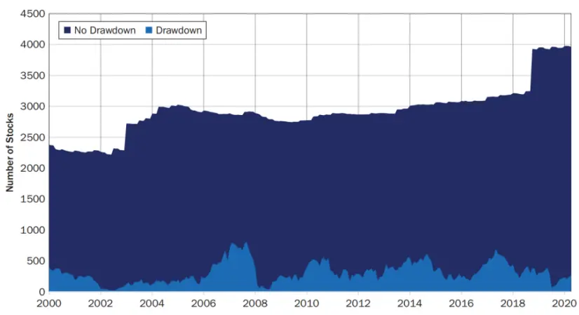
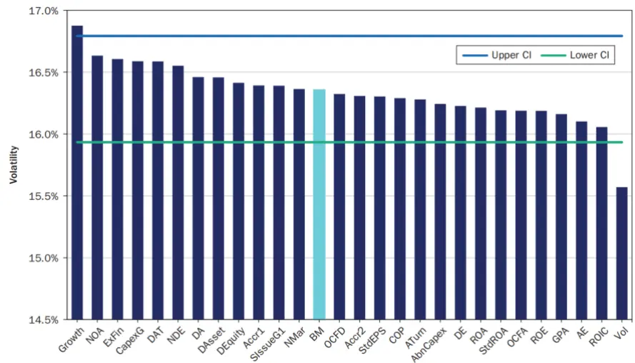
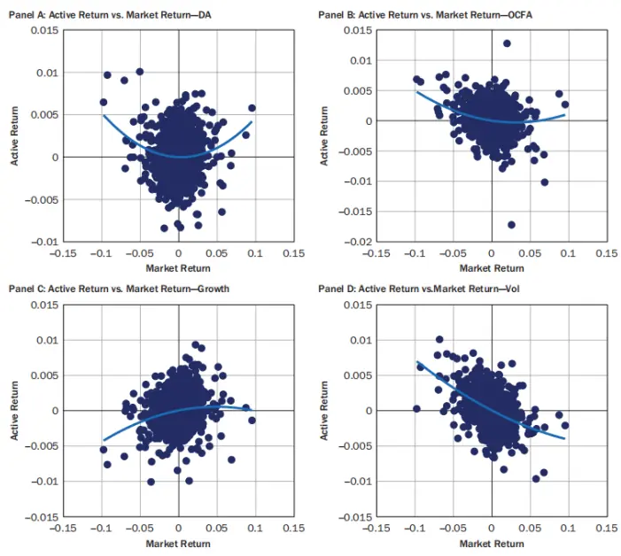

nInfo] [Table_Title] 2023.08.21

# 防御型股票的特征

## ——学术纵横系列之五十一

张晗(分析师)

## 梁誉耀(研究助理)

8 021-38676666

021-38038665

zhanghan027620@gtjas.com

liangyuyao026735@gtjas.co

证书编号 S0880522120005

S0880122070051

## 本报告导读：

该文章介绍防御型股票所应具备的特点，分别探究了低商业周期风险、低市场风险和低永久资本损失风险的股票特征。

## 摘要：

le_Summary]防御型投资者是指投资组合中债券占比大于股票占比的投资者。防御型投资者的目标不仅仅是减少投资收益的波动性，还包括长期资本保护、经济风险分散化和尽可能避免投资收益的降低。

为了实现目标，防御型投资者的投资策略应该具备三个属性：永久资本损失风险低、商业周期风险低、市场风险低。其中，永久资本损失风险低意味着投资者在下跌期间卖出或投资本身因基本面原因无法收回的可能性较小，商业周期风险低意味着股票流动性较高，市场风险低意味着投资组合的极端损失出现概率小于市场。

将这三个防御属性作为标准，进一步研究防御型股票的特征。根据历史文献总结得出资产周转率、收益质量、增长、投资、杠杆、波动性、盈利性等七大特征，再以富时发达股票为研究对象，分别分析七大特征与三大属性的关系。

永久资本损失风险：高资产周转率、高收益质量、低投资、低杠杆、低波动性和高盈利性的投资组合将具有更低的永久资本损失风险，而高增长的投资组合将具有更高的永久资本损失风险。与此同时，如何定义投资和盈利性特征对投资结果也有重大影响。商业周期风险：低杠杆和低波动性是对商业周期风险最具防御性的特征。市场风险：低杠杆、低波动性、高盈利性和高收益质量的投资组合具有低市场风险，高增长的投资组合则市场风险较高。

综上所述，高收益质量、低杠杆和低波动性都是防御型股票的特征；而高资产周转率、低投资和高盈利性只有在特定定义和适当杠杆水平下才是防御特征；增长不是防御特征。

量化模型失效风险：本篇报告所述相关文章结论以及实证结论完全由量化模型和历史数据得到，请注意样本外存在失效的可能性。

金融工程

## 金融工程团队：

廖静池：(分析师)

电话：0755-23976176

邮箱：liaojingchi024655@gtjas.com

证书编号：S0880522090003

张晗：（分析师）

电话：021-38676666

邮箱：zhanghan027620@gtjas.com

证书编号：S0880522120005

卢开庆：（研究助理）

电话：021-38038674

邮箱：lukaiqing026727@gtjas.com

证书编号：S0880122080144

## 梁誉耀：（研究助理）

电话：021-38038665

邮箱：liangyuyao026735@gtjas.com

证书编号：S0880122070051

## [Table_Re相关报告

基于未来现金流构建新价值因子 2023.07.29

估值分化期的价值策略 2023.07.12

风险变化如何影响成交量 2023.07.08

股债相关性驱动因素研究 2022.12.16

新闻报道对股价跳跃的影响 2022.10.28

## 1. 引言

防御型投资者是指投资组合中债券占比大于股票的投资者。要找出防御型投资者适合的投资组合，我们需要明晰投资目标和防御型股票的特征。

首先，防御型投资者的目标通常不仅仅是简单的减少波动性，还包括长期资本保护、经济风险分散化和尽可能避免投资收益的降低。其次，为了找出防御型股票的特征，我们列出了防御型投资策略应该具备的三个属性。接着，以这三个属性为标准，我们分别对文献总结得出的七大特征进行理论分析与指标定义。最后，我们以富时发达股票市场为对象，通过回归分析、模拟投资组合等方法分析这些特征是否为防御特征。

本文的正文主要有两部分内容：第一，防御型策略的三种属性及防御属性可能的表现特征；第二，通过回归分析及优化组合等方法检验防御特征。

## 2. 数据来源与理论框架

## 2.1. 数据与方法论

本文针对富时发达(DM)指数的股票组成。该指数是市值加权投资组合，由代表发达股票市值最高的 90%的上市公司组成，符合流动性和可投资性标准。研究期从 2000 年 9 月的指数再平衡开始，到 2021 年 12 月 31日结束。所有的测试和投资组合模拟都基于历史指数成分，并使用Worldscope 的时间点数据，这意味着研究不受生存或前瞻偏差的影响。

分析过程中，使用了富时全球因子指数 2 系列的因子定义和 beta、动量、大小和价值因子的数据，以及行业集团的行业分类基准（ICB）分类法 3。在分析资产周转率、收益质量和杠杆特征时，金融股（ICB行业 30）和房地产（ICB行业 35）被排除在研究领域之外，这与对这些因素的原始研究一致。因素特征数据在每月的第三个星期五之后的星期一，使用该历史日期的最新数据进行修订。这些日历日期与富时再平衡日历一致，因此在我们的股票宇宙的成分变化。我们使用相同的富时日历日期来进行每月的回归分析。所有因子数据都通过一个迭代过程转换为 z 分数，该过程横断面标准化数据，在-3 和 3 处筛选，然后重复。下表显示了平均特征数据的覆盖范围。

表 1：数据覆盖范围

| Category | Metric | Average Number of Stocks with Data | Coverage |
| --- | --- | --- | --- |
| Asset Turnover | ATurn | 2,010.3 | 99.8% |
|  | DAT | 1,990.0 | 99.0% |
| Earnings Quality | Accr1 | 1,593.5 | 79.3% |
|  | Accr2 | 2,010.2 | 99.8% |
|  | NOA | 2,008.4 | 99.7% |
| Growth | Growth | 1,835.7 | 95.3% |
| Investment | AbnCapex | 1,968.3 | 97.8% |
|  | CapexG | 1,947.2 | 96.7% |
|  | DAsset | 2,013.5 | 100.0% |
|  | DEquity | 2,013.5 | 100.0% |
|  | ExtFin | 1,996.4 | 99.2% |
|  | SlssueG | 1,967.5 | 97.7% |
| Leverage | AE | 2,008.4 | 99.8% |
|  | DA | 2,008.4 | 99.7% |
|  | DE | 2,008.4 | 99.8% |
|  | NDE | 2,008.4 | 99.8% |
|  | OCFD | 1,974.9 | 98.2% |
| Low Volatility | StdEPS | 1,869.8 | 96.3% |
|  | StdROA | 1,999.9 | 99.3% |
|  | Vol | 2,013.5 | 100.0% |
| Profitability | COP | 2,010.3 | 99.8% |
|  | GPA | 2,010.2 | 99.8% |
|  | NMar | 2,008.4 | 99.7% |
|  | OCFA | 2,010.2 | 99.8% |
|  | ROA | 2,010.3 | 99.8% |
|  | ROE | 2,010.3 | 99.8% |
|  | ROIC | 2,013.5 | 100.0% |
|  | Total | 2,013.5 |  |

数据来源：《In Search of a Defensive Equity Factor》。注：本表显示了 2000 年 9 月至2021年 12月期间 DM 指数的平均数据可用性数据。

我们使用国内生产总值（GDP）的增长来定义商业周期阶段。我们从公开的 OECD 组织数据库中获取经济合作与发展组织（OECD）国家的实际 GDP 规模和增长数据，并将这些数据结合起来，创建 DM 的加权平均 GDP 增长时间序列。我们根据这些时间序列定义了四个业务周期阶段：

（1）放缓：非衰退低于趋势增长

（2）衰退：连续两个季度的负增长

（3）复苏：衰退后（24 个月）高于趋势增长

（4）增长：剩余月（前 24 个月）高于趋势增长

下表显示了 DM 中业务周期阶段的比例。从 2000 年到 2021 年，经济衰退的比例最小，占整个季度的 13%。在此期间，构成 DM 指数的经济体经历了全球金融危机、欧洲债务危机和 COVID-19 大流行。复苏和放缓都占了四分之一的时间，而在 35%的季度，经济在增长。

表 2：每个商业周期阶段的季度数

| Stage | Number of Quarters | Proportion |
| --- | --- | --- |
| Recession | 11 | 13% |
| Recovery | 22 | 25% |
| Slowdown | 24 | 27% |
| Growth | 31 | 35% |

数据来源：《In Search of a Defensive Equity Factor》。注：2000 年 1 月至 2021 年 12月之间的每个季度都根据前文的方法对应一个商业周期阶段。这些阶段是根据 DM指数的组成国家的 GDP来计算的。

## 2.2. 防御型策略的三种属性

## 2.2.1. 永久资本损失风险低

虽然损失和获利的概率可以被建模、估计，但它们终究不可测量，无法被准确知晓。即便我们知道了未来发展的概率分布，但概率和结果终归有较大的区别；再加上关于损失、获利的风险（如利率风险、信用风险等）往往是多重的、对比的、难以同时最小化的，因此亏损风险往往难以像暂时价格波动那样可以较为清楚地被量化，故我们将亏损风险定义为永久资本损失。

当投资者在下跌期间卖出或投资本身因基本面原因无法收回时，永久性资本损失便会发生。因此，永久资本损失风险低意味着投资者在下跌期间卖出或投资本身因基本面原因无法收回的可能性较小。

## 2.2.2. 商业周期风险低

在经济衰退之前，除去离开股市的投资者，剩余市场参与者往往会将其股票投资组合从流动性较低转移到规模较大、流动性较高的股票。因此，商业周期风险低意味着股票流动性较高。一般而言，基本面较好的股票流动性较高，基本面较低的股票流动性较低。

## 2.2.3. 市场风险低

考虑到流动性和投资者对风险的承受能力，价格波动对投资者便十分重要。我们将市场风险定义为回报的二、三、四阶距，市场风险低便意味着投资组合的极端损失出现概率小于市场。这种属性是投资者的主要预期。

## 2.3. 防御属性可能的表现特征

根据历史文献，总结得出资产周转率、收益质量、增长、投资、杠杆、波动性、盈利性等防御属性可能的七大表现特征。

## 2.3.1. 资产周转率

资产周转率是杜邦公司盈利能力分解中的一个指标，与净利润率、权益乘数的乘积即为净资产收益率。在其他条件不变的情况下，更高的资产周转率会产生更高的回报，往往伴随着更高的风险；然而，对于固定的利润率和股本回报率(ROE)，更高的资产周转率会降低杠杆，从而增强投资组合的防御属性。通过后文检验结果，我们发现高资产周转率实际上是可以增强投资组合的防御性的，而这与第一种说法相悖，我们猜测这可能取决于其他变量。因此，我们认为高资产周转率是防御属性的表现特征。

我们通过资产周转率指标 ATurn 和资产周转率的变化指标 DAT 来分析。

## 2.3.2. 收益质量

收益质量，通常由应计水平来衡量。因为应收账款有信用风险，同时较高水平的应收账款额可能与会计欺诈有关，所以较低的应计水平也代表着较低的风险。因此，我们认为高收益质量是第一或第二防御属性的表现特征。

我们通过三种应计指标进行分析，分别是：

(1) 应计指标 1：Acc1 = ∆WC+∆NCO+∆FIN 其中 
Average assets 
WC = (Current assets − Cash and short − 
term investments) − (Current liabilities − short − term debt), 
NCO = (Total assets − Current assets − 
investments and advances) − (Total liabilities − 
Current liabilities − Long − term debt), 
FIN = (Short − term investments + Long − 
term investments) − (Long − term debt + Short − term debt + 
Preferred stock)

(2) 应计指标 2：Acc2 = (∆Account receivable + ∆Inventory − 
∆Accounts payable and accrued liabilities − 
∆Net Change in other asset and liabilities ∆Accrued income taxes)/ 
Average assets

(3) 净营运资产：Net Operating Assets = ∑T Operating Accruals + ∑ InvestmenttT0

## 2.3.3. 增长

因为在其他条件相同的情况下，较高的预期增长往往伴随着较高的预期回报，因此风险也较高。同时，对于第二防御属性，企业在增长的经济中更容易增加收益，因此投资这样的企业将面临商业周期的顺周期风险。因此，我们认为高增长并非是防御属性的表现特征。

我们通过每股收益（EPS）进行分析。

## 2.3.4. 投资

因为代理人问题的存在，即管理者扩大投资是为了自己的利益而非股东利益，所以投资增加可能会导致股票收益下降。在这种情况下，我们认为低投资是防御属性的表现特征。

另一方面，Eberhart、Maxwell 和 Siddique (2004，2008)表明，对研发的投资会增加股权回报并且降低违约风险。在这种情况下，我们认为高投资是防御属性的表现特征。

因此，在考虑低投资是否是一种防御性特征时，对于投资的定义很重要。我们通过以下六种指标进行分析：

（1）异常资本投资： $\begin{array}{r}{\mathrm{AbnCapex}=\frac{\mathrm{CE}_{\mathrm{t-1}}}{(\mathrm{CE}_{\mathrm{t-2}}+\mathrm{CE}_{\mathrm{t-3}}+\mathrm{CE}_{\mathrm{t-4}})/3}-1}\end{array}$ ，其中 $\mathrm{CE}_{\mathrm{t}-1}$

是按销售额来衡量的公司资本支出。我们使用过去三年的平均资本支出来预测公司成立年度的基准投资，若 AbnCapex 大于 0，则认定 t 年为高投资。使用销售额作为平减指数，假设资本支出的基准水平将与销售成比例增长。根据此定义，AbnCapex 值等于（大于、小于）零表示形成年度的资本投资与（大于、小于）前三年的平均水平相同。

（2）资本支出增长率： $\mathrm{CapexG}={\frac{\mathrm{CE}_{\mathrm{t}-1}}{\mathrm{CE}_{\mathrm{t}-2}}}-1$

（3）总资产： $\begin{array}{r}{\mathrm{DAsset}=\frac{\mathsf{Assets}_{\mathrm{t-1}}-\mathsf{Assets}_{\mathrm{t-2}}}{\mathsf{Assets}_{\mathrm{t-2}}}}\end{array}$

（4）账面权益增长： $\begin{array}{r}{\mathrm{DEquity}=\frac{\mathrm{B}_{\mathrm{t-1}}-\mathrm{B}_{\mathrm{t-2}}}{\mathrm{B}_{\mathrm{t-2}}}}\end{array}$

（5）外部融资增长： $\begin{array}{r}{\mathrm{ExtFin}=\frac{\mathrm{XFIN}_{\mathrm{t-1}}}{(\mathrm{Assets}_{\mathrm{t-1}}+\mathrm{Assets}_{\mathrm{t-2}})/2}}\end{array}$ ， 其 中 $\mathrm{XFIN_{t}=}$ $\Delta CEQUITY_{\mathrm{t}}+\Delta PEQUITY_{\mathrm{t}}+\Delta\mathrm{DEBT_{\mathrm{t}}}$ ，∆CEQUITY指普通股发行减去普通股回购和股息，∆PEQUITY指优先股发行减少优先股退出和回购，∆DEBT指债务发行减去债务和回购。

（6）股票发行增长：CRSP 提供的因子f的累积乘积 $\mathrm{Total\ Factor_{t}=}$ $\Pi_{\mathrm{i=1}}^{\mathrm{t}}(1+\mathrm{f_{i}})$ ， 调整流通股数量 $\mathrm{AdjustedShares}_{\mathrm{t}}=\frac{\mathrm{SharesOutstanding}_{\mathrm{t}}}{\mathrm{Total~Factor}_{\mathrm{t}}}$ 年度股票发行量 $\mathrm{ISSUE}_{\mathrm{t},\mathrm{t}-11}=\mathrm{Ln}(\mathrm{AdjustedShares}_{\mathrm{t}})-$ $\mathrm{Ln}(\mathrm{AdjustedShares}_{\mathrm{t-11}})$

## 2.3.5. 杠杆

除去杠杆异常现象，杠杆越低，风险越低。因此，低杠杆是防御属性的

表现特征。

我们通过以下五种指标进行分析：

（1）AE = 总资产/账面权益

（2）DA = 总资产/总负债

（3）DE = 总负债/账面权益

（4）NDE = 净负债/账面权益 = （总负债−金融资产）/账面权益

（5）OCFD = 从经营到负债的现金流(数值越高杠杆越高)

## 2.3.6. 波动性

有研究表明，波动性越大的收益越不持久。因此，低波动性是防御属性的表现特征。

我们通过以下三个指标进行分析：

（1）价格波动性 Vol，以过去五年的每周回报衡量

（2）收益波动性 StdEPS，以过去五年的收益波动衡量

（3）盈利波动性 StdROA，以过去五年的资产回报率衡量

## 2.3.7. 盈利性

在其他条件相同的情况下，较高的盈利能力对应于较高的预期回报，因此在理论上风险较高。但有研究表明，由于 ROA 越高的公司需要的杠杆越少，那些在分母中使用账面权益(例如 ROE)的公司将倾向于具有更高杠杆的公司，而在分母中使用资产(例如 ROA)则不会。因此，在考虑高盈利性是否是一种防御性特征时，对于盈利的定义很重要。

我们通过以下七种指标进行分析：

（1）净资产收益率 ROE=净利润/平均净资产

（2）资产收益率 ROA=税后净利润/总资产

（3）资产总盈利能力 GPA=利润总额/资产平均总额

（4）资产现金收益率 COP=净利润/经营活动现金净流量

（5）经营现金流量 OCFA=营业收入-营业成本(付现成本)-所得税

（6）净利润率 NMAR=净利润/营业收入

（7）资本回报率 ROIC=(净收入-税收)/总资本=税后营运收入/(总财产-过剩现金-无息流动负债)

## 3. 防御特征的收益

## 3.1. 回归分析永久性资本损失风险

由于没有充分的时间，评估哪些股票经历永久而非暂时的价格下跌是不可能的，但公司破产后损失肯定是无法挽回的，根据相关文献可知破产公司破产前的总回报率近-30%。而永久资本损失风险低是指投资者在下跌期间卖出或投资本身因基本面原因无法收回的可能性较小，因此我们将永久资本损失定义为在每个分析日期到 2021 年 12 月 31 日结束期间的总回报率为-30%或更低，并以 L 表示。但是，为了确保分析时的股票特征与股票随后的损失相关，我们额外要求分析日期后一年的总回报为负。符合这两个标准的股票被认为经历了永久的资本损失，并在分析日期被赋予 L 值为 1;在分析日之后的一年中总回报为正或到 2021 年底的总回报率大于-30%的股票 L 值为 0。那些回报在 2021 年底之前结束的股票（例如，由于退市），其总回报将以总收益来衡量。总收益是用每日复收益计算的，考虑股票分割和公司行动，并假设所有股息都是再投资的。作为对这一框架的最后说明，我们认为 2021 年 12 月是进行分析的合适结束日期，因为市场已接近历史高点。

从 2000 年 9 月开始，我们每天计算富时环球指数的 L值，这是 DM 指数和 EM 指数的组合。下图显示了 L值为 1（Drawdown）的股票数量和L值为 0（No Drawdown）的月度时间序列，其中 L值为 1 的股票数量从互联网泡沫和全球金融危机后的市场低谷中 1%-2%的低点到 2008 年5 月 28%的高点。整个时期的月平均值为 11%。

图 1：永久性资本损失概况

数据来源：《In Search of a Defensive Equity Factor》。注：本展览显示了 2000 年 9 月至2021年 12月期间，富时全球指数中包含 L=1（下跌）和 L=0（无下跌）的股票数量。从每个分析日期到 2021年 12月 31日之间的总回报率为-30%或更少。

我们对以下式子进行回归分析：

$$
\begin{array}{r}{logit{(L_{i,t})}=\beta_{0}+\beta_{1}D_{i,t}+\beta_{2}B_{i,t}+\beta_{3}M_{i,t}+\beta_{4}S_{i,t}+\beta_{5}V_{i,t}}\end{array}
$$

其中， $L_{i,t}$ 是指股票 i在时间 t 时的永久性资本损失， $\beta_{0}$ 是指截距， $\beta_{1}$ 是指的防御特征（D）的系数， $\beta_{2}\underline{{\Sigma}}\beta_{5}$ 依次是控制变量市场 beta (B)、动量(M)、规模(S)和价值(V)的系数。

表 3：永久资本损失回归结果

| Category | Metric | Coefficient | t-Statistic | Implied Probability (L= 0) | Implied Probability (L = 1) |
| --- | --- | --- | --- | --- | --- |
| Asset Turnover | ATurn | -0.073*** | -6.22 | 8.70% | 15.36% |
|  | DAT | 0.017* | 1.80 | 8.70% | 15.33% |
| Earnings Quality | Accr1 | -0.071*** | -7.53 | 8.70% | 15.50% |
|  | Accr2 | -0.030*** | -3.30 | 8.70% | 15.36% |
|  | NOA | -0.010 | -1.15 | 8.73% | 15.43% |
| Grwoth | Growth | 0.053*** | 5.19 | 8.47% | 15.44% |
| Investment | AbnCapex | -0.097*** | -10.56 | 8.65% | 15.77% |
|  | CapexG | -0.039*** | -4.48 | 8.67% | 15.59% |
|  | DAsset | -0.119*** | -11.24 | 8.65% | 15.76% |
|  | DEquity | -0.077*** | -7.07 | 8.67% | 15.64% |
|  | ExtFin | -0.115*** | -13.46 | 8.66% | 15.70% |
|  | SIssueG | -0.088*** | -8.19 | 8.66% | 15.69% |
| Leverage | AE | -0.159*** | -16.52 | 8.66% | 15.60% |
|  | DA | -0.152*** | -16.70 | 8.67% | 15.51% |
|  | DE | -0.173*** | -17.61 | 8.66% | 15.66% |
|  | NDE | -0.161*** | -17.09 | 8.70% | 15.36% |
|  | OCFD | -0.183*** | -19.43 | 8.66% | 15.72% |
| Low Volatility | StdEPS | -0.236*** | -15.74 | 8.43% | 16.10% |
|  | StdROA | 0.010 | 1.09 | 8.68% | 15.47% |
|  | Vol | -0.409*** | -38.68 | 8.54% | 16.82% |
| Profitability | COP | -0.143*** | -11.18 | 8.64% | 15.90% |
|  | GPA | -0.184*** | -14.54 | 8.63% | 16.00% |
|  | NMar | -0.101*** | -11.74 | 8.67% | 15.61% |
|  | OCFA | -0.140*** | -10.65 | 8.63% | 15.95% |
|  | ROA | -0.148*** | -12.22 | 8.64% | 15.86% |
|  | ROE | -0.058*** | -5.57 | 8.67% | 15.57% |
|  | ROIC | -0.186*** | -16.18 | 8.65% | 15.82% |

数据来源：《In Search of a Defensive Equity Factor》。注：在每个分析日期，永久资本损失二元变量 L以上述公式的形式回归到预测值上。这里给出的平均值是 2000 年 9月至 2020年 12月之间的分析日期，并基于 DM 的股票范围。隐含的概率是一个按 L分组的平均值。*p < 0.05、 $^{**}\mathrm{p}<0.01$ 、***p < 0.001。

回归分析检验了永久性资本损失与相关因素是否显著相关，以及是否存在因果关系。结果发现，波动性最显著，表明人们过于区分暂时价格波动风险和永久资本损失风险；资产周转率、Accr1、Accr2 以及投资、杠杆和盈利性指标都有非常显著的负系数，在这些特征中，杠杆指标的系数最为显著，其次是盈利性系数。盈利性指标的 ROE相较其他指标较不显著，表明该定义的防御性较低。投资指标的系数差距较大，表明在考虑低投资是否是一种防御性特征时，对于投资的定义很重要。增长指标系数显著为正，表明高增长潜力的股票不具有防御属性。

总之，资产周转率、收益质量、投资、杠杆、低波动性和盈利性与永久资本损失都有显著负关系，表明倾向于这些指标的投资组合将具有更低的永久资本损失风险。而高于平均水平的预期增长与未来永久资金下降的风险较高相关，表明倾向于该指标的投资组合将具有更高的永久资本损失风险。与此同时，如何定义投资和盈利性特征对投资结果也有重大影响。

## 3.2. 横截面分析检验商业周期风险

我们通过以下式子回归：

$$
R_{i,t+1}=\alpha_{t+1}+\sum_{c}\delta_{i\in c,t}r_{c,t+1}+\sum_{f}Z_{f,i,t}r_{f,t+1}+\varepsilon_{i,t+1}
$$

其中， $R_{i,t+1}$ 为 t 到 t+1 时间内股票 i以美元计价的月回报率， $\alpha_{t+1}$ 为t到t+1 时间内资本化加权基准， $\delta_{i\in{\mathcal{c}},t}={\left\{\begin{array}{ll}{1}&{if}\\{0}&{if}\end{array}\right.}_{i}\in c_{}$ 股票 i 在 t 时刻对行业或国家的虚拟可变敞口， $Z_{f,i,t}$ 股票 i的资本化加权 z 分数到 t 时刻的f的样式因子， $r_{f,t+1}$ 为 t 到 t+1 时间内国家或行业的回报率， $r_{f,t+1}$ 为 t 到 t+1时间内因素 f的回报率， $\varepsilon_{i,t+1}$ 为 t 到 t+1时间内股票 i的剩余回报。

表 4：横断面回归结果

|  | Total |  | Slowdown |  | Recession |  | Recovery |  | Growth |  |
| --- | --- | --- | --- | --- | --- | --- | --- | --- | --- | --- |
| Metric | Coef (%) | t | Coef (%) | t | Coef (%) | t | Coef (%) | t | Coef (%) | t |
| ATum | 0.035 | 1.04 | 0.036 | 0.57 | 0.118 | 1.00 | -0.002 | -0.03 | 0.032 | 0.60 |
| DAT | 0.008 | 0.31 | -0.030 | -0.48 | 0.096* | 1.67 | 0.029 | 0.62 | -0.012 | -0.33 |
| Accr1 | 0.029 | 0.87 | -0.036 | -0.48 | 0.090 | 1.07 | 0.042 | 0.55 | 0.044 | 1.09 |
| Accr2 | 0.063** | 2.61 | 0.056 | 0.96 | 0.129* | 2.15 | 0.067* | 1.71 | 0.041 | 1.06 |
| NOA | 0.089** | 3.04 | 0.036 | 0.55 | 0.101 | 1.37 | 0.037 | 0.53 | 0.163*** | 4.72 |
| Growth | 0.043 | 1.37 | -0.090 | -1.29 | 0.161 | 1.21 | 0.044 | 1.01 | 0.099** | 2.37 |
| AbnCapex | 0.046* | 1.71 | 0.071 | 1.31 | 0.050 | 0.68 | 0.068 | 1.00 | 0.010 | 0.32 |
| CapexG | 0.002 | 0.08 | -0.001 | -0.03 | -0.060 | -0.83 | 0.026 | 0.48 | 0.009 | 0.37 |
| DAsset | 0.008 | 0.27 | 0.018 | 0.32 | -0.076 | -0.75 | 0.082 | 1.32 | -0.024 | -0.63 |
| DEquity | 0.009 | 0.35 | -0.010 | -0.19 | -0.029 | -0.35 | 0.060 | 0.98 | 0.000 | 0.01 |
| ExtFin | 0.019 | 0.84 | 0.053 | 1.11 | -0.060 | -0.68 | 0.039 | 1.07 | 0.009 | 0.25 |
| SlssueG | 0.017 | 0.67 | 0.017 | 0.35 | -0.029 | -0.35 | 0.051 | 0.80 | 0.010 | 0.31 |
| AE | 0.038 | 1.37 | 0.148* | 1.97 | 0.084 | 1.05 | -0.009 | -0.23 | -0.027 | -0.84 |
| DA | 0.058* | 2.02 | 0.117 | 1.62 | 0.119 | 1.32 | -0.003 | -0.05 | 0.036 | 1.04 |
| DE | 0.035 | 1.28 | 0.126* | 1.69 | 0.075 | 0.86 | -0.021 | -0.54 | -0.006 | -0.18 |
| NDE | 0.076** | 2.83 | 0.158** | 2.42 | 0.093 | 1.08 | 0.003 | 0.07 | 0.061* | 1.89 |
| OCFD | 0.078** | 2.38 | 0.175* | 2.22 | 0.124 | 1.17 | 0.019 | 0.31 | 0.033 | 0.81 |
| StdEPS | 0.089** | 2.95 | 0.185*** | 3.36 | 0.235* | 1.74 | -0.005 | -0.09 | 0.032 | 0.89 |
| StdROA | -0.010 | -0.64 | -0.016 | -0.43 | 0.013 | 0.28 | 0.005 | 0.19 | -0.024 | -1.17 |
| Vol | 0.070 | 1.13 | 0.174 | 1.52 | 0.025 | 0.12 | 0.114 | 0.86 | -0.023 | -0.25 |
| COP | 0.078* | 2.09 | 0.229** | 2.93 | -0.018 | -0.14 | 0.074 | 0.92 | 0.003 | 0.08 |
| GPA | 0.091** | 2.39 | 0.158* | 1.97 | 0.260* | 1.81 | -0.016 | -0.21 | 0.057 | 1.21 |
| NMar | 0.051* | 1.65 | 0.211** | 3.08 | -0.057 | -0.55 | 0.025 | 0.40 | -0.010 | -0.29 |
| OCFA | 0.135*** | 3.46 | 0.263*** | 3.15 | 0.160 | 1.24 | 0.086 | 0.99 | 0.066 | 1.50 |
| ROA | 0.090** | 2.34 | 0.248*** | 3.22 | 0.014 | 0.10 | 0.076 | 0.86 | 0.011 | 0.25 |
| ROE | 0.061* | 2.08 | 0.177** | 2.63 | -0.007 | -0.08 | 0.061 | 0.94 | 0.000 | 0.02 |
| ROIC | 0.095** | 2.34 | 0.171** | 2.35 | 0.043 | 0.27 | 0.096 | 1.05 | 0.057 | 1.16 |

数据来源：《In Search of a Defensive Equity Factor》。注：在每个分析日期，未来的月回报以上述公式的形式回归到预测变量上。这里给出的平均值是 2000年9月至 2021年 12月之间的分析日期，并基于 DM 的股票范围。用于计算平均值的数据来自于总周期阶段和不同的业务周期阶段。 $^{*}\mathrm{p}<0.05,^{**}\mathrm{p}<0.01,^{***}\mathrm{p}<0.001$

通过回归分析结果发现，除盈利波动性 StdROA外，所有特征都有正的平均回报；此外，所有的盈利性、大部分的杠杆和收益质量指标的回报都是显著的，表明防御特征与正的超额回报相关。

对于商业周期风险，关注衰退和放缓期间，我们发现杠杆、价格波动率、StdEPS 和 GPA 指标均有正的回报。如永久资本损失中的结果一致，由于 ROE在衰退时为负回报，因此 ROE防御性较低。需要注意的是，这些指标的回归系数不显著，应谨慎对待。

其他特征的表现因定义而不同——例如，资产周转率、Acc2 和 NOA在衰退和放缓时都有正的回报，而 Acc1 和 DAT 则没有。

除此以外，所有的盈利能力指标（包括 ROE）在放缓时均有显著的正回报，表明第二防御属性与盈利性有关；除 AbnCapex 外的所有投资指标在衰退时均为负回报，表明第二防御属性与投资无关。

对于增长指标，我们发现除了放缓外，其余阶段均为正回报，表明了其顺周期风险。

从商业周期的角度来看，杠杆和低波动特征具有最具防御性，因此与我们的第二个防御性属性最一致。

## 3.3. 模拟投资组合检验市场风险

我们通过控制股票权重使股票权重向量与因子特征向量的乘积最大，同时使行业暴露、风格暴露等和市值加权指数差距较小，然后分别分析年化回报率、波动率、夏普比率、超额回报率、跟踪误差、信息比率和资金下降情况，其中波动性和跟踪误差是使用每日回报计算的。

表 5：因素模拟投资组合的年化绩效指标

| Metric | Ret | Vol | Sharpe | Excess | TE | Info | DD |
| --- | --- | --- | --- | --- | --- | --- | --- |
| Benchmark (BM) | 6.39% | 16.36% | 0.39 |  |  |  | -57.37% |
| ATurn | 6.68% | 16.28% | 0.41 | 0.29% | 2.39% | 0.12 | -54.69% |
| DAT | 5.97% | 16.59% | 0.36 | -0.42% | 2.05% | -0.20 | -60.59% |
| Accr1 | 7.12% | 16.39% | 0.43 | 0.74% | 2.10% | 0.35 | -55.88% |
| Accr2 | 6.59% | 16.31% | 0.40 | 0.21% | 2.04% | 0.10 | -58.37% |
| NOA | 7.06% | 16.63% | 0.42 | 0.68% | 2.28% | 0.30 | -58.93% |
| Growth | 6.93% | 16.88% | 0.41 | 0.54% | 2.27% | 0.24 | -59.76% |
| AbnCapex | 6.51% | 16.24% | 0.40 | 0.12% | 2.14% | 0.06 | -55.93% |
| CapexG | 6.07% | 16.59% | 0.37 | -0.32% | 2.15% | -0.15 | -58.16% |
| DAsset | 6.68% | 16.46% | 0.41 | 0.29% | 2.10% | 0.14 | -58.27% |
| DEquity | 5.98% | 16.41% | 0.36 | -0.41% | 2.09% | -0.19 | -59.08% |
| ExtFin | 6.07% | 16.61% | 0.37 | -0.32% | 2.18% | -0.15 | -59.81% |
| SIssueG | 6.13% | 16.39% | 0.37 | -0.26% | 2.08% | -0.12 | -58.92% |
| AE | 7.06% | 16.10% | 0.44 | 0.68% | 2.25% | 0.30 | -53.60% |
| DA | 7.46% | 16.46% | 0.45 | 1.07% | 2.39% | 0.45 | -54.09% |
| DE | 7.58% | 16.23% | 0.47 | 1.19% | 2.27% | 0.52 | -52.70% |
| NDE | 7.25% | 16.55% | 0.44 | 0.86% | 2.21% | 0.39 | -59.38% |
| OCFD | 7.65% | 16.32% | 0.47 | 1.26% | 2.29% | 0.55 | -53.15% |
| Std EPS | 8.64% | 16.30% | 0.53 | 2.25% | 2.08% | 1.08 | -53.52% |
| StdROA | 5.94% | 16.19% | 0.37 | -0.45% | 2.12% | -0.21 | -59.08% |
| Vol | 7.16% | 15.57% | 0.46 | 0.78% | 2.33% | 0.33 | -50.69% |
| COP | 7.33% | 16.29% | 0.45 | 0.94% | 2.27% | 0.42 | -51.87% |
| GPA | 7.33% | 16.16% | 0.45 | 0.94% | 2.32% | 0.41 | -53.88% |
| NMar | 6.83% | 16.36% | 0.42 | 0.45% | 2.23% | 0.20 | -54.78% |
| OCFA | 7.29% | 16.19% | 0.45 | 0.91% | 2.28% | 0.40 | -52.73% |
| ROA | 7.19% | 16.21% | 0.44 | 0.80% | 2.28% | 0.35 | -53.12% |
| ROE | 6.85% | 16.19% | 0.42 | 0.46% | 2.14% | 0.22 | -56.05% |
| ROIC | 7.22% | 16.06% | 0.45 | 0.83% | 2.33% | 0.36 | -53.15% |

数据来源：《In Search of a Defensive Equity Factor》。注：投资组合模拟使用以美元计价的日总回报。回测时间为 2000 年9 月至 2021 年12 月。除提取（DD）栏外，本表中的所有数据均为年化。

结果显示：收益质量、增长、杠杆、盈利能力、Vol和 StdEPS 投资组合在同期的表现优于市值加权基准；投资组合六个指标中的 CapexG、DEquity、ExtFin、SIssueG 四个指标以及针对 DAT 和 StdROA 指标的投资组合，较市值加权基准表现不佳。除 StdROA外，这些变量在前面讨论的横断面回归分析中具有正系数，但是这些都是不显著的，所以差异影响较小。

再进行 F 检验，结果发现只有 Vol 和增长型投资组合在 5%水平上表现出显著不同的方差，前者表现出较低的风险而后者则表现出更高的风险。

图 2：方差 F检验分析

数据来源：《In Search of a Defensive Equity Factor》。注：本表显示了模拟质量度量投资组合的每日总回报的波动率，以及围绕 BM 每日总回报波动率的双尾 f检验置信区间。

接着，我们进行单因素检验，统计它们的单因素阿尔法值及其重要性、市场贝塔值和上升/下降捕获指标。

表 6：进一步因素模拟投资组合的绩效指标

| Metric | One-Factor Alpha | t-Statistic | Beta | Up | Down | Up/Down |
| --- | --- | --- | --- | --- | --- | --- |
| ATurn | 0.38% | 0.74 | 0.98 | 97.53% | 96.88% | 1.01 |
| DAT | -0.40% | -0.91 | 1.01 | 99.99% | 101.39% | 0.99 |
| Accr1 | 0.74% | 1.64 | 0.99 | 99.83% | 98.32% | 1.02 |
| Accr2 | 0.27% | 0.61 | 0.99 | 99.54% | 98.69% | 1.01 |
| NOA | 0.62% | 1.26 | 1.01 | 100.79% | 99.77% | 1.01 |
| Growth | 0.42% | 0.85 | 1.02 | 103.88% | 104.47% | 0.99 |
| AbnCapex | 0.21% | 0.46 | 0.98 | 99.06% | 98.50% | 1.01 |
| CapexG | -0.31% | -0.66 | 1.01 | 100.10% | 101.33% | 0.99 |
| DAsset | 0.31% | 0.68 | 1.00 | 99.82% | 99.36% | 1.00 |
| DEquity | -0.34% | -0.75 | 1.00 | 98.75% | 99.39% | 0.99 |
| ExtFin | -0.31% | -0.65 | 1.01 | 100.40% | 100.71% | 1.00 |
| SlssueG | -0.19% | -0.43 | 0.99 | 98.76% | 98.87% | 1.00 |
| AE | 0.78% | 1.62 | 0.98 | 97.67% | 95.73% | 1.02 |
| DA | 1.05%* | 2.05 | 1.00 | 100.33% | 98.57% | 1.02 |
| DE | 1.22%** | 2.52 | 0.98 | 98.38% | 95.58% | 1.03 |
| NDE | 0.82% | 1.71 | 1.00 | 100.49% | 98.88% | 1.02 |
| OCFD | 1.26%** | 2.56 | 0.99 | 99.28% | 97.28% | 1.02 |
| StdEPS | 2.17%*** | 4.86 | 0.99 | 98.94% | 95.17% | 1.04 |
| StdROA | -0.31% | -0.68 | 0.98 | 96.41% | 95.55% | 1.01 |
| Vol | 1.03%* | 2.11 | 0.94 | 92.53% | 87.95% | 1.05 |
| COP | 0.97%* | 2.00 | 0.99 | 98.76% | 97.25% | 1.02 |
| GPA | 1.02%* | 2.06 | 0.98 | 97.99% | 96.26% | 1.02 |
| NMar | 0.49% | 1.02 | 0.99 | 99.87% | 98.10% | 1.02 |
| OCFA | 0.97%* | 2.00 | 0.98 | 98.35% | 96.91% | 1.01 |
| ROA | 0.87%* | 1.77 | 0.98 | 98.32% | 96.66% | 1.02 |
| ROE | 0.55% | 1.20 | 0.98 | 97.31% | 96.18% | 1.01 |
| ROIC | 0.94%* | 1.90 | 0.97 | 96.37% | 94.35% | 1.02 |

数据来源：《In Search of a Defensive Equity Factor》。注：投资组合模拟使用以美元计价的日总回报。回测时间为 2000 年9 月至 2021 年12 月。本表中的所有数字都是年化的。*p < 0.05, **p < 0.01, ***p < 0.001。

结果发现，杠杆率、低波动性和盈利能力的投资组合基本显著，ROE投资组合并不显著，而 GPA和 ROA投资组合显著。收益质量在正负之间波动，平均值是正的，但不显著。所有投资组合的贝塔系数都略低于1，只有 Vol和 Growth 投资组合例外，它们分别为 0.94 和 1.02，表明这两个投资组合潜在风险较大。所有的收益质量、杠杆、低波动性和盈利性的投资组合都有正的上升/下捕获率，且除了增长、投资和 DAT 投资组合外其余投资组合的下捕获率都低于 1，表明其余指标具有市场风险低的防御属性。

最后，我们分析投资组合的主动回报与市场之间的关系。我们对下式进行普通最小二乘时间序列回归：

$$
Active\ return=\alpha+\beta_{0}Market\ return+\beta_{1}Market\ return^{2}
$$

表 7：主动回报回归结果

| Metric | Intercept |  | BM Return |  | BM Return² |  |
| --- | --- | --- | --- | --- | --- | --- |
|  | Coefficient (%) | t-Stat | Coefficient (%) | t-Stat | Coefficient (%) | t-Stat |
| ATurn | 0.000 | -0.14 | -0.015*** | -7.60 | 0.166*** | 3.11 |
| DAT | 0.000 | -0.63 | 0.006*** | 3.64 | -0.042 | -0.91 |
| Accr1 | 0.000 | 0.96 | -0.006*** | -3.30 | 0.107* | 2.27 |
| Accr2 | 0.000 | 0.07 | -0.011*** | -6.29 | 0.088* | 1.91 |
| NOA | 0.000 | 0.66 | 0.008*** | 4.09 | 0.106 | 2.06 |
| Growth | 0.000* | 2.05 | 0.022*** | 11.77 | -0.225*** | -4.46 |
| AbnCapex | 0.000 | 0.84 | -0.016*** | -9.01 | -0.070 | -1.46 |
| CapexG | 0.000 | -0.70 | 0.006*** | 3.17 | 0.013 | 0.26 |
| DAsset | 0.000 | 1.30 | -0.002 | -1.45 | -0.112** | -2.37 |
| DEquity | 0.000 | 0.08 | -0.005** | -3.05 | -0.138** | -2.93 |
| ExtFin | 0.000 | -0.16 | 0.006*** | 3.39 | -0.085* | -1.72 |
| SlssueG | 0.000 | 0.73 | -0.007*** | -3.97 | -0.197*** | -4.22 |
| AE | 0.000 | 0.76 | -0.024*** | -13.44 | 0.149** | 2.99 |
| DA | 0.000 | -0.52 | -0.003 | -1.31 | 0.492*** | 9.23 |
| DE | 0.000 | 1.18 | -0.017*** | -9.06 | 0.232*** | 4.58 |
| NDE | 0.000 | 1.21 | 0.003* | 1.72 | 0.079 | 1.60 |
| OCFD | 0.000 | 0.15 | -0.010*** | -5.53 | 0.438*** | 8.57 |
| StdEPS | 0.000*** | 4.61 | -0.011*** | -6.66 | 0.009 | 0.20 |
| StdROA | 0.000 | -0.45 | -0.019*** | -10.81 | -0.036 | -0.75 |
| Vol | 0.000 | 1.29 | -0.057*** | -32.21 | 0.152*** | 3.17 |
| COP | 0.000 | 0.18 | -0.013*** | -6.79 | 0.326*** | 6.44 |
| GPA | 0.000 | 0.72 | -0.021*** | -11.22 | 0.239*** | 4.65 |
| NMar | 0.000 | 0.15 | -0.008*** | -4.56 | 0.152** | 3.03 |
| OCFA | 0.000 | 0.28 | -0.019*** | -10.20 | 0.306*** | 6.06 |
| ROA | 0.000 | 0.35 | -0.018*** | -9.45 | 0.255*** | 5.03 |
| ROE | 0.000 | 0.90 | -0.019*** | -10.78 | 0.046 | 0.95 |
| ROIC | 0.000 | 1.63 | -0.028*** | -15.03 | 0.039 | 0.77 |

数据来源：《In Search of a Defensive Equity Factor》。注：模拟投资组合的每日主动回报以上述公式中规定的形式回归到市场回报上。 $^{\ast}\mathrm{p}<0.05,^{\ast\ast}\mathrm{p}<0.01,^{\ast\ast\ast}\mathrm{p}<0.001$

结果显示：几乎所有的投资组合的 $\beta_{0}$ 都是结果显示：几乎所有的投资组合的 $\lvert\beta_{0}$ 都是负的，而且在几乎所有的情况下，它都非常显著（DAT 和Growth 投资组合例外），表明投资组合具有防御性，在熊市中会优于大盘。除了 DAT 和增长、投资组合， $\beta_{1}$ 基本是正的，且较显著，表明投资组合可能在牛市与熊市中都表现出色。

我们将 DA、增长、OCFA和 Vol投资组合的主动回报与市场回报关系可视化，如下图

图 3：主动回报 vs. 基准回报

数据来源：《In Search of a Defensive Equity Factor》。注：本图显示了模拟的投资组合主动回报与基准回报的关系，以最佳拟合的多项式线呈现非线性关系。

由于 $\cdot\beta_{1}$ 为正、 $\beta_{0}$ 为负，DA和 OCFA 与市场回报为 u 型关系；由于 $\boldsymbol{\beta}_{1}$ 为负， $\beta_{0}$ 为正，增长的投资组合呈现了一个 n 型市场下跌；由于 $\boldsymbol{\beta}_{1}$ 为正、$\beta_{0}$ 为负，且考虑相对大小，Vol投资组合为低 beta 回报轮廓。

总之，低杠杆、低波动性、盈利性和收益质量的投资组合具有第三个防御属性。尤其从下降捕获率均低于 1，历史下降幅度低于基准水平中可以看出，这些指标对市场变化的敏感性较低。而增长的投资组合的上升、下降捕获率均大于 1，可以看出其具有更高风险，表明增长不是防御特征。

## 4. 原文结论

本文以三个防御属性为标准，探讨了其具体的防御特征。结果发现，高收益质量、低杠杆率和低波动性在理论上都是良好的防御特征，高资产周转率、低投资和高盈利能力只有在适当定义和控制杠杆水平的情况下，才应该在防御策略中实施，而增长完全不适合防御型投资策略。

## 5. 风险提示

量化模型失效风险：本篇报告所述相关文章结论以及实证结论完全由量化模型和历史数据得到，请注意样本外存在失效的可能性。

## 本公司具有中国证监会核准的证券投资咨询业务资格

## 分析师声明

作者具有中国证券业协会授予的证券投资咨询执业资格或相当的专业胜任能力，保证报告所采用的数据均来自合规渠道，分析逻辑基于作者的职业理解，本报告清晰准确地反映了作者的研究观点，力求独立、客观和公正，结论不受任何第三方的授意或影响，特此声明。

## 免责声明

本报告仅供国泰君安证券股份有限公司（以下简称“本公司”）的客户使用。本公司不会因接收人收到本报告而视其为本公司的当然客户。本报告仅在相关法律许可的情况下发放，并仅为提供信息而发放，概不构成任何广告。

本报告的信息来源于已公开的资料，本公司对该等信息的准确性、完整性或可靠性不作任何保证。本报告所载的资料、意见及推测仅反映本公司于发布本报告当日的判断，本报告所指的证券或投资标的的价格、价值及投资收入可升可跌。过往表现不应作为日后的表现依据。在不同时期，本公司可发出与本报告所载资料、意见及推测不一致的报告。本公司不保证本报告所含信息保持在最新状态。同时，本公司对本报告所含信息可在不发出通知的情形下做出修改，投资者应当自行关注相应的更新或修改。

本报告中所指的投资及服务可能不适合个别客户，不构成客户私人咨询建议。在任何情况下，本报告中的信息或所表述的意见均不构成对任何人的投资建议。在任何情况下，本公司、本公司员工或者关联机构不承诺投资者一定获利，不与投资者分享投资收益，也不对任何人因使用本报告中的任何内容所引致的任何损失负任何责任。投资者务必注意，其据此做出的任何投资决策与本公司、本公司员工或者关联机构无关。

本公司利用信息隔离墙控制内部一个或多个领域、部门或关联机构之间的信息流动。因此，投资者应注意，在法律许可的情况下，本公司及其所属关联机构可能会持有报告中提到的公司所发行的证券或期权并进行证券或期权交易，也可能为这些公司提供或者争取提供投资银行、财务顾问或者金融产品等相关服务。在法律许可的情况下，本公司的员工可能担任本报告所提到的公司的董事。

市场有风险，投资需谨慎。投资者不应将本报告作为作出投资决策的唯一参考因素，亦不应认为本报告可以取代自己的判断。
在决定投资前，如有需要，投资者务必向专业人士咨询并谨慎决策。

本报告版权仅为本公司所有，未经书面许可，任何机构和个人不得以任何形式翻版、复制、发表或引用。如征得本公司同意进行引用、刊发的，需在允许的范围内使用，并注明出处为“国泰君安证券研究”，且不得对本报告进行任何有悖原意的引用、删节和修改。

若本公司以外的其他机构（以下简称“该机构”）发送本报告，则由该机构独自为此发送行为负责。通过此途径获得本报告的投资者应自行联系该机构以要求获悉更详细信息或进而交易本报告中提及的证券。本报告不构成本公司向该机构之客户提供的投资建议，本公司、本公司员工或者关联机构亦不为该机构之客户因使用本报告或报告所载内容引起的任何损失承担任何责任。

## 评级说明

## 1.投资建议的比较标准

投资评级分为股票评级和行业评级。以报告发布后的 12 个月内的市场表现为比较标准，报告发布日后的 12 个月内的公司股价（或行业指数）的涨跌幅相对同期的沪深 300 指数涨跌幅为基准。

## 2.投资建议的评级标准

报告发布日后的 12 个月内的公司股价（或行业指数）的涨跌幅相对同期的沪深300 指数的涨跌幅。

| 评级 |  | 说明 |
| --- | --- | --- |
| 股票投资评级 | 增持 | 相对沪深 300指数涨幅 15%以上 |
|  | 谨慎增持 | 相对沪深300指数涨幅介于5%～15%之间 |
|  | 中性 | 相对沪深300指数涨幅介于-5%～5% |
|  | 减持 | 相对沪深300 指数下跌 5%以上 |
| 行业投资评级 | 增持 | 明显强于沪深 300 指数 |
|  | 中性 | 基本与沪深 300指数持平 |
|  | 减持 | 明显弱于沪深300指数 |

## 国泰君安证券研究所

|  | 上海 | 深圳 | 北京 |
| --- | --- | --- | --- |
| 地址 | 上海市静安区新闸路 669 号博华广 场20层 | 深圳市福田区益田路6003号荣超商 务中心 B 栋 27 层 | 北京市西城区金融大街甲9号金融 街中心南楼18层 |
| 邮编 | 200041 | 518026 | 100032 |
| 电话 | （021）38676666 | （0755）23976888 | （010）83939888 |
|  | E-mail: gtjaresearch@gtjas.com |  |  |