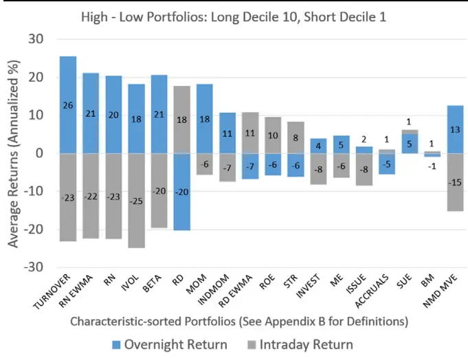
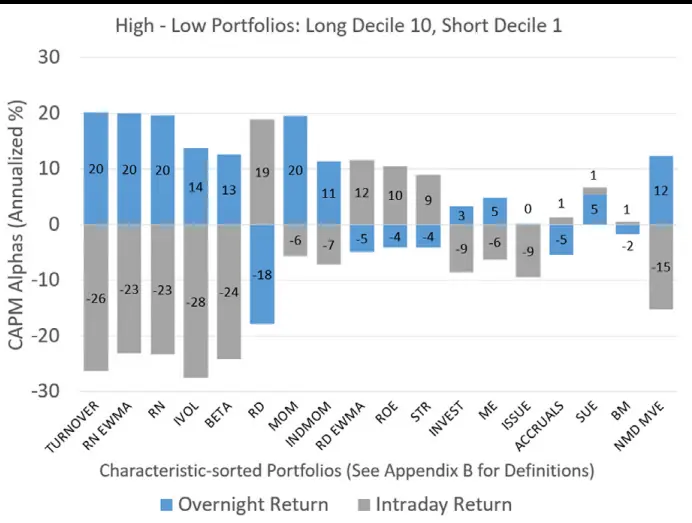
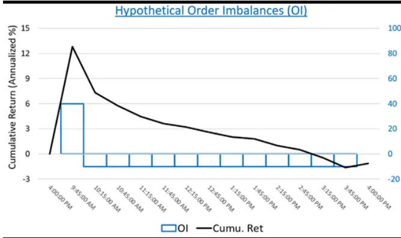
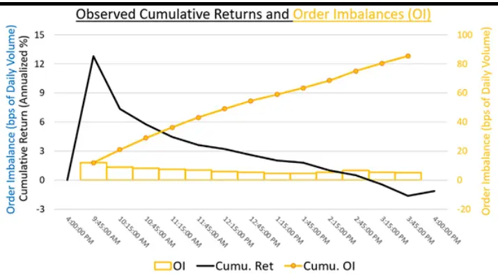
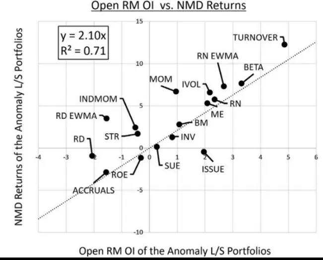
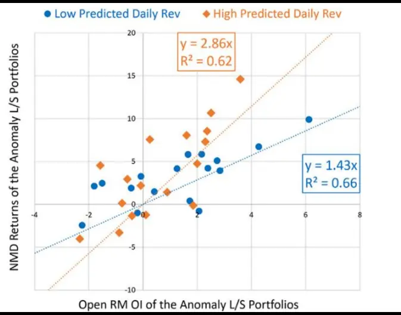

nInfo] [Table_Title] 2023.09.25

# 日夜收益差的形成机制

## ——学术纵横系列之五十二

张晗(分析师)

卢开庆(研究助理)

8 021-38676666

021-38038674

zhanghan027620@gtjas.com

lukaiqing026727@gtjas.com

证书编号 S0880522120005

S0880122080144

## 本报告导读：

本篇报告介绍一篇文章 Heterogeneous liquidity providers and night-minus-day returnpredictability，文章针对隔夜收益和日内收益的差异，将套利者分为敏捷套利者和迟缓套利者，认为隔夜和日内收益的差异来自于开盘时段敏捷套利者的交易行为和高额流动性补偿，从而为日夜收益差提供了交易层面的解释框架。该模型对日夜收益差在截面与时序上都有良好的解释能力。

## 摘要：

近期研究表明，一些个股或资产组合在日内和隔夜的收益符号相反。部分文章将这一现象归结为开盘时段和日内其他时段的订单不平衡，但是一般而言投资组合的风险暴露、风险溢价与市场信息都不太可能总是在日夜之间发生颠覆性的变化，因此需要在交易层面上寻找可能的影响因素和解释框架。

两类套利者的划分：文章将套利者分为敏捷套利者与迟缓套利者。其中，敏捷套利者（做市商）依靠信息优势和技术优势对新信息首先作出反应，并且由于持仓成本更高而需要更高的流动性补偿，从而驱动开盘时段相关股票价格大幅偏离有效区间。迟缓套利者（机构投资者）由于信息劣势和敏捷套利者造成的股价波动而无法参与开盘时段交易，而由于持仓成本更低可以主导日内剩余时段交易。

日夜收益差的形成机制：开盘时未被定价的私人信息产生了报价订单缺口，敏捷套利者将为其提供流动性并要求获取额外收益，价格因此出现偏离。而在开盘后的剩余时间里，随着私人信息被有效定价和撇脂风险下降，迟缓套利者也加入到流动性的供给当中，价格的偏离由此逐渐得以纠正，从而产生了方向相反的隔夜收益与日内收益。

模型对日夜收益差的解释能力：在截面上，敏捷套利者的平均流动性供给对平均日夜收益差的回归 R 方达到了 71%。在时序上，以敏捷套利者的流动性补偿作为解释变量，绝大部分的因子投资组合都不具有显著的 Alpha；对于 NMD-MVE 组合，其在 CAPM 框架下具有 25.7%的Alpha 而在流动性补偿的框架下只有 2.8%且统计不显著的 Alpha。

这类套利机制的出现往往意味着市场有效性较低，若文中所述敏捷套利者过多，开盘时段的过度反应可能进一步降低市场有效性。若开盘时的敏捷套利者行为使股价波动过大，则可能带来显著的日内反转。

风险提示：量化模型失效风险：本篇报告所述相关文章结论请参考文章原文，请注意相关结论在样本外存在失效的可能性。

金融工程

## 金融工程团队：

廖静池：(分析师)

电话：0755-23976176

邮箱：liaojingchi024655@gtjas.com

证书编号：S0880522090003

张晗：（分析师）

电话：021-38676666

邮箱：zhanghan027620@gtjas.com

证书编号：S0880522120005

卢开庆：（研究助理）

电话：021-38038674

邮箱：lukaiqing026727@gtjas.com

证书编号：S0880122080144

梁誉耀：（研究助理）

电话：021-38038665

邮箱：liangyuyao026735@gtjas.com

证书编号：S0880122070051

## [Table_Re相关报告

防御型股票的特征 2023.08.21

基于未来现金流构建新价值因子 2023.07.29

估值分化期的价值策略 2023.07.12

风险变化如何影响成交量 2023.07.08

股债相关性驱动因素研究 2022.12.16

## 1. 引言

近期研究表明，一些个股或资产组合在日内和隔夜的收益符号相反。部分文章将这一现象归结为开盘时段和日内其他时段的订单不平衡，但是一般而言投资组合的风险暴露、风险溢价与市场信息都不太可能总是在在日夜之间发生颠覆性的变化，因此需要在交易层面上寻找可能的影响因素和解释框架。

Heterogeneous liquidity providers and night-minus-day return predictability一文将套利投资者划分为敏捷套利者（如做市商）与迟缓套利者（如机构投资者），认为隔夜和日内收益的差异来自于开盘时段敏捷套利者的高额流动性补偿，而迟缓套利者由于信息劣势和开盘时段价格变化无法及时参与开盘时段交易，从而为隔夜和日间收益差异提供了交易层面的解释框架。

文献信息：Zhongjin Lu, Steven Malliaris and Zhongling Qin, Heterogeneous liquidity providers and night-minus-day return predictability, Journal of Financial Economics, Volume 148, Issue 3, March 2023, Pages 175-200.

## 2. 异质性套利者分析框架

## 2.1. 两类套利者

新信息进入市场后，套利者通过套利交易提供流动性获得相应补偿，推动股票价格向特定方向变化。文章将套利者分为敏捷套利者与迟缓套利者，两者在对新信息的反应机制上存在差异。

敏捷套利者依靠信息优势和技术优势对新信息首先作出反应（如做市商往往可以率先看到实时订单数据），从而主导开盘时段的交易。由于持仓成本更高敏捷套利者需要更高的流动性补偿，从而驱动开盘时段相关股票价格大幅偏离有效区间。文章对于持仓成本的解释是，敏捷套利者（做市商）的目标是以最少的持仓获得最高的收益，缓慢套利者（机构投资者）的目标是通过持仓获得风险溢价收益，因此持有股票对于敏捷套利者而言的成本更高。

迟缓套利者由于信息劣势和敏捷套利者造成的股价波动而无法及时参与交易，使得开盘时段的流动性实质上被敏捷投资者垄断。文章对此的解释是，迟缓套利者（机构投资者）出于风险和收益的考虑往往通过限价订单实现交易，在开盘时段股价大幅波动时不会参与交易。文章将这一股价变化称为“撇脂风险”，敏捷套利者在开盘时段的行为实际上会阻碍迟缓套利者参与交易。此外，由于迟缓套利者（机构投资者）的持仓成本相对较低，随着信息认知和流动性初步充裕股价也逐渐回归有效区间，从而迟缓套利者可以主导日间剩余时段的交易。

## 2.2. 日夜收益差形成机制

在每天接近开盘时，未被定价的私人信息驱动了报价订单缺口的产生，敏捷套利者将为其提供流动性并要求获取额外收益（以作为其流动性供给的补偿），价格因此出现偏离。此时迟缓套利者将受到撇脂风险的阻碍而无法入场，因此给予了敏捷套利者扭曲价格开展套利的机会。

但在开盘后的剩余时间里，随着私人信息被有效定价，撇脂风险下降，迟缓套利者也加入到流动性的供给当中，价格的偏离由此逐渐得以纠正，从而产生了方向相反的隔夜收益与日内收益。

在这一分析框架下，文章将日夜收益差的研究拓展为对敏捷套利者在开盘时流动性供给的可预测性与其要求获得的流动性补偿的研究。

## 3. 数据与变量构造

文章使用了来自 CRSP 数据的美股普通股数据（包括纽约交易所、纳斯达克交易所等）与纽约交易所的 TAQ 逐笔交易数据，样本时间自 1993年 4 月起。在进行数据处理时，首先丢弃了股票在日内收益超过 1000%的交易日数据；其次，为了缓解微观结构导致的问题并且确保其结果不受小市值或低流动性股票影响，文章要求股票在对应月份具有以下特征：股票的日交易量中位数要超过 1000 股，股票在一个月内的开盘价缺失值不多于一天，股价需要在 5 美元以上并且股票市值要达到纽交所的后20%分位数以上。

在文章中需要多次使用到的变量包括日内收益、隔夜收益、日夜收益差与报价订单缺口的代理变量，其构造方法分别如下：

日内收益: $\begin{array}{r}{r_{D,d}=\frac{P_{d}^{close}}{P_{d}^{open}}-1}\end{array}$

隔夜收益： $\begin{array}{r}{r_{N,d}=\frac{1+r_{close-to-close,d}}{1+r_{D,d}}-1}\end{array}$

日夜收益差： $r_{NMD,d}=r_{N,d}-r_{D,d}$

在计算上述指标时，开盘价定义为早盘 9:30 至 10:00 之间的交易量加权平均价格，收盘价则定义为 TAQ 数据的收盘交易价格，且剔除掉了股票分红等其它情况造成的影响。

对于流动性供给的代理变量，文章同时沿用了两篇文献中的构造方法。对于敏捷套利者的流动性供给，文章将其定义为通过Boehmer et al. (2012)算法计算得到的报价订单缺口 RMOI；对于总体的流动性供给，文章将其定义为通过 Lee and Ready (1991)算法计算得到的报价订单缺口 OI。

## 4. 对日夜收益差解释模型的实证检验

在文章的模型中，其将套利者划分为两种类型，其中敏捷套利者主要包括做市商等角色，迟缓套利者则包括机构投资者等角色。前者相对后者而言能够更快接触到市场信息（即具有信息优势），但劣势在于其交易成本较高，这使得其每次交易时都会要求较高的收益预期；后者相对前者而言对信息的处理更迟缓，但投资成本较低。基于这样的异质性套利者设计，当市场上存在未被定价的私人信息时，迟缓套利者由于其信息劣势而在短时间内无法识别可能存在的撇脂行为，故不会迅速入场交易，而敏捷套利者则能够即使入场，成为主要的流动性供给方，但由于其交易成本较高，其在交易时将试图更大程度提高价差，以覆盖交易支出；迟缓交易者虽然入场较晚，但由于其交易成本较低，交易时不必有意抬高价差，能够起到纠正价格偏离的效果。

基于上述模型假设与引言中提及的日夜收益差形成机制，文章通过建立理论模型，提出了以下三个推论并依次进行实证研究，以充分完整地对其提出的解释模型进行验证：

推论一：过往的理论认为，日夜收益差主要是由于报价订单冲击而产生的，具有代表性的说法包括：开盘时由情绪驱动的报价订单推动了价格的偏离；交易者可根据其交易习惯分为不同的类别，他们分别在开盘时与开盘后方向制造出了方向相反的报价订单缺口，从而驱使价格在两个阶段出现方向相反的偏离；套利者倾向于在开盘时购买高贝塔的股票并在收盘前卖出，从而产生了相反的隔夜收益与日内收益。针对上述说法，文章认为如果仅报价订单冲击就能够解释基于这些特定投资组合的日夜收益差，那么方向相反的隔夜收益与日内收益需要对应方向相反的报价订单缺口，否则过往的理论是不足以成立的。

推论二：根据文章提出的新解释，日夜收益差应当具有两个驱动因素，即敏捷套利者的可预测的流动性供给与其要求获得的流动性补偿水平。

推论三：根据文章提出的新解释，撇脂风险对迟缓套利者的入场阻碍效果是敏捷套利者获得套利机会的重要条件。因此，当敏捷套利者在开盘时提供流动性的垄断地位受到挑战，即撇脂风险对迟缓套利者入场的阻碍效果下降时，迟缓套利者也能够参与到开盘时的流动性供给，此时价格偏离水平与可预测的收益水平应当将会有所下降。

## 4.1. 以往理论检验：订单缺口不能解释日夜收益差

根据推论一，若过往的理论是正确的，那么方向相反的隔夜收益与日内收益需要对应方向相反的报价订单缺口。

对此，文章首先使用了源自Lou et al. (2019)的 17 个因子，并通过基于因子排序的方式，以市值加权的准则构造了 17 个多空投资组合并进行月度调仓。所图一与图二所示，这些投资组合（其中 NMD-MVE为基于日夜收益差的均值方差有效前沿组合，其可以由前文中提出的基于因子的投资组合进一步线性组合得到）在平均隔夜收益/平均隔夜 Alpha 与平均日内收益/平均日内 Alpha 的盈亏是相反的，且其收益绝对值都有着较大的规模。由此可以得出，这些特定投资组合的隔夜收益与日内收益是方向相反且规模稳定的。

图 1 特定投资组合的平均隔夜收益与日内收益

图 2 特定投资组合的平均隔夜 Alpha 与日内 Alpha
数据来源：Heterogeneous liquidity providers and night-minus-day return predictability，国泰君安证券研究

接下来，为了观察报价订单缺口是否如隔夜收益与日内收益那样具有相反的方向，文章将交易时间按照每 30 分钟为一个区间进行划分，给出了每个区间下 NMD-MVE投资组合的平均累计收益与报价订单缺口情况。

首先从直观角度来看。如图三所示，在理想情况下，当隔夜收益为正而日内收益为负时，其开盘区间内的订单报价缺口应与开盘后剩余交易时间内的订单报价缺口方向相反。然而，根据图四给出的真实情况，NMD-MVE 投资组合的隔夜收益与日内收益的方向是相反的，但报价订单缺口却在一天中保持着相同的方向，这与过往的报价订单冲击解释理论相悖。

图 3 理想中的累计收益与报价订单缺口区间图

图 4 实际中的累计收益与报价订单缺口区间图

数据来源：Heterogeneous liquidity providers and night-minus-day return predictability，国泰君安证券研究

随后从统计角度进行正式的检验。首先，如果基于特定因子排序构造出的多空组合的报价订单缺口是不具有可预测性的，那么这些投资组合的报价订单缺口应该在时序上有着均值为 0 的特征。表一中检验了 NMD-

MVE投资组合的报价订单缺口的时序均值的显著性，发现其平均 OI 为正且在 的置信水平下显著，即使将其划分为半小时区间，该结果在每个子区间上依然成立。除此之外，RMOI 与非 RMOI 在这些子区间上同样显著为正，其中 RMOI 约占 OI 的四分之一至三分之一之间。

表 1 NMD-MVE投资组合的订单报价缺口在子区间上的均值检验结果表

|  | 10:00 | 10:30 | 11:00 | 11:30 | 12:00 | 12:30 | 1:00 | 1:30 | 2:00 | 2:30 | 3:00 | 3:30 | 4:00 |
| --- | --- | --- | --- | --- | --- | --- | --- | --- | --- | --- | --- | --- | --- |
|  | AM | AM | AM | AM | AM | AM | PM | PM | PM | PM | PM | PM | PM |
| 0I | 4.88 | 3.68 | 3.24 | 3.07 | 2.81 | 2.85 | 2.22 | 2.52 | 2.30 | 2.34 | 2.73 | 2.73 | 2.21 |
|  | (8.78) | (10.96) | (10.83) | (11.09) | (11.08) | (12.93) | (10.25) | (12.31) | (11.18) | (10.85) | (11.24) | (9.84) | (4.44) |
| RMOI | 1.88 | 1.23 | 1.07 | 0.96 | 0.86 | 0.83 | 0.77 | 0.73 | 0.71 | 0.79 | 0.77 | 0.79 | 0.45 |
|  | (19.80) | (18.31) | (19.00) | (17.72) | (18.44) | (16.81) | (18.11) | (18.26) | (15.22) | (17.69) | (17.57) | (16.18) | (6.88) |
| Non-RMOI | 3.00 | 2.45 | 2.17 | 2.11 | 1.95 | 2.02 | 1.45 | 1.79 | 1.59 | 1.55 | 1.94 | 1.94 | 1.66 |
|  | (5.66) | (7.43) | (7.52) | (7.90) | (8.00) | (9.72) | (6.92) | (8.94) | (7.81) | (7.51) | (8.26) | (7.17) | (3.53) |

数据来源：Heterogeneous liquidity providers and night-minus-day return predictability，国泰君安证券研究

从统计角度确认了报价订单缺口的可预测性后，文章接下来检验了NMD-MVE 投资组合在开市时的第一个半小时子区间与剩余 12 个半小时子区间之间的报价订单缺口的自相关性，并利用经过 Newey-West 调整后的预测回归模型计算出其对应的 t 统计量。根据表二结果，对于这36 个自相关系数，有 29 个在 95%的置信水平上显著为正，即大部分情况下开盘内第一个子区间的报价订单缺口对剩余子区间的报价订单缺口有正向预测效果。

表 2 NMD-MVE投资组合的订单报价缺口在子区间上的均值检验结果表

|  | 10:00 | 10:30 | 11:00 | 11:30 | 12:00 | 12:30 | 1:00 | 1:30 | 2:00 | 2:30 | 3:00 | 3:30 | 4:00 |
| --- | --- | --- | --- | --- | --- | --- | --- | --- | --- | --- | --- | --- | --- |
|  | AM | AM | AM | AM | AM | AM | PM | PM | PM | PM | PM | PM | PM |
| 0I | 1 | 0.1 | 0.06 | 0.05 | 0.02 | 0.02 | 0.01 | 0.02 | 0.02 | 0.02 | 0.02 | 0.02 | 0.05 |
|  |  | (4.66) | (5.28) | -4.47 | -2.78 | -1.71 | -1.67 | -2.27 | -2.78 | -2.01 | -2.51 | -1.55 | -3.22 |
| RMOI | 1 | 0.24 | 0.16 | 0.12 | 0.1 | 0.1 | 0.08 | 0.06 | 0.06 | 0.06 | 0.06 | 0.08 | 0.05 |
|  |  | (14.23) | (11.73) | (9.13) | (8.35) | (8.66) | (6.97) | (6.15) | (4.38) | (5.08) | (4.87) | (5.54) | (2.43) |
| Non-RMOI | 1 | 0.1 | 0.06 | 0.05 | 0.02 | 0.02 | 0.01 | 0.02 | 0.02 | 0.02 | 0.02 | 0.02 | 0.04 |
|  |  | (4.75) | (5.03) | (4.4) | (2.56) | (1.56) | (1.53) | (2.21) | (3.06) | (1.89) | (2.49) | (1.49) | (2.95) |

数据来源：Heterogeneous liquidity providers and night-minus-day return predictability，国泰君安证券研究

根据以上研究，文章从直观角度与统计角度验证了 NMD-MVE投资组合的报价订单缺口在一天内会保持相同的方向，这推翻了过往的理论解释，因为开盘时正向的报价订单缺口对应着投资组合的正向隔夜收益，但开盘后仍是正向的报价订单缺口却对应着投资组合的负向日内收益。

对于这一现象，文章给出的解释为：虽然敏捷套利者会在开盘时会为了提供流动性而不断吸收买入订单，但其不会一直持续同向的操作，而会在开盘后不断的放出买入订单以平仓，因此同向的报价订单缺口会在一天内持续存在；在接近开盘时，敏捷套利者由于其垄断地位将价格抬升至合理水平之上（作为自己提供流动性的补偿），从而形成了正向隔夜收益，正式开盘后，虽然报价订单缺口持续存在，但随着迟缓套利者的不断入场，价格被逐渐纠正至合理水平，从而产生了负向日内收益。

## 4.2. 核心驱动因素检验：敏捷套利者的流动性供给及其补偿可以解释日夜收益差

根据推论二，可预测的日夜收益差是由两部分因素驱动的：敏捷套利者在开盘时的可预测的流动性供给与其要求获得的流动性补偿水平。

文章首先探讨第一个因素，即敏捷套利者在开盘时的可预测的流动性供给。为了定量分析其对于日夜收益差的影响机制，文章设计了一个两阶段回归（2SLS）：第一阶段，以开盘时半小时的 OpenRMOI 作为开盘时敏捷套利者的流动性供给的代理变量，以 Open RMOI 的前值作为解释变量，当期值为因变量，回归得到 OpenRMOI 的期望值；第二阶段，以Open RMOI 的期望值为解释变量，日夜收益差为自变量，由此，这个2SLS 回归系数就能够建立起滞后的 OpenRMOI 与日夜收益差的期望值之间的联系。其回归结果如表三所示，第(1)列中 Open RMOI 的系数为1.18，即当 OpenRMOI 的期望值提升 1 个单位时，期望日夜收益差将有1.18 的提升，故验证了敏捷套利者在开盘时的可预测的流动性供给是可预测的日夜收益差的驱动因素之一。

接下来探讨第二个因素，即敏捷套利者所要求获得的流动性补偿水平。文章沿用 Nagel (2012)的方法，以日频反转策略的收益（Daily Rev）作为敏捷套利者所要求的流动性补偿的度量，并使用了 Nagle (2012)论文中的预测模型计算出了流动性补偿的期望值DailŷRev。随后，文章将High DailŷRev作为虚拟变量（即超过样本中位数为 1，低于样本中位数为 0）并与 Open RMOI 的期望值相乘为交叉项，带入到前文中的 2SLS回归模型中，以检验期望日夜收益差与 Open RMOI 之间的关系是否会由于流动性补偿水平的变化而变化。其结果如表三的第(2)列所示，交叉项的系数为 0.64 且在 99%的置信水平上显著；在High DailŷRev的条件下，Open RMOI 的期望值提升 1 个单位时期望日夜收益差将升高 1.53，否则为 0.89。由此可得，当敏捷套利者要求获得的流动性补偿更高时，相同水平下的期望 Open RMOI 将伴随着更大规模的期望日夜收益差。最后，文章将DailŷRev替换为期望买卖价差Spread̂ 作为流动性补偿的代理变量，结论仍然成立，结果如表三第(3)列所示。

表 3 两阶段回归结果表

|  | (1) | (2) | (3) |
| --- | --- | --- | --- |
| Open RMOI | 1.18*** | 0.89*** | 0.74*** |
|  | (8.46) | (5.36) | (3.79) |
| Open RMOI * High Daily Rev |  | 0.64** |  |
|  |  | (2.23) |  |
| Open RMOI * High Spread |  |  | 0.85*** |
|  |  |  | (3.02) |
| Day Fixed Effects | Yes | Yes | Yes |
| N | 6,184,322 | 6,184,322 | 6,184,322 |

数据来源：Heterogeneous liquidity providers and night-minus-day return predictability，国泰君安证券研究

## 4.3. 模型关键假设检验：撇脂风险是敏捷套利者垄断开盘时段流动性供给的原因之一

根据推论三，撇脂风险使得敏捷套利者在流动性供给上具有垄断地位，从而拥有了抬高流动性价格进行套利的机会。因此，当撇脂风险对于迟缓套利者的影响减弱，即敏捷套利者的垄断地位受到挑战时，价格偏离程度将降低，由 引致的可预测日夜收益差将下降。

针对推论三，一个既定的事实是当未被定价的私人信息较少时，撇脂风险将有所下降，迟缓套利者将因此参与到开盘时的流动性供给当中。据此，文章以在美国与欧洲双重上市的股票为研究对象，设计了撇脂机制的实证检验。对于大部分股票，隔夜期间未被定价的私人信息将会导致开盘时的高度信息不对称，但由于欧洲股市的开盘时间更早，双重上市的股票往往在美股开盘前就已经得到活跃交易，私人信息将通过这些海外交易被正确定价，从而降低美股开盘时的信息不对称程度，使得撇脂风险有效下降。

为了检验这一机制是否成立，文章使用 Compustat Global识别了在欧洲与美国双重上市的股票（Europe DL），并另外识别出与这些双重上市股票市值接近且行业相同的仅美国本土上市的股票作为对照组（U.S.Control）。样本选取自 2006 年 10 月至 2010 年 12 月，其中平均包含了84 支双重上市的股票。此处同样以前文所述的两阶段回归作为研究方法，在计算 t 统计量时考虑了公司与日度层面的双重聚类标准误。结果如表四所示，第(1)列与第(2)列分别给出了双重上市组与本土对照组的回归系数，可以看出后者的回归系数显著为正，前者则并不显著，即在双重上市组内，期望 OpenRMOI 对期望日夜收益差没有显著影响。进一步地，文章将双重上市组与本土对照组合并为一组（Europe+U.S.），将是否双重上市作为虚拟变量（Dual-list），并另与 Open RMOI 项相乘为交叉项纳入回归中。其结果如表四第(3)列所示，可以看出其交叉项显著为负，其有力地支持了当海外交易减少了美股开盘时的未定价私人信息时，由RMOI 引致的可预测日夜收益差下降的推论。

与此同时，考虑到双重上市股票具有的其他某些性质可能会混淆结果，文章进一步使用在加拿大与美国双重上市的股票进行相同步骤的回归。由于加拿大股市与美国股市的开盘时间相同，故组内股票在美股开盘前并不会有活跃的海外交易，根据推论其。其结果如表四的第(4)-(6)列所示，可以看出美加双重上市的股票的回归系数仍然显著，且第(6)列中的交叉项并不显著，有力地说明了同时开盘的情况下（即私人信息未得到有效定价的情况下），期望 Open RMOI 与期望日夜收益差之间的关系并不受到影响。

表 4 双重上市股票两阶段回归结果表

|  | Europe DL (1) | U.S.Control (2) | Europe+U.S. (3) | Canada DL (4) | U.S.Control (5) | Canada+U.S. (6) |
| --- | --- | --- | --- | --- | --- | --- |
| Open RMOI | -0.02 | 0.09** | 0.09** | 0.04* | 0.10** | 0.09* |
| Open RMOI * Dual-list | (-1.12) | (2.22) | (2.26) -0.12*** | (1.70) | (2.23) | (1.95) |
|  |  |  |  |  |  | -0.35 |
|  |  |  | (-2.64) -0.70 |  |  | (-1.05) |
| Dual-list |  |  | (-0.49) |  |  | 3.93** (2.47) |
| Day Fixed Effects | Yes | Yes | Yes | Yes | Yes | Yes |
| N | 302,106 | 294,693 | 594,799 | 335,438 | 345,826 | 681,264 |

数据来源：Heterogeneous liquidity providers and night-minus-day return predictability，国泰君安证券研究

## 5. 模型对日夜收益差的解释能力分析

在对解释理论进行实证检验后，文章进一步探究了该理论对这些基于因子排序得到的投资组合的日夜收益差的解释能力。在图五中，文章绘制了这些投资组合的平均日夜收益差与平均 Open RMOI 的分布图。可以看出，投资组合的 Open RMOI 的方向与大小基本与其平均日夜收益差相匹配，两者呈正相关关系。当使用一个无截距项的线性模型对该截面进行拟合时，截面的 R 方达到了 71%，回归斜率为 2.1，其经济学含义可以理解为敏捷套利者在开盘时提供流动性的平均回报。随后，文章再次将High DailŷRev作为指示变量，将各个投资组合划分为高流动性补偿与低流动性补偿两种状态，并分别进行回归。结果如图六所示，高流动性补偿状态下的截面斜率达到了低流动性补偿状态下的截面斜率的两倍。

图 5 因子排序投资组合的截面回归图

图 6 投资组合在高/低流动性补偿下的截面回归图

数据来源：Heterogeneous liquidity providers and night-minus-day return predictability，国泰君安证券研究

在截面分析之外，文章还分析了流动性补偿与日夜收益差在时序上的联系。通过对这 17 个因子投资组合与 NMD-MVE 组合，均以DailŷRev作为解释变量，日夜收益差作为因变量，在时序上进行回归，并将回归的截距解释为 $\alpha^{Daily\ Rev}$ ，同时将日夜收益差以 CAPM 框架进行回归，得到 $\alpha^{CAPM}$ 用于对比分析。回归结果如表五所示， 个因子投资组合中有高达 14 个αDaily Rev在统计上不显著，其数量是不显著的αCAPM的两倍以上，这说明流动性补偿因子能够在绝大部分组合中都能够很好地解释日夜收益差。对于 NMD-MVE 组合，可以看出在其αCAPM达到 25.73%而$\alpha^{CAPM}$ 仅有 2.8%且在统计上并不显著，这进一步说明了流动性补偿的良好解释能力。

表 5 流动性补偿与日夜收益差的时序回归结果表

| Portfolio | $\alpha^{CAPM}$ | t-stat | $\alpha^{Daily\ Rev}$ | t-stat | $\beta^{Daily~Rev}$ | t-stat |
| --- | --- | --- | --- | --- | --- | --- |
| $r_{N}^{ewma}$ | 42.75 | (4.69) | 3.74 | (0.58) | 0.65 | (3.91) |
| $\mathbf{\Delta}_{r_{N}}$ | 39.11 | (3.65) | 6.92 | (1.05) | 0.57 | (3.28) |
| TURNOVER | 39.06 | (4.45) | 10.93 | (1.66) | 0.59 | (4.2) |
| IVOL | 34.43 | (2.9) | -8.58 | (-1.18) | 0.83 | (3.99) |
| rD | -30.89 | (-2.44) | 14.70 | (1.41) | -0.82 | (-3.29) |
| BETA | 28.11 | (3.31) | 9.49 | (1.20) | 0.46 | (3.18) |
| MOM | 24.84 | (4.16) | 14.94 | (1.33) | 0.12 | (0.52) |
| INDMON | 17.09 | (3.32) | 9.35 | (1.39) | 0.12 | (0.84) |
| rewma | -15.44 | (-1.66) | 9.92 | (1.43) | -0.46 | (-2.77) |
| ROE | -12.97 | (-1.90) | 4.78 | (0.78) | -0.35 | (-2.78) |
| ME | 11.32 | (3.18) | 26.19 | (5.73) | -0.27 | (-3.51) |
| INV | 10.17 | (2.17) | 0.90 | (0.19) | 0.17 | (2.64) |
| STR | -9.17 | (-1.07) | 18.44 | (2.12) | -0.51 | (-2.45) |
| ACCRUALS | -7.18 | (-2.14) | -8.17 | (-1.29) | 0.02 | (0.16) |
| ISSUE | 6.52 | (1.30) | -2.52 | (-0.48) | 0.18 | (1.85) |
| SUE | 3.75 | (1.19) | 5.72 | (1.27) | -0.06 | (-0.62) |
| BM | -0.25 | (-0.05) | 15.27 | (2.48) | -0.24 | (-1.79) |
| NMD MVE | 25.73 | -4.55 | 2.76 | (0.67) | 0.39 | (3.67) |

数据来源：Heterogeneous liquidity providers and night-minus-day return predictability，国泰君安证券研究

## 5.1. 日夜收益差和日度收益并非同源

根据上述分析，文章提出的模型无论从截面还是时序上都能够对日夜收益差进行充分地解释。接下来，作者进一步猜想，日夜收益差是否与收盘价收益率具有共通的性质？模型所给出的能够显著影响前者的两个驱动因素是否也会影响后者？

对于两类收益是否同源的问题，文章的研究方法如下：首先利用前文中提及的 17 个因子作为特征，输入到一个梯度增强决策树模型中对 OpenRMOI 做出拟合，其中训练集为 2010 年 1 月至 2020 年 12 月之间的数据；训练完成后，使用第 t-1 期的模型拟合出的 $0\mathrm{pen}\ \widehat{\mathrm{RMOI}}_{t-1}.$ 作为自变量，分别以第 t 期的真实 OpenRMOI、日夜收益差与收盘价收益作为作为因变量，使用 Fama-MecBeth 方法建立预测模型。回归结果如表六的第(1)-(3)列所示，可以看出由各个因子拟合出的 $0\mathrm{pen}\ \widehat{\mathrm{RMOI}}_{t-1}$ 能够正向预测下一期的日夜收益差与真实 Open RMOI，且在统计学上具有显著，相比之下，其对下一期的收盘价收益的回归系数为负且并不显著。由于上述回归的区间包含了决策树的训练区间，其可能具有一定样本内性质，为了保证结果的稳健性，文章进一步在 2010 年 1 月以前的样本外区间进行相同的操作，其结果如表六的第(4)-(6)列所示，结论与样本内区间相一致。由此可以得出，没有证据表明以因子为条件拟合出的Open̂RMOI具有预测收盘价收益的能力。

表 6 基于因子的OpenRMOI 拟合值对各因变量回归结果表

|  | Full S ample $\mathbf{NMD}_{i,t}$ (1) | Full S ample $\mathbf{RET}_{i,t}$ (2) | Full S ample Open RMOIi,t (3) | Out-of-S ample $\mathbf{NMD}_{i,t}$ (4) | Out-of-S ample $\mathbf{RET}_{i,t}$ (5) | Out-of-S ample $\mathbf{0pen\ RMOI}_{i,t}$ (6) |
| --- | --- | --- | --- | --- | --- | --- |
| Open RMOIi,t-1 | 5.83*** | -0.22 | 1.42*** | 8.48*** | -0.41 | 0.64*** |
| Constant | (5.90) 2.6 | (-0.46) 5.25*** | (9.90) 0.1 | (6.71) 4.26 | (-0.54) | (7.77) |
|  | (1.19) | (3.73) | (0.95) | (1.25) | 4.56** (2.17) | -0.10 |
|  | 602,124 | 602,124 | 294,171 | 373,387 | 373,387 | (-0.45) 65,467 |
| N Adjusted R² | 0.01 | 0.001 | 0.03 | 0.02 | 0.002 | 0.004 |

数据来源：Heterogeneous liquidity providers and night-minus-day return predictability，国泰君安证券研究

## 6. 原文文献结论

文章给出了一个基于异质性套利者的可预测日夜收益差的解释模型。在模型当中，两种不同类型的套利者在一个交易日的不同时间段分别决定了流动性供给的价格。在接近开市时，未被定价的私人信息量较大，敏捷套利者的信息优势使其能够不受撇脂风险的影响而直接参与到交易当中，成为流动性的主要供给方并扭曲价格以收取流动性补偿。随着开盘后私人信息被有效定价，迟缓套利者入场提供流动性供给，并逐渐将价格纠正至合理水平，从而形成了可预测的日夜收益差。

在对解释模型进行检验时，文章发现报价订单缺口在一天内倾向于持续存在且方向相同，因此过往以报价订单缺口作为日夜收益差的主要驱动原因的解释模型是存在一定问题的。随后，文章探究发现开盘时敏捷套利者的流动性供给量正向影响可预测的日夜收益差，且这种正向关系会随着其流动性补偿的提高而增强。接下来，文章以在欧洲美国双重上市的股票与加拿大美国双重上市的股票作为样本，验证了撇脂风险的存在对于日夜收益差形成的重要作用。

在对模型进行实证检验后，文章从截面与时序两个角度分别检验了模型对日夜收益差的解释能力。在截面上，敏捷套利者的平均流动性供给对平均日夜收益差的回归 R 方达到了 71%；在时序上，以敏捷套利者的流动性补偿作为解释变量，绝大部分的因子投资组合都不具有显著的Alpha，对于 NMD-MVE 组合，其在 CAPM 框架下具有 25.7%的 Alpha而在流动性补偿的框架下只有 2.8%且统计不显著的 Alpha。最后，文章对日夜收益差与收盘价收益是否同源进行了研究，发现基于 17 个因子拟合出的开盘流动性供给能够正向显著地预测下一期的期望日夜收益差，而无法显著预测下一期的收盘价收益。

## 7. 我们的思考

本文结合理论与实证两个角度，对日夜收益差的产生机制进行了详细研究。根据文章的理论，产生日夜收益差的根源在于信息不对称条件下的交易不对称，机构投资者对私人信息的迟缓反应给予了做市商或其它短线交易者扭曲价格开展套利的机会。因此，这类套利机制的出现往往意味着市场有效性较低，若开盘时的敏捷套利者将价格抬升幅度过大且盘中交易时迟缓套利者并没有完全将其纠正至合理水平，该反应过度的性质很有可能伴随未来较为明显的反转效应，基于该效应的反转因子可以作为我们进一步的研究内容。

除此之外，根据文章给出的解释，撇脂风险的存在是出现日夜收益差的必要前置条件，而撇脂风险的存在需要两个条件：一是股票或投资组合需要在开盘前积累有一定量未被定价的私人信息，二是其私人信息不会通过海外交易或其他方式被提前消化。在文章中，基于因子排序得到的因子组合（且没有在比本土更早开盘的其他市场上市）被认为是具有以上两个性质的，那么为何此类样本具有以上两个性质，是否还存在其他类型的个股或组合满足条件或者具有更强的日夜收益差可预测性也可以成为我们未来的研究方向。

## 本公司具有中国证监会核准的证券投资咨询业务资格

## 分析师声明

作者具有中国证券业协会授予的证券投资咨询执业资格或相当的专业胜任能力，保证报告所采用的数据均来自合规渠道，分析逻辑基于作者的职业理解，本报告清晰准确地反映了作者的研究观点，力求独立、客观和公正，结论不受任何第三方的授意或影响，特此声明。

## 免责声明

本报告仅供国泰君安证券股份有限公司（以下简称“本公司”）的客户使用。本公司不会因接收人收到本报告而视其为本公司的当然客户。本报告仅在相关法律许可的情况下发放，并仅为提供信息而发放，概不构成任何广告。

本报告的信息来源于已公开的资料，本公司对该等信息的准确性、完整性或可靠性不作任何保证。本报告所载的资料、意见及推测仅反映本公司于发布本报告当日的判断，本报告所指的证券或投资标的的价格、价值及投资收入可升可跌。过往表现不应作为日后的表现依据。在不同时期，本公司可发出与本报告所载资料、意见及推测不一致的报告。本公司不保证本报告所含信息保持在最新状态。同时，本公司对本报告所含信息可在不发出通知的情形下做出修改，投资者应当自行关注相应的更新或修改。

本报告中所指的投资及服务可能不适合个别客户，不构成客户私人咨询建议。在任何情况下，本报告中的信息或所表述的意见均不构成对任何人的投资建议。在任何情况下，本公司、本公司员工或者关联机构不承诺投资者一定获利，不与投资者分享投资收益，也不对任何人因使用本报告中的任何内容所引致的任何损失负任何责任。投资者务必注意，其据此做出的任何投资决策与本公司、本公司员工或者关联机构无关。

本公司利用信息隔离墙控制内部一个或多个领域、部门或关联机构之间的信息流动。因此，投资者应注意，在法律许可的情况下，本公司及其所属关联机构可能会持有报告中提到的公司所发行的证券或期权并进行证券或期权交易，也可能为这些公司提供或者争取提供投资银行、财务顾问或者金融产品等相关服务。在法律许可的情况下，本公司的员工可能担任本报告所提到的公司的董事。

市场有风险，投资需谨慎。投资者不应将本报告作为作出投资决策的唯一参考因素，亦不应认为本报告可以取代自己的判断。
在决定投资前，如有需要，投资者务必向专业人士咨询并谨慎决策。

本报告版权仅为本公司所有，未经书面许可，任何机构和个人不得以任何形式翻版、复制、发表或引用。如征得本公司同意进行引用、刊发的，需在允许的范围内使用，并注明出处为“国泰君安证券研究”，且不得对本报告进行任何有悖原意的引用、删节和修改。

若本公司以外的其他机构（以下简称“该机构”）发送本报告，则由该机构独自为此发送行为负责。通过此途径获得本报告的投资者应自行联系该机构以要求获悉更详细信息或进而交易本报告中提及的证券。本报告不构成本公司向该机构之客户提供的投资建议，本公司、本公司员工或者关联机构亦不为该机构之客户因使用本报告或报告所载内容引起的任何损失承担任何责任。

## 评级说明

## 1.投资建议的比较标准

投资评级分为股票评级和行业评级。以报告发布后的 12 个月内的市场表现为比较标准，报告发布日后的 12 个月内的公司股价（或行业指数）的涨跌幅相对同期的沪深 300 指数涨跌幅为基准。

## 2.投资建议的评级标准

报告发布日后的 12 个月内的公司股价（或行业指数）的涨跌幅相对同期的沪深300 指数的涨跌幅。

| 评级 |  | 说明 |
| --- | --- | --- |
| 股票投资评级 | 增持 | 相对沪深 300指数涨幅 15%以上 |
|  | 谨慎增持 | 相对沪深300指数涨幅介于5%～15%之间 |
|  | 中性 | 相对沪深300指数涨幅介于-5%～5% |
|  | 减持 | 相对沪深300 指数下跌5%以上 |
| 行业投资评级 | 增持 | 明显强于沪深 300 指数 |
|  | 中性 | 基本与沪深 300 指数持平 |
|  | 减持 | 明显弱于沪深300指数 |

## 国泰君安证券研究所

|  | 上海 | 深圳 | 北京 |
| --- | --- | --- | --- |
| 地址 | 上海市静安区新闸路 669 号博华广 场20层 | 深圳市福田区益田路6003号荣超商 务中心 B 栋 27 层 | 北京市西城区金融大街甲9号金融 街中心南楼18层 |
| 邮编 | 200041 | 518026 | 100032 |
| 电话 | （021）38676666 | （0755）23976888 | （010）83939888 |
|  | E-mail: gtjaresearch@gtjas.com |  |  |