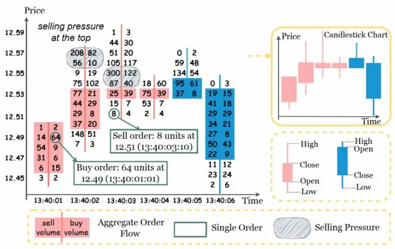
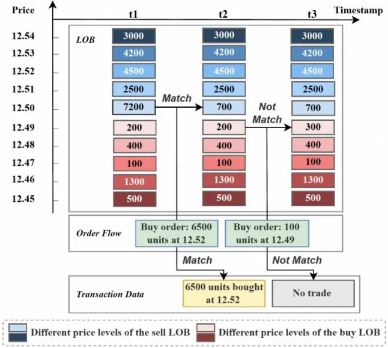
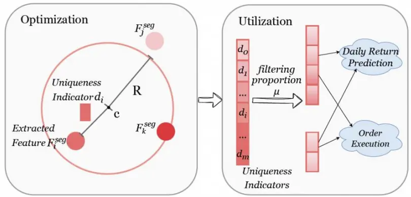
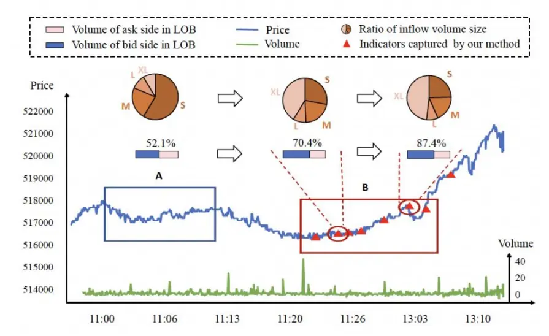
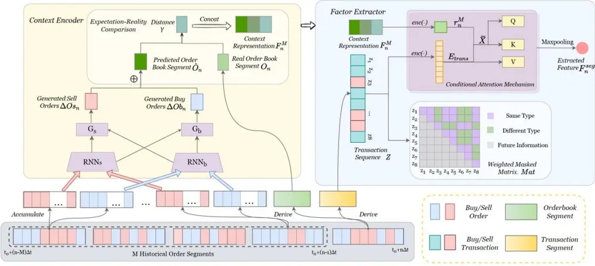

inInfo] [Table_Title] 2024.05.26

# 订单流数据特征挖掘的机器学习方法

## ——学术纵横系列之五十四

张晗(分析师)

卢开庆(研究助理)

8 021-38676666

021-38038674

zhanghan027620@gtjas.com

lukaiqing026727@gtjas.com

证书编号 S0880522120005

S0880122080144

## 本报告导读：

本 篇 报 告 介 绍 了 论 文 Microstructure-Empowered Stock Factor Extraction andUtilization 中的主要观点，文章利用上下文编码器和信息因子提取器为订单流数据建模，在大规模数据中提取异常值作为特征因子，相对于基准模型在 IC上提升 81%。

## 摘要：

le_Summary]订单流数据是交易系统中逐笔订单的时间序列，包括订单时间、类型、价格、数量等信息。此前的研究主要通过提取相当短期的微观结构，来预测瞬时股价走向或订单簿重建。然而，在数据量极大的股票数据或颗粒度较粗的下游任务（如日级回报预测）中，提取和利用都变得复杂。本论文创建了全新的微观结构，压缩数据规模、调整预测范围。

上下文编码器：文章通过比较实际订单簿和预测订单簿，评估市场状态，并为提取异常值提供素材。论文利用循环神经网络模型，以历史片段的订单流数据，进行对第 n 段买入/卖出的预估；再以预估和实际的订单簿几何距离构建期望-现实差距因子。

信息因子提取器：旨在压缩交易数据中的信息，同时考虑当前的市场状态。具体方法为：提取上下文编码器生成的信息，使用注意力模型初步提取异常值；再用Ruff（2018）提出的DeepSVDD 无监督学习进一步提取最具特色的信号，并根据下游任务的颗粒度调整训练目标系数，最终提取适应下游任务的异常值。

实证检验：文章使用长达一年的跨不同场景的订单流数据进行模型检验。在每日收益预测和订单执行下游任务中，相比于 LSTM+OPD 模型（Fanget.al,2021）和高频因子（McGroarty，2019），本文提出的模型IC比基准方法高出81%。

风险提示：量化模型失效风险：本篇报告所述文章的结论是基于量化模型和历史数据的得到的，请注意样本外存在失效可能性，详细结论请参考文献原文。

## 金融工程团队：

张晗：（分析师）

电话：021-38676666

邮箱：zhanghan027620@gtjas.com

证书编号：S0880522120005

卢开庆：（研究助理）

电话：021-38038674

邮箱：lukaiqing026727@gtjas.com

证书编号：S0880122080144

## 梁誉耀：（研究助理）

电话：021-38038665

邮箱：liangyuyao026735@gtjas.com

证书编号：S0880122070051

## [Table_R相关报告

如何构建更有效的股票间动量 2023.11.17

日夜收益差的形成机制 2023.09.27

防御型股票的特征 2023.08.21

基于未来现金流构建新价值因子 2023.07.29

估值分化期的价值策略 2023.07.12

## 1. 引言

订单流数据是市场微观结构分析中最详细和最原始的数据，包括订单类型、价格、数量和订单时间等信息，如图1所示。图中红色表示收盘价大于开盘价，蓝色反之；左侧表示卖单，右侧表示买单。一组订单流数据可表示为多个时间切片的价格，以及与价格对应的买卖单数量。

通过记录实时交易记录，订单流数据能捕捉微妙的市场变化。在以往的研究中，研究者主要通过提取相当短期的微观结构，来预测瞬时股价走向或订单簿重建。然而，在数据量极大的股票数据或颗粒度较粗的下游任务（如日级回报预测）中，提取和利用都变得复杂。Microstructure-Empowered Stock Factor Extraction and Utilization 一文创建上下文编码器和信息因子提取器，为订单流数据的选择性提取和粗颗粒度的下游利用提供可能，并通过海量真实数据检验了该模型的优越性。

图 1：订单流数据图表版

数据来源：Microstructure-Empowered Stock Factor Extraction and Utilization

## 文献信息：

Jiao, X., Li, Z., Xu, C., Liu, Y., Liu, W., & Bian, J. (2023). Microstructure-Empowered Stock Factor Extraction and Utilization. In Proceedings of the 32nd ACM International Conference on Information and Knowledge Management (CIKM), Birmingham, UK. Association for Computing Machinery. https://doi.org/10.48550/arXiv.2308.08135

## 2. 订单流数据处理

本文所述文章保持了 Gould (2013)、Shi (2021) 等人对订单流数据的统计学定义，即：

$$
\mathsf{x}=(\mathsf{p}_{\mathsf{x}},\mathsf{w}_{\mathsf{x}},\mathsf{t}_{\mathsf{x}})
$$

p 表示价位，w 表示订单规模，t 表示时间。规模 w>0(w<0)表示承诺以不低于（不高于）p 的价格出售（购买）最多|w|个资产单位。基于此，文章通过订单流数据生成交易数据和限价单簿数据（LOB），如图 2 所示。图2 分为由上至下三部分：第一部分为LOB 数据，为累计供需；第二部分是原始订单流数据，具体为时间切片上的价格和买卖单数量；第三部分两部分为交易数据，为订单流的成功交易。第一、三部分由二生成。具体而言：

交易数据:是市场中完成的交易记录，有订单不一定可交易，只有买卖匹配项可被记录。计算方法如下：在时间 $t_{x}$ 处，一个匹配记录可定义为$\mathbf{z}=(\mathsf{p}_{\mathsf{z}},\mathsf{w}_{\mathsf{z}},\mathsf{t}_{\mathsf{z}})$ ，而其匹配记录的时间序列即为交易数据。

限价单簿：是资产在特定时间的供需快照，为累计供需。文章用 $O_{t}=$ $\{Ob_{t},Os_{t}\}$ 表示在时间 t的买卖累计订单簿，对于簿中的不同价格及其对应数量、新订单加入后 LOB 的变化，文章表示如下：

$$
\begin{aligned}\mathbb{E}\mathbb{E}_{\sharp}=&\{(\mathbb{E}\mathbb{E}_{\sharp}^{0},\mathbb{E}\mathbb{E}_{\sharp}^{0}),(\mathbb{E}\mathbb{E}_{\sharp}^{1},\mathbb{E}\mathbb{E}_{\sharp}^{1}),\ldots,(\mathbb{E}\mathbb{E}_{\sharp}^{\sharp},\mathbb{E}\mathbb{E}_{\sharp}^{\sharp})\}\\\mathbb{E}\mathbb{E}_{\sharp}=&\{(\mathbb{E}\mathbb{E}_{\sharp}^{0},\mathbb{E}\mathbb{E}_{\sharp}^{0}),(\mathbb{E}\mathbb{E}_{\sharp}^{1},\mathbb{E}\mathbb{E}_{\sharp}^{1}),\ldots,(\mathbb{E}\mathbb{E}_{\sharp}^{\sharp},\mathbb{E}\mathbb{E}_{\sharp}^{\sharp})\}\\&\mathsf{O}_{\mathsf{t}+1}=\mathsf{O}_{\mathsf{t}}\otimes\mathsf{x}_{\mathsf{t}+1}\end{aligned}
$$

若新订单不是匹配项，订单数据被加入累计限价单簿，如：

$$
\begin{aligned}&\left|\Xi_{x_{\mathsf{t}+1}}<O\right.\quad\left.;\quad\Xi_{x_{\mathsf{t}+1}}<\Xi_{\sharp}^{\sharp}\right|\\&\\&\left|\Xi_{\sharp\sharp+\underline{1}}=\Xi_{\sharp\sharp}\right|+\left|\Xi_{\sharp\sharp+\underline{1}}\right|\\\end{aligned}
$$

若新订单是匹配匹配项，限价订单将对应更新，如：

$$
\begin{array}{rl}{\sharp_{\mathtt{x}_{\mathtt{t}+1}}<\overline{{O}}}&{{}\quad;\quad\sharp_{\mathtt{x}_{\mathtt{t}+1}}\geq\sharp_{\sharp}^{O}}\end{array}
$$

$$
\mathbb{E}_{\mathbb{E}_{\mathbb{B}+\mathbb{I}}^{\mathbb{B}}}=\mathbb{E}\mathbb{E}\left(\mathbb{E}_{\mathbb{E}_{\mathbb{B}}^{\mathbb{B}}}-\mathbf{\nabla}\left(|\mathbb{E}_{\mathbb{E}_{\mathbb{B}+\mathbb{I}}}|-{\sum}_{\mathbb{E}=0}^{\mathbb{B}-\mathbb{I}}\mathbb{E}_{\mathbb{E}_{\mathbb{B}}^{\mathbb{B}}}^{\mathbb{B}}\right),\boldsymbol{O}\right)
$$

同时，生成相应的交易记录：

$$
\mathbb{B}_{\Xi}=\left(et{}{^{\Xi-1}}\sum\mathbb{B}_{\Xi_{\Xi}^{\Xi}}\mathbb{B}_{\Xi_{\Xi}^{\Xi}}+\mathbb{B}_{\Xi_{\Xi}^{\Xi}}\left(\mathbb{B}_{\Xi_{\Xi}^{\Xi}}-\left(\left|\mathbb{B}_{\Xi_{\Xi+1}^{\Xi}}\right|-et{}{^{\Xi-1}}\sum\mathbb{B}_{\Xi_{\Xi}^{\Xi}}\right)\right)\right)/|\mathbb{B}_{\Xi}|
$$

图 2：订单流数据生成限价单和交易数据过程

数据来源：Microstructure-Empowered Stock Factor Extraction and Utilization

## 3. 因子提取模型建构

## 3.1. 上下文编码器

本节旨在通过比较实际订单簿和预测订单簿，评估市场状态，并为提取异常值提供素材。文章将一天的订单信息划分为N个片段，第n段的上文信息为具有相关性的前M段。然后根据顺序神经模型（RNN/LSTM），利用前 M 段分别对第 n 段的买/卖订单进行预测。再与实际第 n 段的订单信息进行比较，如果预测订单和实际订单相似，则说明第 n段信息不太重要。具体如下：

首先分割时间段，表示 n 段订单，并用神经模型对历史 M 段的买/卖单进行编码：

$$
\begin{aligned}\left[\mathbb{I}_{0}+(\mathbb{I}-\mathbb{I})\Delta\mathbb{I},\mathbb{I}_{0}+\mathbb{I}\Delta\mathbb{I},\right]\\\mathbb{I}_{\mathbb{I},\mathbb{I}}=\mathbb{I}\mathbb{I}\mathbb{I}_{\mathbb{I}}\Big(\mathbb{I}_{\mathbb{I},\mathbb{I}-\mathbb{I}},\Delta\mathbb{I}\mathbb{I}_{\mathbb{I}}\Big)\\\mathbb{I}_{\mathbb{I},\mathbb{I}}=\mathbb{I}\mathbb{I}\mathbb{I}_{\mathbb{I}}\Big(\mathbb{I}_{\mathbb{I},\mathbb{I}-\mathbb{I}},\Delta\mathbb{I}\mathbb{I}_{\mathbb{I}}\Big)\end{aligned}
$$

然后进行买卖单预测（⨁表合并,∇表预测）

$$
\begin{aligned}&\begin{aligned}\\&\Delta\mathsf{O}\mathsf{b}_{\mathsf{n}}=\mathsf{G}_{\mathsf{b}}\big(\mathsf{h}_{\mathsf{b},\mathsf{n}},\mathsf{h}_{\mathsf{s},\mathsf{n}}\big)\\&\quad\Delta\mathsf{O}\mathsf{s}_{\mathsf{n}}=\mathsf{G}_{\mathsf{s}}\big(\mathsf{h}_{\mathsf{s},\mathsf{n}},\mathsf{h}_{\mathsf{b},\mathsf{n}}\big)\\&\end{aligned}\\&\\&\nabla\mathsf{O}_{\mathsf{n}}=\mathsf{\Delta O}_{\mathsf{n}-1}\oplus\Delta\mathsf{O}\mathsf{b}_{\mathsf{n}}\oplus\Delta\mathsf{O}\mathsf{s}_{\mathsf{n}}\\\end{aligned}
$$

最后使用欧几里得距离将预期现实进行比较，并确认生成器训练目标：使预期现实距离最小。

$$
\mathsf{y}(\mathsf{O}_{\mathsf{n}},\nabla\mathsf{O}_{\mathsf{n}})={\sum}_{\mathsf{k}=1}^{\mathsf{K}}||\mathsf{\nabla}\mathsf{v}_{\mathsf{n}}^{\mathsf{k}}-\nabla\mathsf{v}_{\mathsf{n}}^{\mathsf{k}}||_{2}
$$

$$
\mathbb{E}_{\mathbb{Z}\mathbb{Z}}=1/\mathbb{E}\sum_{\mathbb{B}=1}^{\mathbb{B}}||\mathbb{V}(\mathsf{O}_{\mathsf{n}},\nabla\mathsf{O}_{\mathsf{n}})||_{2}.
$$

最终上下文编码表示为：

$$
\mathbb{E}_{\perp}^{\perp}=\mathbb{E}\mathbb{E}\mathbb{E}\mathbb{E}\mathbb{E}\Big(\mathbb{E}_{\perp},\mathbb{E}\mathbb{E}_{\perp},\mathsf{y}\big(\mathsf{O}_{\mathsf{n}},\nabla\mathsf{O}_{\mathsf{n}}\big)\Big)
$$

## 3.2. 信息因子提取器

本节旨在识别第n段中最关键的信息，结合上下文编码器获得的结果提取相关特征，并根据下游任务的颗粒度调整训练目标函数的系数。在对交易数据编码简化后，作者改进了传统机器学习的注意力机制模型进行初步提取，并用Ruff等(2018)DeepSVDD模型再次识别。值得注意的是，文章提出加权掩饰码矩阵，避免信息泄露。

具体步骤如下：

先引入交易数据和上下文编码器数据，并进行矩阵转换：

$$
\begin{aligned}&E_{trans}=enc(Z)\in\mathbb{R}^{L\times d_e}\\&\quad\mathbb{E}_{\mathbb{B}}^{\mathbb{B}}=\mathbb{E}\mathbb{B}\big(\mathbb{E}_{\mathbb{B}}^{\mathbb{B}}\big)\\&\quad\mathbb{X}~=~Concat\left(E_{trans},\big(\mathbf{1}_{d_e}\big)^Tr_n^M\right)\\\end{aligned}
$$

然后构建注意力模型。Q、K、V 分别代表序列、关键点、关键值，W是相应的权重矩阵：

$$
\mathbb{E}_{\perp}=\mathbb{I}\mathbb{E}_{\perp}^{\perp},\quad\mathbb{E}_{\perp}=\mathbb{I}\mathbb{E}_{\perp}^{\perp},\mathbb{E}_{\perp}=\mathbb{E}_{\perp\perp\perp\perp\perp}\mathbb{E}_{\perp}^{\perp}
$$

在其中构建加权掩饰码，实际为变换矩阵：

$$
\begin{array}{r}{\mathsf{Mat}_{\mathrm{i,j}}=\left\{\begin{array}{ll}{\qquad}&{\begin{array}{rl}{O,}&{\mathbb{E}_{\mathtt{D}_{\mathtt{D}}}\leq\mathbb{E}_{\mathtt{D}_{\mathtt{D}}}}\\&{\qquad}\end{array}}\\&{\begin{array}{rl}&{\mathbb{E}_{\mathtt{D}}=\mathbb{E}_{\mathtt{D}}}\\&{\qquad}\end{array}}\\&{\begin{array}{rl}{\mathbb{I}-\mathbb{E}_{\mathtt{D}}}&{\mathbb{E}_{\mathtt{D}_{\mathtt{D}}}>\mathbb{E}_{\mathtt{D}_{\mathtt{D}}}}\end{array}}\end{array}\begin{array}{ll}{\mathbb{E}_{\mathtt{D}_{\mathtt{D}}}\mathbb{E}_{\mathtt{D}}}&{\mathbb{E}_{\mathtt{D}_{\mathtt{D}}}\mathbb{E}_{\mathtt{D}_{\mathtt{D}}}>O}\\{\mathbb{E}_{\mathtt{D}}\mathbb{E}_{\mathtt{D}}\mathbb{E}_{\mathtt{D}}>O}\\&{\qquad}\end{array}\right.}\end{array}
$$

分别提取矩阵 i 维度中最关键的结点并生成序列，作为第 n 段的提取结果:

$$
\mathsf{h_{i}}=\mathsf{maxpool}(\mathsf{a_{i}V_{i}})
$$

$$
F_{n}^{seg}=Concat(h_{1},\ldots,h_{H})W^{H}
$$

下一步进行DeepSVDD 识别。这是识别数据最有效的无监督学习方法之一，于图3展示。具体来说，我们训练一个神经网络作为核，将输入空间映射到一个高维超球体。这个超球体由半径R>0和中心c定义，使其能够有效地区分正常数据和异常值。对每一个时间段，结合上下文表示$F_{M}^{i}$ 及其对应的第i个交易顺序序列 $Z_{i}$ ，特征 $\cdot F_{i}^{seg}$ 可概括为，其中θ为参数。

$$
F_{i}^{seg}=f\big(Z_{i}\backslash F_{i}^{M};\theta\big)
$$

其中，无监督学习的训练目标确定是非常重要的一步。首先，需要在最小化超球体的体积的同时，对球体外部的点予以惩罚。文章中 c由随机初始化决定，添加 $\imath R^{2}.$ 在目标函数以最小化体积，用| $||\mathrm{F}_{\mathrm{i}}^{\mathrm{seg}}-\mathrm{c}||^{2}-\mathrm{R}^{2}$ 计算惩罚。其次，当应用于各种下游任务时，我们需要利用参数来控制重要信号的过滤比例。文章中将参数 $\mu\in(0,1]$ 用来控制超球体大小和边界违规之间的权衡，起到过滤比例调整作用。最后，文章加入权重衰减正则化器，超参数λ>0。

$$
\min\left(\mathbb{R}^2+\frac{1}{\mu\mathbb{N}}\sum_{i=1}^{\mathbb{N}}\max\{0,||\mathbf{F}_i^{\mathrm{seg}}-\mathbf{c}||^2-\mathbb{R}^2\}\right.\left.+\frac{\lambda}{2}||\boldsymbol{\Theta}||_2\right)
$$

图 3：DeepSVDD 提取异常值过程

数据来源：Microstructure-Empowered Stock Factor Extraction and Utilization

## 4. 实证检验

文章在本节中利用收集的订单流数据，进行两个下游任务的实现：每日收益预测和订单执行（以分钟频率）。首先训练微观结构赋能的股票因子提取器，再将训练完成上游模型应用于下游任务。

## 4.1. 数据集

烛形图（日频率）：上证 300指数中最活跃的10 只股票。数据集范围从2020 年 1 月 2 日到 2020 年 12 月 31 日，按照 7/1/4 的比例拆分数据集。利用6个日线特征（即最高价、开盘价、最低价、收盘价、成交量加权平均价和成交量）。

## 订单流数据（10：股票及时间如上述，并分别拆分约毫秒） 456/67/264

万个片段。使用价格、规模和时间作为订单流特征。所有特征都通过 Z分数方法进行归一化，以训练上下游模型。

## 4.2. 下游任务

每日收益预测。使用信息因子提取器所生成数据作为微观补充信息，与LSTM基线蜡烛图生成的每日因子连接，以进行预测。

$$
\mathsf{y}=\mathsf{p}_{\mathsf{T}+2}/\mathsf{p}_{\mathsf{T}+1}-1
$$

订单执行任务。计算在预定时间内卖出一单位股票并获得最大利润。使用订单流因子来提取分钟频率因子，并作为OPD教师模型的附加输入，指导OPD教师及学生模型。

## 4.3. 比较评估

本节分了三组有竞争力的基准模型来实行下游任务，包括：

基础模型：利用原始 LSTM 日频信息，OPD 强化学习方法（Fanget.al,2021）

特征提取模型：利用在股票单日交易中的随机样本和均匀样本，高频LOB 特征（McGroarty，2019），基于价格、成交量的单日交易因子，时间敏感型订单失衡因子。

文章提出的微观模型。对于上下文编码器，设置 M=100。 $RNN_{s}$ 和 $\cdot RNN_{b}$ 被实现为LSTM模型，隐藏层大小为 64。 $G_{b}$ 和 ${\cdot}G_{s}$ 被实现为隐藏层大小为64 的 $MLP。$ 对于因子提取器，使用一个隐藏大小为16 的1 层条件注意

力机制。注意力头的数量设置为 4。对于优化目标，设置 $.\mu$ 为 0.02 以表

示异常数据比率，并将λ设置为 0.1以表示 $L_{2}$ 的正则化系数。时间步长Δt设置为4s，学习率设置为 $1\times10^{-3}$ ，并使用Adam优化器。所有计算均在 NvidiaA100GPU 上执行。

## 4.3.1. 评估方法

对于每日收益预测：使用前 2%的交易/订单序列作为代表性的日内微观补充信息，并从这些序列中选择相关因素（即价格、成交量、时间、因素）。然后，这些序列由 MLP 层处理以生成每日微观挖掘频率表示。最后用信息系数（IC，也称为皮尔逊相关系数）、秩信息系数（秩 IC，也称为斯皮尔曼相关系数）和秩信息比率（秩IR）来评估每日收益预测的准确性。特别是，秩IR是预测一致性和稳健性的度量。

对于订单执行任务：我们以分钟频率提取订单流因素的平均值、中位数、最大值、最小值、方差和范围作为OPD教师模型的补充特征，然后指导OPD学生模型的训练。

## 4.3.2. 评估结果

日收益预测结果如表 1所示。发现文章提出的模型，在所有评估指标中始终取得最佳结果。具体而言，文章提出的模型在 IC 中比表现最佳的基准方法高出 81%，在 RankIC 中高出 91%，在 RankIR 中高出 69%。

订单执行结果如表 2 所示。与原始 OPD 模型相比，将 Group2 中所有基于规则的方法合并以提取日内特征并将其集成到 OPD 中，可以提高模型性能。文章提出的基于机器学习的方法在PA中表现出38.64%的提升，在GLR中表现出3%的提升。

表 1：每日收益预测结果

| Method | Daily Return Prediction |  |  |
| --- | --- | --- | --- |
|  | IC↑ | Rank IC↑ | Rank IR↑ |
| Random Sample | 0.0118 | 0.0189 | 0.0534 |
| Uniform Sample | 0.0212 | 0.0229 | 0.0684 |
| Price-Based Transaction Factor | 0.0292 | 0.0237 | 0.0730 |
| Volume-Based Transaction Factor | 0.0358 | 0.0322 | 0.0983 |
| Order Imbalance | 0.0350 | 0.0285 | 0.0871 |
| High-Freq LOB Feature | 0.0452 | 0.0412 | 0.1287 |
| Time-Sensitive Order Imbalance | 0.0364 | 0.0321 | 0.0984 |
| Our Method (w/o CE,CAM) | 0.0561 | 0.0644 | 0.2050 |
| Our Method (w/o CE) | 0.0529 | 0.0632 | 0.1992 |
| Our Method (w/o Mat) | 0.0582 | 0.0670 | 0.1908 |
| Our Method | 0.0817 | 0.0787 | 0.2179 |

数据来源：Microstructure-Empowered Stock Factor Extraction and Utilization

表2：订单执行结果

| Method | Stock |  |
| --- | --- | --- |
|  | PA | GLR |
| OPD | 0.58 | 0.94 |
| High-Freq LOB Feature Price-Based Transaction Factor | 1.62 | 0.96 |
| Volume-Based Transaction Factor | 1.18 | 0.94 |
|  | 1.03 | 1.00 |
| Time-Sensitive Order Imbalance | 2.20 | 1.00 |
| Order Imbalance | 1.46 | 0.97 |
| Our Method (w/o CE, CAM) | 2.23 | 1.03 |
| Our Method (w/o CE) | 2.45 | 1.03 |
| Our Method (w/o Mat) | 2.73 | 1.01 |
| Our Method | 3.05 | 1.03 |

数据来源：Microstructure-Empowered Stock Factor Extraction and Utilization

## 5. 案例研究

本文所述文章随机抽取了一个交易日，并可视化了微观因子挖掘对异常值的提醒。在图 4 中，“LOB 中的买盘量”是指订单簿前 5 个级别的买单量。“流入量大小比”是指大单和小单的比例。该方法在区间B（11:18-13:03）中识别出独特指标（即红色三角形）的集中积累。

可以看出，B 区间与趋势的转折点对齐，这表明了该方法通过唯一性指标捕获股票趋势信息是有效的。

从股票交易的更深层次来看，通过将区间B中的订单流数据与波动区间A（11:00-11:10）进行比较，我们观察到区间 B 中的订单严重失衡。例如，在点 i（11:19:28）处，我们观察到大量流入量大小的比例从 38.4%猛增至 54.5%，表明机构对市场进行干预，主力开始推动价格上涨。在点j（11:25:36）处，买方已经建立了主导地位，这可以通过竞价量比例增加33.0%（从 54.2%增加到87.2%）得到证明，随后股价持续上涨。

图 4：利用微观因子挖掘方法，对股价转折预测的实证研究

数据来源：Microstructure-Empowered Stock Factor Extraction and Utilization

## 6. 过程总览

对微观结构股票因子的提取方法加以概括，可整合为图 5。其中，上下文编码器（左）从历史订单段中生成和真实的订单簿段中掌握上下文信息，进一步帮助提取订单流段特征。因子提取器（右）利用内容表示和交易序列来捕获卖盘和买盘力量，从订单流段中提取显著特征。

图 5: 微观结构股票因子的提取与利用方法总览

数据来源：Microstructure-Empowered Stock Factor Extraction and Utilization

## 7. 风险提示

量化模型失效风险：本篇报告所述文章的结论是基于量化模型和历史数据的得到的，请注意样本外存在失效可能性，详细结论请参考文献原文。

## 本公司具有中国证监会核准的证券投资咨询业务资格

## 分析师声明

作者具有中国证券业协会授予的证券投资咨询执业资格或相当的专业胜任能力，保证报告所采用的数据均来自合规渠道，分析逻辑基于作者的职业理解，本报告清晰准确地反映了作者的研究观点，力求独立、客观和公正，结论不受任何第三方的授意或影响，特此声明。

## 免责声明

本报告仅供国泰君安证券股份有限公司（以下简称“本公司”）的客户使用。本公司不会因接收人收到本报告而视其为本公司的当然客户。本报告仅在相关法律许可的情况下发放，并仅为提供信息而发放，概不构成任何广告。

本报告的信息来源于已公开的资料，本公司对该等信息的准确性、完整性或可靠性不作任何保证。本报告所载的资料、意见及推测仅反映本公司于发布本报告当日的判断，本报告所指的证券或投资标的的价格、价值及投资收入可升可跌。过往表现不应作为日后的表现依据。在不同时期，本公司可发出与本报告所载资料、意见及推测不一致的报告。本公司不保证本报告所含信息保持在最新状态。同时，本公司对本报告所含信息可在不发出通知的情形下做出修改，投资者应当自行关注相应的更新或修改。

本报告中所指的投资及服务可能不适合个别客户，不构成客户私人咨询建议。在任何情况下，本报告中的信息或所表述的意见均不构成对任何人的投资建议。在任何情况下，本公司、本公司员工或者关联机构不承诺投资者一定获利，不与投资者分享投资收益，也不对任何人因使用本报告中的任何内容所引致的任何损失负任何责任。投资者务必注意，其据此做出的任何投资决策与本公司、本公司员工或者关联机构无关。

本公司利用信息隔离墙控制内部一个或多个领域、部门或关联机构之间的信息流动。因此，投资者应注意，在法律许可的情况下，本公司及其所属关联机构可能会持有报告中提到的公司所发行的证券或期权并进行证券或期权交易，也可能为这些公司提供或者争取提供投资银行、财务顾问或者金融产品等相关服务。在法律许可的情况下，本公司的员工可能担任本报告所提到的公司的董事。

市场有风险，投资需谨慎。投资者不应将本报告作为作出投资决策的唯一参考因素，亦不应认为本报告可以取代自己的判断。
在决定投资前，如有需要，投资者务必向专业人士咨询并谨慎决策。

本报告版权仅为本公司所有，未经书面许可，任何机构和个人不得以任何形式翻版、复制、发表或引用。如征得本公司同意进行引用、刊发的，需在允许的范围内使用，并注明出处为“国泰君安证券研究”，且不得对本报告进行任何有悖原意的引用、删节和修改。

若本公司以外的其他机构（以下简称“该机构”）发送本报告，则由该机构独自为此发送行为负责。通过此途径获得本报告的投资者应自行联系该机构以要求获悉更详细信息或进而交易本报告中提及的证券。本报告不构成本公司向该机构之客户提供的投资建议，本公司、本公司员工或者关联机构亦不为该机构之客户因使用本报告或报告所载内容引起的任何损失承担任何责任。

## 评级说明

## 1.投资建议的比较标准

投资评级分为股票评级和行业评级。

以报告发布后的 12 个月内的市场表现为比较标准，报告发布日后的 12 个月内的公司股价（或行业指数）的涨跌幅相对同期的沪深 300 指数涨跌幅为基准。

## 2.投资建议的评级标准

报告发布日后的 12 个月内的公司股价（或行业指数）的涨跌幅相对同期的沪深 300 指数的涨跌幅。

| 评级 |  | 说明 |
| --- | --- | --- |
| 股票投资评级 | 增持 | 相对沪深 300 指数涨幅15%以上 |
|  | 谨慎增持 | 相对沪深300指数涨幅介于5%～15%之间 |
|  | 中性 | 相对沪深 300 指数涨幅介于-5%～5% |
|  | 减持 | 相对沪深 300 指数下跌 5%以上 |
| 行业投资评级 | 增持 | 明显强于沪深300指数 |
|  | 中性 | 基本与沪深 300指数持平 |
|  | 减持 | 明显弱于沪深300指数 |

## 国泰君安证券研究所

|  | 上海 | 深圳 | 北京 |
| --- | --- | --- | --- |
| 地址 | 上海市静安区新闸路 669 号博华广 | 深圳市福田区益田路6003号荣超商 务中心 B 栋 27 层 | 北京市西城区金融大街甲9号金融 街中心南楼18层 |
| 邮编 | 场20层 200041 | 518026 | 100032 |
| 电话 | (021)38676666 | (0755)23976888 | （010）83939888 |
|  | E-mail: gtjaresearch@gtjas.com |  |  |