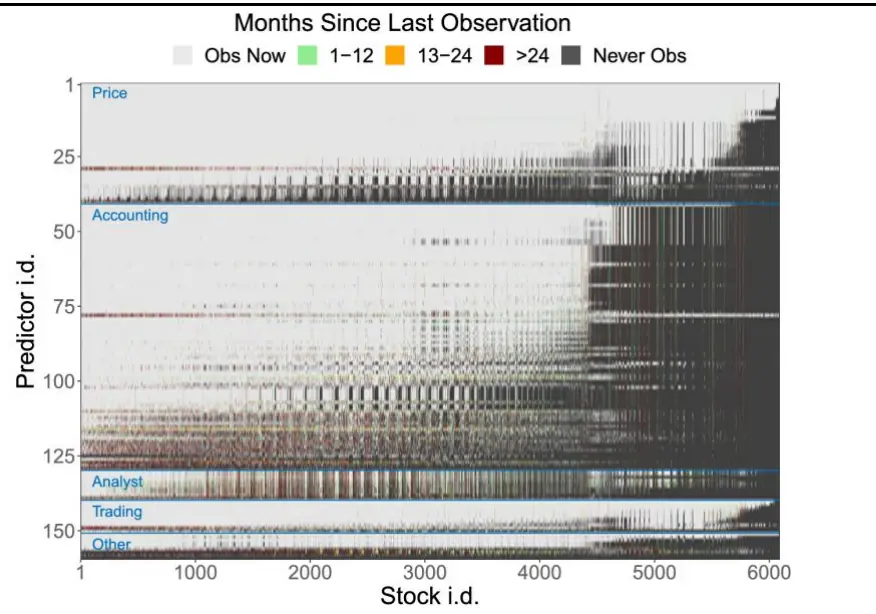
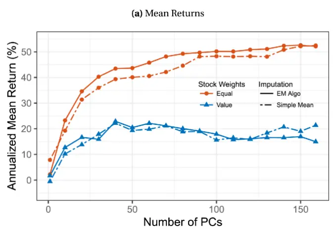
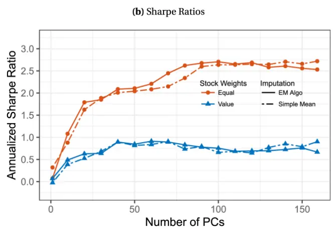
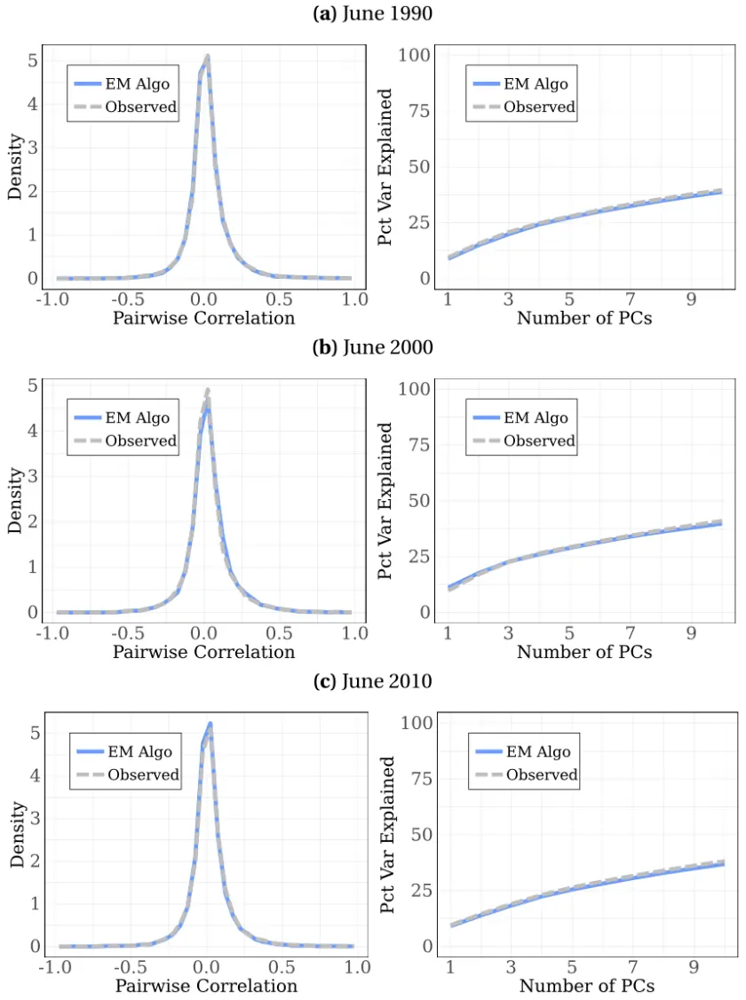
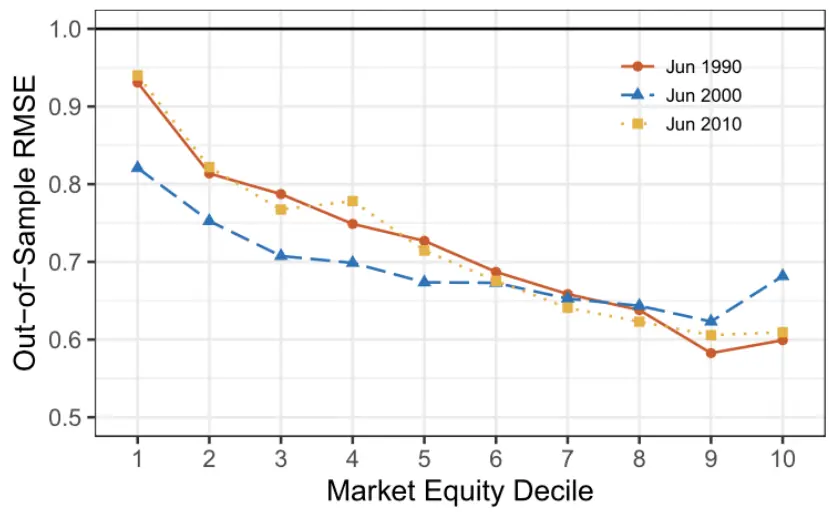
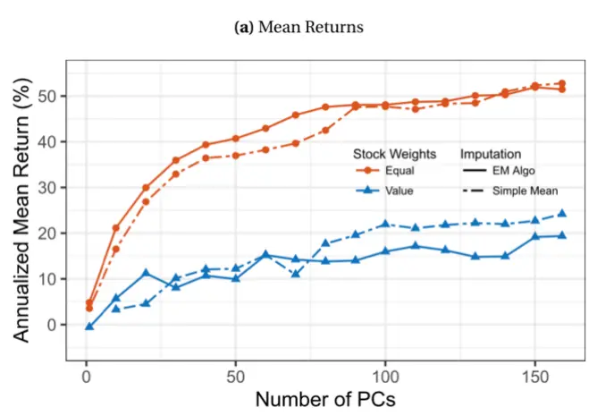
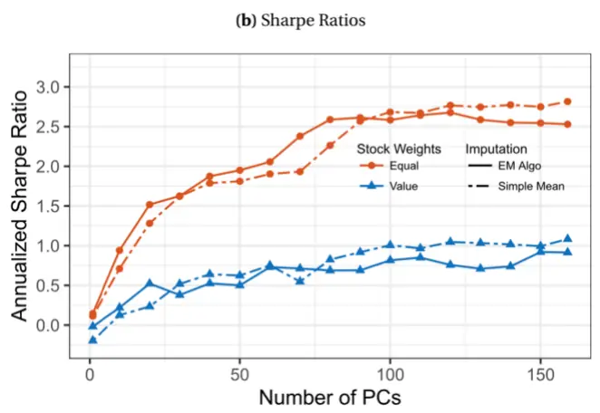
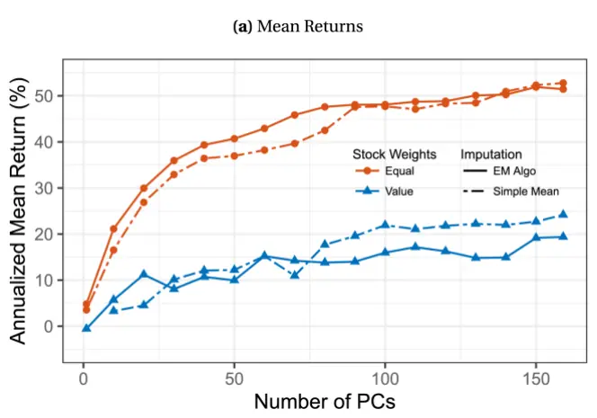
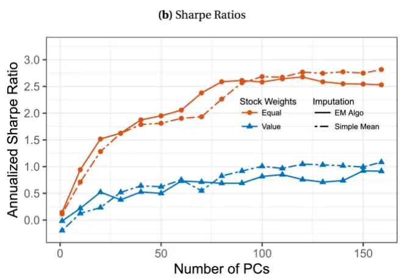
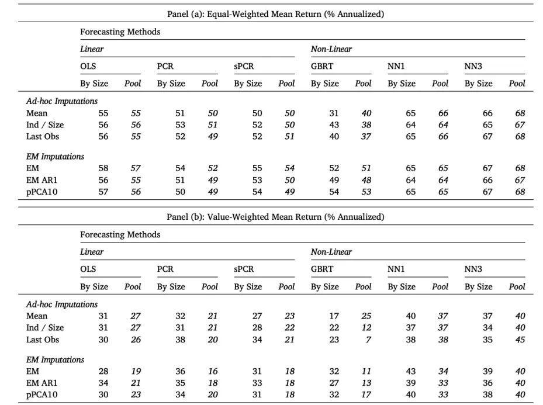

# 机器学习模型中如何处理缺失值

## ——学术纵横系列之五十五

## 本报告导读：

本篇报告介绍了文献 Missing values handling for machine learning portfolios 的主要结论，文章主要研究了在使用机器学习构建的投资组合中处理缺失值的方法，为股票收益预测中常见的缺失值处理提供了建议。

## 投资要点：

[Tab le_Summary]缺失值填充方法的选择：文章分析了截面均值填充和截面期望最大化方法（EM）填充在不同算法中的效果差异，并展示了其他四种缺失值填充和四种收益预测算法的效果。结论是股票收益预测效果与缺失值填充方法的关系不大，并且复杂的机器学习方法的表现可能不如简单OLS 回归。

o缺失值处理效果的解释：文章发现在大多数情况下，使用简单均值填充的效果最好。这可能是由于（1）数据截面相关性整体较低，因此已有数据对于缺失值数据而言提供的信息较为有限；（2）缺失值往往在时间维度上聚集出现，时间序列方法和 EM 算法能利用的信息有效度较低；（3）同一数据源的缺失值往往聚集出现，甚至会出现缺失值数量远大于观测值的情况，不利于进行严格的逻辑填充。

在股票收益预测时按市值进行分组：文章发现在预测股票收益时，在PCR、sPCR、GBRT等模型中根据市值分组可以显著提升投资组合表现。这一结果表明不同市值规模、不同流动性的股票的收益预测结构是不同的。

风险提示：量化模型失效风险：本篇报告所述文章的结论是基于量化模型和历史数据的得到的，请注意样本外存在失效可能性，详细结论请参考文献原文。

able卢开庆(分析师)

心021-38038674

lukaiqing026727@gtjas.com

登记编号S0880524080005

## [Table_Rep相关报告

Gerber统计法：估计投资组合协方差矩阵的新方法 2024.06.17

日夜收益差的形成机制 2023.09.27

防御型股票的特征 2023.08.21

## 1. 引言

机器学习算法对于底层输入数据的完整性有较高要求，以往很多研究直接将包含缺失值的股票删除，当数据集涉及多个不同维度或者长周期数据时这样的做法会删去几乎所有个股（Chen 和Zimmermann（2022）的研究包含125 个因子，这样的操作会删去 99%的个股）。因此，在应用机器学习算法时如何填充缺失的因子值数据亦是一个值得探讨的问题。

在 Missing values handling for machine learning portfolios 一文中，作者详细分析了截面均值填充和截面期望最大化方法（EM）填充在不同算法中的效果差异，并展示了其他四种缺失值填充和四种收益预测算法的效果。文章的结论是最简单的截面均值填充方法在大部分算法中效果都很好。

作者认为原因包括：（1）数据截面相关性整体较低，因此已有数据对于缺失值数据而言提供的信息较为有限；（2）缺失值往往在时间维度上聚集出现，时间序列方法和EM算法能利用的信息有效度较低；（3）同一数据源的缺失值往往聚集出现，甚至会出现缺失值数量远大于观测值的情形，不利于进行严格的逻辑填充。

## 文献信息：

Andrew Y. Chen, Jack McCoy, Missing values handling for machine learning portfolios, Journal of Financial Economics, Volume 155,2024,103815,ISSN 0304- 405X, https://doi.org/10.1016/j.jfineco.2024.103815.

## 1.1. 因子值缺失情况展示

文章展示了159个不同类型的因子的缺失情况，如下图所示，大部分股票都存在不同程度的数据缺失。如果有缺失值就删去个股，那么这里将删去所有个股。因此，填充缺失的因子值是非常有必要的。

图 1：不同因子在不同个股上均存在缺失值

数据来源：Missing values handling for machine learning portfolios

## 2. 截面最大期望填充&截面均值填充

在进行缺失值填充前，文章对原始股票数据进行了一些预处理，步骤如下：（1）对股票数据进行对称 1%分位数的缩尾处理，减少异常值的影响；（2）对预测因子进行Box-Cox变换，使其趋近于正态分布；（3）对预测因子进行标准化处理。

## 2.1. 截面 EM算法填充

假设有N只股票，每只股票在第t月具有一组预测因子向量 $X_{i,t}$ ，其中缺失值和观察值分别表示为 $X_{miss|i,t}$ 和 ${:}X_{obs|i,t}$ 。假设 $\hat{\Sigma}_{t}$ 为 $X_{i,t}$ 的跨股票协方差矩阵 $\Sigma_{t}$ 的合理估计（例如，可以让 $\widehat{\Sigma_{t}}$ 是具有预测数据的股票对的样本协方差）。然后，填充 $X_{miss|i,t}$ 的一种直观方法是使用：

$$
\hat{X}_{miss|i,t}=\hat{\beta}_{i,t}^{\prime}X_{obs|i,t}\tag{1}
$$

其中

$$
\hat{\beta}_{i,t}^{\prime}\equiv\hat{\Sigma}_{obs,obs|i,t}^{-1}\hat{\Sigma}_{obs,miss|i,t}\tag{2}
$$

$\widehat{\Sigma}_{miss,obs|i,t}和\widehat{\Sigma}_{obs,obs|i,t}$ 是 $\Sigma_{t}$ 的子矩阵，分别对应于股票i的缺失值和观测值。类似于经典OLS 公式 $\hat{\beta}=[X^{\prime}X]^{-1}X^{\prime}y$ ，式(1)-(2)使用了变量之间的协方差来完成预测。由于文章对变量进行了标准化使其均值为零，式(1)中省略了截距项。

但是这种方法下的填充数据通常存在以下性质

$$
\begin{array}{r}{\hat{\Sigma}_{t}\neq N^{-1}\sum_{i=1}^{N}\hat{X}_{i,t}\hat{X}_{i,t}^{\prime}}\end{array}\tag{3}
$$

其中 $\hat{X}_{i,t}$ 结合了 $\hat{X}_{miss|i,t}$ 和 $\cdot X_{obs|i,t}$ 。在这种情况下，作者并不清楚是否应该使用 $\hat{\Sigma}_{t}$ 或 $_{1}N^{-1}$ ∑ X̂N X̂′ 来填充缺失值。除此之外， $(1)-(2);$ 没有解决如何处理高阶缺失项的问题：不仅 $X_{miss|i,t}$ 是未知的， $X_{miss|i,t}X_{miss|i,t}^{\prime}$ 也是未知的。$X_{miss|i,t}X_{miss|i,t}^{\prime}$ 的期望值不同于式(1)的外积，对于 $\Sigma_{t}$ 的严格估计可能会起到重要作用。估计此高阶项的一种直观方法是使用下式，这一结果也可以从高斯更新公式中推导出来：

$$
\left[\widehat{X_{i,t}X_{i,t}^{\prime}}\right]_{miss,miss|i,t}=\Sigma_{miss,miss|i,t}-\hat{\beta}_{i,t}^{\prime}\Sigma_{obs,miss|i,t}+\hat{X}_{miss|i,t}\hat{X}_{miss|i,t}^{\prime}\tag{4}
$$

EM算法通过反复迭代公式(1)-(2)和公式(3)解决自洽性问题，重复这两个步直至满足 $\left\|\widehat{\Sigma}_{t}^{new}-\widehat{\Sigma}_{t}\right\|_{\infty}\leq\delta$ 。文章使用 $\delta=10^{-4}$

- E 步：利用式(1)和(2)，使用观测数据和当前猜测的 $\hat{\Sigma}_{t}$ 填充缺失数据。• M步：通过将E步中填充的数据代入式(3)的右边，估计一个新的Σ̂new。根据式(4)，将高阶修正 $\hat{X}_{miss|i,t}\hat{X}_{miss|i,t}^{\prime}$ 的子矩阵添加到 $\hat{\Sigma}_{t}^{new}$ 中。

## 2.2. 截面均值填充

截面均值填充即使用已有数据的截面均值替换缺失值。考虑到文章已对预测因子进行正态化和标准化，简单均值填充等同于将缺失值直接替换为零。均值填充具有简单易行，计算成本低且透明度高的优点。但是从理论方面，均值填充可能会造成显著的有偏推断（significantly biased inferences）。此外，值得一提的是，均值填充实质上是EM算法填充的特例，此时协方差矩阵Σ̂的非对角线元素为零。

## 3. 两个填充方法在不同算法中的效果分析

## 3.1. 单因子策略

文章作者将EM算法填充应用于单因子策略，并将其结果与删除具有缺失值的股票进行对比。每月选择 500只预测值最高的股票做多，500只预测值最低的股票做空，以此消除填充数据时可能出现的预测因子稀释效应（”predictor dilution” effects）。

结果表明 EM 算法填充相比于直接删除缺失值而言，在策略平均收益和夏普上确实有改进，但不明显。表1展示了在EM算法填充的改进效果：策略平均收益的分布总体向右移动，但左尾向左移动，这一特点在等权重组合中尤其明显；策略夏普比率几乎没有改进，且分布的两尾均向外移动。

表 1：缺失数据对单预测因子策略的影响

|  | Percentile Across Predictors |  |  |  |  |
| --- | --- | --- | --- | --- | --- |
|  | 10 | 25 | 50 | 75 | 90 |
|  | Panel (a): Equal-Weighted |  |  |  |  |
| Mean Return (% Ann) |  |  |  |  |  |
| EM Imputed | -1.2 | 2.9 | 7.1 | 12.7 | 17.5 |
| Missing Dropped | -0.1 | 3.1 | 6.2 | 10.2 | 15.2 |
| EM Improvement | -2.0 | -0.3 | 0.5 | 2.1 | 4.4 |
| Sharpe Ratio (Ann) |  |  |  |  |  |
| EM Imputed | -0.05 | 0.16 | 0.58 | 0.86 | 1.21 |
| Missing Dropped | -0.01 | 0.26 | 0.53 | 0.89 | 1.11 |
| EM Improvement | -0.22 | -0.04 | 0.01 | 0.09 | 0.18 |
|  | Panel (b): Value-Weighted |  |  |  |  |
| Mean Return (% Ann) |  |  |  |  |  |
| EM Imputed | -1.9 | 0.5 | 3.1 | 7.0 | 11.2 |
| Missing Dropped | -2.1 | 0.8 | 2.6 | 5.5 | 10.4 |
| EM Improvement | -1.5 | -0.4 | 0.2 | 1.5 | 3.8 |
| Sharpe Ratio (Ann) |  |  |  |  |  |
| EM Imputed | -0.13 | 0.04 | 0.22 | 0.43 | 0.54 |
| Missing Dropped | -0.12 | 0.04 | 0.22 | 0.36 | 0.51 |
| EM Improvement | -0.10 | -0.04 | 0.00 | 0.06 | 0.19 |

数据来源：Missing values handling for machine learning portfolios

## 3.2. PCR 多因子策略

在多因子回归任务中，文章利用主成分回归（PCR）方法避免过拟合问题，并构建多空策略。

1. 首先按市值将股票分为三类：

- micro：市值低于 NYSE 市值的 20%

- small：市值介于 NYSE 市值的 20%至 50%

- big：市值高于 NYSE 市值的 50%

1. 对于每一个类别，使用过去120个月的数据找到预测因子的主成分，然后使用最小二乘法（OLS）通过前K个主成分预测股票收益

2. 形成一个投资组合，买入预测收益最高的前10%股票，卖空预测收益最低的10%股票，并持有一个月

结果表明截面 EM 算法填充和截面均值填充在预测投资收益方面的差异不明显。图1 展示了平均收益和夏普比率随选取主成分数量的变化情况。在等权重组合中，EM算法填充对应的平均收益和夏普比率略高于简单均值填充，但这一优势在选取的主成分数量增加时消失。而对于价值加权组合，两种缺失值填充方式效果相似。

图 2：缺失数据对 PCR多预测因子策略（分组预测）的影响

数据来源：Missing values handling for machine learning portfolios

## 3.3. 填充信息和因子相关性

在股票收益预测中，已有的因子数据中几乎不包含缺失值的信息。下图展示了预测因子间的相关性分布和主成分的解释方差比率，可以发现已有因子数据之间的相关性大多接近零，这一现象令EM算法没有用武之地。此外，缺失值往往以块状出现，使用较远的数据进行填充事实上可以贡献的信息有限。

图 3：相关性的历史数据分布情况

数据来源：Missing values handling for machine learning portfolios

## 3.4. 缺失值填充的噪声和陷阱

EM算法填充引入的噪声可能超过其所带来的信息增益。下图展示了随机遮蔽 10%的观测值后使用 EM 算法填充后，计算出的均方根误差RMSE =$\sqrt{\frac{\sum_{i=1}^{T}(r_{i}-\hat{r}_{i})^{2}}{T}}.$ 。可以发现对于小市值股票，EM算法填充造成的误差比较显著，意味着EM算法填充引入的噪声有可能对预测造成较大程度的负面影响。

图 4：随机屏蔽数据时的估算误差情况

数据来源：Missing values handling for machine learning portfolios

上述结论也在下图中得到印证。相比图 2，如果预测模型没有按市值区分，EM算法填充方法会导致模型预测表现下降。这很大程度上是 EM算法填充在小市值股票上表现不佳造成的。

图 5：缺失数据对 PCA多预测因子策略（未分组预测）的影响

数据来源：Missing values handling for machine learning portfolios

## 3.5. 比例主成分（Scaled PCR）和预期收益的维度问题

前文表明预期收益产生显著影响的主成分数量较多，文章研究表明预期收益对应的数据维度非常微妙，它受到多种测量决策的影响。作者使用 Huang 等（2022）提出的比例主成分分析（Scaled PCA）方法，这种比例分配方法能够将收益信息纳入主成分分析中。其操作步骤为：

1. 对于每一个预测因子j，使用OLS 预测股票收益： $r_{i,t}=\alpha_{j}+\gamma_{j}X_{i,j,t-1}+$ $\varepsilon_{i,j,t}$ ，其中 $X_{i,j,t-1}$ 是股票i在月t − 1的预测因子j的值

2. 定义比例预测因子为 $\dot{X}_{i,j,t}\equiv\hat{\gamma}_{j}X_{i,j,t}$

3. 将比例因子应用于标准PCA，得到比例主成分

文章证实了比例主成分方法在减少预期收益相关数据维度方面的优势，并强调了缺失值填充方法在预期收益推断中的相对不重要性。通过对比图1和图 5，比例主成分方法的引入显著减少了预测收益所需的主成分数量。在大多数情况下，EM算法填充和简单均值填充在捕捉潜在收益方面的表现相近。

图 6：缺失数据对比例主成分多因子策略的影响

数据来源：Missing values handling for machine learning portfolios

## 4. 其他缺失值填充方法收益预测方法的组合效果

本节引入四种缺失值填充方法和四种收益预测方法（机器学习方法）。通过综合对比，评价各种填充方法和收益预测方法在预测中的表现。

## 4.1. 拓展的缺失值填充方法

1. Cross-Sectional EM on AR1 Residuals：引入时间序列分析方法，首先在过去 60 个月的数据上对 Box-Cox 变换后的预测因子应用 AR1 模型，然后对残差进行横截面EM算法填充

2. Practical EM for Probabilistic PCA：假设进行 Box-Cox 变换后的预测因子遵循 10 维的因子结构，利用 Roweis（1997）的实用 EM 算法（PracticalEM algorithm）进行缺失值填充。实用EM算法在E步中使用因子模型预测完成缺失值填充，但忽略高阶项的修正

3. Industry-Size Decile Means：根据 3 位 SIC 代码将股票分为行业组，并在每个行业组中按市值分为十分位数。将缺失值替换为相应行业-市值组的均值

4. Last Observed：将缺失值替换为过去 12 个月内最近一次观测到的值。如果过去12 个月内没有观测值，则使用截面均值填充

## 4.2. 拓展的收益预测方法

1. Simple OLS：使用简单OLS 方法（不进行任何正则化处理）将股票收益与预测因子进行回归。简单OLS 方法提供了一个有效的基准参考

2. Gradient-Boosted Regression Trees（GBRT）：一种集成学习方法，通过构建一系列弱学习器（通常为浅层决策树）来提升模型的预测性能。使用 B 颗浅层回归树的平均值对股票收益建立模型，并通过梯度提升拟合：从现有的树开始，沿着L2损失函数的梯度添加新树，重复此过程B 次。文章按照 Gu 等（2020）和 Li 等（2022）内容调整参数 B 和其他超参数的值

3. 3-Layer Neural Network（NN3）：使用三层隐藏层的神经网络模型进行预测。文章使用 Adam 优化器进行训练，结合批量归一化（batchnormalization）和早停法（early stopping）。按照 Gu 等（2020）内容调节参数和规范细节

4. 1-Layer Neural Network（NN1）：同 NN3，但是仅使用一层隐藏层

## 4.3. 模型预测和超参数调优

文章使用六种不同的方法来插补缺失值，然后使用六种不同的预测方法来构建“样本外”投资组合。股票投资组合的构建步骤如下所示，对于 1995 至2021年的每个六月进行如下操作：

1. 数据集划分。将1985年1月至当期的数据划分为训练集和验证集，验证集为该段数据或过去 12年数据的后一半（取较短者），其余为训练集

2. 模型训练和超参数调优。按照市值分组（micro、small、big）分别在预先选择的超参数集合中使用训练集拟合模型，并在验证集中计算出均方根误差 $\begin{array}{r}{RMSE=\sqrt{\frac{\sum_{i=1}^{T}(r_{i}-\hat{r}_{i})^{2}}{T}}.}\end{array}$ 。然后选择验证集中 RMSE 最小的超参数集合，并在整个训练集上训练模型。具体的超参数情况如下：

- PCR 和 scaled PCR：主成分数量从{10，30，50，70，90}中选择

- GBRT：树的深度（depth）为 1 或 2；学习率（learning rate）为 0.01或 0.10；树的数量从{1，250，500，750，1000}中选择

- 神经网络（NN1 和NN3）：L1 正则化参数为10−5或10−3；学习率为0.001 或 0.010。其余超参数为固定值：批量大小（batch size）为10000；训练轮次（epoch）为 100；早停耐心（early stopping patience）为 5；集成模型的数量（ensemble number）为 10；使用 Adam 优化器

3. 投资组合构建。使用训练好的模型每月对未来 12个月的股票收益进行滚动预测。按照预测收益对股票进行排序，买入预测收益最高的 10%股票，卖空预测收益最低的10%股票，并持有一个月

## 4.4. 不同方法的预测结果展示与分析

文章展示并分析 6 种缺失值填充方法和 6 种收益预测方法所有组合的结果。作者分别研究了前文所述三种不同市值范围股票的独立估计和所有股票的整体估计，得到以下结论。

股票收益的预测与缺失值填充方法的关系不大。根据下表，无论是等权重还是价值加权组合，年化平均收益对缺失值填充方法的依赖性较小。其中较复杂的EM算法填充的表现相比简单均值填充没有展现出显著的优势；加入时间序列信息的填充方法（ Cross-Sectional EM on AR1 Residuals 和 LastObserved）同样对预测表现没有显著改进。

按市值对股票进行分组预测可以显著提升加权投资组合的收益表现。根据下表，使用普通OLS、GBRT、PCR和 scaled PCR时，加权平均年化收益率因为分组预测有显著提升，这一现象与Fama 和 French（2008）以及Chen 和Velikov（2022）中预测能力与市值和流动性而异的发现一致。此外，预测收益对应的数据维度在不同组间存在显著差异。通常发现预测大盘股对应的数据维度较低，这也是其对应模型加权平均年化收益率较高的重要原因。

在实际预测股票收益时，复杂的机器学习方法的表现可能不如简单 OLS回归。根据下表，只有神经网络的预测效果优于简单OLS。这一结果符合Gu等（2020）的发现，即应用PCR和GBRT对94个预测因子的收益未优于简单三因子OLS。PCR和 scaled PCR的较差表现可能是由于其相比简单OLS损失了较多信息。神经网络的强大表现则主要源于其自身架构稳定和文章所沿用Gu等（2020）的参数选择非常稳健。

表 2：不同缺失值填充方法和收益预测方法的交叉表现

数据来源：Missing values handling for machine learning portfolios

## 5. 风险提示

量化模型失效风险：本篇报告所述文章的结论是基于量化模型和历史数据的得到的，请注意样本外存在失效可能性，详细结论请参考文献原文。

## 本公司具有中国证监会核准的证券投资咨询业务资格

## 分析师声明

作者具有中国证券业协会授予的证券投资咨询执业资格或相当的专业胜任能力，保证报告所采用的数据均来自合规渠道，分析逻辑基于作者的职业理解，本报告清晰准确地反映了作者的研究观点，力求独立、客观和公正，结论不受任何第三方的授意或影响，特此声明。

## 免责声明

本报告仅供国泰君安证券股份有限公司（以下简称“本公司”）的客户使用。本公司不会因接收人收到本报告而视其为本公司的当然客户。本报告仅在相关法律许可的情况下发放，并仅为提供信息而发放，概不构成任何广告。

本报告的信息来源于已公开的资料，本公司对该等信息的准确性、完整性或可靠性不作任何保证。本报告所载的资料、意见及推测仅反映本公司于发布本报告当日的判断，本报告所指的证券或投资标的的价格、价值及投资收入可升可跌。过往表现不应作为日后的表现依据。在不同时期，本公司可发出与本报告所载资料、意见及推测不一致的报告。本公司不保证本报告所含信息保持在最新状态。同时，本公司对本报告所含信息可在不发出通知的情形下做出修改，投资者应当自行关注相应的更新或修改。

本报告中所指的投资及服务可能不适合个别客户，不构成客户私人咨询建议。在任何情况下，本报告中的信息或所表述的意见均不构成对任何人的投资建议。在任何情况下，本公司、本公司员工或者关联机构不承诺投资者一定获利，不与投资者分享投资收益，也不对任何人因使用本报告中的任何内容所引致的任何损失负任何责任。投资者务必注意，其据此做出的任何投资决策与本公司、本公司员工或者关联机构无关。

本公司利用信息隔离墙控制内部一个或多个领域、部门或关联机构之间的信息流动。因此，投资者应注意，在法律许可的情况下，本公司及其所属关联机构可能会持有报告中提到的公司所发行的证券或期权并进行证券或期权交易，也可能为这些公司提供或者争取提供投资银行、财务顾问或者金融产品等相关服务。在法律许可的情况下，本公司的员工可能担任本报告所提到的公司的董事。

市场有风险，投资需谨慎。投资者不应将本报告作为作出投资决策的唯一参考因素，亦不应认为本报告可以取代自己的判断。在决定投资前，如有需要，投资者务必向专业人士咨询并谨慎决策。

本报告版权仅为本公司所有，未经书面许可，任何机构和个人不得以任何形式翻版、复制、发表或引用。如征得本公司同意进行引用、刊发的，需在允许的范围内使用，并注明出处为“国泰君安证券研究”，且不得对本报告进行任何有悖原意的引用、删节和修改。

若本公司以外的其他机构（以下简称“该机构”）发送本报告，则由该机构独自为此发送行为负责。通过此途径获得本报告的投资者应自行联系该机构以要求获悉更详细信息或进而交易本报告中提及的证券。本报告不构成本公司向该机构之客户提供的投资建议，本公司、本公司员工或者关联机构亦不为该机构之客户因使用本报告或报告所载内容引起的任何损失承担任何责任。

## 评级说明

|  |  | 评级 | 说明 |
| --- | --- | --- | --- |
| 投资建议的比较标准 投资评级分为股票评级和行业评级。 | 股票投资评级 | 增持 | 相对沪深 300 指数涨幅 15%以上 |
| 以报告发布后的12个月内的市场表现为比 较标准，报告发布日后的12个月内的公司 股价（或行业指数）的涨跌幅相对同期的 沪深300指数涨跌幅为基准。 |  | 谨慎增持 | 相对沪深 300 指数涨幅介于5%~15%之间 |
|  |  | 中性 | 相对沪深 300指数涨幅介于-5%~5% |
|  | 行业投资评级 | 减持 | 相对沪深 300 指数下跌 5%以上 |
|  |  | 增持 | 明显强于沪深 300 指数 |
|  |  | 中性 减持 | 基本与沪深300指数持平 明显弱于沪深 300 指数 |

## 国泰君安证券研究所

| 上海 |  | 深圳 | 北京 |
| --- | --- | --- | --- |
| 地址 | 上海市静安区新闸路669号博华广场 20层 | 深圳市福田区益田路6003号荣超商 务中心 B 栋 27 层 | 北京市西城区金融大街甲9号金融 街中心南楼18层 |
| 邮编 | 200041 | 518026 | 100032 |
| 电话 | （021)38676666 | （0755）23976888 | （010）83939888 |
| E-mail: gtjaresearch@gtjas.com |  |  |  |