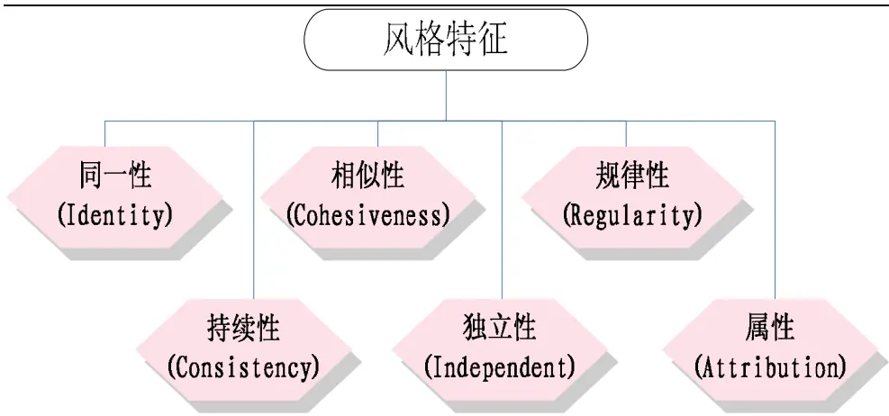
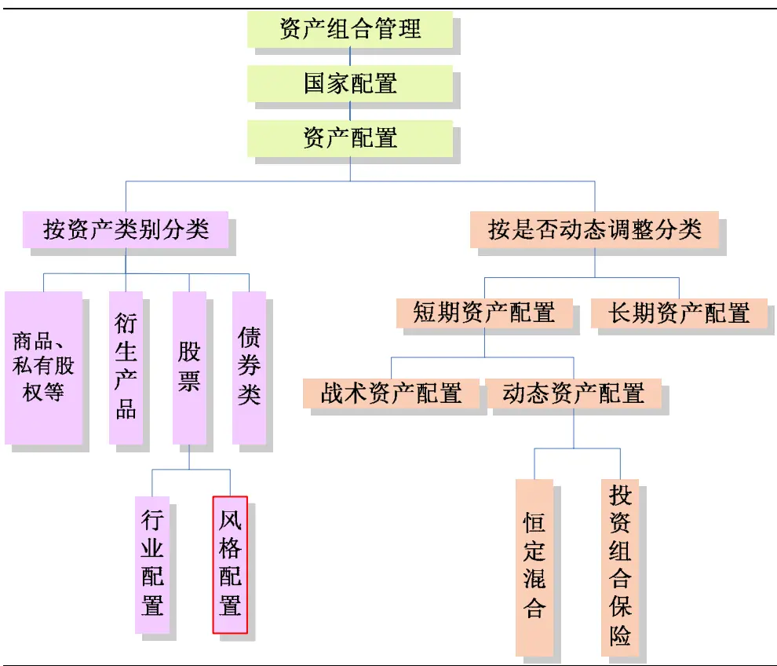
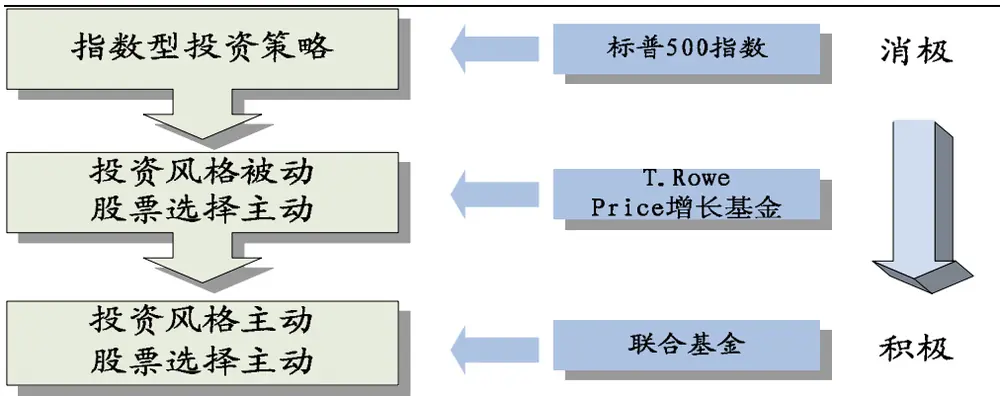
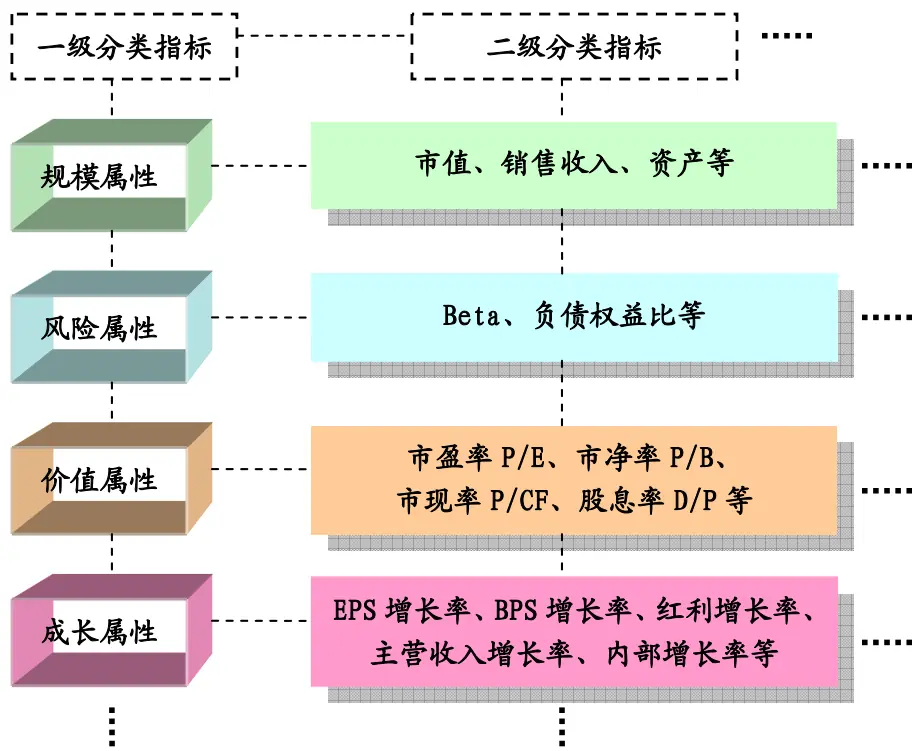
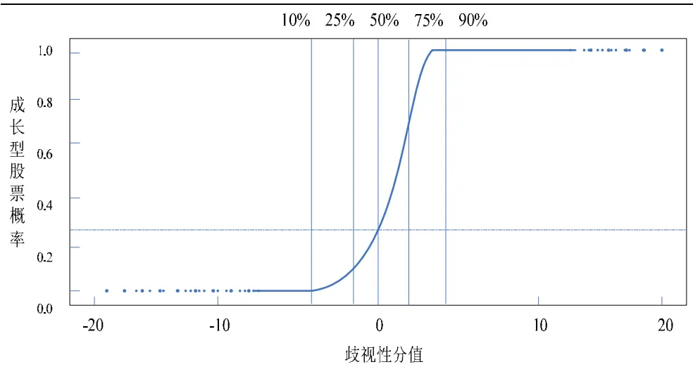
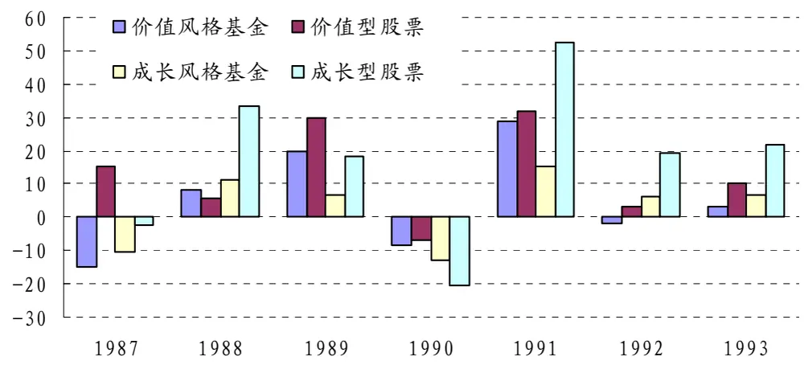
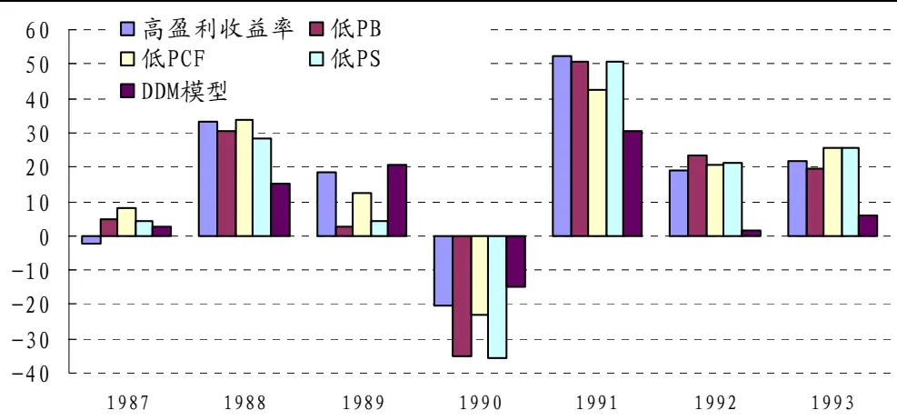
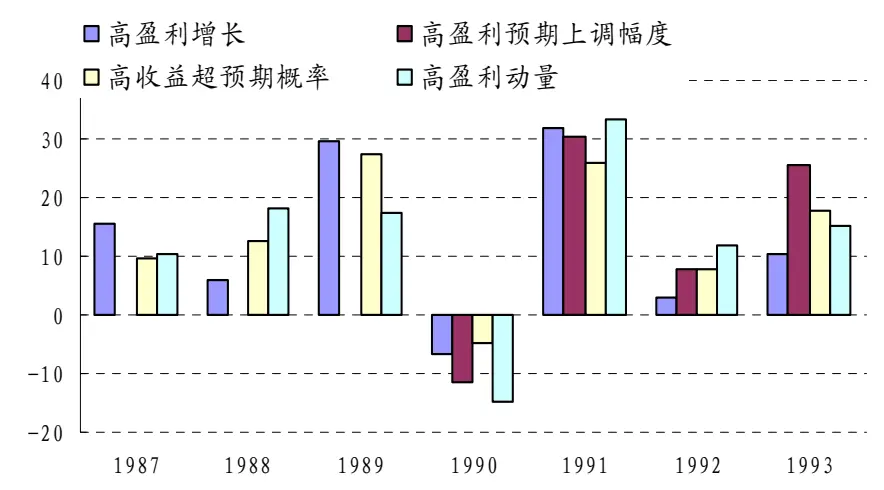

2008.9.9

# 风格投资Ⅰ：风格区分与收益

# ——数量化系列研究之一

蒋瑛琨

杨喆

吴天宇

21-38676710

21-38676442

21-38676788

jiangyingkun@gtjas.com yangzhe@gtjas.com

wutianyu@gtjas.com

¾ 资料全面，数据翔实，多角度揭示风格投资特点

本报告导读：

¾ 展示国外投研机构的主流研究、成果与观点

¾ 进一步研究，见关于风格研究的后续报告

## 摘要：

投资风格的形成主要来源于对股市异象的研究。本质上，风格投资是从某些特定分割的、异质的市场或从错误定价的股票中获得超额收益。

目前市场形成了几种主流的投资风格，例如大盘/小盘，价值/成长。国内外机构与研究者采用多种方法划分，通常采用多重标准的风格转换策略能获得更好的收益。

国外投资风格鉴别技术可分为两种:（1）持股特征基础的投资风格鉴别法(HBS)，包括 Morningstar“风格箱”法和“新风格箱”法、Rusell 风格分类系统(SCS)、Frank Russell 和 Salomon Brother 的风格分类系统等。（2）收益率基础的投资风格鉴别(RBS)法，如sharp鉴别法等。

风格对组合收益率的解释能力如何？根据 sharp、Rusell公司等的研究，风格指数可以在相当程度上解释组合收益的来源。

美林数量研究部分析了 87-93 年成长和价值风格投资的表现。在不同年份，价值和成长风格投资表现各异，风格基金与通过单一指标选出的风格股票组合的收益表现也有较大差异，这表明基金经理选股加入了主观因素。其次，价值/成长风格投资的业绩很大程度上受到风格定义的影响。

风格投资是否能获得稳定、超额收益？ Arnott, David and Christopher 研究了 75年 1月至 95年 6月期间将 1美元分别投至美国、英国、日本、加拿大及德国的价值股和成长股，发现投资价值股能获得更高收益。这说明，根据股票风格选出的组合能带来额外收益，并且这些组合的收益和其余组合收益在统计意义上具有显著差异。

如果对风格轮换能做到完全预测，那么投资组合最多获得的超额收益有多大？Farrell(1996)将股票分为成长型、周期型、稳定型和能源型等风格，分别进行风格轮换收益率测算，在 71年至 91年期间，投资于收益率最高的风格组合所获得的最多超额收益平均为 20.14%。

风格组合的收益率是否能预测未来的股市走势？Shao and Rennie(2007)发现，控制宏观变量和滞后的市场收益后，大市值和价值股组合可以预测未来 1个月的股票市场行为；在商业周期的扩张阶段，小市值股票的收益倾向于能够预测市场收益；风格组合收益预测未来市场收益的能力和其预测宏观经济行为的能力相关。

Gokani1 and Todorovic 研究了英国风格指数的预测性。使用宏观经济、基本面和市场变量正确预测未来大小盘股收益差的概率为 63%，采用多头和多空头动量策略，可以战胜买入并持有 FTSE 小盘股组合。价值成长周期轮换策略可行性较弱，而大盘小盘周期轮换策略具有可行性。虽然数量模型的构建具有主观性，但使用基于规模的轮换策略来预测未来收益是有利可图的。

z 保证风格投资收益的核心问题包括：考虑交易成本、风格配置倾斜、注重长期回报。

## 本报告包括正文 14 页，图 9 张，表 11 张

## 1. 风格投资概述

## 1.1.投资风格的兴起与背景

投资风格是针对股票市场而言的，是指投资于某类具有共同收益特征或共同价格行为的股票。投资风格一般要满足投资管理者、投资者和投资顾问的需要。一种特定的投资风格，一般应具有下列特征：

图 1 某种投资风格应具备的特征

数据来源：国泰君安证券研究所整理

投资风格的形成主要来源于对股票市场异象的研究成果。在长期市场研究中，研究人员发现存在大量市场异象，主要包括公司属性效应、趋势效应等。市场有效性程度不是一成不变的，会随时间不断变化。也就是说，追逐这些市场失效现象能获取超额投资收益。所以，风格投资从本质上来说是通过执行各种投资决策，从某些特定分割的、异质的市场或从某类错误定价的股票中获得超额收益。

## 1.2.风格管理在资产组合管理中的地位

传统的基本分析方法包括宏观、中观和微观三个层次，也就是宏观、行业和公司。近年来国外对于中观层次的划分标准出现了分叉，不再拘泥于行业、板块的分类，而更倾向于根据公司自身属性来划分，如市场规模、价值属性等。更细致的划分，则是用一些影响股票价格行为的基本变量来构建资产组合，比如 P/E、收益增长率、市场估计修正、盈余动量等。

图 2 风格配置在整体资产组合管理中的位置

数据来源：国泰君安证券研究所整理

表 1 资产组合管理及基本理论和应用

| 投资管理的阶段 | 理论 | 应用 |
| --- | --- | --- |
| 资产配置及调整 | 经济周期理论 | 宏观经济状况和各种资产 收益状况的预测 |
|  | 资本市场理论 | 收益-风险相互替代关系、业 绩测量 |
|  | 投资组合理论 | 资产配置 |
| 板块（行业）选择 | 基本分析理论 | 行业选择、板块选择、板块轮换 |
|  | 投资风格相关理论 | 风格轮换 |
| 证券选择 | 基本分析理论 | 价值评估 |
|  | 技术分析理论 | 择时 |
| 资产变现 | 微观结构理论 | 证券的流动性 |
| 绩效评估 | 资本市场理论 | 评价基金的市场表现 |

数据来源：杨朝军，“金融投资风格与策略”，国泰君安研究所整理

## 1.3.风格策略与消极策略的比较

## 1.3.1. 积极(风格)策略与消极策略的比较

图 3 消极与积极策略变化及范例

数据来源：国泰君安证券研究所

表 2 消极与积极策略收益率比较（1972年 12月-1974年 7月）

| 风格 |  | 标普 500 指数 | T.Rowe Price 增长基金 | 联合基金 |
| --- | --- | --- | --- | --- |
| 股票 | 增长类 | 39.8% | 80.2% | 10.5% |
|  | 周期类 | 24.0% | 8.7% | 57.5% |
|  | 稳定类 | 20.0% | 4.1% | 18.0% |
| 组合 | 能源类 | 16.2% | 7.0% | 14.0% |
|  | 合计 | 100% | 100% | 100% |
| 投资组合的 Beta 系数 |  | 1.00 | 1.11 | -1.09 |
|  | 基金收益率 | -29% | -16% | -42% |

数据来源：James L.Farrell,Jr.,Homegeneous Stock Groupings:Implications for PortfolioManagement,Financial Analysts Journal,1975。

标普 500指数可以看成是消极型策略，T.Rowe Price增长基金是投资风格不变、个股选择主动的偏积极策略，联合基金则是投资风格主动、个股选择主动的积极策略。在 1972年 12月-1974年 7月期间，三者的累积收益率有很大差异。标普指数下跌 29%，市场处于熊市状态，增长基金下降 42%，联合基金下降 16%。

联合基金股票组合中，周期类、稳定类、能源类投资风格资产所占比例达到整个组合的 90%，这类资产在整体市场走弱时抗跌性很强；而 T.Rowe Price 增长基金股票组合的资产增长型股票占 80%，因此在熊市中表现相对较差。当市场走强时，可以推测，T.Rowe Price增长基金走势将超越市场，联合基金表现会相应转弱，但抗风险性会强于增长基金。

## 1.3.2. 积极(风格)投资策略可能的败因

投资决策失误。人非圣贤，投资经理和大部分人一样，很多时候存在行为金融学里的各种认知偏差和过度自信，造成投资行为上过度反应和反应不足。那么积极的投资策略可能会带来比消极投资策略更不好的决策，导致收益低于消极策略或市场平均。这一矛盾也是导致市场上积极和消极两种策略并存的原因。

z 费用支出过高。美国共同基金的平均管理费率大约为 100 个基点，再加上 45个基点用以反映基金平均周转率和平均交易成本。那么至少需要获得比标普500指数高出 145个基点的收益率才能算是战胜指数。费用的高昂是大部分基金战胜不了指数的一个原因。

z 风险控制失败。风险控制框架建立在统计学原理和大量模型的基础上，但仍存在我们无法估计和考虑到的风险，一旦小概率事件发生，导致风险控制系统崩溃，损失扩大，进而导致整个投资策略失败。

## 2. 风格投资区分

## 2.1. 风格划分方法

在产业刚开始起步时，共同基金在招募说明书里说明将投资定位于某种特定类别的资产，以此来吸引潜在投资者。美国投资公司协会（Investment Company Institute）把这些投资标的划分为 33类，包括主动成长、成长、成长收益、平衡、全球、收入等。更典型的投资风格分类直接使用组成证券的特性，如：Fama and French、Roll（1995）用市场规模、市盈率、市净率等指标来检验组合收益；Brown andGoetzmann （ 1997 ） 开 发 了 基 于 风 格 因 子 的 分 类 系 统 ； iBartolomeo andWitkowski(1997)用多因素模型来分解基金所持有的证券。目前，股票风格的研究机构繁多，风格分类方法也不拘一格，风格分类指标可以分一级指标、二级指标等。为数众多的风格种类在实践检验后，最终形成几种主流的应用较为广泛的投资风格。

图 4 多级风格分类指标

数据来源：国泰君安研究所整理

单纯考虑某一属性、且这一属性仅用一个指标来划分，比如按照市净率的单一指标来区分，把全部股票分为价值型和成长型两种。这种单一标准的风格划分方法存在一定局限性。diBartolomeo and Witkowski (1997) 用多因素模型来分解基金所持有的证券，其中 748 个股票基金样本中，有 40%的基金被错误划分了风格，主要原因是分类系统定义不明。

改进风格分类系统的一个方法是，开发更好的二级分类指标以便更精确地鉴别一级风格，或是更进一步地开发三级以上的分类指标。另外的方法是同时考虑多种风格属性，甚至把行业属性也同时考虑进去。这两种方法归根结底就是采用多重标准、进行高清晰度的风格鉴别。

采用多重标准的风格转换策略能获得更好的收益。在 1990-1994 年期间，施行多重标准风格转换的投资组合的表现明显优于市场表现（使用罗素 3000指数代替），同时，也优于基于股票指数的风格转换策略。基于多重标准风格转换的投资组合年收益率为 14.56%，收益率标准差也最大，但经风险调整后的夏普比率依然是最高的。

表 3 1990-1994年间，多重标准的风格转换策略的夏普比率最高

| 策略 | 年收益率 | 收益率年标准差 | 夏普比率 |
| --- | --- | --- | --- |
| 多重标准的风格转换 | 14.56% | 16.68% | 0.58 |
| 基于股票指数的风格转换 | 11.78% | 12.82% | 0.54 |
| 罗素 3000 指数 | 9.11% | 12.62% | 0.33 |

数据来源：Bruce I.Jacobs and Kenneth N.Levy.“Equity Management:Quantitive Analysis for Stock Selection”

## 2.2.国外主流风格鉴别技术

国外投资风格鉴别技术一般可分为两种:（1）持股特征基础的投资风格鉴别法(HBS)，包括晨星公司(Morningstar)的“风格箱”法和“新风格箱”法、罗素公司(Rusell)的风格分类系统(SCS)、富兰克罗素(Frank Russell)和所罗门兄弟公司(SalomonBrother)开发的风格分类系统等。（2）收益率基础的投资风格鉴别(RBS)法，如夏普的鉴别方法等。

## 2.2.1. 晨星“风格箱”法

表 5 晨星“风格箱”

| Valuation | Value | Blend | Growth |
| --- | --- | --- | --- |
|  | 大盘价值 | 大盘混合 | 大盘成长 |
|  | 中盘价值 | 中盘混合 | 中盘成长 |
|  | 小盘价值 | 小盘混合 | 小盘成长 |

数据来源：Morningstar

晨星“风格箱”法是一个 3×3矩阵，从大盘小盘、价值成长来对基金风格进行划分， 介于大盘和小盘之间的为中盘，介于价值型和成长型之间的为混合型，共有九类 风格。

规模指标(Size)：市值。通过比较基金持有股票的市值中值来划分，市值中值小于10亿美元，为小盘；大于 50亿美元，为大盘；10-50亿美元，为中盘。

估值指标(Valuation)：平均市盈率、平均市净率。基金所持有股票的市盈率、市净率用基金投资于该股票的比例加权求平均，然后把两个加权平均指标和标普 500成分股的市盈率、市净率的相对比值相加，对于标普 500来说，这个和是 2。如果最后所得比值和小于 1.75，为价值型；大于 2.25，为成长型；介于 1.75-2.25之间，为混合型。

晨星“风格箱”法的优点是对投资风格的判断比较及时、简单。缺点是所需要的信息量较大且不容易获得。

## 2.2.2. 晨星“新风格箱”法

“新风格箱”法是对“风格箱”法的改进，其主要步骤是 1）把股票规模划分为大盘股、中盘股和小盘股；2）分别衡量三类规模股票的价值得分和成长得分，将成长得分减去价值得分，得到价值-混合-成长得分，以此差值来界定是价值、成长和混合型；3）在界定好股票风格的基础上，进而界定基金风格。

股票规模分类：对于国内 A 股，按照总市值规模分为大盘、中盘和小盘三类。具体划分标准如下：将股票按照其总市值进行降序排列，计算股票对应的累计市值占全部股票累计总市值的百分比 Cum－Ratio（0 < CR ≤ 100%），

大盘股：累计市值百分比小于或等于 70%的股票，CR ≤ 70%；

中盘股：累计市值百分比在 70%-90%之间的股票，70% < CR ≤ 90%；

小盘股：累计市值百分比大于 90%的股票，CR > 90%。

股票价值成长分类：用 10个因子来划分股票价值成长属性。

1）对于价值属性，在规模分类的基础上，对股票按照 5个因子进行排序打分，综合 5 个因子得分得到每只股票的价值得分 OVS(Overall Value Score)。

2）对于成长属性，在规模分类的基础上，对股票按照 5个因子进行排序打分，综合 5 个因子得分得到每只股票的成长得分 OGS(Overall Growth Score)。

3） OVS-OGS，得到价值-混合-成长得分 VCG(Value Core Growth)，确定价值、成长的门限值，即可得到价值型、成长型和混合型。在每种规模的股票类别中，保证价值型、混合型和成长型各占总市值的 1/3。

表 4 新“风格箱”法的价值成长因子及权重

| 价值得分因子及其权重 |  | 成长得分因子及其权重 |  |
| --- | --- | --- | --- |
| 预期每股收益价格比 | 50.00% | 预期每股收益增长率 | 50.00% |
| 预期每股净资产价格比 | 12.50% | 每股收益历史增长率 | 12.50% |
| 预期每股收入价格比 | 12.50% | 每股收入历史增长率 | 12.50% |
| 预期每股现金流价格比 | 12.50% | 每股现金流历史增长率 | 12.50% |
| 预期每股红利价格比 | 12.50% | 每股净资产历史增长率 | 12.50% |

数据来源：Morningstar

基金投资风格是建立在股票投资风格和基金投资组合数据基础上的。晨星公司对股票投资风格每月末更新一次，股价采用当月最后一个交易日的收盘价。在基金披露新的投资组合数据后，晨星公司对其风格箱进行更新，一般更新频率是一季度。

## 2.2.3. SCS 风格分类系统

罗素公司(Rusell)的风格分类系统(Style Classification System，SCS)，使用 6 个分类变量将基金投资风格分为价值型、市场型、成长型和小市值型四种。我们以 Russell2500的样本为例。6个变量为：股票在指数成份股中所占的比重、市净率 P/B、市盈率 P/E、红利收益率、净资产收益率、行业偏离变量。行业偏离变量测量股票组合相对于 Russell 3000行业权重的偏离水平，行业偏离低的则为市场型。

特点：1）使用决策树法，分类变量是决策点，也就是阀门，决定之后将从哪条路径走，例如，对于Russell 2500指数成份股，如果一个股票组合大多数是Russell 2500指数成份股，则直接划为小市值型；如果只有很少部分是 Russell 2500指数成份股，则进入第二个决策点 P/B，以此类推。2）某些指标在路径中反复、交叉使用，减少错误分类的可能。2)依据股票组合在分类变量上与市场的相对水平，把基金划分到可能性最大的风格中去。3）按照时间变化揭示基金投资风格的变化，因此可以成为基金投资风格变化的预警系统。

## 2.2.4. 富兰克罗素(Frank Russell)和所罗门兄弟公司(Salomon Brother)的风格分类系统

罗素风格指数，把股票总体用净市比 B/P（确定性变量）和长期成长型预测（预测性变量）分成价值和成长两部分，长期成长型预测的变量来自机构经济评估测算公司 IBES(Institutional Brokerage Estimates Survey)。所罗门公司运用包括 P/B 比率、收益增长、市盈率、股利收益率和历史回报率等变量。

成长/价值(GV)模型，使用名为“歧视性分值”的统计技术来辨别价值型股票和成长型股票。对所有股票被归为成长型的概率进行排序，即“成长股概率”，“价值股概率”即 1-“成长股概率”。当某一股票“成长股概率”达到 1时，判定为成长型股票；当某一股票“价值股概率”达到 1 时，判定为价值型股票；不能明确划为这两类的为混合型。

GV模型中，水平轴表示歧视性分值，垂直轴为成长股概率，当歧视性分值上升时，成长股概率也上升。图中有 5 条垂直线，表明有多大比例的股票位于该线之下，例如，最左边的垂直线表示有 10%的股票位于该线之下，这类股票为清晰的价值型股票；最右边的垂直线表明有 10%的股票位于该线之上，具有很高的成长股概率，为清晰的成长型股票；中间的股票则没有进行分配。

图 6 成长/价值(GV)模型中，歧视性分值和成长型股票概率

数据来源：Sergio Bienstock and Eric H.Sorensen,“Segregating Growth From Value:It’s NotAlways Either/Or”所罗门兄弟公司，定量股份策略，1992 年 7 月。

## 2.2.5. 夏普投资风格鉴别法

夏普将所有股票分为四类：1）将标普 500指数成份股按净市比(B/P)排序分为两类，分界点是两类股票的总市值大小一样，高 B/P 的股票为价值股，其余为成长股，更新频率是六个月。2）将非标普 500指数成份股按市值高低分为两类，从高到底排序后占总市值前 80%的股票称为中市值股，剩下的则为小市值股。

表 5 夏普对股票风格分类

| 股票 | 风格 |
| --- | --- |
| 标普 500 成分股 | 价值股 |
| 非标普 500 成份股 | 成长股 中市值股 |
|  | 小市值股 |

数 据 来 源 ： Sharpe, William F.(1992),“Asset Allocation: Management Style and PerformanceMeasurement”,Journal of Portfolio Management, Vol.18, No.2, Winter 1992。

夏普还将共同基金可投资的其他资产，如债券、外国股票等分为 12类，将基金收益率对资产或指数收益率进行回归来鉴别基金的投资风格。如果资产或指数的回归系数大于 0.5，该资产或指数的投资风格则为该基金的投资风格。其中有两个约束条件：1）各项资产或指数的回归系数之和为 1；2）非卖空限制。同时满足两项约束为强式夏普投资风格鉴别法；去掉非卖空限制后称为半强式夏普投资风格鉴别法；不加任何约束称为弱式夏普投资风格鉴别法。

适用性：在美国市场上，股票允许被卖空，所以半强式夏普投资风格鉴别法被采用的较多，而在中国市场上，两个约束条件均满足，所以强式夏普投资风格鉴别法更适用。

缺陷：1）无论是强式、半强势和弱式夏普投资风格鉴别法，均会出现指数共线性问题。2）如果基金持有某一资产，而在分解变量中没有这一资产，则鉴别出的基金风格就会与真实情况有较大误差，也就是说会出现资产一致性问题。3）用来估计系数的样本区间长度直接影响系数估计，在基金风格不发生变化时，区间长度越长越好，但是基金风格一般会随时间而变化，因此区间的选择又不能太长。夏普在美国市场使用时，对时间区间的大小也没有定论，一般用 24-60个月。

## 2.2.6. 风格鉴别法的比较

持股特征基础的投资风格鉴别法(HBS)和收益率基础的投资风格鉴别(RBS)法可以从三个方面进行比较。

预测性。一种方法能做到对基金风格的正确鉴定，则也就有更大的可能性对基金未来的收益起到正确的预测作用。Radcliffe（1989）研究表明，HBS 对基金未来一个季度收益率变化的预测能力为 41.8%，RBS 对基金未来一个季度收益率变化的预测能力为 47.9%，因此一般认为 RBS的预测性更好。

z 及时性。HBS采用当前数据，如果不考虑数据采集难度的问题，时效性较好。而 RBS提供的是过去一段时间内的风格回归系数，因此不能及时地进行风格判断。

准确性。RBS 采用统计方法——最小均方差来鉴别基金投资风格，因此必然会存在统计误差。HBS 采用持股特征——持股明细和财务数据来鉴别基金投资风格，对特定时刻基金的投资风格判断较为准确，但也存在两方面的问题，即数据的可靠性和及时性、事先确定的投资风格划分标准的可靠性。

## 3. 风格投资收益

## 3.1.风格对组合收益率的解释能力如何？

将组合收益率对各种股票风格指数的收益率进行回归，可以解释组合中大部分收益率的来源。根据夏普(1992)的研究，富达麦哲伦基金在 1985-1989年间，97%以上的基金收益率都反映在一支被动型股票指数基金上。

到 1991年第四季度为止的三年时间里，富兰克罗素公司的成长股基金经理的收益率中值比价值股基金经理的收益率中值高出 57%；到 1993年第四季度为止的三年时间里，富兰克罗素公司的小盘股基金经理的收益率中值比大盘股基金经理的收益率中值高出 48%。也就是说，风格指数可以在一定程度上解释组合收益的来源。

## 3.2.风格投资业绩表现

## 3.2.1. 价值/成长股 VS价值/成长风格基金

美林的数量研究部分析了 1987-1993 年间成长和价值风格投资策略的表现。他们构建了两类指数。第一类是选取了 18支具有明显风格特征的基金，其中成长风格和价值风格基金各 9支，基于此构建了两个风格基金指数。第二类是基于 S&P500的样本股，选取 5年盈利增长率最高的 50支股票组成成长型股票指数的样本，选取盈利收益率(市盈率 PE 的倒数)最高的 50支股票组成价值型股票指数的样本。

结果显示，在不同的年份，价值和成长风格投资策略表现各异，而风格基金和通过单一指标选出的股票的收益表现也具有较大差异，这表明基金经理在选股中加入了主观判断的因素，也意味着各自对价值/成长风格的定义不同，从而采用了其他指标来衡量价值/成长风格特性。

表 6 成长风格基金和价值风格基金指数的组成样本

| 成长风格基金 | 价值风格基金 |
| --- | --- |
| Amcap Fund | Affiliated Fund |
| American Capital Pace | American Mutual |
| Fidelity Destiny | Dreyfus Fund |
| GE S&S Program | Investment Company of American |
| Growth Fund of America | Mutual Shares |
| Nicholas Fund | Pioneer II |
| Smith Barney Shearson Appreciation Fund | Putnam Growth & Income |
| T.Rowe Price Growth Stock | Washington Mutual |
| Twentieth Century Select | Windsor Fund |

数据来源：Richard Berstein(1995)，Merrill Lynch Quantitative Analysis

图 7 成长风格和价值风格投资策略的表现：基金和股票(1987-1993)

数据来源：Richard Berstein(1995)，Merrill Lynch Quantitative Analysis

## 3.2.2. 基于不同价值/成长风格定义的投资业绩表现

价值/成长风格投资策略的业绩表现很大程度上受到对价值/成长风格定义的影响。美林的数量研究部对此作了研究。他们定义了五种类别的价值风格和四种类别的成长风格。对于每种类别，选取 S&P500指数中该指标最靠前的 50支股票构成组合。其中，对于价值风格，选取的五种定义分别为高盈利收益率(即低 PE)、低 PB、低 PCF、低 PS和依据 DDM模型选股。对于成长风格，选取的四种定义分别为高盈利增长、高盈利预期上调幅度、高收益超预期概率和高盈利动量。

结果显示，采取不同的价值/成长风格定义，其投资策略的业绩表现有较大差异。在价值风格投资策略中，除 DDM 模型外，其余四种风格定义的业绩表现相关度较高，而依据 DDM 模型构建的价值型组合，其业绩表现与另外四种定义存在一定差异。而在成长风格投资策略中，采用不同成长定义的策略，其业绩表现差异较大。

图 8 不同价值风格定义的投资策略表现(1987-1993)

数据来源：Richard Berstein(1995)，Merrill Lynch Quantitative Analysis

表 7 不同价值定义的投资策略 12个月业绩滚动相关系数(1987-1993)

|  | 高盈利收益率 | 低PB | 低 PCF | 低PS | DDM模型 |
| --- | --- | --- | --- | --- | --- |
| 高盈利收益率 |  |  |  |  |  |
| 低PB | 0.81 |  |  |  |  |
| 低PCF | 0.86 | 0.96 |  |  |  |
| 低PS | 0.78 | 0.98 | 0.97 |  |  |
| DDM 模型 | 0.72 | 0.78 | 0.87 | 0.80 |  |

数据来源：Richard Berstein(1995)，Merrill Lynch Quantitative Analysis

图 9 不同成长风格定义的投资策略表现(1987-1993)

数据来源：Richard Berstein(1995)，Merrill Lynch Quantitative Analysis

表 8 不同成长定义的投资策略 12个月业绩滚动相关系数(1987-1993)

|  | 高盈利增长 | 高盈利预期 上调幅度 | 高收益超 预期概率 | 高盈利 动量 |
| --- | --- | --- | --- | --- |
| 高盈利增长 |  |  |  |  |
| 高盈利预期上调幅度 | 0.63 |  |  |  |
| 高收益超预期概率 | 0.85 | 0.87 |  |  |
| 高盈利动量 | 0.71 | 0.94 | 0.92 |  |

数据来源：Richard Berstein(1995)，Merrill Lynch Quantitative Analysis

## 3.3.风格投资是否能获得稳定、超额收益？

Richard Roll将所有在纽约股票交易所和美国股票交易所上市的股票，按市值、E/P和 B/P 的高低分为八组，每月根据风格分类变量的判断值对风格组合中股票进行调整。在 1984 年 4 月-1994 年 3 月的考察期间，有三个风格组合的收益跑赢了标普 500指数，分别为小盘价值、大盘价值和大盘混合。

Robert Arnott, David and Christopher 研究了将 1 美元分别投至美国、英国、日本、加拿大及德国的价值股和成长股（以简单市净率 P/B分类），在 1975年 1月-1995年 6月这段较长区间内，投资价值股能获得更高收益。

表 9 1975年 1月-1995年 6月期间 1美元投资的收益比较

| 国家 | 1 美元投资的增长 |  | 价值股总收益高于 成长股的百分比 |
| --- | --- | --- | --- |
|  | 价值股（美元） | 成长股（美元） |  |
| 美国 | 23 | 14 | 64.3% |
| 英国 | 42 | 24 | 75.0% |
| 日本 | 37 | 10 | 270.0% |
| 加拿大 | 12 | 5 | 140.0% |
| 德国 | 14 | 9 | 55.6% |

数据来源：Exhibit 10 in David J. Leinweber,Robert D.Arnott,and Christopher G. Luck,“The Many Sides of Equity Style:Quantitative Management of Core,Value and Growth Portfolios,”Chapter 11 in T.Daniel Coggin,Frank J.Fabozzi,and Robert D.Arnott(eds.),The Handbook of Equity Style Management:Second Edition(New Hope,PA:Frank J.Fabozzi Associates,1997),p.188，国泰君安研究 所

Roll、Robert等人的研究具有一定的参考价值，但存在两个问题，一是所有的收益率均为毛收益率，对股票的风险差别未作调整，有可能收益的差别只是对不同风格股票风险的不同补偿；二是所得的结果是否仅仅是统计学上的不规则性，是否会反复？

Roll在毛收益率的基础上，采用 CAPM 模型和因素模型，对组合收益率进行了风险调整后发现，进行了风险调整后，各组合收益率仍有差异，也就是说，考虑到不同组合的风险差异后（在不发生被调整风险以外的风险时），根据股票风格选出的组合能带来额外收益，并且这些组合的收益和其余组合收益在统计意义上具有显著差异。

## 3.4.完美风格轮换下最多能获得的超额收益？

如果对风格轮换能做到完全预测，那么挑选出来的组合最多可能获得的超额收益有多大？Levis and Liodakis(1999)对英国市场进行了风格投资研究，发现挑选出来的最优组合在 1968-1997 年间，获得的年平均毛收益率为 29.10%，每笔交易减去1%后的净收益为 24.51%，而《金融时报》全股票指数(FT-All Share)收益为 16%。

表 10 美国市场主动管理者可能多获得的收益(1979-1994 年)

| 可能获得的最佳资产配置 静态的股权债权和现金组合 | 31.93% |
| --- | --- |
| 可能获得的超额收益 | 13.20% 18.73% |
| 可能获得的最佳风格投资分配 | 29.67% |
| 威尔夏(Wiltshire)500 指数 | 13.98% |
| 可能获得的超额收益 | 15.69% |

数据来源：First Madison Advisors

Farrell(1996)将股票分为成长型、周期型、稳定型和能源型四类风格，分别进行风格轮换收益率测算，在 1971年 12月31日-1991年 12月 31日的不同时间区间内，投资于收益率最高的风格组合，所能获得的最多超额收益平均为 20.14%。

表 11 最佳风格组合和标普 500指数收益率比较（1971-1991年，单位：%）

| 期间 | 最佳风格组合可能 获得的收益 | 标普500 指数 | 最佳风格组合可能 获得的超额收益 |
| --- | --- | --- | --- |
| 1970/12-1972/06 | 48.50 | 21.70 | 26.80 |
| 1972/06-1973/06 | 22.50 | 0.20 | 22.30 |
| 1973/06-1974/06 | 8.50 | -14.50 | 23.00 |
| 1974/06-1975/06 | 45.00 | 12.40 | 32.60 |
| 1975/12-1976/12 | 41.00 | 24.00 | 17.00 |
| 1976/12-1980/12 | 85.00 | 48.00 | 37.00 |
| 1978/12-1983/12 | 56.00 | 42.00 | 14.00 |
| 1980/12-1984/12 | 17.00 | 6.00 | 11.00 |
| 1983/12-1985/12 | 41.00 | 32.00 | 9.00 |
| 1984/12-1987/12 | 40.00 | 25.00 | 15.00 |
| 1985/12-1988/12 | 28.00 | 17.00 | 11.00 |
| 1988/12-1991/12 | 89.00 | 66.00 | 23.00 |
| 平均 | 43.56 | 23.32 | 20.14 |

数据来源：James L Farrell,“Portfolio Management: Theory and Applications”, McGraw-Hill/Irwin;2 edition,1996.，国泰君安研究所

## 3.5.对未来风格走势的预测能力？

风格组合的收益率是否能预测未来的股票市场走势？Yingying Shao and Craig G.Rennie(2007)对按不同风格划分的股票组合进行研究后得到结论：控制常用的宏观变量和滞后的市场收益后，大市值和价值股组合可以预测未来 1 个月的股票市场行为；在商业周期的扩张阶段，小市值股票的收益倾向于能够预测股票市场收益；

风格组合收益预测未来市场收益的能力和其预测宏观经济行为的能力相关。

Bhavesh Gokani1 and Natasha Todorovic 对英国市场使用 Logistic 动态预测模型研究英国风格指数的预测性，其结论为：使用宏观经济、基本面和市场变量正确预测未来大小盘股的收益差的概率为 63%，采用多头动量策略和多空头动量策略，可以战胜买入并持有 FTSE 小盘股组合的策略。对于价值成长周期轮换，采用多头动量策略和多空头动量策略，预测的精准性不足以打败 FTSE 350价值股组合。研究中还额外使用了动量策略，但单一动量策略的获利性比使用 Logistic动态预测模型更低，尤其在多空头市场。虽然数量模型的构建较为主观，但使用基于规模的轮换策略来预测未来收益是有利可图的。

## 3.6.保证风格投资收益的要点

z 考虑交易成本。风格管理能给投资者带来超额的收益，但在实际中应考虑交易成本的因素，这就必须对每种风格回报进行精确预计，测算在扣除交易成本后是否还能获利。

风格配置倾斜。风格转换策略意味着完全将一类风格的股票换仓至另一类风格，而风格倾斜策略是对每种风格均有配置，但某种主导风格配置得较多。为避免短时间内多次转换风格的不经济性，可使用风格倾斜策略，转换风格时将投资组合向某个风格倾斜。

注重长期回报。风格转换和风格倾斜策略只有在某一风格有更好的长期预期回报的情况下才实行，否则短期内频繁地转换投资风格（组合）所带来的交易成本会吞噬掉潜在的收益。另可使用风格指数期货来减少积极风格管理的交易成本。

## 作者简介：

蒋瑛琨: 现任研究所金融工程部经理，吉林大学数量经济学博士，CPA，2006 年《新财富》“衍生品”最佳分析师第二名(团队)。2005 年加入国泰君安证券研究所，从事股指期货、权证等金融衍生品以及金融工程研究，发表多篇深度报告。

杨喆：同济大学计算机科学与技术专业学士，金融学专业硕士，目前从事金融工程和衍生产品研究。

吴天宇：上海财经大学经济学硕士，2006年加入国泰君安研究所，目前从事金融工程研究。

## 免责声明

本报告的信息均来源于公开资料，我公司对这些信息的准确性和完整性不作任何保证，也不保证所包含的信息和建议不会发生任何变更。我们已力求报告内容的客观、公正，但文中的观点、结论和建议仅供参考，报告中的信息或意见并不构成所述证券的买卖出价或征价，投资者据此做出的任何投资决策与本公司和作者无关。

我公司及其所属关联机构可能会持有报告中提到的公司所发行的证券头寸并进行交易，也可能为这些公司提供或者争取提供投资银行、财务顾问或者金融产品等相关服务。

本报告版权仅为我公司所有，未经书面许可，任何机构和个人不得以任何形式翻版、复制和发布。如引用、刊发，需注明出处为国泰君安证券研究所，且不得对本报告进行有悖原意的引用、删节和修改。

## 国泰君安证券研究所

上海

上海市银城中路 168 号上海银行大厦 29 层

邮政编码：200120

电话：（021）62580818

深圳

深圳市罗湖区笋岗路 12号中民时代广场 A座 20楼

邮政编码：518029

电话：（0755）82485666

北京

北京市海淀区马甸冠城园冠海大厦 14层

邮政编码：100088

电话：（010）82001542

国泰君安证券研究所网址： www.askgtja.com

E-MAIL：gtjaresearch@ms.gtjas.com