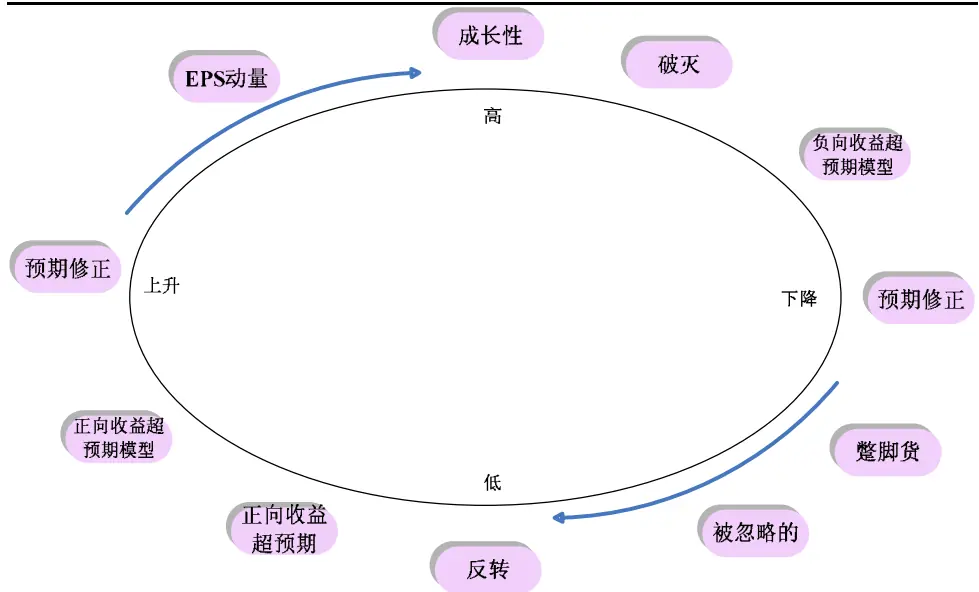
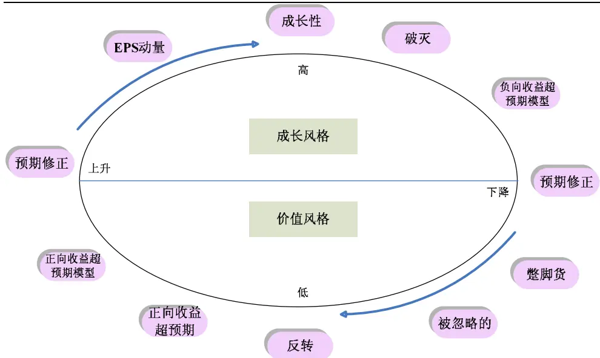
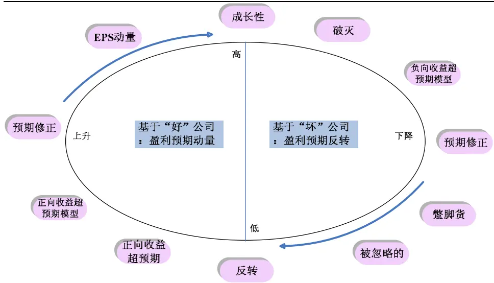
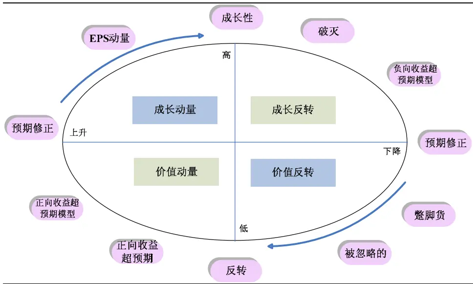
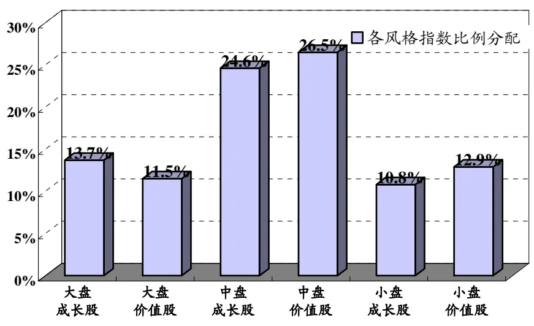

2008.9.9

# 风格投资Ⅱ：风格周期与轮动——数量化系列研究之二

蒋瑛琨

吴天宇

杨喆

21-38676710

21-38676788

21-38676442

jiangyingkun@gtjas.com wutianyu@gtjas.com yangzhe@gtjas.com

¾ 资料全面，数据翔实

本报告导读：

¾ 展示国外投研机构的主流研究、成果与观点

¾ 进一步实证研究，见关于风格研究的后续报告

## 摘要：

风格投资的周期表现：（1）风格可以按照多重标准划分。Farrell(1975)发现全体股票至少包括四种风格“簇”：成长型、周期型、稳定型和能源型。四种类型股票存在轮动现象，必须要达到 80%以上对未来风格走势的预测准确性，才能弥补由于预测不准所带来的风险成本。不完美的风格走势预测将导致风格转换收益比不上风格固定比例组合。（2）SalomonBrothers Inc.的报告显示，美国、日本市场上，不同规模组合在不同经济条件下的收益表现呈现出周期变换，且对于某一经济因素的变化，美、日市场呈现出一致性。可以从经济周期、反应过度/不足、价值回归等角度解释。（3）从多国家、长区间的结果看，价值股表现优于成长股的概率更大，但仍有成长股表现好的证据。这预示风格转换仍有研究价值。可以从反应过度/不足与价值回归、经济指标等解释。

Berstein(1993)提出的盈利预期生命周期模型(Earnings ExpectationsLife Cycle)。（1）该模型刻画了投资者对盈利预期演化的各个阶段。各阶 段 特 征 包 括 反 转 (Contrarians) 、 正 向 收 益 超 预 期 (Positive EarningSurprises)、正向收益超预期模型(Positive Earning Surprise Models)、预期修 正 (Estimate Revisions) 、 EPS 动 量 (EPS Momentum) 、 “ 成 长性”(“Growth”)、破灭(Torpedoed)、负向收益超预期模型(Negative EarningSurprise Models)、预期修正(Estimate Revisions)、蹩脚货(“Dogs”)、被忽略的(Neglect)。（2）Berstein 按照此盈利预期生命周期模型，区分了成长风格和价值风格的投资者。成长风格的投资者一般对投资标的有较高的预期，而与之对应，价值风格的投资者对投资标的的预期较低。（3）Berstein 还区分了基于“好”公司和“坏”公司的投资策略，我们也可以理解为基于盈利预期动量和盈利预期反转策略。基于“好”公司的投资策略寻找那些处于预期上升阶段的公司，而不管盈利预期较好或较坏，只要预期改善即可；而基于“坏”公司的投资策略则“高买低卖”，即在预期最乐观的时候卖出，在最悲观的时候买入。将以上两种划分结合起来，就可以得到四种风格策略：成长动量、成长反转、价值动量和价值反转。

风格预测与配置：（1）风格评估和预测方法可分为相对价值法和场景预测法两类，其代表人物是彼得林奇和索罗斯。（2）积极的风格转换策略有助于提高投资绩效。风格转换主要涉及到两个问题，即，在何时进行风格转换，以及风格转换能否弥补交易成本。可用标准 Logistic 模型预测。（3）风格配置的例子：BARRA 风格分析系统。其主要思路是，将组合收益率对各种风格指数收益率进行回归，然后根据回归系数将组合收益率在不同风格指数间进行分配。我们给出了该公司过去的风格配置案例。

本报告包括正文 11页，图 5 张，表 10张

## 1. 风格周期表现

## 1.1.多重特征的风格轮换

投资风格种类是根据某类股票的共同收益特征或共同价格行为来区分的。股票市场具有各种子市场，股票可以被分为大盘/小盘型和价值/成长型，也可以被分为周期型/非周期型，还可以按行业、板块等属性来划分，得到更为清晰的类别划分。一个股票可以同时属于价值股、周期类、能源类。这种结合了多重属性的划分方法能对股票特性描述得更精确，因此能获得更高的收益率。Bruce Jacobs andKenneth Levy（1999）的研究表明，在 1990-1994 年期间，基于多重标准的风格轮换组合能获得比基于单一股票指数的风格轮换组合高出 2.78%的收益率，夏普比率为 0.58，高于风格指数 0.54的水平。

Farrell(1975)早在 70年代就发现全体股票至少包括四种风格“簇”：成长型、周期型、稳定型和能源型。后来他又发现，四种类型股票存在轮动现象，在不同时期，只要投资于收益率最高的这类股票组合，就能获得高于市场组合的收益率。

表 1 1971-1991年间各组合收益率（%）

| 时间区间 | 成长型 | 能源型 | 周期型 | 稳定型 | 标普 500 指数 | 风格轮换 净收益率 |
| --- | --- | --- | --- | --- | --- | --- |
| 1970/12-1972/06 | 48.50 |  |  |  | 21.70 | 26.80 |
| 1972/06-1973/06 |  | 22.50 |  |  | 0.20 | 22.30 |
| 1973/06-1974/06 |  |  | 8.50 |  | -14.50 | 23.00 |
| 1974/06-1975/06 |  |  |  | 45.00 | 12.40 | 32.60 |
| 1975/12-1976/12 |  |  | 41.00 |  | 24.00 | 17.10 |
| 1976/12-1980/12 |  | 85.00 |  |  | 48.00 | 37.00 |
| 1978/12-1983/12 |  |  |  | 56.00 | 42.00 | 14.00 |
| 1980/12-1984/12 |  | 17.00 |  |  | 6.00 | 11.00 |
| 1983/12-1985/12 |  |  |  | 41.00 | 32.00 | 9.00 |
| 1984/12-1987/12 |  |  | 40.00 |  | 25.00 | 15.00 |
| 1985/12-1988/12 |  | 28.00 |  |  | 17.00 | 11.00 |
| 1988/12-1991/12 | 89.00 |  |  |  | 66.00 | 23.00 |

数据来源：James L Farrell,“Portfolio Management: Theory and Applications”, McGraw-Hill/Irwin; 2 edition,1996.

Farrell的研究基于几个假设：（1）全部资金投资于四类股票中的某类；（2）没有交易成本：（3）对各类股票未来收益率完美预测，即显示了所能获得的最大潜在收益。

在实际操作中，考虑到交易成本的因素，只需要调整投资组合中这四类股票的权重，投资组合向某个风格倾斜即可。但这样获得的收益会低于将全部资产投资于其中一类股票。另外，是否能够准确地预测风格走势，是保证风格投资收益的关键。Fama、French 与 Alliance 资本管理公司对美国股票交易所 1980-2001 年的数据进行了实证研究，显示不同的风格预测准确性带来的不同收益。

表 2 1980-2001年间美国股票交易所不同预测准确性下的年均收益率

| 预测准确性 | 年均收益率 |
| --- | --- |
| 100% | 22.8% |
| 75% | 12.4% |
| 50% | 10.2% |
| 50/50 价值/成长组合 | 15.9% |

数据来源：www.bernstein.com

结论显示，必须要达到 80%以上对未来风格走势的预测准确性，才能弥补由于预测不准所带来的风险成本。不完美的风格走势预测将导致风格转换收益比不上风格固定比例组合。

## 1.2.大小盘股的轮换周期

## 1.2.1. 周期变换

Banz(1981)发现小市值股票相对于大市值股票有较高的 β调整预期收益。Fama andFrench(1992)通过研究 1963-1990 年的数据发现，股票市值和非金融类股票的风险调整收益具有显著相关性。

来自 Salomon Brothers Inc.的一份报告显示，美国、日本市场上，不同规模组合在不同经济条件下的收益表现呈现出周期变换，且对于某一经济因素的变化，美、日市场呈现出一致性。其中，对美国、日本市场的研究区间分别是 1960-1995年、1974 年-1995 年。

表 3 不同经济条件下规模效应的比较——谁表现更好？

| 市场情况 | 美国 日本 |
| --- | --- |
| 经济高增长 | 小盘股 小盘股 |
| 经济低增长 | 大盘股 大盘股 |
| 货币走强 货币趋软 | 小盘股 小盘股 大盘股 NA |
| 股市高波动 | 大盘股 大盘股 |
| 股市低波动 | 小盘股 小盘股 |
| 短期利率上升 | NA 小盘股 |
| 短期利率下降 | NA 大盘股 |
| 长期利率上升 | 小盘股 小盘股 |
| 长期利率下降 | NA NA |

数据来源：Salomon Brothers Inc.
注：NA表明没有结果。

在不同经济指标组合之下，大盘股与小盘股的相对表现，则取决于不同因素相对影响力量的强弱。(1)通货膨胀率的高低对美国、日本不同规模股票的影响主要取决于另一因素——经济增长速度。经济高增长情况下，小盘股表现优良的概率大于 50%，经济低增长情况下则不到 50%，即大盘股表现会更好。(2)汇率走势对美国、日本不同规模股票的影响也同样受制于经济增长速度。经济高增长时，即使货币走软，小盘股也有 50%以上的概率会表现更好；而当经济低增长时，不论货币强势与否，小盘股都不再有优异表现。(3)股市的波动性则与经济增长速度呈现出交互作用。经济高增长时，不论股市如何波动，小盘股有较好表现；经济低增长时，股市高波动会使小盘股表现较差。而且，股市低波动的影响在美、日市场并不一致，美国市场小盘股表现较好，而日本市场大盘股表现较好。

表 4 不同指标组合下小盘股表现优于大盘股的概率

| 不同指标组合 | 小盘股表现优良概率 |  |
| --- | --- | --- |
|  | 美国 | 日本 |
| 经济高增长 (高于最高的 四分位数） | 高通货膨胀 | 68% 68% |
|  | 低通货膨胀 | 70% 79% |
|  | 货币走强 | 79% 81% |
|  | 货币趋软 | 50% 65% |
|  | 股市高波动 | 62% 68% |
|  | 股市低波动 | 71% 82% |
| 经济低增长 (低于最低的 | 高通货膨胀 | 39% 49% |
|  | 低通货膨胀 | 44% 29% |
|  | 货币走强 | 42% 34% |
|  | 货币趋软 | 30% 34% |
| 四分位数） | 股市高波动 | 27% 18% |
|  | 股市低波动 | 79% 49% |

数据来源：Salomon Brothers Inc.，国泰君安研究所整理

## 1.2.2. 经济解释

z 经济周期。宏观经济表现强劲时，小市值公司有一个较好的发展环境，易于成长壮大，甚至还会有高于经济增速的表现，因此，小盘股表现突出的概率高于大盘股。而当经济走弱时，由于信心的匮乏和未来市场的不确定性，投资者可能会倾向于选择大盘股，起到防御作用，即使低通货膨胀、货币走强，也不足以去冒险去选择小盘股。Pradhuman and Bernstein(1994)研究发现，经济名义增长率是用来解释规模效应市场周期的有力变量。当名义增长率提高时，小市值组合表现更优，因为小公司对宏观经济变动更为敏感，当工业生产率提高、通货膨胀率上升，小公司成长更快。

反应过度/不足。Fama and French(1995)认为风格的周期性轮换是由于投资者的趋势追逐特性造成的。当某类风格的股票在某段时间内具有较好走势时，趋势投资者就会增加对该风格资产的投资，风格走势得以延续。但过度反应会使得该种风格的股票积累过多风险，泡沫最终破灭，形成了不同风格的周期性表现。

价值回归。过度反应的最后结局还是泡沫破灭，而反应不足最终也会被市场纠错，这是由于价格最终要向价值回归的本质决定的。这也为我们研究风格策略提供了方向。通过研究某一风格的股票价格是否远离其价值，且扣除手续费等费用后有足够的利润空间，来给出策略建议。

## 1.3.价值成长的轮换周期

## 1.3.1. 价值与成长股的相对表现

Robert Arnott, David and Christopher 研究了将 1 美元分别投至美国、英国、日本、加拿大及德国的价值股和成长股（以简单市净率 P/B 分类），在 1975 年 1 月-1995年 6 月期间，五个国家的价值股月度收益率超过成长股的比例均大于等于 55%，最高值为 61%。从多国家、长区间的结果看，价值股的表现优于成长股的概率更大。

表 5 1975年 1月-1995年 6月期间 1美元投资的收益比较

| 国家 | 1 美元投资的增长 |  | 价值股月度收 益率超过成长 股的比例 |
| --- | --- | --- | --- |
|  | 价值股（美元） | 成长股（美元） |  |
| 美国 | 23 | 14 | 55% |
| 英国 | 42 | 24 | 56% |
| 日本 | 37 | 10 | 61% |
| 加拿大 | 12 | 5 | 61% |
| 德国 | 14 | 9 | 55% |

数据来源：Exhibit 10 in David J. Leinweber,Robert D.Arnott,and Christopher G. Luck,“The Many Sides of Equity Style:Quantitative Management of Core,Value and Growth Portfolios,”Chapter 11 in T.Daniel Coggin,Frank J.Fabozzi,and Robert D.Arnott(eds.),The Handbook of Equity Style Management:Second Edition(New Hope,PA:Frank J.Fabozzi Associates,1997),p.188。

Richard Roll 用三个分类变量即市值大小、收益价格比(E/P)、净资产价格比(B/P)来区分价值股和成长股。研究对象是所有在纽约股票交易所和美国股票交易所上市的股票，按市值、E/P和 B/P的高低分为八组，每月根据风格分类变量的判断值对风格组合中股票进行调整。在 1984 年 4 月-1994 年 3 月的考察期间内，有三个组合的收益跑赢了标普 500指数，结论和 Robert等人的研究较为一致。长期来看，还是价值股组合表现最为优越。

表 6 1984年 4月-1994年 3月期间 1美元投资的收益比较

| 组合类别 | 1 美元增长（美元） | 市值 | E/P | B/P |
| --- | --- | --- | --- | --- |
| 小盘+价值 | 6.85 | 低 | 高 | 高 |
| 大盘+价值 | 5.34 | 高 | 高 | 高 |
| 小盘+混合 | 5.15 | 低 | 高 | 低 |
| 标普500 | 3.96 | - | - | - |
| 大盘+混合 | 3.49 | 高 | 高 | 低 |
| 大盘+成长 | 3.05 | 高 | 低 | 低 |
| 大盘+混合 | 2.76 | 高 | 低 | 高 |
| 小盘+混合 | 2.02 | 低 | 低 | 高 |
| 小盘+成长 | 1.64 | 低 | 低 | 低 |

数据来源：Richard Roll,“Style Return Differentials:Illustrations,Risk Premiums,or Investment Opportunities,”Chapter 5 in T.Daniel Coggin,Frank J.Fabozzi,and Robert D.Arnott(eds.),The Handbook of Equity Style Management:Second Edition(New Hope,PA:Franck J.Fabozzi Associates,1997),p.102。

为何价值股表现更好？（1）可能有尚未考虑的风险存在。价值股超过成长股的溢价可能只是对未考虑的风险的补偿。尽管 Roll用 CAPM模型和因素模型对收益率进行了风险调整，但是仍不排除有其他风险存在的可能性。（2）预期偏差。ScottBauman and Robert Miller 考察收益预测发现 P/E 比率最低的股票被低估，而 P/E 比率最高的股票被高估，低 P/E的股票是价值型，其收益被低估，那么股价表现就会比预期要好，对于成长股也类似。Bauman and Miller认为计算预期收益时过分依赖以往较短时间内的收益趋势是造成预期偏差产生的原因。

虽然上述研究均证明，长期来说，价值股的表现优于成长股，但仍有成长股表现好的证据，Robert等人的研究表明，1975年 1月-1995年 6月期间，在美国、英国、日本、加拿大及德国五国，有 39%-45%的概率成长股表现更好。

在美国市场，两种风格都有表现好和不好的时期，在 1985-1995年间，有 6年是成长型基金表现更出色，有 5 年价值型基金表现更好，两种风格呈现周期轮换，且每期都有至少一种风格基金的收益率高于股票共同基金平均年收益。

表 7 成长型和价值型基金收益呈现周期轮换，每年至少一种风格基金收益高于股票共同基金平均年收益（1985-1995年，单位：%）

| 年份 | 成长型基金 平均年收益 | 价值型基金 平均年收益 | 收益率差值 (成长-价值) | 股票共同基金 平均年收益 |
| --- | --- | --- | --- | --- |
| 1985 | 29.7 | 28.3 | 1.4 | 28.7 |
| 1986 | 13.5 | 15.4 | -1.9 | 14.7 |
| 1987 | 1.4 | -0.4 | 1.8 | 1.2 |
| 1988 | 13.9 | 18.5 | -4.6 | 15.8 |
| 1989 | 30.1 | 20.8 | 9.3 | 25.3 |
| 1990 | -4.2 | -8.6 | 4.4 | -5.7 |
| 1991 | 49.7 | 30.9 | 18.8 | 37.0 |
| 1992 | 7.5 | 12.1 | -4.6 | 9.3 |
| 1993 | 13.0 | 14.1 | -1.1 | 12.8 |
| 1994 | -1.7 | -1.3 | -0.4 | -1.5 |
| 1995 | 32.4 | 28.9 | 3.5 | 30.9 |

数据来源：Richard Bernstein, Style Investing: Unique Insight into Equity Management,1995.

历史数据表明，价值和成长投资风格组合的业绩表现具有周期性，且表现优异的价值型基金和成长型基金往往在次年表现不佳。在 1975-1995年间，分别选出美国市场成长型和价值型基金收益最高的 5个年份，将次年收益进行对比，5年中有 4年，当年收益最高的成长型基金次年表现落后于价值型基金；价值型基金收益的延续性稍好，当年收益最高的价值型基金，5年中有 3年，次年表现高于成长型基金。这预示风格转换仍有研究价值。只要能够把握风格变换的规律，找出风格转折点或是找到能预示风格将要进行切换的系列指标，就能对实际投资起到较好指导作用。

表 8 1975-1995年间，成长型和价值性基金收益最高的 5年及次年收益（单位：%）

| 年份 | 成长型基金收益率 |  | 年份 | 价值型基金收益率 |  |
| --- | --- | --- | --- | --- | --- |
|  | 当年 | 次年 |  | 当年 | 次年 |
| 1975 | 40.2 24.0* | 1975 |  | 39.5 | 37.5* |
| 1979 | 35.2 | 33.6 | 1976 | 37.5* | 3.0 |
| 1991 | 33.7 | 4.9* | 1985 | 29.1* | 19.1* |
| 1980 | 33.6 | 2.5* | 1983 | 26.2* | 7.5* |
| 1982 | 31.0 | 23.7* | 1979 | 25.5 | 25.4 |

数据来源：Richard Bernstein, Style Investing: Unique Insight into Equity Management,1995.注：“*”表示价值型基金收益率高于成长型基金

## 1.3.2. 经济解释

z 反应过度/不足与价值回归。对于大小盘股周期变换的原因，我们曾提到，投资者趋势追逐导致价格偏离于价值，而价格最终必向价值回归，因此产生了风格周期的轮换，这同样可用于解释价值与成长股周期轮换的原因。

经济指标。（1）经济景气度和盈利动量。当经济衰退时，只有少数公司在成长，投资者则愿意持有这些稀有股票；当经济不景气时，多数公司都在成长，投资者就不会为成长股支付高价。（2）利率曲线的斜率.Bernstein(1991)认为利率曲线的斜率也可用作额外风险指标来判断该选择何种风格的股票。利率水平通过久期和利率敏感性来影响股票，一般来说，价值投资组合的平均久期为 24.9年，而成长组合的久期为 29.9年，标普 500指数的久期约为 27.8年。（3）股利支付率，是管理层向市场传递信息的信号。历史经验表明，当股利支付率较高时，价值投资会超越增长投资；反之，当股利支付率较低时，表明高的盈余收益将用来支持企业成长，成长型投资就会超越价值投资。（4）收益率曲线的斜率。Harrey(1989、1993)指出收益率曲线的斜率是对未来经济增长的精确预测，用长期国债到期收益率和短期国债折现率描绘的债券收益曲线的斜率可看作对未来名义增长率的预测。

表 9 成长/价值投资表现和收益率曲线的斜率

| 收益曲线 | 各类型表现 | 原因 |
| --- | --- | --- |
| 平坦到反向 | 成长投资表现相对领先 | 经济发展受阻 |
| 反向到平坦 | 成长投资表现相对领先 | 过于紧缩的经济 |
| 平坦到陡峭 | 价值投资表现相对领先 | 刺激经济 |
| 陡峭到平坦 | 价值投资表现相对领先 | 过于宽松的经济 |

数据来源：Merrill Lynch Quantitative Analysis

## 2. 盈利预期生命周期模型

Richard Berstein(1993)提出了盈利预期生命周期模型(Earnings Expectations LifeCycle)。该模型刻画了投资者对盈利预期演化的各个阶段。Berstein 认为，几乎所有的股票都会经历上述的部分阶段，不过并非任何股票都要完整经历所有阶段，而且不同股票经历盈利预期生命周期循环的速度不同。此外，在子阶段中也可能存在完整的盈利预期循环。

图 1 盈利预期循环周期

数据来源：Bernstein, Richard,"Style Investing: Unique Insight into Equity Management",John Wiley & Sons,1995.

## 2.1.盈利预期循环各阶段

对各阶段的特征分述如下：

（1）反转(Contrarians)：反转策略投资于具有较低盈利预期的股票。多数投资者认为这些股票不具有吸引力或风险过高。

（2）正向收益超预期(Positive Earning Surprises)：具有较低预期的公司开始发布稍微乐观的信息；股票重新获得投资者的注意；对于这些股票的研究覆盖开始增多。

（3）正向收益超预期模型(Positive Earning Surprise Models)：基于实际盈利和分析师预期有显著正向差异的选股模型。传统的正向收益超预期模型指持有股票直至实际盈利发布，这样就从盈利预期生命周期模型的第 3阶段过渡到了第 2阶段。

（4）预期修正(Estimate Revisions)：随着正向的收益超预期，市场一致预期开始调升盈利水平。部分分析师的滞后调整是因为他们不愿相信这种超预期意味着基本面的改变。

（5）EPS动量(EPS Momentum)：盈利动量策略的投资者基于预期和实际盈利的增长，以及 EPS的年度同比增加而买入股票。

（6）“成长性”(“Growth”)：当强劲的盈利动量持续相当长一段时间时，股票被认为具有“成长性”。这些股票既不是像在第 4或第 5阶段那样，属于被先知先觉的投资者新挖掘的成长股；也不是使得商业环境改变的真正的成长性公司。不过，大多数投资者认为这些股票具有较优秀的特质，这些股票的盈利预期非常高，因此也是盈利预期生命周期模型中不符合预期的风险最高的阶段。反转策略的投资者认为此时是抛售的最佳时机。

（7）破灭(Torpedoed)：公司开始达不到盈利预期。盈利预期和股价开始崩塌。

（8）负向收益超预期模型(Negative Earning Surprise Models)：和第 3 阶段相对应，不过此时实际盈利和分析师预期有显著负向差异，这些股票是最好的卖出对象。

（9）预期修正(Estimate Revisions)：随着负向的收益超预期，市场一致预期开始调低盈利水平。同样，部分分析师的滞后调整是因为他们不愿相信这种低于预期意味着公司基本面的改变。

（10）蹩脚货(“Dogs”)：当公司实际盈利持续低于盈利预期一段时间后，投资者开始回避这些股票。有关并购、重组或破产的谣言会使得股价发生短期波动，但投资者会尽量回避这些股票。

（11）被忽略的(Neglect)：投资者对这些股票兴趣索然，研究机构认为毫无覆盖的价值而将其剔除。缺乏相关的研究信息也许意味着一个新周期的开始。

## 2.2.盈利预期周期模型-价值成长

Berstein按照此盈利预期生命周期模型，区分了成长风格和价值风格的投资者。成长风格的投资者一般对投资标的有较高的预期，而与之对应，价值风格的投资者对投资标的的预期较低。因此，成长风格和价值风格的投资者分别处于生命周期模型图的上半部分和下半部分。

图 2 盈利预期循环周期-价值成长风格

数据来源：Bernstein, Richard,"Style Investing: Unique Insight into Equity Management",John Wiley & Sons,1995.

## 2.3.盈利预期周期模型-盈利预期动量反转

根据盈利预期生命周期模型，Berstein 还区分了基于“好”公司和“坏”公司的投资策略，我们也可以理解为基于盈利预期动量和盈利预期反转的投资策略。基于“好”公司的投资策略寻找那些处于预期上升阶段的公司，而不管盈利预期较好或较坏，只要预期改善即可；而基于“坏”公司的投资策略则“高买低卖”，即在预期最乐观的时候卖出，在最悲观的时候买入。因此，基于“好”公司和“坏”公司的投资策略，分别处于生命周期模型图的左半部分和右半部分。

图 3 盈利预期循环周期-动量反转

数据来源：Bernstein, Richard,"Style Investing: Unique Insight into Equity Management",John Wiley & Sons,1995.

## 2.4.价值成长-盈利预期动量反转结合

图 4 盈利预期循环周期-价值成长+动量反转

数据来源：Bernstein, Richard,"Style Investing: Unique Insight into Equity Management",John Wiley & Sons,1995.

将以上两种划分结合起来，就可以得到四种风格策略：成长动量、成长反转、价值动量和价值反转。

## 3. 风格预测与配置

## 3.1.传统的风格预测方法

实施风格轮换战略，在不同的风格类别之间进行切换，需要对各类风格的收益特性有较好的把握和对未来风格走势有较准确的判断。风格评估和预测的方法可分为相对价值法和场景预测法两类，其典型的代表人物是彼得林奇和索罗斯。

相对价值法的核心是均值回归理论，被低估的股票价格最终将被市场发现而向均值回归，被高估的股票价格也将下跌至均值水平。能获得低估或高估收益的投资者，必然是对某类股票、企业有着长期的追踪研究并具备价值发现能力的投资者。当市场出现价格偏差时，能在第一时间发现并调整组合，及时判断出市场未来走势。

场景预测法的核心是，同一风格股票的收益率间存在某种相似属性和因素敏感性，因此当外部环境发生变化时，受某类因素正面影响的风格类型将取得超额收益，反之则会获得低于市场的收益。场景预测法可分为两个步骤：1）对影响股票收益的各个因素建立因素模型；2）设想未来可能出现的不同场景，对未来风险状况进行预测。

## 3.2.风格轮动的定量预测

由于市场风格轮动，保持单一的投资风格并不一定是最佳的投资策略，积极的风格转换策略有助于提高投资绩效。风格转换主要涉及到两个问题，即，在何时进行风格转换，以及风格转换能否弥补交易成本。

风格转换策略模型实际上是在建立了一系列基本预测变量的基础上、寻找一个适用于风格转换的合理模型。从已有文献看，主要有四类方法：（1）将风格相对收益率对相关变量进行回归。但由于建立精确关系较为困难，因此这种方法基本被排除。（2）Markov Switch模型。该模型主要关注相对收益率的历史表现（按照 Levist的变量分类办法，这些指标主要是技术变量），并不关注其他基本经济变量，因此这种方法可能遗漏了很多可用信息。（3）Logistic概率模型。在任意时点，风格转换的结果无非有二种，即转换或不转换。如果预期下期某类风格占优，则将现有风格转化为占优的风格。这种方法的应用更为广泛，如 Gokani 和 Todorovic 等均采用了这种方法。

标准 Logistic 模型如下：

$$
p_{t}=P(y_{t+1})=1-e^{-x_{i}^{\prime}\beta}\sqrt{(1+e^{-x_{i}^{\prime}\beta})}
$$

其中，如果构建期后一月份的某风格（如价值股）收益率大于另一风格（如成长股）收益率，则 $y_{t+1}=1$ ，否则 $y_{t+1}=0$ 。建立递归预测方法，当构建期往后延伸时，则形成时间序列 $y_{1},y_{2},\cdots,y_{T}$

在建立 Logistic预测模型前，需要首先选择 n个可能的影响因素（宏观、基本面与技术面等），这可以通过逐步回归、主成分分析等方法选择。然后，利用 Y对 n个解释变量建立多元 Logistic 回归模型。可采用 Jackknife method 等检验方法对多元Logistic模型的稳定性进行检验，并确定模型最佳的判别点。比较按最佳判别点确定的风格转换策略所获得的收益，是否大于任何简单的买入并持有策略，若难以超越，则认为简单的买入持有策略为最佳策略，若超过，则考虑交易成本后的最佳转换风格的交易策略。

## 3.3.风格配置的例子：BARRA风格分析系统

BARRA 公司在夏普（1998）风格鉴别方法的基础上，开发了风格分析系统，其主要思路是：将组合收益率对各种风格指数收益率进行回归，然后根据回归系数将组合收益率在不同风格指数间进行分配。例如，在到 1985年 2月为止的三年时间里，股票组合主要由中盘价值股和小盘价值股组成，但到 1987年为止，组合的 67%由大盘成长股组成，另有 28%的大盘价值股和不到 5%的中盘价值股。到 1994年末，组合主要由 44%的中盘成长股和 38%的小盘价值股组成，另有 15%的大盘价值股和不超过 4%的小盘成长股。

表 10 BARRA 风格分析系统的股票组合构成

| 时间 | 组合主要构成 | 其他构成 |
| --- | --- | --- |
| 1985年2月止 | 中盘价值股、小盘价值股 | 中盘成长股 |
| 1987年止 | 大盘成长股、大盘价值股 | 中盘价值股 |
|  | 中盘成长股、小盘价值股 | 大盘价值股、 |
| 1994年止 |  | 小盘成长股 |

数据来源：BARRA

1982-1994年间，BARRA的风格系统在价值型和成长型两种风格的配置比例大约都是 50%，并未显示偏向于价值型和成长型股票中的任何一种，但这一策略事实上偏重于中等市值和小市值的公司，大盘股、中盘股和小盘股的分配比例分别是25%、51%和 24%。

图 5 1982-1994年间风格转换策略在不同风格指数之间分配比例的平均值

数据来源：BARRA

## 作者简介：

蒋瑛琨: 现任研究所金融工程部经理，吉林大学数量经济学博士，CPA，2006 年《新财富》“衍生品”最佳分析师第二名(团队)。2005 年加入国泰君安证券研究所，从事股指期货、权证等金融衍生品以及金融工程研究，发表多篇深度报告。

吴天宇：上海财经大学经济学硕士，2006年加入国泰君安研究所，目前从事金融工程研究。

杨喆：同济大学计算机科学与技术专业学士，金融学专业硕士，目前从事金融工程和衍生产品研究。

## 免责声明

本报告的信息均来源于公开资料，我公司对这些信息的准确性和完整性不作任何保证，也不保证所包含的信息和建议不会发生任何变更。我们已力求报告内容的客观、公正，但文中的观点、结论和建议仅供参考，报告中的信息或意见并不构成所述证券的买卖出价或征价，投资者据此做出的任何投资决策与本公司和作者无关。

我公司及其所属关联机构可能会持有报告中提到的公司所发行的证券头寸并进行交易，也可能为这些公司提供或者争取提供投资银行、财务顾问或者金融产品等相关服务。

本报告版权仅为我公司所有，未经书面许可，任何机构和个人不得以任何形式翻版、复制和发布。如引用、刊发，需注明出处为国泰君安证券研究所，且不得对本报告进行有悖原意的引用、删节和修改。

## 国泰君安证券研究所

上海

上海市银城中路 168号上海银行大厦 29层

邮政编码：200120

电话：（021）38676666

深圳

深圳市罗湖区笋岗路 12号中民时代广场 A座 20楼

邮政编码：518029

电话：（0755）82485666

北京

北京市西城区金融大街 28号盈泰中心 2号楼 10层

邮政编码：100140

电话：（010）59312799

国泰君安证券研究所网址： www.askgtja.com

E-MAIL：gtjaresearch@ms.gtjas.com