2008.9.16

# 海外机构数量化投资的发展

# ——数量化系列研究之四

蒋瑛琨

杨喆

21-38676710

吴天宇

21-38676442

张权

21-38676788

(实习)

jiangyingkun@gtjas.com yangzhe@gtjas.com

wutianyu@gtjas.com

¾ 深入比较了数量化与传统投资策略

本报告导读：

¾ 详细介绍了Columbine Capital Services公司各类数量化模型及业绩

## 摘要：

主动型投资策略分为传统型与数量化投资策略。传统投资的缺点表现在：受到人类思维可以处理的信息量的限制；受到认知偏差的影响；更强调收益率而不是风险控制，更加偏重个股挖掘而不是组合构造。数量化投资的优势表现在：范围可覆盖整体市场；可在有效控制风险的同时、实现收益最大化；避免认知偏差的干扰，决策效率高而管理成本低等。

根据 Vanguard Investment Counseling & Research，96-05 年间，数量化基金的风险调整业绩优于另两类基金。运用不同投资策略的组合收益有别于基准收益的原因，即影响投资组合期望追踪误差的关键因素。

数量化基金（Quantitative funds）的数量正逐年大幅增加。除 BarclaysGlobal Investors 和 LSV Asset Management 这两家目前最大的数量化基金管理公司外，还有 Vanguard，American Century，Evergreen 等投研机构加入行列。Columbine Capital Services，Ford Equity Research等卖方研究机构也逐渐重视数量化模型的研究与使用。

Columbine Capital Services 是为基金等大型机构投资者提供数量化研究和咨询服务的独立研究机构。数量化模型可分为三大类(threefamilies)：（1）成份模型：Columbine Alpha Factor，Expectational Model，Momentum Model，Valuation Model，Industry Momentum；（2）个股选择模型：Combo Model，Sector Model，Core Model，Small-CapModel，Growth Model，Value Model；（3）国际化模型：InternationalColumbine Alpha；International Combo Model。我们对模型进行了详细介绍。

Columbine 公司的数量化模型近 4 年来的绩效表现基本都保持稳定的选股有效性。在 08年 2-4月、08年 1-4月、07年 5月-08年 4月，11 个模型中，仅有 1-2 个模型的优-差组合收益差为负，即绝大部分模型均能正确判断未来走势，获得正收益。

但在 07 年 8 月，11 个模型中有 5 个模型 Top-Bottom 组合收益差为负。更严重的情形发生在 08年 1月，11个模型仅有 2个没有亏损。这可从模型参数陈旧、预测准确性不足、模型过于相似等角度解释。

实践证明，当金融风暴来临时，运用数量化投资策略应对危机的反应速度不足以使其免遭损失，但具备较强调整能力的数量化模型一般都能在未来一段时间内在一定程度上挽回损失。

本报告包括正文 16页、表 5 张、图 25张。

## 1. 数量化与传统投资策略的比较

## 1.1.传统投资策略的缺点

投资策略一般可分为主动型投资策略和被动型投资策略，被动型投资即一般所说的指数化投资，而主动型投资策略又可分为传统型投资策略和数量化投资策略。

图 1 投资策略分类
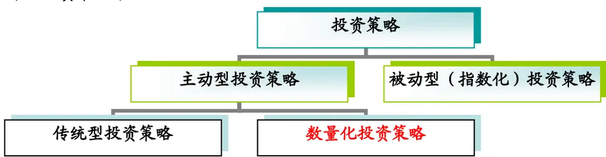
数据来源：国泰君安证券研究所

所有的主动型基金经理都试图战胜市场以期获得超过市场基准的超额收益。然而，传统的主动型基金经理的绩效一般都很难达到期望值，这也许印证了有效市场理论（EMH）的观点——市场是无法被超越的。但是，我们可以从另外一个角度去思考这个问题，传统主动型投资策略有时的失败也许并不是因为无法超越市场效率的限制，而是由于其本身内在的缺点所致。

传统主动型投资策略受到人类思维可以处理的信息量的限制。人类思维在任何时候都只能考虑有限数目的变量，因此对任何一个基金管理者来说，对大量股票都进行深入分析是不现实的。例如，对于 600支的股票样本，被一个传统主动型基金经理紧密跟踪的也许只包括 200 支。这样就会明显排除从其他股票获益的机会。

传统主动型投资策略容易受到认知偏差的影响。任何人的认知偏差以及根深蒂固的思维习惯都会导致决策的系统误差。例如，大多数人都只愿意记住自己成功的喜悦而不愿记住失败的教训，所以在处理问题时一般都会表现出“过度自信”。行为金融学的研究也表明，认知偏差会歪曲投资者的决策从而对其投资行为产生影响。

传统主动型投资策略更强调收益率而不是风险控制，更加偏重个股挖掘而不是投资组合构造。由于对传统主动型基金的业绩衡量基准缺乏明确的定义，相应地，对其基金经理的投资资产配置也就缺乏严格的限制，这使得基金经理倾向于偏离潜在的业绩基准，在盲目追求高收益的同时，较少考虑相应的风险控制，这也是传统主动型投资策略未能取得期望优异绩效的原因之一。

图 2 传统主动型投资的缺点

数据来源：国泰君安证券研究所

## 1.2.数量化投资策略的优势

与传统的主动型投资策略不同，数量化投资策略将人的见解和直觉、与金融理论以及数量化统计分析技术结合在一起作为研究工具，将投资思想通过具体指标、参数的设计体现在模型中，并据此对市场进行不带任何主观情绪的跟踪分析，借助于计算机强大的数据处理能力来选择股票，以保证在控制风险的前提下实现收益最大化。

## 数量化投资的优势在于：

数量化投资分析的范围可覆盖整体市场。与传统主动型投资策略选股范围有限的缺点相比，数量化管理的优势之一就是，其研究的股票池可扩大至整个市场，不必受将可选股票范围缩小到传统的特定股票子集的限制，并且对某个特定风格子集进行分析时，可以利用从所有可选股票收集到的信息、而不必局限于这种特定风格的股票。这样就使调查的广度大大增加，更有助于进行分散化投资。

数量化投资策略可以在有效控制风险的同时、实现投资组合收益最大化。数量化的证券选择和组合构造过程，实质上就是在严格的约束条件下进行投资组合构建的过程，首先从预先设定的绩效目标的角度来定义投资组合，然后通过设置各种指标参数来筛选股票，对组合实现优化，以保证在有效控制风险水平的条件下实现期望收益。换言之，数量化投资模型能够很好地体现组合收益与基准风险的匹配和一致。

z 数量化投资的其他优势。包括避免认知偏差的干扰，模型数据实时更新，决策效率高，管理成本低等。

图 3 数量化投资策略的优势
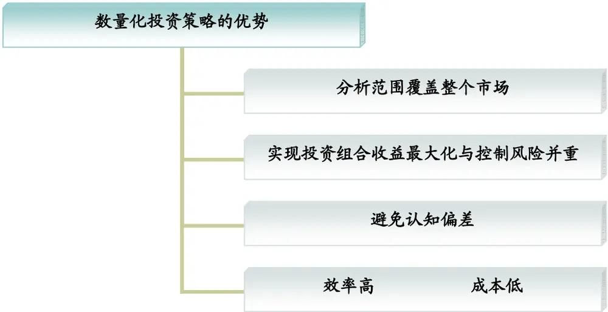
数据来源：国泰君安证券研究所

## 1.3.数量化与传统投资策略的比较

表 1显示各种投资策略差异，基于基本面选股的传统策略年追踪误差是所有策略中最高的。“与基准组合的差异”表明了运用不同投资策略的组合收益有别于基准收益的原因，即影响投资组合期望跟踪误差的关键因素。

表 1 投资策略对比：基本面选股的年跟踪误差最高，数量化选股其次

| 投资策略 | 指数化策略 (Indexing ) | 结构化策略 (Structured equity,enhanced indexing ) | 高度风险控制主 动策略（Highly risk-controlled active ) | 主动数量化策略 (Active quantitative ) | 分散化主动策略 (Diversified active ) | 专业化主动策略 (Specialty active) |
| --- | --- | --- | --- | --- | --- | --- |
| 选股方法 年跟踪误差 | 复制指数 0.20% | 数量化选股 1%-2% Structured | 数量化选股 2%-3% | 数量化选股 3%-4% | 基本面选股 3%-4% | 基本面选股 ≥4% Capital |
| 例证 | 500 Index Fund | Large-Cap Equity Fund | Growth and Income Fund | Strategic Equity Fund | Morgan™ Growth Fund | Opportunity Fund |
| 与基准组合 的差异 | 无差异 | 个股有限差异 | 个股温和差异 行业有限差异 | 个股温和差异 行业温和差异 规模/风格有限差异 | 规模/风格温和差异 择时无/有限差异 | 无约束 |

数据来源：Vanguard Investment Counseling & Research，国泰君安证券研究所整理

其中，我们对各种策略“与基准组合的差异”进行进一步分析：

个股（Security）：投资组合中某支个股的配置比例可能有别于其在基准指数组合中的配置比例。例如，一个采用主动数量化策略的基金经理可能将基金的 5%配置于某支股票，但基准指数组合在该股上的配置比例为 4%；而对一个专业化主动投资的基金经理，他的投资组合中可能根本就没有配置该股。

z 行业（Industry）：投资组合中某板块的配置比例可能有别于基准指数组合中该板块的配置比例。例如，某基金对高科技板块的配置比例为 35%，而基准指数组合中该板块的配置比例仅为 25%。

规模/风格（Size/Style）：不同的投资策略可能对股票的规模或者风格有不同侧重，这可能有别于基准指数组合。例如，某些基金经理可能更注重股票的市值规模（大、中、小市值），某些基金经理可能更注重股票的风格特性（价值、成长型），从而导致其对所偏好的风格特性的股票进行超配，这就产生了与基准指数组合的配置比例不一致的情形。

z 择时（Timing）：基金经理可能会综合分析上述三种因素，在不同的时期采用不同策略。例如，某基金经理可能根据不同板块在不同阶段的市场表现不同而采用“板块轮动”策略，超配（或低配）下阶段看好（或看淡）的板块。

图 4 投资策略风险收益对比：传统投资并未有效获得风险调整后的期望超额收益
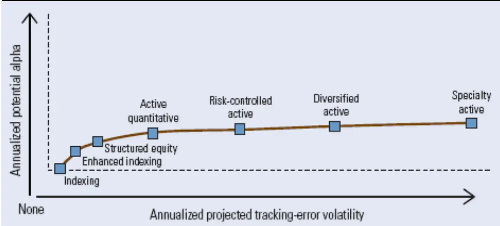

数据来源：Vanguard Investment Counseling & Research

图 4揭示了不同类型股票投资策略的组合收益与风险。横轴表示相对于组合基准的期望跟踪误差（expected tracking error），纵轴表示相对于组合基准的潜在超额收益（potential alpha）。可见，分散化主动策略（Diversified active）、专业化主动策略（Specialty active），也就是传统的主动型投资策略，在放大风险的同时并未有效地获取更高的期望超额收益。

采用不同投资策略的基金投资业绩比较如图 5所示。这里分别列示了三种类型的基金 1年期、3年期、5年期和 10年期的信息比率（information ratio），数据覆盖时间区间为 1996 年 1 月 1 日至 2005 年 12 月 31 日。第一种类型表示以 Russell 1000指数或者 S&P 500 指数为投资基准组合（benchmark）的所有传统主动型投资基金（All active funds）；第二种类型表示偏重风险控制的传统主动型投资基金（Risk-controlled traditional active funds）；第三种类型表示数量化投资基金（Quantitative active funds）。

在 1996-2005 年间，数量化基金的信息比率最高，投资业绩优于其他两种类型的基金，相对于传统的主动型投资策略，数量化投资基金能够取得更高、更稳定的超额收益（excess return）。

图 5 数量化投资策略的业绩优于传统投资策略(1996-2005)
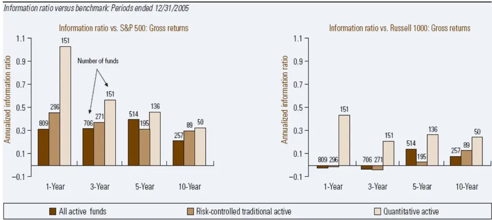
数据来源：Möbius, Vanguard Investment Counseling & Research

## 1.4.海外数量化投资的发展及趋势

近年来，数量化投资策略正受到越来越多的大型机构投资者的青睐。根据Morningstar 以及 Lexis-Nexis 的统计，数量化投资基金（Quantitative funds）的数量正逐年大幅增加。根据基金研究机构 Lipper 的统计，截至 2007 年底，对冲基金(以运用数量化策略为主)规模达 1.47 万亿美元，数量化的共同基金规模也超过600 多亿美元，较前几年规模有了成倍增加。除 Barclays Global Investors 和 LSVAsset Management这两家目前最大的数量化基金管理公司外，还有其他越来越多的投资研究机构都在积极开展数量化投资基金的研究与运作，如 Vanguard，

American Century，Evergreen 等。与之相适应的是，众多卖方研究机构，如Columbine Capital Services，Ford Equity Research，Ativo Research，When2Trade等近年来也相当重视数量化投资模型的研究与开发，并且运用这些数量化模型确实可以取得相当不错的投资业绩。

数量化基金在正常市场环境下已经被证明能带给投资者丰厚的收益，但在金融危机中，是否还能屹立不倒？或是帮助投资者将损失降低到最低程度？

早在 1998 年，长期资本管理公司的失败已经证明，数量化策略和数量模型并不能被完全信赖，即使是最严密的模型也有百密一疏的时候。毕竟模型苛刻的假设条件和适用条件与现实有一定差距。数量化投资策略在 2007 年以来的次贷风波中又一次向我们真实展现了其风险的一面，在遭遇金融危机时，是否能帮助投资者免遭损失?答案是否定的。但经过多次风暴洗礼，数量化研究正在逐步成熟，在 07 年风暴中，已经有一部分数量基金能够及时地改进模型以减少损失，加上数量化策略与生俱来的特点，可以看到，数量化投资仍有广阔的发展空间。从数量化策略的败因推测其未来的发展趋势，大致有三个方向，即模型数据多样化、参数市场化和定量定性相结合。

在正常市场下，数量化策略模型能很好的运作，而一旦市场发生转折，数量化模型却未必能及时捕捉市场信息。很多投资公司已开始在模型中加入更多与市场有关的变量，或是在市场发生变化时及时地调整模型，实践证明确实可以做到减少和挽回一部分损失，前提是这种修正是正确的。

数量化策略建立在现代金融理论和统计、计算机等学科基础上，帮助投资管理人更好更快地选择时机与证券，减少无谓劳动力。然而诸多例子已证明，单一的数量化策略不足以满足投资者需求。较为科学的方法是将量化策略和传统投资策略相结合，模型可发掘市场潜在获利机会，人的判断可以减少模型出错概率，定量与定性的结合或许是最佳选择。

## 2. 案例：Columbine Capital Services 的应用

Columbine Capital Services 成立于 1976 年，是为职业财富管理人和基金等大型机构投资者提供数量化研究和咨询服务的一家独立研究机构，研究范围覆盖超过6000 家美国公司和近 20000 家非美国公司，2008 年，在评级机构 Investars.com对研究机构的业绩排名榜中，Columbine Capital Services 已连续四年位列第一。

## 2.1. Columbine 公司数量化模型分类

Columbine 公司数量化模型的核心思想是：预测超额收益 Alpha。该公司研发的Alpha 预测(alpha forecasting models)数量化模型可分为三大类(three families)。

## 2.1.1. 成份模型

成份模型(Component Models)用单因素或单一收益特征来分析股票，从某一方面为投资经理提供客观、最优的评估。成份模型有 5 个子模型成员，分别

从不同的角度来预测 Alpha。
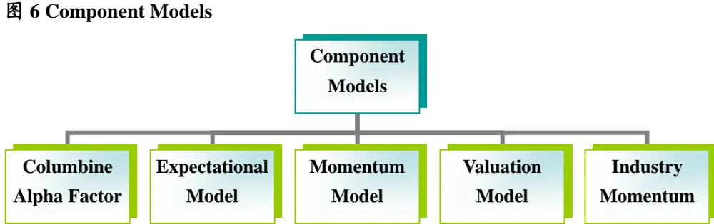
数据来源：Columbine Capital Services,Inc

Columbine Alpha Factor。用股票历史价格动量来预测未来 6-12 个月期望超额收益。使用每周个股价格变化和市场价格变化数据，用回归技术估计个股Alpha系数，然后对 Alpha进行排序以选择个股。

图 7 Columbine Alpha Factor Model
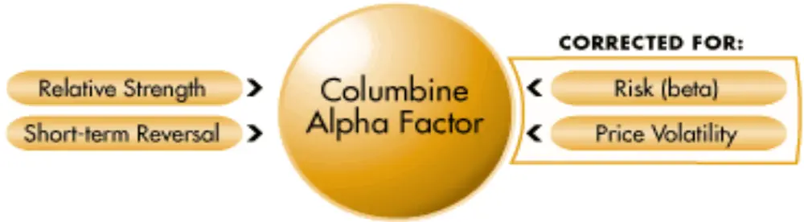
数据来源：Columbine Capital Services,Inc

Expectational Model。从卖方研究员盈利预测和修正数据来预测个股期望超额收益 Alpha。用纯粹的盈利预期，排序结果每日都有更新，且根据市场环境调整。

图 8 Columbine Expectational Model
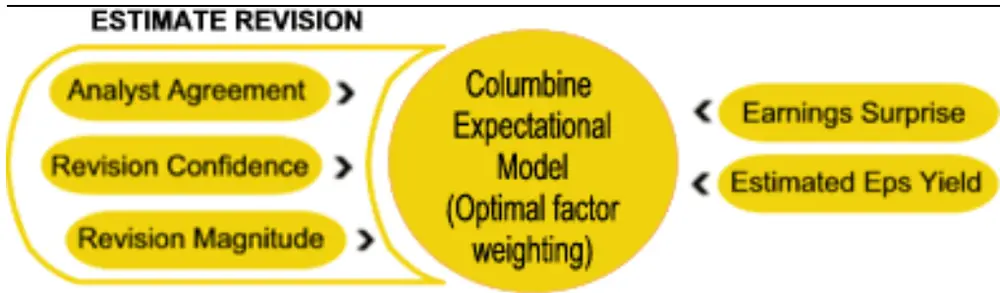
数据来源：Columbine Capital Services,Inc

z Momentum Model。使用动量因子等个股特性来综合预测个股期望超额收益Alpha。根据机构持有期限来设计，对市场环境保持更新。

图 9 Columbine Momentum Model
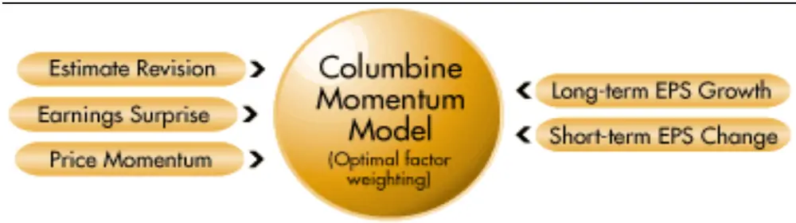
数据来源：Columbine Capital Services,Inc

z Valuation Model。使用价值因子等个股特性来预测个股期望超额收益 Alpha。根据机构持有期限来设计，对市场环境保持更新。

图 10 Columbine Valuation Model
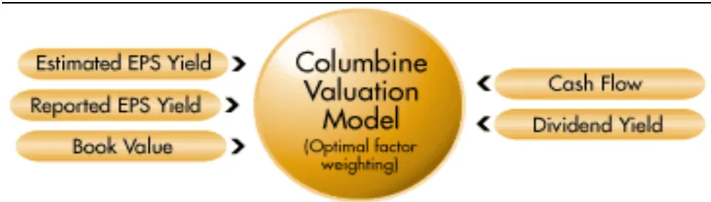
数据来源：Columbine Capital Services,Inc

z Industry Momentum。运用过去 12 个月的价格动量来预测行业和部门 Alpha。

## 2.1.2. 个股选择模型

个股选择模型（Stock Selection Models）使用多因素和多重收益特征来预测未来Alpha，选出买入和卖出个股组合。个股选择模型有 6 个子成员，每个选股模型都有其独特风格。

图 11 Stock Selection Models
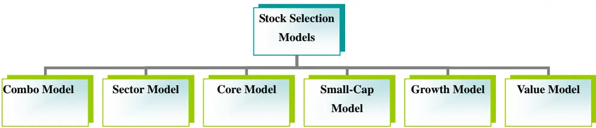
数据来源：Columbine Capital Services,Inc

z Combo Model。多因素股票选择模型，用一系列基本面和技术指标来预测未来 1-3年的个股期望超额收益 Alpha。其中价值和动量类输入指标维持平衡。

图 12 Columbine Combo Model
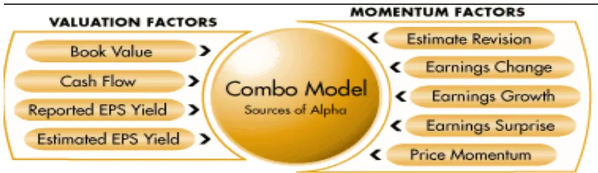
数据来源：Columbine Capital Services,Inc

Sector Model。属于不同行业或部门的公司往往具有不同的特性，因此必须用不同的标准来衡量，该模型对不同行业或部门的公司使用不同权重的动量和价值驱动因子，来预测未来 1-3年的个股期望超额收益 Alpha。其中有 5个动量因子和 5 个价值因子，IT 类股票使用较多权重的动量因子，能源类股票使用较多价值因子。

图 13 Columbine Sector Model
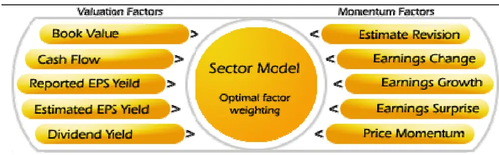
数据来源：Columbine Capital Services,Inc

z Core Model。使用基本面和技术指标来评估大市值股票，预测未来 1-3年的个股期望超额收益 Alpha。

图 14 Columbine Core Model
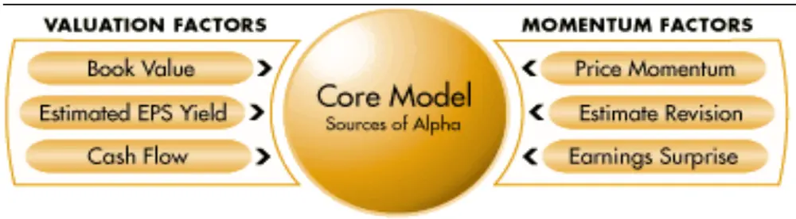
数据来源：Columbine Capital Services,Inc

z Small-Cap Model。使用基本面和技术指标来评估小市值股票，预测未来 1-3年的个股期望超额收益 Alpha。

图 15 Columbine Small-Cap Model
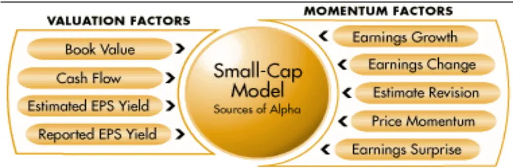
数据来源：Columbine Capital Services,Inc

z Growth Model。使用基本面和技术指标来评估成长型股票，预测未来 1-3 年的个股期望超额收益 Alpha。

图 16 Columbine Growth Model
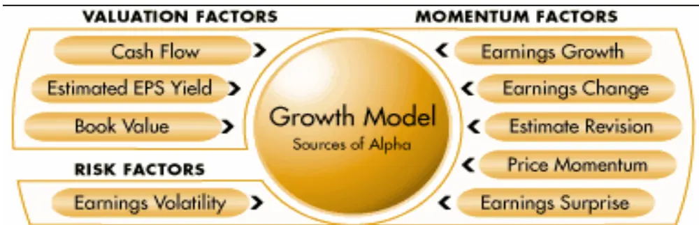
数据来源：Columbine Capital Services,Inc

z Value Model。使用基本面和技术指标来评估价值型股票，预测未来 1-3 年的个股期望超额收益 Alpha。

图 17 Columbine Value Model
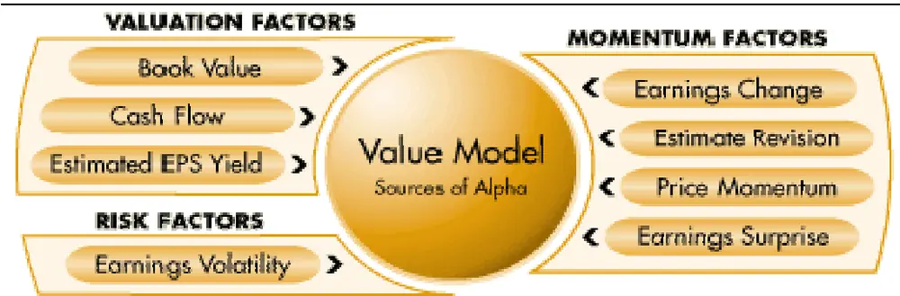
数据来源：Columbine Capital Services,Inc

## 2.1.3. 国际化模型

国际化模型（International Models）是致力于某一国家或地区的 Alpha 预测模型，寻找单一市场上所没有的超额收益。Columbine 公司拥有除美国以外的 28 个国家和地区的历史数据来建立某一国家和地区特有的模型版本，其余的市场则由新兴市场模型版本覆盖。国际化模型主要有 2类。

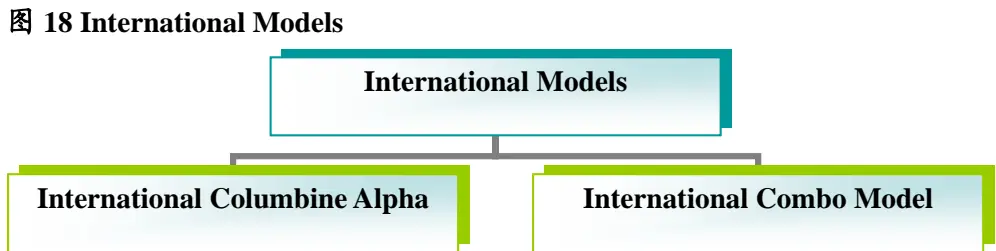
数据来源：Columbine Capital Services,Inc

International Columbine Alpha。用股票历史价格动量来预测未来 6-12 个月期望超额收益。使用风险调整手段，考虑股价波动性。覆盖 24个主要市场，不同国家和地区有专有版本，另有欧洲区专用版本。在较小的市场应用新兴市场版本。

图 19 Columbine International Columbine Alpha Model
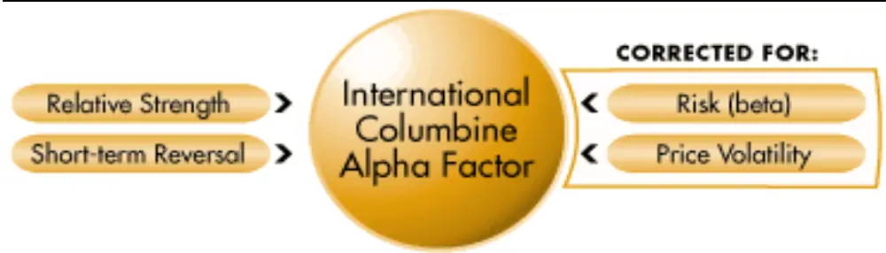
数据来源：Columbine Capital Services,Inc

International Combo Model。使用基本面和技术指标来评估股票，预测未来1-3年的个股期望超额收益 Alpha。覆盖 28个主要市场，不同国家和地区有专有版本。在较小的市场应用新兴市场版本。使用 Columbine Alpha Factor 模型的动量输入因子。

图 20 Columbine International Combo Model
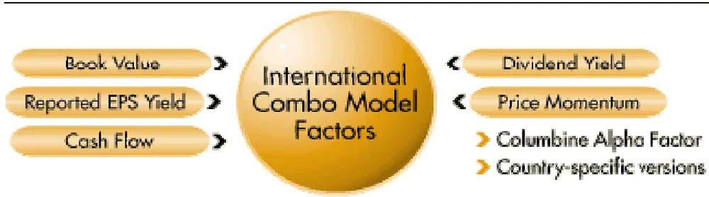
数据来源：Columbine Capital Services,Inc

## 2.2. Columbine 公司数量化模型评级系统构建

## 2.2.1. 因子选取

Columbine Capital Services 公司的数量化投资模型的构建是基于各种收益和风险因子（factors）的定义和选择，因子的选取标准如下：首先，每个因子必须具有经济意义（make economic sense）；其次，每个因子必须具备显著的预测能力(significantpredictive power on its own)。具体因子的选取和定义见下表。

表 2 Columbine 公司数量化模型因子定义

| 因子名称 | 因子解释 |
| --- | --- |
| Analyst Agreement | (评级调高次数 - 评级调低次数）/总的评级次数 |
| Beta | 衡量市场风险的指标 |
| Book Value | 账面价值/市值 |
| Cash Flow | 现金流/市值 |
| Columbine Alpha | 衡量价格动量的指标（price momentum） |
| Dividend Yield | 分红/股价 |
| Earnings Change | EPS季度变动/股价 |
| Earnings Growth | EPS年度变动/股价 |
| Earnings Surprise | （实际 EPS - 预测 EPS 中值）/ 1 + 预测 EPS 中值 |
| Earnings Volatility | 过去 12 期的 EPS 变动标准差 |
| Estimated Earnings Yield | 预测 EPS 中值/股价 |
| Estimate Revision | Revision Magnitude（Confidence)、Analyst Agreement 综合指标 |
| Industry Momentum | 分行业的价格动量指数 |
| Market Liquidity | 当前股价*上月交易量 |
| Operating Funds Momentum 衡量经营现金流变动的指标 |  |
| Revision Confidence | （最高评级的变动+最低评级的变动）/股价 |
| Revision Magnitude | 评级中值的变动/当前的平均评级 |
| Reported Earnings Yield | 上年EPS/股价 |

数据来源：Columbine Capital Service, Inc

## 2.2.2. 模型评级

在定义各个收益和风险因子后，就可以根据不同的需要选择合适的因子来建立不同类型的多因素数量化模型，进而对股票进行筛选、排序和分级。数量化模型一般将股票池中的股票分为 10 等，分别标记为 1 到 10，1 表示最好（top 10%），10表示最差（bottom 10%），再根据模型分级的高低做出“买入”、“中性”或者“卖出”评级。

图 21 Columbine 公司数量化模型股票评级
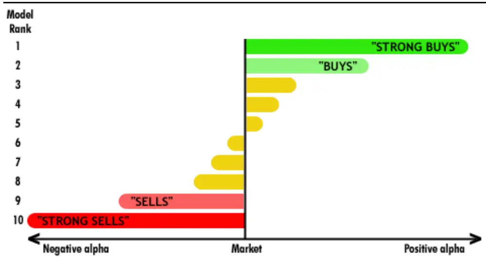
数据来源：Columbine Capital Service, Inc

## 2.3. Columbine 公司数量化模型的业绩表现

## 2.3.1. 总体业绩表现

根据评级机构 Investars.com 评估，Columbine 公司的数量化模型 05 年 10 月-08 年7 月的总体业绩如下图所示。横轴表示时间，纵轴表示日平均投资收益（averageDAILY gain/loss on a $10000 investment），绿色曲线表示评级为“买入”的股票的表现，红色曲线表示评级为“卖出”的股票的表现，蓝色曲线表示评级为“中性”的股票的表现。绿色区域表示利用数量化投资模型选出的好股票（“买入”评级）与差股票（“卖出”评级）的收益差（top-bottom spread），这一收益差可以反映数量化投资模型筛选股票（区分好坏股票）的能力，差别越大说明该数量化模型的区分（discrimination）能力越强，即有效性越强。

图 22 Columbine 公司数量化模型的业绩表现（05 年 10 月-08 年 7 月）
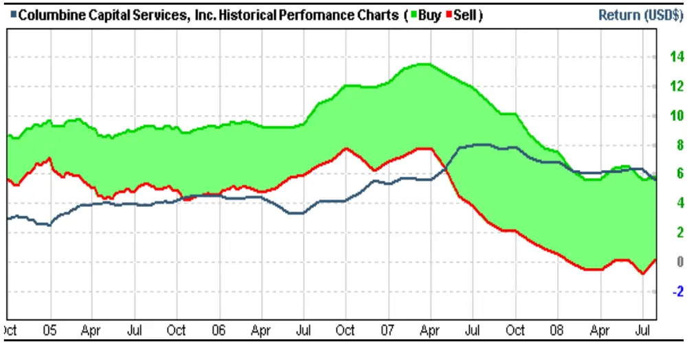
数据来源：Investars.com

Columbine 公司的数量化投资模型近 4 年来的绩效表现是相当好的，基本都能保持稳定的选股有效性（下图中表现为绿线位于红线上方，且持续保持显著的收益差）。

## 2.3.2. 各模型业绩表现

Columbine 公司数量化模型的有效性是通过模型选出的最优和最差组合的收益差（Top-Bottom Spread）来衡量的，在不考虑任何交易成本的情况下，11 个量化模型在截止至 2008年 4月底前的一年时期内的表现参见下表。

在 08 年 2-4 月（Past 3 Month）、2008 年 1-4 月（2008 YTD）和 07 年 5 月-08 年 4月（Past 12 Month），11个模型中，仅有 1-2个模型的优-差组合收益差是负的，也就是说，剩下的绝大部分模型均能正确判断未来走势，获得正收益。过去一年中，优-差组合收益差大于 20%的有 7 个，证明大部分模型区分好坏的能力较强，获得可观收益的可能性较大。

表 3 Columbine 公司的数量模型最优和最差组合收益差 Top-Bottom Spread（截止至 08 年 4 月底，单位：%）

| Model |  | Past 3Month | 2008 YTD | Past 12Month |
| --- | --- | --- | --- | --- |
| SCT | (Sector Model in Columbine 1500) | 8 | 7 | 13 |
| CMB | (Combo Model in Columbine 1500 ) | 10 | 8 | 27 |
| COR | (Core Model in Big-Cap Universe ) | 18 | 11 | 28 |
| GRW | (Growth Model in Growth Universe) | (1) | (1) | 4 |
| SML | (Small-Cap Model in Small-Cap Universe ) | 9 | 4 | 18 |
| VAL | (Value Model in Value Universe) | 12 | 7 | 39 |
| COL | (Columbine Alpha in Columbine 1500) | 16 | 16 | 72 |
| EXP | ( Expectational Model in Columbine 1500) | 12 | 2 | 38 |
| MOM | (Momentum Model in Columbine 1500 ) | 16 | (1) | 48 |
| VLN | (Valuation Model in Columbine 1500 ) | (4) | 7 | (29) |
| IND | (Industry Momentum in Columbine 1500 ) | 32 | 19 | 79 |

数据来源：Columbine Capital Services,Inc.

将 Columbine 公司的数量化模型在截至 08 年 4 月前一段时期内的表现用散点图进行对比分析，横轴表示模型区分股票优劣的能力（用 top-bottom spread衡量），纵轴表示模型选出的好股票（top decile）对投资组合收益的贡献度（用 active return衡量）。横轴和纵轴将平面划分为四个象限，我们可以通过表示各个模型的散点所落的象限位置来判断模型的有效性，右上方的象限区域表示正的组合收益贡献（positive contribution）和正的区分能力（positive discrimination），落在这一象限说明模型是有效的，而且越往右上方表示模型的有效性越强。

从图中可以明显看出，Columbine 公司的数量化选股模型绝大部分都落在了右上方象限，说明这些模型具有较强有效性。其中每次都表现优异的两个模型分别是IND（Industry Momentum in Columbine 1500）、COL（Columbine Alpha in Columbine1500），表现最差的模型是 VLN（Valuation Model in Columbine 1500）、GRW（GrowthModel in Growth Universe），表现较不稳定的是 MOM（Momentum Model inColumbine 1500），在 08 年 4 月前的三个月表现较好，而加上 08 年 1 月之后则收益差为负，也就是说，在 1月份该模型选出的组合表现异常。

图 23 Columbine公司数量化模型散点分析图(截至 08 年 4 月底，Past 3 Month)
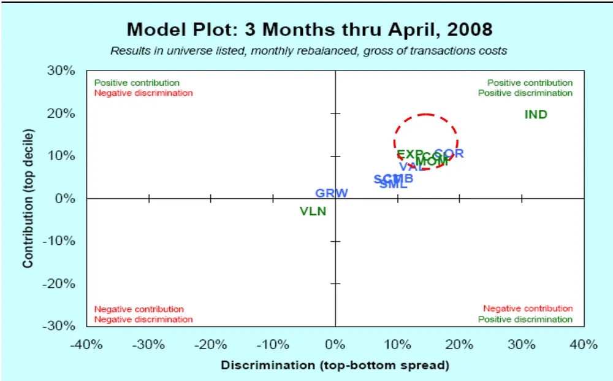
数据来源：Columbine Capital Services,Inc

图 24 Columbine 公司数量化模型散点分析图(截至 08 年 4 月底，2008 YTD)
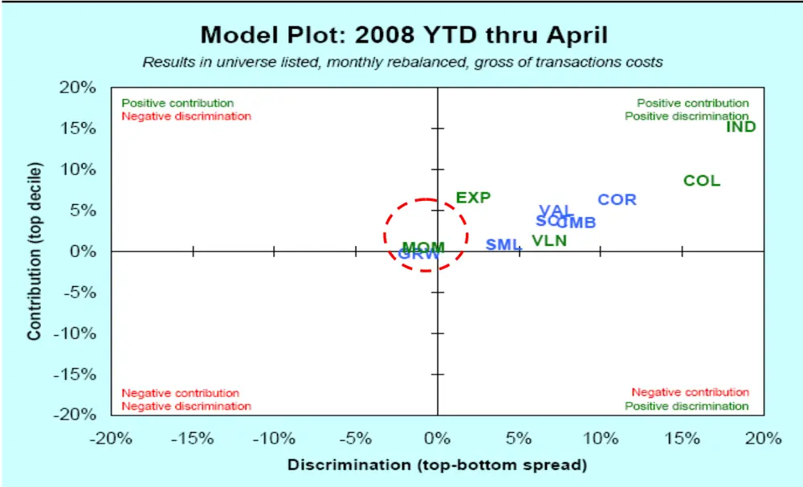
数据来源：Columbine Capital Services,Inc

图 25 Columbine 公司数量化模型散点分析图(截至 08 年 4 月底，Past 12 Month)
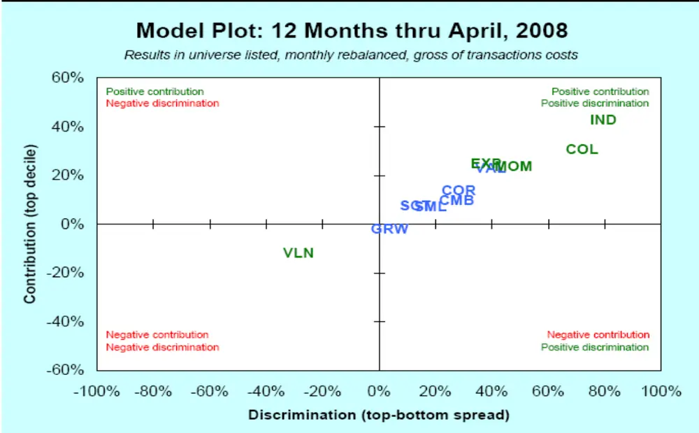
数据来源：Columbine Capital Services,Inc

表 4 Columbine 公司数量模型简称

| Stock Selection Models |  | Component Models |  |
| --- | --- | --- | --- |
| SCT | Sector Model in Columbine 1500 | COL | Columbine Alpha in Columbine 1500 |
| CMB | Combo Model in Columbine 1500 | EXP | Expectational Model in Columbine 1500 |
| COR | Core Model in Big-Cap Universe | MOM | Momentum Model in Columbine 1500 |
| GRW | Growth Model in Growth Universe | VLN | Valuation Model in Columbine 1500 |
| SML | Small-Cap Model in Small-Cap Universe | IND | Industry Momentum in Columbine 1500 |
| VAL | Value Model in Value Universe |  |  |

数据来源：Columbine Capital Services,Inc

细究 MOM模型表现异常的原因，事实上，在 08年 1月份，不只是 MOM模型收益差为负，Columbine公司大部分的模型都呈现出负收益差，而 MOM模型是最为突出的一个。是什么原因造成这些模型一反常态呢？

早在 2007 年 8 月，这 11 个模型中就有 5 个模型 Top-Bottom组合收益差为负，当时，美国次贷风波席卷了全球金融市场，8月 3日，贝尔斯登称，美国信贷市场呈现 20 年来最差状态，欧美股市全线暴跌，8 月 9 日，法国最大银行巴黎银行宣布卷入美国次级债，全球大部分股指下跌，金属原油期货和现货黄金价格大幅跳水，8月 10日，美次级债危机蔓延，欧洲央行出手干预，8月 11日，世界各地央行 48小时内注资超 3262亿美元救市，美联储一天三次向银行注资 380亿美元以稳定股市。根据 HFR(Hedge Fund Research Inc.)等机构统计，在 2007 年 8 月的前两周，市场中性策略基金净损失达 30%，仅仅两周时间就有如此巨大的损失，而在 8 月以后，大概有 35亿美元从这类基金中撤走，9月此类基金总额比上月下降了约 5%。

更严重的情形发生在 2008年 1月，Columbine公司 11个模型仅有 2个没有亏损。

回顾 08 年 1 月，随着次贷危机的深入，全球经济面临危机。1 月 4 日，美国银行业协会数据显示，消费者信贷违约现象加剧，逾期还款率升至 2001年以来最高，1月 16日，评级公司穆迪预测 SIV债券持有者损失了 47%资产，1月 17日，由于次贷亏损严重，标普评级公司开始对债券保险商实施新的评估方法，1 月 22 日和30日，美联储紧急降息 75个基点和 50个基点。投资大鳄索罗斯称，“当前情形比二战结束以来出现的其他任何一次金融危机都要严重得多”，全球正面临著二战以来最严重的金融危机。Columbine公司的数量化模型也无法幸免遇难。

表 5 Columbine 公司数量模型最优和最差组合收益差 Top-Bottom Spread（07年 5 月-08 年 4 月，单位：%）

| Model | May-07 | Jun-07 | Jul-07 | Aug-07 | Sep-07 | Oct-07 | Nov-07 | Dec-07 | Jan-08 | Feb-08 | Mar-08 | Apr-08 |
| --- | --- | --- | --- | --- | --- | --- | --- | --- | --- | --- | --- | --- |
| SCT | (1) | 0 | (1) | (2) | 2 | 0 | 5 | 2 | (1) | 8 | (1) | 1 |
| CMB | 0 | 1 | 1 | (2) | 6 | 0 | 6 | 4 | (1) | 9 | 1 | 0 |
| COR | 1 | (1) | (2) | (3) | 4 | (1) | 6 | 11 | (6) | 13 | 1 | 4 |
| GRW | 0 | (1) | (1) | (3) | 5 | (4) | 2 | 5 | (1) | 5 | (2) | (3) |
| SML | (2) | 4 | 2 | 3 | 5 | 2 | (1) | 0 | (5) | 10 | 3 | (3) |
| VAL | 2 | 1 | 3 | 1 | 7 | 1 | 8 | 5 | (5) | 12 | (1) | 1 |
| COL | 0 | 4 | 5 | 2 | 9 | 6 | 8 | 6 | 0 | 8 | 4 | 3 |
| EXP | 2 | 2 | 5 | 4 | 7 | 4 | 5 | 2 | (9) | 9 | 1 | 2 |
| MOM | 1 | 2 | 8 | 4 | 9 | 6 | 8 | 4 | (14) | 9 | 3 | 3 |
| VLN | (2) | (3) | (8) | (7) | (6) | (9) | (3) | (2) | 11 | 0 | (4) | 0 |
| IND | 2 | 4 | 7 | 0 | 8 | 7 | 7 | 8 | (10) | 19 | 2 | 9 |

数据来源：Columbine Capital Services,Inc.

在正常市场下，数量化策略模型能很好的运作，而一旦市场发生转折，数量化模型却未必能及时地捕捉市场信息。我们分析数量化模型失效的原因主要有三点：（1）模型参数陈旧。量化模型的参数往往更多地使用半年至一年的，比如财务报表中公布的有关价值、成长特性的指标。如果加入更多的能反应即期市场的短期变量，或许能在一定程度上改善这个问题。（2）预测准确性不足。现代金融模型建立在统计学基础上，未必能确保对未来的判断万无一失。一旦突发事件超出量化模型的预测范围，将导致小概率事件发生，形成损失。Fama、French与 Alliance资本管理公司对美国股票交易所 1980-2001 年股票的风格研究显示，必须要达到80%以上预测准确性，才能弥补由于预测不准所带来的风险成本。（3）模型过于相似。各个投资经理所采用的数量模型或多或少都有所相似，相似的模型自然限制了获利空间，这导致数量化基金会过多使用杠杆来放大利润，一旦金融危机爆发，损失将成倍放大。

再来看 Columbine 公司的数量化模型在 2008 年 1 月后的表现，表 5 中，在 2008年 2 月，这些模型又神奇地全部获得了正收益差，我们推测，这些模型具备一定的自动纠错能力。在 2007年 8月前两周曾遭重创的一些市场中性策略基金，及时修改了模型，从而在此后两周弥补了较大程度的损失。实践证明，当金融风暴来临时，运用数量化模型的投资策略应对危机的反应速度不足以使其免遭损失，但具备较强调整能力的数量化模型一般都能在未来一段时间内在一定程度上挽回损失。

## 作者简介：

蒋瑛琨：现任研究所金融工程部经理，吉林大学数量经济学博士，CPA，2006年《新财富》“衍生品”最佳分析师第二名(团队)。2005年加入国泰君安证券研究所，从事股指期货、权证等金融衍生品以及金融工程研究，发表多篇深度报告。

杨 喆：同济大学计算机科学与技术专业本科，金融学专业硕士，目前从事金融工程和衍生品研究。

吴天宇：上海财经大学经济学硕士，2006年加入国泰君安研究所，目前从事金融工程研究。

## 免责声明

本报告的信息均来源于公开资料，我公司对这些信息的准确性和完整性不作任何保证，也不保证所包含的信息和建议不会发生任何变更。我们已力求报告内容的客观、公正，但文中的观点、结论和建议仅供参考，报告中的信息或意见并不构成所述证券的买卖出价或征价，投资者据此做出的任何投资决策与本公司和作者无关。

我公司及其所属关联机构可能会持有报告中提到的公司所发行的证券头寸并进行交易，也可能为这些公司提供或者争取提供投资银行、财务顾问或者金融产品等相关服务。

本报告版权仅为我公司所有，未经书面许可，任何机构和个人不得以任何形式翻版、复制和发布。如引用、刊发，需注明出处为国泰君安证券研究所，且不得对本报告进行有悖原意的引用、删节和修改。

## 国泰君安证券研究所

上海

上海市浦东新区银城中路 168 号上海银行大厦 29 层

邮政编码：200120

电话：（021）38676666

深圳

深圳市罗湖区笋岗路 12号中民时代广场 A座 20楼

邮政编码：518029

电话：（0755）82485666

北京

北京市西城区金融大街 28号盈泰中心 2号楼 10层

邮政编码：100140

电话：（010）59312799

国泰君安证券研究所网址： www.askgtja.com

E-MAIL：gtjaresearch@ms.gtjas.com