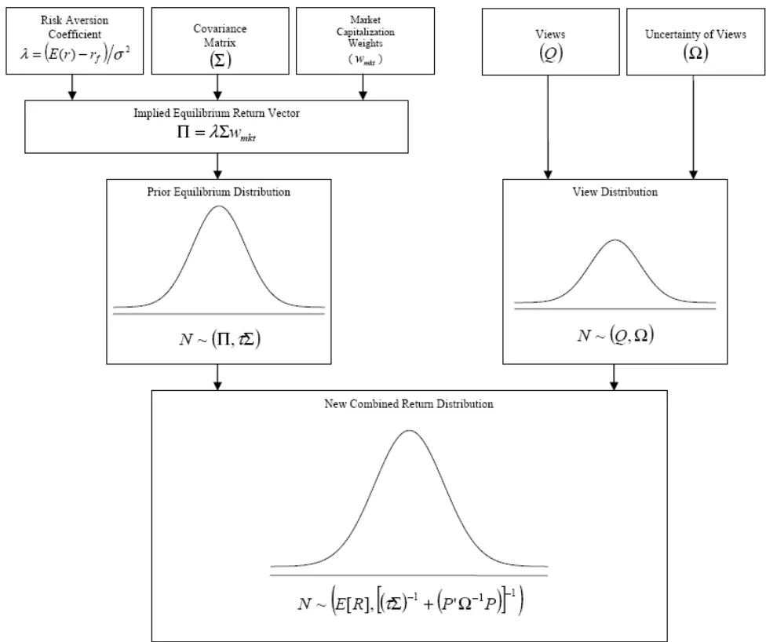
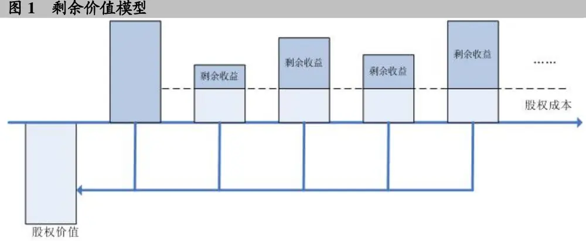
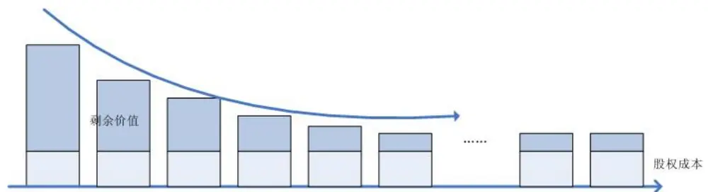

2008.9.16

# 资产配置的风险溢价思路（理论篇）

# --数量化系列研究之三

张晗

蒋瑛琨

21-38676675

21-38676710

zhanghan@gtjas.com

jiangyingkun@gtjas.com

¾ 资产配置方法论

本报告导读：

¾ 风险溢价

¾ 资产配置的风险溢价方法

## 摘要：

资产配置可以是大类的资产配比，如债券、股票、现金，或者更广泛地在各种货币间，以及商品、不动产间。而狭义的则可以是针对很多基金非常关心的行业配置。方法上区分的话，又有定量和定性的，这两类方法又可以融合，在大陆市场使用时需要谨慎处理。

资产配置方法的发展起源于 Harry Markowitz 在 1952 年发表的论文”Portfolio Selection ”。随后 Sharpe 和 Fama 等人在此基础上建立了现代组合理论。但是 Markowitz 的资产配置方法在实际中存在两个缺陷：一是预期收益率很难预测，投资者通常只是对部分资产的收益和相对收益有预测，所以实际使用时，投资者往往会使用历史收益率作为预测；二是最优的资产权重对收益率的预测及其敏感。因而，Black和 Litterman在 90 年提出了 Blcak-Litterman 模型，B-L 模型的本质思路是用贝叶斯方法将投资者的主观判断和市场的均衡收益（先验概率）相结合，形成了新的 B-L 期望收益（后验概率）。B-L 期望收益通过均值方差的最优化，就得出配置的权重，新的配置和市场均衡配置之间的差异大小反映的就是投资者主观判断的信心水平。但是加权的权重较复杂，并不直观，其中部分输入参数并没有明确的设定方法。我们在此提出一种更为直观的方法，即运用隐含风险溢价进行资产配置的方法。

风险溢价定义为资产间隐含收益率的差，通过股票估值模型可以得出股票的隐含收益率，我们选择剩余价值估值模型，即未来股东的剩余价值以股权成本贴现的现值等于现价。假设在一个存在竞争的有效市场中，剩余价值会从较高水平逐步收敛，在一段时间（若干年）后，剩余价值会稳定维持在一个水平。通过此，通过模型优化可以得到全市场的风险溢价，我们可以据此进行历史比较得出资产配置。

资产配置可以是大类的资产配比，如债券、股票、现金，或者更广泛地在各种货币间，以及商品、不动产间。而狭义的则可以是针对很多基金非常关心的行业配置。方法上区分的话，又有定量和定性的，这两类方法又可以融合，这样就出现了 B-L模型。这些都是舶来品，在大陆市场使用时需要谨慎处理。下面我们就此展开。

## 1. 资产配置方法论

资产配置方法的发展起源于 Harry Markowitz 在 1952 年发表的论文”PortfolioSelection ”。在这篇论文和其在 1959 年出版的专著“Portfolio Selection: EfficientDiversification of Investments”中，Markowitz 提出了一系列定量资产配置的方法，随后 Sharpe和 Fama 等人在此基础上建立了现代组合理论。

Markowitz 的经典组合理论是基于投资决策是风险和回报的函数这一前提。投资者的偏好决定了这一函数的形式。Markowitz 在此做了两个最基本的假设：资产收益为正态分布，投资者为风险厌恶。

Fama 验证了第一个基本假设，这一假设使得资产收益的分布可以使用均值和方差来完全描述。在处理资产配置时，资产收益的协方差也是必须的。

但是 Markowitz 的资产配置方法在实际中经常会产生不均衡的配置，如在许多资产上权重为零，而在其他市值很小的资产上配置很大的比重。这一现象的出现源自组合理论的两个缺陷：一是预期收益率很难预测，投资者通常只是对部分资产的收益和相对收益有预测，所以实际使用时，投资者往往会使用历史收益率作为预测；二是最优的资产权重对收益率的预测及其敏感。

正是这些缺陷加上 Markowitz 理论对于基金经理来说并不直观制约了Markowitz 模型的实际中的运用，因而，Black 和 Litterman 在 90 年提出了Blcak-Litterman 模型，B-L 模型并不是一个不同于 Markowitz 的全新模型，B-L模型与 Markowitz模型的最大区别在于期望收益。

B-L模型的本质思路是用贝叶斯方法将投资者的主观判断和市场的均衡收益（先验概率）相结合，形成了新的 B-L 期望收益（后验概率）。B-L 期望收益通过均值方差的最优化，就得出配置的权重，新的配置和市场均衡配置之间的差异大小反映的就是投资者主观判断的信心水平。在这里，均衡收益是指当期望收益为此时，得出的最优资产配置恰是市场组合，所以这是一个反向最优化。

B-L 模型可以看作是市场均衡收益和投资者判断的一个复杂的加权平均，权重由信心水平矩阵Ω和观点权重（weight-on-views）τ 共同决定。下面给出 B-L模型的数学表达：

我们最优化的目标函数是

$$
\max_{w}w^{\prime}\mu-\frac{\lambda}{2}w^{\prime}\Sigma w
$$

其中w是组合权重，µ是资产的期望收益，Σ是资产收益的协方差，λ是风险厌恶系数。

使得上式的解为市场组合 $w=w_{mkt}$ 的期望收益为 $\mu=\Pi=\lambda\Sigma w_{\phantom{\dagger}mkt}^{\dagger}$ ，这被 B-L模型定义为均衡收益。然后考虑投资者的主观判断，假设投资者有K个判断，资产共有 N 类，则 K N× 的矩阵 P 代表了这些判断，K ×1的矩阵Q 代表了这些判断对应的期望收益，K K× 的对角阵Ω代表了判断的信心水平，τ 是上面所说的观点权重参数，得出 B-L 模型的期望收益 $\mu^{*}$ 和配置权重 $w^{*}$ 为

$$
\mu^{*}=[(\tau\Sigma)^{-1}+P^{\prime}\Omega^{-1}P]^{-1}[(\tau\Sigma)^{-1}\Pi+P^{\prime}\Omega^{-1}Q]
$$

更为形象的表达式是：

$$
\mu^{*}=\Pi+\tau\Sigma P\left(\Omega+\tau P\Sigma P\right)^{-1}(Q-P\Pi)
$$

$$
w^{*}=w_{mkt}+P\left(\frac{Q}{\tau}+P\Sigma P\right)^{-1}\left(\frac{Q}{\lambda}-P\Sigma w_{mkt}\right)
$$

图 1 B-L 期望收益

B-L 模型比之 Markowitz 模型更为直观，从资产配置权重的表达式中可以看出基金经理的主观判断在市场组合基础上调整了资产的配置，但是配置仍然会很均衡，不会如 Markowitz模型出现怪异的配置。

但是加权的权重较复杂，并不直观，其中作为输入参数Ω和τ 并没有明确的设定方法，不同文献对τ 的设定迥异，也有文献提出用最优化的方法给出Ω和τ的估计，但有效性未知。同时对于观点，B-L 模型同样有着一定的要求，投资者对于资产或某些资产组合的收益率的预期应是确切的值，而非仅是方向性的预期，而国内没有非常广泛的预期数据，这同样制约了 B-L模型在国内市场的运用。

我们在此提出一种更为直观的方法，即运用隐含风险溢价进行资产配置的方法，我们把资产归结为三类：股票、债券和现金及现金等价物，三类资产的权重取舍会决定组合收益的很大部分。我们的方法是基于三类资产间由市场价格所隐含的风险溢价水平，与历史水平的比较，可以得出三类资产未来一段时间收益强弱的概率，和三类资产的权重配比。

## 2. 风险溢价

风险溢价定义为资产间隐含收益率的差，例如股票相对于债券的风险溢价就是股票的隐含收益率减去债券的收益率。债券和现金等价物（主要是短期票据）的收益率即到期收益率，而由于股票不像债券和短期票据一样具有确定的现金流，所以股票的隐含收益率则需基于一些模型假设来测算。

通过股票估值模型可以得出股票的隐含收益率，我们选择剩余价值估值模型，即未来股东的剩余价值以股权成本贴现的现值等于现价。

$$
V_{e}=E_{0}+\sum_{n=1}^{\infty}\frac{(ROE_{n}-r_{e})\times E_{n-1}}{(1+r_{e})^{n}}
$$

其中， $V_{e}$ 是股权的价值， $E_{0}$ 是当期的所有者权益， $r_{e}$ 是股权成本，也即股票的隐含收益率。下图是估值模型的形象展示。

在一个存在竞争的有效市场中，剩余价值会从较高水平逐步收敛，在一段时间（若干年）后，剩余价值会稳定维持在一个水平。我们假设收敛阶段为 30年。

图 2 剩余价值收敛

具体而言，从模型中可以看出，剩余价值的影响因素有 ROE 和所有者权益。所有者权益的变动可以做如下分解：

$$
\begin{aligned}E_{_{n-1}}&=E_{_{n-2}}+ROE_{_{n-1}}\times E_{_{n-2}}\times(1-PayoutRatio_{_{n-1}})\\&=E_{_{n-2}}(1+ROE_{_{n-1}}\times(1-PR_{_{n-1}}))\\&=E_{_{n-2}}(1+g_{_{n-1}})\\\end{aligned}
$$

我们假设驱动剩余价值的 ROE和g从第一期的估计 $X_{\mathrm{1}}$ 收敛到行业的平均水

平 $\bar{X}$ ，收敛的速度为 $\kappa$ ：

$$
X_{n+1}=\kappa(X_n-\bar{X})+\bar{X}
$$

对于不同的行业，有着不同的κ值，κ越接近 1，收敛速度越慢，行业越能维持高增长，而κ越接近 0，则收敛越快。

模型的估计是通过有约束的最优化来实现的，数据区间间隔为月，优化分行业进行（按照证监会的一级行业分类），在该行业的代表公司理论价值等于实际市场价值的约束条件下，最小化该行业的残差平方和最小。得到的各行业股权成本在市值加权后便可得到市场的股权成本。

通过此，我们便可以得到全市场的风险溢价， $而$ 这就是我们从市场那里得到的重要信息，我们可以据此进行初步资产配置。

## 3. 风险溢价下的资产配置

资产配置最朴实的思路是要确定一类资产在未来一段时间超越另一类资产收益的概率。例如，基金经理认为未来 1个月股票收益超越现金的概率有 80%，那么理性地应当在股票上配置较多，但仍有 20%的概率出现股票收益低于现金，所以不可能将资金全部配置在股票上，而需要配置一定的现金，但这个配置比例很大程度上是主观决定的。这种方向性的判断 B-L 模型难以解决，下面的方法可以从另一个角度给出答案。

我们对股票、债券和现金等价物这三类资产配置做两个前提假设：

各类资产的权重配比在 0%到 100%间；

均衡配置为各类资产权重 33%。

这两个假设可以根据投资组合的具体规定而改变。

定义超越概率如下：

$$
P(X.v.Y)=\max X的收益超过资产Y的概率
$$

$$
P(X.v.Z)=\max X的收益超过资产Z的概率
$$

$$
P(Y.v.Z)=资产Y的收益超过资产Z的概率
$$

$$
P(A.v.B)=\Phi(rp(AB),\overline{rp}(AB),sd(AB))
$$

Φ 是正态的分布函数， rp AB ( ) 是目前资产 A 相对于资产 B 的风险溢价，

rp AB( )是资产A相对于资产B的历史平均风险溢价，sd AB( )是资产A相对于资产B的历史风险溢价的标准差。

在充分利用各资产收益的同时，最小化收益波动，得出资产X 的配置权重则为：

$$
\begin{aligned}w(X)=&\left[P(X.v.Y)\times P(X.v.Z)+P(X.v.Z)\times P(X.v.Y)+1\right.\\&\left.-P(Y.v.Z)\times P(Y.v.X)-P(Z.v.Y)\times P(Z.v.X)\right]/3\end{aligned}
$$

## 总结的话和对实战篇及资产配置深入研究的引言

当我们对市场有比较完整的预期时，我们可以尝试使用B-L模型来配置资产，虽然模型在细节方面尚有争议。但有完整的预期是很困难的，如果这一条件无法满足，我们就必须借助市场帮助我们分析，譬如历史比较，这个是研究员常做的，PE、PB的历史比较，但是 PE、PB的历史比较的扰动因素太大，只能指导投资，但难以据此投资。所以我们引入风险溢价的历史比较，不过也是要给予对未来假设的模型，不过我们认为从一个长期的视角来观察，相对于假设路径的波动将倾向于相互中和。而与历史的比较以概率的方法来直观展示，落实到确定的配比共投资经理参考。

这是我们的理论篇，实战篇尚在进行中，我们非常欢迎投资者提出模型的改进意见，这样我们可以在实战篇中为客户量身定做。资产配置的角度非常之多，我们将以融合基本面的分析和量化的分析为主线，深化我们的研究。

## 免责声明

本报告的信息均来源于公开资料，我公司对这些信息的准确性和完整性不作任何保证，也不保证所包含的信息和建议不会发生任何变更。我们已力求报告内容的客观、公正，但文中的观点、结论和建议仅供参考，报告中的信息或意见并不构成所述证券的买卖出价或征价，投资者据此做出的任何投资决策与本公司和作者无关。我公司及其所属关联机构可能会持有报告中提到的公司所发行的证券头寸并进行交易，也可能为这些公司提供或者争取提供投资银行、财务顾问或者金融产品等相关服务。

本报告版权仅为我公司所有，未经书面许可，任何机构和个人不得以任何形式翻版、复制和发布。如引用、刊发，需注明出处为国泰君安证券研究所，且不得对本报告进行有悖原意的引用、删节和修改。

## 国泰君安证券研究所

上海

上海市银城中路 168号上海银行大厦 29层

邮政编码：200120

电话：（021）38676666

深圳

深圳市罗湖区笋岗路 12号中民时代广场 A座 20楼

邮政编码：518029

电话：（0755）82485666

北京

北京市西城区金融大街 28号盈泰中心 2号楼 10层

邮政编码：100140

电话：（010）59312799

国泰君安证券研究所网址： www.askgtja.com

E-MAIL：gtjaresearch@ms.gtjas.com