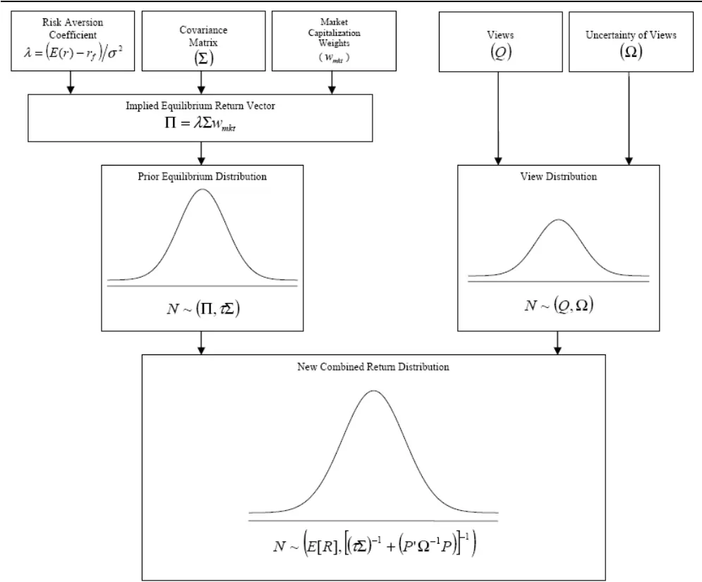
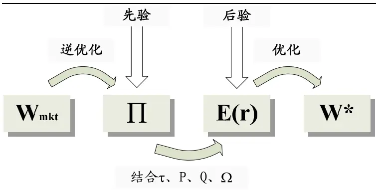
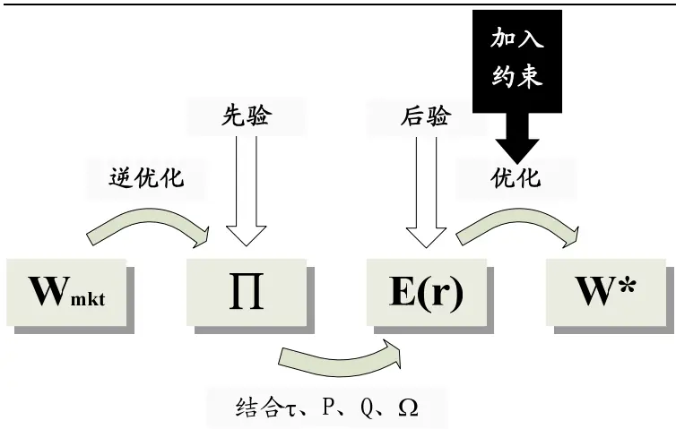

2008.12.1

# 资产配置之 B-L模型Ⅰ：理论篇

蒋瑛琨 杨喆

21-38676710 21-38676442

jiangyingkun@gtjas.com yangzhe@gtjas.com

¾ B-L模型参数估计

本报告导读：

¾ B-L模型约束条件

¾ 业绩与风险衡量

## 摘要：

B-L 模型核心思想：使用贝叶斯方法将投资者的主观观点和市场均衡收益（先验收益）相结合，从而形成一个期望收益的估计值（后验收益），这个新形成的收益向量被看成投资者观点和市场均衡收益的复杂的加权平均。

均衡收益是以市场中性为出发点来估计一系列的超额收益。如果投资者没有特别的观点，那么就可以用这些市场均衡的收益估计值，如果投资者对某些资产有特别的观点，那么就可以根据观点的信心水平来调整均衡收益，从而来影响投资组合配置。

B-L 模型在均衡收益基础上通过投资者观点修正了期望收益，使得马克维兹组合优化中的期望收益更为合理，而且还将投资者观点融入进了模型，在一定程度上是对马克维兹组合理论的改进。

B-L 模型中的资产收益有两个特点：一是以本国货币计价，二是超额收益，即减去本国货币的无风险利率（ Black andLitterman(1992)、Satchell and Scowcroft (2000)）。

Black and Litterman(1992)呈现了全球资产配置的实证结果（股票、债券、货币），没有给出一些参数的详细设定方法，比如观点误差矩阵Ω、标量τ等。对于观点矩阵 P，投资者可以不发表观点，也不要求对所有资产都发表观点。我们比较了其他有关 B-L 模型的文献，对隐含均衡收益 П、标量 τ、观点误差矩阵 Ω 等参数在文中进行分析。

本报告包括正文 12页，图 10张，表 3张。

## 1. B-L 模型核心思想

B-L 模型使用贝叶斯方法，将投资者对于一个或多个资产的预期收益的主观观点与先验分布下预期收益的市场均衡向量相结合，形成关于预期收益的新的估计。这个基于后验分布的新的收益向量，可以看成是投资者观点和市场均衡收益的加权平均。

Black and Litterman (1992)对“均衡”的理解是资产的供求相平衡。“均衡组合”即市场均衡下的组合，在他的文献里（主要将模型应用于全球市场资产配置），是市场组合加 80%货币套保(market capitalization weights，80% currencyhedged)。

股票、债券和货币等资产的均衡收益是从市场中性为出发点来估计一系列的超额收益。如果投资者没有特别的观点，那么就可以用这些市场均衡的收益估计值；如果投资者对某些资产有特别的观点，那么就可以根据观点的信心水平来调整均衡收益，从而来影响投资组合配置。

马克维兹优化会出现不合情理的配置：无限制条件下，会出现对某些资产的强烈卖空，当有卖空限制时，某些资产的配置为零，同时在某些小市值资产配有较大的权重。问题的原因有：（1）期望收益非常难以估计，一个标准的优化模型，需要对所有资产都有收益估计，因此投资者就会基于他们常用的历史收益和一系列假设条件进行估计，导致不正确估计的产生。（2）组合权重对收益估计的变动非常敏感。（3）传统模型无法区分不同可信度的观点，观点不能很好被模型所表达。

B-L 模型在均衡收益基础上通过投资者观点修正了期望收益，使得马克维兹组合优化中的期望收益更为合理，而且还将投资者观点融入进了模型，在一定程度上是对马克维兹组合理论的改进。

图 1 B-L 模型思路

数据来源：Adzorek, “A step-by-step guide to the Black-Litterman model”, 2004

B-L 模型最后新形成的后验收益为：

$$
E[R]=\big[(\tau\Sigma)^{-1}+P^{\prime}\Omega^{-1}P\big]^{-1}\big[(\tau\Sigma)^{-1}\Pi+P^{\prime}\Omega^{-1}Q\big]
$$

也可以写为： $E[R]=\Pi+\tau\Sigma P^{\prime}(\Omega+\tau P\Sigma P^{\prime})^{-1}(Q-P\Pi)$

这里

n 表示资产数量

k 表示投资者观点数量（k<=n）

′ 表示矩阵转置

-1 表示逆矩阵

E[R]：新(后验)收益向量 (n×1 列向量)

τ：标量(Scalar)

Σ：n个资产收益的协方差矩阵(n×n矩阵)

П：隐含均衡收益向量 (n×1 列向量)

P：投资者观点矩阵(k×n矩阵，当只有一个观点时，则为 1×n行向量)

Q：观点收益向量(k×1 列向量)

Ω：观点误差的协方差矩阵，为对角阵，表示每个观点的信心水平(k×k矩阵)

当资产的期望收益为已知值时，根据 Markowitz（1952）收益-方差最优化方

法，可以求得最优的资产配置组合权重（无约束）：

$$
\operatorname*{max}_{w}w^{\prime}\mu-\frac{\lambda}{2}w^{\prime}\Sigma w
$$

$$
w=\left(\lambda\Sigma\right)^{-1}\mu
$$

其中 w 是组合权重，μ是资产的期望收益，∑是资产收益的协方差，λ是风险厌恶系数。

当μ=E[R]时，得到无约束条件下的新的资产组合权重向量：

$$
w^{*}=w_{mkt}+P^{\prime}(\frac{\Omega}{\tau}+P\Sigma P^{\prime})^{-1}(\frac{Q}{\lambda}-P\Sigma w_{mkt})
$$

B-L 模型的整个过程可以分解为：

图 2 B-L 模型过程分解

数据来源：国泰君安证券研究所

## 2. B-L 模型参数估计

在 B-L 模型中，风险厌恶系数 $\lambda=(E(r)-r_{f})/\sigma_{m}^{2}$ ，其中 E(r)是期望市场收益， $r_{f}$ 是无风险利率， $\sigma_{\mathrm{m}}^{2}$ 是市场收益方差； $w_{mkt}$ 是各资产的市值权重，也就是市场流通市值权重；协方差矩阵 Σ一般是用历史收益求得。

B-L 模型中的资产收益有两个特点：一是以本国货币计价，二是超额收益，即减去本国货币的无风险利率（Black and Litterman(1992)、Satchell andScowcroft (2000)）。因此协方差矩阵∑是超额收益的协方差矩阵，∏是先验均衡超额收益，对于观点收益向量 Q和后验收益 E[R]，也应是超额收益。

Black and Litterman(1992)的文献主要呈现了全球资产配置的实证结果（股票、债券、货币），没有给出一些参数的详细设法，比如观点误差矩阵Ω、标量τ等。对于 P 观点矩阵，投资者可以不发表观点，也不需要对所有资产发表观点。如果是不强烈的观点，量化时降低观点收益后进入收益向量 Q。

我们比较了其他有关 B-L 模型的文献，对隐含均衡收益向量 П、τ、观点误差的协方差矩阵 Ω等参数在下文中作以分析。

## 2.1. 隐含均衡收益向量(П)

隐含均衡收益可以看成是市场均衡时的收益，Black and Litterman (1992)在进行全球资产配置时证明了用以下方法来估计均衡收益都有缺陷，理由如下：

（1）历史平均超额收益(Historical Averages)。问题：非中性，因为高配过去高收益的资产和低配过去低收益的资产。

（2）不同市场某个资产的超额收益的均值(Equal Means)。问题：忽略了不同市场的不同风险水平。

（3）风险调整后的不同市场某个资产的超额收益的均值(Risk-Adjusted EqualMeans)。假设不同资产具有相同单位风险上的超额收益（比如债券和股票具有相同单位风险上的超额收益），风险用波动性衡量。问题：没有考虑这些资产之间的相关性。

根据 CAPM模型，资本市场均衡是资产按市场组合权重配置，按 Markowitz收益-方差最优化过程，资产组合权重为市场权重，来进行逆优化，就可以求得隐含均衡收益。

正优化：

$$
\operatorname*{max}_{w}w^{\prime}\mu-\frac{\lambda}{2}w^{\prime}\Sigma w
$$

$$
w=\left(\lambda\Sigma\right)^{-1}\mu
$$

逆优化：

$$
\operatorname*{max}_{w}w^{\prime}\mu-\frac{\lambda}{2}w^{\prime}\Sigma w
$$

$$
\Pi=\mu=\lambda\Sigma w=\lambda\Sigma w_{\mathrm{mkt}}
$$

其中， $w_{mkt}$ 是市场组合权重，∑是资产收益的协方差，λ是风险厌恶系数。

Adzorek (2002)对上述方法求均衡收益（我们称作隐含均衡收益）与其他方法进行了比较，他利用三种方法对道琼斯工业平均指数的 30只股票收益进行估计，分别采用历史、CAPM和隐含均衡收益，其中基于 CAPM的估计采用 60个月 beta、5%的无风险利率（近似于 2001年末的十年期国债收益率）和 7.5%的市场风险溢价。

结果表明，历史收益有更大的标准差，而后两者（CAPM 和隐含均衡收益）估计所得的收益十分接近，相关性达 0.85。用三种估计收益求组合权重$\left(\left(\lambda\Sigma\right)^{-1}\Pi\right)$ ），所得结果差距较大，历史收益的组合权重对市值权重偏离最大，均衡收益所得权重即市值权重，而用 CAPM收益所求得的权重和市值权重的相关性仅为 0.18。

Adzorek(2002)认为，在没有主观观点的前提下，均衡收益应是市场中性立场的收益。所以应使用市值逆优化方法所得的隐含均衡收益∏。

我们认为，理论上，CAPM 收益和隐含均衡收益应是一样的，因为都是给定市场风险溢价，用一定历史的收益数据来求市场均衡收益，实际应用中，由于 CAPM所用的基准可能是某种指数，而不是市场组合，那么结果就会产生偏差。

## 2.2. 标量(τ)

τ 是给均衡收益的方差设定的刻度值，作为先验收益的均衡收益，服从分布N( , )Π ∑τ ，τ值越大，表明均衡收益方差越大。我们前面提到，B-L模型可以看作是市场均衡收益和投资者观点的复杂加权平均，那么当先验的均衡收益方差越大时，其所占权重也就越小，而投资者观点权重则越大，因此 τ 也被看成是观点权重(Weight-on-Views)。对于 τ值，不同的文献有着大相径庭的观点。

表 1 不同文献对 τ 值的观点

| 文献作者 | 对于τ值的观点 |
| --- | --- |
| Black and Litterman (1992) | 收益均值的不确定性远小于收益本身，因此τ接 近于0 |
| Bevan and Winkelmann (1998) | 所设定的τ须使信息比率(IR)不超过2, τ 通常在 0.5-0.7之间 |
| He and Litterman (1999) | 假定一个τ值，然后校准观点的信心水平，使得 ω/τ等于观点的方差(PkΣPk′) |
| Satchell and Scowcroft (2000) | τ被认为是刻度因子(scaling factor)，经常设定 为1 |
| Lee (2000) | 常设定在 0.01-0.05之间 |
| Adzorek(2002) | $\tau=\frac{P{\Sigma}P^{*}}{\frac{k}{\frac{i=1}{k}({\big\langle}_{LC_{i}}^{k}{*}CF)}}$ ，其中 LCi 为第 i 个观点的 信心水平，ωt等于看法组合的方差 |
| Christodoulakis and Cass(2002) | τ是一个标量，来 scale 历史协方差矩阵∑ |
| Blamont and Firoozye (2003) | (τ∑) 是隐含均衡收益∏的方差，所以标量τ近似 于1/观测值数量 使用抽样理论推导 B-L 模型，τ=n/m，n 为 |
| Charlotta Mankert(2006) | observations by the investor, m 为 observations by the market，n 并不等于观点数 k，这里收益观测 值是N个资产的收益向量，N×1维向量 |

数据来源：国泰君安证券研究所整理

Adzorek (2002)设定的τ值为：

$$
\tau=\frac{P^{*}\Sigma P^{*}^{*}}{\overline{{\omega}}}=\frac{P^{*}\Sigma P^{*}^{*}}{\displaystyle{\sum_{i=1}^{k}(\sum_{LC_{i}}^{k}*CF)}}
$$

${\boldsymbol{P}}^{*}{\boldsymbol{\Sigma}}{\boldsymbol{P}}^{*}$ '为观点组合的方差， $P^{*}$ 是观点矩阵 P 每列求和所得 1×n 行向量（在Adzorek (2002)附注 10 中提到），LCi 为第 i 个观点的信心水平。

而 He and Litterman (1999)认为 $\tau=\frac{\stackrel{\stackrel{\_}{\omega}}}{P^{*}\Sigma P^{*}}$ ，即 $\overline{{\omega}}/\tau=P^{*}\Sigma P^{*}$ '，分子分母正好和Adzorek (2002)相反。

τ和ω分别是衡量先验收益和观点收益的误差值，按 He and Litterman (1999)的方法，等于τ和ω同时放大或缩小，先验收益和观点收益方差变动对后验收益E[R]的影响相互抵消。因此，我们认为 Adzorek (2002)的方法更为合理。

## 2.3. 观点误差矩阵(Ω)

投资者观点收益服从分布N Q( , )Ω ，Ω衡量投资者观点的误差，误差越大，Ω中对应的值越大；反之越小。观点误差的协方差矩阵(k×k维矩阵)，为对角矩阵，这表明不同的观点之间相互独立。

另外一种对Ω的解释，Adzorek (2002)提到，在观点收益中，具有一个随机的、独立的、且服从均值为 0的正态分布的残差项ε，ε服从分布N(0, )Ω 。每个观点收益都具有 Q+ε的形式。

$$
\begin{array}{r}{Q+\varepsilon=\left[\begin{array}{c}{Q_{1}}\\{\vdots}\\{Q_{k}}\end{array}\right]+\left[\begin{array}{c}{\varepsilon_{1}}\\{\vdots}\\{\varepsilon_{k}}\end{array}\right]}\end{array}
$$

事实上，观点矩阵和后验收益之间存在如下的关系（Black and Litterman(1992)、Adzorek (2002)）：

$$
{\left[\begin{array}{cccc}{P_{1,1}}&{\cdots}&{P_{1,n}}\\{\vdots}&{\ddots}&{\vdots}\\{P_{k,1}}&{\cdots}&{P_{k,n}}\end{array}\right]}{\left[\begin{array}{c}{E\left[R_{1}\right]}\\{\vdots}\\{E\left[R_{n}\right]}\end{array}\right]}={\left[\begin{array}{c}{Q_{1}}\\{\vdots}\\{Q_{k}}\end{array}\right]}+{\left[\begin{array}{c}{\varepsilon_{1}}\\{\vdots}\\{\varepsilon_{k}}\end{array}\right]}
$$

当有 2个或以上观点时，残差项ε不直接进入模型，取而代之的则是观点误差矩阵Ω(k×k)。假设各个观点间相互独立，则Ω为对角阵（Black and Litterman(1992)、Adzorek (2002)）。每个观点的误差ω越大，观点的不确定性也越大。

$$
\Omega=\left[\begin{array}{ccc}{{\omega_{1}}}&{{0}}&{{0}}\\{{0}}&{{\ddots}}&{{0}}\\{{0}}&{{0}}&{{\omega_{k}}}\end{array}\right]
$$

其实，Ω矩阵是对角阵的假设条件并不是限制条件，如果Ω矩阵不是对角阵，可以通过分解， $\Omega=V\hat{\Omega}V^{-1}$ $\hat{P}={V}^{-1}P$ ， $\hat{Q}=\boldsymbol{V}^{-1}\boldsymbol{Q}$ ，变换后观点收益的残差 $\widehat{\varepsilon}$ 的协方差矩阵 $\hat{\Omega}$ 仍为对角阵（He and Litterman (1999)）。

Adzorek (2002)给出Ω矩阵的一种设定方法：

$$
\Omega=\left[\begin{array}{ccc}{{\left(\stackrel{\displaystyle\bigcup}{}_{LC_{1}}{}^{*}CF\right)}}&{{0}}&{{0}}\\{{0}}&{{...}}&{{0}}\\{{0}}&{{0}}&{{\left(\stackrel{\displaystyle\bigcup}{}_{LC_{k}}{}^{*}CF\right)}}\end{array}\right]
$$

LCi 为第 i 个观点的信心水平，CF(Calibration Factor)为标准刻度因子（假定投资者信心水平在 0%-100%之间，服从均值为 50%的正态分布）：

$$
CF=\frac{P^{*}\Sigma P^{*}}{\frac{1}{50\%}}
$$

每个观点的误差为：

$$
\frac{1}{LC_{i}}{^*CF}
$$

## 2.4. 其他参数

对于风险厌恶系数λ，Black and Litterman (1992)指出该值和 Black (1989)定义的一致。He and Litterman (1999)认为，λ表示世界风险容忍度。Satchell andScowcroft (2000)和 Best and Grauer (1985)设定 $\lambda=(E(r)-r_{f})/\sigma_{m}^{2}$

Adzorek (2002)用两种方法求λ：（1）给定市场风险溢价(7.5%)，用 5 年 DJIA指数历史标准差(18.25%)求得λ为 2.25；（2）给定市场风险溢价(7.5%)，用成份股历史协方差矩阵∑得来的标准差（19.12%）（ $\sigma_{m}^{2}=w\mathrm{\large~\sum~}w\mathrm{\large~)~}$ ），求得λ为 2.05。两者结果不一样，是因为 DJIA的成份股在 5年内有所变动。

使用和市场组合有不同风险收益特征的市场指数所得的λ值，会有完全不同的收益∏（比如用S&P 500指数和NASDAQ 100指数计算得到的∏会大不相同）。

当对观点矩阵 P进行设定时，看多的多个资产间如何分配权重，有两种方法，一是等权重分配，例如 Satchell and Scowcroft (2000)；二是根据相对市值分配（将某一看多资产市值除以看多资产总市值），例如 He and Litterman (1999)。Adzorek (2002)在进行对比后认为，按相对市值分配更为合理，因为考虑了资产的市值大小。但是两种分配方法并不是最优，因为产生的组合并没有使给定风险的收益最大化，因此可用最大化信息比率等方法来改进观点资产的权重分配。

当某一观点只对资产持绝对正向收益预期时（没有对冲），会导致不理想的组合，Adzorek (2002)在测试中发现，除去一个对某资产持绝对收益的观点，导致组合方差降低了接近 50%，反过来降低了标准刻度因子 CF近一半。Bevanand Winkelmann (1998)建议投资者对观点的信心水平做微观层次(micro-level)的调整。

对于基金经理来说，可能有各种获得“观点”的渠道，如分析师、数据库、资源库等。可以给分析师编制“信息系数”(Information Coefficient)，从而来设定信心水平。信息系数是预测值和实际值的相关系数，相对重要且富有经验的分析师具有较高的信息系数（Grinold and Kahn (1999)）。

大部分的例子都使用了历史协方差矩阵∑，此点仍值得商榷。Litterman andWinkelmann (1998)列出了估计收益协方差矩阵的方法。Qian and Gorman (2001)使用扩展的 B-L 模型，使得投资者能够表达对波动性和相关系数的观点，来生成对历史协方差矩阵的条件估计，他们声称该条件矩阵稳定了均值-方差最优结果。

Adzorek (2004)提出了一种校准Ω矩阵的方法，在所得的新权重向量 w中引入tilt的方法，第k个观点的隐含信心水平应该是：

$$
\begin{array}{rl}&{C_{k}=\frac{\boldsymbol{W}_{C_{k}}-\boldsymbol{W}_{mkl}}{\boldsymbol{W}_{1000s}-\boldsymbol{W}_{mkl}}}\\&{Tilt_{k}\approx\left(\boldsymbol{W}_{1000s}-\boldsymbol{W}_{mkl}\right)^{*}\boldsymbol{C}_{k}}\\&{\boldsymbol{w}_{C_{k}}=\boldsymbol{w}_{mkl}+Tilt_{k}}\\&{\boldsymbol{w}_{k}=\left(\lambda\boldsymbol{\Sigma}\right)^{-1}\left[\left(\boldsymbol{\tau}\boldsymbol{\Sigma}\right)^{-1}+\boldsymbol{p}_{k}\boldsymbol{\omega}_{k}^{-1}\boldsymbol{p}_{k}\boldsymbol{\cdot}\right]^{-1}\left[\left(\boldsymbol{\tau}\boldsymbol{\Sigma}\right)^{-1}\boldsymbol{\Pi}+\boldsymbol{p}_{k}\boldsymbol{\omega}_{k}^{-1}\boldsymbol{Q}_{k}\right]}\end{array}
$$

$w_{100\%}$ 是信心水平 100%时的新权重， $w_{C_{k}}$ 是信心水平 $C_{k}$ 时的新权重， $p_{k}$ 是 P矩阵中观点 k对应的行向量。

再通过最小化 $\left(w_{C_{k}}-w_{k}\right)^{2}$ 求解Ω的对角元素 $\omega_{k}$ 。重复k次就可以解得校准后的Ω矩阵。我们认为，这种方法只有在假设w是按信心水平比例调整时才能成立，而当w变动时，矩阵Ω的元素并不一定是成比例变动的。

## 3. B-L 模型约束条件

在本文第一部分，我们用 $w=\left(\lambda\Sigma\right)^{-1}\mu$ （其中 w 是组合权重，μ是资产的期望收益，∑是资产收益的协方差，λ是风险厌恶系数）求得无约束条件下的资产配置权重向量。事实上，通过优化，我们可以对 B-L 模型加入各种约束条件。

图 3 在最优化过程中加入约束条件

数据来源：国泰君安证券研究所

可加入的约束条件有：（1）非卖空限制 $w_{i}\geq0;\left(2\right)$ 资产权重之和为 1，即$\sum^{\mathrm{n}}w_{\mathrm{i}}=1$ ；（3）资产组合方差小于某个数，即 $w^{\prime}\Sigma w\leq x$ ；（4）单个资产权i重上限，即 $w_{i}\leq x$ ，等等。

还有一些特定的风险控制的约束要求，比如 β 值、夏普比率和信息比率。这些指标可以在进行组合配置之前设置，也可以在之后进行跟踪。

## 4. 业绩与风险衡量

Black and Litterman (1992)指出，需要对基准(Benchmarks)提高重视。这点在资产配置时经常被忽视。基准是衡量风险的起点，也就是说它意味着最小风险的组合(Minimum-risk Portfolio)。大部分时候，风格用组合超额收益的波动性表示，或是定义为组合 100%投资于国内短期利率存款。很多组合经理使用市场组合作为基准。当明确的基准存在时，合适的风险衡量就是组合对于基准的跟踪误差的波动性。当目标组合表现不是那么明确时，资产配置决策会更困难。

当基准不明确时，可用两种方法构建基准组合，一是使用超额收益的波动性作为衡量风险的指标，另一种是定义一种“标准组合(Normal Portfolio)”，代表不带任何投资者观点的组合。均衡模型可以帮助来设计这种标准组合。Blackand Litterman(1992)在做全球资产配置时认为，市场组合加上 80%货币套保则是理想的均衡组合，具有 5.7%的预期超额收益和 10.7%的波动率。

## 4.1. 业绩比较

将所得组合的收益直接与基准进行比较，或是使用风险调整后的收益如夏普比率(SR)、信息比率(IR)等。

Bevan and Winkelmann (1998)在作全球资产配置时，建议校准均衡收益 E[R]使得组合夏普比率为 1。当然这是基于全球各国市场的配置，在行业配置或个股配置中，夏普比率需要重新考虑。Bevan and Winkelmann (1998)所设定的τ值须使信息比率(IR)不超过 2，τ值通常在 0.5-0.7之间。如果 IR超过 2，减少观点的权重。

## 4.2. 风险衡量

组合的 β系数可以衡量投资组合对市场的敏感性。

$$
\beta_{p}=\frac{\mathrm{cov}(r_{p},r_{m})}{\sigma_{m}^{2}}
$$

其中，

$r_{p}$ ：组合收益

$r_{m}$ ：是市场收益

$\sigma_{m}^{2}$ ：市场组合收益方差

根据 Litterman and Winkelmann(1996)和 Bevan and Winkelman(1998)的研究，跟踪误差(Tracking Error)为投资组合收益和市场收益之差的波动性，也就是$(r_{p}-r_{m})$ 的标准差，Iordanidis(2002)给出公式：

$$
\sigma_{{\scriptscriptstyle TE}}=\sqrt{\sigma_{{}_{p}}^{2}+\sigma_{{}_{m}}^{2}-2\cos(r_{{}_{p}},r_{{}_{m}})}
$$

其中，

$\boldsymbol{\sigma}_{p}^{2}$ ：投资组合收益方差

$\sigma_{m}^{2}$ ：市场组合收益方差

$\mathrm{cov}(r_{p},r_{m})$ ：投资组合和市场组合收益的协方差

可以将 Tracking Error(TE)设定为一定值，如果组合的 TE超出该设定值时，则产生风险警示。或设定 Z 值，单位跟踪误差的收益差，如超过警戒值（经常设为 1，即收益差在一个标准差范围内），则产生风险警示。还可以设定时间占比，如 2/3，监视是否在 2/3的时间内，Z值是在 1之内的。

$$
z=\frac{r_{p}-r_{m}}{\sigma_{{_{TE}}}}z=\frac{\overline{{r}}_{p,t}^{\prime}-\overline{{r}}_{m,t}^{\prime}}{\sigma_{{_{TE}}}}
$$

$$
z=\frac{\displaystyle\left|\overline{{\boldsymbol{r}}}_{{p,t}}-\overline{{\boldsymbol{r}}}_{m,t}\right|}{\displaystyle\overline{{\sigma_{_{TE}}}}}
$$

$\prod_{p,t}$ ：组合第 t期的收益$\boxed{r}_{m,t}$ ：市场第 t期的收益$\sigma_{\pi}$ ：设定的 Tracking Error

我们认为，计算跟踪误差所使用的基准未必一定是市场组合的，投资者可以自己选定所比较的基准。这也是 Black and Litterman (1992)为什么这么重视基准选择的缘故。

Grinold and Kahn(1999)给出一种衡量主动风险的方法：

Residual Risk $\omega_{p}=\sqrt{\sigma_{p}^{2}+\beta_{pa}^{2}*\sigma_{m}^{2}}$

Active Portfolio Beta 1 β pa p = β −

$\sigma_{m}$ ：基准组合标准差

$\sigma_{p}$ ：组合标准差

## 作者简介：

蒋瑛琨: 现任研究所金融工程部经理，吉林大学数量经济学博士，CPA，08年入围新财富最佳分析师。从事股指期货、权证等金融衍生品以及金融工程研究，发表多篇深度报告。

杨 喆：同济大学计算机科学与技术专业学士，金融学专业硕士，2008年 3月加入国泰君安研究所，目前从事金融工程和衍生品研究。

## 免责声明

本报告的信息均来源于公开资料，我公司对这些信息的准确性和完整性不作任何保证，也不保证所包含的信息和建议不会发生任何变更。我们已力求报告内容的客观、公正，但文中的观点、结论和建议仅供参考，报告中的信息或意见并不构成所述证券的买卖出价或征价，投资者据此做出的任何投资决策与本公司和作者无关。

我公司及其所属关联机构可能会持有报告中提到的公司所发行的证券头寸并进行交易，也可能为这些公司提供或者争取提供投资银行、财务顾问或者金融产品等相关服务。

本报告版权仅为我公司所有，未经书面许可，任何机构和个人不得以任何形式翻版、复制和发布。如引用、刊发，需注明出处为国泰君安证券研究所，且不得对本报告进行有悖原意的引用、删节和修改。

## 国泰君安证券研究所

上海

上海市银城中路 168号上海银行大厦 29层

邮政编码：200120

电话：（021）62580818

深圳

深圳市罗湖区笋岗路 12号中民时代广场 A座 20楼

邮政编码：518029

电话：（0755）82485666

北京

北京市西城区金融大街 28号盈泰中心 2号楼 10层

邮政编码：100140

电话：（010）59312799

国泰君安证券研究所网址： www.askgtja.com

E-MAIL：gtjaresearch@ms.gtjas.com