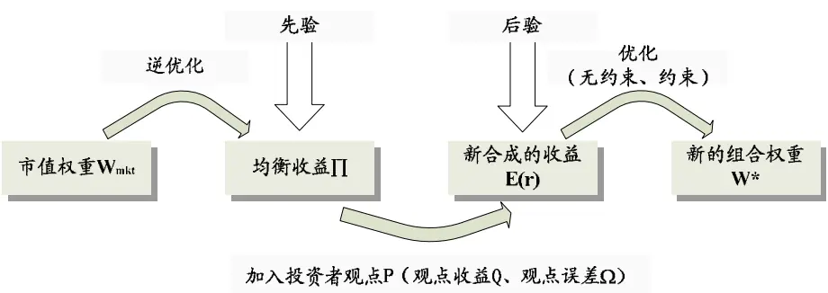
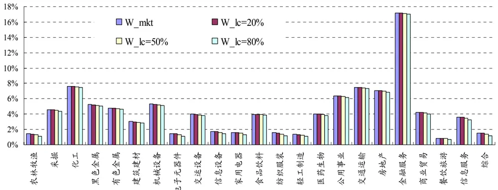
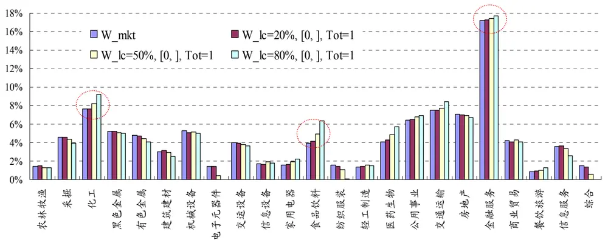
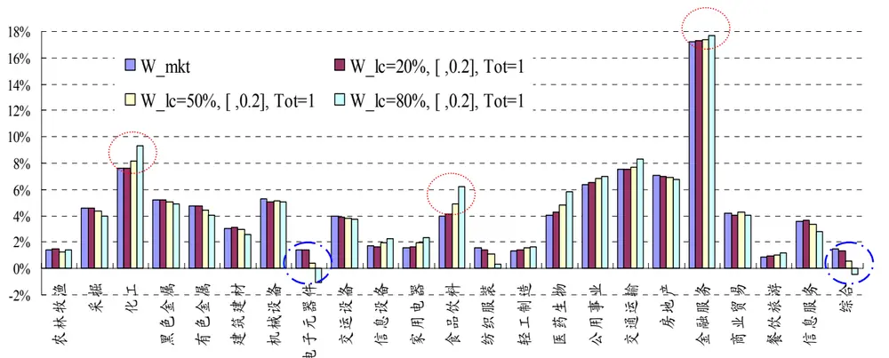
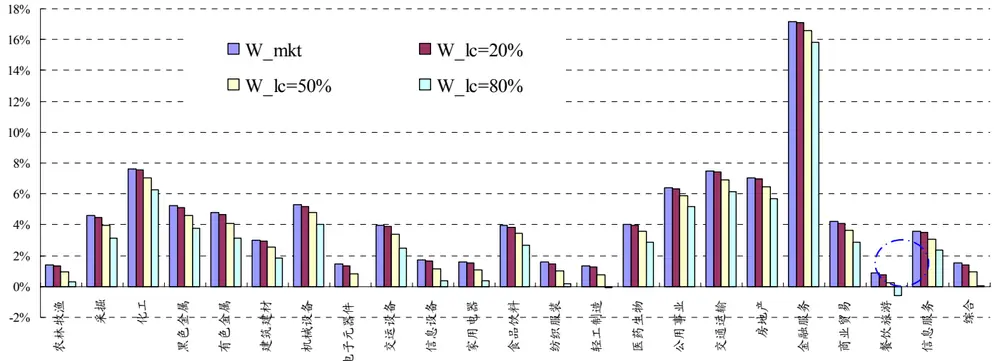
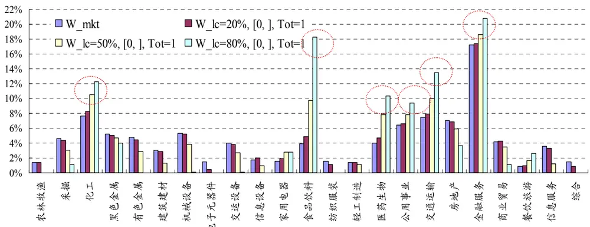
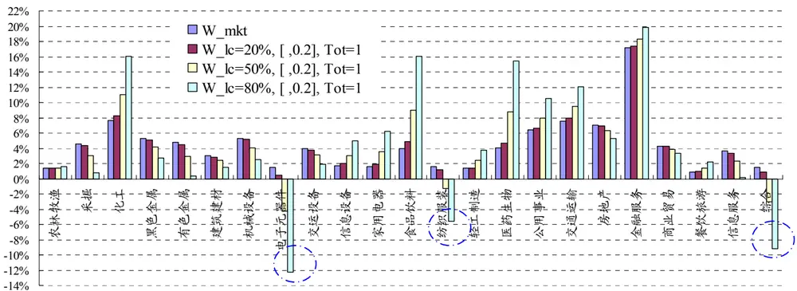
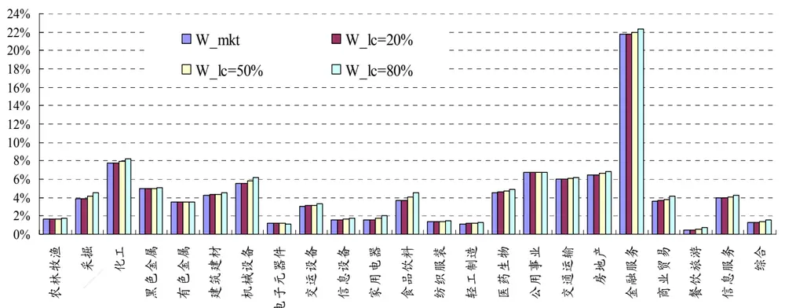
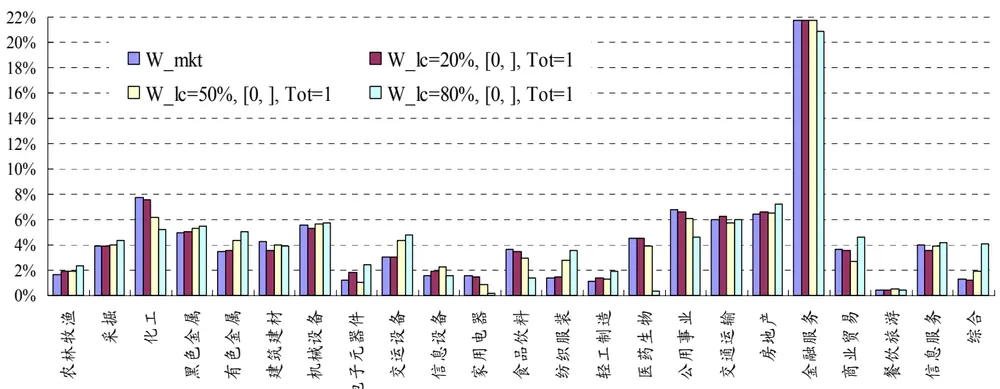
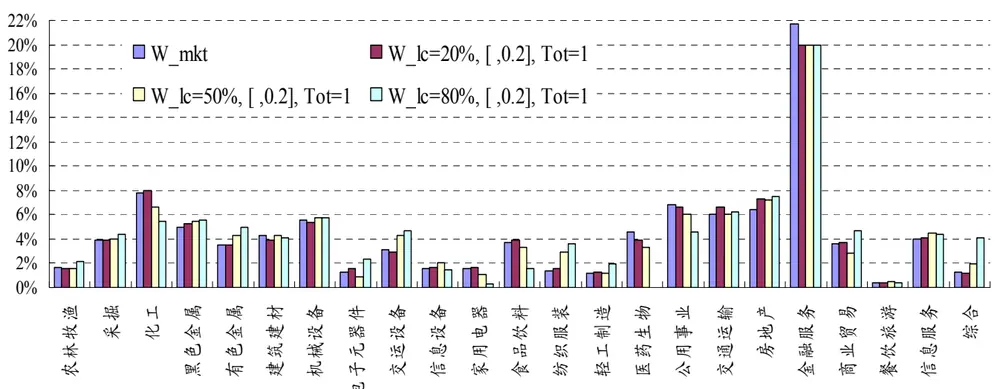

2008.12.1

# 资产配置之 B-L模型Ⅰ：实证篇——数量化系列研究之七

蒋瑛琨 杨喆

21-38676710 21-38676442

jiangyingkun@gtjas.com yangzhe@gtjas.com

本报告导读：

¾ B-L模型08年行业配置效果检验

¾ B-L模型09年行业配置

## 摘要：

我们对 B-L 模型 08 年行业配置的结果进行了检验，分别选取观点收益为一致预期和市场实际收益、50%信心水平下的业绩进行比较：新的组合都取得了高于上证综指和 Wind 全 A 指数的收益率；组合的波动性相对于上证综指较大，相对于 Wind 全 A 指数则较小；组合的 Beta 值大多高于 1（除了观点收益为实际收益、50%信心水平、无约束条件下 Beta为 0.902），但 Beta值均小于整体 A 股，在 08 年的下跌市，Beta 值越小意味着有更小的损失；组合的跟踪误差全部小于 Wind 全 A 指数，信息比率全部高于Wind 全 A 指数。

z 同一信心水平下，三种不同的条件下的业绩相比，无约束条件的业绩更好，收益最大且标准差最低，Beta 最低，信息比率最高。有卖空比无卖空业绩可能更好。单个资产上限 20%有一定影响，作用于金融服务业较多。

对于两种不同的观点收益，其他条件相同时，观点收益为市场实际收益的业绩优于观点收益为一致预期的业绩。最优的组合是观点收益为实际收益并且无约束条件，该组合的所有指标在本次检验中都是最优。这表明，如果观点收益能做到足够准确，那么经过 B-L 模型配置后的新组合完全能够战胜市场。

09年的行业配置结果：无约束条件下，配置相对较多的行业有食品饮料、机械设备、采掘、化工、商业贸易和金融服务，这几个行业在 08 年 11 月的研究员一致预期收益也最高；加入无卖空和组合总权重为 1 的限制条件后，相对高配的行业有交运设备、商业贸易、机械设备、纺织服装、采掘和房地产等，金融服务依旧保持在 20%以上；加入单个资产上限 20%的限制条件后，金融服务被调低至 20%，没有出现行业被卖空，相对高配的行业有交运设备、纺织服装、采掘、有色金属、商业贸易、房地产和综合等。

z 最后我们对 BL 模型的应用进行了总结。（1）B-L 模型能否有效运作的关键在于参数设置的合理性，但事实上，适当的参数设置是比较困难的。（2）具体到 B-L 模型在 A 股市场的应用还存在一些问题。（3）未来我们将对 B-L 模型的使用效果进行持续跟踪与改进。

本报告包括正文 12页，图 10张，表 3张。

## 1. B-L 模型实证设计

## 1.1. 实证步骤

B-L 模型的核心思想是使用贝叶斯方法将投资者的主观观点和市场均衡收益（先验收益）相结合，从而形成一个期望收益的估计值（后验收益），这个新形成的收益向量被看成投资者观点和市场均衡收益的复杂的加权平均。

从均衡收益出发，在加入投资者观点后形成一个新的后验收益，再用新的后验收益通过马克维兹均值-方差最优化求得新的组合权重。

图 1 B-L模型主要步骤

数据来源：国泰君安证券研究所

高盛的 Black and Litterman (1992)将 B-L 模型用于全球大类资产配置（股票、债券、货币），Bevan and Winkelmann (1998)用该模型进行全球债券配置。而B-L 模型本身的适用性极强，本次实证将 B-L 模型应用于我国 A 股市场的行业配置，采用申万一级行业分类。

## 1.2. 参数解释

## 1.2.1. 均衡收益

我们在之前的报告中已经对比了各种求解均衡收益的方法，历史平均超额收益(Historical Averages)、某个资产的超额收益的均值(Equal Means)、风险调整后的某个资产的超额收益的均值(Risk-Adjusted Equal Means)这些方法求得的均衡收益都具有缺陷（Black and Litterman (1992)、Adzorek (2002)）。

CAPM 模型中资本市场均衡是资产按市场组合权重配置，我们使用该均衡状态下的市值权重，用 Markowitz收益-方差最优化模型，来求解均衡收益。

$$
\begin{aligned}&\max_{w}w^{\top}\mu-\frac{\lambda}{2}w^{\top}\Sigma w^{\top}\\&w=(\lambda\Sigma)^{-1}\mu\\\end{aligned}
$$

$$
\Pi=\mu=\lambda\Sigma w=\lambda\Sigma w_{\mathrm{mkt}}
$$

其中， $w_{mkt}$ 是市场组合权重，∑是资产收益的协方差，λ是风险厌恶系数。（详细设定方法参见附录）

## 1.2.2. 投资者观点

投资者观点的加入是 B-L 模型一大特色，也是模型中最难表述的参数之一。如果投资者不发表任何观点，那么收益仍然是原来的均衡收益；如果投资者有观点，那么就把观点结合投资者的信心度一起进入模型。同一资产可被用于不同的观点，投资者不需要对所有资产发表观点，这在应用中有实际意义。对于研究员来说，可以只发表对自己所覆盖的资产的观点，也可以将多个研究员对同一资产的不同观点输入模型。

投资者的观点收益理论上是对投资该资产未来可获得收益的一种看法，然而这个收益估计非常困难。我们考量了多种对观点收益的替代办法，有历史收益估计法（包括动量和反转），也就是说用历史值作为投资者对未来收益的估计，但这种方法使投资者观点仍然停留在历史，并不能使作为模型特色和优势的投资者观点得以发挥，而且作为模型出发点的均衡收益本已是基于历史的市场中性下的收益，因此，在这个观点中应尽量发挥投资者的主观作用。

我们考量了其它一些财务指标，如净利润增长率、主营业务收入增长率、净资产收益率等，将各指标进行对比后发现，在我国市场，净利润增长率和主营业务收入增长率等指标非常不稳定、有时具有奇异值，而净资产收益率较为稳定，因此我们在本次实证中使用了净资产收益率作为观点收益，考虑到数据的时效性，我们选用朝阳永续提供的主流券商研究员对行业的一致预期净资产收益率(ROE)数据。

另外我们采用 Adzorek (2002)的方法，对第 i个观点设置信心水平 $\mathrm{LC_{i}},$ 根据信心水平和标准刻度因子 CF 来构建观点误差矩阵Ω（详细设定方法参见附录）。对于基金经理来说，可能有各种获得“观点”的渠道，如分析师、数据库、资源库等。对于每种渠道的观点，可以构建信心水平数据库。例如，对分析师编制“信息系数”(Information Coefficient)，即预测值和实际值的相关系数，从而来设定信心水平（Grinold and Kahn (1999)）。

## 1.3. 参数测试

根据参数设定方法（详见附录），我们首先对几个较有争议的参数进行测试，来确保模型的正确性和有效性。

τ值对结果的影响：一般情况下，当τ设定接近 10的负八次方（某些时候 0.001即可，跟数据输入有关），计算出来的 E[R]、w与先验∏、市值权重几乎没有区别，当τ大于 0.001 时，影响才开始显著，也就是说τ仅在 0.001-1 之间变化时，才会对结果有明显影响。在 1左右两侧时，τ值的变动对 E[R]影响最大，当τ从 1开始减小或增大，影响即开始减弱，左侧减弱更快。

Ω矩阵元素值对结果的影响：Ω对结果的影响是显著的，当Ω的对角元素值变大时，E[R]和 w 越来越接近于原始值（∏和市值权重），当Ω的对角元素值接近于 0（0.0001）时，E[R]接近于观点所表述的收益 Q，w趋向于一个稳定值，就算Ω继续变小，原始市值权重束缚了 w继续往观点所表述的方向改变。

τ值和Ω矩阵的元素值的测试结果完全符合我们的预期。均值-方差优化过程中，权重 w对收益µ的变动是敏感的，也就是说µ的微弱变动会引起优化权重w 有较明显的变动，反之，逆优化则是稳定的。这点也完全符合其他研究者的实证结果。在确保了参数的正确性和模型的有效性后，我们即展开下述实证研究。

## 2. B-L 模型实证结果

## 2.1.08年行业配置效果检验

## 2.1.1. 08 年行业配置

使用 07 年底的一致预期 ROE 作为观点收益，设置 20%、50%和 80%三个信心水平，W_mkt 表示按流通市值权重配置的资产组合，配置结果如下：

图 2 一致预期下的行业配置——无约束条件

数据来源：国泰君安证券研究所

无约束条件下的行业配置在流通市值基础上作了一些修正，这可以认为是投资者观点发挥了作用。由于没有对总权重进行约束，所有行业的配置权重都有一定程度的下降。20%、50%和 80%三个信心水平下的总权重分别为：99.63%、97.76%和 94.67%，这表明加入观点后，整体仓位在下降，且观点的信心水平越高，仓位越低。

在加入无卖空和组合总权重为 1的限制条件后，组合有了较大改变。一方面，组合相对高配了一些预期收益较高的行业，如食品饮料、金融服务和化工等；

另一方面，对历史波动性高的行业也进行了回避，如采掘、有色金属和电子元器件等。

图 3 一致预期下的行业配置——约束条件：无卖空，总权重=1

数据来源：国泰君安证券研究所

表 1 观点收益和历史波动性排序（从高到低）

| 观点收益 一致预期排序 |  | 历史波动排序 |
| --- | --- | --- |
| 有色金属 | 1 | 采掘 1 |
| 食品饮料 | 2 | 有色金属 2 |
| 金融服务 | 3 | 电子元器件 3 |
| 化工 | 4 | 房地产 4 |
| 餐饮旅游 | 5 | 金融服务 5 |
| 房地产 | 6 | 综合 6 |
| 采掘 | 7 | 黑色金属 7 |
| 黑色金属 | 8 | 信息设备 8 |
| 交运设备 | 9 | 餐饮旅游 9 |
| 交通运输 | 10 | 纺织服装 10 |
| 商业贸易 | 11 | 信息服务 11 |
| 机械设备 | 12 | 农林牧渔 12 |
| 建筑建材 | 13 | 交运设备 13 |
| 家用电器 | 14 | 家用电器 14 |
| 轻工制造 | 15 | 轻工制造 15 |
| 公用事业 | 16 | 建筑建材 16 |
| 医药生物 | 17 | 机械设备 17 |
| 信息服务 | 18 | 公用事业 18 |
| 信息设备 | 19 | 商业贸易 19 |
| 电子元器件 | 20 | 医药生物 20 |
| 农林牧渔 | 21 化工 | 21 |
| 综合 | 22 交通运输 | 22 |
| 纺织服装 | 23 | 食品饮料 23 |

数据来源：国泰君安证券研究所

注：历史波动性为03-07年

图 4 一致预期下的行业配置——有卖空，总权重为 1，单个资产上限 20%

数据来源：国泰君安证券研究所

由于在 07年底，没有一个行业的流通市值占比是高于 20%的，占比最高的金融服务业为 17.2%，观点中对金融服务业预期的高收益并不足以使其超过20%。去掉了卖空限制后，出现了卖空电子元器件和综合两行业（这两个行业在有卖空限制、80%信心水平时权重配置为 0），这是预期收益排在倒数的行业，纺织也有低配，而食品饮料、金融服务和化工依然相对高配。一些行业配置发生细微的变动，可以认为是其在组合中的收益以及与组合其他成员协方差综合作用的结果。

以上我们用 07 年底的一致预期进行了 08 年行业配置，投资者的观点对于配置结果非常重要，模型在流通市值占比基础上综合考量了投资者的观点，最后得出一个复杂加权后的配置，这在上述实证中也得到了很好的体现。

我们试想，如果投资者的观点能达到 100%的正确性，那么配置后的结果又如何呢？下面我们用 08年行业实际的收益率作为观点收益，再进行一次行业配置。

图 5 实际收益下的行业配置——无约束条件

数据来源：国泰君安证券研究所

使用实际收益作为观点收益后，在无约束条件下，各个行业都出现了相对于流通市值占比的低配，20%、50%和 80%三个信心水平下的总权重分别为97.82%、87.04%和 68.93%，这表明加入观点后，整体仓位有大幅下降，且观点的信心水平越高，仓位越低。在 80%的信心水平下，还出现了餐饮旅游被卖空，该行业在 08年下跌幅度排名第四。

图 6 实际收益的行业配置——约束条件：无卖空，总权重=1

数据来源：国泰君安证券研究所

在加入卖空限制和组合总权重为 1 的限制条件后，出现了高配食品饮料、医药生物、交通运输、公用事业、化工和金融服务，为何这跟之前无约束条件下的配置反差如此之大呢？我们认为，受到总权重为 1 的限制，组合不得不对一些行业进行高配，而除了金融服务外，前五个行业的波动性在所有行业中是最低的，在预期收益很低时，降低组合波动率是很好的办法。

在对历史协方差矩阵进行观测后，我们发现，金融服务和食品饮料两个行业与其他行业的协方差都在 0.05的数量级附近（这在所有协方差中属最低），因此我们进行了行业相关性分析，发现金融服务和其他行业的相关性是最低的，相关系数基本在 0.55-0.68 之间（食品饮料在 0.66-0.82 间，中间偏低），因此从相关性上来看，高配金融服务在情理之中。

图 7 实际收益下的行业配置——有卖空，总权重为 1，单个资产上限 20%

数据来源：国泰君安证券研究所

在加入 20%单个行业配置上限后，之前配置最高的三个行业金融服务、食品饮料和交通运输权重都有所下降，金融服务的权重从之前最高的 20.81%下降至 20%。化工、医药卫生和公用事业则有所上升。去掉卖空限制后，出现了对电子元器件、综合和纺织服装三个行业的卖空。电子元器件和综合的历史波动性较高，且这三个行业的流通市值权重本身也很低。

## 2.1.2. 08 年行业配置业绩

我们选取观点收益分别为一致预期和市场实际收益、50%信心水平下的业绩进行比较，新的组合，不论使用一致预期还是市场实际收益作为观点收益，组合都取得了高于上证综指和 Wind 全 A 指数的收益率。组合的波动性相对于上证综指较大，相对于代表全体 A股的 Wind全 A指数则较小。组合的 Beta值大多高于 1（除了观点收益为实际收益、50%信心水平、无约束条件下 Beta为 0.902），但 Beta 值均小于整体 A 股。在 08 年的下跌市，Beta 值越小意味着有更小的损失。组合的跟踪误差均小于 Wind 全 A 指数，信息比率均高于Wind全 A指数。

在同一信心水平下，三种不同条件下的业绩相比，无约束条件的业绩更好，收益最大且标准差最低，Beta 最低，信息比率最高。有卖空比无卖空业绩可能更好（当卖空限制发挥作用时），这在观点收益为实际收益时非常突出。单个资产上限 20%有一定影响，都是作用于金融服务业，按流通市值占比，只有金融服务超过了 20%，因此在新的组合中也最有可能超过 20%。

对于两种不同的观点收益，其他条件相同时，观点收益为市场实际收益的业绩优于观点收益为一致预期的业绩。最优的组合是观点收益为实际收益并且无约束条件，该组合的所有指标在本次检验中都是最优。这表明，如果观点收益能做到足够准确，那么经过 B-L模型配置后的新组合完全能够战胜市场。

表 2 观点收益为一致预期，50%信心水平下的业绩比较

|  | 无约束 | 无卖空，总权重=1 | 有卖空，总权重=1， 单个资产上限 20% | Wind 全A指数 | 上证 综指 |
| --- | --- | --- | --- | --- | --- |
| 收益 | -65.60% | -66.80% | -66.80% | -67.13% | -67.96% |
| 标准差 | 48.03% | 48.89% | 48.89% | 49.27% | 45.91% |
| 超额收益 | -69.69% | -70.89% | -70.89% | -71.22% | -72.05% |
| 跟踪误差 | 12.07% | 12.40% | 12.40% | 13.11% | 1 |
| Beta | 1.013 | 1.031 | 1.031 | 1.035 | 1 |
| 信息比率 | 0.196 | 0.093 | 0.093 | 0.0633 | 1 |

数据来源：国泰君安证券研究所
注：跟踪误差、Beta和信息比率的计算基准是上证综指

表 3 观点收益为实际收益，50%信心水平下的业绩比较

|  | 无约束 | 无卖空，总权重=1 | 有卖空，总权重=1， 单个资产上限 20% | Wind 全A指数 | 上证 综指 |
| --- | --- | --- | --- | --- | --- |
| 收益 | -58.36% | -66.48% | -65.54% | -67.13% | -67.96% |
| 标准差 | 42.69% | 48.07% | 47.89% | 49.27% | 45.91% |
| 超额收益 | -62.45% | -70.57% | -69.63% | -71.22% | -72.05% |
| 跟踪误差 | 11.29% | 12.11% | 12.17% | 13.11% | - |
| Beta | 0.902 | 1.013 | 1.009 | 1.035 | 1 |
| 信息比率 | 0.850 | 0.123 | 0.199 | 0.0633 | 1 |

数据来源：国泰君安证券研究所
注：跟踪误差、Beta和信息比率的计算基准是上证综指

## 2.2. 09 年行业配置

图 8 09年 B-L行业配置——无约束条件

数据来源：国泰君安证券研究所

无约束条件下，20%、50%和 80%三个信心水平的组合总权重分别为 1.005、1.029和 1.07，也就是说，加入观点后总权重都有所提升，且观点信心水平越高，提升幅度越大。配置相对较多的行业有食品饮料、机械设备、采掘、化工、商业贸易和金融服务。这几个行业在 08 年 11 月的一致预期收益中排序也最为靠前。

图 9 09年 B-L行业配置——约束条件：无卖空，总权重=1

数据来源：国泰君安证券研究所

加入无卖空和组合总权重为 1 的限制条件后，出现了之前高配的行业被大幅调低、且一部分低配行业被调高现象。这是为符合总权重为 1 的需要。相对高配的行业有交运设备、商业贸易、机械设备、纺织服装、采掘和房地产等。金融服务虽然被调低，但依旧保持在 20%以上。

图 10 09年 B-L 行业配置——有卖空，总权重为 1，单个资产上限 20%

数据来源：国泰君安证券研究所

加入单个资产上限 20%的限制条件后，金融服务被调低至 20%。没有出现行业被卖空。相对高配的行业有交运设备、纺织服装、采掘、有色金属、商业贸易、房地产和综合等。

## 3. 总结与进一步研究

在资产配置实践中，B-L 模型能否有效运作的关键在于参数设置的合理性。但事实上，适当的参数设置是比较困难的：

z 先验参数（如决定隐含均衡收益 П的风险厌恶系数λ以及多资产的收益协方差矩阵等）较难确定，B-L 模型使用者大多采用较长的历史数据以刻画相关变量，但在新兴或动荡的市场，这一基于历史的假设可能与真实市场有较大差距，A股市场即为典型例证。

z 后验参数如投资者观点的差异在很大程度上决定了按照 B-L 模型配置的效果。不同使用者对不同资产未来收益的观点存在差异，只有那些观点较正确的投资者才能受益于 B-L 模型的使用。但想做到这一点，决不是一个简单数据的估算，可能需要结合对宏观经济等方面的分析、使用数量化模型等方法予以支持。也就是说，参数使用的背后是大量关于基本分析与数量模型的使用。

z 此外，标量 τ 等参数该如何设置尚存争议。我们对 B-L 模型相关研究的梳理表明，不同研究者对 τ的计算公式、以及合理值范围存在很大分歧，例如 Heand Litterman (1999)与 Adzorek (2002)的设定方法完全不同，而 τ 值对配置结果的影响较大。

具体到 B-L模型在 A股市场的应用还存在一些问题。当然，这些问题在其他方面的数量化研究中也有体现。

z 新兴市场、政策市、市场均衡解等问题尤为突出。这对 B-L 模型的应用提出了挑战。

z 有效数据匮乏。对未来各行业预期收益的估算有很多方法，一个直观的办法是考虑各行业未来预期净利润增长、当前 PE与未来行业合理 PE的差异，其中行业未来预期净利润增长是重要因素。但鉴于国内该指标值（以及其他指标如主营业务收入增长率）波动很大且存在奇异值，我们采用了预期 ROE 数据，但这一指标显然存在改进空间。

未来我们将对 B-L模型的使用效果进行持续跟踪与改进，希望能为投资者提供更为有效的资产配置结果。

z 采用不同渠道的投资者观点进入模型，给出基于不同投资者预期、适用于同投资者的资产配置结果。

z 通过参数跟踪测试与比较，探寻合理参数的确定方法。

z 跟踪各市场投资领域对 B-L 模型的扩展，并尝试把其他因素（如宏观经济、新兴市场变量等）的影响纳入模型中，使模型更贴近 A股市场。

## 4. 附录 模型公式及参数设定

B-L模型新合成的后验收益 E[R]：

$$
E[R]=\left[(\tau\Sigma)^{-1}+P^{\prime}\Omega^{-1}P\right]^{-1}\left[(\tau\Sigma)^{-1}\Pi+P^{\prime}\Omega^{-1}Q\right]
$$

也可以写为： $E[R]=\Pi+\tau\Sigma P^{\dagger}(\Omega+\tau P\Sigma P^{\dagger})^{-1}(Q-P\Pi)$

在本文中：

n 表示资产数量

k 表示投资者观点数量 $(k<=n)$

′ 表示矩阵转置

-1 表示逆矩阵

τ：标量(Scalar)

Σ：n个资产收益的协方差矩阵(n×n矩阵)

П：隐含均衡收益向量 (n×1 列向量)

P：投资者观点矩阵(k×n矩阵，当只有一个观点时，则为 1×n行向量)

Q：观点收益向量(k×1 列向量)

Ω：观点误差的协方差矩阵，为对角阵，表示每个观点的信心水平(k×k矩阵)

新的资产组合权重 $\mathbf{W}^{*}$ （无约束条件）：

$$
w^{*}=w_{mkt}+P\left(\frac{\Omega}{\tau}+P\Sigma P\right)^{-1}\left(\frac{Q}{\lambda}-P\Sigma w_{mkt}\right)
$$

隐含均衡收益(∏)：

$$
\Pi=\mu=\lambda\Sigma w=\lambda\Sigma w_{\mathrm{mkt}}
$$

$w_{mkt}$ ：流通市值权重

∑：资产超额收益的协方差矩阵，采用过去 5年历史数据

λ：风险厌恶系数， $\lambda=\left(E(r)-r_f\right)/\sigma_m^2$

E(r)：期望市场收益，用过去 5年历史几何平均来估计

$\sigma_{\mathrm{m}}^{2}$ ：市场收益方差，采用过去 5年历史数据

$r_{f}:$ 无风险利率，采用过去 5年一年期存款利率加权平均

观点误差矩阵(Ω)：

设定标准刻度因子 CF（采用 Adzorek (2002)的方法，假定投资者信心水平在0%-100%之间，服从均值为 50%的正态分布）：

$$
CF=\frac{P^{*}\Sigma P^{*}}{\frac{1}{50\%}}
$$

$P^{*}$ ：观点矩阵 P 每列求和所得 1×n 行向量

每个观点的误差为：

$$
\frac{1}{LC_{i}}{}^{*}CF
$$

LCi：第 i个观点的信心水平

观点误差矩阵，为对角阵：

$$
\Omega=\left[\begin{matrix}{\left(\begin{matrix}{\mathcal{V}_{LC_{1}}*CF}\\\end{matrix}\right)}&{0}&{0}\\{0}&{...}&{0}\\{0}&{0}&{\left(\begin{matrix}{\mathcal{V}_{LC_{k}}*CF}\\\end{matrix}\right)}\\\end{matrix}\right]
$$

标量(τ)：

同样使用标准刻度因子 CF 和观点信心水平 $\mathrm{LC_{i}},$ ，共 k 个观点（k<=n），为Adzorek (2002)的方法。

$$
\overline{\omega}=\frac{\sum\limits_{i=1}^{k}(\sqrt[k]{LC_{i}}^{*}CF)}{k}
$$

$$
\tau=\frac{P^{*}\Sigma P^{*}}{\overline{\omega}}=\frac{P^{*}\Sigma P^{*}}{\sum\limits_{i=1}^{k}\left(\frac{\left|\left(\sum\limits_{LC_{i}}*CF\right)\right|}{k}\right)}
$$

## 作者简介：

蒋瑛琨: 现任研究所金融工程部经理，吉林大学数量经济学博士，CPA，08年入围新财富最佳分析师。从事股指期货、权证等金融衍生品以及金融工程研究，发表多篇深度报告。

杨 喆：同济大学计算机科学与技术专业学士，金融学专业硕士，2008年3月加入国泰君安研究所，目前从事金融工程和衍生品研究。

## 免责声明

本报告的信息均来源于公开资料，我公司对这些信息的准确性和完整性不作任何保证，也不保证所包含的信息和建议不会发生任何变更。我们已力求报告内容的客观、公正，但文中的观点、结论和建议仅供参考，报告中的信息或意见并不构成所述证券的买卖出价或征价，投资者据此做出的任何投资决策与本公司和作者无关。

我公司及其所属关联机构可能会持有报告中提到的公司所发行的证券头寸并进行交易，也可能为这些公司提供或者争取提供投资银行、财务顾问或者金融产品等相关服务。

本报告版权仅为我公司所有，未经书面许可，任何机构和个人不得以任何形式翻版、复制和发布。如引用、刊发，需注明出处为国泰君安证券研究所，且不得对本报告进行有悖原意的引用、删节和修改。

## 国泰君安证券研究所

上海

上海市银城中路 168号上海银行大厦 29层

邮政编码：200120

电话：（021）62580818

深圳

深圳市罗湖区笋岗路 12号中民时代广场 A座 20楼

邮政编码：518029

电话：（0755）82485666

北京

北京市西城区金融大街 28号盈泰中心 2号楼 10层

邮政编码：100140

电话：（010）59312799

国泰君安证券研究所网址： www.askgtja.com

E-MAIL：gtjaresearch@ms.gtjas.com