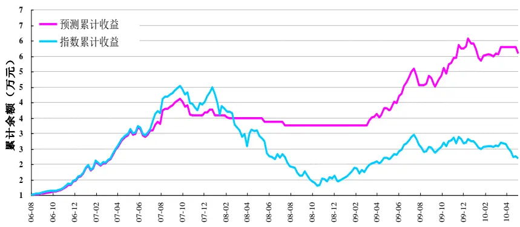
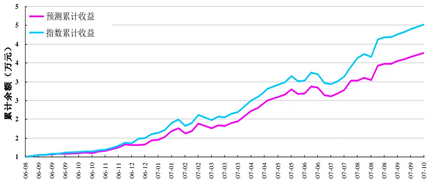
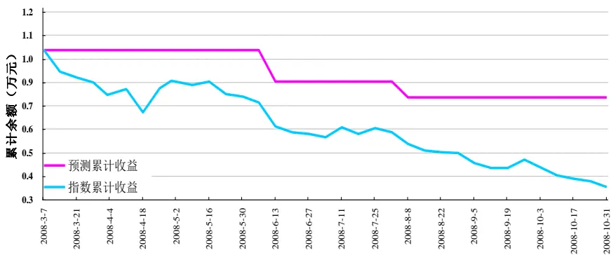
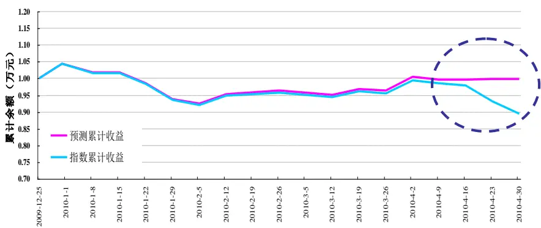

金融工程

·1-1í

# 基于支持向量机的股票市场择时

# 数量化系列研究之八

17

#THTO

よに

8 021-38676442

021-38676710

yangzhe@gtjas.com

jiangyingkun@gtjas

S0880108073515

S0880209020385

## 本报告导读：

- SVM 模型在单边市的预测准确率最高，在上涨和下跌市均在 70%以上；在震荡市准确率最低，为 53%；整体市场的准确率为 61.58%

## 摘要：•

le_Summary] 传统的金融分析和理论中，所采用的决策模型往往都是建立在苛刻的假设条件下的，虽然这些简洁的模型很容易理解和解释，但在精度和解释力度上就往往偏离了实际情况。金融数据挖掘技术的运用从某些意义上来讲可以突破这些限制，得到更实用更贴近现实的预测结果。

- 支持向量机作为数据挖掘领域应用于模式识别的新技术，它克服了传统统计模式识别方法存在的样本需求量大、过度学习、局部最小值等问题。

支持向量机(Support Vector Machines, SVM) 是 Vapnik 和他的合作者于1995 年在统计学习理论和结构风险最小化原则基础上提出的，它具备完备的理论基础和出色的学习能力，是借助于最优化方法解决有限样本机器学习问题的数据挖掘新方法。

SVM 是以训练误差作为优化问题的约束条件，以置信范围值最小化作为优化目标，结构风险最小化原则决定了 SVM 在某些领域的预测能力要优于神经网络等传统学习方法。SVM 利用一些具有特殊性质的核函数，将低维空间中的非线性分类通过内积运算转化为高维空间中的线性分类。目前支持向量机已逐步被应用至金融领域。

股指期货的推出使得我们对大盘方向的判断具有可操作性，我们可以在判断后市涨的时候做多，判断后市跌的时候做空。甚至可以构建基于一定概率的交易策略，通过设计好买卖的点位、止盈止损位，能使概率策略的盈利变为可行。

我们采用 SVM 方法，对股指期货标的沪深 300 指数进行全市场、上涨市、下跌市和震荡市的择时判断。我们所预测的是：沪深 300 指数在下一周的涨或跌，也就是说是个 0 和 1 的选择。

我们构建的基本策略是：建立两个账户，分别是指数账户和 SVM 账户，并分别投资10000元。指数账户采取完全复制沪深300指数的策略；SVM账户按照预测结果对仓位进行调整，当预测指数上涨时，则复制指数进行投资，当预测指数下跌时，则空仓操作。

请务必阅读正文之后的免责条款部分

## 相关报告

《资产配置之 B-L模型Ⅱ：实证篇数量化系列研究之七》

2008.12.01

《资产配置之 B-L模型Ⅰ：理论篇数量化系列研究之六》

2008.12.01

## 1. 支持向量机模型（SVM）

## 1.1. SVM 简介

随着数据库技术的成熟和计算机应用的普及，我们身边每周所生成的新数据量正在以指数速度迅速的膨胀着。如何从如此庞大的数据库中删选，加工，挖掘其中的有用知识就将变得尤为重要。

传统的金融分析和理论中，所采用的决策模型往往都是建立在苛刻的假设条件下的，形式上就是一些简单的数学公式。虽然这些简洁的模型很容易理解和解释，但在精度和解释力度上就往往偏离了实际情况。金融数据挖掘技术的运用从某些意义上来讲可以突破这些限制，得到更实用更贴近现实的预测结果。

单就股票市场而言，其中的金融规律复杂，影响因素较多。就其影响因素总体而言，影响股市的变化趋势主要包括：一是国家的经济趋势，二是股市中的资金状况，三是股市的市场信心等。最终导致金融变量的取值可能会和很多因素有关，并且其中的相关关系可能是线形的也可能是非线性的。具体到量化模型而言，有些关系是能够用初等函数来表示，而另一些可能没有办法用数学形式来表示。

进一步，金融数据中所包含的规律往往时效性非常强。随着时间的推移和环境的变化，金融序列中所蕴含的规律在不断地更迭。举例而言，在熊市中的某些规律往往到了牛市就不再起作用了，传统模型对于金融序列的动态性就束手无策了，而运用数据挖掘技术可以在不断的获得新数据后动态更新以适应新的环境。

而支持向量机作为数据挖掘领域应用于模式识别的新技术，它克服了传统的统计模式识别方法存在的以下所列举的缺点，因此其具备良好的机器识别能力。

传统的统计模式识别方法的缺点：

- 传统的统计模式识别方法，只有在样本趋向无穷大时，其性能才有理论的保证。

- 传统的统计模式识别方法，包括 BP 神经网络等，在进行机器学习时，强调经验风险最小化。而单纯的经验风险最小化会产生“过学习问题”，其推广能力较差。

- 传统的统计模式识别方法存在局部极小值的问题。

而作为支持向量机的理论基础——统计学习理论，则是小样本统计估计和预测学习的最佳理论。它解决了传统方法存在的以上问题。

## 1.2. SVM 的核心思想

支持向量机(Support Vector Machines, SVM) 是 Vapnik 和他的合作者于1995年在统计学习理论和结构风险最小化原则基础上提出的，它具备完备的理论基础和出色的学习能力，是借助于最优化方法解决有限样本机器学习问题的数据挖掘新方法。

区别于神经网络等传统方法以训练误差最小化作为优化目标，SVM 是以训练误差作为优化问题的约束条件，以置信范围值最小化作为优化目标，结构风险最小化原则决定了 SVM 在某些领域的预测能力要优于神经网络等传统学习方法。SVM 利用一些具有特殊性质的核函数，将低维空间中的非线性分类通过内积运算转化为高维空间中的线性分类。

就其核心思想而言，支持向量机是基于Mercer核展开定理，通过非线性映射把特征空间映射到 Hilbert 空间，在 Hilbert 空间中用线性学习机方法解决非线性分类和回归问题。

## 1.3. SVM 的应用价值

目前支持向量机的应用领域较为广泛，已经在生物信息学，计算机识别、大气污染预报、石油勘探、工业制造等领域都取得了成功的应用。与此同时，该方法也已经逐步被应用至金融领域，它在金融领域同样有着很高应用价值。

2004 年 Paiand 和 Lin 运用了 SVM 方法，对美国股票市场上的大盘股的走势进行了预测，其预测结果显示表明该模型有着很好的预测效果。2007 年刘丽霞等运用 SVM 方法对纽约商品交易市场的两种石油期货价格数据进行预测，研究结果表明该方法有着较高的拟合和预测精度，而且明显优于神经网络的预测模型。国内外文献研究表明，支持向量机方法在金融市场也有着很高的运用价值和运用前景。

## 2. 基于支持向量机的股票市场择时

股指期货的推出使得我们对大盘方向的判断具有可操作性，我们可以在判断后市涨的时候做多，判断后市跌的时候做空。甚至可以构建基于一定概率的交易策略，比如在以前，55%的择时准确率（这是很多模型都能达到的概率）可能还不足以产生利润，甚至在某些时候因为几笔重大失利导致亏损。股指期货推出后，通过设计好买卖的点位、止盈止损位，能使概率策略的盈利变为可行。

因此我们采用 SVM 方法，首先对股指期货标的沪深 300 指数进行预测分析，来对市场较长时期进行择时判断，同时我们选择几段市场：单边上涨、单边下跌和震荡市来进行分类预测。

我们预测的是沪深300指数在下一周的涨跌，也就是说是个 0和1的选择。选择的指标主要有以下几个。

表1：SVM指标选择

| 指标 | 指标 | 指标 | 指标 |
| --- | --- | --- | --- |
| 周最高价 | 周最低价 | 周收益率 | 上周收益率 |
| 前周收益率 | 成交额 | 近四周平均成交额 | 上周成交额 |

数据来源：国泰君安证券研究

## 2.1. 整体市场择时

我们选取一段包含有上升、下跌、震荡过程的市场阶段来考察 SVM 的有效性。采用的样本数据是 2006年2月24 日到2010 年5月 21日的周数据，样本数量为 210 周；其中训练样本滑窗长度为 20 周。

我们利用预测结果进行模拟操作，在2006年 8月 18 日分别建立两个账户，分别是指数账户和 SVM 账户，并分别投资 10000 元。指数账户采取完全复制沪深300指数的策略；SVM账户按照预测结果对仓位进行调整，当预测指数上涨时，则复制指数进行投资，当预测指数下跌时，则空仓操作。

SVM 账户最后的资金是指数账户的 2.5 倍，年化收益率是指数的 2.5 倍，年化波动率仅为指数的 3/5，夏普比率是指数的 4.4 倍。SVM 的预测正确率为61.58%。这一结果表明采用 SVM对于预测大盘走势，存在一定的价值。

表2：SVM对整体市场的择时

| 市场全过程（2006.8.18—2010.5.21） |  |  |
| --- | --- | --- |
| 基本信息 | 样本周数：210 | 预测周数：189 |
|  | 滑窗长度：20 | 预测准确率：61.58% |
| 账户类别 | 指数账户 | SVM账户 |
| 初始资金 | 10000元 | 10000元 |
| 累计收益率 | 118.38% | 458.13% |
| 最终余额 | 21838.12元 | 55813.42元 |
| 年化收益率 | 23.83% | 60.09% |
| 年化波动率 | 37.61% | 23.05% |
| 夏普比率 | 0.57 | 2.51 |

数据来源：国泰君安证券研究，下同

图 1 SVM 预测累计收益（2006.8-2010.5）

数据来源：国泰君安证券研究，下同

## 2.2.分阶段市场择时

## 2.2.1. 上涨市

我们选取一段典型的单边上涨市。采用的样本数据是2006 年3 月24日到 2007 年 10 月 12 日的周数据，样本数量为 77；其中训练样本滑窗长度为 20。

我们利用预测结果进行模拟操作，在 2006 年 8 月 18 日分别建立两个账户，分别是指数账户和 SVM 账户，并分别投资 10000 元。指数账户采取完全复制沪深300指数的策略；SVM账户按照预测结果对仓位进行调整，当预测指数上涨时，则复制指数进行投资，当预测指数下跌时，则空仓操作。

虽然在这段市场，SVM 账户没有跑赢市场，最后收益率为指数账户的80%左右，年化波动率也仅微弱地小于指数，但在整个单边上涨市，SVM预测的准确率达到了73.68%，比市场全过程高，这表明在上涨市 SVM具有较高的参考价值。

表 3：SVM对单边上涨市场的择时

| 单边上涨全过程（2006.8.18—2007.10.12） |  |  |
| --- | --- | --- |
| 基本信息 | 样本周数：77 | 预测周数：56 |
|  | 滑窗长度：20 | 预测准确率：73.68% |
| 账户类别 | 指数账户 | SVM账户 |
| 初始资金 | 10000元 | 10000元 |
| 累计收益率 | 352.51% | 276.55% |
| 最终余额 | 45250.85元 | 37655.14元 |
| 年化收益率 | 287.08% | 228.29% |
| 年化波动率 | 29.38% | 28.82% |
| 夏普比率 | 9.69 | 7.84 |

图 2 SVM 预测累计收益（2006.8-2007.10）

## 2.2.2. 下跌市

我们选取一段典型的单边下跌市。采用的样本数据是 2007 年 10 月 19日到2008年 10月 31 日的周数据，样本数量为 54周，其中训练样本滑窗长度为20 周。

我们利用预测结果进行模拟操作，在 2008 年 3 月 7 日分别建立两个账户，分别是指数账户和 SVM 账户，并分别投资 10000 元。指数账户采取完全复制沪深300指数的策略；SVM账户按照预测结果对仓位进行调整，当预测指数上涨时，则复制指数进行投资，当预测指数下跌时，则空仓操作。

在整个下跌市，SVM 取得了不错的业绩。SVM 账户的跌幅仅为指数的40%不到，年化波动率仅为指数的 44%，预测准确率达 72.73%。这表明 SVM 在单边下跌市也具有较高的参考价值。并且 SVM 在 07 年底、08 年 6 月中和 8 月初果断空仓，有效规避了两轮市场下跌。

表 4：SVM对单边下跌市场的择时

| 单边下跌全过程（2007.10.19—2008.10.31） |  |  |
| --- | --- | --- |
| 基本信息 | 样本周数：54 | 预测周数：33 |
|  | 滑窗长度：20 | 预测准确率：72.73% |
| 账户类别 | 指数账户 | SVM账户 |
| 初始资金 | 10000元 | 10000元 |
| 累计收益率 | -64.00% | -22.12% |
| 最终余额 | 3599.68元 | 7788.08元 |
| 年化收益率 | -79.04% | -31.77% |
| 年化波动率 | 47.04% | 21.11% |

图 3 SVM 预测累计收益（2008.3-2008.10）

## 2.2.3. 震荡市

我们选取一段震荡市。采用的样本数据是 2009 年 8 月 7 日到 2010 年 4月30日的周数据，样本数量为 38 周；其中训练样本滑窗长度为20周。我们利用预测结果进行模拟操作，2009年12月25日分别建立两个账户，分别是指数账户和 SVM 账户，并分别投资 10000 元。指数账户采取完全复制沪深300指数的策略；SVM账户按照预测结果对仓位进行调整，当预测指数上涨时，则复制指数进行投资，当预测指数下跌时，则空仓操作。

在震荡市中，SVM 预测的准确性下降了很多，仅为 52.94%，远低于单边市。在 09 年末至 10 年的 4 月初，SVM 账户与指数走势基本一致，也就是说在这段时期，SVM 账户一直是满仓操作的。然而在 10 年 4 月16 日以后，SVM 账户一直是空仓操作，有效规避了大盘的一波猛跌，这让我们感到一丝欣慰，SVM 的抗风险能力再一次得到了验证。最后SVM 账户仅跌了 0.2%，而指数下跌了 10%。

表 4：SVM对震荡市场的择时

| 震荡市场（2009.08.07—2010.4.30） |  |  |
| --- | --- | --- |
| 基本信息 | 样本周数：38 | 预测周数：17 |
|  | 滑窗长度：20 | 预测准确率：52.94% |
| 账户类别 | 指数账户 | SVM账户 |
| 初始资金 | 10000元 | 10000元 |
| 累计收益率 | -10.44% | -0.20% |
| 最终余额 | 8956.40元 | 9980.34元 |
| 年化收益率 | -27.27% | -0.57% |
| 年化波动率 | 20.52% | 17.66% |

图 4 SVM 预测累计收益（2009.12-2008.4）

## 2.3. SVM 总结

- SVM 在单边市场有着较高的预测精度，在单边上涨和单边下跌市场，其预测精度均在 70%以上。

- 利用SVM可以在市场下跌时有效地规避市场下跌风险。例如在07年底和 08 年初，SVM 提前预示了市场将大幅大跌的风险，在 07年 11 月份采取了空仓的操作，从而有效规避了 08 年市场大幅下跌。另外，SVM 在 08 年 6 月中和 8 月初也果断空仓，有效规避了两轮市场下跌。

- 在震荡市，利用 SVM 方法进行投资的收益基本和市场一致，但是一旦市场的出现较为明显的向下或向上时，SVM 可以较早的给予提示。例如在 10 年 4 月 16 日以后，SVM 账户从年初以来的持有状态变为空仓操作，有效规避了大盘的一波猛跌。

- 当采用 SVM 出现较为集中的失误时，值得引起我们重视，因为很可能这意味着市场的拐点已到来。

表4：SVM对沪深300指数预测结果指标汇总

|  | 整体市场 | 上涨市 | 下跌市 | 震荡市 |
| --- | --- | --- | --- | --- |
| SVM准确率 | 61.58% | 73.68 % | 72.73% | 52.94% |
| SVM年化收益率(沪深 300 指数) | 60.09%(23.83%) | 228.29%(287.08%) | -31.77%(-79.04% ) | -0.57%(-27.27% ) |
| SVM年化波动率(沪深 300 指数) | 23.05%(37.61%) | 28.82%(29.38%) | 21.11%(47.04%) | 17.66%(20.52%) |
| SVM夏普比率(沪深 300 指数) | 2.51(0.57) | 7.84( 9.69) |  |  |

注：收益率、波动率、夏普比率均为该策略收益的指标：判断后市涨时指数配置、判 断后市跌时空仓的策略。

## 分析师声明

作者具有中国证券业协会授予的证券投资咨询执业资格或相当的专业胜任能力，保证报告所采用的数据均来自合规渠道，分析逻辑基于作者的职业理解，本报告清晰准确地反映了作者的研究观点，力求独立、客观和公正，结论不受任何第三方的授意或影响，特此声明。

## 免责声明

本报告仅供国泰君安证券股份有限公司（以下简称“本公司”）的客户使用。本公司不会因接收人收到本报告而视其为本公司的当然客户。本报告仅在相关法律许可的情况下发放，并仅为提供信息而发放，概不构成任何广告。

本报告的信息来源于已公开的资料，本公司对该等信息的准确性、完整性或可靠性不作任何保证。本报告所载的资料、意见及推测仅反映本公司于发布本报告当日的判断，本报告所指的证券或投资标的的价格、价值及投资收入可升可跌。过往表现不应作为日后的表现依据。在不同时期，本公司可发出与本报告所载资料、意见及推测不一致的报告。本公司不保证本报告所含信息保持在最新状态。同时，本公司对本报告所含信息可在不发出通知的情形下做出修改，投资者应当自行关注相应的更新或修改。

本报告中所指的投资及服务可能不适合个别客户，不构成客户私人咨询建议。在任何情况下，本报告中的信息或所表述的意见均不构成对任何人的投资建议。在任何情况下，本公司、本公司员工或者关联机构不承诺投资者一定获利，不与投资者分享投资收益，也不对任何人因使用本报告中的任何内容所引致的任何损失负任何责任。投资者务必注意，其据此做出的任何投资决策与本公司、本公司员工或者关联机构无关。

本公司利用信息隔离墙控制内部一个或多个领域、部门或关联机构之间的信息流动。因此，投资者应注意，在法律许可的情况下，本公司及其所属关联机构可能会持有报告中提到的公司所发行的证券或期权并进行证券或期权交易，也可能为这些公司提供或者争取提供投资银行、财务顾问或者金融产品等相关服务。在法律许可的情况下，本公司的员工可能担任本报告所提到的公司的董事。

市场有风险，投资需谨慎。投资者不应将本报告为作出投资决策的惟一参考因素，亦不应认为本报告可以取代自己的判断。在决定投资前，如有需要，投资者务必向专业人士咨询并谨慎决策。

本报告版权仅为本公司所有，未经书面许可，任何机构和个人不得以任何形式翻版、复制、发表或引用。如征得本公司同意进行引用、刊发的，需在允许的范围内使用，并注明出处为“国泰君安证券研究”，且不得对本报告进行任何有悖原意的引用、删节和修改。

若本公司以外的其他机构（以下简称“该机构”）发送本报告，则由该机构独自为此发送行为负责。通过此途径获得本报告的投资者应自行联系该机构以要求获悉更详细信息或进而交易本报告中提及的证券。本报告不构成本公司向该机构之客户提供的投资建议，本公司、本公司员工或者关联机构亦不为该机构之客户因使用本报告或报告所载内容引起的任何损失承担任何责任。

## 评级说明

## 1.投资建议的比较标准

投资评级分为股票评级和行业评级。

以报告发布后的12个月内的市场表现为比较标准，报告发布日后的 12个月内的公司股价（或行业指数）的涨跌幅相对同期的沪深 300 指数涨跌幅为基准。

## 2.投资建议的评级标准

报告发布日后的 12 个月内的公司股价（或行业指数）的涨跌幅相对同期的沪深 300 指数的涨跌幅。

|  | 评级 说明 |  |
| --- | --- | --- |
| 股票投资评级 | 增持 | 相对沪深 300指数涨幅15%以上 |
|  | 谨慎增持 | 相对沪深300指数涨幅介于5%～15%之间 |
|  | 中性 | 相对沪深300指数涨幅介于-5%～5% |
|  | 减持 | 相对沪深 300 指数下跌 5%以上 |
| 行业投资评级 | 增持 | 明显强于沪深 300 指数 |
|  | 中性 | 基本与沪深 300 指数持平 |
|  | 减持 | 明显弱于沪深 300 指数 |

国泰君安证券研究

|  | 上海 | 深圳 | 北京 |
| --- | --- | --- | --- |
| 地址 | 上海市浦东新区银城中路168号上海 银行大厦29层 | 深圳市福田区益田路 6009 号新世界 商务中心34层 | 北京市西城区金融大街28 号盈泰中 心2号楼10层 |
| 邮编 | 200120 | 518026 | 100140 |
| 电话 | (021)38676666 | （0755)23976888 | (010)59312799 |
|  | E-mail: gtjaresearch@gtjas.com |  |  |