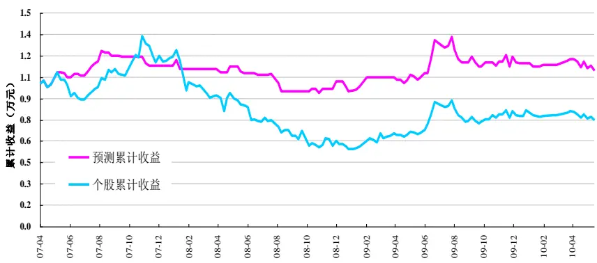
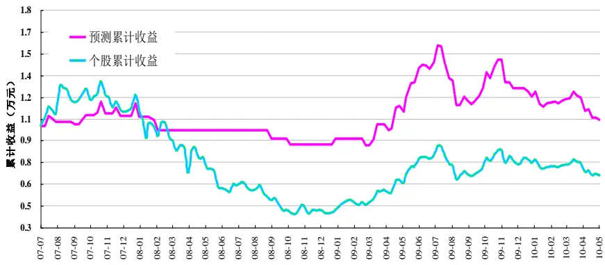
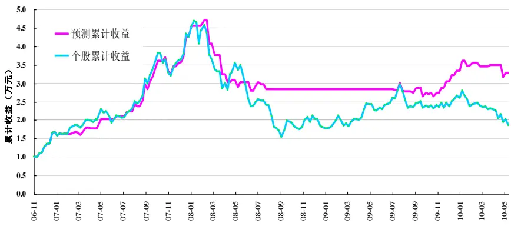
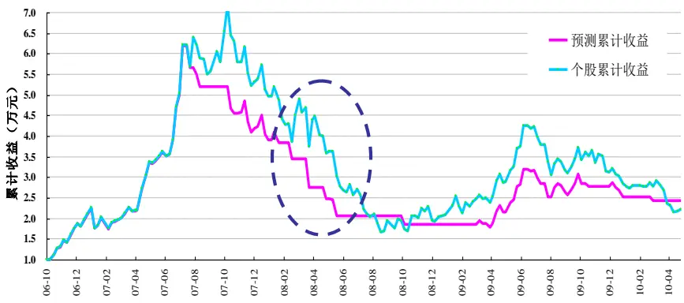
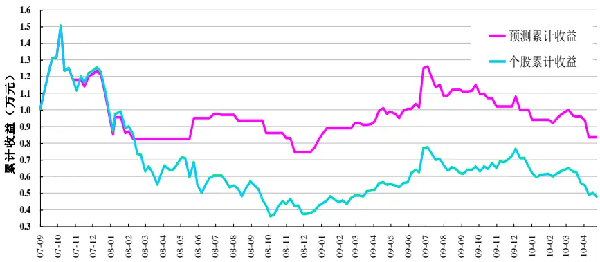
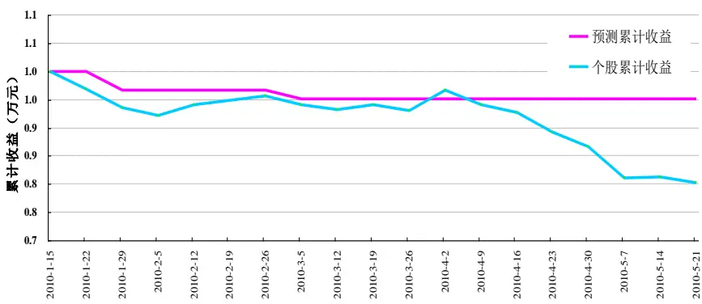
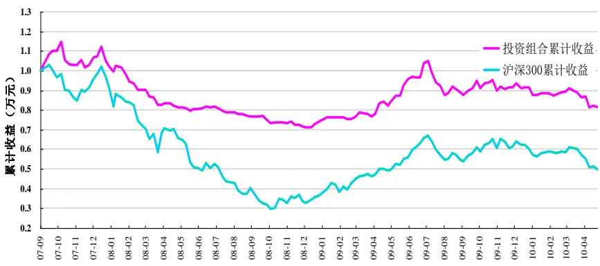

金融工程

·1-1í

# 基于支持向量机的个股及组合择时数量化系列研究之九

#THTO

よに

8

021-38676442

021-38676710

yangzhe@gtjas.com

jiangyingkun@gtjas.com

S0880108073515

S0880209020385

## 本报告导读：

采用 SVM 模型对个股进行择时判断，构建的交易策略在六只个股上最后均获得了优于个股本身的业绩，同时业绩波动性也更低

## 摘要：•

le_Summary] 根据支持向量机（SVM）预测股票价格涨跌操作性强的特点，我们利用其对个股走势的判断构建交易策略，当预测股票价格上涨时，买入该股票，当预测股票价格下跌时，则空仓操作。

由于部分个股走势的波动性相对指数较强，且走势风格也不尽相同，因此我们通过选取某些特定的个股形成投资组合，根据组合内的个股预测结果进行相应的交易，这样可以获得持续稳定的较高收益。

考虑到做空机制，我们首先对融资融券标的股票采用支持向量机方法进行预测，当判断股票价格下跌时，我们可以将策略拓展为卖空股票。我们预测的是个股在下一周的涨跌，也就是说是个0 和 1的选择。

## 样本股票：

盘子较小的股票，容易受到庄家的操纵，其股票的走势不能真实反映其股票本身的内在变动规律，因此我们从融资融券业务标的范围中，选出 A 股流通市值排名前十的股票，最后确定为中国银行、民生银行、中国联通、万科A、中国石化和中国建筑六只。

## 策略构建：

我们利用SVM预测结果进行模拟操作，建立两个账户，分别是个股账户和SVM账户，并分别投资 1万元。个股账户采取完全复制个股走势的策略；SVM 账户按照预测结果对仓位进行调整，当预测个股上涨时，则复制个股走势，当预测个股下跌时，则空仓操作。

## 投资结果：

- 我们对六只个股分别进行 SVM 预测并进行投资，最后 SVM 账户均获得了优于个股本身的业绩，同时业绩波动性也更低。

另外我们以这些个股为标的形成投资组合，由于中国建筑样本时间较短，最后选取中国银行、民生银行、中国联通、万科A 和中国石化5请务必阅读正文之后的免责条款部分股票形成一个投资组合。该投资

## [Table_R相关报告

《基于支持向量机的股票市场择时数量化系列研究之八》2010.07.21

## 1. 基于支持向量机的个股及其组合择时

根据支持向量机（SVM）预测股票价格涨跌操作性强的特点，我们利用其对个股走势的判断构建交易策略，当预测股票价格上涨时，买入该股票，当预测股票价格下跌时，则空仓操作。由于部分个股走势的波动性相对指数较强，且走势风格也不尽相同，因此我们通过选取某些特定的个股形成投资组合，根据组合内的个股预测结果进行相应的交易，这样可以获得持续稳定的较高收益。

考虑到做空机制，我们首先对融资融券标的股票采用支持向量机（SVM）方法进行预测，当判断股票价格下跌时，我们可以将策略拓展为卖空股票。我们对这些股票进行较长时期的择时判断。

我们预测的是个股在下一周的涨跌，也就是说是个0 和 1的选择。选择的指标主要有以下8个。

表 1：SVM 指标选择

| 指标 | 指标 | 指标 | 指标 |
| --- | --- | --- | --- |
| 周最高价 | 周最低价 | 周收益率 | 上周收益率 |
| 前周收益率 | 成交额 | 近四周平均成交额 | 上周成交额 |

数据来源：国泰君安证券研究

## 2. 股票选取原则

由于盘子较小的股票，容易受到庄家的操纵，其股票的走势不能真实反映其股票本身的内在变动规律。因此我们从融资融券业务标的范围中，选出 A 股流通市值排名前十的股票。

1）十只股票中有六只股票为银行股，因此我们仅选取两只银行股进行预测，分别是中国银行和民生银行。

3）剩下的股票分别是中国联通、万科A 和中国石化。

通过以上分析，本报告主要对中国银行、民生银行、中国联通、万科A、

中国石化和中国建筑进行预测研究。

## 3. SVM方法对于股票价格的预测

## 3.1.中国银行预测分析

我们采用的数据是2006年 11月 3日到2010年 5月 21日的周数据，样本数量为172；其中训练样本滑窗长度为20。

我们利用预测结果进行模拟操作，在 2007 年 4 月 6 日分别建立两个账户，分别是个股账户和 SVM 账户，并分别投资 10000 元。个股账户采取完全复制个股走势的策略；SVM账户按照预测结果对仓位进行调整，当预测个股上涨时，则复制个股，当预测个股下跌时，则空仓操作。

SVM 账户最后的资金是个股帐户的 1.5 倍，在个股累计下跌 25.4%的情形下，利用 SVM 进行预测投资取得了 9.34%的绝对正收益。而且 SVM账户的年化波动率也不到个股的 3/5，收益稳定性较高。SVM 的预测正确率为 50.99%，单从这个概率来看并不是很高，但由于 SVM 账户在个股单边下跌阶段及时采取空仓操作，从而有效地规避了个股的大幅下跌，实现了正收益。SVM 的风控能力是值得肯定的。

表 2：SVM对中国银行的择时

| 中国银行（2006.11.3—2010.5.21） |  |  |
| --- | --- | --- |
| 基本信息 | 样本周数：172 | 预测周数：151 |
|  | 滑窗长度：20 | 预测准确率：50.99% |
| 账户类别 | 个股账户 | SVM账户 |
| 初始资金 | 10000元 | 10000元 |
| 累计收益率 | -25.40% | 9.34% |
| 最终余额 | 7460.04元 | 10934.45元 |
| 年化收益率 | -9.54% | 3.10% |
| 年化波动率 | 32.65% | 19.20% |

数据来源：国泰君安证券研究，下同

图 1 SVM 预测累计收益-中国银行（2007.4-2010.5）

数据来源：国泰君安证券研究，下同

## 3.2.民生银行预测分析

我们采用的数据是 2007 年 3 月 2 日到 2010 年 5 月 21 日的周数据，样本数量为165；其中训练样本滑窗长度为20。

我们利用预测结果进行模拟操作，在2007年 7月 20 日分别建立两个账户，分别是个股账户和 SVM 账户，并分别投资 10000 元。个股账户采取完全复制个股走势的策略；SVM账户按照预测结果对仓位进行调整，当预测个股上涨时，则复制个股，当预测个股下跌时，则空仓操作。

SVM 账户在民生银行累计下跌 33.92%的情形下，取得了 4.05%的绝对正收益，超额收益达37.97%。而且SVM账户的年化波动率也不到个股的 3/5，收益稳定性较高。SVM 在 08 年市场大跌的前期及时预警采取空仓策略，在09 年上半年市场反弹阶段及时满仓操作，可见SVM在市场下跌阶段及时和持续准确的止跌预警是其战胜股票本身的关键因素。

表 4：SVM对民生银行的择时

| 民生银行（2007.3.2—2010.5.21） |  |  |
| --- | --- | --- |
| 基本信息 | 样本周数：165 | 预测周数：144 |
|  | 滑窗长度：20 | 预测准确率：51.39% |
| 账户类别 | 个股账户 | SVM账户 |
| 初始资金 | 10000元 | 10000元 |
| 累计收益率 | -33.92% | 4.05% |
| 最终余额 | 6608.25元 | 10404.88元 |
| 年化收益率 | -13.81% | 1.43% |
| 年化波动率 | 45.45% | 26.85% |

图 3 SVM 预测累计收益-民生银行（2007.7-2010.5）

## 3.3.中国联通预测分析

我们采用的数据是2006年 6月16日到2010年5月21日的周数据，样本数量为199；其中训练样本滑窗长度为20。

我们利用预测结果进行模拟操作，在2006年11月 10 日分别建立两个账户，分别是个股账户和 SVM 账户，并分别投资 10000 元。个股账户采取完全复制个股走势的策略；SVM 账户按照预测结果对仓位进行调整，当预测个股上涨时，则复制个股，当预测个股下跌时，则空仓操作。

SVM 对于中国联通的预测取得了不错的业绩，SVM 账户累计收益率是个股账户的 2.7 倍，年化收益率是个股账户的 2.1 倍，夏普比率则是个股账户的 3.3 倍，在 09 年 8 月份出现的一波下跌和 10 年 1 月底开始的一段持续性下跌，SVM 都采取了准确的空仓操作，有效地规避了股票下跌风险。

表 3：SVM对中国联通的择时

| 市场全过程（2006.6.16—2010.5.21） |  |  |
| --- | --- | --- |
| 中国联通 | 样本周数：199 | 预测周数：178 |
|  | 滑窗长度：20 | 预测准确率：58.99% |
| 账户类别 | 个股账户 | SVM账户 |
| 初始资金 | 10000元 | 10000元 |
| 累计收益率 | 84.69% | 228.74% |
| 最终余额 | 18469.39元 | 32874.49元 |
| 年化收益率 | 19.51% | 41.30% |
| 年化波动率 | 45.99% | 21.37% |
| 夏普比率 | 0.375 | 1.245 |

图 2 SVM 预测累计收益-中国联通（2006.11-2010.5）

## 3.4. 万科 A预测分析

我们采用的数据是 2006 年 6 月 2 日到 2010 年 5 月 21 日的周数据，样本数量为202；其中训练样本滑窗长度为20。

我们利用预测结果进行模拟操作，在 2006 年 10 月 27 日分别建立两个账户，分别是个股账户和 SVM 账户，并分别投资 10000 元。个股账户采取完全复制个股走势的策略；SVM 账户按照预测结果对仓位进行调整，当预测个股上涨时，则复制个股，当预测个股下跌时，则空仓操作。

万科 A 在 08 年处于趋势向下的探底阶段，但中间某阶段走势时常出现反复，极大地抑制了 SVM 在这一阶段预测的准确性。虽然期间 SVM 提示了几次空仓，但比较短暂，未能有效规避下跌。从这个例子我们看到，在使用 SVM 进行预测时，要尽量避免使用于震幅较大的股票。

表 5：SVM 对万科 A 的择时

| 万科A（2006.6.2—2010.5.21） |  |  |
| --- | --- | --- |
| 基本信息 | 样本周数：202 | 预测周数：181 |
|  | 滑窗长度：20 | 预测准确率：54.14% |
| 账户类别 | 个股账户 | SVM账户 |
| 初始资金 | 10000元 | 10000元 |
| 累计收益率 | 122.37% | 143.02% |
| 最终余额 | 22236.99元 | 24301.88元 |
| 年化收益率 | 25.65% | 28.88% |
| 年化波动率 | 58.66% | 44.90% |
| 夏普比率 | 0.3989 | 0.5931 |

图 4 SVM 预测累计收益-万科 A（2006.10-2010.5）

## 3.5. 中国石化预测分析

我们采用的数据是 2007 年 5 月 11 日到 2010 年 5 月 21 日的周数据，样本数量为155；其中训练样本滑窗长度为20。

我们利用预测结果进行模拟操作，在 2007 年 9 月 28 日分别建立两个账户，分别是个股账户和 SVM 账户，并分别投资 10000 元。个股账户采取完全复制个股走势的策略；SVM账户按照预测结果对仓位进行调整，当预测个股上涨时，则复制个股，当预测个股下跌时，则空仓操作。

SVM 账户最终余额是指数账户的 1.75 倍，超额收益 35.82%。而且 SVM账户的年化波动率也较低，收益稳定性较高。SVM 的预测正确率虽然仅为 50%，但由于其在 08 年个股单边下跌阶段采取空仓操作，有效地规避了大幅亏损的风险。

表 6：SVM 对中国石化的择时

| 中国石化（2007.5.11—2010.5.21） |  |  |
| --- | --- | --- |
| 基本信息 | 样本周数：155 | 预测周数：134 |
|  | 滑窗长度：20 | 预测准确率：50.00% |
| 账户类别 | 个股账户 | SVM账户 |
| 初始资金 | 10000元 | 10000元 |
| 累计收益率 | -52.28% | -16.46% |
| 最终余额 | 4771.83元 | 8353.91元 |
| 年化收益率 | -24.80% | -6.69% |
| 年化波动率 | 52.63% | 36.77% |

图 5 SVM 预测累计收益-中国石化（2007.9-2010.5）

## 3.6.中国建筑预测分析

我们采用的数据是2009年 8月28日到2010年5月21日的周数据，样本数量为 38；其中训练样本滑窗长度为 20。

我们利用预测结果进行模拟操作，在2010年 1月 15 日分别建立两个账户，分别是个股账户和 SVM 账户，并分别投资 10000 元。个股账户采取完全复制个股走势的策略；SVM账户按照预测结果对仓位进行调整，当预测个股上涨时，则复制个股，当预测个股下跌时，则空仓操作。

中国建筑上市时间较晚，所以样本期间较短。从 10 年 1 月开始，中国建筑经历了一轮下跌，总计跌幅 19.78%。而在这一阶段，SVM 账户在大部分时间采取了空仓操作，所以仅跌了 4.96%。

表 7：SVM对中国建筑的择时

| 中国建筑（2009.8.28—2010.5.21） |  |  |
| --- | --- | --- |
| 基本信息 | 样本周数：38 | 预测周数：17 |
|  | 滑窗长度：20 | 预测准确率：58.82% |
| 账户类别 | 个股账户 | SVM账户 |
| 初始资金 | 10000元 | 10000元 |
| 累计收益率 | -19.78% | -4.96% |
| 最终余额 | 8021.98元 | 9504.42元 |
| 年化收益率 | -47.10% | -13.66 % |
| 年化波动率 | 18.09% | 6.42% |

图 6 SVM 预测累计收益-中国建筑（2010.1-2010.5）

## 4. 基于个股预测的投资组合构建

根据以上个股的预测结果，我们以这些个股作为投资标的形成投资组合，进行模拟交易操作。由于中国建筑样本时间较短，所以我们选取中国银行、中国联通、万科 A、中国石化和民生银行 5 只股票形成一个投资组合。在2007年9月 28 日建立账户，投资10000元。将这笔资金平分投资于这 5 只股票，即投资 2000 元每只。计入 0.08%佣金和 0.1%印花税，按照预测结果进行投资。

该投资组合在 2007.9.28—2010.5.21 期间取得 31.6%的超额收益（指数下跌 50.4%，组合下跌 18.8%），年化波动率仅为指数一半。可见，通过SVM方法择时判断后进行投资具有一定价值。

我们通过分析发现，万科 A 的年化波动率是 58.66%，其波动性在 5 只投资标的股票中是最高的，而且它的模拟业绩也是最差的，因此我们考虑在组合里剔除万科A。

当我们从投资组合中剔除万科 A 时，投资组合的超额收益达到了40.63%，较之前提升了9.02%。由此可见，选择波动性较小的股票作为投资标的亦很重要。

表8：投资组合的收益特征

| 时间区间（2007.9.28—2010.5.21） |  |  |
| --- | --- | --- |
| 账户类别 | 投资组合 | 沪深300 |
| 初始资金 | 10000元 | 10000元 |
| 累计收益率 | -18.77% | -50.39% |
| 最终余额 | 8122.66元 | 4961.27元 |
| 年化收益率 | -7.69% | -23.66% |
| 年化波动率 | 18.93% | 38.66% |

注：对投资组合中个股考虑了交易成本，未对沪深 300 考虑交易成本。

图 7 投资组合累计收益（2007.9-2010.05）

## 分析师声明

作者具有中国证券业协会授予的证券投资咨询执业资格或相当的专业胜任能力，保证报告所采用的数据均来自合规渠道，分析逻辑基于作者的职业理解，本报告清晰准确地反映了作者的研究观点，力求独立、客观和公正，结论不受任何第三方的授意或影响，特此声明。

## 免责声明

本报告仅供国泰君安证券股份有限公司（以下简称“本公司”）的客户使用。本公司不会因接收人收到本报告而视其为本公司的当然客户。本报告仅在相关法律许可的情况下发放，并仅为提供信息而发放，概不构成任何广告。

本报告的信息来源于已公开的资料，本公司对该等信息的准确性、完整性或可靠性不作任何保证。本报告所载的资料、意见及推测仅反映本公司于发布本报告当日的判断，本报告所指的证券或投资标的的价格、价值及投资收入可升可跌。过往表现不应作为日后的表现依据。在不同时期，本公司可发出与本报告所载资料、意见及推测不一致的报告。本公司不保证本报告所含信息保持在最新状态。同时，本公司对本报告所含信息可在不发出通知的情形下做出修改，投资者应当自行关注相应的更新或修改。

本报告中所指的投资及服务可能不适合个别客户，不构成客户私人咨询建议。在任何情况下，本报告中的信息或所表述的意见均不构成对任何人的投资建议。在任何情况下，本公司、本公司员工或者关联机构不承诺投资者一定获利，不与投资者分享投资收益，也不对任何人因使用本报告中的任何内容所引致的任何损失负任何责任。投资者务必注意，其据此做出的任何投资决策与本公司、本公司员工或者关联机构无关。

本公司利用信息隔离墙控制内部一个或多个领域、部门或关联机构之间的信息流动。因此，投资者应注意，在法律许可的情况下，本公司及其所属关联机构可能会持有报告中提到的公司所发行的证券或期权并进行证券或期权交易，也可能为这些公司提供或者争取提供投资银行、财务顾问或者金融产品等相关服务。在法律许可的情况下，本公司的员工可能担任本报告所提到的公司的董事。

市场有风险，投资需谨慎。投资者不应将本报告为作出投资决策的惟一参考因素，亦不应认为本报告可以取代自己的判断。在决定投资前，如有需要，投资者务必向专业人士咨询并谨慎决策。

本报告版权仅为本公司所有，未经书面许可，任何机构和个人不得以任何形式翻版、复制、发表或引用。如征得本公司同意进行引用、刊发的，需在允许的范围内使用，并注明出处为“国泰君安证券研究”，且不得对本报告进行任何有悖原意的引用、删节和修改。

若本公司以外的其他机构（以下简称“该机构”）发送本报告，则由该机构独自为此发送行为负责。通过此途径获得本报告的投资者应自行联系该机构以要求获悉更详细信息或进而交易本报告中提及的证券。本报告不构成本公司向该机构之客户提供的投资建议，本公司、本公司员工或者关联机构亦不为该机构之客户因使用本报告或报告所载内容引起的任何损失承担任何责任。

## 评级说明

## 1.投资建议的比较标准

投资评级分为股票评级和行业评级。

以报告发布后的12个月内的市场表现为比较标准，报告发布日后的 12个月内的公司股价（或行业指数）的涨跌幅相对同期的沪深 300 指数涨跌幅为基准。

## 2.投资建议的评级标准

报告发布日后的 12 个月内的公司股价（或行业指数）的涨跌幅相对同期的沪深 300 指数的涨跌幅。

| 评级 |  | 说明 |
| --- | --- | --- |
| 股票投资评级 | 增持 | 相对沪深 300 指数涨幅 15%以上 |
|  | 谨慎增持 | 相对沪深 300指数涨幅介于 5%～15%之间 |
|  | 中性 | 相对沪深300指数涨幅介于-5%～5% |
|  | 减持 | 相对沪深 300 指数下跌 5%以上 |
| 行业投资评级 | 增持 | 明显强于沪深 300 指数 |
|  | 中性 | 基本与沪深 300指数持平 |
|  | 减持 | 明显弱于沪深 300 指数 |

## 国泰君安证券研究

|  | 上海 | 深圳 | 北京 |
| --- | --- | --- | --- |
| 地址 | 上海市浦东新区银城中路168号上海 银行大厦29层 | 深圳市福田区益田路 6009 号新世界 商务中心34层 | 北京市西城区金融大街 28 号盈泰中 心2号楼10层 |
| 邮编 | 200120 | 518026 | 100140 |
| 电话 | (021)38676666 | （0755)23976888 | (010)59312799 |
|  | E-mail: gtjaresearch@gtjas.com |  |  |