金融工程

2010.12.03

# 基于动量反转策略的强势行业选取

## ——数量化系列研究之十

蒋瑛琨

唐军

8 021-38676710

021-38674763

jiangyingkun@gtjas.com

tangjun008739@gtjas.com

S0880209020385

S0880110090001

## 本报告导读：

¾按行业分别建立了最佳形成期、持有期以及间隔期下的动量反转模型，基于模型预测结果的交易策略在考虑 0.5%的交易成本下能获得较好和较为稳定的超额收益。

## 摘要：

动量反转模型原理简单，应用成熟，国内外已有较广泛的研究，本报告对其在 A股市场的应用作了更精细和贴近市场的研究。

确定了动量和反转模型的最优形成期、持有期以及间隔期。对不同行业的形成期、持有期和间隔期的取值进行了详尽的讨论和测算，并确定了最优的取值（结果见表 1 和表 2）。考虑到超额收益率在趋势的延续或反转之间可能会有一个短暂的蓄势或震荡期间，我们对形成期和持有期之间可能存在的间隔期进行了讨论，测算结果表明间隔期的设置确实能改进模型的效果。

从行业层面来看，短期动量较明显，中长期反转更显著。通过对样本数据的测算，大多数行业的形成期和持有期取 0.5-1个月时动量效应较为显著；而形成期和持有期取 4-6个月时反转效应较为显著。

向上的动量和向上的反转现象均比向下更明显。当模型预测超额收益率为正时，方向准确率较高。这说明短期的“追涨”比“杀跌”更明显，中长期的“补涨”比“补跌”更明显。

动量策略组合在牛市中期、熊市前半段和震荡期表现较优。在 2006年 2 月到 2010 年 11 月期间，动量组合在考虑 0.5%的交易成本下获得了相对沪深 300指数 237%的超额涨幅，年化超额收益率为 16%（不计交易成本时两者分别为 484%和 28%）。

反转策略组合能较好的把握牛市中“补涨”行情和超跌反弹行情。反转组合在06年8月到10年11月期间获得的累计超额涨幅为145%，年化超额收益率为 14%（不计交易成本时两者分别为 218%和20%）。

市场处于大的拐点时，以及行业受政策等方面的重大影响时，动量反转模型容易失效。毕竟动量反转模型只用到过去的价格信息，很难及时反映市场环境、行业政策和基本面突然发生的变化，所以在模型结果的基础上结合宏观、政策和基本面的研究能很大程度上提高成功率。

- 依据动量模型选取的未来几周强势行业依次为：医药生物、电子元器件、信息设备、食品饮料、纺织服装行业。

z 依据反转模型选取的未来几个月超越大盘的行业依次为：金融服务、 房地产、家用电器、采掘、商业贸易行业。

相关报告

《基于支持向量机的个股及组合择时数量化系列研究之九》

## 2010.08.24

《基于支持向量机的股票市场择时——数量化系列研究之八》

2010.07.21

## 1. 动量、反转效应

## 1.1. 概念

动量效应是指在一定时期内，某股票或者某股票组合如果在前一段时期表现较好，那么下一段时期仍有良好表现的概率较大的现象。

反转效应则是指在一定时期内表现较差的股票或组合在接下来的一段时期内有较大的可能表现较好，反之亦然。

## 1.2. 原因分析

动量/反转效应是市场表现出来的一种现象或规律，其形成的原因应该涉及到市场的方方面面，比较复杂。关于动量/反转效应的解释可以从以下几种相关的理论来理解。

均值回归：股票价格总是围绕其平均值上下波动的，背离均值的上涨或者下跌趋势都只能维持比较短的时间，不能永远持续下去，最终会出现回归均值的反向运动。

反应不足和反应过度：投资者对市场信息的反应可能不足，当期股价对信息的反应不充分，从而下期股价继续反应不足的部分，这会形成动量现象；反应过度是指当期股价对信息的反应超过了其真实影响，则下期股价会修复过度反应的部分，即表现出了反转的现象。

羊群效应：是指在一个投资群体中，单个投资者总是根据其他同类投资者的行动而行动，从而表现出跟随趋势的投资特点，这会加剧股价的偏离，从而使动量、反转的规律更加明显。

反应不足和反应过度、羊群效应都是从行为金融的角度来解释的，从国内外的研究趋势来看，行为金融学已成为量化投资研究的一个重要方面，以后我们也会开展相关的研究工作。

## 1.3. 研究现状

尽管动量、反转现象形成的原因错综复杂，不容易给出统一、充分的解释，但对国内外的股票市场的实证研究都表明动量和反转效应是确实存在的。

从业界现有研究来看，动量/反转模型已有广泛的研究和应用。如，有对个股、行业、风格组合和各种指数的动量/反转效应进行检验测算的，有直接对收益率、相对于基准的超额收益率、CPAM 模型的 Alpha 收益和Beta系数应用动量/反转模型的，也还有结合其他指标（如成交量、基本面、一致预期指标等）对动量/反转模型进行拓展和改进的研究。

得到的结论大多认为短期（2~5周）动量效应明显，中长期（2~6个月）

反转效应较为明显。但是也有刚好相反的结论，如一篇报告研究结论为：形成期为 4~9 个月，持有期为 6~10 个月的动量组合可以取得较高的超额收益；形成期为 6~8 个月，持有期为 9~10 个月的动量组合战胜基准的频率较高。而另一篇报告则认为：对于行业来说，短期（采样期和持有期均为 3周）动量效应明显，长期表现为反转效应，但长期反转效应并不明显，中间夹杂着大量的负收益，没有一个稳定的区间。也还有一些研究认为 A股市场的动量或反转现象并不明显。

由于各篇报告是在不同的层面上（个股、行业、风格等）研究的动量/反转效应，而且采用不同的指标（收益率、超额收益率、Alpha 收益率等），所以得到不同甚至完全相反的结论是容易理解的。但是在不同的层面上选取何种收益指标，以及考察多长的形成期、持有期等多个方面都是主观选取的，对这样选取的几种情况进行对比，显然只能找出较优者，是否有更优的方案呢？这是值得进一步深入讨论的。

## 2. 研究思路

从海外量化投资的经验来看，过于复杂的量化模型并不一定成为主流，而相对简单并且具有逻辑、能够解释的模型则被广泛应用。因此，将成熟的量化模型做得更精细，更贴近 A股市场的实际应用，是我们量化投资现阶段研究的方针和路线。

正如前文所述，国内外对动量、反转效应进行了大量的研究，在不同层面和不同角度对动量/反转模型进行了拓展和应用，研究的广度可以说已经很充分了。本文的研究意图是将简单的动量/反转模型在 A 股市场的应用做一些深入讨论，试图提高模型预测的准确度。

## 2.1.动量、反转模型的建立

首先，我们选取行业这一中观层面作为研究对象。之所以选取行业层面，是因为 A 股市场确实存在行业的轮动现象。每一行业所受宏观经济环境、相关政策、所处周期以及基本面的影响是具有一定的持续期的，而对这些渐变的因素的影响形成对股价的预期也是逐步的，不会一步到位，这表现在股价趋势的延续性上，也就产生了动量效应。而延续一定的时间之后，各种影响因素发生变化，股价也就有回归的需要，即为反转的现象了。而对于个股，由于市值较小，对各种影响的反应容易一步到位，股价涨跌的趋势更多地受投资者情绪影响，其规律性可能没有行业层面强。因此，行业的动量/反转现象可以得到相对较好的解释。

采用的指标是相对于沪深 300指数的超额收益率。前面已经介绍过关于动量/反转效应的已有研究中采用收益率、超额收益率、Alpha收益等各种指标的都有，但我们认为相对于市场基准的超额收益率是比较合理的指标。直接采用收益率是不合理的，因为行业跟随大盘指数而形成的趋势或反转并不能直接认为是行业的动量/反转效应。利用 CAPM 模型计算出来的行业 Alpha收益是有一定的合理性，但是每一行业的 Beta系数在不同的市场阶段是变化的，如何确定变化的 Beta值从而计算 Alpha收益是一个不易处理的问题。而直接用行业指数的收益率减去市场基准指数（本文取沪深 300）收益率得到的超额收益率，计算简单，也容易理解，因此本文采用超额收益率。

对不同的形成期、持有期及间隔期作了详尽讨论。取多长的形成期（或叫采样期）来预测多长的持有期收益率，是动量/反转模型要确定的最重要的参数。本文还增加了对间隔期的讨论，是如下考虑：超额收益率在趋势的延续或反转之间可能会有一个短暂的蓄势或震荡时间，也就是说形成期和持有期之间可能存在一个较短的间隔期。已有的研究报告中都是取定几种情形，如形成期和持有期分别取短期、中长期，然后通过对比取较优者，对所有行业或个股采用相同的参数。但我们认为不同的行业其行业属性、市值大小、活跃程度等各方面的特点有较大差异，因此其动量延续的时间或反转的周期应该也会有差异，不一定都取相同的形成期和持有期。本着精细化原则，本文对不同的行业的参数取值进行了更详尽讨论，试图确定最优参数值。具体做法是利用计算机技术，分别对 23 个行业（使用申万一级行业分类），对形成期分别为 1~30 周、持有期为 1~30 周、间隔期为 0~4 周的所有情形（共 30×30×5 种组合）下的形成期与持有期收益率的相关系数进行了测算，取正相关性最大的情形为动量模型的最优参数，而负相关性最大的情形为反转模型的最优参数，结果见表 1 和表 2，测算的样本区间为 2005 年 1 月 1 日到 2010年 11 月 26 日共 297 周。

图 1 形成期、持有期和间隔期的关系
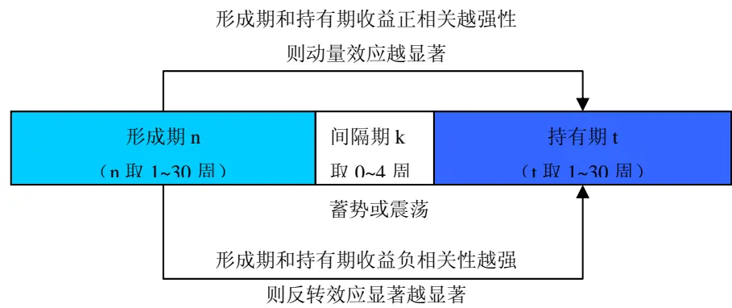
数据来源：国泰君安证券研究

线性回归模型预测持有期收益率。在确定了各个行业的最优参数组合后，对持有期的超额收益率和形成期超额收益率做简单线性回归。回归方程为：

## R（持有期）=k*R（形成期）+b

通过最小二乘法估计出回归系数 k，b 之后即可利用该方程预测持有期收益。动量/反转效应是前期趋势的线性延续或反转，所以我们认为线性回归模型虽然很简单，但也是最合理和最好解释的。另外，为了更接近实际操作，我们采用样本外预测，即每期采用之前的样本数据估计线性回归模型的系数，用于预测下一期的超额收益。比如我们用 1~t 期的样本数据估计线性回归模型的系数，来预测 t+1 期的超额收益，到 t+1 期末时，再用 1~t+1 期的样本数据估计模型系数，用来预测 t+2 期，如此滚动。

测算模型预测的准确性。计算预测值与实际值的差值，并给出差值的分布图。由于我们预测的是超额收益率，只要预测的方向准确（预测值与实际值正负符号相同），就对投资决策很有帮助了，所以我们还采用方向准确率来衡量模型的效果。

## 2.2.提出交易策略，构建模拟组合

我们基于动量和反转模型的预测结果分别构造了动量组合和反转组合。

## 动量组合构建规则：

（1） 当动量模型预测某行业下一期的周均超额收益率（持有期超额收益率/持有期周数）大于 0.25%（单边交易成本）时，该行业为超配备选行业。

（2） 若超配备选行业个数为 0，则当期配置市场基准组合（沪深 300指数）。

（3） 若超配备选行业个数大于 0 但不超过 10，则等比例配置备选行业。

（4） 若超配备选行业个数大于 10，则按预测的周均超额收益率排序，取前 10个行业等比例配置。

## 反转组合构建规则：

（1）、（2）条规则与动量组合相同。

（3） 若备选行业个数大于 0但不超过 15，则等比例配置备选行业。

（4） 若备选行业个数大于 15，则按预测的周均超额收益率排序，取前 15个行业等比例配置。

换仓频率：每周根据最新的预测结果调整各行业的配置比例。

交易成本：每次换仓计 0.5%的交易成本（单边 0.25%）。

初始资金量均为 1。

起始时间：动量组合测算的起始时间为 2006年 2月 17日（自 2005年 1月 1日起的第 55周）；反转组合测算的起始时间为 2006年7月 28日（自2005年 1月1日起的第 78周）。起始时间不一致是因为反转模型的形成期和持有期都大于动量模型，需要留更多的周数据用于第一期模型系数的估计。

截止时间：动量组合和反转组合的测算均截止至 2010年 11月 26日。

## 3. 主要结果和分析

## 3.1.动量、反转模型的主要结论

行业层面上看，短期动量效应较明显，中长期反转效应更显著。

我们取置信度为 1%（P检验值<0.01）的情况下，选出了 14个形成期超额收益与持有期显著正相关（动量效应显著）的行业和 22 个显著负相关（反转效应显著）的行业。这些行业以及各自最优的形成期、间隔期和持有期长度如表 1和表 2。

从检验的结果来看，反转效应更为显著和稳定，除了食品饮料行业（P值=0.0293，相关系数为-0.1296）在置信度为 1%下不显著外，其他的行业都能通过显著性检验，这说明行业在中长期偏离市场指数后回归的概率较大。从行业来看，反转效应较为不明显的行业是食品饮料、信息服务、信息设备、电子元器件四个行业（相关系数>-0.3），这些行业对宏观经济环境相对不敏感，与市场大势的联系没有那么紧密，回归市场指数的规律也就没有那么明显了。动量效应最为显著的行业（相关系数>0.2）有纺织服装、综合、化工、电子元器件、信息设备、农林牧渔等。这些行业中大多数都是市值不大、在沪深 300指数中权重不是很大的行业，因此其更容易走出与沪深 300相对独立的行情，也就更容易表现出超额收益的短期延续性了。

表 1 动量效应显著的行业及最优形成期、间隔期和持有期（单位：周）

| 行业名称 | 形成期 | 间隔期 | 持有期 | P值 | 相关系数 |
| --- | --- | --- | --- | --- | --- |
| 纺织服装 | 2 | 1 | 2 | 0 | 0.3307 |
| 综合 | 3 | 0 | 3 | 0 | 0.2855 |
| 化工 | 2 | 1 | 2 | 0 | 0.2692 |
| 电子元器件 | 2 | 1 | 2 | 0 | 0.2599 |
| 信息设备 | 3 | 0 | 3 | 0 | 0.2508 |
| 农林牧渔 | 2 | 1 | 2 | 0.0001 | 0.226 |
| 食品饮料 | 19 | 1 | 10 | 0.0003 | 0.2239 |
| 公用事业 | 2 | 1 | 2 | 0.0015 | 0.1891 |
| 建筑建材 | 6 | 0 | 5 | 0.0021 | 0.1852 |
| 采掘 | 5 | 2 | 5 | 0.0021 | 0.185 |
| 医药生物 | 3 | 0 | 3 | 0.0025 | 0.1804 |
| 信息服务 | 4 | 1 | 7 | 0.0038 | 0.1748 |
| 轻工制造 | 2 | 1 | 2 | 0.0074 | 0.1598 |
| 商业贸易 | 2 | 1 | 2 | 0.0085 | 0.157 |

数据来源：国泰君安证券研究

| 行业名称 | 形成期 | 间隔期 | 持有期 | P值 | 相关系数 |
| --- | --- | --- | --- | --- | --- |
| 金融服务 | 23 | 0 | 19 | 0 | -0.718 |
| 商业贸易 | 21 | 2 | 17 | 0 | -0.6561 |
| 综合 | 24 | 0 | 17 | 0 | -0.6542 |
| 建筑建材 | 24 | 0 | 17 | 0 | -0.6324 |
| 纺织服装 | 18 | 4 | 15 | 0 | -0.6099 |
| 化工 | 15 | 0 | 19 | 0 | -0.5928 |
| 机械设备 | 21 | 0 | 19 | 0 | -0.551 |
| 轻工制造 | 15 | 0 | 22 | 0 | -0.5394 |
| 家用电器 | 20 | 3 | 13 | 0 | -0.5257 |
| 有色金属 | 24 | 4 | 24 | 0 | -0.4703 |
| 农林牧渔 | 18 | 2 | 20 | 0 | -0.4477 |
| 医药生物 | 16 | 2 | 17 | 0 | -0.4097 |
| 黑色金属 | 9 | 0 | 9 | 0 | -0.4019 |
| 交运设备 | 17 | 3 | 16 | 0 | -0.395 |
| 公用事业 | 19 | 0 | 19 | 0 | -0.3942 |
| 采掘 | 24 | 4 | 24 | 0 | -0.3888 |
| 交通运输 | 17 | 0 | 16 | 0 | -0.321 |
| 餐饮旅游 | 18 | 0 | 17 | 0 | -0.3171 |
| 房地产 | 23 | 0 | 24 | 0 | -0.3104 |
| 电子元器件 | 15 | 4 | 11 | 0.0001 | -0.2491 |
| 信息设备 | 17 | 4 | 11 | 0.0001 | -0.2369 |
| 信息服务 | 24 | 4 | 24 | 0.0093 | -0.1702 |

数据来源：国泰君安证券研究

间隔期的设置能提高动量/反转模型的效果。趋势的延续或反转的过程中可能会存在一个短期的蓄势或震荡的过程，出于这种考虑，我们在模型中设置了间隔期并进行了讨论。样本数据的检验结果证明，有些行业的间隔期确实不为零，尤其是反转效应中，设置适当的间隔期能有效改进模型的效果。以纺织服装行业为例，其反转模型的最优形成期、间隔期和持有期分别为 18、4、15周，图 2和图 3分别为有间隔期和不设间隔期的情况下持有期收益与形成期收益的相关性对比。间隔期的设置使得负相关系数从-0.555 扩大到-0.641，反转模型的拟合度 R-Square 从 0.299提高到 0.393。

图 2 无间隔期下的反转效应

图 3 设置间隔期下的反转效应

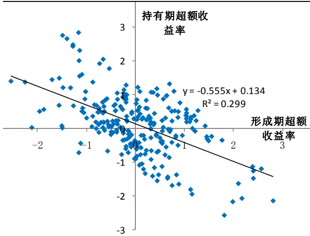
数据来源：国泰君安证券研究

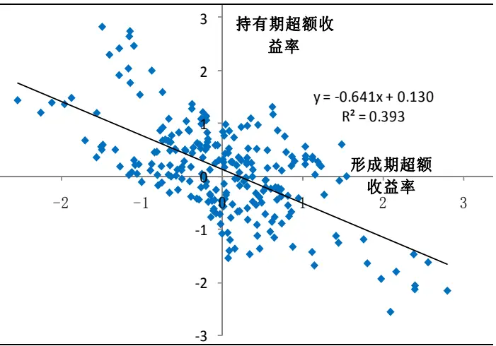
数据来源：国泰君安证券研究

向上的动量效应更显著，反转效应中“补涨”比“补跌”现象更显著。检验结果表明，当利用动量效应判断行业明显跑赢大盘（预测的周均超额收益率>0.25%）时，方向准确率较高，平均达到 66.31%；而判断行业跑输大盘（预测的周均超额收益率<-0.25%）时的准确率明显低一些，只有 53.03%。这也说明行业在跑赢大盘时下一期继续跑赢的概率较大，即动量效应更明显；而在跑输大盘时继续延续弱势的概率相对小一些。国内一些行为金融学的实证研究也表明：中国 A股市场存在明显的“追涨杀跌”现象，而且“追涨”比“杀跌”现象更为显著。当预测持有期周均超额收益>0.25%时，持有期获得正的超额收益的概率较大，大部分行业的方向准确率都在 60%以上，其中纺织服装、综合、化工行业在 70%以上。

从方向准确率来看，反转模型比动量模型效果更好，所有行业的平均准确率达到 60.36%。从预测值分段统计来看，当预测周均超额收益率>0.25%时，持有期获得正超额收益概率大于 80%的行业达到 10 个，所以行业总计方向准确率也达到 75.85%；而当预测周均超额收益率小于-0.25%时，方向准确率的平均值只有 54.93%，还有少数行业的准确率在50%以下，说明这些行业在跑赢大盘之后的“补跌”现象并不是很明显。

表 3 动量模型预测的方向准确率

| 行业名称 | 不分情形 |  | 预测周均超额收益率 <-0.25%时 |  | 预测周均超额收益 率>0.25%时 |  |
| --- | --- | --- | --- | --- | --- | --- |
|  | 预测次数 | 准确率 | 预测次数 | 准确率 | 预测次数 | 准确率 |
| 纺织服装 | 245 | 62.04% | 109 | 58.72% | 65 | 73.85% |
| 综合 | 244 | 59.02% | 77 | 54.55% | 82 | 75.61% |
| 化工 | 245 | 53.88% | 59 | 50.85% | 47 | 72.34% |
| 电子元器件 | 245 | 53.88% | 139 | 54.68% | 42 | 66.67% |
| 信息设备 | 244 | 56.97% | 144 | 58.33% | 38 | 63.16% |
| 农林牧渔 | 245 | 57.14% | 64 | 56.25% | 81 | 65.43% |
| 食品饮料 | 237 | 48.95% | 34 | 23.53% | 130 | 64.62% |
| 公用事业 | 245 | 55.92% | 99 | 57.58% | 23 | 60.87% |
| 建筑建材 | 242 | 42.56% | 28 | 25.00% | 41 | 60.98% |
| 采掘 | 242 | 50.41% | 23 | 65.22% | 65 | 63.08% |
| 医药生物 | 244 | 56.15% | 65 | 60.00% | 77 | 66.23% |
| 信息服务 | 240 | 53.33% | 15 | 1 | 1 | - |
| 轻工制造 | 245 | 50.20% | 82 | 46.34% | 29 | 55.17% |
| 商业贸易 | 245 | 56.73% | 18 | 1 | 110 | 64.55% |
| 所有行业 总计 | 3408 | 54.11% | 956 | 53.03% | 831 | 66.31% |

数据来源：国泰君安证券研究。注：预测次数小于20时不统计准确率。

图 4 动量模型预测误差（实际值-预测值）的分布 图 5 反转模型预测误差（实际值-预测值）的分布

表 4 反转模型预测的方向准确性

| 行业名称 | 不分情形 |  | 预测周均超额收益 率<-0.25%时 |  | 预测周均超额收益 率>0.25%时 |  |
| --- | --- | --- | --- | --- | --- | --- |
|  | 次数 | 准确率 | 次数 | 准确率 | 次数 | 准确率 |
| 金融服务 | 218 | 69.27% | 24 | 100.00% | 133 | 78.20% |
| 商业贸易 | 220 | 59.55% | 36 | 36.11% | 115 | 81.74% |
| 综合 | 220 | 74.09% | 95 | 73.68% | 74 | 89.19% |
| 建筑建材 | 220 | 69.55% | 50 | 74.00% | 67 | 80.60% |
| 纺织服装 | 222 | 63.96% | 105 | 60.00% | 49 | 91.84% |
| 化工 | 218 | 54.59% | 37 | 45.95% | 41 | 90.24% |
| 机械设备 | 218 | 70.18% | 21 | 71.43% | 79 | 88.61% |
| 轻工制造 | 215 | 63.72% | 100 | 63.00% | 18 | - |
| 家用电器 | 224 | 64.73% | 111 | 55.86% | 43 | 86.05% |
| 有色金属 | 213 | 60.56% | 22 | 50.00% | 147 | 68.03% |
| 农林牧渔 | 217 | 62.21% | 82 | 48.78% | 55 | 80.00% |
| 医药生物 | 220 | 52.73% | 119 | 38.66% | 47 | 95.74% |
| 黑色金属 | 228 | 58.77% | 66 | 57.58% | 25 | 80.00% |
| 交运设备 | 221 | 65.61% | 56 | 64.29% | 87 | 68.97% |
| 公用事业 | 218 | 51.38% | 136 | 52.94% | 9 | - |
| 采掘 | 213 | 53.52% | 57 | 45.61% | 94 | 67.02% |
| 交通运输 | 221 | 68.33% | 152 | 70.39% | 3 | - |
| 餐饮旅游 | 220 | 56.82% | 65 | 50.77% | 53 | 77.36% |
| 房地产 | 213 | 53.05% | 12 | 1 | 125 | 45.60% |
| 电子元器件 | 226 | 51.77% | 167 | 47.31% | 30 | 73.33% |
| 信息设备 | 226 | 51.77% | 157 | 45.86% | 34 | 61.76% |
| 信息服务 | 213 | 51.64% | 136 | 45.59% | 1 | 1 |
| 所有行业 平均值 | 4824 | 60.36% | 1806 | 54.93% | 1329 | 75.85% |

数据来源：国泰君安证券研究。注：预测次数小于20时不统计准确率。

预测误差接近正态分布，模型预测效果比较稳定。从预测值与实际值的差值分布来看，误差分布没有出现厚尾现象，动量模型和反转模型的预测效果都比较稳定。图6展示了纺织服装行业的动量预测效果，图 7 展示了金融服务行业的反转预测效果。

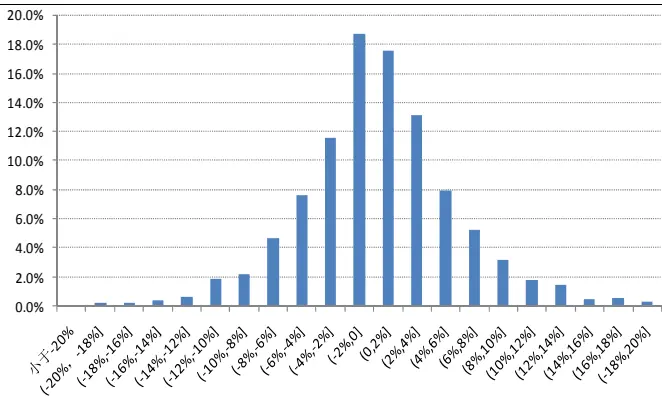
数据来源：国泰君安证券研究

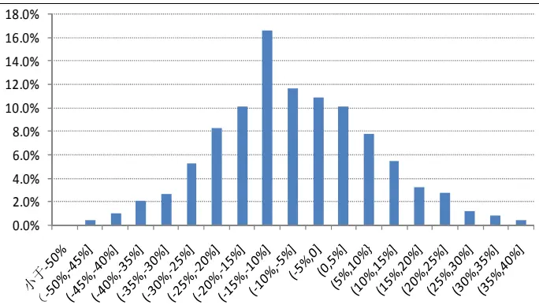
数据来源：国泰君安证券研究

图 6 动量模型预测效果展示：以纺织服装行业为例
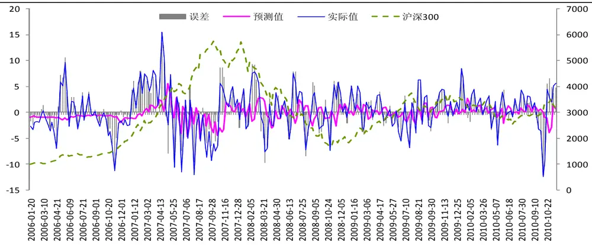
数据来源：国泰君安证券研究

图 7 反转模型预测效果展示：以金融服务行业为例
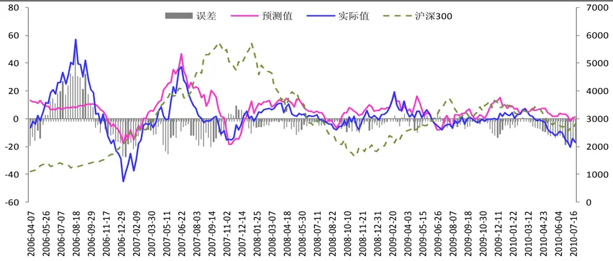
数据来源：国泰君安证券研究

## 3.2.模拟组合的业绩分析

## 3.2.1. 动量策略组合的业绩

在测算期内，动量组合的累计涨幅为 449%，相对于沪深 300 指数累计超额涨幅为 237%，年化超额收益为 16%。如果不计交易成本，则动量组合的累计超额涨幅为 484%，年化超额收益可达到 28%。我们认为动量组合这一表现是非常让人满意的，因为它仅仅利用了过去的收盘价这一单一信息，使用简单的动量模型，并且采用样本外预测和考虑了交易成本的情况下，取得了如此可观的超额收益。

表 5 动量策略组合业绩统计

|  | 累计涨幅 | 累计 超额涨幅 | 年化收益率 | 年化 超额收益率 |
| --- | --- | --- | --- | --- |
| 沪深300 | 211% |  | 27% |  |
| 动量组合 | 449% | 237% | 43% | 16% |
| 动量组合 (不计交易成本) | 695% | 484% | 55% | 28% |

数据来源：国泰君安证券研究

图 8 动量策略模拟组合的业绩
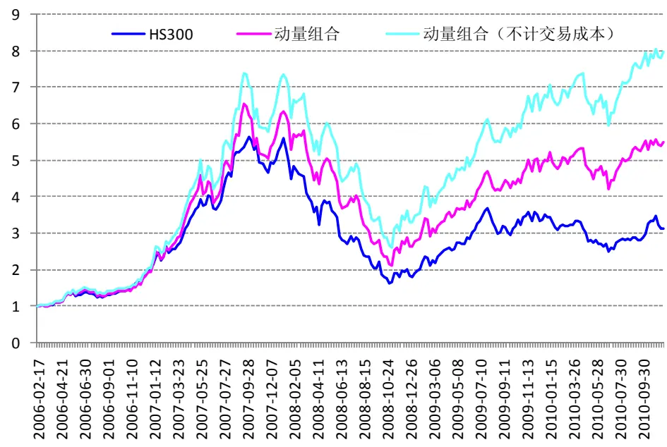
数据来源：国泰君安证券研究

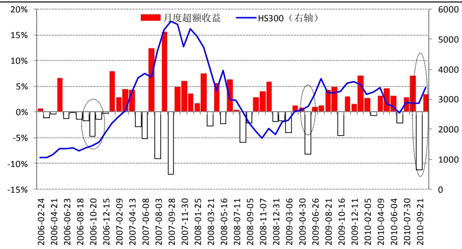
数据来源：国泰君安证券研究

从动量组合的月度超额收益来看，组合的大部分月份都取得了正的超额收益，但也出现了几次较大幅度跑输大盘的情形。下面我们深入分析动量组合的业绩表现并总结原因和启示。

大盘转向时，动量模型容易失效。图 9中椭圆标注的 3处地方，都是大盘指数突然启动向上的时点，而动量组合都出现了较大的负超额收益。另外，2007 年 8、9 月份大盘见顶转向时，组合也出现了较大的负超额收益。可见，大盘的拐点处是动量模型容易失误的时段，这比较容易理解。

牛市中间段和熊市的前半段，强者恒强。06 年底至 07 年 5 月份，大盘处于牛市的中间段，动量模型选取强势行业获得了较大的超额收益率。而 07 年 10 月至 08 年 6 月，市场处于熊市的前半段，动量组合也取得了不小的超额收益，这说明熊市的前半段，抗跌的行业能继续抗跌，强者恒强。

震荡市动量组合表现较优。从 09年中到目前，除了 10月份大盘突然启动上涨，动量组合较大幅度跑输指数外，动量组合取得了较为可观的超额收益。

下面我们从动量组合中行业配置比例的变化来观察和分析动量模型的效果。

动量策略模拟组合中平均配置比例最高的 4 个行业依次是食品饮料（27%）、商业贸易（12.7%）、采掘（12.5%）和综合行业（7.6%）。在测算期间内，这 4个行业的累计涨幅分别为 4.83倍、4.95倍、2.79倍和3.47 倍，均明显大于沪深 300 的涨幅 2.04 倍 。另外，从这些行业指数走势图和配置比例的变化来看，动量模型能较大概率地做到在行业明显跑赢沪深300的时段配置了较高比例该行业，从而为组合贡献超额收益。比如采掘行业和食品饮料行业，能明显看到在行业大幅跑赢指数时，其配置比例都比较高。

图 10 动量组合中食品饮料行业配置比例

图 11 动量组合中商业贸易行业配置比例

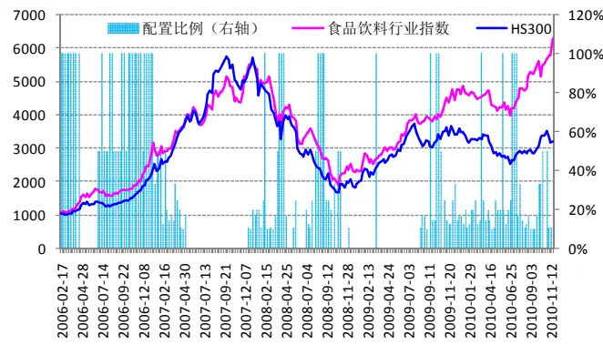
数据来源：国泰君安证券研究

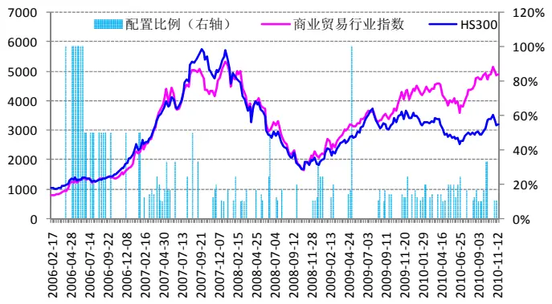
数据来源：国泰君安证券研究

图 12 动量组合中采掘行业配置比例
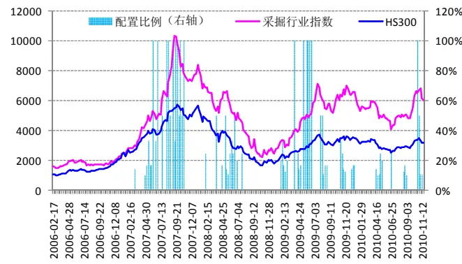
数据来源：国泰君安证券研究

图 13 动量组合中综合行业配置比例
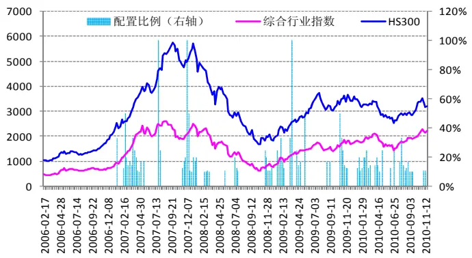
数据来源：国泰君安证券研究

## 3.2.2. 反转策略组合的业绩

在测算期内，反转组合的累计涨幅为 282%，相对于沪深 300 指数累计超额涨幅为 145%，年化超额收益为 14%。如果不计交易成本，则反转组合的累计超额涨幅为 219%，年化超额收益可达到 20%。

表 6 反转策略组合业绩统计

| 累计涨幅 |  | 累计 超额涨幅 | 年化收益率 | 年化 超额收益率 |
| --- | --- | --- | --- | --- |
| 沪深300 | 137% |  | 22% |  |
| 反转组合 | 282% | 145% | 36% | 14% |
| 反转组合（不 计交易成本） | 356% | 218% | 42% | 20% |

数据来源：国泰君安证券研究

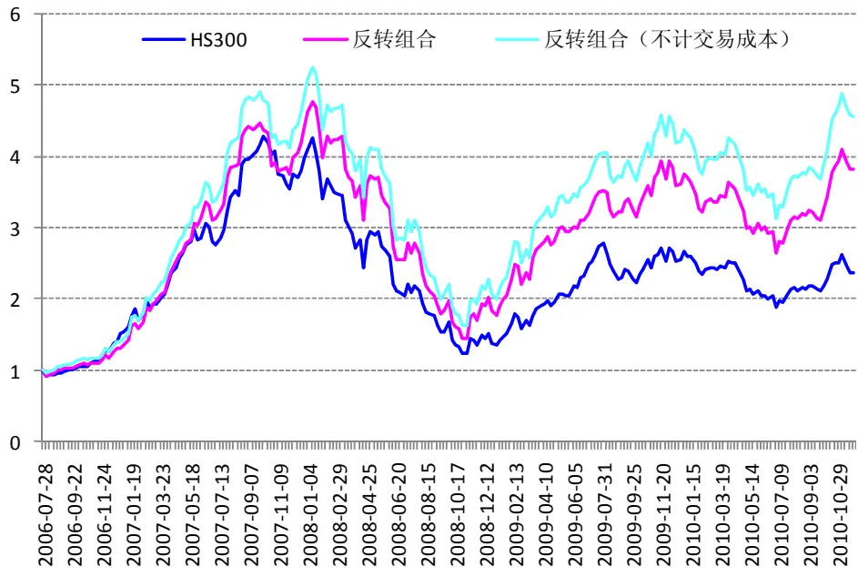
数据来源：国泰君安证券研究

图 15 反转策略模拟组合的月度超额收益
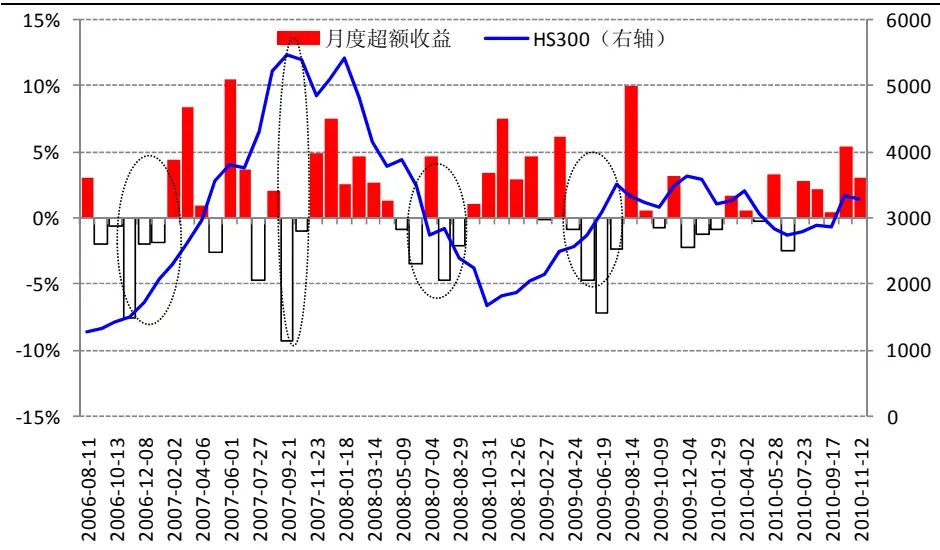
数据来源：国泰君安证券研究

通过观察和分析反转组合的收益表现，我们可以得到一些有用的结论。

牛市启动期，强势行业领涨。在 06年 8月至 06年底大盘启动进入牛市期间，反转组合获得超额收益率持续几个月为负。这可能是因为牛市刚启动时，是前期表现强势的行业领涨，而反转模型选出来的刚好是前期表现弱于大盘的行业，所以跑输了大盘。

牛市中期，“补涨”行业值得关注。当市场进入牛市中期，反转组合获得的较好的超额收益，说明滞涨的行业补涨现象比较明显。

熊市“补跌”现象明显。07 年底至 08 年中的大熊市中，反转组合相对市场表现较好，说明反转模型选取的前期跌幅较大行业，避开了“补跌”行业。

超跌反弹和震荡期，反转模型都有较好表现。从 08年 10月份到 09年 4月份，反转模型较好把握住了超跌反弹的行业，获得了可观的超额收益。另外，在 09年中到现在的震荡期间，反转组合也表现较好。

下面，我们来看反转组合的行业配置比例。

反转策略模拟组合中平均配置比例最高的 4 个行业依次是有色金属（16.5%）、金融服务（14.8%）、房地产（11.6%）和采掘行业（11.3%）。从这些行业指数走势图和配置比例的变化来看，反转模型能较好地抓住牛市中期的补涨行情以及超跌反弹行情，为组合贡献超额收益。但也存在一些误判的情形，如从 06 年 10 月到 07 年 6 月，反转组合高配有色金属行业，获得了不小的超额收益，但之后的几个月，反转模型认为其前期超涨，将其配置比例降为 0了，而实际上有色金属在随后的几个月有很大的超额涨幅，可见反转模型的节奏并不那么的精准。采掘行业也很类似，在 07 年 4 月超配了一段时间之后，行业已经有较大涨幅了，反转模型将其配置比例降低至 0，但采掘行业之后几个月还继续了一波上涨。房地产行业可能并没有为反转组合贡献多少超额收益，尤其是自09年底以来，由于房地产行业涨幅一直居后，所以反转模型一直超配该行业，但我们知道由于政府对房市的调控政策，房地产行业自 09 年底到目前也没有相对大盘的超额涨幅。

图 16 反转组合中有色金属行业配置比例
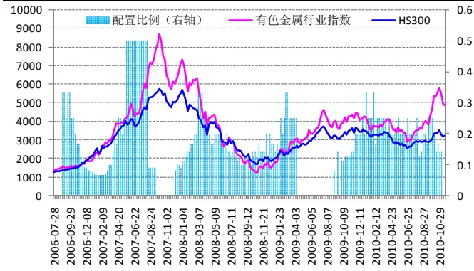
数据来源：国泰君安证券研究

图 17 反转组合中金融服务行业配置比例
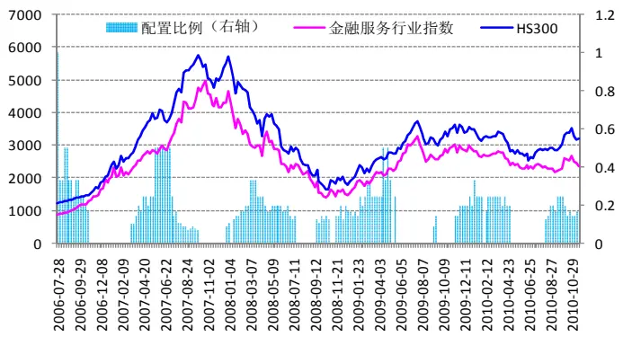
数据来源：国泰君安证券研究

图 18 反转组合中房地产行业配置比例
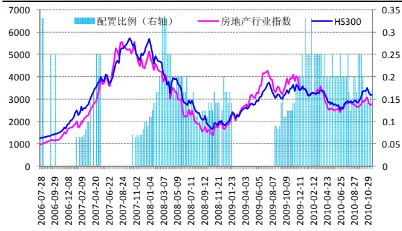
数据来源：国泰君安证券研究

图 19 反转组合中采掘行业配置比例
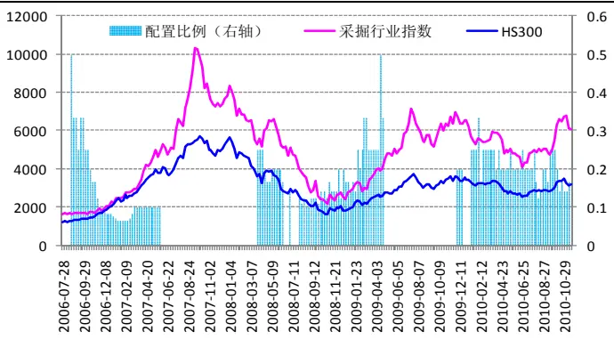
数据来源：国泰君安证券研究

## 4. 对当前市场的判断

采用截止到 2010年 11月 26日的市场数据，分别利用动量模型和反转模型对未来各行业的超额收益率进行预测和判断。

依据动量模型选取的未来几周的强势行业依次为：医药生物、电子元器件、信息设备、食品饮料、纺织服装行业。

依据反转模型选取未来几个月超越大盘的行业依次为：金融服务、房地 产、家用电器、采掘、商业贸易行业。

值得指出的是，从前面对动量策略组合和反转策略组合的业绩分析来看，两种策略在测算期间都获得了可观的超额收益，说明我们的模型在多数时候是有效的。但我们也指出在市场处于大的拐点处，以及行业受政策影响等一些特定的情形下，模型可能会失效。所以，在模型结果的基础上，结合宏观、政策和基本面的研究，能获得更大的成功率。

## 分析师声明

作者具有中国证券业协会授予的证券投资咨询执业资格或相当的专业胜任能力，保证报告所采用的数据均来自合规渠道，分析逻辑基于作者的职业理解，本报告清晰准确地反映了作者的研究观点，力求独立、客观和公正，结论不受任何第三方的授意或影响，特此声明。

## 免责声明

本报告仅供国泰君安证券股份有限公司（以下简称“本公司”）的客户使用。本公司不会因接收人收到本报告而视其为本公司的当然客户。本报告仅在相关法律许可的情况下发放，并仅为提供信息而发放，概不构成任何广告。

本报告的信息来源于已公开的资料，本公司对该等信息的准确性、完整性或可靠性不作任何保证。本报告所载的资料、意见及推测仅反映本公司于发布本报告当日的判断，本报告所指的证券或投资标的的价格、价值及投资收入可升可跌。过往表现不应作为日后的表现依据。在不同时期，本公司可发出与本报告所载资料、意见及推测不一致的报告。本公司不保证本报告所含信息保持在最新状态。同时，本公司对本报告所含信息可在不发出通知的情形下做出修改，投资者应当自行关注相应的更新或修改。

本报告中所指的投资及服务可能不适合个别客户，不构成客户私人咨询建议。在任何情况下，本报告中的信息或所表述的意见均不构成对任何人的投资建议。在任何情况下，本公司、本公司员工或者关联机构不承诺投资者一定获利，不与投资者分享投资收益，也不对任何人因使用本报告中的任何内容所引致的任何损失负任何责任。投资者务必注意，其据此做出的任何投资决策与本公司、本公司员工或者关联机构无关。

本公司利用信息隔离墙控制内部一个或多个领域、部门或关联机构之间的信息流动。因此，投资者应注意，在法律许可的情况下，本公司及其所属关联机构可能会持有报告中提到的公司所发行的证券或期权并进行证券或期权交易，也可能为这些公司提供或者争取提供投资银行、财务顾问或者金融产品等相关服务。在法律许可的情况下，本公司的员工可能担任本报告所提到的公司的董事。

市场有风险，投资需谨慎。投资者不应将本报告为作出投资决策的惟一参考因素，亦不应认为本报告可以取代自己的判断。在决定投资前，如有需要，投资者务必向专业人士咨询并谨慎决策。

本报告版权仅为本公司所有，未经书面许可，任何机构和个人不得以任何形式翻版、复制、发表或引用。如征得本公司同意进行引用、刊发的，需在允许的范围内使用，并注明出处为“国泰君安证券研究”，且不得对本报告进行任何有悖原意的引用、删节和修改。

若本公司以外的其他机构（以下简称“该机构”）发送本报告，则由该机构独自为此发送行为负责。通过此途径获得本报告的投资者应自行联系该机构以要求获悉更详细信息或进而交易本报告中提及的证券。本报告不构成本公司向该机构之客户提供的投资建议，本公司、本公司员工或者关联机构亦不为该机构之客户因使用本报告或报告所载内容引起的任何损失承担任何责任。

## 评级说明

## 1.投资建议的比较标准

投资评级分为股票评级和行业评级。

以报告发布后的12个月内的市场表现为比较标准，报告发布日后的12个月内的公司股价（或行业指数）的涨跌幅相对同期的沪深300指数涨跌幅为基准。

## 2.投资建议的评级标准

报告发布日后的 12 个月内的公司股价（或行业指数）的涨跌幅相对同期的沪深300指数的涨跌幅。

|  | 评级 | 说明 |
| --- | --- | --- |
| 股票投资评级 | 增持 | 相对沪深300指数涨幅15%以上 |
|  | 谨慎增持 | 相对沪深300指数涨幅介于5%～15%之间 |
|  | 中性 | 相对沪深300指数涨幅介于-5%～5% |
|  | 减持 | 相对沪深300指数下跌 5%以上 |
| 行业投资评级 | 增持 | 明显强于沪深300指数 |
|  | 中性 | 基本与沪深 300指数持平 |
|  | 减持 | 明显弱于沪深300指数 |

国泰君安证券研究

|  | 上海 | 深圳 | 北京 |
| --- | --- | --- | --- |
| 地址 | 上海市浦东新区银城中路168号上海 银行大厦29层 | 深圳市福田区益田路 6009 号新世界 商务中心34层 | 北京市西城区金融大街 28 号盈泰中 心2号楼10层 |
| 邮编 | 200120 | 518026 | 100140 |
| 电话 | （021)38676666 | (0755)23976888 | (010)59312799 |
|  | E-mail: gtjaresearch@gtjas.com |  |  |