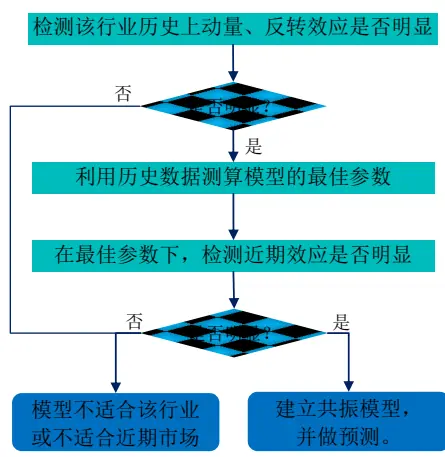
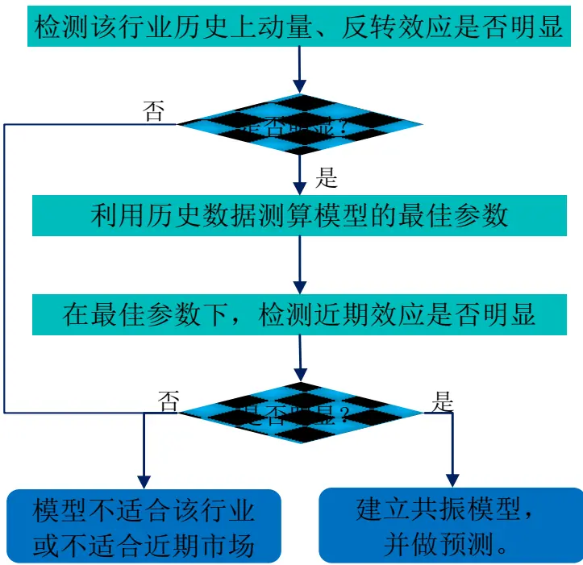
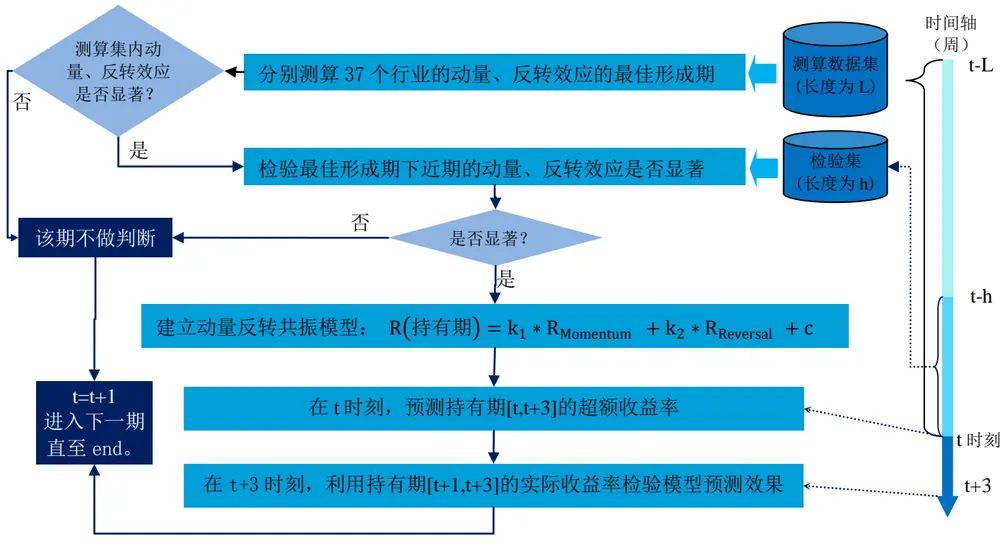
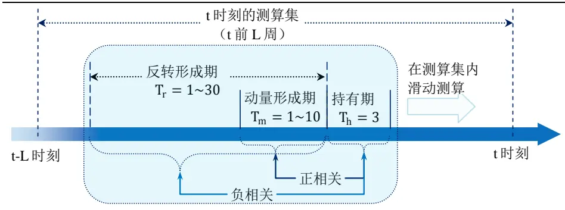
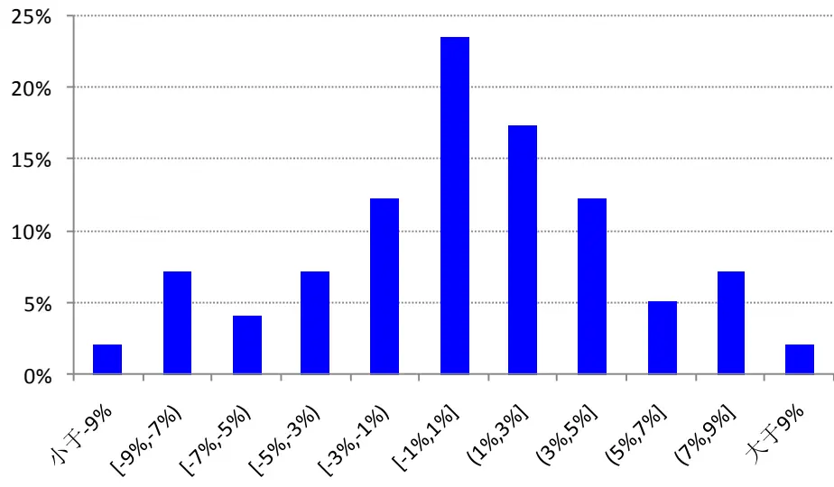
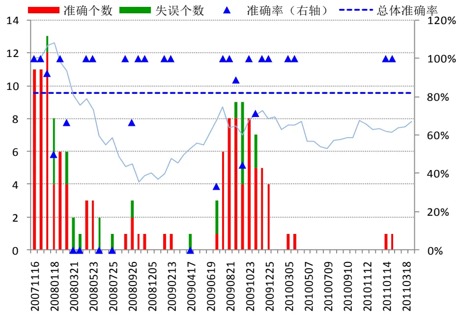
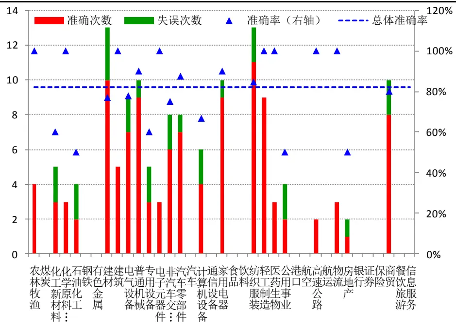
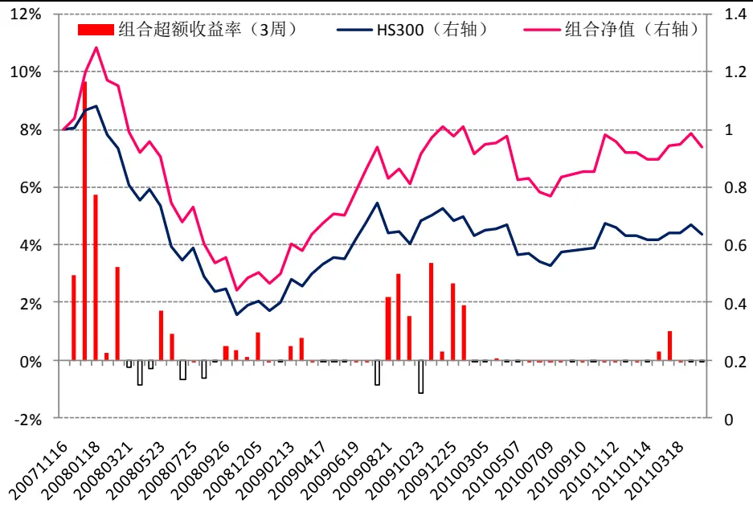
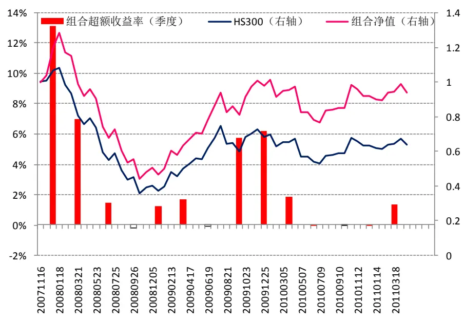

# 2011.05.26

# 基于超额收益率与交易量的行业动量反转共振模型

# 数量化系列研究之十一

蒋瑛琨 021-38676710 jiangyingkun@gtjas.com 编号 S0880511010023

## 本报告导读：

本报告构建了基于超额收益率和交易量的动量因子，对各行业建立了最佳形成期下的动量反转共振模型，并通过优化决策流程使模型只应用在适用的时期和行业上。在最近约 3 年半时间的样本外回测中，模型总体准确率达 81.34%。

## 摘要：

[Table_Summary] 本报告构建了基于超额收益率和交易量的动量因子，以 3 周为持有期，按行业分别建立了最佳形成期下的动量反转共振模型。

## 本文的创新之处：

（1）更贴近实际投资的决策流程。先判断各个行业在最近的市场环境下是否存在明显的动量、反转效应，再决定是否建立动量、反转模型进行预测。我们认为每一个模型都不太可能在所有的市场环境下、对所有类型的投资标的都有很满意的效果，而将模型使用在正确的时间、正确的对象上，是提高模型效果的一个重要途径。

（2）使用样本外检验衡量模型效果。即在 t 时刻，只采用 t 时刻之前的数据训练模型，用t时刻之后的实际数据检验模型。样本外检验的结果更具参考意义。

（3）构建共振模型：动量、反转效应的叠加。我们把动量效应和反转效应整合在一个模型，通过两种效应的叠加，提高模型预测的准确度。

（4）引入交易量，构建更优的动量因子。股票的动量效应是指股价维持原有趋势的惯性，而交易量本身就是趋势强弱的一个重要指标。

## 主要结果分析：

（1）动量、反转效应均较显著的行业依次为：建材、汽车零部件、非汽车交运设备、普通机械、计算机设备、纺织服装、电气设备、家用电器、电子元器件、轻工制造、建筑等。它们的动量最佳形成期大多为 3-8 周，反转最佳形成期大多为 24-30 周。

金融工程

| 蒋瑛琨 |  | 021-38676710 jiangyingkun@gtjas.com |
| --- | --- | --- |
| 吴天宇 |  |  |
|  |  | 021-38676788 |
|  |  | wutianyu@gtjas.com 010-59312710 |
| 何苗 杨喆 |  | hemiao@gtjas.com |
|  |  | 021-38676442 |
| 刘富兵 |  | yangzhe@gtjas.com |
|  |  | 021-38676673 |
|  |  | liufubing008481@gtjas.com |
| 唐军 |  | 021-38674763 |
| 耿帅军 |  | tangjun008739@gtjas.com |
|  | gengshuaijun010354@gtjas.com |  |

## 决策流程：

## [Table_R相关报告

《基于动量反转策略的强势行业选取》2010.12.02

《基于支持向量机的个股及组合择时》2010.08.24

《基于支持向量机的股票市场择时》2010.07.21

## 1. 本报告的创新之处

在《基于动量反转策略的强势行业选取》（2010.12.2）报告中，我们对动量、反转模型在行业层面上的应用做了一些更精细和贴近 A 股市场的研究。我们分别测算了 23 个行业的动量效应和反转效应的最佳形成期和持有期，这一基础性的工作得到了不少客户的认可，交流中我们也吸取了很多很好的意见和建议。本报告就是在上一篇报告的基础上继续改进，在动量、反转效应在行业配置的应用上做更贴近实际投资的研究。本报告有以下创新之处。

## 1.1.更贴近实际投资的决策流程

每一个量化模型都不太可能在所有的市场环境下、对所有类型的投资标的都有很满意的效果，因此，要想不断提高模型的准确度，单凭优化模型本身是有瓶颈的，而将模型使用在正确的时间、正确的对象上，是提高模型效果的一个重要途径。

因此，我们设置了更贴近实际投资的决策流程，先判断每个行业过去一段历史数据中动量、反转效应是否显著，利用历史数据测算了模型的最佳形成期等参数后，再判断近期市场环境中该行业的动量、反转效应是否明显，再决定是否建立动量、反转模型来做预测。

## 图1 动量反转共振模型决策流程

数据来源：国泰君安证券研究

## 1.2.使用样本外检验衡量模型效果

在构建模型时，我们全部采用样本外的数据来检验模型效果，即在 t 时刻，只采用 t 时刻之前的历史数据训练模型，得到模型所有参数的拟合值，用于预测 t 时刻之后的市场，用 t 时刻之后的实际数据检验模型的预测效果。样本外的回测检验更接近实际投资，回测结果更具参考意义。

## 1.3.共振模型：动量、反转效应的叠加

在《基于动量反转策略的强势行业选取》报告中，我们分别建立了动量模型和反转模型，也只能分别应用两个模型进行预测，本报告中，我们将动量模型和反转模型整合在一个模型，通过两种效应的叠加，提高模型预测的准确度。

## 1.4.形成期和持有期的设置更加合理

分别测算每个行业动量效应和反转效应的最佳形成期和持有期，能使动量模型和反转模型的效果分别达到最好。但是，由于动量模型和反转模型的持有期不一样，无法整合在一起进行预测，就无法利用两种效应的叠加来提高准确率了。另外，由于各个行业的持有期不一样，预测的持有期超额收益率在行业之间没有可比性，这对投资决策也有不便。

因此，在本报告中，我们固定持有期的长度，一方面便于构建动量反转共振模型，另一方面便于预测值在行业间的比较。形成期的长度则仍对每个行业的两种效应分别测算最佳值。

## 1.5.构建了基于价格和交易量的动量因子

股票的动量效应是指股价维持原有趋势的惯性，而交易量本身就是趋势强弱的一个重要指标，在技术分析中就常用“放量上涨”或“放量下跌”等说法来描述股价短期上涨或下跌的趋势较强。因此，我们构建了基于价格和交易量的行业的短期动量因子，最后的结果表明，新的动量因子的预测效果明显比原来单纯的价格动量更优。

## 1.6.放弃一部分预测次数，换取了更高的准确率

由于设置了使用模型的前提条件，在动量、反转效应不明显的行业和市场时期都不进行预测，因此模型预测的次数减少了很多，但预测的准确率显著提高了。我们认为，在实际投资中，不可能完全只依据一个模型来决策，因此，模型的预测次数变少，甚至在较长一段时间内都没有预测或者提供有效信号，对实际投资并不会产生明显的不利影响（因为还有其他的模型或方法可以提供投资机会），但是预测失误会直接导致投资损失，所以放弃一部分预测次数来换取更高的准确率是值得的。

## 1.7.行业划分粗细适中

在《基于动量反转策略的强势行业选取》报告中，我们使用的申万一级行业指数，在交流中我们得到了一些反馈，认为申万一级行业划分有点粗了，一方面不利于指导我们的实际投资，另一方面一些行业属性差异较大的子行业归为一个大行业会降低它们的规律性。但是考虑到如果直接使用二级行业又太细了，行业数太多也不利于指导实际投资，而且不同行业的市值规模和成分股个数相差悬殊，不容易有较统一的规律，也就很难建立统一的模型了。因此，在本报告中我们依据一定的标准，将有些一级行业的子行业划分开来（使用二级行业指数），而有些行业仍使用一级行业指数，共划分为了 37个粗细适中的行业。

## 2. 研究思路

2.1.建立动量反转共振模型

## 2.1.1. 模型框架

## 图2 动量反转共振模型构建过程

数据来源：国泰君安证券研究

## 2.1.2. 行业划分

表 1 行业划分及其代表指数

| 序 号 | 行业名称 | 采用的指数 | 成分 流通市 股数 值(亿) |  |
| --- | --- | --- | --- | --- |
| 1 | 农林牧渔 | 农林牧渔I | 65 | 2742 |
| 2 | 煤炭 | 煤炭开采Ⅱ | 34 | 11168 |
| 3 | 化工新材料 | 化工新材料Ⅱ | 27 | 成分股举例：巨化股份，烟台万华，中国玻纤，时代新材等 1533 |

| 4 | 化学原料及制品 | 化学制品Ⅱ | 76 | 2599 | 包括化学纤维、化学原料和化学制品，三者相关性极高。 |
| --- | --- | --- | --- | --- | --- |
| 5 | 石油化工 | 石油化工Ⅱ | 21 | 7142 | 如中国石化、辽通化工、广汇股份、沈阳化工等。 |
| 6 | 钢铁 | 钢铁Ⅱ | 33 | 5469 |  |
| 7 | 有色金属 | 有色金属I | 63 | 9773 |  |
| 8 | 建材 | 建筑材料Ⅱ | 52 | 3549 | 非金属类建材，如水泥、玻璃等 |
| 9 | 建筑 | 建筑装饰Ⅱ | 49 | 5500 | 含建筑和装饰工程类公司，如中国建筑、东方园林等。 |
| 10 | 电气设备 | 电气设备Ⅱ | 101 | 4640 | 成分股举例：东方电气，天威保变，合康变频等 |
| 11 | 普通机械 | 普通机械Ⅱ | 79 | 2357 | 如威孚高科、晋亿实业、天马股份、沈阳机床等 |
| 12 | 专用设备 | 专用设备Ⅱ | 69 | 4994 | 成分股举例：三一重工，中联重科，郑煤机，经纬纺机等 |
| 13 | 电子元器件 | 电子元器件I | 99 | 3451 | 含半导体、显示器件、元件等其他电子器件。 |
|  | 14 非汽车交运设备 非汽车交运设备Ⅱ |  | 39 | 3178 | 如中国船舶、中国南车、西飞国际、宗申动力等。 |
| 15 | 汽车零部件 | 汽车零部件Ⅱ | 39 | 1786 | 如潍柴动力、华域汽车、宁波华翔、一汽富维等。 |
| 16 | 汽车 | 汽车整车Ⅱ | 21 | 3249 |  |
| 17 | 计算机设备 | 计算机设备Ⅱ | 32 | 1389 | 如同方股份、广电运通、新大陆、海康威视等。 |
| 18 | 通信设备 | 通信设备Ⅱ | 34 | 861 | 如中兴通讯、烽火通信、大唐电信、中天科技等。 |
| 19 | 家用电器 | 家用电器I | 36 | 2744 |  |
| 20 | 食品 | 食品制造Ⅱ | 12 | 691 | 含食品制造和加工两个子行业，两者相关性较高。 |
| 21 | 饮料 | 饮料制造Ⅱ | 34 | 6107 | 含白酒、啤酒以及其他饮料制造类公司。 |
| 22 | 纺织服装 | 纺织服装I | 73 | 2261 |  |
| 23 | 轻工制造 | 轻工制造I | 74 | 2049 | 含造纸、包装印刷以及其他轻工制造类公司 |
| 24 | 医药生物 | 医药生物I | 161 | 7858 |  |
| 25 | 公用事业 | 公用事业I | 86 | 6397 | 包含电力、水务、燃气、环保等子行业。 |
| 26 | 港口 | 港口Ⅱ | 16 | 1632 |  |
| 27 | 航空 | 航空运输Ⅱ | 6 | 1891 | 国航、南航、东航、海航等 |
| 28 | 高速公路 | 高速公路Ⅱ | 19 | 989 |  |
| 29 | 航运 | 航运Ⅱ | 12 | 1858 | 中国远洋、中海集运、招商轮船、海峡股份等 |
| 30 | 物流 | 物流Ⅱ | 10 | 288 | 怡亚通、交运股份、中储股份、飞马国际等 |
| 31 | 房地产 | 房地产I | 134 | 8447 |  |
| 32 | 银行 | 银行Ⅱ | 16 | 32535 |  |
| 33 | 证券 | 证券Ⅱ | 19 | 5136 |  |
| 34 | 保险 | 保险Ⅱ | 3 | 8397 |  |
| 35 | 商贸 | 商业贸易I | 88 | 5323 | 包含零售和贸易类公司。 |
| 36 37 | 餐饮旅游 信息服务 | 餐饮旅游I 信息服务I | 29 106 | 932 | 包含通信运营（如中国联通）计算机应用（如软件）传媒（如 |

数据来源：国泰君安证券研究
注：1、Ⅰ表示一级行业指数，Ⅱ表示二级行业指数
2、成分股个数和流通市值是取 2011年 4 月26 日的数据

## 2.1.3. 测算最佳形成期

首先，我们需要通过反复测算，得到较优的训练样本长度 L和持有期长度 $\mathrm{T}_{h}$ ，使得动量效应和反转效应都更显著和稳定。测算集长度 L太长会使模型不够灵敏，不能较快适应最新的市场规律，而测算集过短则会导致测算得到的模型参数不够稳定。

其次，在每期（比如 t 时刻）我们需要测算出各行业在测算集（t-L，t）

内最佳的动量形成期和反转形成期，用于对t时刻下一个持有期的预测。

图3 测算动量效应和反转效应最佳形成期的示意图在测算出每个行业在（t-L，t）时期动量、反转效应的最佳形成期后，我们需要分别判断该行业在整个测算集内和近期检验期内两种效应是否都显著，如果不显著，则认为该行业该期不适合应用动量反转共振模型，如果显著则进入下一步，构建动量反转共振模型。

数据来源：国泰君安证券研究

## 2.1.4. 引入交易量，构建更优的动量因子

与单纯的价格动量不同，本报告中我们构建了基于价格和交易量的动量因子：

$$
R_{\substack{\scriptscriptstyle Momentum}}=R_{\scriptscriptstyle\#\jmath\backslash\mathbb{\breve{X}}^{\ [i]}}{}^{*}\big(1+\Delta V_{\scriptscriptstyle\#\jmath\backslash\mathbb{\breve{X}}^{\ [i]}\mathbb{\breve{H}}}\big)
$$

其中 $R_{Momentun}$ 为动量因子， $R_{\#\mathrm{\#\#\#\#\#}}$ 为该行业形成期的超额收益率，$\Delta V_{\#,\tt HX,HH}$ 为该行业相对指数的成交量放大（或缩小）的幅度。

$$
\Delta V_{\#\sharp\sharp\sharp\sharp}=\bar{V}_{\#\sharp\sharp\sharp\sharp}/\bar{V}_{\sharp\sharp\sharp\sharp}-\bar{V}_{\mathrm{E},\sharp\sharp\sharp\sharp\sharp}/\bar{V}_{\mathrm{E},\sharp\sharp\mathrm{K}^{\sharp\sharp}}
$$

$\hat{V_{\mathrm{T}}}$ $\hat{V}_{E,T}$ 分别为行业和市场指数在T 期内的平均成交额。

表2 基于价格和交易量的动量因子

| $R_{\#\#\#\#}$ |  | $\Delta V_{\#,\tt HX,HH}$ |  | $R_{\mathit{Momentum}}=R_{\#\#\#\mathbb{H}}{*\Big(1+\Delta V_{\#\#\#\mathbb{H}}}\Big)$ 动量因子强弱 |
| --- | --- | --- | --- | --- |
| 符号 | 所代表含义 | 符号 | 所代表含义 |  |
| 正 | 走势强于指数 | 正 | 成交额放大幅度大于指数 | 价量齐升，向上的动量很强 |
| 正 | 走势强于指数 | 负 | 成交额放大幅度小于指数 | 价升量减，向上动量有所减弱 |
| 负 | 走势弱于指数 | 正 | 成交额放大幅度大于指数 | 价跌量增，向下的动量很强 |
| 负 | 走势弱于指数 | 负 | 成交额放大幅度小于指数 | 价跌量减，向下的动量减弱 |

数据来源：国泰君安证券研究。

## 2.1.5. 建立共振模型，预测持有期超额收益率

行业的反转效应形成期较长（一般为几个月），其反转的规律更多由行业属性和周期等基本面因素决定，而受短期市场情绪的影响应该比较小。经过测算，引入交易量的反转因子并不能使反转效应更明显或更稳定，因此我们只用单纯的价格反转因子。

利用构建的基于价格和交易量的动量因子和单纯的价格反转因子，我们建立动量反转共振模型：

$$
R_{\scriptscriptstyle\mathrm{HFH}}=k_{1}\mathrm{^{*}}R_{\scriptscriptstyle Momentum}+k_{2}\mathrm{^{*}}R_{\scriptscriptstyle\mathrm{Re}\nu ersal}+c
$$

其中 $R_{\sharp_{\sharp}\sharp_{\sharp}\sharp_{\sharp}\sharp_{\sharp}}$ 为行业在持有期的超额收益率， $R_{Momentum}$ 为基于动量形成期内的超额收益率和交易量构建的动量因子， $R_{\mathrm{Re}\nu ersal}$ 为反转形成期内的超额收益率（价格反转因子）， $k_{1},k_{2},c$ 为模型需要拟合的系数。

## 2.2.构建模拟组合，检测模型效果

## 2.2.1. 组合构建规则

## 持仓规则：

我们基于动量反转共振模型的预测结果构建一个简单的模拟组合。规则如下：

（1） 当共振模型预测某行业下一持有期的超额收益率大于 0.2%（单边交易成本）时，该行业选为超配行业。

（2） 若超配行业个数为0，则当期配置市场基准组合（沪深300指数）。

（3） 若超配行业个数大于 0 但不超过10，则每个超配行业超配 10%，剩余头寸配置市场基准组合（沪深300指数）。

（4） 若超配行业个数大于 10，则所有头寸平均配置各超配行业。

换仓频率：每 3周（模型持有期为 3周）根据最新的预测结果调整各行

业的配置比例。

交易成本：每次换仓计 0.4%的交易成本（单边 0.2%）。

初始资金量为 1。

模拟时间段：模拟组合的的起始时间为 2007 年 11 月 16 日（自 2005 年1 月 1 日起的第 141 周），我们取的数据样本是从 2005 年的第 1 周开始的，测算动量和反转效应最佳形成期的数据集长度 L 为 140 周，所以模型从第 141 周开始预测。模拟组合截止的时间为 2011 年 4 月 29 日。

## 2.2.2. 模型效果的评价标准

通过模拟组合的表现，我们从两方面来评价模型的效果：

第一，模拟组合的累计收益与市场基准（沪深300指数）比较，反映组合通过超配模型选取的强势行业所能获得的累计超额收益。

第二，模拟组合超越指数的胜率，反映组合表现的稳健性。我们分别以持有期（3 周）和季度为频率，考察组合在各持有期或各个季度的超额收益率。

## 3. 主要结果和分析

## 3.1.动量反转共振模型的主要结果

## 3.1.1. 最佳形成期

通过反复测算动量效应和反转效应的显著程度，我们得到了以下参数的

较优取值：

表 3 模型参数的较优取值

| 参数名称 | 动量效应 | 反转效应 | 说明 |
| --- | --- | --- | --- |
| 测算集长度L | 120 | 140 | 用前L周的数据测算最佳形成期 |
| 检验集长度h | 50 | 70 | 用前h周的数据检验效应在近期是否明显 |
| 交易量基准k | 2 |  | 计算动量因子时需要计算形成期的交易量与前k周相比的变化量 |

数据来源：国泰君安证券研究

在确定测算集长度 L、检验集长度 h 和交易量基准长度 k 之后，我们自2007 年 11 月 16 日（自 2005 年 1 月 1 日的第 141 周）至 2011 年 4 月 29日每隔一个持有期（3 周）测算一次动量和反转效应的最佳形成期，共测算了 60 期。

其中动量效应显著（置信度取 90%）期数最多前3个行业为建筑、电气设备、高速公路，显著期数均为 59 期；显著的期数内，持有期超额收益率与形成期动量因子的平均正相关系数最高的前3个行业分别为化学原料及制品、纺织服装、农林牧渔，平均相关系数分别为 0.33、0.31、0.29。

反转效应显著（置信度取99%）期数最多的前3 个行业为银行、钢铁、普通机械，显著期数分别为 59、59、58 期；显著的期数内，持有期超额收益率与形成期超额收益率平均负相关系数最高的前3个行业分别为普通机械、化学原料及制品、纺织服装，平均负相关系数分别为-0.4、-0.39、-0.39。

动量、反转效应均较显著的行业依次为：建材、汽车零部件、非汽车交运设备、普通机械、计算机设备、纺织服装、电气设备、家用电器、电子元器件、轻工制造、建筑等。它们的动量形成期大多为 3-8 周，反转形成期大多为24-30 周。

表4 动量、反转效应的最佳形成期测算结果

| 序号 | 行业名称 |  | 动量效应 |  |  |  | 反转效应 |  |  |  |  |
| --- | --- | --- | --- | --- | --- | --- | --- | --- | --- | --- | --- |
|  |  |  | 显著 | 形成期长度（单位：周） |  | 平均 相关 | 显著 次数 | 形成期长度（单位：周） |  |  | 平均 相关 |
|  |  |  |  | 众数 最大值 | 最小值 |  |  | 众数 | 最大值 |  |  |
|  | 1 | 农林牧渔 | 48 | 9 | 10 3 | 系数 0.29 | 5 | 26 | 28 | 26 | 系数 -0.32 |
|  | 2 | 煤炭 | 10 | 8 | 8 | 8 0.14 | 2 | - | 29 | 27 | -0.25 |
| 3 | 化工新材料 | 45 | 4 | 9 2 | 0.15 | 37 | 30 | 30 | 18 | -0.33 |  |
| 4 | 化学原料及制品 | 49 | 6 7 | 3 | 0.33 | 4 | 26 | 26 | 26 | -0.39 |  |
| 5 | 石油化工 | 12 | 3 3 | 2 | 0.12 | 56 | 24 | 29 | 11 | -0.35 |  |
| 6 | 钢铁 | 1 | 3 1 | 3 | 0.10 | 59 | 13 | 30 | 11 | -0.36 |  |
| 7 | 有色金属 | 39 | 8 8 | 7 | 0.17 | 6 | 30 | 30 | 21 | -0.27 |  |
| 8 | 建材 | 57 | 8 9 | 1 | 0.15 | 57 | 30 | 30 | 29 | -0.34 |  |
| 9 | 建筑 | 59 | 7 9 | 3 | 0.27 | 22 | 28 | 30 | 27 | -0.33 |  |
| 10 | 电气设备 | 59 | 5 | 5 3 | 0.20 | 31 | 30 | 30 | 30 | -0.32 |  |
| 11 | 普通机械 | 51 | 8 | 10 3 | 0.16 | 58 | 30 | 30 | 22 | -0.40 |  |
| 12 | 专用设备 | 22 | 8 | 8 8 | 0.11 | 39 | 27 | 30 | 5 | -0.34 |  |
| 13 | 电子元器件 | 51 | 2 | 9 | 2 0.23 | 35 | 24 | 30 | 23 | -0.31 |  |
| 14 | 非汽车交运设备 | 54 | 3 | 3 | 2 | 0.18 | 57 | 30 | 30 | 25 | -0.35 |
| 15 | 汽车零部件 | 58 | 8 | 10 | 2 | 0.23 | 55 | 30 | 30 | 24 | -0.38 |
| 16 | 汽车 | 15 | 10 | 10 | 10 | 0.14 | 23 | 25 | 27 | 25 | -0.33 |
| 17 | 计算机设备 | 52 | 5 | 8 | 2 | 0.26 | 46 | 30 | 30 | 22 | -0.34 |
| 18 | 通信设备 | 51 | 4 | 5 | 2 | 0.27 | 25 | 30 | 30 | 14 | -0.35 |
| 19 | 家用电器 | 39 | 4 | 9 | 3 | 0.20 | 57 | 30 | 30 | 25 | -0.38 |
| 20 | 食品 | 6 | 10 | 10 | 10 | 0.12 | 5 | 5 | 28 | 5 | -0.25 |
| 21 | 饮料 | 9 | 8 | 8 | 7 | 0.12 | 7 | 6 | 6 | 6 | -0.32 |
| 22 | 纺织服装 | 46 | 7 | 10 | 2 | 0.31 | 43 | 30 | 30 | 22 | -0.39 |
| 23 | 轻工制造 | 41 | 3 | 10 | 3 | 0.15 | 48 | 24 | 30 | 23 | -0.35 |
| 24 | 医药生物 | 41 | 3 | 10 | 3 | 0.23 | 28 | 28 | 30 | 19 | -0.35 |
| 25 | 公用事业 | 36 | 3 | 5 | 3 | 0.17 | 23 | 29 | 30 | 20 | -0.34 |
| 26 | 港口 | 36 | 6 | 9 | 3 | 0.16 | 20 | 20 | 20 | 17 | -0.32 |
| 27 | 航空 | 13 | 10 | 10 | 9 | 0.15 | 3 | 1 | 30 | 5 | -0.27 |
| 28 | 高速公路 | 59 | 3 | 7 | 2 | 0.18 | 15 | 30 | 30 | 25 | -0.31 |
| 29 | 航运 | 5 | 3 | 3 | 2 | 0.12 | 28 | 18 | 25 | 5 | -0.36 |
| 30 | 物流 | 31 | 3 | 10 | 2 | 0.14 | 26 | 26 | 30 | 19 | -0.32 |
| 31 | 房地产 | 3 | 1 | 1 | 1 | 0.10 | 31 | 29 | 30 | 26 | -0.36 |
| 32 | 银行 | 13 | 5 | 5 | 5 | 0.17 | 59 | 30 | 30 | 6 | -0.36 |
| 33 | 证券 | 18 | 2 | 7 | 2 | 0.12 | 45 | 28 | 28 | 12 | -0.32 |
| 34 | 保险 | 2 | 2 | 2 | 2 | 0.11 | 26 | 24 | 30 | 6 | -0.32 |
| 35 | 商贸 | 41 | 3 | 10 | 3 | 0.18 | 42 | 30 | 30 | 29 | -0.38 |
| 36 | 餐饮旅游 | 1 | - | 10 | 10 | 0.10 | 45 | 30 | 30 | 16 | -0.33 |

| 37 信息服务 | 39 | 10 | 10 | 3 | 0.20 | 1 | 30 - | 30 | -0.25 |
| --- | --- | --- | --- | --- | --- | --- | --- | --- | --- |
| 总体平均 | 33 |  |  |  | 0.20 | 32 |  |  | -0.35 |

数据来源：国泰君安证券研究
注：共测算 60 期，形成期和平均相关系数都只统计效应显著时。

## 3.1.2. 引入交易量的动量因子改进效果明显

为了比较引入交易量后的动量因子与单纯的价格动量的效果，我们分别测算了所有行业两种动量效应的显著期数，也分别用两种动量与反转构建共振模型，比较模型预测的效果。结果表明，引入交易量后，动量效应的显著性明显提高了，共振模型的预测效果也得到了较大的改进。

表 5 基于价格和交易量的动量因子与单纯的价格动量对比

|  | 价格动量 | 价格与交易 量动量因子 | 说明 |
| --- | --- | --- | --- |
| 效应显著次数 | 402 | 558 | 单位为（期*行业数），共测算了60期*37个行业。 |
| 共振模型预测总次数 | 118 | 134 | 当动量、反转效应都显著时共振模型才预测。 |
| 共振模型准确率 | 72.88% | 81.34% | 只统计预测超额收益率大于0.2%时的准确率。 |

数据来源：国泰君安证券研究

## 3.1.3. 共振模型的预测效果

3.1.3.1. 总体误差分布

图4 动量反转共振模型预测误差的分布

数据来源：国泰君安证券研究

从动量反转共振模型预测的总体误差分布来看，模型的预测效果较为稳健，误差越大的概率越小，没有明显的厚尾分布。

## 3.1.3.2. 不同置信度下的模型预测效果

由于共振模型只在动量和反转效应都显著的时候才做预测，因此检验两种效应是否显著时设置不同水平的置信度会影响模型的预测次数。下面我们给出了几种不同置信度下模型预测的效果。

表6 不同置信度检测下共振模型预测的效果

| 置信度 |  | 预测总次数 | 准确次数 | 准确率 |
| --- | --- | --- | --- | --- |
| 动量效应 | 反转效应 |  |  |  |
| 90% | 90% | 150 | 111 | 74.00%79.79% |
| 95% | 95% | 94 | 75 |  |
| 95%90% | 99% | 83 | 67 | 80.72% |
|  | 99% | 134 | 109 | 81.34% |

数据来源：国泰君安证券研究

较高的置信度能提高模型预测的准确率，但也就放弃了较多的预测机会，而过低的置信度设置则会导致在动量、反转效应不太明显的时候也使用模型进行预测，从而降低准确率，因此，过高和过低的显著度都不合适。

当动量效应的显著置信度设为 90%，反转效应显著置信度设为 99%时，模型的预测效果最为理想，模型选取的强势行业方向准确率高达81.34%。两个置信度之所以不相等，是因为反转效应比动量效应在统计意义上更显著，较高的反转效应置信度还能保证较多的预测次数，而同样高的动量效应置信度才会导致预测次数较大的减少，所以动量效应置信度得比反转效应设置得低，这样既能保证合适的预测次数、又有较高的准确率。

## 3.1.3.3. 不同市场时期模型的预测效果

不用市场时期的动量、反转效应显著程度不一样，因此模型在不同时期的预测次数和预测准确率也有差异，图 5给出了模型自 2007年11月以来各持有期选取的强势行业（预测超额收益率>0.2%）的个数和准确率。

## 图5 共振模型各期选取强势行业的个数和准确率

数据来源：国泰君安证券研究

从动量反转共振模型的预测结果来看，07 年底到 08 年中模型有比较好的表现（预测次数较多，准确率较高），此期间市场处于熊市的前中段，动量、反转效应很明显，模型较准确的选出了一些相对抗跌的行业。09年6月到09 年12 月，动量、反转效应也很明显，共振模型表现出色。

2010年到 2011年 3 月，模型总共只选取4（个*次）超配行业，虽然全部准确，但预测次数太少，这说明这一期间动量、反转效应很不明显，硬套动量、反转模型只会导致很低的准确率。这也比较符合我们的直观感受，2010年以来市场热点的变化和行业的轮动都规律性较弱，很难把握。

## 3.1.3.4. 模型在不同行业的预测效果

从动量反转共振模型在各行业上的应用来看，选取为强势行业（指预测超额收益率>0.2%）次数最多的前 5个行业分别为建材（推荐 13 次，准确率 77%）、纺织服装（推荐 13 次次，准确率 85%）、普通机械（推荐

10 次，准确率90%）、家用电器（推荐 10 次，准确率 90%）、商贸（推荐10次，准确率80%），准确率都比较高。

图6 共振模型在不同行业上的准确率

数据来源：国泰君安证券研究

## 3.2.模拟组合的表现

在2007年11月至2011年4 月的模拟期间，在计算0.4%的换仓成本下，我们的模拟组合相对沪深 300 指数的累计超额涨幅为 30.2%，年化超额收益率为 10.3%。

表 7 模拟区间内（07 年 11 月-11 年 4 月）组合的表现

|  | 累计涨幅 | 累计超额涨幅 | 年化收益率 | 年化超额收益率 |
| --- | --- | --- | --- | --- |
| 沪深300 | -36.2% |  | -12.1% |  |
| 模拟组合 | -6.1% | 30.2% | -1.8% | 10.3% |

数据来源：国泰君安证券研究

从年化超额收益率来看，模拟组合与我们的上一篇报告《基于动量反转策略的强势行业选取》中的动量组合（年化超额收益率为 16%）和反转组合（年化超额收益率为14%）相比，都没有改进。这是因为为了减少失误的次数，我们对共振模型适用的行业和市场时期设置了前提条件，即只在适合的时候使用模型进行预测，这样就大大减少了模型的预测次数，也就减少了模拟组合投资的机会。

从分阶段的超额收益率来看，模拟组合的表现非常稳健。按模型持有期长度（3 周）分段来看，模拟组合（计算 0.4%的换仓成本）只有 8 次（共分为了 60 段）跑输沪深 300，而且跑输的幅度都很小，最大幅度也仅为-1.14%。按季度来看，模拟组合（计算 0.4%的换仓成本）只有 2 个季度（共有 14 个季度）跑输沪深 300，最大的跑输幅度仅为-0.22%。

我们知道，模拟组合的总体收益表现只是衡量模型效果的一个方面，而模型的稳健性是指导实际投资的重要前提。

表8 模拟组合的稳健性表现

|  | 总期数 | 跑输指数期数 | 最大跑输幅度 | 跑输的平均幅度 |
| --- | --- | --- | --- | --- |
| 按持有期 | 60 | 8 | -1.14% | -0.59% |
| 按季度 | 14 | 2 | -0.22% | -0.14% |

数据来源：国泰君安证券研究

## 图7 模拟组合的累计收益表现和各持有期超额收益率

数据来源：国泰君安证券研究

图8 模拟组合的季度超额收益率

数据来源：国泰君安证券研究

## 3.3.对当前市场的判断

动量效应和反转效应的显著性检验的置信度设为90%和 99%的情况下，模型认为当前（数据截至2011年 5 月20 日）市场环境下，没有一个行业的动量、反转效应都显著，故共振模型不做预测。

我们将置信度降为90%和90%时（该置信度下模型判断的历史准确率为

74%），有色金属行业的动量、反转效应均通过显著性检验，模型对其未

来3周的超额收益率进行了预测，并判断其未来3周强于沪深300指数。

作者简介：

蒋瑛琨：

执业资格证书编号：S0880511010023

电话：021-38676710

邮箱：jiangyingkun@gtjas.com

唐军（贡献作者）：

执业资格证书编号：S0880110090001

电话：021-38674763

邮箱：tangjun008739@gtjas.com

余浩（贡献作者）：

实习生

## 本公司具有中国证监会核准的的证券投资咨询业务资格

## 分析师声明

作者具有中国证券业协会授予的证券投资咨询执业资格或相当的专业胜任能力，保证报告所采用的数据均来自合规渠道，分析逻辑基于作者的职业理解，本报告清晰准确地反映了作者的研究观点，力求独立、客观和公正，结论不受任何第三方的授意或影响，特此声明。

## 免责声明

本报告仅供国泰君安证券股份有限公司（以下简称“本公司”）的客户使用。本公司不会因接收人收到本报告而视其为本公司的当然客户。本报告仅在相关法律许可的情况下发放，并仅为提供信息而发放，概不构成任何广告。

本报告的信息来源于已公开的资料，本公司对该等信息的准确性、完整性或可靠性不作任何保证。本报告所载的资料、意见及推测仅反映本公司于发布本报告当日的判断，本报告所指的证券或投资标的的价格、价值及投资收入可升可跌。过往表现不应作为日后的表现依据。在不同时期，本公司可发出与本报告所载资料、意见及推测不一致的报告。本公司不保证本报告所含信息保持在最新状态。同时，本公司对本报告所含信息可在不发出通知的情形下做出修改，投资者应当自行关注相应的更新或修改。

本报告中所指的投资及服务可能不适合个别客户，不构成客户私人咨询建议。在任何情况下，本报告中的信息或所表述的意见均不构成对任何人的投资建议。在任何情况下，本公司、本公司员工或者关联机构不承诺投资者一定获利，不与投资者分享投资收益，也不对任何人因使用本报告中的任何内容所引致的任何损失负任何责任。投资者务必注意，其据此做出的任何投资决策与本公司、本公司员工或者关联机构无关。

本公司利用信息隔离墙控制内部一个或多个领域、部门或关联机构之间的信息流动。因此，投资者应注意，在法律许可的情况下，本公司及其所属关联机构可能会持有报告中提到的公司所发行的证券或期权并进行证券或期权交易，也可能为这些公司提供或者争取提供投资银行、财务顾问或者金融产品等相关服务。在法律许可的情况下，本公司的员工可能担任本报告所提到的公司的董事。

市场有风险，投资需谨慎。投资者不应将本报告为作出投资决策的惟一参考因素，亦不应认为本报告可以取代自己的判断。在决定投资前，如有需要，投资者务必向专业人士咨询并谨慎决策。

本报告版权仅为本公司所有，未经书面许可，任何机构和个人不得以任何形式翻版、复制、发表或引用。如征得本公司同意进行引用、刊发的，需在允许的范围内使用，并注明出处为“国泰君安证券研究”，且不得对本报告进行任何有悖原意的引用、删节和修改。

若本公司以外的其他机构（以下简称“该机构”）发送本报告，则由该机构独自为此发送行为负责。通过此途径获得本报告的投资者应自行联系该机构以要求获悉更详细信息或进而交易本报告中提及的证券。本报告不构成本公司向该机构之客户提供的投资建议，本公司、本公司员工或者关联机构亦不为该机构之客户因使用本报告或报告所载内容引起的任何损失承担任何责任。

## 评级说明

## 1.投资建议的比较标准

投资评级分为股票评级和行业评级。

以报告发布后的12个月内的市场表现为比较标准，报告发布日后的 12个月内的公司股价（或行业指数）的涨跌幅相对同期的沪深 300 指数涨跌幅为基准。

## 2.投资建议的评级标准

报告发布日后的 12 个月内的公司股价（或行业指数）的涨跌幅相对同期的沪深 300 指数的涨跌幅。

|  | 评级 说明 |  |
| --- | --- | --- |
| 股票投资评级 | 增持 | 相对沪深300指数涨幅15%以上 |
|  | 谨慎增持 | 相对沪深300指数涨幅介于 5%～15%之间 |
|  | 中性 | 相对沪深300指数涨幅介于-5%～5% |
|  | 减持 | 相对沪深 300指数下跌5%以上 |
| 行业投资评级 | 增持 | 明显强于沪深 300 指数 |
|  | 中性 | 基本与沪深 300指数持平 |
|  | 减持 | 明显弱于沪深300指数 |

## 国泰君安证券研究

|  | 上海 | 深圳 | 北京 |
| --- | --- | --- | --- |
| 地址 | 上海市浦东新区银城中路168号上海 银行大厦29层 | 深圳市福田区益田路 6009 号新世界 商务中心34层 | 北京市西城区金融大街 28 号盈泰中 心2号楼10层 |
| 邮编 | 200120 | 518026 | 100140 |
| 电话 | (021)38676666 | (0755)23976888 | (010)59312799 |
|  | E-mail: gtjaresearch@gtjas.com |  |  |