金融工程

2011.05.31

# 基于沪深 300 成分股的动量反转选股策略

# ——数量化系列研究之十二

刘富兵

蒋瑛琨

8 021-38676673

021-38676710

liufubing008481@gtjas.com

jiangyingkun@gtjas.com

山S0880511010017

S0880511010023

本报告导读：基于沪深 300 成分股的动量反转测试表明，我国股票市场存在显著的动量反转效应，在 6 年的回测过程中，我们的动量组合获得了 220%的超额收益，反转组合获得了 546%的超额收益。

## 摘要：

z 基于沪深300成分股对我国股票市场进行的动量反转测试表明，中国股票市场存在显著的动量及反转效应，中长期来看动量和反转策略相对于沪深300都可以取得超额收益。

z 就动量而言，观测期为14-15周、持有期为9-15表现较佳，就反转而言，观测期为 26-30、持有期表现26-30较佳。

考虑双边千6的交易成本后，在长达6年的回测过程中，动量组合（14,14）取得471.39%的累计收益，远高于同期沪深300 指数取得的 250.53%的累计收益，该动量策略战胜指数的频率大约为 52.86%；反转组合（30,30）取得 788.57%的累计收益，远高于同期沪深 300 指数取得的 242.66%的累计收益，该反转策略战胜指数的频率大约为53.70%。

z 从稳定性来看，动量组合表现比较稳定，在牛市、熊市、震荡市中均能跑赢沪深 300，而反转组合稳定性较差，仅能在牛市中跑赢沪深300。

z 组合数量对动量反转策略的影响是不一样的：动量策略在30只以内，数量越多收益越高越稳定；而反转没有明显的规律，但25只的表现比较好，这一点与动量策略比较一致。

就资金分配而言，动量策略更适合，因为动量效应是因反应不足而致，更多的信息流入会使得动量效应的衰减力度减弱；相反，反转策略不适合资金分配，因为反转效应是因反应过度而致，需要较长的时间纠偏，而资金分配实际上变相地降低了持有时间。

z 我们认为中期内动量效应更为明显些，而长期反转效应更为明显些。根据最新的市场环境，未来10周，我们推荐10只动量股票；未来 6 周，我们推荐 10 只反转股票，以为投资决策提供参考。

## 相关报告

《基于超额收益率与交易量的行业动量反转共振模型》

2011.05.26

《基于动量反转策略的强势行业选取》

2010.12.02

《基于支持向量机的股票市场择时》2010.07.21

## 1. 动量反转策略概述

在《基于动量反转策略的强势行业选取》报告中，我们阐述了动量反转的概念、成因以及研究现状，并利用动量反转策略从行业层面进行资产配置，取得了不错的业绩。

本文，我们将动量反转策略落实到个股层面，从沪深 300成分股中选取股票组合，以期能够跑赢沪深 300，获取相对收益，乃至于绝对收益。在此，我们简要说明动量反转效应的概念。动量效应是指在一定时期内，如果某股票或者某股票组合在前一段时期表现较好，那么，下一段时期该股票或者股票组合仍将有良好表现。反转效应则是指在一定时期内表现较差的股票在接下来一段时期内有回复均值的需要，所以表现较好。

## 2. A 股动量反转效应测试

我们主要以沪深 300成分股作为研究对象，主要原因是从中选取的组合与沪深 300更具有可比性，而且目前我国仅有沪深 300指数期货，如果动量反转选股能够跑赢沪深 300，则动量反转策略不仅可以获取相对收益，利用期货进行对冲亦可获得绝对收益。同时也可应用于以沪深 300为比较基准的指数增强等基金。

我们选择 2005年 1月1日至 2010年 12月 31日所有沪深 300成分股前复权价格数据作为基础数据。

本节，我们将从两个维度来测试 A股市场的动量反转效应：超额收益的大小以及超额收益的稳定性。超额收益的大小主要用平均超额收益率来衡量，而超额收益的稳定性我们运用了 3 个指标：一是是超额收益的 t值检验，p 值越小，说明超额收益率显著不为 0；二是是跑赢沪深 300的胜率，即超额收益率大于 0的比例，胜率越高，说明超额收益率越稳定；三是超额收益率及胜率的变异系数，变异系数越小，说明对参数的敏感性越小，策略越稳定。

若设（i，j）组合的年化超额收益为 r（i，j），则（i，j）组合年化超额收益率的变异系数 $\mathrm{CV\_r(i,j)}$ 计算公式如下：

$$
{CV}_{-}r(i,j)=\sum_{s=i-1}^{i+1}\sum_{t=j-1,t<=s}^{j+1}\left(\operatorname*{min}(r(s,t)-r(i,j),0)\right)^{2}/r(i,j)
$$

类似地，若设（i，j）组合的胜率为 w（i，j），则（i，j）组合胜率的变异系数 CV_w(i,j)计算公式为：

$$
CV\_w(i,j)=\sum_{s=i-1}^{i+1}\sum_{t=j-1,t<=s}^{j+1}\left(\operatorname*{min}(w(s,t)-w(i,j),0)\right)^{2}/\left.w(i,j)\right.
$$

## 2.1. 测试流程

为规避时点选择对测试结果的影响，我们对测试样本进行逐周滚动，即每周均对动量反转组合是否存在动量反转效应进行一次测试。由于目前我国融券规模不大，我们仅对买入作单边测试。

我们知道，动量反转策略最重要的参数是形成期 P与持有期 Q。每一个P和 Q，便形成了一个基于动量（反转）的（P,Q）策略，即选择前 P期内表现最优（差）的股票作为投资标的，持有 Q期。本文，我们选择的周期以周为单位，P 的测试范围均为 1-30，由于动量反转主要是基于 P期的市场表现，因此设置持有期 Q小于等于 P更为合理些。具体测试流程如下所示：

第一步：选择全部沪深 300成分股，剔除形成期连续停牌股票。

第二步：将待选股票池中的股票分别按照测试时点前 P周的累计收益率从大到小（从小到大）排序，选取前 30只股票等权重构建动量（反转）组合。

第三步：计算动量（反转）组合在 Q期内的收益率，并与基准组合沪深300作比较，求出 Q期的超额收益率。

在对所有测试点测试完成后，我们便可求得每一（P，Q）组合的平均超额收益率，并求得年化超额收益率。同时，我们还可以求得该平均超额收益率的 t 值与 P 值，以判断其是否显著不等于 0。此外，还可以计算在所有样本中，超额收益率为正值的样本所占比例作为（P，Q）动量组合战胜基准的频率，即胜率。

为了使得动量反转组合具有可比性与可操作性，我们在计算超额收益率时，考虑了买入千分之 2.5，卖出千分之 3.5的成本。

## 2.2. 动量效应

表 1给出了不考虑交易成本时不同（P，Q）动量组合的年化超额收益率。由表 1 我们发现，所有的动量组合的超额收益率均大于 0，而且除了持有期 Q=1外，其它的绝大部分组合的超额收益都显著大于 0，这表明沪深 300成分股存在显著的动量效应。

表 2给出了考虑双边千分之 6的交易成本时，不同（P，Q）动量组合的年化超额收益率。表 2显示当持有期 Q超过 5周时，所有动量组合的年化超额收益均超过 10%，表 4显示此时收益率的变异系数绝大多数小于30%。而由表 3 发现当持有期超过 8 周时，绝大多数动量组合的胜率超过 60%，表5显示此时胜率的变异系数绝大多数小于 10%。上述表明绝大部分动量组合策略是稳定的。

从中期来看，观测期在 14-15周，持有期在 9-15周的动量组合表现比较好，年化超额收益均超过 17%，胜率超过 64%，收益率与胜率的敏感系数均较小；长期来看，观测期在 27-30 周，持有期在 27-30 周的动量组合表现较好，年化超额收益率超过 19%，胜率超过 70%，收益率与胜率的变异系数均较小。

表 1 不考虑交易成本时不 同 （ P， Q ） 动量组合的平均年化超额收益

| P\|Q | 1 | 2 | 3 | 4 | 5 | 6 | 7 | 8 | 9 | 10 | 11 | 12 | 13 | 14 | 15 | 16 | 17 | 18 | 19 | 20 | 21 | 22 | 23 | 24 | 25 | 26 | 27 | 28 | 29 | 30 |
| --- | --- | --- | --- | --- | --- | --- | --- | --- | --- | --- | --- | --- | --- | --- | --- | --- | --- | --- | --- | --- | --- | --- | --- | --- | --- | --- | --- | --- | --- | --- |
| 1 | 0.04 |  |  |  |  |  |  |  |  |  |  |  |  |  |  |  |  |  |  |  |  |  |  |  |  |  |  |  |  |  |
| 2 | 0.13 | 0.23 |  |  |  |  |  |  |  |  |  |  |  |  |  |  |  |  |  |  |  |  |  |  |  |  |  |  |  |  |
| 3 | 0.19 | 0.22 | 0.21 |  |  |  |  |  |  |  |  |  |  |  |  |  |  |  |  |  |  |  |  |  |  |  |  |  |  |  |
| 4 | 0.14 | 0.19 | 0.17 | 0.15 |  |  |  |  |  |  |  |  |  |  |  |  |  |  |  |  |  |  |  |  |  |  |  |  |  |  |
| 5 | 0.15 | 0.17 | 0.17 | 0.18 | 0.19 |  |  |  |  |  |  |  |  |  |  |  |  |  |  |  |  |  |  |  |  |  |  |  |  |  |
| 6 | 0.1 | 0.16 | 0.18 | 0.19 | 0.20 | 0.20 |  |  |  |  |  |  |  |  |  |  |  |  |  |  |  |  |  |  |  |  |  |  |  |  |
| 7 | 0.12 | 0.18 | 0.20 | 0.19 | 0.20 | 0.20 | 0.20 |  |  |  |  |  |  |  |  |  |  |  |  |  |  |  |  |  |  |  |  |  |  |  |
| 8 | 0.14 | 0.2 | 0.19 | 0.19 | 0.19 | 0.19 | 0.19 | 0.19 |  |  |  |  |  |  |  |  |  |  |  |  |  |  |  |  |  |  |  |  |  |  |
| 9 | 0.16 | 0.17 | 0.19 | 0.18 | 0.19 | 0.18 | 0.19 | 0.19 | 0.19 |  |  |  |  |  |  |  |  |  |  |  |  |  |  |  |  |  |  |  |  |  |
| 10 | 0.14 | 0.2 | 0.18 | 0.18 | 0.18 | 0.18 | 0.18 | 0.19 | 0.20 | 0.19 |  |  |  |  |  |  |  |  |  |  |  |  |  |  |  |  |  |  |  |  |
| 11 | 0.19 | 0.18 | 0.17 | 0.17 | 0.17 | 0.17 | 0.18 | 0.19 | 0.19 | 0.19 | 0.19 |  |  |  |  |  |  |  |  |  |  |  |  |  |  |  |  |  |  |  |
| 12 | 0.14 | 0.15 | 0.16 | 0.16 | 0.17 | 0.18 | 0.19 | 0.20 | 0.20 | 0.20 | 0.20 | 0.20 |  |  |  |  |  |  |  |  |  |  |  |  |  |  |  |  |  |  |
| 13 | 0.17 | 0.18 | 0.18 | 0.18 | 0.19 | 0.20 | 0.20 | 0.22 | 0.22 | 0.22 | 0.21 | 0.21 | 0.21 |  |  |  |  |  |  |  |  |  |  |  |  |  |  |  |  |  |
| 14 | 0.18 | 0.18 | 0.18 | 0.19 | 0.20 | 0.21 | 0.21 | 0.22 | 0.22 | 0.22 | 0.21 | 0.21 | 0.20 | 0.20 |  |  |  |  |  |  |  |  |  |  |  |  |  |  |  |  |
| 15 | 0.17 | 0.18 | 0.19 | 0.20 | 0.21 | 0.21 | 0.21 | 0.22 | 0.22 | 0.22 | 0.21 | 0.21 | 0.20 | 0.20 | 0.20 |  |  |  |  |  |  |  |  |  |  |  |  |  |  |  |
| 16 | 0.18 | 0.2 | 0.21 | 0.21 | 0.21 | 0.21 | 0.22 | 0.22 | 0.22 | 0.21 | 0.21 | 0.21 | 0.20 | 0.20 | 0.20 | 0.20 |  |  |  |  |  |  |  |  |  |  |  |  |  |  |
| 17 | 0.21 | 0.22 | 0.22 | 0.23 | 0.23 | 0.23 | 0.23 | 0.23 | 0.22 | 0.21 | 0.21 | 0.20 | 0.20 | 0.20 | 0.20 | 0.20 | 0.21 |  |  |  |  |  |  |  |  |  |  |  |  |  |
| 18 | 0.19 | 0.21 | 0.22 | 0.21 | 0.22 | 0.21 | 0.21 | 0.21 | 0.20 | 0.20 | 0.20 | 0.19 | 0.19 | 0.19 | 0.20 | 0.20 | 0.20 | 0.20 |  |  |  |  |  |  |  |  |  |  |  |  |
| 19 | 0.2 | 0.21 | 0.21 | 0.21 | 0.21 | 0.21 | 0.20 | 0.21 | 0.20 | 0.20 | 0.19 | 0.19 | 0.19 | 0.20 | 0.20 | 0.21 | 0.21 | 0.21 | 0.20 |  |  |  |  |  |  |  |  |  |  |  |
| 20 | 0.21 | 0.21 | 0.21 | 0.20 | 0.20 | 0.20 | 0.20 | 0.20 | 0.19 | 0.19 | 0.19 | 0.19 | 0.19 | 0.19 | 0.20 | 0.20 | 0.21 | 0.20 | 0.20 | 0.20 |  |  |  |  |  |  |  |  |  |  |
| 21 | 0.21 | 0.21 | 0.21 | 0.20 | 0.20 | 0.20 | 0.19 | 0.19 | 0.19 | 0.19 | 0.19 | 0.19 | 0.19 | 0.20 | 0.20 | 0.20 | 0.20 | 0.20 | 0.20 | 0.20 | 0.20 |  |  |  |  |  |  |  |  |  |
| 22 | 0.21 | 0.21 | 0.20 | 0.20 | 0.19 | 0.19 | 0.18 | 0.18 | 0.18 | 0.18 | 0.18 | 0.18 | 0.19 | 0.19 | 0.20 | 0.20 | 0.20 | 0.20 | 0.19 | 0.20 | 0.20 | 0.20 |  |  |  |  |  |  |  |  |
| 23 | 0.19 | 0.18 | 0.18 | 0.18 | 0.17 | 0.17 | 0.17 | 0.18 | 0.17 | 0.17 | 0.18 | 0.18 | 0.19 | 0.20 | 0.20 | 0.20 | 0.20 | 0.20 | 0.19 | 0.19 | 0.20 | 0.20 | 0.20 |  |  |  |  |  |  |  |
| 24 | 0.16 | 0.16 | 0.17 | 0.16 | 0.16 | 0.16 | 0.17 | 0.17 | 0.17 | 0.17 | 0.18 | 0.18 | 0.19 | 0.19 | 0.19 | 0.20 | 0.20 | 0.19 | 0.19 | 0.19 | 0.19 | 0.19 | 0.19 | 0.19 |  |  |  |  |  |  |
| 25 | 0.16 | 0.17 | 0.16 | 0.16 | 0.16 | 0.16 | 0.16 | 0.17 | 0.17 | 0.18 | 0.18 | 0.19 | 0.19 | 0.20 | 0.20 | 0.20 | 0.19 | 0.20 | 0.19 | 0.19 | 0.19 | 0.19 | 0.19 | 0.19 | 0.20 |  |  |  |  |  |
| 26 | 0.17 | 0.16 | 0.16 | 0.16 | 0.16 | 0.17 | 0.17 | 0.18 | 0.18 | 0.18 | 0.19 | 0.19 | 0.20 | 0.20 | 0.20 | 0.19 | 0.19 | 0.19 | 0.19 | 0.19 | 0.19 | 0.19 | 0.19 | 0.19 | 0.20 | 0.20 |  |  |  |  |
| 27 | 0.14 | 0.15 | 0.16 | 0.16 | 0.16 | 0.16 | 0.17 | 0.18 | 0.18 | 0.18 | 0.19 | 0.19 | 0.20 | 0.20 | 0.19 | 0.19 | 0.19 | 0.19 | 0.19 | 0.19 | 0.19 | 0.19 | 0.19 | 0.19 | 0.19 | 0.20 | 0.20 |  |  |  |
| 28 | 0.14 | 0.14 | 0.15 | 0.15 | 0.16 | 0.16 | 0.17 | 0.18 | 0.18 | 0.19 | 0.19 | 0.20 | 0.19 | 0.19 | 0.19 | 0.19 | 0.19 | 0.19 | 0.19 | 0.19 | 0.19 | 0.19 | 0.19 | 0.20 | 0.20 | 0.20 | 0.21 | 0.21 |  |  |
| 29 | 0.13 | 0.15 | 0.15 | 0.15 | 0.16 | 0.17 | 0.18 | 0.19 | 0.19 | 0.19 | 0.19 | 0.19 | 0.19 | 0.19 | 0.19 | 0.19 | 0.19 | 0.19 | 0.19 | 0.19 | 0.19 | 0.19 | 0.19 | 0.20 | 0.20 | 0.20 | 0.21 | 0.21 | 0.21 |  |
| 30 | 0.15 | 0.15 | 0.16 | 0.17 | 0.18 | 0.18 | 0.18 | 0.19 | 0.19 | 0.20 | 0.20 | 0.19 | 0.20 | 0.20 | 0.20 | 0.20 | 0.19 | 0.19 | 0.19 | 0.19 | 0.19 | 0.19 | 0.20 | 0.20 | 0.20 | 0.20 | 0.21 | 0.21 | 0.21 | 0.21 |

数据来源： 国泰君安证券研究 注:红色表示 1%的置信水平下超额收益率不显著

表 2 考虑交易成本时不 同 （ P， Q ） 动量组合的平均年化超额收益

| PIQ | 1 | 2 | 3 | 4 | 5 | 6 | 7 | 8 | 9 | 10 | 11 | 12 | 13 | 14 | 15 | 16 | 17 | 18 | 19 | 20 | 21 | 22 | 23 | 24 | 25 | 26 | 27 | 28 | 29 | 30 |
| --- | --- | --- | --- | --- | --- | --- | --- | --- | --- | --- | --- | --- | --- | --- | --- | --- | --- | --- | --- | --- | --- | --- | --- | --- | --- | --- | --- | --- | --- | --- |
| 1 | -0.27 |  |  |  |  |  |  |  |  |  |  |  |  |  |  |  |  |  |  |  |  |  |  |  |  |  |  |  |  |  |
| 2 | -0.18 | 0.07 |  |  |  |  |  |  |  |  |  |  |  |  |  |  |  |  |  |  |  |  |  |  |  |  |  |  |  |  |
| 3 | -0.12 | 0.07 | 0.11 |  |  |  |  |  |  |  |  |  |  |  |  |  |  |  |  |  |  |  |  |  |  |  |  |  |  |  |
| 4 | -0.17 | 0.03 | 0.06 | 0.07 |  |  |  |  |  |  |  |  |  |  |  |  |  |  |  |  |  |  |  |  |  |  |  |  |  |  |
| 5 | -0.17 | 0.01 | 0.07 | 0.10 | 0.13 |  |  |  |  |  |  |  |  |  |  |  |  |  |  |  |  |  |  |  |  |  |  |  |  |  |
| 6 | -0.21 | 0.00 | 0.07 | 0.11 | 0.13 | 0.15 |  |  |  |  |  |  |  |  |  |  |  |  |  |  |  |  |  |  |  |  |  |  |  |  |
| 7 | -0.20 | 0.02 | 0.10 | 0.11 | 0.14 | 0.14 | 0.15 |  |  |  |  |  |  |  |  |  |  |  |  |  |  |  |  |  |  |  |  |  |  |  |
| 8 | -0.17 | 0.04 | 0.08 | 0.11 | 0.13 | 0.14 | 0.14 | 0.15 |  |  |  |  |  |  |  |  |  |  |  |  |  |  |  |  |  |  |  |  |  |  |
| 9 | -0.15 | 0.01 | 0.08 | 0.10 | 0.12 | 0.13 | 0.14 | 0.15 | 0.16 |  |  |  |  |  |  |  |  |  |  |  |  |  |  |  |  |  |  |  |  |  |
| 10 | -0.17 | 0.04 | 0.08 | 0.10 | 0.11 | 0.12 | 0.14 | 0.15 | 0.16 | 0.16 |  |  |  |  |  |  |  |  |  |  |  |  |  |  |  |  |  |  |  |  |
| 11 | -0.12 | 0.02 | 0.07 | 0.09 | 0.10 | 0.12 | 0.13 | 0.15 | 0.15 | 0.16 | 0.16 |  |  |  |  |  |  |  |  |  |  |  |  |  |  |  |  |  |  |  |
| 12 | -0.18 | 0.00 | 0.06 | 0.08 | 0.10 | 0.12 | 0.14 | 0.16 | 0.16 | 0.17 | 0.17 | 0.17 |  |  |  |  |  |  |  |  |  |  |  |  |  |  |  |  |  |  |
| 13 | -0.14 | 0.02 | 0.07 | 0.10 | 0.13 | 0.14 | 0.16 | 0.17 | 0.18 | 0.18 | 0.18 | 0.18 | 0.18 |  |  |  |  |  |  |  |  |  |  |  |  |  |  |  |  |  |
| 14 | -0.13 | 0.02 | 0.07 | 0.11 | 0.14 | 0.15 | 0.16 | 0.18 | 0.18 | 0.18 | 0.18 | 0.18 | 0.17 | 0.17 |  |  |  |  |  |  |  |  |  |  |  |  |  |  |  |  |
| 15 | -0.15 | 0.02 | 0.08 | 0.12 | 0.14 | 0.16 | 0.17 | 0.18 | 0.18 | 0.18 | 0.18 | 0.18 | 0.18 | 0.18 | 0.18 |  |  |  |  |  |  |  |  |  |  |  |  |  |  |  |
| 16 | -0.14 | 0.04 | 0.10 | 0.13 | 0.15 | 0.16 | 0.17 | 0.18 | 0.18 | 0.18 | 0.18 | 0.18 | 0.17 | 0.18 | 0.18 | 0.18 |  |  |  |  |  |  |  |  |  |  |  |  |  |  |
| 17 | -0.10 | 0.06 | 0.11 | 0.15 | 0.16 | 0.17 | 0.18 | 0.18 | 0.18 | 0.18 | 0.17 | 0.17 | 0.17 | 0.17 | 0.18 | 0.18 | 0.18 |  |  |  |  |  |  |  |  |  |  |  |  |  |
| 18 | -0.13 | 0.05 | 0.11 | 0.13 | 0.15 | 0.16 | 0.16 | 0.17 | 0.17 | 0.16 | 0.16 | 0.16 | 0.16 | 0.17 | 0.17 | 0.18 | 0.18 | 0.18 |  |  |  |  |  |  |  |  |  |  |  |  |
| 19 | -0.12 | 0.05 | 0.10 | 0.13 | 0.14 | 0.15 | 0.16 | 0.17 | 0.16 | 0.16 | 0.16 | 0.16 | 0.17 | 0.17 | 0.18 | 0.18 | 0.19 | 0.19 | 0.18 |  |  |  |  |  |  |  |  |  |  |  |
| 20 | -0.10 | 0.05 | 0.11 | 0.12 | 0.13 | 0.14 | 0.15 | 0.16 | 0.15 | 0.15 | 0.15 | 0.16 | 0.16 | 0.17 | 0.17 | 0.18 | 0.18 | 0.18 | 0.18 | 0.18 |  |  |  |  |  |  |  |  |  |  |
| 21 | -0.10 | 0.05 | 0.10 | 0.12 | 0.13 | 0.14 | 0.15 | 0.15 | 0.15 | 0.15 | 0.16 | 0.16 | 0.16 | 0.17 | 0.17 | 0.18 | 0.18 | 0.18 | 0.18 | 0.18 | 0.18 |  |  |  |  |  |  |  |  |  |
| 22 | -0.10 | 0.05 | 0.10 | 0.12 | 0.13 | 0.13 | 0.14 | 0.14 | 0.14 | 0.14 | 0.15 | 0.15 | 0.16 | 0.17 | 0.17 | 0.18 | 0.18 | 0.18 | 0.17 | 0.18 | 0.18 | 0.18 |  |  |  |  |  |  |  |  |
| 23 | -0.13 | 0.02 | 0.07 | 0.10 | 0.11 | 0.12 | 0.12 | 0.14 | 0.13 | 0.14 | 0.15 | 0.15 | 0.16 | 0.17 | 0.17 | 0.18 | 0.18 | 0.18 | 0.17 | 0.18 | 0.18 | 0.18 | 0.18 |  |  |  |  |  |  |  |
| 24 | -0.16 | 0.00 | 0.07 | 0.08 | 0.10 | 0.11 | 0.12 | 0.13 | 0.13 | 0.14 | 0.15 | 0.15 | 0.16 | 0.17 | 0.17 | 0.18 | 0.17 | 0.17 | 0.17 | 0.17 | 0.17 | 0.18 | 0.18 | 0.18 |  |  |  |  |  |  |
| 25 | -0.15 | 0.01 | 0.06 | 0.08 | 0.09 | 0.11 | 0.12 | 0.13 | 0.13 | 0.14 | 0.15 | 0.16 | 0.17 | 0.17 | 0.17 | 0.17 | 0.17 | 0.17 | 0.17 | 0.17 | 0.17 | 0.17 | 0.18 | 0.18 | 0.18 |  |  |  |  |  |
| 26 | -0.14 | 0.00 | 0.06 | 0.08 | 0.10 | 0.11 | 0.12 | 0.13 | 0.14 | 0.15 | 0.16 | 0.17 | 0.17 | 0.17 | 0.17 | 0.17 | 0.17 | 0.17 | 0.17 | 0.17 | 0.17 | 0.17 | 0.18 | 0.18 | 0.18 | 0.18 |  |  |  |  |
| 27 | -0.18 | -0.01 | 0.05 | 0.08 | 0.09 | 0.11 | 0.12 | 0.14 | 0.14 | 0.15 | 0.16 | 0.16 | 0.17 | 0.17 | 0.17 | 0.17 | 0.17 | 0.17 | 0.17 | 0.17 | 0.17 | 0.17 | 0.17 | 0.17 | 0.18 | 0.18 | 0.19 |  |  |  |
| 28 | -0.17 | -0.02 | 0.04 | 0.07 | 0.09 | 0.11 | 0.13 | 0.14 | 0.15 | 0.15 | 0.16 | 0.17 | 0.17 | 0.17 | 0.17 | 0.17 | 0.17 | 0.17 | 0.17 | 0.17 | 0.17 | 0.17 | 0.18 | 0.18 | 0.18 | 0.19 | 0.19 | 0.19 |  |  |
| 29 | -0.18 | -0.01 | 0.04 | 0.07 | 0.09 | 0.11 | 0.13 | 0.14 | 0.15 | 0.16 | 0.16 | 0.16 | 0.17 | 0.17 | 0.17 | 0.17 | 0.17 | 0.17 | 0.17 | 0.17 | 0.17 | 0.17 | 0.18 | 0.18 | 0.18 | 0.19 | 0.19 | 0.19 | 0.20 |  |
| 30 | -0.16 | -0.01 | 0.05 | 0.09 | 0.11 | 0.12 | 0.13 | 0.15 | 0.16 | 0.16 | 0.16 | 0.17 | 0.17 | 0.17 | 0.17 | 0.17 | 0.17 | 0.17 | 0.17 | 0.17 | 0.17 | 0.17 | 0.18 | 0.18 | 0.18 | 0.19 | 0.19 | 0.19 | 0.20 | 0.20 |

数据来源： 国泰君安证券研究

表 3 考虑交易成本时不 同 （ P， Q ） 动量组合获取超额收益的胜率

| PIQ | 1 | 2 | 3 | 4 | 5 | 6 | 7 | 8 | 9 | 10 | 11 | 12 | 13 | 14 | 15 | 16 | 17 | 18 | 19 | 20 | 21 | 22 | 23 | 24 | 25 | 26 | 27 | 28 | 29 | 30 |
| --- | --- | --- | --- | --- | --- | --- | --- | --- | --- | --- | --- | --- | --- | --- | --- | --- | --- | --- | --- | --- | --- | --- | --- | --- | --- | --- | --- | --- | --- | --- |
| 1 | 0.39 |  |  |  |  |  |  |  |  |  |  |  |  |  |  |  |  |  |  |  |  |  |  |  |  |  |  |  |  |  |
| 2 | 0.41 | 0.50 |  |  |  |  |  |  |  |  |  |  |  |  |  |  |  |  |  |  |  |  |  |  |  |  |  |  |  |  |
| 3 | 0.46 | 0.48 | 0.52 |  |  |  |  |  |  |  |  |  |  |  |  |  |  |  |  |  |  |  |  |  |  |  |  |  |  |  |
| 4 | 0.41 | 0.46 | 0.52 | 0.50 |  |  |  |  |  |  |  |  |  |  |  |  |  |  |  |  |  |  |  |  |  |  |  |  |  |  |
| 5 | 0.40 | 0.46 | 0.48 | 0.56 | 0.59 |  |  |  |  |  |  |  |  |  |  |  |  |  |  |  |  |  |  |  |  |  |  |  |  |  |
| 6 | 0.41 | 0.47 | 0.52 | 0.56 | 0.59 | 0.62 |  |  |  |  |  |  |  |  |  |  |  |  |  |  |  |  |  |  |  |  |  |  |  |  |
| 7 | 0.43 | 0.48 | 0.54 | 0.54 | 0.57 | 0.60 | 0.65 |  |  |  |  |  |  |  |  |  |  |  |  |  |  |  |  |  |  |  |  |  |  |  |
| 8 | 0.42 | 0.50 | 0.56 | 0.57 | 0.62 | 0.61 | 0.62 | 0.66 |  |  |  |  |  |  |  |  |  |  |  |  |  |  |  |  |  |  |  |  |  |  |
| 9 | 0.42 | 0.51 | 0.54 | 0.56 | 0.60 | 0.61 | 0.59 | 0.62 | 0.65 |  |  |  |  |  |  |  |  |  |  |  |  |  |  |  |  |  |  |  |  |  |
| 10 | 0.43 | 0.52 | 0.52 | 0.54 | 0.55 | 0.58 | 0.57 | 0.62 | 0.64 | 0.65 |  |  |  |  |  |  |  |  |  |  |  |  |  |  |  |  |  |  |  |  |
| 11 | 0.45 | 0.51 | 0.55 | 0.54 | 0.54 | 0.57 | 0.59 | 0.64 | 0.64 | 0.64 | 0.63 |  |  |  |  |  |  |  |  |  |  |  |  |  |  |  |  |  |  |  |
| 12 | 0.43 | 0.48 | 0.52 | 0.55 | 0.56 | 0.58 | 0.60 | 0.65 | 0.64 | 0.64 | 0.64 | 0.65 |  |  |  |  |  |  |  |  |  |  |  |  |  |  |  |  |  |  |
| 13 | 0.44 | 0.49 | 0.56 | 0.57 | 0.57 | 0.57 | 0.59 | 0.64 | 0.67 | 0.66 | 0.67 | 0.67 | 0.68 |  |  |  |  |  |  |  |  |  |  |  |  |  |  |  |  |  |
| 14 | 0.47 | 0.51 | 0.55 | 0.57 | 0.59 | 0.59 | 0.59 | 0.65 | 0.66 | 0.67 | 0.65 | 0.64 | 0.67 | 0.68 |  |  |  |  |  |  |  |  |  |  |  |  |  |  |  |  |
| 15 | 0.45 | 0.50 | 0.55 | 0.55 | 0.57 | 0.58 | 0.60 | 0.64 | 0.66 | 0.67 | 0.64 | 0.67 | 0.66 | 0.68 | 0.67 |  |  |  |  |  |  |  |  |  |  |  |  |  |  |  |
| 16 | 0.48 | 0.52 | 0.55 | 0.55 | 0.56 | 0.60 | 0.60 | 0.63 | 0.67 | 0.67 | 0.66 | 0.66 | 0.68 | 0.69 | 0.68 | 0.67 |  |  |  |  |  |  |  |  |  |  |  |  |  |  |
| 17 | 0.44 | 0.52 | 0.54 | 0.56 | 0.57 | 0.61 | 0.60 | 0.63 | 0.65 | 0.66 | 0.66 | 0.64 | 0.63 | 0.68 | 0.67 | 0.67 | 0.68 |  |  |  |  |  |  |  |  |  |  |  |  |  |
| 18 | 0.46 | 0.52 | 0.54 | 0.57 | 0.58 | 0.62 | 0.61 | 0.64 | 0.65 | 0.65 | 0.67 | 0.65 | 0.63 | 0.67 | 0.66 | 0.67 | 0.68 | 0.69 |  |  |  |  |  |  |  |  |  |  |  |  |
| 19 | 0.44 | 0.51 | 0.52 | 0.57 | 0.58 | 0.60 | 0.60 | 0.62 | 0.64 | 0.64 | 0.66 | 0.64 | 0.65 | 0.68 | 0.66 | 0.68 | 0.68 | 0.68 | 0.67 |  |  |  |  |  |  |  |  |  |  |  |
| 20 | 0.44 | 0.54 | 0.56 | 0.55 | 0.57 | 0.59 | 0.59 | 0.63 | 0.63 | 0.67 | 0.65 | 0.63 | 0.64 | 0.65 | 0.66 | 0.67 | 0.69 | 0.68 | 0.65 | 0.68 |  |  |  |  |  |  |  |  |  |  |
| 21 | 0.46 | 0.55 | 0.57 | 0.56 | 0.59 | 0.59 | 0.59 | 0.61 | 0.63 | 0.65 | 0.64 | 0.62 | 0.63 | 0.66 | 0.68 | 0.68 | 0.68 | 0.67 | 0.68 | 0.67 | 0.67 |  |  |  |  |  |  |  |  |  |
| 22 | 0.46 | 0.56 | 0.56 | 0.56 | 0.58 | 0.59 | 0.59 | 0.60 | 0.62 | 0.63 | 0.62 | 0.62 | 0.62 | 0.66 | 0.65 | 0.67 | 0.67 | 0.67 | 0.68 | 0.69 | 0.69 | 0.70 |  |  |  |  |  |  |  |  |
| 23 | 0.46 | 0.54 | 0.54 | 0.55 | 0.57 | 0.59 | 0.57 | 0.59 | 0.61 | 0.59 | 0.60 | 0.61 | 0.62 | 0.66 | 0.66 | 0.65 | 0.67 | 0.67 | 0.65 | 0.66 | 0.67 | 0.67 | 0.66 |  |  |  |  |  |  |  |
| 24 | 0.45 | 0.52 | 0.54 | 0.53 | 0.57 | 0.58 | 0.59 | 0.59 | 0.60 | 0.61 | 0.61 | 0.61 | 0.62 | 0.64 | 0.65 | 0.66 | 0.67 | 0.67 | 0.68 | 0.67 | 0.65 | 0.68 | 0.66 | 0.66 |  |  |  |  |  |  |
| 25 | 0.45 | 0.52 | 0.51 | 0.53 | 0.57 | 0.59 | 0.59 | 0.57 | 0.58 | 0.60 | 0.60 | 0.62 | 0.64 | 0.67 | 0.66 | 0.69 | 0.66 | 0.66 | 0.68 | 0.68 | 0.66 | 0.65 | 0.65 | 0.68 | 0.69 |  |  |  |  |  |
| 26 | 0.44 | 0.51 | 0.52 | 0.53 | 0.56 | 0.59 | 0.57 | 0.56 | 0.56 | 0.60 | 0.59 | 0.62 | 0.65 | 0.68 | 0.67 | 0.65 | 0.64 | 0.66 | 0.66 | 0.65 | 0.64 | 0.67 | 0.66 | 0.66 | 0.69 | 0.68 |  |  |  |  |
| 27 | 0.47 | 0.49 | 0.51 | 0.52 | 0.56 | 0.57 | 0.56 | 0.58 | 0.54 | 0.57 | 0.60 | 0.60 | 0.65 | 0.66 | 0.63 | 0.65 | 0.64 | 0.65 | 0.66 | 0.64 | 0.65 | 0.67 | 0.69 | 0.69 | 0.69 | 0.69 | 0.70 |  |  |  |
| 28 | 0.44 | 0.50 | 0.51 | 0.51 | 0.57 | 0.57 | 0.56 | 0.57 | 0.56 | 0.57 | 0.62 | 0.62 | 0.63 | 0.67 | 0.66 | 0.66 | 0.62 | 0.64 | 0.64 | 0.65 | 0.66 | 0.69 | 0.69 | 0.70 | 0.70 | 0.71 | 0.72 | 0.72 |  |  |
| 29 | 0.44 | 0.53 | 0.54 | 0.52 | 0.55 | 0.60 | 0.58 | 0.56 | 0.57 | 0.59 | 0.61 | 0.61 | 0.63 | 0.64 | 0.65 | 0.64 | 0.61 | 0.63 | 0.65 | 0.65 | 0.65 | 0.68 | 0.70 | 0.69 | 0.70 | 0.71 | 0.72 | 0.72 | 0.73 |  |
| 30 | 0.47 | 0.50 | 0.53 | 0.51 | 0.55 | 0.60 | 0.58 | 0.55 | 0.56 | 0.58 | 0.60 | 0.61 | 0.62 | 0.62 | 0.65 | 0.64 | 0.65 | 0.66 | 0.66 | 0.66 | 0.67 | 0.69 | 0.70 | 0.69 | 0.69 | 0.67 | 0.70 | 0.72 | 0.73 | 0.73 |

数据来源： 国泰君安证券研究

表 4 考虑交易成本时动量组合超额收益对 （ P， Q ） 的敏感性分析(%)

| PIQ | 1 | 2 | 3 | 4 | 5 | 6 | 7 | 8 | 9 | 10 | 11 | 12 | 13 | 14 | 15 | 16 | 17 | 18 | 19 | 20 | 21 | 22 | 23 | 24 | 25 | 26 | 27 | 28 | 29 | 30 |
| --- | --- | --- | --- | --- | --- | --- | --- | --- | --- | --- | --- | --- | --- | --- | --- | --- | --- | --- | --- | --- | --- | --- | --- | --- | --- | --- | --- | --- | --- | --- |
| 1 | 0.00 |  |  |  |  |  |  |  |  |  |  |  |  |  |  |  |  |  |  |  |  |  |  |  |  |  |  |  |  |  |
| 2 | 49.22 | 689.49 |  |  |  |  |  |  |  |  |  |  |  |  |  |  |  |  |  |  |  |  |  |  |  |  |  |  |  |  |
| 3 | 61.53 | 600.30 | 106.76 |  |  |  |  |  |  |  |  |  |  |  |  |  |  |  |  |  |  |  |  |  |  |  |  |  |  |  |
| 4 | 0.00 | 1163.80 | 102.37 | 24.38 |  |  |  |  |  |  |  |  |  |  |  |  |  |  |  |  |  |  |  |  |  |  |  |  |  |  |
| 5 | 24.48 | 4456.18 | 149.36 | 58.60 | 50.12 |  |  |  |  |  |  |  |  |  |  |  |  |  |  |  |  |  |  |  |  |  |  |  |  |  |
| 6 | 0.00 | 10625.19 | 156.05 | 49.83 | 36.46 | 18.51 |  |  |  |  |  |  |  |  |  |  |  |  |  |  |  |  |  |  |  |  |  |  |  |  |
| 7 | 5.82 | 1841.19 | 147.10 | 46.44 | 35.15 | 16.72 | 15.70 |  |  |  |  |  |  |  |  |  |  |  |  |  |  |  |  |  |  |  |  |  |  |  |
| 8 | 17.03 | 1013.55 | 125.04 | 41.72 | 28.26 | 14.31 | 11.25 | 10.22 |  |  |  |  |  |  |  |  |  |  |  |  |  |  |  |  |  |  |  |  |  |  |
| 9 | 17.20 | 2142.08 | 112.77 | 36.57 | 24.57 | 14.41 | 13.08 | 11.82 | 5.19 |  |  |  |  |  |  |  |  |  |  |  |  |  |  |  |  |  |  |  |  |  |
| 10 | 0.00 | 876.26 | 125.29 | 50.40 | 26.83 | 17.91 | 16.36 | 17.03 | 10.22 | 5.56 |  |  |  |  |  |  |  |  |  |  |  |  |  |  |  |  |  |  |  |  |
| 11 | 56.02 | 1893.34 | 139.84 | 50.60 | 24.80 | 19.95 | 16.05 | 13.18 | 3.80 | 2.55 | 3.75 |  |  |  |  |  |  |  |  |  |  |  |  |  |  |  |  |  |  |  |
| 12 | 0.00 | 5067.61 | 143.01 | 36.01 | 25.05 | 21.46 | 21.65 | 17.50 | 11.31 | 9.50 | 10.54 | 4.21 |  |  |  |  |  |  |  |  |  |  |  |  |  |  |  |  |  |  |
| 13 | 25.28 | 1325.37 | 151.23 | 62.51 | 49.48 | 33.80 | 24.16 | 24.77 | 17.85 | 13.77 | 12.33 | 11.47 | 8.39 |  |  |  |  |  |  |  |  |  |  |  |  |  |  |  |  |  |
| 14 | 11.80 | 1651.36 | 126.48 | 55.98 | 35.93 | 16.94 | 16.40 | 15.18 | 6.06 | 0.83 | 2.82 | 1.73 | 0.19 | 0.00 |  |  |  |  |  |  |  |  |  |  |  |  |  |  |  |  |
| 15 | 0.00 | 1310.70 | 123.20 | 54.98 | 27.17 | 14.40 | 13.14 | 13.55 | 4.50 | 3.19 | 5.92 | 5.60 | 1.61 | 1.66 | 1.40 |  |  |  |  |  |  |  |  |  |  |  |  |  |  |  |
| 16 | 6.45 | 754.16 | 107.51 | 47.02 | 21.08 | 11.19 | 13.23 | 9.89 | 4.40 | 4.05 | 5.57 | 5.00 | 3.36 | 3.93 | 1.75 | 3.71 |  |  |  |  |  |  |  |  |  |  |  |  |  |  |
| 17 | 38.66 | 522.44 | 97.23 | 48.90 | 28.15 | 22.27 | 19.22 | 17.56 | 13.76 | 12.19 | 10.83 | 8.87 | 5.66 | 7.09 | 6.22 | 6.14 | 5.60 |  |  |  |  |  |  |  |  |  |  |  |  |  |
| 18 | 0.00 | 556.68 | 90.47 | 32.02 | 20.04 | 9.53 | 7.99 | 9.13 | 3.95 | 2.66 | 2.36 | 1.14 | 0.10 | 3.20 | 2.15 | 3.26 | 2.84 | 0.75 |  |  |  |  |  |  |  |  |  |  |  |  |
| 19 | 9.89 | 599.12 | 87.07 | 32.80 | 22.74 | 16.74 | 10.16 | 16.80 | 11.79 | 8.28 | 6.79 | 8.56 | 6.05 | 8.89 | 6.98 | 9.02 | 7.70 | 5.38 | 1.35 |  |  |  |  |  |  |  |  |  |  |  |
| 20 | 14.94 | 552.02 | 91.61 | 27.14 | 17.15 | 10.12 | 5.76 | 10.49 | 2.16 | 1.83 | 1.66 | 1.27 | 3.95 | 5.26 | 3.77 | 5.72 | 3.43 | 1.76 | 0.96 | 2.96 |  |  |  |  |  |  |  |  |  |  |
| 21 | 0.00 | 496.13 | 84.61 | 25.74 | 21.61 | 14.31 | 13.11 | 17.80 | 11.27 | 11.32 | 9.97 | 9.20 | 8.97 | 10.17 | 6.50 | 7.58 | 4.59 | 4.41 | 3.11 | 3.13 | 3.72 |  |  |  |  |  |  |  |  |  |
| 22 | 26.06 | 563.70 | 104.48 | 44.89 | 31.49 | 19.66 | 17.05 | 9.86 | 5.04 | 6.89 | 7.02 | 4.38 | 6.22 | 4.92 | 3.54 | 2.97 | 2.13 | 3.71 | 0.51 | 1.27 | 2.05 | 3.05 |  |  |  |  |  |  |  |  |
| 23 | 22.98 | 1238.03 | 124.32 | 39.70 | 30.99 | 22.02 | 15.25 | 15.78 | 3.43 | 6.77 | 6.91 | 5.38 | 8.57 | 9.10 | 4.69 | 5.71 | 6.01 | 3.22 | 0.49 | 2.03 | 3.42 | 2.56 | 2.40 |  |  |  |  |  |  |  |
| 24 | 0.00 | 8025.74 | 149.48 | 34.19 | 24.34 | 18.54 | 13.34 | 13.95 | 5.18 | 5.73 | 9.31 | 6.41 | 9.04 | 6.07 | 1.28 | 4.93 | 1.22 | 0.83 | 0.00 | 0.09 | 0.66 | 1.26 | 1.02 | 2.01 |  |  |  |  |  |  |
| 25 | 2.97 | 4415.62 | 159.65 | 40.16 | 21.84 | 22.10 | 12.06 | 11.52 | 6.51 | 10.02 | 11.26 | 8.35 | 7.72 | 4.62 | 2.40 | 2.15 | 0.54 | 3.14 | 2.83 | 2.45 | 2.14 | 0.84 | 1.60 | 2.73 | 2.80 |  |  |  |  |  |
| 26 | 23.61 | 6573.15 | 176.95 | 55.01 | 33.20 | 29.38 | 19.53 | 18.27 | 11.59 | 11.74 | 12.45 | 10.95 | 8.87 | 6.76 | 2.54 | 2.02 | 0.86 | 4.56 | 3.50 | 4.63 | 5.12 | 4.47 | 5.33 | 4.44 | 5.50 | 3.85 |  |  |  |  |
| 27 | 0.00 | 2269.41 | 209.43 | 61.68 | 35.82 | 21.71 | 16.64 | 16.16 | 7.13 | 8.63 | 7.50 | 4.98 | 5.63 | 2.13 | 0.00 | 2.50 | 0.81 | 1.83 | 0.93 | 0.00 | 1.14 | 0.00 | 1.95 | 1.56 | 2.22 | 2.74 | 1.85 |  |  |  |
| 28 | 4.69 | 1351.45 | 226.58 | 59.26 | 35.64 | 26.80 | 21.86 | 17.88 | 9.93 | 10.39 | 9.46 | 7.07 | 3.74 | 2.56 | 0.35 | 2.11 | 0.05 | 3.30 | 1.56 | 1.87 | 5.12 | 5.29 | 5.97 | 5.57 | 5.32 | 5.03 | 5.16 | 4.89 |  |  |
| 29 | 0.00 | 3330.29 | 224.44 | 59.84 | 38.84 | 27.98 | 23.48 | 17.47 | 10.29 | 9.26 | 5.08 | 1.55 | 1.05 | 2.32 | 0.55 | 2.59 | 0.39 | 2.13 | 0.08 | 2.20 | 2.39 | 2.29 | 2.40 | 2.34 | 2.81 | 4.34 | 4.26 | 3.16 | 1.65 | _ |
| 30 | 10.60 | 3026.26 | 180.14 | 65.97 | 45.09 | 25.80 | 18.43 | 14.57 | 9.06 | 9.15 | 5.20 | 5.09 | 8.72 | 7.30 | 3.84 | 5.62 | 3.73 | 3.87 | 0.88 | 2.72 | 2.30 | 2.52 | 4.91 | 2.79 | 3.68 | 5.35 | 4.08 | 2.88 | 4.21 | 5.04 |

数据来源： 国泰君安证券研究

表 5 考虑交易成本时动量组合胜率对 （ P， Q ） 的敏感性分析(%)

| PIQ | 1 | 2 | 3 | 4 | 5 | 6 | 7 | 8 | 9 | 10 | 11 | 12 | 13 | 14 | 15 | 16 | 17 | 18 | 19 | 20 | 21 | 22 | 23 | 24 | 25 | 26 | 27 | 28 | 29 | 30 |
| --- | --- | --- | --- | --- | --- | --- | --- | --- | --- | --- | --- | --- | --- | --- | --- | --- | --- | --- | --- | --- | --- | --- | --- | --- | --- | --- | --- | --- | --- | --- |
| 1 | 0.00 |  |  |  |  |  |  |  |  |  |  |  |  |  |  |  |  |  |  |  |  |  |  |  |  |  |  |  |  |  |
| 2 | 6.01 | 29.27 |  |  |  |  |  |  |  |  |  |  |  |  |  |  |  |  |  |  |  |  |  |  |  |  |  |  |  |  |
| 3 | 13.52 | 22.46 | 14.66 |  |  |  |  |  |  |  |  |  |  |  |  |  |  |  |  |  |  |  |  |  |  |  |  |  |  |  |
| 4 | 4.56 | 17.11 | 17.67 | 5.41 |  |  |  |  |  |  |  |  |  |  |  |  |  |  |  |  |  |  |  |  |  |  |  |  |  |  |
| 5 | 0.00 | 21.82 | 4.80 | 20.99 | 17.03 |  |  |  |  |  |  |  |  |  |  |  |  |  |  |  |  |  |  |  |  |  |  |  |  |  |
| 6 | 3.63 | 20.94 | 18.25 | 16.94 | 12.67 | 10.57 |  |  |  |  |  |  |  |  |  |  |  |  |  |  |  |  |  |  |  |  |  |  |  |  |
| 7 | 4.47 | 22.21 | 18.46 | 4.56 | 5.84 | 4.43 | 10.45 |  |  |  |  |  |  |  |  |  |  |  |  |  |  |  |  |  |  |  |  |  |  |  |
| 8 | 0.47 | 27.59 | 19.03 | 7.49 | 18.58 | 7.93 | 7.87 | 14.73 |  |  |  |  |  |  |  |  |  |  |  |  |  |  |  |  |  |  |  |  |  |  |
| 9 | 0.00 | 29.99 | 11.73 | 10.34 | 16.35 | 12.32 | 2.70 | 10.40 | 7.78 |  |  |  |  |  |  |  |  |  |  |  |  |  |  |  |  |  |  |  |  |  |
| 10 | 1.15 | 29.70 | 2.99 | 3.56 | 2.59 | 10.44 | 0.00 | 9.46 | 5.22 | 4.09 |  |  |  |  |  |  |  |  |  |  |  |  |  |  |  |  |  |  |  |  |
| 11 | 7.09 | 24.30 | 18.82 | 5.08 | 0.05 | 7.40 | 5.01 | 15.76 | 3.47 | 1.32 | 0.00 |  |  |  |  |  |  |  |  |  |  |  |  |  |  |  |  |  |  |  |
| 12 | 0.00 | 14.25 | 10.79 | 6.37 | 6.79 | 9.40 | 7.91 | 14.74 | 1.96 | 1.72 | 2.18 | 3.75 |  |  |  |  |  |  |  |  |  |  |  |  |  |  |  |  |  |  |
| 13 | 1.14 | 17.14 | 23.22 | 10.00 | 4.35 | 0.70 | 4.19 | 11.27 | 8.59 | 5.13 | 9.68 | 7.68 | 7.33 |  |  |  |  |  |  |  |  |  |  |  |  |  |  |  |  |  |
| 14 | 7.15 | 19.62 | 17.55 | 5.19 | 10.24 | 5.59 | 4.75 | 14.11 | 5.12 | 4.93 | 0.78 | 0.56 | 3.83 | 2.75 |  |  |  |  |  |  |  |  |  |  |  |  |  |  |  |  |
| 15 | 0.00 | 11.72 | 11.89 | 1.18 | 3.89 | 4.60 | 2.54 | 11.02 | 5.23 | 6.71 | 0.00 | 6.81 | 2.37 | 3.37 | 0.00 |  |  |  |  |  |  |  |  |  |  |  |  |  |  |  |
| 16 | 10.82 | 22.82 | 11.45 | 3.63 | 2.84 | 9.98 | 3.24 | 8.84 | 9.36 | 5.03 | 4.05 | 6.58 | 12.00 | 10.94 | 2.83 | 0.74 |  |  |  |  |  |  |  |  |  |  |  |  |  |  |
| 17 | 0.00 | 19.42 | 4.48 | 4.27 | 4.61 | 12.34 | 0.80 | 7.54 | 3.90 | 2.63 | 3.04 | 3.72 | 0.00 | 11.22 | 1.85 | 2.28 | 2.86 |  |  |  |  |  |  |  |  |  |  |  |  |  |
| 18 | 5.94 | 23.96 | 9.73 | 11.02 | 5.55 | 13.43 | 2.32 | 10.03 | 7.66 | 2.69 | 9.72 | 5.24 | 0.95 | 9.60 | 0.00 | 2.32 | 1.99 | 3.59 |  |  |  |  |  |  |  |  |  |  |  |  |
| 19 | 0.00 | 21.21 | 1.72 | 10.60 | 5.27 | 5.65 | 1.53 | 5.60 | 3.89 | 2.46 | 5.58 | 2.59 | 5.09 | 10.81 | 2.33 | 6.10 | 2.65 | 5.18 | 3.04 |  |  |  |  |  |  |  |  |  |  |  |
| 20 | 0.35 | 28.09 | 11.89 | 4.63 | 5.16 | 3.92 | 1.55 | 10.34 | 3.99 | 13.08 | 6.75 | 1.40 | 4.28 | 3.24 | 0.37 | 2.91 | 3.66 | 5.85 | 0.00 | 6.25 |  |  |  |  |  |  |  |  |  |  |
| 21 | 4.62 | 29.76 | 8.51 | 3.21 | 12.24 | 2.32 | 0.45 | 5.61 | 5.61 | 9.51 | 5.98 | 0.95 | 4.51 | 8.06 | 7.70 | 6.65 | 2.59 | 4.12 | 5.13 | 4.15 | 0.00 |  |  |  |  |  |  |  |  |  |
| 22 | 0.00 | 30.76 | 5.96 | 4.21 | 6.83 | 6.28 | 3.40 | 7.66 | 6.79 | 9.14 | 6.81 | 2.00 | 1.27 | 9.28 | 0.00 | 5.38 | 2.29 | 2.84 | 5.95 | 9.08 | 8.63 | 9.19 |  |  |  |  |  |  |  |  |
| 23 | 3.00 | 28.26 | 3.62 | 4.75 | 8.15 | 5.34 | 0.00 | 3.50 | 8.09 | 0.00 | 2.22 | 1.18 | 2.55 | 12.90 | 3.63 | 0.95 | 3.96 | 2.77 | 0.00 | 1.85 | 3.54 | 2.74 | 0.00 |  |  |  |  |  |  |  |
| 24 | 0.00 | 22.05 | 7.36 | 2.76 | 10.95 | 4.08 | 4.38 | 5.15 | 6.19 | 6.33 | 3.24 | 2.03 | 3.02 | 3.32 | 1.55 | 2.71 | 3.17 | 2.28 | 6.38 | 5.45 | 0.00 | 10.52 | 2.47 | 1.42 |  |  |  |  |  |  |
| 25 | 2.90 | 24.23 | 0.71 | 4.30 | 12.63 | 6.43 | 5.38 | 2.91 | 4.43 | 7.38 | 1.52 | 6.47 | 8.59 | 10.58 | 4.71 | 12.85 | 3.99 | 2.35 | 6.93 | 9.83 | 5.29 | 1.82 | 0.39 | 6.36 | 6.38 |  |  |  |  |  |
| 26 | 0.00 | 21.04 | 4.42 | 3.48 | 10.52 | 9.99 | 3.65 | 3.35 | 3.66 | 12.42 | 2.56 | 6.97 | 9.39 | 13.27 | 6.62 | 2.21 | 0.22 | 4.13 | 3.79 | 1.64 | 0.00 | 7.85 | 2.53 | 1.38 | 5.44 | 0.00 |  |  |  |  |
| 27 | 8.35 | 16.62 | 5.55 | 4.43 | 13.75 | 4.47 | 0.00 | 10.55 | 0.00 | 6.31 | 6.30 | 2.05 | 10.27 | 5.42 | 0.00 | 4.94 | 2.65 | 5.98 | 3.59 | 0.61 | 1.89 | 5.18 | 8.03 | 6.12 | 4.83 | 2.14 | 3.24 |  |  |  |
| 28 | 0.46 | 16.51 | 4.95 | 0.00 | 16.13 | 3.50 | 1.04 | 6.58 | 3.72 | 5.65 | 11.75 | 5.75 | 5.44 | 10.19 | 6.27 | 9.74 | 2.12 | 7.00 | 2.44 | 2.58 | 5.17 | 10.91 | 3.31 | 4.24 | 3.52 | 5.52 | 5.59 | 3.62 |  |  |
| 29 | 0.00 | 26.72 | 16.90 | 3.40 | 12.46 | 17.24 | 8.31 | 2.64 | 4.31 | 7.71 | 10.73 | 1.28 | 6.77 | 4.57 | 3.95 | 5.92 | 0.00 | 2.98 | 3.64 | 0.78 | 0.40 | 5.65 | 4.16 | 0.00 | 4.88 | 5.50 | 7.80 | 2.84 | 2.75 |  |
| 30 | 5.86 | 15.40 | 9.07 | 0.36 | 10.61 | 14.75 | 6.48 | 0.00 | 1.06 | 3.94 | 5.35 | 2.74 | 4.20 | 2.09 | 8.71 | 5.10 | 8.90 | 10.45 | 8.69 | 4.64 | 3.61 | 8.53 | 5.77 | 1.04 | 3.38 | 0.00 | 4.85 | 3.53 | 3.35 | 3.46 |

数据来源： 国泰君安证券研究

## 2.3. 反转效应

表 6给出了不考虑交易成本时不同（P，Q）反转组合的年化超额收益率。由表 6 我们发现，所有的反转组合的超额收益率均显著大于 0，这表明沪深 300成分股存在显著的反转效应。

表 7给出了考虑双边千分之六的交易成本时，不同（P，Q）反转组合的年化超额收益率。表 7显示当持有期 Q超过 4周时，所有反转组合的超额收益均超过15%，表9显示此时收益率的变异系数绝大多数小于20%。而由表 8 发现当持有期超过 16 周时，所有反转组合的胜率超过 60%，表 10 显示此时变异系数绝大多数小于 10%。上述现象表明绝大部分反转组合策略是稳定的。

从中期来看，观测期在 16-19 周，持有期在 15-19 周的反转组合表现比较好，年化超额收益在 25%以上，胜率在 65%以上，且收益率与胜率的变异系数均小于 10%。长期来看，观测期在 26-30 周，持有期在 26-30周的反转组合表现较好，年化超额收益率超过 27%，胜率超过 70%，而（30,30）的反转组合胜率甚至超过了 80%，收益率与胜率的变异系数均小于 10%。

对比动量与反转策略可以发现，从收益率来看，反转效应更为明显些，从胜率来看，短中期动量策略更胜一筹，而长期反转更佳。

综上分析，我们认为中国股票市场存在显著的动量及反转效应，中长期来看动量和反转策略相对于沪深 300都可以取得超额收益。

表 6 不考虑交易成本时不 同 （ P， Q ） 反转组合的平均年化超额收益

| PIQ | 1 | 2 | 3 | 4 | 5 | 6 | 7 | 8 | 9 | 10 | 11 | 12 | 13 | 14 | 15 | 16 | 17 | 18 | 19 | 20 | 21 | 22 | 23 | 24 | 25 | 26 | 27 | 28 | 29 | 30 |
| --- | --- | --- | --- | --- | --- | --- | --- | --- | --- | --- | --- | --- | --- | --- | --- | --- | --- | --- | --- | --- | --- | --- | --- | --- | --- | --- | --- | --- | --- | --- |
| 1 | 0.35 |  |  |  |  |  |  |  |  |  |  |  |  |  |  |  |  |  |  |  |  |  |  |  |  |  |  |  |  |  |
| 2 | 0.22 | 0.16 |  |  |  |  |  |  |  |  |  |  |  |  |  |  |  |  |  |  |  |  |  |  |  |  |  |  |  |  |
| 3 | 0.21 | 0.17 | 0.20 |  |  |  |  |  |  |  |  |  |  |  |  |  |  |  |  |  |  |  |  |  |  |  |  |  |  |  |
| 4 | 0.28 | 0.25 | 0.26 | 0.27 |  |  |  |  |  |  |  |  |  |  |  |  |  |  |  |  |  |  |  |  |  |  |  |  |  |  |
| 5 | 0.30 | 0.28 | 0.29 | 0.27 | 0.26 |  |  |  |  |  |  |  |  |  |  |  |  |  |  |  |  |  |  |  |  |  |  |  |  |  |
| 6 | 0.31 | 0.27 | 0.26 | 0.26 | 0.25 | 0.24 |  |  |  |  |  |  |  |  |  |  |  |  |  |  |  |  |  |  |  |  |  |  |  |  |
| 7 | 0.33 | 0.27 | 0.26 | 0.26 | 0.25 | 0.24 | 0.23 |  |  |  |  |  |  |  |  |  |  |  |  |  |  |  |  |  |  |  |  |  |  |  |
| 8 | 0.29 | 0.24 | 0.24 | 0.24 | 0.23 | 0.23 | 0.22 | 0.22 |  |  |  |  |  |  |  |  |  |  |  |  |  |  |  |  |  |  |  |  |  |  |
| 9 | 0.29 | 0.25 | 0.24 | 0.24 | 0.23 | 0.22 | 0.22 | 0.21 | 0.22 |  |  |  |  |  |  |  |  |  |  |  |  |  |  |  |  |  |  |  |  |  |
| 10 | 0.27 | 0.23 | 0.22 | 0.23 | 0.23 | 0.23 | 0.22 | 0.21 | 0.22 | 0.23 |  |  |  |  |  |  |  |  |  |  |  |  |  |  |  |  |  |  |  |  |
| 11 | 0.28 | 0.21 | 0.22 | 0.22 | 0.22 | 0.21 | 0.20 | 0.20 | 0.21 | 0.21 | 0.22 |  |  |  |  |  |  |  |  |  |  |  |  |  |  |  |  |  |  |  |
| 12 | 0.26 | 0.22 | 0.22 | 0.23 | 0.23 | 0.22 | 0.21 | 0.21 | 0.21 | 0.22 | 0.22 | 0.23 |  |  |  |  |  |  |  |  |  |  |  |  |  |  |  |  |  |  |
| 13 | 0.27 | 0.24 | 0.24 | 0.24 | 0.24 | 0.23 | 0.22 | 0.21 | 0.22 | 0.22 | 0.23 | 0.24 | 0.25 |  |  |  |  |  |  |  |  |  |  |  |  |  |  |  |  |  |
| 14 | 0.26 | 0.25 | 0.24 | 0.25 | 0.24 | 0.23 | 0.22 | 0.22 | 0.22 | 0.23 | 0.24 | 0.24 | 0.25 | 0.26 |  |  |  |  |  |  |  |  |  |  |  |  |  |  |  |  |
| 15 | 0.29 | 0.25 | 0.25 | 0.24 | 0.24 | 0.24 | 0.23 | 0.22 | 0.23 | 0.24 | 0.25 | 0.26 | 0.27 | 0.27 | 0.28 |  |  |  |  |  |  |  |  |  |  |  |  |  |  |  |
| 16 | 0.27 | 0.24 | 0.24 | 0.24 | 0.24 | 0.24 | 0.23 | 0.23 | 0.24 | 0.25 | 0.26 | 0.26 | 0.27 | 0.28 | 0.28 | 0.28 |  |  |  |  |  |  |  |  |  |  |  |  |  |  |
| 17 | 0.28 | 0.25 | 0.24 | 0.24 | 0.24 | 0.23 | 0.23 | 0.23 | 0.24 | 0.25 | 0.26 | 0.26 | 0.27 | 0.27 | 0.27 | 0.28 | 0.28 |  |  |  |  |  |  |  |  |  |  |  |  |  |
| 18 | 0.29 | 0.23 | 0.23 | 0.23 | 0.22 | 0.22 | 0.22 | 0.23 | 0.24 | 0.25 | 0.25 | 0.26 | 0.26 | 0.27 | 0.27 | 0.27 | 0.27 | 0.27 |  |  |  |  |  |  |  |  |  |  |  |  |
| 19 | 0.27 | 0.24 | 0.23 | 0.23 | 0.23 | 0.23 | 0.23 | 0.24 | 0.24 | 0.25 | 0.25 | 0.25 | 0.26 | 0.26 | 0.27 | 0.27 | 0.27 | 0.27 | 0.27 |  |  |  |  |  |  |  |  |  |  |  |
| 20 | 0.27 | 0.23 | 0.22 | 0.22 | 0.23 | 0.23 | 0.23 | 0.23 | 0.24 | 0.24 | 0.25 | 0.25 | 0.26 | 0.26 | 0.27 | 0.27 | 0.27 | 0.27 | 0.27 | 0.27 |  |  |  |  |  |  |  |  |  |  |
| 21 | 0.23 | 0.21 | 0.22 | 0.23 | 0.23 | 0.24 | 0.24 | 0.24 | 0.24 | 0.24 | 0.24 | 0.25 | 0.25 | 0.26 | 0.26 | 0.26 | 0.26 | 0.26 | 0.26 | 0.26 | 0.27 |  |  |  |  |  |  |  |  |  |
| 22 | 0.25 | 0.24 | 0.25 | 0.25 | 0.26 | 0.26 | 0.25 | 0.25 | 0.25 | 0.25 | 0.25 | 0.26 | 0.26 | 0.26 | 0.26 | 0.27 | 0.26 | 0.27 | 0.27 | 0.27 | 0.28 | 0.28 |  |  |  |  |  |  |  |  |
| 23 | 0.26 | 0.25 | 0.25 | 0.26 | 0.26 | 0.26 | 0.25 | 0.25 | 0.25 | 0.25 | 0.25 | 0.25 | 0.26 | 0.26 | 0.26 | 0.26 | 0.26 | 0.26 | 0.27 | 0.27 | 0.27 | 0.28 | 0.28 |  |  |  |  |  |  |  |
| 24 | 0.30 | 0.27 | 0.28 | 0.27 | 0.27 | 0.27 | 0.25 | 0.25 | 0.25 | 0.25 | 0.25 | 0.25 | 0.26 | 0.26 | 0.26 | 0.26 | 0.26 | 0.26 | 0.27 | 0.27 | 0.28 | 0.28 | 0.28 | 0.29 |  |  |  |  |  |  |
| 25 | 0.30 | 0.29 | 0.28 | 0.27 | 0.27 | 0.26 | 0.25 | 0.24 | 0.25 | 0.24 | 0.25 | 0.25 | 0.26 | 0.26 | 0.26 | 0.26 | 0.26 | 0.27 | 0.27 | 0.28 | 0.28 | 0.28 | 0.28 | 0.29 | 0.29 |  |  |  |  |  |
| 26 | 0.33 | 0.29 | 0.28 | 0.27 | 0.26 | 0.25 | 0.24 | 0.24 | 0.23 | 0.24 | 0.24 | 0.25 | 0.25 | 0.26 | 0.26 | 0.26 | 0.26 | 0.26 | 0.27 | 0.27 | 0.27 | 0.27 | 0.28 | 0.28 | 0.29 | 0.29 |  |  |  |  |
| 27 | 0.31 | 0.27 | 0.27 | 0.26 | 0.25 | 0.24 | 0.23 | 0.23 | 0.23 | 0.24 | 0.24 | 0.24 | 0.25 | 0.25 | 0.25 | 0.25 | 0.25 | 0.26 | 0.26 | 0.27 | 0.27 | 0.27 | 0.28 | 0.28 | 0.28 | 0.29 | 0.29 |  |  |  |
| 28 | 0.29 | 0.26 | 0.25 | 0.24 | 0.23 | 0.23 | 0.22 | 0.21 | 0.22 | 0.22 | 0.23 | 0.23 | 0.24 | 0.25 | 0.25 | 0.25 | 0.26 | 0.26 | 0.26 | 0.27 | 0.27 | 0.27 | 0.28 | 0.28 | 0.28 | 0.29 | 0.29 | 0.30 |  |  |
| 29 | 0.28 | 0.25 | 0.25 | 0.24 | 0.24 | 0.22 | 0.22 | 0.21 | 0.21 | 0.22 | 0.23 | 0.24 | 0.25 | 0.25 | 0.25 | 0.25 | 0.26 | 0.26 | 0.26 | 0.27 | 0.27 | 0.28 | 0.28 | 0.28 | 0.29 | 0.29 | 0.30 | 0.30 | 0.30 |  |
| 30 | 0.25 | 0.23 | 0.24 | 0.24 | 0.23 | 0.22 | 0.21 | 0.21 | 0.22 | 0.23 | 0.24 | 0.25 | 0.25 | 0.25 | 0.25 | 0.26 | 0.26 | 0.26 | 0.27 | 0.27 | 0.28 | 0.28 | 0.29 | 0.29 | 0.29 | 0.30 | 0.30 | 0.30 | 0.31 | 0.31 |

数据来源： 国泰君安证券研究

表 7 考虑交易成本时不 同 （ P， Q ） 反转组合的平均年化超额收益

| PIQ | 1 | 2 | 3 | 4 | 5 | 6 | 7 | 8 | 9 | 10 | 11 | 12 | 13 | 14 | 15 | 16 | 17 | 18 | 19 | 20 | 21 | 22 | 23 | 24 | 25 | 26 | 27 | 28 | 29 | 30 |
| --- | --- | --- | --- | --- | --- | --- | --- | --- | --- | --- | --- | --- | --- | --- | --- | --- | --- | --- | --- | --- | --- | --- | --- | --- | --- | --- | --- | --- | --- | --- |
| 1 | 0.04 |  |  |  |  |  |  |  |  |  |  |  |  |  |  |  |  |  |  |  |  |  |  |  |  |  |  |  |  |  |
| 2 | -0.10 | 0.00 |  |  |  |  |  |  |  |  |  |  |  |  |  |  |  |  |  |  |  |  |  |  |  |  |  |  |  |  |
| 3 | -0.10 | 0.01 | 0.09 |  |  |  |  |  |  |  |  |  |  |  |  |  |  |  |  |  |  |  |  |  |  |  |  |  |  |  |
| 4 | -0.04 | 0.09 | 0.15 | 0.19 |  |  |  |  |  |  |  |  |  |  |  |  |  |  |  |  |  |  |  |  |  |  |  |  |  |  |
| 5 | -0.01 | 0.12 | 0.18 | 0.19 | 0.20 |  |  |  |  |  |  |  |  |  |  |  |  |  |  |  |  |  |  |  |  |  |  |  |  |  |
| 6 | 0.00 | 0.11 | 0.15 | 0.17 | 0.19 | 0.18 |  |  |  |  |  |  |  |  |  |  |  |  |  |  |  |  |  |  |  |  |  |  |  |  |
| 7 | 0.02 | 0.11 | 0.15 | 0.18 | 0.18 | 0.19 | 0.18 |  |  |  |  |  |  |  |  |  |  |  |  |  |  |  |  |  |  |  |  |  |  |  |
| 8 | -0.03 | 0.08 | 0.14 | 0.16 | 0.16 | 0.17 | 0.17 | 0.17 |  |  |  |  |  |  |  |  |  |  |  |  |  |  |  |  |  |  |  |  |  |  |
| 9 | -0.02 | 0.09 | 0.13 | 0.16 | 0.17 | 0.17 | 0.17 | 0.17 | 0.18 |  |  |  |  |  |  |  |  |  |  |  |  |  |  |  |  |  |  |  |  |  |
| 10 | -0.04 | 0.07 | 0.12 | 0.15 | 0.16 | 0.17 | 0.17 | 0.17 | 0.18 | 0.19 |  |  |  |  |  |  |  |  |  |  |  |  |  |  |  |  |  |  |  |  |
| 11 | -0.04 | 0.06 | 0.11 | 0.14 | 0.15 | 0.16 | 0.16 | 0.16 | 0.17 | 0.18 | 0.19 |  |  |  |  |  |  |  |  |  |  |  |  |  |  |  |  |  |  |  |
| 12 | -0.06 | 0.06 | 0.11 | 0.15 | 0.16 | 0.17 | 0.16 | 0.16 | 0.17 | 0.18 | 0.19 | 0.20 |  |  |  |  |  |  |  |  |  |  |  |  |  |  |  |  |  |  |
| 13 | -0.04 | 0.08 | 0.13 | 0.16 | 0.17 | 0.17 | 0.17 | 0.17 | 0.18 | 0.19 | 0.20 | 0.21 | 0.22 |  |  |  |  |  |  |  |  |  |  |  |  |  |  |  |  |  |
| 14 | -0.05 | 0.09 | 0.14 | 0.16 | 0.18 | 0.17 | 0.17 | 0.17 | 0.18 | 0.19 | 0.21 | 0.21 | 0.23 | 0.24 |  |  |  |  |  |  |  |  |  |  |  |  |  |  |  |  |
| 15 | -0.03 | 0.09 | 0.14 | 0.16 | 0.17 | 0.18 | 0.18 | 0.18 | 0.19 | 0.20 | 0.22 | 0.23 | 0.24 | 0.25 | 0.25 |  |  |  |  |  |  |  |  |  |  |  |  |  |  |  |
| 16 | -0.05 | 0.08 | 0.13 | 0.16 | 0.18 | 0.18 | 0.18 | 0.18 | 0.20 | 0.21 | 0.23 | 0.23 | 0.25 | 0.25 | 0.25 | 0.26 |  |  |  |  |  |  |  |  |  |  |  |  |  |  |
| 17 | -0.03 | 0.09 | 0.13 | 0.16 | 0.17 | 0.17 | 0.18 | 0.18 | 0.20 | 0.22 | 0.22 | 0.23 | 0.24 | 0.25 | 0.25 | 0.25 | 0.26 |  |  |  |  |  |  |  |  |  |  |  |  |  |
| 18 | -0.03 | 0.07 | 0.13 | 0.15 | 0.16 | 0.17 | 0.18 | 0.19 | 0.20 | 0.21 | 0.22 | 0.23 | 0.23 | 0.24 | 0.24 | 0.25 | 0.25 | 0.25 |  |  |  |  |  |  |  |  |  |  |  |  |
| 19 | -0.05 | 0.08 | 0.13 | 0.15 | 0.16 | 0.17 | 0.18 | 0.19 | 0.20 | 0.21 | 0.22 | 0.22 | 0.23 | 0.24 | 0.24 | 0.25 | 0.25 | 0.25 | 0.25 |  |  |  |  |  |  |  |  |  |  |  |
| 20 | -0.05 | 0.07 | 0.12 | 0.14 | 0.16 | 0.17 | 0.19 | 0.19 | 0.20 | 0.21 | 0.22 | 0.22 | 0.23 | 0.24 | 0.24 | 0.25 | 0.25 | 0.25 | 0.25 | 0.25 |  |  |  |  |  |  |  |  |  |  |
| 21 | -0.08 | 0.05 | 0.12 | 0.15 | 0.17 | 0.18 | 0.19 | 0.19 | 0.20 | 0.21 | 0.21 | 0.22 | 0.23 | 0.23 | 0.24 | 0.24 | 0.24 | 0.24 | 0.24 | 0.24 | 0.25 |  |  |  |  |  |  |  |  |  |
| 22 | -0.07 | 0.08 | 0.14 | 0.17 | 0.19 | 0.20 | 0.20 | 0.21 | 0.21 | 0.22 | 0.22 | 0.23 | 0.23 | 0.24 | 0.24 | 0.24 | 0.24 | 0.24 | 0.25 | 0.25 | 0.26 | 0.26 |  |  |  |  |  |  |  |  |
| 23 | -0.05 | 0.09 | 0.14 | 0.18 | 0.20 | 0.20 | 0.20 | 0.21 | 0.21 | 0.21 | 0.22 | 0.22 | 0.23 | 0.24 | 0.24 | 0.24 | 0.24 | 0.24 | 0.24 | 0.25 | 0.25 | 0.26 | 0.26 |  |  |  |  |  |  |  |
| 24 | -0.02 | 0.11 | 0.17 | 0.19 | 0.21 | 0.21 | 0.20 | 0.20 | 0.21 | 0.21 | 0.22 | 0.22 | 0.23 | 0.24 | 0.24 | 0.24 | 0.24 | 0.24 | 0.25 | 0.25 | 0.26 | 0.26 | 0.26 | 0.27 |  |  |  |  |  |  |
| 25 | -0.02 | 0.13 | 0.18 | 0.19 | 0.20 | 0.21 | 0.20 | 0.20 | 0.21 | 0.21 | 0.22 | 0.22 | 0.23 | 0.24 | 0.24 | 0.24 | 0.24 | 0.25 | 0.25 | 0.26 | 0.26 | 0.26 | 0.26 | 0.27 | 0.27 |  |  |  |  |  |
| 26 | 0.01 | 0.13 | 0.18 | 0.19 | 0.19 | 0.20 | 0.19 | 0.19 | 0.20 | 0.21 | 0.21 | 0.22 | 0.22 | 0.23 | 0.23 | 0.23 | 0.23 | 0.24 | 0.25 | 0.25 | 0.25 | 0.26 | 0.26 | 0.26 | 0.27 | 0.27 |  |  |  |  |
| 27 | 0.00 | 0.11 | 0.16 | 0.18 | 0.18 | 0.18 | 0.18 | 0.18 | 0.19 | 0.20 | 0.21 | 0.21 | 0.22 | 0.23 | 0.23 | 0.23 | 0.23 | 0.24 | 0.24 | 0.25 | 0.25 | 0.26 | 0.26 | 0.26 | 0.27 | 0.27 | 0.28 |  |  |  |
| 28 | -0.02 | 0.10 | 0.14 | 0.16 | 0.17 | 0.17 | 0.17 | 0.17 | 0.18 | 0.19 | 0.20 | 0.21 | 0.22 | 0.22 | 0.23 | 0.23 | 0.23 | 0.24 | 0.24 | 0.25 | 0.25 | 0.26 | 0.26 | 0.26 | 0.27 | 0.27 | 0.28 | 0.28 |  |  |
| 29 | -0.03 | 0.09 | 0.14 | 0.16 | 0.17 | 0.17 | 0.17 | 0.17 | 0.18 | 0.19 | 0.20 | 0.21 | 0.22 | 0.22 | 0.23 | 0.23 | 0.23 | 0.24 | 0.24 | 0.25 | 0.25 | 0.26 | 0.26 | 0.27 | 0.27 | 0.28 | 0.28 | 0.29 | 0.29 |  |
| 30 | -0.06 | 0.07 | 0.13 | 0.16 | 0.16 | 0.16 | 0.17 | 0.17 | 0.18 | 0.20 | 0.20 | 0.22 | 0.22 | 0.23 | 0.23 | 0.24 | 0.24 | 0.24 | 0.25 | 0.25 | 0.26 | 0.26 | 0.27 | 0.27 | 0.27 | 0.28 | 0.28 | 0.29 | 0.29 | 0.30 |

数据来源： 国泰君安证券研究

表 8 考虑交易成本时不 同 （ P， Q ） 反转组合获取超额收益的胜率

| PIQ | 1 | 2 | 3 | 4 | 5 | 6 | 7 | 8 | 9 | 10 | 11 | 12 | 13 | 14 | 15 | 16 | 17 | 18 | 19 | 20 | 21 | 22 | 23 | 24 | 25 | 26 | 27 | 28 | 29 | 30 |
| --- | --- | --- | --- | --- | --- | --- | --- | --- | --- | --- | --- | --- | --- | --- | --- | --- | --- | --- | --- | --- | --- | --- | --- | --- | --- | --- | --- | --- | --- | --- |
| 1 | 0.50 |  |  |  |  |  |  |  |  |  |  |  |  |  |  |  |  |  |  |  |  |  |  |  |  |  |  |  |  |  |
| 2 | 0.45 | 0.48 |  |  |  |  |  |  |  |  |  |  |  |  |  |  |  |  |  |  |  |  |  |  |  |  |  |  |  |  |
| 3 | 0.44 | 0.47 | 0.52 |  |  |  |  |  |  |  |  |  |  |  |  |  |  |  |  |  |  |  |  |  |  |  |  |  |  |  |
| 4 | 0.47 | 0.51 | 0.53 | 0.57 |  |  |  |  |  |  |  |  |  |  |  |  |  |  |  |  |  |  |  |  |  |  |  |  |  |  |
| 5 | 0.45 | 0.52 | 0.55 | 0.56 | 0.59 |  |  |  |  |  |  |  |  |  |  |  |  |  |  |  |  |  |  |  |  |  |  |  |  |  |
| 6 | 0.45 | 0.52 | 0.56 | 0.56 | 0.57 | 0.60 |  |  |  |  |  |  |  |  |  |  |  |  |  |  |  |  |  |  |  |  |  |  |  |  |
| 7 | 0.51 | 0.52 | 0.57 | 0.56 | 0.56 | 0.62 | 0.61 |  |  |  |  |  |  |  |  |  |  |  |  |  |  |  |  |  |  |  |  |  |  |  |
| 8 | 0.48 | 0.51 | 0.53 | 0.55 | 0.57 | 0.59 | 0.59 | 0.59 |  |  |  |  |  |  |  |  |  |  |  |  |  |  |  |  |  |  |  |  |  |  |
| 9 | 0.48 | 0.52 | 0.53 | 0.55 | 0.59 | 0.61 | 0.62 | 0.62 | 0.61 |  |  |  |  |  |  |  |  |  |  |  |  |  |  |  |  |  |  |  |  |  |
| 10 | 0.47 | 0.52 | 0.54 | 0.56 | 0.57 | 0.60 | 0.62 | 0.60 | 0.61 | 0.62 |  |  |  |  |  |  |  |  |  |  |  |  |  |  |  |  |  |  |  |  |
| 11 | 0.50 | 0.51 | 0.51 | 0.55 | 0.60 | 0.58 | 0.61 | 0.61 | 0.60 | 0.64 | 0.65 |  |  |  |  |  |  |  |  |  |  |  |  |  |  |  |  |  |  |  |
| 12 | 0.48 | 0.49 | 0.51 | 0.56 | 0.61 | 0.61 | 0.60 | 0.58 | 0.59 | 0.61 | 0.62 | 0.63 |  |  |  |  |  |  |  |  |  |  |  |  |  |  |  |  |  |  |
| 13 | 0.47 | 0.50 | 0.55 | 0.54 | 0.59 | 0.57 | 0.58 | 0.57 | 0.59 | 0.61 | 0.62 | 0.63 | 0.63 |  |  |  |  |  |  |  |  |  |  |  |  |  |  |  |  |  |
| 14 | 0.45 | 0.51 | 0.52 | 0.58 | 0.60 | 0.59 | 0.58 | 0.57 | 0.59 | 0.60 | 0.60 | 0.62 | 0.61 | 0.66 |  |  |  |  |  |  |  |  |  |  |  |  |  |  |  |  |
| 15 | 0.45 | 0.51 | 0.54 | 0.55 | 0.59 | 0.58 | 0.62 | 0.58 | 0.62 | 0.62 | 0.61 | 0.65 | 0.66 | 0.68 | 0.67 |  |  |  |  |  |  |  |  |  |  |  |  |  |  |  |
| 16 | 0.45 | 0.51 | 0.55 | 0.54 | 0.58 | 0.58 | 0.57 | 0.60 | 0.60 | 0.62 | 0.62 | 0.66 | 0.65 | 0.68 | 0.68 | 0.68 |  |  |  |  |  |  |  |  |  |  |  |  |  |  |
| 17 | 0.44 | 0.53 | 0.55 | 0.56 | 0.55 | 0.58 | 0.58 | 0.58 | 0.59 | 0.62 | 0.62 | 0.62 | 0.66 | 0.68 | 0.68 | 0.67 | 0.70 |  |  |  |  |  |  |  |  |  |  |  |  |  |
| 18 | 0.47 | 0.53 | 0.56 | 0.54 | 0.56 | 0.57 | 0.58 | 0.58 | 0.60 | 0.63 | 0.63 | 0.62 | 0.65 | 0.63 | 0.67 | 0.67 | 0.68 | 0.67 |  |  |  |  |  |  |  |  |  |  |  |  |
| 19 | 0.45 | 0.52 | 0.52 | 0.53 | 0.54 | 0.55 | 0.58 | 0.58 | 0.59 | 0.61 | 0.61 | 0.63 | 0.65 | 0.66 | 0.66 | 0.65 | 0.68 | 0.67 | 0.66 |  |  |  |  |  |  |  |  |  |  |  |
| 20 | 0.43 | 0.50 | 0.53 | 0.53 | 0.53 | 0.55 | 0.56 | 0.57 | 0.59 | 0.59 | 0.60 | 0.64 | 0.62 | 0.65 | 0.66 | 0.64 | 0.65 | 0.66 | 0.66 | 0.67 |  |  |  |  |  |  |  |  |  |  |
| 21 | 0.44 | 0.49 | 0.51 | 0.50 | 0.53 | 0.54 | 0.57 | 0.56 | 0.60 | 0.59 | 0.61 | 0.59 | 0.60 | 0.63 | 0.64 | 0.63 | 0.62 | 0.61 | 0.65 | 0.64 | 0.66 |  |  |  |  |  |  |  |  |  |
| 22 | 0.46 | 0.50 | 0.52 | 0.50 | 0.53 | 0.56 | 0.57 | 0.56 | 0.59 | 0.60 | 0.60 | 0.60 | 0.62 | 0.61 | 0.62 | 0.63 | 0.62 | 0.65 | 0.66 | 0.65 | 0.65 | 0.68 |  |  |  |  |  |  |  |  |
| 23 | 0.44 | 0.51 | 0.49 | 0.54 | 0.54 | 0.55 | 0.57 | 0.55 | 0.60 | 0.59 | 0.61 | 0.60 | 0.62 | 0.61 | 0.62 | 0.60 | 0.60 | 0.63 | 0.63 | 0.64 | 0.65 | 0.66 | 0.66 |  |  |  |  |  |  |  |
| 24 | 0.44 | 0.49 | 0.50 | 0.54 | 0.56 | 0.58 | 0.57 | 0.59 | 0.58 | 0.60 | 0.60 | 0.57 | 0.60 | 0.61 | 0.62 | 0.61 | 0.62 | 0.63 | 0.61 | 0.66 | 0.67 | 0.69 | 0.70 | 0.70 |  |  |  |  |  |  |
| 25 | 0.43 | 0.49 | 0.51 | 0.55 | 0.57 | 0.55 | 0.58 | 0.58 | 0.60 | 0.60 | 0.60 | 0.60 | 0.61 | 0.62 | 0.62 | 0.62 | 0.62 | 0.65 | 0.66 | 0.67 | 0.66 | 0.68 | 0.69 | 0.69 | 0.69 |  |  |  |  |  |
| 26 | 0.44 | 0.49 | 0.50 | 0.53 | 0.56 | 0.59 | 0.58 | 0.59 | 0.58 | 0.56 | 0.60 | 0.59 | 0.60 | 0.61 | 0.62 | 0.60 | 0.62 | 0.64 | 0.65 | 0.66 | 0.68 | 0.67 | 0.68 | 0.67 | 0.68 | 0.70 |  |  |  |  |
| 27 | 0.44 | 0.51 | 0.49 | 0.54 | 0.57 | 0.59 | 0.59 | 0.57 | 0.59 | 0.59 | 0.59 | 0.57 | 0.60 | 0.61 | 0.60 | 0.59 | 0.62 | 0.63 | 0.63 | 0.65 | 0.64 | 0.65 | 0.66 | 0.66 | 0.67 | 0.72 | 0.73 |  |  |  |
| 28 | 0.42 | 0.49 | 0.49 | 0.53 | 0.58 | 0.59 | 0.57 | 0.54 | 0.58 | 0.58 | 0.59 | 0.58 | 0.59 | 0.59 | 0.61 | 0.61 | 0.63 | 0.63 | 0.64 | 0.63 | 0.64 | 0.66 | 0.68 | 0.68 | 0.70 | 0.71 | 0.71 | 0.73 |  |  |
| 29 | 0.42 | 0.50 | 0.51 | 0.53 | 0.55 | 0.58 | 0.55 | 0.54 | 0.56 | 0.58 | 0.59 | 0.58 | 0.60 | 0.61 | 0.59 | 0.60 | 0.62 | 0.64 | 0.65 | 0.65 | 0.66 | 0.66 | 0.67 | 0.69 | 0.70 | 0.72 | 0.73 | 0.73 | 0.77 |  |
| 30 | 0.41 | 0.50 | 0.51 | 0.51 | 0.54 | 0.53 | 0.55 | 0.55 | 0.57 | 0.59 | 0.57 | 0.58 | 0.58 | 0.59 | 0.62 | 0.61 | 0.63 | 0.62 | 0.64 | 0.66 | 0.67 | 0.68 | 0.68 | 0.69 | 0.72 | 0.74 | 0.75 | 0.75 | 0.78 | 0.81 |

数据来源： 国泰君安证券研究

表 9 考虑交易成本时反转组合超额收益对 （ P， Q ） 的敏感性分析(%)

| PIQ | 1 | 2 | 3 | 4 | 5 | 6 | 7 | 8 | 9 | 10 | 11 | 12 | 13 | 14 | 15 | 16 | 17 | 18 | 19 | 20 | 21 | 22 | 23 | 24 | 25 | 26 | 27 | 28 | 29 | 30 |
| --- | --- | --- | --- | --- | --- | --- | --- | --- | --- | --- | --- | --- | --- | --- | --- | --- | --- | --- | --- | --- | --- | --- | --- | --- | --- | --- | --- | --- | --- | --- |
| 1 | 355.67 |  |  |  |  |  |  |  |  |  |  |  |  |  |  |  |  |  |  |  |  |  |  |  |  |  |  |  |  |  |
| 2 | 7.10 | 16376.52 |  |  |  |  |  |  |  |  |  |  |  |  |  |  |  |  |  |  |  |  |  |  |  |  |  |  |  |  |
| 3 | 0.00 | 1906.40 | 134.77 |  |  |  |  |  |  |  |  |  |  |  |  |  |  |  |  |  |  |  |  |  |  |  |  |  |  |  |
| 4 | 158.84 | 299.57 | 113.13 | 54.30 |  |  |  |  |  |  |  |  |  |  |  |  |  |  |  |  |  |  |  |  |  |  |  |  |  |  |
| 5 | 233.87 | 202.26 | 73.90 | 28.77 | 15.33 |  |  |  |  |  |  |  |  |  |  |  |  |  |  |  |  |  |  |  |  |  |  |  |  |  |
| 6 | 259.85 | 173.80 | 42.28 | 19.65 | 6.64 | 1.43 |  |  |  |  |  |  |  |  |  |  |  |  |  |  |  |  |  |  |  |  |  |  |  |  |
| 7 | 290.06 | 184.73 | 61.30 | 36.57 | 18.05 | 16.66 | 8.79 |  |  |  |  |  |  |  |  |  |  |  |  |  |  |  |  |  |  |  |  |  |  |  |
| 8 | 0.00 | 200.66 | 57.14 | 25.73 | 6.27 | 6.49 | 3.29 | 4.01 |  |  |  |  |  |  |  |  |  |  |  |  |  |  |  |  |  |  |  |  |  |  |
| 9 | 103.09 | 230.65 | 69.61 | 32.13 | 13.78 | 3.37 | 3.33 | 0.00 | 9.02 |  |  |  |  |  |  |  |  |  |  |  |  |  |  |  |  |  |  |  |  |  |
| 10 | 0.00 | 255.01 | 69.23 | 32.39 | 18.41 | 17.86 | 11.94 | 11.56 | 15.92 | 15.16 |  |  |  |  |  |  |  |  |  |  |  |  |  |  |  |  |  |  |  |  |
| 11 | 52.43 | 314.56 | 80.55 | 30.09 | 10.76 | 2.57 | 0.00 | 1.20 | 7.67 | 6.32 | 4.95 |  |  |  |  |  |  |  |  |  |  |  |  |  |  |  |  |  |  |  |
| 12 | 0.00 | 314.42 | 76.45 | 33.00 | 20.78 | 10.92 | 6.00 | 5.23 | 10.87 | 8.35 | 6.55 | 7.92 |  |  |  |  |  |  |  |  |  |  |  |  |  |  |  |  |  |  |
| 13 | 34.08 | 285.47 | 79.01 | 37.34 | 18.00 | 9.04 | 4.37 | 6.00 | 12.24 | 11.98 | 12.75 | 10.44 | 11.66 |  |  |  |  |  |  |  |  |  |  |  |  |  |  |  |  |  |
| 14 | 0.00 | 253.54 | 61.16 | 29.62 | 13.23 | 3.57 | 2.85 | 3.70 | 7.28 | 9.81 | 9.29 | 8.62 | 9.95 | 7.19 |  |  |  |  |  |  |  |  |  |  |  |  |  |  |  |  |
| 15 | 131.20 | 253.03 | 61.75 | 29.31 | 9.95 | 11.31 | 7.96 | 4.77 | 14.23 | 14.61 | 13.81 | 13.57 | 13.79 | 10.40 | 7.25 |  |  |  |  |  |  |  |  |  |  |  |  |  |  |  |
| 16 | 0.00 | 248.78 | 55.30 | 24.97 | 19.31 | 10.81 | 2.50 | 5.09 | 13.07 | 14.45 | 12.65 | 9.92 | 10.97 | 7.60 | 5.10 | 5.25 |  |  |  |  |  |  |  |  |  |  |  |  |  |  |
| 17 | 53.35 | 243.77 | 67.68 | 33.71 | 17.17 | 10.55 | 8.13 | 5.95 | 11.14 | 14.04 | 7.74 | 4.54 | 8.04 | 7.45 | 4.42 | 5.24 | 5.35 |  |  |  |  |  |  |  |  |  |  |  |  |  |
| 18 | 79.85 | 262.51 | 64.61 | 27.39 | 8.91 | 6.25 | 5.89 | 7.92 | 13.04 | 10.16 | 5.77 | 5.44 | 6.62 | 4.89 | 3.30 | 3.23 | 0.00 | 0.48 |  |  |  |  |  |  |  |  |  |  |  |  |
| 19 | 0.00 | 264.02 | 73.28 | 29.14 | 16.67 | 15.76 | 10.70 | 12.13 | 11.12 | 7.88 | 3.43 | 3.24 | 4.91 | 4.66 | 4.28 | 5.37 | 2.30 | 2.32 | 2.57 |  |  |  |  |  |  |  |  |  |  |  |
| 20 | 72.69 | 329.09 | 76.21 | 22.89 | 16.43 | 10.06 | 9.99 | 6.26 | 7.43 | 6.82 | 5.85 | 6.76 | 7.06 | 8.07 | 5.41 | 6.58 | 3.99 | 5.84 | 6.41 | 6.28 |  |  |  |  |  |  |  |  |  |  |
| 21 | 0.00 | 395.72 | 78.42 | 35.39 | 20.49 | 17.67 | 9.48 | 5.17 | 4.88 | 4.40 | 3.04 | 1.63 | 4.74 | 3.41 | 1.60 | 1.74 | 0.28 | 0.00 | 0.60 | 1.44 | 1.45 |  |  |  |  |  |  |  |  |  |
| 22 | 22.65 | 328.17 | 87.43 | 39.57 | 28.57 | 20.38 | 12.03 | 10.49 | 10.03 | 9.72 | 8.60 | 8.84 | 9.04 | 5.95 | 2.70 | 3.83 | 1.55 | 3.87 | 6.72 | 6.08 | 6.87 | 6.71 |  |  |  |  |  |  |  |  |
| 23 | 32.69 | 262.98 | 64.81 | 32.70 | 15.08 | 5.56 | 1.35 | 2.71 | 3.26 | 4.70 | 4.38 | 4.34 | 5.25 | 5.40 | 1.64 | 1.47 | 0.21 | 0.50 | 2.12 | 2.17 | 1.48 | 3.23 | 1.10 |  |  |  |  |  |  |  |
| 24 | 196.09 | 218.93 | 63.30 | 28.52 | 15.61 | 10.28 | 2.56 | 0.79 | 3.56 | 3.87 | 2.77 | 2.78 | 4.60 | 4.46 | 0.93 | 0.48 | 0.96 | 2.48 | 2.98 | 3.53 | 6.03 | 3.84 | 2.03 | 2.72 |  |  |  |  |  |  |
| 25 | 13.58 | 183.65 | 52.40 | 16.63 | 10.16 | 10.59 | 8.29 | 6.19 | 11.02 | 6.82 | 7.37 | 6.15 | 7.54 | 7.23 | 4.71 | 5.94 | 6.05 | 7.20 | 6.70 | 7.30 | 7.13 | 5.77 | 4.26 | 4.32 | 3.99 |  |  |  |  |  |
| 26 | 256.18 | 176.77 | 51.13 | 20.38 | 11.94 | 11.49 | 7.26 | 7.64 | 6.78 | 8.40 | 6.40 | 5.22 | 5.41 | 5.80 | 3.05 | 3.00 | 2.58 | 3.16 | 4.93 | 2.90 | 2.62 | 2.18 | 2.46 | 2.41 | 2.98 | 3.10 |  |  |  |  |
| 27 | 856.94 | 182.95 | 52.27 | 25.57 | 14.13 | 14.34 | 13.31 | 11.98 | 15.15 | 12.63 | 11.58 | 9.91 | 7.70 | 5.18 | 0.84 | 1.72 | 1.12 | 2.20 | 3.51 | 1.82 | 2.94 | 3.20 | 2.53 | 2.48 | 1.73 | 2.92 | 2.94 |  |  |  |
| 28 | 25.59 | 209.09 | 50.61 | 17.39 | 5.01 | 6.14 | 1.45 | 1.88 | 9.83 | 8.45 | 5.85 | 5.03 | 5.98 | 4.86 | 2.30 | 3.07 | 2.75 | 2.51 | 4.62 | 3.61 | 2.54 | 2.42 | 2.40 | 2.48 | 2.03 | 3.26 | 1.90 | 2.31 |  |  |
| 29 | 99.92 | 248.69 | 66.34 | 26.85 | 12.92 | 4.92 | 4.62 | 0.00 | 8.57 | 7.97 | 7.85 | 7.93 | 8.18 | 4.25 | 0.46 | 3.20 | 2.27 | 2.54 | 3.94 | 3.24 | 3.22 | 3.49 | 2.95 | 3.60 | 4.69 | 3.83 | 3.43 | 3.73 | 2.94 |  |
| 30 | 0.00 | 300.07 | 71.96 | 31.22 | 13.98 | 9.16 | 6.52 | 6.25 | 13.91 | 13.67 | 10.39 | 10.63 | 7.52 | 4.78 | 3.68 | 5.80 | 5.05 | 4.48 | 4.81 | 5.24 | 5.07 | 4.51 | 3.98 | 4.16 | 3.09 | 2.86 | 1.95 | 2.72 | 2.99 | 2.52 |

数据来源： 国泰君安证券研究

表 10 考虑交易成本时反转组合胜率对 （ P， Q ） 的敏感性分析 （ % ）

| PIQ | 1 | 2 | 3 | 4 | 5 | 6 | 7 | 8 | 9 | 10 | 11 | 12 | 13 | 14 | 15 | 16 | 17 | 18 | 19 | 20 | 21 | 22 | 23 | 24 | 25 | 26 | 27 | 28 | 29 | 30 |
| --- | --- | --- | --- | --- | --- | --- | --- | --- | --- | --- | --- | --- | --- | --- | --- | --- | --- | --- | --- | --- | --- | --- | --- | --- | --- | --- | --- | --- | --- | --- |
| 1 | 9.96 |  |  |  |  |  |  |  |  |  |  |  |  |  |  |  |  |  |  |  |  |  |  |  |  |  |  |  |  |  |
| 2 | 1.89 | 8.96 |  |  |  |  |  |  |  |  |  |  |  |  |  |  |  |  |  |  |  |  |  |  |  |  |  |  |  |  |
| 3 | 0.00 | 6.41 | 13.24 |  |  |  |  |  |  |  |  |  |  |  |  |  |  |  |  |  |  |  |  |  |  |  |  |  |  |  |
| 4 | 6.27 | 20.89 | 13.20 | 12.11 |  |  |  |  |  |  |  |  |  |  |  |  |  |  |  |  |  |  |  |  |  |  |  |  |  |  |
| 5 | 0.00 | 20.35 | 10.68 | 6.27 | 9.09 |  |  |  |  |  |  |  |  |  |  |  |  |  |  |  |  |  |  |  |  |  |  |  |  |  |
| 6 | 0.34 | 17.43 | 11.66 | 2.68 | 1.89 | 7.64 |  |  |  |  |  |  |  |  |  |  |  |  |  |  |  |  |  |  |  |  |  |  |  |  |
| 7 | 12.06 | 15.16 | 16.19 | 5.76 | 1.87 | 16.58 | 6.14 |  |  |  |  |  |  |  |  |  |  |  |  |  |  |  |  |  |  |  |  |  |  |  |
| 8 | 1.07 | 8.77 | 3.47 | 5.54 | 5.15 | 5.82 | 0.42 | 0.00 |  |  |  |  |  |  |  |  |  |  |  |  |  |  |  |  |  |  |  |  |  |  |
| 9 | 2.52 | 15.27 | 3.89 | 6.52 | 10.37 | 11.60 | 8.93 | 8.17 | 3.47 |  |  |  |  |  |  |  |  |  |  |  |  |  |  |  |  |  |  |  |  |  |
| 10 | 0.00 | 14.66 | 8.42 | 9.16 | 6.19 | 5.96 | 7.22 | 0.00 | 2.06 | 5.33 |  |  |  |  |  |  |  |  |  |  |  |  |  |  |  |  |  |  |  |  |
| 11 | 8.81 | 11.61 | 5.51 | 11.22 | 13.22 | 1.30 | 7.92 | 5.30 | 3.08 | 12.68 | 10.27 |  |  |  |  |  |  |  |  |  |  |  |  |  |  |  |  |  |  |  |
| 12 | 3.95 | 4.30 | 4.65 | 11.60 | 17.89 | 8.91 | 10.34 | 1.60 | 4.27 | 3.85 | 3.99 | 2.90 |  |  |  |  |  |  |  |  |  |  |  |  |  |  |  |  |  |  |
| 13 | 3.40 | 13.53 | 19.26 | 7.53 | 11.08 | 0.00 | 2.13 | 0.27 | 4.31 | 3.99 | 5.14 | 7.08 | 3.07 |  |  |  |  |  |  |  |  |  |  |  |  |  |  |  |  |  |
| 14 | 0.00 | 19.74 | 5.51 | 14.24 | 13.44 | 3.15 | 3.92 | 0.00 | 5.79 | 2.14 | 0.00 | 2.89 | 0.00 | 9.81 |  |  |  |  |  |  |  |  |  |  |  |  |  |  |  |  |
| 15 | 1.63 | 18.60 | 9.47 | 7.44 | 10.18 | 2.45 | 18.71 | 3.77 | 10.21 | 8.58 | 2.85 | 14.74 | 11.10 | 12.74 | 1.27 |  |  |  |  |  |  |  |  |  |  |  |  |  |  |  |
| 16 | 1.22 | 22.01 | 10.98 | 0.00 | 9.99 | 6.40 | 0.00 | 7.19 | 5.05 | 4.16 | 2.06 | 12.93 | 4.49 | 5.87 | 2.26 | 1.88 |  |  |  |  |  |  |  |  |  |  |  |  |  |  |
| 17 | 0.00 | 24.17 | 7.95 | 5.11 | 3.28 | 6.46 | 2.03 | 2.89 | 3.75 | 5.48 | 0.14 | 1.26 | 9.07 | 9.43 | 7.00 | 1.33 | 8.96 |  |  |  |  |  |  |  |  |  |  |  |  |  |
| 18 | 6.56 | 24.10 | 14.07 | 4.08 | 7.00 | 7.47 | 6.84 | 0.10 | 6.16 | 11.45 | 4.29 | 1.20 | 8.75 | 0.00 | 5.67 | 3.45 | 5.11 | 2.08 |  |  |  |  |  |  |  |  |  |  |  |  |
| 19 | 5.13 | 24.72 | 4.11 | 1.03 | 2.38 | 5.01 | 8.43 | 4.18 | 4.32 | 6.60 | 3.64 | 5.66 | 7.34 | 7.80 | 4.50 | 0.78 | 8.43 | 3.77 | 0.00 |  |  |  |  |  |  |  |  |  |  |  |
| 20 | 0.00 | 21.20 | 10.75 | 6.31 | 5.50 | 4.59 | 4.21 | 3.40 | 5.88 | 0.38 | 1.26 | 12.64 | 6.10 | 8.89 | 6.22 | 3.94 | 7.75 | 9.53 | 8.39 | 5.64 |  |  |  |  |  |  |  |  |  |  |
| 21 | 1.17 | 17.10 | 6.39 | 0.36 | 8.46 | 2.99 | 5.59 | 0.08 | 10.29 | 1.03 | 4.79 | 0.00 | 0.99 | 6.91 | 5.85 | 2.93 | 1.68 | 0.00 | 5.10 | 0.00 | 3.08 |  |  |  |  |  |  |  |  |  |
| 22 | 5.12 | 18.56 | 10.23 | 2.90 | 8.91 | 9.66 | 6.77 | 1.64 | 9.34 | 2.18 | 1.15 | 1.06 | 7.75 | 1.38 | 5.33 | 7.23 | 3.78 | 11.87 | 11.72 | 1.85 | 1.04 | 8.01 |  |  |  |  |  |  |  |  |
| 23 | 0.45 | 21.22 | 0.00 | 14.78 | 6.81 | 2.67 | 5.45 | 0.00 | 9.62 | 2.02 | 7.09 | 5.32 | 10.04 | 1.24 | 4.14 | 0.00 | 1.01 | 5.99 | 4.63 | 6.19 | 1.30 | 1.69 | 0.00 |  |  |  |  |  |  |  |
| 24 | 2.11 | 18.20 | 3.45 | 13.87 | 7.90 | 10.37 | 6.47 | 6.56 | 5.16 | 3.18 | 5.49 | 0.00 | 4.76 | 1.66 | 4.64 | 3.41 | 3.94 | 6.40 | 0.00 | 8.26 | 6.54 | 9.23 | 10.08 | 6.64 |  |  |  |  |  |  |
| 25 | 0.00 | 19.46 | 8.43 | 14.25 | 11.91 | 0.00 | 4.32 | 2.30 | 7.47 | 7.19 | 8.26 | 5.06 | 8.94 | 4.42 | 3.38 | 2.14 | 3.76 | 10.71 | 9.71 | 11.16 | 1.48 | 2.41 | 5.11 | 3.69 | 3.45 |  |  |  |  |  |
| 26 | 1.19 | 17.96 | 3.92 | 10.79 | 6.73 | 8.24 | 5.57 | 2.78 | 3.14 | 0.00 | 7.19 | 3.54 | 4.57 | 2.14 | 5.30 | 1.53 | 4.38 | 6.02 | 5.78 | 6.23 | 9.49 | 6.77 | 5.04 | 2.67 | 3.37 | 5.74 |  |  |  |  |
| 27 | 3.00 | 27.32 | 0.00 | 13.92 | 10.95 | 9.88 | 9.66 | 5.68 | 10.53 | 6.63 | 5.28 | 0.00 | 6.15 | 4.20 | 2.45 | 0.00 | 4.10 | 3.12 | 0.62 | 4.18 | 1.23 | 1.72 | 2.19 | 0.00 | 1.58 | 9.26 | 4.53 |  |  |  |
| 28 | 0.50 | 21.55 | 2.16 | 11.48 | 16.72 | 11.84 | 7.24 | 0.32 | 9.74 | 3.29 | 3.57 | 2.51 | 3.03 | 1.03 | 7.02 | 5.31 | 8.89 | 1.53 | 4.63 | 0.16 | 2.44 | 5.26 | 6.62 | 3.21 | 7.44 | 5.64 | 0.00 | 3.27 |  |  |
| 29 | 3.12 | 28.83 | 5.07 | 10.39 | 9.47 | 14.53 | 3.02 | 0.00 | 4.21 | 4.35 | 4.66 | 1.35 | 6.00 | 7.16 | 0.66 | 0.39 | 4.55 | 5.05 | 8.05 | 4.06 | 5.00 | 1.99 | 1.78 | 4.60 | 4.60 | 3.57 | 4.84 | 3.61 | 6.34 |  |
| 30 | 0.53 | 29.37 | 7.23 | 0.01 | 8.07 | 0.00 | 6.13 | 3.15 | 6.20 | 8.28 | 0.29 | 1.70 | 0.40 | 1.70 | 8.95 | 4.41 | 5.75 | 0.15 | 3.54 | 2.54 | 4.98 | 3.96 | 4.41 | 2.58 | 7.15 | 7.94 | 5.83 | 4.10 | 7.74 | 5.92 |

数据来源： 国泰君安证券研究

## 3. 历史回溯

由上述分析发现，对于动量组合而言，观测期为 14-15周，持有期为 9-15表现较佳，对于反转组合而言，观测期为 26-30 周，持有期为 26-30 周表现较佳。为此，我们选择一组动量组合(14,14)，反转组合(30,30)进行历史回溯，以观测其历史表现。回朔过程如下所示：

组合构建：自 2005年 1月 1日开始，选择沪深 300成分股中前 14（30）周累计涨幅（跌幅）最大的前 30 支股票，等权重配置作为初始投资组合。

组合再平衡：持有投资组合 14（30）周，以到期的最后一个交易日为再平衡日，将投资组合中的股票调整为再平衡日前 14（30）周内累计涨幅（跌幅）最大的前 30 支股票，同时将新投资组合内样本股的权重调整至相等。重复上述过程，直至 2010年 12月 31日。

## 3.1.动量策略回溯

## 3.1.1. 动量组合历史表现

考虑双边千六的交易成本后，在长达 6 年的回测过程中，动量组合（14,14）取得 471.39%的累计收益，远高于同期沪深 300 指数取得的250.53%的累计收益。在测试阶段，该动量策略战胜指数的频率约为52.86%。动量策略的表现如下所示：

图 1 动量组合走势图
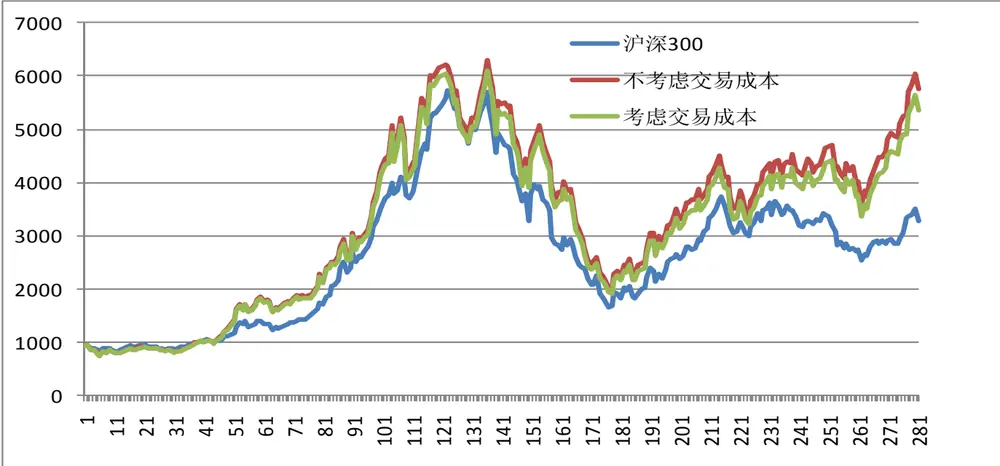
数据来源：国泰君安证券研究

图 2 动量组合每周超额收益
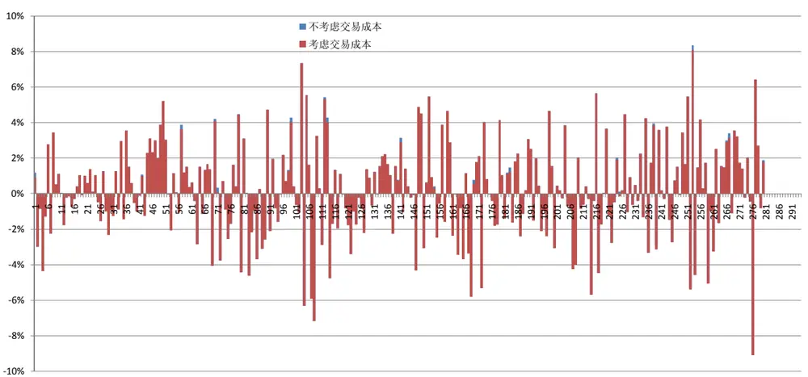
数据来源：国泰君安证券研究

表 11 动量策略超额收益率统计结果

| 均值 | 方差 | 信息 比率 | 胜率 | 最大 回撤 | 最大连续 跑输次数 | 累积 超额收益 |
| --- | --- | --- | --- | --- | --- | --- |
| 0.21% | 0.07% | 8.09% | 52.86% | -36.56% | 9 | 220.86% |

数据来源：国泰君安证券研究

## 3.1.2. 动量策略在不同市场环境下的表现

在不同市场环境下，动量策略的表现相当稳定，基本都跑赢了沪深 300，且胜率均在 50%以上。从累积超额收益来看，动量策略在牛市环境下的表现最好，其次是震荡市，最后是熊市；但是从平均超额收益率及信息比率来看，动量策略在震荡市中最好，其次是熊市，牛市反而最差。各阶段的表现如下列图表所示：

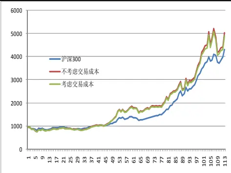

图 3 不同环境下动量策略走势图
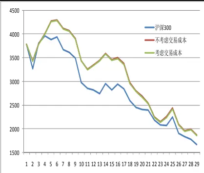
数据来源：国泰君安证券研究

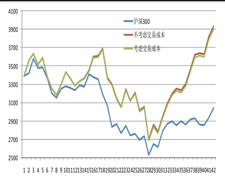

表 12 动量策略不同市场环境下的超额收益率统计结果

| 市场环境 | 均值 | 方差 | 信息比率 | 胜率 | 最大回撤 | 最大连续 跑输次数 | 累积 超额收益 |
| --- | --- | --- | --- | --- | --- | --- | --- |
| 牛市(2005/1/7-2007/10/12) | 0.19% | 0.06% | 7.31% | 54.46% | -20.62% | 5 | 62.13% |
| 熊市(2008/1/11-2008/20/31) | 0.36% | 0.11% | 10.83% | 50.00% | -38.55% | 7 | 5.04% |
| 震荡市(2009/9/18-2010/12/31) | 0.58% | 0.08% | 20.54% | 52.38% | -17.13% | 3 | 21.75% |

数据来源：国泰君安证券研究

## 3.1.3. 组合数量对动量策略的影响

在上述分析中，我们动量策略的组合数量均为 30 只股票，本小节我们主要研究组合数量对动量策略的影响。

从图 4中各个动量策略的走势来看，组合数量的选取对策略收益的影响较大，随着组合数量的增加，组合的稳定性及收益性逐渐变强，不过当组合数量超过 25 时，其走势基本上趋于一致。当然，组合数量不能无限制的增加，因为随着组合数量的继续增多，其走势将与沪深 300趋同，获取超额收益将越来越难。

图 4 不同组合数量的动量策略走势图
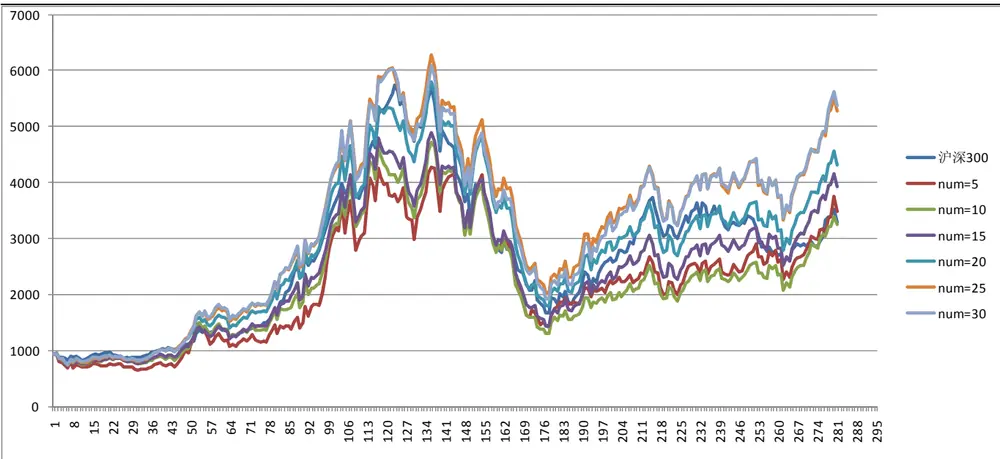
数据来源：国泰君安证券研究

## 3.1.4. 资金管理对动量策略的影响

在前面的回溯过程中，我们的组合在持有期内是不调整的，一定是等到持有期结束后再换仓。当持有期较短时，这一方法是简单可行的，但当持有期过长时，期间可能会不断产生新的信息，这就要求我们对组合进行新的调整，此时资金管理便显得尤为重要。

本节我们仅考虑一种简单的资金管理方法，初始等权重资金分配法。当持有期为 n周时，期初构建组合时，我们将总资金分为 n份，随着时间的推移，每周投资 1/n 份资金。等 n 周过后，资金按顺序依次投入相应的组合。

图 5 资金分配对动量策略的影响
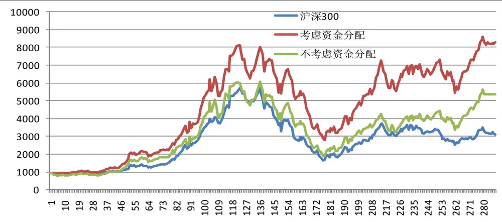
数据来源：国泰君安证券研究

由图 5可以发现，动量策略考虑资金分配明显比不考虑资金分配要好，在整个投资区间，考虑资金分配比不考虑的情况要有近 300%的超额收益。动量效应主要是因信息反应不足而发生，因此随着时间的推移，动量效应原则上应该减弱。所以，当我们不断加入新的信息后，动量效应的衰减效应会变缓，我们认为这是动量策略考虑资金分配比不考虑效果好的主要原因。

## 3.2.反转策略回溯

## 3.2.1. 反转组合历史表现

考虑双边千六的交易成本后，在长达 6 年的回测过程中，反转组合（30,30）取得 788.57%的累计收益，远高于同期沪深 300 指数取得的242.66%的累计收益。在测试阶段，该反转策略战胜指数的频率约为53.70%。反转策略的表现如下所示：

图 6 反转组合走势图
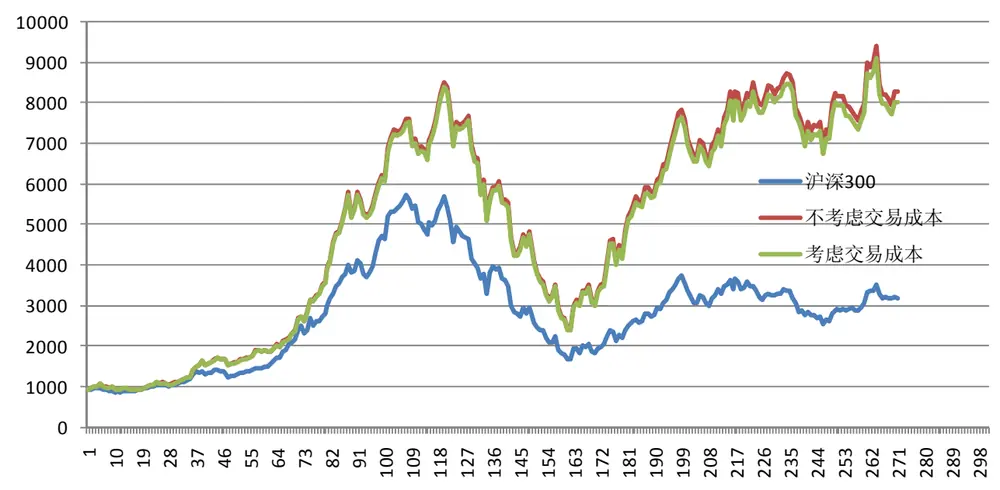
数据来源：国泰君安证券研究

图 7 反转组合每周超额收益
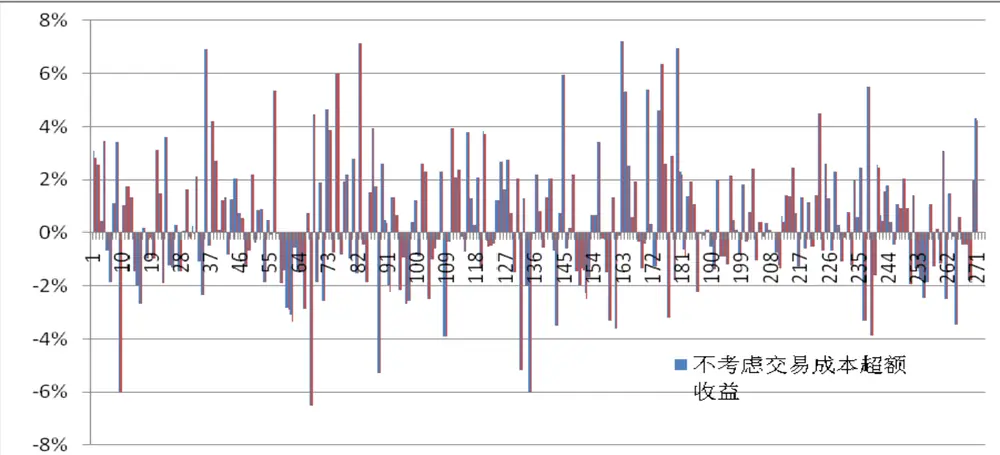
数据来源：国泰君安证券研究

表 13 反转策略超额收益率统计结果

| 均值 | 方差 | 信息 比率 | 胜率 | 最大 回撤 | 最大连续 跑输次数 | 累积 超额收益 |
| --- | --- | --- | --- | --- | --- | --- |
| 0.40% | 0.05% | 17.33% | 53.70% | -34.56% | 9 | 545.91% |

数据来源：国泰君安证券研究

## 3.2.2. 反转策略在不同市场环境下的表现

由下面的图表可以看出，反转策略仅在牛市中能跑赢沪深 300，震荡市与熊市均不能战胜沪深 300，熊市中表现最差。因此与动量策略相比，反转策略的稳定性要稍差点。

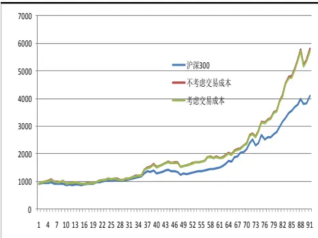

图 8不同市场环境下反转策略走势图
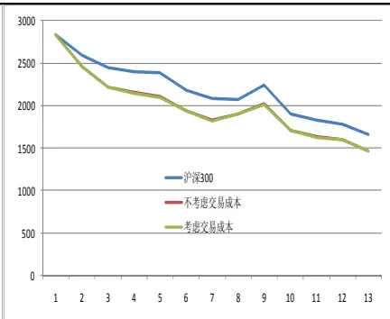
数据来源：国泰君安证券研究

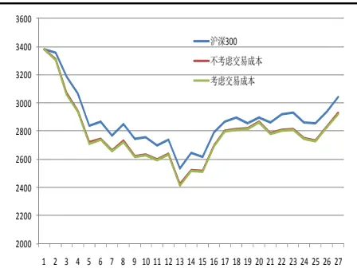

表 14 反转策略不同市场环境下的超额收益率统计结果

| 市场环境 | 均值 | 方差 | 信息比率 | 胜率 | 最大回撤 | 最大连续 跑输次数 | 累积 超额收益 |
| --- | --- | --- | --- | --- | --- | --- | --- |
| 牛市(2005/1/7-2007/10/12) | 0.41% | 0.06% | 16.11% | 52.22% | -10.09% | 9 | 176.97% |
| 熊市(2008/1/11-2008/20/31) | -0.98% | 0.05% | -42.69% | 25.00% | -35.89% | 4 | -7.06% |
| 震荡市(2009/9/18-2010/12/31) | -0.23% | 0.01% | -22.17% | 40.00% | -19.73% | 5 | -7.19% |

数据来源：国泰君安证券研究

## 3.2.3. 组合数量对反转策略的影响

与动量策略相比，数量对反转策略的影响并没有明显规律可循，但整体来看，组合数量在 25 只左右的表现较好，这一点与动量策略的结论是一致的。

图 9 不同组合数量的反转策略走势图
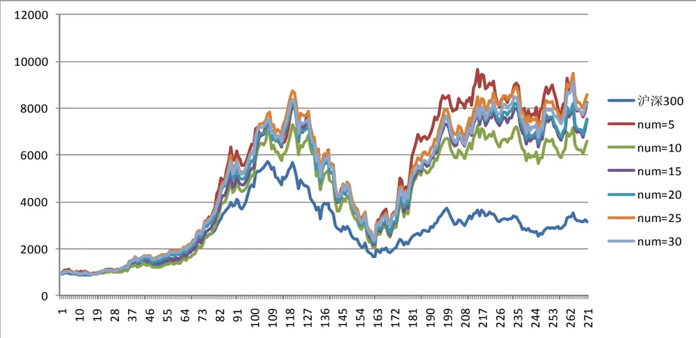
数据来源：国泰君安证券研究

## 3.2.4. 资金管理对反转策略的影响

与动量策略相比，考虑资金分配对反转策略的影响并不明显，而且大部分时间比不考虑资金分配的情况要差。反转效应是因市场反应过度而致，因此需要一个纠偏的过程，从反转的测试结果来看，持有期时间越长，反转效果越好。考虑资金分配实际上是变相降低了持有时间，因此在反转策略中考虑资金分配效果并不好。

图 10 资金分配对反转策略的影响
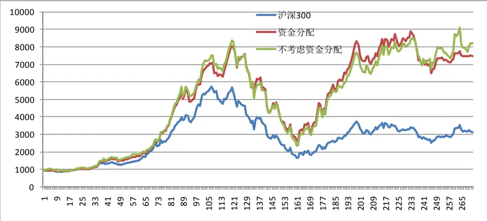
数据来源：国泰君安证券研究

## 4. 结论

我们基于沪深 300成分股对我国股票市场进行了动量反转测试，测试结果表明，中国股票市场存在显著的动量及反转效应，中长期来看动量和反转策略相对于沪深 300都可以取得超额收益。

对于动量组合而言，观测期为 14-15周、持有期为 9-15表现较佳，对于反转组合而言，观测期为 26-30、持有期表现 26-30较佳。

考虑双边千6的交易成本后，在长达6年的回测过程中，动量组合（14,14）取得 471.39%的累计收益，远高于同期沪深 300 指数取得的 250.53%的累计收益，该动量策略战胜指数的频率大约为 52.86%；反转组合（30,30）取得 788.57%的累计收益，远高于同期沪深 300 指数取得的 242.66%的累计收益，该反转策略战胜指数的频率大约为 53.70%。

从稳定性来看，动量组合表现比较稳定，在牛市、熊市、震荡市中均能跑赢沪深 300，而反转组合稳定性较差，仅能在牛市中跑赢沪深 300。

组合数量对动量反转策略的影响是不一样的，在 30只以内，数量越多，动量策略的收益越高越稳定；而反转没有明显的规律，但 25 只的表现比较好，这一点与动量策略比较一致。

就资金分配而言，动量策略更适合，因为动量效应是因反应不足而致，更多的信息流入会使得动量效应的衰减力度减弱；相反，反转策略不适合资金分配，因为反转效应是因反应过度而致，需要较长的时间纠偏，而资金分配实际上变相降低了持有时间。

结合上述分析，我们认为中期内动量效应更为明显些，而长期反转效应更为明显些。利用 2009 年至今的最新数据，我们推荐如下的动量反转组合。当然，在实际投资决策时，还需要结合更多因素对选股组合给出判断，我们再后续报告中将深入研究。

表 15 动量反转组合推荐

| 动量组合（持有10周） | 反转组合（持有6周） |
| --- | --- |
| 包钢股份 | 海普瑞 |
| TCL 集团 | 思源电气 |
| 包钢稀土 | 广发证券 |
| 冀中能源 | 中粮屯河 |
| 昊华能源 | 科伦药业 |
| 海螺水泥 | 四维图新 |
| 格力电器 | 中国重汽 |
| 五矿发展 | 铜陵有色 |
| 中色股份 | 小商品城 |
| 盘江股份 | 中国国航 |

数据来源：国泰君安证券研究

作者简介：

刘富兵：

S0880511010017

021-38676673

liufubing008481@gtjas.com

蒋瑛琨：

S0880511010023

021-38676710

jiangyingkun@gtjas.com

张劭涵（贡献作者）：

实习生

## 分析师声明

作者具有中国证券业协会授予的证券投资咨询执业资格或相当的专业胜任能力，保证报告所采用的数据均来自合规渠道，分析逻辑基于作者的职业理解，本报告清晰准确地反映了作者的研究观点，力求独立、客观和公正，结论不受任何第三方的授意或影响，特此声明。

## 免责声明

本报告仅供国泰君安证券股份有限公司（以下简称“本公司”）的客户使用。本公司不会因接收人收到本报告而视其为本公司的当然客户。本报告仅在相关法律许可的情况下发放，并仅为提供信息而发放，概不构成任何广告。

本报告的信息来源于已公开的资料，本公司对该等信息的准确性、完整性或可靠性不作任何保证。本报告所载的资料、意见及推测仅反映本公司于发布本报告当日的判断，本报告所指的证券或投资标的的价格、价值及投资收入可升可跌。过往表现不应作为日后的表现依据。在不同时期，本公司可发出与本报告所载资料、意见及推测不一致的报告。本公司不保证本报告所含信息保持在最新状态。同时，本公司对本报告所含信息可在不发出通知的情形下做出修改，投资者应当自行关注相应的更新或修改。

本报告中所指的投资及服务可能不适合个别客户，不构成客户私人咨询建议。在任何情况下，本报告中的信息或所表述的意见均不构成对任何人的投资建议。在任何情况下，本公司、本公司员工或者关联机构不承诺投资者一定获利，不与投资者分享投资收益，也不对任何人因使用本报告中的任何内容所引致的任何损失负任何责任。投资者务必注意，其据此做出的任何投资决策与本公司、本公司员工或者关联机构无关。

本公司利用信息隔离墙控制内部一个或多个领域、部门或关联机构之间的信息流动。因此，投资者应注意，在法律许可的情况下，本公司及其所属关联机构可能会持有报告中提到的公司所发行的证券或期权并进行证券或期权交易，也可能为这些公司提供或者争取提供投资银行、财务顾问或者金融产品等相关服务。在法律许可的情况下，本公司的员工可能担任本报告所提到的公司的董事。

市场有风险，投资需谨慎。投资者不应将本报告为作出投资决策的惟一参考因素，亦不应认为本报告可以取代自己的判断。在决定投资前，如有需要，投资者务必向专业人士咨询并谨慎决策。

本报告版权仅为本公司所有，未经书面许可，任何机构和个人不得以任何形式翻版、复制、发表或引用。如征得本公司同意进行引用、刊发的，需在允许的范围内使用，并注明出处为“国泰君安证券研究”，且不得对本报告进行任何有悖原意的引用、删节和修改。

若本公司以外的其他机构（以下简称“该机构”）发送本报告，则由该机构独自为此发送行为负责。通过此途径获得本报告的投资者应自行联系该机构以要求获悉更详细信息或进而交易本报告中提及的证券。本报告不构成本公司向该机构之客户提供的投资建议，本公司、本公司员工或者关联机构亦不为该机构之客户因使用本报告或报告所载内容引起的任何损失承担任何责任。

## 评级说明

## 1.投资建议的比较标准

投资评级分为股票评级和行业评级。

以报告发布后的12个月内的市场表现为比较标准，报告发布日后的12个月内的公司股价（或行业指数）的涨跌幅相对同期的沪深300指数涨跌幅为基准。

## 2.投资建议的评级标准

报告发布日后的 12 个月内的公司股价（或行业指数）的涨跌幅相对同期的沪深300指数的涨跌幅。

|  | 评级 | 说明 |
| --- | --- | --- |
| 股票投资评级 | 增持 | 相对沪深300指数涨幅15%以上 |
|  | 谨慎增持 | 相对沪深300指数涨幅介于5%～15%之间 |
|  | 中性 | 相对沪深 300指数涨幅介于-5%～5% |
|  | 减持 | 相对沪深300指数下跌 5%以上 |
| 行业投资评级 | 增持 | 明显强于沪深 300指数 |
|  | 中性 | 基本与沪深 300指数持平 |
|  | 减持 | 明显弱于沪深300指数 |

## 国泰君安证券研究

|  | 上海 | 深圳 | 北京 |
| --- | --- | --- | --- |
| 地址 | 上海市浦东新区银城中路168号上海 银行大厦29层 | 深圳市福田区益田路 6009 号新世界 商务中心34层 | 北京市西城区金融大街 28 号盈泰中 心2号楼10层 |
| 邮编 | 200120 | 518026 | 100140 |
| 电话 | （021)38676666 | (0755)23976888 | (010)59312799 |
|  | E-mail: gtjaresearch@gtjas.com |  |  |