2011.07.11

# 市场情绪指数的建立及应用

金融工程

刘富兵

8 021-38676673

## ——数量化研究系列之十三

蒋瑛琨

021-38676710

liufubing008481@gtjas.com

jiangyingkun@gtjas.com

编号 S0880511010017

S0880511010023

本报告导读：我们选取了市场各层次的情绪代理变量，分析了在不同市况下各指标预测市场走势的准确性与适用性，在此基础上我们构建了市场情绪指数。目前该指数显示，市场中长期正处于筑底过程，中短期有反弹需求。

所谓行情未动，情绪先行。投资者情绪是研究市场趋势的一重要指标。研究表明，市场情绪对股票收益具有预测作用。本报告旨在研究市场情绪指数的建立，并用于短中期市场大盘择时。

在发达市场上，市场情绪指数已经应用于资产定价以及指导投资等方面。本文首先在 A 股市场寻找能够反映投资者情绪的单个指标，然后用数量化方法构建市场情绪指数。

我们主要从 7个维度选取市场情绪变量：二级市场的估值水平、活跃度、市场结构、一级市场的情绪、机构投资者的情绪、场外人士的市场情绪以及创新市场的情绪，并最终选取市场 PE、PB，换手率，上涨家数占比、IPO首日涨幅以及新增 A股开户数作为情绪变量。由于创新市场存续时间过短，以及期指市场指标需综合分析（而非仅通过时序分析）才更有效，本文暂未在情绪指数中纳入创新指标。

- 对情绪变量作标准化处理后进行主成分分析，我们分别得到了情绪指数 GMX及情绪变动指数 GMVX。

从长期来看，GMX指数在大盘下跌时具有领先作用，可以作为先行指标，在大盘上涨时滞后于大盘，可作为确认指标。

利用 GMX 指数的均值回复特性，可以提示短期的风险与机 会：当GMX指数首次上穿上界阀值时，提示风险，未来大盘下行概率较高；当 GMX指数首次下穿下界阀值时，提示机会，未来上涨概率较大。

短期利用 GMVX指数，我们可以判断大盘未来短期的涨跌幅。从历史上看，GMVX指数判断下期的准确率为 66%；当 GMVX指数大于0时，判断下期的准确率可高达 76%。

目前，GMX指数处于历史底部区域，结合情绪指数与沪深 300的关系，我们认为从中长期来看，大盘正处于筑底过程。从中短期来看，情绪指数已跌破下界阀值，市场情绪有均值回复的需求；从短期来看，本周 GMVX指数有所下降，为-0.57，由此判断大盘下周处于平衡，下跌概率略高。

z 后续，我们建立的情绪指数每周会持续更新在《金融工程与衍生品周报》中，敬请关注。

## 相关报告

《衍生品与行为金融隐含的 A股走向》2008 年 9 月——2009 年 8 月，月报(多期)

## 1. 市场情绪概述

## 1.1. 市场情绪的定义

行为金融学认为投资者是有限理性的，情绪和认知偏差的存在使其无法做到理性预期和效用最大化，其有限理性行为将导致市场非有效和资产价格偏离内在价值，从而可能导致金融市场整体出现系统性偏差。而这种偏差反过来影响投资者对资产价格的理性判断，导致认知偏差和情绪偏差进一步的自我强化，形成反馈机制，由此放大乐观或者悲观的情绪，催生股市泡沫或股灾。互联网泡沫以及纳斯达克崩盘便是很好的例证。

目前对于市场情绪还没有一个统一的概念，比较倾向一致的观点是将投资者情绪、投资者预期与投资者信念联系起来，认为投资者情绪是指投资者受各种信息的影响，对风险资产未来价格具有偏差的投资者预期或者投资者信念。

市场情绪在改变股市的同时也受股市的影响。索罗斯的“反射理论”很好的阐述了这一点：他认为投资者认识市场时会产生情绪，而情绪的高低又可能在一定程度上影响决策，使决策不是完全客观，决策后的行动又会改变市场，改变后的市场再进一步左右认识和情绪。这样就会导致投资者过度乐观或过度悲观，进一步加剧了市场的波动。

## 1.2.市场情绪的重要性

基本面、公司面和宏观经济等因素相互作用在一定程度上决定了股市的长期走向，然而股市中短期的波动还受到其他很多因素的影响，投资者情绪便是其一。

投资者的心理会使得资产价格偏离其内在价值，在中短期，投资者情绪甚至可以直接影响到资产定价。国外研究表明，市场情绪对股票收益具有预测功能，当市场情绪乐观时，成长股、小盘股、高杠杆股以及绩优股能够显著获得超额收益；市场情绪较低时，新上市股票、高波动股票、绩差股、无红利股票以及高速增长股的定价偏低。正所谓，行情未动，情绪先行。

投资大师安德烈.科斯托拉尼认为心理情绪造就 90%的行情，即 T（趋势）=G（资金）+P（心理）。无独有偶，另一著名的投资大师索罗斯，则喜欢从市场情绪这个维度看市场，只要市场情绪存在，则看多市场。

在发达市场上，市场情绪指数研究已经成为一个热点，并且已经应用于资产定价以及指导投资等方面，除了像摩根富林明资产管理公司、道富等大型机构设计了市场情绪指数产品，大量的研究也发掘了很多有益的情绪代理变量，用以更好的反应市场情绪。

总体而言，市场情绪指数能够反映市场的乐观或悲观程度，是投资者心理的反应，也是投资者对市场表现的反应。该指数能够反应出市场的总体趋势，为投资者判断市场提供依据。

## 1.3.市场情绪指数常用方法

市场情绪指数在海外成熟市场较常用的做法是采用直接调查的方式来编制情绪指数，比较有名的包括：JF Investor Confidence Index，State StreetInvestor Confidence Index 等，他们之中有些是对投资者直接调查的方法得到的数据，有些是用数量化的计算方法设计出来的指数。也有采用间接指标来编制、采用数量化方法设计的情绪指数，常见的有 Put/CallRatio，VIX 指数，EMSI 指数，RAI 指数等。

国内目前直接通过调查方法统计投资者情绪的数据非常少，主要是用数量化方法构建指数。与国外这些指数不同的是，国内没有期权市场，而国外的这些数量化计算方法大都依赖于期权市场的表现，因此我们需要寻找能反应我国市场的情绪指标。我们首先在 A 股市场寻找能够反映投资者情绪的单个指标，然后用数量化方法构建投资者情绪指数。

## 2. 反映市场情绪的变量

我们主要从以下七个维度选取市场情绪的代理变量：

1. 反映二级市场估值水平的 PE、PB；

2. 反映二级市场活跃程度的成交量、换手率；

3. 反映二级市场结构的小盘相对收益、上涨家数占比；

4. 代表一级市场情绪特征的 IPO 首日涨跌幅、IPO家数、IPO发行 PE和 IPO首日换手率；

5. 代表基金市场交易活跃程度的封闭式基金折溢价率和基金仓位；

6. 代表场外人士情绪高低的新增开户数；

7. 代表创新市场情绪的融资买入占比、期货持仓量、基差等。

我们将从这七个角度出发，分别分析一下这些因子对大盘的影响。

## 2.1.市场估值指标

PE、PB 不仅反应了股票市场的价格情况，同时也反应了整个宏观经济运行下上市公司盈利等财务持续状况，该类指标的高低在一定程度上反映了市场情绪。一般而言，估值指标越高，表明市场情绪越高涨。

由图 1-4 可以发现，PE、PB 与市场高度正相关，同时该值的波峰和波谷对应了市场的局部顶和局部底，这也可以成为一个确认市场方向的指标。从 PE、PB 与沪深 300 的滚动相关性来看，PE、PB 在牛市及熊市与沪深 300的相关性较高，在震荡市相关性较低，因此，我们认为估值指标更适用于单边市。自 2009 年 9 月以来，两者与沪深 300 的相关系数均处于较低水平。

从估值水平来看，目前市场平均 PE 为 13.68 倍，PB 为 2.19 倍，均低于历史均值，且处于估值的下界。从该指标来判断，目前市场处于历史底部的概率较大。

图 1 PE 与沪深 300 走势图
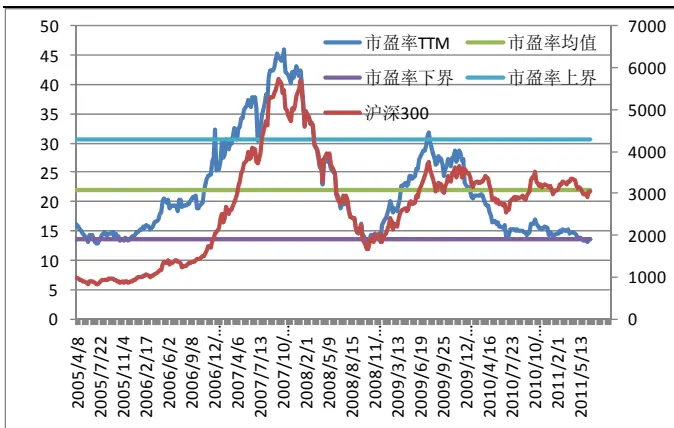
数据来源：国泰君安证券研究,wind

图 2 PE与沪深 300的相关性
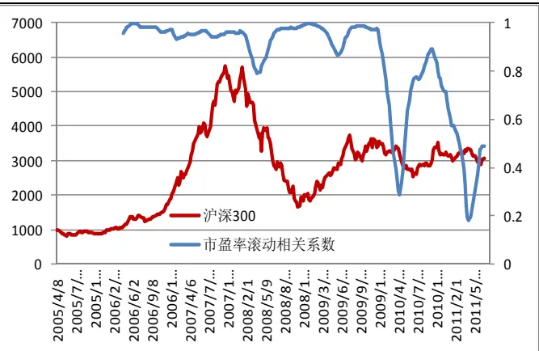
数据来源：国泰君安证券研究,wind

图 3 PB 与沪深 300 走势图
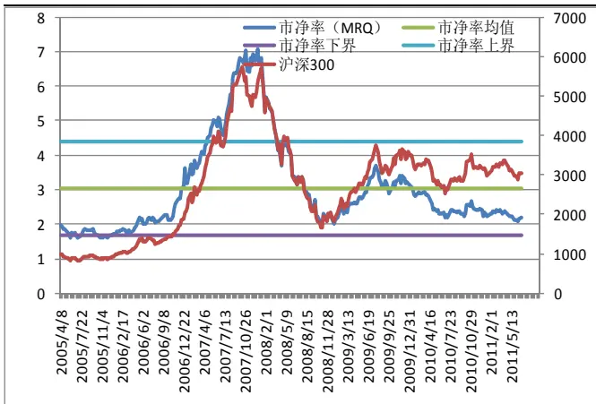
数据来源：国泰君安证券研究,wind

图 4 PB与沪深 300的相关性
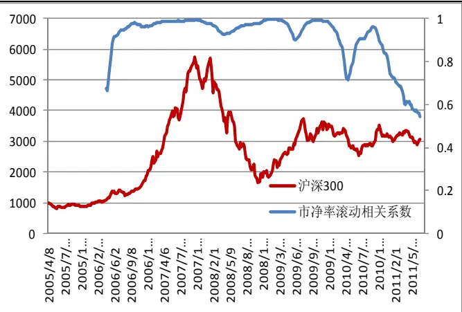
数据来源：国泰君安证券研究,wind

## 2.2. 市场活跃指标

市场成交量及换手率反映了二级市场场内的活跃程度，是代表市场流动性的典型指标。市场亢奋时，投资者交易行为频繁，换手率会变高。07年的牛市，市场的周换手率能达到 5%-6%，而在市场热情不高时，市场的周换手率不到 1%。

图 5 换手率与沪深 300走势
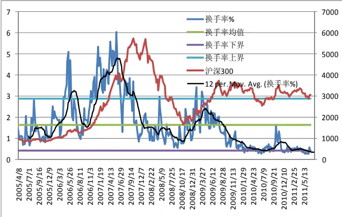
数据来源：国泰君安证券研究,wind

图 6换手率与沪深 300的相关性
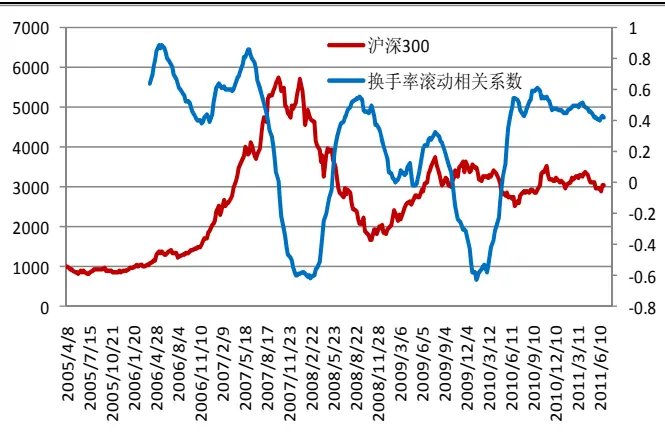
数据来源：国泰君安证券研究,wind

图 7 成交额与沪深 300 走势
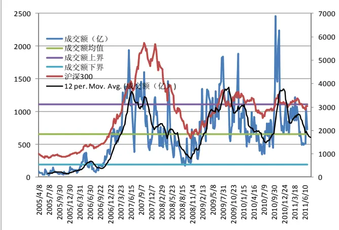
数据来源：国泰君安证券研究,wind

图 8 成交额与沪深 300的相关性
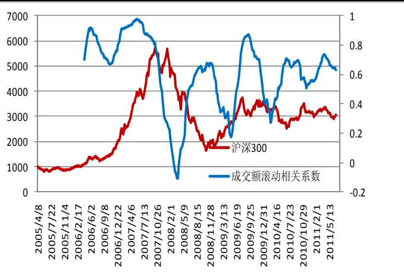
数据来源：国泰君安证券研究,wind

由图 5-8 可以发现换手率、成交额与沪深 300 走势的相关性也较高。而且从图 5、7 可以看出，换手率与成交额相对于沪深 300 具有一定的领先性，可以作为大盘的领先指标。从换手率、成交额与沪深 300的滚动相关性来看，牛市时相关性较高，而熊市时，由于换手率领先于大盘、提前开始显著下降，因此两者即时相关性出现显著下降。总的来看，如果换手率在局部高位出现明显下降，可能是未来市场将达到顶部的迹象。从震荡市来看，两者相关性尚可，换手率在出现局部高位和低位时，也对应市场阶段性顶部和底部。自 2010 年 6 月以来，换手率与成交额与沪深 300的相关性较高且比较稳定。

目前沪深 300 指数的周换手率不到 1%，低于历史换手率的下界，从该指标判断，目前市场处于底部区域。

## 2.3.市场结构指标

反映市场结构的指标有很多，这里我们主要选取沪深两市上涨家数占比与小盘相对大盘的超额收益率这两个指标。上涨家数占比及小盘的相对收益越高，说明市场结构越倾向于看好后市，投资者情绪越高涨。

图 9 上涨家数占比与沪深 300走势
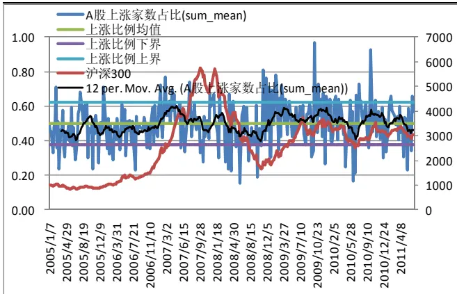
数据来源：国泰君安证券研究,wind

图 10 上涨家数比例与沪深 300的滚动相关
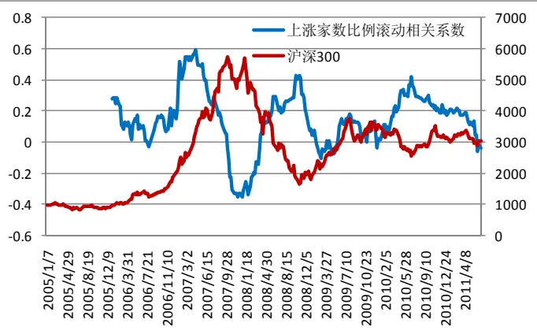
数据来源：国泰君安证券研究,wind

图 11 小盘超额收益与沪深 300 走势
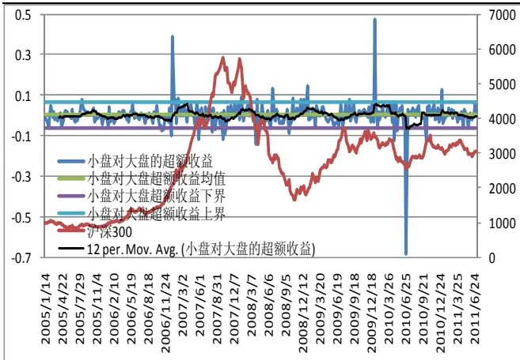
数据来源：国泰君安证券研究,wind

图 12 小盘超额收益与沪深 300的滚动相关
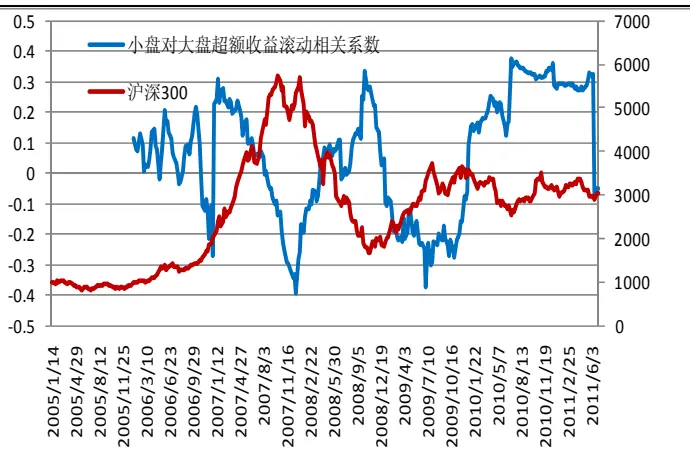
数据来源：国泰君安证券研究,wind

从与沪深 300的走势来看，上涨家数占比的相关性要高些，上涨家数占比相对于大盘有一定的领先性。而小盘相对于大盘的走势不明显，滚动相关性也是如此，不过在阶段性顶部，该指标具有一定领先性。

从滚动相关性来看，上涨家数占比适用于对牛市高点和低点的领先判断，而对震荡市的判断效果较差。适用于牛市后半程、熊市、随后反弹阶段，而在震荡市不适用（负相关表明市场处于底部）。而小盘的相对收益适用于对阶段性市场高点和低点有一定的提前判断作用，相对适用于底部区域。

## 2.4. 新股指标

通常在市场较热时，投资者情绪高涨，市场所能承受的新股发行量较大，市场对新股追逐踊跃也使新股上市首日收益较高。因此在某种程度上，可以认为在一定时期内的 IPO家数可以间接反映投资者情绪。

此外，新股上市首日的交易状况能够很好的反应市场的交易情绪，主要指标包括，IPO 首日涨跌幅、IPO首日换手率、IPO 发行 PE 等。

图 13 IPO 家数与沪深 300 走势
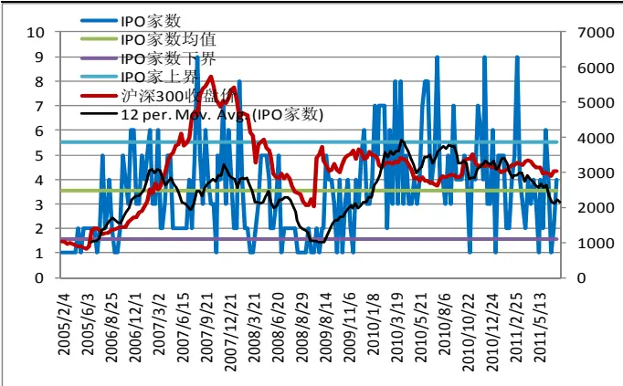
数据来源：国泰君安证券研究,wind

图 14 IPO 家数与沪深 300的相关性
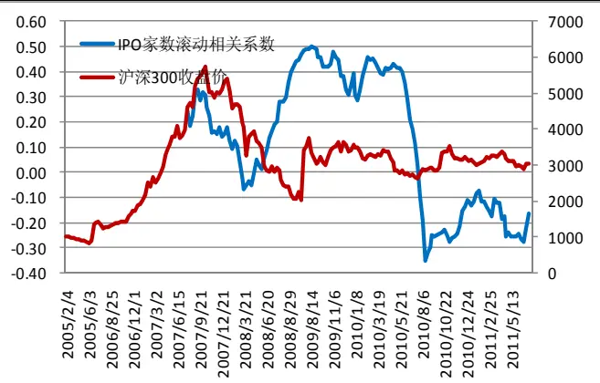
数据来源：国泰君安证券研究,wind

图 15 IPO 首日涨幅与沪深 300 走势
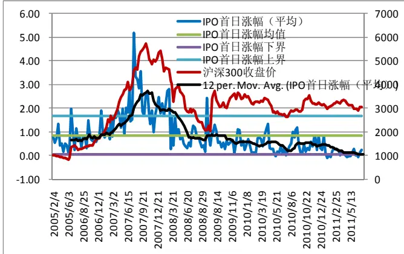
数据来源：国泰君安证券研究,wind

图 16 IPO 首日涨幅与沪深 300的相关性
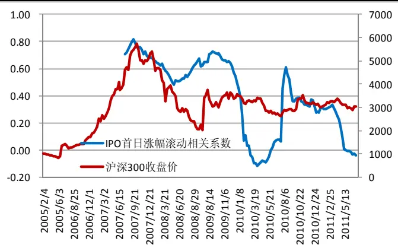
数据来源：国泰君安证券研究,wind

图 17 IPO 发行 PE 与沪深 300 走势
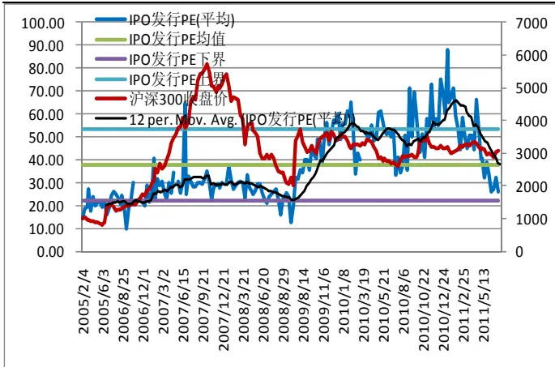
数据来源：国泰君安证券研究,wind

图 18 IPO 发行 PE 与沪深 300 相关性
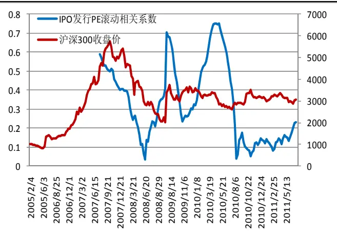
数据来源：国泰君安证券研究,wind

图 19 IPO首日换手率与沪深 300走势
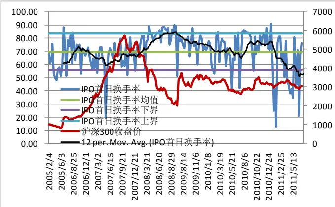
数据来源：国泰君安证券研究,wind

图 20 IPO首日换手率与沪深 300走势
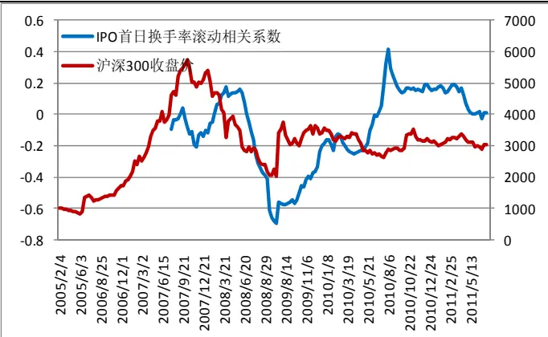
数据来源：国泰君安证券研究,wind

由图 13-20 可以发现 IPO首日涨幅与沪深 300 存在较强的趋同性，且该指标相对于沪深 300有一定的领先性。其次与沪深 300相关性较强的是IPO 发行家数。而 IPO 发行 PE 与 IPO 首日换手率与沪深 300 的相关性较低。整体上来看，IPO 首日涨幅是一个较好的反映市场情绪的代理变量，其对于整个市场的走势存在较强的预示作用，当 IPO首日收益率从低点上升时表明市场情绪的启动，从而带动市场。

从滚动相关性来看，IPO发行家数、IPO首日涨幅、IPO发行 PE 适用于市场顶部，在市场底部不适用；在震荡市中 3个指标均不适用。

目前 IPO相关指标均处于历史低位，由此我们判断，市场处于底部区域。

## 2.5. 基金指标

封闭式基金折价率的走势可以反映投资者情绪的变化，一般来说，当投资者情绪高涨时，封闭式基金折价率将会降低，反之则会上升。该指标通过统计封闭式基金的净值和市场价格之差，反映了低风险投资者对后市的判断。

由图 21-22 可以发现，在 2005-2009 年封基折价率与沪深 300 的走势是高度相关的，但自 2010 年以后，该指标的有效性便大打折扣。市场上现存的封闭式基金有很多距离到期日仅有 2-3 年的时间了，这些距离到期日近的封基，交易频繁程度会较高，其折溢价的波动率就不如曾经的那些距离到期日还有 5 年甚至 10 年的封基了，因此这个指标对于市场的有效性大幅减弱。

公募基金的仓位反映了机构投资者的交易热情，这里我们用每周预测股票型基金的仓位作为近似。由图 23-24 可以发现，该指标与沪深 300 的相关性也较高。

从滚动相关性来看，股票型基金仓位适用于上涨市与震荡市，而封基折价率适用于上涨市，在下跌及震荡市中两者相关性衰减。

总体来看，封闭式基金一定程度上反应了市场情绪，此指标一般滞后于市场指数，而且目前的有效性正在大幅减弱。股票型基金的仓位反映了机构投资者的交易热情，与市场的相关性较高。

图 21 封基折价率与沪深 300 走势
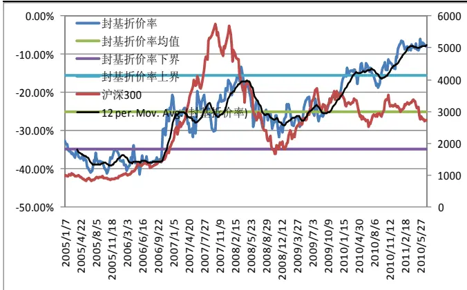
数据来源：国泰君安证券研究,wind

图 22 封基折价率与沪深 300 滚动相关
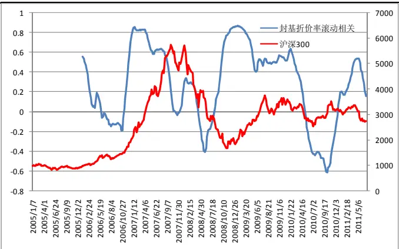
数据来源：国泰君安证券研究,wind

图 23 股票型基金仓位与沪深 300走势
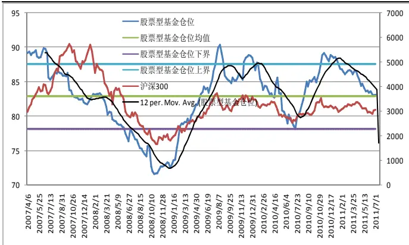
数据来源：国泰君安证券研究,wind

图 24 股票型基金仓位与沪深 300滚动相关
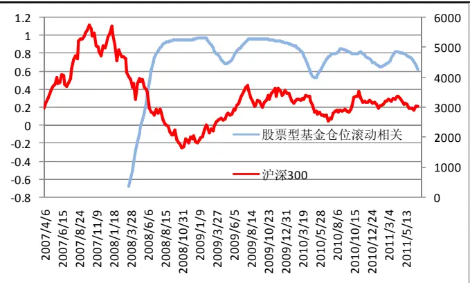
数据来源：国泰君安证券研究,wind

## 2.6.场外人士情绪指标

A 股新增开户数反应了场外人士对于当前市场状况的情绪。当市场状况较好的时候，新开户数与相应新流入的资金都较多，推动市场情绪高涨。07 年的牛市，A 股新增开户数大幅上升。这里我们采用中登公司公布的沪深两市每周 A股新开户数来作为场外人士情绪的近似指标。

图 25 A股新增开户数与沪深 300走势
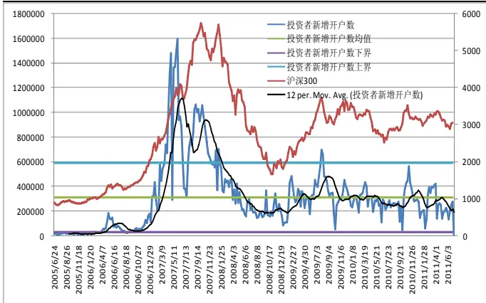

图 26 A股新增开户数与沪深 300滚动相关
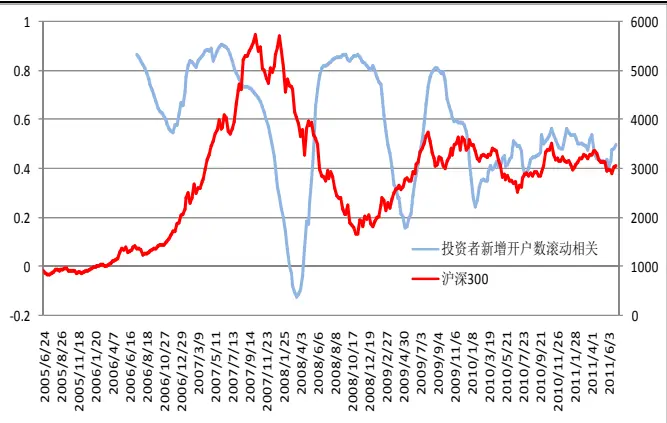

数据来源：国泰君安证券研究,wind

数据来源：国泰君安证券研究,wind

由图 25-26 可以发现，A 股新增开户数与沪深 300 具有很强的相关性，且该指标相对沪深 300具有一定的领先性，可以作为先行指标。

从滚动相关性来看，该指标适用于单边市的下半程，震荡市中适用性较弱。目前，该指标处于历史下界以下的位置，由此判断目前市场处于底部区域。

## 2.7.创新市场情绪指标

2010 年可谓是中国证券市场的创新元年，融资融券与股指期货相继推出，极大的丰富了市场的投资手段。由于参与融资融券及股指期货的门槛较高，投资者投资经验比较丰富，因此创新市场的情绪能够一定程度上反应股票市场的情绪。但由于创新市场存在的时间较短，且规模相对较小，市场处于发展中，因此该类指标有效性还有待于时间进一步检验。

在此我们仅做一下简单分析，但我们相信未来这些指标在市场上会越来越重要，我们会作后续的关注及跟踪。

我们主要选取融资买入额与融资余额的占比来反映融资融券市场的情绪，一般而言，在正常范围内，该比例越高，市场情绪越高，对未来的市场越看好。

图 27融资买入额占比与沪深 300走势
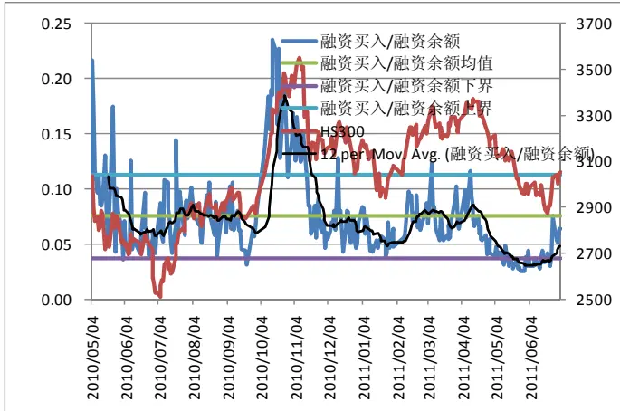
数据来源：国泰君安证券研究,wind

图 28融资买入额占比与沪深 300滚动相关
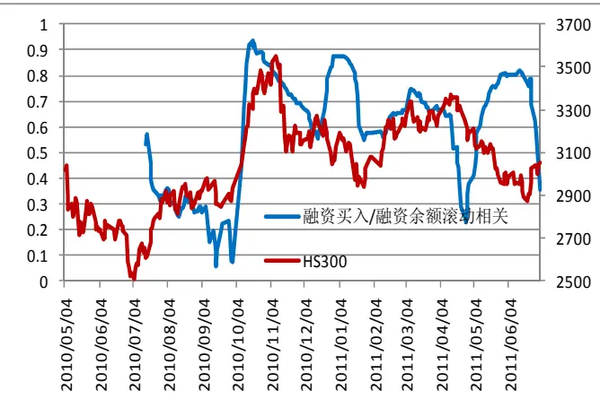
数据来源：国泰君安证券研究,wind

从图 27 可以看出该指标相对于沪深 300 有一定的领先性，可以作为沪深 300的领先指标。从滚动相关性来看，自 2010年 10月以来，该指标与沪深 300的相关性一直比较稳定，但近期有下滑趋势、这与市场短期震荡波动有关。

从该指标来看，融资买入占比已经从历史下界回复到均值线附近，上升趋势已经形成，未来市场上涨的概率较高。

股指期货市场，我们主要选取基差、持仓量、成交量来反映期货市场的情绪。期指价差、成交与持仓，在不同市况下（比如强上涨市、弱上涨市、强下跌市、弱下跌市）有不同的含义和趋势，这里不做详细分析。一般而言，在正常范围内基差越大（在合理价差时，情绪越高）、持仓量（多空分歧越大，后市呈强市）及成交量越高（交易意愿强烈），期货和股市情绪越高涨，股市后市就越看好。

图 29 基差与沪深 300 走势
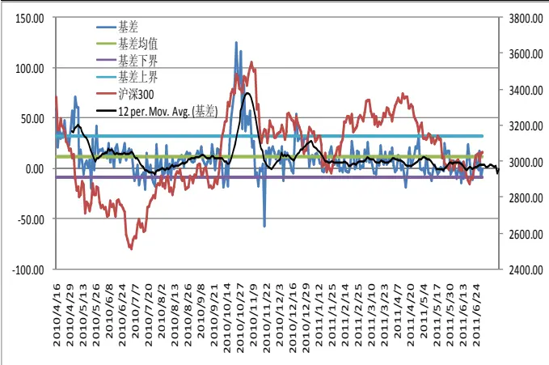
数据来源：国泰君安证券研究,wind

图 30 基差与沪深 300滚动相关
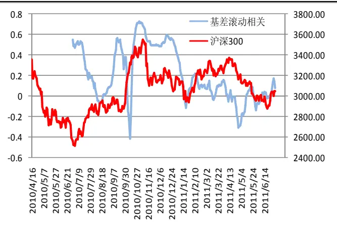
数据来源：国泰君安证券研究,wind

图 31 成交量与沪深 300走势
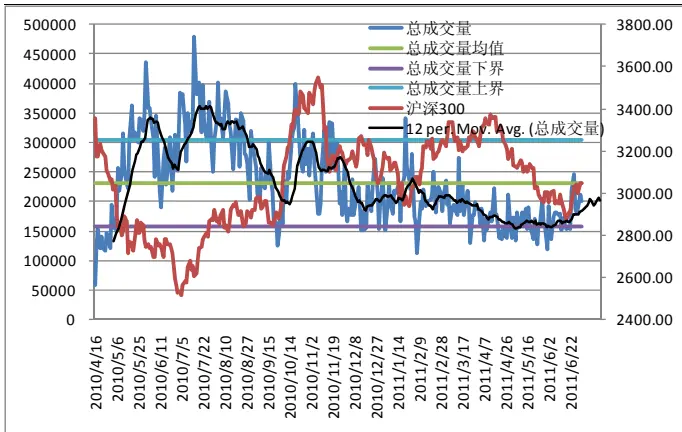
数据来源：国泰君安证券研究,wind

图 32 成交量与沪深 300滚动相关
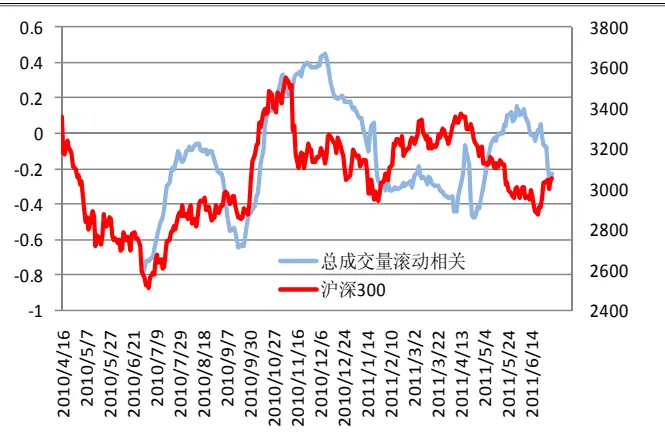
数据来源：国泰君安证券研究,wind

图 33 持仓量与沪深 300 走势
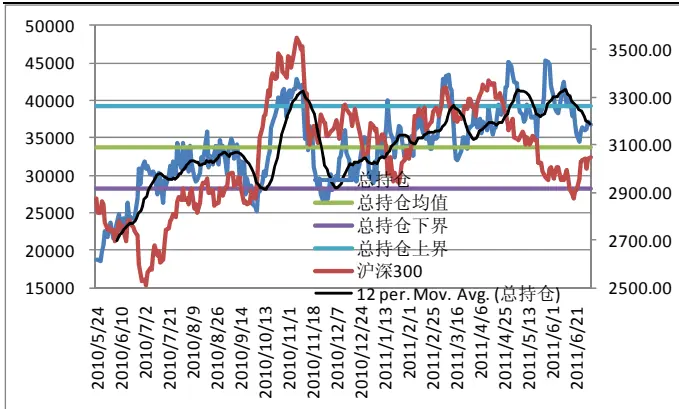
数据来源：国泰君安证券研究,wind

图 34 持仓量与沪深 300滚动相关
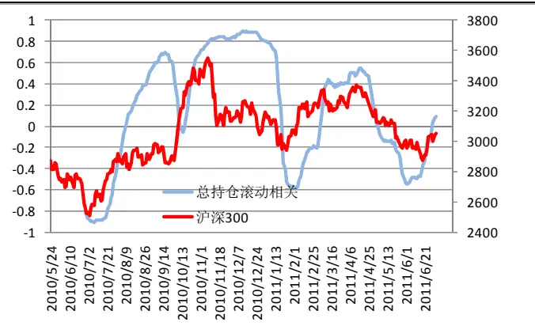
数据来源：国泰君安证券研究,wind

从图 29-34 可以看出，基差相对沪深 300 具有一定的领先性，而成交量与持仓量的领先作用不明显。从滚动相关性来看，各类指标的适用范围无显著规律可循。这主要是因为期指市场需要综合这几个指标分析判断才更有效，单独指标的研究有局限性。关于综合研究，我们在其他专题报告中分析。上述各类指标与沪深 300的相关系数如下表所示。

表 1 各指标与沪深 300的相关系数

| 指标 | t期 | t-1期 | t-2期 | t-3期 | t-4期 |
| --- | --- | --- | --- | --- | --- |
| PE | 0.75 | 0.76 | 0.76 | 0.77 | 0.77 |
| PB | 0.86 | 0.86 | 0.86 | 0.86 | 0.85 |
| 换手率 | 0.02 | 0.04 | 0.06 | 0.08 | 0.09 |
| 成交量 | 0.70 | 0.70 | 0.70 | 0.70 | 0.69 |
| 上涨比例 | 0.15 | 0.16 | 0.17 | 0.17 | 0.17 |
| 小盘相对大盘收益 | 0.03 | 0.03 | 0.03 | 0.02 | 0.02 |
| IPO 首日涨幅 | 0.47 | 0.47 | 0.48 | 0.51 | 0.52 |
| IPO 发行家数 | 0.23 | 0.25 | 0.26 | 0.25 | 0.24 |
| IPO 发行 PE | 0.26 | 0.24 | 0.22 | 0.22 | 0.22 |
| IPO 首日换手率 | 0.07 | 0.03 | 0.03 | 0.01 | 0.02 |
| 封基折价率 | 0.66 | 0.65 | 0.65 | 0.65 | 0.64 |
| 股票型基金仓位 | 0.48 | 0.49 | 0.50 | 0.51 | 0.53 |
| A 股新增开户数 | 0.73 | 0.74 | 0.74 | 0.74 | 0.75 |
| 融资买入占比 | 0.34 | 0.33 | 0.33 | 0.33 | 0.33 |
| 基差 | 0.33 | 0.34 | 0.35 | 0.34 | 0.33 |
| 期货持仓量 | 0.42 | 0.40 | 0.38 | 0.35 | 0.32 |
| 期货成交量 | -0.36 | -0.34 | -0.32 | -0.30 | -0.30 |

数据来源：国泰君安证券研究

表 2 各个指标移动平均后与沪深 300的相关系数

| 指标 | t期 | t-1期 | t-2期 | t-3期 | t-4期 |
| --- | --- | --- | --- | --- | --- |
| PE | 0.79 | 0.79 | 0.79 | 0.79 | 0.79 |
| PB | 0.86 | 0.85 | 0.84 | 0.83 | 0.83 |
| 换手率 | 0.12 | 0.15 | 0.17 | 0.19 | 21.46% |
| 成交量 | 0.81 | 0.81 | 0.81 | 0.81 | 0.81 |
| 上涨比例 | 0.45 | 0.46 | 0.47 | 0.47 | 0.48 |
| 小盘相对大盘收益 | 0.07 | 0.07 | 0.07 | 0.07 | 0.07 |
| IPO 首日涨幅 | 0.66 | 0.67 | 0.68 | 0.68 | 0.68 |
| IPO 发行家数 | 0.28 | 0.27 | 0.26 | 0.24 | 0.23 |
| IPO 发行 PE | 0.15 | 0.14 | 0.12 | 0.11 | 0.09 |
| IPO 首日换手率 | -0.10 | -0.13 | -0.15 | -0.17 | -0.19 |
| 封基折价率 | 0.65 | 0.64 | 0.63 | 0.63 | 0.62 |
| 股票型基金仓位 | 0.56 | 0.56 | 0.57 | 0.58 | 0.59 |
| A 股新增开户数 | 0.85 | 0.85 | 0.86 | 0.86 | 0.87 |
| 融资买入占比 | 0.44 | 0.43 | 0.43 | 0.42 | 0.41 |
| 基差 | 0.51 | 0.50 | 0.49 | 0.47 | 0.45 |
| 期货持仓量 | 0.25 | 0.22 | 0.18 | 0.15 | 0.12 |
| 期货成交量 | -0.31 | -0.30 | -0.29 | -0.28 | -0.27 |

各类指标与沪深 300的关系及适用性归纳如下：

表 3 各个指标与沪深 300的关系及适用性

| 指标 | 与沪深300 的领先滞后性 | 适用性 |
| --- | --- | --- |
| PE、PB | 同步 | 适用于单边市，震荡市较差 |
| 换手率、成交量 | 领先 | 适用于震荡市、顶部区域，底部区域较差 |
| 上涨家数占比 | 领先 | 适用于单边市的后半阶段、底部区域，震荡市及顶部区域较差 |
| 小盘相对收益 | - | 适用于震荡市、底部区域，顶部区域较差 |
| IPO 相关指标 | 领先 | 适用于顶部区域，震荡市及底部区域较差 |
| 封基折价率 | 滞后 | 适用于上涨势，下跌及震荡市较差 |
| 股票型基金仓位 | 同步 | 适用于上涨及震荡市 |
| 新增 A 股开户数 | 领先 | 适用于单边市后半阶段，震荡市较差 |
| 融资买入占比 | 领先 |  |
| 基差 | 领先 |  |

数据来源：国泰君安证券研究

## 3. 市场情绪指数的构建

单个情绪指标只能针对市场某个细分部分反映投资者的情绪水平,可能仅反映了不同的投资者情绪或某一方面。为了综合测量市场整体的情绪水平及变化，我们运用主成分分析法，构建我们的情绪指数。相比单一的情绪指标，情绪指数能更真实全面的反映市场的总体情绪所处的阶段及相应的变化。

情绪综合指数的简要构建过程如下：

首先，选取情绪基础代理指标，根据指标的含义对原数据进行预处理和分类，其中包括对指标进行移动平均，形成基础指标集；

其次，将基础指标集标准化，形成标准指标集；

第三，对标准指标进行主成分分析，提取主成分，形成市场情绪指数；
最后，对市场情绪指数进行分析与评估。

综合各个指标与沪深 300的相关性、领先滞后关系以及适用性，我们选择市场 PE、PB、换手率（-4）、上涨家数占比、IPO 首日涨幅、新增 A股开户数、融资买入占比以及基差作为基础指标集，并进行主成分分析。

我们将做两次主成分分析，一次是以传统市场的指标包括 PE、PB、换手率（-4）、上涨家数占比、IPO首日涨幅、新增A股开户数作为指标集进行主成分分析；一次是加入创新市场的融资买入占比、基差进行主成分分析。主要目的是对两次主成分进行简单的对比，观测创新指标的加入能否对情绪指数有所改善。当然由于创新市场的数据较短，因此我们在构建情绪指数时仍主要参照传统市场的指标。未来随着时间的推移，我们会将该指数加入新的有效指标，作进一步进完善。

对传统指标进行主成分分析，得到结果如下表所示：

表 4 主成分分析结果 I

| 指标 | 第一主成分 | 第二主成分 | 第三主成分 | 第四主成分 | 第五主成分 | 第六主成分 |
| --- | --- | --- | --- | --- | --- | --- |
| 新增开户数 | 0.45 | 0.09 | -0.18 | -0.86 | 0.01 | -0.11 |
| PE | 0.48 | -0.07 | -0.08 | 0.32 | -0.61 | -0.54 |
| PB | 0.46 | -0.18 | -0.34 | 0.20 | -0.14 | 0.76 |
| 换手率 | 0.34 | 0.10 | 0.91 | -0.03 | -0.07 | 0.21 |
| IPO 首日涨幅 | 0.46 | -0.22 | -0.02 | 0.26 | 0.77 | -0.27 |
| 上涨家数占比 | 0.15 | 0.95 | -0.15 | 0.21 | 0.12 | 0.03 |
| 主成分解释度% | 67.86 | 16.43 | 10.36 | 3.35 | 1.70 | 0.31 |
| 与沪深 300 相关性 | 0.80 | 0.11 | -0.48 | -0.13 | -0.03 | 0.02 |

数据来源：国泰君安证券研究

由表 2可以看出，第一主成分的解释力度已近 70%，我们选用第一主成分构建市场情绪指数（Gtja Mood Index，以下简称 GMX）。

此外，第三主成分除了与沪深 300具有较强的相关性外，我们发现其与沪深 300收益率的相关性较强，因此我们选择第三主成分构建市场情绪变动指数（Gtja Mood Variation Index，以下简称 GMVX）。构建的 GMX指数及 GMVX指数如下图所示：

图 35 市场情绪指数与沪深 300走势
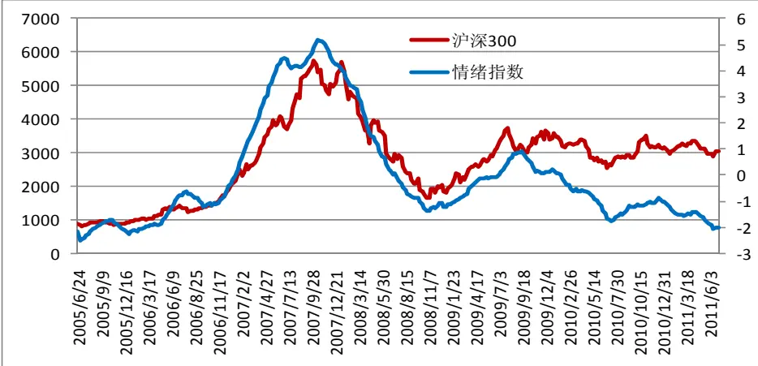
数据来源：国泰君安证券研究

图 36 市场情绪变动指数与沪深 300收益率
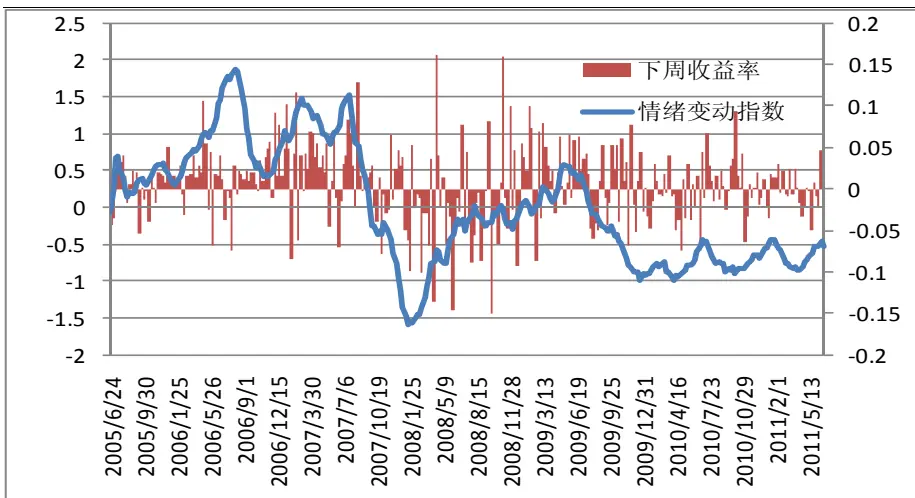

加入创新市场的指标进行主成分分析，我们得到如下结果：

表 5 主成分分析结果 II

| 指标 | 第一主成分 | 第二主成分 | 第三主成分 | 第四主成分 | 第五主成分 | 第六主成分 | 第七主成分 | 第八主成分 |
| --- | --- | --- | --- | --- | --- | --- | --- | --- |
| 新增开户数 | 0.35 | -0.25 | -0.31 | 0.54 | 0.51 | -0.22 | -0.32 | 0.04 |
| PE | 0.39 | -0.06 | -0.14 | -0.52 | 0.26 | 0.63 | -0.29 | 0.04 |
| PB | 0.45 | -0.02 | -0.04 | 0.13 | 0.09 | 0.16 | 0.75 | -0.43 |
| 换手率 | 0.20 | -0.51 | 0.73 | 0.22 | -0.11 | 0.21 | -0.01 | 0.26 |
| IPO 首日涨幅 | 0.29 | 0.45 | 0.52 | -0.28 | 0.41 | -0.45 | -0.06 | -0.04 |
| 上涨家数占比 | 0.21 | 0.64 | 0.10 | 0.50 | -0.29 | 0.37 | -0.26 | -0.03 |
| 融资买入占比 | 0.43 | 0.10 | -0.25 | -0.10 | -0.29 | -0.22 | 0.25 | 0.73 |
| 基差 | 0.41 | -0.22 | -0.05 | -0.17 | -0.56 | -0.33 | -0.35 | -0.45 |
| 主成分解释度% | 60.03 | 17.81 | 9.56 | 7.16 | 2.91 | 2.07 | 0.26 | 0.20 |
| 与沪深300相关性 | 0.29 | 0.21 | 0.05 | 0.66 | -0.46 | 0.04 | 0.18 | -0.11 |

数据来源：国泰君安证券研究

由表 5可以看出，加入创新市场指标后，无论是从主成分的解释力度还是从与沪深 300的相关性来看，主成分分析的力度都减弱了。无论是选择第一主成分还是选择与沪深300相关性较强的第四主成分作为情绪指数，其分析市场走势的能力都被削弱了。

图 37 第一主成分与沪深 300走势
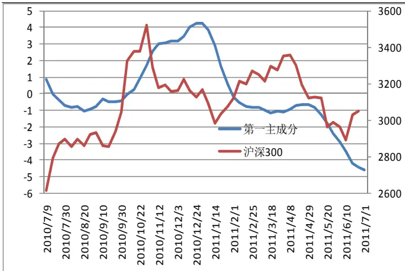
数据来源：国泰君安证券研究

图 38 第四主成分与沪深 300走势
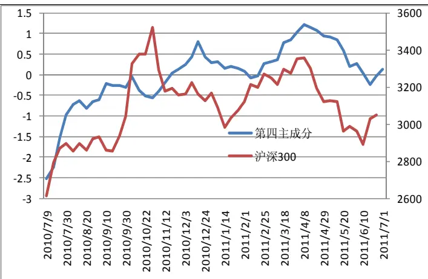
数据来源：国泰君安证券研究

导致上述现象出现的原因我们认为有两个：一方面，创新市场存续时间过短，数据太少，这将导致结果的稳定性大打折扣；另一方面，对于期指市场指标，需综合分析判断，仅通过时间序列的方式构构建综合指数，效果有限。

基于以上原因，未来短期内，我们主要以传统市场的指标进行主成分分析构建情绪指数，随着时间的推移，创新市场的数据将逐渐增加，我们也将更加深入地探索创新市场的有效指标。

## 4. 市场情绪指数的更新

由于GMX指数及GMVX指数是利用历史数据进行主成分分析分别得到的第一主成分及第三主成分，因此随着时间的推移，数据会有所变化，从而导致每次计算得到的GMX指数及GMVX指数在同一时点会有所不同。为了保持 GMX指数及 GMVX指数的可比性，剔除样本变动对估计参数的影响，我们每次更新做如下处理：

1.以历史 N 个样本点为依据，计算 GMX 指数，记为 $m_{1},m_{2},\cdots,~m_{t}$

2.向后滚动一周，加入新的一周数据，并剔除最早一周数据，计算新的GMX指数，记为 $m_{2}^{\prime},m_{3}^{\prime}\cdots,~m_{t+1}^{\prime}$

3.将t+1时刻的 GMX指数定义为 $m_{t+1}=m_{t}+m_{t+1}^{\prime}-m_{t}^{\prime}$

4.对于 GMVX指数，我们做上述类似处理。

如此以来，我们可以在保持原有情绪指数的基础上，在一定程度上剔除了数据变动更新对参数估计造成的影响。

## 5. 情绪指数的应用

## 5.1.利用 GMX指数判断市场顶部与底部区域

由图 35 我们可以看到，该指数大体上在与上证综指的走势一致，可见该指数在量能上与指数保持一致。从大盘周期来看，该情绪指数在大盘下跌时领先大盘反应，可以作为先行指标，在大盘上涨时，该指数滞后大盘反应，可以作为确认指标。

从 GMX 指数的数值来看，目前大盘处于底部区域，因此我们认为，从长期来看，大盘处于底部，未来指数下跌空间有限，投资安全性较高。

## 5.2.利用 GMX指数阀值提示短期机会与风险

图 37 GMX 指数及其阀值
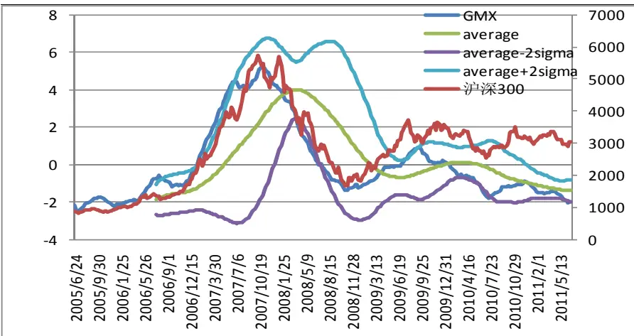

利用 GMX 指数的均值回复特性，我们可以提示短期的风险与机会：当GMX 指数首次上穿阈值上界时，提示风险，未来大盘下行概率较高；当 GMX 指数首次下穿阈值下界时，提示机会，未来上涨概率较大。而在中间区域穿越不同界线时，相应的市场短期上行或下行的概率增加。

## 5.3.利用 GMVX指数判断短期涨跌幅

由图 36 可以看出，GMVX 指数与沪深 300 的收益率具有较强的正相关性，我们统计发现，自 2005 年至今，GMVX 指数与沪深 300 当周收益率的相关系数为 26.75%，与下周收益率的相关系数为 24.64%。利用GMVX 指数可以判断沪深 300下周的走势即若情绪指数大于 0，则判断下周上涨，反之则判断为下跌。该指数判断的准确率为64.45%，在GMVX大于 0的情况下，准确率会提高到 75%。

表 6 GMVX 指数在不同区域对沪深 300指数涨跌幅的预示情况

| 区域 | 样本数 | 触发率 | 判断正确次数 | 准确率 |
| --- | --- | --- | --- | --- |
| 全样本 | 301 | 100.00% | 198 | 65.78% |
| >=0 | 136 | 45.18% | 103 | 75.74% |
| <0 | 165 | 54.82% | 95 | 57.58% |
| >=1.7 | 7 | 2.33% | 2 | 28.57% |
| >=0.75 且<1.7 | 51 | 16.94% | 41 | 80.39% |
| >=0且<0.75 | 78 | 25.91% | 60 | 76.92% |
| >=-1 且<0 | 153 | 50.83% | 86 | 56.21% |
| <-1 | 12 | 3.99% | 9 | 75% |

数据来源：国泰君安证券研究

## 5.4.市场情绪指数对大盘未来走势的判断

综合以上分析我们可以发现，从目前情况来看，GMX 指数处于历史底部区域，结合 GMX 指数与沪深 300 的关系，我们认为从中长期来看，大盘正处于筑底的过程；从中短期来看，GMX 指数已跌破阈值下界，市场情绪有均值回复的需求；从短期来看，本周 GMVX 指数为-0.57，较上周略有下降，由此我们判断下周市场处于平衡位置，下跌概率略高一点。

后续，我们的情绪指数每周会持续更新在《金融工程与衍生品周报》（word和 excel）中，敬请关注。

## 作者简介：

刘富兵：

执业资格证书编号：S0880511010017

电话：021-38676673

邮箱：liufubing008481@gtjas.com

上海交通大学金融工程博士/上海财经大学概率统计硕士，2008年加入国金证券研究所，从事衍生品与金融工程研究，2010年至今在国泰君安金融工程组从事股指期货等衍生品及量化方面的研究。

## 蒋瑛琨：

执业资格证书编号：S0880511010023

电话：021-38676710

邮箱：jiangyingkun@gtjas.com

吉林大学数量经济学博士，CPA，国泰君安证券首席金融工程研究员。05年加入国泰君安证券，曾在研究所、衍生产品部、销售交易部工作，多次获中金所、深交所、中国证券业协会、中国金融学会等奖励。06年新财富“衍生品”第二名，07-08年入围新财富，2010年水晶球奖“衍生品”第四名。

## 本公司具有中国证监会核准的的证券投资咨询业务资格

## 分析师声明

作者具有中国证券业协会授予的证券投资咨询执业资格或相当的专业胜任能力，保证报告所采用的数据均来自合规渠道，分析逻辑基于作者的职业理解，本报告清晰准确地反映了作者的研究观点，力求独立、客观和公正，结论不受任何第三方的授意或影响，特此声明。

## 免责声明

本报告仅供国泰君安证券股份有限公司（以下简称“本公司”）的客户使用。本公司不会因接收人收到本报告而视其为本公司的当然客户。本报告仅在相关法律许可的情况下发放，并仅为提供信息而发放，概不构成任何广告。

本报告的信息来源于已公开的资料，本公司对该等信息的准确性、完整性或可靠性不作任何保证。本报告所载的资料、意见及推测仅反映本公司于发布本报告当日的判断，本报告所指的证券或投资标的的价格、价值及投资收入可升可跌。过往表现不应作为日后的表现依据。在不同时期，本公司可发出与本报告所载资料、意见及推测不一致的报告。本公司不保证本报告所含信息保持在最新状态。同时，本公司对本报告所含信息可在不发出通知的情形下做出修改，投资者应当自行关注相应的更新或修改。

本报告中所指的投资及服务可能不适合个别客户，不构成客户私人咨询建议。在任何情况下，本报告中的信息或所表述的意见均不构成对任何人的投资建议。在任何情况下，本公司、本公司员工或者关联机构不承诺投资者一定获利，不与投资者分享投资收益，也不对任何人因使用本报告中的任何内容所引致的任何损失负任何责任。投资者务必注意，其据此做出的任何投资决策与本公司、本公司员工或者关联机构无关。

本公司利用信息隔离墙控制内部一个或多个领域、部门或关联机构之间的信息流动。因此，投资者应注意，在法律许可的情况下，本公司及其所属关联机构可能会持有报告中提到的公司所发行的证券或期权并进行证券或期权交易，也可能为这些公司提供或者争取提供投资银行、财务顾问或者金融产品等相关服务。在法律许可的情况下，本公司的员工可能担任本报告所提到的公司的董事。

市场有风险，投资需谨慎。投资者不应将本报告为作出投资决策的惟一参考因素，亦不应认为本报告可以取代自己的判断。在决定投资前，如有需要，投资者务必向专业人士咨询并谨慎决策。

本报告版权仅为本公司所有，未经书面许可，任何机构和个人不得以任何形式翻版、复制、发表或引用。如征得本公司同意进行引用、刊发的，需在允许的范围内使用，并注明出处为“国泰君安证券研究”，且不得对本报告进行任何有悖原意的引用、删节和修改。

若本公司以外的其他机构（以下简称“该机构”）发送本报告，则由该机构独自为此发送行为负责。通过此途径获得本报告的投资者应自行联系该机构以要求获悉更详细信息或进而交易本报告中提及的证券。本报告不构成本公司向该机构之客户提供的投资建议，本公司、本公司员工或者关联机构亦不为该机构之客户因使用本报告或报告所载内容引起的任何损失承担任何责任。

## 评级说明

## 1.投资建议的比较标准

投资评级分为股票评级和行业评级。

以报告发布后的12个月内的市场表现为比较标准，报告发布日后的12个月内的公司股价（或行业指数）的涨跌幅相对同期的沪深300指数涨跌幅为基准。

## 2.投资建议的评级标准

报告发布日后的 12 个月内的公司股价（或行业指数）的涨跌幅相对同期的沪深300指数的涨跌幅。

|  | 评级 说明 |  |
| --- | --- | --- |
| 股票投资评级 | 增持 | 相对沪深 300指数涨幅 15%以上 |
|  | 谨慎增持 | 相对沪深300指数涨幅介于5%～15%之间 |
|  | 中性 | 相对沪深 300指数涨幅介于-5%～5% |
|  | 减持 | 相对沪深300指数下跌 5%以上 |
| 行业投资评级 | 增持 | 明显强于沪深300指数 |
|  | 中性 | 基本与沪深 300指数持平 |
|  | 减持 | 明显弱于沪深 300 指数 |

## 国泰君安证券研究

|  | 上海 | 深圳 | 北京 |
| --- | --- | --- | --- |
| 地址 | 上海市浦东新区银城中路168号上海 银行大厦29层 | 深圳市福田区益田路 6009 号新世界 商务中心34层 | 北京市西城区金融大街28 号盈泰中 心2号楼10层 |
| 邮编 | 200120 | 518026 | 100140 |
| 电话 | （021)38676666 | (0755)23976888 | (010)59312799 |
|  | E-mail: gtjaresearch@gtjas.com |  |  |