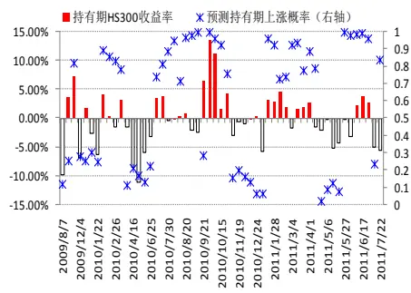
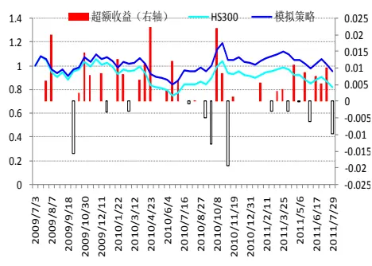
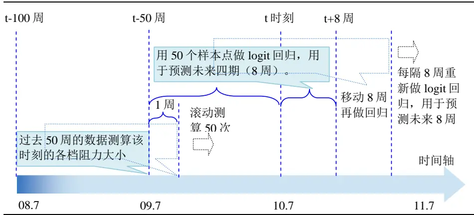
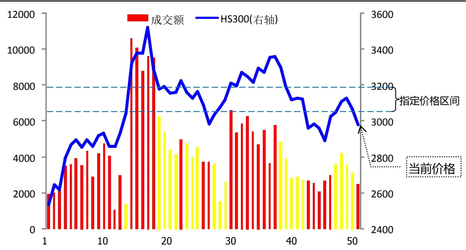
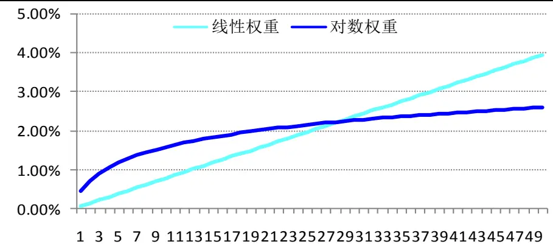
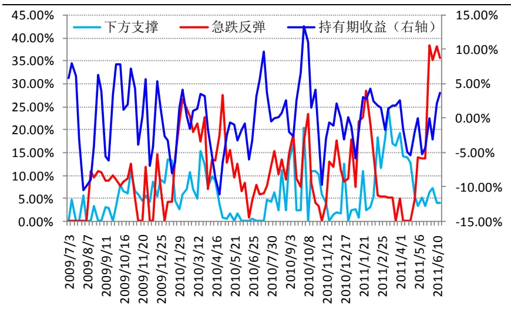
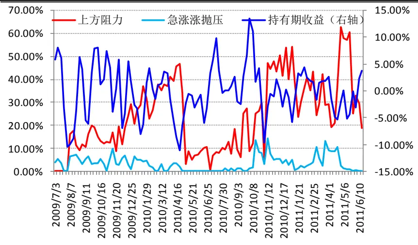
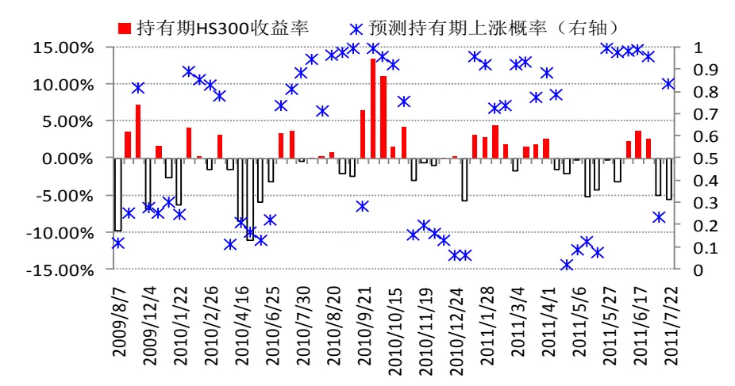
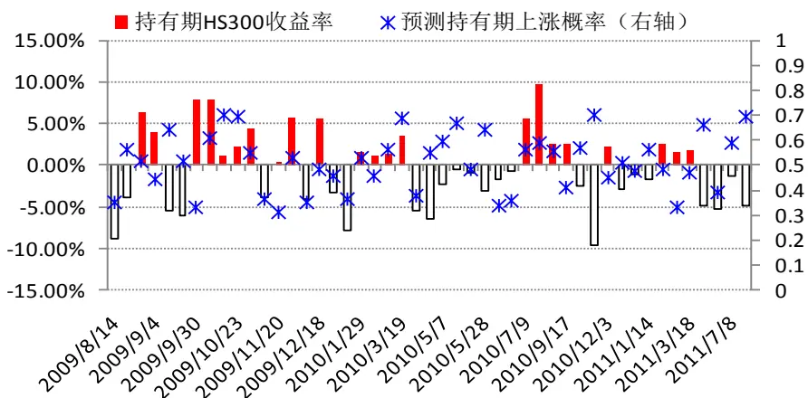
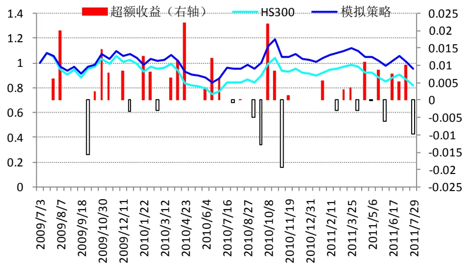

# 基于动量和阻力测算的短线择时模型

# ——数量化系列研究之十四

蒋瑛琨

8 021-38676710

jiangyingkun@gtjas.com

编号S0880511010023

## 本报告导读：

本报告结合动量和阻力测算建立了 logit 回归模型，对 HS300 指数的短期走势进行判断，取（0.7,0.3）为判断临界值时，样本外检验的准确率为 69.57%。

## 摘要：

[Table_Summary 本报告通过测算当前价格位置的上方（或下方）指定价格区间内持仓占比]来度量股价运行的阻力（或支撑力），结合股价的动量，运用 logit 回归模型对股价短期走势（2周）进行判断。

## 本文的创新之处：

（1）结合动量和阻力判断市场短期走势。动量反映市场趋势的强弱，而阻力能反映维持原有趋势的难度，两者结合应用在理论上和直观上都很合理。股票市场的动量效应已被广泛地研究和应用，而阻力具有削弱趋势甚至改变趋势的作用，因此在分析股价趋势的规律时不容忽视阻力的作用。

（2）通过测算特定价格区间的持仓占比来度量阻力大小。与大多数技术指标直接采用各种均线作为压力位或支撑位不同，我们通过测算过去一年在当前价位上方（或下方）一定价格区间内的持仓占比，来度量上方压力（或下方支撑力）的大小。其具有两大优势：第一，能反映不同位置的阻力情况，即我们可以指定多个价格区间计算多档阻力。第二，能定量刻画阻力大小，传统的均线只能反映阻力位置，不能定量刻画阻力大小。

（3）对成交额按时距加权取平均来测算持仓占比。历史的成交额能反映投资者持仓成本的大致分布。由于每天会有换手，离当前日期越远的成交额越有可能已经换手了，其反映当前持仓成本分布的权重应该越小，所以我们对不同日期的成交额按时距加权，即离现在越远的日期权重越小。

（4）采用滚动预测、样本外检验评估模型效果。即在 t 时刻，只采用 t时刻之前的历史数据训练模型，用 t时刻之后的实际数据检验模型的预测效果。并且每隔一段时间重新训练模型，用于预测之后的市场。

## 主要结果分析：

（1）模型准确率：取（0.6,0.4）为判断的临界值（即当模型预测上涨概率大于 0.6（上涨）或小于0.4（下跌）时，模型做出上涨或下跌的判断）时，样本内检测的准确率为 73.68%，样本外的准确率为 66.67%。取（0.7,0.3）为判断临界值时，样本外检验的准确率提高到 69.57%

## 模型预测效果：

## 模拟策略收益表现：

## [Table_R相关报告

《市场情绪指数的建立及应用——数量化研究系列之十三》

2011.07.11

《基于沪深 300 成分股的动量反转选股策略——数量化系列研究之十二》

2011.05.31

《基于超额收益率与交易量的行业动量反转共振模型——数量化系列研究之十一》2011.05.26

《基于动量反转策略的强势行业选取——数量化系列研究之十》

2010.12.02

《基于支持向量机的股票市场择时——数量化系列研究之九》

2010.07.21

## 1. 本报告的创新之处

## 1.1.结合动量和阻力判断市场短期走势

动量反映了市场趋势的强弱，而阻力能反映维持原有趋势的难度，两者结合应用在理论上和直观上都比较合理。股票市场的动量效应已被广泛地研究和应用，分析股价趋势的大小、趋势的形成以及持续时间长度等规律对指导投资实践有直接的作用。而阻力具有削弱趋势甚至改变趋势的作用，因此在分析股价趋势的规律时不容忽视阻力的作用。

## 1.2.通过测算特定价格区间的持仓占比来度量阻力大小

与大多数技术指标直接采用各种均线作为压力位或支撑位不同，我们通过测算过去一年在当前价位上方（或下方）一定价格区间内的持仓占比，来度量上方压力（或下方支撑力）的大小。

历史股价的均线之所以有提示压力位或支撑位的作用，是因为均线反映了过去一段时间投资者的平均持仓成本，也可认为是反映了过去一段时间投资者对股价的平均预期，如果最近没有重要的新增信息（利好或利空），投资者的预期没有发生大的变化，那么股价运行到均线附近时就到了多空相对平衡的位置，也就会受到较大的阻力而减弱原有的趋势。但是，历史股价的均线只能反映过去的平均持仓成本，刻画阻力的大致位置，并不能定量地衡量阻力的大小，因此我们想到用特定价格区间的持仓占比来度量阻力大小。

用特定价格区间的持仓占比来反映阻力有以下两大优势：第一，能反映不同位置的阻力情况。均线反映平均持仓成本，只能反映一个阻力位置，而我们可以通过计算几个特定价格区间的持仓占比来刻画几个位置的阻力大小。第二，能定量刻画阻力大小。某特定价格区间的持仓占比越大，也就说过去一段时间持仓成本集中在该价格区间的比例越大，这说明有越多的投资者对股价的预期在该价格区间内，股价运行至该价格位置时的阻力也就越大，因此这一持仓占比能定量刻画阻力的大小。

## 1.3.对成交额按时距加权取平均来测算持仓占比

成交额反映了以当天价格持仓的市值规模，因此历史的成交额能反映过去一段时间投资者持仓成本的大致分布。由于每天会有换手，离当前日期越远的成交额越有可能已经换手了，其反映当前持仓成本分布的权重应该越小，所以我们对不同日期的成交额按时距加权，即离现在越远日期的成交额权重越小。

## 1.4.采用滚动预测、样本外检验评估模型效果

在构建模型时，我们全部采用样本外的数据来检验模型效果，即在 t 时刻，只采用 t 时刻之前的历史数据训练模型，得到模型所有参数的拟合值，用于预测 t 时刻之后的市场，用 t 时刻之后的实际数据检验模型的预测效果。并且每隔一段时间重新训练模型，更新模型参数值，用于预测之后的市场。样本外的回测检验更接近实际投资，回测结果更具参考意义。

## 2. 研究思路

## 2.1. 模型框架

我们以 HS300 指数作为市场基准指数，用过去 50 周（1 年）的价格和成交额信息测算几档阻力的大小（几个指定价格区间的持仓占比），用50个样本数据做logit回归模型，用于预测未来四期（8周，2 周为一个持有期）的涨跌幅，每隔8周重新训练logit回归模型，用于下四期的预测，如此滚动。

由于在大的牛市或熊市中，市场呈单边趋势，所有的阻力线或阻力指标都会失效，所以我们只采用 2008年7 月份之后的数据进行分析。

图1 模型构建的框架图

数据来源：国泰君安证券研究

## 2.2. 模型构建的流程

基于动量和阻力测算的短线择时模型的构建流程：

Step1：构建测算指定价格区间的持仓占比的方法，以当前价格上方或下方一定价格区间内的持仓占比来度量阻力或支撑力的大小。

Step2：通过历史数据测算，确定当前价格上方和下方哪些价位区间的持

仓占比对下期收益有较明显的影响，即确定几档阻力。

Step3：确定当前的价格趋势，即动量的方向和大小。

Step4：以动量和 step2 中确定的几档阻力为自变量，下期收益为因变量建立logit回归模型。

Step5：应用建立的logit模型预测持有期收益率，并检验模型效果。

## 2.2.1. 测算指定价格区间的持仓占比

## 2.2.1.1. 测算指定价格区间持仓占比的方法

图 2 测算指定价格区间持仓占比的示意图

数据来源：国泰君安证券研究

对过去 50 周中 HS300 指数价格落在指定价格区间的成交额（图 2 中黄色柱状部分）按时距权重求和，除以前 50 周所有成交额按时距加权的总和，即

指定价格区间持仓占比

$$
=\left(\sum_{价格落在指定区间}成交额*时距权重\right)\left/\left(\sum_{过去\;50\;周}成交额*时距权重\right)\right.
$$

## 2.2.1.2. 采用对数时距权重

为了使时距权重更平缓，我们对时距取对数，再计算时距权重。即当前日期的前第k周的权重为

$$
前第\;k\;周的时距权重=\log\left(50-k\right)\bigg/\sum_{i=1}^{50}log\left(i\right)
$$

图3 对数时距权重比线性时距权重更平缓

数据来源：国泰君安证券研究

## 2.2.2. 确定了四档阻力

为了确定哪些价格区间的持仓占比对下期收益率有较明显的影响，我们对当前价位下方 30%至上方 30%之间，以 1%为区间宽度，测算了各价位区间与下期收益的相关性，最后确定了 4 个区间的持仓占比对下期收益有较明显的影响。我们将这 4 个区间的持仓占比定义为 4 档阻力（或支撑力）。

表 1 对持有期收益影响较大的四档阻力

| 区间 | 各档阻力名称 相关系数 |  | 可能解释 |
| --- | --- | --- | --- |
| (2%,5%) | 上方阻力 | -0.1656 | 靠近当前价格的上方持仓占比高，继续上涨的阻力大 |
| (-4% , -1% ) | 下方支撑 | 0.0765 | 靠近当前价格的下方持仓占比高，说明下方支撑较强 |
| (7%, 11%) | 急跌反弹 | 0.1491 | 上方较远区间持仓占比高，说明近期可能急跌了，有反弹需求 |
| (-15%,-12%) 急涨抛压 |  | -0.1764 | 下方较远区间持仓占比高，说明近期可能急涨了，有获利回吐 |
|  |  |  | 的抛压 |

数据来源：国泰君安证券研究
说明：区间中“-”表示当前价格的下方，相关系数是指相应区间的持仓占比与下一持有期（2 周）收益率的相关系数。采用 08 年7 月份至 11年 7 月份期间（震荡市）HS300 指数的数据测算的。

图4 下方支撑与急跌反弹两档阻力与持有期收益率有一定的正相关性

数据来源：国泰君安证券研究

图5 上方阻力与急涨抛压两档阻力与持有期收益率有一定的负相关性

数据来源：国泰君安证券研究

## 2.2.3. 计算动量因子

我们取前两周的价格变化趋势作为当前的动量。即取前两周的收益率作为动量因子。

在我们之前的报告《基于动量反转策略的强势行业选取_20101202》和《基于超额收益率与交易量的行业动量反转共振模型_20110525》中，我们分别提出了最佳形成期下动量和基于超额收益率与交易量的动量因子的构造方法，并通过实证表明这两种动量因子能有效改进模型效果。但在本报告中，我们主要目的是分析各档阻力对股价趋势的影响，动量只要能反映当前股价趋势即可，因此，我们没有采用更复杂的动量因子的构建方法，而是直接采用过去两周的收益率作为当前的动量。

## 2.2.4. 构建 logit 回归模型并预测

## 2.2.4.1. logit 回归模型的建立

以动量因子，以及 2.2.2 中确定的 4 档阻力（或支撑）共 5 个变量作为自变量，下一持有期收益率的方向（正为 1，负为 0）为因变量，建立 logit 回归模型。

第一次回归模型采用的数据为 09 年 7 月至 10 年 7 月（由于测算持仓占比需要用到前 50 周的数据，因此实际用到的数据为 08 年 7 月开始的），共50个样本点。自第一次做回归模型后（即2010年 7 月）每隔8周重新用前50周的数据做回归，用于未来8 周的预测。

由于是每隔8 周滚动做一次 logit回归，因此回归模型的系数是滚动变化的，为了反映 logit 回归模型中 5 个自变量的系数估计值及其显著度，我们用全程的数据（即 09 年 7 月至 11 年 7 月）做了一次 logit 回归，得到各系数如表 2。

表 2 logit 回归模型的系数估计值

| Logit 回归 |  |  |
| --- | --- | --- |
| 变量 | 系数估计值 | P-value |
| 动量 | 6.2915 | 0.1891 |
| 上方阻力 | -1.2475 | 0.3952 |
| 下方支撑 | 3.0784 | 0.4591 |
| 急跌反弾 | 4.8274 | 0.1073 |
| 急涨抛压 | -4.2688 | 0.5737 |

数据来源：国泰君安证券研究

从系数的 P-value 来看，用全程数据训练模型得到的系数显著性不是很理想，我们认为在不同的时期各变量的有效性会不同，因此有必要每隔一段时间重新训练logit模型，得到最新的系数估计值。

## 2.2.4.2. 滚动预测并统计准确率

我们 09 年 7 月 4 日至 10 年 7 月 2 日共 50 周的数据做第一次 logit 回归，用于预测接下来的8周，然后每隔 8周重新训练logit模型，再预测接下来的 8 周，如此滚动。所以，09 年 7 月至 10 年 7 月间我们只能采用样本内的检测来评估模型效果，而自 10 年 7 月 9 日，我们采用的是样本外的检验。检验的结果见表 3。

## 2.3.基于模型预测结果构建指数增强型模拟策略

仓位调整规则（指数增强型策略）：

- 持有的组合始终为HS300指数，根据模型结果调整仓位。

- 当模型预测下一持有期上涨概率大于0.6时，仓位调整至 120%（假设可以用股指期货做杠杆）。

- 当模型预测下以持有期上涨概率小于 0.4 时，仓位调整至 80%（也可用股指期货对冲掉 20%）。

- 若预测下期上涨的概率在0.4-0.6之间，则不对市场做判断，仓位为 100%。

换仓频率：每 2周（模型持有期为 2 周）根据最新的预测结果调整仓位。

初始资金量：1。

模拟时间段：模拟策略的的起始时间为 2009 年 7 月 3 日，截止时间是2011 年 8 月 10 日。

## 3. 主要结果和分析

## 3.1.模型预测准确率

取（0.6,0.4）为判断的临界值，即当模型预测上涨概率大于 0.6（上涨）

或小于 0.4（下跌）时，模型做出上涨或下跌的判断，而介于 0.6 与 0.4之间时，模型不作判断。这样，样本内的准确率达到73.68%，样本外的准确率为66.67%。取（0.7,0.3）为判断临界值时，样本外检验的准确率提高到 69.57%。

表 3 模型预测的准确率

|  | 样本内 | 样本外 |  |
| --- | --- | --- | --- |
| 判断临界值 | 0.6, 0.4 | 0.6, 0.4 | 0.7,0.3 |
| 总周数 | 50 | 56 | 56 |
| 判断次数 | 38 | 51 | 46 |
| 准确次数 | 28 | 34 | 32 |
| 准确率 | 73.68% | 66.67% | 69.57% |

数据来源：国泰君安证券研究

说明：样本内是指 09 年7 月4日至 10年 7月 2 日期间的预测情况，10 年7 月9 日至 11 年 8 月 10 日是样本外检验的结果。判断临界值为（0.6,0.4）时是表示当 logit模型预测下一持有期（2 周）涨的概率大于 0.6 时我们判断下期涨，当预测涨的概率小于 0.4 时我们判断下期跌。每周滚动预测。

图6 模型预测持有期上涨概率与持有期实际收益率

数据来源：国泰君安证券研究

说明：判断的临界值为 0.7 和 0.3，其中 2010 年 7 月 2 日之后的为样本外的预测，之前的为样本内预测。

图7 预测值在临界值（0.3,0.7）之间时的情况说明：判断的临界值为 0.7 和 0.3，其中 2010 年 7 月 2 日之后的为样本外的预测，之前的为样本内预测。

数据来源：国泰君安证券研究

## 3.2.模拟策略的表现

作为指数增强型的模拟策略，我们不仅考察其累计收益的大小，更关心其表现的稳健性。在模拟期间（2 年），我们的模拟策略获得了 12.89%的累计超额收益，并表现出了较好的稳健性。在总共 54 期（每期为 2周）的模拟期间，只有 11 期跑输指数，最大连续跑输指数的幅度仅为1.81%。

表4 模拟策略的收益和稳健性

| 2年累计超越指数 模拟总期数 跑输指数期数 最大连续跑输指数幅度 |  |  |  |
| --- | --- | --- | --- |
| 指数增强策略 12.89% | 54 | 11 | 1.81% |

数据来源：国泰君安证券研究

图8 模拟策略的收益表现

数据来源：国泰君安证券研究

## 3.3.对当前市场的判断

## 3.3.1. 综合判断

截止目前数据（2011 年 8 月 19 日），Logit 回归模型预测下两周 HS300指数上涨的概率为0.2177，因此我们判断下两周市场下跌的概率较大。

## 3.3.2. 分析影响当前判断的各因子

从表 5 可以看出，HS300 指数当前向下的动量较大，而下方支撑小，上方阻力较大，因此预测指数上涨的概率仅为0.2177，可见下两周市场下跌的概率较大。

表5 影响当前判断的各因子分析

|  | 动量 | 上方阻力 | 下方支撑 | 急跌反弹 | 急涨抛压 |
| --- | --- | --- | --- | --- | --- |
| 变量值 | -0.0498 | 0.0788 | 0 | 0.2299 | 0 |
| 变量值*系数 | -0.70878 | -0.39482 | 0 | 0.004762 | 0 |
| 对预测结果影响大小 | 大 | 较大 | 小 | 小 | 小 |

数据来源：国泰君安证券研究

## 作者简介：

蒋瑛琨：

执业资格证书编号：S0880511010023

电话：021-38676710

邮箱：jiangyingkun@gtjas.com

吉林大学数量经济学博士，CPA，国泰君安证券首席金融工程研究员。05 年加入国泰君安证券，曾在研究所、衍生产品部、销售交易部工作，多次获中金所、深交所、中国证券业协会、中国金融学会等奖励。06 年新财富“衍生品”第二名，07-08 年入围新财富，2010 年水晶球奖“衍生品”第四名。

唐军（贡献作者）：

执业资格证书编号：S0880110090001

电话：021-38674763

邮箱：tangjun008739@gtjas.com

中山大学经济学硕士和理学学士，2010年 7月加入国泰君安证券，现为金融工程助理研究员，主要从事数量化投资策略研究。

感谢实习生余浩为本报告做出的贡献。

## 本公司具有中国证监会核准的的证券投资咨询业务资格

## 分析师声明

作者具有中国证券业协会授予的证券投资咨询执业资格或相当的专业胜任能力，保证报告所采用的数据均来自合规渠道，分析逻辑基于作者的职业理解，本报告清晰准确地反映了作者的研究观点，力求独立、客观和公正，结论不受任何第三方的授意或影响，特此声明。

## 免责声明

本报告仅供国泰君安证券股份有限公司（以下简称“本公司”）的客户使用。本公司不会因接收人收到本报告而视其为本公司的当然客户。本报告仅在相关法律许可的情况下发放，并仅为提供信息而发放，概不构成任何广告。

本报告的信息来源于已公开的资料，本公司对该等信息的准确性、完整性或可靠性不作任何保证。本报告所载的资料、意见及推测仅反映本公司于发布本报告当日的判断，本报告所指的证券或投资标的的价格、价值及投资收入可升可跌。过往表现不应作为日后的表现依据。在不同时期，本公司可发出与本报告所载资料、意见及推测不一致的报告。本公司不保证本报告所含信息保持在最新状态。同时，本公司对本报告所含信息可在不发出通知的情形下做出修改，投资者应当自行关注相应的更新或修改。

本报告中所指的投资及服务可能不适合个别客户，不构成客户私人咨询建议。在任何情况下，本报告中的信息或所表述的意见均不构成对任何人的投资建议。在任何情况下，本公司、本公司员工或者关联机构不承诺投资者一定获利，不与投资者分享投资收益，也不对任何人因使用本报告中的任何内容所引致的任何损失负任何责任。投资者务必注意，其据此做出的任何投资决策与本公司、本公司员工或者关联机构无关。

本公司利用信息隔离墙控制内部一个或多个领域、部门或关联机构之间的信息流动。因此，投资者应注意，在法律许可的情况下，本公司及其所属关联机构可能会持有报告中提到的公司所发行的证券或期权并进行证券或期权交易，也可能为这些公司提供或者争取提供投资银行、财务顾问或者金融产品等相关服务。在法律许可的情况下，本公司的员工可能担任本报告所提到的公司的董事。

市场有风险，投资需谨慎。投资者不应将本报告为作出投资决策的惟一参考因素，亦不应认为本报告可以取代自己的判断。在决定投资前，如有需要，投资者务必向专业人士咨询并谨慎决策。

本报告版权仅为本公司所有，未经书面许可，任何机构和个人不得以任何形式翻版、复制、发表或引用。如征得本公司同意进行引用、刊发的，需在允许的范围内使用，并注明出处为“国泰君安证券研究”，且不得对本报告进行任何有悖原意的引用、删节和修改。

若本公司以外的其他机构（以下简称“该机构”）发送本报告，则由该机构独自为此发送行为负责。通过此途径获得本报告的投资者应自行联系该机构以要求获悉更详细信息或进而交易本报告中提及的证券。本报告不构成本公司向该机构之客户提供的投资建议，本公司、本公司员工或者关联机构亦不为该机构之客户因使用本报告或报告所载内容引起的任何损失承担任何责任。

## 评级说明

## 1.投资建议的比较标准

投资评级分为股票评级和行业评级。

以报告发布后的12个月内的市场表现为比较标准，报告发布日后的 12个月内的公司股价（或行业指数）的涨跌幅相对同期的沪深 300 指数涨跌幅为基准。

## 2.投资建议的评级标准

报告发布日后的 12 个月内的公司股价（或行业指数）的涨跌幅相对同期的沪深 300 指数的涨跌幅。

|  | 评级 说明 |  |
| --- | --- | --- |
| 股票投资评级 | 增持 | 相对沪深300指数涨幅15%以上 |
|  | 谨慎增持 | 相对沪深300指数涨幅介于5%～15%之间 |
|  | 中性 | 相对沪深300指数涨幅介于-5%～5% |
|  | 减持 | 相对沪深 300指数下跌5%以上 |
| 行业投资评级 | 增持 | 明显强于沪深 300 指数 |
|  | 中性 | 基本与沪深 300指数持平 |
|  | 减持 | 明显弱于沪深 300指数 |

## 国泰君安证券研究

|  | 上海 | 深圳 | 北京 |
| --- | --- | --- | --- |
| 地址 | 上海市浦东新区银城中路168号上海 银行大厦29层 | 深圳市福田区益田路 6009 号新世界 商务中心34层 | 北京市西城区金融大街 28 号盈泰中 心2号楼10层 |
| 邮编 | 200120 | 518026 | 100140 |
| 电话 | (021)38676666 | (0755)23976888 | (010)59312799 |
|  | E-mail: gtjaresearch@gtjas.com |  |  |