金融工程

2011.09.14

# 基于全市场的 GARP 选股研究

## ——数量化研究系列之十

刘富兵

蒋瑛琨

五021-38676673

021-38676710

liufubing008481@gtjas.com

jiangyingkun@gtjas.com

编号S0880511010017

S0880511010023

本报告导读：构建了 GARP 选股模型，该模型在过去 6 年多的时间里获得了 300%以上的超额收益，且在震荡市中表现最为出色，利用最新的数据，我们给出了9月份的GARP、价值及成长组合。

## 摘要：

le_Summary] GARP 策略是同时考量价值与成长的一种混合型投资策略，试图寻找某种程度上被市场低估，同时又有持续稳定增长的潜力股。由于选股时兼顾价值和成长，风险相对适中，可以获得较高的风险调整后收益，该策略深受数量化基金的青睐。

我们主要选择PE、PB、PCF、PS 以及PEG作为价值指标，选取净利润增长率、销售净利率、ROE、主营收入增长率作为成长指标，并以此为依据采用指标打分并交叉选股的方法来构建GARP 模型。

- 通过对A股进行实证研究可以发现以下特点：

（1）GARP 选股策略在 A 股市场表现优异，在震荡市当中表现尤佳，信息比率可达 1.92，且好于价值、成长策略，这表明 GARP策略更适合于震荡市。

（2）从股票的行业分布来看，GARP 策略所选股票主要集中在材料、可选消费、工业、金融及能源上。选股数量平均在 35 只左右，调仓比例差异较大，平均在 40%左右。

请务必阅读正文之后的免责条款部分整体 言 价值策略表

## [Table 相关报告_

《我国基于融资/融券/期指的对冲与130/30 交易策略设计》

2011.09.09

《海外 130/30 指数及基金实践：选股、配置、杠杆》

2011.08.25

《波动率的波动性策略在国内市场的实证杠杆 ETF系列研究之二》

2011.08.23

《基于动量和阻力测算的短线择时模型》

2011.08.18

## 1. GARP 概述

价值策略和成长策略是投资者熟知的两种选股策略，两种策略的结合便是 GARP（Growth at a Reasonable Price）策略。与成长策略和价值策略更加注重基本面分析相比，GARP 策略更加侧重数量化分析。

GARP 策略由于选股时兼顾价值和成长，风险相对适中，可以获得较高的风险调整后收益，因此深受数量化基金的青睐。本文我们主要研究GARP 策略在我国A股市场上的应用。在此之前，我们首先简单的介绍下价值、成长以及 GARP 策略。

## 1.1. 价值投资策略

早在十九世纪二十年代，格雷厄姆(Benjamin Graham)就提出了价值投资的框架，其思想为寻找更好基本面的公司，且交易价格低于内在价值的公司。更好的基本面包括利润、分红、每股净资产和现金流等。该策略通过买入估值偏低的价值型股票并长期持有以期获得稳定的超额收益。价值投资的一个典型代表就是巴菲特(Warren Buffett)，他所拥有的伯克希尔从1981年到1998年连续18年战胜市场，年复合增长率略为22.2%。在量化形式上，价值投资主要是借助 PE、PB、PCF 等参数去挖掘具有更高安全边际、被市场低估的股票。

## 1.2. 成长投资策略

成长股是指销售额和利润额持续增长，而且其速度快于整个国家和本行业的增长的股票。成长股的营业收入与净利润增长率通常要连续战胜行业平均水平与市场平均水平。伴随着20 世纪90年代后期技术型公司的繁荣，成长策略一时成为某些投资者的钟爱，该策略选择成长性快于其他公司的公司进行投资。这种理论认为，收入或者利润的能够反映为股价的上升，因此成长投资策略喜欢投资于高速扩张的行业，收益主要来源于资本所得而非分红。

National Association of Investors Corporation (NAIC)是一个非常著名的使用和教授成长投资策略的公司，它们对外提供了一个选择成长型公司基本普遍使用框架。

价值投资者关注股票的过去和现在，他们寻找成交价格低于他们价值的股票；而成长投资者则关注公司的潜在的未来，而不在乎它现在的价格。投资者对成长股一般寄予了厚望，所以成长股的估值通常高于市场平均水平。在量化形式上， 成长投资主要是通过 ROE、ROA、NPG等参数去挖掘具有更高成长性的股票。

## 1.3. GARP 策略

GARP 投资策略是继价值投资和成长投资之后最为热门的投资策略之一，顾名思义该策略是指选择合理价格下的增长型股票。该策略的典型代表是投资大师彼得林奇（Peter Lynch），他利用该方法在 1977 至1990的十三年间创造了年平均收益率高达29%的传奇业绩，实现基金投资业绩同业排名第一。

## 1.3.1. GARP 策略特点

GARP 策略是同时考量价值因素与成长因素的一种混合型投资策略，试图寻找某种程度上被市场低估的股票，同时又有较强的持续稳定增长的潜力股。一方面利用股票的成长属性分享高成长收益机会；另一方面，利用价值型投资标准筛选低估值股票，有效控制市场波动时的风险。在股票市场价值与成长风格发生轮动时，GARP 可兼顾两种因素，有效平滑收益波动，市场轮动下的表现也更为稳定。

## 1.3.2. GARP 策略的比较优势

与价值及成长策略相比而言，GARP 策略具有如下比较优势：

1.较高的风险调整后收益：GARP 策略在有效规避价格高估的条件下分享公司高成长潜能释放引致的收益机会。

2.分散化投资：GARP 策略选取标的股票涉及多个行业、具有不同的市值规模和风格，突显了分散化投资的理念，避免了局部市场剧烈波动对投资收益的侵蚀。

3 数量化选股：数量化投资方法增强了 GARP 策略对信息的挖掘深度和使用效率，选股过程更为客观、理性、透明，较好地弥补了仅依赖基本面研究的传统投资方式的局限性。

4.实现价值与成长的平衡：两者的有机结合使得投资者在价值回归和业绩释放的驱动下获得超额收益。

## 1.4.GARP 与价值成长策略的关系

GARP 策略与价值投资和成长投资的关系在于，价值投资偏重于投资价值低估的公司，成长投资注重于投资成长性高的公司，而 GARP 则能够弥补纯粹价值投资和成长投资的不足，能尽量兼顾价值和成长（如图1 所示）。相对成长策略，GARP 策略关注公司股票的价值，力求投资于价格低于其内在价值的成长型公司股票，避免因过度追求高成长而需承担的额外风险；相对价值策略，GARP 策略侧重公司的成长性，通过挖掘具有较高增长潜力的公司股票获得高于市场平均水平的收益。

图 1 GARP 与价值成长策略的关系
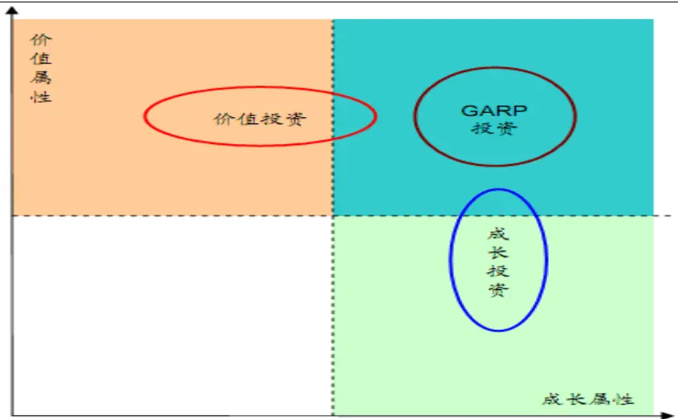
数据来源：国泰君安证券研究

## 2. GARP策略的选股流程

在量化形式上，GARP 策略一般首先对股票的价值属性和成长属性分别进行排序打分，然后选择同时位于价值排名和成长排名前列的股票构建组合。

## 2.1. GARP 策略指标选取

价值指标旨在寻找低估值的股票构建组合。这里我们主要选择市盈率、市净率、PCF（市现率）、PS（市销率）以及 PEG 作为价值指标。

成长指标旨在寻找高增长的股票构建组合。这里我们主要选取净利润增长率（长期、短期）、销售净利率、ROE、主营业务收入增长率作为成长指标。

表 1 GARP 选股指标

| 分类 | 指标 | 定义 |
| --- | --- | --- |
| 价值指标 | PE | 最近一个交易日收盘价*最新总股本*/(归属母公司股东的净利润_TTM) |
|  | PB | (最近一个交易日的收盘价×最新总股本)/最近一期归属母公司股东的权益 |
|  | PCF | 最近一个交易日收盘价*最新总股本/每股经营性现金流_TTM。 |
|  | PS | (最新一个交易日收盘价×最新总股本)/营业总收入_TTM =PE/G值，规则如下：(1)利用上述公式计算PE；(2)G值为最近四个季度的 |
|  | PEG | 滚动净利润较前四个季度滚动净利润的增长率 |
| 成长指标 | ROE | 归属母公司股东的净利润_TTM/（期初归属母公司股东的权益+期末归属母公司 股东的权益）/2 |
|  | 净利润增长率（长期） | 最近四个季度归属母公司的滚动净利润/前四个季度归属母公司的滚动净利润 |
|  | 净利润增长率（短期） | 本期归属母公司净利润/1年前同期归属母公司净利润-1 |
|  | 主营业务收入增长率 | 最近四个季度主营业务收入/前四个季度主营业务收入-1 |
|  | 销售净利率 | 最近四个季度归属母公司净利润/最近四个季度的销售收入 |

数据来源：国泰君安证券研究

## 2.2. GARP 组合的构建过程

GARP 选股模型采用指标打分，并交叉选股的方法来筛选股票。具体步骤如下：

第一步：确定待选股票池。选择组合构建时点（每个月最后一个交易日收盘后）上市的全部A 股股票，考虑实际投资需求，剔除当日停牌的股票，剔除最近四个季度滚动净利润为负值的股票，剔除ROE<0的股票，剔除ST股票，以剩余股票作为待选股票池。

第二步：构建股票组合：

a）指标打分：首先将待选股票池中股票分别按照价值成长因子的各个指标进行排序（价值指标从小至大，成长指标从大至小），然后采用百分制整数打分法进行指标打分，即以股票在各个指标排名中所处位置的百分数作为股票对应该指标的得分，前 1%得分为 100，依次递减，最后1%得分为1。

b）求和排序：将股票相对于同一属性的各个指标的得分进行等权重求和，将总得分进行从小至大排序。

c）交叉选股：选择同时在价值排序和成长排序中位于前 20%的股票，等权重构建 GARP 组合。

第三步：组合调整。我们对组合进行逐月调整（调整时扣除千分之六的交易成本），即持有组合至次月最后一个交易日，重新确定待选股票池，利用更新指标数据重复第二步价值排序、成长排序和交叉选股过程，将原来 GARP 组合中不满足同时在价值排序和成长排序中位于前 20%的股票卖出，买入同时在价值排序和成长排序中位于前 20%的新股票，将新组合内样本股的权重调整至相等。

第四步：统计检验。分别计算各组合相对于沪深300超额收益的有效性，包括信息比率、胜率、最大回撤等指标。

为便于比较，我们通过选取价值排名前20%和成长排名前 20%的股票分别构造出了价值组合与成长组合。至于比较基准，我们主要选取了沪深300指数及300等权指数。

## 3. 基于全市场的GARP选股实证研究

我们选取的A 股市场数据为 2005年1 月-2010年 6月，所选取的股票进

行等权重配置，每月最后一个交易日对股票组合进行调整。

## 3.1. GARP 组合的整体表现

考虑双边千六的交易成本后，在长达 6 年多的回测过程中，GARP 组合取得 633.31%的累计收益，高于同期沪深 300 指数取得的 300.44%的累计收益,同时也高于沪深 300 等权指数的 361.76%的累计收益。在测试阶段，该策略战胜沪深300指数的胜率约为 53.16%，战胜 300等权指数的胜率为60.26%。此外，价值策略和成长策略也均跑赢基准指数。

图 2 GARP、价值、成长策略的历史表现
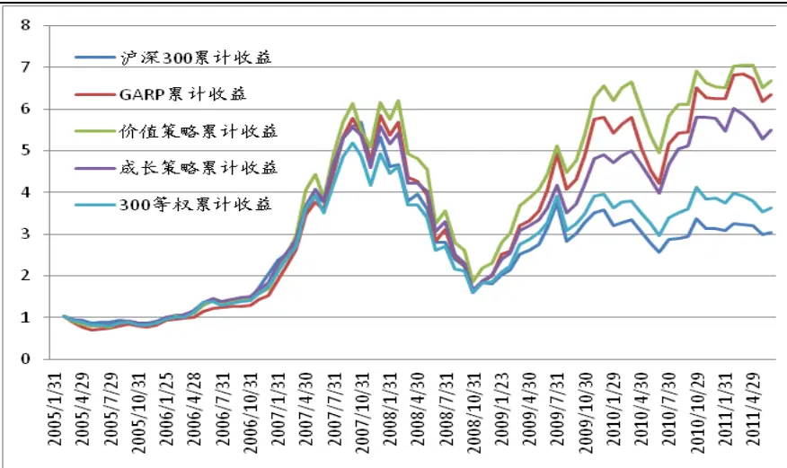
数据来源：国泰君安证券研究

由超额收益柱状图及统计结果可以看出，无论是从标准差、信息比率、胜率还是最大回撤，GARP 组合表现相对比较稳健。相比于沪深 300 指数作为基准，以 300 等权指数作为基准，GARP、价值、成长组合的稳健性更高，这主要与我们构造组合的配置方式有关。

图3GARP、价值、成长策略的超额收益图 4 给出了各期各策略组合的数量，GARP 由于是交叉选股，因此每期选股数量有一定的差异，最多可高达 60 多只，最少仅有 10 多只，但整体平均在 35 只左右。而价值、成长策略由于是综合排名，在剔除备选池的数量影响后，选股数量是稳定的，平均在100-150 只左右。

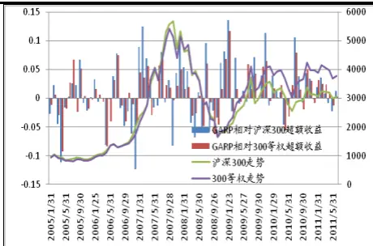

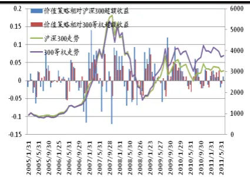
数据来源：国泰君安证券研究

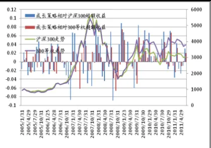

表2GARP、价值、成长策略的超额收益统计结果

| 基准 | 策略 | 均值 | 标准差 | 信息 比率 | 胜率 | 最大 回撤 | 最大连续 跑输次数 | 累积 超额收益 |
| --- | --- | --- | --- | --- | --- | --- | --- | --- |
| 沪深300 | GARP | 14.28% | 18.19% | 0.79 | 53.16% | -24.81% | 5 | 328.9% |
|  | 价值 | 14.16% | 18.33% | 0.77 | 56.41% | -23.68% | 5 | 362.57% |
|  | 成长 | 10.20% | 14.10% | 0.72 | 53.85% | -13.40% | 4 | 246% |
| 300 等权 | GARP | 10.80% | 13.48% | 0.81 | 60.26% | -12.65% | 3 | 271.54% |
|  | 价值 | 10.80% | 11.05% | 0.98 | 62.82% | -9.53% | 3 | 305.21% |
|  | 成长 | 6.72% | 9.42% | 0.72 | 53.85% | -13.94% | 4 | 188.65% |

数据来源：国泰君安证券研究

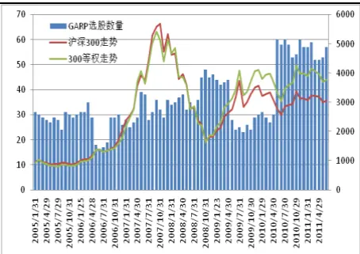

图4GARP、价值、成长策略选股数量
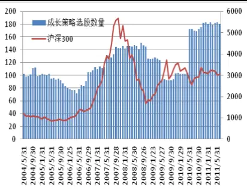
数据来源：国泰君安证券研究

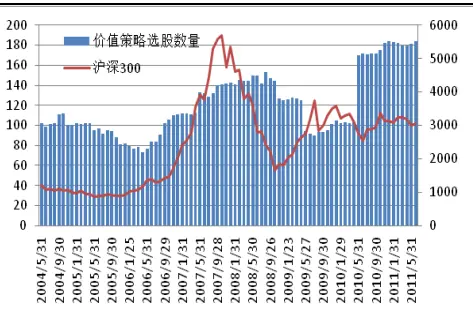

从股票的行业分布来看，GARP、价值、成长策略所选股票比较集中，主要分布在材料、可选消费、工业、金融及能源上。

图 5 GARP 组合行业分布
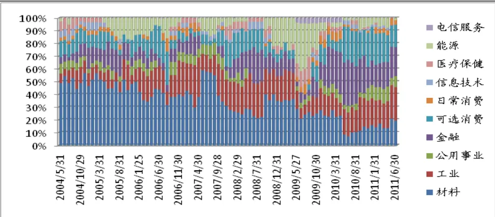
数据来源：国泰君安证券研究

图 6 价值策略行业分布
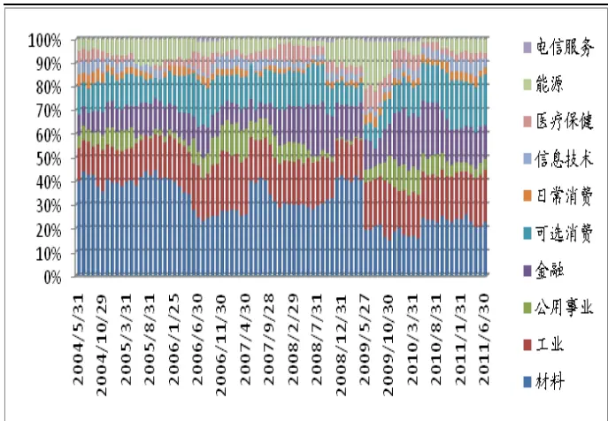
数据来源：国泰君安证券研究

图 7 成长策略行业分布
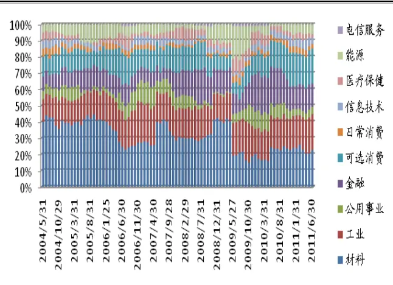
数据来源：国泰君安证券研究

从每期的调仓来看，调入调出的个数基本相当，从换仓比例来看，差异比较大，但整体在40%左右。此外，换仓较高的月份主要集中在 5、9、11月上，这主要与财报的公布时间有关。

图 8 GARP 组合调入调出数量

图 9 GARP 组合换仓比例

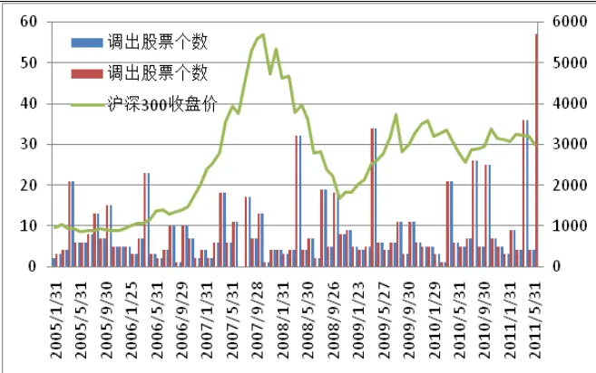
数据来源：国泰君安证券研究

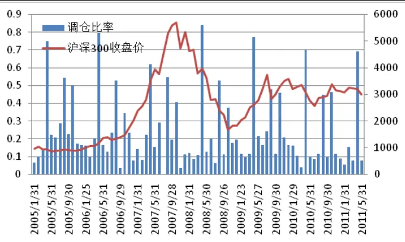
数据来源：国泰君安证券研究

图 10 价值组合调入调出数量
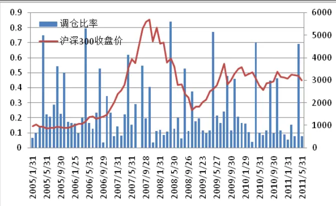
数据来源：国泰君安证券研究

图 11 价值组合换仓比例
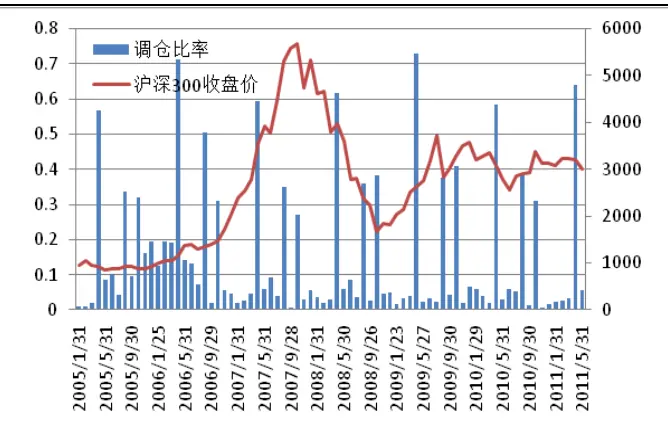
数据来源：国泰君安证券研究

图 12 成长组合调入调出数量
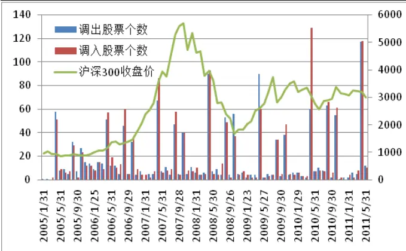
数据来源：国泰君安证券研究

图 13 成长组合换仓比例
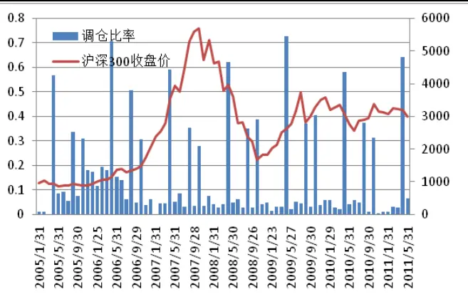
数据来源：国泰君安证券研究

## 3.2.不同市场环境下GARP、价值、成长组合的表现

从统计结果来看，无论是均值、标准差、信息比率还是胜率，GARP 策略均在震荡市中表现优异，这主要是由于在震荡市中只有“精耕细作”，才能有收益，而GARP 策略就属于“精耕细作”之类。在熊市中，GARP组合能跑赢基准指数，但胜率及信息比率相对较差，在牛市中，GARP表现稍差点，没跑赢沪深300，仅能跑赢300等权。

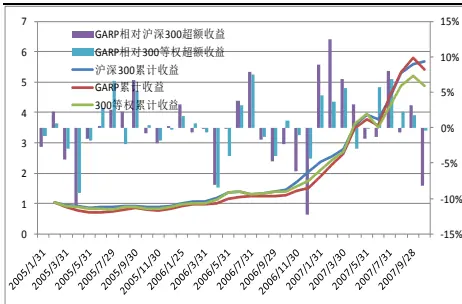

图14 不同市场环境下GARP策略走势
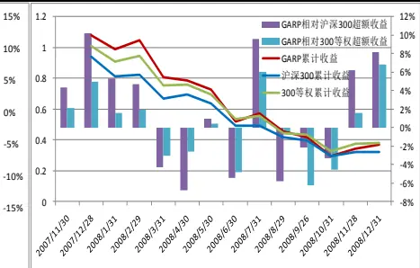
数据来源：国泰君安证券研究

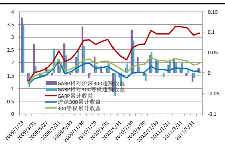

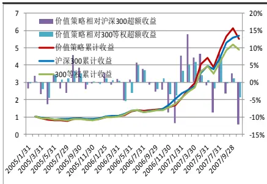

图15 不同市场环境下价值策略走势
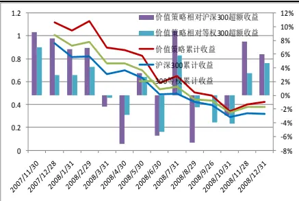
数据来源：国泰君安证券研究

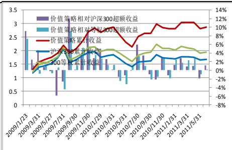

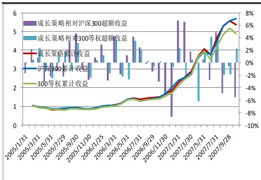

图 16 不同市场环境下成长策略走势
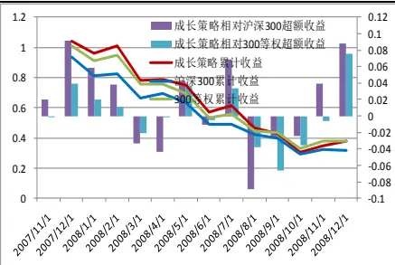
数据来源：国泰君安证券研究

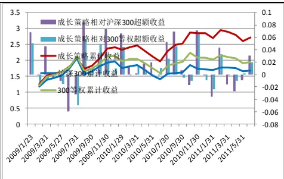

此外，由表3 可知，价值、成长策略均是震荡市表现最好，其次是熊市，在牛市中表现最差。

表3 GARP、价值、成长组合不同市场环境下超额收益统计结果

| 基准 | 策略 | 市场环境 | 均值 | 标准差 | 信息 比率 | 胜率 | 最大 回撤 | 最大连续 跑输次数 | 累积超 额收益 |
| --- | --- | --- | --- | --- | --- | --- | --- | --- | --- |
| 沪深300 |  | 牛市(2005/1-2007/10) | 0.36% | 19.43% | 0.02 | 44.12% | -24.81% | 5 | -26.82% |
|  | GARP | 熊市(2007/11-2008/12) | 18.72% | 21.13% | 0.88 | 57.14% | -10.94% | 3 | 4.99% |
|  |  | 震荡市(2009/1-2011/6) | 27.96% | 14.55% | 1.92 | 63.33% | -5.69% | 2 | 148.82% |
|  |  | 牛市(2005/1-2007/10) | 1.44% | 20.54% | 0.07 | 44.12% | -23.68% | 5 | -18.67% |
|  | 价值 | 熊市(2007/11-2008/12) | 32.16% | 21.62% | 1.49 | 64.29% | -7.95% | 2 | 10.15% |
|  |  | 震荡市(2009/1-2011/6) | 21.96% | 13.23% | 1.66 | 66.67% | -2.67% | 3 | 120.45% |
|  | 成长 | 牛市(2005/1-2007/10) | -1.44% | 12.47% | -0.11 | 47.06% | -17.43% | 4 | -31.35% |
|  |  | 熊市(2007/11-2008/12) | 18.96% | 18.88% | 1 | 64.29% | -8.54% | 2 | -0.11% |
|  |  | 震荡市(2009/1-2011/6) | 22.80% | 12.96% | 1.47 | 60.00% | -10.34% | 4 | 103.7% |
| 300 等权 | GARP | 牛市(2005/1-2007/10) | 4.56% | 13.99% | 0.32 | 50% | -12.65% | 3 | 53.53% |
|  |  | 熊市(2007/11-2008/12) | 3.00% | 14.24% | 0.21 | 57.14% | -11.1% | 3 | -0.93% |
|  |  | 震荡市(2009/1-2011/6) | 21.60% | 12.33% | 1.75 | 73.33% | -8.56% | 2 | 120.76% |
|  | 价值 | 牛市(2005/1-2007/10) | 5.64% | 10.57% | 0.53 | 58.8% | -8.32% | 2 | 61.68% |
|  |  | 熊市(2007/11-2008/12) | 12.96% | 14.03% | 0.92 | 57.14% | -9.53% | 3 | 4.23% |
|  |  | 震荡市(2009/1-2011/6) | 15.60% | 10.25% | 1.53 | 70% | -5.54% | 2 | 92.39% |
|  | 成长 | 牛市(2005/1-2007/10) | 2.76% | 8.04% | 0.34 | 55.88% | -4.8% | 2 | 49.01% |
|  |  | 熊市(2007/11-2008/12) | 3.24% | 12.82% | 0.26 | 42.86% | -13.94% | 4 | -0.11% |
| 震荡市(2009/1-2011/6) |  | 12.84% | 9.15% | 1.41 | 56.67% | -2.48% | 4 | 75.64% |  |

数据来源：国泰君安证券研究

比较 GARP、价值、成长三种策略，整体而言，价值策略表现最好，GARP次之，成长策略最差。但分环境来看，震荡市中表现最好的仍是 GARP，而价值策略在单边市中表现要相对好些，成长策略在所有情况下都是表现最差的。之所以出现这种情况，我们认为主要是成长策略数据太滞后的缘故。在震荡市中单看价值指标是不够的，这一点从震荡市中成长策略收益也较高便可见一斑。

## 3.3.不同规则对组合策略的影响

## 3.3.1. 不同选取规则对组合策略的影响

上述GARP 选股结果都是在交叉选股的情况下得出的，事实上，我们可以在对价值成长因子打分后，再进行等权重综合得分，两者的比较结果如下图所示：

图 17 两种不同选股方式下的组合表现
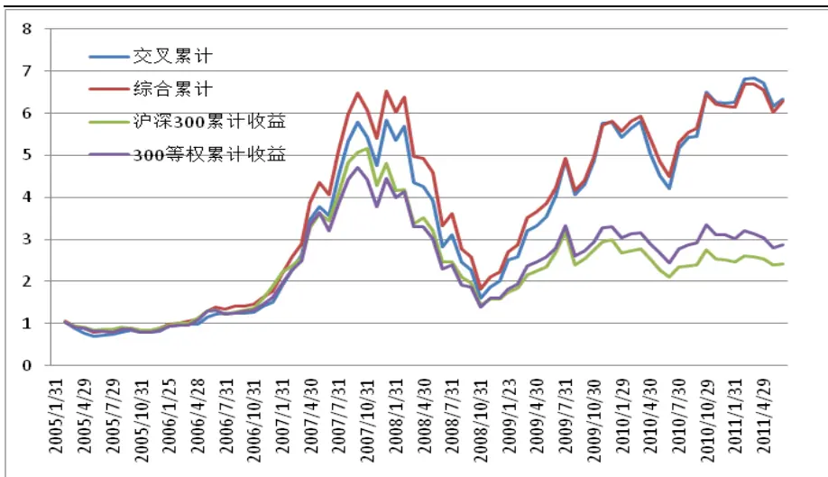
数据来源：国泰君安证券研究

由图 17 可以看出，交叉选股与综合打分选股的整体效果相差不大，分阶段来看，牛市中综合打分稍好些，而熊市及震荡市中交叉选股更好些。

## 3.3.2. 不同筛选标准对组合策略的影响

由图 18-21 可以看出,不论是 GARP、价值、成长策略，组合收益随着 ROE限制的增强基本呈现下跌趋势。我们认为原因可能是已经将 ROE 加入成长指标当中，在选取股票的时候 ROE 已经在给股票排名上面占了一定的权重，ROE 的限制条件太高反而可能会影响组合的结果。

图 18 交叉选股下不同 ROE 限制下的 GARP
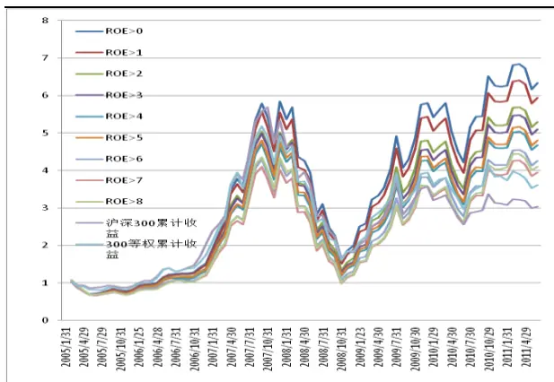
数据来源：国泰君安证券研究

图 19 综合打分下不同 ROE 限制下的 GARP
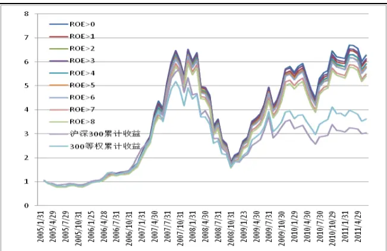
数据来源：国泰君安证券研究

图 20 不同 ROE 限制下的价值组合
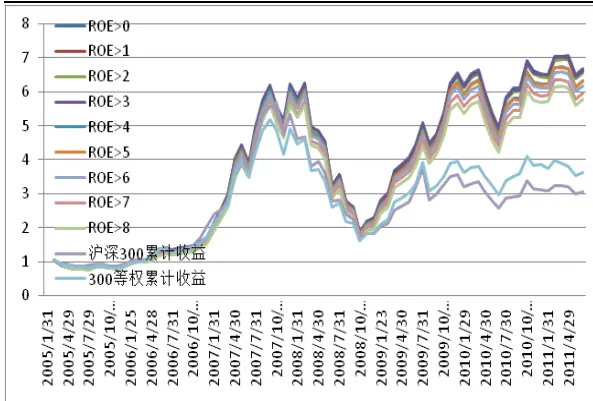
数据来源：国泰君安证券研究

图 21 不同 ROE 限制下的成长组合
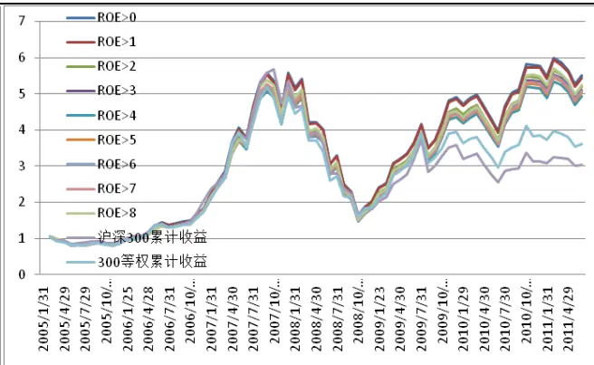
数据来源：国泰君安证券研究

## 3.3.3. 不同选取标准对组合策略的影响

表 4 给出了不同交叉深度下 GARP 的表现情况。仅就累计收益而言，（5%，5%）的交叉深度组合表现最好，可以获得近 20 倍的收益，但该组合风险较大，选股数量仅有 3-5 只。相对而言，（20%，20%）表现比较稳健些。

表4不同交叉深度下GARP 交叉选股的组合表现

| 价值排名/ 成长排名 | 40% | 35% | 30% | 25% | 20% | 15% | 10% | 5% |
| --- | --- | --- | --- | --- | --- | --- | --- | --- |
| 40% | 622.06% | 617.03% | 625.46% | 608.15% | 647.57% | 570.07% | 581.41% | 691.50% |
| 35% | 637.12% | 630.03% | 631.44% | 630.07% | 651.94% | 565.66% | 566.42% | 634.89% |
| 30% | 649.38% | 644.63% | 640.54% | 653.77% | 667.86% | 581.32% | 571.44% | 663.30% |
| 25% | 654.04% | 644.69% | 632.22% | 631.08% | 640.07% | 578.72% | 496.93% | 564.41% |
| 20% | 665.19% | 633.99% | 611.75% | 618.33% | 633.31% | 560.52% | 446.84% | 588.78% |
| 15% | 652.76% | 611.12% | 576.06% | 576.95% | 606.72% | 531.24% | 468.90% | 845.66% |
| 10% | 616.16% | 614.29% | 599.79% | 590.53% | 587.19% | 581.48% | 445.14% | 607.43% |
| 5% | 568.87% | 562.52% | 533.79% | 532.16% | 531.24% | 472.66% | 426.64% | 1945.14% |

数据来源：国泰君安证券研究

表 5 给出了不同综合排名下各策略的表现情况。整体来看，GARP、价值、成长策略在选择前20%-25%时表现较好。

表 5 不同综合排名下各组合选股的表现

| 组合\排名 | 40% | 35% | 30% | 25% | 20% | 15% | 10% | 5% |
| --- | --- | --- | --- | --- | --- | --- | --- | --- |
| GARP | 621.99% | 593.83% | 600.92% | 597.71% | 628.63% | 570.53% | 591.23% | 436.63% |
| 价值 | 648.30% | 647.72% | 675.72% | 685.87% | 666.98% | 657.43% | 611.98% | 535.66% |
| 成长 | 536.27% | 521.53 | 539.38% | 552.38% | 550.41% | 514.92% | 521.16% | 552.02% |

数据来源：国泰君安证券研究

综上分析，不论如何改变选股方式、筛选标准以及排名限制，GARP 策略大都能显著跑赢基准指数，这表明GARP 策略具有宽范围的选股有效性。

## 3.4. 小结

本节，我们仅使用了完全基于历史数据的最简单的 GARP 策略， 选股中并未考虑各行业分析师对市场未来的预测信息和组合调整时的市场走势情况，所包含信息并不完全。尽管如此我们仍得到了一些有意义的结论，总结如下：

1.GARP 选股策略在 A 股市场表现优异，在震荡市当中表现尤佳（信息比率可达 1.92），且好于价值、成长策略。这表明 GARP 策略更适合于震荡市。

2 从股票的行业分布来看，GARP 策略所选股票主要集中在材料、可选消费、工业、金融及能源上。选股数量平均在 35 只左右，调仓比例差异较大，平均在40%左右。

3. 比较 GARP、价值、成长三种策略，整体而言，价值策略表现最好，GARP 次之，成长策略最差。但分环境来看，震荡市中表现最好的仍是GARP，而价值策略在单边市中表现要相对好些，成长策略在所有情况下都是表现最差的。之所以出现这种情况，我们认为主要是成长策略数据太滞后的缘故。在震荡市中单看价值指标是不够的，这一点从震荡市中成长策略收益也较高便可见一斑

4.交叉选股与综合打分的表现相差无几，这表明不同选取方式对 GARP的影响不大。

5.在 GARP、价值、成长组合中，组合收益随着 ROE 限制条件的增强呈现下跌趋势。原因可能是我们已经将 ROE 加入成长指标当中，在选取股票的时候ROE 已经在给股票排名上面占了一定的权重，ROE的限制条件太高反而可能会影响组合的结果。

6.不论如何改变选股方式、筛选标准以及排名限制，GARP 策略大都能

显著跑赢沪深300，这表明 GARP 策略具有宽范围的选股有效性。

事实上，在测试过程中我们发现，如果利用的财务数据能够有所领先，GARP 策略的选股效果会增强很多，此时行业分析师精确的预测能力就显得尤为重要。

## 4. 本期GARP、价值、成长选股组合

根据 8 月 31 日最新的财务数据和交易数据，我们分别利用 GARP、价值以及成长策略构建了 9 月份的荐股组合，其中 GARP 选取的前 20%的交叉深度，而价值成长组合选择的是排名前5%的组合，具体可参见下表：

表 6 9 月份 GARP 组合及各只股票的得分情况

| 代码 | 简称 | 所属行业 （申万Ⅱ级） | PE | PB | PS | PCF | PEG | NPG (短期） | NPG （长期）净利率 | 销售 | ROE | OPG |
| --- | --- | --- | --- | --- | --- | --- | --- | --- | --- | --- | --- | --- |
| 000001.SZ | 深发展A | 银行Ⅱ | 96 | 86 | 35 | 100 | 75 | 60 | 43 | 96 | 84 | 68 |
| 000039.SZ | 中集集团 | 金属制品Ⅱ | 97 | 75 | 92 | 4 | 96 | 86 | 82 | 45 | 87 | 94 |
| 000043.SZ | 中航地产 | 房地产开发Ⅱ | 99 | 97 | 93 | 75 | 97 | 98 | 83 | 44 | 58 | 96 |
| 000402.SZ | 金融街 | 房地产开发Ⅱ | 99 | 99 | 66 | 98 | 92 | 80 | 71 | 88 | 62 | 85 |
| 000666.SZ | 经纬纺机 | 专用设备 | 88 | 85 | 91 | 98 | 98 | 96 | 85 | 31 | 53 | 87 |
| 000789.SZ | 江西水泥 | 建筑材料 | 90 | 44 | 81 | 97 | 99 | 97 | 87 | 57 | 77 | 85 |
| 000877.SZ | 天山股份 | 建筑材料 | 88 | 73 | 74 | 91 | 84 | 80 | 67 | 62 | 71 | 85 |
| 000883.SZ | 湖北能源 | 汽车零部件Ⅱ | 92 | 90 | 78 | 94 | 99 | 93 | 87 | 63 | 85 | 95 |
| 000886.SZ | 海南高速 | 高速公路Ⅱ | 79 | 94 | 29 | 92 | 93 | 94 | 82 | 88 | 34 | 98 |
| 000936.SZ | 华西村 | 化学纤维 | 83 | 77 | 80 | 69 | 88 | 87 | 76 | 47 | 63 | 79 |
| 002075.SZ | 沙钢股份 | 有色金属冶炼Ⅱ | 72 | 25 | 95 | 99 | 95 | 96 | 90 | 14 | 90 | 100 |
| 002092.SZ | 中泰化学 | 化学原料 | 73 | 91 | 58 | 85 | 89 | 89 | 79 | 60 | 33 | 88 |
| 600000.SH | 浦发银行 | 银行Ⅱ | 100 | 97 | 48 | 96 | 84 | 52 | 49 | 97 | 81 | 71 |
| 600067.SH | 冠城大通 | 房地产开发Ⅱ | 99 | 87 | 94 | 71 | 87 | 71 | 61 | 43 | 89 | 90 |
| 600152.SH | 维科精华 | 纺织 | 87 | 60 | 93 | 18 | 100 | 95 | 88 | 26 | 79 | 93 |
| 600188.SH | 兖州煤业 | 煤炭开采Ⅱ | 92 | 55 | 37 | 90 | 88 | 70 | 73 | 92 | 94 | 79 |
| 600282.SH | 南钢股份 | 钢铁 | 95 | 96 | 98 | 50 | 97 | 92 | 85 | 23 | 73 | 76 |
| 600323.SH | 南海发展 | 水务Ⅱ | 100 | 85 | 24 | 47 | 98 | 61 | 83 | 100 | 97 | 53 |
| 600339.SH | 天利高新 | 石油化工 | 75 | 40 | 51 | 87 | 88 | 72 | 78 | 68 | 83 | 92 |
| 600362.SH | 江西铜业 | 有色金属冶炼Ⅱ | 85 | 71 | 83 | 20 | 85 | 73 | 69 | 43 | 82 | 78 |
| 600373.SH | 中文传媒 | 传媒 | 85 | 80 | 59 | 81 | 99 | 98 | 89 | 72 | 92 | 97 |
| 600409.SH | 三友化工 | 化学原料 | 84 | 79 | 82 | 58 | 94 | 91 | 81 | 46 | 70 | 91 |
| 600461.SH | 洪城水业 | 水务Ⅱ | 64 | 87 | 47 | 90 | 94 | 88 | 84 | 64 | 51 | 99 |
| 600575.SH | 芜湖港 | 港口Ⅱ | 27 | 57 | 95 | 92 | 99 | 100 | 89 | 4 | 49 | 100 |
| 600585.SH | 海螺水泥 | 建筑材料 | 95 | 72 | 51 | 83 | 91 | 87 | 74 | 89 | 92 | 84 |
| 600620.SH | 天宸股份 | 综合Ⅱ | 92 | 66 | 77 | 91 | 98 | 36 | 85 | 64 | 90 | 99 |
| 600667.SH | 太极实业 | 化学纤维 | 57 | 50 | 84 | 98 | 93 | 96 | 83 | 21 | 44 | 99 |
| 600684.SH | 珠江实业 | 房地产开发Ⅱ | 91 | 75 | 55 | 80 | 89 | 88 | 75 | 83 | 84 | 94 |
| 600693.SH | 东百集团 | 零售 | 98 | 65 | 74 | 72 | 95 | 92 | 80 | 78 | 97 | 34 |
| 600729.SH | 重庆百货 | 零售 | 74 | 17 | 95 | 85 | 92 | 87 | 81 | 14 | 98 | 98 |
| 600740.SH | 山西焦化 | 煤炭开采Ⅱ | 81 | 25 | 84 | 92 | 87 | 80 | 95 | 35 | 96 | 71 |
| 600784.SH | 鲁银投资 | 综合Ⅱ | 88 | 36 | 94 | 90 | 92 | 89 | 79 | 24 | 95 | 76 |
| 600791.SH | 京能置业 | 房地产开发Ⅱ | 89 | 78 | 75 | 95 | 96 | 100 | 83 | 63 | 67 | 99 |
| 600801.SH | 华新水泥 | 建筑材料 | 80 | 59 | 69 | 78 | 87 | 94 | 76 | 58 | 73 | 82 |

数据来源：国泰君安证券研究

表7 9 月份价值组合及各只股票的得分情况

| 代码 | 简称 | 所属行业（申万Ⅱ 级） | PE | PB | PS | PCF | PEG |
| --- | --- | --- | --- | --- | --- | --- | --- |
| 000043.SZ | 中航地产 | 房地产开发Ⅱ | 99 | 97 | 93 | 75 | 97 |
| 000666.SZ | 经纬纺机 | 专用设备 | 88 | 85 | 91 | 98 | 98 |
| 000761.SZ | 本钢板材 | 钢铁 | 76 | 99 | 98 | 95 | 98 |
| 600060.SH | 海信电器 | 视听器材 | 96 | 89 | 96 | 92 | 86 |
| 600418.SH | 江淮汽车 | 汽车整车 | 99 | 91 | 99 | 97 | 85 |
| 000059.SZ | 辽通化工 | 石油化工 | 80 | 93 | 98 |  |  |
| 000402.SZ | 金融街 | 房地产开发Ⅱ | 99 | 99 | 66 | 96 | 90 |
| 000883.SZ | 湖北能源 | 汽车零部件Ⅱ | 92 | 90 | 78 | 98 | 92 |
| 600029.SH | 南方航空 | 航空运输Ⅱ |  |  |  | 94 | 99 |
| 600126.SH | 杭钢股份 | 钢铁 | 94 97 | 78 100 | 88 | 97 | 91 |
| 600741.SH | 华域汽车 | 汽车零部件Ⅱ | 98 | 94 | 100 | 77 | 75 |
| 000707.SZ | 双环科技 | 化学原料 | 78 | 85 | 96 85 | 94 96 | 72 93 |
| 600067.SH | 冠城大通 | 房地产开发Ⅱ | 99 | 87 | 94 | 71 | 87 |
| 600282.SH | 南钢股份 | 钢铁 | 95 | 96 | 98 | 50 | 97 |
| 600791.SH | 京能置业 | 房地产开发Ⅱ | 89 | 78 | 75 | 95 | 96 |
| 601866.SH | 中海集运 | 航运Ⅱ | 86 | 97 | 83 | 86 | 91 |
| 000006.SZ | 深振业A | 房地产开发Ⅱ | 97 | 88 | 64 | 99 | 83 |
| 600000.SH | 浦发银行 | 银行Ⅱ | 100 | 97 | 48 | 96 | 84 |
| 600307.SH | 酒钢宏兴 | 钢铁 | 84 | 89 | 97 | 74 | 82 |
| 600507.SH | 方大特钢 | 钢铁 | 91 | 71 |  | 77 |  |
| 601111.SH | 中国国航 | 航空运输Ⅱ | 97 | 75 | 96 |  | 92 |
| 601988.SH | 中国银行 | 银行Ⅱ |  |  | 80 | 96 | 84 |
| 000002.SZ | 万科A | 房地产开发Ⅱ | 100 | 98 | 52 | 97 | 78 |
| 600015.SH | 华夏银行 | 银行Ⅱ | 94 | 90 | 72 | 95 | 68 |
| 600620.SH | 天宸股份 | 综合Ⅱ | 97 | 97 | 53 | 100 | 76 |
| 600717.SH | 天津港 | 港口Ⅱ | 92 | 66 | 77 | 91 | 98 |
| 600835.SH | 上海机电 | 专用设备 | 90 | 100 | 86 | 94 | 48 |
| 000698.SZ | 沈阳化工 | 石油化工 | 84 | 86 | 88 | 90 | 73 |
| 000708.SZ | 大冶特钢 | 钢铁 | 76 | 93 | 94 | 76 | 74 |
| 000789.SZ | 江西水泥 | 建筑材料 | 96 | 85 | 92 | 89 | 48 |
| 000877.SZ | 天山股份 | 建筑材料 | 90 | 44 73 | 81 | 97 | 99 |
| 600117.SH | 西宁特钢 | 钢铁 | 88 78 | 76 | 74 87 | 91 80 | 84 90 |
|  | 中国石油 | 石油开采Ⅱ |  |  |  |  |  |
| 601857.SH |  |  | 93 | 92 | 85 | 94 | 52 |

数据来源：国泰君安证券研究

表 9 月份成长组合及各只股票的得分情况

| 代码 | 简称 | 所属行业（申万Ⅱ 级） | PE | PB | PS | PCF | PEG |  |
| --- | --- | --- | --- | --- | --- | --- | --- | --- |
| 600503.SH | 华丽家族 | 房地产开发Ⅱ | 100 | 88 | 100 | 100 | 100 |  |
| 600728.SH | 新太科技 | 计算机应用 | 87 | 86 | 95 | 100 | 98 |  |
| 000609.SZ | 绵世股份 | 房地产开发Ⅱ | 90 | 82 | 100 | 80 | 99 |  |
| 002006.SZ | 精功科技 | 专用设备 | 98 | 83 | 78 | 98 | 93 |  |
| 600111.SH | 包钢稀土 | 有色金属冶炼Ⅱ | 92 | 82 | 90 | 99 | 95 |  |
| 600318.SH | 巢东股份 | 建筑材料 | 97 | 83 | 86 | 98 | 91 |  |
| 600873.SH | 梅花集团 | 电气设备 | 99 | 88 | 76 | 99 | 99 |  |
| 000596.SZ | 古井贡酒 | 饮料制造 | 83 | 71 | 83 | 99 | 90 |  |
| 000703.SZ | 恒逸石化 | 综合Ⅱ | 100 | 88 | 51 | 95 | 100 |  |
| 600252.SH | 中恒集团 | 化学制药 | 82 | 77 | 95 | 98 | 96 |  |
| 600373.SH | 中文传媒 | 传媒 | 98 | 89 | 72 | 92 | 97 |  |
| 600505.SH | 西昌电力 | 电力 | 97 | 84 | 99 | 99 | 53 |  |
| 600585.SH | 海螺水泥 | 建筑材料 | 87 | 74 | 89 | 92 | 84 |  |
| 600636.SH | 三爱富 | 化工新材料Ⅱ | 98 | 85 | 65 | 96 | 91 |  |
| 000563.SZ | 陕国投A | 信托Ⅱ | 84 | 72 | 98 | 76 | 95 |  |
| 000590.SZ | 紫光古汉 | 中药Ⅱ | 99 | 94 | 86 | 91 | 53 |  |
| 000883.SZ | 湖北能源 | 汽车零部件Ⅱ | 93 | 87 | 63 | 85 | 95 |  |
| 600684.SH | 珠江实业 | 房地产开发Ⅱ | 88 | 75 | 83 | 84 | 94 |  |
| 600687.SH | 刚泰控股 | 房地产开发Ⅱ | 97 |  | 70 | 71 | 98 |  |
|  |  |  |  |  |  |  |  | 89 |
| 002234.SZ | 民和股份 | 农业综合Ⅱ | 91 | 90 | 71 | 87 | 77 |  |
| 600031.SH | 三一重工 | 专用设备 | 74 | 69 | 82 | 100 | 91 |  |
| 600188.SH | 兖州煤业 | 煤炭开采Ⅱ | 70 | 73 | 92 | 94 | 79 |  |
| 600703.SH | 三安光电 | 半导体 | 78 | 68 | 99 | 74 | 93 |  |
| 600791.SH | 京能置业 | 房地产开发Ⅱ | 100 | 83 | 63 | 67 | 99 |  |
| 000581.SZ | 威孚高科 | 普通机械 | 73 | 73 | 91 | 97 | 68 |  |
| 000789.SZ | 江西水泥 | 建筑材料 | 97 | 87 | 57 | 77 | 85 |  |
| 002106.SZ | 莱宝高科 | 显示器件Ⅱ | 66 | 68 | 97 | 90 | 82 |  |
| 002155.SZ | 辰州矿业 | 有色金属冶炼Ⅱ | 89 | 78 | 65 | 78 | 90 |  |
| 600809.SH |  | 饮料制造 | 72 | 62 | 84 | 96 | 86 |  |
|  |  | 综合Ⅱ |  |  |  |  |  |  |
| 600805.SH |  |  |  |  |  |  |  |  |
|  | 悦达投资 |  |  |  |  |  |  |  |
|  |  |  | 65 | 53 | 97 | 94 | 92 |  |
|  | 山西汾酒 |  |  |  |  |  |  |  |

数据来源：国泰君安证券研究

## 作者简介：

刘富兵：

执业资格证书编号：S0880511010017

电话：021-38676673

邮箱：liufubing008481@gtjas.com

国泰君安金融工程分析师，上海交通大学金融工程博士，上海财经大学概率统计硕士，2008-2010 年曾供职于国金证券研究所，目前从事股指期货等衍生品及量化方面的研究。

## 蒋瑛琨：

执业资格证书编号：S0880511010023

电话：021-38676710

邮箱：jiangyingkun@gtjas.com

吉林大学数量经济学博士，CPA，国泰君安证券首席金融工程研究员。05 年加入国泰君安证券研究所，曾在衍生产品部工作，多次获中金所、深交所、中国证券业协会、中国金融学会等奖励。06 年新财富“衍生品”第二名，07-08 年入围新财富，2010 年水晶球奖“衍生品”第四名。

感谢实习生刘毅为本报告作出的贡献。

## 本公司具有中国证监会核准的的证券投资咨询业务资格

## 分析师声明

作者具有中国证券业协会授予的证券投资咨询执业资格或相当的专业胜任能力，保证报告所采用的数据均来自合规渠道，分析逻辑基于作者的职业理解，本报告清晰准确地反映了作者的研究观点，力求独立、客观和公正，结论不受任何第三方的授意或影响，特此声明。

## 免责声明

本报告仅供国泰君安证券股份有限公司（以下简称“本公司”）的客户使用。本公司不会因接收人收到本报告而视其为本公司的当然客户。本报告仅在相关法律许可的情况下发放，并仅为提供信息而发放，概不构成任何广告。

本报告的信息来源于已公开的资料，本公司对该等信息的准确性、完整性或可靠性不作任何保证。本报告所载的资料、意见及推测仅反映本公司于发布本报告当日的判断，本报告所指的证券或投资标的的价格、价值及投资收入可升可跌。过往表现不应作为日后的表现依据。在不同时期，本公司可发出与本报告所载资料、意见及推测不一致的报告。本公司不保证本报告所含信息保持在最新状态。同时，本公司对本报告所含信息可在不发出通知的情形下做出修改，投资者应当自行关注相应的更新或修改。

本报告中所指的投资及服务可能不适合个别客户，不构成客户私人咨询建议。在任何情况下，本报告中的信息或所表述的意见均不构成对任何人的投资建议。在任何情况下，本公司、本公司员工或者关联机构不承诺投资者一定获利，不与投资者分享投资收益，也不对任何人因使用本报告中的任何内容所引致的任何损失负任何责任。投资者务必注意，其据此做出的任何投资决策与本公司、本公司员工或者关联机构无关。

本公司利用信息隔离墙控制内部一个或多个领域、部门或关联机构之间的信息流动。因此，投资者应注意，在法律许可的情况下，本公司及其所属关联机构可能会持有报告中提到的公司所发行的证券或期权并进行证券或期权交易，也可能为这些公司提供或者争取提供投资银行、财务顾问或者金融产品等相关服务。在法律许可的情况下，本公司的员工可能担任本报告所提到的公司的董事。

市场有风险，投资需谨慎。投资者不应将本报告为作出投资决策的惟一参考因素，亦不应认为本报告可以取代自己的判断。在决定投资前，如有需要，投资者务必向专业人士咨询并谨慎决策。

本报告版权仅为本公司所有，未经书面许可，任何机构和个人不得以任何形式翻版、复制、发表或引用。如征得本公司同意进行引用、刊发的，需在允许的范围内使用，并注明出处为“国泰君安证券研究”，且不得对本报告进行任何有悖原意的引用、删节和修改。

若本公司以外的其他机构（以下简称“该机构”）发送本报告，则由该机构独自为此发送行为负责。通过此途径获得本报告的投资者应自行联系该机构以要求获悉更详细信息或进而交易本报告中提及的证券。本报告不构成本公司向该机构之客户提供的投资建议，本公司、本公司员工或者关联机构亦不为该机构之客户因使用本报告或报告所载内容引起的任何损失承担任何责任。

## 评级说明

## 1.投资建议的比较标准

投资评级分为股票评级和行业评级。

以报告发布后的12个月内的市场表现为比较标准，报告发布日后的 12个月内的公司股价（或行业指数）的涨跌幅相对同期的沪深 300 指数涨跌幅为基准。

## 2.投资建议的评级标准

报告发布日后的 12 个月内的公司股价（或行业指数）的涨跌幅相对同期的沪深 300 指数的涨跌幅。

|  | 评级 说明 |  |
| --- | --- | --- |
| 股票投资评级 | 增持 | 相对沪深300指数涨幅15%以上 |
|  | 谨慎增持 | 相对沪深300指数涨幅介于5%～15%之间 |
|  | 中性 | 相对沪深300指数涨幅介于-5%～5% |
|  | 减持 | 相对沪深 300指数下跌5%以上 |
| 行业投资评级 | 增持 | 明显强于沪深 300 指数 |
|  | 中性 | 基本与沪深 300指数持平 |
|  | 减持 | 明显弱于沪深 300指数 |

## 国泰君安证券研究

|  | 上海 | 深圳 | 北京 |
| --- | --- | --- | --- |
| 地址 | 上海市浦东新区银城中路168号上海 银行大厦29层 | 深圳市福田区益田路 6009 号新世界 商务中心34层 | 北京市西城区金融大街28 号盈泰中 心2号楼10层 |
| 邮编 | 200120 | 518026 | 100140 |
| 电话 | (021)38676666 | (0755)23976888 | (010)59312799 |
|  | E-mail: gtjaresearch@gtjas.com |  |  |