金融工程

2011.09.15

# 风格投资 III：A 股周期非周期风格轮动研究

# ——数量化研究系列之十六

刘富兵

蒋瑛琨

8 021-38676673

021-38676710

liufubing008481@gtjas.com

jiangyingkun@gtjas.com

编号 S0880511010017

S0880511010023

本报告导读：基于 logit 模型建立了周期非周期风格轮动的预测模型。该模型预测的胜率可以高达70%，进行配对交易年化绝对收益可高达24%，本月我们预测周期股表现好于非周期的概率为 0.88。

## 摘要：

z 就我国证券市场而言，一般在牛市中周期股表现更好些，而在熊市中非周期股表现更好些，当然这也有例外，在 2006年的牛市，非周期跑的相对好些。在震荡市中，多数时间非周期跑的更好些，但近期，周期相对表现更好些。

z 事实上，我国的周期与非周期轮动并无明显的规律可循，这就需要我们用更为精细的方法去深入研究周期非周期的轮动规律。

若进行完美风格轮动，在不到7年的时间里，相对完美轮动与绝对完美轮动可以分别获得 18 倍、35 倍的收益，远远跑赢基准及周期非周期。这表明，进行积极的风格管理是能够带来超额收益的，关键在于风格的判断和预测，预测越准确，风格择时带来的超额收益越丰厚。

z 本文，我们共选择 6 个变量，分别是 CPI 同比的环比、PPI同比环比、工业增加值同比环比、消费者信心指数、对外出口总额环比、社会消费品零售总额同比环比，建立logit模型对周期非周期的风格轮动进行预测。

z 实证结果表明，模型的拟合效果很好，概率值大多数分布在（0,1）两端，这表明该模型的区分度很好，避免了 0.5 附近的模糊区域，而样本外预测的胜率达 70%也表明模型的稳定性比较好。

z 利用该模型构建的策略，无论是相对轮动还是绝对轮动策略，都跑赢了基准指数，周期指数以及非周期指数。相对轮动的年化超额收益约8%，而绝对轮动的年化收益可达24%。

根据最新数据预测，9 月周期股表现好于非周期的概率为0.88，主要影响因素是消费者信心指数的显著上升；而8月配置周期指数则是由cpi增加和消费者信心指数增加共同作用的效果；反观7月的预测，则是由工业增加值和消费者信心指数的回落导致投资决策偏向非周期股。

## 相关报告

《市场情绪指数的建立及应用》

2011.07.10

《风格投资 II：风格周期与轮动》

2008.09.09

《风格投资 I：风格区分与收益》

2008.09.09

## 1. 风格轮动回顾

在前期的报告《风格投资 I：风格区分与收益》（2008.9.9）、《风格投资II：风格周期与轮动》(2008.9.9)中,我们重点研究了风格投资的划分、风格投资的收益、风格周期表现以及风格轮动的预测方法。在此我们作简单的回顾。

## 1.1. 风格轮动划分

投资风格的形成主要来源于对股市异象的研究。本质上，风格投资是从某些特定分割的、异质的市场或从错误定价的股票中获得超额收益。

目前市场形成了几种主流的投资风格，例如大盘/小盘，价值/成长。国内外机构与研究者采用多种方法划分，通常采用多重标准的风格转换策略能获得更好的收益。

国外投资风格鉴别技术可分为两种:（1）持股特征基础的投资风格鉴别法(HBS)，包括 Morningstar“风格箱”法和“新风格箱”法、Rusell 风格分类系统(SCS)、Frank Russell 和 Salomon Brother 的风格分类系统等。（2）收益率基础的投资风格鉴别(RBS)法，如 sharp鉴别法等。

## 1.2.风格轮动收益

根据 Sharp、Rusell 公司的研究，风格指数可以在相当程度上解释组合收益的来源。

Farrell(1996)将股票分为成长型、 周期型、 稳定型和能源型等风格，分别进行风格轮换收益率测算，在 71 年至 91 年期间，投资于收益率最高的风格组合所获得的最多超额收益平均为 20.14%。

Arnott, David and Christopher 研究了 75 年 1 月至 95 年 6 月期间将 1美元分别投至美国、英国、日本、加拿大及德国的价值股和成长股，发现投资价值股能获得更高收益。这说明，根据股票风格选出的组合能带来额外收益，并且这些组合的收益和其余组合收益在统计意义上具有显著差异。

## 1.3.风格轮动的预测方法

风格转换策略模型实际上是在建立了一系列基本预测变量的基础上、寻找一个适用于风格转换的合理模型。从已有文献看，主要有四类方法：（1）将风格相对收益率对相关变量进行回归。但由于建立精确关系较为困难，因此这种方法基本被排除。

（2） Markov Switch模型。该模型主要关注相对收益率的历史表现（按照 Levist 的变量分类办法，这些指标主要是技术变量），并不关注其他基本经济变量，因此这种方法可能遗漏了很多可用信息。

（3）Logistic概率模型。在任意时点，风格转换的结果无非有二种，即转换或不转换。如果预期下期某类风格占优，则将现有风格转化为占优的风格。这种方法的应用更为广泛，如 Gokani 和 Todorovic 等均采用了这种方法。

本文将风格研究对象限定在周期非周期上，后续我们会对大小盘、价值成长以及上下游轮动作系列研究。

## 2. 我国证券市场的周期非周期风格轮动

在我国证券市场，存在周期非周期的轮动现象，我们可以看到金融保险、采掘业、房地产等这五个行业都是非常容易受到经济景气程度影响的行业,投资中常常认为这类品种属于“进攻型”，在市场全面上升阶段，涨幅一般要超越市场的平均幅度，市场调整的时候,该类行业的波动性也会相应增大；而医药生物、商贸等非周期行业也被许多投资者认为是“防御型”品种，他们的成长性较为稳定，受经济基本面变化波动较小。

## 2.1.完美风格轮动收益

所谓的“完美”的风格轮动是指每次总能提前预测到风格的转换，并且毫无困难地在发生转换的月份将原先的风格投资组合换为另一种风格投资组合，例如，当周期风格占据上风时，该投资者持有周期风格的投资组合，当非周期风格占据优势时，该投资者迅速将手中组合换为非周期风格组合。图 1给出了完美风格轮动的收益。

图 1 完美风格轮动的收益
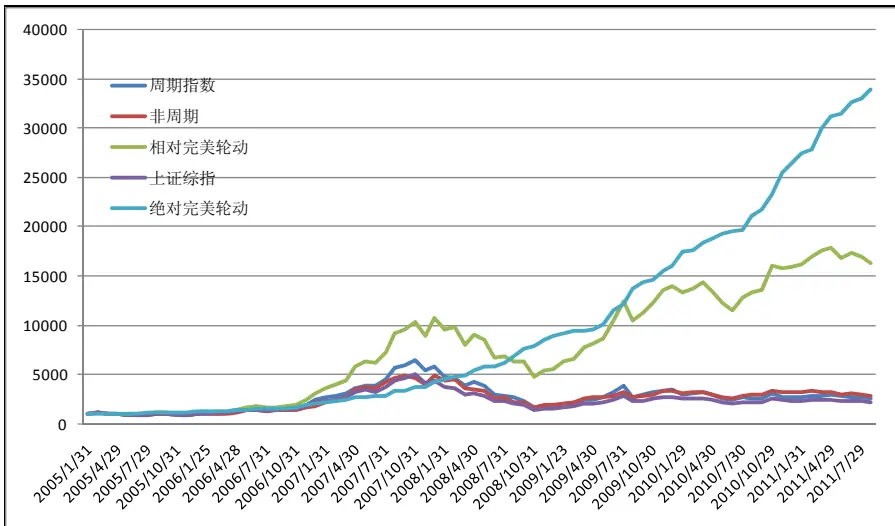
数据来源：国泰君安证券研究

注：相对完美轮动是指每次都配置下期表现好的指数；而绝对完美轮动是指每次都买入下期表现好的指数，同时做空下期表现差的指数。

由图 1可以看到，若进行完美风格轮动，在不到 7年的时间里，相对完美轮动与绝对完美轮动可以分别获得 18 倍、35 倍的收益，远远跑赢基准及周期非周期。这表明，进行积极的风格管理是能够带来超额收益的。

当然关键在于风格的判断和预测，预测越准确，风格择时带来的超额收益越丰厚。

## 2.2.周期非周期风格轮动的特点

图 2 我国证券市场周期非周期的相对强弱走势
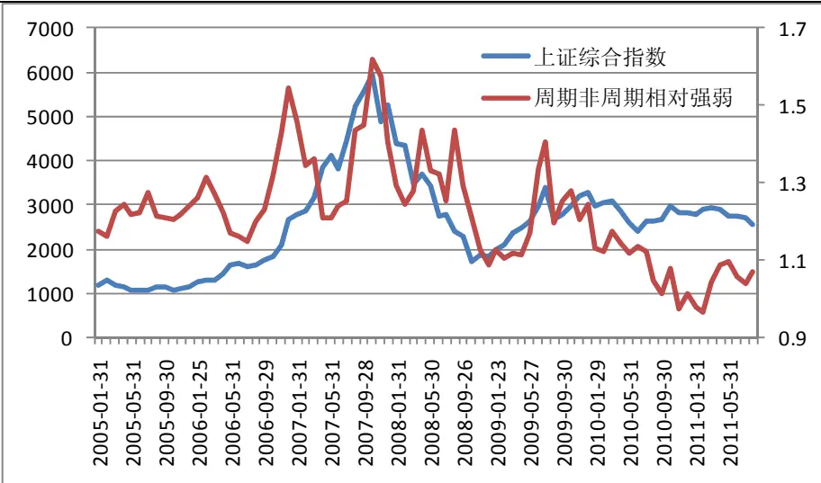
数据来源：国泰君安证券研究

图 3 我国证券市场周期非周期风格轮动特点
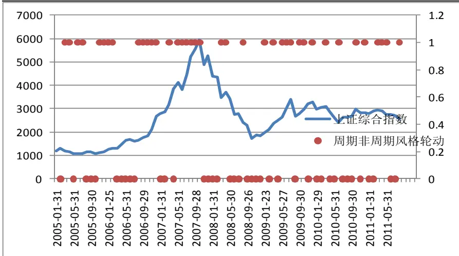
数据来源：国泰君安证券研究

表 1 我国证券市场周期非周期风格轮动及超额收益

| 市场阶段 | 日期 | 轮动特点 | 超额收益 | 市场阶段 | 日期 | 轮动特点 | 超额收益 |
| --- | --- | --- | --- | --- | --- | --- | --- |
|  | 2005年2月 | 0 | 1.25% | 牛市 | 2009年1月 | 1 | 3.84% |
|  | 2005年3月 | 1 | 4.77% |  | 2009年2月 | 0 | 1.85% |
|  | 2005年4月 | 1 | 1.72% |  | 2009年3月 | 1 | 1.23% |
|  | 2005年5月 | 0 | 2.04% |  | 2009年4月 | 0 | 0.44% |
|  | 2005年6月 | 1 | 0.39% |  | 2009年5月 | 1 | 5.26% |
|  | 2005年7月 | 1 | 4.19% |  | 2009年6月 | 1 | 15.04% |
|  | 2005年8月 | 0 | 5.05% |  | 2009年7月 | 1 | 5.69% |
|  | 2005年9月 | 0 | 0.65% | 2009年8月 | 0 |  | 12.36% |
|  | 2005年10月 | 0 | 0.04% |  | 2009年9月 | 1 | 4.72% |
|  | 2005年11月 | 1 | 0.90% |  | 2009年10月 | 1 | 2.16% |
|  | 2005年12月 | 1 | 1.78% |  | 2009年11月 | 0 | 6.09% |
|  | 2006年1月 | 1 | 1.95% |  | 2009年12月 | 1 | 3.27% |
|  |  | 2006年2月 | 1 4.32% |  | 2010年1月 | 0 | 8.91% |
|  | 2006年3月 | 0 | 3.47% |  | 2010年2月 | 0 | 0.70% |
|  | 2006年4月 | 0 | 4.12% |  | 2010年3月 | 1 | 4.62% |
|  | 2006年5月 牛市 | 0 | 4.96% |  | 2010年4月 | 0 | 2.22% |
|  | 2006年6月 | 0 | 0.99% |  | 2010年5月 | 0 | 2.25% |
|  | 2006年7月 | 0 | 0.74% | 2010年6月 | 1 | 1.29% |  |
|  | 2006年8月 | 1 | 4.23% | 2010年7月 震荡市 | 0 | 1.11% |  |
|  | 2006年9月 | 1 | 2.84% | 2010年8月 | 0 | 6.89% |  |
|  | 2006年10月 | 1 | 7.07% | 2010年9月 | 0 | 3.14% |  |
|  | 2006年11月 | 1 | 9.89% | 2010年10月 | 1 | 7.08% |  |
|  | 2006年12月 | 1 | 8.95% | 2010年11月 | 0 | 9.48% |  |
|  | 2007年1月 | 0 | 6.71% | 2010年12月 | 1 | 3.76% |  |
|  | 2007年2月 | 0 | 8.36% | 2011年1月 | 0 | 3.66% |  |
|  | 2007年3月 | 1 | 1.26% | 2011年2月 | 0 | 1.41% |  |
|  | 2007年4月 | 0 | 14.80% | 2011年3月 | 1 | 7.98% |  |
|  | 2007年5月 | 1 | 0.01% | 2011年4月 | 1 | 3.78% |  |
|  | 2007年6月 | 1 | 2.51% | 2011年5月 | 1 | 0.89% |  |
|  | 2007年7月 | 1 | 0.99% | 2011年6月 | 0 | 3.81% |  |
|  | 2007年8月 | 1 | 16.33% | 2011年7月 | 0 | 1.33% |  |
|  | 2007年9月 | 1 | 0.89% |  | 2011年8月 1 | 2.57% |  |
| 熊市 | 2007年10月 | 1 | 11.20% |  |  |  |  |
|  | 2007年11月 | 0 | 2.12% |  |  |  |  |
|  | 2007年12月 | 0 | 13.23% |  |  |  |  |
|  | 2008年1月 | 0 | 7.08% |  |  |  |  |
|  | 2008年2月 | 0 | 3.94% |  |  |  |  |
|  | 2008年3月 | 1 | 2.21% |  |  |  |  |
|  | 2008年4月 | 1 | 12.31% |  |  |  |  |
|  | 2008年5月 | 0 | 6.78% |  |  |  |  |
|  | 2008年6月 | 0 | 0.56% |  |  |  |  |
|  | 2008年7月 | 0 | 5.44% |  |  |  |  |
|  | 2008年8月 | 1 | 11.69% |  |  |  |  |
| 2008年9月 | 0 | 10.15% |  |  |  |  |  |
|  | 2008年10月 | 0 | 4.76% |  |  |  |  |
|  | 2008年11月 | 0 | 8.01% |  |  |  |  |
|  | 2008年12月 | 0 | 3.38% |  |  |  |  |

数据来源：国泰君安证券研究

观察图 2-3 周期非周期走势与上证指数的变化情况，一般而言，在牛市中周期表现更好些，而在熊市中非周期表现更好些，当然这也有例外，在 2006 年的牛市，非周期跑的相对好些。在震荡市中，多数时间非周期跑的更好些，但近期，周期相对表现更好些。从轮动的周期看，2009年以来轮动周期明显加快。

从表 1来看，周期与非周期并无明显的规律可循，这就需要我们用更为精细的方法去深入研究周期非周期的轮动规律。

## 3. 基于 logit 模型的风格轮动预测模型

## 3.1.周期非周期轮动研究方法的选择

由于我们不对组合的具体收益水平进行预测，而是预测周期非周期组合的收益之差的方向，即周期跑赢非周期或非周期跑赢周期，因此因变量是二值因变量。

标准的多元线性回归模型对二值因变量进行估计和预测具有局限性：（1）模型的预测概率可能落在[0,1]区间之外；（2）独立变量不是正态分布的。

本文我们使用二元 Logit回归分析作为主要建模方法，基于以下原因：第一，Logit 回归对于变量分布没有具体要求，适用范围更广。而其他统计方法如判别分析等要求自变量服从多元正态或协方差相等，这在现实中一般达不到。

第二，本研究只关注周期和非周期指数间的转换，因变量取值只有两个，即周期指数或非周期指数。对于这种分类变量的统计分析，Logit模型具有不可替代的优势。

第三，Logit模型一旦建立之后，只需将下期的自变量值代入模型就可得到一个概率值，用以判断下期选择哪个指数，既简单又直观。

整体而言，Logit回归扩展了多元线性回归思想，即因变量是二值（为了方便起见通常设这些值为 0 和 1）的情形。和在多元线性回归中一样，自变量可能是类别变量、连续变量或者是两种类型的混合。 该模型可以广泛用于社会、经济等不同领域中二值或多值选择问题。

二元 Logit模型的原理如下：

因变量只取两个值 0或 1，把某事件发生的情况定义为 Y=1,把某事件未发生的情况定义为 Y=0。设 p 为事件发生的概率（1-p 为事件未发生的概率）通过 logit 变换，可以把概率 p 转换为解释变量 Xi 的线性函数，即

$$
\ln(p/(1-p))=\alpha+\beta_{1}X_{1}+\cdots+\beta_{N}X_{N}+\varepsilon
$$

本模型中，Y=1 表示周期战胜非周期，Y=0 表示非周期战胜周期，p 表示周期战胜非周期的概率，Xi 为选择的解释变量。至于截距系数 alhpa和回归系数 beta可由最大似然估计得到。

一般在统计学的文献中，Logit 模型的参数用历史数据估计出后都会用Jackknife method进行检验。该方法在原始数据中省略一个观测值，然后运行 Logit 模型，计算这一省略值的预测概率，并根据观测值和预测值进行分类，重复上述过程 n次（n为样本规模），得出总体判别准确率。该方法虽然在统计上是无偏的，但并不适合于本文的研究，因为它给出的准确率总是站在最近的时点，而无助于历史上投资的判断。故而我们采用样本外的滚动估计来测试模型的正确率。即每一期先用前面所有数据估计模型参数，随后将自变量数据代入算出当期应当选择哪个指数并与真实情况比较，得出胜率。

## 3.2.变量的选择及数据处理

对于因变量 Y，我们规定若该月周期指数收益率大于非周期，则 Y=1，否则 Y=0。

对于自变量 X，我们共选择了 6 个变量，分别是 CPI 同比的环比、PPI同比环比、工业增加值同比环比、消费者信心指数、对外出口总额环比、社会消费品零售总额同比环比。

之所以对宏观变量作同比环比的处理是因为宏观变量具有明显的季节性，如工业增加值明显在年中会达到峰值，而在年初和年末都较少。对数据求同比后可消除这种季节趋势性，再求环比后可得每月相对的变化幅度。而对于对外出口总额我们从数据上没有观测到明显的季节趋势性，所以只使用环比数据。

对于工业增加值，由于国家没有公布 1月相关数据，我们采用将去年 12月和今年 2月的平均值作为 1月数据的估计。

此外由于涉及宏观数据的可得性，除了工业增加值我们都滞后 2期，即在预测 9月时使用 7月的数据，而对于工业增加值我们取滞后 3期。关于自变量选择的经济含义在后面的模型结果分析中会有详细的讨论，以上数据都来源于 Wind。

我们选取上证周期指数与非周期指数分别代表周期、非周期。这两只指数的样本股范围是从上证全指样本股中挑选出来的，根据 A股市场的行业属性，23 个一级行业可以稳定地分为周期和非周期两类，选择出了50只规模大、流动性好、具有周期行业特征的公司股票组成了上证周期行业指数，主要包括金融保险、采掘业、交运仓储、金属非金属和房地产五大行业。而农林牧渔、食品饮料、纺织服装、木材家具、造纸印刷、石油化学、电子、机械设备、医药生物、制造、电力煤气水、建筑、信息技术、批发零售、社会服务、文化传播与综合这十七个行业被认为是具有非周期行业特征的，选择出其中规模大、流动性好的 100只上市公司股票组成上证非周期指数样本股。

## 3.3.模型结果及解释

我们研究的样本区间为 2005.1-2011.8，由于数据样本点有限，我们采用数据累计的方式建立预测模型，即在不剔除原有最早的数据的同时，不断加入新的数据。

运用所有样本数据拟合模型可得:

$$
\begin{aligned}&Ln\left(\frac{p}{1-p}\right)=1.44cpi_{-}th-0.79cpi_{-}th+0.42ia_{-}th3+0.56cci_{-}dt\\&\\&-0.07\exp_{-}h-0.29sum_{-}th\\\end{aligned}
$$

具体参数及拟合度如下表所示：

表 2 logit 模型样本内拟合参数

| 变量 | 系数 | P值 | 拟合度指标 | R-square | 最佳判别点 | 正确率 |
| --- | --- | --- | --- | --- | --- | --- |
| cpi_th | 1.44 | 0.012 | HL=11.72 | 0.33 | 0.58 | 71.80% |
| ppi_th | -0.79 | 0.008 | (p=0.164) |  |  |  |
| ia_th3 | 0.42 | 0.012 |  |  |  |  |
| cci_d | 0.56 | 0.021 |  |  |  |  |
| exp_h | -0.07 | 0.013 |  |  |  |  |
| sum_th | -0.29 | 0.391 |  |  |  |  |

数据来源：国泰君安证券研究

由表 2可知拟合结果很好，HL指标不显著说明模型较好地拟合了数据，而系数基本都显著。

对于回归结果，我们作以下经济方面的解释：

1．CPI前的系数为正说明通货膨胀越高时，未来周期指数表现更好，这可能是因为周期指数主要包括国有大中型企业，对 CPI 的变化更敏感。2．PPI 前的系数为负说明生产者物价指数越高时，未来非周期指数表现更好。这是因为生产者物价指数中很大一部分就是成本，而周期行业中包括采掘、金属非金属等重工业企业，对于国际原材料价格变化非常敏感，一旦成本变大会大幅降低企业利润。而非周期行业虽然也有许多工业企业，但一般都是与民生有关的轻工业企业，对原材料价格变化不像前者那么敏感。

图 4 cpi 与周期非周期风格轮动
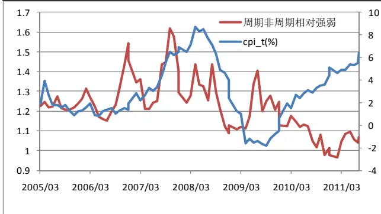
数据来源：国泰君安证券研究

图 5 ppi 与周期非周期风格轮动
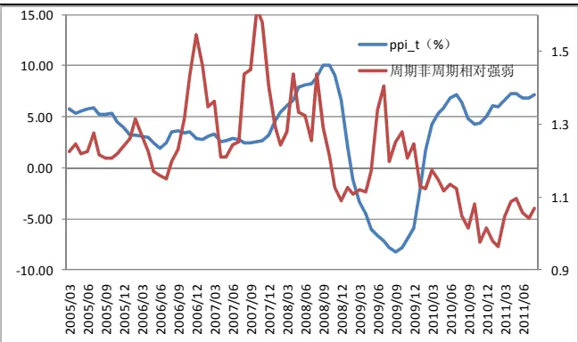
数据来源：国泰君安证券研究

3．ia 表示工业增加值，其前面系数为正说明因子越大时，周期指数更有投资价值。这是因为周期指数中很大比例是大型重工业企业和房地产企业，这些企业从工业增加值的增长中获得的收益远高于非周期指数中以轻工业和其他行业居多的企业。

4．cci 表示消费者信心指数，是反映消费者信心强弱的指标，是综合反映并量化消费者对当前经济形势评价和对经济前景、收入水平、收入预期以及消费心理状态的主观感受，是预测经济走势和消费趋向的一个先行指标，其系数为正说明经济形势较好时周期指数更有投资价值。

图 6 工业增加值与周期非周期风格轮动
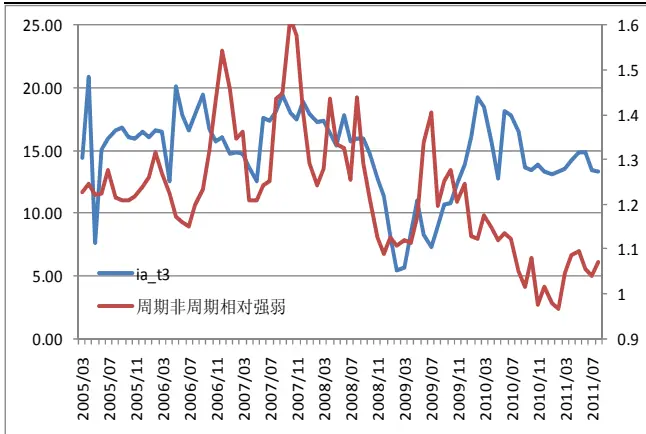
数据来源：国泰君安证券研究

图 7 消费者信心指数指数与周期非周期风格轮动
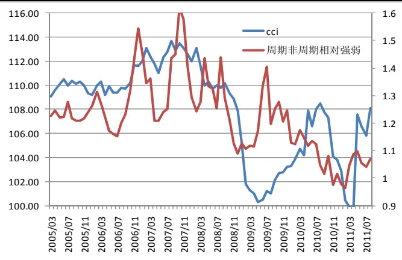
数据来源：国泰君安证券研究

5．exp表示出口总额，虽然周期行业中重工业企业与出口总额有正相关关系，但周期行业中的银行保险和房地产两大行业基本与出口无关。而非周期行业中大多轻工业企业都会得益于出口总额的增加，所以该因子前系数为负。

6．sum表示社会消费品零售总额，指批发和零售业、住宿和餐饮业以及其他行业直接售给城乡居民和社会集团的消费品零售额，所以该因子对非周期行业影响更明显。

图 8出口总额与周期非周期风格轮动
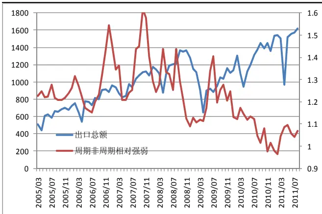
数据来源：国泰君安证券研究

图 9 消费品零售总额与周期非周期风格轮动
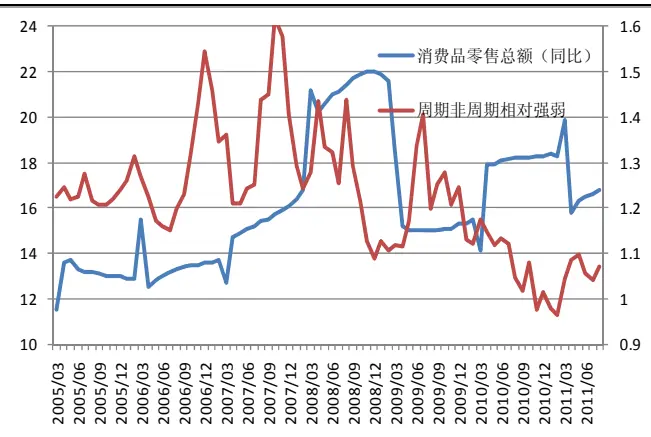
数据来源：国泰君安证券研究

用以上模型作预测，样本外滚动预测胜率 70.27%，样本外预测结果如下：

表 2 logit模型的样本外预测情况

| 日期 | 实际结果 | 预测结果 | 预测概率 | 预期走强指数相对 预期走弱指数收益 | 预期走强指数相对 上证指数收益 |
| --- | --- | --- | --- | --- | --- |
| 2008/07 | 0 | 0 | 0.16532 | 0.054391 | 0.020146 |
| 2008/08 | 1 | 0 | 0.25405 | -0.11691 | -0.06571 |
| 2008/09 | 0 | 0 | 0.11969 | 0.10149 | 0.042737 |
| 2008/10 | 0 | 0 | 0.12792 | 0.047574 | 0.011402 |
| 2008/11 | 0 | 0 | 0.31187 | 0.080129 | 0.049786 |
| 2008/12 | 0 | 0 | 0.445 | 0.033768 | 0.044963 |
| 2009/01 | 1 | 0 | 0.049257 | -0.03845 | 0.003237 |
| 2009/02 | 0 | 0 | 0.37293 | 0.018535 | 0.006528 |
| 2009/03 | 1 | 1 | 0.95557 | 0.012301 | 0.03035 |
| 2009/04 | 0 | 1 | 0.87194 | -0.00436 | -0.00675 |
| 2009/05 | 1 | 1 | 0.60157 | 0.052643 | 0.005505 |
| 2009/06 | 1 | 0 | 0.26243 | -0.15038 | -0.06353 |
| 2009/07 | 1 | 1 | 0.61667 | 0.056947 | 0.038099 |
| 2009/08 | 0 | 1 | 0.52586 | -0.12356 | -0.06898 |
| 2009/09 | 1 | 1 | 0.6062 | 0.047228 | 0.038997 |
| 2009/10 | 1 | 1 | 0.70253 | 0.02158 | 0.014045 |
| 2009/11 | 0 | 0 | 0.47895 | 0.060927 | 0.033858 |
| 2009/12 | 1 | 1 | 0.54608 | 0.032672 | 0.009379 |
| 2010/01 | 0 | 0 | 0.32769 | 0.089106 | 0.042563 |
| 2010/02 | 0 | 0 | 0.26235 | 0.006965 | 0.002803 |
| 2010/03 | 1 | 0 | 0.15518 | -0.04623 | -0.02064 |
| 2010/04 | 0 | 0 | 0.45248 | 0.022213 | 0.015086 |
| 2010/05 | 0 | 0 | 0.4378 | 0.022459 | 0.012237 |
| 2010/06 | 1 | 1 | 0.60039 | 0.012865 | 0.009985 |
| 2010/07 | 0 | 1 | 0.50028 | -0.01114 | 0.000812 |
| 2010/08 | 0 | 0 | 0.42971 | 0.068907 | 0.039188 |
| 2010/09 | 0 | 1 | 0.56532 | -0.03138 | -0.01145 |
| 2010/10 | 1 | 1 | 0.64636 | 0.0708 | 0.053675 |
| 2010/11 | 0 | 0 | 0.33791 | 0.094819 | 0.036478 |
| 2010/12 | 1 | 1 | 0.65371 | 0.037633 | 0.013622 |
| 2011/01 | 0 | 0 | 0.28206 | 0.036644 | 0.024206 |
| 2011/02 | 0 | 0 | 0.19873 | 0.014086 | 0.007679 |
| 2011/03 | 1 | 0 | 0.35601 | -0.07983 | -0.0519 |
| 2011/04 | 1 | 1 | 0.96296 | 0.037836 | 0.01772 |
| 2011/05 | 1 | 0 | 0.42781 | -0.00892 | -0.00523 |
| 2011/06 | 0 | 0 | 0.3724 | 0.038137 | 0.020441 |
| 2011/07 | 0 | 0 | 0.32651 | 0.013343 | -0.00051 |
| 2011/08 | 1 | 1 | 0.87347 | 0.025703 | 0.017389 |

数据来源：国泰君安证券研究

图 10 预测概率与收益关系图
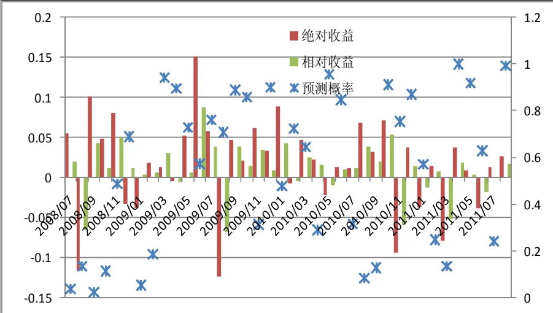
数据来源：国泰君安证券研究

从预测概率来看，概率值大多数分布在（0,1）两端，这表明，该模型的区分度很好，避免了 0.5 附近的模糊区域，70%的胜率也表明模型的稳定性比较好。

周期非周期的轮动收益如下图所示：

图 11 各种策略下的投资收益图
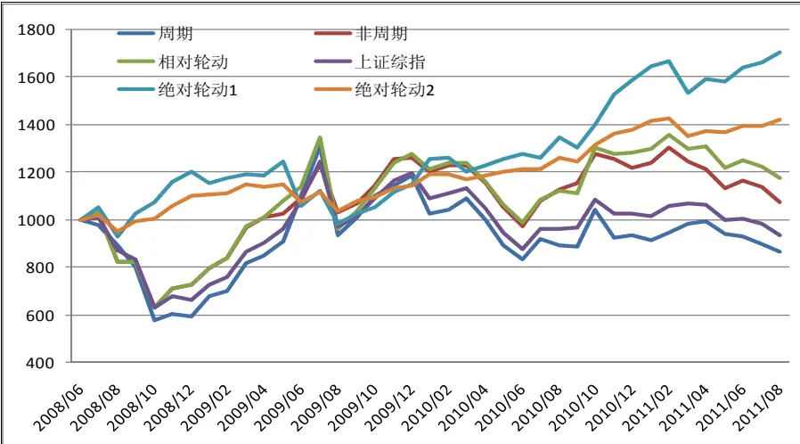
数据来源：国泰君安证券研究，注：相对风格轮动指每次都买入预期走强的指数，绝对风格轮动 1 指每次买入预期走强的指数，同时卖空预期走弱的指数，绝对风格轮动2指每次买入预期走强的指数，同时卖空上证综指。

由图 11可知，无论是相对轮动还是绝对轮动策略，都跑赢了基准指数，周期指数以及非周期指数，相对轮动的年化超额收益约 8%，而绝对轮动的年化收益可以达到 24%。

## 4. 对于未来风格轮动的判断

根据最新数据预测 9月宜买入周期股。下表列出了近三月预测的各因子敏感度分析：其中 9月适合配置周期指数的主要原因是消费者信心指数的显著上升；而 8 月配置周期指数则是由 cpi 增加和消费者信心指数增加共同作用的效果；而反观 7月的预测，则是由工业增加值和消费者信心指数的回落导致投资决策偏向非周期股。

表 3 近期各因子对周期非周期轮动的敏感性分析

|  | cpi | ppi | ia | cci | exp | sum | 预测概率 | 实际走势 |
| --- | --- | --- | --- | --- | --- | --- | --- | --- |
| 2011/07 | 0.27 | 0.02 | -0.5 | -0.43 | -0.065 | -0.03 | 0.32651 | 0 |
| 2011/08 | 1.2 | -0.2 | -0.04 | 1.27 | -0.21 | -0.05 | 0.87347 | 1 |
| 2011/09 | 0.14 | -0.3 | 0.671 | 2.106 | -0.564 | 0 | 0.88469 | ？ |

数据来源：国泰君安证券研究

## 作者简介：

刘富兵：

执业资格证书编号：S0880511010017

电话：021-38676673

邮箱：liufubing008481@gtjas.com

国泰君安金融工程分析师，上海交通大学金融工程博士，上海财经大学概率统计硕士，2008-2010 年曾供职于国金证券研究所，目前从事股指期货等衍生品及量化方面的研究。

## 蒋瑛琨：

执业资格证书编号：S0880511010023

电话：021-38676710

邮箱：jiangyingkun@gtjas.com

吉林大学数量经济学博士，CPA，国泰君安证券首席金融工程研究员。05年加入国泰君安证券，曾在衍生产品部工作，多次获中金所、深交所、中国证券业协会、中国金融学会等奖励。06年新财富“衍生品”第二名，07-08年入围新财富，2010年水晶球奖“衍生品”第四名。

## 感谢实习生邵金顺为本文作出的贡献。

## 本公司具有中国证监会核准的的证券投资咨询业务资格

## 分析师声明

作者具有中国证券业协会授予的证券投资咨询执业资格或相当的专业胜任能力，保证报告所采用的数据均来自合规渠道，分析逻辑基于作者的职业理解，本报告清晰准确地反映了作者的研究观点，力求独立、客观和公正，结论不受任何第三方的授意或影响，特此声明。

## 免责声明

本报告仅供国泰君安证券股份有限公司（以下简称“本公司”）的客户使用。本公司不会因接收人收到本报告而视其为本公司的当然客户。本报告仅在相关法律许可的情况下发放，并仅为提供信息而发放，概不构成任何广告。

本报告的信息来源于已公开的资料，本公司对该等信息的准确性、完整性或可靠性不作任何保证。本报告所载的资料、意见及推测仅反映本公司于发布本报告当日的判断，本报告所指的证券或投资标的的价格、价值及投资收入可升可跌。过往表现不应作为日后的表现依据。在不同时期，本公司可发出与本报告所载资料、意见及推测不一致的报告。本公司不保证本报告所含信息保持在最新状态。同时，本公司对本报告所含信息可在不发出通知的情形下做出修改，投资者应当自行关注相应的更新或修改。

本报告中所指的投资及服务可能不适合个别客户，不构成客户私人咨询建议。在任何情况下，本报告中的信息或所表述的意见均不构成对任何人的投资建议。在任何情况下，本公司、本公司员工或者关联机构不承诺投资者一定获利，不与投资者分享投资收益，也不对任何人因使用本报告中的任何内容所引致的任何损失负任何责任。投资者务必注意，其据此做出的任何投资决策与本公司、本公司员工或者关联机构无关。

本公司利用信息隔离墙控制内部一个或多个领域、部门或关联机构之间的信息流动。因此，投资者应注意，在法律许可的情况下，本公司及其所属关联机构可能会持有报告中提到的公司所发行的证券或期权并进行证券或期权交易，也可能为这些公司提供或者争取提供投资银行、财务顾问或者金融产品等相关服务。在法律许可的情况下，本公司的员工可能担任本报告所提到的公司的董事。

市场有风险，投资需谨慎。投资者不应将本报告为作出投资决策的惟一参考因素，亦不应认为本报告可以取代自己的判断。在决定投资前，如有需要，投资者务必向专业人士咨询并谨慎决策。

本报告版权仅为本公司所有，未经书面许可，任何机构和个人不得以任何形式翻版、复制、发表或引用。如征得本公司同意进行引用、刊发的，需在允许的范围内使用，并注明出处为“国泰君安证券研究”，且不得对本报告进行任何有悖原意的引用、删节和修改。

若本公司以外的其他机构（以下简称“该机构”）发送本报告，则由该机构独自为此发送行为负责。通过此途径获得本报告的投资者应自行联系该机构以要求获悉更详细信息或进而交易本报告中提及的证券。本报告不构成本公司向该机构之客户提供的投资建议，本公司、本公司员工或者关联机构亦不为该机构之客户因使用本报告或报告所载内容引起的任何损失承担任何责任。

## 评级说明

## 1.投资建议的比较标准

投资评级分为股票评级和行业评级。

以报告发布后的12个月内的市场表现为比较标准，报告发布日后的12个月内的公司股价（或行业指数）的涨跌幅相对同期的沪深300指数涨跌幅为基准。

## 2.投资建议的评级标准

报告发布日后的 12 个月内的公司股价（或行业指数）的涨跌幅相对同期的沪深300指数的涨跌幅。

|  | 评级 说明 |  |
| --- | --- | --- |
| 股票投资评级 | 增持 | 相对沪深300指数涨幅15%以上 |
|  | 谨慎增持 | 相对沪深300指数涨幅介于5%～15%之间 |
|  | 中性 | 相对沪深 300指数涨幅介于-5%～5% |
|  | 减持 | 相对沪深300指数下跌 5%以上 |
| 行业投资评级 | 增持 | 明显强于沪深 300指数 |
|  | 中性 | 基本与沪深 300指数持平 |
|  | 减持 | 明显弱于沪深 300 指数 |

## 国泰君安证券研究

|  | 上海 | 深圳 | 北京 |
| --- | --- | --- | --- |
| 地址 | 上海市浦东新区银城中路168号上海 银行大厦29层 | 深圳市福田区益田路6009 号新世界 商务中心34层 | 北京市西城区金融大街28号盈泰中 心2号楼10层 |
| 邮编 | 200120 | 518026 | 100140 |
| 电话 | （021)38676666 | (0755)23976888 | (010)59312799 |
|  | E-mail: gtjaresearch@gtjas.com |  |  |