# 多因子选股模型之因子分析与筛选Ⅰ：估值与财务成长类指标

# ——数量化研究系列之十七

## 蒋瑛琨

8 021-38676710

jiangyingkun@gtjas.com

编号S0880511010023

## 本报告导读：

本报告为多因子选股研究系列的第一篇，通过多角度和更细致的测算，分析了因子的有效性和稳健性，并总结归纳了一些有意义的结论，为建立多因子选股模型奠定基础。摘要：

本报告通过多角度、更严格的测算方法分析了估值类和财务成长类共 22个因子指标的有效性，给出了最全面和细致的分析结果，为构建多因子选股模型和指导实际投资提供了很多有价值的信息。

## 本文的创新之处：

（1）专注于单因子分析。通过最全面和最细化的分析，挖掘出最有效和稳健的因子。

（2）提出了更严格和更全面的度量因子有效性的方法。通过多角度、更严格的方法度量因子有效性和稳健性，确保了分析结果不受数据的偶然巧合所影响。我们从因子排序后的 TOP 20%与 BOTTOM 20%、TOP 40%与BOTTOM 40%组合的表现差异及稳定性，以及因子排名与收益率排名的相关性 3个方面来度量因子有效性。

（3）分析了不同股票池和不同市场环境下因子的有效性。为了提高各个因子在个股之间的可比性，我们分别在 HS300和ZZ500 成分股中分总体、周期类、非周期类共 6个股票池中进行因子的有效性分析。并统计分析了不同市场环境下的因子有效性，为指导实际投资提供更全面的信息。

（4）更符合实际的数据处理方式。由于上市公司财报公布的时间有滞后和差异，我们对数据进行了合理的处理，确保在历史的每个时点只使用当时可以得到的数据信息，并使指标值在个股间具有较好的可比性。

## 主要结果分析：

（1）HS300 中，首选有效因子有：PS，PCF，营业收入增长率（单季、同比），净利润增长率（单季、同比），经营现金流增长率（单季、同比），ROE 增长率（单季、同比），ROA增长率（单季、同比、TTM）。ZZ500中，首选有效因子有：PS，PB，EV/EBITDA，净利润增长率（单季）。另外，备选因子以及分周期与非周期测算的结果见表 24。

（2）市值大小对因子有效性影响显著：如 ROE、ROA 增长率在 HS300中有效性明显，而在 ZZ500中几乎无效；EV/EBITDA则反之。

（3）估值：PS最有效，PE在非周期中有效性高：总体来看，PS有效性在所有因子中最高，在周期股中相对更高；PE只在非周期中表现有效。

（4）PB熊市表现更好，财务增长率指标震荡市表现最佳。

（5）财务指标的短期增长率更有效：营业收入、净利润等财务指标的单季和同比增长率的有效性高于 TTM增长率。

（6）PE不是最小的最好，而是较小的更好。

（7）因子有效性的汇总结果见表 25。

请务必阅读正文之后的免责条款部分

## 单因子分析框架：

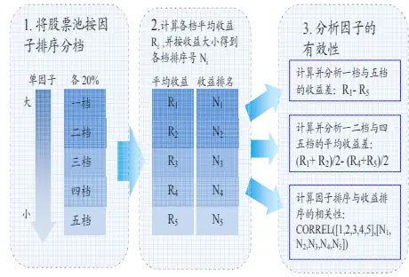

## 相关报告

《风格投资 III：A 股周期非周期风格轮动研究——数量化研究系列之十六》

2011.09.15

《基于全市场的 GARP 选股研究》——数量化研究系列之十五

2011.09.14

《基于动量和阻力测算的短线择时模型——数量化系列研究之十四》

2011.08.21

《市场情绪指数的建立及应用——数量化研究系列之十三》

2011.07.11

《基于沪深 300 成分股的动量反转选股策略——数量化系列研究之十二》

2011.05.13

## O. 多因子选股系列研究

多因子选股是量化研究中最热点的问题之一，已经有比较广泛的研究和应用。我们认为，检验和筛选出有效且稳健的因子是多因子选股模型取得良好效果的关键。

我们将开展多因子选股系列研究，前两篇报告专注于单因子分析和测算，筛选出有效且稳健的因子。我们共分析了五大类指标：估值类（7个指标）、财务成长类（15个指标）、财务质量类（10个指标）、价量类（6 个指标）、分析师预期类（2 个指标）。为了篇幅适中，我们第一篇报告分析和测算估值类和财务成长类共 22 个指标，第二篇分析财务质量、价量和分析师预期三类共 18 个指标，并且在第二篇报告内分析了财务相关的因子有效性在财报公布后的衰减规律。

在筛选出有效且稳健的因子的基础上，第三篇建立多因子综合打分的选股模型，依据不同因子的有效性和稳健性赋予不同的权重，然后根据综合得分构建股票组合，通过回溯历史，检验模型效果。

## 1. 本报告的创新之处

本篇报告作为多因子选股系列研究的第一篇，分析和测算了估值类和财务成长类共 22个指标的有效性和稳健性，有以下创新之处。

## 1.1.专注于挖掘有效因子

本报告专注于单因子分析，通过多角度和更细致的分析和测算挖掘出最有效和稳健的因子。由于只做单因子分析，暂时不做因子间的比较和综合分析，不需考虑因子的同质性或共线性等，因此我们测算了各种意义相近的指标，如 PE和不含非经常损益的 PE，财务指标的单季、同比、TTM增长率等，这样可以更好的挖掘出最具代表性和最有效的因子。

## 1.2.提出了更严格和更全面的度量因子有效性的方法

通过多角度、更严格的方法度量因子有效性和稳健性，确保了分析结果不受数据的偶然巧合所影响。在做单因子分析时，我们将股票池按因子大小排序，分为五档，通过分析各档股票的表现差异、以及各档的平均收益排名与因子排名的相关性，来度量和分析因子的有效性。目前绝大多数的研究中，分析因子有效性时，都是比较因子排名靠前 X%与靠后X%的差异，我们认为这样做有以下两点不足之处：首先，X 取多少存在较大的主观性，而且在确定 X的最优取值时可能会产生过度数据挖掘的问题；其次，单凭最前和最后的 X%的表现差异，而忽略中间大部分个股表现的信息，由此选取的有效因子可能不够可靠和稳健。

## 1.3.分析了不同股票池和不同市场环境下各因子的有效性

为了避免有些指标（如估值类）在大盘股与小盘股之间存在整体性的差异，可比性不高，我们分别在 HS300 成分股和 ZZ500 成分股中进行因子的有效性分析。进一步，为了提高各个指标的可比性，我们在 HS300和 ZZ500成分股中分别按周期与非周期行业划分，由此分为了四个股票池，分别进行单因子分析。另外，考虑到因子的有效性跟所处的市场环境有关，我们统计和分析了不同市场阶段（牛市、熊市、震荡市）的因子有效性，为构建多因子选股模型和指导实际投资提供更全面的信息。

## 1.4.更符合实际的数据处理方式

很多因子指标需要使用到财务数据，而上市公司财务报表的公布时间有一定的滞后和差异，在常用数据库（如 wind）中，历史的财务数据是按报告期更新的，如二季报的财务数据都是在 6 月 30 日更新的，而其二季报公布的时间肯定在 6 月 30 日之后。因此，直接使用这些历史数据测算不够贴近实际，我们对数据进行了合理处理，确保在历史的每个时点只使用当时可以得到的数据信息，并使指标值在个股间具有较好的可比性。

## 2. 研究思路

## 2.1. 研究框架

图 1 单因子分析框架
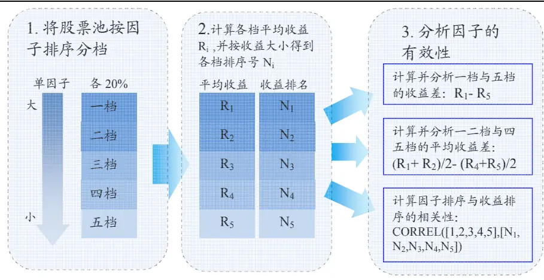
资料来源：国泰君安证券研究

## 2.2. 因子选取

## 2.2.1. 因子选取说明

我们选取了五大类因子：估值类（7个指标）、财务成长类（15个指标）、财务质量类（10 个指标）、价量类（6 个指标）、分析师预期类（2 个指标），本篇报告分析估值类和财务成长类共 22个。具体指标如表 1所示：

表 1 估值类和财务成长类指标

|  | 因子指标 | 名称 | 说明 |  |
| --- | --- | --- | --- | --- |
| 估 值 类 | PE（TTM) | 市盈率 | 市值/最近4个季度归属母公司净利润 |  |
|  |  | PEcut（TTM）扣除非经常损益的市盈率 | 市值/最近4个季度扣除非经常收益的净利润 |  |
|  |  | PEG（TTM）市盈率相对盈利增长率 | PE/最近4 个季度净利润增长率 |  |
|  | PS(TTM) | 市销率 | 市值/最近4个季度营业收入 |  |
|  | PCF（TTM）市现率 |  | 市值/最近4个季度净现金流量 |  |
|  | PB | 市净率 | 市值/当期净资产 |  |
|  |  | EV/EBITDA 企业价值倍数 | 剔除货币资金后的企业价值/最近4个季度税息折旧及摊销前利润 |  |
|  | 财 成 长 | RG-S | 营业收入增长率-单季 | 当年单季度营业收入/上年同期营业收入-1 |
|  |  | RG-P | 营业收入增长率-同比 | 当年当期营业收入/上年同期营业收入-1 |
|  |  | RG-TTM | 营业收入增长率-1年（TTM） | 最近4个季度营业收入/上期4个季度营业收入-1 |
|  |  | NPG-S | 净利润增长率-单季 | 当年单季度归属母公司利润/上年该季度归属母公司利润-1 |
| NPG-P |  | 净利润增长率-同比 | 当年当期归属母公司利润/上年同期归属母公司利润-1 |  |
| NPG-TTM |  | 净利润增长率-1年（TTM） | 最近4个季度归属母公司利润/上期4个季度归属母公司利润-1 |  |
| 务 CFG-S |  | 经营性现金流增长率-单季 | 当年单季度经营性现金流/上年该季度经营性现金流-1 |  |
| CFG-P |  | 经营性现金流增长率-同比 | 当年当期经营性现金流/上年同期经营性现金流-1 |  |
| CFG-TTM |  |  | 经营性现金流增长率-1年(TTM）最近4个季度经营性现金流/上期4个季度经营性现金流-1 |  |
| 类 ROEG-S |  | ROE增长率-单季 | (本年单季度归属母公司净利润-上年该季度归属母公司净利润)/平均净资产 |  |
| ROEG-P |  | ROE 增长率-同比 | (本年当期归属母公司净利润-上年同期归属母公司净利润)/平均净资产 |  |
|  | ROEG-TTM | ROE增长率-1年（TTM） | (最近4个季度归属母公司净利润-上期4个季度归属母公司净利润)/平均净资产 |  |
|  | ROAG-S | ROA 增长率-单季 | (本年单季度归属母公司净利润-上年同期归属母公司净利润)/平均总资产 |  |
|  | ROEG-P | ROA 增长率-同比 | (本年当期归属母公司净利润-上年同期归属母公司净利润)/平均总资产 |  |
|  | ROEG-TTM | ROA增长率-1年（TTM） | (最近4个季度归属母公司净利润-上期4个季度归属母公司净利润)/平均总资产 |  |

数据来源：国泰君安证券研究

## 2.2.2. 数据处理说明

测试区间为：HS300 股票池从 2005 年 1 月至 2011 年 6 月；ZZ500 股票池从 2007 年 1 月至 2011 年 6 月。由于 HS300 与 ZZ500 的成份股在每年1月初和 7月初进行定期调整，因此我们的股票池也每隔半年更新一次。

在计算估值指标和财务指标时，考虑到在实际当中我们无法拿到每个时点的财务数据，因此使用的是已公布的最近期财务报告的数据。具体而言，1月、2月、3月用的是上年 3季报及之前数据；4月，5月，6月，7月用的是本年 1季报和上年年报及之前数据；8月，9月用的是本年半年报及之前数据；10月，11月和 12月用的是本年 3季报及之前数据。这样虽有一定时滞，但一方面与实际情况相符，具有可操作性，另一方面也使指标更具有可比性。

另外，在分析估值类因子时，如遇指标为负值的个股，我们将其剔除。在计算财务成长类因子时，我们利用如下公式计算指标增长率：

增长率 = （本期指标-上期指标）/abs（上期指标）这样能够解决上期为负、本期转正的指标的增长率计算问题。

## 2.3.股票池的划分

## 2.3.1. 按市值特征

经典的 Fama-French 三因素模型早已表明市值对股票的收益率有显著的影响，各种主动型投资基金也常常按照投资标的的市值进行风格划分，而大、小市值股票的估值等指标存在整体性的水平差异，不具备可比性。因此我们按照市值大小对股票池进行划分。

我们以沪深 300 指数（HS300）成分股做为大市值股票池，以中证 500指数（ZZ500）的成分股做为中、小市值股票池。这样既做到了以市值大小对股票进行大致划分，同时，由于这些指数在甄选成份股时不仅考虑到市值，也考虑到流动性、近期业绩等因素，遇到公司合并、重组停牌等事项时及时将相关股票剔除，并定期调整、更新成份股。这就相当于我们的股票池已事先进行了一道清理程序，大大降低选到“黑天鹅”股票的概率，减小换股时产生的冲击成本，而且明确了我们投资组合收益的比较基准。

## 2.3.2. 按行业属性

不同行业的某些财务指标的整体差异性大，可比性不高，因此按行业属性进一步划分股票池也是有必要的。一般来说，周期类行业与非周期行业在很多财务指标上具有显著差异，因此我们按周期与非周期对股票池进行进一步划分。之所以没有把每个行业作为一个股票池是因为如果划分的过细，一方面可操作性会降低，另一方面容易造成样本数量急剧下降，统计结果可靠性会降低。

在区分周期与非周期行业的问题上，我们参考了上证周期指数（000063）与上证非周期指数（000064）的划分方法，根据证监会行业板块，将“金融”、“金属”、“交通运输”、“采掘业、”“房地产”五大类行业放在周期性行业里，其他行业放在非周期性行业里。

## 2.4. 分析因子有效性

## 2.4.1. 因子有效性的度量

## （1）测算因子有效性的步骤

Step1将股票池里的样本股票按待测因子按由高到低的顺序分成五档，各占 20%。分别计算每一档的月平均收益率。

Step2 计算两次月平均收益率差，分别是：

TOP 20%（第一档）- BOTTOM 20%（第五档），

TOP 40%（第一、二档）- BOTTOM 40%（第四、五档）。

Step3计算上述收益率差的平均值。如果平均值为正，则该因子的影响总

体是正向的，即因子值越大收益趋于越大；如果平均值为负，则反之。

Step4 计算每个因子的有效性。有效性的计算方法如下：

正向(负向)因子的有效性=月均收益率差为正（负）的月份数/总月份数。

Step5 根据每个月份五档的因子排名与对应的平均收益率排名，计算其相关系数以及显著性检验的 P值。

## （2）度量因子有效性的标准

首先，看 TOP 20%组合与 BOTTOM 20%组合的月平均收益率差是否有显著差异，如果有显著差异，说明该因子具有一定的区分度。同时，有效性比较高，才能说明该因子效果的稳健性比较好，才能确保依据该因子选取的组合胜率比较高。

其次，看 TOP 40%组合与 BOTTOM 40%组合的月平均收益率差是否显著且有效性是否较高。

最后，观察五档组合的因子排名与其下期收益率排名的相关性是否显著，越显著说明因子对收益的影响越确定。

这样从三个方面分析因子的有效性和稳健性，很大程度上确保了分析结果不受数据的偶然巧合所影响。

## 2.4.2. 按市场环境对因子有效性进行分析

考虑到不同的市场阶段和环境下，投资者的关注点或关注的指标有很大不同，指标的有效性也可能会表现出较大的差异，因此我们统计和分析了不同市场阶段（牛市、熊市和震荡市三种）的因子有效性，为构建多因子选股模型和指导实际投资提供更全面的信息。

05 年以来 HS300 的走势与 ZZ500 的走势并不完全同步，我们对市场阶段的划分如下：

HS300：

牛市：2006 年 4 月-2007 年 10 月，2008 年 11 月-2009 年 7 月

震荡：2005 年 1 月-2006 年 3 月，2009 年 8 月-2011 年 6 月

熊市：2007 年 11 月-2008 年 10 月

ZZ500：

牛市：2007 年 1 月-2007 年 9 月，2008 年 11 月-2010 年 10 月

震荡：2010 年 11 月-2011 年 6 月

熊市：2007 年 10 月-2008 年 10 月

## 3. 主要实证结果和分析

## 3.1.单因子有效性分析

## 3.1.1. 市盈率 PE（TTM）

总体来看，五档累计收益图基本呈现出 PE 较低的组合收益率较高的特征。值得注意的是，在HS300成份股中，最靠前的是第 4档、而非第 5档的股票，且其收益率大幅领先其他组，也就是说并不是 PE 最低的表现最好，而是 PE较低的表现较好。

具体来看：从市值特征看，PE 在 HS300 和 ZZ500 股票池中表现出的有效性规律相似；从行业属性看，PE在非周期股票池中的有效性明显强于周期类；从市场环境看，PE在牛市表现更好。

图 2：PE 五档累计收益-HS300
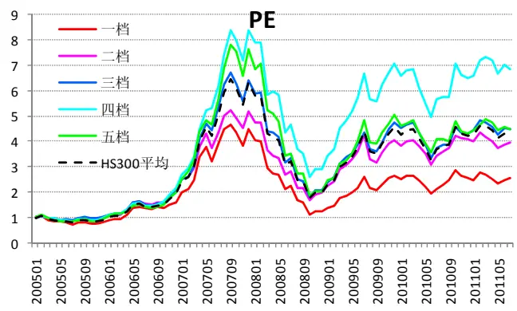
数据来源：国泰君安证券研究

图 3：PE 五档累计收益-ZZ500
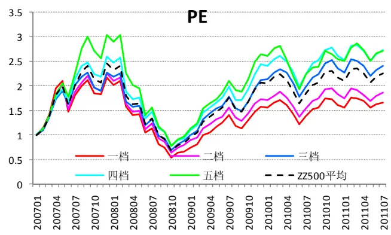
数据来源：国泰君安证券研究

表 2 PE有效性分析

| 股票池 | 市场 阶段 | 月均收益率差 |  |  |  | 因子排名与收益率排名相关性 |  |
| --- | --- | --- | --- | --- | --- | --- | --- |
|  |  | 一档-五档(%) | 有效性 | 一二档-四五档(%) | 有效性 | 相关系数 | P值 |
| HS300 总体 | 总体 | -0.76 | 49% | -0.79 | 55% | -0.08 | 0.11 |
|  | 牛市 | -2.07 | 50% | -2.13 | 64% | -0.20 | 0.02 |
|  | 熊市 | 0.20 | 67% | 0.21 | 58% | 0.11 | 0.41 |
|  | 震荡 | -0.10 | 53% | -0.11 | 53% | -0.06 | 0.45 |
| HS300 周期 | 总体 | 0.15 | 49% | -0.09 | 51% | -0.02 | 0.63 |
|  | 牛市 | -1.59 | 50% | -0.84 | 61% | -0.10 | 0.24 |
|  | 熊市 | -0.83 | 58% | -0.74 | 58% | -0.10 | 0.45 |
|  | 震荡 | 1.75 | 50% | 0.67 | 58% | 0.06 | 0.45 |
| HS300 非周期 | 总体 | -1.29 | 59% | -1.04 | 63% | -0.14 | 0.01 |
|  | 牛市 | -2.62 | 64% | -2.41 | 75% | -0.28 | 0.00 |
|  | 熊市 | 0.03 | 42% | 0.01 | 42% | -0.13 | 0.34 |
|  | 震荡 | -0.72 | 55% | -0.36 | 55% | -0.04 | 0.61 |
|  | 总体 | -0.81 | 52% | -0.73 | 54% | -0.12 | 0.04 |
| ZZ500 总体 | 牛市 | -1.25 | 58% | -1.08 | 60% | -0.22 | 0.00 |
|  | 熊市 | 0.23 | 62% | -0.10 | 46% | 0.02 | 0.90 |
|  | 震荡 | -0.71 | 50% | -0.46 | 50% | -0.03 | 0.88 |
| ZZ500 周期 | 总体 | -0.98 | 44% | -0.54 | 54% | 0.01 | 0.86 |
|  | 牛市 | -1.37 | 48% | -0.83 | 55% | 0.00 | 0.97 |

|  | 熊市 | -1.03 46% | -0.32 54% | -0.02 0.86 |
| --- | --- | --- | --- | --- |
|  | 震荡 | 0.70 75% | 0.31 50% | 0.10 0.54 |
|  | 总体 | -0.85 57% | -0.88 63% | -0.18 0.00 |
| ZZ500 | 牛市 | -1.52 70% | -1.36 76% | -0.28 0.00 |
| 非周期 | 熊市 | 0.58 69% | -0.01 31% | 0.03 0.81 |
|  | 震荡 | -0.38 50% | -0.34 63% | -0.10 0.54 |

数据来源：国泰君安证券研究

## 3.1.2. 不含非经常性损益的市盈率 PE（TTM）

总体来看，无论是 HS300 还是 ZZ500 股票池中，第 3、4、5 档的股票组合明显跑赢对应指数和 1、2 档的股票，而且和 PE 类似，并不是第 5档股票的收益率最高。

从有效性分析表中可以看出，不含非经常性损益 PE 的有效性与 PE的有效性规律相似。

图 4：不含非经常性损益 PE五档累计收益-HS300
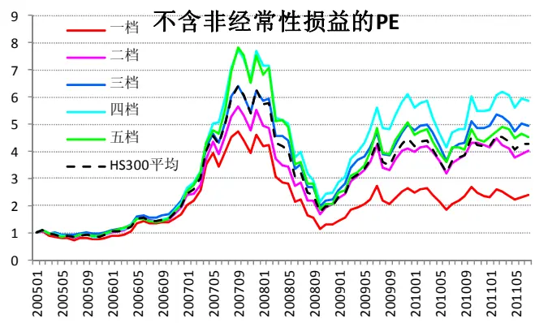
数据来源：国泰君安证券研究

图 5：不含非经常性损益 PE五档累计收益-ZZ500
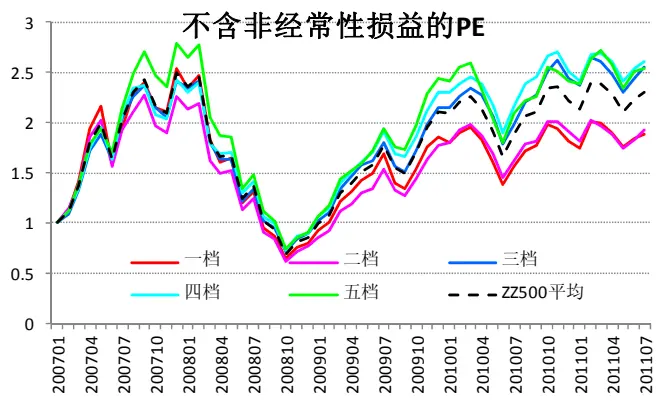
数据来源：国泰君安证券研究

表 3 不含非经常性损益 PE有效性分析

| 股票池 | 市场 | 月均收益率差 |  |  |  | 因子排名与收益率排名相关性 |  |
| --- | --- | --- | --- | --- | --- | --- | --- |
|  | 阶段 | 一档-五档(%) | 有效性 | 一二档-四五档(%) | 有效性 | 相关系数 | P值 |
| HS300 总体 | 总体 | -0.88 | 56% | -0.72 | 54% | -0.14 | 0.00 |
|  | 牛市 | -1.88 | 61% | -1.74 | 61% | -0.28 | 0.00 |
|  | 熊市 | 0.26 | 58% | 0.44 | 67% | 0.08 | 0.53 |
|  | 震荡 | -0.51 | 58% | -0.33 | 55% | -0.12 | 0.11 |
| HS300 周期 | 总体 | 0.09 | 47% | 0.06 | 54% | -0.03 | 0.60 |
|  | 牛市 | -1.50 | 57% | -0.59 | 46% | -0.07 | 0.40 |
|  | 熊市 | -0.81 | 58% | -0.34 | 58% | -0.06 | 0.66 |
|  | 震荡 | 1.55 | 53% | 0.67 | 58% | 0.02 | 0.83 |
| HS300 非周期 | 总体 | -1.84 | 62% | -1.18 | 62% | -0.17 | 0.00 |
|  | 牛市 | -3.59 | 68% | -2.33 | 68% | -0.28 | 0.00 |
|  | 熊市 | -0.05 | 58% | 0.11 | 42% | -0.13 | 0.34 |
|  | 震荡 | -1.11 | 58% | -0.73 | 58% | -0.11 | 0.15 |
| ZZ500 | 总体 | -0.42 | 48% | -0.44 | 59% | -0.05 | 0.38 |

| 总体 | 牛市 | -0.65 | 55% -0.57 | 60% | -0.13 | 0.10 |
| --- | --- | --- | --- | --- | --- | --- |
|  | 熊市 | 0.25 | 69% -0.29 | 62% | 0.05 | 0.67 |
|  | 震荡 | -0.51 | 50% -0.26 | 63% | 0.03 | 0.88 |
| ZZ500 周期 | 总体 | -1.01 | 57% -0.59 | 56% |  | -0.03 0.65 |
|  | 牛市 | -1.19 | 61% | 55% | -0.09 | 0.25 |
|  | 熊市 | -1.24 | -0.75 54% -0.69 | 54% | 0.05 | 0.67 |
|  | 震荡 | 0.11 | 50% | 38% |  | 0.54 |
|  | 总体 | -0.42 | 0.24 56% -0.53 | 56% | 0.10 -0.08 | 0.19 |
| ZZ500 非周期 | 牛市 | -0.79 |  | 58% |  |  |
|  | 熊市 | 0.40 | 64% -0.81 | 54% | -0.17 0.08 | 0.03 |
|  | 震荡 | -0.21 | 69% -0.09 63% -0.10 | 50% | 0.01 | 0.50 |
|  |  |  |  |  |  | 0.94 |

资料来源：国泰君安证券研究

## 3.1.3. 市盈率相对盈利增长率 PEG（TTM）

总体来看，HS300股票池中明显表现出 PEG越低表现越好的规律，而在ZZ500 中，收益率最高的是第 4档，其次是第 2档，而第 5档股票甚至跑不赢指数，说明中小盘股票中 PEG适中的股票表现更加出色。

具体来看：从市值特征看，PEG在 HS300中的有效性强于 ZZ500；从行业属性看，PEG在周期和非周期股票池中都表现出了有效性，但在非周期股中有效性更强；从市场环境看，PEG在熊市中无效，甚至会发出反向信号，即 PEG越低组合反而表现更差。

图 6：PEG 五档累计收益-HS300
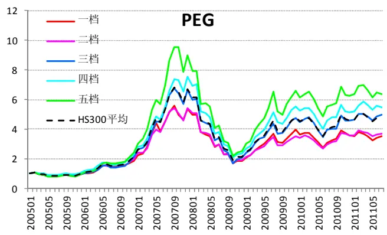
数据来源：国泰君安证券研究

图 7：PEG 五档累计收益-ZZ500
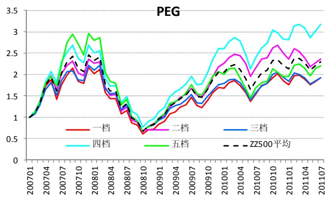
数据来源：国泰君安证券研究

表 4 PEG 有效性分析

| 股票池 | 市场 | 月均收益率差 |  |  |  | 因子排名与收益率排名相关性 |  |
| --- | --- | --- | --- | --- | --- | --- | --- |
|  | 阶段 | 一档-五档(%) | 有效性 | 一二档-四五档(%) | 有效性 | 相关系数 | P值 |
|  | 总体 | -0.99 | 55% | -0.79 | 59% | -0.11 | 0.03 |
| HS300 | 牛市 | -2.92 | 68% | -2.32 | 75% | -0.33 | 0.00 |
| 总体 | 熊市 | 1.89 | 83% | 1.60 | 83% | 0.48 | 0.00 |
|  | 震荡 | -0.47 | 58% | -0.42 | 61% | -0.13 | 0.07 |
| HS300 | 总体 | -0.30 | 53% | -0.32 | 55% | -0.04 | 0.43 |
| 周期 | 牛市 | -2.28 | 64% | -1.55 | 68% | -0.15 | 0.08 |

| HS300 非周期 | 熊市 | 1.64 | 67% | 1.25 | 58% | 0.25 0.05 |
| --- | --- | --- | --- | --- | --- | --- |
|  | 震荡 | 0.54 50% | 0.09 | 50% | -0.05 | 0.47 |
|  | 总体 | -1.54 65% | -0.88 | 63% | -0.21 | 0.00 |
|  | 牛市 | -3.36 | 75% -2.31 | 79% | -0.40 | 0.00 |
|  | 熊市 | 0.98 | 58% 1.89 | 67% | 0.25 | 0.05 |
|  | 震荡 | -1.00 66% | -0.71 | 61% | -0.22 | 0.00 |
| ZZ500 总体 | 总体 | -0.38 | 44% | -0.47 50% | -0.10 | 0.09 |
|  | 牛市 | -1.02 | 52% -0.91 | 60% | -0.19 | 0.01 |
|  | 熊市 | 1.96 | 85% 1.11 | 92% | 0.23 | 0.06 |
|  | 震荡 | -1.53 63% | -1.92 | 88% | -0.45 | 0.00 |
| ZZ500 周期 | 总体 | -0.81 | 48% | 65% | -0.06 | 0.33 |
|  | 牛市 | -1.67 55% | -1.05 -2.07 | 73% | -0.17 |  |
|  | 熊市 | 1.86 77% | 2.07 | 62% | 0.38 | 0.03 |
|  | 震荡 | -1.62 | -1.88 | 75% | -0.30 | 0.00 0.06 |
| ZZ500 非周期 | 总体 | -0.31 | 63% 50% |  | -0.10 | 0.09 |
|  | 牛市 | -0.86 61% | -0.42 | 54% 58% | -0.17 |  |
|  | 熊市 | 1.89 | -0.58 0.84 | 77% |  | 0.03 0.04 |
|  | 震荡 |  | 85% 63% |  | 0.26 |  |
|  |  | -1.61 | -1.85 | 88% | -0.43 | 0.01 |

资料来源：国泰君安证券研究

## 3.1.4. 市销率 PS（TTM）

总体来看，市销率（PS）越小的组合表现越好，这在 ZZ500中表现的尤为明显，而在 HS300中PS较小的第四档表现优于 PS最小的第五档。

具体来看：从市值特征看，PS 在 ZZ500 股票池中表现出的有效性明显优于 HS300；从行业属性看，PS在周期和非周期股票池中表现差异不大；从市场环境看，PS牛市中的有效性略强于熊市和震荡市。

图 8：PS 五档累计收益-HS300
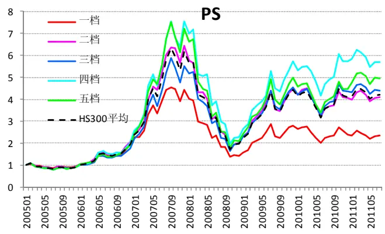
数据来源：国泰君安证券研究

图 9：PS 五档累计收益-ZZ500
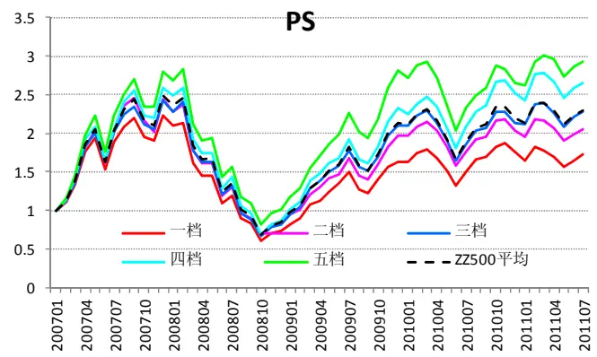
数据来源：国泰君安证券研究

表 5 PS 有效性分析

| 股票池 | 市场 | 月均收益率差 |  |  |  | 因子排名与收益率排名相关性 |  |
| --- | --- | --- | --- | --- | --- | --- | --- |
|  | 阶段 | 一档-五档(%) | 有效性 | 一二档-四五档(%) | 有效性 | 相关系数 | P值 |
| HS300 | 总体 | -1.17 | 59% | -0.89 | 59% | -0.10 | 0.05 |
| 总体 | 牛市 | -2.76 | 71% | -2.04 | 64% | -0.26 | 0.00 |
| HS300 | 熊市 | 0.06 | 58% | -0.23 | 58% | -0.06 | 0.66 |
|  | 震荡 | -0.38 | 55% | -0.26 | 55% | 0.00 | 1.00 |
|  | 总体 | -0.94 | 56% | -1.16 | 58% | -0.10 | 0.05 |
|  | 牛市 | -3.16 | 64% | -3.38 | 64% | -0.21 | 0.01 |
|  | 熊市 | 0.46 | 58% | 0.49 | 50% | 0.08 | 0.57 |
| HS300 非周期 | 震荡 | 0.26 | 45% | -0.04 | 55% | -0.08 | 0.30 |
|  | 总体 | -1.15 | 58% | -0.91 | 58% | -0.12 | 0.02 |
|  | 牛市 | -2.27 | 64% | -1.56 | 64% | -0.17 | 0.04 |
|  | 熊市 | -0.71 | 50% | -0.38 | 67% | -0.03 | 0.85 |
| ZZ500 总体 | 震荡 | -0.47 | 55% | -0.59 | 50% | -0.11 | 0.13 |
|  | 总体 | -1.14 | 63% | -0.85 | 65% | -0.24 | 0.00 |
|  | 牛市 | -1.08 | 58% | -0.92 | 69% | -0.23 | 0.00 |
|  | 熊市 | -1.06 | 77% | -0.63 | 54% | -0.28 | 0.03 |
| ZZ500 周期 | 震荡 | -1.51 | 63% | -1.06 | 75% | -0.33 | 0.04 |
|  | 总体 | -2.02 | 61% | -1.78 | 63% | -0.19 | 0.00 |
|  | 牛市 | -2.02 | 58% | -1.98 | 70% | -0.18 | 0.02 |
|  | 熊市 | -2.09 | 69% | -1.31 | 46% | -0.16 | 0.20 |
| ZZ500 | 震荡 | -1.91 | 63% | -1.68 | 63% | -0.26 | 0.10 |
|  | 总体 | -1.01 | 63% | -0.69 | 56% | -0.13 | 0.04 |
|  | 牛市 | -1.08 | 64% | -0.76 | 58% | -0.13 | 0.09 |
|  | 熊市 | -0.71 | 62% | -0.39 | 46% | -0.11 | 0.39 |
| 非周期 | 震荡 | -1.18 | 63% | -0.88 | 63% | -0.13 | 0.44 |

资料来源：国泰君安证券研究

## 3.1.5. 市现率 PCF（TTM）

总体来看，市现率（PCF）越小的组合表现越好，这规律在HS300和ZZ500中都表现非常明显。

具体来看：从市值特征看，PCF 在 HS300 和 ZZ500 股票池中表现出的有效性差异不大；从行业属性看，PCF在非周期股票池中有效性明显优于周期类；从市场环境看，PCF牛市中的有效性明显强于熊市和震荡市。

图 10：PCF 五档累计收益-HS300
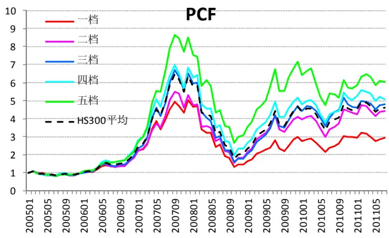
数据来源：国泰君安证券研究

图 11：PCF 五档累计收益-ZZ500
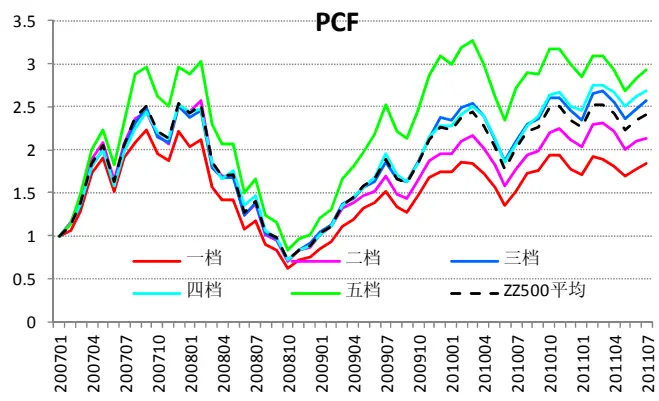
数据来源：国泰君安证券研究

表 6 PCF有效性分析

| 股票池 | 市场 | 月均收益率差 |  |  |  | 因子排名与收益率排名相关性 |  |
| --- | --- | --- | --- | --- | --- | --- | --- |
|  | 阶段 | 一档-五档(%) | 有效性 | 一二档-四五档(%) | 有效性 | 相关系数 | P值 |
| HS300 总体 | 总体 | -0.96 | 62% | -0.59 | 59% | -0.14 | 0.00 |
|  | 牛市 | -2.60 | 79% | -1.48 | 71% | -0.34 | 0.00 |
|  | 熊市 | -0.76 | 50% | -0.64 | 50% | -0.08 | 0.57 |
|  | 震荡 | 0.18 | 47% | 0.09 | 47% | -0.02 | 0.77 |
| HS300 周期 | 总体 | -0.87 | 54% | -0.45 | 55% | -0.06 | 0.25 |
|  | 牛市 | -2.59 | 68% | -1.65 | 68% | -0.22 | 0.01 |
|  | 熊市 | -1.84 | 50% | -1.03 | 67% | -0.08 | 0.57 |
|  | 震荡 | 0.71 | 55% | 0.61 | 58% | 0.06 | 0.39 |
| HS300 非周期 | 总体 | -0.98 | 55% | -0.79 | 60% | -0.09 | 0.07 |
|  | 牛市 | -1.93 | 54% | -1.47 | 64% | -0.12 | 0.15 |
|  | 熊市 | -0.37 | 50% | -0.63 | 58% | -0.02 | 0.90 |
|  | 震荡 | -0.47 | 58% | -0.34 | 58% | -0.09 | 0.21 |
|  | 总体 | -1.03 | 57% | -0.71 | 59% | -0.08 | 0.20 |
| ZZ500 总体 | 牛市 | -1.75 | 64% | -1.12 | 63% | -0.18 | 0.02 |
|  | 熊市 | -0.06 | 54% | 0.04 | 54% | 0.08 |  |
|  | 震荡 | 0.36 | 63% | -0.15 |  |  | 0.54 |
| ZZ500 周期 | 总体 | -0.40 |  |  | 75% | 0.16 | 0.32 |
|  | 牛市 |  | 52% | -0.26 | 48% | -0.03 | 0.67 |
|  | 熊市 | -0.78 0.52 | 52% | -0.54 | 45% | -0.01 | 0.88 |
|  | 震荡 |  | 46% | 0.08 | 46% | -0.07 | 0.58 |
| ZZ500 非周期 |  | -0.37 | 50% | 0.35 | 50% | -0.01 | 0.94 |
|  | 总体 | -1.16 | 65% | -0.86 | 63% | -0.18 | 0.00 |
|  | 牛市 熊市 | -2.03 | 73% | -1.31 | 73% | -0.27 | 0.00 |
|  | 震荡 | -0.11 0.76 | 62% 63% | -0.23 -0.02 | 46% 50% | -0.12 0.10 | 0.36 0.54 |

资料来源：国泰君安证券研究

## 3.1.6. 市净率 PB

总体来看，从五档累计收益图中可以看出，HS300股票池按收益率从高到低依次是 3、4、5、1、2档，其中只有第 3档明显战胜指数，可见是PB 适中的组合表现较好；ZZ500的排序则为 4、5、3、2、1档，大体呈现 PB较低表现较好的规律。

具体来看：从市值特征看，PB在 ZZ500股票池中的有效性大于 HS300；从行业属性看，PB 在周期与非周期股票池中的有效性差异不大；从市场环境看，PB 在熊市中的有效性明显强于牛市和震荡市，这是为数不多的在熊市更有效的因子。值得特别指出的是，PB 在 ZZ500 的周期类股票池的熊市阶段里表现出了很高的有效性，TOP20%- BOTTOM20%和TOP40%- BOTTOM40%的有效性均达到 85%。

图 12：PB 五档累计收益-HS300
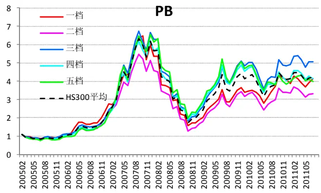
数据来源：国泰君安证券研究

图 13：PB 五档累计收益-ZZ500
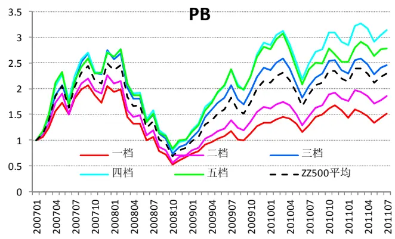
数据来源：国泰君安证券研究

表 7 PB 有效性分析

| 股票池 | 市场 | 月均收益率差 |  |  |  | 因子排名与收益率排名相关性 |  |
| --- | --- | --- | --- | --- | --- | --- | --- |
|  | 阶段 | 一档-五档(%) | 有效性 | 一二档-四五档(%) | 有效性 | 相关系数 | P值 |
|  | 总体 | -0.08 | 50% | -0.19 | 51% | -0.02 | 0.72 |
| HS300 总体 | 牛市 | -2.14 | 61% | -1.35 | 61% | -0.17 | 0.05 |
|  | 熊市 | -1.81 | 75% | -1.94 | 83% | -0.34 | 0.01 |
|  | 震荡 | 1.99 | 66% | 1.22 | 66% | 0.19 | 0.01 |
|  | 总体 | 0.20 | 51% | 0.33 | 54% | 0.04 | 0.39 |
| HS300 周期 | 牛市 | -0.72 | 43% | -0.06 | 43% | 0.04 | 0.62 |
|  | 熊市 | -3.73 | 75% | -3.41 | 75% | -0.31 | 0.02 |
|  | 震荡 | 2.12 | 55% | 1.80 | 61% | 0.16 | 0.03 |
|  | 总体 | -0.43 | 55% | -0.60 | 55% | -0.06 | 0.24 |
| HS300 非周期 | 牛市 | -3.20 | 68% | -2.15 | 57% | -0.26 |  |
|  | 熊市 | -0.31 | 58% | -0.72 | 67% | -0.19 | 0.00 |
|  | 震荡 | 1.57 | 55% | 0.58 | 50% | 0.13 | 0.14 |
|  | 总体 | -1.42 | 63% | -1.27 | 65% | -0.22 | 0.08 |
| ZZ500 总体 | 牛市 | -1.08 | 61% | -1.16 | 63% | -0.19 | 0.00 |
|  | 熊市 | -2.16 | 69% | -1.80 | 69% | -0.35 | 0.01 |
|  | 震荡 | -1.66 |  |  |  |  | 0.00 |
| ZZ500 周期 |  |  | 63% | -1.18 | 75% | -0.24 | 0.14 |
|  | 总体 | -1.04 | 63% | -1.24 | 61% | -0.16 | 0.01 |
|  | 牛市 | -0.19 | 58% | -0.88 | 58% | -0.08 | 0.28 |
|  | 熊市 | -4.02 | 85% | -3.33 | 85% | -0.52 | 0.00 |
| ZZ500 非周期 | 震荡 | 0.32 | 50% | 0.70 | 63% | 0.10 | 0.54 |
|  | 总体 | -1.62 | 61% | -1.34 | 61% | -0.21 | 0.00 |
|  | 牛市 | -1.42 | 55% | -1.34 | 58% | -0.14 | 0.07 |
|  | 熊市 | -1.83 | 77% | -1.44 | 69% | -0.35 | 0.00 |
|  | 震荡 | -2.09 | 63% | -1.14 | 63% | -0.30 | 0.06 |

资料来源：国泰君安证券研究

## 3.1.7. 企业价值倍数 EV/EBITDA

总体来看，无论是 HS300 还是 ZZ500 股票池中，都很明显地呈现出了EV/EBITDA越小的组合表现越好的规律。

具体来看：从市值特征看，EV/EBITDA 在 ZZ500 股票池中的有效性非常明显，而在 HS300 中的有效性明显弱于 ZZ500；从行业属性看，EV/EBITDA 在非周期股票池中的有效性优于周期类；从市场环境看，EV/EBITDA 在 ZZ500 中各个市场阶段都有较好的有效性，而在 HS300中牛市的有效性强于其他市场阶段。

图 14：EV/EBITDA 五档累计收益-HS300
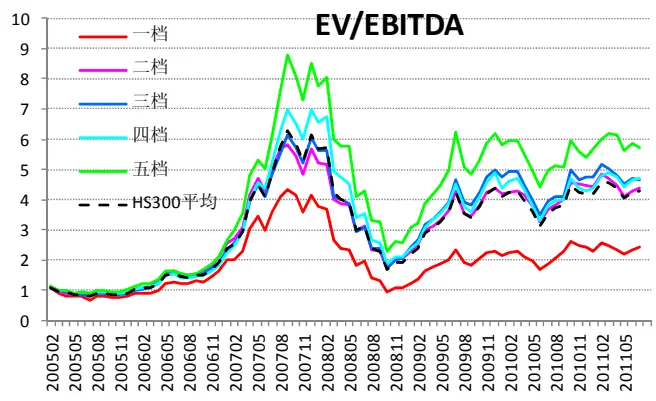
数据来源：国泰君安证券研究

图 15：EV/EBITDA 五档累计收益-ZZ500
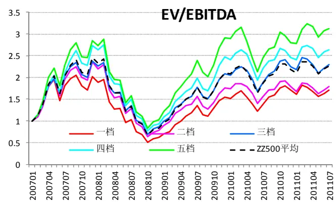
数据来源：国泰君安证券研究

表 8 EV/EBITDA 有效性分析

| 股票池 | 市场 阶段 | 月均收益率差 |  |  |  | 因子排名与收益率排名相关性 |  |
| --- | --- | --- | --- | --- | --- | --- | --- |
|  |  | 一档-五档(%) | 有效性 | 一二档-四五档(%) | 有效性 | 相关系数 | P值 |
| HS300 总体 | 总体 | -1.16 | 55% | -0.66 | 51% | -0.08 | 0.12 |
|  | 牛市 | -2.16 | 54% | -1.60 | 54% | -0.13 | 0.13 |
|  | 熊市 | -1.23 | 67% | 0.00 | 50% | -0.05 | 0.70 |
|  | 震荡 | -0.39 | 53% | -0.18 | 50% | -0.05 | 0.49 |
| HS300 周期 | 总体 | -0.70 | 53% | -0.20 | 54% | -0.05 | 0.30 |
|  | 牛市 | -1.85 | 57% | -1.10 | 64% | -0.14 | 0.10 |
|  | 熊市 | -1.95 | 42% | -0.84 | 42% | -0.01 | 0.95 |
|  | 震荡 | 0.54 | 47% | 0.66 | 50% | 0.00 | 0.97 |
| HS300 非周期 | 总体 | -1.41 | 59% | -0.84 | 58% | -0.10 | 0.05 |
|  | 牛市 | -2.22 | 57% | -1.29 | 57% | -0.10 | 0.24 |
|  | 熊市 | -1.23 | 75% | -0.12 | 50% | -0.11 | 0.41 |
|  | 震荡 | -0.87 | 55% | -0.74 | 61% | -0.09 | 0.19 |
| ZZ500 总体 | 总体 | -1.16 | 63% | -0.96 | 65% | -0.26 | 0.00 |
|  | 牛市 | -1.05 | 64% | -1.06 | 63% | -0.26 | 0.00 |
|  | 熊市 | -1.34 | 69% | -0.79 | 77% | -0.35 | 0.00 |
|  | 震荡 | -1.29 | 50% | -1.12 | 63% | -0.20 | 0.22 |
| ZZ500 周期 | 总体 |  |  |  |  |  |  |
|  | 牛市 | -1.47 | 63% | -0.69 | 56% | -0.10 | 0.11 |
|  | 熊市 | -1.30 | 61% | -0.36 | 55% | -0.05 | 0.49 |
|  | 震荡 | -3.14 | 85% | -2.11 | 62% | -0.38 | 0.00 |
| ZZ500 非周期 |  | 0.53 | 63% | 0.22 | 50% | 0.18 | 0.28 |
|  | 总体 | -1.00 | 65% | -1.06 | 72% | -0.28 | 0.00 |
|  | 牛市 熊市 | -1.07 | 67% | -1.25 | 76% | -0.32 | 0.00 0.08 |
|  | 震荡 | -0.66 -1.28 | 62% 63% | -0.48 -1.19 | 69% 63% | -0.22 -0.19 | 0.25 |

资料来源：国泰君安证券研究

## 3.1.8. 营业收入增长率—单季

总体来看，单季营业收入增长率越高的组合表现越好，但在 ZZ500股票池中的区分度不是很高。

具体来看：从市值特征看，单季营业收入增长率在 HS300股票池中的区分度明显大于 ZZ500；从行业属性看，周期与非周期股票池中的有效性差异不大；从市场环境看，单季营业收入增长率在震荡市表现出更好的有效性。

图 16：营业收入单季增长率五档累计收益-HS300
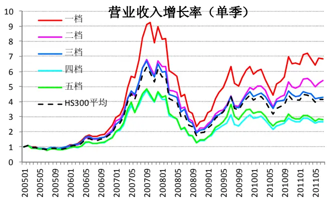
数据来源：国泰君安证券研究

图 17：营业收入单季增长率五档累计收益-ZZ500
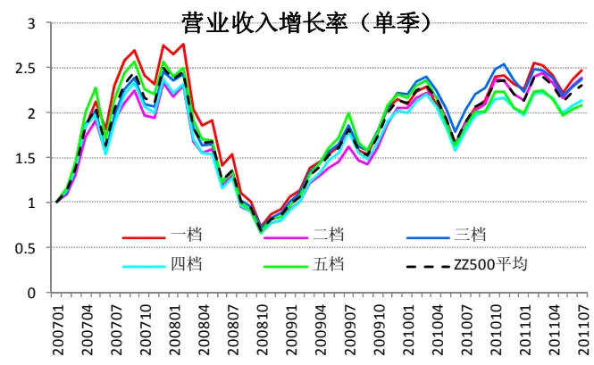
数据来源：国泰君安证券研究

表 9 营业收入单季增长率有效性分析

| 股票池 | 市场 | 月均收益率差 |  |  |  | 因子排名与收益率排名相关性 |  |
| --- | --- | --- | --- | --- | --- | --- | --- |
|  | 阶段 | 一档-五档(%) | 有效性 | 一二档-四五档(%) | 有效性 | 相关系数 | P值 |
|  | 总体 | 1.12 | 64% | 1.02 | 67% | 0.22 | 0.00 |
| HS300 | 牛市 | 0.99 | 57% | 0.64 | 61% | 0.13 | 0.12 |
| 总体 | 熊市 | -0.58 | 58% | 0.15 | 50% | -0.01 | 0.95 |
|  | 震荡 | 1.75 | 76% | 1.57 | 76% | 0.35 | 0.00 |
| HS300 周期 | 总体 | 1.46 | 64% | 0.93 | 65% | 0.19 | 0.00 |
|  | 牛市 | 2.24 | 82% | 0.54 | 54% | 0.20 | 0.02 |
|  | 熊市 | -0.93 | 58% | -0.09 | 42% | 0.00 | 1.00 |
|  | 震荡 | 1.64 | 58% | 1.55 | 76% | 0.23 | 0.00 |
| HS300 非周期 | 总体 | 0.96 | 60% | 0.77 | 60% | 0.15 | 0.00 |
|  | 牛市 | 0.41 | 54% | 0.33 | 46% | 0.05 | 0.53 |
|  | 熊市 | 0.42 | 67% | 0.37 | 58% | 0.11 | 0.41 |
|  | 震荡 | 1.53 | 63% | 1.23 | 71% | 0.24 | 0.00 |
|  | 总体 | 0.20 | 56% | 0.18 | 56% | 0.07 | 0.28 |
| ZZ500 总体 | 牛市 | 0.02 | 55% | 0.08 | 57% | 0.03 | 0.71 |
|  | 熊市 | 0.07 | 46% | 0.22 | 46% | 0.05 | 0.67 |
|  | 震荡 | 1.12 | 75% | 0.75 | 75% | 0.36 | 0.02 |
| ZZ500 | 总体 | 0.14 | 57% | -0.17 | 41% | 0.07 |  |
| 周期 | 牛市 | -0.22 | 45% | -0.39 | 45% | 0.05 | 0.25 0.56 |

|  | 熊市 | 0.19 | 54% | -0.14 | 38% | 0.02 0.86 |
| --- | --- | --- | --- | --- | --- | --- |
|  | 震荡 | 1.53 | 75% | 0.71 | 75% | 0.25 0.12 |
| ZZ500 | 总体 | 0.36 | 54% | 0.24 | 57% | 0.13 0.03 |
|  | 牛市 | 0.25 | 52% | 0.11 | 55% | 0.07 0.35 |
|  | 熊市 | 0.21 | 46% | 0.25 | 54% | 0.10 0.43 |
| 非周期 | 震荡 | 1.01 | 75% | 0.72 | 75% | 0.41 0.01 |

资料来源：国泰君安证券研究

## 3.1.9. 营业收入增长率—同比

无论是总体来看还是具体分市值、行业属性和市场环境来看，营业收入同比增长率与单季增长率的规律相似。

图 18：营业收入同比增长率五档累计收益-HS300
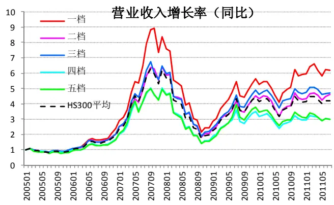
数据来源：国泰君安证券研究

图 19：营业收入同比增长率五档累计收益-ZZ500
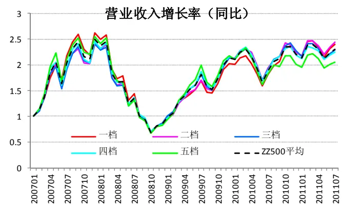
数据来源：国泰君安证券研究

表 10 营业收入同比增长率有效性分析

| 股票池 | 市场 | 月均收益率差 |  |  |  |  |
| --- | --- | --- | --- | --- | --- | --- |
|  | 阶段 | 一档-五档(%) 有效性 | 一二档-四五档(%) | 有效性 | 相关系数 | P值 |
|  | 总体 | 0.90 | 63% | 0.71 64% | 0.16 | 0.00 |
| HS300 | 牛市 | 0.69 | 54% 0.39 | 57% | 0.05 | 0.53 |
| 总体 | 熊市 | -0.84 | 50% | -0.43 50% | -0.08 | 0.53 |
| HS300 周期 | 震荡 | 1.61 | 74% | 1.31 | 74% | 0.32 0.00 |
|  | 总体 | 0.90 | 67% 0.42 | 58% | 0.12 | 0.02 |
|  | 牛市 | 0.86 | 71% | 0.04 50% | 0.07 | 0.40 |
|  | 熊市 | -0.92 | 58% -0.86 | 58% | -0.06 | 0.66 |
| HS300 非周期 | 震荡 | 1.51 | 71% | 1.10 | 68% | 0.21 0.00 |
|  | 总体 | 0.86 | 63% 0.58 | 62% | 0.14 | 0.00 |
|  | 牛市 | 0.38 | 50% | 0.19 54% | 0.02 | 0.80 |
|  | 熊市 | 0.40 | 75% 0.07 | 58% | 0.10 | 0.45 |
|  | 震荡 | 1.36 | 68% | 1.02 68% | 0.25 | 0.00 |
|  | 总体 | 0.17 | 57% | 0.13 48% | 0.07 | 0.26 |
| ZZ500 | 牛市 | 0.04 | 61% | 0.02 46% | 0.05 | 0.50 |
| 总体 | 熊市 | -0.02 | 54% | 0.04 38% | -0.04 | 0.76 |
|  | 震荡 | 1.05 | 63% | 0.98 75% | 0.36 | 0.02 |
| ZZ500 | 总体 | 0.08 | 50% | 0.18 | 57% | 0.01 0.86 |
| 周期 | 牛市 | -0.19 | 52% | -0.08 45% | -0.02 | 0.76 |
|  | 熊市 | 0.25 | 46% | 0.22 | 62% -0.08 | 0.54 |
|  | 震荡 |  |  |  | 63% |  |
| ZZ500 非周期 | 总体 | 0.92 | 63% | 1.20 | 0.30 | 0.06 |
|  | 牛市 | 0.25 0.05 | 50% 48% | 0.08 | 52% 0.04 48% | 0.52 |
|  | 熊市 | 0.20 | 38% | -0.06 | -0.02 | 0.82 |
|  | 震荡 | 1.15 | 75% | -0.02 0.82 | 62% 0.00 75% 0.34 | 1.00 0.03 |

资料来源：国泰君安证券研究

## 3.1.10.营业收入增长率—1 年（TTM）

总体来看，1 年营业收入增长率（TTM）较高的组合收益表现偏好，但并不明显。

具体来看：从市值特征看，指标在 HS300 和 ZZ500 股票池中的有效性差异不大，均不明显；从行业属性看，非周期股票池中的有效性稍强；从市场环境看，依然是在震荡市表现出更好的有效性。

图 20：营业收入 TTM增长率五档累计收益-HS300
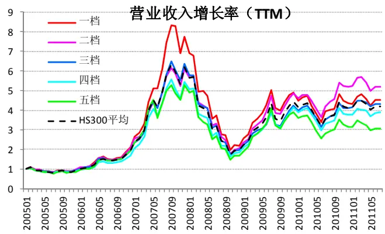
数据来源：国泰君安证券研究

图 21：营业收入 TTM 增长率五档累计收益-ZZ500
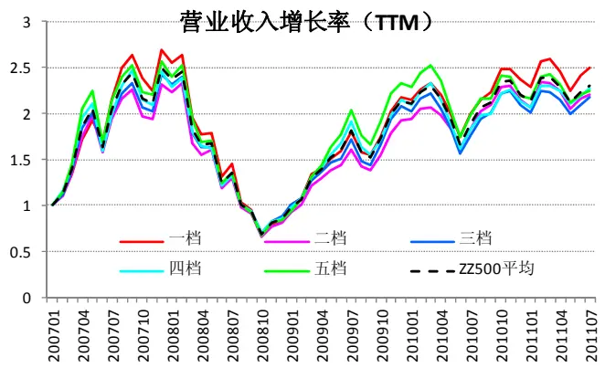
数据来源：国泰君安证券研究

表 11 营业收入 TTM增长率有效性分析

| 股票池 | 市场 | 月均收益率差 |  |  |  | 因子排名与收益率排名相关性 |  |
| --- | --- | --- | --- | --- | --- | --- | --- |
|  | 阶段 | 一档-五档(%) | 有效性 | 一二档-四五档(%) | 有效性 | 相关系数 | P值 |
| HS300 总体 | 总体 | 0.47 | 51% | 0.41 | 56% | 0.10 | 0.05 |
|  | 牛市 | 0.57 | 50% | 0.42 | 57% | 0.07 | 0.43 |
|  | 熊市 | -0.96 | 67% | -0.74 | 67% | -0.27 | 0.04 |
|  | 震荡 | 0.85 | 58% | 0.77 | 63% | 0.23 | 0.00 |
| HS300 周期 | 总体 | 0.24 | 54% | 0.20 | 50% | 0.01 | 0.88 |
|  | 牛市 | 0.29 | 50% | 0.61 | 50% | 0.00 | 0.97 |
|  | 熊市 | -0.62 | 58% | -0.95 | 50% | -0.13 | 0.34 |
|  | 震荡 | 0.48 | 61% | 0.26 | 50% | 0.05 | 0.47 |
| HS300 非周期 | 总体 | 0.51 | 58% | 0.38 | 60% | 0.09 | 0.07 |
|  | 牛市 | 0.46 | 50% | 0.11 | 57% | 0.01 | 0.87 |
|  | 熊市 | -0.32 | 42% | -0.39 | 50% | -0.06 | 0.66 |
|  | 震荡 | 0.82 | 63% | 0.83 | 66% | 0.19 | 0.01 |
| ZZ500 总体 | 总体 | 0.07 | 54% -0.03 | 56% | -0.01 | 0.90 |  |
|  | 牛市 | 0.11 | 52% -0.06 | 51% | -0.02 | 0.76 |  |
|  | 熊市 | -0.55 | 54% -0.05 | 62% | -0.08 | 0.54 |  |
|  | 震荡 | 0.89 | 75% 0.16 | 38% | 0.21 | 0.19 |  |
| ZZ500 周期 | 总体 | 0.66 | 52% -0.08 | 54% | -0.03 | 0.59 |  |
|  | 牛市 | 0.91 | 48% -0.20 | 55% | -0.07 | 0.39 |  |
|  | 熊市 | 0.24 | 46% 0.21 | 46% | -0.01 | 0.95 |  |
|  | 震荡 | 0.34 | 75% -0.09 | 50% | 0.06 | 0.70 |  |
| ZZ500 非周期 | 总体 |  |  | -0.03 56% | 0.01 | 0.86 |  |
|  | 牛市 | 0.14 0.21 | 52% | 55% | 0.01 |  |  |
|  | 熊市 | -0.63 | 55% -0.02 62% -0.20 | 69% | -0.07 | 0.91 0.58 |  |
|  | 震荡 | 1.10 | 63% | 0.21 63% | 0.15 | 0.36 |  |

资料来源：国泰君安证券研究

## 3.1.11.净利润增长率—单季

总体来看，单季净利润增长率越高的组合表现越好，但在 ZZ500股票池中的区分度不是很高。这与单季营业收入增长率类似。从有效性看，该因子的有效性强于单季营业收入增长率。

具体来看：从市值特征看，单季净利润增长率在 HS300股票池中的区分度明显大于 ZZ500；从行业属性看，周期与非周期股票池中的有效性均较明显，差异不大；从市场环境看，熊市的效果稍差。

图 22：净利润单季增长率五档累计收益-HS300
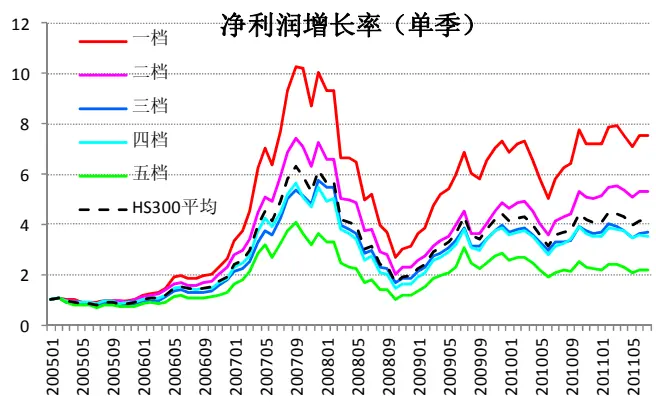
数据来源：国泰君安证券研究

图 23：净利润单季增长率五档累计收益-ZZ500
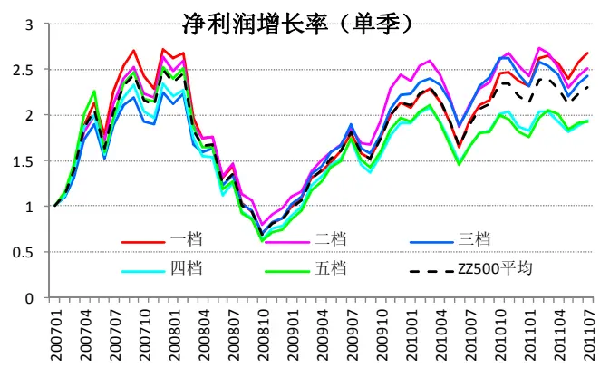
数据来源：国泰君安证券研究

表 12 净利润单季增长率有效性分析

| 股票池 | 市场 阶段 | 月均收益率差 |  |  |  | 因子排名与收益率排名相关性 |  |
| --- | --- | --- | --- | --- | --- | --- | --- |
|  |  | 一档-五档(%) | 有效性 | 一二档-四五档(%) | 有效性 | 相关系数 | P值 |
| HS300 总体 | 总体 | 1.59 | 73% | 1.02 | 65% | 0.28 | 0.00 |
|  | 牛市 | 1.62 | 79% | 0.66 | 64% | 0.25 | 0.00 |
|  | 熊市 | -0.53 | 75% | -0.21 | 67% | -0.15 | 0.25 |
| HS300 | 震荡 | 2.24 | 84% | 1.68 | 76% | 0.43 | 0.00 |
|  | 总体 | 0.84 | 59% | 0.59 | 60% | 0.19 | 0.00 |
| 周期 | 牛市 | 0.44 | 68% | 0.29 | 61% | 0.18 | 0.04 |
| 非周期 | 熊市 | -1.46 | 75% | -1.17 | 58% | -0.17 | 0.20 |
| HS300 | 震荡 | 1.86 | 63% | 1.37 | 66% 0.31 |  | 0.00 |
|  | 总体 | 2.15 | 73% | 1.24 | 69% | 0.28 | 0.00 |
|  | 牛市 | 2.51 | 71% | 1.10 | 64% | 0.21 | 0.01 |
|  | 熊市 | 0.40 | 58% | 0.37 | 50% | 0.06 | 0.66 |
|  | 震荡 | 2.44 | 79% | 1.62 | 79% | 0.39 | 0.00 |
| ZZ500 总体 | 总体 | 0.48 | 63% | 0.42 | 56% | 0.15 | 0.01 |
|  | 牛市 | 0.44 | 61% | 0.44 | 51% | 0.13 | 0.08 |
|  | 熊市 | 0.13 | 62% | 0.38 | 69% | 0.16 | 0.20 |
|  | 震荡 | 1.19 | 75% | 0.49 | 50% | 0.28 | 0.09 |
|  | 总体 | 0.14 | 48% | 0.07 | 46% | 0.04 | 0.52 |
| ZZ500 周期 | 牛市 | 0.18 | 48% | 0.40 | 52% | 0.04 | 0.62 |
|  | 熊市 | -0.84 | 62% | -1.10 | 69% | -0.02 | 0.90 |
|  | 震荡 | 1.54 | 63% | 0.62 | 50% | 0.13 | 0.44 |
|  | 总体 | 0.62 | 69% | 0.56 | 61% | 0.20 | 0.00 |
| ZZ500 非周期 | 牛市 |  |  |  |  |  |  |
|  | 熊市 | 0.51 | 70% | 0.45 | 61% | 0.18 | 0.02 |
|  | 震荡 | 0.50 | 62% | 0.84 | 62% | 0.18 | 0.16 |
|  |  | 1.26 | 75% | 0.56 | 63% | 0.30 | 0.06 |

资料来源：国泰君安证券研究

## 3.1.12.净利润增长率—同比

总体来看，净利润同比增长率与单季增长率相似，只是在 HS300股票池里，净利同比增长率最大的第 1档股票组合大幅跑赢指数和其他各档组合。

具体来看：从市值特征看，净利润同比增长率在 HS300股票池中的有效性大于 ZZ500；从行业属性看，非周期中的有效性更强；从市场环境看，牛市和震荡市优于熊市。

图 24：净利润同比增长率五档累计收益-HS300
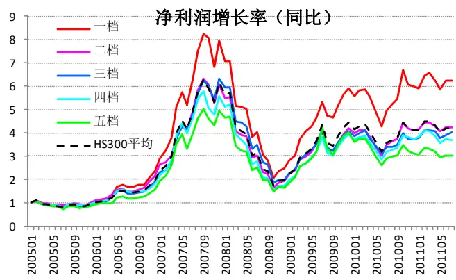
数据来源：国泰君安证券研究

图 25：净利润同比增长率五档累计收益-ZZ500
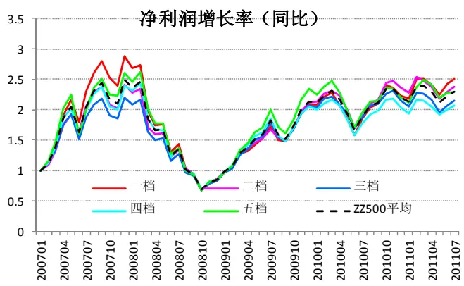
数据来源：国泰君安证券研究

表 13 净利润同比增长率有效性分析

| 股票池 | 市场 阶段 | 月均收益率差 |  |  |  | 因子排名与收益率排名相关性 |  |
| --- | --- | --- | --- | --- | --- | --- | --- |
|  |  | 一档-五档(%) | 有效性 | 一二档-四五档(%) | 有效性 | 相关系数 | P值 |
| HS300 总体 | 总体 | 0.92 | 63% | 0.52 | 64% | 0.20 | 0.00 |
|  | 牛市 | 0.46 | 64% | 0.14 | 64% | 0.17 | 0.04 |
|  | 熊市 | -0.88 | 75% | -0.64 | 58% | -0.19 | 0.14 |
|  | 震荡 | 1.82 | 74% | 1.17 | 71% | 0.34 | 0.00 |
| HS300 周期 | 总体 | 0.35 | 63% | 0.12 | 56% | 0.09 | 0.07 |
|  | 牛市 | -1.10 | 36% | -0.52 | 46% | 0.04 | 0.64 |
|  | 熊市 | -0.21 | 58% | -0.70 | 58% | -0.18 | 0.18 |
|  | 震荡 | 1.59 | 68% | 0.84 | 63% | 0.21 | 0.00 |
| HS300 非周期 | 总体 | 1.26 | 64% | 0.68 | 65% | 0.19 | 0.00 |
|  | 牛市 | 1.83 | 64% | 0.40 | 57% | 0.18 | 0.03 |
|  | 熊市 | -1.19 | 58% | -0.36 | 50% | -0.14 | 0.28 |
|  | 震荡 | 1.62 | 71% | 1.21 | 76% | 0.29 | 0.00 |
| ZZ500 总体 | 总体 | 0.07 | 50% | 0.10 | 52% | 0.01 | 0.93 |
|  | 牛市 | 0.27 | 52% | 0.35 | 57% | 0.05 | 0.55 |
|  | 熊市 | -1.01 | 69% | -0.70 | 62% | -0.21 | 0.10 |
|  | 震荡 | 1.02 | 75% | 0.59 | 63% | 0.29 | 0.07 |
| ZZ500 周期 | 总体 | -0.09 | 54% | 0.46 |  |  | 0.88 |
|  | 牛市 | 0.08 |  |  | 50% | -0.01 |  |
|  | 熊市 | -1.39 | 48% | 0.87 -0.91 | 55% | 0.05 | 0.54 |
|  | 震荡 | 1.33 | 69% |  | 69% | -0.24 | 0.06 |
| ZZ500 非周期 | 总体 |  | 63% | 0.96 | 63% | 0.13 | 0.44 |
|  | 牛市 | -0.05 | 52% | 0.02 | 56% | 0.01 | 0.90 |
|  | 熊市 | 0.06 -0.88 | 52% | 0.12 -0.58 | 58% 62% | 0.03 -0.22 | 0.73 0.07 |
|  | 震荡 | 0.83 | 69% 63% | 0.56 | 75% | 0.30 | 0.06 |

资料来源：国泰君安证券研究

## 3.1.13.净利润增长率—1 年（TTM）

总体来看，HS300股票池中按收益率从高到低依次是 1、4、2、3、5档，没有明显规律；ZZ500的排序更加混乱，为 5、4、1、3、2档。不过在HS300 中净利润增长率最高的第一档表现明显强于其他组合和市场指数。

简单总结一下，我们发现无论是营业收入还是净利润，从它们单季、同比和 TTM 增长率的有效性来看，市场更在乎的是企业短期业绩的爆发力（单季、同比的有效性更强），而对中长期的历史业绩增长率则似乎没那么关注（TTM 的有效性不明显），这一点在中小盘股票（ZZ500）中体现的尤为突出。

图 26：净利润 TTM增长率五档累计收益-HS300
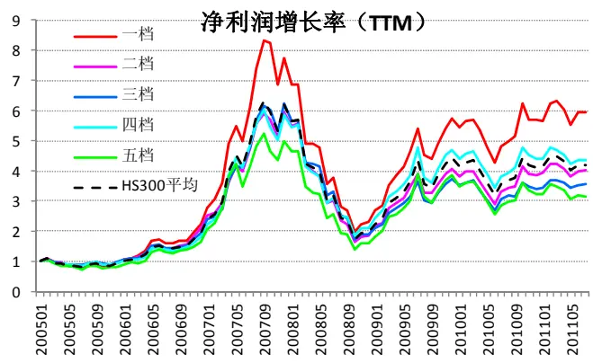
数据来源：国泰君安证券研究

图 27：净利润 TTM增长率五档累计收益-ZZ500
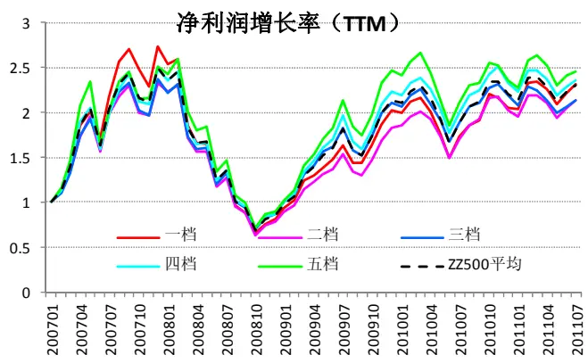
数据来源：国泰君安证券研究

表 14 净利润 TTM 增长率有效性分析

| 股票池 | 市场 阶段 | 月均收益率差 |  |  |  | 因子排名与收益率排名相关性 |  |
| --- | --- | --- | --- | --- | --- | --- | --- |
|  |  | 一档-五档(%) | 有效性 | 一二档-四五档(%) | 有效性 | 相关系数 | P值 |
| HS300 总体 | 总体 | 0.78 | 59% | 0.31 | 59% | 0.12 | 0.02 |
|  | 牛市 | 0.52 | 57% | 0.02 | 61% | 0.09 | 0.29 |
|  | 熊市 | -1.02 | 75% | -1.19 | 83% | -0.31 | 0.02 |
|  | 震荡 | 1.55 | 71% | 1.00 | 71% | 0.28 | 0.00 |
| HS300 周期 | 总体 | 0.24 | 54% | -0.14 | 47% | 0.03 | 0.53 |
|  | 牛市 | -0.09 | 54% | -0.17 | 43% | 0.05 | 0.59 |
|  | 熊市 | -0.68 | 58% | -1.44 | 50% | -0.19 | 0.14 |
|  | 震荡 | 0.78 | 63% | 0.30 | 50% | 0.09 | 0.21 |
|  | 总体 | 0.86 | 58% | 0.45 | 60% | 0.11 | 0.03 |
| HS300 非周期 | 牛市 | 0.59 | 54% | 0.23 | 46% | 0.06 | 0.45 |
|  | 熊市 | -0.90 | 75% | -0.93 | 58% | -0.25 | 0.05 |
|  | 震荡 | 1.60 | 71% | 1.05 | 76% | 0.26 | 0.00 |
| ZZ500 总体 | 总体 | -0.25 | 46% | -0.24 | 50% | 0.00 | 0.98 |
|  | 牛市 | 0.11 | 52% | -0.04 | 49% | 0.03 | 0.68 |
|  | 熊市 | -2.03 | 62% | -1.21 | 69% | -0.32 | 0.01 |
|  | 震荡 | 1.17 | 88% | 0.90 | 88% | 0.50 | 0.00 |
| ZZ500 周期 | 总体 | 0.35 | 50% | 0.27 | 56% | 0.05 | 0.41 |
|  | 牛市 | 0.86 | 48% | 0.73 | 61% | 0.08 |  |
|  | 熊市 | -1.37 | 62% | -1.19 | 69% | -0.12 | 0.28 0.33 |
|  | 震荡 | 1.04 | 75% | 0.76 | 75% | 0.19 | 0.25 |
| ZZ500 非周期 | 总体 | -0.35 | 48% | -0.29 | 48% | -0.03 | 0.61 |
|  | 牛市 | -0.07 | 52% | -0.28 | 55% | -0.04 | 0.59 |
|  | 熊市 | -2.10 | 62% | -1.14 | 62% | -0.28 | 0.02 |
|  | 震荡 | 1.37 | 88% | 1.01 | 100% | 0.43 | 0.01 |

资料来源：国泰君安证券研究

## 3.1.14.经营性现金流增长率—单季

总体来看，经营性现金流单季增长率较高的组合表现较好，但各档的表现区分度不是很高。

具体来看：从市值特征看，经营性现金流单季增长率在 HS300股票池中的有效性稍大于 ZZ500；从行业属性看，在 HS300的周期类中的有效性较好，而在 ZZ500的非周期中的有效性较好；从市场环境看，震荡市的因子有效性较高。

图 28：经营现金流单季增长率五档累计收益-HS300
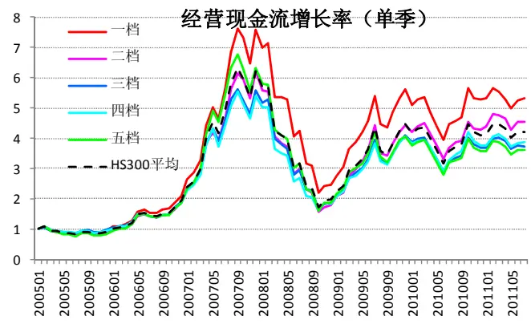
数据来源：国泰君安证券研究

图 29：经营现金流单季增长率五档累计收益-ZZ500
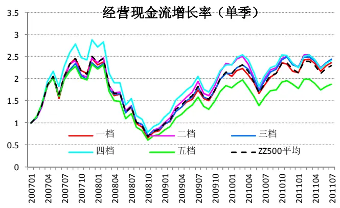
数据来源：国泰君安证券研究

表 15 经营现金流单季增长率有效性分析

| 股票池 | 市场 阶段 | 月均收益率差 |  |  |  | 因子排名与收益率排名相关性 |  |
| --- | --- | --- | --- | --- | --- | --- | --- |
|  |  | 一档-五档(%) | 有效性 | 一二档-四五档(%) | 有效性 | 相关系数 | P值 |
| HS300 总体 | 总体 | 0.45 | 65% | 0.36 | 59% | 0.16 | 0.00 |
|  | 牛市 | 0.19 | 61% | 0.74 | 61% | 0.13 | 0.12 |
|  | 熊市 | 0.76 | 75% | -0.37 | 33% | 0.16 | 0.23 |
|  | 震荡 | 0.54 | 66% | 0.31 | 55% | 0.18 | 0.01 |
| HS300 周期 | 总体 | 0.66 | 58% | 0.49 | 63% | 0.14 | 0.00 |
|  | 牛市 | 0.25 | 54% | 0.88 | 68% | 0.15 | 0.08 |
|  | 熊市 | 0.72 | 50% | -0.55 | 42% | 0.02 | 0.90 |
|  | 震荡 | 0.95 | 63% | 0.54 | 61% | 0.18 | 0.01 |
| HS300 非周期 | 总体 | 0.31 | 56% | 0.22 | 56% | 0.05 | 0.32 |
|  | 牛市 | 0.12 | 54% | 0.39 | 57% | 0.04 | 0.64 |
|  | 熊市 | 0.95 | 67% | 0.12 | 58% | 0.08 | 0.57 |
|  | 震荡 | 0.26 | 55% | 0.12 | 55% | 0.05 | 0.49 |
| ZZ500 总体 | 总体 | 0.47 | 59% | 0.24 | 59% | 0.12 | 0.04 |
|  | 牛市 | 0.54 | 61% | 0.18 | 54% | 0.11 | 0.13 |
|  | 熊市 | 0.15 | 46% | 0.35 | 69% | 0.06 | 0.63 |
|  | 震荡 | 0.69 | 75% | 0.44 | 63% | 0.31 | 0.05 |
| ZZ500 周期 | 总体 | -0.12 |  | -0.44 |  | -0.09 | 0.12 |
|  | 牛市 |  | 59% |  | 57% |  |  |
|  | 熊市 | 0.29 -0.69 | 39% | -0.62 | 61% | -0.10 | 0.22 |
|  | 震荡 | -0.88 | 54% | -0.31 | 62% | -0.05 | 0.72 |
| ZZ500 非周期 | 总体 |  | 63% | 0.06 | 63% | -0.16 | 0.32 0.02 |
|  | 牛市 | 0.62 | 65% | 0.42 | 59% | 0.14 |  |
|  | 熊市 | 0.62 0.25 | 67% 54% | 0.34 0.49 | 58% 54% | 0.10 0.09 | 0.19 0.46 |
|  | 震荡 | 1.22 | 75% | 0.62 | 75% | 0.36 | 0.02 |

资料来源：国泰君安证券研究

## 3.1.15.经营性现金流增长率-同比

总体来看，经营性现金流同比增长率在 HS300中的有效性较好，区分度明显，但在 ZZ500 中各档的表现较为无序。

具体从市值特征、行业属性和市场环境来看，经营现金流同比增长率与单季增长率的规律较为一致。

图 30：经营现金流同比增长率五档累计收益-HS300
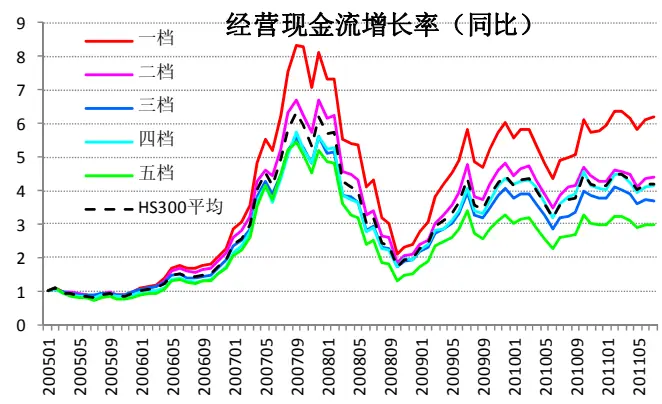
数据来源：国泰君安证券研究

图 31：经营现金流同比增长率五档累计收益-ZZ500
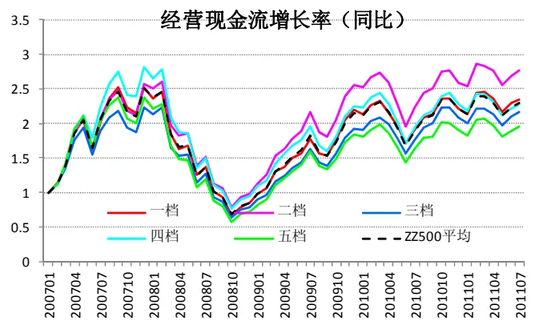
数据来源：国泰君安证券研究

表 16 经营现金流同比增长率有效性分析

| 股票池 | 市场 | 月均收益率差 |  |  |  | 因子排名与收益率排名相关性 |  |
| --- | --- | --- | --- | --- | --- | --- | --- |
|  | 阶段 | 一档-五档(%) | 有效性 | 一二档-四五档(%) | 有效性 | 相关系数 | P值 |
| HS300 总体 | 总体 | 0.93 | 65% | 0.51 | 59% | 0.13 | 0.01 |
|  | 牛市 | 1.08 | 68% | 0.69 | 54% | 0.13 | 0.12 |
|  | 熊市 | -0.11 | 50% | -0.59 | 33% | -0.07 | 0.61 |
|  | 震荡 | 1.15 | 68% | 0.71 | 61% | 0.19 | 0.01 |
| HS300 周期 | 总体 | 0.97 | 60% | 0.52 | 54% | 0.11 | 0.03 |
|  | 牛市 | 0.93 | 61% | 0.89 | 64% | 0.18 | 0.04 |
|  | 熊市 | -0.07 | 58% | -0.86 | 67% | -0.13 | 0.31 |
|  | 震荡 | 1.34 | 66% | 0.69 | 53% | 0.14 | 0.05 |
| HS300 非周期 | 总体 | 0.82 | 65% | 0.49 | 62% | 0.16 | 0.00 |
|  | 牛市 | 0.82 | 57% | 0.46 | 54% | 0.10 | 0.26 |
|  | 熊市 | 0.34 | 58% | -0.35 | 33% | 0.03 | 0.85 |
|  | 震荡 | 0.98 | 74% | 0.77 | 66% | 0.24 | 0.00 |
| ZZ500 总体 | 总体 | 0.34 | 59% | 0.37 | 63% | 0.14 | 0.02 |
|  | 牛市 | 0.33 | 58% | 0.17 | 60% | 0.13 | 0.10 |
|  | 熊市 | 0.42 | 62% | 0.80 | 69% | 0.18 | 0.14 |
|  | 震荡 | 0.26 | 63% | 0.57 | 63% | 0.19 | 0.25 |
| ZZ500 周期 | 总体 | -0.53 | 65% | -0.70 | 59% | -0.11 | 0.06 |
|  | 牛市 | -0.34 | 67% | -1.27 | 64% | -0.13 | 0.10 |
|  | 熊市 | -1.10 | 62% | 0.43 | 46% | -0.06 | 0.63 |
|  | 震荡 | -0.35 | 63% | -0.19 | 50% | -0.14 | 0.40 |
| ZZ500 | 总体 | 0.61 | 69% | 0.62 | 69% 0.24 | 0.00 |  |
|  | 牛市 | 0.53 | 64% | 0.48 | 67% 0.21 | 0.01 |  |
| 非周期 | 熊市 | 0.76 | 77% | 0.93 | 77% 0.29 | 0.02 |  |
|  | 震荡 | 0.68 | 75% | 0.66 | 63% 0.28 | 0.09 |  |

资料来源：国泰君安证券研究

## 3.1.16.经营性现金流增长率-1 年（TTM）

总体来看，HS300与 ZZ500的五档累计收益排序一致，均是 2、1、4、3、5档，总体还是经营性现金流增长率（TTM）较高的组合表现相对较好。

具体从市值特征、行业属性和市场环境来看，经营现金流增长率（TTM）与单季增长率的规律较为一致。

图 32：经营现金流 TTM增长率五档累计收益-HS300
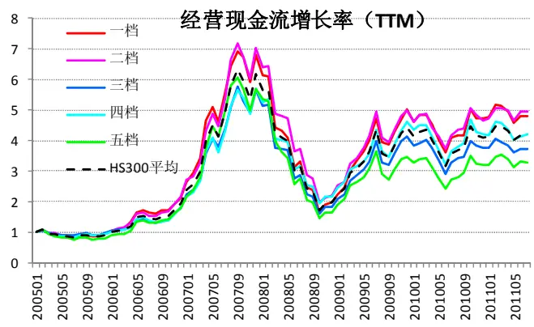
数据来源：国泰君安证券研究

图 33：经营现金流TTM增长率五档累计收益-ZZ500
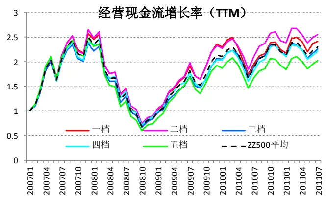
数据来源：国泰君安证券研究

表 17 经营现金流 TTM增长率有效性分析

| 股票池 | 市场 | 月均收益率差 |  |  |  | 因子排名与收益率排名相关性 |  |
| --- | --- | --- | --- | --- | --- | --- | --- |
|  | 阶段 | 一档-五档(%) | 有效性 | 一二档-四五档(%) | 有效性 | 相关系数 | P值 |
| HS300 总体 | 总体 | 0.50 | 62% | 0.37 | 58% | 0.07 | 0.18 |
|  | 牛市 | 0.26 | 61% | 0.58 | 61% | 0.09 | 0.31 |
|  | 熊市 | -0.03 | 33% | -0.85 | 67% | -0.10 | 0.45 |
|  | 震荡 | 0.85 | 61% | 0.61 | 63% | 0.11 | 0.14 |
| HS300 周期 | 总体 | 0.30 | 55% | 0.43 | 58% | 0.04 | 0.40 |
|  | 牛市 | -0.11 | 39% | 0.52 | 68% | 0.10 | 0.22 |
|  | 熊市 | 1.21 | 67% | -0.37 | 50% | -0.07 | 0.61 |
|  | 震荡 | 0.32 | 47% | 0.62 | 53% | 0.03 | 0.67 |
| HS300 非周期 | 总体 | 0.39 | 55% | 0.26 | 58% | 0.05 | 0.29 |
|  | 牛市 | 0.32 | 54% | 0.45 | 57% | 0.06 | 0.50 |
|  | 熊市 | -0.75 | 67% | -1.10 | 67% | -0.18 | 0.18 |
|  | 震荡 | 0.81 | 63% | 0.56 | 66% | 0.12 | 0.09 |
| ZZ500 | 总体 | 0.30 | 54% | 0.27 | 56% | 0.08 | 0.21 |
|  | 牛市 | 0.06 | 48% | 0.21 | 51% | 0.03 | 0.71 |
| 总体 | 熊市 | 0.86 | 62% | 0.41 | 62% | 0.18 | 0.16 |
| ZZ500 周期 | 震荡 | 0.37 | 63% | 0.43 | 63% | 0.19 | 0.25 |
|  | 总体 | -0.53 | 57% | -0.87 | 63% | -0.11 | 0.08 |
|  | 牛市 | -0.71 | 61% | -1.41 | 70% | -0.17 | 0.03 |
|  | 熊市 | -0.15 | 46% | 0.02 | 54% | 0.08 | 0.50 |
|  | 震荡 | -0.36 | 63% | -0.09 | 63% | -0.16 | 0.32 |
| ZZ500 非周期 | 总体 | 0.55 | 61% | 0.49 | 63% | 0.14 | 0.02 |
|  | 牛市 | 0.30 | 55% | 0.48 | 64% | 0.07 | 0.39 |
|  | 熊市 | 1.08 | 62% | 0.53 | 62% | 0.23 | 0.06 |
|  | 震荡 | 0.71 | 88% | 0.49 | 63% | 0.29 | 0.07 |

资料来源：国泰君安证券研究

## 3.1.17. ROE 增长率（单季）

总体来看，ROE 单季增长率越高的组合表现越好，但在 ZZ500 中各档表现的区分度不是很高。

具体来看：从市值特征看，ROE 单季增长率在 HS300 股票池中的有效性明显大于 ZZ500，后者的有效性不明显；从行业属性看，HS300的非周期类中的有效性明显好于周期类；从市场环境看，震荡市的因子有效性较高。

图 34：ROE增长率（单季）五档累计收益-HS300
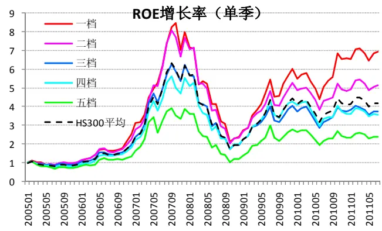
数据来源：国泰君安证券研究

图 35：ROE 增长率（单季）五档累计收益-ZZ500
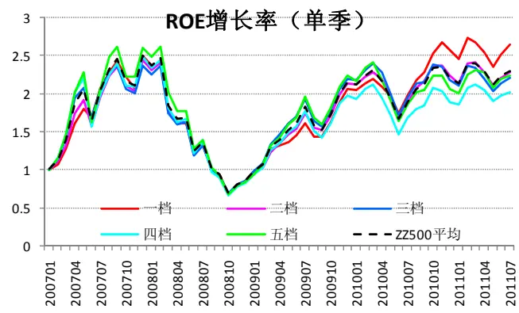
数据来源：国泰君安证券研究

表 18 ROE 增长率（单季）有效性分析

| 股票池 | 市场 阶段 | 月均收益率差 |  |  |  | 因子排名与收益率排名相关性 |  |
| --- | --- | --- | --- | --- | --- | --- | --- |
|  |  | 一档-五档(%) | 有效性 | 一二档-四五档(%) | 有效性 | 相关系数 | P值 |
| HS300 总体 | 总体 | 1.26 | 60% | 0.85 | 60% | 0.16 | 0.00 |
|  | 牛市 | 0.88 | 57% | 0.50 | 46% | 0.08 | 0.38 |
|  | 熊市 | -0.94 | 75% | -1.19 | 75% | -0.39 | 0.00 |
|  | 震荡 | 2.23 | 74% | 1.74 | 82% | 0.40 | 0.00 |
|  | 总体 | 0.35 | 55% | 0.50 | 58% | 0.07 | 0.17 |
| HS300 周期 | 牛市 | 0.02 | 50% | 0.69 | 61% | -0.03 | 0.74 |
|  | 熊市 | -1.87 | 58% | -1.88 | 75% | -0.26 | 0.05 |
|  | 震荡 | 1.30 | 63% | 1.12 | 66% | 0.24 | 0.00 |
| HS300 | 总体 | 1.57 | 60% | 1.03 | 58% | 0.18 | 0.00 |

| 非周期 | 牛市 | 0.80 | 46% | 0.01 | 0.01 | 0.87 |
| --- | --- | --- | --- | --- | --- | --- |
|  | 熊市 | -0.11 | 50% | 0.14 | 43% 33% | -0.05 0.70 |
|  | 震荡 | 2.66 | 74% | 2.07 | 76% 0.37 | 0.00 |
| ZZ500 总体 | 总体 | 0.00 | 46% | 0.00 | 48% | 0.01 0.93 |
|  | 牛市 | 0.12 | 58% | 0.08 | 52% | 0.76 |
|  | 熊市 | -0.24 | 54% | -0.06 | 0.02 62% -0.04 | 0.76 |
|  | 震荡 | -0.13 | 50% | -0.21 | 50% | 0.00 1.00 |
| ZZ500 周期 | 总体 | 0.16 | 46% | 0.10 | 56% -0.01 | 0.81 |
|  | 牛市 | -0.18 | 55% | 0.16 | 61% | 0.94 |
|  | 熊市 | -0.21 | 62% | -0.16 | -0.01 -0.11 | 0.39 |
|  | 震荡 | 2.15 | 63% | 0.27 | 62% 63% | 0.10 0.54 |
| ZZ500 非周期 | 总体 | -0.07 | 46% | 0.03 | 48% | 0.04 0.56 |
|  | 牛市 | 0.08 | 52% | 0.17 | 48% | 0.05 0.54 |
|  | 熊市 | -0.09 | 38% | 0.01 | 0.08 | 0.54 |
|  | 震荡 | -0.66 | 50% | -0.47 | 46% 50% | 0.59 |
|  |  |  |  |  |  | -0.09 |

资料来源：国泰君安证券研究

## 3.1.18. ROE 增长率（同比）

总体来看，HS300股票池中，ROE同比增长率越高的组合表现越好，且该规律明显，但在 ZZ500中各档表现几乎没有规律。

具体来看：从市值特征看，ROE 同比增长率在 HS300 中明显有效，而在 ZZ500几乎无效；从行业属性看，HS300的非周期类中的有效性明显好于周期类；从市场环境看，震荡市的因子有效性最高，熊市最低。

图 36：ROE增长率（同比）五档累计收益-HS300
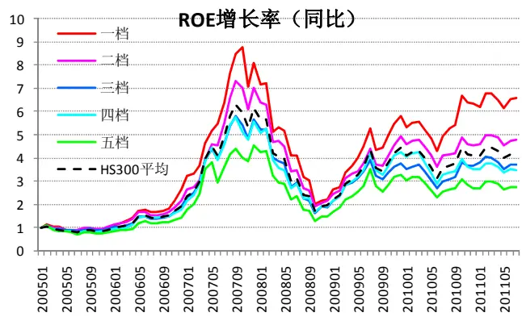
数据来源：国泰君安证券研究

图 37：ROE 增长率（同比）五档累计收益-ZZ500
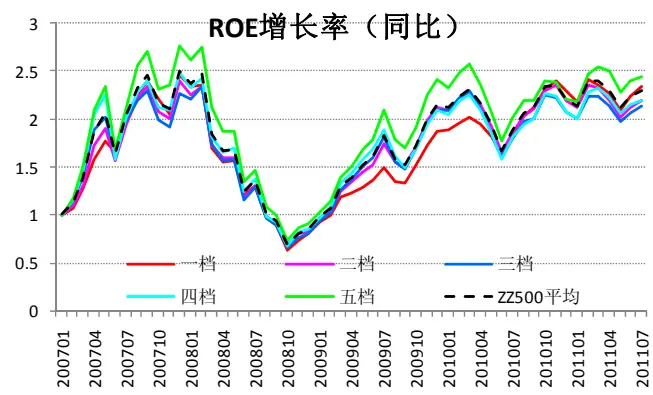
数据来源：国泰君安证券研究

表 19 ROE增长率（同比）有效性分析

| 股票池 | 市场 | 月均收益率差 |  |  |  | 因子排名与收益率排名相关性 |  |
| --- | --- | --- | --- | --- | --- | --- | --- |
|  | 阶段 | 一档-五档(%) | 有效性 | 一二档-四五档(%) | 有效性 | 相关系数 | P值 |
| HS300 | 总体 | 1.05 | 60% | 0.70 | 62% | 0.18 | 0.00 |
| 总体 | 牛市 | 0.56 | 57% | 0.32 | 54% | 0.09 | 0.31 |
|  | 熊市 | -1.68 | 75% | -1.48 | 75% | -0.39 | 0.00 |
|  | 震荡 | 2.26 | 74% | 1.67 | 79% | 0.42 | 0.00 |
| HS300 周期 | 总体 | 0.15 | 50% | 0.38 54% | 0.01 | 0.86 |  |
|  | 牛市 | 0.22 | 50% | 0.55 61% | -0.01 | 0.90 |  |
|  | 熊市 | -2.33 | 67% -1.94 | 75% | -0.37 | 0.00 |  |
|  | 震荡 | 0.89 | 55% 0.99 | 58% | 0.14 | 0.05 |  |
| HS300 非周期 | 总体 | 1.41 | 60% 0.84 | 58% | 0.14 | 0.01 |  |
|  | 牛市 | 0.87 | 54% | 43% | -0.03 | 0.74 |  |
|  | 熊市 | -0.53 | 67% | 0.00 75% | -0.13 | 0.31 |  |
|  | 震荡 | 2.42 | 74% | -0.56 | 0.35 |  |  |
| ZZ500 总体 | 总体 | -0.40 |  | 1.91 79% 48% | -0.02 | 0.00 0.79 |  |
|  | 牛市 | -0.13 | 46% | -0.33 -0.16 | 0.00 | 0.97 |  |
|  | 熊市 | -0.92 | 45% | 45% 54% |  |  |  |
|  | 震荡 | -0.68 | 46% | -0.55 50% | -0.05 -0.05 | 0.72 |  |
|  | 总体 |  | 50% | -0.65 |  | 0.76 |  |
| ZZ500 周期 | 牛市 | -0.34 | 54% | -0.29 56% | -0.06 | 0.35 |  |
|  | 熊市 | -0.08 | 52% | -0.14 52% | -0.02 | 0.82 |  |
|  | 震荡 | -1.84 | 62% | -0.77 69% | -0.17 | 0.18 |  |
|  |  | 1.02 | 50% | -0.16 50% | -0.04 | 0.82 |  |
| ZZ500 非周期 | 总体 | -0.46 | 46% | -0.28 54% | -0.02 | 0.69 |  |
|  | 牛市 | -0.22 | 45% | -0.05 52% | 0.01 | 0.94 |  |
|  | 熊市 | -0.61 | 46% | -0.54 62% | -0.05 | 0.72 |  |
|  | 震荡 | -1.16 | 50% | -0.81 | 50% | -0.11 0.49 |  |

资料来源：国泰君安证券研究

## 3.1.19.ROE 增长率（TTM）

总体来看，HS300股票池中，ROE增长率（TTM）越高的组合表现越好，且最高的第一档明显跑赢市场指数和其他各档，但在 ZZ500中各档表现几乎没有规律。

具体来看：从市值特征看，ROE增长率（TTM）在 HS300中明显有效，而在 ZZ500几乎无效；从行业属性看，HS300的非周期类中的有效性明显好于周期类；从市场环境看，震荡市的因子有效性最高，熊市最低。

图 38：ROE 增长率（TTM）五档累计收益-HS300
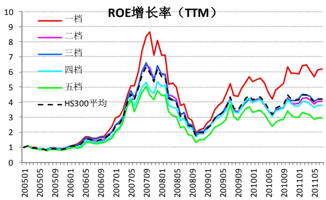
数据来源：国泰君安证券研究

图 39：ROE 增长率（TTM）五档累计收益-ZZ500
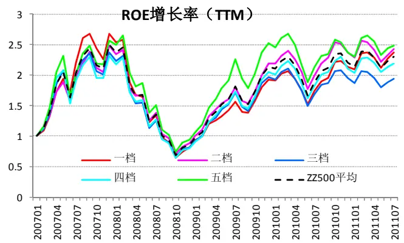
数据来源：国泰君安证券研究

表 20 ROE增长率（TTM）有效性分析

| 股票池 | 市场 阶段 | 月均收益率差 |  |  |  | 因子排名与收益率排名相关性 |  |
| --- | --- | --- | --- | --- | --- | --- | --- |
|  |  | 一档-五档(%) | 有效性 | 一二档-四五档(%) | 有效性 | 相关系数 | P值 |
| HS300 总体 | 总体 | 0.88 | 62% | 0.47 | 58% | 0.12 | 0.02 |
|  | 牛市 | 0.53 | 57% | 0.26 | 57% | 0.09 | 0.31 |
|  | 熊市 | -1.46 | 83% | -1.35 | 92% | -0.49 | 0.00 |
|  | 震荡 | 1.88 | 79% | 1.19 | 74% | 0.34 | 0.00 |
| HS300 周期 | 总体 | 0.10 | 51% | -0.22 | 50% | 0.04 | 0.39 |
|  | 牛市 | 0.19 | 54% | -0.36 | 43% | 0.11 | 0.18 |
|  | 熊市 | -1.78 | 58% | -1.82 | 83% | -0.14 | 0.28 |
|  | 震荡 | 0.62 | 53% | 0.40 | 55% | 0.05 | 0.49 |
| HS300 非周期 | 总体 | 0.83 | 56% | 0.55 | 55% | 0.08 | 0.14 |
|  | 牛市 | 0.09 | 43% | 0.32 | 46% | -0.08 | 0.38 |
|  | 熊市 | -1.09 | 75% | -1.06 | 75% | -0.28 | 0.03 |
|  | 震荡 | 1.97 | 76% | 1.23 | 71% | 0.30 | 0.00 |
| ZZ500 总体 | 总体 | -0.27 | 52% | -0.11 | 46% | -0.02 | 0.74 |
|  | 牛市 | 0.18 | 55% | 0.20 | 63% | 0.06 | 0.45 |
|  | 熊市 | -2.24 | 85% | -1.12 | 69% | -0.35 | 0.00 |
|  | 震荡 | 1.04 | 75% | 0.57 | 63% | 0.33 | 0.04 |
| ZZ500 周期 | 总体 | 0.30 | 48% | 0.19 |  |  |  |
|  | 牛市 | 1.32 |  |  | 50% | -0.03 | 0.67 |
|  | 熊市 | -2.97 | 55% 77% | 0.84 -1.63 | 58% | 0.05 | 0.49 |
|  | 震荡 | 1.45 |  | 0.43 | 77% | -0.27 | 0.03 |
| ZZ500 非周期 | 总体 |  | 63% |  | 63% | 0.04 | 0.82 |
|  | 牛市 | -0.38 | 48% | -0.23 | 56% | -0.01 0.02 | 0.83 0.82 |
|  | 熊市 | -0.10 -2.05 | 42% 69% | -0.14 -0.98 | 58% 62% | -0.27 | 0.03 |
|  | 震荡 | 1.15 | 63% | 0.58 | 63% | 0.28 | 0.09 |

资料来源：国泰君安证券研究

## 3.1.20.ROA 增长率（单季）

无论从总体来看还是具体来看，ROA 单季增长率的有效性规律与 ROE单季增长率非常相近，都是在 HS300 有效，而 ZZ500 无效，在非周期类股票池中有效性较强，震荡市的有效性最强。

图 40：ROA增长率（单季）五档累计收益-HS300
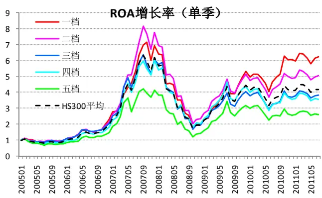
图 41：ROA增长率（单季）五档累计收益-ZZ500

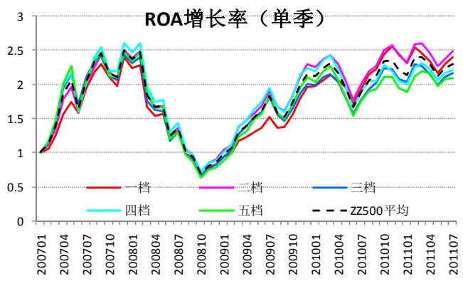

数据来源：国泰君安证券研究

数据来源：国泰君安证券研究

表 21 ROA增长率（单季）有效性分析

| 股票池 | 市场 | 月均收益率差 |  |  |  |  |  |
| --- | --- | --- | --- | --- | --- | --- | --- |
|  | 阶段 | 一档-五档(%) 有效性 | 一二档-四五档(%) | 有效性 | 相关系数 | P值 |  |
|  | 总体 | 1.04 | 59% | 0.71 59% | 0.14 | 0.00 |  |
| HS300 总体 | 牛市 | 0.26 | 54% 0.26 | 46% | -0.02 | 0.80 |  |
|  | 熊市 | -1.16 | 67% -1.23 | 75% | -0.26 | 0.05 |  |
|  | 震荡 | 2.31 | 71% 1.66 | 79% | 0.39 | 0.00 |  |
|  | 总体 | 0.37 | 58% | 0.41 54% | 0.09 | 0.08 |  |
| HS300 周期 | 牛市 | -0.30 | 54% | 0.36 | 50% | 0.01 0.87 |  |
|  | 熊市 | -1.70 | 42% | 42% | -0.07 | 0.61 |  |
|  | 震荡 | 1.53 | 66% | -0.99 0.89 | 55% | 0.19 |  |
|  | 总体 | 1.47 | 60% 0.79 | 55% | 0.13 | 0.01 0.01 |  |
| HS300 非周期 | 牛市 | 0.72 | 46% | -0.17 | 54% | -0.08 0.38 |  |
|  | 熊市 | -0.01 | 58% -0.55 | 75% | -0.08 | 0.57 |  |
|  | 震荡 | 2.49 | 76% | 1.93 71% | 0.34 |  |  |
|  | 总体 | -0.09 | 48% -0.02 | 50% | 0.01 | 0.00 0.88 |  |
| ZZ500 总体 | 牛市 | 0.02 | 55% | 0.10 | 48% | 0.02 |  |
|  | 熊市 | 0.11 |  | 54% | 0.02 | 0.85 0.90 |  |
|  | 震荡 | -0.82 | 46% 50% | 0.07 -0.64 | 50% |  |  |
|  |  |  |  | 52% | -0.03 | 0.88 |  |
| ZZ500 周期 | 总体 | -0.42 | 46% | 0.03 | 0.04 | 0.52 |  |
|  | 牛市 | -0.82 | 45% | 0.10 | 58% | 0.06 0.46 |  |
|  | 熊市 | 0.22 | 46% -0.12 | 62% | -0.03 | 0.81 |  |
|  | 震荡 | 0.17 | 63% | -0.02 | 50% | 0.08 0.65 |  |
| ZZ500 非周期 | 总体 | 0.06 | 48% 0.02 | 46% | 0.00 | 0.98 |  |
|  | 牛市 | 0.32 | 45% | 0.14 | 42% | -0.02 | 0.79 |
|  | 熊市 | 0.07 | 54% | 0.21 | 54% | 0.08 | 0.50 |
|  | 震荡 | -1.00 | 50% | -0.83 | 50% | -0.06 | 0.70 |

资料来源：国泰君安证券研究

## 3.1.21.ROA 增长率（同比）

无论从总体来看还是具体来看，ROA 同比增长率的有效性规律与 ROE的同比增长率非常相近，都是在 HS300 有效，而 ZZ500 无效，在非周期类股票池中有效性较强，震荡市的有效性最强。

图 42：ROA增长率（同比）五档累计收益-HS300
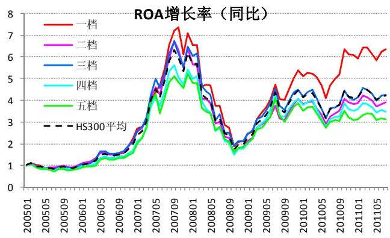
数据来源：国泰君安证券研究

图 43：ROA增长率（同比）五档累计收益-ZZ500
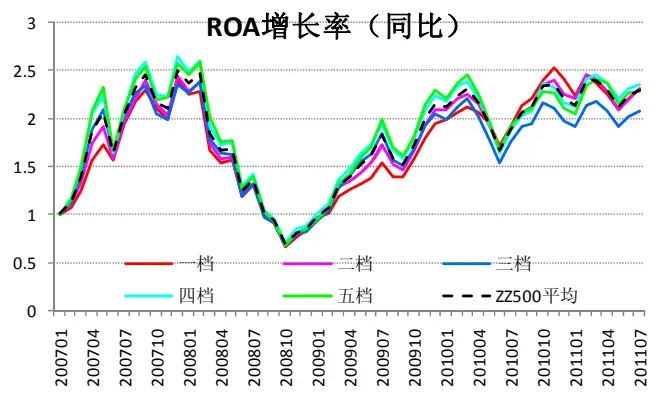
数据来源：国泰君安证券研究

表 22 ROA 增长率（同比）有效性分析

| 股票池 | 市场 阶段 | 月均收益率差 |  |  |  | 因子排名与收益率排名相关性 |  |
| --- | --- | --- | --- | --- | --- | --- | --- |
|  |  | 一档-五档(%) | 有效性 | 一二档-四五档(%) | 有效性 | 相关系数 | P值 |
| HS300 总体 | 总体 | 0.85 | 64% | 0.49 | 59% | 0.14 | 0.01 |
|  | 牛市 | -0.11 | 46% | -0.16 | 57% | -0.04 | 0.68 |
|  | 熊市 | -0.94 | 50% | -1.04 | 58% | -0.19 | 0.14 |
|  | 震荡 | 2.12 | 76% | 1.45 | 76% | 0.37 | 0.00 |
| HS300 周期 | 总体 | 0.19 | 58% | -0.09 | 54% | 0.05 | 0.35 |
|  | 牛市 | -0.61 | 50% | -0.55 | 64% | -0.04 | 0.62 |
|  | 熊市 | -0.99 | 33% | -1.02 | 50% | -0.03 | 0.80 |
|  | 震荡 | 1.16 | 61% | 0.53 | 53% | 0.14 | 0.05 |
|  | 总体 | 1.23 | 60% | 0.45 | 58% | 0.08 | 0.11 |
| HS300 非周期 | 牛市 | 0.36 | 54% | -0.31 | 54% | -0.08 | 0.36 |
|  | 熊市 | -0.44 | 58% | -1.23 | 67% | -0.21 | 0.11 |
|  | 震荡 | 2.40 | 71% | 1.55 | 74% | 0.29 | 0.00 |
|  | 总体 | -0.34 | 54% | -0.29 | 52% | -0.02 | 0.79 |
| ZZ500 总体 | 牛市 | -0.15 | 55% | -0.11 | 52% | -0.01 | 0.88 |
|  | 熊市 | -0.25 | 54% | -0.31 | 54% | -0.01 |  |
|  | 震荡 | -1.29 | 50% | -1.00 | 50% | -0.05 | 0.95 |
|  | 总体 | -1.03 | 54% | -0.18 | 54% | -0.04 | 0.76 |
| ZZ500 周期 | 牛市 | -1.20 |  |  |  |  | 0.51 |
|  | 熊市 | -0.73 | 48% | -0.15 | 45% | 0.02 | 0.79 |
|  | 震荡 | -0.79 | 62% | -0.19 | 69% | -0.14 | 0.27 |
|  |  |  | 63% | -0.32 | 63% | -0.14 | 0.40 |
| ZZ500 非周期 | 总体 | -0.21 | 56% | -0.31 | 50% | -0.01 | 0.93 |
|  | 牛市 | 0.11 | 42% | -0.13 | 52% | 0.00 | 0.97 |
|  | 熊市 | -0.27 | 54% | -0.21 | 46% | -0.01 | 0.95 |
|  | 震荡 | -1.43 | 50% | -1.17 | 50% | -0.01 | 0.94 |

资料来源：国泰君安证券研究

## 3.1.22.ROA 增长率（TTM）

无论从总体来看还是具体来看，ROA 增长率（TTM）的有效性规律与ROE 增长率（TTM）非常相近，都是在 HS300 有效，而 ZZ500 无效，在非周期类股票池中有效性较强，震荡市的有效性最强。

图 44：ROA 增长率（TTM）五档累计收益-HS300
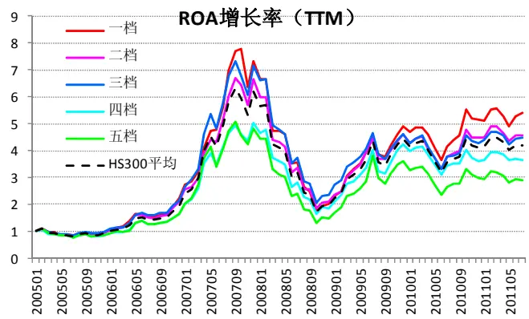
数据来源：国泰君安证券研究

图 45：ROA 增长率（TTM）五档累计收益-ZZ500
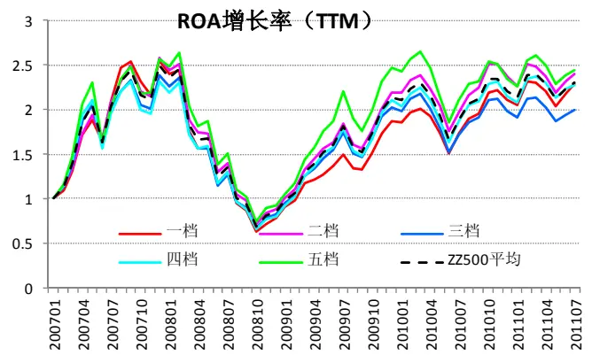
数据来源：国泰君安证券研究

表 23 ROA增长率（TTM）有效性分析

| 股票池 | 市场 阶段 | 月均收益率差 |  |  |  | 因子排名与收益率排名相关性 |  |
| --- | --- | --- | --- | --- | --- | --- | --- |
|  |  | 一档-五档(%) | 有效性 | 一二档-四五档(%) | 有效性 | 相关系数 | P值 |
| HS300 总体 | 总体 | 0.73 | 65% | 0.52 | 63% | 0.18 | 0.00 |
|  | 牛市 | 0.09 | 57% | 0.21 | 57% | 0.09 | 0.29 |
|  | 熊市 | -1.10 | 67% | -1.14 | 67% | -0.24 | 0.06 |
|  | 震荡 | 1.77 | 82% | 1.28 | 76% | 0.38 | 0.00 |
| HS300 周期 | 总体 | 0.00 | 58% | -0.02 | 46% | 0.06 | 0.22 |
|  | 牛市 | -0.78 | 43% | -0.33 | 46% | 0.05 | 0.53 |
|  | 熊市 | -0.66 | 50% | -1.24 | 75% | -0.13 | 0.34 |
|  | 震荡 | 0.78 | 61% | 0.60 | 63% | 0.13 | 0.08 |
| HS300 非周期 | 总体 | 0.85 | 56% | 0.41 | 54% | 0.10 | 0.04 |
|  | 牛市 | 0.25 | 43% | -0.08 | 57% | -0.04 | 0.64 |
|  | 熊市 | -0.86 | 67% | -1.14 | 75% | -0.29 | 0.02 |
|  | 震荡 | 1.83 | 74% | 1.26 | 71% | 0.33 | 0.00 |
|  | 总体 | -0.31 | 44% | -0.19 | 46% | -0.01 | 0.86 |
| ZZ500 总体 | 牛市 | 0.11 | 61% | 0.13 | 60% | 0.10 | 0.19 |
|  | 熊市 | -1.99 | 62% | -1.10 | 62% | -0.30 | 0.02 |
|  | 震荡 | 0.68 | 63% | 0.17 | 50% | 0.08 | 0.65 |
|  | 总体 | -0.16 | 54% |  | 48% |  |  |
| ZZ500 周期 |  |  |  | 0.19 |  | 0.01 | 0.93 |
|  | 牛市 熊市 | 0.60 | 55% | 0.86 | 55% | 0.10 | 0.20 |
|  | 震荡 | -2.33 | 77% | -1.56 | 77% | -0.28 | 0.02 |
|  |  | 0.20 | 50% | 0.27 | 63% | 0.09 | 0.59 |
| ZZ500 非周期 | 总体 | -0.41 | 46% | -0.25 | 54% | -0.01 | 0.81 |
|  | 牛市 | -0.07 | 42% | -0.08 | 55% | 0.05 | 0.54 |
|  | 熊市 | -1.97 | 62% | -0.98 | 62% | -0.28 | 0.03 |
|  | 震荡 | 0.71 | 63% | 0.22 | 63% | 0.15 | 0.36 |

资料来源：国泰君安证券研究

## 3.2.因子有效性的汇总分析

## 3.2.1. 有效因子一览

表 24 估值类和财务成长类因子中有效因子

|  |  | 首选因子 | 备选因子 |
| --- | --- | --- | --- |
| 总体 |  | PS，PCF，营业收入增长率（单季、同比），净利润增长率（单季、同比），经营现金流增长率（单季、同比），ROE增长率（单季、同比），ROA增长率（单季、同比、TTM) | PEcut，PEG，PB，营业收入增长率（TTM），净利润增长率（TTM），ROE增长率（TTM） |
| HS300非周期 |  | 周期 | PS，营业收入增长率（单季、同比），净利润增长率（单季），经营现金流增长率（单季、同比） |
|  |  | PE，PEcut，PEG，营业收入增长率（单季、同比），净利润增长率（单季、同比），ROE增长率（单季、同比） | PS，EV/EBITDA，营业收入增长率（TTM），净利润增长率（TTM），经营现金流增长率（同比、TTM），ROA增长率（单季） |
| ZZ500 | 总体 | PS，PB，EV/EBITDA，净利润增长率（单季） | PE，PCF，营业收入增长率（单季、同比），经营现金流增长率（同比） |
|  | 周期 | PS, EV/EBITDA, | PB |
|  | 非周期 | PE，PCF，PB，EV/EBITDA，净利润增长率（单季），经营现金流增长率（单季、同比、TTM） | PS，营业收入增长率（单季、同比） |

数据来源：国泰君安证券研究

注：首选因子是指全样本区间内满足有效性标准的因子，备选因子指在部分市场阶段（如牛市中）有效性较高的因子。

## 3.2.2. 几点有意义的结论

## 3.2.2.1. 市值规模特征对因子有效性的影响明显

结果表明，按市值规模划分股票池，分别做因子有效性分析是有必要的，有些因子在 HS300 和 ZZ500 中的有效性有明显差异。如：ROE 增长率（单季、同比、TTM）和 ROA 增长率（单季、同比、TTM）等因子在HS300 中明显有效，但在 ZZ500 中几乎无效；而 EV/EBITDA 在 ZZ500中很有效，而在 HS300中有效性不明显。

## 3.2.2.2. 估值：PS最有效，PE非周期中有效

估值类的指标在周期类和非周期类的股票池中有效性差异较大，市销率PS是估值类指标中最有效的指标，且在周期股中的有效性明显大于非周期，而 PE 和不含非经常损益的 PE（PEcut）在非周期股中表现出了较高的有效性，而在周期股中几乎无效。

## 3.2.2.3. PB 熊市表现更好，财务增长率指标震荡市表现最佳

大部分因子都在牛市中更有效，但是 PB 在熊市表现得更有效，而营业收入增长率（单季、同比、TTM）、净利润增长率（单季、同比、TTM）和经营现金流增长率（单季、同比、TTM）等指标都在震荡市表现最佳。

## 3.2.2.4. 财务指标的短期增长率更有效

分别比较营业收入、净利润、经营性现金流、ROE、ROA等指标的单季、同比、TTM的增长率的有效性，我们发现一个有意思的结论：单季增长率的有效性略高于同比，而同比增长率的有效性高于 TTM。可见这些财务指标的短期增长率有效性更高，这也许与市场乐于炒作短期业绩爆发的股票有关。从有效率来看，个别指标的 TTM有效率略强，即略稳定。

## 3.2.2.5. PE 不是最小的最好，而是较小的最好

总体来说，估值因子 PE较低的组合表现优于 PE较高的，但是从我们的测算来看，PE 最小的 20%（即第五档）组合表现并不是最好的，而第四档（PE值居于后 40%~20%）表现明显好于第五档。可见，PE 不是最小的最好，而是较小的（第四档）最好。

## 3.2.3. 因子有效性的汇总结果

我们制定了如下规则：

1. TOP 20%组合与 BOTTOM 20%组合的月平均收益率差显著（一般取0.5%以上）且有效性较高（一般在 60%之上）。

2. TOP 40%组合与 BOTTOM 40%组合的月平均收益率差显著（一般取0.5%以上）且有效性较高（一般在 60%之上）。

3. 在稳定性分析中，因子排名与下期收益率排名的线性关系显著（至少在 10%的水平上显著）。

根据这三条规则，我们得到了因子有效性汇总表（表 25）。其中：

1. “√√”表明 TOP 组合 BOTTOM 组合月收益率差同时满足条件 1、2；
因子排名与收益率排名在 5%的水平上显著。

3. 在动量因子部分，“√+”表明前、后收益率符号一致，呈现动量效应；
“√-”表明前、后收益率符号相反，呈现反转效应。

4. “×”代表月收益率差不满足条件 1、2中任一个；因子排名与收益率排名不具有显著的线性关系。

5. “√√”， “√”代表平均收益率差显著和线性相关性显著，规则与“√√”，“√”相似，但其显著性反应的是有效性的反面，如正向的因子却得出了负的收益率差和负相关系数的结果，或负向因子却得出了正的收益率差和正相关系数。

表 25 因子有效性汇总

|  |  |  |  |  |  |  |  | ZZ500 |  |  |  |  |  |  |
| --- | --- | --- | --- | --- | --- | --- | --- | --- | --- | --- | --- | --- | --- | --- |
| 指标 | 市场 状况 | 整体 |  | HS300 周期 |  | 非周期 |  | 整体 |  | 周期 |  | 非周期 |  |  |
|  |  | 收益 | 相关 系数 | 收益 率差 | 相关 系数 | 收益 | 相关 | 收益 率差 | 相关 | 收益 | 相关 | 收益 | 相关 系数 |  |
|  |  | 率差 X | X |  | X | 率差 W | 系数 V |  |  | 系数 W | 率差 X | 系数 X | 率差 VV W |  |
| PE | 总体 牛市 | √ | W√ | X √ | X | √√ | W | X W√ | W√ | X | X | W | W |  |
|  | 震荡 | X | X | X | X | X | X | X | X | √ | X | X | X |  |
|  | 熊市 |  |  |  |  |  |  | X |  | X | X | √ |  |  |
|  |  | √ | X | × | X | X √√ | X |  | X |  |  |  | × |  |
|  | 总体 牛市 | X | √√ W | X X | X X | √√ | √√ W | X √ | X √ | X √ | X X | X √ | X W√ |  |
| PEcut | 震荡 | W X | X | X | X | X | X | X | X | X | X | X | X |  |
|  | 熊市 | √ | X | X | X | X | X | X | X | √ | X | X | X |  |
|  | 总体 | X | V√ | X | X | √√ | √ | X | √ | √ | X | X | √ |  |
| PEG | 牛市 震荡 | W √ | V√ √ | W X | √ X | √√ W√ | W W | √ √√ | W W√ | √ W | W √ | W W√ | W W |  |
|  | 熊市 总体 | W | √√ | √ | W | √ | W | V√ | W | W | W | W | √ |  |
| PS | 牛市 震荡 熊市 | √ | V | √ | W | X | V | V | V | W | VV | √ | WV |  |
|  |  | W | W | √√ | W | √√ | W | W | W | W | W | √ | X |  |
|  |  | X | X | X | X | X | X | W√ | W√ | W | √ | W√ | × |  |
|  |  | X | X | X | X | √ | X | √ | W√ | √ | X | √ | X |  |
| PCF | 总体 牛市 | √ | W | X | √ | √ | √ | X | X | X | VV | W |  |  |
|  | W |  | √ W | W√ | √ | X | W√ | W | X | X | W | W |  |  |
|  | 震荡 | X | X X | X | × | X | X | X | X | X | X | X |  |  |
|  | 熊市 | X | X √ | X | X | X | X | X | X | X | √ |  |  |  |
|  | 总体 X |  | X | X | X | X | √√ | W | √ | W | W | V |  |  |
|  | 牛市 震荡 | W√ | W | X | √ | W | W√ | W | X | X | X | W |  |  |
| EV/EBI TDA | 市 熊市 | W | √ | √ | V√ | X X |  | W | X | X | X | W | √ |  |
|  |  | W | W | W | W | √ | X | W | W | √√ | W | W | √√ |  |
|  | 总体 | X | X |  | X | √ | √√ | √√ | √√ | √ | √√ | √√ | VV |  |
|  | 牛市 | X | X | √ | √ | X | X | W | √√ | √ | X | W | W |  |
|  | 震荡 | X | X |  | X | √ | X | √ | X | X | X | W√ | X |  |
|  | 单 牛市 | 熊市 √ | X | X | X | X | X | W√ | W | √ | W |  | W | W WV |

续表：

| 指标 |  | 市场状况 | HS300 |  |  |  | ZZ500 |  |  |  |  |  |
| --- | --- | --- | --- | --- | --- | --- | --- | --- | --- | --- | --- | --- |
|  |  |  | 整体 周期 非周期 |  |  |  | 整体 周期 非周期 |  |  |  |  |  |
|  |  |  | 收益 相关 收益 相关 收益 相关率差 系数 率差 系数 率差 系数 |  |  |  | 收益 相关 收益 相关 收益 相关率差 系数 率差 系数 率差 系数 |  |  |  |  |  |
| 单季净利 |  | 总体 | W W √ W V W |  |  |  | √ W X X W V |  |  |  |  |  |
|  |  | 牛市 | W√ W √√ √√ W W√ |  |  |  | √ √√ X X W √ |  |  |  |  |  |
|  |  | 震荡熊市 | √√ W √ W√ W WW X W X X X |  |  |  | √ √ √ X √√ √W X W X W √ |  |  |  |  |  |
|  |  |  | 总体 | W W √ √ V W |  |  |  | X X X X X X |  |  |  |  |
| 润 | 同 | 牛市 | W√ W X X √ √√ |  |  |  | X X X X √ X |  |  |  |  |  |
| 增长率经营现金 | 比 | 震荡 | V√ W √√ √ |  |  | √√ W | V√ √ √√ X W √ |  |  |  |  |  |
|  |  | 熊市 | √ X X X |  |  | X X | W √ W |  |  | V√ W W |  |  |
|  |  | 总体 | √ W√ X X |  |  | √ √√ | X X X |  |  | X | X X |  |
|  | TT | 牛市 | √ X X |  | X | X X | X | X | √ | X | × X |  |
|  | M | 震荡 | V√ W √ X |  |  | √ W | W W W√ |  |  | X | W √ |  |
|  |  | 熊市 | W W X |  | X | √√ √√ | W W√ |  | W | √ | W W |  |
|  |  | 总体 | √ W√ √ |  | W√ | X X | X | √√ | X | X | √ | W |
|  | 单 | 牛市 | √ X √ √ |  |  | × X | X | X | √ | X | √ | X |
|  | 季 | 震荡 | √ W √√ √ |  |  | X X | V√ W |  | √ | X | VV | √ |
|  |  | 熊市 | √ X X X |  |  | √ X | √ X |  | √ | X | X | X |
|  |  | 总体 | √ W √ √√ |  |  | W W | √ | √√ | W | √ | W | √ |
|  | 同 | 牛市 | √ X √ |  | √ | X X | √ | √ | W | √ | W | W |
| 流 | 比 | 震荡 | W W √ |  | √ | √√ W | 小 | X | X | X | √√ | √ |
| 增长率R0E |  | 熊市 | X X √ |  | X | X X | W | X | √ | X | √√ | W |
|  |  | 总体 | √ X | X | X | X X | X | X | √ | √ | W | W |
|  | TT | 牛市 | W√ X | √ | X | X X | × | × | W | W | √ | X |
|  | M | 震荡 | W√ X | X | X | √√ W | √√ | X | X | X | √√ | X |
|  |  | 熊市 | √ X | √ | X | V√ X | W | X | X | X | √√ | W |
|  |  | 总体 | √√ W | X | X | √ √√ | X | X | X | X | X | X |
|  | 单 | 牛市 | X X | √ | X | X X | × | × | √ | X | X | X |
|  | 季 | 震荡 | √√ √√ √ |  | √ | √√ W | X | X | W | X | × | X |
|  |  | 熊市 | W W √ |  | √ | X X | X | X | X | X | X | X |
|  |  | 总体 | √√ W | X | X | √ √√ | X | X | X | X | X | X |
|  | 同 | 牛市 | × X | √ | X | X X | × | × | X | X | X | X |
| 增 | 比 | 震荡 | W W X |  | √ | W√ √√ | × | X | X | X | X | X |
| 长率 |  | 熊市 | W W √ |  | √ | W X | X | X | W | × | √ | X |
|  |  | 总体 | √ W X |  | X | √ √ | X | X | X | × | X | X |
|  | TT | 牛市 | X X X |  | X | X X | √ | X | X | X | √ | X |
|  | M | 震荡 | W √ √ |  | √ | √√ √√ | √√ | √√ | √√ | X | W | √ |
|  |  | 熊市 | W W √ |  | X | √√ √√ | W W |  | W | √ | W | √√ |

续表：

| 指标 | 市场 状况 | HS300 |  |  |  |  |  | ZZ500 |  |  |  |  |  |
| --- | --- | --- | --- | --- | --- | --- | --- | --- | --- | --- | --- | --- | --- |
|  |  | 整体 |  | 周期 |  | 非周期 |  | 整体 |  | 周期 |  | 非周期 |  |
|  |  | 收益 率差 | 相关 系数 | 收益 率差 |  | 相关 系数 | 收益 率差 | 相关 系数 | 收益 率差 | 相关 系数 | 收益 相关 率差 | 收益 系数 率差 | 相关 系数 |
| 单 季 R O A 同 | 总体 | WV | V | X | √ | √ | V | X | X | X | X | X | X |
|  | 牛市 | X | X | X | X | X | X | X | X | X | X | X | X |
|  | 震荡 | W√ | √√ | √ | X | √ | √ | X | X | X | X | X | X |
|  | 熊市 | W | √ | X | X | √ | X | X | X | X | X | X | X |
|  | 总体 | W | √√ | X | X | √ | X | X | X | × | X | X | X |
|  | 牛市 | X | X | √ | X | X | X | X | X | X | X | X | X |
| 增 比 长 | 震荡 | √√ | W | √ | X | √ | W√ | X | X | √ | X | X | X |
| 率 TT M | 熊市 | X | X | X | X | X | X | X | X | W | X | X | X |
|  | 总体 | W | V√ | X | X | X | √ | X | X | X | X | X | X |
|  | 牛市 | X | X | X | X | X | X | √ | X | X | X | X | X |
|  | 震荡 | W | √ | W | √ | √√ | √ | √ | X | X | X | W | × |
|  | 熊市 | W | W | √ | X | √√ | √√ | W | √ | √ | W | W | √√ |

资料来源：国泰君安证券研究

## 作者简介：

蒋瑛琨：

执业资格证书编号：S0880511010023

电话：021-38676710

邮箱：jiangyingkun@gtjas.com

吉林大学数量经济学博士，CPA，国泰君安证券首席金融工程研究员。05年加入国泰君安证券，曾在衍生产品部工作，多次获中金所、深交所、中国证券业协会、中国金融学会等奖励。06年新财富“衍生品”第二名，07-08年入围新财富，2010年水晶球奖“衍生品”第四名。

## 唐军（贡献作者）：

执业资格证书编号：S0880110090001

电话：021-38674763

邮箱：tangjun008739@gtjas.com

中山大学经济学硕士和理学学士，2010年 7月加入国泰君安证券，现为金融工程助理研究员，主要从事数量化投资策略研究。

## 感谢实习生刘正捷为本报告做出的贡献。

## 本公司具有中国证监会核准的证券投资咨询业务资格

## 分析师声明

作者具有中国证券业协会授予的证券投资咨询执业资格或相当的专业胜任能力，保证报告所采用的数据均来自合规渠道，分析逻辑基于作者的职业理解，本报告清晰准确地反映了作者的研究观点，力求独立、客观和公正，结论不受任何第三方的授意或影响，特此声明。

## 免责声明

本报告仅供国泰君安证券股份有限公司（以下简称“本公司”）的客户使用。本公司不会因接收人收到本报告而视其为本公司的当然客户。本报告仅在相关法律许可的情况下发放，并仅为提供信息而发放，概不构成任何广告。

本报告的信息来源于已公开的资料，本公司对该等信息的准确性、完整性或可靠性不作任何保证。本报告所载的资料、意见及推测仅反映本公司于发布本报告当日的判断，本报告所指的证券或投资标的的价格、价值及投资收入可升可跌。过往表现不应作为日后的表现依据。在不同时期，本公司可发出与本报告所载资料、意见及推测不一致的报告。本公司不保证本报告所含信息保持在最新状态。同时，本公司对本报告所含信息可在不发出通知的情形下做出修改，投资者应当自行关注相应的更新或修改。

本报告中所指的投资及服务可能不适合个别客户，不构成客户私人咨询建议。在任何情况下，本报告中的信息或所表述的意见均不构成对任何人的投资建议。在任何情况下，本公司、本公司员工或者关联机构不承诺投资者一定获利，不与投资者分享投资收益，也不对任何人因使用本报告中的任何内容所引致的任何损失负任何责任。投资者务必注意，其据此做出的任何投资决策与本公司、本公司员工或者关联机构无关。

本公司利用信息隔离墙控制内部一个或多个领域、部门或关联机构之间的信息流动。因此，投资者应注意，在法律许可的情况下，本公司及其所属关联机构可能会持有报告中提到的公司所发行的证券或期权并进行证券或期权交易，也可能为这些公司提供或者争取提供投资银行、财务顾问或者金融产品等相关服务。在法律许可的情况下，本公司的员工可能担任本报告所提到的公司的董事。

市场有风险，投资需谨慎。投资者不应将本报告为作出投资决策的惟一参考因素，亦不应认为本报告可以取代自己的判断。在决定投资前，如有需要，投资者务必向专业人士咨询并谨慎决策。

本报告版权仅为本公司所有，未经书面许可，任何机构和个人不得以任何形式翻版、复制、发表或引用。如征得本公司同意进行引用、刊发的，需在允许的范围内使用，并注明出处为“国泰君安证券研究”，且不得对本报告进行任何有悖原意的引用、删节和修改。

若本公司以外的其他机构（以下简称“该机构”）发送本报告，则由该机构独自为此发送行为负责。通过此途径获得本报告的投资者应自行联系该机构以要求获悉更详细信息或进而交易本报告中提及的证券。本报告不构成本公司向该机构之客户提供的投资建议，本公司、本公司员工或者关联机构亦不为该机构之客户因使用本报告或报告所载内容引起的任何损失承担任何责任。

## 评级说明

## 1.投资建议的比较标准

投资评级分为股票评级和行业评级。

以报告发布后的12个月内的市场表现为比较标准，报告发布日后的12个月内的公司股价（或行业指数）的涨跌幅相对同期的沪深300指数涨跌幅为基准。

## 2.投资建议的评级标准

报告发布日后的 12 个月内的公司股价（或行业指数）的涨跌幅相对同期的沪深300指数的涨跌幅。

|  | 评级 说明 |  |
| --- | --- | --- |
| 股票投资评级 | 增持 | 相对沪深 300 指数涨幅 15%以上 |
|  | 谨慎增持 | 相对沪深 300 指数涨幅介于 5%~15%之间 |
|  | 中性 | 相对沪深 300 指数涨幅介于-5%~5% |
|  | 减持 | 相对沪深 300 指数下跌 5%以上 |
| 行业投资评级 | 增持 | 明显强于沪深 300 指数 |
|  | 中性 | 基本与沪深 300 指数持平 |
|  | 减持 | 明显弱于沪深 300 指数 |

## 国泰君安证券研究

| 上海 |  | 深圳 | 北京 |
| --- | --- | --- | --- |
| 地址 | 上海市浦东新区银城中路168号上海 银行大厦29 层 | 深圳市福田区益田路6009号新世界 商务中心34层 | 北京市西城区金融大街28号盈泰中 心2号楼10层 |
| 邮编 | 200120 | 518026 | 100140 |
| 电话 | （021）38676666 | （0755）23976888 | （010）59312799 |
| E-mail: gtjaresearch@gtjas.com |  |  |  |