# 2011.10.14

# 多因子选股模型之因子分析与筛选 II：财务质量、价量和一致预

# ——数量化研究系列之十八

蒋瑛琨 021-38676710 jiangyingkun@gtjas.com 编号 S0880511010023

## 本报告导读：

本报告为多因子选股研究系列的第二篇，通过多角度和更细致的测算，分析了财务质量、价量和一致预期类因子的有效性和稳健性，为建立多因子选股模型奠定基础。

## 摘要：

[T本报告通过多角度、更严格的测算方法分析了财务质量类、价量类和分析able_Summary]师预期类共 18个因子指标的有效性，给出了最全面和细致的分析结果，为构建多因子选股模型和指导实际投资提供了很多有价值的信息。

## 本文的创新之处：

（1）专注于单因子分析。通过最全面和最细化的分析，挖掘出最有效和稳健的因子。

（2）提出了更严格和更全面的度量因子有效性的方法。我们从因子排序后的 TOP 20%与 BOTTOM 20%、TOP 40%与 BOTTOM 40%组合的表现差异及稳定性，以及因子排名与收益率排名的相关性3 个方面来度量因子有效性。

（3）分析了不同股票池和不同市场环境下因子的有效性。为了提高各个因子在个股之间的可比性，我们分别在 HS300 和 ZZ500 成分股中分总体、周期类、非周期类共 6个股票池中进行因子的有效性分析。。

（4）分析了财务类因子在财报公布后有效性的衰减规律。

## 主要结果分析：

（1）HS300中，首选有效因子有：权益乘数、评级调整；备选因子有：ROE（TTM），ROA（TTM），有息负债率。ZZ500中，首选有效因子有：有息负债率，1 个月换手率，3 个月换手率；备选因子有：权益乘数， 1个月收益率（反转），6个月收益率（反转）。另外，分周期与非周期测算的结果见表 24。

（2）财务质量类因子的整体有效性不是很高：毛利率（当期、TTM）、净利率（当期、TTM）等指标在各个股票池中的有效性都不明显。ROE（TTM）和ROA（TTM）只在HS300股票池中的震荡市阶段明显有效。权益乘数在牛市中特别有效。有息负债率在 HS300 的牛市中正向有效，在震荡市中负向有效，而在 ZZ500 中主要表现为正向有效。

请务必阅读正文之后的免责条款部分价量类因子在不同股票池和不同

金融工程

## 单因子分析框架：

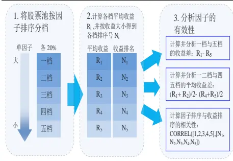

## [Table_R相关报告

《多因子选股模型之因子分析与筛选Ⅰ：估值与财务成长类指标》

2011.09.26

《风格投资 III：A 股周期非周期风格轮动研究——数量化研究系列之十六》

2011.09.15

《基于全市场的 GARP 选股研究》——数量化研究系列之十五

2011.09.14

《基于动量和阻力测算的短线择时模型数量化系列研究之十四》

2011.08.21

《市场情绪指数的建立及应用——数量化研究系列之十三》

2011.07.11

## O．多因子选股系列研究

多因子选股是量化研究中最热点的问题之一，已经有比较广泛的研究和应用。我们认为，检验和筛选出有效且稳健的因子是多因子选股模型取得良好效果的关键。

我们将开展多因子选股系列研究，前两篇报告专注于单因子分析和测算，筛选出有效且稳健的因子。我们共分析了五大类指标：估值类（7个指标）、财务成长类（15 个指标）、财务质量类（10 个指标）、价量类（6 个指标）、分析师预期类（2 个指标）。为了篇幅适中，我们第一篇报告分析和测算估值类和财务成长类共 22 个指标，第二篇分析财务质量、价量和分析师预期三类共 18 个指标，并且在第二篇报告内分析了财务相关的因子有效性在财报公布后的衰减规律。

在筛选出有效且稳健的因子的基础上，第三篇建立多因子综合打分的选股模型，依据不同因子的有效性和稳健性赋予不同的权重，然后根据综合得分构建股票组合，通过回溯历史，检验模型效果。

## 1. 本报告的创新之处

本篇报告作为多因子选股系列研究的第二篇，分析和测算了财务质量类、价量类和分析师预期类共 18 个指标的有效性和稳健性，有以下创新之处。

## 1.1.专注于挖掘有效因子

本报告专注于单因子分析，通过多角度和更细致的分析和测算挖掘出最有效和稳健的因子。由于只做单因子分析，暂时不做因子间的比较和综合分析，不需考虑因子的同质性或共线性等，因此我们测算了各种意义相近的指标，如 ROE 和 ROA，毛利率和净利率的当期和 TTM 指标等，这样可以更好的挖掘出最具代表性和最有效的因子。

## 1.2.提出了更严格和更全面的度量因子有效性的方法

通过多角度、更严格的方法度量因子有效性和稳健性，确保了分析结果不受数据的偶然巧合所影响。在做单因子分析时，我们将股票池按因子大小排序，分为五档，通过分析各档股票的表现差异以及各档的平均收益排名与因子排名的相关性来度量和分析因子的有效性。目前绝大多数的研究中，分析因子有效性时，都是比较因子排名靠前 X%与靠后 X%的差异，我们认为这样做有以下两点不足之处：首先，X 取多少存在较大的主观性，而且在确定 X 的最优取值时可能会产生过度数据挖掘的问题；其次，单凭最前和最后的 X%的表现差异，而忽略中间大部分个股表现的信息，由此选取的有效因子可能不够可靠和稳健。

## 1.3.分析了不同股票池和不同市场环境下各因子的有效性

为了避免有些指标（如估值类）在大盘股与小盘股之间存在整体性的差异，可比性不高，我们分别在 HS300 成分股和 ZZ500 成分股中进行因子的有效性分析。进一步，为了提高各个指标的可比性，我们在 HS300和 ZZ500 成分股中分别按周期与非周期行业划分，由此分为了四个股票池，分别进行单因子分析。另外，考虑到因子的有效性可能跟所处的市场环境有关，我们统计和分析了不同市场阶段（牛市、熊市、震荡市）的因子有效性，为构建多因子选股模型和指导实际投资提供更全面的信息。

## 1.4.更符合实际的数据处理方式

很多因子指标需要使用到财务数据，而上市公司财务报表的公布时间有一定的滞后和差异，在常见的数据库（如wind）中，历史的财务数据是按报告期更新的，如二季报的财务数据都是在 6 月 30 日更新的，而其二季报公布的时间肯定在 6 月 30 日之后。因此，直接使用这些历史数据测算不够贴近实际，我们对数据进行了合理的处理，确保在历史的每个时点只使用当时可以得到的数据信息，并使指标值在个股间具有较好的可比性。

## 1.5.分析了财务指标的有效性在财报公布后的衰减规律

考虑到财务指标在财报公布后到下一期财报公布前都取值不变，财务相关因子的有效性可能会在财报公布后随时间衰减，我们测算和分析了财务相关因子有效性的衰减规律。另外，我们还分析了不同质量的财报（一般认为年报质量高于半年报，高于季报）公布后财务因子有效性的差异。

## 2. 研究思路

## 2.1. 研究框架

## 图 1 单因子分析框架

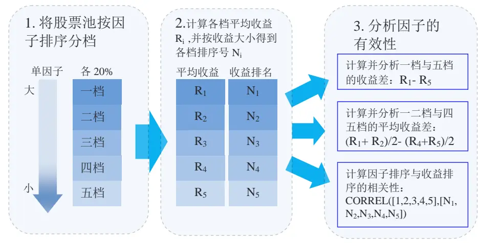
资料来源：国泰君安证券研究

## 2.2. 因子选取

## 2.2.1. 因子选取说明

我们选取了五大类因子：估值类（7 个指标）、财务成长类（15 个指标）、财务质量类（10 个指标）、价量类（6 个指标）、分析师预期类（2 个指标），本篇报告分析财务质量类、价量类和分析师预期类共 18个。具体指标如表1所示：

表 1 财务质量类、价量类和分析师预期类指标

|  | 因子指标 | 名称 | 说明 |  |
| --- | --- | --- | --- | --- |
| 财务 质量类 | ROE | 资本回报率（TTM） | 最近4个季度归属母公司净利润/平均净资产 |  |
|  | ROA | 资产回报率（TTM） | 最近4个季度归属母公司净利润/平均总资产 |  |
|  | GPM-P | 当期毛利率 | (当期营业收入-当期营业成本)/当期营业收入 |  |
|  | GPM-TTM | 毛利率-TTM | 最近4个季度归属母公司毛利润/最近4个季度营业收入 |  |
|  | NPM-P | 当期净利率 | 当期净利润/当期营业收入 |  |
|  | NPM-TTM | 净利率-TTM | 最近4个季度归属母公司净利润/最近4个季度营业收入 |  |
|  | EM | 股权乘数 | 当期总资产/当期净资产 |  |
|  | DR | 有息负债率 | (当期短期借款+一年内到期借款+长期借款)/当期净资产 |  |
|  | CF/NP | 单位净利润现金流含量 | 当期经营性现金流量/当期净利润 |  |
|  | EBITDA/revenue | 税息折旧及摊销前利润率 | 当期税息折旧及摊销前利润/当期营业收入 |  |
|  | 价量类 | PM-1 | 1 个月收益率 | 当前收盘价/1 个月前收盘价-1 |
| PM-3 |  | 3个月收益率 | 当前收盘价/3个月前收盘价-1 |  |
| PM-6 |  | 6个月收益率 | 当前收盘价/6个月前收盘价-1 |  |
| TM-1 |  | 1 个月换手率 | 过去1个月平均换手率 |  |
|  | TM-2 | 3个月换手率 | 过去3个月平均换手率 |  |
|  | TM-6 | 6个月换手率 | 过去6个月平均换手率 |  |
| 分析师 | ins-num | 机构覆盖数量 | 覆盖该只股票的卖方机构总数 |  |
| 预期类 | rate-num | 评级调整 | 过去一个月分析师评级上调次数减下调次数 |  |

数据来源：国泰君安证券研究

## 2.2.2. 数据处理说明

测试区间为：HS300 股票池从 2005 年 1 月至 2011 年 6 月；ZZ500 股票池从 2007 年 1 月至 2011 年 6 月。由于 HS300 与 ZZ500 的成份股在每年1 月初和 7 月初进行定期调整，因此我们的股票池也每隔半年更新一次。在计算估值指标和财务指标时，考虑到在实际当中我们无法拿到每个时点的财务数据，因此使用的是已公布的最近期财务报告数据。具体而言，1 月、2 月、3 月用的是上年 3 季报及之前数据；4 月、5 月、6 月、7 月用的是本年 1 季报和上年年报及之前数据；8 月、9 月用的是本年半年报及之前数据；10 月、11 月和 12 月用的是本年 3 季报及之前数据。这样虽有一定时滞，但一方面与实际情况相符，具有可操作性，另一方面也使指标更具有可比性。

另外，在分析估值类因子时，如遇指标为负值的个股，我们将其剔除。在计算财务成长类因子时，我们利用如下公式计算指标增长率：

$$
\pmb{\mathrm{i}}\overrightarrow{\mathrm{E}}\div\overrightarrow{\mathrm{E}}\ast=(\overrightarrow{\mathrm{A}}/\pmb{\mathrm{H}}\pmb{\mathrm{H}}\overleftarrow{\mathrm{H}}\cdot\overrightarrow{\mathrm{J}}\overrightarrow{\mathrm{N}}-\bot\pmb{\mathrm{H}}\pmb{\mathrm{J}}\pmb{\mathrm{H}}\div\pmb{\mathrm{J}}\overline{{\mathrm{N}}})/\mathrm{abs}(\bot\pmb{\mathrm{H}}\pmb{\mathrm{J}}\pmb{\mathrm{H}}\cdot\overline{{\mathrm{J}}}\overline{{\mathrm{N}}})
$$

这样能够解决上期为负、本期转正的指标的增长率计算问题。

数据全部取自wind数据库。

## 2.3. 股票池的划分

## 2.3.1. 按市值特征

经典的 Fama-French 三因素模型早已表明市值对股票的收益率有显著的影响，各种主动型投资基金也常常按照投资标的的市值进行风格划分，而大、小市值股票的估值等指标存在整体性的水平差异，不具备可比性。因此我们按照市值大小对股票池进行划分。

我们以沪深 300 指数（HS300）成分股做为大市值股票池，以中证 500指数（ZZ500）的成分股做为中、小市值股票池。这样既做到了以市值大小对股票进行大致划分，同时，由于这些指数在甄选成份股时不仅考虑到市值，也考虑到流动性、近期业绩等因素，遇到公司合并、重组停牌等事项时及时将相关股票剔除，并定期调整成份股。这就相当于我们的股票池已事先进行了一道清理程序，大大降低选到“黑天鹅”股票的概率，减小换股时产生的冲击成本，而且明确了我们投资组合收益的比较基准。

## 2.3.2. 按行业属性

不同行业的某些财务指标的整体差异性大，可比性不高，因此按行业属性进一步划分股票池也是有必要的。一般来说，周期类行业与非周期行业在很多财务指标上具有显著差异，因此我们按周期与非周期对股票池进行进一步划分。之所以没有把每个行业作为一个股票池是因为如果划分的过细，一方面可操作性会降低，另一方面容易造成样本数量急剧下降，统计结果可靠性会降低。

在区分周期与非周期行业的问题上，我们参考了上证周期指数（000063）

与上证非周期指数（000064）的划分方法，根据证监会行业板块，将“金融”、“金属”、“交通运输”、“采掘业、”“房地产”五大类行业放在周期性行业里，其他行业放在非周期性行业里。

## 2.4. 分析因子有效性

## 2.4.1. 因子有效性的度量

（1）测算因子有效性的步骤

Step1将股票池里的样本股票按待测因子按由高到低的顺序分成五档，各占20%。分别计算每一档的月平均收益率。

Step2 计算两次月平均收益率差，分别是：

TOP 20%（第一档）- BOTTOM 20%（第五档），

TOP 40%（第一、二档）- BOTTOM 40%（第四、五档）。

Step3计算上述收益率差的平均值。如果平均值为正，则该因子的影响总

体是正向的，即因子值越大收益趋于越大；如果平均值为负，则反之。

Step4 计算每个因子的有效性。有效性的计算方法如下：

正向（负向）因子的有效性 =月均收益率差为正（负）的月份数/总月份数。

Step5 根据每个月份五档的因子排名与对应的平均收益率排名，计算其相关系数以及显著性检验的P 值。

（2）度量因子有效性的标准

首先，看 TOP 20%组合与 BOTTOM 20%组合的月平均收益率差是否有显著差异，如果有显著差异，说明该因子具有一定的区分度。同时，有效性比较高，才能说明该因子效果的稳健性比较好，才能确保依据该因子选取的组合胜率比较高。

其次，看TOP 40%组合与BOTTOM 40%组合的月平均收益率差是否显著且有效性是否较高。

最后，观察五档组合的因子排名与其下期收益率排名的相关性是否显著，越显著说明因子对收益的影响越确定。

这样从三个方面分析因子的有效性和稳健性，很大程度上确保了分析结果不受数据的偶然巧合所影响。

## 2.4.2. 按市场环境对因子有效性进行分析

考虑到不同的市场阶段和环境下，投资者的关注点或关注的指标有很大的不同，指标的有效性也可能会表现出较大的差异，因此我们统计和分析了不同市场阶段（牛市、熊市和震荡市三种）的因子有效性，为构建多因子选股模型和指导实际投资提供更全面的信息。

05 年以来 HS300 的走势与 ZZ500 的走势并不完全同步，我们对市场阶

段的划分如下：

HS300：

牛市：2006 年 4 月-2007 年 10 月，2008 年 11 月-2009 年 7 月

震荡：2005 年 1 月-2006 年 3 月，2009 年 8 月-2011 年 6 月

熊市：2007 年 11 月-2008 年 10 月

ZZ500：

牛市：2007 年 1 月-2007 年 9 月，2008 年 11 月-2010 年 10 月

震荡：2010 年 11 月-2011 年 6 月

熊市：2007 年 10 月-2008 年 10 月

## 2.5.分析财务因子有效性的衰减

由于我们是以月度收益率来考察因子的有效性，但财报公布的频率并非月度，因此不同月份所用的财务指标值离最新公布的财报日期的时滞并不一样，由此可能会产生因子有效性的差异。理论上来说，使用财务数据的时间离财报公布的时间间隔越长，财务指标的有效性会递减。

根据我们使用财务数据的方法，我们在每期财务报告全部公布完时（即4 月底、8 月底和 10 月底）开始使用新一期的财报数据，因此，时滞最短的月份为5 月，9月和11 月，时滞两个月的有6月、10月和 12月，其余的月份时滞在 3个月及以上。我们将样本按时滞长短分为相应的三组，观察因子有效性的衰减规律。

另一方面，从财务报表数据的质量来看，年报质量最高，其次是半年报，最次的为季报。由于财务报告质量越高，市场的重视程度越高，其有效性可能会越高，因此我们也根据财务报告质量对样本进行划分并分别检验财务因子的有效性。具体而言，5 月、6 月、7 月、8 月的财务因子取值是采用年报和 1 季报的，数据质量最高，9 月、10 月用的是半年报的数据，剩下的 6 个月用的是 3 季报的数据。

## 3. 主要结果和分析

## 3.1. 单因子有效性分析

3.1.1. ROE（TTM）

总体来看，HS300股票池中，ROE（TTM）越高的组合表现越好，且最高的第一档明显跑赢市场指数和其他各档，但在ZZ500 中各档表现几乎没有规律。

具体来看：从市值特征看，ROE 增长率（TTM）在 HS300 中明显有效，而在 ZZ500 几乎无效；从行业属性看，HS300 的非周期类中的有效性明显好于周期类；从市场环境看，震荡市的因子有效性最高，熊市最低。

图 2：ROE（TTM）五档累计收益-HS300
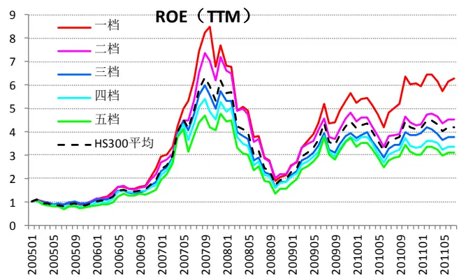
数据来源：国泰君安证券研究

图 3：ROE（TTM）五档累计收益-ZZ500
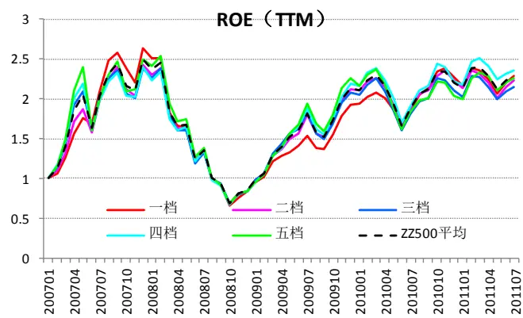
数据来源：国泰君安证券研究

表 2 ROE（TTM）有效性分析

| 股票池 | 市场 阶段 | 月均收益率差 |  |  |  | 因子排名与收益率排名相关性 |  |
| --- | --- | --- | --- | --- | --- | --- | --- |
|  |  | 一档-五档(%) | 有效性 | 一二档-四五档(%) | 有效性 | 相关系数 | P值 |
| HS300 总体 | 总体 | 0.80 | 60% | 0.58 | 55% | 0.11 | 0.03 |
|  | 牛市 | 0.40 | 54% | 0.42 | 50% | 0.07 | 0.43 |
|  | 熊市 | -1.85 | 75% | -1.42 | 75% | -0.48 | 0.00 |
|  | 震荡 | 1.94 | 76% | 1.33 | 68% | 0.33 | 0.00 |
| HS300 周期 | 总体 | 0.01 | 50% | 0.17 | 54% | 0.01 | 0.90 |
|  | 牛市 | 0.42 | 57% | 0.7 | 61% | 0.11 | 0.18 |
|  | 熊市 | -3.21 | 92% | -2.1 | 83% | -0.54 | 0.00 |
|  | 震荡 | 0.72 | 58% | 0.5 | 61% | 0.10 | 0.17 |
| HS300 非周期 | 总体 | 0.98 | 60% | 0.63 | 59% | 0.12 | 0.02 |
|  | 牛市 | -0.09 | 50% | 0.02 | 54% | 0.00 | 0.97 |
|  | 熊市 | -0.38 | 58% | -0.61 | 67% | -0.10 | 0.45 |
|  | 震荡 | 2.20 | 74% | 1.47 | 71% | 0.28 | 0.00 |
| ZZ500 总体 | 总体 | -0.32 | 54% | -0.3 | 56% | -0.06 | 0.35 |
|  | 牛市 | 0.26 | 45% | 0.07 | 49% | -0.02 | 0.82 |
|  | 熊市 | -1.46 | 54% | -1.03 | 62% | -0.13 | 0.30 |
|  | 震荡 | -0.87 | 50% | -0.65 | 63% | -0.10 | 0.54 |
| ZZ500 周期 | 总体 | -0.69 | 61% | -0.48 | 57% | -0.13 |  |
|  | 牛市 | 0.13 |  |  |  |  | 0.03 |
|  | 熊市 | -3.15 | 42% 77% | -0.08 -1.72 | 52% | -0.02 | 0.79 |
|  | 震荡 | -0.10 | 50% | -0.09 | 77% 50% | -0.42 | 0.00 |
| ZZ500 非周期 | 总体 | -0.25 | 56% | -0.25 | 56% | -0.13 -0.07 | 0.44 0.24 |
|  | 牛市 | 0.22 | 45% | 0.12 | 48% | -0.02 | 0.85 |
|  | 熊市 | -0.93 | 54% | -0.82 | 62% | -0.16 | 0.20 |
|  | 震荡 | -1.07 | 63% | -0.82 | 63% | -0.16 | 0.32 |

数据来源：国泰君安证券研究

## 3.1.2. ROA（TTM）

总体来看，ROA（TTM）的有效性不明显，在 HS300 中有一定的区分度，但是五档累计收益的差异是在 2010 年以来的震荡市中才表现出来的；在ZZ500 中完全无效。

具体来看：ROA（TTM）只在 HS300 股票池中、震荡市场环境下明显有效，其余情况下几乎无效；分周期非周期测算也不能提高该因子的有效性。

图 4：ROA（TTM）五档累计收益-HS300
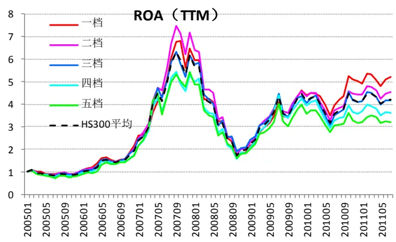
数据来源：国泰君安证券研究

图 5：ROA（TTM）五档累计收益-ZZ500
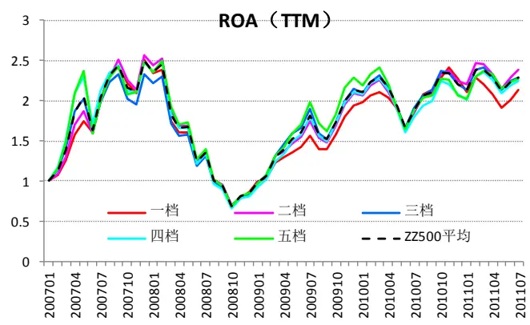
数据来源：国泰君安证券研究

表3ROA（TTM）有效性分析

| 股票池 | 市场 阶段 总体 | 月均收益率差 |  |  |  |
| --- | --- | --- | --- | --- | --- |
|  |  | 一档-五档(%) 有效性 | 一二档-四五档(%) | 有效性 | 相关系数 P值 |
|  |  | 0.55 | 62% 0.41 | 58% | 0.10 |
| HS300 总体 | 牛市 | -0.65 50% | -0.02 | 54% | -0.02 |
|  | 熊市 | -0.97 50% | -1.33 | 75% | 0.83 -0.24 0.06 |
|  | 震荡 | 1.91 74% | 1.28 | 76% | 0.30 0.00 |
|  | 总体 | 53% | -0.29 |  | 0.70 |
| HS300 周期 | 牛市 | 0.05 |  | 51% | -0.02 |
|  | 熊市 | -1.11 64% | -0.47 | 54% | -0.08 0.36 |
|  | 震荡 | -0.64 42% | -1.05 | 50% | -0.10 0.45 |
|  | 总体 | 1.11 63% 56% | 0.08 | 50% | 0.05 0.49 |
| HS300 非周期 |  | 0.90 | 0.38 | 54% | 0.08 0.11 |
|  | 牛市 | -0.23 54% | -0.38 | 57% | -0.09 0.29 |
|  | 熊市 震荡 | -0.69 67% | -0.97 | 75% | -0.17 0.20 |
|  |  | 2.24 71% | 1.38 | 71% | 0.29 0.00 |
| ZZ500 总体 | 总体 | -0.50 52% | -0.29 | 52% | 0.00 1.00 |
|  | 牛市 | -0.09 52% | 0.01 | 51% | 0.05 0.48 |
|  | 熊市 | -0.85 54% | -0.71 | 54% | -0.07 0.58 |
|  | 震荡 | -1.64 50% | -0.89 | 63% | -0.08 0.65 |
| ZZ500 周期 | 总体 | -0.91 63% | -0.71 | 61% | -0.12 0.04 |
|  | 牛市 | -0.36 55% | -0.32 | 55% | 0.00 0.97 |
|  | 熊市 | -2.22 85% | -1.69 | 69% | -0.40 0.00 |
|  | 震荡 | -1.04 63% | -0.75 | 75% | -0.16 0.32 |
| ZZ500 非周期 | 总体 | -0.40 54% | -0.25 | 54% | -0.04 0.47 |
|  | 牛市 | 0.00 55% | 0.04 | 48% | -0.05 0.56 |
|  | 熊市 | -0.59 46% | -0.57 | 62% | -0.03 0.81 |
|  | 震荡 | -1.75 63% | -0.92 | 50% | -0.06 0.70 |

数据来源：国泰君安证券研究

## 3.1.3. 毛利率（当期）

从五档累计收益图来看，HS300 中按收益率从高到低依次是 2、4、1、3、5档， ZZ500 的排序则为4、2、3、1、5档，没有明显规律。

具体来看，毛利率（当期）只在HS300股票池中、震荡市场环境下有一定的效果，但也不明显，其余情况下均无效。

图 6：毛利率（当期）五档累计收益-HS300
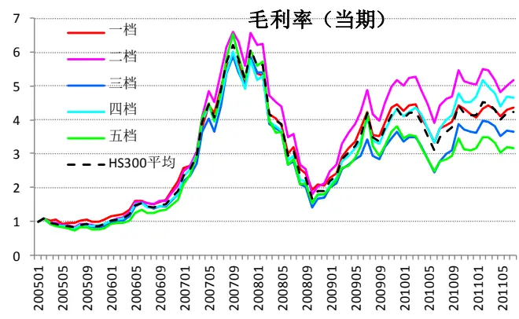
数据来源：国泰君安证券研究

图 7：毛利率（当期）五档累计收益-ZZ500
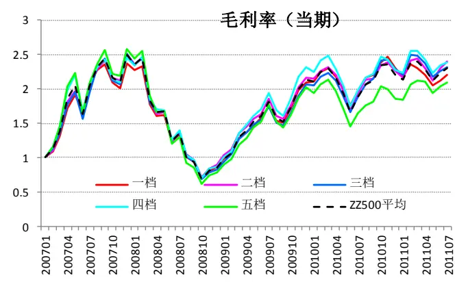
数据来源：国泰君安证券研究

表 4 毛利率（当期）有效性分析

| 股票池 | 市场 阶段 | 月均收益率差 |  |  |  |  |
| --- | --- | --- | --- | --- | --- | --- |
|  |  | 有效性 | 一二档-四五档(%) | 有效性 | 因子排名与收益率排名相关性 相关系数 P值 |  |
|  |  | 一档-五档(%) 0.05 | 0.07 | 54% | 0.51 |  |
| HS300 总体 | 总体 | 55% -1.82 |  | 46% | 0.03 |  |
|  | 牛市 | 57% | -0.72 |  | -0.08 0.33 |  |
|  | 熊市 | 0.65 50% | 0.34 | 50% | -0.05 0.70 |  |
|  | 震荡 | 1.23 66% | 0.56 | 55% | 0.14 0.05 |  |
| HS300 周期 | 总体 | -1.02 51% | -0.38 | 50% | 0.00 | 0.98 |
|  | 牛市 | -3.62 64% | -1.57 | 57% | -0.15 | 0.08 |
|  | 熊市 | 1.71 67% | 1.06 | 58% | 0.12 | 0.37 |
|  | 震荡 | 0.03 53% | 0.04 | 53% | 0.08 | 0.30 |
| HS300 非周期 | 总体 | 0.38 | 55% | 0.13 | 53% | 0.00 0.98 |
|  | 牛市 | -0.94 | 54% -0.57 | 54% | -0.11 | 0.18 |
|  | 熊市 | 0.09 | 50% | 0.54 58% | 0.00 | 1.00 |
|  | 震荡 | 1.45 | 63% 0.51 | 55% | 0.09 | 0.23 |
| ZZ500 | 总体 | -0.24 | 48% | -0.17 54% | 0.00 | 0.95 |
|  | 牛市 | -0.15 | 52% -0.25 | 60% | -0.04 | 0.63 |
| 总体 | 熊市 | 0.65 | 69% | 0.27 62% | 0.14 | 0.27 |

| ZZ500 周期 | 震荡 | -2.03 | 63% | -0.87 | 50% | -0.13 | 0.44 |
| --- | --- | --- | --- | --- | --- | --- | --- |
|  | 总体 | -0.90 | 59% | -0.71 | 63% | -0.11 | 0.07 |
|  | 牛市 | -0.91 | 61% | -0.59 | 64% | -0.11 | 0.16 |
|  | 熊市 | 0.34 | 54% | -0.21 | 46% | 0.02 |  |
|  | 震荡 | -2.86 | 75% | -2.00 | 88% | -0.31 | 0.90 0.05 |
| ZZ500 非周期 | 总体 | -0.07 | 52% | -0.01 | 52% | -0.03 | 0.67 |
|  | 牛市 | 0.04 | 45% | 0.03 | 42% | -0.05 | 0.56 |
|  | 熊市 | 0.86 | 62% | 0.40 | 62% | 0.11 | 0.39 |
|  | 震荡 | -2.04 | 63% | -0.87 | 50% | -0.16 | 0.32 |

数据来源：国泰君安证券研究

## 3.1.4. 毛利率（TTM）

从五档累计收益图来看，HS300 按收益率从高到低依次是 2、4、1、3、5 档， ZZ500 的排序则为 2、4、1、5、3 档，可见没有明显规律。

具体来看，毛利率（TTM）只在HS300 股票池中、震荡市场环境下有一定的有效性，但并不显著，其余情况下均无效。规律与毛利率（当期）一致。

图 8：毛利率（TTM）五档累计收益-HS300
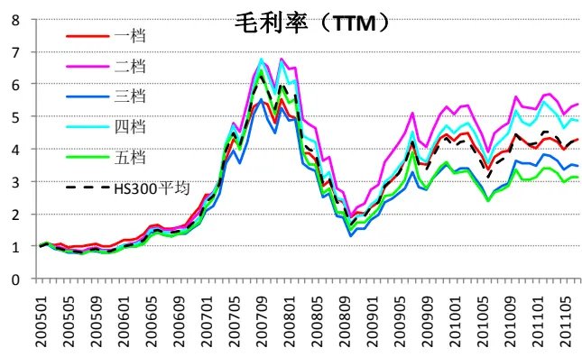
数据来源：国泰君安证券研究

图 9：毛利率（TTM）五档累计收益-ZZ500
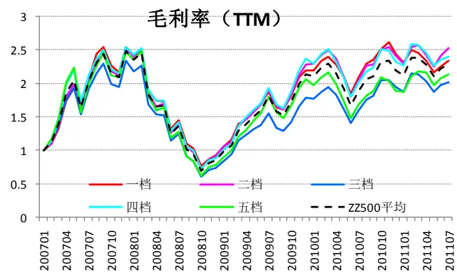
数据来源：国泰君安证券研究

表 5 毛利率（TTM）有效性分析

| 股票池 | 市场 阶段 | 月均收益率差 |  |  |  | 因子排名与收益率排名相关性 |  |
| --- | --- | --- | --- | --- | --- | --- | --- |
|  |  | 一档-五档(%) | 有效性 | 一二档-四五档(%) | 有效性 | 相关系数 | P值 |
| HS300 | 总体 | 0.07 | 53% | 0.04 | 54% | -0.02 | 0.76 |
| 总体 | 牛市 | -1.61 | 61% | -0.94 | 46% | -0.13 | 0.12 |

| HS300 周期 | 熊市 | 0.98 | 50% | 0.74 | 50% | -0.10 0.45 |
| --- | --- | --- | --- | --- | --- | --- |
|  | 震荡 | 1.03 | 63% | 0.54 | 55% | 0.18 |
|  |  |  |  |  | 0.10 |  |
|  | 总体 | -0.72 | 53% | -0.4 | 46% -0.01 | 0.80 |
|  | 牛市 | -2.86 | 68% | -1.77 | 50% -0.16 | 0.06 |
|  | 熊市 | 2.18 | 67% | 1.24 | 58% 0.16 | 0.23 |
| HS300 非周期 | 震荡 | -0.06 | 47% | 0.1 55% | 0.04 | 0.59 |
|  | 总体 | 0.64 | 55% | 0.07 -0.69 | 50% | 0.01 0.80 |
|  | 牛市 | -0.65 | 54% | 57% | -0.09 | 0.29 |
|  | 熊市 | 0.73 | 50% | 0.65 58% | -0.07 | 0.61 |
| ZZ500 总体 | 震荡 | 1.55 | 63% | 0.45 53% | 0.11 | 0.12 |
|  | 总体 | -0.15 | 52% | -0.07 50% | 0.00 | 0.95 |
|  | 牛市 | 0.13 | 48% 0.02 | 45% | 0.02 | 0.82 |
|  | 熊市 | 0.30 | 54% | 0.2 62% | 0.05 | 0.72 |
| ZZ500 周期 | 震荡 | -2.06 | 63% | -0.89 50% | -0.13 | 0.44 |
|  | 总体 | -0.56 | 63% | -0.81 65% | -0.10 | 0.11 |
|  | 牛市 | -0.48 | 64% -0.55 | 64% | -0.10 | 0.22 |
|  | 熊市 | 0.16 | 38% | -0.9 54% | -0.05 | 0.72 |
| ZZ500 非周期 | 震荡 | -2.04 | 63% -1.7 | 88% | -0.18 | 0.28 |
|  | 总体 | 0.05 | 48% | 0.02 | 48% | 0.00 0.95 |
|  | 牛市 | 0.38 | 48% 0.1 | 45% | -0.02 | 0.85 |
|  | 熊市 | 0.53 | 54% | 0.44 | 54% | 0.14 0.27 |
|  | 震荡 | -2.10 | 63% -1.02 | 50% | -0.14 | 0.40 |

数据来源：国泰君安证券研究

## 3.1.5. 净利率（当期）

在各个股票池中，当期净利率有效性均不明显。

图 10：净利率（当期）五档累计收益-HS300
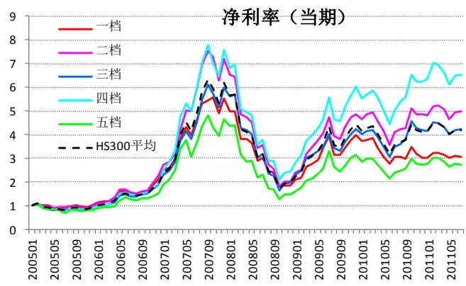
数据来源：国泰君安证券研究

图 11：净利率（当期）五档累计收益-ZZ500
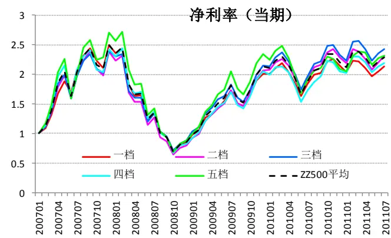
数据来源：国泰君安证券研究

## 表 6 净利率（当期）有效性分析

| 股票池 | 市场 阶段 | 月均收益率差 |  |  |  | 因子排名与收益率排名相关性 |  |
| --- | --- | --- | --- | --- | --- | --- | --- |
|  |  | 一档-五档(%) | 有效性 | 一二档-四五档(%) | 有效性 | 相关系数 | P值 |
| HS300 总体 | 总体 | -0.11 | 50% | -0.26 | 59% | -0.06 | 0.23 |
|  | 牛市 | -0.95 | 54% | -0.78 | 64% | -0.17 | 0.04 |
|  | 熊市 | -0.32 | 50% | -0.86 | 67% | -0.15 | 0.25 |
|  | 震荡 | 0.57 | 53% | 0.32 | 47% | 0.05 | 0.52 |
| HS300 周期 | 总体 | -1.20 | 62% | -0.75 | 53% | -0.08 | 0.11 |
|  | 牛市 | -3.12 | 71% | -2.02 | 54% | -0.18 | 0.03 |
|  | 熊市 | 0.98 | 50% | 0.38 | 50% | 0.04 | 0.75 |
|  | 震荡 | -0.48 | 58% | -0.16 | 53% | -0.05 | 0.49 |
|  | 总体 | 0.32 | 51% | 0.02 | 46% | 0.00 | 0.98 |
| HS300 非周期 | 牛市 | 0.02 | 39% | -0.19 | 61% | -0.10 | 0.26 |
|  | 熊市 | -1.21 | 58% | -0.89 | 67% | -0.15 | 0.25 |
|  | 震荡 | 1.02 | 63% | 0.46 | 55% | 0.12 | 0.11 |
| ZZ500 总体 | 总体 | -0.50 | 48% | -0.25 | 48% | -0.01 | 0.88 |
|  | 牛市 | -0.40 | 48% | -0.05 | 46% | 0.00 | 1.00 |
|  | 熊市 | -0.41 | 38% | -0.49 | 54% | 0.02 | 0.90 |
|  | 震荡 | -1.08 | 63% | -0.81 | 50% | -0.09 | 0.59 |
| ZZ500 周期 | 总体 | -1.01 | 59% | -0.62 | 59% | -0.10 | 0.09 |
|  | 牛市 | -1.21 | 64% | -0.38 |  | -0.14 |  |
|  | 熊市 | -0.06 | 54% | -0.99 | 58% 62% | -0.05 | 0.07 |
|  | 震荡 | -1.70 | 50% | -1.02 | 63% | -0.04 | 0.72 0.82 |
| ZZ500 非周期 | 总体 | -0.39 | 50% | -0.19 | 46% | -0.02 | 0.79 |
|  | 牛市 | -0.35 | 52% | 0.09 | 55% | 0.02 | 0.82 |
|  | 熊市 | -0.05 | 46% | -0.32 | 46% | -0.02 | 0.90 |
|  | 震荡 | -1.06 | 50% | -1.10 | 50% | -0.16 | 0.32 |

数据来源：国泰君安证券研究

## 3.1.6. 净利率（TTM）

与当期净利率一样，在各个股票池中，净利率（TTM）有效性不明显。

图 12：净利率（TTM）五档累计收益-HS300
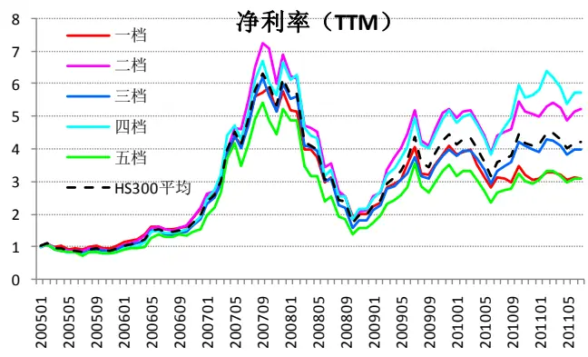

图 13：净利率（TTM）五档累计收益-ZZ500
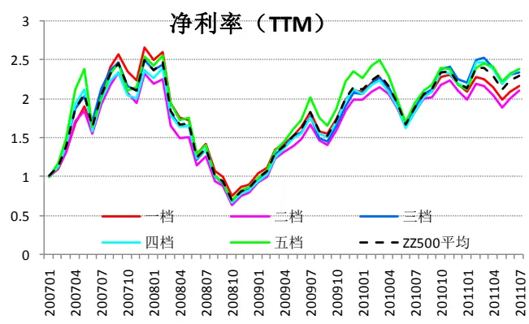

数据来源：国泰君安证券研究

数据来源：国泰君安证券研究

表7 净利率（TTM）有效性分析

| 股票池 | 市场 阶段 | 月均收益率差 |  |  |  | 因子排名与收益率排名相关性 |  |
| --- | --- | --- | --- | --- | --- | --- | --- |
|  |  | 一档-五档(%) | 有效性 | 一二档-四五档(%) | 有效性 | 相关系数 | P值 |
| HS300 总体 | 总体 | -0.29 | 51% | -0.23 | 53% | -0.04 | 0.45 |
|  | 牛市 | -1.62 | 61% | -0.84 | 61% | -0.15 | 0.07 |
|  | 熊市 | 0.30 | 50% | -0.36 | 58% | -0.17 | 0.20 |
|  | 震荡 | 0.51 | 55% | 0.25 | 55% | 0.09 | 0.23 |
| HS300 周期 | 总体 | -1.26 | 62% | -0.7 | 50% | -0.10 | 0.05 |
|  | 牛市 | -3.34 | 68% | -2.1 | 54% | -0.23 | 0.01 |
|  | 熊市 | 1.22 | 50% | 1.14 | 67% | 0.11 | 0.41 |
|  | 震荡 | -0.50 | 61% | -0.26 | 53% | -0.07 | 0.31 |
| HS300 非周期 | 总体 | 0.14 | 50% | -0.23 | 55% | -0.03 | 0.50 |
|  | 牛市 | -0.59 | 57% | -0.54 | 61% | -0.11 | 0.19 |
|  | 熊市 | -0.59 | 67% | -0.61 | 58% | -0.17 | 0.20 |
|  | 震荡 | 0.92 | 61% | 0.13 | 50% | 0.06 | 0.39 |
| ZZ500 总体 | 总体 | -0.48 | 52% | -0.41 | 52% | -0.06 | 0.30 |
|  | 牛市 | -0.29 | 55% | -0.21 | 52% | -0.07 | 0.35 |
|  | 熊市 | -0.75 | 46% | -0.59 | 54% | -0.05 |  |
|  | 震荡 | -0.86 | 50% | -0.95 | 50% | -0.04 | 0.67 |
| ZZ500 周期 | 总体 | -1.08 |  |  |  |  | 0.82 |
|  | 牛市 | -0.98 | 56% | -1.14 | 59% | -0.14 | 0.03 |
|  | 熊市 | -0.71 | 58% | -0.88 -1.53 | 58% | -0.12 | 0.12 |
|  | 震荡 | -2.11 | 54% |  | 69% | -0.15 | 0.25 |
| ZZ500 非周期 | 总体 |  | 50% | -1.56 | 50% | -0.18 | 0.28 |
|  | 牛市 | -0.12 | 48% | -0.32 | 54% | -0.01 0.05 | 0.86 0.54 |
|  | 熊市 | 0.09 -0.25 | 55% | -0.11 -0.52 | 48% 62% | -0.09 | 0.46 |
|  | 震荡 | -0.74 | 46% 63% | -0.86 | 63% | -0.13 | 0.44 |

数据来源：国泰君安证券研究

## 3.1.7. 股本乘数 EM

总体来看，HS300股票池中，股本乘数较大的组合表现较好，但在 ZZ500中规律不明显。

具体来看：从市值特征看，股本乘数在 HS300 中明显有效，而在 ZZ500有效性不明显；从行业属性看，股本乘数在周期与非周期中的表现没有明显差异；从市场环境看，股本乘数在牛市中最有效，而在熊市和震荡市中效果不明显。

图 14：股本乘数五档累计收益-HS300
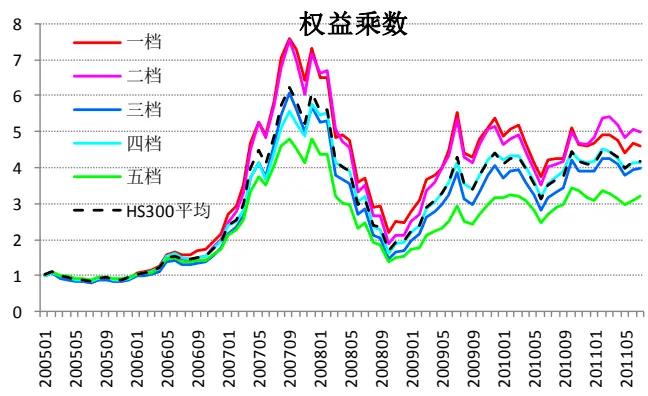
数据来源：国泰君安证券研究

图 15：股本乘数五档累计收益-ZZ500
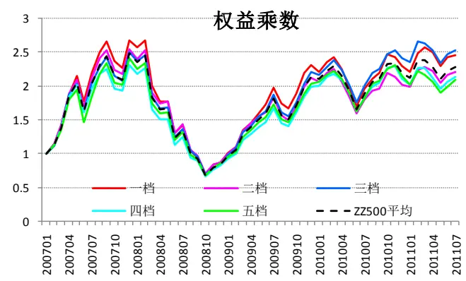
数据来源：国泰君安证券研究

表8 股本乘数有效性分析

| 股票池 | 市场 阶段 | 月均收益率差 |  |  |  | 因子排名与收益率排名相关性 |  |
| --- | --- | --- | --- | --- | --- | --- | --- |
|  |  | 一档-五档(%) | 有效性 | 一二档-四五档(%) | 有效性 | 相关系数 | P值 |
| HS300 总体 | 总体 | 0.61 | 62% | 0.5 | 62% | 0.13 | 0.01 |
|  | 牛市 | 1.93 | 82% | 1.69 | 86% | 0.38 | 0.00 |
|  | 熊市 | 0.53 | 42% | -0.12 | 58% | -0.08 | 0.57 |
|  | 震荡 | -0.34 | 47% | -0.19 | 50% | 0.01 | 0.86 |
| HS300 周期 | 总体 | 0.63 | 56% | 0.45 | 58% | 0.05 | 0.35 |
|  | 牛市 | 2.90 | 82% | 2.21 | 79% | 0.35 | 0.00 |
|  | 熊市 | -0.56 | 58% | -1 | 58% | -0.10 | 0.45 |
|  | 震荡 | -0.67 | 58% | -0.39 | 53% | -0.13 | 0.08 |
| HS300 非周期 | 总体 | 0.62 | 59% | 0.47 | 56% | 0.12 | 0.02 |
|  | 牛市 | 1.19 | 68% | 1.05 | 68% | 0.25 |  |
|  | 熊市 | 1.34 | 58% | 0.59 | 58% | 0.12 | 0.00 |
|  | 震荡 | -0.03 | 47% | 0 | 47% |  | 0.37 0.77 |
| ZZ500 总体 | 总体 | 0.37 | 57% | 0.24 |  | 0.02 |  |
|  | 牛市 | 0.49 | 61% | 0.23 | 61% | 0.12 | 0.05 |
|  | 熊市 | -0.58 | 69% | -0.42 | 67% 62% | 0.16 | 0.04 |
|  | 震荡 | 1.42 | 88% | 1.37 |  | -0.16 | 0.20 |
| ZZ500 周期 | 总体 | 1.57 |  |  | 75% | 0.43 | 0.01 |
|  | 牛市 |  | 63% | 0.7 | 52% | 0.13 | 0.03 |
|  | 熊市 | 2.22 | 64% | 1.13 | 55% | 0.15 | 0.06 |
|  | 震荡 | -0.77 2.71 | 46% | -0.94 | 54% | -0.01 | 0.95 |
| ZZ500 非周期 |  |  | 75% | 1.6 | 50% | 0.29 | 0.07 |
|  | 总体 | 0.13 | 50% | 0.12 | 54% | 0.03 | 0.61 |
|  | 牛市 熊市 | 0.17 | 58% | -0.01 | 48% | 0.06 | 0.42 |
|  |  | -0.33 | 85% | -0.19 1.16 | 46% | -0.20 0.28 | 0.11 0.09 |
|  | 震荡 | 0.70 | 75% |  | 63% |  |  |

数据来源：国泰君安证券研究

## 3.1.8. 有息负债率

总体来看，HS300 股票池中，五档累计收益表现没有明显规律，但在ZZ500 中排列很有序，但是区分度不是很高。

具体来看：从市值特征看，有息负债率在 ZZ500 中有效性较高；从行业属性看，在周期股中的有效性更高；从市场环境看，有息负债率在 HS300中的震荡市阶段明显负向有效（即有息负债率越高，收益越低），而在ZZ500 中各个市场阶段均是正向有效。

图 16：有息负债率五档累计收益-HS300
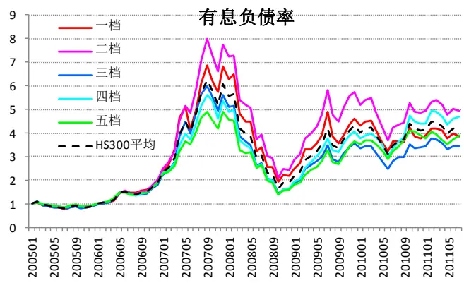
数据来源：国泰君安证券研究

图 17：有息负债率五档累计收益-ZZ500
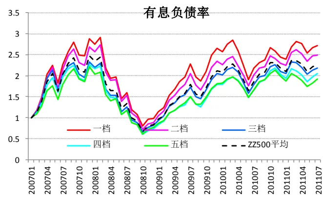
数据来源：国泰君安证券研究

表9 有息负债率有效性分析

| 股票池 | 市场 阶段 总体 | 月均收益率差 |  |  |  | 因子排名与收益率排名相关性 |  |
| --- | --- | --- | --- | --- | --- | --- | --- |
|  |  | 一档-五档(%) | 有效性 | 一二档-四五档(%) | 有效性 | 相关系数 | P值 |
|  |  | 0.24 | 53% | 0.21 | 55% | 0.02 | 0.69 |
| HS300 | 牛市 | 1.93 | 68% | 1.75 | 64% | 0.26 | 0.00 |
| 总体 | 熊市 | 0.62 | 67% | 0.63 | 83% | 0.24 | 0.06 |
|  | 震荡 | -1.12 | 63% | -1.05 | 61% | -0.22 | 0.00 |
|  | 总体 | -0.17 | 54% | 0.45 | 54% | -0.01 | 0.80 |
|  | 牛市 | 1.02 | 57% | 1.95 | 71% | 0.17 | 0.04 |
| 周期 | 熊市 | 0.30 | 58% | 1.04 | 58% | 0.19 | 0.14 |
|  | 震荡 | -1.20 | 66% | -0.85 | 61% | -0.21 | 0.00 |
|  | 总体 | 0.35 | 53% | 0.03 | 51% | -0.01 | 0.88 |
| HS300 非周期 | 牛市 | 1.95 | 61% | 1.24 | 61% | 0.17 | 0.04 |
| ZZ500 总体 | 熊市 | 1.12 | 67% | 0.38 | 50% | 0.06 | 0.66 |
|  | 震荡 | -1.08 | 58% | -0.98 | 55% | -0.16 | 0.03 |
|  | 总体 | 0.84 | 56% | 0.68 | 61% | 0.14 | 0.02 |
|  | 牛市 | 0.73 | 52% | 0.66 | 63% | 0.14 |  |
|  | 熊市 | 0.44 | 54% | 0.44 | 54% | 0.07 | 0.06 0.58 |
|  | 震荡 | 1.94 | 75% | 1.53 | 75% | 0.44 | 0.00 |
| ZZ500 周期 | 总体 | 1.32 | 57% | 0.8 |  |  | 0.14 |
|  | 牛市 | 1.23 | 45% | 0.67 | 69% | 0.09 |  |
|  | 熊市 | 1.58 | 85% | 0.72 | 64% | -0.01 0.25 | 0.94 |
|  | 震荡 | 1.27 | 63% | 1.5 | 69% 88% | 0.24 | 0.05 0.14 |
| ZZ500 非周期 | 总体 | 0.74 | 54% | 0.65 | 65% | 0.12 | 0.04 |
|  | 牛市 | 0.67 | 61% | 0.56 | 64% | 0.12 | 0.11 |
|  | 熊市 | 0.27 | 38% | 0.47 | 62% | 0.08 | 0.54 |
|  | 震荡 | 1.78 | 50% | 1.31 | 75% | 0.19 | 0.25 |

数据来源：国泰君安证券研究

## 3.1.9. 单位净利润现金流含量

总体来看，无论是在 HS300 和 ZZ500 中，单位净利润现金流含量都没有明显的有效性。

具体来看，只有在ZZ500非周期股中的震荡市阶段，单位净利润现金流含量比较有效，其余情况下都无效。

图 18：单位净利润现金流含量五档累计收益-HS300
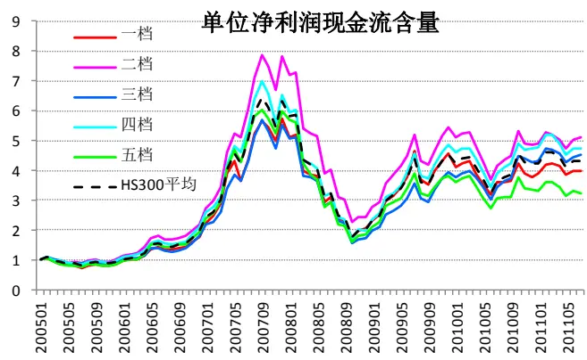
数据来源：国泰君安证券研究

图 19：单位净利润现金流含量五档累计收益-ZZ500
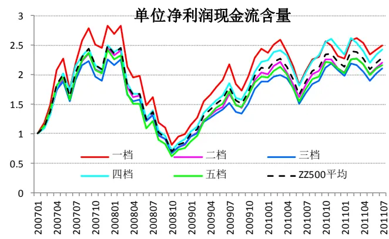
数据来源：国泰君安证券研究

表 10 单位净利润现金流含量有效性分析

| 股票池 | 市场 阶段 总体 | 月均收益率差 |  |  |  | 因子排名与收益率排名相关性 |  |
| --- | --- | --- | --- | --- | --- | --- | --- |
|  |  | 一档-五档(%) | 有效性 | 一二档-四五档(%) | 有效性 | 相关系数 | P值 |
|  |  | 0.24 | 56% | 0.15 | 58% | 0.05 | 0.32 |
| HS300 总体 | 牛市 | 0.27 | 50% | 0.09 | 57% | 0.04 | 0.68 |
|  | 熊市 | 0.84 | 67% | 0.37 | 75% | 0.14 | 0.28 |
|  | 震荡 | 0.03 | 58% | 0.13 | 53% | 0.03 | 0.67 |
|  | 总体 | 0.59 | 55% | 0.36 | 50% | 0.08 | 0.14 |
| HS300 周期 | 牛市 | 0.43 | 54% | 0.24 | 54% | 0.08 | 0.33 |
|  | 熊市 | 1.05 | 50% | 0.93 | 67% | 0.16 | 0.23 |
|  | 震荡 | 0.57 | 58% | 0.27 | 42% | 0.04 |  |
|  | 总体 | 0.04 | 54% | -0.03 | 51% | 0.06 | 0.54 0.22 |
| HS300 非周期 | 牛市 | 0.14 | 61% | -0.05 | 50% | 0.10 |  |
|  | 熊市 | 0.57 | 58% | 0.02 | 42% | 0.13 | 0.24 |
|  | 震荡 | -0.21 | 53% | -0.03 | 50% | 0.02 | 0.34 |
|  | 总体 | 0.33 | 57% | 0.08 | 59% | 0.09 | 0.83 0.16 |
| ZZ500 总体 | 牛市 | 0.36 | 52% | 0.05 | 54% | 0.03 |  |
|  | 熊市 | 0.29 | 62% | -0.05 | 38% |  | 0.65 |
|  | 震荡 | 0.26 |  |  |  | 0.15 | 0.25 |
|  | 总体 |  | 75% | 0.41 | 75% | 0.16 | 0.32 |
| ZZ500 周期 |  | -0.61 | 57% | -0.54 | 54% | -0.05 | 0.40 |
|  | 牛市 | -0.55 | 58% | -0.82 | 52% | -0.08 | 0.28 |
|  | 熊市 | -0.66 | 62% | 0.14 | 54% | -0.01 | 0.95 |
|  | 震荡 | -0.80 | 50% | -0.52 | 75% | 0.01 | 0.94 |
| ZZ500 非周期 | 总体 | 0.46 | 52% | 0.21 | 56% | 0.06 | 0.32 |
|  | 牛市 | 0.41 | 42% | 0.16 | 52% | -0.02 | 0.76 |
|  | 熊市 | 0.47 | 62% | -0.03 | 46% | 0.15 | 0.25 |
|  | 震荡 | 0.66 | 75% | 0.76 | 75% | 0.28 | 0.09 |

数据来源：国泰君安证券研究

## 3.1.10.税息折旧及摊销前利润率

无论是从总体收益表现来看，还是从具体的有效性分析表来看，税息折旧及摊销前利润率都没有明显的有效性。

图20：税息折旧及摊销前利润率五档累计收益-HS300 图21：税息折旧及摊销前利润率五档累计收益-ZZ500

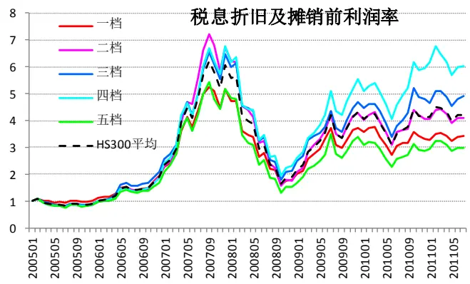
数据来源：国泰君安证券研究

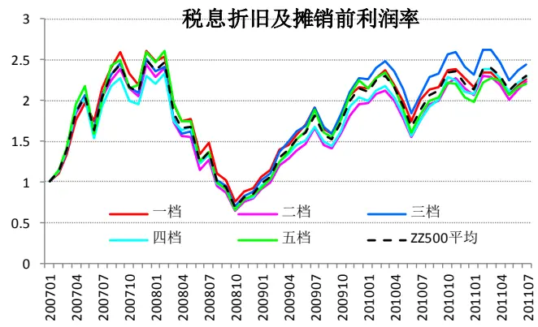
数据来源：国泰君安证券研究

表 11 税息折旧及摊销前利润率有效性分析

| 股票池 | 市场 阶段 | 月均收益率差 |  |  |  | 因子排名与收益率排名相关性 |  |
| --- | --- | --- | --- | --- | --- | --- | --- |
|  |  | 一档-五档(%) | 有效性 | 一二档-四五档(%) | 有效性 | 相关系数 | P值 |
| HS300 总体 | 总体 | -0.03 | 46% | -0.26 | 53% | -0.02 | 0.74 |
|  | 牛市 | -0.86 | 54% | -0.38 | 57% | -0.09 | 0.29 |
|  | 熊市 | 0.73 | 58% | -0.67 | 58% | -0.06 | 0.66 |
|  | 震荡 | 0.35 | 58% | -0.05 | 47% | 0.05 | 0.49 |
| HS300 周期 | 总体 | -1.20 | 53% | -0.55 | 53% | -0.05 | 0.36 |
|  | 牛市 | -3.27 | 57% | -1.85 | 61% | -0.17 | 0.04 |
|  | 熊市 | 0.76 | 58% | 0.58 | 50% | 0.11 | 0.41 |
|  | 震荡 | -0.29 | 53% | 0.04 | 53% | 0.00 | 0.97 |
|  | 总体 | 0.10 | 51% | -0.22 | 54% | -0.09 | 0.08 |
| HS300 | 牛市 | 0.08 | 43% | 0.05 | 43% | -0.09 | 0.29 |
| 非周期 | 熊市 | -0.65 | 50% | -0.48 | 50% | -0.18 | 0.18 |
| ZZ500 | 震荡 | 0.34 | 58% | -0.32 | 53% | -0.06 | 0.39 |
|  | 总体 | -0.24 | 48% | -0.16 | 54% | -0.04 | 0.54 |
|  | 牛市 | -0.20 | 52% | 0.04 | 49% | -0.05 | 0.52 |
|  | 熊市 | -0.03 | 38% | -0.41 | 62% | 0.01 | 0.95 |
| 总体 ZZ500 周期 | 震荡 | -0.75 | 50% | -0.6 | 50% | -0.04 | 0.82 |
|  | 总体 | -1.41 | 59% | -0.61 | 52% | -0.06 |  |
|  | 牛市 | -1.98 | 67% | -0.54 | 58% | -0.10 | 0.36 |
|  | 熊市 | 0.39 |  |  |  |  | 0.22 |
| ZZ500 非周期 | 震荡 |  | 54% | -0.35 | 38% | 0.07 | 0.58 |
|  | 总体 | -1.99 | 50% | -1.37 | 50% | -0.09 | 0.59 |
|  | 牛市 | -0.14 -0.03 | 46% 45% | 0.01 0.29 | 44% 45% | -0.01 0.03 | 0.93 0.70 |
|  | 熊市 | 0.02 | 62% | -0.17 | 54% | 0.00 | 1.00 |
|  | 震荡 | -0.90 | 63% | -0.84 | 63% | -0.16 | 0.32 |

数据来源：国泰君安证券研究

## 3.1.11. 1 个月收益率动量（反转）

从五档累计收益图中可以看出，HS300中第1 档组合明显战胜市场指数和其他档，而在ZZ500 中第 1档跑输市场指数。可见，1 个月收益率在HS300 里表现为动量效应，而在 ZZ500中则为反转效应，但都不是很明显。

具体来看，1 个月收益率的有效性在周期与非周期股中没有明显差异，在熊市中有明显的负向有效性（即反转效应），在 HS300 的牛市中有正向有效性（即动量效应）。

图 22：1 个月收益率动量五档累计收益-HS300
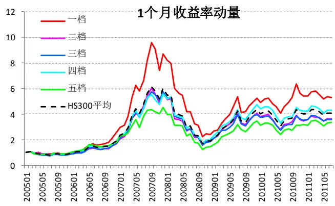
数据来源：国泰君安证券研究

图 23：1 个月收益率动量五档累计收益-ZZ500
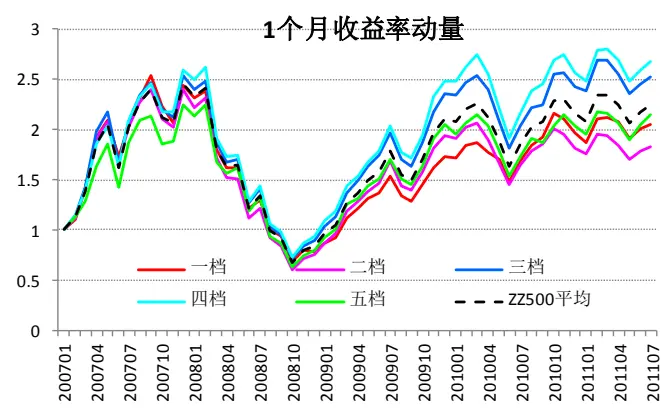
数据来源：国泰君安证券研究

表 12 1 个月收益率动量有效性分析

| 股票池 | 市场 阶段 | 月均收益率差 |  |  |  | 因子排名与收益率排名相关性 |  |
| --- | --- | --- | --- | --- | --- | --- | --- |
|  |  | 一档-五档(%) | 有效性 | 一二档-四五档(%) | 有效性 | 相关系数 | P值 |
| HS300 总体 | 总体 | 0.71 | 56% | 0.25 | 55% | 0.03 | 0.56 |
|  | 牛市 | 1.71 | 64% | 1 | 61% | 0.15 | 0.08 |
|  | 熊市 | -0.41 | 58% | -0.57 | 50% | -0.04 | 0.75 |
|  | 震荡 | 0.32 | 55% | -0.04 | 47% | -0.03 | 0.64 |
| HS300 周期 | 总体 | 0.65 | 59% | 0.43 | 55% | 0.08 | 0.10 |
|  | 牛市 | 1.24 | 64% | 1.45 | 64% | 0.12 | 0.17 |
|  | 熊市 | -2.40 | 58% | -1.09 | 42% | -0.03 | 0.85 |
| HS300 非周期 | 震荡 | 1.19 | 61% | 0.16 | 47% | 0.09 | 0.21 |
|  | 总体 | 0.25 | 54% | 0.08 | 51% | 0.00 | 0.98 |
|  | 牛市 | 0.44 | 54% | 0.31 | 50% | -0.03 | 0.77 |
|  | 熊市 | -0.09 | 50% | -0.27 | 42% | 0.03 |  |
|  | 震荡 | 0.22 | 55% | 0.03 | 50% | 0.01 | 0.85 0.91 |
| ZZ500 总体 | 总体 | -0.22 | 54% | -0.47 | 61% | -0.13 | 0.03 |
|  | 牛市 | 0.22 | 48% | -0.2 | 57% | -0.09 | 0.23 |
|  | 熊市 | -1.23 | 62% | -1.26 | 77% | -0.28 |  |
|  | 震荡 | -0.37 | 50% | -0.42 | 63% | -0.14 | 0.02 |
|  | 总体 | -0.64 | 48% | -0.54 |  |  | 0.40 |
| ZZ500 周期 | 牛市 | -0.27 |  |  | 56% | -0.11 | 0.08 |
|  | 熊市 | -1.48 | 39% | -0.32 -1.08 | 55% | -0.08 | 0.30 |
|  | 震荡 | -0.79 | 69% 50% | -0.54 | 62% 50% | -0.25 0.04 | 0.04 |
|  | 总体 | -0.31 | 54% | -0.55 | 57% | -0.11 | 0.82 |
| ZZ500 非周期 | 牛市 | -0.04 |  |  |  |  | 0.06 |
|  | 熊市 | -1.20 | 58% | -0.3 | 55% | -0.10 | 0.22 |
|  | 震荡 |  | 62% | -1.31 | 77% | -0.23 | 0.06 |
|  |  | 0.02 | 75% | -0.35 | 38% | 0.01 | 0.94 |

数据来源：国泰君安证券研究

## 3.1.12. 3 个月收益率动量（反转）

总体来看，HS300 中，各档组合的收益表现没有明显规律，ZZ500中五档累计收益的排序为5、4、3、2、1档，因子表现出了显著的负向有效性。

具体来看，3 个月收益率在牛市和熊市都表现为负向有效（即反转效应），且在牛市的有效性显著，而在震荡市中表现为一定的动量效应，但并不显著。

图 24：3 个月收益率动量（反转）五档累计收益-HS300 图 25：3 个月收益率动量（反转）五档累计收益-ZZ500

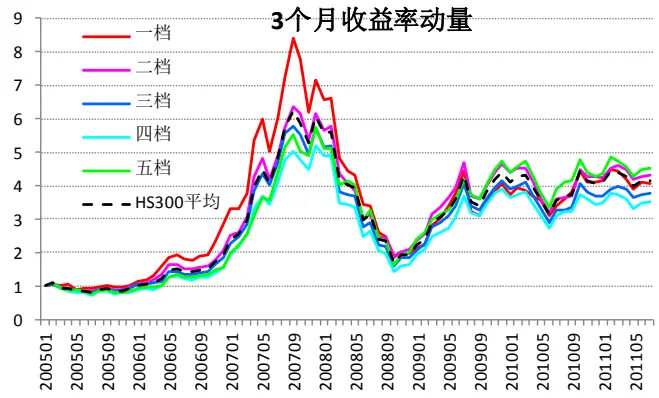
数据来源：国泰君安证券研究

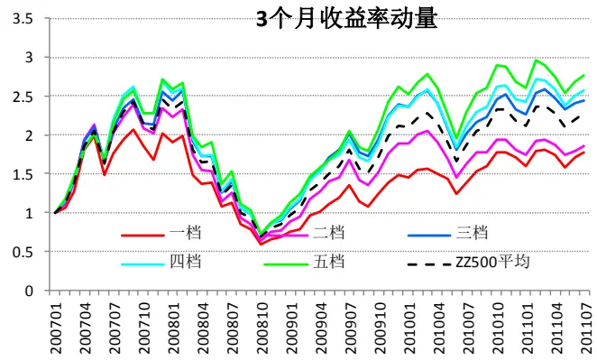
数据来源：国泰君安证券研究

表 13 3 个月收益率动量（反转）有效性分析

| 股票池 | 市场 阶段 | 月均收益率差 |  |  |  | 因子排名与收益率排名相关性 |  |
| --- | --- | --- | --- | --- | --- | --- | --- |
|  |  | 一档-五档(%) | 有效性 | 一二档-四五档(%) | 有效性 | 相关系数 | P值 |
| HS300 总体 | 总体 | -0.03 | 51% | 0.11 | 46% | 0.01 | 0.92 |
|  | 牛市 | -1.06 | 57% | -0.81 | 64% | -0.11 | 0.21 |
|  | 熊市 | -1.84 | 50% | -0.85 | 58% | -0.03 | 0.80 |
|  | 震荡 | 1.29 | 53% | 1.09 | 55% | 0.10 | 0.17 |
| HS300 周期 | 总体 | -0.13 | 54% | -0.02 | 50% | -0.06 | 0.23 |
|  | 牛市 | -0.15 | 57% | -0.69 | 61% | -0.11 | 0.18 |
|  | 熊市 | -4.07 | 58% | -2.08 | 58% | -0.19 | 0.14 |
|  | 震荡 | 1.14 | 50% | 1.13 | 61% | 0.02 | 0.80 |
|  | 总体 | -0.15 | 47% | -0.02 | 45% | -0.02 | 0.63 |
| HS300 | 牛市 | -2.39 | 57% | -1.45 | 61% | -0.20 | 0.02 |
| 非周期 | 熊市 | 0.60 | 67% | 0.61 | 58% | 0.06 | 0.66 |
| ZZ500 | 震荡 | 1.27 | 55% | 0.84 | 66% | 0.08 | 0.26 |
|  | 总体 | -0.93 | 50% | -0.77 | 59% | -0.10 | 0.11 |
|  | 牛市 | -1.28 | 58% | -1 | 63% | -0.19 | 0.01 |
|  | 熊市 | -0.92 | 38% | -0.67 | 54% | 0.00 | 1.00 |
| ZZ500 周期 | 震荡 | 0.47 | 63% | 0.1 | 50% | 0.14 | 0.40 |
|  | 总体 | -1.86 | 65% | -1.14 | 65% | -0.14 | 0.02 |
|  | 牛市 | -2.21 | 67% | -1.28 | 67% | -0.20 | 0.01 |
|  | 熊市 | -2.70 | 69% | -1.94 | 69% |  |  |
| ZZ500 非周期 | 震荡 |  |  |  |  | -0.13 | 0.30 |
|  | 总体 | 0.93 -0.83 | 50% | 0.74 -0.73 | 50% 63% | 0.06 -0.11 | 0.70 0.06 |
|  | 牛市 | -1.30 | 52% 61% | -1 | 67% | -0.18 | 0.02 |
|  | 熊市 | -0.25 | 31% | -0.41 | 62% | -0.03 | 0.81 |
|  | 震荡 | 0.19 | 50% | -0.16 | 50% | 0.03 | 0.88 |

数据来源：国泰君安证券研究

## 3.1.13. 6 个月收益率动量（反转）

总体来看，五档的累计收益表现没有很明显的规律，但在 ZZ500 中第一档明显跑输其他档，即有一定的反转效应。

具体来看，与 3 个月收益率相似，6 个月收益率在牛市和熊市表现为反转效应，而在震荡市表现为动量效应。

图26：6个月收益率五档累计收益-HS300
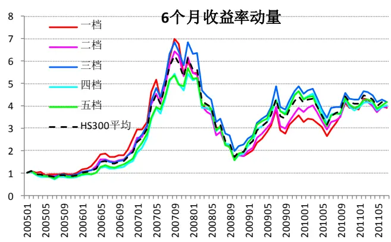
数据来源：国泰君安证券研究

图 27：6个月收益率五档累计收益-ZZ500
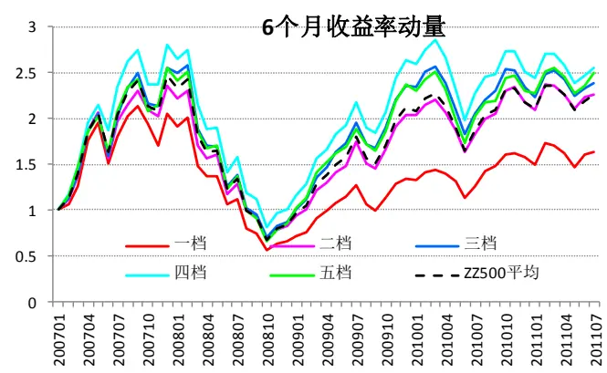
数据来源：国泰君安证券研究

表 14 6 个月收益率动量（反转）有效性分析

| 股票池 | 市场 阶段 | 月均收益率差 |  |  |  | 因子排名与收益率排名相关性 |  |
| --- | --- | --- | --- | --- | --- | --- | --- |
|  |  | 一档-五档(%) | 有效性 | 一二档-四五档(%) | 有效性 | 相关系数 | P值 |
| HS300 总体 | 总体 | -0.03 | 51% | -0.03 | 50% | 0.02 | 0.69 |
|  | 牛市 | -1.71 | 61% | -1.43 | 57% | -0.14 | 0.09 |
|  | 熊市 | -1.66 | 58% | -1.39 | 67% | -0.22 | 0.10 |
|  | 震荡 | 1.72 | 58% | 1.43 | 61% | 0.22 | 0.00 |
| HS300 周期 | 总体 | 0.22 | 51% | 0.18 | 53% | 0.02 | 0.70 |
|  | 牛市 | -1.39 | 57% | -1.57 | 61% | -0.13 | 0.13 |
|  | 熊市 | -3.51 | 58% | -1.97 | 50% | -0.19 | 0.14 |
|  | 震荡 | 2.58 | 61% | 2.14 | 63% | 0.19 | 0.01 |
|  | 总体 | -0.25 | 50% | -0.05 | 46% | 0.03 | 0.61 |
| HS300 非周期 | 牛市 | -2.04 | 64% | -1.33 | 57% | -0.16 | 0.05 |
|  | 熊市 | 0.26 | 58% | -0.32 | 50% | 0.01 | 0.95 |
|  | 震荡 | 0.91 | 58% | 0.99 | 63% | 0.17 | 0.02 |
| ZZ500 总体 | 总体 | -0.87 | 59% | -0.54 | 50% | -0.13 | 0.04 |
|  | 牛市 | -0.90 | 58% | -0.53 | 49% | -0.10 |  |
|  | 熊市 | -1.41 | 62% | -0.98 | 46% | -0.18 | 0.19 |
|  | 震荡 | 0.10 | 38% | 0.26 | 38% | -0.18 | 0.14 |
| ZZ500 | 总体 | -0.76 | 59% | -0.85 | 61% | -0.07 | 0.28 0.23 |
| 周期 | 牛市 | -0.47 | 58% | -0.86 | 58% | -0.08 | 0.28 |
|  | 熊市 | -2.86 | 62% | -2.21 | 69% | -0.15 0.25 |  |
|  |  | 1.47 |  |  |  |  |  |
|  | 震荡 |  | 38% 56% | 1.37 -0.52 | 38% 0.09 | 0.59 |  |
| 总体 |  | -0.78 |  |  | 57% -0.08 | 0.18 |  |
|  | ZZ500 |  |  |  |  |  | -0.93 |
| 非周期 | 牛市 熊市 |  | 58% | -0.72 | 61% | -0.12 0.13 |  |
|  |  | -0.80 | 46% | -0.54 | 54% | 0.01 0.95 |  |
|  | 震荡 | -0.13 | 63% | 0.31 | 50% -0.08 | 0.65 |  |

数据来源：国泰君安证券研究

## 3.1.14. 1 个月换手率

从累计收益图中可以看出，HS300中累计收益表现依次为 3、4、2、5、1档，换手率适中的组合表现比较好；而在ZZ500中明显表现出了 1个月换手率越低收益越高的规律。

具体来看，1 个月换手率在 HS300 中有效性不高，只是在熊市中有比较明显的负向有效性；而在 ZZ500 中，各个市场阶段下都非常有效；另外，非周期股中的有效性相对更高。

图28：1个月换手率五档累计收益-HS300
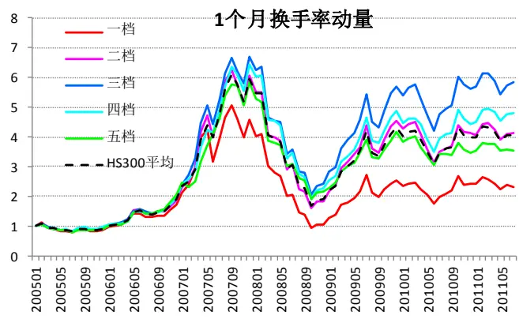
数据来源：国泰君安证券研究

图 29：1个月换手率五档累计收益-ZZ500
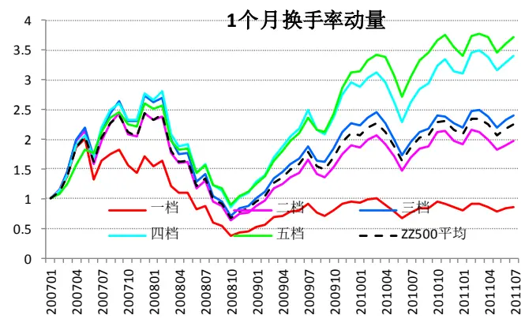
数据来源：国泰君安证券研究

表 15 1 个月换手率有效性分析

| 股票池 | 市场 | 月均收益率差 |  |  |  | 因子排名与收益率排名相关性 |  |
| --- | --- | --- | --- | --- | --- | --- | --- |
|  | 阶段 | 一档-五档(%) | 有效性 | 一二档-四五档(%) | 有效性 | 相关系数 | P值 |
| HS300 | 总体 | -0.14 | 53% | -0.07 | 58% | -0.06 | 0.22 |
| 总体 | 牛市 | 0.51 | 50% | 0.38 | 39% | -0.04 | 0.62 |
|  | 熊市 | -3.05 | 75% | -1.86 | 67% | -0.35 | 0.01 |
| HS300 周期 | 震荡 | 0.30 | 53% | 0.16 | 47% | 0.01 0.86 |  |
|  | 总体 | 0.48 | 53% | 0.21 | 50% |  |  |
|  |  |  |  |  | 0.03 | 0.50 |  |
|  | 牛市 熊市 | 0.95 -3.24 | 57% 75% | 0.52 -2.44 | 46% 0.04 -0.34 | 0.62 |  |
|  | 震荡 | 1.30 |  | 75% |  | 0.01 0.04 |  |
| HS300 非周期 | 总体 | -0.79 | 58% 62% | 0.81 | 61% | 0.15 |  |
|  | 牛市 | -0.34 | 61% | -0.41 -0.19 | 60% 61% | -0.12 0.02 |  |
|  | 熊市 | -3.38 |  |  | -0.15 | 0.08 |  |
|  | 震荡 | -0.31 | 75% | -1.42 | 67% 58% | -0.27 0.04 |  |
|  | 总体 |  | 58% | -0.27 | -0.05 | 0.49 |  |
| ZZ500 总体 |  | -2.23 | 74% | -1.56 | 72% -0.33 | 0.00 |  |
|  | 牛市 熊市 | -2.31 | 70% | -1.48 | 71% | -0.29 0.00 |  |
|  | 震荡 | -3.04 | 85% | -2.25 | 77% -0.51 | 0.00 |  |
|  | 总体 | -0.60 | 75% | -0.82 | 75% | -0.25 0.12 |  |
| ZZ500 周期 |  | -1.49 | 54% | -1.44 67% | -0.15 | 0.01 |  |
|  | 牛市 | -1.87 | 55% | -1.53 | 67% -0.15 | 0.06 |  |
|  | 熊市 震荡 | -1.51 | 54% | -2.4 85% | -0.31 | 0.01 |  |
|  |  | 0.11 | 50% | 0.48 | 63% | 0.06 0.70 |  |
| ZZ500 非周期 | 总体 | -2.38 | 74% | -1.6 | 70% | -0.33 0.00 |  |
|  | 牛市 | -2.39 | 70% | -1.49 | 67% | -0.31 0.00 |  |
|  | 熊市 | -3.37 | 92% | -2.31 77% | -0.49 | 0.00 |  |
|  | 震荡 | -0.72 | 63% | -0.92 | 75% | -0.16 0.32 |  |

数据来源：国泰君安证券研究

## 3.1.15. 3 个月换手率

3 个月换手率的五档累计收益图与 1 个月换手率的图比较相似，在HS300中规律不明显，而在ZZ500 中排列很有序。

具体从有效性分析表来看，3个月换手率在ZZ500中（尤其是非周期股中）反转效应非常明显，其他股票池中则不显著。

图 30：3 个月换手率五档累计收益-HS300

图 31：3 个月换手率五档累计收益-ZZ500

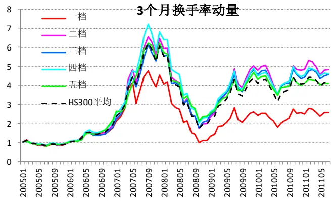
数据来源：国泰君安证券研究

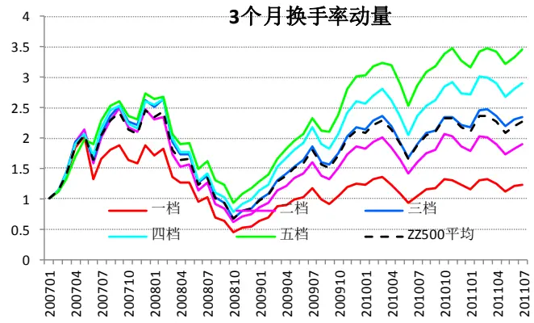
数据来源：国泰君安证券研究

表 16 3 个月换手率有效性分析

| 股票池 | 市场 阶段 | 月均收益率差 |  |  |  | 因子排名与收益率排名相关性 |  |
| --- | --- | --- | --- | --- | --- | --- | --- |
|  |  | 一档-五档(%) | 有效性 | 一二档-四五档(%) | 有效性 | 相关系数 | P值 |
| HS300 总体 | 总体 | -0.18 | 55% | 0.01 | 49% | -0.04 | 0.38 |
|  | 牛市 | -0.26 | 54% | 0.19 | 43% | -0.05 | 0.53 |
|  | 熊市 | -2.71 | 67% | -1.63 | 50% | -0.21 | 0.11 |
|  | 震荡 | 0.67 | 47% | 0.39 | 53% | 0.01 | 0.86 |
| HS300 周期 | 总体 | 0.35 | 54% | 0.53 | 50% | 0.07 | 0.15 |
|  | 牛市 | 0.39 | 57% | 0.87 | 43% | 0.09 | 0.28 |
|  | 熊市 | -2.95 | 67% | -1.61 | 58% | -0.12 | 0.37 |
|  | 震荡 | 1.36 | 58% | 0.94 | 58% | 0.12 | 0.10 |
|  | 总体 | -0.66 | 59% | -0.25 | 55% | -0.11 | 0.03 |
| HS300 | 牛市 | -0.66 | 64% | -0.19 | 57% | -0.15 | 0.07 |
| 非周期 | 熊市 | -2.32 | 50% | -1.26 | 58% | -0.13 | 0.34 |
| ZZ500 | 震荡 | -0.13 | 58% | 0.02 | 47% | -0.07 | 0.33 |
|  | 总体 | -1.45 | 63% | -1.04 | 63% | -0.22 | 0.00 |
|  | 牛市 | -1.41 | 58% | -0.92 | 57% | -0.17 | 0.03 |
|  | 熊市 | -2.12 | 77% | -1.81 | 77% | -0.40 | 0.00 |
| ZZ500 周期 | 震荡 | -0.55 | 63% | -0.58 | 75% | -0.19 | 0.25 |
|  | 总体 | -0.87 | 50% | -0.55 | 52% | -0.05 | 0.43 |
|  | 牛市 | -1.44 | 55% | -0.65 | 52% | -0.10 | 0.22 |
|  | 熊市 | -0.64 | 46% | -1.01 | 62% |  |  |
| ZZ500 非周期 | 震荡 |  |  |  |  | -0.05 | 0.72 |
|  | 总体 | 1.14 -1.73 | 63% | 0.62 -1.17 | 63% 65% | 0.15 -0.23 | 0.36 0.00 |
|  | 牛市 | -1.68 | 70% 64% | -0.98 | 55% | -0.16 | 0.04 |
|  | 熊市 | -2.38 | 85% | -1.98 | 85% | -0.37 | 0.00 |
|  | 震荡 | -0.88 | 75% | -0.67 | 75% | -0.33 | 0.04 |

数据来源：国泰君安证券研究

## 3.1.16. 6 个月换手率

6 个月换手率的有效性规律与 3 个月换手率比较一致，只是有效性有所减弱。

图32：6个月换手率五档累计收益-HS300
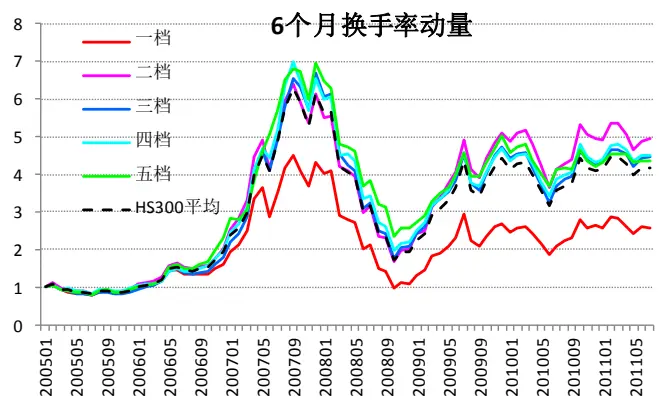
数据来源：国泰君安证券研究

图 33：6个月换手率五档累计收益-ZZ500
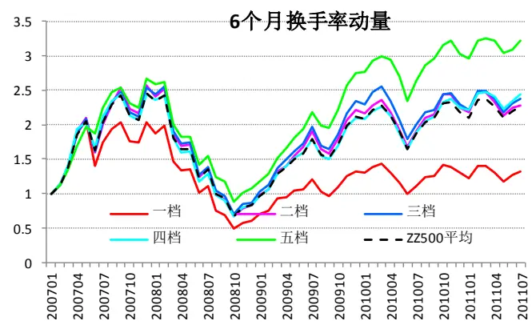
数据来源：国泰君安证券研究

表176个月换手率有效性分析

| 股票池 | 市场 阶段 | 月均收益率差 |  |  |  | 因子排名与收益率排名相关性 相关系数 P值 |
| --- | --- | --- | --- | --- | --- | --- |
|  |  | 一档-五档(%) | 有效性 | 一二档-四五档(%) | 有效性 |  |
| HS300 总体 | 总体 | -0.32 | 51% -0.04 | 51% | -0.03 | 0.58 |
|  | 牛市 | -0.58 | 50% -0.16 | 57% | -0.11 | 0.21 |
|  | 熊市 | -1.99 | 67% -1.06 | 50% | -0.19 | 0.14 |
|  | 震荡 | 0.40 | 53% 0.38 | 53% | 0.08 | 0.26 |
| HS300 周期 | 总体 | 0.11 | 53% | 0.39 49% |  | 0.02 0.69 |
|  | 牛市 | -0.79 | 54% 0.01 | 39% | -0.04 | 0.62 |
|  | 熊市 | -2.14 | 50% -1.05 | 50% |  | -0.18 0.18 |
|  | 震荡 | 1.49 | 58% 1.12 | 55% | 0.13 | 0.08 |
| HS300 非周期 | 总体 | -0.60 | 56% | -0.34 50% | -0.09 | 0.09 |
|  | 牛市 | -0.62 | 54% | -0.47 | 57% | -0.15 0.07 |
|  | 熊市 | -1.56 | 67% -0.94 | 50% | -0.15 | 0.25 |
|  | 震荡 | -0.27 | 55% | -0.06 | 45% | -0.02 0.80 |
|  | 总体 | -1.22 | 54% -0.62 | 57% | -0.12 | 0.05 |
| ZZ500 总体 | 牛市 | -1.25 | 52% -0.54 | 57% | -0.09 | 0.23 |
|  | 熊市 | -1.61 | 54% -0.93 | 54% |  | -0.15 0.22 |
|  | 震荡 | -0.45 | 63% -0.8 | 75% | -0.25 | 0.12 |
| ZZ500 周期 | 总体 | -0.34 |  |  |  | 0.95 |
|  | 牛市 |  | 52% -0.1 | 50% | 0.00 |  |
|  | 熊市 | -0.62 | 55% -0.27 | 48% 38% | -0.01 | 0.88 |
|  | 震荡 | -0.80 1.55 | 54% 0.07 |  |  | -0.08 0.50 |
| ZZ500 非周期 | 总体 | -1.50 | 63% 0.34 59% | 63% 57% | 0.16 -0.15 | 0.32 0.02 |
|  | 牛市 | -1.52 | 55% | -0.75 -0.56 | 52% | -0.06 0.42 |
|  | 熊市 | -1.90 | 62% -1.2 | 69% | -0.28 | 0.03 |
| 震荡 | -0.76 | 75% | -0.8 | 63% | -0.28 | 0.09 |

数据来源：国泰君安证券研究

## 3.1.17. 机构覆盖数

从累计收益表现来看，HS300 中机构覆盖数较高的组合累计收益较高，而在 ZZ500中区分度很小。

具体来看，机构覆盖数的有效性并不高，在HS300（主要是非周期股中）的震荡市中有一定的正向有效性，而在有些股票池中表现出了负向有效性。

图34：机构覆盖数五档累计收益-HS300
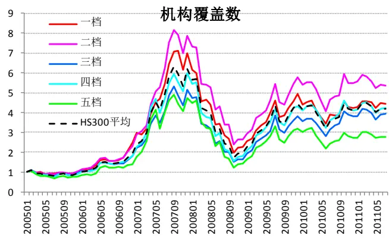
数据来源：国泰君安证券研究

图 35：机构覆盖数五档累计收益-ZZ500
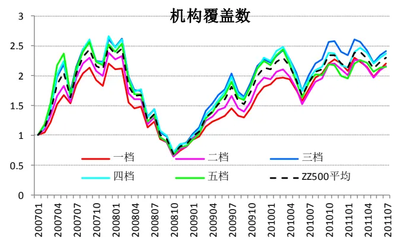
数据来源：国泰君安证券研究

表18 机构覆盖数有效性分析

| 股票池 | 市场 阶段 | 月均收益率差 |  |  |  | 因子排名与收益率排名相关性 |  |  |
| --- | --- | --- | --- | --- | --- | --- | --- | --- |
|  |  | 一档-五档(%) | 有效性 | 一二档-四五档(%) | 有效性 | 相关系数 | P值 |  |
| HS300 总体 | 总体 | 0.32 | 53% | 0.24 | 51% | 0.03 | 0.53 |  |
|  | 牛市 | -0.79 | 54% | -0.59 | 54% | -0.08 | 0.38 |  |
|  | 熊市 | 0.09 | 42% | 0.13 | 42% | -0.14 | 0.28 |  |
|  | 震荡 | 1.20 | 61% | 0.88 | 58% | 0.17 | 0.02 |  |
| HS300 周期 | 总体 | -0.44 | 54% | -0.06 | 49% | -0.04 | 0.39 |  |
|  | 牛市 | -0.45 | 57% | -0.09 | 50% | -0.09 | 0.28 |  |
|  | 熊市 | -1.59 | 58% | -0.89 | 67% | -0.10 | 0.45 |  |
|  | 震荡 | -0.06 | 50% | 0.23 | 58% | 0.01 | 0.89 |  |
| HS300 | 总体 | 0.51 | 54% | 0.39 | 55% | 0.08 | 0.11 |  |
| 非周期 | 牛市 | -1.39 | 61% | -1.23 | 54% | -0.11 | 0.18 |  |
| ZZ500 总体 非周期 | 熊市 | 1.76 | 58% | 1.34 | 58% | 0.20 | 0.13 |  |
|  | 震荡 | 1.52 | 63% | 1.28 | 61% | 0.19 | 0.01 |  |
|  | 总体 | -0.37 | 54% | -0.38 | 54% | -0.03 | 0.65 |  |
|  | 牛市 | -0.74 | 55% | -0.54 | 51% | -0.07 | 0.33 |  |
|  | 熊市 | 0.49 -0.26 | 54% | 0.13 | 46% | 0.12 | 0.33 |  |
|  | 震荡 总体 | 0.06 | 63% 43% | -0.21 | 63% | -0.08 | 0.65 |  |
|  | 牛市 | 0.35 | 45% | -0.09 | 59% | -0.05 | 0.40 |  |
|  | ZZ500 周期 熊市 |  |  | -0.13 -1.02 | 55% | -0.01 | 0.88 |  |
|  |  | -1.80 | 77% |  | 85% | -0.34 | 0.01 |  |
|  | ZZ500 | 震荡 | 1.89 | 63% | 1.6 | 63% | 0.25 | 0.12 |
| 总体 |  | -0.37 | 56% | -0.44 | 54% | -0.05 | 0.43 |  |
| 牛市 |  | -0.73 | 61% | -0.74 | 58% | -0.12 | 0.11 |  |
| 熊市 震荡 |  | 0.69 -0.59 | 62% 63% | 0.47 -0.69 | 62% 63% | 0.15 -0.06 | 0.22 0.70 |  |

数据来源：国泰君安证券研究

## 3.1.18. 评级调整次数

从累计收益表现来看，HS300 中各档累计收益从高到低依次是 1、3、2、4、5档，ZZ500中为4、2、1、3、5档。可见，机构评级调整在 HS300中比较有效，而在ZZ500中效果不明显，但下调最多的第五档表现明显差于其他各档。

具体来看，评级调整在HS300 中更有效，在非周期股中有效性高于周期股，在HS300中牛市和震荡市中更有效，而在ZZ500 中熊市比较有效。

图36：评级调整次数五档累计收益-HS300
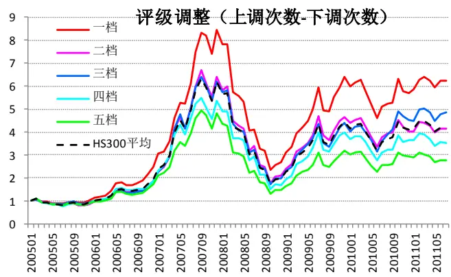
数据来源：国泰君安证券研究

图 37：评级调整次数五档累计收益-ZZ500
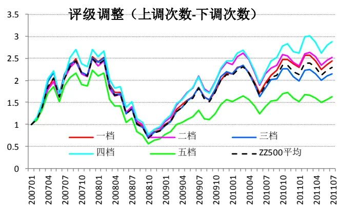
数据来源：国泰君安证券研究

表19 评级调整次数有效性分析

| 市场 | 月均收益率差 |  |  |  | 因子排名与收益率排名相关性 |  |
| --- | --- | --- | --- | --- | --- | --- |
| 阶段 | 一档-五档(%) | 有效性 | 一二档-四五档(%) | 有效性 | 相关系数 | P值 |
| 总体 | 1.07 | 69% | 0.65 | 67% | 0.17 | 0.00 |
| 牛市 | 1.52 | 79% | 1.17 | 75% | 0.21 | 0.01 |
| 熊市 | -0.23 | 50% | -0.06 | 58% | 0.15 | 0.25 |
| 震荡 | 1.15 | 68% | 0.49 | 68% | 0.14 | 0.05 |
| 总体 | 0.92 | 59% | 0.5 | 50% | -0.02 | 0.70 |
| 牛市 | 1.28 | 68% | 0.65 | 54% | -0.09 | 0.31 |
| 熊市 | -0.15 | 50% | -0.19 | 58% | 0.02 | 0.90 |
| 震荡 | 0.99 | 55% | 0.61 | 50% | 0.02 | 0.80 |
| 总体 | 1.47 | 77% | 0.68 | 67% | 0.15 | 0.00 |
| 牛市 | 1.81 | 86% | 1.42 | 71% | 0.24 | 0.00 |
| 熊市 | 0.20 | 58% | -0.53 | 58% | 0.05 | 0.70 |
| 震荡 | 1.62 | 76% | 0.51 | 71% | 0.12 | 0.09 |
| 总体 | 0.78 | 63% | 0.22 | 52% | 0.05 | 0.40 |
| 牛市 | 0.80 | 58% | 0.03 | 43% | 0.03 | 0.71 |
| 熊市 | 0.84 | 69% | 0.85 | 77% | -0.01 | 0.95 |
| 震荡 | 0.62 | 75% | 0.07 | 50% | 0.25 | 0.12 |
| 总体 | 0.64 | 56% | 0.09 | 50% | 0.02 | 0.74 |
| 牛市 | 0.63 | 52% | 0.07 | 52% | 0.04 | 0.62 |
| 熊市 | 0.53 | 62% | 0.11 | 54% | 0.17 | 0.18 |
| 震荡 | 0.84 | 63% | 0.13 | 38% | -0.30 | 0.06 |
| 总体 | 0.94 | 69% | 0.24 | 57% | 0.16 | 0.01 |
| 牛市 | 0.99 | 64% | -0.04 | 52% | 0.14 | 0.08 |
| 熊市 | 1.00 | 85% | 1.1 | 85% | 0.22 | 0.08 |
| 震荡 | 0.62 | 63% | 0.02 | 50% | 0.14 | 0.40 |

数据来源：国泰君安证券研究

## 3.2.财务因子有效性的衰减

## 3.2.1. 从“时滞”角度看有效性衰减

从不同时滞下有效因子的个数可以看出，无论是 HS300 中，还是 ZZ500中，随着时滞的增长，有效因子的个数迅速降低，说明时滞对估值和财务因子有效性的影响非常明显，即离财报公布的时间越近的月份财务和估值因子的有效性越高。

表 20 因子时滞衰减表-HS300

| 时滞 长度 | 估值类因子（7个） 完全有效 | 部分有效 | 财务成长类（15个） 完全有效 部分有效 | 完全有效 | 财务质量类（10个） 部分有效 |  |
| --- | --- | --- | --- | --- | --- | --- |
| 1 个月 时滞 | PE,扣除非经 常损益的PE，PS PEG，PS |  | 营业收入单季、同比、TTM增 长率，净利润单季、同比、TTM 增长率，经营现金流单季、同 比、TTM增长率，ROE单季、 同比、TTM增长率，ROA单 |  | 净利率（TTM）， 权益乘数，ROE (TTM),ROA (TTM)，当期毛 | 毛利率 (TTM)，当期 净利率单位净 利润现金流含 量税息折旧及 |
| 2 个月 时滞 | PS,PB | PEG，企业 价值倍数 | 季、同比、TTM增长率 净利润单季增长率 | 营业收入单季增 长率 净利润同比增长 | 利率 | 摊销前利润率 有息负债率 |
| 3 个月 及以上 的时滞 |  | 市现率 | 营业收入单季、同比增长率， 净利润单季增长率 | 率，经营现金流 同比增长率， ROE（TTM）增 长率，ROA (TTM)增长率， | 权益乘数，净利润 现金流含量 |  |

数据来源：国泰君安证券研究

表 21 因子时滞衰减表-ZZ500

| 时滞长度 | 估值类因子（7个）完全有效 部分有效 | 财务成长类（15个）完全有效 部分有效 | 财务质量类（10个）完全有效 部分有效 |
| --- | --- | --- | --- |
| 1 个月时滞 | PE，扣除非经常损益的 市现率市盈率，PEG | 营业收入单季、同比、TTM增长率，净利润单季、同比、TTM增长率，经经营现金营现金流同比增长率，ROE单季、同流 TTM 增比、TTM增长率，ROA单季、同比、长率TTM 增长率 | 当期毛利率，当期净利率,ROE( TTM),权益乘ROA（TTM)，净利数，有息率（TTM），毛利率负债率（TTM)，税息折旧及摊销前利润率 |
| 2 个月时滞 | PE，PS，PB，扣除非经常企业价值倍 损益的市盈数 率，市现率 |  | 有息负债率 |
| 3 个月及以上的时滞 | 企业价值倍PS,PB数 | 经营现金经营现金流单季增长率 流同比增长率 | 有息负债率，净利润现金流含量， |

数据来源：国泰君安证券研究

## 3.2.2. 从“质量”角度看有效性衰减

随着财务报告质量的下降（即年报、半年报、季报），有效因子的数量也有一定程度的下降，可见不同质量的财报公布后，估值和财务因子的有效性也有明显差异，且质量越高的财报公布后因子有效性越高。

有效性衰减的检验结果告诉我们，在做多因子选股模型时，针对不同的时滞的和所用会计报告的质量，可以动态调整估值和财务类因子的权重，改进模型的效果。

表 22 因子质量衰减表-HS300

| 财报 | 估值类因子（7个） 完全有效 部分有效 |  | 财务成长类（15个） 完全有效 部分有效 |  | 财务质量类（10个） 完全有效 部分有效 |  |
| --- | --- | --- | --- | --- | --- | --- |
| 年报及1 季报 | 市现率 | PE,扣除非经 常损益的PE， | 营业收入单季、同比、TTM 增长率，净利润单季、同比、 TTM增长率，经营现金流单 季、同比增长率，ROE单季、 同比、TTM 增长率，ROA | ROA 同比增长率 | ROE (TTM), 权益乘数 | ROA(TTM) |
| 半年报 |  | 市销率PS | 单季、TTM 增长率 ROA单季、同比增长率 营业收入单季、同比增长率， | 经营现金流同比、 TTM 增长率，ROA | 权益乘数 | 毛利率(TTM) |
| 3季报 |  | PEG，PS，企 业价值倍数 | 净利润单季、同比、TTM增 长率，经营现金流单季增长 率 | 同比、TTM 增长率， ROE（TTM）增长 率 |  |  |

数据来源：国泰君安证券研究

表 23 因子质量衰减表-ZZ500

| 财报 | 估值类因子（7个） |  | 财务成长类（15个） |  | 财务质量类（10个） |
| --- | --- | --- | --- | --- | --- |
|  | 完全有效 部分有效 |  | 完全有效 部分有效 |  | 完全有效 部分有效 |
|  | PEG，市销 |  | 净利润单季、同比增长 营业收入单季、同 |  | 当期毛利率，当期净利率， |
| 年报及 1季报 | PE,扣除非经 |  | 率，经营现金流单季增长 | 比、TTM增长率， | ROE ( TTM ), ROA |
|  | 率PS，市 常损益的PE 现率，企业 |  | 率，ROE单季、同比、 | 净利润 TTM 增长 | (TTM)，有息负债率，净 |
|  | 价值倍数 |  | TTM 增长率 ROA 单季、 | 率，经营现金流同 | 利润现金流含量，净利率 |
|  |  |  | 同比、TTM 增长率， | 比、TTM增长率 | (TTM)，毛利率（TTM） |
| 半年报 |  | 企业价值倍 市销率，PB | 净利润单季增长率， | 净利润同比增长率， | 有息负债 |

|  | 数 | ROE 单季增长率 | 率 |
| --- | --- | --- | --- |
| 3季报 | PS，PB，企业价值倍数 |  | 有息负债率，净利润现金流含量，权益乘数 |

数据来源：国泰君安证券研究

## 3.3. 因子有效性的汇总分析

## 3.3.1. 有效因子一览

表24 财务质量类、价量类和分析师预期类因子中有效因子一览

|  | 首选因子 | 备选因子 |  |
| --- | --- | --- | --- |
| 总体HS300 | 权益乘数、评级调整 | ROE（TTM)，ROA（TTM)，有息负债率 |  |
|  | 周期 |  | 净利率（TTM），权益乘数，有息负债率 |
|  | 非周期 | 1个月换手率，评级调整 | ROE（TTM)，权益乘数，有息负债率，3个月换手率 |
| ZZ500非周期 | 总体 | 有息负债率，1个月换手率，3个月换手率 |  |
|  | 周期 | 3个月收益率（反转)，1个月换手率 | 权益乘数 |
|  | 有息负债率，3个月收益率（反转)，1个月换手率，3个月换手率，评级调整 | 6个月换手率 |  |

数据来源：国泰君安证券研究

注：首选因子是指全样本区间内满足有效性标准的因子，备选因子指在部分市场阶段（如牛市中）有效性较高的因子。

## 3.3.2. 几点总结

## 3.3.2.1. 财务质量类因子的整体有效性不是很高

相对于财务成长类的因子，财务质量类因子的有效性不高。毛利率（当期、TTM）、净利率（当期、TTM）等指标在各个股票池中的有效性都不明显。ROE（TTM）和 ROA（TTM）只在 HS300 股票池中的震荡市阶段明显有效。权益乘数在牛市中特别有效。有息负债率在 HS300 的牛市中正向有效，在震荡市中负向有效，而在 ZZ500 中主要表现为正向有效。有息负债率一方面能反映财务成本大小，也能反映财务杠杆大小。

## 3.3.2.2. 价量类因子在不同股票池和不同市场阶段下的有效性差异大

在 HS300 股票池中，1 个月收益率在牛市中有较明显的动量效应，3 个月收益率和6个月收益率都在震荡市中有动量效应而在牛市中有反转效应。而在 ZZ500 中，1 个月、3 个月、6 个月收益率都表现出一定的反转效应。

换手率（无论 1 个月、3 个月还是 6 个月）主要表现出来的都是负向有效性，即换手率较高的组合收益表现较差。换手率在ZZ500 中的有效性明显高于 HS300，非周期股中的有效性明显高于周期股。

3.3.2.3. 分析师预期类因子有效性：HS300 高于 ZZ500,非周期好于周期分析师预期的两个指标中，机构覆盖数的有效性不明显，只在 HS300（尤其是非周期股）中的震荡市有效。评级调整的有效性比较明显，而且HS300 中有效性明显高于ZZ500，非周期明显高于周期。

## 3.3.2.4. 财务类因子有效性在财报公布后有明显的衰减现象

通过比较离最新财报公布时间不同时滞的月份里因子有效性的差异，我们发现财务类（包括财务成长类和财务质量类）因子的有效性存在明显的衰减现象，即离财报公布最近的月份里因子有效性最高。在建立多因子选股模型时，我们可以考虑在不同时滞长度的月份赋予财务类因子不同的权重，以体现其有效性的差异，优化选股模型的效果。

## 3.3.3. 因子有效性的汇总结果

我们制定了如下规则：

1. TOP 20%组合与 BOTTOM 20%组合的月平均收益率差显著（一般取0.5%以上）且有效性较高（一般在60%之上）。

2. TOP 40%组合与 BOTTOM 40%组合的月平均收益率差显著（一般取0.5%以上）且有效性较高（一般在60%之上）。

3. 在稳定性分析中，因子排名与下期收益率排名的线性关系显著（至少在10%的水平上显著）。

根据这三条规则，我们得到了因子有效性汇总表（表25）。其中：

1. “√√”表明 TOP 与 BOTTOM 月收益率差同时满足条件 1、2；因子排名与收益率排名在5%的水平上显著。

3. 在动量因子部分，“√+”表明前、后收益率符号一致，呈现动量效应；
“√-”表明前、后收益率符号相反，呈现反转效应。

4. “×”代表月收益率差不满足条件1、2 中任一个；因子排名与收益率排名不具有显著的线性关系。

5. “√√”， “√”代表平均收益率差显著和线性相关性显著，规则与“√√”，“√”相似，但其显著性反应的是有效性的反面，如正向的因子却得出了负的收益率差和负相关系数的结果，或负向因子却得出了正的收益率差和正相关系数。

表 25 因子有效性汇总

| 指标 | 市场 状况 | HS300 |  |  | ZZ500 |  |  |
| --- | --- | --- | --- | --- | --- | --- | --- |
|  |  | 整体 | 周期 | 非周期 | 整体 | 周期 | 非周期 |
|  |  | 收益 | 相关 收益 | 相关 收益 相关 | 收益 相关 | 收益 相关 | 收益 相关 |
|  |  | 率差 系数 | 率差 系数 | 率差 系数 | 率差 系数 | 率差 系数 | 率差 系数 |

| ROE ( TTM ) | 总体 | √ | W | X | X | √ | W√ | X | X | √ | W | × | X |
| --- | --- | --- | --- | --- | --- | --- | --- | --- | --- | --- | --- | --- | --- |
|  | 牛市 | X | X | √ | × | X | X | X | X | X | X | × | X |
|  | 震荡 | W | W | W√ | × | W√ | W | X | X | X | X | W | X |
|  | 熊市 | W | W | √ | W | V | X | √ | X | W | W | √ | X |
|  | ROA (TTM ) | 总体 | √ | √√ | X | X | X | X X | X | W | W | X | X |
| 牛市 |  | X | X | √ | X | X | X X | X | X | X | X | X |  |
| 震荡 |  | W | √√ | √ | √√ × | √√ | X | X | W | × | 7 | X |  |
| 熊市 |  | √ | √ | X | X | √√ X | X | X | W | W√ | 7 | X |  |
| 总体 |  | X | X | X | × × | X | X | X | √ | √ | × | X |  |
| 牛市 |  | X X | √ | √ | X | X | X | X | √ | X | × | X |  |
| 毛 利 率 TTM | 震荡 | √ | W | X | X | X X | X | X | W | W√ | √ | X |  |
|  | 熊市 | X | X | √ | × X | × | W | X | X | X | √√ | X |  |
|  | 总体 | X | X | X | × | × | X × | X | W | × | X | × |  |
|  | 牛市 | √ | X | √ | × | X | X X | X | √ | × | X | X |  |
| 当期 | 震荡 | √ | X | √ | √ × | X | X | X | √ | X | V | X |  |
|  | 熊市 | X | X | √ | × | X | X √ | X | X | × | X | X |  |
|  | 总体 | X | X | √ | × | X | X X | X | √ | √ | × | X |  |
|  | 牛市 | X | X | √ | 小 | × | X X | X | V | V | × | X |  |
|  | 震荡 | X X | X | X | × | × | X | X | V | × | × | X |  |
| 利 率 TTM | 熊市 | √ | X | X | X | X | X | X | √ | X | X | X |  |
|  | 总体 | X | X | √ | √ √ |  | × X | × | 7 | W | × | X |  |
|  | 牛市 | W | √ | √ | √ X | X | × | X | X | × | × | × |  |
|  | 震荡 | X | X | X | √ × | X | X | X | X | X | W | X |  |
|  |  | 熊市 | X X | √ | X | √ | X | X | X | √ | X | √ | X |
| 权益乘数 | 总体 | V√ | W√ | X | X X | √ | X | W | √ | √√ | × | X |  |
|  | 牛市 |  |  |  | √W√√WW |  | √ | W | √ | √ | X | X |  |
|  | 震荡 | X | X | X | √ X | X | W | W |  | √√√ |  |  |  |
|  | 熊市 | X | X | X | X X | X | W | X | X | X | √ | X |  |
|  | 总体 | X | X | X | X × | X | √ | WW |  | X |  | W√ |  |
| 有息负债率 | 牛市 |  | √√√√ |  | √ | √ |  |  | √ | X |  | √ |  |
|  | 震荡 |  | √√√√ |  | √ | W√ |  |  |  | X | √ | X |  |
|  | 熊市 | W | X | X | √ X | X | X | X | √√ | W | X | X |  |
|  |  |  | X | X X | X | X | X | X | X | X | X | X |  |
| 净利润现金流 含量 | 总体 | X | × | X | × X | X | X | × | × | X | × | X |  |
|  | 牛市 | X |  |  |  |  | W | X | X | X |  | √√√ |  |
|  | 震荡 | X | X | X √ | X | X X |  |  | √ |  |  |  |  |
|  | 熊市 | W | X | X | X X | X | X | × |  | X | X | X |  |
|  | 总体 | X | X X | √ | × X | X | X | X | × √ | X | X | X |  |
| EBITDA/reven ue | 牛市 | X |  | √ | X | X | X | X |  | X | X | X |  |
|  | 震荡 | X | X | X | X X | X | X | X | X | X | √ | X |  |
|  | 熊市 | X | X | × | X X | X | X | X | X | X | X | X |  |
|  | 总体 | X | × | X | × X | X |  | √- √√-X√-√-√- |  |  |  |  |  |
| 益1个月 率 动 | 牛市 | √√+√+√√+ |  | X | X | X | X | X | X | X | X | X |  |
|  | 震荡 | X X | √+ | X | X | X | X | X | X | X | X | X |  |
|  | 熊市 | X X | X | × | X | X |  | √√V- √V- √V- √√- √√- √√- |  |  |  |  |  |
|  | 总体 | X X | × | × | × | X | √- | X |  |  | √√-√√-√-√√- |  |  |
| 量 3个月 | 牛市 | √- X |  |  | √-× √√- √V- |  | √√- √√- √√-√√- √V- √V- |  |  |  |  |  |  |

|  | 震荡 | X |  |  | √+×√+√√+ |  | X | × | × | × | X X |
| --- | --- | --- | --- | --- | --- | --- | --- | --- | --- | --- | --- |
|  | 熊市 | X | X | X | √+ | X |  |  |  |  | X √V-x √-x |
| 6个月 | 总体 | X X | × | X | X | X |  | V-VV-√- | X | × | X |
|  | 牛市 |  |  |  | √-√-√-X√V-VV- |  |  | X |  | × √-× |  |
|  | 震荡 |  |  |  | √√+√√+√√+√√+√√+√√+ |  | × | X | X X | X | X |
|  | 熊市 | V√-√-XX |  |  | X | X | √-x √√-x |  |  | X | X |
| 1个月 换 | 总体 | X | X | X |  |  | X√√-√√- √V-√√-√V-√√V-√√-√√- |  |  |  |  |
|  | 牛市 | X | X X |  | × √√-x |  | √√-√√-√-X √V- √√- |  |  |  |  |
|  | 震荡 | X |  | √+√√+ | × | × | √√-X |  | X | X√V- | × |
|  | 熊市 |  |  |  |  |  | √√-√√-√√V-√√-√√-√√-√√-√√-√-√√-√√-√√- |  |  |  |  |
| 手 率3个月 | 总体 | X X | X | X | √-√√- |  | VV-V√-X |  |  |  | XVV-V√- |
| 动 | 牛市 |  | X |  |  |  | √-√√-X |  |  |  | X√-√√- |
|  |  | X X |  |  | √- X | X |  |  |  |  |  |
|  | 震荡 | X X | X |  | X X | X | √√-X √√-X √√- √V- |  |  |  |  |
|  | 熊市 | √-x √√-×xx |  |  |  |  | √√-√√-√-×√√-√√- |  |  |  |  |
| 6个月 | 总体 | X X | X | X | X | X | √√- |  | X |  | X√-√V- |
|  | 牛市 | X X | X | X | X | √- | X | X × | X | X | X |
|  | 震荡 |  |  |  | X × | X | √√-×√√-×√√-√- |  |  |  |  |
|  | 熊市 | √-× |  |  | X X √- | X | X X | X |  |  | XVV-V√V- |
| 机构覆盖数 | 总体 | X | X | × | × X | X | X | × | × | × × | X |
|  | 牛市 | X X | × | × | √ | X | X | X × | X | V | X |
|  | 震荡 |  |  |  | √√√××W√√√ |  |  |  | × | X | X |
|  | 熊市 | X X | × | X | X | X | X | X | √√√WX |  |  |
| 评级调整次数 | 总体 | W |  |  |  | W | √ |  |  |  | √ |
|  |  |  | X | X |  |  | X | X | X |  |  |

|  | 牛市 √√√√√×√√√√ |  |  |  |  | √×XX√√ |
| --- | --- | --- | --- | --- | --- | --- |
| 震荡 |  |  |  | √√√√××√√√ |  |  |
| 熊市 | X | XX | X | X | X | W √×√×√√√√ |

数据来源：国泰君安证券研究

## 作者简介：

## 蒋瑛琨：

执业资格证书编号：S0880511010023

电话：021-38676710

邮箱：jiangyingkun@gtjas.com

国泰君安证券首席金融工程研究员，吉林大学数量经济学博士，CPA。05 年加入国泰君安证券研究所，曾在衍生产品部、销售交易部工作，多次获中金所、深交所、中国证券业协会、中国金融学会等奖励。06 年新财富“衍生品”第二名，07-08 年入围新财富，2010 年水晶球奖“衍生品”第四名。

## 唐军（贡献作者）：

执业资格证书编号：S0880110090001

电话：021-38674763

邮箱：tangjun008739@gtjas.com

中山大学经济学硕士和理学学士，2010年 7月加入国泰君安证券，现为金融工程助理研究员，主要从事数量化投资策略研究。

感谢实习生刘正捷为本报告做出的贡献。

## 本公司具有中国证监会核准的证券投资咨询业务资格

## 分析师声明

作者具有中国证券业协会授予的证券投资咨询执业资格或相当的专业胜任能力，保证报告所采用的数据均来自合规渠道，分析逻辑基于作者的职业理解，本报告清晰准确地反映了作者的研究观点，力求独立、客观和公正，结论不受任何第三方的授意或影响，特此声明。

## 免责声明

本报告仅供国泰君安证券股份有限公司（以下简称“本公司”）的客户使用。本公司不会因接收人收到本报告而视其为本公司的当然客户。本报告仅在相关法律许可的情况下发放，并仅为提供信息而发放，概不构成任何广告。

本报告的信息来源于已公开的资料，本公司对该等信息的准确性、完整性或可靠性不作任何保证。本报告所载的资料、意见及推测仅反映本公司于发布本报告当日的判断，本报告所指的证券或投资标的的价格、价值及投资收入可升可跌。过往表现不应作为日后的表现依据。在不同时期，本公司可发出与本报告所载资料、意见及推测不一致的报告。本公司不保证本报告所含信息保持在最新状态。同时，本公司对本报告所含信息可在不发出通知的情形下做出修改，投资者应当自行关注相应的更新或修改。

本报告中所指的投资及服务可能不适合个别客户，不构成客户私人咨询建议。在任何情况下，本报告中的信息或所表述的意见均不构成对任何人的投资建议。在任何情况下，本公司、本公司员工或者关联机构不承诺投资者一定获利，不与投资者分享投资收益，也不对任何人因使用本报告中的任何内容所引致的任何损失负任何责任。投资者务必注意，其据此做出的任何投资决策与本公司、本公司员工或者关联机构无关。

本公司利用信息隔离墙控制内部一个或多个领域、部门或关联机构之间的信息流动。因此，投资者应注意，在法律许可的情况下，本公司及其所属关联机构可能会持有报告中提到的公司所发行的证券或期权并进行证券或期权交易，也可能为这些公司提供或者争取提供投资银行、财务顾问或者金融产品等相关服务。在法律许可的情况下，本公司的员工可能担任本报告所提到的公司的董事。

市场有风险，投资需谨慎。投资者不应将本报告为作出投资决策的惟一参考因素，亦不应认为本报告可以取代自己的判断。在决定投资前，如有需要，投资者务必向专业人士咨询并谨慎决策。

本报告版权仅为本公司所有，未经书面许可，任何机构和个人不得以任何形式翻版、复制、发表或引用。如征得本公司同意进行引用、刊发的，需在允许的范围内使用，并注明出处为“国泰君安证券研究”，且不得对本报告进行任何有悖原意的引用、删节和修改。

若本公司以外的其他机构（以下简称“该机构”）发送本报告，则由该机构独自为此发送行为负责。通过此途径获得本报告的投资者应自行联系该机构以要求获悉更详细信息或进而交易本报告中提及的证券。本报告不构成本公司向该机构之客户提供的投资建议，本公司、本公司员工或者关联机构亦不为该机构之客户因使用本报告或报告所载内容引起的任何损失承担任何责任。

## 评级说明

## 1.投资建议的比较标准

投资评级分为股票评级和行业评级。

以报告发布后的12个月内的市场表现为比较标准，报告发布日后的 12个月内的公司股价（或行业指数）的涨跌幅相对同期的沪深 300 指数涨跌幅为基准。

## 2.投资建议的评级标准

报告发布日后的 12 个月内的公司股价（或行业指数）的涨跌幅相对同期的沪深 300 指数的涨跌幅。

| 评级 |  | 说明 |
| --- | --- | --- |
| 股票投资评级 | 增持 | 相对沪深 300 指数涨幅 15%以上 |
|  | 谨慎增持 | 相对沪深 300 指数涨幅介于5%～15%之间 |
|  | 中性 | 相对沪深 300 指数涨幅介于-5%~5% |
|  | 减持 | 相对沪深 300 指数下跌 5%以上 |
| 行业投资评级 | 增持 | 明显强于沪深 300 指数 |
|  | 中性 | 基本与沪深 300 指数持平 |
|  | 减持 | 明显弱于沪深300指数 |

## 国泰君安证券研究

| 上海 |  | 深圳 | 北京 |
| --- | --- | --- | --- |
| 地址 | 上海市浦东新区银城中路168号上海 银行大厦29层 | 深圳市福田区益田路6009号新世界 商务中心34层 | 北京市西城区金融大街28号盈泰中 心2号楼10层 |
| 邮编 | 200120 | 518026 | 100140 |
| 电话 | (021)38676666 | (0755)23976888 | (010)59312799 |

E-mail：gtjaresearch@gtjas.com