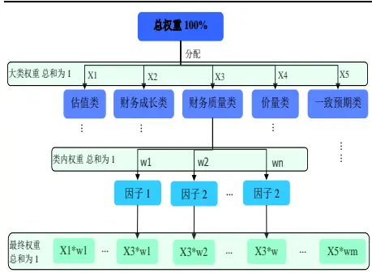
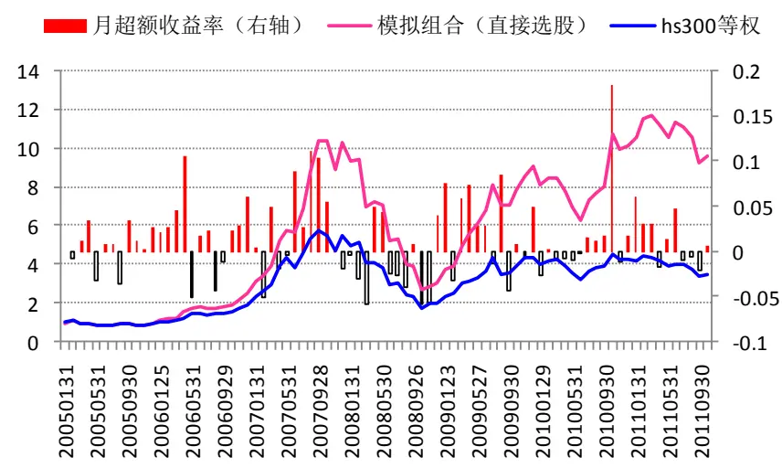
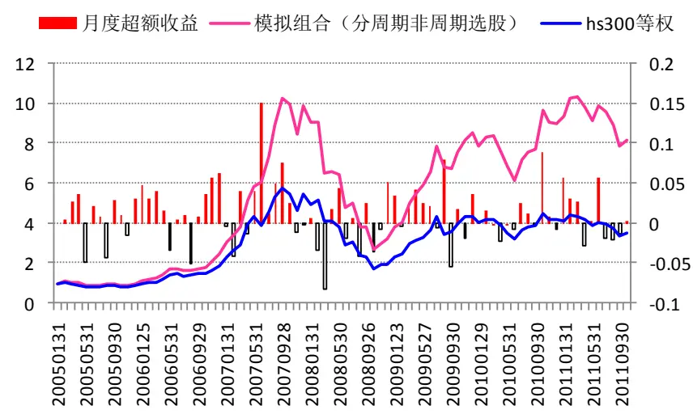
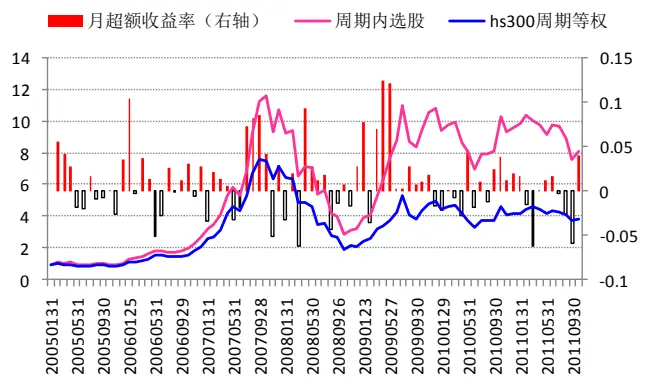
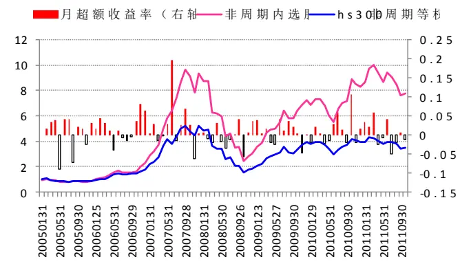
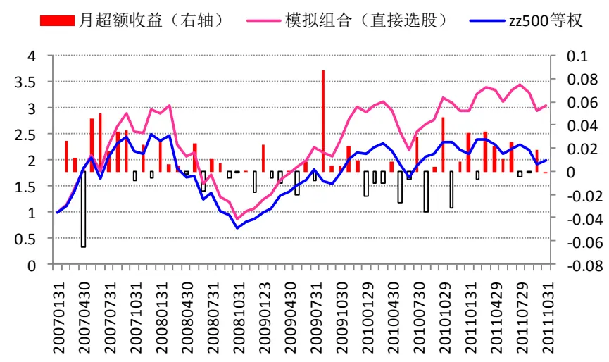
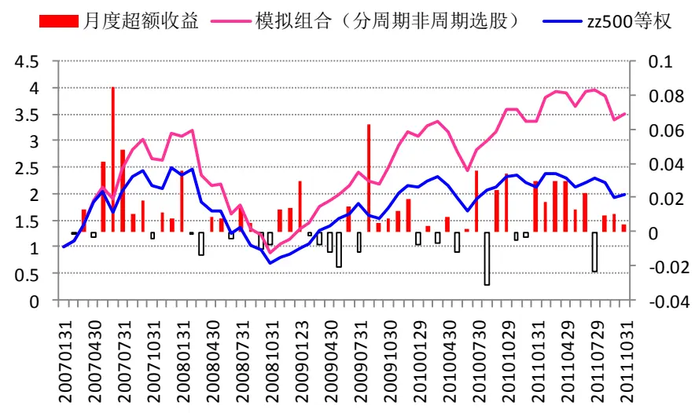
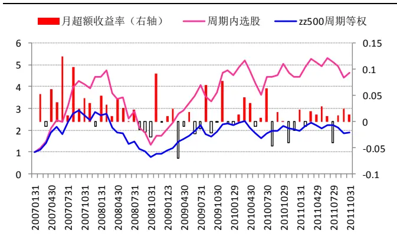
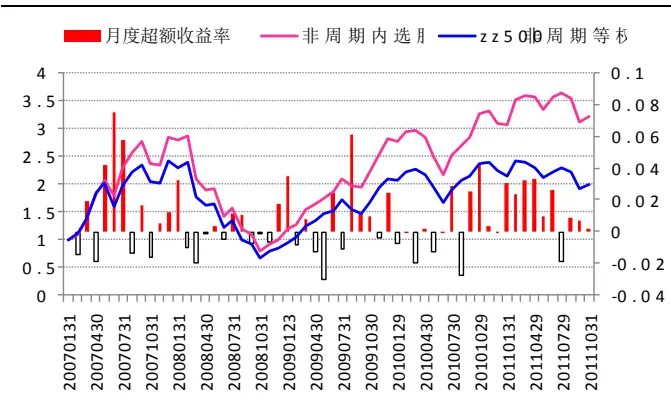

金融工程

2011.11.15

## 多因子选股模型之组合构建Ⅲ

# ——数量化研究系列之十九

蒋瑛琨

8 021-38676710

jiangyingkun@gtjas.com

编号S0880511010023

## 本报告导读：

本报告为多因子选股研究系列的第三篇，在因子分析与筛选的基础上，构建了多因子综合打分选股模型，结果表明根据模型构建的模拟组合表现优异，模型具有较高稳健性和实用性。

## 摘要：

[Table_Summary] 本报告在因子分析与筛选的基础上，选取了有效且稳健的因子并赋予合理权重，构建了多因子综合打分选股模型，结果表明模型取得了出色的效果，并具有较高的稳健性和实用性。

## 本文的创新之处：

（1）分不同股票池选股。我们分别在 6个股票池中选取各自有效的因子，并赋予合理权重，建立了多因子综合打分的选股模型。并比较了直接选股与分周期、非周期选股再组合的效果。

（2）按有效性分层赋权。先对五大类因子赋予 5 个大类权重。然后在每个大类里，按因子有效性的高低分配，设置每个因子的类内权重。分层赋权能使赋权的结果更加客观和合理。

（3）模拟组合等比例配置，以等权指数为比较基准。本报告中的模拟组合都是采用简单的等比例配置方法，选取相应股票池的等权指数作为业绩比较基准，这比通常选取市值加权指数作为比较基准的做法更合理。

（4）对因子权重和组合规模进行了敏感性分析。我们考察了组合大小和因子权重较小的变化对模拟组合表现的影响。事实上，在确定因子权重和组合大小时，我们并没有刻意去追求最优值，以免过度数据挖掘之嫌。尽管没有过度挖掘，但仅凭一组参数值下的结果还是不足以证明模型的效果和实用性，因此敏感性分析是非常必要的。

## 主要结果分析：

（1）从收益来看，各个模拟组合都取得了比较高的年化超额收益率。HS300 中，直接选股和分周期非周期选股分别取得了相对于hs300 等权指数 19.4%和 16%的年化超额收益率（相对于 hs300 指数的超额收益会更高）。ZZ500 中，直接选股和分周期非周期选股分别获得了相对于 zz500等权指数 10.8%和 14.7%的年化超额收益率。

## 分层赋权：

## [Table_R相关报告

《多因子选股模型之因子分析与筛选 II：财务质量、价量和一致预期类指标》

2011.10.14

《多因子选股模型之因子分析与筛选Ⅰ：估值与财务成长类指标》

2011.09.26

《风格投资 III：A 股周期非周期风格轮动研究》

2011.09.15

《基于全市场的 GARP 选股研究》

2011.09.14

《基于动量和阻力测算的短线择时模型》

2011.07.11

## O．多因子选股系列研究

多因子选股是量化研究中最热点的问题之一，有比较广泛的研究和应用。我们认为，检验和筛选出有效且稳健的因子是多因子选股模型取得良好效果的关键。

我们已经进行了多因子选股系列研究，前两篇报告《多因子选股模型之因子分析与筛选Ⅰ：估值与财务成长类指标》（2011.09.26）、《多因子选股模型之因子分析与筛选 II：财务质量、价量和一致预期类指标》（2011.10.14），专注于单因子分析和测算，筛选出有效且稳健的因子。我们共分析了五大类指标：估值类（7 个指标）、财务成长类（15 个指标）、财务质量类（10 个指标）、价量类（6 个指标）、分析师预期类（2个指标）。其中，第二篇报告还分析了财务相关的因子有效性在财报公布后的衰减规律。

在筛选出有效且稳健的因子的基础上，本篇报告建立多因子综合打分的选股模型，依据不同因子的有效性和稳健性赋予不同的权重，然后根据综合得分构建股票组合，通过回溯历史，检验模型效果。

## 1. 本报告的创新之处

本篇报告作为多因子选股系列研究的第三篇，在前两篇单因子有效性测算和分析的基础上，我们选取了有效且较稳健的因子，赋以合理权重，通过多因子综合打分选股模型构建了模拟组合。有以下创新之处。

## 1.1.分不同股票池选股

我们分别在 hs300 全体、hs300 周期类、hs300 非周期类和 zz500 全体、zz500 周期类、zz500 非周期类共 6 个股票池中建立多因子综合打分的选股模型，构建模拟组合。在每个股票池中，选取各自有效的因子，并赋予合理权重，分别在各个股票池中进行综合打分选股。

我们进而比较了直接选股与分周期、非周期选股再组合的效果，结果表明分周期非周期选股的稳健性比直接选股要高。

## 1.2. 按有效性分层赋权

先对估值、财务成长、财务质量、价量和一致预期 5 大类因子赋予 5 个大类权重。然后在每个大类里，按因子有效性的高低分配，设置每个因子的类内权重。这样，每个因子最终的权重为其所在类别的大类权重与其类内权重的乘积。

分层赋权比直接对因子赋权的好处为：在类别内赋权时容易比较各因子的有效性，使赋权的结果更加客观和科学，并且在遇到意义相近或者共线性较高但又不易取舍的因子时，可以让它们共享一定的类内权重。

## 1.3.等比例配置的模拟组合，以等权指数为比较基准

本报告中的模拟组合都是采用简单的等比例配置方法，选取相应股票池的等权指数作为业绩比较基准，这比通常选取市值加权指数作为比较基准的做法更合理。比如过去几年 hs300 等权指数的涨幅显著高于 hs300指数，因此等比例配置的模拟组合跑赢 hs300 指数并不能说明组合的选股能力强，因为过去几年不做任何选股，等比例配置 hs300 成分股就能大幅跑赢hs300指数。

## 1.4.对因子权重和组合规模进行了敏感性分析

我们考察了组合大小和因子权重较小的变化对模拟组合表现的影响。事实上，在确定因子权重和组合大小时，我们并没有刻意去追求最优值，以免过度数据挖掘之嫌。但敏感性测试的结果表明，我们选取的组合大小和权重值虽不是严格意义上的最优值，但也是较优值，而且这些参数的较小变动不会对模拟组合的表现产生很大的影响，这表明选股模型具有较高的稳健性和实用性。

## 2. 研究思路

## 2.1. 股票池划分

与前两篇报告中因子有效性的测算一致，我们分别在hs300 全体、hs300周期类、hs300 非周期类和 zz500 全体、zz500 周期类、zz500 非周期类共6个股票池中建立多因子综合打分的选股模型，构建模拟组合。在每个股票池中，选取各自有效的因子，并赋予它们合理的权重，分别在各个股票池中进行综合打分选股。

## 2.2. 分层赋权

先对估值、财务成长、财务质量、价量和一致预期5 大类因子赋予5个大类权重。然后在每个大类里，按因子有效性的高低分配，设置每个因子的类内权重。

由于在单因子的有效性测算和分析中发现，财务类的因子有效性在财报公布后有较明显的衰减现象，因此我们在财报刚公布完的那个月（5、9、11 月）财务类因子的大类权重比其他月份高 10%，而价量类相应减少10%。

因子的有效性请参考《多因子选股模型之因子分析与筛选 I、II》中的因子有效性汇总表。

图 1 分层赋权示意图

资料来源：国泰君安证券研究

## 2.3. 因子打分

与因子有效性测算和分析一致，对每个因子，我们在股票池中按因子值从高到低排序，分为一至五档。正向有效的因子一至五档分别给予 5、4、3、2、1 分，负向有效的因子则打分为 1、2、3、4、5 分。

其中以下情形需做特殊处理：

（1）PE等估值指标为负时，指标大小已失去意义，我们直接给 0分。

（2）EV/EBITDA、毛利率、有息负债率和 EBITDA/REVENUE 四个因子，金融行业的股票没有该指标值，为了公平合理，我们直接给中间档的分数，即3 分。

（3）有些估值类因子（主要是 PE）不是最小的表现最好，而是适中偏小的表现最好，而且这一规律比较明显，因此这些因子按从高到低排序分5档后分别打分为1、2、3、5、4分。其余的因子打分均为单调的。

## 2.4. 模拟组合

## 2.4.1. 模拟组合的构建

股票选取：按因子打分，并计算加权总分后，取股票池中得分最高的前10%的股票。

配置方法：等权配置，即平均配置选取的股票。

组合构建：我们将在 hs300 全体、周期类、非周期类和 zz500 全体、周期类、非周期类六个股票池中分别选取的6 个模拟组合依次称为“hs300直接选股”、“hs300 周期内选股”、“hs300 非周期内选股”、“zz500 直接选股”、“zz500 周期内选股”、“zz500 非周期内选股”。并将“hs300 周期内选股”和“hs300 非周期内选股”合并成新组合“hs300 分周期非周期选股”，将“zz500 周期内选股”和“zz500 非周期内选股”合并成新组合“zz500分周期非周期选股”。进一步，将“hs300分周期非周期选股”和“zz500 分周期非周期选股”合并成新组合“hs300+zz500”。

换仓频率和成本：每月打分、换仓，计0.5%的换仓成本。

比较基准：每个股票池中构建的模拟组合与该股票池的等权指数比较。

各个模拟组合的比较基准如下：

hs300 直接选股：hs300 等权指数

hs300周期内选股：hs300周期类等权指数

hs300非周期内选股：hs300 非周期类等权指数

hs300分周期非周期选股：hs300等权指数

zz500 直接选股：zz500 等权指数

zz500周期内选股：zz500周期类等权指数

zz500非周期内选股：zz500 非周期等权指数

zz500分周期非周期选股：zz500等权指数

hs300+zz500 ：zz800 等权指数。

模拟区间：只涉及到hs300成分股的组合模拟区间为2005年1月至2011年 10 月，涉及到 zz500 成分股的组合模拟区间为 2007 年 1 月至 2011年 10 月。

## 2.4.2. 模拟组合的表现

我们从以下指标来评价模拟组合的表现：

年化超额收益率：模拟组合的年化收益率减去基准的年化收益率。

月胜率：模拟组合月度收益率大于基准月收益率的占比。

季胜率：模拟组合的季度收益率大于基准季度收益率的占比。

最大跑输基准幅度：在模拟区间中，在最坏的时点买入模拟组合，到最坏的时点卖出，期间收益跑输基准的最大幅度。可以理解为相对于基准的最大回撤。

## 2.5. 敏感性测试

## 2.5.1. 组合规模的敏感性

在构建模拟组合时，我们选取了各个股票池的前10%的股票。为了分析模拟组合规模的大小对模拟组合表现的影响，我们再分别测算了取股票池前5%、15%、20%和30%四种情况下模拟组合的表现。

## 2.5.2. 因子权重的敏感性

我们根据因子有效性，采用分层赋权的方法确定了一组权重，为了检验多因子选股模型的结果对因子权重是否敏感，我们对因子权重进行了敏感性测试。

依次对估值、财务成长、财务质量、价量和一致预期五类因子中某一类的大类权重增加10%和减小 10%，其余四类的大类权重则相应地按比列减小和增加10%，观察各个模拟组合表现的差异。

## 3. 主要结果和分析

## 3.1. 赋权结果

根据因子的有效性和分层赋权的方法，我们选取了各个股票池中有效的因子并确定了因子的最终权重，结果如下：

表 1 HS300 股票池中各因子的最终权重

| 估值类：25% | PE | PECUT | PEG | PS | PCF | PB | EV/EBITDA |  |
| --- | --- | --- | --- | --- | --- | --- | --- | --- |
|  | 1.25% | 1.25% | 2.50% | 10.00% | 5.00% | 5.00% | 0.00% |  |
| 财务成长类：30% | 营收单季增长率 | 营收同比增长率 | 营收TTM增长率 | 净利润单季增长率 | 净利润同比增长率 | 净利润TTM增长率 | 经营现金流单季增长率 | 经营现金流同比增长率 |
|  | 3.00% | 3.00% | 1.50% | 3.00% | 3.00% | 1.50% | 3.00% | 3.00% |
|  | 经营现金流TTM 增长率 | ROE单季增长率 | ROE 同比增长率 | ROE-TTM增长率 | ROA 单季增长率 | ROA同比增长率 | ROA-TTM增长率 |  |
|  | 1.50% | 1.20% | 1.20% | 1.20% | 1.20% | 1.50% | 1.20% |  |
| 财务质量：15% | ROE-TTM | ROA-TTM | CF/profit | 股权乘数 |  |  |  |  |
|  | 3.75% | 3.75% | 3.75% | 3.75% |  |  |  |  |
| 价量类：15% | 价格动量1 | 价格动量3 | 价格动量6 | 换手率1 | 换手率3 | 换手率6 |  |  |
|  | 3.75% | 0.00% | 3.75% | 4.50% | 1.50% | 1.50% |  |  |
| 一致预期：15% | 机构覆盖数 | 评级调整 |  |  |  |  |  |  |
|  | 3.00% | 12.00% |  |  |  |  |  |  |

数据来源：国泰君安证券研究

表 2 HS300 周期类股票池中各因子的最终权重

| 估值类：30% | PS | PCF | PB |  |  |  |  |  |
| --- | --- | --- | --- | --- | --- | --- | --- | --- |
|  | 15.00% | 6.00% | 9.00% |  |  |  |  |  |
| 财务成长类：60% | 营收单季增长率 | 营收同比增长率 | 营收TTM增长率 | 净利润单季增长率 | 净利润同比增长率 | 净利润TTM增长率 | 经营现金流单季增长率 | 经营现金流同比增长率 |
|  | 9.00% | 6.00% | 3.00% | 9.00% | 6.00% | 3.00% | 9.00% | 6.00% |
|  | 经营现金流TTM 增长率 | ROA单季增长率 |  |  |  |  |  |  |
|  | 3.00% | 6.00% |  |  |  |  |  |  |
| 财务质量：0% |  |  |  |  |  |  |  |  |
| 价量类:0% |  |  |  |  |  |  |  |  |
| 一致预期：10% | 机构覆盖数 | 评级调整 |  |  |  |  |  |  |
|  | 2.00% | 8.00% |  |  |  |  |  |  |

数据来源：国泰君安证券研究

表 3 HS300 非周期类股票池中各因子的最终权重

| 估值类：30% | PE | PECUT | PEG | PS | PCF | PB | EV/EBITDA |  |
| --- | --- | --- | --- | --- | --- | --- | --- | --- |
|  | 3.00% | 3.00% | 6.00% | 6.00% | 3.00% | 6.00% | 3.00% |  |
| 财务成长类：30% | 营收单季增长率 | 营收同比增长率 | 营收 TTM 增长率 | 净利润单季增长率 | 净利润同比增长率 | 净利润TTM增长率 | 经营现金流单季增长率 | 经营现金流同比增长率 |
|  | 3.00% | 3.00% | 1.50% | 3.00% | 3.00% | 1.50% | 1.50% | 3.00% |
|  | 经营现金流 TTM增长率 | ROE 单季增长率 | ROE 同比增长率 | ROE-TTM增长率 | ROA单季增长率 | ROA 同比增长率 | ROA-TTM增长率 |  |
|  | 1.50% | 1.50% | 1.50% | 1.50% | 1.50% | 1.50% | 1.50% |  |
| 财务质量：15% | ROE-TTM | ROA-TTM | 当期毛利率 | TTM毛利率 | 当期净利率 | TTM净利率 | 有息负债率 | CF/profit |
|  | 4.50% | 3.00% | 0.75% | 0.75% | 0.75% | 0.75% | 0.00% | 0.75% |
|  | EBITDA/REVENUE | 股权乘数 |  |  |  |  |  |  |
|  | 0.75% | 3.00% |  |  |  |  |  |  |
| 价量类：10% | 价格动量1 | 价格动量3 | 价格动量6 | 换手率1 | 换手率3 | 换手率6 |  |  |
|  | 1.00% | 0.00% | 1.00% | 4.00% | 3.00% | 1.00% |  |  |
| 一致预期：15% | 机构覆盖数 | 评级调整 |  |  |  |  |  |  |
|  | 2.00% | 8.00% |  |  |  |  |  |  |

数据来源：国泰君安证券研究

表 4 ZZ500 股票池中各因子的最终权重

| 估值类：25% | PE | PECUT | PEG | PS | PCF | PB | EV/EBITDA |  |
| --- | --- | --- | --- | --- | --- | --- | --- | --- |
|  | 1.25% | 0.00% | 1.25% | 10.00% | 1.25% | 6.25% | 5.00% |  |
| 财务成长类：25% | 营收单季增长率 | 营收同比增长率 | 营收 TTM增长率 | 净利润单季增长率 | 净利润同比增长率 | 净利润TTM增长率 | 经营现金流单季增长率 | 经营现金流同比增长率 |
|  | 2.50% | 2.50% | 1.25% | 3.75% | 2.50% | 1.25% | 4.00% | 4.00% |
|  | 经营现金流TTM 增长率 | ROE单季增长率 | ROE 同比增长率 | ROE-TTM增长率 | ROA单季增长率 | ROA 同比增长率 | ROA-TTM增长率 |  |
|  | 1.25% | 0.00% | 0.00% | 1.00% | 0.00% | 0.00% | 1.00% |  |
| 财务质量：15% | 有息负债率 | CF/profit | 股权乘数 |  |  |  |  |  |
|  | 6.00% | 3.00% | 6.00% |  |  |  |  |  |
| 价量类：25% | 价格动量1 | 价格动量3 | 价格动量6 | 换手率1 | 换手率3 | 换手率6 |  |  |
|  | 3.75% | 2.50% | 3.75% | 6.25% | 6.25% | 2.50% |  |  |
| 一致预期：10% | 机构覆盖数 | 评级调整 |  |  |  |  |  |  |
|  | 0.00% | 10.00% |  |  |  |  |  |  |

数据来源：国泰君安证券研究

表5 ZZ500周期类股票池中各因子的最终权重

| 估值类：35% | PE | PECUT | PEG | PS | PCF | PB | EV/EBITDA |
| --- | --- | --- | --- | --- | --- | --- | --- |
|  | 0.00% | 1.75% | 3.50% | 14.00% | 0.00% | 10.50% | 5.25% |
| 财务成长类：10% | 营收单季增长率 | 营收同比增长率 | 营收 TTM 增长率 | ROE 单季增长率 |  |  |  |
|  | 3.00% | 3.00% | 2.00% | 2.00% |  |  |  |
| 财务质量：10% | 有息负债率 | 股权乘数 |  |  |  |  |  |
|  | 3.00% | 7.00% |  |  |  |  |  |
| 价量类：35% | 价格动量1 | 价格动量3 | 价格动量6 | 换手率1 | 换手率3 | 换手率6 |  |
|  | 3.50% | 10.50% | 3.50% | 10.50% | 3.50% | 3.50% |  |
| 一致预期：10% | 机构覆盖数 | 评级调整 |  |  |  |  |  |
|  | 2.00% | 8.00% |  |  |  |  |  |

数据来源：国泰君安证券研究

表 6 ZZ500 非周期类股票池中各因子的最终权重

| 估值类：30% | PE | PECUT | PEG | PS | PCF | PB | EV/EBITDA |  |
| --- | --- | --- | --- | --- | --- | --- | --- | --- |
|  | 3.00% | 1.50% | 3.00% | 3.00% | 6.00% | 6.00% | 7.50% |  |
| 财务成长类：30% | 营收单季增长率 | 营收同比增长率 | 营收 TTM增长率 | 净利润单季增长率 | 净利润同比增长率 | 净利润TTM增长率 | 经营现金流单季增长率 | 经营现金流同比增长率 |
|  | 1.50% | 1.50% | 0.00% | 7.50% | 1.50% | 1.50% | 6.00% | 6.00% |
|  | 经营现金流 TTM增长率 |  |  |  |  |  |  |  |
|  | 4.50% |  |  |  |  |  |  |  |
| 财务质量：10% | ROE-TTM | ROA-TTM | 当期毛利率 | TTM毛利率 | 当期净利率 | TTM 净利率 | 有息负债率 | 股权乘数 |
|  | 0.50% | 0.50% | 0.50% | 0.50% | 0.50% | 0.50% | 5.00% | 2.00% |
| 价量类：20% | 价格动量1 | 价格动量3 | 价格动量6 | 换手率1 | 换手率3 | 换手率6 |  |  |
|  | 4.00% | 4.00% | 0.00% | 4.00% | 4.00% | 4.00% |  |  |
| 一致预期：10% | 机构覆盖数 | 评级调整 |  |  |  |  |  |  |
|  | 2.00% | 8.00% |  |  |  |  |  |  |

数据来源：国泰君安证券研究

## 3.2. 模拟组合表现

从收益看，各个模拟组合都取得了比较高的年化超额收益率。HS300 中，直接选股和分周期非周期选股分别取得了相对于 hs300 等权指数 19.4%和 16%的年化超额收益率（相对于 hs300 指数的超额收益会更高）。ZZ500中，直接选股和分周期非周期选股分别获得了相对于 zz500 等权指数10.8%和 14.7%的年化超额收益率。

从稳健性看，各模拟组合的最大跑输基准幅度都在 12.3%以内，月胜率基本在 60%以上，在 hs300 和 zz500 中分周期非周期选股的季度胜率都在70%以上，可见模拟组合的表现比较稳健。

分周期非周期选股相对于直接选股确实改进了效果，尤其是在 zz500 股票池中，分周期非周期选股的收益和稳健性都明显优于直接选股。

表 7 各个模拟组合的表现

|  | HS300 |  |  |  | ZZ500 |  |  |  |
| --- | --- | --- | --- | --- | --- | --- | --- | --- |
|  | 直接选股 | 分周期非周期选股 | 周期內选股 | 非周期内选股 | 直接选股 | 分周期非周期选股 | 周期內选股 | 非周期内选股 |
| 比较基准 | hs300等权指数 |  | hs300 周期等权 | hs300 非周期等权 | zz500等权指数 |  | zz500 周期等权 | zz500 非周期等权 |
| 年化超额收益率 | 19.4% | 16.0% | 14.5% | 16.2% | 10.8% | 14.7% | 17.4% | 12.4% |
| 月胜率 | 60.5% | 65.4% | 61.7% | 63.0% | 61.4% | 64.9% | 59.9% | 63.2% |
| 季胜率 | 76.9% | 70.2% | 62.5% | 65.4% | 61.1% | 77.8% | 73.3% | 77.8% |
| 最大跑输基准幅度 | -12.3% | -11.2% | -11.7% | -8.9% | -6.9% | -6.2% | -14.7% | -6.1% |

数据来源：国泰君安证券研究

图2 hs300直接选股的收益表现

数据来源：国泰君安证券研究

图3 hs300分周期非周期选股的收益表现

数据来源：国泰君安证券研究

图4 hs300周期内选股的收益表现

图5 hs300非周期内选股的收益表现

数据来源：国泰君安证券研究

数据来源：国泰君安证券研究

图 6 zz500 直接选股的收益表现

数据来源：国泰君安证券研究

图7 zz500 分周期非周期选股的收益表现

数据来源：国泰君安证券研究

图8 zz500周期内选股的收益表现

数据来源：国泰君安证券研究

图 9 zz500非周期内选股的收益表现

数据来源：国泰君安证券研究

## 3.3. 敏感性测试结果

## 3.3.1. 组合规模的敏感性

从组合规模的敏感性测试结果来看，模拟组合的表现对组合规模并不是很敏感。综合收益和稳健性来看，在hs300 股票池中，取股票池的 5%、10%和 15%作为模拟组合的规模比较合适；在 zz500 股票池中，取股票池的 10%、15%和 20%作为模拟组合的规模比较合适。从 hs300+zz500组合的表现来看，10%的组合规模应该是最优的。

表 8 模拟组合的表现对组合规模的敏感性

| 组合规模 | HS300 股票池 |  |  | ZZ500 股票池 |  |  | HS300+ZZ500 |  |  |
| --- | --- | --- | --- | --- | --- | --- | --- | --- | --- |
|  | 年化超额收益率 | 月胜率 | 最大跑输基准幅度 | 年化超额收益率 | 月胜率 | 最大跑输基准幅度 | 年化超额收益率 | 月胜率 | 最大跑输基准幅度 |
| 5% | 21.9% | 65.4% | -15.6% | 9.2% | 49.1% | -11.6% | 13.2% | 63.2% | -5.5% |
| 10% | 16.0% | 65.4% | -11.2% | 14.7% | 64.9% | -6.2% | 14.6% | 64.9% | -5.0% |
| 15% | 13.1% | 59.3% | -11.4% | 12.3% | 70.2% | -5.1% | 11.9% | 63.2% | -4.0% |
| 20% | 12.1% | 61.7% | -14.0% | 11.6% | 64.9% | -5.6% | 10.4% | 64.9% | -3.6% |
| 30% | 8.5% | 59.3% | -18.3% | 10.6% | 73.7% | -2.8% | 8.4% | 63.2% | -3.7% |

数据来源：国泰君安证券研究

注：HS300 股票池中比较基准为 hs300 等权指数，ZZ500 中比较基准为 zz500 等权指数，HS300+ZZ500 的比较基准为 zz800 等权指数。

## 3.3.2. 因子权重的敏感性

从因子权重的敏感性测试结果来看，模拟组合的表现对权重并不很敏感。事实上，我们根据因子有效性和分层赋权的方法确定的因子权重时并没有刻意地追求最优的权重值，从敏感性测试的结果也可以看出，我们确定下来的因子权重不一定是最优的，只是比较优的，这一方面排除了在确定权重时过度数据挖掘之嫌，另一方面也说明了我们的选股模型具有较高的稳健性和实用性。因为根据因子有效性分层赋权时，虽然能比较客观和科学，但难以完全精确量化，还是存在较小的主观判断的成分，而敏感性测试结果表明，这些人为判断的差异造成权重的微小变动并不会对模拟组合的表现产生较大影响，这大大增加了模型的实用性。

表9 模拟组合的表现对因子权重的敏感性

|  |  | HS300 股票池 |  |  | ZZ500 股票池 |  |  | HS300+ZZ500 |  |  |
| --- | --- | --- | --- | --- | --- | --- | --- | --- | --- | --- |
|  |  | 年化超额收益率 | 胜率 | 最大跑输基准幅度 | 年化超额收益率 | 胜率 | 最大跑输基准幅度 | 年化超额收益率 | 胜率 | 最大跑输基准幅度 |
| 当前权重下 |  | 16.0% | 65.4% | -11.2% | 14.7% | 64.9% | -6.2% | 14.6% | 64.9% | -5.0% |
| 估值类指标 | +10% | 13.4% | 63.0% | -11.7% | 14.2% | 70.2% | -4.3% | 13.5% | 64.9% | -4.7% |
|  | -10% | 16.2% | 59.3% | -12.4% | 11.7% | 66.7% | -11.0% | 12.5% | 64.9% | -5.1% |
| 财务成长类 | +10% | 13.6% | 58.0% | -12.5% | 11.2% | 59.7% | -9.8% | 11.0% | 57.9% | -4.5% |
|  | -10% | 12.6% | 66.7% | -11.3% | 15.1% | 71.9% | -3.3% | 13.8% | 63.2% | -4.1% |
| 财务质量类 | +10% | 13.4% | 60.5% | -12.6% | 11.4% | 61.4% | -8.6% | 11.7% | 54.4% | -5.0% |
|  | -10% | 14.7% | 65.4% | -11.3% | 16.0% | 64.9% | -5.5% | 14.9% | 63.2% | -4.7% |
| 价量类指标 | +10% | 11.3% | 65.4% | -12.6% | 15.5% | 70.2% | -8.1% | 13.9% | 61.4% | -4.0% |
|  | -10% | 14.4% | 59.3% | -11.9% | 10.5% | 61.4% | -8.2% | 11.0% | 59.7% | -6.2% |
| 一致预期类 | +10% | 16.4% | 63.0% | -10.9% | 14.5% | 68.4% | -3.4% | 14.8% | 63.2% | -5.3% |
|  | -10% | 15.0% | 66.7% | -11.6% | 12.2% | 68.4% | -8.2% | 12.9% | 64.9% | -4.3% |

数据来源：国泰君安证券研究

注：HS300 股票池中比较基准为 hs300 等权指数，ZZ500 中比较基准为 zz500 等权指数，HS300+ZZ500 的比较基准为 zz800 等权指数。

## 作者简介：

## 蒋瑛琨：

执业资格证书编号：S0880511010023

电话：021-38676710

邮箱：jiangyingkun@gtjas.com

国泰君安证券首席金融工程研究员，吉林大学数量经济学博士，CPA。05 年加入国泰君安证券研究所，曾在衍生产品部、销售交易部工作，多次获中金所、深交所、中国证券业协会、中国金融学会等奖励。06 年新财富“衍生品”第二名，07-08 年入围新财富，2010 年水晶球奖“衍生品”第四名。

## 唐军（贡献作者）：

执业资格证书编号：S0880110090001

电话：021-38674763

邮箱：tangjun008739@gtjas.com

中山大学经济学硕士和理学学士，2010年 7月加入国泰君安证券，现为金融工程助理研究员，主要从事数量化投资策略研究。

感谢实习生刘正捷为本报告做出的贡献。

## 本公司具有中国证监会核准的证券投资咨询业务资格

## 分析师声明

作者具有中国证券业协会授予的证券投资咨询执业资格或相当的专业胜任能力，保证报告所采用的数据均来自合规渠道，分析逻辑基于作者的职业理解，本报告清晰准确地反映了作者的研究观点，力求独立、客观和公正，结论不受任何第三方的授意或影响，特此声明。

## 免责声明

本报告仅供国泰君安证券股份有限公司（以下简称“本公司”）的客户使用。本公司不会因接收人收到本报告而视其为本公司的当然客户。本报告仅在相关法律许可的情况下发放，并仅为提供信息而发放，概不构成任何广告。

本报告的信息来源于已公开的资料，本公司对该等信息的准确性、完整性或可靠性不作任何保证。本报告所载的资料、意见及推测仅反映本公司于发布本报告当日的判断，本报告所指的证券或投资标的的价格、价值及投资收入可升可跌。过往表现不应作为日后的表现依据。在不同时期，本公司可发出与本报告所载资料、意见及推测不一致的报告。本公司不保证本报告所含信息保持在最新状态。同时，本公司对本报告所含信息可在不发出通知的情形下做出修改，投资者应当自行关注相应的更新或修改。

本报告中所指的投资及服务可能不适合个别客户，不构成客户私人咨询建议。在任何情况下，本报告中的信息或所表述的意见均不构成对任何人的投资建议。在任何情况下，本公司、本公司员工或者关联机构不承诺投资者一定获利，不与投资者分享投资收益，也不对任何人因使用本报告中的任何内容所引致的任何损失负任何责任。投资者务必注意，其据此做出的任何投资决策与本公司、本公司员工或者关联机构无关。

本公司利用信息隔离墙控制内部一个或多个领域、部门或关联机构之间的信息流动。因此，投资者应注意，在法律许可的情况下，本公司及其所属关联机构可能会持有报告中提到的公司所发行的证券或期权并进行证券或期权交易，也可能为这些公司提供或者争取提供投资银行、财务顾问或者金融产品等相关服务。在法律许可的情况下，本公司的员工可能担任本报告所提到的公司的董事。

市场有风险，投资需谨慎。投资者不应将本报告为作出投资决策的惟一参考因素，亦不应认为本报告可以取代自己的判断。在决定投资前，如有需要，投资者务必向专业人士咨询并谨慎决策。

本报告版权仅为本公司所有，未经书面许可，任何机构和个人不得以任何形式翻版、复制、发表或引用。如征得本公司同意进行引用、刊发的，需在允许的范围内使用，并注明出处为“国泰君安证券研究”，且不得对本报告进行任何有悖原意的引用、删节和修改。

若本公司以外的其他机构（以下简称“该机构”）发送本报告，则由该机构独自为此发送行为负责。通过此途径获得本报告的投资者应自行联系该机构以要求获悉更详细信息或进而交易本报告中提及的证券。本报告不构成本公司向该机构之客户提供的投资建议，本公司、本公司员工或者关联机构亦不为该机构之客户因使用本报告或报告所载内容引起的任何损失承担任何责任。

## 评级说明

## 1.投资建议的比较标准

投资评级分为股票评级和行业评级。

以报告发布后的12个月内的市场表现为比较标准，报告发布日后的 12个月内的公司股价（或行业指数）的涨跌幅相对同期的沪深 300 指数涨跌幅为基准。

## 2.投资建议的评级标准

报告发布日后的 12 个月内的公司股价（或行业指数）的涨跌幅相对同期的沪深 300 指数的涨跌幅。

| 评级 |  | 说明 |
| --- | --- | --- |
| 股票投资评级 | 增持 | 相对沪深 300 指数涨幅 15%以上 |
|  | 谨慎增持 | 相对沪深300指数涨幅介于5%～15%之间 |
|  | 中性 | 相对沪深 300 指数涨幅介于-5%~5% |
|  | 减持 | 相对沪深 300 指数下跌 5%以上 |
| 行业投资评级 | 增持 | 明显强于沪深 300 指数 |
|  | 中性 | 基本与沪深 300 指数持平 |
|  | 减持 | 明显弱于沪深 300指数 |

## 国泰君安证券研究

| 上海 |  | 深圳 | 北京 |
| --- | --- | --- | --- |
| 地址 | 上海市浦东新区银城中路168号上海 银行大厦29层 | 深圳市福田区益田路6009号新世界 商务中心34层 | 北京市西城区金融大街28号盈泰中 心2号楼10层 |
| 邮编 | 200120 | 518026 | 100140 |
| 电话 | (021)38676666 | (0755)23976888 | (010)59312799 |

E-mail：gtjaresearch@gtjas.com