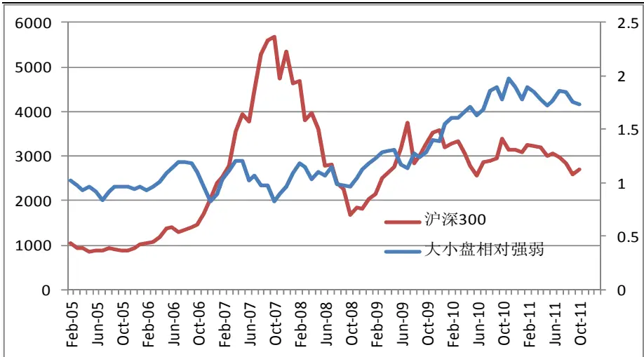
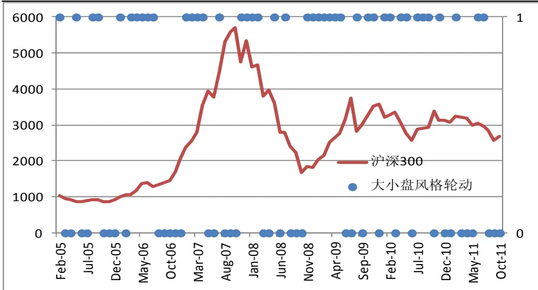
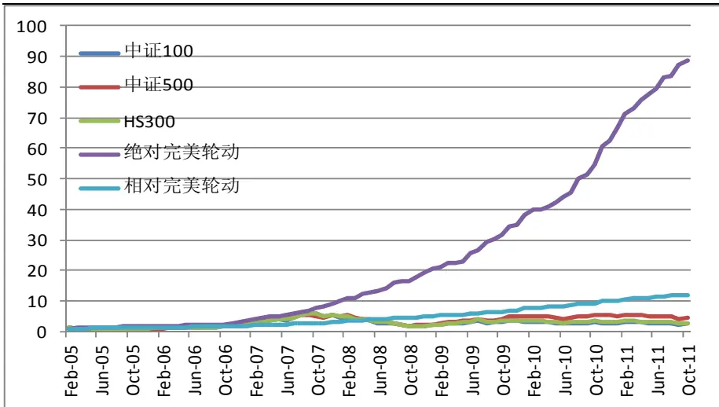
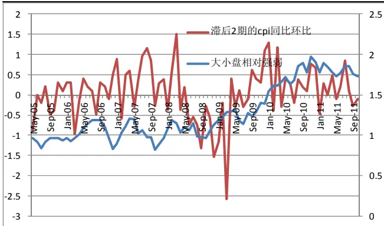
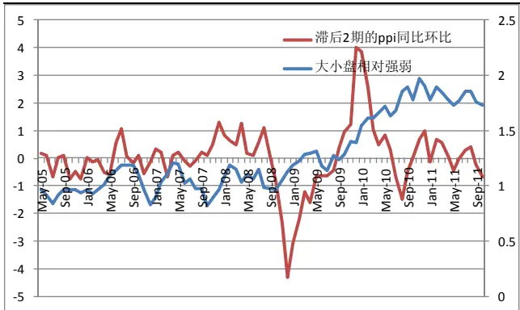
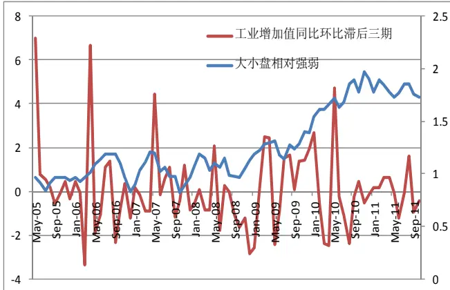
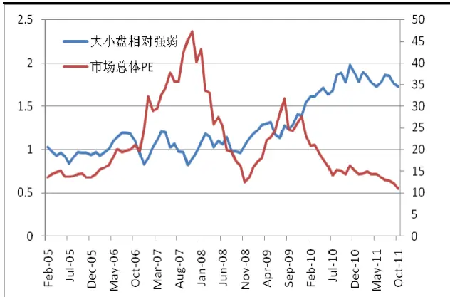
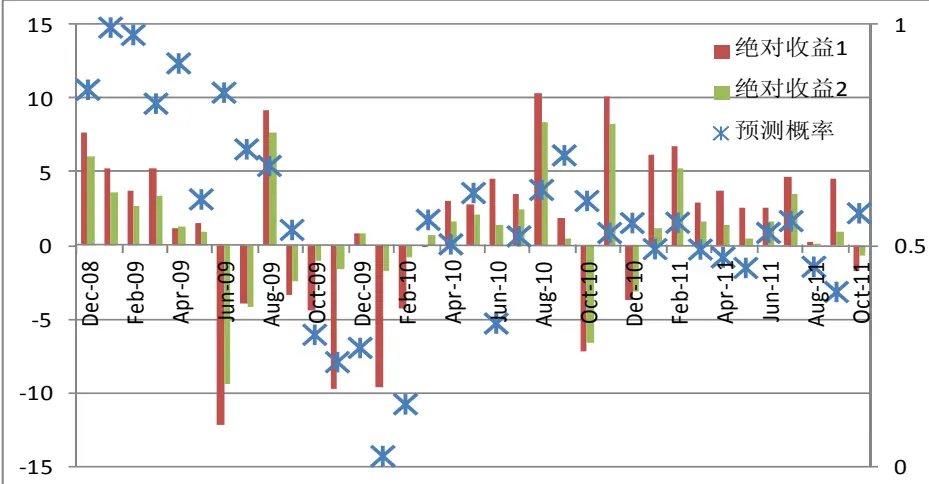
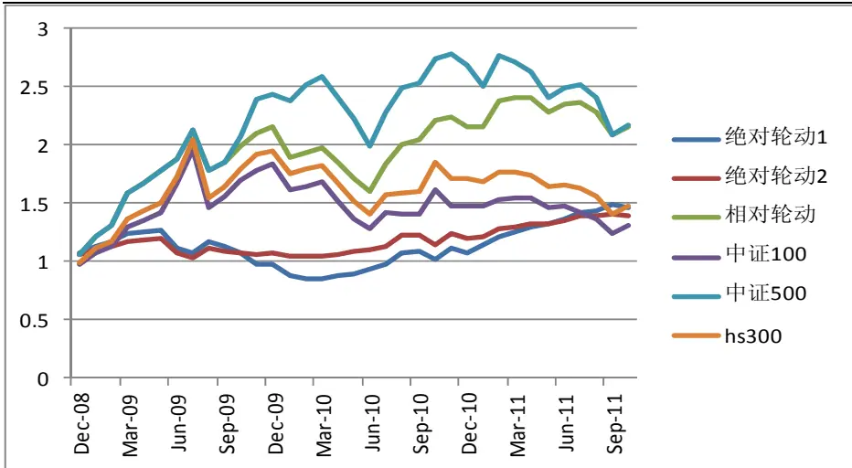

金融工程

2011.11.29

# 风格投资 IV：A 股大小盘风格轮动研究

# —数量化研究系列之二十

刘富兵

蒋瑛琨

8 021-38676673

021-38676710

liufubing008481@gtjas.com

jiangyingkun@gtjas.com

编号S0880511010017

S0880511010023

## 本报告导读：

我们建立了大小盘风格轮动的预测模型，胜率可达 69%，利用该模型投资年化收益为 31.3%，配对交易的年化收益可达 14.5%，11 月我们预测小盘股表现好于大盘股的概率为 0.55。

## 摘要：

z 在我国股市，较为显著的风格轮动就是所谓的大小盘轮动，当然大小盘的风格轮动也是较难预测的。本文将风格研究对象限定在大小盘上，以期对投资者进行风格投资有借鉴意义。

z 我国证券市场，大小盘风格的轮动现象在 2009 年下半年之前较为明显，轮动周期在 4-5 个月左右。而在进入到 2009年下半年以后，小盘股战胜大盘股较为持续。

从市场行情与风格轮动的关系来看，上升行情的初始阶段，小盘领涨，随着行情的深入，逐渐向大盘风格转换。在上升行情的尾部大盘股表现优于小盘。与此类似，在下跌的初始阶段，小盘股的表现要好于大盘，而在下跌行情的尾部，大盘股表现优于小盘。而自 2009 年以来的震荡市，小盘股一直表现强劲。

z 本文，我们共选择 4 个变量，分别是 CPI 同比的环比、PPI同比环比、工业增加值同比环比、市场的市盈率，建立logit模型对大小盘风格轮动进行预测。

z 实证结果表明，该模型的样本外胜率可达68.57%，利用该模型进行操作，相对轮动的年化收益约 31.3%，而进行配对交易绝对轮动的年化收益可达 14.5%；利用沪深 300 做对冲的绝对轮动年化收益可达12.5%。

z 事实上，该模型近20期的胜率更高，可达80%，年化收益会更高些。

z 根据 10 月底的数据预测，11 月小盘股表现好于大盘股的概率为 0.55，主要影响因素是 ppi 的下降及工业增加值的降低。

## 相关报告

《风格投资 III：A 股周期非周期风格轮动研究》

2011.09.15

《风格投资 II：风格周期与轮动》

2008.09.09

《风格投资 I：风格区分与收益》2008.09.09

## 1. 风格轮动回顾

在前期的报告《风格投资 III：A 股周期非周期轮动研究》（2011.9.15）中我们深入研究了周期与非周期之间的风格轮动，取得了不错的效果。

在我国股市，最显著的风格轮动就是所谓的大小盘轮动，当然大小盘的风格轮动预测也是较难的。本文将风格研究对象限定在大小盘上，以期对投资者进行风格投资有所借鉴。

## 2. 我国证券市场的大小盘风格轮动

## 2.1. 大小盘风格轮动的特点

图 1 我国证券市场大小盘的相对强弱走势

数据来源：国泰君安证券研究
注：大小盘相对强弱=中证500指数/中证100指数

图 2 我国证券市场大小盘风格轮动特点

数据来源：国泰君安证券研究
注：1表示小盘强，0表示大盘强

观察图 1-2 大小盘走势与沪深 300 的变化情况，大小盘风格的轮动现象在 2009 年下半年之前较为明显，轮动周期在 4-5 个月左右。而在进入到 2009 年下半年以后，小盘股战胜大盘股较为持续。或许这与宏观经济企稳尚未明确，政府为了刺激经济采取的宽松货币政策等原因有关。

此外，由图 1可以发现上升行情的初始阶段，小盘领涨，随着行情的深入，逐渐向大盘风格转换。在上升行情的尾部大盘股表现优于小盘。与此类似，在下跌的初始阶段，小盘股的表现要好于大盘，而在下跌行情的尾部，大盘股表现优于小盘。而自 2009 年以来的震荡市，小盘股一直表现强劲。

## 2.2. 完美风格轮动收益

图 3给出了考虑千分之六的双边交易成本后，完美风格轮动的收益。

图 3 完美风格轮动的收益

数据来源：国泰君安证券研究

注：相对完美轮动是指每次都配置下期表现好的指数；而绝对完美轮动是指每次都买入下期表现好的指数，同时做空下期表现差的指数。

由图 3可以看到，若进行完美风格轮动，在不到 7年的时间里，可以获得近 90 倍的收益，远远跑赢基准及大小盘。这表明，我国证券市场的大小盘风格轮动特征极为明显，进行积极的风格管理是能够带来超额收益的。

表 1 我国证券市场大小盘风格轮动及超额收益

| 市场阶段 | 日期 | 轮动特点 | 超额收益% | 市场阶段 | 日期 | 轮动特点 | 超额收益% |
| --- | --- | --- | --- | --- | --- | --- | --- |
|  | 2005年2月 | 1 | 2.7319 |  | 2009年1月 | 1 | 5.1761 |
|  | 2005年3月 | 0 | 4.216 |  | 2009年2月 | 1 | 3.7058 |
|  | 2005年4月 | 0 | 5.2859 |  | 2009年3月 | 1 | 5.1759 |
|  | 2005年5月 | 1 | 3.2677 | 牛市 | 2009年4月 | 1 | 1.1951 |
|  | 2005年6月 | 0 | 4.2021 |  | 2009年5月 | 1 | 1.4667 |
|  | 2005年7月 | 0 | 9.2644 |  | 2009年6月 | 0 | 12.2423 |
|  | 2005年8月 2005年9月 | 1 | 9.5981 |  | 2009年7月 | 0 | 3.9982 |
|  | 2005年10月 | 1 | 5.2738 |  | 2009年8月 | 1 | 9.1667 |
|  | 2005年11月 | 0 | 0.1507 |  | 2009年9月 | 0 | 3.376 |
|  | 2005年12月 | 0 | 0.1313 |  | 2009年10月 | 1 | 4.4079 |
|  | 2006年1月 | 0 | 2.8706 |  | 2009年11月 | 1 | 9.7149 |
|  | 2006年2月 | 1 | 3.3707 |  | 2009年12月 | 0 | 0.8315 |
|  | 2006年3月 | 0 | 3.9988 |  | 2010年1月 | 1 | 9.6122 |
|  |  | 1 | 3.9978 |  | 2010年2月 | 1 | 4.306 |
|  | 2006年4月 | 1 | 4.9278 |  | 2010年3月 | 0 | 0.0577 |
| 牛市 | 2006年5月 | 1 | 9.4796 |  | 2010年4月 | 1 | 2.9861 |
|  | 2006年6月 | 1 | 4.3271 |  | 2010年5月 | 1 | 2.79 |
|  | 2006年7月 | 1 | 4.0488 |  | 2010年6月 | 0 | 4.5283 |
|  | 2006年8月 | 0 | 0.0954 |  | 2010年7月 | 1 | 3.4276 |
|  | 2006年9月 | 0 | 0.662 |  | 2010年8月 | 1 | 10.284 |
|  | 2006年10月 | 0 | 7.5391 | 震荡市 | 2010年9月 | 1 | 1.858 |
|  | 2006年11月 | 0 | 15.3107 |  | 2010年10月 | 0 | 7.1593 |
|  | 2006年12月 | 0 | 16.9344 |  | 2010年11月 | 1 | 10.1562 |
|  | 2007年1月 | 1 | 9.6794 |  | 2010年12月 | 0 | 3.7225 |
|  | 2007年2月 | 1 | 14.9913 |  | 2011年1月 | 0 | 6.1512 |
|  | 2007年3月 | 1 | 8.1707 |  | 2011年2月 | 1 | 6.7419 |
|  | 2007年4月 | 1 | 11.2477 |  | 2011年3月 | 0 | 2.9373 |
|  | 2007年5月 | 0 | 0.8829 |  | 2011年4月 | 0 | 3.6855 |
|  | 2007年6月 | 0 | 14.6155 |  | 2011年5月 | 0 | 2.5371 |
|  | 2007年7月 | 1 | 5.0282 |  | 2011年6月 | 1 | 2.5135 |
|  | 2007年8月 | 0 | 9.9951 |  | 2011年7月 | 1 | 4.6029 |
|  | 2007年9月 | 0 | 0.8407 |  | 2011年8月 | 0 | 0.2099 |
|  | 2007年10月 | 0 | 16.0681 |  | 2011年9月 | 0 | 4.5663 |
|  | 2007年11月 | 1 | 6.9989 |  | 2011年10月 | 0 | 1.6994 |
|  | 2007年12月 | 1 | 9.3162 |  |  |  |  |
|  | 2008年1月 | 1 | 10.2873 |  |  |  |  |
|  | 2008年2月 | 1 | 9.1404 |  |  |  |  |
|  | 2008年3月 | 0 | 2.2533 |  |  |  |  |
| 熊市 | 2008年4月 | 0 | 11.1701 |  |  |  |  |
|  | 2008年5月 | 1 | 5.9995 |  |  |  |  |
|  | 2008年6月 | 0 | 2.7619 |  |  |  |  |
|  | 2008年7月 | 1 | 7.9226 |  |  |  |  |
|  | 2008年8月 | 0 | 12.52 |  |  |  |  |
|  | 2008年9月 | 0 | 0.555 |  |  |  |  |
|  | 2008年10月 | 0 | 1.3275 |  |  |  |  |
|  | 2008年11月 | 1 | 9.6525 |  |  |  |  |
|  | 2008年12月 | 1 | 7.6462 |  |  |  |  |

数据来源：国泰君安证券研究

## 3. 基于 logit 模型的大小盘风格轮动预测模型

类似于周期非周期的风格轮动研究，我们仍然采用 logit模型建立大小盘的风格轮动预测模型。

由于中证 100指数与中证 500指数对大小盘具有较强的代表性，而且市场认可度较高，因此，我们选择中证 100代表大盘，中证 500代表小盘。

## 3.1. 变量的选择及数据处理

对于因变量 Y，我们规定若该月小盘指数收益率大于大盘，则 Y=1，否则 Y=0。

我们认为以下因子可能会影响大小盘风格轮动：

1.通胀因素：CPI、PPI。

2.经济增长因素：工业增加值、进出口总额

3.货币因素：M1、M2

4.估值因素：市场 pe、大小盘 pe 差

5.市场因素：市场波动率、大小盘 1个月及 3个月动量

最终经过逐步回归与经济意义检验，我们共选择了 4个变量，分别是 CPI同比的环比、PPI 同比环比、工业增加值同比环比、市场整体市盈率。

之所以对宏观变量作同比环比的处理是因为宏观变量具有明显的季节性，如工业增加值明显在年中会达到峰值，而在年初和年末都较少。对数据求同比后可消除这种季节趋势性，再求环比后可得每月相对的变化幅度。

对于工业增加值，由于国家没有公布 1月相关数据，我们采用将去年 12月和今年 2月的平均值作为 1月数据的估计。

此外由于涉及宏观数据的可得性，CPI、PPI 我们都滞后 2期，即在预测11月时使用 9月的数据，而对于工业增加值我们取滞后 3期，市场整体PE，我们选择滞后 1 期的数据。以上数据都来源于 Wind，关于自变量选择的经济含义在后面的模型结果分析中会有详细的讨论。

## 3.2. 模型结果及解释

我们研究的样本区间为 2005.2-2011.10，由于数据样本点有限，我们采用数据累计的方式建立预测模型，即在不剔除原有最早的数据的同时，不断加入新的数据。

运用所有样本数据拟合模型可得:

$$
Ln\biggl(\frac{p}{1-p}\biggl)=-0.29-0.34cpi_{-}th-0.20ppi_{-}th-0.22ia_{-}th3+0.02n\pmb{w}ketpe
$$

具体参数及拟合度如下表所示：

表 2 logit模型样本内拟合参数

| 变量 | 系数 | P值 | 正确率 |
| --- | --- | --- | --- |
| Constant | -0.29 | 0.25 | 79.22% |
| cpi_th | -0.34 | 0.18 |  |
| ppi_th | -0.20 | 0.19 |  |
| ia_th3 | -0.22 | 0.02 |  |
| marketpe | 0.02 | 0.10 |  |

数据来源：国泰君安证券研究

对于回归结果，我们作以下经济方面的解释：

1．上升的通货膨胀带来货币紧缩，因此大盘股表现相对好些。对比 CPI 、PPI 与大小盘相对强弱发现，PPI、CPI 越大越有利于大盘板块。究其原因，我们认为，PPI 以及 CPI 增加时通胀压力增大，央行采取紧缩的货币政策可能性加大，由于大盘股相对而言财务更稳健，冲击相对较小。此外，由于大小盘的轮动与经济周期存在一定的联系，而通货膨胀在一定程度上能够反映经济周期的更替。

图 4 cpi与大小盘风格轮动

数据来源：国泰君安证券研究

图 5 ppi 与大小盘风格轮动

数据来源：国泰君安证券研究

2．工业增加值同比环比（滞后 3 期）增长越高，大盘股的走势越好。这个关系是符合经济学直观的，因为小盘股更容易受到市场情绪，资金面等因素的影响，这些噪声降低了实体经济与小盘股之间的相关系数。大盘股则相对不容易受到市场情绪的影响，而更多地受实体经济的影响，二者的相关系数也比较高。

3．观察沪深 300 市场整体估值与大小盘相对强弱发现，除了 10以后年的情况有点特殊外，整体而言，市场的整体估值越高越有利于小盘板块。究其原因，我们认为短期市场环境会影响到投资者对大小盘风格的偏好，当市场整体估值加大，表明投资者情绪比较乐观，此时投资者会对风险偏高的小盘股更加偏好。

图 6 工业增加值与大小盘风格轮动

数据来源：国泰君安证券研究

图 7 市场整体估值与大小盘风格轮动

数据来源：国泰君安证券研究

图 8 预测概率与收益关系图

数据来源：国泰君安证券研究。注：绝对收益 1 指每次买入预期走强指数，同时卖空预期走弱指数的收益；绝对收益2指每次买入预期走强的指数，同时卖空沪深300的收益

图 9 各种策略下的投资收益图

数据来源：国泰君安证券研究，注：相对风格轮动指每次都买入预期走强的指数，绝对风格轮动 1 指每次买入预期走强的指数，同时卖空预期走弱的指数；绝对风格轮动2指每次买入预期走强的指数，同时卖空沪深300。

用以上模型作预测，样本外滚动预测胜率 68.57%，样本外预测结果如下：

表 3 logit模型的样本外预测情况

| 日期 | 实际结果 | 预测结果 | 预测概率 | 预期走强指数相对 预期走弱指数收 | 预期走强指数相对 沪深 300 指数收 |
| --- | --- | --- | --- | --- | --- |
|  |  |  |  | 益% | 益% |
| Dec-08 | 1 | 1 | 0.85226 | 7.6462 | -3.5922 |
| Jan-09 Feb-09 | 1 | 1 | 0.99280 0.976253 | 5.1761 | 14.7236 |
| Mar-09 | 1 1 | 1 1 | 0.820678 | 3.7058 5.1759 | 6.362 13.5202 |
| Apr-09 | 1 | 1 | 0.911817 | 1.1951 | 2.6643 |
| May-09 | 1 | 1 | 0.603972 | 1.4667 | 4.2423 |
| Jun-09 | 0 | 1 | 0.845511 | -12.2423 |  |
| Jul-09 | 0 | 1 | 0.717242 | -3.9982 | 0.8453 |
| Aug-09 | 1 | 1 | 0.679757 | 9.1667 | 6.4552 |
| Sep-09 | 0 | 1 | 0.534808 | -3.376 | 9.8022 5.6014 |
| Oct-09 | 1 | 0 | 0.297432 | -4.4079 |  |
| Nov-09 | 1 | 0 | 0.235606 | -9.7149 | -0.3582 |
| Dec-09 | 0 | 0 | 0.267867 | 0.8315 | -4.0077 |
| Jan-10 | 1 | 0 | 0.022769 | -9.6122 | 1.021 4.5539 |
| Feb-10 | 1 | 0 | 0.140322 | -4.306 | -5.1644 |
| Mar-10 | 0 | 1 | 0.557634 | -0.0577 | -11.1506 |
| Apr-10 | 1 | 1 | 0.502209 | 2.9861 | 3.2329 |
| May-10 | 1 | 1 | 0.618454 | 2.79 | 12.4686 |
| Jun-10 | 0 | 0 | 0.323021 | 4.5283 | 1.8933 |
| Jul-10 | 1 | 1 | 0.520342 | 3.4276 | 0.4976 |
| Aug-10 | 1 | 1 | 0.625414 | 10.284 | 0.9592 |
| Sep-10 | 1 | 1 | 0.703632 | 1.858 | -11.7421 |
| Oct-10 | 0 | 1 | 0.600528 | -7.1593 | -13.7351 |
| Nov-10 | 1 | 1 | 0.52792 | 10.1562 | -11.5472 |
| Dec-10 | 0 | 1 | 0.550448 | -3.7225 | -1.3546 |
| Jan-11 | 0 | 0 | 0.491357 | 6.1512 | -4.0013 |
| Feb-11 | 1 | 1 | 0.551118 | 6.7419 | -22.608 |
| Mar-11 | 0 | 0 | 0.490537 | 2.9373 | -5.0548 |
| Apr-11 | 0 | 0 | 0.472732 | 3.6855 | 9.493 |
| May-11 | 0 | 0 | 0.44872 | 2.5371 | -13.1825 |
| Jun-11 | 1 | 1 | 0.528226 | 2.5135 | -13.4266 |
| Jul-11 | 1 | 1 | 0.554749 | 4.6029 | -0.0407 |
| Aug-11 | 0 | 0 | 0.451449 | 0.2099 | 3.3906 |
| Sep-11 | 0 | 0 | 0.394450 | 4.5663 | 22.0412 |
| Oct-11 | 0 | 1 | 0.572544 | -1.6994 | -7.3625 |

数据来源：国泰君安证券研究

由图 9 可知，相对轮动的年化收益约 31.3%，而进行配对交易的绝对轮动的年化收益可以达到 14.5%；利用沪深 300 做对冲的绝对轮动年化收益可达 12.5%。

## 4. 对于未来风格轮动的判断

利用 10月底的数据预测 11月宜买入小盘股。表 4列出了近三月预测的各因子敏感度分析，预测 11 月小盘股表现较好的主要影响因素为 ppi的下降及工业增加值的降低。

表 4 近期各因子对周期非周期轮动的敏感性分析

|  | cpi | ppi | ia | Marketpe | 预测概率 | 实际走势 |
| --- | --- | --- | --- | --- | --- | --- |
| 2011/09 | -0.03195 | -0.07842 | -0.34951 | 0.252096 | 0.394 | 0 |
| 2011/10 | 0.095775 | 0.053933 | 0.210252 | 0.227136 | 0.573 | 0 |
| 2011/11 | 0.032015 | 0.136131 | 0.096491 | 0.238576 | 0.552 | ? |

数据来源：国泰君安证券研究

## 作者简介：

刘富兵：

执业资格证书编号：S0880511010017

电话：021-38676673

邮箱：liufubing008481@gtjas.com

上海交通大学金融工程博士，国泰君安金融工程研究员，2008-2010 年曾供职于国金证券研究所，目前从事股指期货等衍生品及量化方面的研究。2010年水晶球奖“衍生品”第四名，2011年水晶球奖第五名，金牛奖第五名，入围新财富。

## 蒋瑛琨：

执业资格证书编号：S0880511010023

电话：021-38676710

邮箱：jiangyingkun@gtjas.com

吉林大学数量经济学博士，CPA，国泰君安证券首席金融工程研究员。05年加入国泰君安证券，曾在研究所、衍生产品部、销售交易部工作，多次获中金所、深交所、中国证券业协会、中国金融学会等奖励。06年新财富“衍生品”第二名，07-08年入围新财富，2010年水晶球奖“衍生品”第四名，2011年水晶球奖第五名，金牛奖第五名，入围新财富。

## 本公司具有中国证监会核准的的证券投资咨询业务资格

## 分析师声明

作者具有中国证券业协会授予的证券投资咨询执业资格或相当的专业胜任能力，保证报告所采用的数据均来自合规渠道，分析逻辑基于作者的职业理解，本报告清晰准确地反映了作者的研究观点，力求独立、客观和公正，结论不受任何第三方的授意或影响，特此声明。

## 免责声明

本报告仅供国泰君安证券股份有限公司（以下简称“本公司”）的客户使用。本公司不会因接收人收到本报告而视其为本公司的当然客户。本报告仅在相关法律许可的情况下发放，并仅为提供信息而发放，概不构成任何广告。

本报告的信息来源于已公开的资料，本公司对该等信息的准确性、完整性或可靠性不作任何保证。本报告所载的资料、意见及推测仅反映本公司于发布本报告当日的判断，本报告所指的证券或投资标的的价格、价值及投资收入可升可跌。过往表现不应作为日后的表现依据。在不同时期，本公司可发出与本报告所载资料、意见及推测不一致的报告。本公司不保证本报告所含信息保持在最新状态。同时，本公司对本报告所含信息可在不发出通知的情形下做出修改，投资者应当自行关注相应的更新或修改。

本报告中所指的投资及服务可能不适合个别客户，不构成客户私人咨询建议。在任何情况下，本报告中的信息或所表述的意见均不构成对任何人的投资建议。在任何情况下，本公司、本公司员工或者关联机构不承诺投资者一定获利，不与投资者分享投资收益，也不对任何人因使用本报告中的任何内容所引致的任何损失负任何责任。投资者务必注意，其据此做出的任何投资决策与本公司、本公司员工或者关联机构无关。

本公司利用信息隔离墙控制内部一个或多个领域、部门或关联机构之间的信息流动。因此，投资者应注意，在法律许可的情况下，本公司及其所属关联机构可能会持有报告中提到的公司所发行的证券或期权并进行证券或期权交易，也可能为这些公司提供或者争取提供投资银行、财务顾问或者金融产品等相关服务。在法律许可的情况下，本公司的员工可能担任本报告所提到的公司的董事。

市场有风险，投资需谨慎。投资者不应将本报告为作出投资决策的惟一参考因素，亦不应认为本报告可以取代自己的判断。在决定投资前，如有需要，投资者务必向专业人士咨询并谨慎决策。

本报告版权仅为本公司所有，未经书面许可，任何机构和个人不得以任何形式翻版、复制、发表或引用。如征得本公司同意进行引用、刊发的，需在允许的范围内使用，并注明出处为“国泰君安证券研究”，且不得对本报告进行任何有悖原意的引用、删节和修改。

若本公司以外的其他机构（以下简称“该机构”）发送本报告，则由该机构独自为此发送行为负责。通过此途径获得本报告的投资者应自行联系该机构以要求获悉更详细信息或进而交易本报告中提及的证券。本报告不构成本公司向该机构之客户提供的投资建议，本公司、本公司员工或者关联机构亦不为该机构之客户因使用本报告或报告所载内容引起的任何损失承担任何责任。

## 评级说明

## 1.投资建议的比较标准

投资评级分为股票评级和行业评级。

以报告发布后的12个月内的市场表现为比较标准，报告发布日后的12个月内的公司股价（或行业指数）的涨跌幅相对同期的沪深300指数涨跌幅为基准。

## 2.投资建议的评级标准

报告发布日后的 12 个月内的公司股价（或行业指数）的涨跌幅相对同期的沪深300指数的涨跌幅。

|  | 评级 说明 |  |
| --- | --- | --- |
| 股票投资评级 | 增持 | 相对沪深 300指数涨幅 15%以上 |
|  | 谨慎增持 | 相对沪深300指数涨幅介于5%～15%之间 |
|  | 中性 | 相对沪深 300指数涨幅介于-5%～5% |
|  | 减持 | 相对沪深 300指数下跌 5%以上 |
| 行业投资评级 | 增持 | 明显强于沪深 300指数 |
|  | 中性 | 基本与沪深 300指数持平 |
|  | 减持 | 明显弱于沪深 300 指数 |

## 国泰君安证券研究

|  | 上海 | 深圳 | 北京 |
| --- | --- | --- | --- |
| 地址 | 上海市浦东新区银城中路168号上海 银行大厦29层 | 深圳市福田区益田路 6009 号新世界 商务中心34层 | 北京市西城区金融大街28 号盈泰中 心2号楼10层 |
| 邮编 | 200120 | 518026 | 100140 |
| 电话 | （021)38676666 | (0755)23976888 | (010)59312799 |
|  | E-mail: gtjaresearch@gtjas.com |  |  |