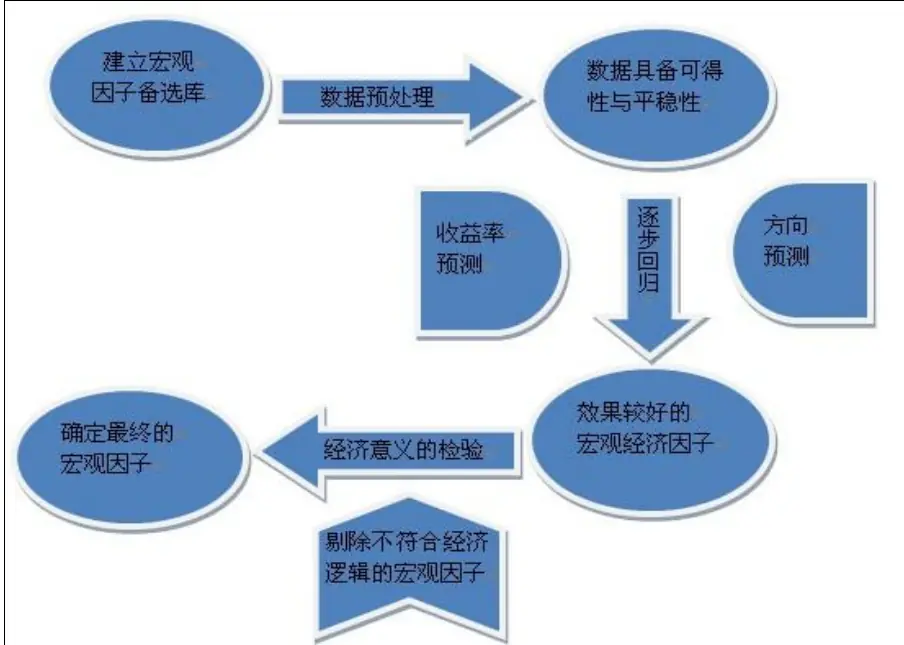
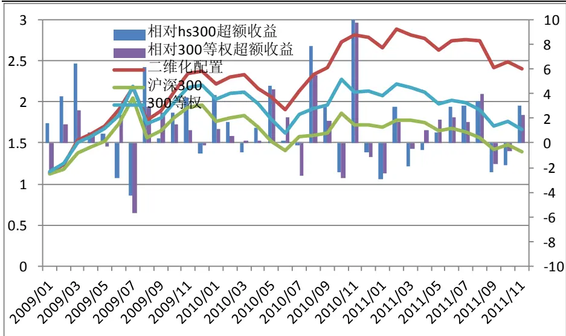
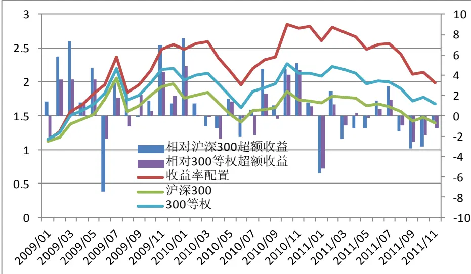
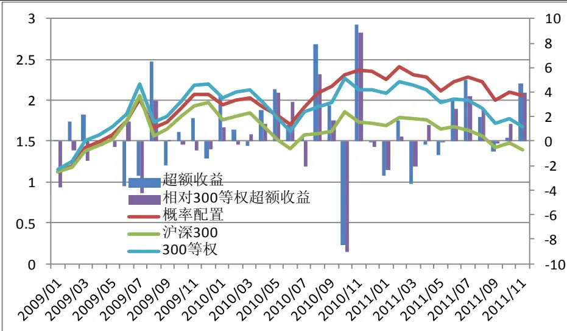
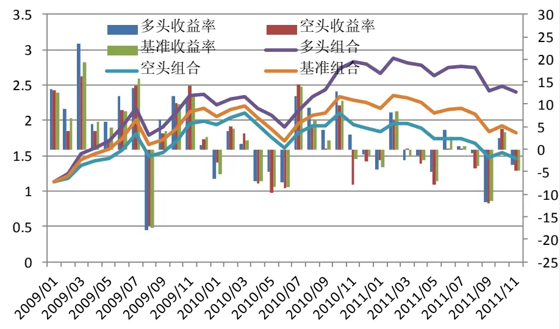
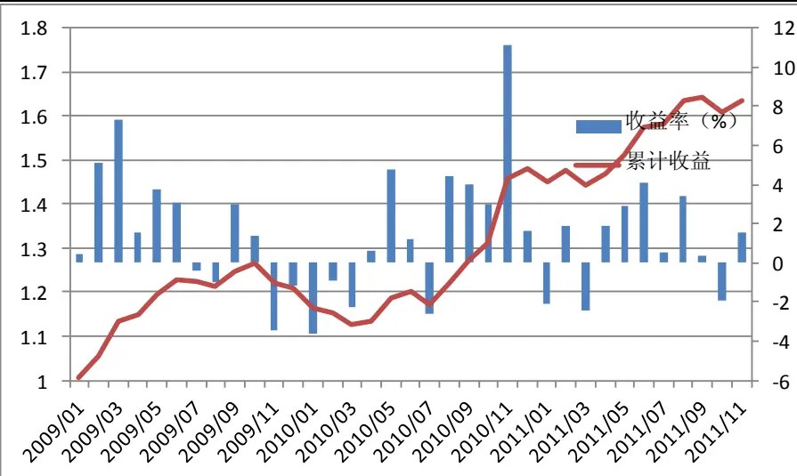
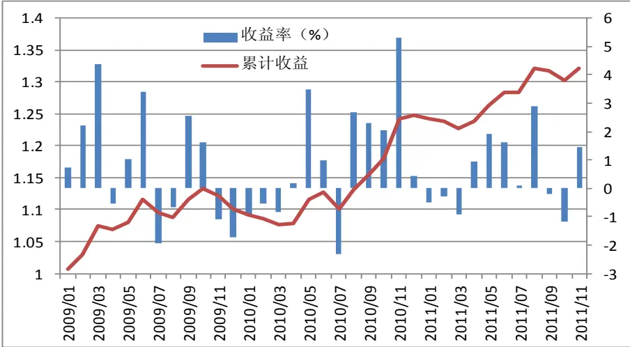
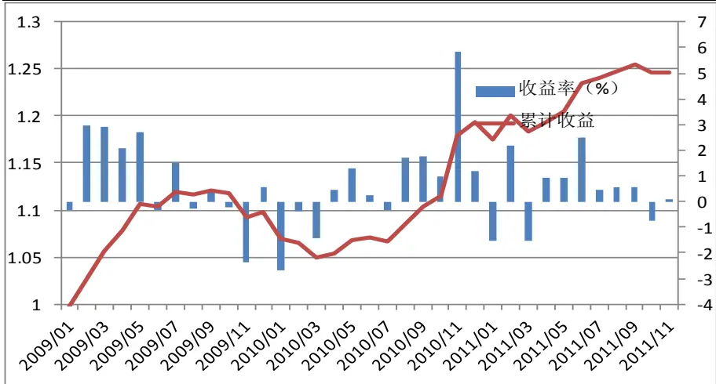

金融工程

2011.12.22

# 基于宏观变量的二维化多因子行业配置

## 量化研究系列之二十一

刘富兵

蒋瑛琨

021-38676673

021-38676710

liufubing008481@gtjas.com

jiangyingkun@gtjas.com

编号 S0880511010017

S0880511010023

本报告导读：我们分别从收益率与概率两方面入手建立了基于宏观变量的二维化多因子行业配置模型，利用模型给出的多头及空头行业组合进行配对交易年化收益达 18%，信息比率为 1.68，胜率达 69%，结果稳健且有效。最后我们给出了 12月份的相对看多及看空行业。

## 摘要：

[Table_Summary] • 多因子模型的应用相当广泛，其在组合管理，业绩归因，股票风格评分等领域都发挥着巨大作用，本文主要选择基于宏观变量的多因子模型进行行业配置。

- 未来，随着融资融券业务的进一步拓展，利用做空获取收益将越来越重要，为此本文不仅给出看多的行业，同时给出看空的行业，以期帮助投资者从多空两个方向赚取收益。

- 经典的多因子模型只对收益率进行预测，其所忽视的一面是，没有对方向进行预测。事实上，我们可以综合两方面的因素，给出具体的看多及看空行业。

- 通过逐步回归，最终我们筛选出拟合度较好的宏观因子，其中收益率预测模型的宏观因子有：PPI、工业增加值、商品零售价格指数、M2；方向预测模的宏观因子有：PPI、M1、宏观景气指数一致指数以及金融机构各项贷款余额增速。

从配置的结果来看，运用二维化多因子模型进行配置的效果非常好，在近 3年的时间里，该模型获得 140%的累积收益，累积超额收益为 101%，年化超额收益达到 23%，胜率超过65%，最大回撤不超过9%，信息比率达到 2.05。

不仅如此，利用二维化模型给出的空头配置进行做空交易并利用期货对冲能获得8%的稳定年化收益，而多空配对交易的年化收益更是提高到了 18%，这佐证了模型的有效性及稳定性。

- 此外，相比收益率与概率模型，二维化模型在收益率、波动率、胜率、最大回撤、信息比率等方面均有显著提高，这表明，多因子模型进行二维化考虑是有意义的。

- 12 月份，二维化模型我们推荐交运设备、食品饮料、有色金属、轻工业制造以及机械设备；我们不看好的行业有：公用事业、信息服务、交通运输、信息设备以及建筑建材。

[T相 报告ble_

《上市公司分红送转事件研究》

2011.12.01

《风格投资 IV：A股大小盘风格轮动研究》

2011.11.29

《多因子选股模型之组合构建Ⅲ》

2011.10.13

## 1. 多因子模型概述输

自资本资产定价模型诞生后，CAPM一直是学术界及实务界用来评估衡量风险与报酬的方法，然而 CAPM亦不断地接受挑战，CAPM的基本假设是证券收益仅与市场指数单一因素有关，这显然与实际情况不符。CAPM 模型的 beta不能完全解释资产的期望收益，尚有其他系统性风险因素可能对所有证券或某一证券组合的期望收益有影响，多因子模型即是将这些系统性风险纳入考量所建立的模型。

## 1.1. APT 理论

为解决单因子模型的缺陷，Merton(1973)及 Ross（1976）提出了套利定价理论（APT），由无套利原理推导出多因子结构，给出了资产期望收益与个数不确定的未识别因子之间的近似关系：

$$
r_{i}=a_{i}+\mathbf{b_{i}}^{\prime}\mathbf{f}+\varepsilon_{i}
$$

其中r 为资产i 的收益， $r_{i}$ $a_{\scriptscriptstyle i}$ 是因子模型截距， $\mathbf{b_{i}}$ 是资产i 的因子敏感性向量，f 是因子收益向量， $\mathcal{E}_{i}$ 是条件期望为 0、方差有限的扰动项。

## 1.2. Famma-French 三因子模型

APT 理论最大的缺陷在于没有明确具体的因子及因子个数，因此 APT的实际应用性较差。

Fama 和 French 1993 年指出可以建立一个三因子模型来解释股票回报率。模型认为，一个投资组合(包括单个股票)的超额回报率可由它对三个因子的暴露来解释，这三个因子是：市场资产组合 $(R_{{\scriptscriptstyle m}}-R_{{\scriptscriptstyle f}})$ 、市值因子(SMB )、账面市值比因子(HML )。这个多因子均衡定价模型可以表示为：

$$
E[R_{it}]-R_{ft}=\beta_{i}E[R_{mt}-R_{ft}]+s_{i}E[SMB_{t}]+h_{i}E[HML_{t}]
$$

其中 $\boldsymbol{R}_{\mathrm{\Omega}_{ft}}$ 表示时刻t 的无风险收益率， ${R}_{{m}t}$ 表示时刻 t的市场收益率， $R_{it}$ 表示资 $\dot{\mathcal{P}}i$ 在时刻t 的收益率， $E[R_{{\scriptscriptstyle mt}}-R_{{\scriptscriptstyle ft}}]$ 是市场风险溢价， $SMB_{t}$ 为时刻t 的市值(Size)因子的模拟组合收益率，HML 为时刻t 的账面市值比(Book-to-Market)因子的模拟组合收益率。

## 1.3.基于宏观变量的多因子模型

事实上，多因子模型中的因子大致可以分为三类：宏观经济因子，资产的基本面因子和基于统计的因子。对于基于宏观变量的多因子模型，学术派和实务派都进行了较为详细的研究，其中比较著名的模型有所罗门兄弟的 RAM 模型，MSCI 的 BARRA 模型以及 Burmerister、Ibbotson、Roll 和 Ross 在 2003 年建立的 BIRR 模型。

所罗门兄弟 1986 年推出了 RAM 模型（Risk Attribution Model），用来考察美国股票对宏观经济变量的敏感性，宏观变量包括：经济增速、经济周期、长期利率、短期利率、通货膨胀风险、美元指数。

MSCI Barra在宏观因素模型中纳入了通胀水平，原油价格，美元指数，VIX指数，工业产出和失业率等六个指标。

BIRR 模型的核心模型（Core model）由五个宏观因子组成，并且可以在此基础上添加风格因子。BIRR 认为利率、通胀、实际经济增长和市场情绪是无法通过分散化投资消除的系统性风险，对所有个股都会造成冲击，选择了如下五个核心因子：信心风险、投资期风险、通胀风险、商业周期风险、市场择时风险。

## 2. 多因子模型的二维化

多因子模型的应用相当广泛，其在组合管理、业绩归因、股票风格评分等领域都发挥着巨大作用，本文主要运用多因子模型进行行业配置。由于宏观经济因素对行业影响比较大，而且基于宏观经济的多因子模型较为成熟，为此，我们选择基于宏观变量的多因子模型进行行业配置。

经典的多因子模型，大多是选择因子建立回归模型预测组合或行业未来的收益率，选择排名靠前的进行配置。也就是说，经典的多因子模型只对收益率进行预测，其所忽视的一面是，没有对方向进行预测。

事实上，我们可以一方面利用多元线性回归对收益率进行预测；另一方面，利用 logit模型对方向进行预测，最后综合两方面的因素，给出行业配置。经过二维化考虑后，既确保了选择的行业收益概率较高，又确保了选择行业获得正收益的概率较高，从而使得行业配置的稳健性较好。

## 3. 二维化多因子模型的宏观变量选择

## 3.1.宏观因子的筛选流程

多因子模型非常重要的一环便是筛选出适合市场的因子，为此，首先我们需要结合经典模型及市场经验建立宏观因子备选库；其次，我们需要对这些宏观变量进行数据预处理，尽量使得这些数据具备可得性与平稳性；再次，利用逐步回归法分别就收益率预测与方向预测筛选出统计意义上效果较好的宏观经济因子；最后进行经济意义的检验，剔除不符合经济逻辑的宏观因子，从而确定最终的宏观因子。具体的流程图如下图所示：

图 1 二维化多因子模型宏观变量的确定流程

数据来源：国泰君安证券研究所

## 3.2.宏观因子备选库及宏观因子的确定

通过参考大量经典的宏观多因子模型，并结合国内的实际情况，我们认为以下宏观变量可能会对大盘以及行业的走势产生影响。

CPI,PPI,PMI，RPI（商品零售价格指数），规模以上工业增加值，用电量，发电量，社会消费品零售总额，宏观经济景气指数一致指数，出口总额，M1，金融机构各项贷款余额同比增速，金融机构各项存款余额增速、存贷款增速差，7日拆借利率，7日回购利率，1年期国债与 5年期国债收益率之差，1年期国债与 10年期国债收益率之差。

我们选择上述变量作为因子备选库，并对上述数据进行预处理。此外，我们选择 23个申万一级行业指数作为行业配置的标的。

通过逐步回归，最终我们筛选出拟合度较好的宏观因子，其中收益率预测模型包含的宏观因子有：PPI、工业增加值（VIA）、商品零售价格指数（PPI）、M2。

方向预测模型包含的宏观因子有：PPI、M1、宏观景气指数一致指数以及金融机构各项贷款余额增速。

## 3.3. 模型分析

从模型结果来看，收益率预测模型对沪深 300的拟合优度达到 0.15，对23 个申万一级行业的拟合优度在[0.10,0.23]内；而方向预测模型对沪深300 的拟合优度达到 0.28，对 23 个申万一级行业的拟合优度在[0.16,0.31]，整体效果较好，具体各因子的回归系数见下表。

表 1 收益率预测回归结果

| assest | Adj R-square | F statistic | ppi_th | rpi_th | ia_th | m2_t |
| --- | --- | --- | --- | --- | --- | --- |
| 沪深300 | 0.15 | 4.43 | -4.71 | 4.93 | 0.49 | 0.1 |
| P值 |  |  | [0.001] | [0.02] | [0.44] | [0.1] |
| 农林牧渔 | 0.13 | 3.82 | -4.3248 | 5.1301 | 0.57412 | 0.13958 |
| 采掘 | 0.21 | 6.33 | -7.0785 | 8.9107 | 0.63455 | 0.13396 |
| 化工 | 0.11 | 3.57 | -4.385 | 4.1059 | 0.46285 | 0.09604 |
| 黑色金属 | 0.12 | 2.67 | -4.6808 | 5.9238 | 0.32046 | 0.079633 |
| 有色金属 | 0.23 | 6.76 | -7.9067 | 7.5894 | 1.2317 | 0.16612 |
| 建筑建材 | 0.12 | 2.64 | -3.598 | 3.0696 | 0.13009 | 0.12498 |
| 机械设备 | 0.15 | 4.44 | -4.4818 | 3.3973 | 0.36009 | 0.15117 |
| 电子元器件 | 0.09 | 2.9 | -3.9528 | 2.5633 | 0.54451 | 0.11883 |
| 交运设备 | 0.17 | 5.05 | -5.3805 | 4.0592 | 0.65182 | 0.1438 |
| 信息设备 | 0.12 | 2.57 | -3.526 | 2.2785 | 0.33202 | 0.10829 |
| 家用电器 | 0.14 | 3.07 | -3.4452 | 2.4671 | 0.37477 | 0.14442 |
| 食品饮料 | 0.17 | 5.18 | -3.9638 | 3.5891 | 0.66608 | 0.15594 |
| 纺织服装 | 0.11 | 2.42 | -3.778 | 2.674 | 0.055045 | 0.12944 |
| 轻工制造 | 0.11 | 3.49 | -4.3766 | 4.1963 | 0.60281 | 0.11186 |
| 医药生物 | 0.1 | 3.3 | -3.1529 | 1.8896 | 0.31181 | 0.15044 |
| 公用事业 | 0.1 | 1.96 | -3.1306 | 3.2461 | 0.21884 | 0.071997 |
| 交通运输 | 0.12 | 2.57 | -3.7433 | 4.5552 | 0.39475 | 0.056919 |
| 房地产 | 0.14 | 3.16 | -4.6794 | 3.7367 | 0.68337 | 0.12174 |
| 金融服务 | 0.13 | 4.06 | -4.8939 | 5.1409 | 0.45029 | 0.10781 |
| 商业贸易 | 0.11 | 3.41 | -3.7499 | 3.0614 | 0.65431 | 0.14177 |
| 餐饮旅游 | 0.11 | 3.46 | -4.0418 | 3.5763 | 0.79136 | 0.12413 |
| 信息服务 | 0.12 | 2.64 | -2.9194 | 2.2793 | 0.64138 | 0.096656 |
| 综合 | 0.12 | 2.52 | -3.9699 | 2.3877 | 0.24776 | 0.14269 |

数据来源：国泰君安证券研究所

表 2 方向预测回归结果

| assest | R-square | p_value | ppi_th | m1_th | pi2_d | loan_t |
| --- | --- | --- | --- | --- | --- | --- |
| 沪深300 | 0.28 | 0.003 | -1.04 | 0.08 | 1.18 | 0.03 |
| P值 |  |  | [0.004] | [0.63] | [0.07] | [0.02] |
| 农林牧渔 | 0.2 | 0.03 | -1.01514 | -0.15592 | 0.868954 | 0.018653 |
| 采掘 | 0.16 | 0.06 | -0.75978 | -0.13512 | 0.754825 | 0.023193 |
| 化工 | 0.31 | 0.002 | -1.05757 | 0.083496 | 1.117314 | 0.040238 |
| 黑色金属 | 0.16 | 0.06 | -0.7471 | -0.10919 | 0.961457 | 0.023624 |
| 有色金属 | 0.21 | 0.02 | -0.95385 | -0.13901 | 0.616809 | 0.025243 |
| 建筑建材 | 0.19 | 0.03 | -0.72262 | -0.04887 | 1.069765 | 0.029064 |
| 机械设备 | 0.29 | 0.003 | -1.11945 | 0.096546 | 0.708245 | 0.03284 |
| 电子元器件 | 0.31 | 0.002 | -1.2214 | 0.08689 | 0.816204 | 0.033819 |
| 交运设备 | 0.32 | 0.001 | -1.32831 | -0.08169 | 1.120019 | 0.035444 |
| 信息设备 | 0.2 | 0.02 | -0.69121 | 0.104195 | 0.513902 | 0.031591 |
| 家用电器 | 0.26 | 0.006 | -0.90586 | 0.102295 | 0.77778 | 0.034807 |
| 食品饮料 | 0.4 | 0.001 | -1.51888 | 0.009182 | 0.391987 | 0.051282 |
| 纺织服装 | 0.24 | 0.01 | -0.9475 | -0.00572 | 0.660432 | 0.031139 |
| 轻工制造 | 0.31 | 0.002 | -1.20771 | 0.129085 | 0.689445 | 0.034028 |
| 医药生物 | 0.25 | 0.007 | -0.75483 | -0.28403 | 0.743772 | 0.040053 |
| 公用事业 | 0.18 | 0.04 | -0.66204 | 0.206115 | 0.287743 | 0.019844 |
| 交通运输 | 0.15 | 0.09 | -0.61257 | 0.1418 | 0.686986 | 0.016973 |
| 房地产 | 0.2 | 0.03 | -0.82266 | 0.116974 | 1.007621 | 0.019125 |
| 金融服务 | 0.23 | 0.01 | -0.69999 | 0.222242 | 0.314442 | 0.031094 |
| 商业贸易 | 0.31 | 0.002 | -1.12587 | 0.089599 | 0.878076 | 0.036841 |
| 餐饮旅游 | 0.2 | 0.02 | -0.61079 | 0.165599 | 0.315096 | 0.0325 |
| 信息服务 | 0.26 | 0.005 | -0.54401 | 0.186396 | 0.097885 | 0.044781 |
| 综合 | 0.22 | 0.02 | -0.98967 | 0.146537 | 0.339448 | 0.013119 |

数据来源：国泰君安证券研究所

由表 1 及表 2可以看出，沪深 300与各行业之间的相关性非常强，各个宏观变量对沪深 300及各行业的影响方向高度一致。

## 3.3.1. 收益率回归模型分析

从各因子系数来看，收益率回归模型中的宏观变量符合经济意义：

1．PPI。PPI 增加时通胀压力增大，央行采取紧缩的货币政策可能性加大，市场对紧缩的预期会增强，市场表现会相对较弱。

2．RPI（商品零售价格指数）。RPI 是指反映一定时期内商品零售价格变动趋势和变动程度的相对数。该指数的上升反映了需求的强劲，预示着经济的向好。

3．VIA（工业增加值）。工业增加值的增加意味着实体经济的走强，有利于股市的进一步表现。

4．M2。M2 增速越大越有利于股市。究其原因，我们认为，国内 A股市场具备明显的资金推动特征，M2上升的时候，宽松的流动性涌入股票市场，资金推动股市上扬。

## 3.3.2. 概率回归模型分析

在 Logit 模型中，预测概率的各宏观变量也符合经济解释。ppi及 M1有与收益率回归模型类似的解释，在此不再赘述。宏观景气指数及贷款余额增速的经济解释如下：

1. Pi2（宏观景气指数一致指数）。一致指数是反映当前经济的基本走势，由工业生产、就业、社会需求（投资、消费、外贸）、社会收入（国家税收、企业利润、居民收入）等 4 个方面合成，因此该指标对市场的影响是正面的。

2. Loan（贷款余额增速）。贷款余额增速的上升意味着市场资金面的宽裕，充裕的流动性一方面会增加市场对证券的需求，另一方面会提高投资者对市场的预期，有利于估值的进一步提升。两方面的正向因素将加速推动市场的上涨。

## 4. 基于宏观变量的二维化多因子行业配置

利用前述建立的收益率模型及 logit方向模型，我们对各个行业下期的收益率及获取正收益的概率进行预测，并据此分别进行排名打分，最后给出综合打分，选取综合打分排名前五的行业作为配置组合。我们研究的样本区间为 2005.1-2011.11，由于数据样本有限，我们采用数据累计的方式建立预测模型，即在不剔除原有最早的数据的同时，不断加入新的数据。

## 4.1.二维化的行业配置情况

由于建立收益率模型及 logit方向模型需要一定的样本内数据，因此我们对二维化多因子行业配置的样本外检验从 2009 年 1 月开始，具体各期的配置行业如下表所示。

表 3 二维化多因子行业配置情况

| 日期 | 行业1 | 行业2 | 行业3 | 行业4 | 行业5 |
| --- | --- | --- | --- | --- | --- |
| 2009/01 | 有色金属 | 餐饮旅游 | 纺织服装 | 食品饮料 | 商业贸易 |
| 2009/02 | 有色金属 | 餐饮旅游 | 电子元器件 | 机械设备 | 轻工制造 |
| 2009/03 | 餐饮旅游 | 有色金属 | 交运设备 | 电子元器件 | 机械设备 |
| 2009/04 | 餐饮旅游 | 综合 | 机械设备 | 纺织服装 | 信息服务 |
| 2009/05 | 金融服务 | 纺织服装 | 轻工制造 | 综合 | 房地产 |
| 2009/06 | 交运设备 | 房地产 | 家用电器 | 商业贸易 | 机械设备 |
| 2009/07 | 金融服务 | 房地产 | 交运设备 | 食品饮料 | 商业贸易 |
| 2009/08 | 房地产 | 金融服务 | 机械设备 | 食品饮料 | 交运设备 |
| 2009/09 | 房地产 | 交运设备 | 商业贸易 | 食品饮料 | 化工 |
| 2009/10 | 房地产 | 采掘 | 化工 | 交运设备 | 金融服务 |
| 2009/11 | 房地产 | 建筑建材 | 化工 | 商业贸易 | 家用电器 |
| 2009/12 | 房地产 | 化工 | 建筑建材 | 商业贸易 | 家用电器 |
| 2010/01 | 信息服务 | 黑色金属 | 化工 | 公用事业 | 医药生物 |
| 2010/02 | 医药生物 | 信息服务 | 建筑建材 | 黑色金属 | 交通运输 |
| 2010/03 | 信息服务 | 公用事业 | 信息设备 | 纺织服装 | 餐饮旅游 |
| 2010/04 | 建筑建材 | 农林牧渔 | 家用电器 | 黑色金属 | 采掘 |
| 2010/05 | 交运设备 | 食品饮料 | 农林牧渔 | 医药生物 | 信息服务 |
| 2010/06 | 医药生物 | 家用电器 | 商业贸易 | 金融服务 | 机械设备 |
| 2010/07 | 医药生物 | 金融服务 | 食品饮料 | 农林牧渔 | 机械设备 |
| 2010/08 | 医药生物 | 交运设备 | 建筑建材 | 机械设备 | 纺织服装 |
| 2010/09 | 交运设备 | 机械设备 | 有色金属 | 金融服务 | 食品饮料 |
| 2010/10 | 交运设备 | 食品饮料 | 有色金属 | 机械设备 | 农林牧渔 |
| 2010/11 | 医药生物 | 交运设备 | 商业贸易 | 食品饮料 | 家用电器 |
| 2010/12 | 金融服务 | 商业贸易 | 化工 | 机械设备 | 餐饮旅游 |
| 2011/01 | 医药生物 | 采掘 | 建筑建材 | 商业贸易 | 餐饮旅游 |
| 2011/02 | 医药生物 | 商业贸易 | 交运设备 | 家用电器 | 机械设备 |
| 2011/03 | 医药生物 | 食品饮料 | 家用电器 | 建筑建材 | 农林牧渔 |
| 2011/04 | 金融服务 | 家用电器 | 机械设备 | 商业贸易 | 化工 |
| 2011/05 | 机械设备 | 金融服务 | 商业贸易 | 食品饮料 | 有色金属 |
| 2011/06 | 交运设备 | 有色金属 | 农林牧渔 | 建筑建材 | 医药生物 |
| 2011/07 | 食品饮料 | 交运设备 | 家用电器 | 商业贸易 | 医药生物 |
| 2011/08 | 金融服务 | 餐饮旅游 | 轻工制造 | 化工 | 商业贸易 |
| 2011/09 | 医药生物 | 建筑建材 | 农林牧渔 | 纺织服装 | 食品饮料 |
| 2011/10 | 交运设备 | 医药生物 | 机械设备 | 有色金属 | 商业贸易 |
| 2011/11 | 有色金属 | 交运设备 | 农林牧渔 | 采掘 | 机械设备 |

数据来源：国泰君安证券研究所

从配置的结果来看，运用二维化多因子模型进行配置的效果非常不错，在近 3 年的时间里，该模型获得 140%的累积收益，相比同期的沪深 300累积超额收益为 101%，年化超额收益达到 23%，相对于 300 等权的累积超额收益为 73%，年化超额收益为 16%。

从胜率来看，无论是相对沪深 300还是 300 等权，二维化多因子模型获得正超额收益的概率都超过 65%，最大回撤不超过 9%。种种指标表明二维化模型比较稳健。

此外，二维化模型的信息比率超过 1.6，而夏普比率也超过 1，这表明从风险调整后的收益角度看，该模型都有不错的效果。

图 2 二维化多因子配置组合走势

数据来源：国泰君安证券研究所

## 4.2.多因子二维化的有效性分析

为分析二维化模型的有效性，我们同时就该模型与单纯利用收益率模型及概率模型所作的行业配置进行比较。

表 4 收益率多因子行业配置情况

| 日期 | 行业1 | 行业2 | 行业3 | 行业4 | 行业5 |
| --- | --- | --- | --- | --- | --- |
| 2009/01 | 有色金属 | 综合 | 医药生物 | 机械设备 | 纺织服装 |
| 2009/02 | 有色金属 | 交运设备 | 综合 | 电子元器件 | 餐饮旅游 |
| 2009/03 | 有色金属 | 交运设备 | 机械设备 | 房地产 | 综合 |
| 2009/04 | 综合 | 电子元器件 | 机械设备 | 医药生物 | 房地产 |
| 2009/05 | 有色金属 | 采掘 | 机械设备 | 金融服务 | 纺织服装 |
| 2009/06 | 机械设备 | 综合 | 交运设备 | 商业贸易 | 建筑建材 |
| 2009/07 | 有色金属 | 采掘 | 交运设备 | 金融服务 | 商业贸易 |
| 2009/08 | 有色金属 | 房地产 | 采掘 | 机械设备 | 商业贸易 |
| 2009/09 | 有色金属 | 房地产 | 交运设备 | 商业贸易 | 采掘 |
| 2009/10 | 有色金属 | 采掘 | 食品饮料 | 农林牧渔 | 商业贸易 |
| 2009/11 | 房地产 | 食品饮料 | 采掘 | 农林牧渔 | 家用电器 |
| 2009/12 | 食品饮料 | 商业贸易 | 医药生物 | 农林牧渔 | 房地产 |
| 2010/01 | 食品饮料 | 信息服务 | 家用电器 | 商业贸易 | 医药生物 |
| 2010/02 | 信息服务 | 医药生物 | 食品饮料 | 公用事业 | 家用电器 |
| 2010/03 | 医药生物 | 家用电器 | 信息服务 | 建筑建材 | 纺织服装 |
| 2010/04 | 纺织服装 | 家用电器 | 建筑建材 | 金融服务 | 医药生物 |
| 2010/05 | 餐饮旅游 | 有色金属 | 信息服务 | 食品饮料 | 交运设备 |
| 2010/06 | 农林牧渔 | 医药生物 | 采掘 | 食品饮料 | 家用电器 |
| 2010/07 | 采掘 | 医药生物 | 金融服务 | 机械设备 | 纺织服装 |
| 2010/08 | 纺织服装 | 综合 | 交运设备 | 金融服务 | 医药生物 |
| 2010/09 | 有色金属 | 采掘 | 金融服务 | 房地产 | 机械设备 |
| 2010/10 | 有色金属 | 采掘 | 农林牧渔 | 机械设备 | 商业贸易 |
| 2010/11 | 机械设备 | 有色金属 | 交运设备 | 商业贸易 | 综合 |
| 2010/12 | 采掘 | 有色金属 | 黑色金属 | 食品饮料 | 金融服务 |
| 2011/01 | 采掘 | 农林牧渔 | 食品饮料 | 商业贸易 | 黑色金属 |
| 2011/02 | 医药生物 | 综合 | 机械设备 | 食品饮料 | 家用电器 |
| 2011/03 | 医药生物 | 家用电器 | 商业贸易 | 食品饮料 | 综合 |
| 2011/04 | 采掘 | 有色金属 | 黑色金属 | 食品饮料 | 交运设备 |
| 2011/05 | 有色金属 | 采掘 | 机械设备 | 交运设备 | 家用电器 |
| 2011/06 | 有色金属 | 采掘 | 交运设备 | 金融服务 | 综合 |
| 2011/07 | 有色金属 | 采掘 | 机械设备 | 农林牧渔 | 食品饮料 |
| 2011/08 | 有色金属 | 采掘 | 黑色金属 | 交运设备 | 金融服务 |
| 2011/09 | 农林牧渔 | 医药生物 | 纺织服装 | 家用电器 | 机械设备 |
| 2011/10 | 有色金属 | 机械设备 | 采掘 | 综合 | 家用电器 |
| 2011/11 | 有色金属 | 采掘 | 机械设备 | 房地产 | 金融服务 |

数据来源：国泰君安证券研究所

表 5 概率多因子行业配置情况

| 日期 | 行业1 | 行业2 | 行业3 | 行业4 | 行业5 |
| --- | --- | --- | --- | --- | --- |
| 2009/01 | 食品饮料 | 餐饮旅游 | 电子元器件 | 金融服务 | 纺织服装 |
| 2009/02 | 轻工制造 | 食品饮料 | 餐饮旅游 | 电子元器件 | 纺织服装 |
| 2009/03 | 食品饮料 | 餐饮旅游 | 金融服务 | 电子元器件 | 有色金属 |
| 2009/04 | 金融服务 | 轻工制造 | 餐饮旅游 | 纺织服装 | 机械设备 |
| 2009/05 | 金融服务 | 轻工制造 | 食品饮料 | 纺织服装 | 房地产 |
| 2009/06 | 金融服务 | 食品饮料 | 餐饮旅游 | 交运设备 | 家用电器 |
| 2009/07 | 金融服务 | 食品饮料 | 化工 | 轻工制造 | 房地产 |
| 2009/08 | 金融服务 | 房地产 | 餐饮旅游 | 食品饮料 | 信息服务 |
| 2009/09 | 化工 | 金融服务 | 交运设备 | 交通运输 | 家用电器 |
| 2009/10 | 化工 | 房地产 | 交运设备 | 公用事业 | 交通运输 |
| 2009/11 | 化工 | 房地产 | 建筑建材 | 信息服务 | 交通运输 |
| 2009/12 | 化工 | 房地产 | 交通运输 | 建筑建材 | 黑色金属 |
| 2010/01 | 黑色金属 | 化工 | 交通运输 | 公用事业 | 建筑建材 |
| 2010/02 | 医药生物 | 建筑建材 | 信息服务 | 化工 | 农林牧渔 |
| 2010/03 | 信息服务 | 信息设备 | 公用事业 | 化工 | 房地产 |
| 2010/04 | 交运设备 | 建筑建材 | 农林牧渔 | 化工 | 食品饮料 |
| 2010/05 | 医药生物 | 交运设备 | 建筑建材 | 食品饮料 | 黑色金属 |
| 2010/06 | 信息服务 | 餐饮旅游 | 金融服务 | 家用电器 | 化工 |
| 2010/07 | 医药生物 | 信息服务 | 食品饮料 | 餐饮旅游 | 交运设备 |
| 2010/08 | 医药生物 | 食品饮料 | 农林牧渔 | 黑色金属 | 建筑建材 |
| 2010/09 | 食品饮料 | 交运设备 | 家用电器 | 轻工制造 | 商业贸易 |
| 2010/10 | 食品饮料 | 医药生物 | 信息服务 | 轻工制造 | 化工 |
| 2010/11 | 医药生物 | 交运设备 | 信息服务 | 化工 | 家用电器 |
| 2010/12 | 化工 | 信息服务 | 房地产 | 家用电器 | 信息设备 |
| 2011/01 | 医药生物 | 信息服务 | 化工 | 家用电器 | 信息设备 |
| 2011/02 | 医药生物 | 交运设备 | 食品饮料 | 建筑建材 | 商业贸易 |
| 2011/03 | 医药生物 | 农林牧渔 | 交运设备 | 食品饮料 | 采掘 |
| 2011/04 | 信息服务 | 化工 | 金融服务 | 餐饮旅游 | 信息设备 |
| 2011/05 | 信息服务 | 金融服务 | 机械设备 | 家用电器 | 信息设备 |
| 2011/06 | 交运设备 | 医药生物 | 化工 | 建筑建材 | 农林牧渔 |
| 2011/07 | 食品饮料 | 信息服务 | 交运设备 | 化工 | 家用电器 |
| 2011/08 | 信息服务 | 金融服务 | 信息设备 | 化工 | 家用电器 |
| 2011/09 | 医药生物 | 信息服务 | 建筑建材 | 黑色金属 | 食品饮料 |
| 2011/10 | 食品饮料 | 医药生物 | 交运设备 | 轻工制造 | 商业贸易 |
| 2011/11 | 食品饮料 | 医药生物 | 有色金属 | 农林牧渔 | 电子元器件 |

数据来源：国泰君安证券研究所

从行业配置来看，二维化与收益率模型及概率模型大致有 40%-60%的重合度，剩余的行业都是收益率预测及概率预测比较适中的行业。这就使得我们的二维化模型显得比较稳健。

从统计结果来看，相比收益率模型与概率模型，二维化模型在各项指标上均取得了显著改善：收益率获得了大幅提升、波动率有所下降、胜率有所提高、最大回撤有所改善，信息比率与夏普比率大幅提高。上述结果说明对多因子模型实行二维化后，有效性得到了大幅提高，从而表明多因子模型进行二维化考虑是有意义的。

表 6 多因子配置的统计结果

| 基准 指数 | 配置 方式 | 累积 收益 | 累积 超额收益 | 年化 收益 | 年化超 额收益 | 收益波 动率 | 超额 收益 波动率 | 信 息 比 率 | 夏 普 比 | 胜率 | 最大回 撤(相对 基准指 数） | 最大 跑输 基准 |
| --- | --- | --- | --- | --- | --- | --- | --- | --- | --- | --- | --- | --- |
| 沪深 300 | 二维化 | 140.19% | 101.47% | 35.04% | 23.17% | 29.40% | 11.29% | 2.05 | 率 1.07 | 65.71% | -8.16% | 次数 2 |
|  | 收益率 | 99.33% | 60.61% | 26.68% | 14.81% | 34.89% | 12.07% | 1.23 | 0.66 | 62.86% | -7.43% | 4 |
|  | 概率 | 106.33% | 67.61% | 28.19% | 16.31% | 26.83% | 11.99% | 1.36 | 0.92 | 62.86% | -8.46% | 3 |
| 300 等权 | 二维化 | 140.19% | 73.30% | 35.04% | 15.85% | 29.40% | 9.42% | 1.68 | 1.07 | 68.57% | -5.67% | 2 |
|  | 收益率 | 99.33% | 32.44% | 26.68% | 7.48% | 34.89% | 8.22% | 0.91 | 0.66 | 57.14% | -5.78% | 4 |
|  | 概率 | 106.33% | 39.44% | 28.19% | 8.99% | 26.83% | 10.70% | 0.84 | 0.92 | 51.43% | -9.01% | 5 |
| 平 | 二维化 | 140.19% | 57.70% | 35.04% | 12.14% | 29.40% | 6.44% | 1.89 | 1.07 | 60.00% | -5.71% | 5 |
| 均 | 收益率 | 99.33% | 16.84% | 26.68% | 3.78% | 34.89% | 9.64% | 0.39 | 0.66 | 48.57% | -6.48% | 5 |
| 指 数 | 概率 | 106.33% | 23.85% | 28.19% | 5.29% | 26.83% | 6.67% | 0.79 | 0.92 | 51.43% | -9.61% | 6 |

数据来源：国泰君安证券研究所

图 3 收益率多因子配置组合走势

数据来源：国泰君安证券研究所

图 4 概率多因子配置组合走势

数据来源：国泰君安证券研究所

## 4.3.利用多因子二维化进行多空组合交易

事实上，一个好的量化模型除了在做多配置有效外，其在做空配置上也是有效的，这样的模型才是稳定有效的。为此，本节，我们主要分析多空头配对交易的收益情况，以及多头、空头组合相对基准组合的收益情况。

二维化模型给出的空头组合如下表所示：

表 7 二维化多因子空头行业配置

| 日期 | 行业1 | 行业2 | 行业3 | 行业4 | 行业5 |
| --- | --- | --- | --- | --- | --- |
| 2009/01 | 交通运输 | 化工 | 公用事业 | 房地产 | 信息服务 |
| 2009/02 | 公用事业 | 化工 | 黑色金属 | 建筑建材 | 农林牧渔 |
| 2009/03 | 交通运输 | 黑色金属 | 化工 | 信息服务 | 信息设备 |
| 2009/04 | 交通运输 | 黑色金属 | 农林牧渔 | 化工 | 建筑建材 |
| 2009/05 | 交通运输 | 信息设备 | 黑色金属 | 医药生物 | 信息服务 |
| 2009/06 | 公用事业 | 黑色金属 | 采掘 | 交通运输 | 电子元器件 |
| 2009/07 | 信息设备 | 公用事业 | 交通运输 | 信息服务 | 黑色金属 |
| 2009/08 | 交通运输 | 信息设备 | 黑色金属 | 公用事业 | 建筑建材 |
| 2009/09 | 电子元器件 | 公用事业 | 综合 | 纺织服装 | 轻工制造 |
| 2009/10 | 综合 | 纺织服装 | 信息设备 | 餐饮旅游 | 轻工制造 |
| 2009/11 | 餐饮旅游 | 综合 | 纺织服装 | 轻工制造 | 信息设备 |
| 2009/12 | 有色金属 | 纺织服装 | 综合 | 轻工制造 | 餐饮旅游 |
| 2010/01 | 综合 | 电子元器件 | 纺织服装 | 餐饮旅游 | 交运设备 |
| 2010/02 | 有色金属 | 电子元器件 | 轻工制造 | 金融服务 | 房地产 |
| 2010/03 | 采掘 | 交运设备 | 电子元器件 | 轻工制造 | 农林牧渔 |
| 2010/04 | 餐饮旅游 | 有色金属 | 轻工制造 | 房地产 | 公用事业 |
| 2010/05 | 纺织服装 | 综合 | 金融服务 | 交通运输 | 黑色金属 |
| 2010/06 | 房地产 | 交通运输 | 黑色金属 | 有色金属 | 电子元器件 |
| 2010/07 | 电子元器件 | 房地产 | 公用事业 | 化工 | 综合 |
| 2010/08 | 餐饮旅游 | 公用事业 | 信息服务 | 信息设备 | 房地产 |
| 2010/09 | 信息设备 | 交通运输 | 信息服务 | 建筑建材 | 黑色金属 |
| 2010/10 | 公用事业 | 建筑建材 | 纺织服装 | 黑色金属 | 信息设备 |
| 2010/11 | 黑色金属 | 公用事业 | 房地产 | 金融服务 | 餐饮旅游 |
| 2010/12 | 公用事业 | 电子元器件 | 纺织服装 | 信息设备 | 医药生物 |
| 2011/01 | 公用事业 | 房地产 | 电子元器件 | 交运设备 | 纺织服装 |
| 2011/02 | 金融服务 | 采掘 | 有色金属 | 交通运输 | 餐饮旅游 |
| 2011/03 | 房地产 | 轻工制造 | 化工 | 交通运输 | 纺织服装 |
| 2011/04 | 公用事业 | 纺织服装 | 电子元器件 | 信息设备 | 农林牧渔 |
| 2011/05 | 黑色金属 | 公用事业 | 房地产 | 化工 | 电子元器件 |
| 2011/06 | 公用事业 | 餐饮旅游 | 信息设备 | 交通运输 | 轻工制造 |
| 2011/07 | 公用事业 | 综合 | 信息设备 | 餐饮旅游 | 房地产 |
| 2011/08 | 纺织服装 | 公用事业 | 建筑建材 | 电子元器件 | 交通运输 |
| 2011/09 | 房地产 | 公用事业 | 电子元器件 | 轻工制造 | 综合 |
| 2011/10 | 公用事业 | 黑色金属 | 房地产 | 农林牧渔 | 信息设备 |
| 2011/11 | 交通运输 | 信息服务 | 信息设备 | 建筑建材 | 餐饮旅游 |

数据来源：国泰君安证券研究所

为了使得我们的组合与基准具有可比性，我们选择行业平均指数作为基准，利用表 3及表 7的结果进行配置后的组合收益比较如下图所示：

图 5 多空组合的收益走势

数据来源：国泰君安证券研究所

由图 5 可以看到，多头组合跑赢了基准组合，而基准组合又跑赢了空头组合，这表明利用多因子二维化选取的行业是稳定有效的。

利用上述结果我们可以做三种交易策略：

1. 配对交易：做多多头组合，做空空头组合；

2. 多头对冲交易：做多多头组合，做空基准；

3. 空头对冲交易：做空空头组合，做多基准。

三种交易策略的每期收益及累积收益如 6-8所示：

图 6 配对交易收益走势

数据来源：国泰君安证券研究所

图 7 多头对冲交易收益走势

数据来源：国泰君安证券研究所

图 8 空头对冲交易收益走势

数据来源：国泰君安证券研究所

表 8 多空组合统计结果

| 交易方式 | 累积收益 | 年化收益 | 年化收益 波动率 | 信息比率 | 胜率 | 最大回撤 | 获取负收益 的最大次数 |
| --- | --- | --- | --- | --- | --- | --- | --- |
| 配对交易 | 63.49% | 18.36% | 10.95% | 1.68 | 68.57% | -11.02% | 5 |
| 做多对冲 | 32.17% | 10.04% | 11.10% | 0.90 | 60% | -5.08% | 5 |
| 做空对冲 | 24.64% | 7.85% | 11.04% | 0.71 | 65.71% | -4.45% | 3 |

数据来源：国泰君安证券研究所

由表 8 可以看出，无论是配对交易、做多对冲还是做空对冲，三种交易方式都获得了较高的收益，而且比较稳定，这再次佐证了二维化模型的有效性。

## 5. 12 月行业配置建议

根据 11 月的数据，我们对 23个申万一级行业分别就收益率、概率以及二维化在 12月进行了排序，具体见下表。

表 9 12 月各行业在多因子模型中的排名情况

| 行业 | 预测收益 | 预测概率 | 收益率排名 | 概率排名 | 二维化排名 |
| --- | --- | --- | --- | --- | --- |
| 交运设备 | 13.0186 | 0.890254 | 4 | 2 | 1 |
| 食品饮料 | 10.70263 | 0.952418 | 11 | 1 | 2 |
| 有色金属 | 19.93583 | 0.826257 | 1 | 11 | 3 |
| 轻工制造 | 11.32919 | 0.874766 | 9 | 4 | 4 |
| 机械设备 | 11.36062 | 0.859854 | 8 | 6 | 5 |
| 农林牧渔 | 12.50883 | 0.847115 | 6 | 9 | 6 |
| 化工 | 11.12554 | 0.85354 | 10 | 7 | 7 |
| 商业贸易 | 9.722875 | 0.864127 | 14 | 5 | 8 |
| 金融服务 | 12.9867 | 0.777991 | 5 | 15 | 9 |
| 电子元器件 | 9.304464 | 0.875103 | 18 | 3 | 10 |
| 黑色金属 | 13.12604 | 0.767473 | 3 | 18 | 11 |
| 采掘 | 19.90067 | 0.764733 | 2 | 19 | 12 |
| 纺织服装 | 9.55451 | 0.831318 | 17 | 10 | 13 |
| 综合 | 9.627481 | 0.803495 | 15 | 13 | 14 |
| 房地产 | 11.41274 | 0.760001 | 7 | 21 | 15 |
| 医药生物 | 8.057962 | 0.848041 | 22 | 8 | 16 |
| 家用电器 | 8.909093 | 0.823373 | 19 | 12 | 17 |
| 餐饮旅游 | 10.32541 | 0.76304 | 12 | 20 | 18 |
| 建筑建材 | 9.573698 | 0.768708 | 16 | 17 | 19 |
| 信息设备 | 8.402981 | 0.777195 | 20 | 16 | 20 |
| 交通运输 | 10.16504 | 0.707446 | 13 | 23 | 21 |
| 信息服务 | 7.224752 | 0.783499 | 23 | 14 | 22 |
| 公用事业 | 8.342937 | 0.74042 | 21 | 22 | 23 |

数据来源：国泰君安证券研究所

基于上述结果，12月份，二维化模型我们推荐交运设备、食品饮料、有色金属、轻工业制造以及机械设备；我们不看好的行业有：公用事业、信息服务、交通运输、信息设备以及建筑建材。

## 作者简介：

[Table_A刘富兵：

执业资格证书编号：S0880511010017

电话：021-38676673

邮箱：liufubing008481@gtjas.com

上海交通大学金融工程博士，国泰君安金融工程研究员，2008-2010 年曾供职于国金证券研究所，目前从事股指期货等衍生品及量化方面的研究。2010 年水晶球奖“衍生品”第四名，2011 年水晶球奖第五名，金牛奖第五名，入围新财富。

## 蒋瑛琨：

执业资格证书编号：S0880511010023

电话：021-38676710

邮箱：jiangyingkun@gtjas.com

吉林大学数量经济学博士，CPA，国泰君安证券首席金融工程研究员。05年加入国泰君安证券研究所，曾在衍生产品部、销售交易部工作，多次获中金所、深交所、中国证券业协会、中国金融学会等奖励。06年新财富“衍生品”第二名，07-08年入围新财富，2010年水晶球奖“衍生品”第四名，2011年水晶球奖第五名，金牛奖第五名，入围新财富。

## 感谢实习生邵金顺为本文作出的贡献。

## 本公司具有中国证监会核准的的证券投资咨询业务资格

## 分析师声明

作者具有中国证券业协会授予的证券投资咨询执业资格或相当的专业胜任能力，保证报告所采用的数据均来自合规渠道，分析逻辑基于作者的职业理解，本报告清晰准确地反映了作者的研究观点，力求独立、客观和公正，结论不受任何第三方的授意或影响，特此声明。

## 免责声明

本报告仅供国泰君安证券股份有限公司（以下简称“本公司”）的客户使用。本公司不会因接收人收到本报告而视其为本公司的当然客户。本报告仅在相关法律许可的情况下发放，并仅为提供信息而发放，概不构成任何广告。

本报告的信息来源于已公开的资料，本公司对该等信息的准确性、完整性或可靠性不作任何保证。本报告所载的资料、意见及推测仅反映本公司于发布本报告当日的判断，本报告所指的证券或投资标的的价格、价值及投资收入可升可跌。过往表现不应作为日后的表现依据。在不同时期，本公司可发出与本报告所载资料、意见及推测不一致的报告。本公司不保证本报告所含信息保持在最新状态。同时，本公司对本报告所含信息可在不发出通知的情形下做出修改，投资者应当自行关注相应的更新或修改。

本报告中所指的投资及服务可能不适合个别客户，不构成客户私人咨询建议。在任何情况下，本报告中的信息或所表述的意见均不构成对任何人的投资建议。在任何情况下，本公司、本公司员工或者关联机构不承诺投资者一定获利，不与投资者分享投资收益，也不对任何人因使用本报告中的任何内容所引致的任何损失负任何责任。投资者务必注意，其据此做出的任何投资决策与本公司、本公司员工或者关联机构无关。

本公司利用信息隔离墙控制内部一个或多个领域、部门或关联机构之间的信息流动。因此，投资者应注意，在法律许可的情况下，本公司及其所属关联机构可能会持有报告中提到的公司所发行的证券或期权并进行证券或期权交易，也可能为这些公司提供或者争取提供投资银行、财务顾问或者金融产品等相关服务。在法律许可的情况下，本公司的员工可能担任本报告所提到的公司的董事。

市场有风险，投资需谨慎。投资者不应将本报告为作出投资决策的惟一参考因素，亦不应认为本报告可以取代自己的判断。在决定投资前，如有需要，投资者务必向专业人士咨询并谨慎决策。

本报告版权仅为本公司所有，未经书面许可，任何机构和个人不得以任何形式翻版、复制、发表或引用。如征得本公司同意进行引用、刊发的，需在允许的范围内使用，并注明出处为“国泰君安证券研究”，且不得对本报告进行任何有悖原意的引用、删节和修改。

若本公司以外的其他机构（以下简称“该机构”）发送本报告，则由该机构独自为此发送行为负责。通过此途径获得本报告的投资者应自行联系该机构以要求获悉更详细信息或进而交易本报告中提及的证券。本报告不构成本公司向该机构之客户提供的投资建议，本公司、本公司员工或者关联机构亦不为该机构之客户因使用本报告或报告所载内容引起的任何损失承担任何责任。

## 评级说明

## 1.投资建议的比较标准

投资评级分为股票评级和行业评级。

以报告发布后的12个月内的市场表现为比较标准，报告发布日后的12个月内的公司股价（或行业指数）的涨跌幅相对同期的沪深300指数涨跌幅为基准。

## 2.投资建议的评级标准

报告发布日后的 12 个月内的公司股价（或行业指数）的涨跌幅相对同期的沪深300指数的涨跌幅。

|  | 评级 说明 |  |
| --- | --- | --- |
| 股票投资评级 | 增持 | 相对沪深300指数涨幅15%以上 |
|  | 谨慎增持 | 相对沪深300指数涨幅介于5%～15%之间 |
|  | 中性 | 相对沪深300指数涨幅介于-5%～5% |
|  | 减持 | 相对沪深300指数下跌5%以上 |
| 行业投资评级 | 增持 | 明显强于沪深 300指数 |
|  | 中性 | 基本与沪深 300指数持平 |
|  | 减持 | 明显弱于沪深 300 指数 |

## 国泰君安证券研究

|  | 上海 | 深圳 | 北京 |
| --- | --- | --- | --- |
| 地址 | 上海市浦东新区银城中路168号上海 银行大厦29层 | 深圳市福田区益田路 6009 号新世界 商务中心34层 | 北京市西城区金融大街28号盈泰中 心2号楼10层 |
| 邮编 | 200120 | 518026 | 100140 |
| 电话 | （021)38676666 | (0755)23976888 | (010)59312799 |
|  | E-mail: gtjaresearch@gtjas.com |  |  |