金融工程

2012.02.23

# 市场底部或已近在眼前——股市泡沫反泡沫研究

# ——量化研究系列之二十二

刘富兵

蒋瑛琨

8 021-38676673

021-38676710

liufubing008481@gtjas.com

jiangyingkun@gtjas.com

编号S0880511010017

S0880511010023

本报告导读：本文利用金融物理学中的 LPPL 模型研究了股市的泡沫问题，该模型曾成功预测了 2008年的石油泡沫、美国房地产泡沫，2009年中国股市泡沫等。利用该模型我们判断我国股市底部或已尽在眼前，但筑底是一反复过程，这一过程或许在 5月份左右结束。

## 摘要：

长期以来，人们认为资产泡沫难以识别，更别提预测泡沫的破灭了。不过地球物理学家 Sornette 教授发现金融市场泡沫的形成与破裂与地震、材料断裂等物理现象有非常多的相似之处，随后他提出了用地球物理和临界现象研究中所常用的LPPL模型来研究金融领域的泡沫，并成功预测了2008年的石油价格泡沫、美国房地产泡沫，2009年的中国股市泡沫，以及90年代日经指数的反泡沫等。

z 对数周期性幂律模型是基于交易者之间的相互模仿，这些局部相互作用可形成正反馈，从而导致泡沫和反泡沫的产生，因此可用于金融泡沫和反泡沫的建模和预测。该模型可以刻画四种泡沫类型：泡沫、反泡沫、反转泡沫、反转反泡沫。

z 对我国股市回测发现，该模型很好的预测了 2007 年及 2009年泡沫的破裂以及2008年反转泡沫的破裂即反转的到来。

z 目前LPPL模型判断，中长期我国股市处于去泡沫化的尾端， 短期处于反转泡沫破裂即反弹状态。

z 综合LPPL模型的判断及预测，我们得到以下结论：

(1)目前市场或已处于底部区域，即便不是，也已经处于下行趋势的尾端。

(2)目前的上涨仅仅是底部区域的一次反弹。之所以说它是反弹而非反转，并非指大盘的下一波低点比上一波的 2132低点还要低，而是指中长期股市反泡沫的性质决定了底部反弹并非一蹴而就，筑底是一个反复的过程，这一过程的结束可能会在 5月份左右出现。

(3)反泡沫的性质同时决定了此次底部反弹不会超过上期高点，而持续时间却长于上一波反弹，即上证指数点位不会超过3000点，但持续时间会超过9个月。

## 相关报告

《国债期货仿真交易启动解读》

2012.02.21

《全球顶尖程序化交易模型研究》

2012.02.01

《2011 年度阳光私募发行与业绩分析》

2012.01.20

《基于宏观变量的二维化多因子行业配置》

2011.12.22

《上市公司分红送转事件研究》

2011.12.01

## 1. 资产泡沫概述

泡沫，本来是一个自然科学中的概念，其引申意义是比喻某一事物表面上存在的繁荣与兴旺，但实际上却子虚乌有的成分。在经济学的领域里，泡沫指商品或资产的市场价格脱离实际价值的现象。斯蒂格利茨给出的资产泡沫定义是：“如果某时期资产价格较高的原因仅仅是因为投资者相信未来可以以更高的价格卖出，但价值因素却不能支持这一较高的价格，那么泡沫是存在的”。

跨学科的研究发现，只有“超指数增长”才能吸引理性和非理性的人参与其中，形成资产泡沫。资产泡沫之所以吸引人，正是因为其“超指数增长”的特性。由于泡沫一旦形成就会持续一段时间，而且最后也有可能缓慢消散，因此参与泡沫是理性的行为，因为有可能及时出来锁定收益。但是，无数个体理性的行为，有可能最终变成大众的集体疯狂。泡沫也有自己的规律。泡沫一旦形成，由于正反馈的作用，会自我强化，除非有强大的外力，一般都会一直上涨到无法维系，很难马上破灭。这种正反馈也就是索罗斯说的“反身”理论。这也是他为什么乐于加入泡沫获得收益的原因之一。

然而，长期以来，人们认为资产泡沫难以识别，更别提预测泡沫的破灭了。正如美联储前主席格林斯潘在 2002年 8月组织的 2000初互联网泡沫及破裂的探讨会上所总结的，“尽管大家有所质疑，但我们不得不承认，除非泡沫破裂发生，否则之前我们很难准确的定义泡沫，也就是说直到泡沫破裂，我们才确认泡沫的存在。”

不过一个地球物理学家的发现改变了人们的认识：Didier Sornette教授从事地球物理的研究，他发现金融市场泡沫的形成与破裂与地震、材料断裂等物理现象有非常多的相似之处，都是复杂系统的自组织临界性行为。它是指，由大量相互作用的成分组成的系统会自然地向自组织临界态发展；当系统达到这种状态时，即使是很小的干扰事件也可能引起系统发生一系列灾变。

我们可以用几个例子来说明这种自组织临界性：

以听音乐会现场的观众为例，演出结束时观众会自发鼓掌，表达自己内心的愉悦和对演奏者的敬意。起初，每个观众都会根据自己的节奏鼓掌，掌声杂乱无序，听起来像随机噪音。此时，没有集体行为的迫切性。这一状态可以看成是价格服从随机游走的处于稳定状态的金融市场。渐渐地，临近的观众会调节彼此的鼓掌节奏。这种模式不断传递，最后奇妙的事情突然发生了，整个音乐会现场的观众达成默契，掌声一致而有力。这里的“自组织性”是观众之间相互作用，彼此调节节奏，而没有受到外界因素的主导；而“临界态”是指掌声一致而有力的特殊状态。

此外，著名的“沙堆模型”形象地说明了自组织临界态的形成和特点（如图 1）：

图 1沙堆模型图
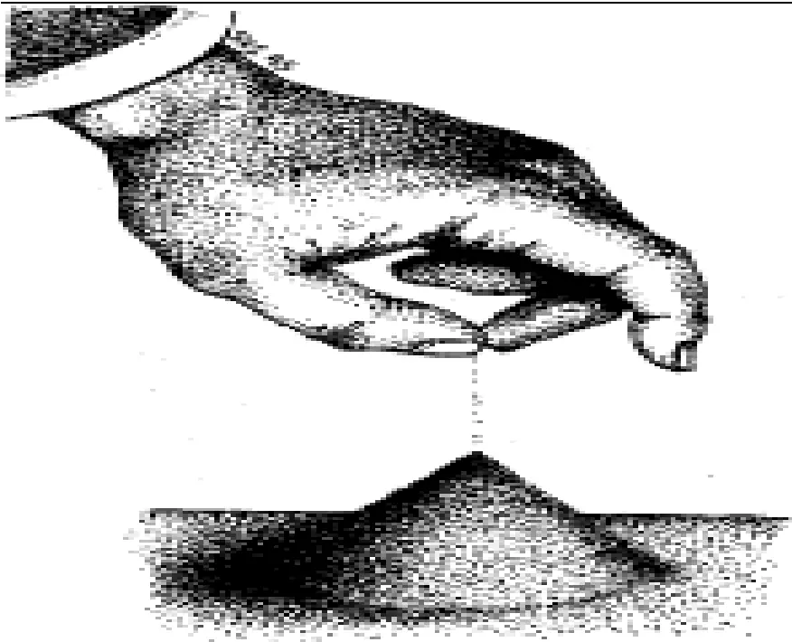
数据来源：国泰君安证券研究所

设想在一平台上缓缓地添加沙粒，一个沙堆逐渐形成。开始时，由于沙堆平矮，新添加的沙粒落下后不会滑得很远。但是，随着沙堆高度的增加，其坡度也不断增加，沙崩的规模也相应增大，但这些沙崩仍然是局部性的。到一定时候，沙堆的坡度会达到一个临界值，这时，新添加一粒沙子（代表来自外界的微小干扰）就可能引起小到一粒或数粒沙子，大到涉及整个沙堆表面所有沙粒的沙崩。这时的沙堆系统处于“自组织临界态”,有趣的是，临界态时沙崩的大小与其出现的频率呈幂律关系。这里所谓的“自组织”是指该状态的形成主要是由系统内部各组成部分间的相互作用产生，而不是由任何外界因素控制或主导所致，；“临界态”是指系统处于一种特殊的敏感状态，微小的局部变化可以不断被放大、进而扩延至整个系统。自组织临界理论可以解释诸如火山爆发、山体滑坡、岩层形成、日辉耀斑、物种灭绝、交通阻塞、以及金融市场中泡沫崩溃的现象。

Sornette 教授随后提出了用地球物理和临界现象研究中所常用的LPPL(Log-Periodic Power Law)模型（对数周期性幂律模型）来研究金融领域的泡沫，该模型认为泡沫的形成是由于交易者之间相互模仿，通过正反馈形成集体效应，最终的崩盘是由市场动力学机制所致。

## 2. 衡量泡沫的量化模型-LPPL 模型

## 2.1. LPPL 模型简介

对数周期性幂律模型是基于交易者之间的相互模仿，这些局部相互作用可形成正反馈，从而导致泡沫和反泡沫的产生，因此可用于金融泡沫和反泡沫的建模和预测。金融市场反泡沫表现在价格演化中，即价格演化呈现出对数周期性振荡且振荡周期不断延长。金融泡沫恰好与之相反，表现为振荡周期不断缩短。众多研究表明，LPPL 模型可以很好的预测、量化投机性泡沫的市场崩盘，而且这类崩盘具有一个很明显的特征：市场价格价格为对数周期震荡且呈现幂律法则加速，系统越靠近临界点会出现一连串的逐渐缩短的震荡循环。具体函数形式如下：

$$
\ln p(t)=A+B(t_{c}-t)^{m}+C(t_{c}-t)^{m}\cos[\omega\ln(t_{c}-t)-\varphi]
$$

其中

$p(t)>0$ 在时间为 t时的价格（指数）

$A>0$ ,是指假如泡沫持续到临界时间 $t_{c}$ ，则 $p(t)$ 将可能达到的价格;

$B<0$ 是表明价格是向上的加速过程。

C 是围绕指数增长的一个波动幅度量值，量化对数周期震动

$t_{c}>0$ 是泡沫破裂的临界时间；

$t<t_{c}$ 是泡沫破灭前的任意时间

$0<m<1$ 是幂指数，衡量价格上涨的加速程度

是泡沫期波动的角频率

$0<\varphi<2\pi$ ，表示周期波动的初相位。

$B(t_{c}-t)^{m}$ 幂 律 项 描 述 了 价 格 的 加 速 来 自 正 向 反 馈 机 制 ，$C(t_{c}-t)^{m}\cos[\omega\ln(t_{c}-t)-\varphi]$ 项中的周期项对超指数行为的修正。

由 LPPL模型的表达式可以看出，LPPL 模型存在两个显著特征：

一是对数周期性振荡, 在线性尺度下, 越接近临界时间, 振荡频率越快,但在对数尺度下, 振荡频率为常数;

二是幂律增长,或称超指数增长，即价格的增长率不是常数，而是单调递增。

自对数周期幂律模型被用于预测泡沫与反泡沫以来，该模型取得了不少成功的案例，比如 2004 年中期的英国房地产泡沫、2008 年中期的美国房地产泡沫、2008 年的石油价格泡沫，2009 年的中国股市泡沫，以及20世纪 90年代日经指数的反泡沫，2004中国股市的反泡沫等。

## 2.2.LPPL 模型所刻画的四种泡沫类型

事实上 LPPL 模型除了可以刻画上述的泡沫与反泡沫以外，根据参数的不同特点，我们可以衡量四种泡沫类型，现归纳总结如下：

$1.B<0,t_{c}>t$ 。此类情况就是我们最常见的所谓泡沫，价格趋势向上，其走势如图 2所示。

2. $B<0,t_{c}<t$ ，此类情况为所谓的反泡沫，价格趋势向下， $t_{c}$ 表示反泡沫的起始点，其走势如图 3所示

3 $B>0,t_{c}>t$ ，此类情况为反转泡沫，价格趋势向下， $t_{c}$ 表示反转泡沫即市场反弹的临界点，其走势如图 4所示。

$4.B>0,t_{c}<t$ ，此类情况为反转反泡沫，价格趋势向上，但走势趋缓，$t_{c}$ 表示反转反泡沫的起始点，其走势如图 5所示。

图 2 LPPL所刻画的泡沫状态
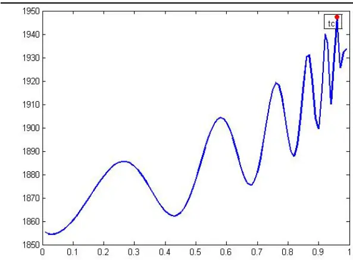
数据来源：国泰君安证券研究所

图 3 LPPL模型所刻画的反泡沫状态
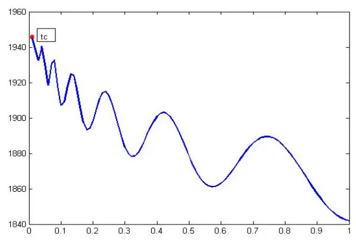
数据来源：国泰君安证券研究所

图 4 LPPL所刻画的反转泡沫状态
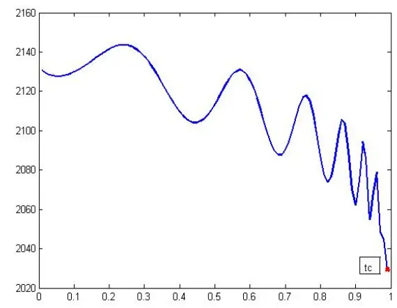
数据来源：国泰君安证券研究所

图 5 LPPL模型所刻画的反转反泡沫状态
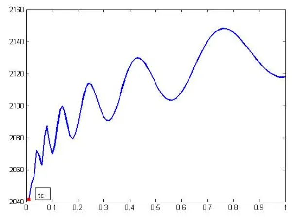
数据来源：国泰君安证券研究所

## 2.3.LPPL 模型检验步骤以及参数估计

## LPPL 模型检验步骤如下:

1. 不断变化样本数据起始点 tstart与终止点 tend，从而形成样本数据系列（tstart，tend）。对于每一个样本系列，我们可得到 LPPL 模型参数的估计值（A，B，C，tc，m, ω,ϕ）。为了确保每一系列样本点以及估计的数量足够多，我们每隔Δt=5 个交易日变换一次 tstart 及tend，同时确保 tend 与 tstart 的间隔不低于 100 个交易日。

2. 给出 tc的置信区间（20,80），从而判断泡沫破裂的可能时间点。

3. 画出 10条均方差最小的模拟路径，即我们认为未来最有可能发生的路径。

LPPL 模型中共有 7 个参数需要估计，即（A，B，C，tc， m, ω,ϕ ），其中 4 个非线性参数（tc，m, ω,ϕ），三个线性参数（A，B，C）。为了降低参数拟合的数量，同时也为了确保参数估计的稳定性，我们可以将线性参数表示成非线性参数估计值的表达式，从而只需估计非线性参数即可。我们可以将 LPPL 模型简化为

$$
\ln p(t)=A+Bf(t)+Cg(t)
$$

则线性参数（A，B，C）可以通过如下方程来求解：

$$
{\left[\begin{array}{lll}{N}&{\sum f_{i}}&{\sum g_{i}}\\{\sum f_{i}}&{\sum f_{i}^{2}}&{\sum f_{i}g_{i}}\\{\sum g_{i}}&{\sum f_{i}g_{i}}&{\sum g_{i}^{2}}\end{array}\right]}{\left[\begin{array}{l}{A}\\{B}\\{C}\end{array}\right]}={\left[\begin{array}{l}{\sum\ln p_{i}}\\{\sum\ln p_{i}f_{i}}\\{\sum\ln p_{i}g_{i}}\end{array}\right]}
$$

至于非线性参数的估计，我们只需利用非线性最优化求解即可。

## 3. 我国股市 2006 年以来的历史泡沫的检验与诊断

本节，我们利用上节介绍的 LPPL模型对我国股市 2006年以来的走势进行泡沫诊断。由图 6可以看出，自 2006年-2009年，我国股市大致经历了三波单边走势，2006 年 6 月-2007 年 10 月、2008 年 11 月-2009 年 7月的两拨上涨，以及 2007年 10月-2008年 10月的下跌。我们分别就上述三段进行泡沫诊断。

图 6 上证综指 2005年至今走势图
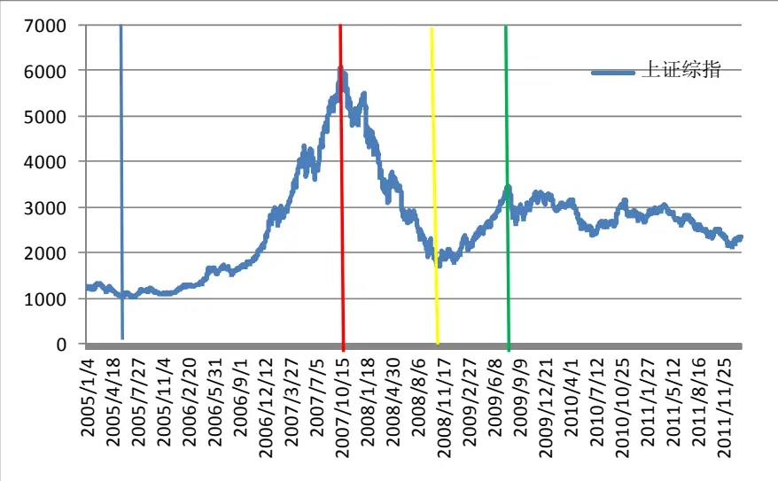
数据来源：国泰君安证券研究所

## 3.1. 模型诊断 2006.6-2007.9 我国处于泡沫阶段

该阶段的样本初始点为 2006年 6月 14日，结束点为 2007年 9月 28日。

由图 7 可以发现在回测阶段，lppl 模型很好的拟合了上证综指的走势，且有 tc>t，B<0，这预示着该阶段我国股市存在泡沫。在样本外推阶段，我们预测到当时股市反转泡沫破裂即底部 20/80 的置信区间为[2007/10/11-2008/1/16]，将当时的双顶囊括在内,对 2007 年的顶部有较好的预测，不过 5/95 的置信区间长度稍大了点，为[2007/9/3-2008/2/22]。

图 7 2006.6-2007.9上证综指的模拟及泡沫破裂即顶部预测
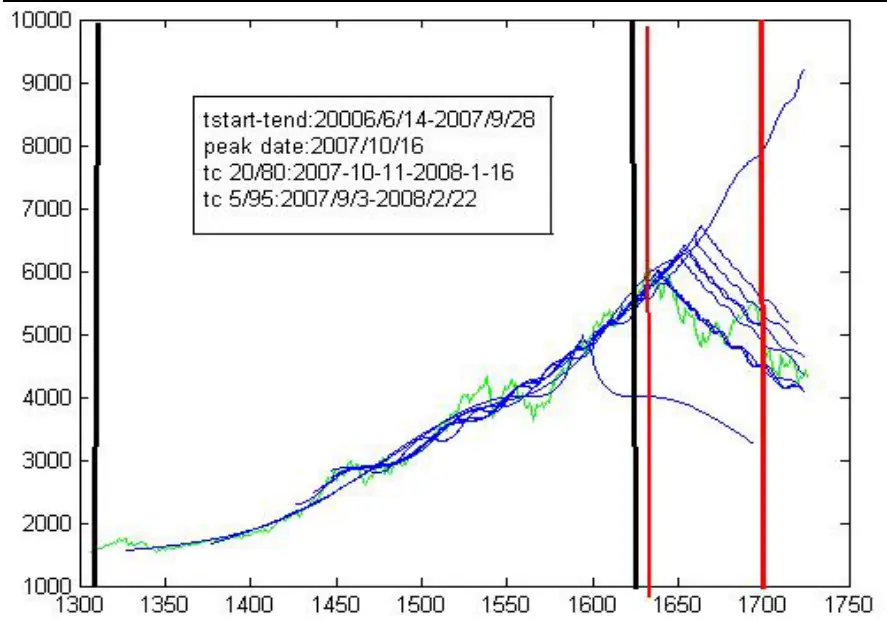
数据来源：国泰君安证券研究所。注：10 条拟合曲线为所有拟合中 MSE 最小的 10条曲线，两条黑线之间的区间为样本观测区间，两条红线对应的区间为tc即泡沫（反转）泡沫最优可能破裂的时间20/80的置信区间，下同。

## 3.2. 模型诊断 2007.10-2008.10 我国处于反转泡沫阶段

该阶段的样本初始点为 2007 年 10 月 16 日，结束点为 2008 年 10 月 31日。

由图 8 可以发现在回测阶段，lppl 模型很好的拟合了上证综指的走势，且有 tc>t，B>0，这预示着该阶段我国股市存在反转泡沫。在样本外推阶段，我们预测到当时股市反转泡沫破裂即底部 20/80 的置信区间为[2008/10/31-2009/1/5]，5/95 的置信区间为[2008/10/7-2009/2/10]，由此可见，该模型较好的预测了 2008年反转泡沫的破裂即底部的到来。

图 8 2007.10-2008.22上证综指的模拟及反转泡沫破裂即底部预测
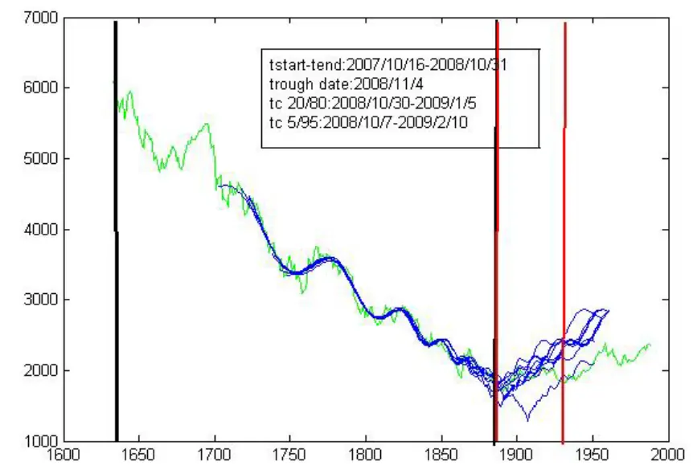
数据来源：国泰君安证券研究所

## 3.3. 模型诊断 2008.11-2009.7 我国处于泡沫阶段

该阶段的样本初始点为 2008 年 11 月 3 日，结束点为 2009 年 7 月 15 日。

图 9 2008.11-2009.7 上证综指的模拟及泡沫破裂预测
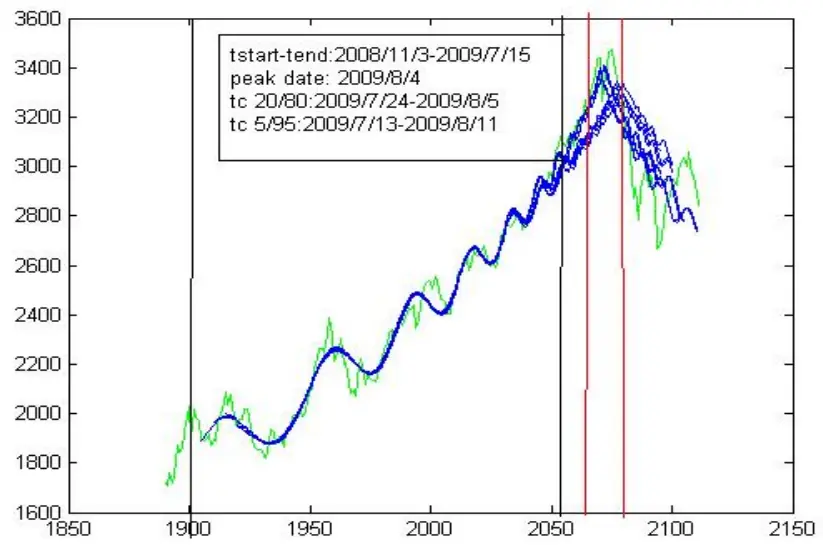
数据来源：国泰君安证券研究所

由图 9 可以发现在回测阶段，lppl 模型很好的拟合了上证综指的走势，且有 tc>t，B<0，这预示着我国股市泡沫确实存在。在样本外推阶段，我们预测到当时股市泡沫破裂 20/80 的置信区间为[2009/7/24-2009/8/5]，5/95 的置信区间为[2009/7/13-2009/8/11]，由此可见，该模型较好的预测了 2009年泡沫的破裂。

## 4. 我国股市目前所处的状态诊断与预测

根据上证指数的实际走势以及上述对于 2008.11-2009.7 的 LPPL 泡沫模型验证，我们可以判断从 2008年 11月至 2009年 7月底，A股市场呈现的是泡沫加速聚集的过程。上证指数在2009年8月4日冲高收盘于3471点后，泡沫破裂，指数一路下行。因此，在经历了 2年多的整体震荡下跌的格局后，当前市场上投资者最关心的不外乎市场的底部是否已经来临，底部将持续多久，目前的上涨是反弹还是反转等问题。本节我们将用 LPPL 模型对我国股市的状态进行诊断与预测，试图就上述问题，给出我们的视角。

## 4.1.模型诊断 A股市场自 2009.8 至今处于长期反泡沫阶段

如下图所示，在 2009 年 8 月股市泡沫破裂后，上证指数呈现震荡下行的态势，并且指数的震荡有日趋缓和之势。于是，从指数运行的态势上通过直观判断，指数的长期演化可能适合 LPPL 反泡沫模型。本节，我们通过量化的方法验证 2009.8以来的长期走势适合 LPPL反泡沫模型，从而能够通过拟合LPPL反泡沫模型，并且预测A股市场的中长期走势。

图 10 上证综指 2009年以来的走势
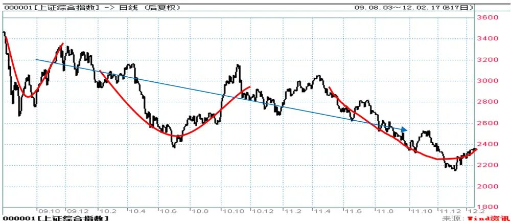
数据来源：国泰君安证券研究所

## 4.1.1. 当前 A股市场反泡沫趋势存在性的检验

为了使用反泡沫的 LPPL模型对 2009年以后市场的走势进行刻画，我们必须说明市场走势满足幂律以及对数周期两条性质。由于前文已经说明了 2009 年 8 月初 A 股市场泡沫的存在性，因此，使用幂律模型刻画上证指数在 09 年 8 月初触顶后震荡下行的走势是合适的。下面只需说明幂律模型的残量ε满足对数周期性质。

我们使用 Lomb 非等间距频谱分析方法（下称 Lomb 算法）对残量ε进行验算，以检测其对数周期震荡的性质。Lomb 算法是针对非等间距数据设计的，类似于傅立叶谱分析方法，可以检测出每个频率ω上的振幅$P_{\scriptscriptstyle N}(\omega)$ 。如果存在一个频率 $\omega_{\mathrm{lomb}}$ ，其对应的振幅很大且能够通过显著性水平检验，那么就说明该数据具有对数周期性质。

定义残量为： $s(t)=[\ln p(t)-A]/\left(t-t_{c}\right)^{m}$

对s t( )变换自变量为 $x=\ln\tau=\ln(t-t_{c})$ ，并且对s t( )进行标准化，可以得到以x为横轴的散点图，我们对该非等间距数据进行 Lomb谱分析。

图 11 LPPL刻画的反泡沫模型残差图
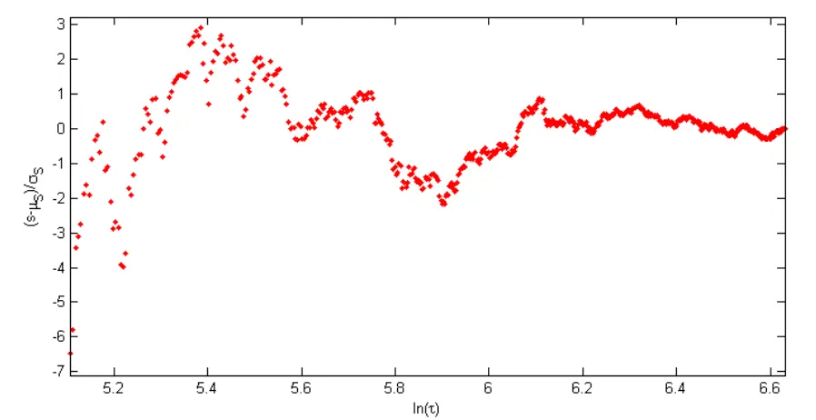
数据来源：国泰君安证券研究所

图 12 LPPL刻画的反泡沫模型谱分析
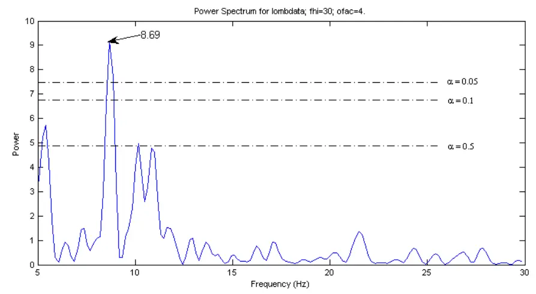
数据来源：国泰君安证券研究所

一般来说，一个函数可以表示为多个不同周期的三角波（sin, cos）的和，我们称每一个三角波为一个组成成分。Lomb 算法就是为了找出这样的函数组成成分。Lomb 算法的结果图中的横轴表示三角波的角频率，纵轴表示该频率成分的幅度大小。

由上图可以明显看到，在 0.05的显著性水平下，在ω=8.69处，有一个最大值。这也正说明了残量 s t( ) 中含有 cos(8.69ln( )) t t − 的对数周期成分。因此，用 LPPL模型来刻画 2009年以后的市场是合适的。

## 4.1.2. 中长期反泡沫的实证检验及预测

我们选取样本数据起始时间为 2009 年 9 月 1 日，结束时间为 2012 年 2月 15 日。拟合结果显示，指数整体维持下行态势，同时呈现对数周期性震荡且震荡周期不断延长，这表明 A 股市场自 2009 年 9 月初以来已呈现出明显的熊市反泡沫性。

如图 13所示，将模型拟合结果外推，我们得到在当前的反泡沫机制下，A股市场正处于熊市反泡沫周期的下行阶段尾声，上证指数未来的下行空间有限，股指最低点的最可能出现时间集中在2012年3月29日至2012年 4月 24日之间（20/80分位点）。图13显示筑底过程可能持续 4个月左右，将在 2012 年 5 月左右出现明显反弹趋势，下一波反弹的高点将位于 2600 点附近，出现时间在 316~390 个交易日，也即约 16~19 个月后。

图 13 中长期我国股市的反泡沫预测
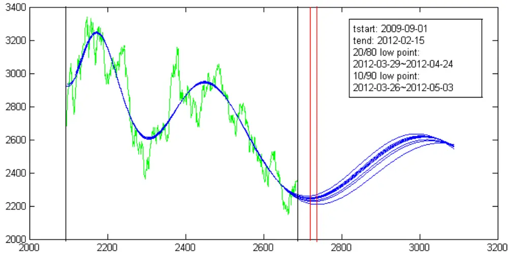

数据来源：国泰君安证券研究所。注：绿线为上证指数实际价格，蓝线为根据不同区间外推的模拟结果中MSE 最小的10条。tstart为拟合区间的开始时间，tend为拟合区间的结束时间。红线区域为未来最有可能的阶段最低点出现区间。

不过对于反泡沫，我们有几点需要提醒投资者：

1. 相对于预测反泡沫的起始点 tc 而言，预测反泡沫的结束点即底部的精确性会有所下降。

2. 相比起预测底部时点，LPPL 模型预测未来反弹的幅度及持续时间可能会更难些。

尽管如此,我们仍能从LPPL模型所刻画的反泡沫状态得到一些可靠的结论:

1. 考虑到 LPPL 模型预测反泡沫结束的偏滞后性,目前市场可能已经处于底部区域，即便不是，也已经处于下行趋势的末端。

2. 在 LPPL 模型刻画的反泡沫状态下，指数呈对数周期震荡，且震荡周期不断延长，因此底部的形成不可能像 08年底一样一蹴而就，筑底是一个反复的过程，这一过程的结束可能会在 5月份左右出现。

3. 反泡沫的性质同时决定了此次底部反弹不会超过上期高点，而持续时间却长于上一波反弹，即上证指数点位不会超过 3000点，但持续时间会超过 9个月。

## 4.1.3. 模型参数的稳定性

要判断一个模型的稳定与否，必须验证选取不同样本区间时，模型估计的参数是否波动较小。我们这里固定样本区间的结束时间为 2012 年 2月 15 日，变动样本的起始时间为 2009 年 9 月 1 日至 2009 年 12 月 30日。对于每一个起始时间，拟合 LPPL 模型可以得到一组参数。这样，

就能得到参数 $\omega,m,t_{c}$ 的时间序列，如图 14所示。

图 14 估计参数的敏感性分析
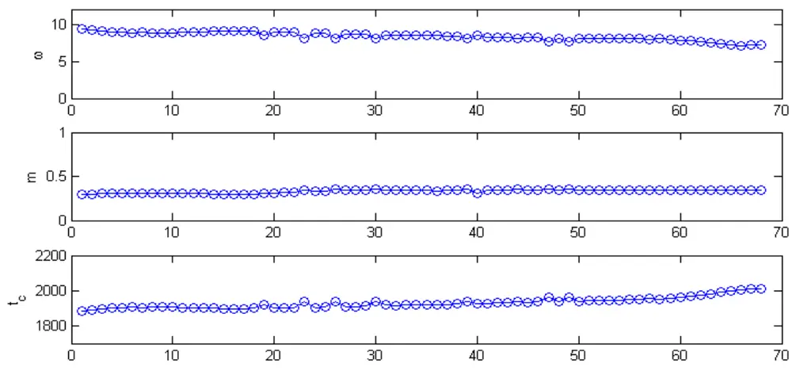
数据来源：国泰君安证券研究所

可以看出，随着时间变化，三个参数都具有很好的稳定性，再次证明LPPL刻画的反泡沫模型对于当前市场的适用性。

## 4.2.2010 年 11月以来 A 股市场呈现短期反转泡沫趋势

反泡沫模型在远离泡沫破裂点 tc处只能揭示市场中长线的大趋势，而无法很明确清晰地给出市场反弹的具体时点，因此它在预测中长期的走势的时候较为有效，而对于如何看清中短期的局部波动却有些力不从心。比如，反泡沫模型就没有捕捉到指数 2012年以来的这波上涨。

事实上，如果我们将周期缩短，LPPL 模型就能及时捕捉到 2012年以来的这波上涨。

我们利用 2010 年 11 月 11 日至 2011 年 12 月 13 日近一年的数据，站在2011 年 12 月 13 日这个时间点，预测未来上证指数的走势。拟合 LPPL反转泡沫模型得到的结果预示市场短期反转日期区间将介于 2011 年 12月 27 日至 2012 年 3 月 11 日之间（20/80 分位点）。我们的预测结果与实际上市场的局部最低点出现在 2012年 1月 5日相吻合。

图 15 中短期我国股市反转泡沫预测
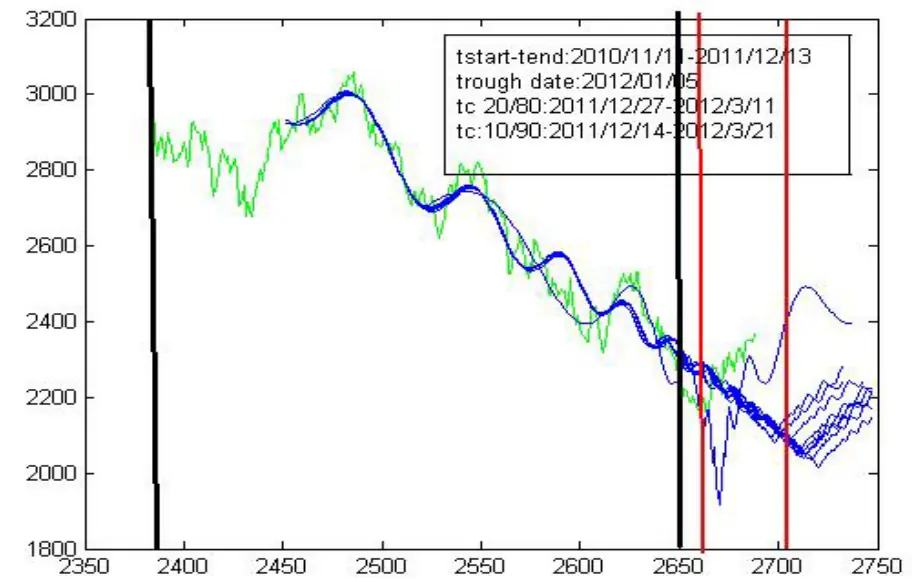
数据来源：国泰君安证券研究所

因此，可以认为，从短周期来看，2012以来的这波上是短周期反转泡沫破裂所致。

## 5. 对于市场走势的判断与预测

综上分析，就中长期而言，我国股市处于反泡沫状态，目前处于去泡沫化的尾端；就短期而言，我国股市处于反转泡沫状态，目前处于反转泡沫破裂即反弹状态。综合 LPPL模型的诊断及预测，我们得到以下结论：1. 目前市场可能已经处于底部区域，即便不是，也已经处于下行趋势的末端。

2.目前的上涨仅仅是底部区域的一次反弹。之所以认为是反弹而非反转，并非指大盘的下一波低点比上一波的 2132 还要低，而是指中长期股市反泡沫的性质决定了底部反弹并非一蹴而就，筑底是一个反复的过程，这一过程的结束可能会在 5月份左右出现。

3.反泡沫的性质同时决定了此次底部反弹不会超过上期高点，而持续时间却长于上一波反弹，即上证指数点位不会超过 3000 点，但持续时间会超过 9个月。

## 作者简介：

刘富兵：

执业资格证书编号：S0880511010017

电话：021-38676673

邮箱：liufubing008481@gtjas.com

严佳炜（贡献作者）：

执业资格证书编号：S0880110110169

电话：021-38674812

邮箱：yanjiawei008776@gtjas.com

## 蒋瑛琨：

执业资格证书编号：S0880511010023

电话：021-38676710

邮箱：jiangyingkun@gtjas.com

## 本公司具有中国证监会核准的证券投资咨询业务资格

## 分析师声明

作者具有中国证券业协会授予的证券投资咨询执业资格或相当的专业胜任能力，保证报告所采用的数据均来自合规渠道，分析逻辑基于作者的职业理解，本报告清晰准确地反映了作者的研究观点，力求独立、客观和公正，结论不受任何第三方的授意或影响，特此声明。

## 免责声明

本报告仅供国泰君安证券股份有限公司（以下简称“本公司”）的客户使用。本公司不会因接收人收到本报告而视其为本公司的当然客户。本报告仅在相关法律许可的情况下发放，并仅为提供信息而发放，概不构成任何广告。

本报告的信息来源于已公开的资料，本公司对该等信息的准确性、完整性或可靠性不作任何保证。本报告所载的资料、意见及推测仅反映本公司于发布本报告当日的判断，本报告所指的证券或投资标的的价格、价值及投资收入可升可跌。过往表现不应作为日后的表现依据。在不同时期，本公司可发出与本报告所载资料、意见及推测不一致的报告。本公司不保证本报告所含信息保持在最新状态。同时，本公司对本报告所含信息可在不发出通知的情形下做出修改，投资者应当自行关注相应的更新或修改。

本报告中所指的投资及服务可能不适合个别客户，不构成客户私人咨询建议。在任何情况下，本报告中的信息或所表述的意见均不构成对任何人的投资建议。在任何情况下，本公司、本公司员工或者关联机构不承诺投资者一定获利，不与投资者分享投资收益，也不对任何人因使用本报告中的任何内容所引致的任何损失负任何责任。投资者务必注意，其据此做出的任何投资决策与本公司、本公司员工或者关联机构无关。

本公司利用信息隔离墙控制内部一个或多个领域、部门或关联机构之间的信息流动。因此，投资者应注意，在法律许可的情况下，本公司及其所属关联机构可能会持有报告中提到的公司所发行的证券或期权并进行证券或期权交易，也可能为这些公司提供或者争取提供投资银行、财务顾问或者金融产品等相关服务。在法律许可的情况下，本公司的员工可能担任本报告所提到的公司的董事。

市场有风险，投资需谨慎。投资者不应将本报告为作出投资决策的惟一参考因素，亦不应认为本报告可以取代自己的判断。在决定投资前，如有需要，投资者务必向专业人士咨询并谨慎决策。

本报告版权仅为本公司所有，未经书面许可，任何机构和个人不得以任何形式翻版、复制、发表或引用。如征得本公司同意进行引用、刊发的，需在允许的范围内使用，并注明出处为“国泰君安证券研究”，且不得对本报告进行任何有悖原意的引用、删节和修改。

若本公司以外的其他机构（以下简称“该机构”）发送本报告，则由该机构独自为此发送行为负责。通过此途径获得本报告的投资者应自行联系该机构以要求获悉更详细信息或进而交易本报告中提及的证券。本报告不构成本公司向该机构之客户提供的投资建议，本公司、本公司员工或者关联机构亦不为该机构之客户因使用本报告或报告所载内容引起的任何损失承担任何责任。

## 评级说明

## 1.投资建议的比较标准

投资评级分为股票评级和行业评级。

以报告发布后的12个月内的市场表现为比较标准，报告发布日后的12个月内的公司股价（或行业指数）的涨跌幅相对同期的沪深300指数涨跌幅为基准。

## 2.投资建议的评级标准

报告发布日后的 12 个月内的公司股价（或行业指数）的涨跌幅相对同期的沪深300指数的涨跌幅。

|  | 评级 说明 |  |
| --- | --- | --- |
| 股票投资评级 | 增持 | 相对沪深 300指数涨幅15%以上 |
|  | 谨慎增持 | 相对沪深300指数涨幅介于5%～15%之间 |
|  | 中性 | 相对沪深 300指数涨幅介于-5%～5% |
|  | 减持 | 相对沪深300指数下跌 5%以上 |
| 行业投资评级 | 增持 | 明显强于沪深 300指数 |
|  | 中性 | 基本与沪深 300指数持平 |
|  | 减持 | 明显弱于沪深 300 指数 |

## 国泰君安证券研究

|  | 上海 | 深圳 | 北京 |
| --- | --- | --- | --- |
| 地址 | 上海市浦东新区银城中路168号上海 银行大厦29层 | 深圳市福田区益田路 6009 号新世界 商务中心34层 | 北京市西城区金融大街28号盈泰中 心2号楼10层 |
| 邮编 | 200120 | 518026 | 100140 |
| 电话 | (021)38676666 | (0755)23976888 | (010)59312799 |
|  | E-mail: gtjaresearch@gtjas.com |  |  |