# 多因子选股模型之行业中性策略IV数量化研究系列之二十三

2012.05.21

蒋瑛琨

021-38676710

jiangyingkun@gtjas.com

S0880511010023

## HS300中多空配对交易的效果

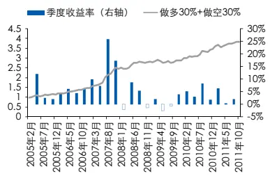
ZZ500中多空配对交易的效果

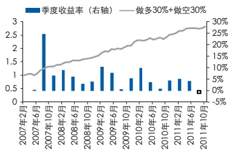

## 相关报告

《多因子选股模型之组合构建Ⅲ》2011.11.14

《多因子选股模型之因子分析与筛选Ⅱ：财务质量、价量和一致预期类指标》

2011.10.14

《多因子选股模型之因子分析与筛选|：估值与财务成长类指标》2011.09.26

《基于宏观变量的二维化多因子行业配置》2011.12.22

《风格投资IV：A股大小盘风格轮动研究》2011.11.29

## 本报告导读：

本报告为多因子选股系列的第四篇，在对原模拟组合进一步分析的基础上构建了行业中性模拟组合，并提出了一种简单可行的指数增强策略。

## 摘要：

本报告为多因子选股系列研究的第四篇，在对原模拟组合进一步分析的基础上构建了行业中性模拟组合，并提出了一种简单可行的指数增强策略，主要有以下贡献。

## 本文的主要贡献：

(1)进一步分析了原模拟组合的行业偏离情况。行业偏离的大小很大程度上决定了组合的稳健性。因此，分析模拟组合的行业偏离情况是必要的补充。

(2）检测选股模型在各个行业上的效果，着重找出不适用的行业。尽管从模拟组合的总体结果来看，多因子选股模型取得了优异的表现，但这并不能保证模型是适用于所有行业的。找出不适用的行业，在后续研究中可以考虑针对它们构建行业内选股模型。

(3)选出看多组合的同时，对看空组合进行了同样深入的分析。在指数增强的应用中，低配一个看空的组合跟超配一个看多组合一样方便，而且有着同样的增强效果。因此，我们应该给予看空组合同样的重视。

(4)构建了行业中性的选股组合。我们在现有的选股模型框架下，采用等权配置的方法，构建了行业中性的组合。

(5）提出了一种简单可行的指数增强策略。目前我国市场上绝大多数的指数增强型产品的业绩基准都是加权指数，那么等权配置下有效的模拟策略如何应用于实际投资呢？我们提出了一种简单可行的方法。

## 主要结果分析：

（1）原模拟组合有比较明显的行业偏离，但由于消除了周期/非周期的风格偏离，行业偏离得并不是很严重。行业偏离降低了组合的稳健性，却很有可能贡献了超额收益。

(2)在HS3O0股票池中，选股模型不适用的行业主要有采掘、化工、建筑建材、房地产；ZZ500中，选股模型不适用的行业主要有黑色金属、公用事业、信息服务。针对这些行业我们将进行后续研究。

(3）行业中性的策略大幅提高了组合的稳健性。做多和做空组合各取股票池的30%，进行多空配对交易时：HS300中年化收益率为15.0%，最大回撤仅-2.9%，季度胜率85.2%；ZZ500中年化收益率为21.5%，最大回撤为-7%，季度胜率为84.2%。

(4）在指数增强策略中，我们只对适用的行业采用多因子选股模型选取行业中性的看多（超配）和看空（低配）组合。如果采用30%的仓位超配和低配，则HS300中能获得年化6.7%的收益增强，最大回撤仅有-1.5%，季度胜率有85.2%；ZZ500中能获得年化7.3%的收益增强，最大回撤只有-1.8%，季度胜率达到94.7%。

## O. 多因子选股系列研究

多因子选股是量化研究中最热点的问题之一，有比较广泛的研究和应用。我们认为，检验和筛选出有效且稳健的因子是多因子选股模型取得良好效果的关键。

我们已经进行了多因子选股系列研究，前两篇报告《多因子选股模型之因子分析与筛选|：估值与财务成长类指标》(2011.09.26)、《多因子选股模型之因子分析与筛选Ⅱ：财务质量、价量和一致预期类指标》(2011.10.14)，专注于单因子分析和测算，筛选出有效且稳健的因子。我们共分析了五大类指标：估值类(7个指标）、财务成长类（15个指标）、财务质量类（10个指标）、价量类（6个指标）、分析师预期类（2个指标）。其中，第二篇报告还分析了财务相关的因子有效性在财报公布后的衰减规律。

在筛选出有效且稳健的因子的基础上，第三篇报告《多因子选股模型之组合构建》(2011.11.14)建立多因子综合打分的选股模型，依据不同因子的有效性和稳健性赋予不同的权重，然后根据加权总分选取股票组合。回测模拟表明，模型在收益和稳健性上都有不错的效果。

本篇报告可分为两部分，第一部分是进一步分析《多因子选股模型之组合构建Ⅲ》(2011.11.14)中构建的组合，包括分析组合的行业构成和偏离情况、多空组合配对交易策略的模拟表现以及选股模型在各个行业中的效果等。第二部分是在已有的选股模型基础上消除行业偏离，构建行业中性的模拟组合。

## 1.本报告的主要贡献

本篇报告作为多因子选股系列研究的第四篇，在对原模拟组合的进一步分析的基础上，构建了行业中性的选股策略，通过模拟组合检验策略的有效性。主要有以下贡献。

## 1.1. 进一步分析模拟组合的行业偏离情况

量化模型选取的组合，无论是用于指数增强策略还是对冲型的绝对收益产品，控制其相对于基准的跟踪误差或回撤都是很重要的，而行业偏离的大小很大程度上决定了跟踪误差和回撤的大小。因此，分析模拟组合的行业偏离情况是很有必要的补充。

## 1.2. 检测模型在各个行业的效果，找出不适用的行业

我们在HS300和ZZ500成分股中分别分周期、非周期4个股票池选取各自有效的因子构建了相应的选股模型，尽管从模拟组合的回测结果来看，多因子选股模型取得了优异的表现，但并不能保证构建的选股模型是适用于所有行业的。因此我们进一步测算了选股模型在各个行业上的效果，重点找出那些不适用的行业，可以考虑在后续研究中单独针对这些行业挖掘有效因子构建行业内选股模型。

## 1.3. 选出看多组合的同时，对看空组合进行了同样深入的分析

在指数增强的应用中，低配一个看空的组合跟超配一个看多组合一样方便，而且有着同样的增强效果。另一方面，随着我国转融通等做空机制越来越完善，在不久的将来，多空配对交易以获取绝对收益的市场中性策略将变得可行。因此，在量化选股的过程中，我们应该给予看空组合同样的重视。

## 1.4. 考虑到提高稳健性的需要，构建了行业中性的选股组合

为了提高组合的稳健性，获得较低风险的超额收益，我们在现有的选股模型框架下构建了行业中性的组合。模拟结果表明，行业中性策略能大幅提高组合的稳健性，降低组合相对于基准的跟踪误差和回撤。

## 1.5. 从指数增强的需求出发，提出了切实可行的增强策略

为了确保有较高的可比性，我们构建的模拟组合都是采用的等权配置，比较基准也为等权指数，因为我们很难找到一个合适的加权方法使得加权配置的模拟组合能与加权指数有较高的可比性。但是，在实际投资中，大部分产品的业绩比较基准都是加权指数，而且目前市场上能用的对冲工具也只有HS300股指期货，它也不是等权的。那么等权配置下有效的模拟策略如何应用于实际投资呢？我们提出了一种简单可行的指数增强策略，当然如果用该指数的股指期货进行对冲，那增强策略也就变成绝对收益策略了。

## 2. 多因子选股模拟组合的进一步分析

## 2.1. 模拟组合的行业偏离情况

由于在模拟组合中我们采用的等权配置的方法，因此每个行业上的配置比例就与其入选的股票个数相对应。我们把模拟组合在历史上各个行业中选取的股票数目进行了统计分析，如图1和图2。

从图中可以看出，模拟组合在不同的时间阶段有比较明显的行业偏离，但由于我们在构建组合时消除了周期/非周期的风格偏离，因此行业偏离的情况并不是很严重。相对来说，ZZ500中的组合比HS300中的行业偏离更大一些。

一般来说，行业偏离会扩大跟踪误差和最大回撤，影响组合的稳健性，因为行业轮动的规律很难把握。但我们细致一点地分析会发现，行业偏离虽然降低了组合的稳健性，却很有可能增加了组合的超额收益（后面构建的行业中性策略的结果也能证明这一点，即消除行业偏离后模拟组合的超额收益有明显的下降）。

比如，在HS300的模拟组合中，2008.10-2009.10期间较大幅度超配了采掘行业，此期间采掘行业指数相对HS300指数和300等权指数的超额收益率分别为65%和36%。在2010.5-2011.3月期间超配了交运设备，此期间交运设备行业指数相对

HS300指数和300等权指数的超额收益率分别为15%和9%。而在ZZ500的模拟组合中，2009.5-2010.4期间明显低配了化工行业，此期间化工行业指数跑输ZZ500指数和500等权指数分别为25%和27%。可见，这几波较大的行业偏离都给组合贡献了超额收益。

图1 HS300中模拟组合的行业分布情况
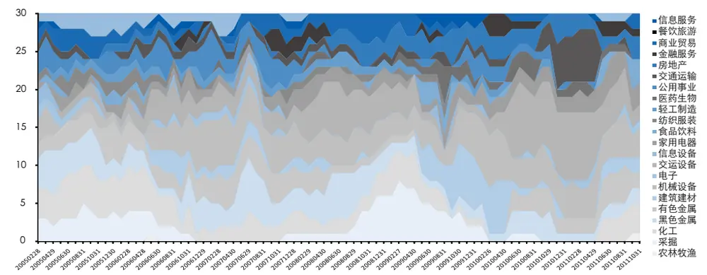
数据来源：国泰君安证券研究

图2ZZ500中模拟组合的行业分布情况
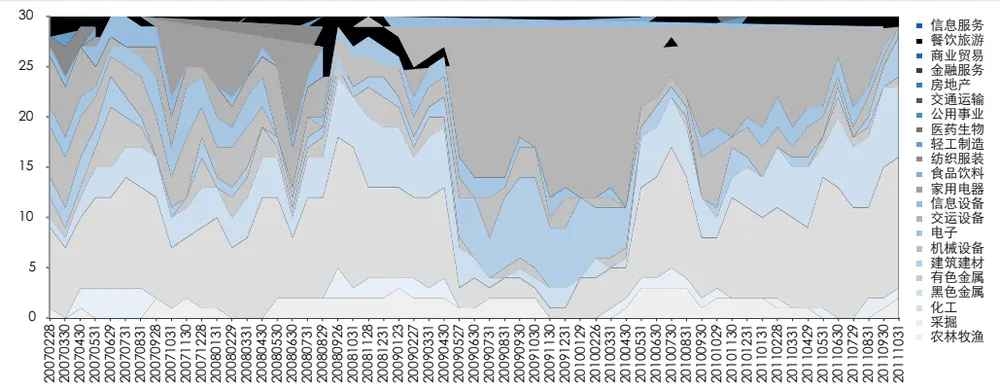
数据来源：国泰君安证券研究

## 2.2. 多空组合配对交易策略的效果

在前面的研究中，我们构建了多因子综合打分选股模型，选取得分最高的前10%的股票作为看多组合。其实在这一框架下我们可以很方便的把得分最低的10%作为看空组合。在实际应用中，看空组合也有很强的实用性。比如在指数增强的应用中，低配一个看空的组合跟超配一个看多组合一样方便，而且有着同样的增强效果。另一方面，随着我国转融通等做空机制越来越完善，在不久的将来，多空配对交易以获取绝对收益的市场中性策略将变得可行。

从表1中多空组合配对交易策略的表现来看，相对于只做多看多组合用基准对冲，收益率和季度胜率都有明显提高，可见看空组合发挥了较好的效果。

表1多空组合配对交易的表现

|  | 多空组合配对交易 |  | 多头组合相对基准 |  |
| --- | --- | --- | --- | --- |
|  | HS300 | ZZ500 | HS300 | ZZ500 |
| 年化收益率 | 21.1% | 28.4% | 16.0% | 14.7% |
| 月胜率 | 59.3% | 68.4% | 65.4% | 64.9% |
| 季胜率 | 80.8% | 83.3% | 70.2% | 77.8% |
| 最大回撤 | -13.3% | -7.9% | -11.2% | -6.2% |

数据来源：国泰君安证券研究

图3 HS300中多空组合配对交易的效果图
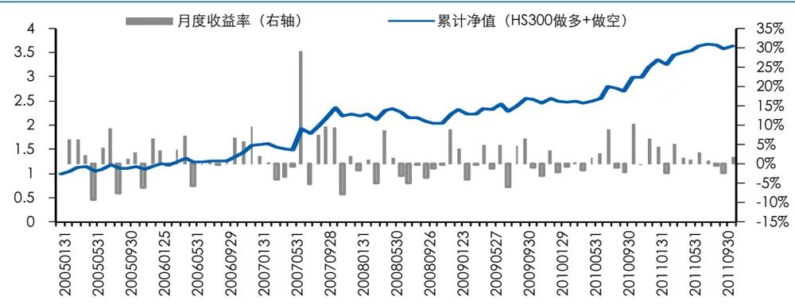
数据来源：国泰君安证券研究

图4ZZ500中多空组合配对交易的效果图
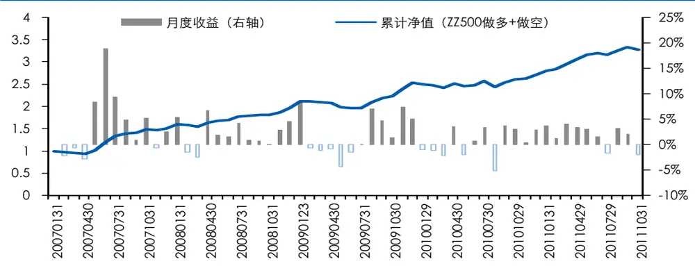
数据来源：国泰君安证券研究

## 2.3. 选股模型在各行业中的效果

从单因子有效性的测算到构建模拟组合，我们都按周期与非周期类行业对股票池进行大致划分。之所以没有把每个行业作为一个股票池来进行行业内选股主要是因为如果划分得过细，一方面工作量会大增，可操作性会降低，另一方面容易造成某些股票池的样本数量大幅减少，结果可能失去了统计意义上的可靠性。

但是，从理论上讲，不同行业选股的有效因子可能会不同，在大的股票池中测算有效的因子在某些行业并不一定有效，在大的股票池中构建的多因子选股模型虽然总体上来看效果较好，但并不一定在所有行业内都具有较好的选股效果。因此，我们对选股模型在各个行业中的效果进行了测算和分析。

测算方法比较简单：在多因子模型综合打分并计算加权总分的基础上，我们对每个行业中的股票按得分从高到低排序，每期做多得分前50%的组合，同时做空得分靠后的50%，配置方法均采用简单的等权配置。如果选股模型在该行业有较好的选股效果，那么这一“做多50%+做空50%”的配对交易策略能获得显著且较稳健的正收益。之所以这里的多空组合各取50%，而不是像前面构建模拟组合时那样只取10%，是考虑到各个行业内的股票数目本来就比较少，如果组合的规模取得太小的话，就容易受个股的一些偶然因素的影响，测算结果就失去了统计意义。

测算结果如表2和表3(更详细的测算结果与分析可参见附录I、Ⅱ)：

在HS300股票池中，选股模型不适用的行业有农林牧渔、采掘、化工、建筑建材、家用电器、纺织服装、轻工制造、房地产、餐饮旅游、综合共10个。其中有些行业因为个股数量较少，测算的结果基本没有统计意义，受偶然因素的影响会很大。比如农林牧渔、家用电器、纺织服装、轻工制造、餐饮旅游、综合等6个行业在测算期间股票的平均数量分别为5、7、3、4、1、4。因此，不适用且股票数目也不少的行业主要是4个：采掘、化工、建筑建材、房地产，我们可以在后续研究中深入分析这四个行业不适用的原因以及专门针对它们挖掘有效因子、构建选股模型。

在ZZ500股票池中，选股模型不适用的行业有黑色金属、家用电器、公用事业、餐饮旅游、信息服务、综合共6个。其中家用电器、餐饮旅游和综合行业因为个股数量较少，且行业内的细分行业差异大，测算的结果基本没有统计意义。因此，不适用且股票数目也不少的行业主要是3个：黑色金属、公用事业、信息服务。

适用性在HS300和ZZ500中的差异性分析。对比HS300和ZZ500选股模型在各个行业中的效果可以发现，有些行业在两个股票池中的效果差异较大，存在这些差异的原因主要可能有以下几点：

(1)样本数量的差别。有些行业在某个股票池中的个股数量较少，测算结果的统计意义不强。如农林牧渔、纺织服装、轻工制造3个行业在ZZ500中比较适用，而在HS300中不适用，其主要原因可能是因为它们在HS300中的个股数量都很少，测算结果基本没有统计意义。

(2)周期类行业中的选股模型在HS300和ZZ500中选股因子的权重差异较大。HS300周期类股票池中，有效的的因子比较少，导致因子权重高度集中到了财务成长类的因子上，而在ZZ500周期类股票池中，价量类和财务质量类（主要是财务杠杆因子）因子的有效性较高，分摊了较大权重，使得因子权重没有那么集中。比如，采掘、建筑建材、房地产这3个周期类行业在ZZ500中的适用性明显高于在HS300中，可见对于周期类行业，适当降低财务成长类因子的权重，增加有效的价量类等其他因子，能取得更好的选股效果。

(3)非周期类行业中的选股模型在HS300和ZZ500中选股因子的权重有一定的差异，主要是HS300中一致预期类的因子权重稍高一些，而ZZ500中价量类因子权重高一些。如公用事业在HS300中的适用性较高，而在ZZ500中不适用，化工行业在ZZ500中适用而在HS300中明显不适用。

(各个股票池中选股因子的具体权重请参考多因子选股系列研究的上一篇报告《多因子选股模型之组合构建》 (2011.11.14)。)

表2 HS300中选股模型在各个行业的适用情况

| 行业 | 年化收益率 | 月波动率（%） | 季胜率 | 月胜率 | 个股数量 | 是否适用 |
| --- | --- | --- | --- | --- | --- | --- |
| 农林牧渔 | -5.8% | 11.7 | 44.4% | 44.4% | 5 | 不适用 |
| 采掘 | -2.2% | 4.6 | 48.1% | 42.0% | 18 | 不适用 |
| 化工 | -9.5% | 5.5 | 55.6% | 46.9% | 18 | 不适用 |
| 黑色金属 | 6.0% | 3.6 | 70.4% | 55.6% | 21 | 适用 |
| 有色金属 | 9.6% | 6.2 | 55.6% | 61.7% | 23 | 适用 |
| 建筑建材 | -2.8% | 8.4 | 51.9% | 48.1% | 11 | 不适用 |
| 机械设备 | 19.3% | 5.9 | 66.7% | 66.7% | 20 | 适用 |
| 电子 | 12.4% | 7.1 | 51.9% | 54.7% | 7 | 适用 |
| 交运设备 | 9.2% | 5.2 | 59.3% | 60.5% | 19 | 适用 |
| 信息设备 | 17.6% | 7.2 | 66.7% | 58.0% | 6 | 适用 |
| 家用电器 | -5.8% | 6.2 | 44.4% | 40.7% | 7 | 不适用 |
| 食品饮料 | 8.6% | 6.6 | 59.3% | 54.3% | 12 | 适用 |
| 纺织服装 | -16.2% | 12.9 | 44.4% | 50.6% | 3 | 不适用 |
| 轻工制造 | -11.2% | 7.7 | 37.0% | 41.7% | 4 | 不适用 |
| 医药生物 | 13.5% | 5.8 | 59.3% | 63.0% | 13 | 适用 |
| 公用事业 | 9.5% | 3.1 | 74.1% | 61.7% | 19 | 适用 |
| 交通运输 | 4.8% | 3.5 | 51.9% | 55.6% | 30 | 适用 |
| 房地产 | 2.9% | 4.2 | 63.0% | 50.6% | 24 | 不适用 |
| 金融服务 | 16.3% | 7.8 | 59.3% | 59.3% | 23 | 适用 |
| 商业贸易 | 20.7% | 7.7 | 59.3% | 63.0% | 10 | 适用 |
| 餐饮旅游 | -4.3% | 6.3 | 11.1% | 44.4% | 1 | 不适用 |
| 信息服务 | 10.8% | 5.7 | 59.3% | 55.6% | 11 | 适用 |
| 综合 | -9.4% | 11.9 | 51.9% | 55.1% | 4 | 不适用 |

数据来源：国泰君安证券研究
注：采用的申万一级行业分类，行业名称涂黄色的为周期类行业，其余归为非周期类。

表3 ZZ500中选股模型在各个行业的适用情况

| 行业 | 年化收益率 | 月波动率（%） | 季胜率 | 月胜率 | 个股数量 | 是否适用 |
| --- | --- | --- | --- | --- | --- | --- |
| 农林牧渔 | 5.4% | 5.3 | 57.9% | 56.1% | 21 | 适用 |
| 采掘 | 9.7% | 6.2 | 73.7% | 50.9% | 12 | 适用 |
| 化工 | 16.7% | 3.0 | 84.2% | 59.6% | 64 | 适用 |
| 黑色金属 | -2.8% | 8.2 | 47.4% | 57.9% | 10 | 不适用 |
| 有色金属 | 23.7% | 7.2 | 63.2% | 59.6% | 14 | 适用 |
| 建筑建材 | 13.2% | 5.7 | 57.9% | 59.6% | 21 | 适用 |
| 机械设备 | 17.9% | 3.7 | 78.9% | 64.9% | 42 | 适用 |
| 电子 | 12.1% | 4.5 | 68.4% | 68.4% | 27 | 适用 |
| 交运设备 | 20.6% | 5.0 | 63.2% | 63.2% | 23 | 适用 |
| 信息设备 | 15.3% | 4.9 | 57.9% | 56.1% | 18 | 适用 |
| 家用电器 | 1.7% | 7.6 | 47.4% | 54.4% | 6 | 不适用 |
| 食品饮料 | 28.6% | 6.8 | 73.7% | 64.9% | 11 | 适用 |
| 纺织服装 | 17.8% | 5.4 | 73.7% | 68.4% | 14 | 适用 |
| 轻工制造 | 5.9% | 4.8 | 57.9% | 56.1% | 17 | 适用 |
| 医药生物 | 15.1% | 4.6 | 57.9% | 66.7% | 38 | 适用 |
| 公用事业 | -8.5% | 5.2 | 36.8% | 42.1% | 25 | 不适用 |
| 交通运输 | 9.7% | 3.7 | 84.2% | 71.9% | 26 | 适用 |
| 房地产 | 19.4% | 4.6 | 78.9% | 61.4% | 42 | 适用 |
| 金融服务 | 36.0% | 13.2 | 57.9% | 59.6% | 4 | 适用 |
| 商业贸易 | 17.0% | 3.7 | 84.2% | 68.4% | 35 | 适用 |
| 餐饮旅游 | -2.2% | 7.7 | 63.2% | 50.9% | 10 | 不适用 |
| 信息服务 | 4.7% | 6.4 | 57.9% | 49.1% | 16 | 不适用 |
| 综合 | 6.3% | 5.4 | 63.2% | 49.1% | 11 | 不适用 |

数据来源：国泰君安证券研究
注：采用的申万一级行业分类，行业名称涂黄色的为周期类行业，其余归为非周期类。

## 3. 行业中性的选股策略

## 3.1. 行业中性策略方法

为了确保有较高的可比性，我们还是采用等权配置的方法，选取相应的等权指数作为比较基准。在综合打分的基础上，在每个行业中按得分排名选取一定比例（如50%或30%）的股票，再组合起来，这样就简单实现了等权配置方法下的行业中性策略。

我们从三个角度来看行业中性的选股策略的效果：看多组合相对看空组合的表现、看多组合相对基准的表现、看空组合相对基准的表现。相应地，我们测算了“做多看多组合+做空看空组合”、“做多看多组合+基准对冲”、“做空看空组合+基准对冲”三种模拟交易的表现。并分别测算了看多，看空组合的规模为50%和30%这两种情况。计0.5%的换仓成本。

## 3.2. 行业中性的选股组合的表现

## 3.2.1. 多空组合配对交易策略下的表现

从多空组合配对交易的模拟结果来看，ZZ500中的效果比HS300更优一些。组合规模取50%时表现更稳健一些，而取30%时收益明显更高。从年化的夏普比率来看，在HS300中组合规模取30%优势明显，而在ZZ500中两种规模下的差异不大。

表4 多空组合配对交易的表现

| 股票池 | 模拟交易策略 |  | 年化收益率 月波动率（%） | 月胜率 | 季胜率 | 最大回撤 | 夏普比率 |
| --- | --- | --- | --- | --- | --- | --- | --- |
| HS300 | 做多50%+做空50% | 8.2% | 1.58 | 69.1% | 85.2% | -2.4% | 1.1270 |
|  | 做多30%+做空30% | 15.0% | 2.49 | 70.4% | 85.2% | -2.9% | 1.5088 |
| ZZ500 | 做多50%+做空50% | 15.2% | 1.77 | 78.9% | 100.0% | -2.0% | 2.1429 |
|  | 做多30%+做空30% | 21.5% | 2.70 | 75.4% | 84.2% | -7.0% | 2.0828 |

数据来源：国泰君安证券研究

图5 HS300中多空配对交易的累计净值和季度收益率
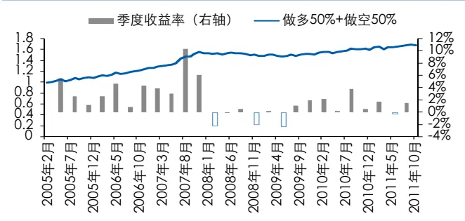
数据来源：国泰君安证券研究

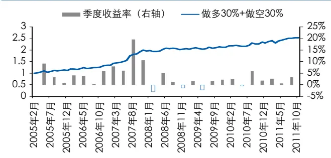

图6 ZZ500中多空配对交易的累计净值和季度收益率
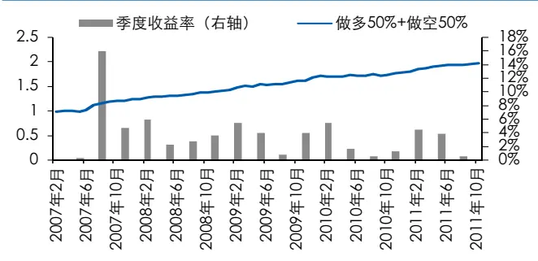
数据来源：国泰君安证券研究

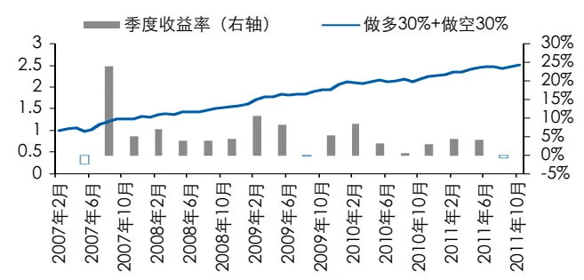

## 3.2.2. 以等权指数为基准的多、空组合表现

上面的多空组合配对交易策略总体表现出较高的收益和稳健性，那么配对交易中多、空组合分别贡献有多大呢？下面我们进一步分析多、空组合分别相对于基准(相应的等权指数)的表现。

从表5中我们可以看出，无论是HS300股票池中还是ZZ500中，多、空组合相对于基准都有较好的表现，而且都比较稳健。更细的观察可以发现，相对于“做多+基准对冲”的策略，“做空+基准对冲”的策略表现更胜一筹，无论是收益率还是夏普比率都稍高一些。可见，在实际投资中，比如指数增强策略中，低配（或做空）看空组合也是获得超额收益（或绝对收益）的重要方法。

表5多、空组合分别相对于基准的表现

| 股票池 | 模拟交易策略 | 年化收益率 | 月波动率（%） | 月胜率 | 季胜率 | 最大回撤 | 夏普比率 |
| --- | --- | --- | --- | --- | --- | --- | --- |
| HS300 | 做多50%+基准对冲 | 3.9% | 0.80 | 69.1% | 81.5% | -1.3% | 0.6856 |
|  | 做空50%+基准对冲 | 4.2% | 0.79 | 69.1% | 85.2% | -1.3% | 0.7840 |
|  | 做多30%+基准对冲 | 6.5% | 1.34 | 64.2% | 74.1% | -1.8% | 0.9610 |
|  | 做空30%+基准对冲 | 8.2% | 1.35 | 71.6% | 88.9% | -1.5% | 1.3329 |
| ZZ500 | 做多50%+基准对冲 | 7.3% | 0.88 | 78.9% | 100.0% | -0.9% | 1.7314 |
|  | 做空50%+基准对冲 | 7.5% | 0.90 | 80.7% | 100.0% | -1.1% | 1.7653 |
|  | 做多30%+基准对冲 | 9.7% | 1.35 | 71.9% | 89.5% | -3.3% | 1.6374 |
|  | 做空30%+基准对冲 | 11.1% | 1.46 | 78.9% | 89.5% | -3.7% | 1.7946 |

数据来源：国泰君安证券研究

图7HS300中多、空组合相对于等权基准的表现（组合规模为50%）
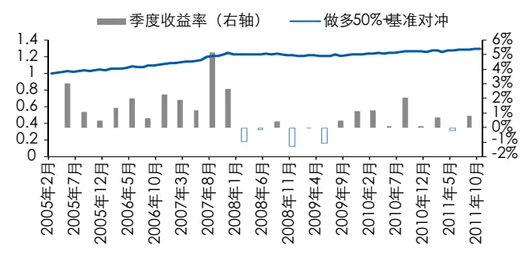
数据来源：国泰君安证券研究

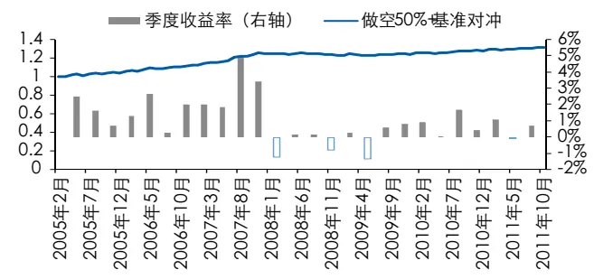

图8 HS300中多、空组合相对于等权基准的表现（组合规模为30%）
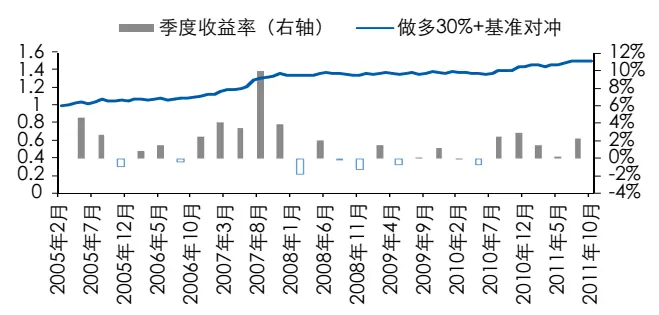
数据来源：国泰君安证券研究

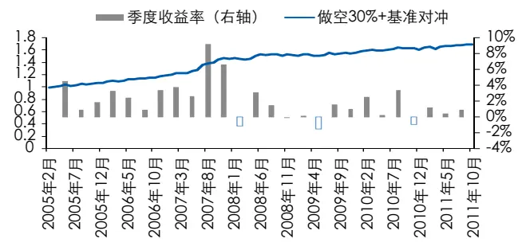

图9ZZ500中多、空组合相对于等权基准的表现（组合规模为50%）
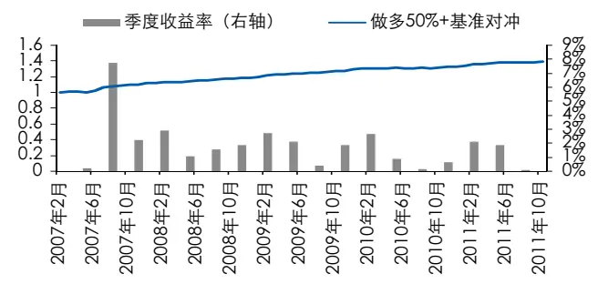
数据来源：国泰君安证券研究

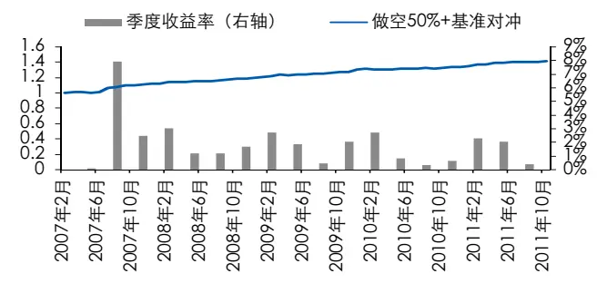

图10 ZZ500中多、空组合相对于等权基准的表现（组合规模为30%）
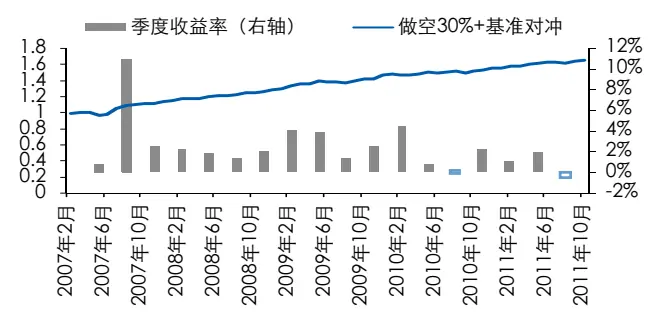
数据来源：国泰君安证券研究

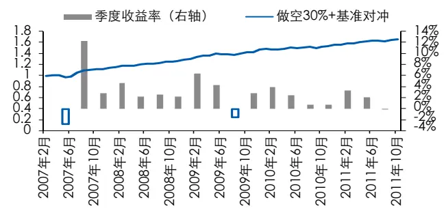

## 3.2.3. 以加权指数为基准的多、空组合的表现

以等权指数为基准时，多、空组合都有优异且稳健的表现。由于我们的模拟组合是采用的等权配置，因此以等权指数作为基准更具可比性。但考虑到在目前我国的投资实践中，缺乏等权指数的对冲工具，大部分指数或指数增强型产品也都是以加权指数为业绩基准，因此我们将多、空组合相对加权指数的表现也进行了测算。

测算结果表明，以加权指数为基准时，各个组合的稳健性都明显下降，月度胜率和季度胜率明显下降，最大回撤也明显扩大，这主要是由于配置的方法不一致导致的。具体来看，做多的组合和相对于加权指数基准还有明显的超额收益，但“做空等权组合+用加权指数对冲”策略的收益率大幅下降，这是因为过去几年加权指数的涨幅明显小于等权指数。尽管做多组合相对于加权指数还有明显超额收益，但其胜率并不高且回撤较大，所以在实际投资中直接使用“做多等权组合+用加权指数对冲”的策略还是需要很谨慎。

表6多、空组合分别相对于加权指数的表现

| 股票池 | 模拟交易策略 | 年化收益率 | 月波动率（%） | 月胜率 | 季胜率 | 最大回撤 | 夏普比率 |
| --- | --- | --- | --- | --- | --- | --- | --- |
| HS300 | 做多50%+HS300对冲 | 8.8% | 3.20 | 61.7% | 66.7% | -9.9% | 0.6134 |
|  | 做空50%+HS300对冲 | -1.8% | 3.62 | 45.7% | 48.1% | -15.8% | -0.3042 |
|  | 做多30%+HS300对冲 | 11.3% | 3.15 | 65.4% | 66.7% | -7.6% | 0.8540 |
|  | 做空30%+HS300对冲 | 2.2% | 3.95 | 50.6% | 55.6% | -15.6% | 0.0115 |
| ZZ500 | 做多50%+ZZ500对冲 | 10.5% | 1.59 | 75.4% | 94.7% | -6.9% | 1.5467 |
|  | 做空50%+ZZ500对冲 | 4.1% | 1.43 | 64.9% | 52.6% | -2.7% | 0.4322 |
|  | 做多30%+ZZ500对冲 | 12.8% | 1.95 | 77.2% | 94.7% | -6.7% | 1.6010 |
|  | 做空30%+ZZ500对冲 | 7.9% | 1.77 | 64.9% | 78.9% | -5.6% | 0.9635 |

数据来源：国泰君安证券研究

图11HS300中多、空组合相对于HS300指数的表现（组合规模为50%）
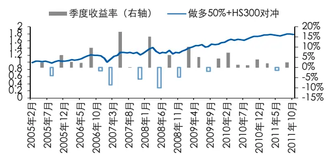
数据来源：国泰君安证券研究

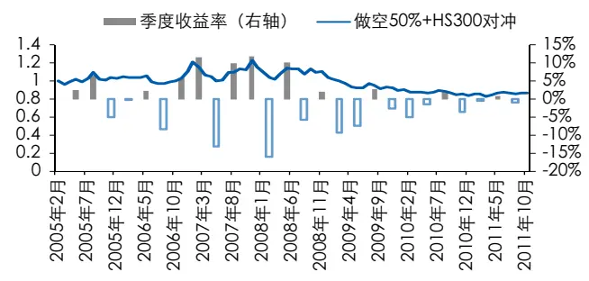

图12 HS300中多、空组合相对于HS300指数的表现（组合规模为30%）
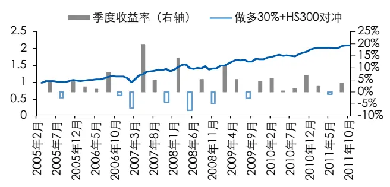

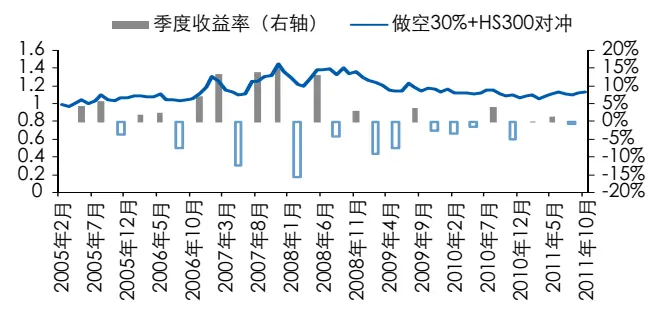
数据来源：国泰君安证券研究

图13 ZZ500中多、空组合相对于ZZ500指数的表现（组合规模为50%）
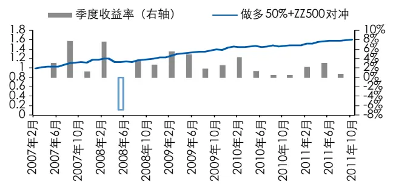
数据来源：国泰君安证券研究

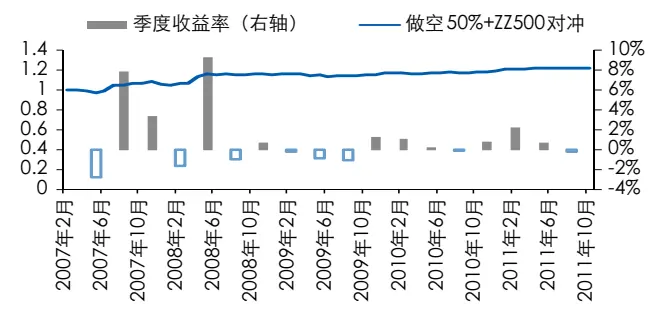

图14 ZZ500中多、空组合相对于ZZ500指数的表现（组合规模为30%）
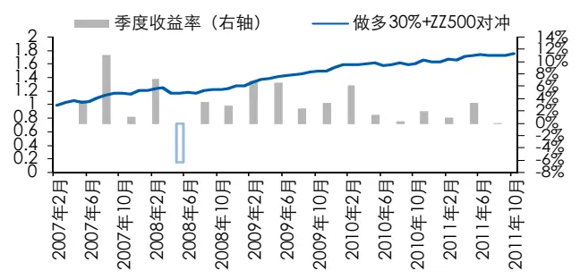
数据来源：国泰君安证券研究

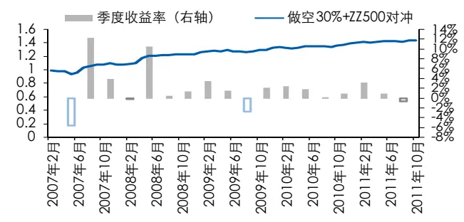

## 3.2.4. 只在适用的行业中选股构建多空组合配对交易的表现

前面的模拟组合构建都是在等权配置的方法下确保了行业中性，即每个行业中都选取了一定比例数量的股票，然后等权配置。但前文的2.3中我们对选股模型在各个行业中的适用性已经进行了检验，且发现有些行业并不适用，那么去除这些不适用的行业，对剩下的行业进行选股并构建多、空组合效果理应更好。

只在部分行业中选股构建的组合当然不可能做到行业中性，与等权的市场指数也不具有可比性了（这也是前面的分析中没有去除不适用行业的原因），但是多、空组合之间还是具有相同的行业配置比例的，因此多空组合配对交易后仍能达到市场中性和行业中性的效果。下面我们只在适用的行业中选股，并构建多空组合配对交易。

结果表明，去除不适用的行业之后的多空组合配对交易收益率和稳健性都有明显提高。

表7只在适用行业中选股构建多空组合配对交易的表现

| 股票池 | 模拟交易策略 | 年化收益率 | 月波动率（%） | 月胜率 | 季胜率 | 最大回撤 | 夏普比率 |
| --- | --- | --- | --- | --- | --- | --- | --- |
| HS300 | 做多50%+做空50% | 12.0% | 1.76 | 72.8% | 81.5% | -3.3% | 1.6471 |
|  | 做多30%+做空30% | 22.3% | 2.90 | 74.1% | 85.2% | -5.0% | 2.0239 |
| ZZ500 | 做多50%+做空50% | 17.1% | 1.80 | 80.7% | 100.0% | -2.1% | 2.4189 |
|  | 做多30%+做空30% | 24.5% | 2.72 | 75.4% | 94.7% | -6.0% | 2.3870 |

数据来源：国泰君安证券研究

图15 HS300中只在适用行业中选股构建多空配对交易的收益表现
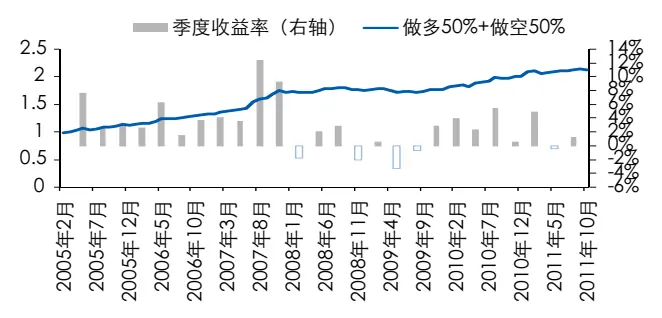
数据来源：国泰君安证券研究

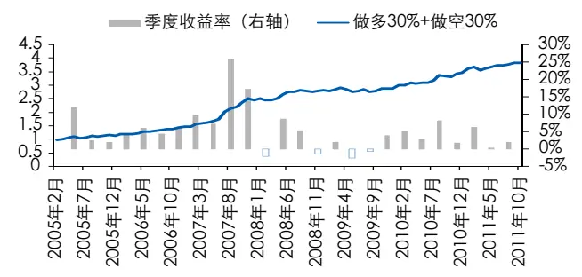

图16 ZZ500中只在适用行业中选股构建多空配对交易的收益表现
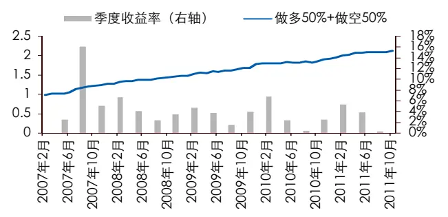
数据来源：国泰君安证券研究

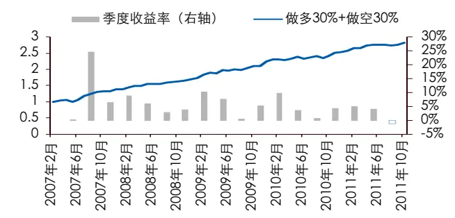

## 4. 以加权指数为基准的指数增强策略

考虑到在目前我国的投资实践中，缺乏等权指数的对冲工具，大部分指数或指数增强型产品也都是以加权指数为业绩基准，下面我们提出了一种简单的方法把等权配置的模拟组合应用到加权指数基准的增强策略中。

## 4.1. 行业中性的增强方法

相对于加权指数基准来说，等权配置下的行业中性组合并没有真正保持行业中性，因此直接配置看多的组合作为加权指数的增强策略或用加权指数对冲，并不能达到行业中性的效果，策略的稳健性得不到保证。但是，如果同时超配（做多）和低配(做空）一个等权配置下的行业中性组合，不会改变原来组合的行业配置比例，这样我们就可以简单的实现加权指数基准的增强。

如图17，初始组合完全复制指数，在初始组合的基础上低配一定比例(k%）的看空组合(等权的行业中性），同时超配k%的看多组合(也是等权的行业中性），由于看多和看空的组合能相互抵消对原始组合行业偏离的影响，因此得到的增强组合还是保持了加权基准下的行业中性。增强组合的收益=指数收益+k%*(超配组合收益-低配组合收益），可见只要超配组合能较稳健的跑赢低配组合，则增强组合能在行业中性的配置下获得比较稳健的增强效果。

图17 加权基准下的行业中性增强策略
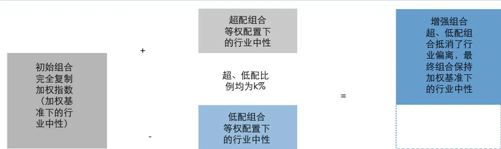
指数收益-k%*低配组合收益+k%*超配组合收益=指数收益+k%*(超配组合收益-低配组合收益)
资料来源：国泰君安证券研究

## 4.2. 增强策略的效果

我们对超配和低配的比例(k%）分别取10%、20%和30%三种情形进行分析，假如超配、低配的组合是只在适用的行业中使用多因子模型选取的看多组合和看空组合(组合规模均取30%)，则增强的效果如下。

如果采用30%的仓位超配看多组合和低配看空组合，则HS300中能获得年化6.7%的收益增强，最大回撤仅有-1.5%，季度胜率有85.2%：ZZ500中能获得年化7.3%的收益增强，最大回撤只有-1.8%，季度胜率达到94.7%。可见，行业中性的增强策略虽然增强的幅度不是特别大，但效果非常稳健，有很强的可操作性。

表8不同超、低配比例下HS300和ZZ500指数增强的效果

| 基准指数 | 超、低配比例 | 年化增强收益率 | 月波动率（%） | 月胜率 | 季胜率 | 最大回撤 |
| --- | --- | --- | --- | --- | --- | --- |
| HS300 | 10% | 2.2% | 0.92 | 74.1% | 85.2% | -0.5% |
|  | 20% | 4.5% | 1.30 | 74.1% | 85.2% | -1.0% |
|  | 30% | 6.7% | 1.59 | 74.1% | 85.2% | -1.5% |
| ZZ500 | 10% | 2.4% | 0.86 | 75.4% | 94.7% | -0.6% |
|  | 20% | 4.9% | 1.22 | 75.4% | 94.7% | -1.2% |
|  | 30% | 7.3% | 1.49 | 75.4% | 94.7% | -1.8% |

数据来源：国泰君安证券研究

## 5. 进一步研究的方向

在后续的研究中，首先，我们可以对现有的多因子选股模型不适用的行业进行更深入的研究，挖掘针对这些行业有效的因子，建立适合它们的选股模型。当然，最理想的做法是针对每一个行业选取其有效的因子，建立行业内选股模型，但这样做的工作量和难度都会大幅增加，而且由于每个行业中的样本数较少，有些测算可能会失去统计意义。尽管有难度，但我们的后续研究中还是会朝着这些方向不断深入。

其次，对组合的加权方法进行分析也是我们后续研究的一个方面。尽管等权配置的方法简单、客观、明了，易于选择比较基准，但在实际应用中还是会带了一些不便。在本报告中，我们提出了同时低配和超配同比例的等权的行业中性组合，可以抵消等权配置造成的行业偏离，但是超配和低配的比例不能太大，因为初始组合中可能有些股票权重太小而没办法做到较大幅度的等权低配。可见，等权配置的组合在实际应用中还是会遇到一些限制。因此，进一步对加权的方法进行研究也是提高我们选股模型实用性的一个方向。

## 附录I HS300中选股模型在各行业中效果的详细分析

图例说明：在每个行业中依据多因子选股模型综合打分的高低，将该行业中的个股分为两个组合，得分靠前的50%为做多组合，得分靠后的50%为做空组合，图中的蓝色折线和柱状分别表示多空组合配对交易策略的累计净值(初始值为1）和季度收益率。另，部分图中有黑色的虚线表示该行业指数的走势，以便分析选股模型在不同行情走势下的效果。

1）农林牧渔行业在HS300中的个股数量约为5个（测算期间的平均值，下同），选股模型在该行业中效果很差，由于个股数较少，测算结果缺乏统计意义。

2）采掘行业在HS300中的个股数量约为18个，选股模型在该行业中效果较差，不适用。

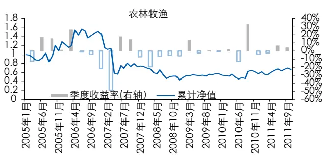

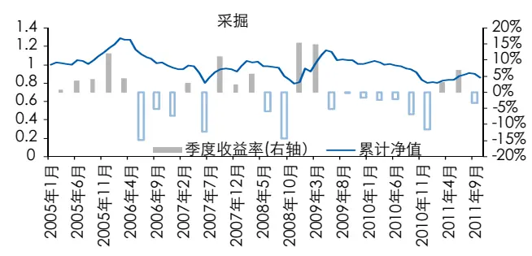

3）化工行业在HS300中的个股数量约为18个，选股模型在该行业中效果很差，不适用。

4）黑色金属行业在HS300中的个股数量约为21个，选股模型在该行业中总体来看有一定的效果，但在2010年下半年至今的弱势震荡环境中，模型基本失效了。

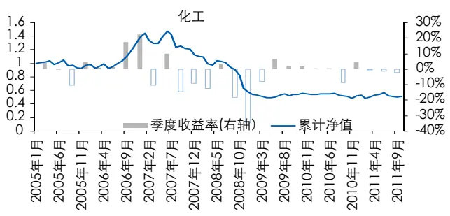

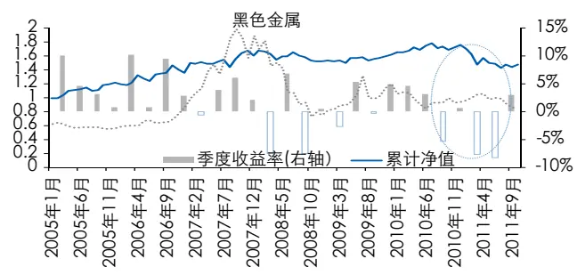

5）有色金属行业在HS300中的个股数量约为23个，选股模型在该行业中总体来看是比较有效的，但在06年上半年牛市启动时和09上半年的小牛市中模型明显失效。

6）建筑建材行业在HS300中的个股数量约为11个，选股模型在该行业中基本无效，由于个股数较少，测算结果的统计意义不是很强。

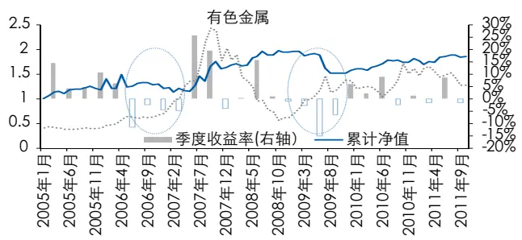

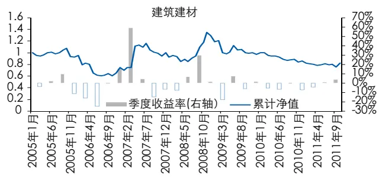

7)机械设备行业在HS300中的个股数量约为20个，选股模型在该行业中总体来看效果明显，但在08年至09年上半年期间，市场处于熊市和触底阶段，模型明显失效。

8）电子元器件行业在HS300中的个股数量约为7个，选股模型在该行业中有一定的效果，但在10年以后至今基本失效，由于个股数较少，测算结果的统计意义不是很强。

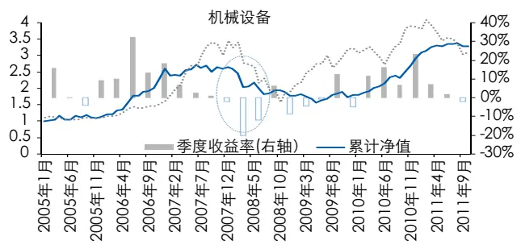

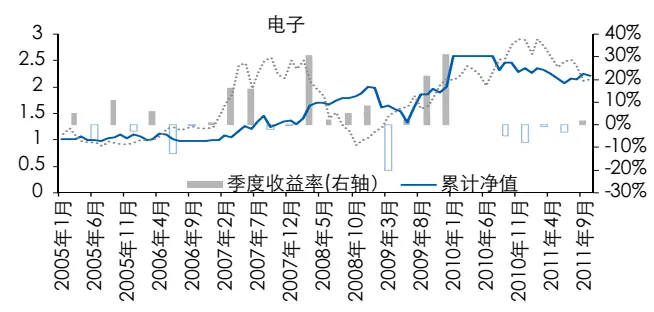

9）交运设备行业在HS300中的个股数量约为19个，选股模型在该行业中有较好的效果，净值没有连续的大回撤。

10）信息设备行业在HS300中的个股数量约为6个，选股模型在该行业中大部分时候有较好效果，但在10年底和11年初失效，净值造成较大的回撤。由于个股数较少，测算结果的统计意义不是很强。

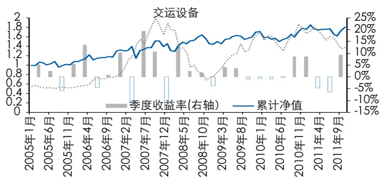

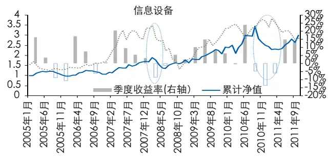

11）家用电器行业在HS300中的个股数量约为7个，选股模型在该行业中效果很差，由于个股数较少，测算结果的统计意义不是很强。

12）食品饮料行业在HS300中的个股数量约为12个，选股模型在该行业中总体来看有一定的效果，但在10年以来市场阶段中模型基本失效了。

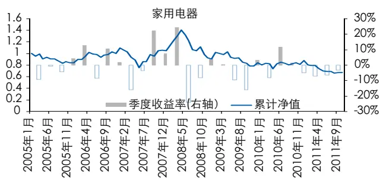

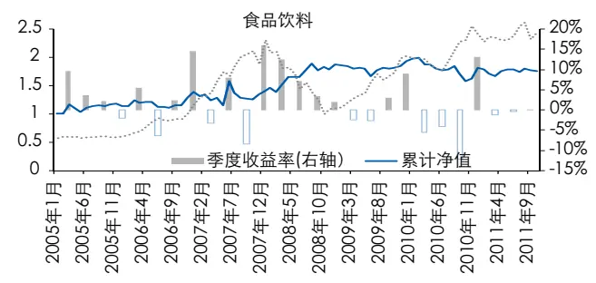

13）纺织服装行业在HS300中的个股数量约为3个，选股模型在该行业中效果很差，由于个股数太少，测算结果基本没有统计意义。

14）轻工制造行业在HS300中的个股数量约为4个，选股模型在该行业中效果很差，由于个股数太少，测算结果基本没有统计意义。

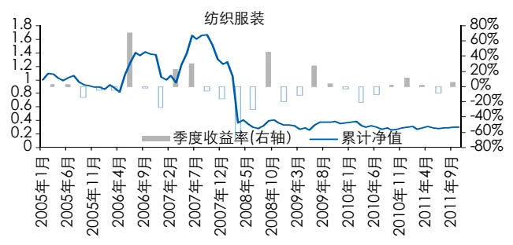

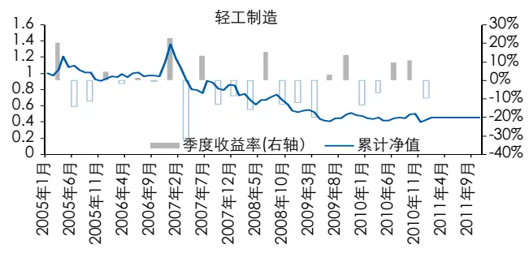

15）医药生物行业在HS300中的个股数量约为13个，选股模型在该行业中总体来看有一定的效果，但在07年初和09年上半年有阶段性失效。

16）公用事业行业在HS300中的个股数量约为19个，选股模型在该行业中效果较为理想，基本没有出现连续的、大的回撤。

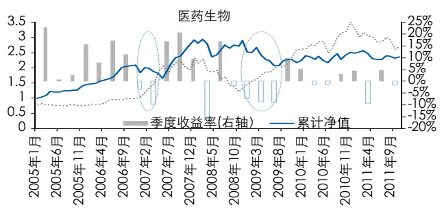

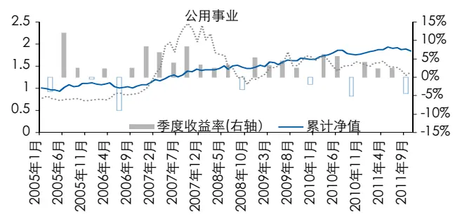

17）交通运输行业在HS300中的个股数量约为30个，选股模型在该行业中有一定的效果，尤其是在09年下半年和10年期间，效果比较理想，但在08年底和09年初市场见底回升阶段模型失效了。

18）房地产行业在HS300中的个股数量约为24个，选股模型在该行业中效果不明显，基本不适用。

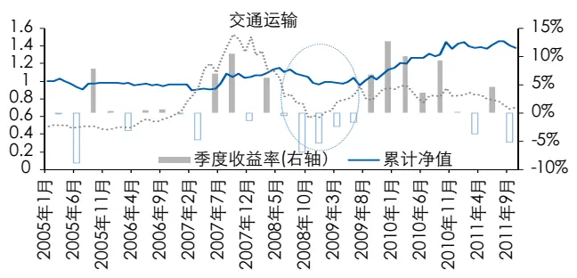

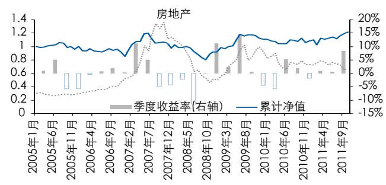

19）金融服务行业在HS300中的个股数量约为23个，选股模型在该行业中总体来看有较好的效果，多空配对策略的累计收益较高，但07年的一季度和二季度贡献了大部分的收益(我们详细查看了一下历史数据，这两个季度金融服务行业中的券商股大涨，涨幅远大于其他金融服务的子行业，而选股模型的做多组合中选取了较多的券商股，由此造成了这一现象），其余时间阶段模型表现平平。

20)商业贸易行业在HS300中的个股数量约为10个，选股模型在该行业中总体来看的效果比较好，但从图中我们可以看出，其主要是在05年到07年这波牛市中表现很好，其余时间阶段表现一般。

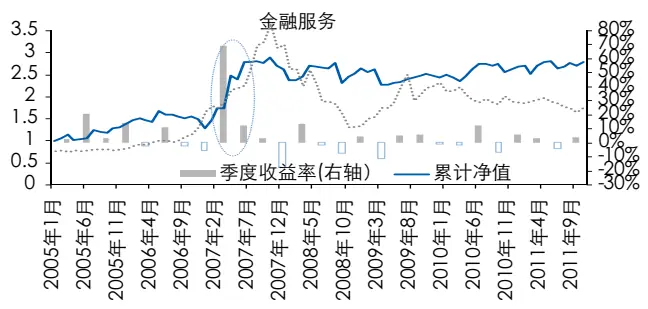

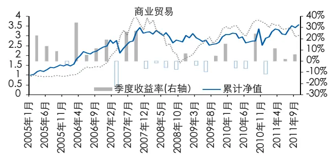

21）餐饮旅游行业在HS300中的个股数量只有1-2个，无法统计选股模型在该行业的效果。

22）信息服务行业在HS300中的个股数量约为11个，选股模型在该行业中有一定的效果，但在09年以来的震荡市中模型效果不是很理想，而11年以来模型效果有明显改善。

23）综合行业在HS300中的个股数量约为4个，选股模型在该行业中效果很差，由于个股数量很少，测算结果基本不具有统计意义。

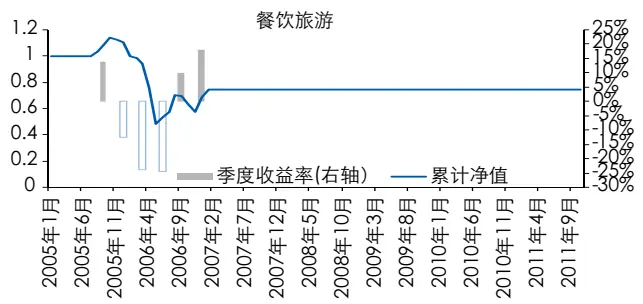

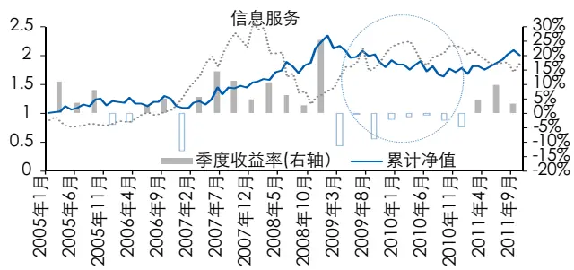

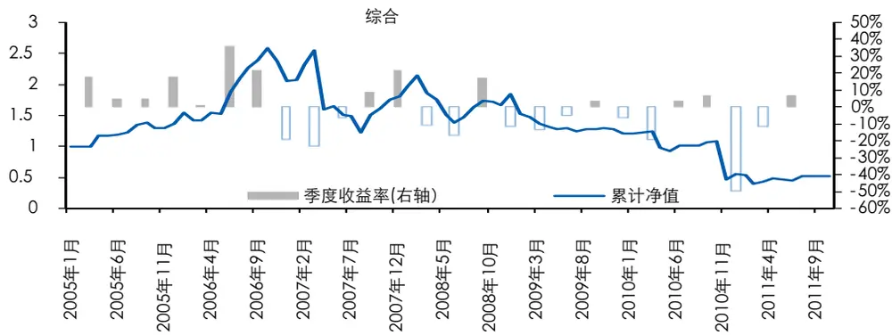

## 附录ⅡI ZZ500中选股模型在各行业中效果的详细分析

1）农林牧渔行业在ZZ500中的个股数量约为21个，选股模型在该行业中有一定的效果，从图中我们可以看出，当行业指数处于上涨阶段时模型效果较理想，而下跌阶段模型容易失效。

2）采掘行业在ZZ500中的个股数量约为12个，选股模型在该行业中总体来看有一定的效果，但在08年四季度和10年一季度指数的拐点处出现了严重失效，造成了很大的回撤。

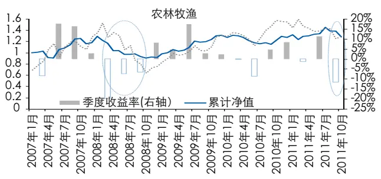

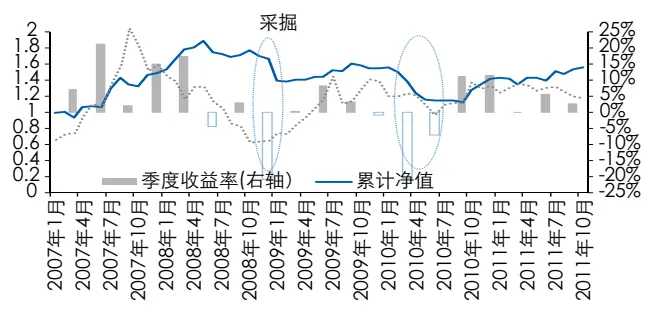

3）化工行业在ZZ500中的个股数量约为64个，选股模型在该行业中效果较好，在大部分时候都发挥了稳健的作用。

4)黑色金属行业在ZZ500中的个股数量约为10个，选股模型在该行业中效果较差，不适用。由于个股数较少，测算结果的统计意义不是很强。

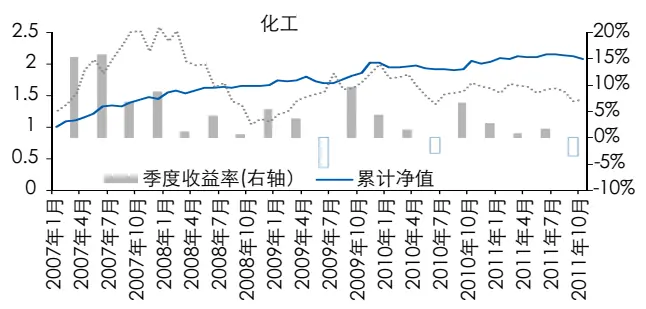

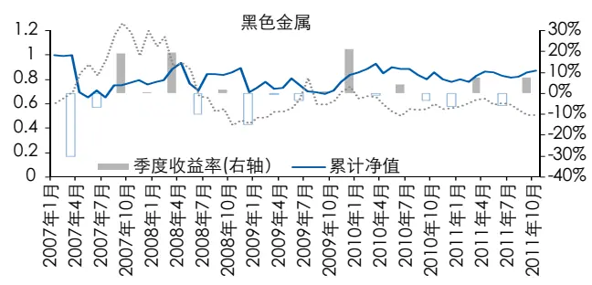

5）有色金属行业在ZZ500中的个股数量约为14个，选股模型在该行业中总体来看效果较好，只是在10年上半年行业指数处于横盘震荡时模型出现了一定的失效。

6)建筑建材行业在ZZ500中的个股数量约为21个，选股模型在该行业中总体来看有一定的效果，但季度胜率不是很高，最大的回撤发生在09年二三季度。

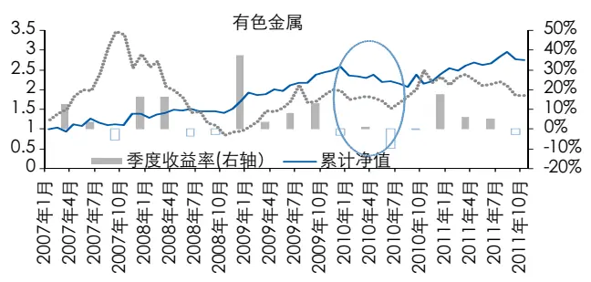

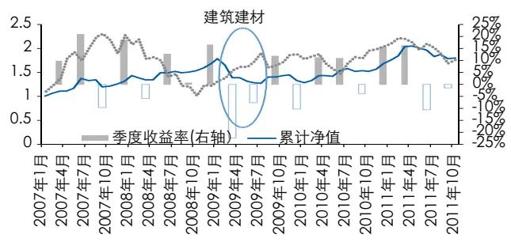

7)机械设备行业在ZZ500中的个股数量约为42个，选股模型在该行业中效果很理想，基本没有出现很大的回撤，效果一直很稳健。

8)电子元器件行业在ZZ500中的个股数量约为27个，选股模型在该行业中效果较好，但在07年上半年电子行业指数那波急涨中，模型出现了失效，造成了较大的回撤。

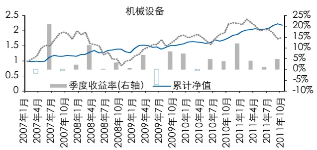

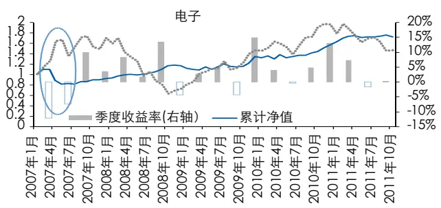

9)交运设备行业在ZZ500中的个股数量约为23个，选股模型在该行业中效果较好，在行业指数处于上涨和下跌趋势时模型都发挥了良好的效果，但在10年以来的震荡市中效果有所减弱。

10)信息设备行业在ZZ500中的个股数量约为18个，选股模型在该行业中总体来看有一定的效果，但自10年二季度来，模型的效果不是很明显。

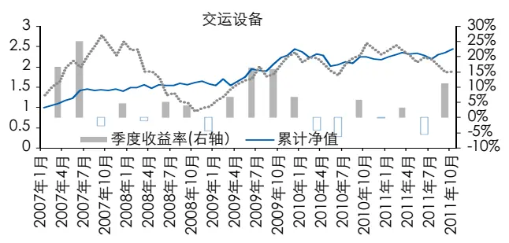

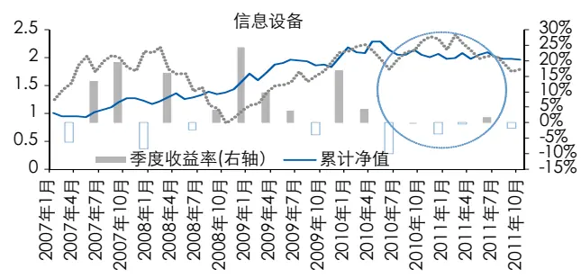

11）家用电器行业在ZZ500中的个股数量约为6个，选股模型在该行业中基本没有效果，不适用。由于个股数较少，测算结果的统计意义不是很强。

12）食品饮料行业在ZZ500中的个股数量约为11个，选股模型在该行业中效果较好，在09年一季度造成的大回撤主要是由于个股的异动所引起(维维股份在09年2-4月份涨幅超过150%)。值得注意的是自10年下半年以来模型表现一般。

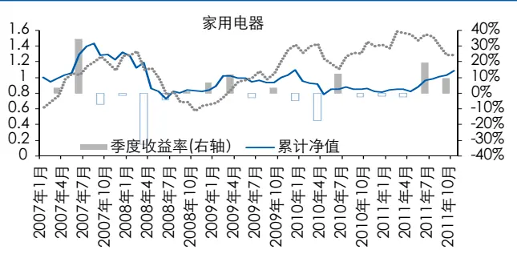

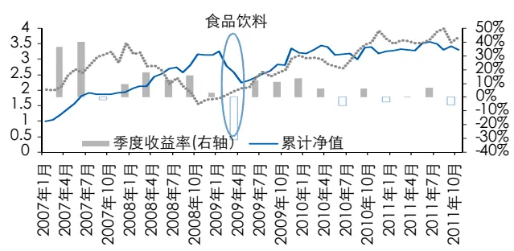

13）纺织服装行业在ZZ500中的个股数量约为14个，选股模型在该行业中总体来看效果较好，但在10年下半年以来，效果不理想。

14）轻工制造行业在ZZ500中的个股数量约为17个，选股模型在该行业中总体来看有一定的效果，但在08年底市场见底回升期间模型出现明显失效，造成较大回撤。

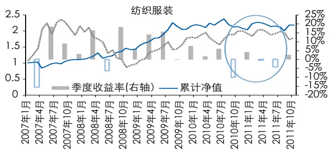

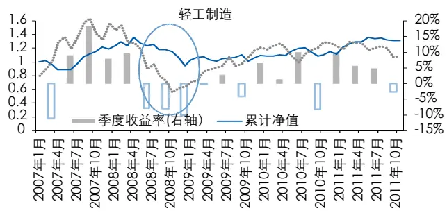

15)医药生物行业在ZZ500中的个股数量约为38个，选股模型在该行业中效果较好，多空配对交易策略没有造成很大的回撤，但在11年以来，模型效果不明显。

16）公用事业行业在ZZ500中的个股数量约为25个，选股模型在该行业中效果较差，不适用。

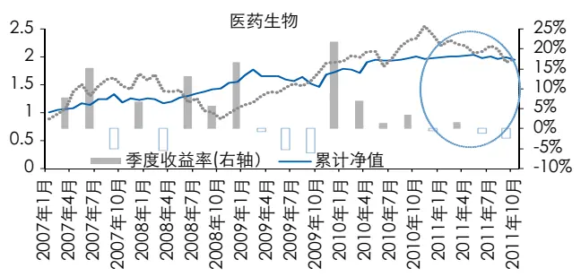

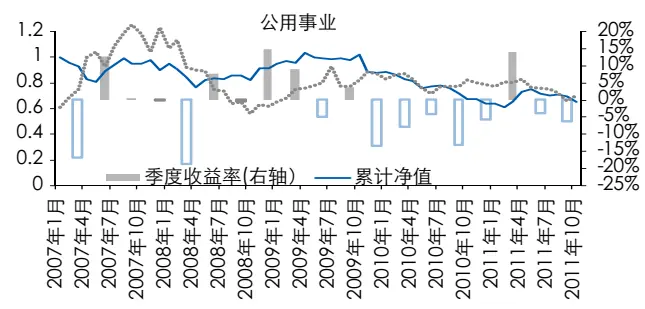

17)交通运输行业在ZZ500中的个股数量约为26个，选股模型在该行业中效果较理想，除了在07年三四季度有所失效之外，其余时间段模型都发挥了很稳健的效果。

18）房地产行业在ZZ500中的个股数量约为42个，选股模型在该行业中效果较理想，多空配对交易策略几乎没有连续发生很大的回撤，模型效果稳健。

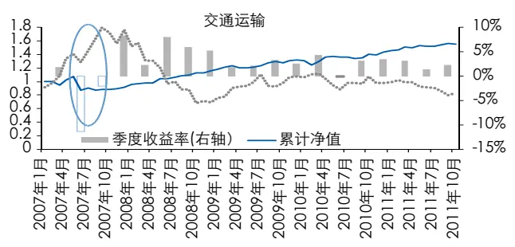

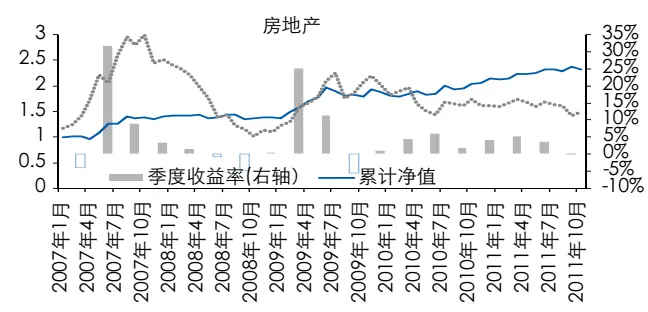

19）金融服务行业在ZZ500中的个股数量约为4个，选股模型在该行业中总体来看能贡献收益，但其贡献的收益主要都集中在07年底和08年初，其余时间段都效果不明显。另外，由于个股数较少，测算结果基本没有统计意义。

20)商业贸易行业在ZZ500中的个股数量约为35个，选股模型在该行业中效果很理想，多空配对交易策略能稳健的获得正收益，回撤较小。

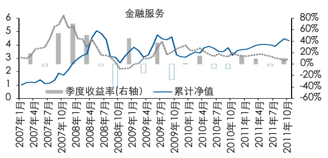

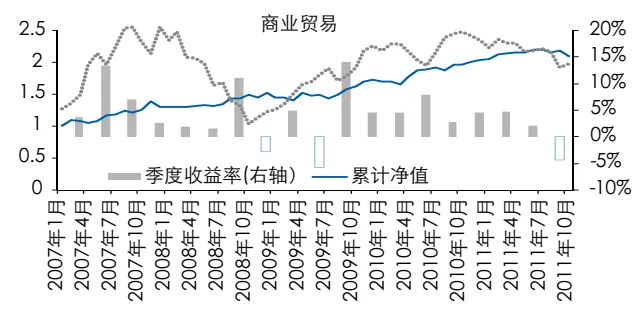

21）餐饮旅游行业在ZZ500中的个股数量约为10个，选股模型在该行业中效果不明显。由于个股数较少，测算结果的统计意义不是很强。

22）信息服务行业在ZZ500中的个股数量约为16个，选股模型在该行业中效果不明显。

23）综合行业在ZZ500中的个股数量约为11个，选股模型在该行业中效果不明显。

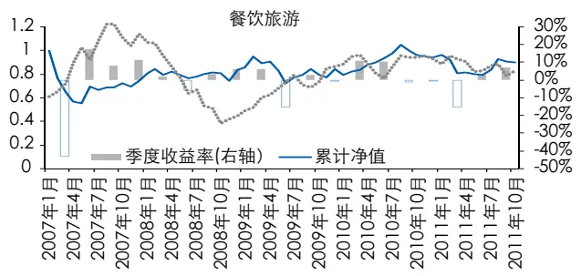

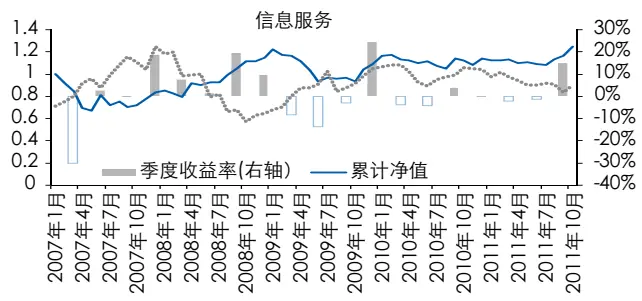

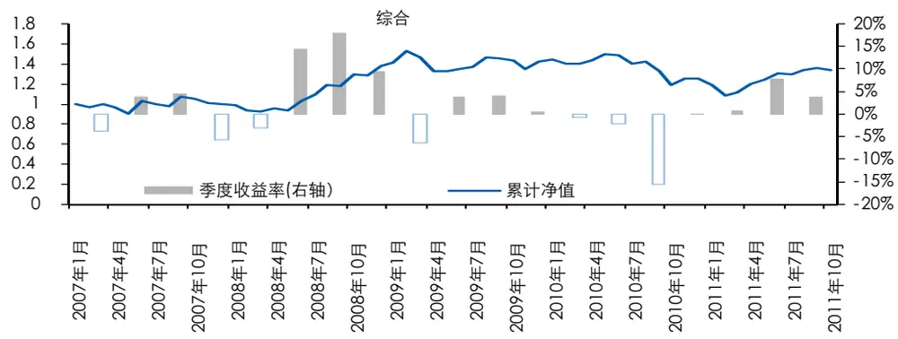

本研报由“慧博资讯”收集整理，阅读更多研报请访问“慧博资讯”点击进入http://www.hibor.com.cn