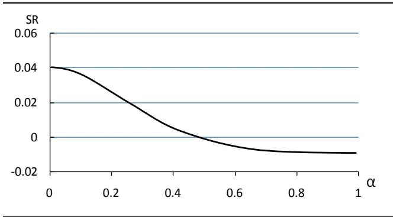
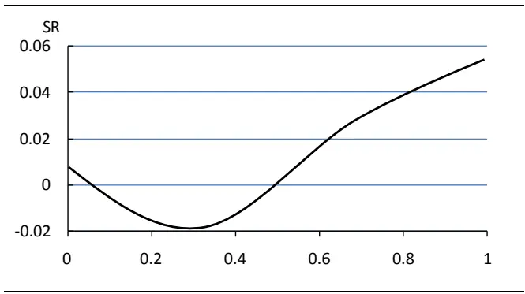
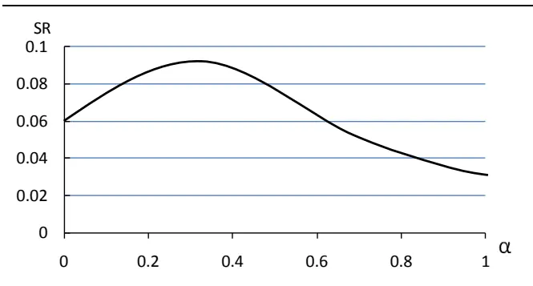
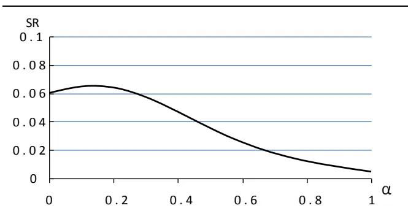
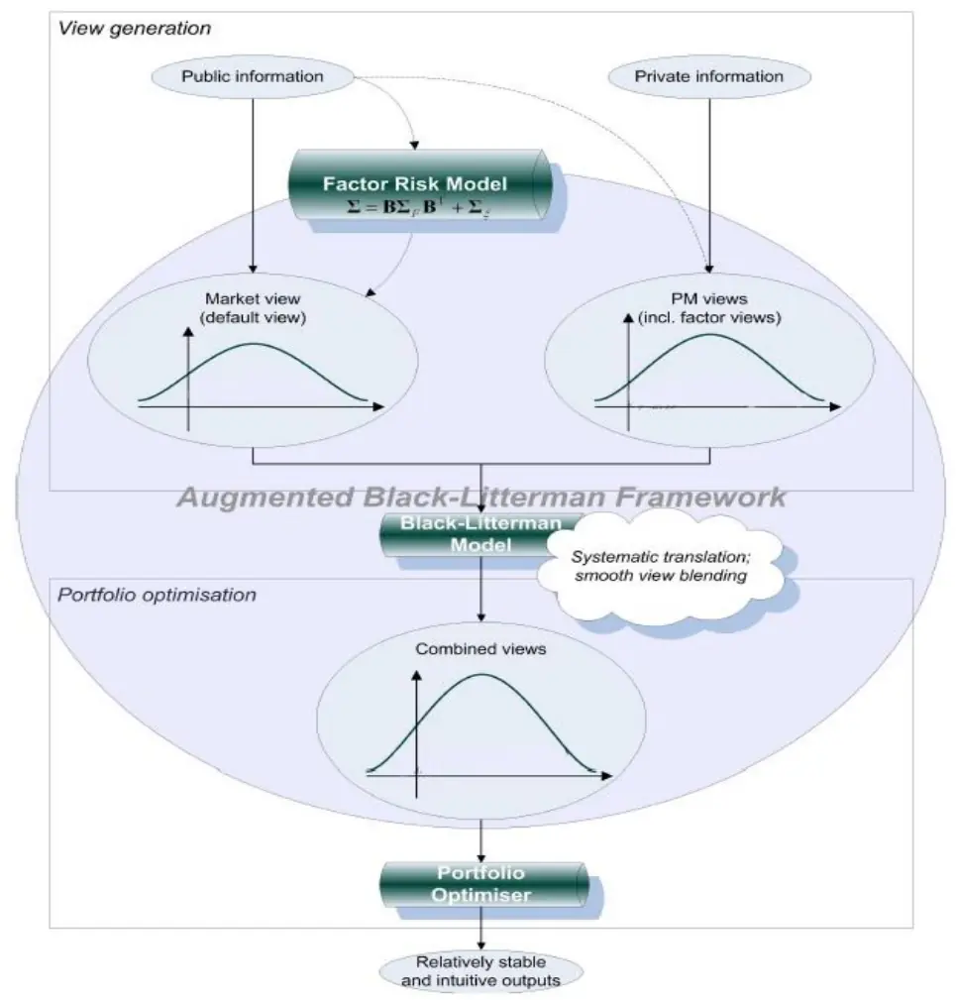

2012.09.21

# 资产配臵之 B-L模型Ⅲ：改进篇

# ——数量化研究系列之二十四

杨喆（分析师）

严佳炜（研究助理）

蒋瑛琨（分析师）

8 021-38676442

021-38674812

021-38676710

yangzhe@gtjas.com

yanjiawei008776@gtjas.com

jiangyingkun@gtjas.com

证书编号 S0880511010020

S0880110110169

S0880511010023

## 本报告导读：

本报告对海外有关B-L模型的最新研究思路进行探讨，主要包括非正态分布市场、错误观点与交易成本、多因子扩展模型等，目的是使模型更适用于实际使用环境。

## 摘要：

le_Summary]Black-Litterman 模型（简称 B-L 模型）是由高盛的 Fisher Black 和Robert Litterman 在 1992 年提出的资产配臵模型。我们在 2008 年底曾推出过两篇有关该模型的报告《资产配臵之 B-L 模型Ⅰ：理论篇》、《资产配臵之 B-L 模型Ⅱ：实证篇》。在上述报告里，我们对 B-L 模型的核心思想、参数设臵等进行了详细阐述，并将该模型运用于 A 股市场，进行了行业配臵的实证研究。

近年来，海外的机构和学者并没有放弃对 B-L 模型的更新研究，他们不论在理论上还是应用上，都对 B-L 模型提出了新的改进思路。我们将这些海外有关 B-L 模型的最新研究成果进行探讨，尤其是那些可以使得该模型更加适用于现实的市场环境，或是更符合投资者实际使用习惯的新思路，将是我们研究的重点。

- 本报告中我们对 B-L 模型新思路的研究，主要集中在非正态分布市场、错误观点与交易成本、多因子扩展模型等这几方面。

非正态分布市场：由于 B-L 模型里假设的资产收益都是服从正态分布，这对绝大多数市场来说并不现实，Attilio Meucci 提出了在非正态分布的条件下如何去使用 B-L 模型，并且在对风险的处理中，不再采用传统 B-L 模型里的方式，也就是说不再用方差来表示风险，改用 CVAR 等来描述风险，以便能够捕捉到非对称和尾部的风险。

错误观点与交易成本：B-L 模型中需要输入投资者对各类资产收益的观点，以形成贝叶斯后验收益。然后一旦这些观点最后被证明是错误的，那么 B-L 组合就会有比原来更大的损失，也就是说有时候不调整目前的组合收益反而更佳。这里就有一个调整与不调整组合的成本问题。Ghislain Yanou 提出了一种 B-L 模型的扩展方法，使得投资者观点错误时能够尽量减少损失。

多因子扩展模型：在传统的 B-L 模型中，投资者给出的主观观点是对资产的预期收益，而很多时候投资者可能是一些间接的观点，例如对一些指标的观点（股息率、EPS、ROE 等），这些因子可能驱动股价波动。Wing Cheung 提出了 ABL 模型（Augmented B-L模型），首次将因子模型融入到传统 B-L 模型的框架中，大幅度拓宽了 B-L 模型的适用面。

## [Table_R相关报告

《多因子选股模型之行业中性策略Ⅳ》

2012.06.20

《市场底部或已近在眼前——股市泡沫反泡沫研究》

2012.02.23

《资产配臵之 B-L模型Ⅱ：实证篇》

2008.12.02

《资产配臵之 B-L模型Ⅰ：理论篇》

2008.12.01

## 1. 海外 B-L 模型最新研究

Black-Litterman 模型（简称 B-L 模型）是由高盛的 Fisher Black 和 RobertLitterman 在 1992 年提出的资产配臵模型。B-L 模型使用贝叶斯方法，将投资者对资产预期收益的主观观点与市场均衡情况下的资产收益相结合，形成一个后验收益，即是对资产的新的预期收益。这个后验收益，也可以看成是投资者观点和市场均衡收益的复杂的加权平均。

我们在 2008 年底曾推出过两篇有关该模型的报告《资产配臵之 B-L 模型Ⅰ：理论篇》、《资产配臵之 B-L模型Ⅱ：实证篇》。在上述报告里，我们对 B-L 模型的核心思想、参数设臵等进行了详细阐述，并将该模型运用于 A股市场，进行了行业配臵的实证研究。

近年来，海外的机构和学者并没有放弃对 B-L 模型的更新研究，AttilioMeucci、Ghislain Yanou、Wing Cheung 等学者不论在理论上还是在应用上，都对B-L模型提出了新的改进思路。我们将这些海外有关B-L模型的最新研究成果进行探讨，尤其是那些可以使得该模型更加适用于现实的市场环境，或是更符合投资者实际使用习惯的新思路，将是我们研究的重点。

本报告中，我们对 B-L 模型新思路的研究，主要集中在非正态分布市场、错误观点与交易成本、多因子扩展模型等这几方面。

非正态分布市场：由于B-L模型里假设的资产收益都是服从正态分布，这对绝大多数市场来说并不现实，Attilio Meucci 提出了在非正态分布的条件下如何去使用B-L模型，并且在对风险的处理中，不再采用传统B-L模型里的方式，也就是说不再用方差来表示风险，改用CVAR等来描述风险，以便能够捕捉到非对称和尾部的风险。

错误观点与交易成本：B-L 模型中需要输入投资者对各类资产收益的观点，以形成贝叶斯后验收益。然后一旦这些观点最后被证明是错误的，那么B-L组合就会有比原来更大的损失，也就是说有时候不调整目前的组合收益反而更佳。这里就有一个调整与不调整组合的成本问题。Ghislain Yanou 提出了一种 B-L 模型的扩展方法，使得投资者观点错误时能够尽量减少损失。

多因子扩展模型：在传统的B-L模型中，投资者给出的主观观点是对资产的预期收益，而很多时候投资者可能是一些间接的观点，例如对一些指标的观点（股息率、EPS、ROE等），这些因子可能驱动股价波动。Wing Cheung 提出了 ABL 模型（Augmented B-L 模型），首次将因子模型融入到传统 B-L模型的框架中，大幅度拓宽了 B-L模型的适用面。

## 2. B-L 模型新思路

## 2.1. 非正态分布市场

传统 B-L模型具有两大缺陷，首先，B-L模型假定的市场先验收益和投资者观点收益都是服从正态分布的。对于绝大多数市场来说，这个假设条件过于苛刻或者说不现实，因为市场风险往往呈现出厚尾、非对称和对特殊事件的高度依赖。其次，B-L 模型本身的理念，存在一定问题，根据模型的原理，投资者表达自己对市场的观点，最终体现的是一些决定收益分布的参数，例如均值和方差。而事实上，投资者可能并不是想表达一个确定的预期收益，更多的时候是一个收益的范围，和不同的收益实现的可能性。Attilio Meucci(2005、2006、2008)提出了如何来解决非正态分布收益问题的方法。

如果要克服正态分布的假设条件，我们可以假设收益率服从 SkewT 分布，该分布除了具有厚尾特征之外，还引入了偏斜特征，区别于传统的正态分布、学生 t 分布。近年来该分布在金融领域广泛应用，能够更贴近实际地来描述金融市场。

在对风险的处理中，我们不再用传统 B-L模型里沿用的马克维兹方式，也就是说不再用方差来代表风险，在这里我们用 CVAR来描述风险，这样可以捕捉到非对称和尾部的风险。

我们假定描述 N维收益率向量 M的特性因子包括概率密度函数 $\mathrm{f}_{\mathrm{\Pi_{M}}}$ ，累

积分布函数 $\mathrm{F_{M}}$ ，和特性描述函数 $\phi_{\mathrm{{\scriptscriptstyle M}}}$ 。N代表资产数。

$$
\begin{array}{rl}{\mathbf{M}}&{{}\sim\ (\mathbf{f}_{\mathbf{\Phi_{M}}},\quad\mathbf{F}_{\mathbf{\Phi_{M}}},\quad\phi_{\mathbf{M}})}\end{array}
$$

这里我们对收益率特性引入了分布函数的概念，因此我们可以假定市场收益服从 SkewT 分布，

$$
\textbf{ M }^{\perp}\textbf{ S k T }(\Psi^{\textbf{ \eta }},\textbf{ \^ { \mu } },\Sigma^{\textbf{ \eta }},\textbf{ \^ { a } })
$$

Ψ 是一个正数， $\mu$ 是一个 N维向量，Σ是 N×N正向对称矩阵，α为 N维向量。当形状参数 α 为空时，SkewT 分布就和 t 分布重合。Ψ 趋向于无穷大时，SkewT 分布就是正态分布。当自由度 Ψ变小时，分布表现为严重的尾部特征和对特殊事件的高度依赖。在这里，μ 是是收益向量，Σ是协方差矩阵。

该分布有一个概率密度函数，最终来帮助我们求得 CVAR。

最后B-L中求解资产权重的优化变成了最大化收益，同时最小化CVAR。

$$
\mathrm{CVaR}(\mathrm{w})\equiv-\mathrm{E}\{\mathrm{R}|\mathrm{R}\leq\mathrm{F}_{\mathrm{R}}^{\mathit{\mathrm{-1}}}(1-\gamma)\}
$$

$$
\begin{array}{c}{\displaystyle\mathbf{w}\left(\mathbf{r}\right)\equiv\mathrm{argmin}\left\{\mathrm{CVaR}\left(\mathbf{w}\right)\right\}}\\{\displaystyle\mathbf{w}^{\prime}\mathrm{E}\left\{\mathrm{R}\right\}\geq\mathrm{r}}\\{\displaystyle\mathbf{w}^{\prime}\mathbf{1}=\mathrm{1}\mathrm{~,~}\mathbf{w}\geq0}\end{array}
$$

投资者的观点收益同样也可以假定服从 SkewT分布或是其他分布，对于第 k个观点，收益率 $\mathrm{V}\mathrm{k}$ 的特性可以描述为，

$$
\mathbf{V}_{\mathrm{~k~}}\stackrel{\triangledown}{\left(\mathrm{f_{\mathrm{~v_{k}~}}},\quad\mathrm{F_{v_{k}~}},\quad\phi_{\mathrm{v_{k}~}}\right)}
$$

由此，我们解决了正态分布在实际市场中应用受限的问题，采用一个更适合金融市场特性的分布，使结果更贴近于实际。另外我们还解决了收益率的表达问题，不再是沿用传统的 E（R）和方差 σ 的表达式，而是采用一种收益和概率相结合的形式，例如投资者可以给出收益率的区间，在区间内用概率分布函数来表示每种收益出现的可能性，最简单的可以用均匀分布的形式，也可以用 SkewT分布或是离散型分布。

给定第 k 个观点的收益区间 $[\mathbf{a}_{\mathrm{~k~}},\mathbf{b}_{\mathrm{~k~}}]$ ，假设收益率 $\mathrm{V}_{\mathrm{k}}$ 服从均匀分布的形式，那么第 k个观点的概率分布函数 $\mathrm{F_{v_{\mathrm{~k~}}}(v)}$ 可以表达为：

$$
\begin{array}{r}{\mathsf{F}_{\mathbf{v}_{\mathrm{~k~}}}(\mathbf{v})\equiv\mathsf{F}_{[\mathbf{a}_{\mathrm{~k~}},\mathbf{b}_{\mathrm{~k~}}]}^{\mathbf{U}}(\mathbf{v})\equiv\left\{\begin{array}{ll}{\begin{array}{rl}{0}&{\mathrm{~v\leq~\mathbf{a}_k~}}\\{\mathrm{~v-a_k~}}&{}\end{array}}\\{\begin{array}{rl}{\mathbf{b}_{\mathrm{~k~}}\mathrm{-\mathbf{a}_k~}}&{}\end{array}}&{\begin{array}{rl}{\mathsf{I}}&{}\\{\mathbf{b}_{\mathrm{~k~}}\mathrm{-\mathbf{a}_k~}}&{}\end{array}}\\{\begin{array}{rl}{\left|}&{1}&{\mathrm{~v\geq~\mathbf{b}_k~}\right|}\end{array}}\end{array}\right.}\end{array}
$$

由此，我们实现了在偏斜、厚尾、对事件高度依赖的市场进行资 $\cdot\dot{\vec{r}}$ 配臵。投资者观点的输入更加方便直观，后验市场分布可以用蒙特卡罗模拟快速实现。如果我们不假设收益率服从 SkewT 分布，还可以假设任意分布，甚至不同的资产、不同的投资者观点可以服从不同分布。

此外，这里对风险的描述不再采用传统方差形式，改进为采用 CVAR来描述风险的方法。事实上我们还可以采用其他的描述方法。

## 2.2.错误观点与交易成本

B-L 模型中，需要输入投资者对各类资产收益的观点，也就是所谓的观点收益，最后用来形成贝叶斯后验收益，一旦这些观点最后被证明是错误的，那么 B-L 组合就会有比原来更大的损失，也就是说有时候不调整目前的组合收益反而更佳。这里就有一个调整与不调整组合的成本问题，调整则还需要支付交易成本，不调整则可能失去市场机会。GhislainYanou(2010)提出了一种 B-L 模型的扩展方法，使得投资者观点错误时能够尽量减少损失。

假设， $\omega_{_ABL}$ 是最终的组合权重配臵 arregate portfolio， $\omega_{_{BL}}$ 是 B-L 模型下的组合权重配臵， $\omega_{\mathrm{~}_{c}}$ 是当前的投资组合权重配臵 current portfolio。三者均为 N•1列向量，N代表资产数。

$$
{\omega}_{_{ABL}}=\alpha{\omega}_{_{\textrm{ B L }}}+\left(1-\alpha\right){\omega}_{_{\textrm{ c }}}
$$

若投资者维持当前组合不变，则 α为 0，若全部根据 B-L模型调仓，则α 为 1。

最终得到的组合配臵是 $\omega_{_ABL}$ ，因此我们需要找到一个最优的 α，来使得综合调仓成本和机会成本后的组合最优。

当前组合配臵下的预期收益 $\mu_{_c}=\omega_{_c}\mu_{_{eq}}\mathrm{~,~}\ \mu_{_{eq}}$ 为市场均衡收益。B-L 模型的出发点是基于市场组合配臵，而我们现在的出发点是基于当前投资者手中的组合配臵，因此组合的先验收益为 $\mu_{\textit{ c }}$ ，方差为 $\Delta=\omega_{_{c}}(\tau\Sigma)\omega_{_{c}}$ 加入投资者观点后，基于当前组合为出发点的后验收益 $\mu_{\scriptscriptstyle{CBL}}$

$$
{\boldsymbol\mu}_{_{CBL}}=\left[{\boldsymbol\Delta}^{-1}+{\boldsymbol\ P}^{T}{\boldsymbol\Omega}^{-1}{\boldsymbol\ P}\right]^{-1}\left[{\boldsymbol\Delta}^{-1}{\boldsymbol\mu}_{c}+{\boldsymbol\ P}^{T}{\boldsymbol\Omega}^{-1}{\boldsymbol\ Q}\right]\circ
$$

总的组合后验收益 $\pi_{\textrm{ A B L }}$

$\pi_{_{ABL}}=\alpha\pi_{_{\mathrm{\tiny~BL}}}+\left(1-\alpha\right)\pi_{_{\mathrm{\tiny~CBL}}},\pi_{_{\mathrm{\tiny~BL}}}$ 为以市场组合为出发点的组合后验收益，$\pi_{\textrm{ C B L }}$ 为以当前组合为出发点的组合后验收益。

其中，

$\pi_{_{\textrm{ B L }}}={\omega}_{_{BL}}^{T}{\mu}_{_{BL}}\ -\ \textrm{ c o s t }$ ， cost为从当前组合变为 B-L组合的成本。

$\pi_{\textrm{ c B L }}={\omega}_{c}^{T}\mu_{cBL}$ ，基于当前组合不变，因此没有成本。

我们也可以同样求得组合的后验标准差 $\sigma_{\textrm{ A B L }}$ ，假如我们继续以夏普比率为最终目标，那么我们优化的是最终组合的夏普比率，该夏普比率（暂且假定无风险利率为零）可以表达为 α的表达式，

$$
f\left(\alpha\right)=\frac{\pi_{\mathrm{_{ABL}}}}{\sigma_{_{\mathrm{_{ABL}}}}}
$$

通过最大化夏普比率，我们求得了一个最优的 α。

我们来观测投资者观点全部错误或全部正确两种极端的情况下组合夏普比率情况，横轴为 α从 0至 1变化。

图 1 投资者观点全部错误

图 2 投资者观点全部正确

数据来源：国泰君安证券研究，The Black-Litterman Model Wrong Views v.s. Opportunity Cost

因为 α为现有组合最终根据 B-L模型去配臵的调仓比例，投资者观点全部错误的情况下，α 越小越好，α 为 0 时组合的夏普比率越大，也就是不调仓或调仓比例越小越好。而投资者观点全部正确的情况下，由于有交易成本的存在，α并不是越大越好，如果调仓比例不大，调仓带来的收益有可能还不能弥补交易成本，只有当调仓比例足够大的情况下才足以覆盖交易成本，α为 1时组合夏普比率最大。

不同交易成本，也会对最终的组合业绩产生明显影响。我们对比两种交易成本下的组合夏普比率情况。

图 3 低交易成本

图 4 高交易成本

数据来源：国泰君安证券研究，The Black-Litterman Model Wrong Views v.s. Opportunity Cost

低交易成本的情况下，最优的 α出现在 0.3附近，并且最优的夏普比率在 0.09 以上。而高交易成本的情况下，最优的 α明显降低，出现在 0.2不到的位臵，也就是说调仓比例尽量降低，且最优的夏普比率降低到了0.07以下，交易成本最终吞噬了部分收益。

总结一下采用这种方法来均衡调仓成本和机会成本的步骤，第一步，投资者持有当前的组合，并对资产的未来收益有观点。第二步，根据 B-L模型，求出后验收益、协方差矩阵、组合权重。第三步，计算当前组合根据 B-L配臵进行调仓的交易成本。

第四步，以当前组合为出发点，根据贝叶斯方法，计算后验收益、协方差矩阵。

第五步，将 B-L 组合和当前组合进行线性组合，在结合交易成本的情况下，求出最优的 α，也即最终的调仓比例。

## 2.3.多因子扩展模型

在传统的B-L模型中，投资者给出的主观观点是对资产的预期收益，模型采用贝叶斯方法，在市场均衡收益的基础上，结合投资者主观观点，从而形成一个新的预期收益。投资者观点的正确与否最终会影响未来组合收益，因此主观观点的设臵可以说是B-L模型至关重要的一部分。

除了对资产本身输入直接的观点外，很多时候投资者可能是一些间接的观点，例如对宏观因子（CPI/GDP/利润等）、基本面因子（PE/EPS/ROE 等）、技术面因子（价格/动量等）、行业板块因子等，这些因子可能驱动股价波动。从海外的实践来看，很多数量化组合经理也经常会将这些因子纳入自己的分析体系。我们如何来使用这些信息，并将这些因子直接作为模型的输入条件，Wing Cheung(2009)提出了 Augmented Black-Litterman 模型（ABL 模型），将 B-L 模型的输入条件扩展到了影响市场的因子层面，大幅拓展了该模型的适用面。

具体来说，Cheung的ABL模型与B-L模型最大的不同是，在计算全程中，无论是收益率向量还是协方差矩阵，均加入了因子项，将 B-L 模型中对于n个资产收益率的预测扩充为对于 n个资产和f个因子的收益率的预测。

ABL 模型的具体构建过程可分为以下几个步骤。

第一步，构建因子模型。为了将因子观点揉合到 B-L 模型的主观观点中，必须将资产的预期收益率表示为多个因子的线性组合。可以采用的方法大致有如下两种：

1）排序打分法：因子排序打分法是一种在多因子模型构建中较为常用的方法，其思想来源于 Fama和 French的三因子模型，所用的数据是基本面因子等横截面数据。该方法较为常见，在此不再赘述。

2）线性因子模型：当因子的时间序列数据可用的时候，可以基于因子数据，使用线性因子回归模型对资产的收益率进行预测。因为使用的是回归方程的方法，因此对因子数据的长度与频率有较高的要求。

Cheung 提出的 ABL 模型中使用了第二种方法，将因子的时间序列数据，用回归方法拟合线性因子模型，具体的线性因子模型如下：

$$
r=a+{\bf B}r_{_F}+\xi
$$

假设选择n 个资产与 f 个因子构成 ABL 模型，那么公式中r 表示资产

收益率，是一个n 维向量， $r_{\scriptscriptstyle F}$ 表示因子收益率，同样是个 f 维向量，

B 为 $n\times f$ 维矩阵 $\left(\textbf{ B }^{T}\right.$ 表示转臵矩阵），表示因子系数矩阵，a 是常数项， $\bar{\hbar}\xi$ 是误差项。

由上式又可以立即得到收益率与因子的风险关系：

$$
\boldsymbol{\Sigma}_{r}=\mathbf{B}\boldsymbol{\Sigma}_{\scriptscriptstyle F}\mathbf{B}^{T}+\boldsymbol{\Sigma}_{\scriptscriptstyle\xi}
$$

其中，Σ 是资 $\dot{\mathcal{P}}$ 收益率的协方差矩阵 $\left(\begin{array}{l}{}\\{n\times n}\end{array}\right)$ ，Σ 是因子收益率的协方差矩阵（ f f• ）， $\Sigma_{\ z}$ 是误差项的协方差矩阵 $\textbf{ ( }{n}\times\textbf{ f }\textbf{ ) }$ 。通过回归上述方程，可以算出系数矩阵B 。

第二步，类似B-L模型，通过逆优化过程可以求得资产隐含均衡收益向量：

$$
\Pi_{\mathbf{\varphi}_{r}}=\lambda_{\mathbf{\varphi}_{M}}\pmb{\Sigma}_{\mathbf{\varphi}_{r}}\omega_{\mathbf{\varphi}_{M}}
$$

$\lambda_{_M}$ 为市场风险厌恶系数， $\omega_{{_M}}$ 是各项资产的市场权重，通常为各项资产的市值占比。对因子的隐含均衡收益向量则可以通过上述的线性因子模型和 CAPM 模型推导得到， $\Pi_{\mathbf{\Lambda}_{F}}=\lambda_{\mathbf{\Lambda}_{M}}\boldsymbol{\Sigma}_{\mathbf{\Lambda}_{F}}\mathbf{B}^{T}\boldsymbol{\omega}_{\mathbf{\Lambda}_{M}}$ ，综合起来可以得到：

$$
\Pi=\left(\begin{array}{c}{{\Pi_{\mathbf{\Pi}_{r}}}}\\{{}}\\{{\Pi_{\mathbf{\Pi}_{F}}}}\end{array}\right)=\lambda_{\scriptscriptstyle M}\left(\begin{array}{c}{{\pmb{\Sigma}_{r}}}\\{{}}\\{{\pmb{\Sigma}_{F}\pmb{\mathbf{B}}^{T}}}\end{array}\right){\boldsymbol{\omega}_{\scriptscriptstyle M}}
$$

ABL模型最后形成的后验预期收益为：

$$
\operatorname{E}(R)=\left[\left(\tau\Sigma\right)^{-1}+\mathbf{P}^{T}\pmb{\Omega}^{-1}\mathbf{P}\right]^{-1}\left[\left(\tau\Sigma\right)^{-1}\Pi+\mathbf{P}^{T}\pmb{\Omega}^{-1}\pmb{Q}\right]
$$

形式上与 B-L 模型中的后验预期收益完全相同，只不过所有的变量维数在之前的基础上进行了扩充。

在这里，

$$
\boldsymbol{\Sigma}=\left[\begin{array}{cc}{\boldsymbol{\Sigma}_{r}}&{\mathbf{B}\boldsymbol{\Sigma}_{r}}\\{\left\lfloor\boldsymbol{\Sigma}_{r}\mathbf{B}^{T}\right.}&{\boldsymbol{\Sigma}_{r}}\end{array}\right]
$$

∑是资产收益率与因子收益率共 $n+f$ 个变量的协方差矩阵，为$(n+f)\times(n+f)$ 维。

Ⅱ是n+ f维的隐含均衡收益向量，其中同样包含资产收益与因子收

益两部分。

$$
\mathbf{P}=\left[\begin{array}{ccc}{\mathbf{P}_{[k_{1}\times n]}}&{}&{0}\\{}&{}&{}\\{0}&{\mathbf{P}_{F[k_{2}\times f]}}\end{array}\right]
$$

P 是 ABL 模型使用者需要输入的投资者主观观点，当投资者对资产有$k_{\scriptscriptstyle1}$ 个观点，对因子有 $k_{\scriptscriptstyle2}$ 个观点时，P为 $(k_{\scriptscriptstyle1}+k_{\scriptscriptstyle2})\times(n+f)$ 维。

$$
\begin{array}{r}{Q=\left[\begin{array}{l}{Q_{[k_{1}\times1]}}\\{\phantom{\frac{1}{2}}}\end{array}\right]}\\{\phantom{\frac{1}{2}}\left\lfloor\begin{array}{l}{Q_{\phantom{\frac{1}{2}}[k_{2}\times1]}}\end{array}\right\rfloor}\end{array}
$$

Q为观点收益向量，

$$
\begin{array}{r}{\Omega\ _{[k_{1}\times k_{1}]}\qquad0\qquad]}\\{\Omega\ =\ \left|\begin{array}{cc}{0\ }&{\Omega\ _{_{F[k_{2}\times k_{2}]}}}\end{array}\right|}\\{\qquad0\ \qquad\Omega\ _{_{F[k_{2}\times k_{2}]}}.}\end{array}
$$

- 是观点收益矩阵，为 $(k_{\scriptscriptstyle1}+k_{\scriptscriptstyle2})\times(k_{\scriptscriptstyle1}+k_{\scriptscriptstyle2})$ 维。

例：对于有色金属、银行、食品饮料三个行业，以及 CPI、PPI 两个因子，可以给出如下的观点矩阵 P（其中包含 3个观点）：

表 1 主观观点矩阵 P与观点收益向量 Q

| P | 有色金属 | 银行 | 食品饮料 | CPI | PPI | 观点收益Q |
| --- | --- | --- | --- | --- | --- | --- |
| 观点1 | 1 | 0 | -1 | 0 | 0 | 5% |
| 观点2 | 0 | 0 | 0 | 1 | 0 | 3% |
| 观点3 | 0 | 0 | 0 | 0 | 1 | -0.7% |

数据来源：国泰君安证券研究

上表中除去最右一列即为维数为 3×5的观点矩阵 P，最右一列为观点收益向量 Q。

观点 1 为有色金属行业跑赢食品饮料行业 5%；

观点 2 为 CPI同比增长 3%

观点 3 为 PPI 同比增长-0.7%。

最后，截取后验预期收益向量中的前n维——关于资产的后验预期收益部分，代入到马克维兹的均值-方差模型中，进行优化求解，最终得到新的资产组合权重向量。

图 5 ABL 模型框架

数据来源：国泰君安证券研究，Social Science Research Network

从上面的计算过程可以看到，ABL 模型与 B-L 模型的具体算法差别不大，只是引入的因子观点能够有效地解决B-L模型中观点设臵的难点，大大拓宽了模型的适用面，这是 ABL 模型的一大亮点。另外，投资者对GDP、CPI等宏观因子、EPS、ROE等基本面因子的预期较对具体资产收益率的预期更为容易、且准确率高，这也使得 ABL 模型较 B-L 模型更贴近于实际投资需求。

## 透明化 ABL 模型（Transparent Augmented Black-Litterman）

前文介绍的 ABL 模型是一个十分实用、有效的资产配臵框架。在这个框架中，投资组合管理人能够将自己对于资产、因子指标的观点输入至 ABL 模型中，模型则会在市场均衡收益的基础上，结合输入的主观观点，进行合理有效的配臵，以获取 alpha 超额收益。但是，对于投资者而言，ABL 模型最大的弊端在于，它的配臵过程是一个“黑盒”——也就是说，投资者无法一目了然地看到究竟是哪个主观观点在配臵过程中起到了作用。投资者在输入观点、模型参数的时候，常带有一定的误差，而这些误差就有可能在 ABL 的“黑盒”内积少成多，导致最终配臵结果的大幅偏离。当投资者想要回推分析配臵偏离的原因时，却又由于 ABL的不透明性而束手无策。

Wing Cheung 又提出了透明化 ABL模型，将 ABL模型得到的无约束条件下的资产配臵权重，分解为几部分，从直观上更便于投资者使用与分析。其具体形式如下：

$$
\omega=A+B+C
$$

$$
A=\frac{\lambda_{\scriptscriptstyle M}}{2\lambda\tau}\omega_{\scriptscriptstyle M},B={\bf P}_{r}^{\scriptscriptstyle T}\left(2\lambda\Omega_{\scriptscriptstyle r}\right)^{\scriptscriptstyle-1}Q_{\scriptscriptstyle r},
$$

$$
C={(\boldsymbol{\Sigma}_{r}^{+})}^{-1}\mathbf{B}\boldsymbol{\Sigma}_{{F}}^{+}\mathbf{P}_{{F}}^{T}{(2\lambda\pmb{\Omega}_{{F}})}^{-1}\boldsymbol{Q}_{{F}}
$$

其中，第一部分 A 表示的是市场组合权重；第二部分 B 表示的是主观观点——资产收益，对最终配臵权重的影响项；第三部分 C 是主观观点——因子收益，对最终配臵权重的影响项。通过上式，可以在配臵过程中直观地看到主观观点是如何影响配臵结果的，从而使得 ABL 模型更为透明。

## 本公司具有中国证监会核准的证券投资咨询业务资格

## 分析师声明

作者具有中国证券业协会授予的证券投资咨询执业资格或相当的专业胜任能力，保证报告所采用的数据均来自合规渠道，分析逻辑基于作者的职业理解，本报告清晰准确地反映了作者的研究观点，力求独立、客观和公正，结论不受任何第三方的授意或影响，特此声明。

## 免责声明

本报告仅供国泰君安证券股份有限公司（以下简称“本公司”）的客户使用。本公司不会因接收人收到本报告而视其为本公司的当然客户。本报告仅在相关法律许可的情况下发放，并仅为提供信息而发放，概不构成任何广告。

本报告的信息来源于已公开的资料，本公司对该等信息的准确性、完整性或可靠性不作任何保证。本报告所载的资料、意见及推测仅反映本公司于发布本报告当日的判断，本报告所指的证券或投资标的的价格、价值及投资收入可升可跌。过往表现不应作为日后的表现依据。在不同时期，本公司可发出与本报告所载资料、意见及推测不一致的报告。本公司不保证本报告所含信息保持在最新状态。同时，本公司对本报告所含信息可在不发出通知的情形下做出修改，投资者应当自行关注相应的更新或修改。

本报告中所指的投资及服务可能不适合个别客户，不构成客户私人咨询建议。在任何情况下，本报告中的信息或所表述的意见均不构成对任何人的投资建议。在任何情况下，本公司、本公司员工或者关联机构不承诺投资者一定获利，不与投资者分享投资收益，也不对任何人因使用本报告中的任何内容所引致的任何损失负任何责任。投资者务必注意，其据此做出的任何投资决策与本公司、本公司员工或者关联机构无关。

本公司利用信息隔离墙控制内部一个或多个领域、部门或关联机构之间的信息流动。因此，投资者应注意，在法律许可的情况下，本公司及其所属关联机构可能会持有报告中提到的公司所发行的证券或期权并进行证券或期权交易，也可能为这些公司提供或者争取提供投资银行、财务顾问或者金融产品等相关服务。在法律许可的情况下，本公司的员工可能担任本报告所提到的公司的董事。

市场有风险，投资需谨慎。投资者不应将本报告为作出投资决策的惟一参考因素，亦不应认为本报告可以取代自己的判断。在决定投资前，如有需要，投资者务必向专业人士咨询并谨慎决策。

本报告版权仅为本公司所有，未经书面许可，任何机构和个人不得以任何形式翻版、复制、发表或引用。如征得本公司同意进行引用、刊发的，需在允许的范围内使用，并注明出处为“国泰君安证券研究”，且不得对本报告进行任何有悖原意的引用、删节和修改。

若本公司以外的其他机构（以下简称“该机构”）发送本报告，则由该机构独自为此发送行为负责。通过此途径获得本报告的投资者应自行联系该机构以要求获悉更详细信息或进而交易本报告中提及的证券。本报告不构成本公司向该机构之客户提供的投资建议，本公司、本公司员工或者关联机构亦不为该机构之客户因使用本报告或报告所载内容引起的任何损失承担任何责任。

## 评级说明

## 1.投资建议的比较标准

投资评级分为股票评级和行业评级。

以报告发布后的12个月内的市场表现为比较标准，报告发布日后的12个月内的公司股价（或行业指数）的涨跌幅相对同期的沪深300指数涨跌幅为基准。

## 2.投资建议的评级标准

报告发布日后的 12 个月内的公司股价（或行业指数）的涨跌幅相对同期的沪深300指数的涨跌幅。

| 评级 | 说明 |  |
| --- | --- | --- |
| 股票投资评级 | 增持 | 相对沪深 300指数涨幅15%以上 |
|  | 谨慎增持 | 相对沪深300指数涨幅介于5%～15%之间 |
|  | 中性 | 相对沪深300指数涨幅介于-5%～5% |
|  | 减持 | 相对沪深300指数下跌5%以上 |
| 行业投资评级 | 增持 | 明显强于沪深 300指数 |
|  | 中性 | 基本与沪深300指数持平 |
|  | 减持 | 明显弱于沪深300指数 |

## 国泰君安证券研究

|  | 上海 | 深圳 | 北京 |
| --- | --- | --- | --- |
| 地址 | 上海市浦东新区银城中路168号上海 银行大厦29层 | 深圳市福田区益田路 6009 号新世界 商务中心34层 | 北京市西城区金融大街 28 号盈泰中 心2号楼10层 |
| 邮编 | 200120 | 518026 | 100140 |
| 电话 | （021)38676666 | （0755）23976888 | (010)59312799 |
|  | E-mail: gtjaresearch@gtjas.com |  |  |