2012.11.21

# 国泰君安 B-L 资产配置平台介绍

## ——数量化系列研究之二十五

杨喆（分析师）

严佳炜（分析师）

蒋瑛琨（分析师）

8 021-38676442

021-38674812

yangzhe@gtjas.com

021-38676710

证书编号 S0880511010020

yanjiawei008776@gtjas.com

S0880512110001

jiangyingkun@gtjas.com

S0880511010023

## 本报告导读：

本报告对国泰君安 B-L 资产配置平台进行了详细介绍，为国内广大的机构投资者提供量化资产配置新工具。

## 摘要：

e_Summary]本报告中，我们在前期研究的基础上，推出了更加适合投资者使用的国泰君安 B-L资产配置平台，该平台凝聚了多年来我们对该模型研究的心血，投资经理通过在界面中输入相关参数和数据，能够自动、快速获得最终所需的各类资产的权重配置结果。我们希望通过模型界面化的方式，能将量化方法真正融入于实际的投资决策过程中，从而对投资产生实质性的帮助。

B-L 模型从市场中性的角度出发，在量化模型中融入了投资者的主观观点，其配置结果既具有很好的稳健性，又能体现对未来的预测性。B-L 模型的思路，无论是对于量化投资者还是基本面投资者，均有广泛的实际应用意义。

国泰君安B-L资产配置平台是海外量化模型在国内市场应用的大胆实践，为广大的机构投资者提供了量化资产配置的新工具。通过该工具，投资者可以构建资产组合，从而获得超越市场基准的收益；或是，将已有组合作为初始权重输入，辅以主观观点，对行业进行调仓。随着国内机构可投资标的更加多样化，该工具更可以被广泛应用于股票、债券、商品等大类资产配置或是关系稳定的子类资产配置。

国泰君安B-L资产配置平台包含有多个功能模块：行情数据导入、无风险利率设置、计算参数设置、观点设置、约束设置、计算、结果比较等。通过依次输入的方法，最终在“计算”结果中获得所需的权重配置。

我们从数据的输入与准备，到模型参数的设置、投资者主观观点的设置等都作了详细的过程演示。在平台界面的“计算”页面，可以看到最终的B-L配置结果——包括具体每个资产的B-L配置权重、B-L 组合预期收益与 B-L 组合预期方差，以及计算的中间过程——包括隐含均衡收益向量与后验收益向量。

对最终的配置结果，我们还特别制作了“结果比较”分析页面，对初始权重和 B-L权重进行直接对比，分析模型对哪些资产进行了高配/低配，从而进一步分析主观观点对于配置结果的影响。对于不同条件下的配置结果，可以多次保存计算结果进行比较分析。

- 在附录中我们还给出了导入数据的样表格式。

## 请务必阅读正文之后的免责条款部分

金融工程

## 金融工程团队：

蒋瑛琨：（分析师）

电话：021-38676710

邮箱：jiangyingkun@gtjas.com

证书编号：S0880511010023

吴天宇：（分析师）

电话：021-38676788

邮箱：wutianyu@gtjas.com

证书编号：S0880511010053

## 何苗：（分析师）

电话：010-59312710

邮箱：hemiao@gtjas.com

证书编号：S0880511010049

## 刘富兵：（分析师）

电话：021-38676673

邮箱：liufubing008481@gtjas.com

证书编号：S0880511010017

## 杨喆：（分析师）

电话：021-38676442

邮箱：yangzhe@gtjas.com

证书编号：S0880511010020

## 严佳炜：（分析师）

电话：021-38674812

邮箱：yanjiawei008776@gtjas.com

证书编号：S0880512110001

## 耿帅军：（研究助理）

电话：010-59312753

邮箱：gengshuaijun@gtjas.com

证书编号：S0880111110128

## 徐康：（研究助理）

电话：021-38674939

邮箱：xukang010849@gtjas.com

证书编号：S0880111090058

## [Table_R相关报告

《资产配置之B-L模型Ⅲ：改进篇》2012.09.21

带格式表格

《资产配置之B-L模型Ⅱ：实证篇》2008.12.02

《资产配置之B-L模型Ⅰ：理论篇》2008.12.01

带格式表格

本报告包括正文 20页，图 18张，表 4张

## 1. B-L 模型回顾

Black-Litterman 模型（简称 B-L 模型）是由高盛的 Fisher Black 和 RobertLitterman在 1992年提出的资产配置模型。2008年至今，我们曾推出过有关 B-L 模型的系列报告《资产配置之 B-L 模型Ⅰ：理论篇》、《资产配置之 B-L 模型Ⅱ：实证篇》、《资产配置之 B-L 模型Ⅲ：改进篇》，对该模型理论体系、实证研究和应用改进等开展了研究。

本报告中，我们在前期研究的基础上，推出了更加适合投资者使用的B-L资产配置平台，该软件凝聚了多年来我们对该模型研究的心血，投资经理通过在界面中输入相关参数和数据，能够自动、快速获得最终所需的各类资产的权重配置结果。我们希望通过模型界面化的方式，能将量化方法真正融入于实际的投资决策过程中，从而对投资产生实质性的帮助。

B-L 模型从市场中性的角度出发，在量化模型中融入了投资者的主观观点，其配置结果既具有很好的稳健性，又能体现对未来的预测性。B-L模型的思路，无论是对于量化投资者还是基本面投资者，均有广泛的实际应用意义。

国泰君安 B-L 资产配置平台是海外量化模型在国内市场应用的大胆实践，为广大的机构投资者提供了量化资产配置的新工具。通过该工具，投资者可以构建资产组合，从而获得超越市场基准的收益；或是，将已有组合作为初始权重输入，辅以主观观点，对行业进行调仓。随着国内机构可投资标的更加多样化，该工具更可以被广泛应用于股票、债券、商品等大类资产配置或是关系稳定的子类资产配置。

图 1 国泰君安 B-L资产配置平台
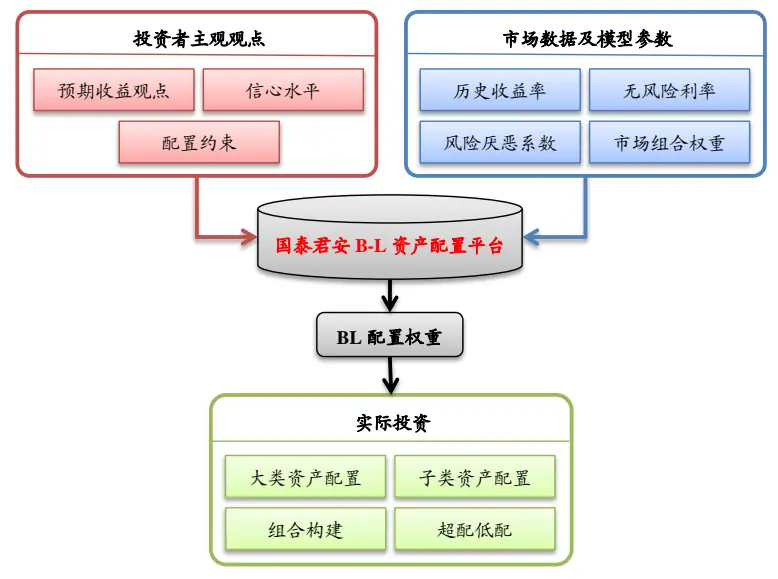
数据来源：国泰君安证券研究

## 2. 国泰君安 B-L资产配置平台功能介绍

为了帮助投资者能够更方便地使用B-L模型对资产进行配置，我们开发了国泰君安 B-L 资产配置平台。

该平台界面包含有行情数据导入、无风险利率设置、计算参数设置、观点设置、约束设置、计算、结果比较等几大功能模块。通过依次输入的方法，最终在“计算”结果中获得所需的权重配置。

图 2 国泰君安 B-L资产配置平台界面
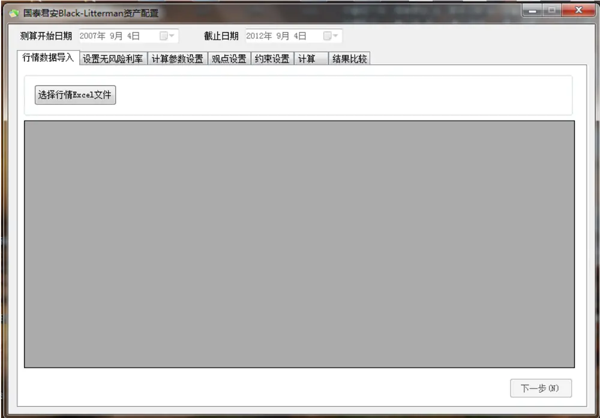
数据来源：国泰君安证券研究

## 3. 国泰君安 B-L资产配置平台使用说明

## 3.1. 数据的准备与输入

由于 Wind 资讯在国内股票研究领域使用最为广泛，因此我们的数据提取介绍以 Wind 为例。如果需要向国泰君安 B-L 配置程序导入其他数据源中的数据，则需要注意导入数据的格式。本文的附录中我们附上每份导入数据的基本格式以供参考。

## 3.1.1. 导入历史收益率数据

由于 B-L 模型是在市场均衡组合的基础上利用主观观点对配置进行修正，在计算各项资产的协方差的时候须用到资产的历史收益率，因此在配置过程中必须输入各项资产的历史收益率数据。具体步骤如下：

首先，在 Wind 的股票数据行情序列窗口中选取需要配置的资产类别，此处我们以“行业”配置为例，导出行业指数的历史日收益率为 Excel 文件。

图 3 在 Wind中导出行业历史收益率数据
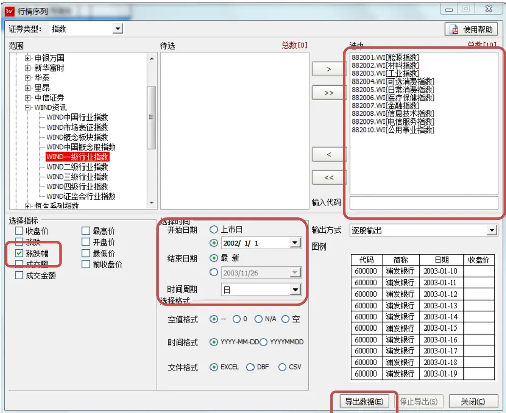
数据来源：国泰君安证券研究，Wind
导出的行业收益率序列数据格式可以参见附录中的表 1。

然后，将Excel数据导入到“国泰君安B-L资产配置”程序中。单击“行情数据导入”选项卡，并且点击“选择行情Excel文件”按钮，在弹出的窗口中选择上一步中导出的 Excel数据即可。

图 4 国泰君安 B-L资产配置平台——导入各行业历史收益率数据

| 日期 | 采掘 | 餐饮旅游 | 电子 | 房地产 | 纺织服装 | 公用事业 |
| --- | --- | --- | --- | --- | --- | --- |
| 2002-01-04 | -2.41% | -1.40% | -1.89% | -1.64% | -1.72% | -2.05% |
| 2002-01-07 | -1.05% | -0.96% | -1.83% | -1.14% | -1.35% | -1.12% |
| 2002-01-08 | -1.50% | -0.91% | -0.91% | -0.83% | -0.62% | -1.01% |
| 2002-01-09 | -1.80% | -1.40% | -1.66% | -1.93% | -2.30% | -1.72% |
| 2002-01-10 | 1.54% | 0.39% | 1.18% | 0.94% | 1.06% | 1.01% |
| 2002-01-11 | -2.53% | -2.77% | -2.99% | -2.59% | -2.36% | -2.48% |
| 2002-01-14 | -2.00% | -3.28% | -4.66% | -3.88% | -3.29% | -3.07% |
| 2002-01-15 | -1.20% | -2.45% | -2.51% | -2.11% | -1.54% | -1.43% |
| 2002-01-16 | 1.24% | 0.94% | 1.19% | 1.22% | 1.29% | 1.58% |
| 2002-01-17 | -5.05% | -5.19% | -5.01% | -4.96% | -4.30% | -4.41% |
| 2002-01-18 | -0.22% | -1.48% | -0.58% | -1.21% | -0.87% | -0.09% |
| 2002-01-21 | -3.26% | -4.39% | -3.94% | -4.58% | -4.67% | -3.64% |
| 2002-01-22 | 0.87% | -0.81% | 0.93% | -1.04% | -1.31% | -0.12% |

数据来源：国泰君安证券研究

可以在程序窗口中看到导入的收益率序列数据，其中，行代表日期，列代表行业。

最后，需要在界面上方选择历史数据测算的始末时间，若不进行设置，则默认使用前面导入的所有历史收益率进行计算。例如，假设当前的配置时点为 2010 年 12 月 31 日，那么，如若设置测算开始日期为2006 年 1 月 4 日，截止日期为 2010 年 12 月 31 日，则表示：行业协方差矩阵是用 2006.1.4 至 2010.12.31 的行业历史日收益率序列计算得到的。我们建议使用过去5年的行业历史收益率序列，能保证计算得到的行业协方差矩阵不会受短期行业波动所影响。

## 3.1.2. 设置无风险利率

由于 B-L 模型中使用的收益率均指超额收益率，因此，有必要将历史的市场无风险利率输入至程序中，以便计算每个行业历史相对于无风险利率的超额收益率。

我们使用一年定期存款利率作为市场无风险利率。具体数据采自 Wind的EDB模块，指标项为“定期存款利率:1年(整存整取)”。数据格式可以参见本文附录中的表 2。需要注意的是：导入的数据条目均为年利率，B-L 配置程序会自动将其转化为名义日利率。

国泰君安 B-L 资产配置程序会自动导入程序目录下名为“一年定存利率.xls”的 Excel 文件中的无风险利率数据。另外，用户也可以选择自行导入无风险利率数据。具体操作步骤：选取平台界面中的“设置无风险利率”选项卡（或者点击下一步按钮切换至该选项卡），点击“选择无风险利率数据”按钮，在弹出的对话框中选择包含无风险利率数据的文件，并按“确定”进行导入。

图 5 国泰君安 B-L资产配置平台——导入市场无风险利率
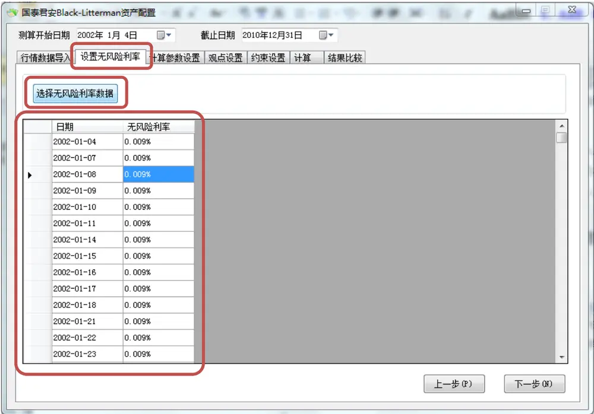
数据来源：国泰君安证券研究

无风险利率导入完成后，可以看到在界面的数据框中显示对应的每日无风险日利率。

## 3.1.3. 设置风险厌恶系数

风险厌恶系数 λ表征的是投资者对于风险的容忍程度。风险厌恶系数的值越大，表明投资者对于风险越无法容忍，而值越小，表明投资者偏好风险。在B-L模型中，风险厌恶系数也是一个较为重要的输入参数，直接影响到配置的结果。

国泰君安B-L资产配置程序中，用户可以通过两种方式输入风险厌恶系数：直接输入风险厌恶系数，或是输入市场的历史收益率序列，由公式 $\lambda=\left(E\left(r\right)-r_{_{f}}\right)/\sigma_{_{m}}^{^{2}}$ 计算得到风险厌恶系数 （Satchell and Scowroft2000，Best and Grauer 1985 文中给出）。

两种方法的具体操作步骤分别如下：

1. 直接输入：切换至“计算参数设置”选项卡后，直接在上方文本框内输入风险厌恶系数的值。

图 6 国泰君安 B-L资产配置平台——设置风险厌恶系数
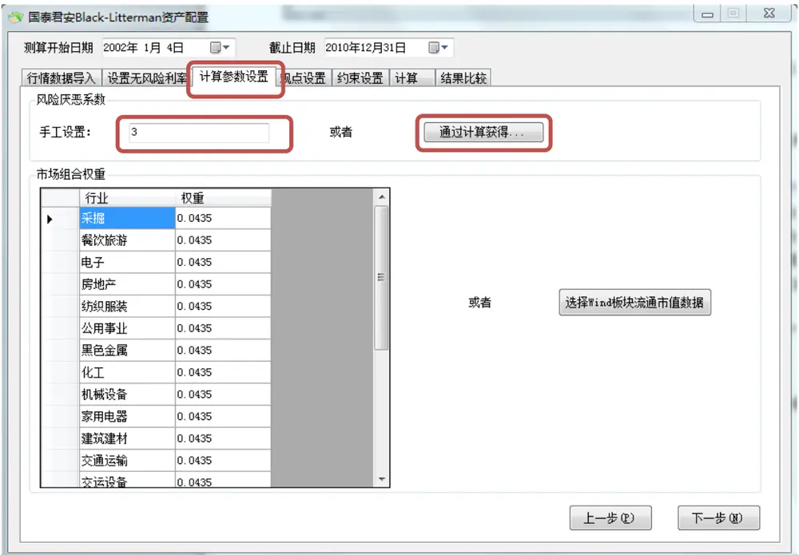
数据来源：国泰君安证券研究

2. 通过公式计算：切换至“计算参数设置”选项卡，点击上方的“通过计算获得…”按钮。弹出如下所示窗口：

图 7 国泰君安 B-L资产配置平台——通过公式计算风险厌恶系数
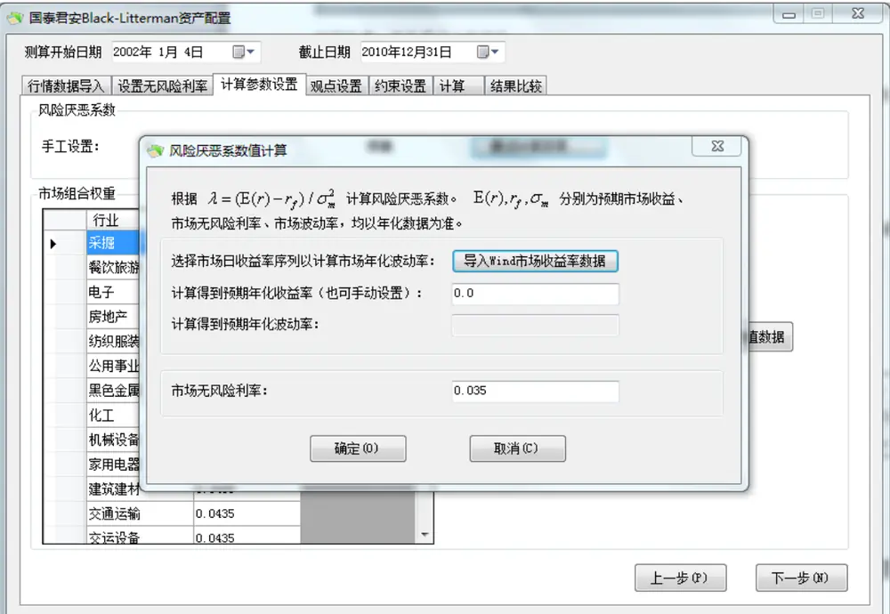
数据来源：国泰君安证券研究

在该窗口中点击“导入Wind市场收益率数据”按钮，选择由Wind导出的市场收益率数据（需要注意的是：市场收益率数据为指数日收益率，程序会自动将其转化为年化收益率；数据的具体格式参见附录表格 3），随后，在该窗口下方手工设置市场年化无风险利率（默认为年化3.5%）。点击“确定”返回主窗口。从而，主窗口中的文本框中会显示根据公式 $\lambda=\left(E\left(r\right)-r_{f}\right)/\sigma_{m}^{2}$ 计算得到的风险厌恶系数。

## 3.1.4. 设置市场组合权重

B-L 模型中，后验收益向量是在先验的市场隐含均衡收益向量的基础上，加入投资者观点得到的。在没有主观观点的前提下，均衡收益应是市场中性立场的收益，所以可以使用市值逆优化方法求得均衡收益。

因此，我们可以在国泰君安B-L资产配置程序中需要输入配置时点的各行业的市值权重作为模型的初始组合权重。

如同风险厌恶系数的输入，每个行业的初始权重可以通过手工或导入数据的方式。在窗口左方权重列中点击数字即能进行手工输入；而点击右方“选择 Wind 板块流通市值数据”则能进行数据导入。

图 8 国泰君安 B-L资产配置平台——输入市场组合权重
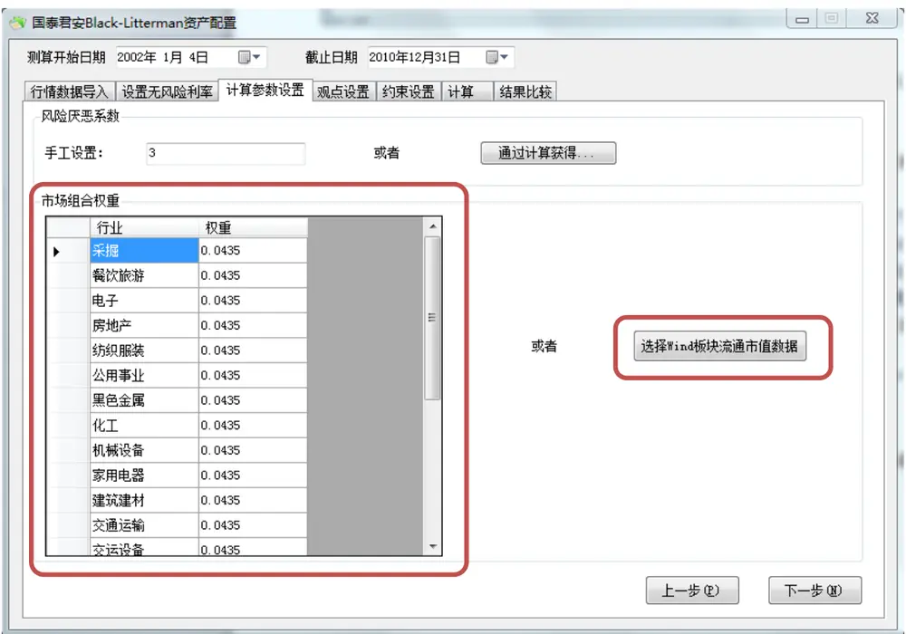
数据来源：国泰君安证券研究

首先，每个行业的股票流通市值总和可以在Wind中进行导出。在Wind菜单中依次选择“股票”、“板块分析”、“板块数据浏览器”，在随后出现窗口左下方列表选择行业，左上方选择“估值指标->流通 A 股市值（合计）”，并在随后弹出对话框中选取进行资产配置的日期，最后点击上方“导出到 Excel”对数据进行导出。具体的流通市值数据格式可以参见附录中表 4。

图 9 国泰君安 B-L资产配置平台——在 Wind中导出行业流通市值数据

| Wind资讯金融终端V2012 -[板块数据浏览器] |  |  |  |  |  |  |  |  |  |  |  |
| --- | --- | --- | --- | --- | --- | --- | --- | --- | --- | --- | --- |
| 文件 股票 债券商品外汇基金 指数新闻 宏观 资管 帮助 WP 60 [I] F9 F6 WEI CNS HKS |  |  |  |  |  |  |  |  |  |  |  |
| 板块数据 创监盟 板块财务纵比 板块行情序列 |  |  |  |  |  |  |  |  |  |  |  |
| D提取数 |  | 导出到Excel 我模饮 | 板块对比 |  | 新建模板 品 |  | 保存模板 删除板块 |  | 删除指标 修改参数 | 隐藏标题参数 | 板块 |
| 待选指标 | vina模饮 预测市盈率(算术平均) 预测PEG(算术平均) 市净率(整体法) | 预测市盈率-未来12月(算术平均) |  | 还原 |  | 展开 ☑一级 流通A股市值(合计) |  | 二级 三级 四级 五级 |  |  |  |
| 当日总市值(合计) 当日总市值(算术平均) 总市值(合计) | 市净率(整体法，最新) 市净率(算术平均，最新) 市净率(算术平均) 市现率(整体法) 市现率(算术平均) 市销率(整体法) 市销率(算术平均) |  | 板块名称 |  |  | [交易日期2010-12-31 |  |  |  |  |  |
|  |  |  | WIND能源 |  | [单位]元 3,478,698,400,637,56 |  |  |  |  |  |  |
|  |  |  | WIND材料 | 2,408,931,691,147.92 |  |  |  |  |  |  |  |
|  |  |  | WIND工业 | 3,246,443,232,519,28 |  |  |  |  |  |  |  |
|  |  |  | WIND可选消费 | 1,756,363,636,355.93 |  |  |  |  |  |  |  |
|  |  |  | WIND日常消费 | 1,194,672,982,049.92 |  |  |  |  |  |  |  |
|  |  |  | WIND医疗保健 | 787,690,430,092.78 5,160,127,258,635.82 |  |  |  |  |  |  |  |
| WIND金融 WIND信息技术 | 969,398,386,969,32 |  |  |  |  |  |  |  |  |  |  |
| 总市值(算术平均) 总市值-证监会算法(合计) 总市值-证监会具法(具术平均) | WIND电信服务 |  | 131,666,937,343.96 |  |  |  |  |  |  |  |  |
|  | WIND公用事业 |  | 505,352,183,937.47 |  |  |  |  |  |  |  |  |
| 流通A股市值(合计) 流通A股市值(算术平 流通B股市值(合计) |  |  |  |  |  |  |  |  |  |  |  |
| 流通B股市值(算术平均) 风险指标 ·证监会统计指标 |  |  |  |  |  |  |  |  |  |  |  |
| <按拼音查找> Y |  |  |  |  |  |  |  |  |  |  |  |
| 待选板块 |  |  |  |  |  |  |  |  |  |  |  |
| 田·市场类 ·证监会行业类 |  |  |  |  |  |  |  |  |  |  |  |
| + GICS行业类 WIND行业类 WIND能源 ·WIND材料 |  | 三 |  |  |  |  |  |  |  |  |  |
| ·WIND工业 WIND可选消费 WIND日常消费 WIND医疗保健 ·WIND金融 ·WIND信息技术 ·WIND电信服务 |  |  |  |  |  |  |  |  |  |  |  |
| ·WIND公用事业 申银万国行业类 使用历史成分 |  | 新建模板1 |  |  |  |  |  |  |  |  |  |

数据来源：国泰君安证券研究，Wind

其次，点击计算参数设置页面中的“选择 Wind 板块流通市值数据”按钮，选择第一步中生成的市值数据 Excel 文件，程序会自动依据行业流通市值数据为各行业分配权重，导入的结果可以在界面左方列表中查看。

## 3.1.5. 设置主观观点及信心水平

主观观点是对市场均衡配置的修正，因此在B-L模型的应用中起到了至关重要的作用。观点正确，模型的配置结果就能以较低风险获取超额收益。

我们在国泰君安B-L资产配置平台中提供了多种主观观点设置方法，既可以输入对某项资产的绝对收益观点，又可以输入资产之间的相对收益观点，大大提高了程序的适用性。

图 10国泰君安B-L资产配置平台——设置主观观点
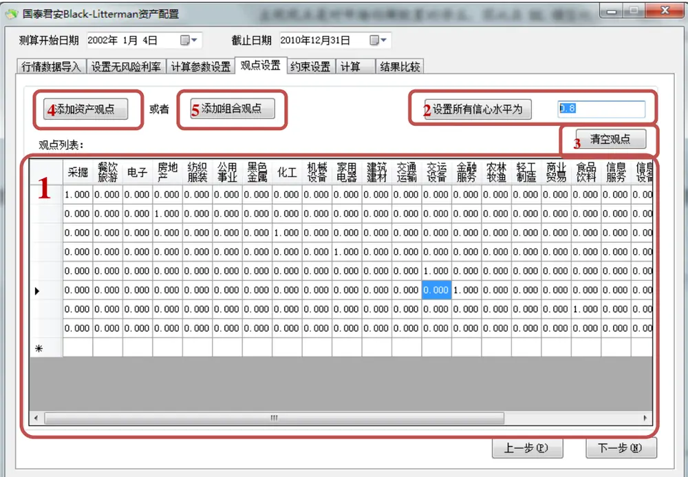
数据来源：国泰君安证券研究

上图中红框1内显示的是用户设置的主观观点列表。其中每一行代表一个观点，前N-2列表示观点中的行业权重，也就是B-L模型中的观点矩阵 P，倒数第二列为预期收益向量 Q，最后一列为每个观点的信心水平LC（取值为 0~1），P、Q、LC 的具体定义请参加系列报告第一篇《资产配置之 B-L 模型Ⅰ：理论篇》。投资者亦可以直接在观点列表框中进行主观观点的输入。

红框 2中的按钮可以为所有的主观观点设置同样的信心水平。红框 3中按钮“清空观点”则用来清除观点列表中的所有主观观点。按钮 4 可以为每一个行业添加绝对预期收益观点，而按钮5则用来添加组合预期收益观点（例如一个行业相对另一个行业有 x%的超额收益，或者两个行业相对于另外三个行业有 x%的超额收益等）。

图 11国泰君安 B-L资产配置平台——添加单项资产观点
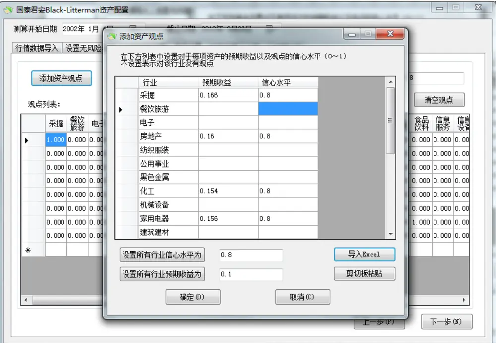
数据来源：国泰君安证券研究

1. 添加单项资产观点：在列表框中点击单元格，可以直接对行业进行具体的主观观点以及信心水平的设置，另外也可以通过导入 Excel 或者剪切板粘贴的方式导入观点数据。需要注意的是，并不需要对每个行业都设置观点，没有主观观点的可以在列表中留空。

图 12国泰君安B-L资产配置平台——添加组合观点
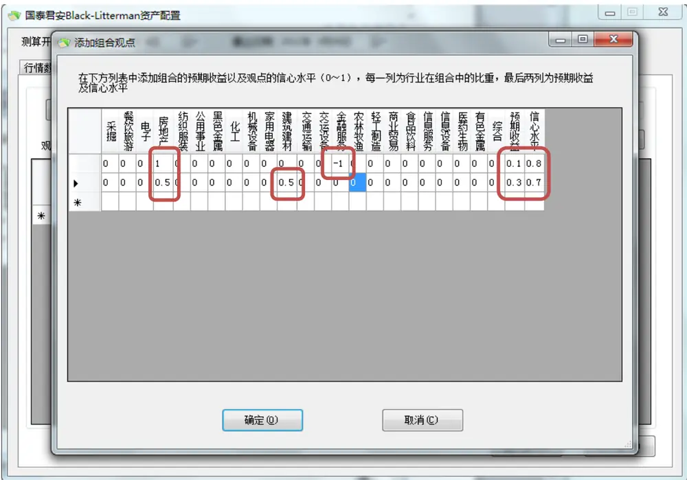
数据来源：国泰君安证券研究

2. 组合观点的设置：所谓的组合观点，是指对一系列行业的总体预期收益的观点。可以在一个观点中设置同时配置多个行业的收益，例如：认为地产与建筑建材在未来一年总共会获得30%的超额收益；也可以设置一个行业相对于另一个行业的超额收益，例如：未来一年地产会跑赢银行 10%。这两个例子的具体观点设置方法可以参考上图。

在设置主观观点收益需要极其注意的是：由于 B-L 模型自始至终使用的都是超额收益，因此，向程序输入的预期收益率向量也必须为扣除市场无风险利率后的超额收益。

最终设置完毕主观观点后的界面如下图所示：

图 13国泰君安B-L资产配置平台——显示设置完毕的主观观点

|  | 墨化工 |  | 机器建ii乖墅 |  |  |  |  |  | 农林新商业贸易信牧渔良 |  |  |  |  | 复物属综合预期收益. |  |  |  |  |  |
| --- | --- | --- | --- | --- | --- | --- | --- | --- | --- | --- | --- | --- | --- | --- | --- | --- | --- | --- | --- |
| 1 | 0.000 | 0.000 | 0.000 | 0.000 | 0.000 | 0.000 | 0.000 | 0.000 | 0.000 | 0.000 | 0.000 | 0.000 | 0.000 | 0.000 | 0.000 | 0.000 | 0.000 | 16.60% | 80.00% |
|  | 0.000 | 0.000 | 0.000 | 0.000 | 0.000 | 0.000 | 0.000 | 0.000 | 0.000 | 0.000 | 0.000 | 0.000 | 0.000 | 0.000 | 0.000 | 0.000 | 0.000 | 16.00% | 80.00% |
|  | 0.000 | 1.000 | 0.000 | 0.000 | 0.000 | 0.000 | 0.000 | 0.000 | 0.000 | 0.000 | 0.000 | 0.000 | 0.000 | 0.000 | 0.000 | 0.000 | 0.000 | 15.40% | 80.00% |
|  | 0.000 | 0.000 | 0.000 | 1.000 | 0.000 | 0.000 | 0.000 | 0.000 | 0.000 | 0.000 | 0.000 | 0.000 | 0.000 | 0.000 | 0.000 | 0.000 | 0.000 | 15.60% | 80.00% |
|  | 0.000 | 0.000 | 0.000 | 0.000 | 0.000 | 0.000 | 1.000 | 0.000 | 0.000 | 0.000 | 0.000 | 0.000 | 0.000 | 0.000 | 0.000 | 0.000 | 0.000 | 15.60% | 80.00% |
|  | 0.000 | 0.000 | 0.000 | 0.000 | 0.000 | 0.000 | 0.000 | 1.000 | 0.000 | 0.000 | 0.000 | 0.000 | 0.000 | 0.000 | 0.000 | 0.000 | 0.000 | 18.40% | 80.00% |
|  | 0.000 | 0.000 | 0.000 | 0.000 | 0.000 | 0.000 | 0.000 | 0.000 | 0.000 | 0.000 | 0.000 | 1.000 | 0.000 | 0.000 | 0.000 | 0.000 | 0.000 | 21.00% | 80.00% |
|  | 0.000 | 0.000 | 0.000 | 0.000 | 0.000 | 0.000 | 0.000 | 0.000 | 0.000 | 0.000 | 0.000 | 0.000 | 0.000 | 0.000 | 1.000 | 0.000 | 0.000 | 16.70% | 80.00% |
|  | 0.000 | 0.000 | 0.000 | 0.000 | 0.000 | 0.000 | 0.000 | -1.000 | 0.000 | 0.000 | 0.000 | 0.000 | 0.000 | 0.000 | 0.000 | 0.000 | 0.000 | 10.00% | 80.00% |
|  | 0.000 | 0.000 | 0.000 | 0.000 | 0.000 | 0.000 | 0.000 | 1.000 | 0.000 | 0.000 | 0.000 | 0.000 | 0.000 | 0.000 | 0.000 | 0.000 | 0.000 | 30.00% | 80.00% |
| 米 |  |  |  |  |  |  |  |  |  |  |  |  |  |  |  |  |  |  |  |

数据来源：国泰君安证券研究

## 3.1.6. 设置约束条件

在实际的B-L模型使用过程中，投资者可能会对最终的配置结果有一定的仓位要求。例如：

1. 投资者可能会要求最终配置结果必须满仓，也就是所有行业权重之和为 1；

2. 最终配置结果没有仓位限制，也就是没有行业权重之和的限制，这种情况下，B-L 模型会根据主观观点设置，自动地在对市场看好时调高仓位，在对市场看空时调低仓位；

3. 对单个行业有仓位限制，例如对房地产业有 20%的仓位限制；

4. 是否能够卖空：随着转融通的逐步放开，机构投资者也开始关注如何在组合中引入做空行业，以期在做空中获得超额收益。本程序也提供了选项，使用户能够在程序中设置是否引入卖空机制。

5. 最大风险的设置：这里组合风险值的定义为组合的预期方差。之后我们还会推出多种形式的风险定义，例如 VAR、最大回撤等。

图 14国泰君安B-L资产配置平台——设置约束条件
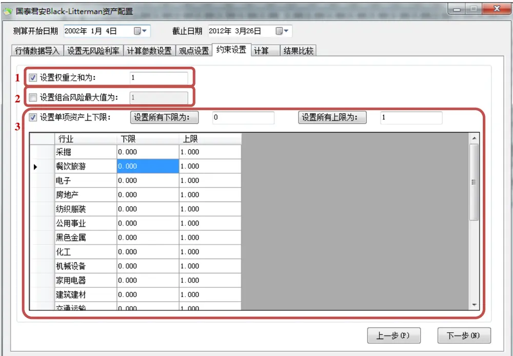
数据来源：国泰君安证券研究

在红框 1 中，可以点选是否需要对行业权重之和进行约束；在红框 2中，可以设置组合的最大风险值，而在红框3中，则可以点击列表中的单元格进行单项行业的上下限设置。

针对前面 5种情况，我们分别列举如何进行设置：

1. 满仓：在框1中点选设置权重为 1

2. 无总体仓位限制：取消框 1 中的选择

3. 有行业仓位限制：在框 3 中进行设置

4. 有卖空：设置每个行业的仓位下限为一个负数，表示最大做空比例，如-1 表示最大空头头寸为 100%。

5. 风险限制：在框 2中进行设置

## 3.2. B-L 配置结果的显示与比较分析

在平台界面的计算页面，可以看到最终的B-L配置结果——包括具体的每个行业的B-L配置权重、B-L组合预期收益与B-L 组合方差，以及计算的中间过程——包括隐含均衡收益向量与结合了主观观点得到的后验收益向量。

图 15国泰君安B-L资产配置平台——计算
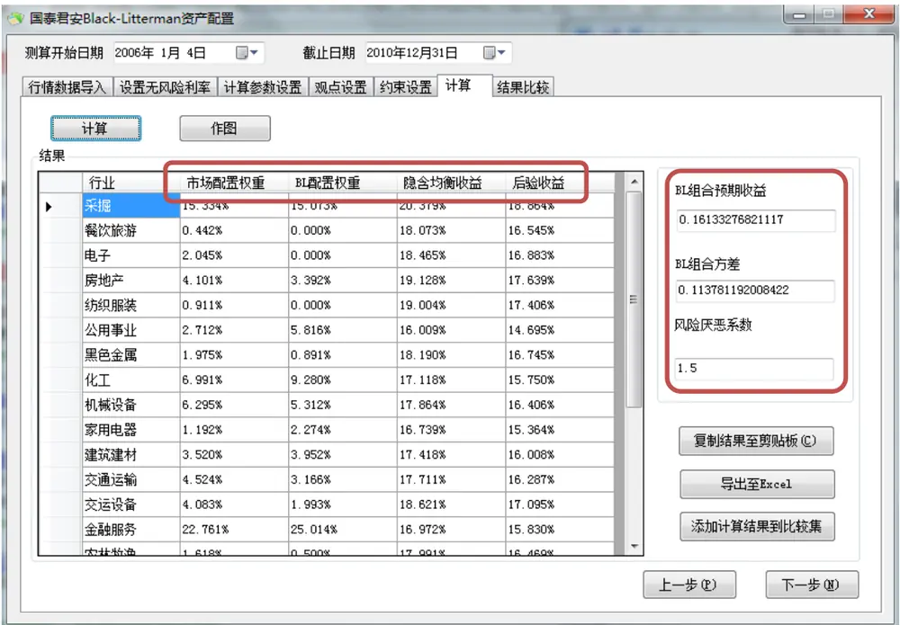
数据来源：国泰君安证券研究

对于得到的B-L配置结果，可以作进一步分析。例如，点击“作图”，画出每个行业权重的直方图，并且与初始给定的市场配置权重相比：

图 16国泰君安B-L资产配置平台——B-L配置权重与市场配置权重的比较
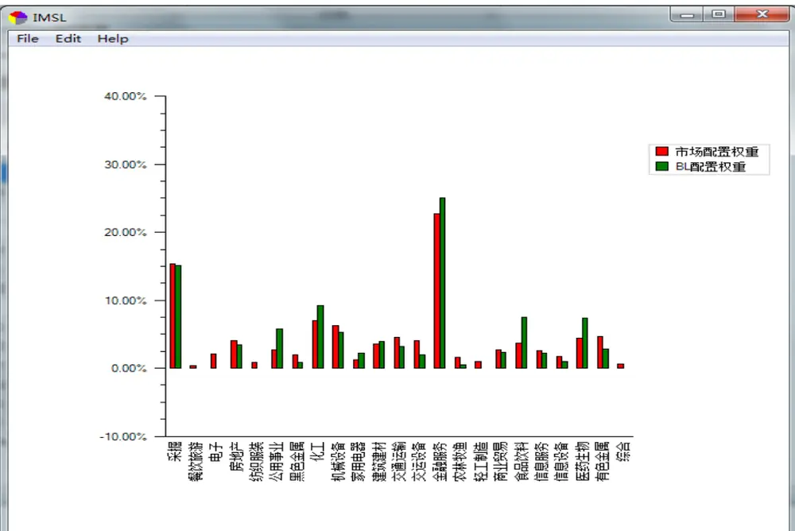
数据来源：国泰君安证券研究

在此图中，可以较为直观地比较B-L模型在市场配置的基础上，对行业做了哪些高配/低配，从而分析主观观点对于配置结果的影响。

另外，也可以在界面上直接点击“复制结果至剪贴板”按钮，并在其他数据处理软件中进行粘贴，或者直接点击“导出至 Excel”将配置结果导至Excel中，以便进一步分析。

B-L 模型的中间过程对于使用者而言是一个黑盒，尽管我们在 B-L 系列报告的前几篇中已经较为全面地分析了参数、主观观点、约束条件的设置对于配置结果的影响。但B-L模型的使用者可能会对不同条件下的配置结果进行分析比较。因此，我们在程序中向广大使用者提供了一种简便的分析比较方法：只需要在每次计算完成后，点击“添加计算结果到比较集”即可以将本次的 B-L 配置结果进行保存。甚至，在弹出的对话框中，可以为本次的 B-L 配置结果进行命名。

在“结果比较”页面，可以对多次保存的计算结果集进行比较分析。

图 17 国泰君安B-L资产配置平台——结果比较
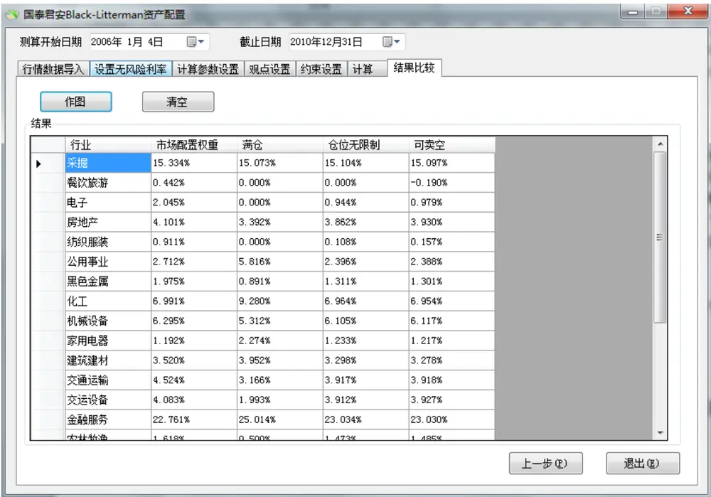
数据来源：国泰君安证券研究

图 18国泰君安B-L资产配置平台——多种配置结果权重的作图比较
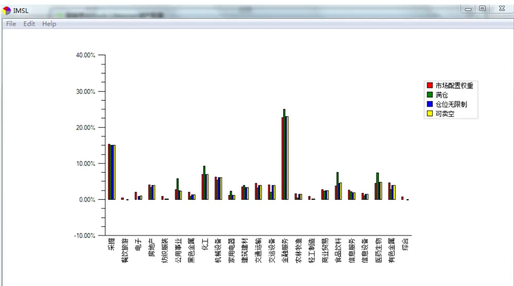
数据来源：国泰君安证券研究

## 附录 导入数据格式示例

表 1Wind导出行业历史收益率序列示例

|  | 801020.SI | 801210.SI | 801080.SI | 801180.SI | 801130.SI | 801160.SI |
| --- | --- | --- | --- | --- | --- | --- |
|  | 采掘 | 餐饮旅游 | 电子 | 房地产 | 纺织服装 | 公用事业 |
|  | 涨跌幅(%) | 涨跌幅(%) | 涨跌幅(%) | 涨跌幅(%) | 涨跌幅(%) | 涨跌幅(%) |
| 2002-01-04 | -2.412 | -1.3987 | -1.8943 | -1.6396 | -1.7208 | -2.0466 |
| 2002-01-07 | -1.0461 | -0.9589 | -1.8287 | -1.1414 | -1.3515 | -1.1193 |
| 2002-01-08 | -1.5038 | -0.9091 | -0.9131 | -0.8322 | -0.6217 | -1.0114 |
| 2002-01-09 | -1.8032 | -1.3956 | -1.6586 | -1.9301 | -2.3017 | -1.7222 |
| 2002-01-10 | 1.5415 | 0.3901 | 1.1757 | 0.9355 | 1.0589 | 1.0076 |
| 2002-01-11 | -2.5295 | -2.7708 | -2.9858 | -2.5894 | -2.3622 | -2.482 |
| 2002-01-14 | -2.0015 | -3.2846 | -4.6558 | -3.8758 | -3.2931 | -3.0734 |
| 2002-01-15 | -1.1979 | -2.452 | -2.5084 | -2.1088 | -1.5442 | -1.4268 |
| 2002-01-16 | 1.2429 | 0.9422 | 1.1937 | 1.2167 | 1.2859 | 1.5838 |
| 2002-01-17 | -5.0468 | -5.192 | -5.0143 | -4.9593 | -4.2952 | -4.4069 |

数据来源：国泰君安证券研究，Wind

表 2 市场无风险利率数据格式示例

| 指标名称 | 定期存款利率：1年(整存整取) |
| --- | --- |
| 频率 | 日 |
| 2007-03-18 | 2.79 |
| 2007-05-19 | 3.06 |
| 2007-07-21 | 3.33 |
| 2007-08-22 | 3.60 |
| 2007-09-15 | 3.87 |
| 2007-12-21 | 4.14 |
| 2008-10-09 | 3.87 |
| 2008-10-30 | 3.60 |
| 2008-11-27 | 2.52 |
| 2008-12-23 | 2.25 |
| 2010-10-20 | 2.50 |
| 2010-12-26 | 2.75 |
| 2011-02-09 | 3.00 |
| 2011-04-06 | 3.25 |
| 2011-07-07 | 3.50 |

数据来源：国泰君安证券研究，Wind

表 3 市场收益率序列格式示例（用来计算市场风险厌恶系数）

| 000001.SH |
| --- |
| 上证综合指数 |
| 涨跌幅(%) |
| 2011-12-09 -0.6245 |
| 2011-12-12 -1.0247 |
| 2011-12-13 -1.8745 |

请务必阅读正文之后的免责条款部分

| 2011-12-14 | -0.8923 |
| --- | --- |
| 2011-12-15 -2.1373 |  |
| 2011-12-16 | 2.015 |
| 2011-12-19 | -0.2969 |
| 2011-12-20 | -0.1039 |
| 2011-12-21 | -1.1184 |
| 2011-12-22 | -0.2214 |
| 2011-12-23 | 0.8456 |
| 2011-12-26 | -0.6656 |
| 2011-12-27 | -1.0915 |
| 2011-12-28 | 0.1758 |
| 2011-12-29 | 0.1635 |
| 2011-12-30 | 1.1896 |

数据来源：国泰君安证券研究，Wind

表 4 行业流通市值数据格式示例

| 板块名称 | 流通 A 股市值(合计) [交易日期]2010-12-31 [单位] 元 |
| --- | --- |
| SW 农林牧渔 | 3.0856E+11 |
| SW 采掘 | 2.92398E+12 |
| SW化工 | 1.33305E+12 |
| SW黑色金属 | 3.76698E+11 |
| SW有色金属 | 8.91009E+11 |
| SW 建筑建材 | 6.71185E+11 |
| SW机械设备 | 1.20042E+12 |
| SW 电子 | 3.89897E+11 |
| SW 交运设备 | 7.7864E+11 |
| SW信息设备 | 3.36153E+11 |
| SW家用电器 | 2.27355E+11 |
| SW食品饮料 | 7.16232E+11 |
| SW 纺织服装 | 1.73695E+11 |
| SW轻工制造 | 1.79665E+11 |
| SW 医药生物 | 8.49201E+11 |
| SW 公用事业 | 5.17138E+11 |
| SW 交通运输 | 8.6264E+11 |
| SW 房地产 | 7.82082E+11 |
| SW 金融服务 | 4.34034E+12 |
| SW商业贸易 | 5.12433E+11 |
| SW 餐饮旅游 | 84378369514 |
| SW信息服务 | 4.84468E+11 |
| SW 综合 | 1.29699E+11 |

数据来源：国泰君安证券研究，Wind

## 本公司具有中国证监会核准的证券投资咨询业务资格

## 分析师声明

作者具有中国证券业协会授予的证券投资咨询执业资格或相当的专业胜任能力，保证报告所采用的数据均来自合规渠道，分析逻辑基于作者的职业理解，本报告清晰准确地反映了作者的研究观点，力求独立、客观和公正，结论不受任何第三方的授意或影响，特此声明。

## 免责声明

本报告仅供国泰君安证券股份有限公司（以下简称“本公司”）的客户使用。本公司不会因接收人收到本报告而视其为本公司的当然客户。本报告仅在相关法律许可的情况下发放，并仅为提供信息而发放，概不构成任何广告。

本报告的信息来源于已公开的资料，本公司对该等信息的准确性、完整性或可靠性不作任何保证。本报告所载的资料、意见及推测仅反映本公司于发布本报告当日的判断，本报告所指的证券或投资标的的价格、价值及投资收入可升可跌。过往表现不应作为日后的表现依据。在不同时期，本公司可发出与本报告所载资料、意见及推测不一致的报告。本公司不保证本报告所含信息保持在最新状态。同时，本公司对本报告所含信息可在不发出通知的情形下做出修改，投资者应当自行关注相应的更新或修改。

本报告中所指的投资及服务可能不适合个别客户，不构成客户私人咨询建议。在任何情况下，本报告中的信息或所表述的意见均不构成对任何人的投资建议。在任何情况下，本公司、本公司员工或者关联机构不承诺投资者一定获利，不与投资者分享投资收益，也不对任何人因使用本报告中的任何内容所引致的任何损失负任何责任。投资者务必注意，其据此做出的任何投资决策与本公司、本公司员工或者关联机构无关。

本公司利用信息隔离墙控制内部一个或多个领域、部门或关联机构之间的信息流动。因此，投资者应注意，在法律许可的情况下，本公司及其所属关联机构可能会持有报告中提到的公司所发行的证券或期权并进行证券或期权交易，也可能为这些公司提供或者争取提供投资银行、财务顾问或者金融产品等相关服务。在法律许可的情况下，本公司的员工可能担任本报告所提到的公司的董事。

市场有风险，投资需谨慎。投资者不应将本报告为作出投资决策的惟一参考因素，亦不应认为本报告可以取代自己的判断。在决定投资前，如有需要，投资者务必向专业人士咨询并谨慎决策。

本报告版权仅为本公司所有，未经书面许可，任何机构和个人不得以任何形式翻版、复制、发表或引用。如征得本公司同意进行引用、刊发的，需在允许的范围内使用，并注明出处为“国泰君安证券研究”，且不得对本报告进行任何有悖原意的引用、删节和修改。

若本公司以外的其他机构（以下简称“该机构”）发送本报告，则由该机构独自为此发送行为负责。通过此途径获得本报告的投资者应自行联系该机构以要求获悉更详细信息或进而交易本报告中提及的证券。本报告不构成本公司向该机构之客户提供的投资建议，本公司、本公司员工或者关联机构亦不为该机构之客户因使用本报告或报告所载内容引起的任何损失承担任何责任。

## 评级说明

## 1.投资建议的比较标准

投资评级分为股票评级和行业评级。

以报告发布后的12个月内的市场表现为比较标准，报告发布日后的12个月内的公司股价（或行业指数）的涨跌幅相对同期的沪深300指数涨跌幅为基准。

## 2.投资建议的评级标准

报告发布日后的 12 个月内的公司股价（或行业指数）的涨跌幅相对同期的沪深300指数的涨跌幅。

|  | 评级 说明 |  |
| --- | --- | --- |
| 股票投资评级 | 增持 | 相对沪深300指数涨幅15%以上 |
|  | 谨慎增持 | 相对沪深300指数涨幅介于5%～15%之间 |
|  | 中性 | 相对沪深300指数涨幅介于-5%～5% |
|  | 减持 | 相对沪深 300指数下跌 5%以上 |
| 行业投资评级 | 增持 | 明显强于沪深 300 指数 |
|  | 中性 | 基本与沪深300指数持平 |
|  | 减持 | 明显弱于沪深300指数 |

## 国泰君安证券研究

|  | 上海 | 深圳 | 北京 |
| --- | --- | --- | --- |
| 地址 | 上海市浦东新区银城中路168号上海 | 深圳市福田区益田路 6009号新世界 | 北京市西城区金融大街28 号盈泰中 心2号楼10层 |
| 邮编 | 银行大厦29层 200120 | 商务中心34层 518026 | 100140 |
| 电话 | (021)38676666 | (0755)23976888 | (010)59312799 |
|  | E-mail: gtjaresearch@gtjas.com |  |  |