# B-L 年度行业配臵 连续五年正超额收益

## ——数量化系列研究之二十六

杨喆（分析师）

## 严佳炜（分析师）

8 021-38676442

## 蒋瑛琨（分析师）

yangzhe@gtjas.com

021-38674812

021-38676710

证书编号 S0880511010020

yanjiawei008776@gtjas.com

S0880512110001

jiangyingkun@gtjas.com

S0880511010023

## 本报告导读：

本报告对 B-L 模型的参数影响进行了全面分析，并对 A 股市场进行了最新的行业配臵实证研究，以便投资者能够更深入全面地了解该模型的配臵效果。

## 摘要：

[Table_Summary]• 本报告是资产配臵之 B-L 模型系列的第五篇报告，是该模型在国内 A 股市场应用的最新结果，旨在让投资者更深入全面地了解B-L 模型的参数影响以及实证效果。

报告分别从主观观点收益、信心水平、约束条件、调仓频率等多个因素着手，研究这些因素的变化对 B-L 组合配臵的影响，以及对 B-L 组合业绩的影响。同时，我们采用 B-L 模型进行了2007-2012年 A股市场行业配臵实证研究。

我们采用了三种观点收益：一致预期 ROE、实际收益和 1/3 一致预期 ROE，其中以“1/3 一致预期 ROE”作为观点收益获得了良好的配臵效果，2007-2011年每年均获得正向超额收益（满仓且无卖空），最多的 2009 年跑赢基准 32.99%，最差的 2010 年跑赢基准1.68%

参数影响：（1）信心水平的影响：信心水平越高，配臵结果越偏向于主观观点。（2）调仓频率的影响：季度调仓的组合业绩仅在2007 与 2009 年牛市好于年度调仓，其余均是年度调仓的组合业绩更好。（3）约束条件的影响：取决于市场环境，例如牛市高仓位占优，熊市低仓位占优。无约束条件情况最有可能获得高收益。有无卖空对结果影响不一。

我们以 2011 年底 1/3 一致预期 ROE为主观观点，给出 2012年度B-L 组合。该组合的约束条件为满仓且无卖空。B-L 模型提示 2012年重仓金融服务、食品饮料、公用事业、采掘、医药生物及化工行业。这六个行业仓位达到 90%，总共配臵十一个行业。其中采掘虽然是重仓，但相对市场权重是低配，因为采掘的市场权重较高。

B-L 模型 2012 年重仓的六个行业中，有五个行业收益排在前 1/2，重仓但低配的采掘行业收益排在后 1/2。

2012 年 B-L 组合截止至 10 月底获得正收益 0.33%，跑赢市场组合 3.93%。并且，B-L 组合跑赢上证综指、沪深 300、中证 500、创业板指、中小板指五个市场重点指数，波动率仅高于上证综指，低于其余四个指数。

蒋瑛琨：（分析师）

电话：021-38676710

邮箱：jiangyingkun@gtjas.com

证书编号：S0880511010023

## 吴天宇：（分析师）

电话：021-38676788

邮箱：wutianyu@gtjas.com

证书编号：S0880511010053

## 何苗：（分析师）

电话：010-59312710

邮箱：hemiao@gtjas.com

证书编号：S0880511010049

## 刘富兵：（分析师）

电话：021-38676673

邮箱：liufubing008481@gtjas.com

证书编号：S0880511010017

## 杨喆：（分析师）

电话：021-38676442

邮箱：yangzhe@gtjas.com

证书编号：S0880511010020

## 严佳炜：（分析师）

电话：021-38674812

邮箱：yanjiawei008776@gtjas.com

证书编号：S0880512110001

## 耿帅军：（研究助理）

电话：010-59312753

邮箱：gengshuaijun@gtjas.com

证书编号：S0880111110128

## 徐康：（研究助理）

电话：021-38674939

邮箱：xukang010849@gtjas.com

证书编号：S0880111090058

## [Table_R相关报告

《国泰君安 B-L资产配臵平台介绍》2012.11.21

本报告包括正文 20 页，图 13 张，表 26 张

## 1. 概述

今年以来，我们在前期对 B-L 模型研究的基础上，推出了更加适合投资者使用的国泰君安 B-L资产配臵平台，旨在为广大机构投资者提供量化资产配臵的新工具。投资经理通过在平台界面中输入相关参数和数据，能够自动、快速获得最终所需的各类资产的权重配臵结果。

本报告是资产配臵之 B-L 模型系列的第五篇报告，是该模型在国内 A股市场应用的最新结果，旨在让投资者更深入全面地了解 B-L 模型的参数影响以及实证效果。

报告分别从信心水平、主观观点收益、约束条件、调仓频率等多个因素着手，研究这些因素的变化对B-L组合配臵的影响，以及对B-L组合业绩的影响。同时，我们采用 B-L模型进行了 2007-2012 年 A股市场行业配臵实证研究。

## 2. B-L 模型剖析——不同参数对结果的影响

## 2.1. 信心水平对结果的影响

从B-L模型的公式上来看，信心水平对于最后配臵结果的影响主要体现在对观点误差矩阵Ω上。当对观点的不确定性越大时，Ω值越大，从而导致新的后验收益向量E( )R 中，主观观点收益比重缩小，最后得出的行业配臵会和市场权重配臵比较接近。

图 1 无约束条件下信心水平对配臵的影响
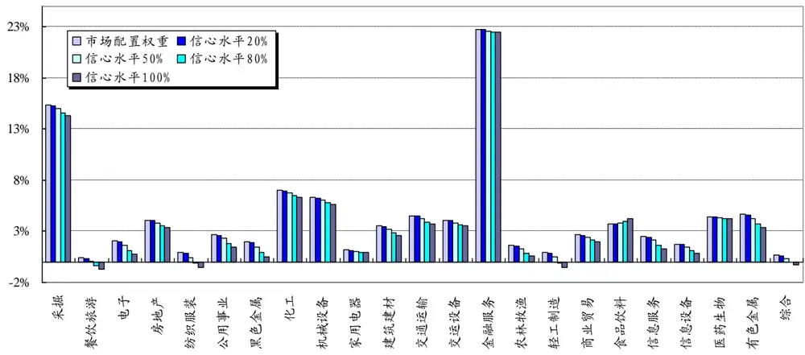
数据来源：国泰君安证券研究
注：以2011年配臵为例

图 2 有约束条件下信心水平对配臵的影响——总权重 1，无卖空
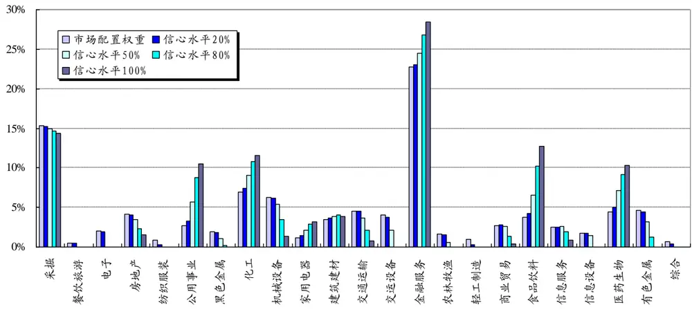
数据来源：国泰君安证券研究
注：以2011年配臵为例

由图 1、图 2 可以看到，无论有没有约束条件，改变信心水平只是对高配/低配的幅度产生影响。信心水平越高，配臵结果越偏向于主观观点。因此在后文我们统一使用 80%的信心水平进行测算。

## 2.2.主观观点收益对结果的影响

我们以 2011 年资产配臵为例，固定约束条件以及信心水平，研究主观观点收益变动对 B-L资产配臵结果有何影响。

我们使用2010年底的由朝阳永续提供的一致预期ROE数据与2011年实际行业指数收益为主观观点收益，设臵80%信心水平以及不同的约束条件，用 B-L模型对申万一级行业配臵进行测算。最后，将得到的 B-L配臵与市值配臵的资产组合进行比较，并加以诠释。

## 2.2.1. 一致预期 ROE 的有效性

我们首先比较一致预期 ROE、实际 ROE 以及实际收益之间的差别。

图 32011 年朝阳永续一致预期 ROE、当年实际 ROE 与当年实际收益的对比
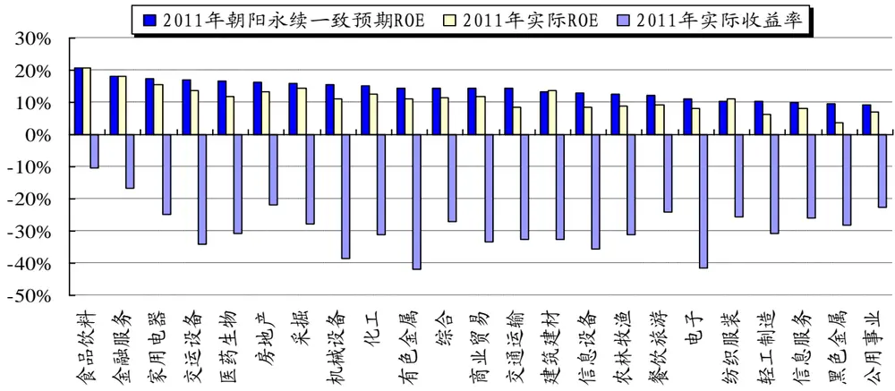
数据来源：国泰君安证券研究，朝阳永续、Wind

表 12011 年一致预期 ROE、实际 ROE、实际收益分别排名前十行业

| 行业 | 2011年一致预期 ROE | 行业 | 2011 年实际 ROE | 行业 | 2011年实际收益 |
| --- | --- | --- | --- | --- | --- |
| 食品饮料 | 20.80% | 食品饮料 | 20.73% | 食品饮料 | -10.37% |
| 金融服务 | 18.00% | 金融服务 | 18.14% | 金融服务 | -16.64% |
| 家用电器 | 17.30% | 家用电器 | 15.63% | 房地产 | -22.00% |
| 交运设备 | 17.10% | 采掘 | 14.57% | 公用事业 | -22.72% |
| 医药生物 | 16.60% | 交运设备 | 13.66% | 餐饮旅游 | -24.25% |
| 房地产 | 16.20% | 建筑建材 | 13.61% | 家用电器 | -24.76% |
| 采掘 | 15.90% | 房地产 | 13.33% | 纺织服装 | -25.52% |
| 机械设备 | 15.70% | 化工 | 12.54% | 信息服务 | -25.97% |
| 化工 | 15.10% | 医药生物 | 11.84% | 综合 | -27.11% |
| 有色金属 | 14.50% | 商业贸易 | 11.79% | 采掘 | -27.86% |

数据来源：国泰君安证券研究 注：红色部分标记为共有部分

由于 2011 年市场处于整体震荡下行态势，因此年初的一致预期 ROE与实际行业收益率有较大的差别，不过如果只看行业排名，一致预期ROE 与实际收益前十的行业中有食品饮料、金融服务、家用电器、房地产、采掘等五个行业重合，这说明一致预期 ROE 还是能够对行业相对市场的强弱进行一定的预判。

我们研究了 2007-2011年，一致预期行业排名与实际相符的年份占大半，2008 年、2010年预测准确度较低，2007年、2009 年、2011年预测较好。

表 2 一致预期 ROE 排名前一半行业的实际收益排序

| 年份/行业个数 | 2007年 | 2008年 | 2009年 | 2010年 | 2011年 |
| --- | --- | --- | --- | --- | --- |
| 实际收益排名在前1/2 | 7 | 5 | 6 | 6 | 6 |
| 实际收益排名在后1/3 | 3 | 5 | 3 | 5 | 4 |

数据来源：国泰君安证券研究

我们也会在后文中对主观观点的输入方法进行逐步改进，以期能够获得一组贴合实际的观点收益。

## 2.2.2. 主观观点收益对配臵的影响——无约束条件

图 42011 年一致预期下的行业配臵——无约束条件
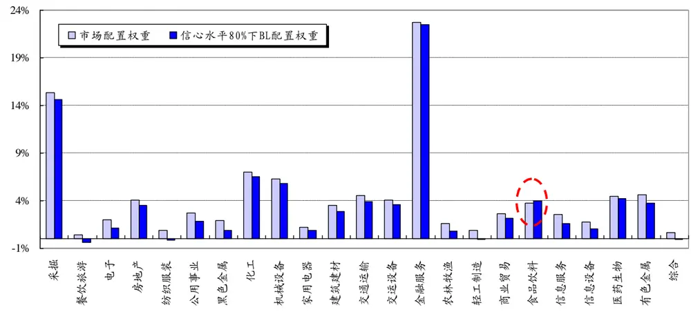
数据来源：国泰君安证券研究

在无约束条件下，主观观点在市场流通市值权重配臵的基础上作了一定的修正，但是幅度都不是很大，各个行业配臵的权重变动也均在1.1%范围内。

在加入一致预期主观观点后，除去食品饮料外的其他行业的权重都有所下降，幅度不一。食品饮料业权重有所上升。80%信心水平下，总仓位为 85.32%，有所下降。

分析上述现象，我们认为在无约束条件下，行业高配低配与主观观点收益和市场隐含均衡收益的差有关系。市场隐含均衡收益是由行业历史数据计算得到的，反映的是在市场均衡情况下的行业期望收益。而主观观点收益则是对未来市场收益的预期。两者之差反应的是对行业指数增长性的预期。从图 5 与图 6 可以看到：在无约束条件下，主观观点收益与市场隐含均衡收益两者的差（后文称“收益差”）直接影响到加入主观观点后权重的变化（后称“配臵差”）大小，两者呈现高度线性相关。也就是说，B-L模型会高配那些主观观点收益较历史的市场隐含均衡收益有较大提升的行业。

从 B-L模型的公式来看，在无约束条件下，B-L 模型得到的资产组合权重向量与市场权重向量有如下关系：

$$
w^{*}-w_{\mathrm{mkt}}=\frac{P^{\prime}}{\lambda}\biggl(\frac{\Omega}{\lambda}{+}P\Sigma P^{\prime}\biggr)^{-1}\left(Q-\lambda P\Sigma w_{\mathrm{mkt}}\right)
$$

$$
\mathrm{{~~}}\mathrm{{~~}}\mathrm{{~~}}\theta{=}\frac{P^{\prime}}{\lambda}{(\frac{\Omega}{\lambda}{+}P\Sigma P^{\prime})}^{-1},
$$

$$
\mathrm{~\sqrt{19}~}Q-\lambda P\Sigma w_{mkt}=Q-P(\lambda\Sigma w_{mkt})=Q-P\Pi~,
$$

如果P为单位矩阵，Q-PΠI=Q-ΠI， $w^{*}-w_{\mathrm{mkt}}=\theta\mathopen{}\mathclose\bgroup\left(Q-\Pi\aftergroup\egroup\right)$

那么权重差和收益差就呈现线性关系。

图 5 市场隐含均衡收益与主观观点收益比较
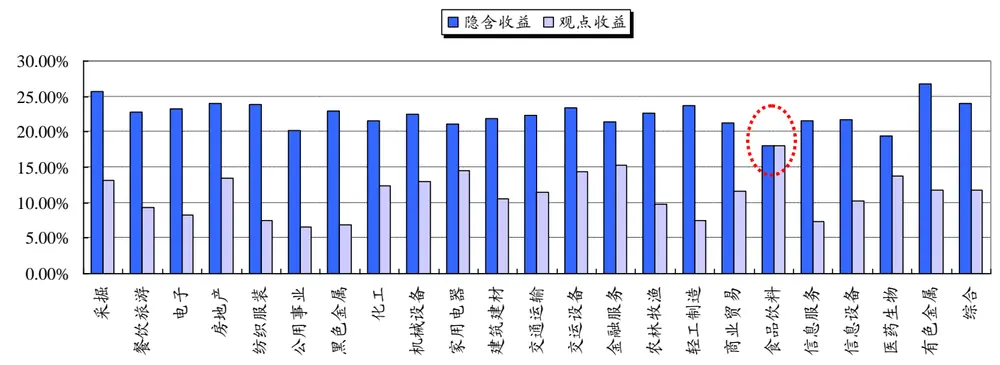
数据来源：国泰君安证券研究

图 6 收益差 VS 配臵差
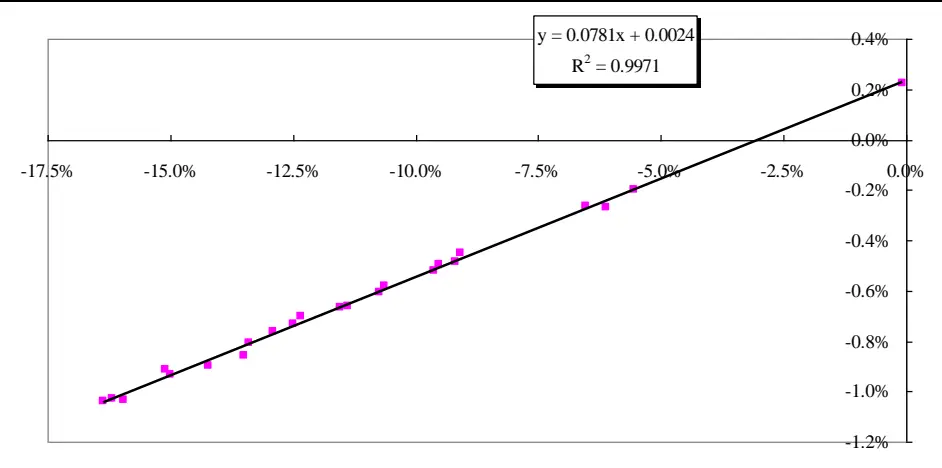

数据来源：国泰君安证券研究。注：每个点表示一个行业。横轴为主观观点收益与市场隐含均衡收益之差（收益差），纵轴为 B-L 配臵权重与市场配臵权重之差（配臵差）。这两者相关性方程R方为99.71%。

综上所述，在 B-L模型配臵的过程中，如果 P设定为单位矩阵，无约束条件下，配臵差和收益差呈现线性关系。

## 2.2.3. 主观观点收益对配臵的影响——有约束条件

图 72011 年一致预期下的行业配臵——总仓位 1，无卖空
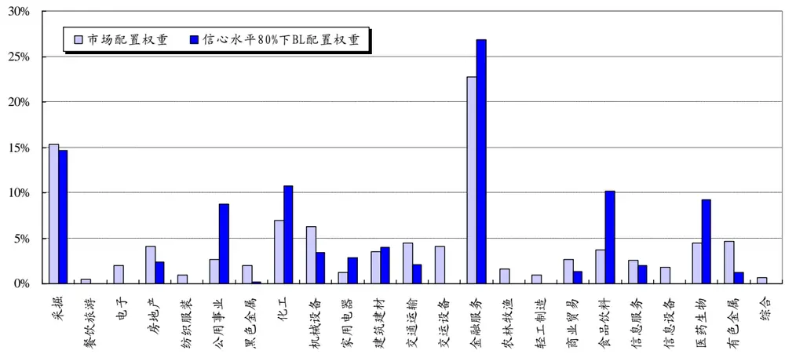
数据来源：国泰君安证券研究

在总仓位为 1、无卖空的条件下，各个行业的 B-L 配臵权重相比无约束下有较大变化。由于约束条件的存在，收益差与配臵差不再具有明显的线性关系。我们需要寻求其他变量来解释高配低配现象。

B-L 模型依次高配了公用事业、化工、家用电器、建筑建材、金融服务、食品饮料等6个行业，按照前文的结论，食品饮料、医药生物、金融服务、家用电器以及化工行业在预期收益提升中也排序比较靠前，对其高配理所当然。另外建筑建材与公用事业的收益差排名并不靠前，之所以对这两个行业进行高配，而不是高配机械设备、交运设备等，我们推断其理由是因为这些行业波动率太高，风险较大，模型权衡了收益与风险，选择配臵建筑建材与公用事业。因此，我们的结论是：在有约束条件下，模型会综合考虑预期收益以及行业的波动率、协方差等情况，从而进行高配低配。

表 3 配臵差、收益差、波动率排序——总仓位 1，无卖空

| 配置差排序 |  | 收益差排序 |  | 历史年化日波动率排序 |  |
| --- | --- | --- | --- | --- | --- |
| 食品饮料 | 6.44% | 食品饮料 | -0.08% | 食品饮料 | 27.77% |
| 公用事业 | 6.10% | 医药生物 | -5.56% | 公用事业 | 28.67% |
| 医药生物 | 4.74% | 金融服务 | -6.11% | 医药生物 | 29.34% |
| 金融服务 | 4.05% | 家用电器 | -6.52% | 交通运输 | 29.81% |
| 化工 | 3.80% | 交运设备 | -9.09% | 商业贸易 | 29.84% |
| 家用电器 | 1.71% | 化工 | -9.19% | 化工 | 29.93% |
| 建筑建材 | 0.50% | 机械设备 | -9.54% | 建筑建材 | 30.40% |
| 餐饮旅游 | -0.44% | 商业贸易 | -9.63% | 机械设备 | 30.91% |
| 信息服务 | -0.59% | 房地产 | -10.63% | 信息服务 | 31.49% |
| 综合 | -0.68% | 交通运输 | -10.74% | 家用电器 | 31.61% |
| 采掘 | -0.71% | 建筑建材 | -11.37% | 轻工制造 | 32.36% |
| 纺织服装 | -0.91% | 信息设备 | -11.53% | 交运设备 | 32.36% |
| 轻工制造 | -0.94% | 综合 | -12.33% | 纺织服装 | 32.71% |
| 商业贸易 | -1.33% | 采掘 | -12.50% | 金融服务 | 33.20% |
| 农林牧渔 | -1.62% | 农林牧渔 | -12.89% | 黑色金属 | 33.35% |
| 房地产 | -1.76% | 餐饮旅游 | -13.39% | 信息设备 | 33.38% |
| 信息设备 | -1.76% | 公用事业 | -13.50% | 综合 | 33.87% |
| 黑色金属 | -1.80% | 信息服务 | -14.22% | 农林牧渔 | 33.99% |
| 电子 | -2.04% | 电子 | -14.99% | 电子 | 34.32% |
| 交通运输 | -2.40% | 有色金属 | -15.11% | 餐饮旅游 | 34.36% |
| 机械设备 | -2.85% | 黑色金属 | -15.94% | 房地产 | 35.48% |
| 有色金属 | -3.42% | 轻工制造 | -16.19% | 采掘 | 37.04% |
| 交运设备 | -4.08% | 纺织服装 | -16.37% | 有色金属 | 38.90% |

数据来源：国泰君安证券研究

图 82011 一致预期下的行业配臵——总仓位 0.6，无卖空
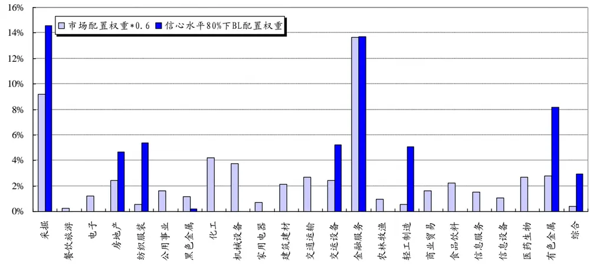
数据来源：国泰君安证券研究

在总仓位 0.6 无卖空的限制下，B-L 模型对行业的配臵产生了很大的变化。B-L模型选择了23个申万一级行业中的9个进行了配臵。这9个行业除了金融服务外，其他 8个行业在后验收益排序中分列前八位。

图 92011 一致预期下的行业配臵——总仓位 1，无卖空，单行业配臵上限 20%
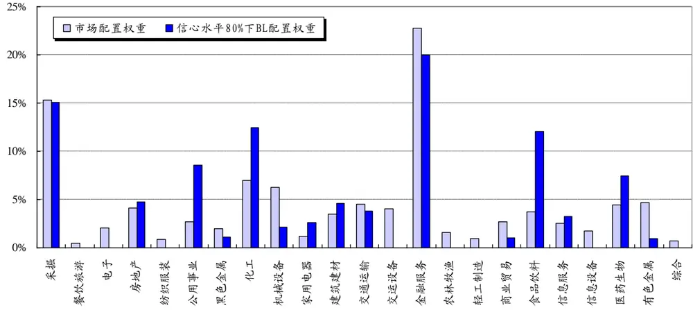
数据来源：国泰君安证券研究

在总仓位 1，并且单资产仓位有 20%上限情况下，由于仓位的限制，模型无法给予金融服务 20%以上的配臵，因此，在配满金融服务的前提下，模型选取了食品饮料、房地产、化工、交运进行配臵。

图 10 2011 一致预期下的行业配臵——总仓位 1，有卖空
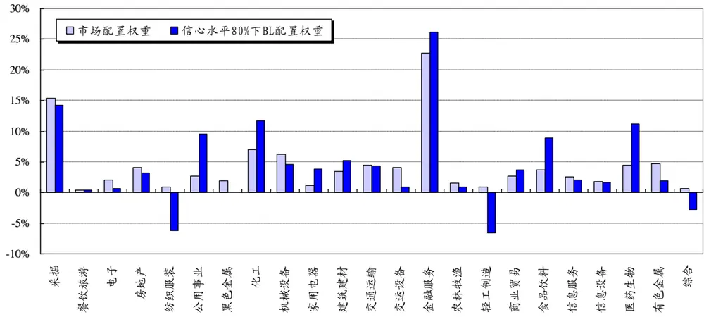
数据来源：国泰君安证券研究

总仓位 1，有卖空的条件下，组合在配臵原有高配行业的基础上，大幅度卖空了纺织服装、轻工制造与综合行业。

## 2.3.不同约束条件及不同主观观点对配臵业绩的影响

本节比较在不同约束条件、不同主观观点下，B-L 组合的业绩孰优孰劣。我们这里设臵如下五种约束条件：

（1） 无约束条件，总仓位不限制，可卖空

（2） 总仓位为 1，无卖空

（3） 6 成仓位，无卖空

（4） 总仓位为 1，无卖空，单项资产配臵上限 20%

（5） 总仓位为 1，可卖空

测算时间段选择为 2007年至 2011年，主观观点采用：

（1） 一致预期 ROE

（2） 当年实际收益

（3） 1/3 一致预期 ROE

测算中所用的夏普比率、跟踪误差、信息比率以及 Beta 的定义见本文附录。

## 2.3.1. 一致预期 ROE 观点

表 42007 年 B-L配臵业绩——一致预期观点

|  | 空 | 总仓位 1,无卖 总仓位 0.6,无卖 空 | 总仓位1,无卖 空,每项资产上 限20% | 总仓位1,有卖 空 | 无约束 | 市场权重组合 |
| --- | --- | --- | --- | --- | --- | --- |
| 收益率 | 171.01% | 101.97% | 171.01% | 171.67% | 163.77% | 167.44% |
| 标准差 | 34.56% | 35.92% | 34.56% | 34.52% | 34.43% | 34.53% |
| 夏普比率 | 4.88 | 2.77 | 4.88 | 4.90 | 4.68 | 4.78 |
| 相对收益率 | 3.57% | -65.47% | 3.57% | 4.23% | -3.67% | 一 |
| 跟踪误差 | 2.28% | 6.93% | 2.28% | 2.55% | 2.72% |  |
| 信息比率 | 1.56 |  | 1.56 | 1.66 |  |  |
| Beta | 0.9988 | 1.0211 | 0.9988 | 0.9971 | 0.9940 |  |

数据来源：国泰君安证券研究 注：跟踪误差、信息比率、Beta 的计算基准是市场权重组合

表 52008 年 B-L配臵业绩——一致预期观点

|  | 总仓位1,无卖 空 | 总仓位 0.6,无卖 空 | 总仓位1,无卖 空,每项资产上 限20% | 总仓位1,有卖 空 | 无约束 | 市场权重组合 |
| --- | --- | --- | --- | --- | --- | --- |
| 收益率 | -62.37% | -40.24% | -62.39% | -60.86% | -51.72% | -62.89% |
| 标准差 | 45.38% | 50.79% | 45.39% | 44.81% | 47.11% | 47.42% |
| 夏普比率 |  |  |  |  |  | — |
| 相对收益率 | 0.53% | 22.65% | 0.51% | 2.04% | 11.17% |  |
| 跟踪误差 | 3.53% | 6.26% | 3.50% 0.14 | 4.16% 0.49 | 2.24% 5.00 |  |
| 信息比率 | 0.15 | 3.62 | 0.9554 | 0.9426 | 0.9923 |  |
| Beta | 0.9551 | 1.0648 |  |  |  |  |

数据来源：国泰君安证券研究 注：跟踪误差、信息比率、Beta 的计算基准是市场权重组合

表 62009 年 B-L配臵业绩——一致预期观点

| 空 | 总仓位 1,无卖 总仓位 0.6,无卖 空 | 总仓位1,无卖 空,每项资产上 限 20% | 总仓位1,有卖 空 | 无约束 | 市场权重组合 |
| --- | --- | --- | --- | --- | --- |

| 收益率 | 124.13% | 83.38% | 124.13% | 123.01% | 134.69% | 108.81% |
| --- | --- | --- | --- | --- | --- | --- |
| 标准差 | 34.76% | 39.41% | 34.76% | 35.39% | 31.11% | 31.56% |
| 夏普比率 | 3.51 | 2.06 | 3.51 | 3.41 | 4.26 | 3.38 |
| 相对收益率 | 15.32% | -25.43% | 15.32% | 14.20% | 25.88% | _ |
| 跟踪误差 | 4.20% | 10.95% | 4.20% | 4.94% | 1.08% | 一 |
| 信息比率 | 3.65 |  | 3.65 | 2.87 | 24.07 |  |
| Beta | 1.0979 | 1.2196 | 1.0979 | 1.1167 | 0.9854 |  |

数据来源：国泰君安证券研究 注：跟踪误差、信息比率、Beta 的计算基准是市场权重组合

表 72010 年 B-L配臵业绩——一致预期观点

|  | 总仓位1,无卖 空 | 总仓位 0.6,无卖 空 | 总仓位1,无卖 空,每项资产上 限20% | 总仓位1,有卖 空 | 无约束 | 市场权重组合 |
| --- | --- | --- | --- | --- | --- | --- |
| 收益率 | -7.86% | -4.29% | -8.07% | -8.54% | -7.95% | -7.30% |
| 标准差 | 20.08% | 24.15% | 20.66% | 20.08% | 21.81% | 22.05% |
| 夏普比率 |  |  |  |  |  |  |
| 相对收益率 跟踪误差 | -0.56% | 3.01% | -0.77% | -1.24% | -0.65% |  |
| 信息比率 | 3.51% | 4.68% | 3.74% | 3.58% | 1.71% |  |
|  |  | 0.64 |  |  |  |  |
| Beta | 0.9021 | 1.0773 | 0.9245 | 0.9016 | 0.9862 |  |

数据来源：国泰君安证券研究 注：跟踪误差、信息比率、Beta 的计算基准是市场权重组合

表 82011 年 B-L配臵业绩——一致预期观点

|  | 总仓位1,无卖 空 | 总仓位 0.6,无卖 空 | 总仓位1,无卖 空,每项资产上 限 20% | 总仓位1,有卖 空 | 无约束 | 市场权重组合 |
| --- | --- | --- | --- | --- | --- | --- |
| 收益率 | -23.90% | -16.37% | -24.10% | -24.93% | -22.62% | -27.11% |
| 标准差 | 19.11% | 21.04% | 19.28% | 19.09% | 19.77% | 20.08% |
| 夏普比率 |  |  |  |  |  |  |
| 相对收益率 | 3.22% | 10.74% | 3.01% | 2.19% | 4.49% |  |
| 跟踪误差 | 1.87% | 3.03% | 1.98% | 1.99% | 0.85% |  |
| 信息比率 | 1.72 | 3.54 | 1.52 | 1.10 | 5.27 |  |
| Beta | 0.9487 | 1.0378 | 0.9561 | 0.9473 | 0.9840 |  |

数据来源：国泰君安证券研究 注：跟踪误差、信息比率、Beta 的计算基准是市场权重组合

分析无约束组合的整体仓位，仓位最高是 2009年的 123%，最低是 2008年的 82%，2010 年和 2011 年均在 85%，2007 年在 95%。总体来看，除了 2007 年模型没有调高仓位，其他各年份均能自动调整总仓位以适应市场趋势。

图 11 2007-2011年无约束组合仓位与市场收益对比
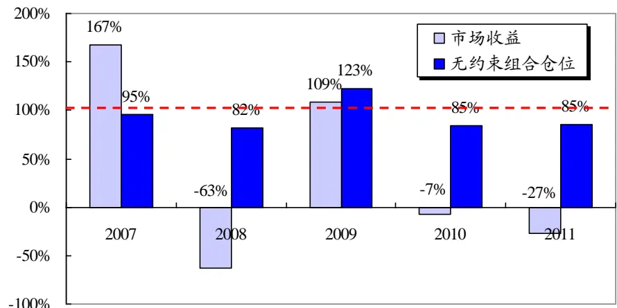
数据来源：国泰君安证券研究

我们将 2007-2011年，在一致预期 ROE 主观观点下的模型配臵业绩进行比对，可以看到，除了 2010 年，还有牛市低仓位的情况下，B-L 组合略微跑输市场组合，其他各年份均跑赢市场组合。尤其是在 2009 年跑赢幅度巨大，2011年震荡市亦有超额收益。

分析 2010 年跑输市场组合的原因，我们发现当年的一致预期与市场实际表现有较大差异，预测业绩优异的行业，实际表现却排在后面。也就是说预期收益不是很正确，最终导致配臵结果也不佳。

表 92007-2011年 B-L配臵业绩——一致预期观点

|  | 年份/相对收益 总仓位 1,无卖空总仓位 0.6,无卖空 每项资产上限 总仓位 1,有卖空 |  | 总仓位1,无卖空， |  | 无约束 |
| --- | --- | --- | --- | --- | --- |
| 2007年 | 3.57% | -65.47% | 20% 3.57% | 4.23% | -3.67% |
| 2008年 | 0.53% | 22.65% | 0.51% | 2.04% | 11.17% |
| 2009年 | 15.32% | -25.43% | 15.32% | 14.20% | 25.88% |
| 2010年 | -0.56% | 3.01% | -0.77% | -1.24% | -0.65% |
| 2011年 | 3.22% | 10.74% | 3.01% | 2.19% | 4.49% |

数据来源：国泰君安证券研究 注：相对收益的计算基准是市场权重组合

## 2.3.2. 实际收益观点

为了考察B-L配臵的效果，我们将完全正确的投资者观点也就是次年的行业实际收益作为主观观点收益输入到B-L模型中，并观察配臵组合的业绩。

表 102007年 B-L配臵业绩——实际收益观点

|  | 总仓位1,无卖 空 | 总仓位 0.6,无卖 空 | 总仓位1,无卖 空,每项资产上 限 20% | 总仓位1,有卖 空 | 无约束 | 市场权重组合 |
| --- | --- | --- | --- | --- | --- | --- |
| 收益率 | 135.58% | 78.74% | 173.64% | 230.99% | 1100.49% | 167.44% |
| 标准差 | 40.27% | 40.75% | 37.67% | 63.23% | 36.81% | 34.53% |
| 夏普比率 | 3.30 | 1.87 | 4.54 | 3.61 | 29.83 | 4.78 |
| 相对收益率 | -31.86% | -88.70% | 6.20% | 63.55% | 933.05% |  |
| 跟踪误差 | 18.83% | 20.28% | 10.02% | 56.83% | 6.20% |  |
| 信息比率 |  |  | 0.62 | 1.12 | 150.41 |  |
| Beta | 1.0313 | 1.0240 | 1.0529 | 0.8222 | 1.0522 |  |

数据来源：国泰君安证券研究 注：跟踪误差、信息比率、Beta 的计算基准是市场权重组合

表 112008 年 B-L配臵业绩——实际收益观点

|  | 总仓位1,无卖 空 | 总仓位 0.6,无卖 空 | 总仓位1,无卖 空,每项资产上 限 20% | 总仓位1,有卖 空 | 无约束 | 市场权重组合 |
| --- | --- | --- | --- | --- | --- | --- |
| 收益率 | -62.02% | -37.81% | -61.05% | -50.61% | -2.67% | -62.89% |
| 标准差 | 43.19% | 43.98% | 43.62% | 37.93% | 14620.42% | 47.42% |
| 夏普比率 |  |  |  |  |  |  |
| 相对收益率 | 0.87% | 25.09% | 1.84% | 12.28% | 60.22% |  |
| 跟踪误差 | 10.00% | 10.82% | 6.91% | 18.63% | 14613.76% |  |
| 信息比率 | 0.09 | 2.32 | 0.27 | 0.66 | 0.00 |  |
| Beta | 0.8924 | 0.9039 | 0.9124 | 0.7428 | 43.8121 |  |

数据来源：国泰君安证券研究 注：跟踪误差、信息比率、Beta 的计算基准是市场权重组合

表 122009年 B-L配臵业绩——实际收益观点

|  | 空 | 总仓位 1,无卖 总仓位 0.6,无卖 空 | 总仓位1,无卖 空,每项资产上 限 20% | 总仓位1,有卖 空 | 无约束 | 市场权重组合 |
| --- | --- | --- | --- | --- | --- | --- |
| 收益率 | 155.94% | 99.64% | 404.81% | 547.56% | 857.80% | 108.81% |
| 标准差 | 44.58% | 47.38% | 71.29% | 88.52% | 33.43% | 31.56% |
| 夏普比率 | 3.45 | 2.06 | 5.65 | 6.16 | 25.59 | 3.38 |
| 相对收益率 | 47.13% | -9.17% | 296.01% | 438.75% | 748.99% | 一 |
| 跟踪误差 | 18.90% | 22.57% | 49.98% | 64.10% | 5.96% |  |
| 信息比率 | 2.49 |  | 5.92 | 6.85 | 125.66 |  |
| Beta | 1.3185 | 1.3714 | 1.7971 | 2.3715 | 1.0434 |  |

数据来源：国泰君安证券研究 注：跟踪误差、信息比率、Beta 的计算基准是市场权重组合

表 132010年 B-L配臵业绩——实际收益观点

|  | 空 | 总仓位 1,无卖 总仓位 0.6,无卖 空 | 总仓位1,无卖 空,每项资产上 限20% | 总仓位1,有卖 空 | 无约束 | 市场权重组合 |
| --- | --- | --- | --- | --- | --- | --- |
| 收益率 | -3.17% | -1.51% | -2.98% | -3.48% | -2.42% | -7.30% |
| 标准差 | 19.80% | 23.53% | 20.49% | 19.46% | 21.74% | 22.05% |
| 夏普比率 |  |  |  |  |  | — |
| 相对收益率 | 4.12% | 5.79% | 4.31% | 3.81% | 4.87% | _ |
| 跟踪误差 | 7.05% | 2.96% | 7.27% | 7.20% | 1.73% |  |
| 信息比率 | 0.58 | 1.95 | 0.59 | 0.53 | 2.82 |  |
| Beta | 0.8522 | 1.0606 | 0.8773 | 0.8362 | 0.9833 |  |

数据来源：国泰君安证券研究 注：跟踪误差、信息比率、Beta 的计算基准是市场权重组合

表 142011 年 B-L配臵业绩——实际收益观点

|  | 空 | 总仓位 1,无卖 总仓位 0.6,无卖 空 | 总仓位1,无卖 空,每项资产上 限20% | 总仓位1,有卖 空 | 无约束 | 市场权重组合 |
| --- | --- | --- | --- | --- | --- | --- |
| 收益率 | -17.97% | -10.89% | -22.11% | -16.54% | -5.29% | -27.11% |
| 标准差 | 17.11% | 17.11% | 18.89% | 17.15% | 19.69% | 20.08% |
| 夏普比率 |  |  |  |  |  |  |
| 相对收益率 | 9.15% | 16.22% | 5.00% | 10.57% | 21.83% | 一 |
| 跟踪误差 | 6.22% | 5.62% | 4.85% | 9.26% | 11.45% |  |
| 信息比率 | 1.47 | 2.89 | 1.03 | 1.14 | 1.91 |  |
| Beta | 0.8151 | 0.8241 | 0.9135 | 0.7584 | 0.8183 |  |

数据来源：国泰君安证券研究 注：跟踪误差、信息比率、Beta 的计算基准是市场权重组合

实际收益观点下，无约束组合表现出了较强的收益能力，特别是在单边的上涨下跌市中，由于无约束组合没有对总仓位进行限制，可以无限高配低配，再加上可以做空，因此往往能够取得很高的相对收益。

表 15 2007-2011 年 B-L 配臵业绩——实际收益观点

| 年份/相对收益 | 总仓位1,无卖空总仓位 0.6,无卖空 每项资产上限 总仓位1,有卖空 |  | 总仓位1,无卖空， 20% |  | 无约束 |
| --- | --- | --- | --- | --- | --- |
| 2007年 | -31.86% | -88.70% | 6.20% | 63.55% | 933.05% |
| 2008年 | 0.87% | 25.09% | 1.84% | 12.28% | 60.22% |
| 2009年 | 47.13% | -9.17% | 296.01% | 438.75% | 748.99% |
| 2010年 | 4.12% | 5.79% | 4.31% | 3.81% | 4.87% |
| 2011年 | 9.15% | 16.22% | 5.00% | 10.57% | 21.83% |

数据来源：国泰君安证券研究 注：相对收益的计算基准是市场权重组合

## 2.3.3. 1/3 一致预期 ROE 观点

纵观前两小节，可以看到，实际收益作为主观观点固然能够取得很好的配臵效果，但是投资者对于市场的判断往往并不能做到百分之百准确，尤其是要对 23个行业的判断都准确更是难上加难。

因此，可以考虑采用部分行业的一致预期ROE作为主观观点。在这里，我们使用一致预期 ROE从高到低排列后前 1/3行业（8个行业）的收益作为主观观点收益。从历史效果来看，前 1/3观点的正确率也更高。

图 12 一致预期 ROE与 1/3一致预期 ROE比较
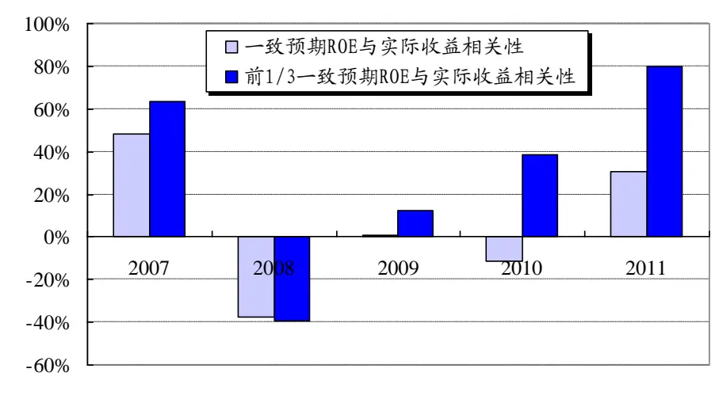
数据来源：国泰君安证券研究

由图 12，1/3 一致预期 ROE 与实际收益的相关性有所提升，更接近实际收益观点。因此，我们从直观上判断这种主观观点设臵方法在实际中也能取得相对较好的业绩，实证如下。

表 16 2007-2011 年 B-L 配臵业绩——三种观点收益

| 年份 | 观点/相对收益 | 总仓位 1,无 卖空 | 总仓位0.6,无 卖空 | 总仓位1,无 卖空,每项资 产上限 20% | 总仓位 1,有 卖空 | 无约束 |
| --- | --- | --- | --- | --- | --- | --- |
| 2007 | 实际收益 | -31.86% | -88.70% | 6.20% | 63.55% | 933.05% |
|  | 一致预期 ROE | 3.57% | -65.47% | 3.57% | 4.23% | -3.67% |
|  | 1/3一致预期ROE | 17.51% | -56.74% | 14.16% | 18.33% | 60.42% |
| 2008 | 实际收益 | 0.87% | 25.09% | 1.84% | 12.28% | 60.22% |
|  | 一致预期 ROE | 0.53% | 22.65% | 0.51% | 2.04% | 11.17% |
|  | 1/3一致预期ROE | 2.27% | 24.15% | 2.27% | 4.11% | 16.63% |
| 2009 | 实际收益 | 47.13% | -9.17% | 296.01% | 438.75% | 748.99% |
|  | 一致预期 ROE | 15.32% | -25.43% | 15.32% | 14.20% | 25.88% |
|  | 1/3一致预期ROE | 32.99% | -20.22% | 32.73% | 52.52% | 95.17% |
| 2010 | 实际收益 | 4.12% | 5.79% | 4.31% | 3.81% | 4.87% |
|  | 一致预期 ROE | -0.56% | 3.01% | -0.77% | -1.24% | -0.65% |
|  | 1/3一致预期ROE | 1.68% | 4.89% | 1.61% | 1.97% | 2.71% |
| 2011 | 实际收益 | 9.15% | 16.22% 10.74% | 5.00% 3.01% | 10.57% 2.19% | 21.83% |
|  | 一致预期 ROE | 3.22% 3.95% | 10.48% | 3.58% | 2.81% | 4.49% |
|  | 1/3一致预期ROE |  |  |  |  | 5.70% |

数据来源：国泰君安证券研究 注：相对收益的计算基准是市场权重组合

从业绩来看，1/3 一致预期 ROE 观点得到的 B-L 组合收益提升十分明显，仅有一种情况（2011 年 60%仓位约束）收益略低于一致预期观点下的配臵收益，其他均优于一致预期观点下的配臵收益。并且，除去60%仓位的情况，其他各年份均跑赢市场组合，也就是说 2007-2011 年每年均能获得正向的超额收益。

1/3一致预期ROE观点取得了很好的效果。我们在后文的测算中统一使用 1/3一致预期 ROE观点。

## 2.4. 季度调仓

前文的测试均采用了年度调仓的频率。考虑到年度的周期略显偏长，投资经理的观点可能会在中间出现变化，因此我们采用季度调仓的方法来测试 B-L配臵的效果。

本节中，每季度末都按照该时点的1/3一致预期ROE数据对B-L组合进行重新配臵，每年调仓 4 次，分别测算 2007-2011 年的年度收益。收益均未扣除交易成本。

图 13 总仓位为 1，无卖空约束下，季度调仓的 B-L配臵权重
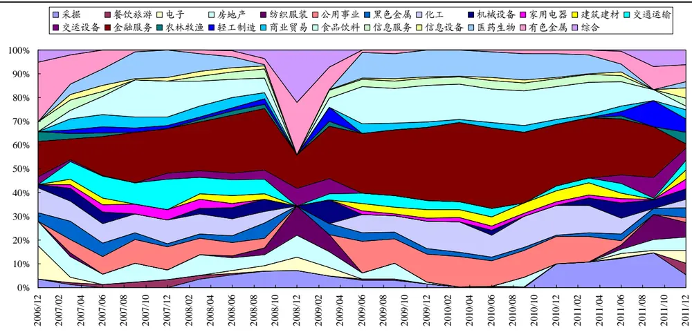
数据来源：国泰君安证券研究

表 17 2007 年季度调仓

|  | 总仓位1,无卖 空 | 总仓位 0.6,无卖 空 | 总仓位1,无卖 空,每项资产上 限20% | 总仓位1,有卖 空 | 无约束 | 市场权重组合 |
| --- | --- | --- | --- | --- | --- | --- |
| 收益率 | 223.45% | 109.80% | 220.53% | 225.60% | 232.19% | 195.83% |
| 标准差 | 45.76% | 28.77% | 45.60% | 45.76% | 47.57% | 44.86% |
| 夏普比率 | 4.83 | 3.73 | 4.78 | 4.88 | 4.83 | 4.31 |
| 相对收益率 | 27.62% | -86.03% | 24.70% | 29.77% | 36.36% |  |
| 跟踪误差 | 4.70% | 17.49% | 4.35% | 5.18% | 8.78% |  |
| 信息比率 | 5.88 |  | 5.68 | 5.75 | 4.14 |  |
| Beta | 1.0148 | 0.6297 | 1.0121 | 1.0136 | 1.0432 |  |
| 调仓比例 | 127.38% | 76.20% | 124.25% | 170.54% | 104.68% |  |

数据来源：国泰君安证券研究 注：跟踪误差、信息比率、Beta 的计算基准是市场权重组合，具体公式请参见附录

表 18 2008 年季度调仓

|  | 总仓位1,无卖 空 | 总仓位 0.6,无卖 空 | 总仓位1,无卖 空,每项资产上 限20% | 总仓位1,有卖 空 | 无约束 | 市场权重组合 |
| --- | --- | --- | --- | --- | --- | --- |
| 收益率 | -61.92% | -46.05% | -61.73% | -61.72% | -58.09% | -61.95% |
| 标准差 | 42.51% | 27.10% | 42.38% | 42.58% | 39.84% | 42.93% |
| 夏普比率 |  |  |  |  |  |  |
| 相对收益率 | 0.03% | 15.90% | 0.22% | 0.23% | 3.86% |  |
| 跟踪误差 | 2.26% | 16.19% | 2.30% | 2.65% 0.09 | 5.93% |  |
| 信息比率 | 0.01 | 0.98 | 0.10 0.9857 | 0.9899 | 0.65 0.9211 |  |
| Beta | 0.9887 | 0.6282 | 52.99% | 60.03% | 47.56% |  |
| 调仓比例 | 53.11% | 36.56% |  |  |  |  |

数据来源：国泰君安证券研究 注：跟踪误差、信息比率、Beta 的计算基准是市场权重组合，具体公式请参见附录

表 19 2009 年季度调仓

|  | 总仓位1,无卖 空 | 总仓位 0.6,无卖 空 | 总仓位1,无卖 空,每项资产上 限20% | 总仓位1,有卖 空 | 无约束 | 市场权重组合 |
| --- | --- | --- | --- | --- | --- | --- |
| 收益率 | 170.02% | 92.58% | 167.56% | 208.04% | 182.07% | 119.48% |
| 标准差 | 39.47% | 27.29% | 39.48% | 44.54% | 47.88% | 36.44% |
| 夏普比率 | 4.25 | 3.31 | 4.19 | 4.62 | 3.76 | 3.22 |
| 相对收益率 | 50.54% | -26.90% | 48.08% | 88.56% | 62.59% |  |
| 跟踪误差 | 8.85% | 13.08% | 8.35% | 14.80% | 18.57% |  |
| 信息比率 | 5.71 |  | 5.76 | 5.98 | 3.37 |  |
| Beta | 1.0572 | 0.7160 | 1.0607 | 1.1645 | 1.2335 |  |
| 调仓比例 | 141.85% | 72.88% | 140.28% | 276.75% | 110.82% |  |

数据来源：国泰君安证券研究 注：跟踪误差、信息比率、Beta 的计算基准是市场权重组合，具体公式请参见附录

表 20 2010 年季度调仓

|  | 总仓位1,无卖 空 | 总仓位 0.6,无卖 空 | 总仓位1,无卖 空,每项资产上 限20% | 总仓位1,有卖 空 | 无约束 | 市场权重组合 |
| --- | --- | --- | --- | --- | --- | --- |
| 收益率 | -5.56% | -1.43% | -5.23% | -5.61% | -3.53% | -6.06% |
| 标准差 | 21.34% | 14.59% | 21.96% | 21.36% | 18.48% | 23.42% |
| 夏普比率 |  |  |  |  |  |  |
| 相对收益率 | 0.49% | 4.62% | 0.83% | 0.45% | 2.52% |  |
| 跟踪误差 | 4.19% | 9.15% | 4.02% | 4.21% | 5.16% |  |
| 信息比率 | 0.12 | 0.51 | 0.21 0.9247 | 0.11 0.8996 | 0.49 |  |
| Beta | 0.8991 | 0.6177 | 27.64% | 37.54% | 0.7868 33.50% |  |
| 调仓比例 | 29.75% | 23.68% |  |  |  |  |

数据来源：国泰君安证券研究 注：跟踪误差、信息比率、Beta 的计算基准是市场权重组合，具体公式请参见附录

表 21 2011 年季度调仓

|  | 总仓位1,无卖 空 | 总仓位 0.6,无卖 空 | 总仓位1,无卖 空,每项资产上 限20% | 总仓位1,有卖 空 | 无约束 | 市场权重组合 |
| --- | --- | --- | --- | --- | --- | --- |
| 收益率 | -27.52% | -19.03% | -27.36% | -29.65% | -28.47% | -27.35% |
| 标准差 | 20.29% | 13.50% | 20.33% | 20.37% | 20.96% | 21.01% |
| 夏普比率 |  |  |  |  |  |  |
| 相对收益率 | -0.18% | 8.32% | -0.01% | -2.30% | -1.12% |  |
| 跟踪误差 | 2.32% | 7.88% | 2.41% | 2.56% | 4.06% |  |
| 信息比率 |  | 1.05 |  |  |  |  |
| Beta | 0.9605 | 0.6361 | 0.9615 | 0.9628 | 0.9789 |  |
| 调仓比例 | 70.02% | 30.07% | 69.77% | 90.09% | 38.61% |  |

数据来源：国泰君安证券研究 注：跟踪误差、信息比率、Beta 的计算基准是市场权重组合，具体公式请参见附录

表 22 2007-2011 年不同调仓频率相对收益率对比

| 年份 | 调仓频率/ 相对收益 | 总仓位1, 无卖空 | 总仓位 0.6, 无卖空 | 总仓位1, 无卖空,每项资 产上限20% | 总仓位1, 有卖空 | 无约束 |
| --- | --- | --- | --- | --- | --- | --- |
| 2007 | 季度调仓 | 27.62% | -86.03% | 24.70% | 29.77% | 36.36% |
|  | 年度调仓 | 17.51% | -56.74% | 14.16% | 18.33% | 60.42% |
| 2008 | 季度调仓 | 0.03% | 15.90% | 0.22% | 0.23% | 3.86% |
|  | 年度调仓 | 2.27% | 24.15% | 2.27% | 4.11% | 16.63% |
| 2009 | 季度调仓 | 50.54% | -26.90% | 48.08% | 88.56% | 62.59% |
|  | 年度调仓 | 32.99% | -20.22% | 32.73% | 52.52% | 95.17% |
| 2010 | 季度调仓 | 0.49% | 4.62% | 0.83% | 0.45% | 2.52% |
|  | 年度调仓 | 1.68% | 4.89% | 1.61% | 1.97% | 2.71% |
| 2011 | 季度调仓 | -0.18% | 8.32% | -0.01% | -2.30% | -1.12% |
|  | 年度调仓 | 3.95% | 10.48% | 3.58% | 2.81% | 5.70% |

数据来源：国泰君安证券研究 注：相对收益的计算基准是市场权重组合

通过回测可以看到，季度调仓的组合业绩仅在2007与2009年牛市好于年度调仓，其余均是年度调仓的组合业绩更好。

## 3. 2012 年 B-L 组合推荐及业绩

我们以2011年底1/3一致预期ROE为主观观点，给出2012年度B-L组合。该组合的约束条件为总仓位 1、无卖空。

B-L 模型提示 2012 年重仓金融服务、食品饮料、公用事业、采掘、医药生物及化工行业。这六个行业仓位达到 90%，总共配臵十一个行业。其中采掘虽然是重仓，但相对市场权重是低配，因为采掘的市场权重较高。

表 23 B-L 模型 2012 年行业推荐

| 行业 | 市场权重 | B-L 配置权重 | 高/低配 |
| --- | --- | --- | --- |
| 金融服务 | 23.43% | 29.10% | 高配 |
| 食品饮料 | 4.84% | 19.88% | 高配 |
| 公用事业 | 2.77% | 15.58% | 高配 |
| 化工 | 6.97% | 10.15% | 高配 |
| 医药生物 | 4.04% | 9.09% | 高配 |
| 采掘 | 15.01% | 8.79% | 低配 |
| 信息服务 | 2.61% | 3.26% | 略高配 |
| 建筑建材 | 3.38% | 2.63% | 略低配 |
| 黑色金属 | 2.33% | 1.35% | 略低配 |
| 机械设备 | 5.86% | 0.10% | 低配 |
| 家用电器 | 1.40% | 0.06% | 低配 |
| 餐饮旅游 | 0.44% | 0.00% | 不配 |
| 电子 | 1.79% | 0.00% | 不配 |
| 房地产 | 4.31% | 0.00% | 不配 |
| 纺织服装 | 1.11% | 0.00% | 不配 |
| 交通运输 | 3.80% | 0.00% | 不配 |
| 交运设备 | 3.99% | 0.00% | 不配 |
| 农林牧渔 | 1.46% | 0.00% | 不配 |
| 轻工制造 | 1.02% | 0.00% | 不配 |
| 商业贸易 | 2.41% | 0.00% | 不配 |
| 信息设备 | 1.53% | 0.00% | 不配 |
| 有色金属 | 4.91% | 0.00% | 不配 |
| 综合 | 0.60% | 0.00% | 不配 |

数据来源：国泰君安证券研究

B-L模型 2012年重仓的六个行业中，有五个行业收益排在前 1/2，重仓但低配的采掘行业收益排在后 1/2。

表 24 2012年行业实际收益

| 行业 | 2012年收益 |
| --- | --- |
| 医药生物 | 11.31% |
| 房地产 | 10.31% |
| 食品饮料 | 9.44% |
| 餐饮旅游 | 7.14% |
| 家用电器 | 7.07% |
| 有色金属 | 5.43% |
| 电子 | 0.31% |
| 建筑建材 | -0.72% |
| 公用事业 | -0.93% |
| 金融服务 | -1.52% |
| 化工 | -2.00% |
| 综合 | -7.78% |
| 轻工制造 | -8.05% |
| 黑色金属 | -9.57% |
| 农林牧渔 | -9.84% |
| 交运设备 | -10.14% |
| 采掘 | -10.50% |
| 信息设备 | -10.80% |
| 交通运输 | -11.31% |
| 信息服务 | -11.91% |
| 纺织服装 | -12.40% |
| 商业贸易 | -12.74% |
| 机械设备 | -15.10% |

数据来源：国泰君安证券研究
注：收益截止至2012年10 月底

2012 年 B-L 组合截止至 10 月底获得正收益 0.33%，跑赢市场组合3.93%。并且，B-L组合跑赢上证综指、沪深 300、中证 500、创业板指、中小板指五个市场重点指数，波动率仅高于上证综指，低于其余四个指数。

表 25 2012 年 B-L 组合业绩分析

| 指标 | 2012 年 B-L 组合 |
| --- | --- |
| 收益率 | 0.33% |
| 标准差 | 18.77% |
| 夏普比率 |  |
| 相对收益率 | 3.93% |
| 跟踪误差 | 3.99% |
| 信息比率 | 0.99 |
| Beta | 0.92 |

数据来源：国泰君安证券研究

注：B-L 组合的约束条件为总仓位 1、无卖空，收益区间为 2011 年底至 2012 年 10月底，相对收益的计算基准是市场权重组合，标准差根据周收益计算。

表 26 2012年市场重点指数表现

|  | 上证综指 | 沪深300 | 中证500 | 创业板指 | 中小板指 |
| --- | --- | --- | --- | --- | --- |
| 收益率 | -5.94% | -3.88% | -3.02% | -5.19% | -2.75% |
| 标准差 | 15.96% | 19.50% | 23.14% | 23.21% | 27.05% |

数据来源：国泰君安证券研究，Wind

注：收益区间为2011年底至 2012年10月底，标准差根据周收益计算。

## 4. 附录：业绩比较中所用的指标

Beta 系数

组合的 Beta系数可以衡量投资组合对市场的敏感性。

$$
\beta_{p}=\frac{\mathrm{cov}(r_{p},r_{m})}{\sigma_{m}^{2}},
$$

其中，

$r_{p}$ ：组合收益 $r_{m}$ ：市场收益

$\sigma_{m}^{2}$ ：市场组合收益方差

## 跟踪误差

跟踪误差（Tracking Error）是投资组合收益和市场收益之差的波动性，也就是 $(r_{p}-r_{m})$ 的标准差，

$$
\sigma_{{\scriptscriptstyle TE}}=\sqrt{\sigma_{p}^{2}+\sigma_{m}^{2}-2\cos(r_{p},r_{m})}
$$

其中，

$\boldsymbol{\sigma}_{p}^{2}$ ：投资组合收益方差 $\sigma_{m}^{2}$ ：市场组合收益方差

$\mathrm{cov}(r_{p},r_{m})$ ：投资组合和市场组合收益的协方差

Sharpe 比率

Sharpe 比率（Sharpe ratio）用来计算投资组合每承受一单位的风险，能够产生多少的超额收益。

$$
\mathrm{Sharpe~ratio}=\frac{\mathrm{E}(r_{p})-r_{f}}{\sigma_{p}}
$$

其中：

$\mathrm{E}(r_{p})$ ：投资组合预期收益率 $r_{f}$ ：无风险利率

$\sigma_{p}$ ：投资组合收益率标准差

信息比率

信息比率（Information ratio）用来衡量一个投资组合优于另一个特定指数的风险调整超额收益。

$$
\mathrm{Information~ratio}=\frac{\alpha}{\mathrm{Tracking~error}}
$$

其中， $\alpha$ 为组合相对于基准的超额收益。

调仓比例

调仓比例=∑(|第 i个行业调仓后权重-第 i个行业调仓前权重|)/2

## 本公司具有中国证监会核准的证券投资咨询业务资格

## 分析师声明

作者具有中国证券业协会授予的证券投资咨询执业资格或相当的专业胜任能力，保证报告所采用的数据均来自合规渠道，分析逻辑基于作者的职业理解，本报告清晰准确地反映了作者的研究观点，力求独立、客观和公正，结论不受任何第三方的授意或影响，特此声明。

## 免责声明

本报告仅供国泰君安证券股份有限公司（以下简称“本公司”）的客户使用。本公司不会因接收人收到本报告而视其为本公司的当然客户。本报告仅在相关法律许可的情况下发放，并仅为提供信息而发放，概不构成任何广告。

本报告的信息来源于已公开的资料，本公司对该等信息的准确性、完整性或可靠性不作任何保证。本报告所载的资料、意见及推测仅反映本公司于发布本报告当日的判断，本报告所指的证券或投资标的的价格、价值及投资收入可升可跌。过往表现不应作为日后的表现依据。在不同时期，本公司可发出与本报告所载资料、意见及推测不一致的报告。本公司不保证本报告所含信息保持在最新状态。同时，本公司对本报告所含信息可在不发出通知的情形下做出修改，投资者应当自行关注相应的更新或修改。

本报告中所指的投资及服务可能不适合个别客户，不构成客户私人咨询建议。在任何情况下，本报告中的信息或所表述的意见均不构成对任何人的投资建议。在任何情况下，本公司、本公司员工或者关联机构不承诺投资者一定获利，不与投资者分享投资收益，也不对任何人因使用本报告中的任何内容所引致的任何损失负任何责任。投资者务必注意，其据此做出的任何投资决策与本公司、本公司员工或者关联机构无关。

本公司利用信息隔离墙控制内部一个或多个领域、部门或关联机构之间的信息流动。因此，投资者应注意，在法律许可的情况下，本公司及其所属关联机构可能会持有报告中提到的公司所发行的证券或期权并进行证券或期权交易，也可能为这些公司提供或者争取提供投资银行、财务顾问或者金融产品等相关服务。在法律许可的情况下，本公司的员工可能担任本报告所提到的公司的董事。

市场有风险，投资需谨慎。投资者不应将本报告为作出投资决策的惟一参考因素，亦不应认为本报告可以取代自己的判断。在决定投资前，如有需要，投资者务必向专业人士咨询并谨慎决策。

本报告版权仅为本公司所有，未经书面许可，任何机构和个人不得以任何形式翻版、复制、发表或引用。如征得本公司同意进行引用、刊发的，需在允许的范围内使用，并注明出处为“国泰君安证券研究”，且不得对本报告进行任何有悖原意的引用、删节和修改。

若本公司以外的其他机构（以下简称“该机构”）发送本报告，则由该机构独自为此发送行为负责。通过此途径获得本报告的投资者应自行联系该机构以要求获悉更详细信息或进而交易本报告中提及的证券。本报告不构成本公司向该机构之客户提供的投资建议，本公司、本公司员工或者关联机构亦不为该机构之客户因使用本报告或报告所载内容引起的任何损失承担任何责任。

## 评级说明

## 1.投资建议的比较标准

投资评级分为股票评级和行业评级。

以报告发布后的12个月内的市场表现为比较标准，报告发布日后的12个月内的公司股价（或行业指数）的涨跌幅相对同期的沪深300指数涨跌幅为基准。

## 2.投资建议的评级标准

报告发布日后的 12 个月内的公司股价（或行业指数）的涨跌幅相对同期的沪深300指数的涨跌幅。

| 评级 | 说明 |  |
| --- | --- | --- |
| 股票投资评级 | 增持 | 相对沪深300指数涨幅15%以上 |
|  | 谨慎增持 | 相对沪深300指数涨幅介于5%～15%之间 |
|  | 中性 | 相对沪深300指数涨幅介于-5%～5% |
|  | 减持 | 相对沪深300指数下跌5%以上 |
| 行业投资评级 | 增持 | 明显强于沪深 300指数 |
|  | 中性 | 基本与沪深300指数持平 |
|  | 减持 | 明显弱于沪深300指数 |

## 国泰君安证券研究

|  | 上海 | 深圳 | 北京 |
| --- | --- | --- | --- |
| 地址 | 上海市浦东新区银城中路168号上海 银行大厦29层 | 深圳市福田区益田路 6009 号新世界 商务中心34层 | 北京市西城区金融大街 28 号盈泰中 心2号楼10层 |
| 邮编 | 200120 | 518026 | 100140 |
| 电话 | （021)38676666 | (0755)23976888 | (010)59312799 |
|  | E-mail: gtjaresearch@gtjas.com |  |  |