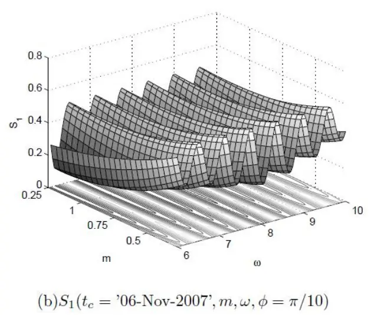
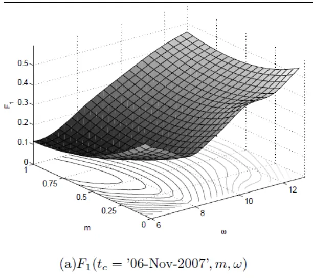
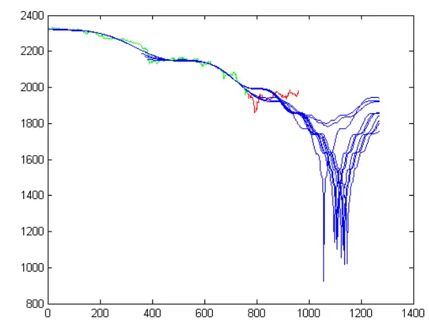
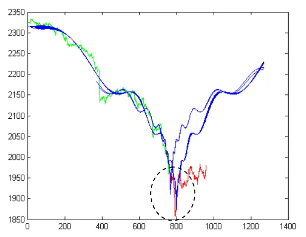
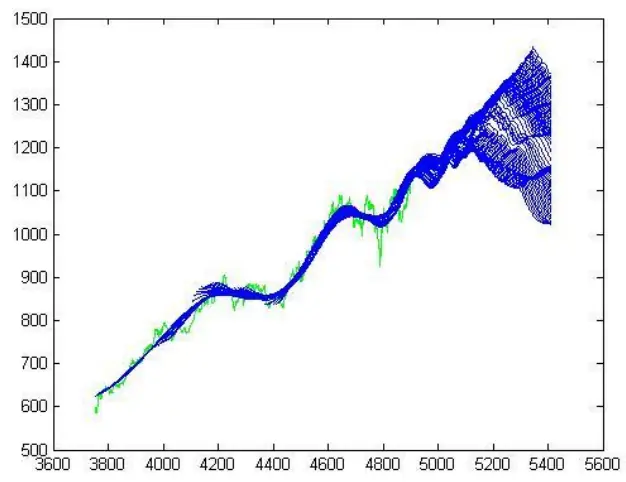
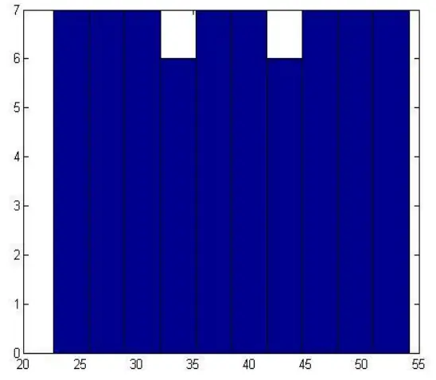
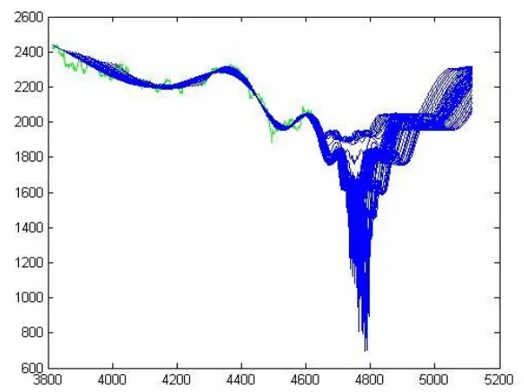
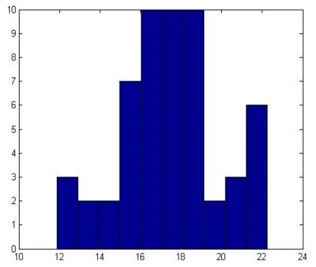

2013.07.16

# 更快更准更稳的拐点预测：地震模型新进展

## ——数量化专题之二十七

刘富兵（分析师）

严佳炜（分析师）

8 021-38676673

021-38674812

liufubing008481@gtjas.com

yanjiawei008776@gtjas.com

证书编号 S0880511010017

S0880512110001

## 本报告导读：

采用更快更准更稳的程序，对地震模型作了最新改进。最新结果显示创业板的上涨趋势在 8 月中旬前不会结束，而大盘的下跌趋势尚未结束。

## 摘要：

[Table_Summary] • 自 12 年我们推出 LPPL 模型暨地震模型以来,市场反响强烈。地震模型，全名是 LPPL(Log-Periodic Power Law)模型（对数周期性幂律模型），因其最早用于地震等地球物理现象研究，故我们将该模型形象地称为“地震模型”。

自被用于预测 A股市场走势的拐点以来，该模型取得了不少成功案例。其曾成功预测过大盘 12年3月6日的大幅回调、12 年4月5日的大幅反弹、12年 4月22-23日的短线回调、12 年9月底的反弹、13年2月中下旬的回调、13年6月25日的反弹，创业板13年3月份的短线回调及13年7月4日下午的回调，还有日经指数 13 年 5 月的大幅回调、13 年恒生指数的回调以及 13年美元兑日元的回调等等。

即便如此,地震模型仍有不尽如人意的地方。尽管可以通过分步优化将估计参数由 7维降到 4维，但在非线性优化中待估参数越多，结果就越不稳定，也越容易陷入局部求解。因此,实际中就会出现地震模型预测结果不稳定且精确度不够的现象。

- 为此，我们运用数学的魅力，将 4维参数降到了3维，并最终降到了 1维。降维后的地震模型在拐点预测方面更精准而且更为稳定；在运算时间上，改进后的方法在速度上提高了4 倍。

利用截至到 13年7月16日的最新数据进行拟合，最新的地震模型认为创业板的上涨趋势仍未结束，最早在 8 月中旬后才会出现拐点。对于大盘，地震模型认为 2448 点以来的下跌趋势尚未结束，更大级别的反弹起码在 8 月初以后才会出现。

金融工程

## 金融工程团队：

刘富兵：（分析师）

电话：021-38676673

邮箱：liufubing008481@gtjas.com

证书编号：S0880511010017

何苗：（分析师）

电话：010-59312710

邮箱：hemiao@gtjas.com

证书编号：S0880511010049

## 杨喆：（分析师）

电话：021-38676442

邮箱：yangzhe@gtjas.com

证书编号：S0880511010020

## 严佳炜：（分析师）

电话：021-38674812

邮箱：yanjiawei008776@gtjas.com

证书编号：S0880512110001

## 耿帅军：（研究助理）

电话：010-59312753

邮箱：gengshuaijun@gtjas.com

证书编号：S0880111110128

## 徐康：（研究助理）

电话：021-38674939

邮箱：xukang010849@gtjas.com

证书编号：S0880111090058

## 陈睿：（研究助理）

电话：021-38675861

邮箱：chenrui012896@gtjas.com

证书编号：S0880112120012

## 刘正捷：（研究助理）

电话：021-38675860

邮箱：liuzhengjie012509@gtjas.com

证书编号：S0880112080087

《目标风险基金——定位精准的一站式资产配臵产品》2013.06.02

《2013年7月沪深300指数成分股调整预测》2013.05.04

《2013 年一季度国泰君安阳光私募产品评级及私募市场分析》2013.04.22

## 1. 地震模型回顾

自 12 年我们推出 LPPL 模型暨地震模型以来,市场反响强烈,而且该模型在拐点择时方面确实把握的比较到位。现我们将地震模型的原理再做简要回顾：

地震模型，全名是 LPPL(Log-Periodic Power Law)模型（对数周期性幂律模型），因其最早用于地震等地球物理现象研究，我们将其形象地称为“地震模型”。

地震模型用于金融市场泡沫研究，是基于交易者之间的相互模仿，这些局部相互作用可形成正反馈，从而导致泡沫和反泡沫的产生，因此可用于金融泡沫和反泡沫的建模和预测。金融市场反泡沫表现在价格演化中，即价格演化呈现出对数周期性振荡且振荡周期不断延长。金融泡沫恰好与之相反，表现为振荡周期不断缩短。该模型可以很好的预测、量化投机性泡沫的市场崩盘，而且这类崩盘具有一个很明显的特征：市场价格价格为对数周期震荡且呈现幂律法则加速，系统越靠近临界点会出现一连串的逐渐缩短的震荡循环。具体函数形式如下：

$$
\ln p\left(t\right)=A+B\left(t_{c}-t\right)^{m}+C\left(t_{c}-t\right)^{m}\cos\left[\omega\ln(t_{c}-t)-\varphi\right]
$$

其中

$p\left(t\right)>0$ 在时间为 t时的价格（指数）

$A>0$ ,是指假如泡沫持续到临界时间 $t_{_{c}}$ ，则 $p\left(t\right)$ 将可能达到的价格;

$B<0$ 是表明价格是向上的加速过程。

C 是围绕指数增长的一个波动幅度量值，量化对数周期震动

$t_{c}>0$ 是泡沫破裂的临界时间；

$t<t_{c}$ 是泡沫破灭前的任意时间

$0<m<1$ 是幂指数，衡量价格上涨的加速程度

是泡沫期波动的角频率

$0<\varphi<2\pi$ ，表示周期波动的初相位。

$B\left(t_{c}\mathrm{~-~}t\right)^{m}$ 幂 律 项 描 述 了 价 格 的 加 速 来 自 正 向 反 馈 机 制 ，$C\left(t_{c}-t\right)^{m}\mathrm{~c~}\mathsf{oas}[t_{c}]\mathsf{-}\mathsf{n}t\left(-\varphi\right)$ ) ]项中的周期项对超指数行为的修正。

由地震模型的表达式可以看出，地震模型存在两个显著特征：

一是对数周期性振荡, 在线性尺度下, 越接近临界时间, 振荡频率越快,但在对数尺度下, 振荡频率为常数;

二是幂律增长,或称超指数增长，即价格的增长率不是常数，而是单调递增。

自被用于预测 A股市场走势的拐点以来，该模型取得了不少成功案例。其曾成功预测过大盘 12 年 3 月 6 日的大幅回调、12 年 4 月 5 日的大幅反弹、12 年 4 月 22-23 日的短线回调、12 年 9 月底的反弹、13 年 2 月中下旬的回调、13年 6月 25日的反弹，创业板 13年 3月份的短线回调及 13 年 7月 4日下午的回调，还有日经指数 13年 5月的大幅回调、13年恒生指数的回调以及 13年美元兑日元的回调等等。

即便如此,地震模型仍有不尽如人意的地方,因为实际中经常会出现地震模型预测结果不稳定且精确度不够的现象。

## 2. 地震模型最新改进

地震模型中最关键的就是参数估计，尽管我们可以通过分步优化将估计参数由 7维降到 4维，但在非线性优化中待估参数越多，结果就越不稳定，也越容易陷入局部求解。我们认为，待估参数过多正是地震模型结果不稳定的最大元凶。因此，我们尽可能减少非线性参数个数，一方面避免使用耗时较多、复杂度高的全局搜索算法，另一方面提升计算结果的精度。

## 2.1.非线性参数降维-数学之美

有时候数学就如同魔法师，通过一些简单的变换与手法，就能达到意想不到的效果。在中学我们都学过三角函数的两角差公式，其中有一个公式是：

$$
\cos(X-Y)=\cos X\cos Y+\sin X\sin Y
$$

利用该公式，我们可以将原来的地震模型重新写为：

$$
\mathrm{~ln~}p\left(t\right)=A+B\left(t_{c}-t\right)^{m}+C\left(t_{c}-t\right)^{m}\cos\left[\omega\ln(t_{c}-t)\right]\cos\varphi+C\left(t_{c}-t\right)^{m}\sin\left[\omega\ln(t_{c}-t)\right]\sin\varphi
$$

令

$$
C_{_1}=C\cos\varphi,C_{_2}=C\sin\varphi
$$

则地震模型可以改写为：

$$
\mathrm{~ln~}p\left(t\right)=A+B\left(t_{c}-t\right)^{m}+C_{1}\left(t_{c}-t\right)^{m}\cos\left[\omega\ln\left(t_{c}-t\right)\right]+C_{2}\left(t_{c}-t\right)^{m}\sin\left[\omega\ln\left(t_{c}-t\right)\right].
$$

利用最小二乘思想,我们设目标函数为:

$$
F\left(t_{c},\omega,\varphi,A,B,C_{1},C_{2}\right)=\sum_{i=1}^{n}\left[\ln p\left(t_{i}\right)-A-B\left(t_{c}-t_{i}\right)^{m}-C_{1}\left(t_{c}-t_{i}\right)^{m}\cos\left[\omega\ln(t_{c}-t_{i})\right]\right]^{\theta},
$$

$$
\mathbb{M}\lVert(\hat{t}_{c},\hat{\omega},\hat{\varphi},\hat{A},\hat{B},\hat{C}_{1},\hat{C}_{2})=\underset{t_{c},\omega,\varphi,A,B,C_{1},C_{2}}{\arg\operatorname*{min}}F\left(t_{c},\omega,\varphi,A,B,C_{1},C_{2}\right)
$$

事实上,可以证明

$$
\big(\hat{t}_{_c},\hat{\omega},\hat{\varphi}\big)=\underset{t_{c},\omega,\varphi}{\mathrm{arg~m~in~}}F_{_1}(t_{_c},\omega,\varphi)
$$

$$
F_{\scriptscriptstyle1}(t_{\scriptscriptstyle c},\omega,\varphi)=\operatorname*{min}_{\substack{A,B,C_{1},C_{2}}}F\left(t_{\scriptscriptstyle c},\omega,\varphi,A,B,C_{\scriptscriptstyle1},C_{\scriptscriptstyle2}\right)
$$

线性参数估计 $(\hat{A},\hat{B},\hat{C}_{1},\hat{C}_{2})$ 可以通过如下方程来求解：

$$
\begin{array}{rl}&{\lceil\begin{array}{llllll}{N}&{\sum f_{i}}&{\sum g_{i}}&{\sum h_{i}}&{\prod\ A}&{|\ \Gamma\ne\ \ln\ p_{i}}\\{\sum f_{i}}&{\sum f_{i}^{2}}&{\sum f_{i}g_{i}}&{\sum f_{i}h_{i}}&{|\ \prod\ B|}&{|\ \sum\ f_{i}\ln\ p_{i}}\\{\sum g_{i}}&{\sum f_{i}g_{i}}&{\sum g_{i}^{2}}&{\sum g_{i}h_{i}}&{|\ \ \Gamma|_{1}}&{|\ \sum\ g_{i}\ln\ p_{i}}\end{array}\rceil}\\&{\lfloor\begin{array}{ll}{\sum h_{i}}&{\sum f_{i}h_{i}}&{\sum g_{i}^{2}}&{\sum g_{i}h_{i}}\\{\sum h_{i}}&{\sum f_{i}h_{i}}&{\sum g_{i}h_{i}}&{\sum h_{i}^{2}}&{\displaystyle\lfloor C_{2}\rfloor}&{\displaystyle\lfloor C_{i}\ln\ p_{i}\rfloor}\end{array}\rfloor}\\&{\lfloor\begin{array}{ll}{\sum h_{i}\ln\ p_{i}}&{\sum g_{i}h_{i}}&{\sum\ h_{i}}\end{array}\rfloor\lfloor\begin{array}{ll}{C_{1}}\\{C_{2}}\end{array}\rfloor}&{\lfloor\begin{array}{ll}{\sum h_{i}\ln\ p_{i}}\\{\sum h_{i}\ln\ p_{i}}\end{array}\rfloor}\\&\lfloor\begin{array}{ll}{\sum h_{i}\ln(\int(\frac{-\tau_{i}}{\tau_{i}}))}&\displaystyle\lfloor C_{2}\ln(\int(\frac{-\tau_{i}}{\tau_{i}}\end{array}\end{array}
$$

如此，非线性参数估计由 4 维空间降到了 3 维空间，只需要要估计( , , )t m • 即可。

由于非线性参数的影响，目标函数存在多个局部最小点。在四个非线性参数情况下，为了搜索全局最小点，则势必需要用到算法复杂度很高的全局启发式搜索算法（基因算法、模拟退火、Tabu Search 等）。全局启发式算法复杂度高，计算慢，拟合精度又不高，是造成地震模型测算不精确的主要原因。我们通过非线性参数的降维，大幅降低了非线性拟合的复杂度，提高了拟合精度。

更重要的是：在四个非线性参数版本的目标函数中，参数 使得目标函数表现出拟周期性，也就是说，如果固定其他参数，随着 的变动，目标函数会表现出周期性质，也就是会出现多个局部最小点（如图 1、图2），这样在对 进行优化的时候，就很难找寻到全局最小值。通过降维的方法就避免了多局部最小点的问题，使得求解的时候不必使用全局优化算法，用简单的局部优化算法（LM、单纯形等）就足够了。

图 1 四个非线性参数——多个局部最小点

数据来源：国泰君安证券研究
注：固定其他参数，变动m,w

图 2 三个非线性参数——一个局部最小点

数据来源：国泰君安证券研究

## 2.2. 非线性参数估计-Critical Time 是关键

基于临界点 $\boldsymbol{\cdot}\boldsymbol{t}_{\iota}$ 在预测拐点中的重要性，我们需要对该参数给予格外重视。受线性参数与非线性参数估计分离的启发，我们引入参数之间存在函数隶属关系的思想，即：在所有的参数中， $t_{c}$ 是最重要的， $\sqrt{n}(m,\omega)$ 都可以表示成 $\boldsymbol{\cdot}\boldsymbol{t}_{c}$ 的函数 $(m\left(t_{_c}\right),\omega\left(t_{_c}\right))$ 。则对非线性参数的估计可以分步优化求解，其中 $t_{_{c}}$ 的最优估计为：

$$
\hat{t}_{{}_{c}}=\underset{{t}_{c}}{\mathrm{arg}}\underset{{t}_{c}}{\mathrm{min}}F_{{}_{2}}(t_{c})
$$

$$
\sharp\sharp\ :\mathcal{F}_{2}(t_{c})=\ :\operatorname*{min}_{m,\omega}\ :F_{1}(t_{c},m,\omega)
$$

而 $(m\left(t_{_c}\right),\omega\left(t_{_c}\right))$ 的最优估计 $(\hat{m}\left(t_{c}\right),\hat{\omega}\left(t_{c}\right))$ 为

$$
(\hat{m}(t_{c}),\hat{\omega}(t_{c}))=\underset{m,\omega}{\mathrm{arg}}\mathrm{min}F_{1}(t_{c},m,\omega)
$$

如此，我们在估计 $t_{_{c}}$ 时，只要一维参数，即便是在 $(m\left(t_{c}\right),\omega\left(t_{c}\right))$ 的估计过程中也只用到了 2维，大大提高了参数估计的稳定性。

## 2.3.模型改进后的效果

简单地举个例子，以说明新方法的优势。以 2013/5/29 9:35:00 至 2013/6/2415:00:00 的 5分钟高频行情为例，预测下跌波的结束时点。

图 3 四个非线性参数——结果不稳定

数据来源：国泰君安证券研究

图 4 三个非线性参数——稳定，精准！

数据来源：国泰君安证券研究
注：绿色为样本内数据，红色为样本外真实走势，兰色为拟合走势，下同。

可以看到，四个非线性参数拟合的老方法拟合效果很差，Critical Time时间点与预测的最低点点位很离谱。但改进后的方法，则能够非常精确地判断反弹时点与反弹点位。

此外，在运算时间上，改进后的方法在速度上提高了 4倍。速度的提高有利于该模型在高频交易上得以更好的实施。

## 3. 地震模型的最新预测

## 3.1.创业板指真的到头了吗？

毫无疑问，2013年是创业板市场的大牛市，投资者最为关注的是，创业板真的到头了吗？如果没有，到底何时到头？我们的地震模型或许可以给投资者一个参考。

利用地震模型对创业板指 2012/12/4 10:00:00 至 2013/7/16 15:00:00 的 30分钟线数据进行拟合，我们发现创业板的上涨趋势仍未结束。

由图 5-图 6 可以发现，创业板指发生拐点的最早时间出现在 20 个交易日以后，即最早在 8月中旬才会出现拐点。在此之前，我们认为创业板指的上涨趋势不变。

图 5 地震模型对创业板指的拟合走势

数据来源：国泰君安证券研究

图 6 地震模型预测创业板指拐点时间分布图

## 3.2.大盘下跌趋势真的结束了吗？

除了创业板以外，大盘估计是投资者最为关注的。自 6 月 25 日创出了1849 的近期新低以后，大盘强势反弹 200 多点，大盘的下跌趋势真的结束了吗？

利用地震模型对上证综指 2013/2/8 10:00:00 至 2013/7/16 15:00:00 的 30分钟线数据进行拟合，我们发现大盘的下跌趋势尚未结束。

由图 7-图 8 可以发现，大盘自 2448 点以来的下跌趋势尚未结束，更大

级别的反弹起码在 8月初才能出现。

图 7 地震模型对大盘的拟合走势

数据来源：国泰君安证券研究

图 8 地震模型预测大盘拐点时间分布图

## 本公司具有中国证监会核准的证券投资咨询业务资格

## 分析师声明

作者具有中国证券业协会授予的证券投资咨询执业资格或相当的专业胜任能力，保证报告所采用的数据均来自合规渠道，分析逻辑基于作者的职业理解，本报告清晰准确地反映了作者的研究观点，力求独立、客观和公正，结论不受任何第三方的授意或影响，特此声明。

## 免责声明

本报告仅供国泰君安证券股份有限公司（以下简称“本公司”）的客户使用。本公司不会因接收人收到本报告而视其为本公司的当然客户。本报告仅在相关法律许可的情况下发放，并仅为提供信息而发放，概不构成任何广告。

本报告的信息来源于已公开的资料，本公司对该等信息的准确性、完整性或可靠性不作任何保证。本报告所载的资料、意见及推测仅反映本公司于发布本报告当日的判断，本报告所指的证券或投资标的的价格、价值及投资收入可升可跌。过往表现不应作为日后的表现依据。在不同时期，本公司可发出与本报告所载资料、意见及推测不一致的报告。本公司不保证本报告所含信息保持在最新状态。同时，本公司对本报告所含信息可在不发出通知的情形下做出修改，投资者应当自行关注相应的更新或修改。

本报告中所指的投资及服务可能不适合个别客户，不构成客户私人咨询建议。在任何情况下，本报告中的信息或所表述的意见均不构成对任何人的投资建议。在任何情况下，本公司、本公司员工或者关联机构不承诺投资者一定获利，不与投资者分享投资收益，也不对任何人因使用本报告中的任何内容所引致的任何损失负任何责任。投资者务必注意，其据此做出的任何投资决策与本公司、本公司员工或者关联机构无关。

本公司利用信息隔离墙控制内部一个或多个领域、部门或关联机构之间的信息流动。因此，投资者应注意，在法律许可的情况下，本公司及其所属关联机构可能会持有报告中提到的公司所发行的证券或期权并进行证券或期权交易，也可能为这些公司提供或者争取提供投资银行、财务顾问或者金融产品等相关服务。在法律许可的情况下，本公司的员工可能担任本报告所提到的公司的董事。

市场有风险，投资需谨慎。投资者不应将本报告为作出投资决策的惟一参考因素，亦不应认为本报告可以取代自己的判断。在决定投资前，如有需要，投资者务必向专业人士咨询并谨慎决策。

本报告版权仅为本公司所有，未经书面许可，任何机构和个人不得以任何形式翻版、复制、发表或引用。如征得本公司同意进行引用、刊发的，需在允许的范围内使用，并注明出处为“国泰君安证券研究”，且不得对本报告进行任何有悖原意的引用、删节和修改。

若本公司以外的其他机构（以下简称“该机构”）发送本报告，则由该机构独自为此发送行为负责。通过此途径获得本报告的投资者应自行联系该机构以要求获悉更详细信息或进而交易本报告中提及的证券。本报告不构成本公司向该机构之客户提供的投资建议，本公司、本公司员工或者关联机构亦不为该机构之客户因使用本报告或报告所载内容引起的任何损失承担任何责任。

## 评级说明

## 1.投资建议的比较标准

投资评级分为股票评级和行业评级。

以报告发布后的12个月内的市场表现为比较标准，报告发布日后的12个月内的公司股价（或行业指数）的涨跌幅相对同期的沪深300指数涨跌幅为基准。

## 2.投资建议的评级标准

报告发布日后的 12 个月内的公司股价（或行业指数）的涨跌幅相对同期的沪深300指数的涨跌幅。

|  | 评级 说明 |  |
| --- | --- | --- |
| 股票投资评级 | 增持 | 相对沪深300指数涨幅15%以上 |
|  | 谨慎增持 | 相对沪深300指数涨幅介于5%～15%之间 |
|  | 中性 | 相对沪深300指数涨幅介于-5%～5% |
|  | 减持 | 相对沪深300指数下跌5%以上 |
| 行业投资评级 | 增持 | 明显强于沪深 300指数 |
|  | 中性 | 基本与沪深 300指数持平 |
|  | 减持 | 明显弱于沪深 300指数 |

## 国泰君安证券研究

|  | 上海 | 深圳 | 北京 |
| --- | --- | --- | --- |
| 地址 | 上海市浦东新区银城中路168号上海 银行大厦29层 | 深圳市福田区益田路 6009 号新世界 商务中心34层 | 北京市西城区金融大街 28 号盈泰中 心2号楼10层 |
| 邮编 | 200120 | 518026 | 100140 |
| 电话 | （021)38676666 | (0755)23976888 | (010)59312799 |
|  | E-mail: gtjaresearch@gtjas.com |  |  |