2013.07.29

# 基于技术分析的量化投资再思考

## ——数量化专题之二十八

刘富兵（分析师）

赵延鸿（研究助理）

8 021-38676673

021-38674927

liufubing008481@gtjas.com

证书编号 S0880511010017

zhaoyanhong@gtjas.com

S0880113070047

## 本报告导读：

对技术分析三个假设的再思考；真实价格序列和随机价格序列的区别；基于技术分析的量化投资策略构建两个侧重点：一、定义趋势；二、多级别联立。

## 摘要：

[Table_Summary]• 技术分析中第二个假设“价格沿着趋势移动，并保持趋势”，最大的问题在于“什么是趋势”需要严格定义，否则一个模糊的假设带来的只能是模糊的操作。我们提供两种定义趋势的方法：一、趋势为满足某个给定涨跌幅度的波段；二、考虑时间周期的 MACD的分段方法。有多少种定义趋势的方法，就有多少种分析市场微观结构的途径。任何定义趋势的方法都不是最完美的，本质上都是对价格走势分解的一种手段。

关于价格需要思考的二个问题：一、价格是不是随机的？二、是否存在一种理论或方法能够证明或能够区分随机价格序列和真实价格序列的差异性？第二个问题能够得到解答或者找到解决途径的意义在于：给实际投资操作找到一种有效方法。换言之，我们不操作那些随机特征强的价格序列，只操作那些随机特征弱的价格。理论上，如果不能从多个角度发现随机价格序列和真实价格的差异性，那么任何技术指标用到随机价格序列上，也一样能发出买入卖出信号。

基于价格形态强弱系数的计算显示：上证综指和标普500指数较随机价格序列有很强的“趋势”特征。从2000年1月4日至 2013年3月15日，价格形态系数取 1的交易日，占比11.1%，换言之，每 10 个交易日就有一个交易日是严格的 8条均线多头排列；反之，价格形态系数取-1的交易日，占比9.23%。这种情况在美国股市表现更为突出，同样时间窗口，标普 500 指数价格形态系数取 1 的交易日，占比 14.5%，即每 7个交易日就有一个交易日是严格的 8条均线多头排列。而通过对 BS 模型产生的随机价格序列选取样本数据 234600个，计算结果显示：价格形态强弱系数为 1的概率为6.8%，即八条均线严格多头排列；价格形态强弱系数为负1的概率为 6.8%，即八条均线严格空头排列。

金融工程

## 金融工程团队：

刘富兵：（分析师）

电话：021-38676673

邮箱：liufubing008481@gtjas.com

证书编号：S0880511010017

何苗：（分析师）

电话：010-59312710

邮箱：hemiao@gtjas.com

证书编号：S0880511010049

## 杨喆：（分析师）

电话：021-38676442

邮箱：yangzhe@gtjas.com

证书编号：S0880511010020

## 严佳炜：（分析师）

电话：021-38674812

邮箱：yanjiawei008776@gtjas.com

证书编号：S0880512110001

## 赵延鸿：（研究助理）

电话：021-38674927

邮箱：zhaoyanhong@gtjas.com

证书编号：S0880113070047

## 耿帅军：（研究助理）

电话：010-59312753

邮箱：gengshuaijun@gtjas.com

证书编号：S0880111110128

## 徐康：（研究助理）

电话：021-38674939

邮箱：xukang010849@gtjas.com

证书编号：S0880111090058

## 陈睿：（研究助理）

电话：021-38675861

邮箱：chenrui012896@gtjas.com

证书编号：S0880112120012

## 刘正捷：（研究助理）

电话：021-38675860

邮箱：liuzhengjie012509@gtjas.com

证书编号：S0880112080087

## [Table_R相关报告

《更快更准更稳的拐点预测：地震模型新进展》2013.07.16

《海外商品 ETP 市场历史与现状》2013.06.30

《CTA：海外绝对收益之路》2013.06.25

《目标风险基金——定位精准的一站式资产配臵产品》2013.06.02

《2013年7月沪深300指数成分股调整预测》2013.05.04

量化投资研究离不开价格序列，而纯粹基于价格序列的量化投资策略，因为信息维度单一，所以更值得深入探讨与分析。投资者日复一日地使用着各类已有的技术指标，并继续开发新的指标，改进已有的模型，同时开发着其他的量化模型，所有工作都指向一个目标：长期稳定战胜市场。这些指标与模型的背后都离不开价格，但投资者更重视指标和模型是否能从市场的波动中获利，却很少从最基础最根源处去思考价格。价格为什么会涨跌？随机价格和真实价格序列有什么区别？价格到底具有什么样的规律？什么是价格的趋势？等等。如果能把这些问题探讨得比较清楚，构造量化交易策略就会变得水到渠成，也能够避免模型失效时带来的困惑。但毫无疑问，弄清楚以上这些问题，需要大量的实证，甚至离不开哲学层面的思考。以后的工作中，除了构建量化投资策略，我们也会重视这方面的研究工作。

## 1. 技术分析三个假设的再思考

量化投资发展到今天，可分为基本面量化投资和技术面量化投资两大流派，基本面量化投资主要以多因子模型为代表，融合了宏观经济数据、财务指标、行业景气指标、风格、估值、动量等影响市场价格变动的因子；技术面量化投资主要是基于价格和成交量为主的投资方法，尤其注重对买卖时点的把握。

技术分析又可以分为狭义技术分析和广义技术分析两个范畴。狭义技术分析主要是指通过看图表，并借助各类技术指标如均线系统、MACD、KDJ 和布林线等对当下走势做出判断，锁定买卖点，进行交易。而广义技术分析则是运用复杂数学统计工具和模型来对市场数据进行再加工，从中发现价格运行的规律，对投资提供更科学更精确的指导。这类工具从简单的回归分析到复杂的神经网络，还有各种各样的统计模型。需要指出的是，在金融交易领域，工具的有效性和复杂性没有必然联系。

无论是狭义技术分析和广义技术分析，证券投资分析教程上都会提到三个假设：①市场行为涵盖一切信息；②价格沿着趋势移动，并保持趋势；③历史会重复。提到技术分析，众所周知，道氏理论是技术分析的鼻祖，在雷亚的著作《道氏理论》一书中，他论述了“道氏理论”中极其重要的三个假设和五个“定理”，和技术分析的三个假设大同小异，其中对趋势的分类更精细到基本趋势、次等趋势和小趋势。其中基本趋势是大规模的、中级以上的上下运动，通常（但非必然）持续1年或有可能数年之久；次等趋势价格在其沿着基本趋势方面演进中产生的重要回撤；小趋势是非常简短的（很少持续三周以上，一般小于6天）价格波动，从道氏理论的角度来看，其本身并无多大的意义，但它们合起来构成中等趋势。以上这些表述都是偏经验性的，下面我们会针对技术分析的三个假设做进一步的思考。

## 1.1.价格是否充分反映一切信息？

技术分析的三个假设中，第一个假设“市场行为涵盖一切信息”本质就是有效市场理论，有效市场理论是一个虽然重要却又无法证明对错的理论，因为在任何一个当下，我们都无法知道股票价格是不是充分反映一切信息，毕竟股票价格是当下投资者交易的结果，背后反映的是人心的变化，而人心的变化又受到方方面面因素的影响。但我们又不得不承认有效市场理论的重要性，因为任何能够影响股价的重要信息最终都要反映到股价上，换言之，市场在当下是否有效是不可知的，可知的是市场是趋于有效的，趋于有效既意味着当下价格可能已经充分反映了所有信息，也可能尚未反映当前影响价格的所有信息，但最终价格会反映这些信息。

缠中说禅理论对此有很好的表述“市场价格是否完全反映所有信息，可以随意假定，无论何种假定，都和实际的交易关系不大。交易中，唯一需要明确的，就是无论市场价格是否完全反映信息，都必须以市场的价格交易，而交易将构成市场的价格，对于交易来说，除了价格，一无所有（成交量可以看成是在一个最低的时间段内按该价格重复成交了成交数量个交易单位）。这一切，和市场价格是否反映所有信息毫无关系，因为所有价格都是当下的，如果当下的信息没被市场反映，那他就是没被市场当下反映的信息，至于会不会被另一个时间的价格反映是另外的事情。站在纯交易的角度，价格只有当下，当下只有价格，除了价格与依据时间延伸出来的走势，市场的任何其他东西都是可以忽略不计的”。

综上所述，可以知道从量化投资研究角度来看，有效市场理论属于一个很难切入的领域，而站在交易角度，尊重当下的价格走势远比臆测当前价格是否充分反映了市场的信息更重要，所以我们不在这个方向做进一步的探讨。

## 1.2. 什么是趋势？

第二个假设“价格沿着趋势移动，并保持趋势”，这个表述表面看是有道理的，因为打开任何时间周期的价格走势图，都会看到一段段上下交替的走势，但这个假设最大的问题在于“什么是趋势”没有定义清楚，如果“什么是趋势”不能给出明确的定义，那么“价格沿着趋势移动，并保持趋势”这个表述就会变得非常模糊，一个模糊的假设带来的只能是模糊的操作。这也是为什么道氏理论不得以做了如下总结：“道氏理论是客观化的分析理论——成功利用它协助投机或投资行为，需要深入研究，并客观判断。当主观使用它时，就会不断犯错，不断亏损”。也有市场研究的统计结果显示“市场中95％的投资者运用的是主观化操作，这95％的投资者绝大多数属于“七赔二平一赚”中的那“七赔”人士”。所以量化投资策略构建过程中，技术分析很重要的一个基础性工作需要定义“什么是趋势”。

在我们以前的研究报告《波段结构的划分与应用》中，我们首次给出了趋势的一种定量描述方法，在报告中，趋势被定义为满足某个给定涨跌幅度的波段，涨跌幅度不同，价格的波段结构不同，但存在一个很重要的定理：大的涨跌幅划分的波段结构是小的涨跌幅划分的波段结构的子集。有了涨跌幅划分的结构，我们就可以看到价格沿着波段不断上升和下降，而这些波段能成为一个趋势的关键在于其涨跌幅度是否满足给定的要求。

以下图为例，分别是用 5%和 10%对上证综指价格分段图，在 10%的分段图上，每一个上涨波段的涨幅都在 10%以上，每一个下跌波段的跌幅都在 9.09%以上（注：9.09%是 10%的等价数，（1+10%）（1-9.09%）=1）。

图 1上证综指波段结构图（以 5%作为涨幅参数）
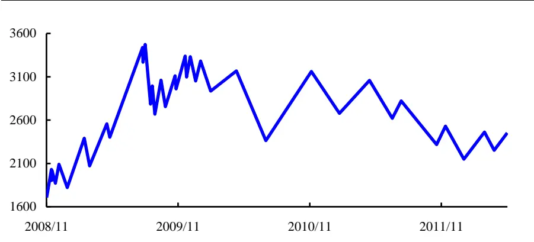
数据来源：国泰君安证券研究

图 2上证综指波段结构图（以 10%作为涨幅参数）
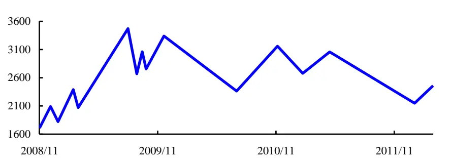
数据来源：国泰君安证券研究

随着涨幅参数的增大，拐点和波段的数量会减少，波段图变得越来越稀疏。正如前所述，有两点很重要：一、用大的参数划分得到的拐点一定是用小的参数划分得到拐点的子集；二、越大的参数划分得到的波段代表越大的趋势。比如用 15%对上证综指分段，当下仍处于下跌走势；如果用 5% 来进行波段划分，当下处于一个中小级别的上涨。需要进一步指出的是，通过涨跌幅度来定义价格趋势，并没有改变价格本身走势，只是把不在考虑范围内的“价格扰动”抹平，从而显示出价格简洁的走势结构。当然，基于涨跌幅定义趋势还有很多实际应用，如开发研究市

票价格的内在运行规律。

基于涨跌幅划分波段来定义趋势，是定义趋势的方法之一，有多少种定义趋势的方法，就有多少种分析市场微观结构的途径。任何定义趋势的方法都不是最完美的，本质上都是对价格走势分解的一种手段。基于涨跌幅定义趋势存在的问题是如下图所示，B图的走势比 A图复杂，复杂性表现在走势中存在一个震荡行情，但 A图相对比较简单，上涨波段只出现过一次回调，这种走势结构用涨跌幅分段是无法区分的，只要给定的涨跌幅分段参数大于 A图中的回调幅度，A和 B都会变成第三幅图形结构：一个趋势上涨+一个趋势下跌。如何区分 A和 B 两种走势结构？则用到其他的趋势定义方法，后续请关注我们的研究“基于 MACD 的分段方法介绍”。总的来讲，定义趋势的目的是对价格走势从不同角度进行分解，而分解的目的一方面发现价格的规律，另一方面对操作进行分类指导，不存在方法之间的优劣之分。

图 3波段结构示例图
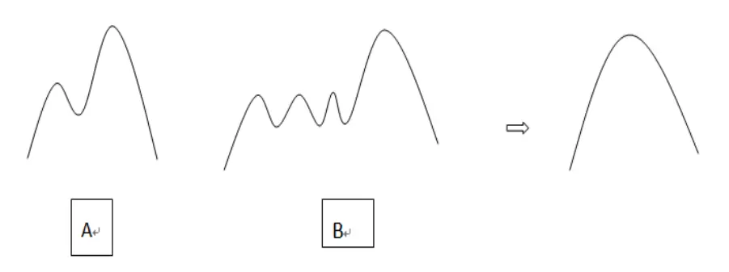
数据来源：国泰君安证券研究

## 1.3.什么历史会重复？

技术分析的第三个假设“历史会重复”。对于这个假设，首先一个问题是“这个历史是指什么？”，如果“历史是什么”弄清楚了，进一步问题“什么历史会重复？”。目前比较常见的技术方面的量化投资策略，历史都是指价格的走势，比如模式识别和分形理论，而多因子模型中，价格不是最主要的因子，主要的则是影响价格的诸多因素。所以当宏观经济环境、行业发展模式、市场风格发生改变的时候，多因子模型的有效性就会去趋于下降。一般投资者认为量化投资的基础就是历史会重演，脱离了这个基础，量化投资就变成了无根之木、无源之水。这个思想贯穿在统计套利模型、传统技术分析各类指标的使用、模式识别模型的构建等等领域。这里特别需要弄清楚的就是“什么历史会重演”。

我们之前的研究报告《股市底部特征观察》，从十多个角度来分析股市底部到底具备哪些特征，基于对样本内底部特征的观察，来确认当前底部是一个大级别的底部还是一个中级别的底部，正如报告中指出的，这些分析的结果并不存在必然的逻辑性，其合理性主要在于一个很强的假设“历史会重复”。进一步而言，历史不可能百分之百重复，所以量化研究退而求其次，提出了概率，未来是充满不确定性的，对这种不确定性的量化就体现在概率上。但我们面临的现实是：股票走势，归根结底是不可复制的。目前为止也只有在缠中说禅理论中指出但股票走势的绝妙之处就在于，不可复制的走势，却毫无例外地复制着自同构性结构，而这自同构性结构的复制性是绝对的。在这里，股票走势的自同构性结构并不是任何诸如分形之类的先验数学理论。

那么股票走势为什么不具有复制性？在缠中说禅理论举例一个很简单的实验，同一批人、同样的资金、同样的股本、同时开始股票运行的实验，显然，这个实验是不可重复的。因为股票走势，归根结底是参与者心理合力的痕迹，而心理是不可重复的。而几千万、上亿人的交易的可复制性，就更没可能了。为什么？每天都是新世界，影响市场的因素，每天都在变化着，而这些因素对市场参与者的心理影响，更是模糊、混沌，由此产生的走势，很显然不具有任何百分百复制的可能性。在这里讲到的走势的可复制性或者历史的可重复性，都是站在非常严格的意义上，简而言之，在任何时间级别上，无论是分钟线、小时线、日线、周线还是月线、年线找到两段一模一样走势都几乎是不可能的。至于如何定义“一模一样的走势”？从量化角度，就因需而定。比如某个走势由连续 10 个交易日的行情构成，可以简化为“1010001111”，其中 1 代表当日涨，0 代表当日跌，在一个长时间的价格序列中要找出两段这样的走势是可能的，但概率极低。更不用说再考虑涨跌幅度等精细化指标。

所以目前量化研究对“历史是重复的”这个假设只能建立在两点上：第一、重复的对象的定义；第二、重复性的概率。在多因子模型中，重复的对象就是多因子的选取和因子的权重；在统计套利中，重复的对象就是具备均衡回归特征的两个价格序列；在传统的技术指标中，重复的对象就有很多很多，譬如 5 日线与 10 日线金叉是买点，顶部十字星伴随成交量放大是卖点等等。当然这些简单模式被无数人研究过，其持续战胜市场的有效性不断被质疑被推翻，所以在这个领域会有无数人继续研究更复杂的模式，而这些研究归根结底都是在寻找一个可以重复的对象。目前为止，在我们对“走势的复制性“有更深层次的理解之前，研究工作还会停留在重复对象的选取和重复性概率计算两个环节。

## 1.4.关于价格需要思考的二个问题

通过以上对技术分析三个假设的再思考之后，我们会把研究的侧重点放在“定义趋势”和“选取能够重复的对象”两个方面。这两个维度理解得越清楚，就越容易构建量化投资策略，为了更好地理解这两个问题，首先需要思考两个关于价格问题：

## 1、价格是不是随机的？

2、是否存在一种理论或方法能够证明或能够区分随机价格序列和真实价格序列的差异性？

如果第 2个问题能够得到解答或者找到解决的途径，那么就等于给实际投资操作找到了一种方法。换言之，我们不操作那些随机特征强的价格序列，只操作那些随机特征弱的价格，怎么算是随机特征强或者弱则需要严格去定义和分析。

第 1个问题的解答已有相关文献，但有一点是肯定的，几乎所有的回答都是基于对样本数据的统计检验上，而且往往是对收益率分布的统计分析，譬如收益率的肥尾等非正态分布特征。而在此报告中，我们从价格形态角度来观察随机价格序列和真实的价格序列之间的区别，从而指出我们平常看到的价格序列都不是随机的，都有趋势特征。

## 2. 真实价格的形态特征是什么？

一切技术分析的基础都基于一个无可争议的事实：价格是有规律的。不管是运用各种传统的技术指标,还是运用复杂的量化模型,都是如此。如果价格确实是随机运动，各类技术都将失效，是不可能长期有效地战胜市场。目前量化投资的各个领域研究中，寻找交易策略的居多，研究价格规律性者少。在报告中，我们利用之前开发的“价格形态强弱系数”这个指标来观察一下真实价格的形态特征是什么样的。以上证综指和美国标普 500指数为例，观察结果显示，真实价格的“趋势”比随机序列更强。“趋势强弱”我们用均线系统的多头和空头排列状态的时间占比来度量。

## 2.1.价格形态强弱系数的定义与计算方法

首先简单回顾一下价格形态强弱系数的定义与计算方法。

股票价格走势形态可分为三类：上涨、下跌和震荡。上涨走势表现为股价不断创出新高，最强的形态为单边上扬；相反，下跌走势表现为股价连续创出新低，最强的走势为单边下跌；震荡走势的比较复杂，一般分为两种情况：一、高点不创新高而且低点不创新低；二、高点创新高且低点创新低。以上描述偏定性，是否存在一种简单易行的量化方法来对三种形态进行分类？我们基于八条均线（8，13，21，34，55，89，144，233）自上而下的排列顺序来刻画这三种形态。当股价呈现单边上扬走势时，最极端的情形是 8条移动均线从短周期均线到长期均线依次从高到低排列；反之，当股价形成单边下跌走势时，均线从长周期到短周期依次从高到低排列。股价出现震荡走势时，短期均线与长期均线的排列顺序变得相对杂乱，不再是均线由长期到短期或者短期到长期依次排列。

基于以上三种情况的讨论，根据均线由短期到长期的排列顺序，可以定量地判断当前股价处于的形态。从排列组合可知，8 根均线的排列顺序有 40320 种可能（如果不考虑均线交叉的情形）。其中最极端的情况有两种：一是短周期均线从高到低依次排列至长周期均线，表示股价走势最强；二是长周期均线从高到低依次排列至短周期均线，表示股价最弱。其他都属于中间状态，但中间状态也存在强弱之分，比如移动均线自上而下顺序为（8，13，21，34，55，89，233，144），8 条均线中只有 233均线和 144均线位臵出现互换，这种情形也是较强的上涨形态；反之移动均线自上而下的顺序为（144，233，89，55，34，21，13，8），属于比较强势的下跌走势。

衡量此类排序的最恰当的量化指标为 Spearman 等级相关，即把均线的自上而下的排列顺序映射到一个[-1,1]的区间中，我们把这个指标称为“价格形态强弱系数”。举一个简单例子来说明计算过程，比如一支股票各期移动均线价格为（4.06（8），4.05（13），4.10（21），3.99（34），4.01（55），3.94（89），4.15（144），4.67（233））。把均线价格从高到低排序为（4.67（233），4.15（144），4.10（21），4.06（8），4.05（13），

4.01（55），3.99（34），3.94（89）），则对应的均线周期顺序为（233，144，21，8，13，55，34，89），将此序列和（8，13，21，34，55，89，144，233）求 Spearman 等级相关系数即为价格形态强弱系数。因为价格形态强弱系数是两个序列的相关系数，所以是位于区间[-1,1]之间的一个数字。显然价格形态系数为 1时，价格走势呈单边上扬，价格形态系数为-1，价格走势为单边下跌，如果是 0的话，则表现为一种震荡形态，介于之间的数字代表了走势的相对强弱。

表 1：均线的排列顺序

| 上涨最强走势均线顺序 | 当前价格均线周期顺序（价格从高到低） |
| --- | --- |
| 8 | 233 |
| 13 | 144 |
| 21 | 21 |
| 34 | 8 |
| 55 | 13 |
| 89 | 55 |
| 144 | 34 |
| 233 | 89 |

数据来源：国泰君安证券研究

斯皮尔曼等级相关是研究两列数据等级相关性的方法，它是依据两列成对数据的等级数之差来进行计算的，所以又称为“等级差数法”。斯皮尔曼等级相关对数据条件的要求没有 Pearson 相关系数严格，只要两个变量的观测值是成对出现的，不论两个变量的总体分布形态、样本容量的大小如何，都可以用斯皮尔曼等级相关来进行研究。

如果说 Pearson 相关是检验两个变量形式的，那么 Spearman 相关就是检验数据序列稳定性的。因为 Spearman 相关是与变量 X 和变量 Y 值所对应的等级有关的，而不管 X 和 Y 具体的取值；而 Pearson 相关是以具体的数值来计算的，很大程度上受具体数值的影响，而 Spearman 相关中，具体数值被转化为依次的排序。因此，当我们关心的是两个变量之间关系的稳定性而不是关系的形式时，可以使用 Spearman 相关。考虑极端情况， 比如两个序列都是严格单调增长或单调递减的， 其Spearman 相关系数要么是+1 要么是-1，而 Pearson 相关系数的大小要取决于两列数据的形式。Spearman 等级相关系数计算公式：

$$
\rho=1-\frac{6\sum d_{i}^{2}}{n\left(n^{2}-1\right)},n\quad\nk\ll\frac{\rho}{\tilde{\mathcal{Z}}}\tilde{\mathcal{Z}}\lvert\lvert\mathcal{Z}\rvert\ll\beta\rvert\ll\frac{\rho}{\mathcal{Z}},d_{i}\quad\tilde{\mathcal{K}}\tilde{\mathcal{T}}\tilde{\tilde{\mathcal{Z}}}\tilde{\mathcal{Z}}\tilde{\mathcal{Z}}_{\tilde{\mathcal{Z}}}\lesssim\frac{\rho^{2}}{\mathcal{Z}},
$$

表 2：Spearman 等级相关系数计算示例

| X1 | 等级 | X2 | 等级 | 等级差（di） | 等级差平方 |
| --- | --- | --- | --- | --- | --- |
| 2.4 | 1 | 34.5 | 4 | -3 | 9 |
| 3.7 | 3 | 23.9 | 2 | 1 | 1 |
| 3.1 | 2 | 44.3 | 5 | -3 | 9 |
| 10.8 | 5 | 12.8 | 1 | 4 | 16 |
| 5.9 | 4 | 31.2 | 3 | 1 | 1 |

数据来源：国泰君安证券研究

## 2.2.价格形态强弱系数理论值分布

虽然n 的阶乘数值巨大，但相应的 Spearman 等级相关系数较少，这一点从 Spearman 等级相关系数计算公式不难看出。比如序列 a=（2，1，3，4，5）和 b=（1，2，3，5，4）与第三个序列（1，2，3，4，5）求Spearman 等级相关系数，得到的值是一样的，尽管 a与 b的序列不同。理论上，给定一个n ，Spearman 相关系数的个数是存在解析解的。在报告中，我们直接用程序来列出相关系数所有的可能取值。比如，当n • 8时，n 的阶乘排列有 40320 种情况，但 Spearman 等级相关系数仅 85个，占比最高的是当系数取值-0.05和 0.05时，排列占比 2.64%。当n • 9时，n 的阶乘排列高达 362880，但 Spearman 等级相关系数仅 121个，占比最高的是当系数取值 0.0时，排列占比 1.84%，。

表 3：价格形态强弱系数（8均线系统，总共 85个）

| 系数 | 排列数 | 概率分布 | 系数 | 排列数 | 概率分布 | 系数 | 排列数 | 概率分布 | 系数 | 排列数 | 概率分布 |
| --- | --- | --- | --- | --- | --- | --- | --- | --- | --- | --- | --- |
| -1.00 | 1 | 0.00% | -0.50 | 394 | 0.98% | 0.02 | 845 | 2.10% | 0.52 | 517 | 1.28% |
| -0.98 | 7 | 0.02% | -0.48 | 542 | 1.34% | 0.05 | 1066 | 2.64% | 0.55 | 400 | 0.99% |
| -0.95 | 15 | 0.04% | -0.45 | 492 | 1.22% | 0.07 | 844 | 2.09% | 0.57 | 380 | 0.94% |
| -0.93 | 22 | 0.05% | -0.43 | 640 | 1.59% | 0.10 | 950 | 2.36% | 0.60 | 349 | 0.87% |
| -0.90 | 47 | 0.12% | -0.40 | 557 | 1.38% | 0.12 | 826 | 2.05% | 0.62 | 379 | 0.94% |
| -0.88 | 54 | 0.13% | -0.38 | 666 | 1.65% | 0.14 | 982 | 2.44% | 0.64 | 264 | 0.65% |
| -0.86 | 70 | 0.17% | -0.36 | 595 | 1.48% | 0.17 | 781 | 1.94% | 0.67 | 276 | 0.68% |
| -0.83 | 94 | 0.23% | -0.33 | 776 | 1.92% | 0.19 | 917 | 2.27% | 0.69 | 238 | 0.59% |
| -0.81 | 129 | 0.32% | -0.31 | 684 | 1.70% | 0.21 | 745 | 1.85% | 0.71 | 237 | 0.59% |
| -0.79 | 124 | 0.31% | -0.29 | 786 | 1.95% | 0.24 | 922 | 2.29% | 0.74 | 183 | 0.45% |
| -0.76 | 178 | 0.44% | -0.26 | 718 | 1.78% | 0.26 | 718 | 1.78% | 0.76 | 178 | 0.44% |
| -0.74 | 183 | 0.45% | -0.24 | 922 | 2.29% | 0.29 | 786 | 1.95% | 0.79 | 124 | 0.31% |
| -0.71 | 237 | 0.59% | -0.21 | 745 | 1.85% | 0.31 | 684 | 1.70% | 0.81 | 129 | 0.32% |
| -0.69 | 238 | 0.59% | -0.19 | 917 | 2.27% | 0.33 | 776 | 1.92% | 0.83 | 94 | 0.23% |
| -0.67 | 276 | 0.68% | -0.17 | 781 | 1.94% | 0.36 | 595 | 1.48% | 0.86 | 70 | 0.17% |
| -0.64 | 264 | 0.65% | -0.14 | 982 | 2.44% | 0.38 | 666 | 1.65% | 0.88 | 54 | 0.13% |
| -0.62 | 379 | 0.94% | -0.12 | 826 | 2.05% | 0.40 | 557 | 1.38% | 0.90 | 47 | 0.12% |
| -0.60 | 349 | 0.87% | -0.10 | 950 | 2.36% | 0.43 | 640 | 1.59% | 0.93 | 22 | 0.05% |
| -0.57 | 380 | 0.94% | -0.07 | 844 | 2.09% | 0.45 | 492 | 1.22% | 0.95 | 15 | 0.04% |
| -0.55 | 400 | 0.99% | -0.05 | 1066 | 2.64% | 0.48 | 542 | 1.34% | 0.98 | 7 | 0.02% |
| -0.52 | 517 | 1.28% | -0.02 | 845 | 2.10% | 0.50 | 394 | 0.98% | 1.00 | 1 | 0.00% |

数据来源：国泰君安证券研究，注：其中系数为0，总共936种情况，占比2.32%

图 4价格形态强弱系数理论值分布（8均线系统，总排列 40320）
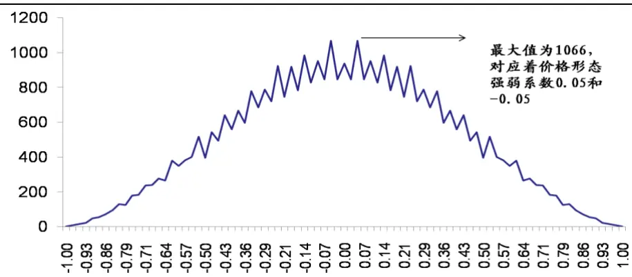
数据来源：国泰君安证券研究

图 5价格形态强弱系数理论值分布（9均线系统，总排列 362880）
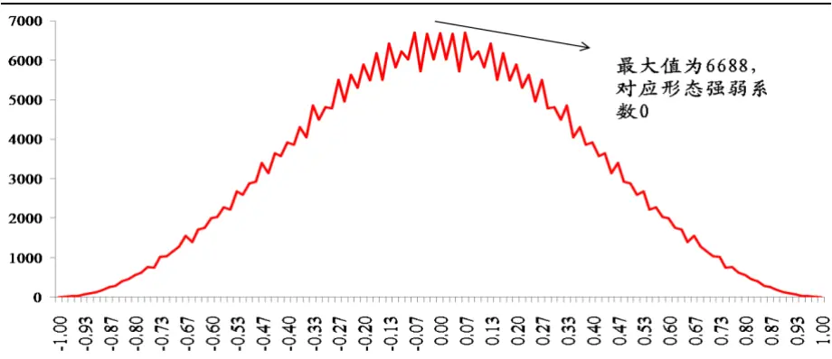
数据来源：国泰君安证券研究

从上面价格形态强弱系数理论值分布图可以看出，无论是n • 8 还是n • 9 ，其理论分布都呈凸函数特征，也就是说，对应 Spearman 等级相关系数为 1和-1的情形最少，越往中间，集中度越高。这是因为排列本来就是类似于二项式分布，由两端向中间集中。

## 2.3.上证综指的价格形态强弱系数分布

但在实际价格走势图上，我们会看到完全不同的情形。比如以上证综指为例，从 2000 年 1 月 4 日至 2013 年 3 月 15 日，价格形态系数取 1 的交易日，占比 11.1%，换言之，每 10个交易日就有一个交易日是严格的8 条均线多头排列；反之，价格形态系数取-1 的交易日，占比 9.23%。如果把价格形态系数大于 0.9 和小于负 0.9 的累计在一起，占比高达46.6%。这种情况在美国股市表现更为突出，同样从 2000年 1月 4日至2013 年 3月15日，价格形态系数取 1的交易日，占比 14.5%，换言之，每 7个交易日就有一个交易日是严格的 8 条均线多头排列，如果把价格形态系数大于 0.9和小于负 0.9的累计在一起，占比高达 49.2%。上证综指和美国标普 500 指数这种差异不难理解，与 2000 年相比，美股已经创出新高，而 A股却是相对下跌，所以标普 500指数的多头排列占比高达 14.5%，而上证综指只有 11.1%。

图 6上证综指价格形态强弱系数概率分布（2000-2013）
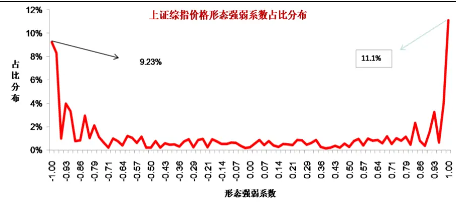
数据来源：国泰君安证券研究

样本数据上证综指日度收盘价，日期：2000.1.4 - 2013.3.15价格形态强弱系数大于 0.9占比 20.7%，小于-0.9占比 25.9%。

图 7标普 500指数价格形态强弱系数概率分布（2000-2013）
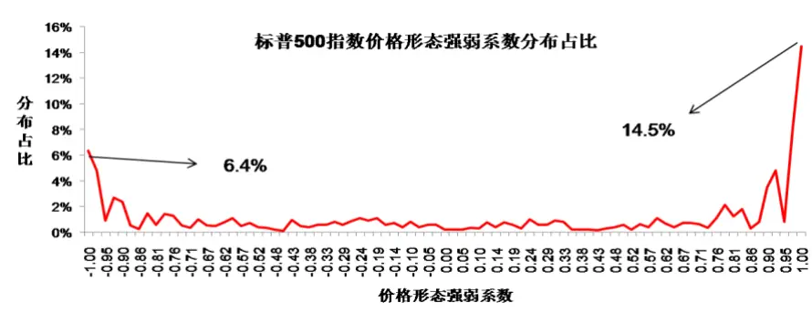
数据来源：国泰君安证券研究

样本数据：标普 500 指数日度收盘价，日期：2000.1.4 - 2013.3.15价格形态强弱系数大于 0.9占比 31.9%，小于-0.9占比 17.3%。

## 3. 随机价格序列的形态特征是什么？

为了更好地发现随机价格序列与真实价格序列的差异性，我们需要引进两个随机价格序列来做比较：布朗运动和基于布朗运动的 BS 模型。在随机过程领域，布朗运动有着严格的数学定义，也有很多有趣的结论。我们对布朗运动的使用主要用到它的基本性质：增量独立性和随机游走性。而 BS 模型融合了无风险收益率和价格本身的波动率，更类似于真实的价格。

图 8 布朗运动
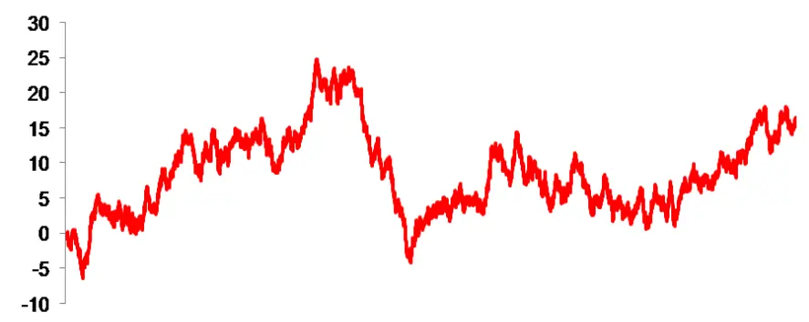
数据来源：国泰君安证券研究

BS模型： $\frac{dS_{\scriptscriptstyle t}}{dt}=rdt+\sigma dB_{\scriptscriptstyle t}$

图 9 随机价格序列（ r = 3% ，σ = 25% ）
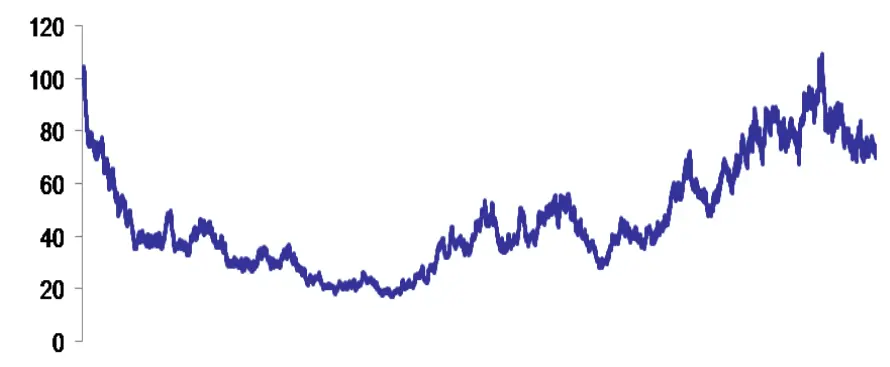
数据来源：国泰君安证券研究

研究分析随机价格序列和真实价格区别的意义在于，如果不能从多个角度发现这种差异性，那么任何技术指标用到随机价格序列上，也一样能发出买入卖出信号。比如，均线的金叉死叉、MACD的穿越零轴、乖离率、KDJ 的拐点信号等，然而从随机价格序列本身属性来看，任何时点上都无法预测其未来的方向是上还是下，上涨与下跌的概率各占 50%。然而，只要我们使用技术指标，技术指标就会发出信号。如果有一个技术分析体系作用到随机价格序列上，而且随机价格序列样本足够多，仍然不能发出任何信号，倒是说明这个技术分析体系是可靠的。

很多基于技术指标构建的量化投资模型都含有参数，常见的方法，是基于样本内数据拟合参数，然后用来对样本外数据检验。如果存在一个这样的量化投资模型，把它用在随机价格序列上，最后能够长期稳定战胜随机价格序列，这可能说明生成随机价格序列的伪随机数发生器（Pseudo-random number generators）存在某种固定的模式，而这种模式恰好被量化投资模型给捕获。常见的伪随机数发生器：

$$
X_{\mathrm{\Lambda}_{n+1}}=\left(aX{\mathrm{\Lambda}}_{n}+b\right)\mathrm{\large~m\mathrm{\Lambda}}0\mathrm{d}\mathrm{\quad}m
$$

这种伪随机数发生器能够满足一般的计算任务，如果用到复杂的数值分析等领域，还需要提供更高质量随机性的随机数发生器如梅森旋转算法

（Mersenne twister），如果某个设计的技术指标仍然能够长期战胜随机数，那么这样的技术指标就真正意义上破解了这种高质量随机性发生器，在学术上是一个非常了不起的贡献。但目前还没有看到这方面的结果。

在报告中，我们用价格形态强弱系数分析随机价格序列的形态特征，比如一个简单的问题就是：随机价格序列的八均线多头与空头排列的概率理论值是多少？这个问题可以分别表述为如下数学表达式：

八均线多头排列的概率理论值：

$$
P\left({\textstyle\frac{1}{t_{1}}}\int_{0}^{t_{1}}S_{t}dt>{\textstyle\frac{1}{t_{2}}}\int_{0}^{t_{2}}S_{t}dt>.......>{\textstyle\frac{1}{t_{8}}}\int_{0}^{t_{8}}S_{t}dt\right)=\ ?
$$

八均线空头排列的概率理论值：

$$
P\left({\textstyle\frac{1}{t_{1}}}\int_{0}^{t_{1}}S_{t}dt<{\textstyle\frac{1}{t_{2}}}\int_{0}^{t_{2}}S_{t}dt<\ldots\ldots<{\textstyle\frac{1}{t_{8}}}\int_{0}^{t_{8}}S_{t}dt\right)=\ ?
$$

其中 $t_{_1}=8,t_{_2}=13,......,t_{_8}=\ 233$ 。这种概率表达式理论上是存在解析解的，但考虑到不等式中每一项彼此并不是独立的，计算八个随机变量的联合分布也会非常复杂，所以我们可以简单地用 Monte-CarloSimulation 来计算概率值。

选用布朗运动样本数据 63800个，计算所得：价格形态强弱系数为 1的概率为 6.8%，即八条均线严格多头排列；价格形态强弱系数为负 1的概率为 6.3%，即八条均线严格空头排列。而价格形态强弱系数大于 0.9占比 20.1%，小于-0.9 占比 18.2%。

图 10 布朗运动价格形态强弱系数占比分布（Monte-Carlo Simulation）
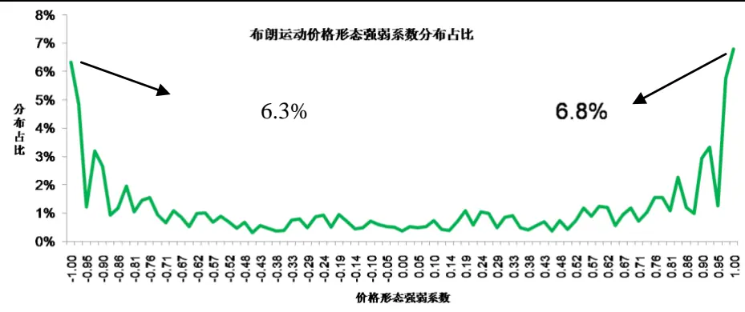
数据来源：国泰君安证券研究

对 BS 模型产生的随机价格序列，我们取样本数据 234600个，计算结果显示：价格形态强弱系数为 1的概率为 6.8%，即八条均线严格多头排列；价格形态强弱系数为负 1的概率为 6.8%，即八条均线严格空头排列。而价格形态强弱系数大于 0.9占比 19.5%，小于-0.9占比 19.6%。也就是说：

$$
P\left({\textstyle\frac{1}{t_{1}}}\int_{0}^{t_{1}}S_{_{t}}dt>\frac{1}{t_{2}}\int_{0}^{t_{2}}S_{_{t}}dt>.......>{\frac{1}{t_{8}}}\int_{0}^{t_{8}}S_{_{t}}dt\right)=6.8\%
$$

$$
P\left({\textstyle\frac{1}{t_{1}}}\int_{0}^{t_{1}}S_{t}dt<\frac{1}{t_{2}}\int_{0}^{t_{2}}S_{t}dt<\ldots\ldots<\frac{1}{t_{s}}\int_{0}^{t_{s}}S_{t}dt\right)=6.8\%
$$

需要指出的是均线多头和空头排列的概率为 6.8%，不仅仅依赖于八均线的选取 $t_{\scriptscriptstyle1}=8,t_{\scriptscriptstyle2}=13,\ldots\ldots,t_{\scriptscriptstyle8}=233$ ，也依赖于无风险收益率和波动率两个参数r • 3% , $\sigma=25\%$

图 11 随机序列价格形态强弱系数占比分布（Monte-Carlo Simulation）
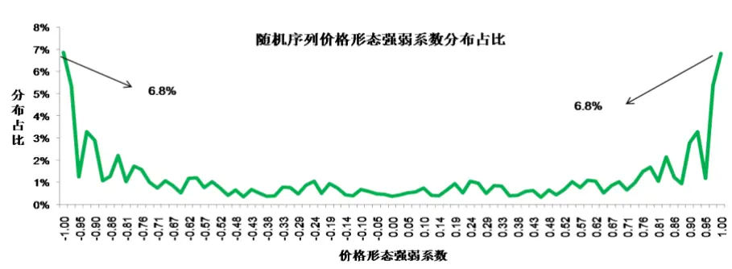
数据来源：国泰君安证券研究

随机序列的价格形态强弱系数分布占比从上图可以看出，从 8周期、13周期、21周期、……、233周期的八条均线的严格多头和空头排列的占比是 6.8%，在所有 85 个系数中占比是最高的，而系数 1 和负 1 对应的的均线排列方式只有一种。从表 4 可以看出，系数 0.05 和负 0.05 对应的均线排列方式是最多的，但在价格形态强弱系数实际出现的分布占比却是最低的。为什么会这样？这是因为严格均线多头排列和空头排列稳定态是最好的，一旦处于这种状态，价格的变动不太容易改变八条均线的排列顺序，而其他排列方式则不然。均线越是缠绕在一起的形态，价格的变动越容易改变均线的排列顺序，从而引起形态系数的改变。这个结果也解释了为什么我们用眼睛看走势图容易看到价格的趋势特征，八均线多头或空头排列就是趋势特征的一种近似。

## 4. 结论及后续研究

无论是传统的技术分析还是广义的技术分析，本质都是发现和利用市场存在的规律，从而能够长期稳定战胜市场。而技术分析研究的关键有两点：第一、定义趋势从而可以分解走势；第二、多级别联立。多级别联立既包括周期级别也包括价格的形态级别，研究级别的意义在于对当前级别的趋势操作不能忽视高一级别的趋势。对这方面的研究我们会逐步展开，从而发现更多的价格规律。

| 1. 投资建议的比较标准 | 评级 |  |  |
| --- | --- | --- | --- |
| 投资评级分为股票评级和行业评级。 以报告发布后的12个月内的市场表现为 比较标准，报告发布日后的12个月内的 公司股价（或行业指数）的涨跌幅相对 同期的沪深300指数涨跌幅为基准。 | 股票投资评级 | 增持 | 说明 相对沪深 300 指数涨幅 15%以上 |
|  |  | 谨慎增持 | 相对沪深 300 指数涨幅介于 5%~15%之间 |
|  |  | 中性 | 相对沪深 300 指数涨幅介于-5%~5% |
|  |  | 减持 | 相对沪深 300 指数下跌 5%以上 |
|  |  | 增持 | 明显强于沪深 300 指数 |
|  |  | 行业投资评级 中性 | 基本与沪深 300 指数持平 |
|  |  | 减持 | 明显弱于沪深 300 指数 |

## 本公司具有中国证监会核准的证券投资咨询业务资格

## 分析师声明

作者具有中国证券业协会授予的证券投资咨询执业资格或相当的专业胜任能力，保证报告所采用的数据均来自合规渠道，分析逻辑基于作者的职业理解，本报告清晰准确地反映了作者的研究观点，力求独立、客观和公正，结论不受任何第三方的授意或影响，特此声明。

## 免责声明

本报告仅供国泰君安证券股份有限公司（以下简称“本公司”）的客户使用。本公司不会因接收人收到本报告而视其为本公司的当然客户。本报告仅在相关法律许可的情况下发放，并仅为提供信息而发放，概不构成任何广告。

本报告的信息来源于已公开的资料，本公司对该等信息的准确性、完整性或可靠性不作任何保证。本报告所载的资料、意见及推测仅反映本公司于发布本报告当日的判断，本报告所指的证券或投资标的的价格、价值及投资收入可升可跌。过往表现不应作为日后的表现依据。在不同时期，本公司可发出与本报告所载资料、意见及推测不一致的报告。本公司不保证本报告所含信息保持在最新状态。同时，本公司对本报告所含信息可在不发出通知的情形下做出修改，投资者应当自行关注相应的更新或修改。

本报告中所指的投资及服务可能不适合个别客户，不构成客户私人咨询建议。在任何情况下，本报告中的信息或所表述的意见均不构成对任何人的投资建议。在任何情况下，本公司、本公司员工或者关联机构不承诺投资者一定获利，不与投资者分享投资收益，也不对任何人因使用本报告中的任何内容所引致的任何损失负任何责任。投资者务必注意，其据此做出的任何投资决策与本公司、本公司员工或者关联机构无关。

本公司利用信息隔离墙控制内部一个或多个领域、部门或关联机构之间的信息流动。因此，投资者应注意，在法律许可的情况下，本公司及其所属关联机构可能会持有报告中提到的公司所发行的证券或期权并进行证券或期权交易，也可能为这些公司提供或者争取提供投资银行、财务顾问或者金融产品等相关服务。在法律许可的情况下，本公司的员工可能担任本报告所提到的公司的董事。

市场有风险，投资需谨慎。投资者不应将本报告为作出投资决策的惟一参考因素，亦不应认为本报告可以取代自己的判断。在决定投资前，如有需要，投资者务必向专业人士咨询并谨慎决策。

本报告版权仅为本公司所有，未经书面许可，任何机构和个人不得以任何形式翻版、复制、发表或引用。如征得本公司同意进行引用、刊发的，需在允许的范围内使用，并注明出处为“国泰君安证券研究”，且不得对本报告进行任何有悖原意的引用、删节和修改。

若本公司以外的其他机构（以下简称“该机构”）发送本报告，则由该机构独自为此发送行为负责。通过此途径获得本报告的投资者应自行联系该机构以要求获悉更详细信息或进而交易本报告中提及的证券。本报告不构成本公司向该机构之客户提供的投资建议，本公司、本公司员工或者关联机构亦不为该机构之客户因使用本报告或报告所载内容引起的任何损失承担任何责任。

## 评级说明

## 国泰君安证券研究

| 上海 |  | 深圳 | 北京 |
| --- | --- | --- | --- |
| 地址 | 上海市浦东新区银城中路168号上海 银行大厦 29 层 | 深圳市福田区益田路 6009号新世界 商务中心34层 | 北京市西城区金融大街28号盈泰中 心2号楼10层 |
| 邮编 | 200120 | 518026 | 100140 |
| 电话 | （021）38676666 | （0755）23976888 | (010)59312799 |
|  | E-mail: gtjaresearch@gtjas.com |  |  |