2013.07.30

# A 股走势拐点量化观察

## ——数量化专题之二十九

刘富兵（分析师）

赵延鸿（研究助理）

8 021-38676673

liufubing008481@gtjas.com

021-38674927

刘正捷（研究助理）

zhaoyanhong@gtjas.com

证书编号 S0880511010017

021-38675860

S0880113070047

liuzhengjie012509@gtjas.co

S0880112080087

## 本报告导读：

基于择时指标大盘均线强弱指数、行业形态系数和大盘活力指数观察，上证综指尚未见底，即使触底后的反弹高度将仍受制于 2100，中级别（10%以上的反弹）的底部在 1900 之下。

## 摘要：

le_Summary]截至 7 月 29 日，上证综指的大盘均线强弱指数回落至 65，而 2013 年均线强弱指数最小值为 34，仍未达到理论最小值23，预示大盘尚未见底。今年大盘的顶部对应均线强弱指数都是在 200附近见顶。这个指标过去三年对顶部判断准确的逻辑在于，上证综指处于一个周线级别的下跌走势中，所以任何上涨都是某个级别的反弹行情，由此决定了顶部都会被类似的指标压制。当前走势从周线来看，大盘指数仍处于小级别中枢结构中，上证综指即使再度反弹，高度仍然受制于中枢之中。

上证综指大盘活力指数最新监测值为 22.2%，即上证综指列入统计的 944 支股票中有 209 支价格在其自身 50 日均线之上。活力指数反弹至 90%以上压力区间，大盘走势将是做顶行情。当活力指数跌破 10%，大盘将出现阶段性底部。从走势整体形态来看，这个底部出现后也是一个小级别底部。

从价格形态系数角度观察，申万 84 个二级行业的形态系数之和为-13.6，理论值区间为[-84,84]。任何交易日，每个二级行业都有一个价格形态强弱系数，介于负 1到1之间，表示当前这个行业的走势形态。过去 12年的历史数据显示：上证综指中级别（反弹幅度超过 20%）以上上涨行情对应的行业价格形态强弱系数都小于-60。但行业价格形态系数之和小于-60未必预示是一个20%以上级别上涨行情的出现。

- 当周参与交易户数占比 7.4%，交易活跃度偏低。但 A股要出现 15%以上的反弹行情，周度参与交易户数占比仍然偏高，4%至5%是一个观察区间。

金融工程

## 金融工程团队：

刘富兵：（分析师）

电话：021-38676673

邮箱：liufubing008481@gtjas.com

证书编号：S0880511010017

何苗：（分析师）

电话：010-59312710

邮箱：hemiao@gtjas.com

证书编号：S0880511010049

## 杨喆：（分析师）

电话：021-38676442

邮箱：yangzhe@gtjas.com

证书编号：S0880511010020

## 严佳炜：（分析师）

电话：021-38674812

邮箱：yanjiawei008776@gtjas.com

证书编号：S0880512110001

## 赵延鸿：（研究助理）

电话：021-38674927

邮箱：zhaoyanhong@gtjas.com

证书编号：S0880113070047

## 耿帅军：（研究助理）

电话：010-59312753

邮箱：gengshuaijun@gtjas.com

证书编号：S0880111110128

## 徐康：（研究助理）

电话：021-38674939

邮箱：xukang010849@gtjas.com

证书编号：S0880111090058

## 陈睿：（研究助理）

电话：021-38675861

邮箱：chenrui012896@gtjas.com

证书编号：S0880112120012

## 刘正捷：（研究助理）

电话：021-38675860

邮箱：liuzhengjie012509@gtjas.com

证书编号：S0880112080087

## [Table_R相关报告

《基于技术分析的量化投资再思考》2013.07.29

《国泰君安阳光私募产品评级及私募市场分析》2013.07.23

《更快更准更稳的拐点预测：地震模型新进展》2013.07.16

《海外商品 ETP 市场历史与现状》2013.06.30

《CTA：海外绝对收益之路》2013.06.25

## 1. 大盘均线强弱指数降至 65，理论值区间[23, 207]

截至 7 月 29日，大盘均线强弱指数回落至 65，距离理论最低值 23已经不远，大盘继续寻底过程。上证综指从 1949 开始反弹以来，出现过两个阶段性顶部，分别是 2 月 6 日 2440， 和 5 月 29 日 2334，第二个顶部虽然比第一个顶部低很多，但大盘均线强弱指数都是在200附近见顶。二者都没有达到理论最大值 207。这个指标继续成功对顶部发出了拐点信号。这个指标过去三年对顶部判断准确的逻辑在于，上证综指处于一个周线级别的下跌走势中，所以任何上涨都是某个级别的反弹行情，由此决定了顶部都会被类似的指标压制。等有一天，大盘见了历史大底，这个指标就需要反过来使用，用来判断阶段性底部。当前走势，如果大盘均线强弱指数跌至最低值 23，对大盘底部判断还需要依据其形态，寻找背离信号。

大盘均线强弱指数是根据八均线系统对申万 23 个一级行业分类的综合得分结果，当前平均每个行业为 3分，均线强弱指数的理论区间范围为[23,207]。2012 年的最大值为 180，对应上证综指的点位 2478；2013 年的最大值 201，对应上证综指点位 2440。

大盘均线强弱系数定义：如果有一个均线系统，比如用八均线系统（8，13，21，34，55，89，144，233），当八条均线互不交叉，且不考虑其均线排列次序，价格空间被八条均线分成 9个部分。给定一个行业指数，我们可以建立一个打分系统：当前价格大于等于所有均线价格，即当前价格不落在任何均线之下，记为最高分 9 分；当前价格大于等于 7条均线价格，但小于剩余一条均线价格，记为 8分；依次类推，如果当前价格位于所有均线之下，记为 1分。用数学语言描述，如果当前价格记为

p ，那么：

如果 $p\geq\operatorname*{max}\left\{MA,1\leq i\leq8\right\}$ ， 记为 9 分；

如果存在 j ，满足

$p\ <\ MA\ ,p\ge\operatorname*{max}\left\{\ MA\ ,1\le i\le8,i\ne j\right\}$ ，记 8分；

如果 $p<\mathsf{min}\{MA,1\leq i\leq8\}$ ，记为 1 分

如果我们用申万 23 个一级行业来分析的话，对当前每一个行业进行上述打分，最后对 23个行业的分数求和，可知理论最高分为 207，最低分为 23 分，通过所有行业得分之和来判断大盘是否处于极强或者极弱走势，以此对大盘进行择时，这个分数之和称为均线强弱指数。

图 1（2012 年 1 月 1 日-2013 年 7 月 29 日）
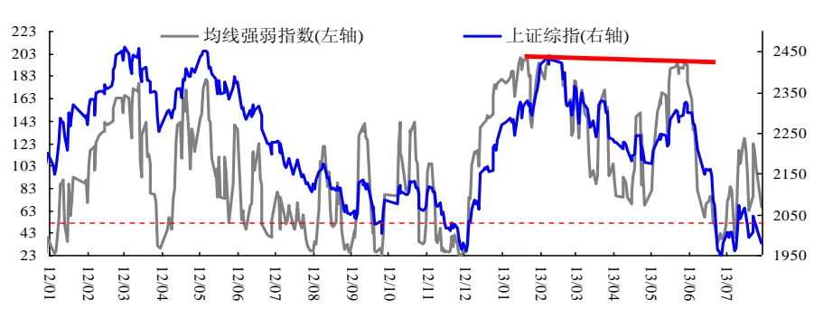
数据来源：国泰君安证券研究

截止 2013年 7月 29日，上证综指均线强弱指数最小值为 34，仍未达到理论最小值 23，预示大盘尚未见底。从 2013年 A股走势来看，很难重演 06、07和 09年的强势行情，因此均线强弱指数当下最大值 201应该已为极限，很难再达到理论最大值 207，意味着大盘反弹行情幅度有限。

图 2均线强弱指数年度最大值（截至 2013 年 7月 29）
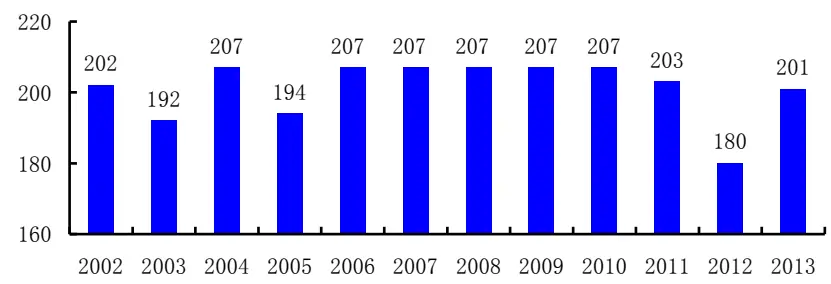
数据来源：国泰君安证券研究

图 3 均线强弱指数年度最小值（截至 2013 年 7 月 29）
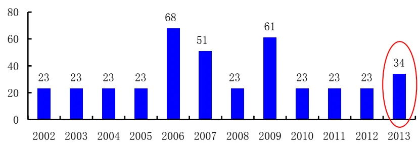
数据来源：国泰君安证券研究

## 2. 上证综指活力度跟踪：22.2%

截至 7 月 29日，上证综指大盘活力指数最新监测值为 22.2%，即上证综指列入统计的 944 支股票中有 209 支价格在其自身 50 日均线之上。活力指数反弹至 90%以上压力区间，大盘走势将是做顶行情。当活力指数跌破 10%，大盘将出现阶段性底部。大盘活力指数有上阈值和下阈值的概念，即当活力指数触及上阈值，就应该关注顶点的出现；当活力指数触及下阈值，就应该关注底点的出现。这个指标使用的局限性在于：对顶部和底部的级别无法把握，即活力指数能够判断一个上涨的顶或者一个下跌的底，但对于顶部和底部出现后，回调和反弹的幅度不能给出更多信息。从 2011 年以来的走势来看，大盘活力指数达到 90%是日线级别的顶部信号。

图 4上证综指 与当天收盘价>50日均线股票比例
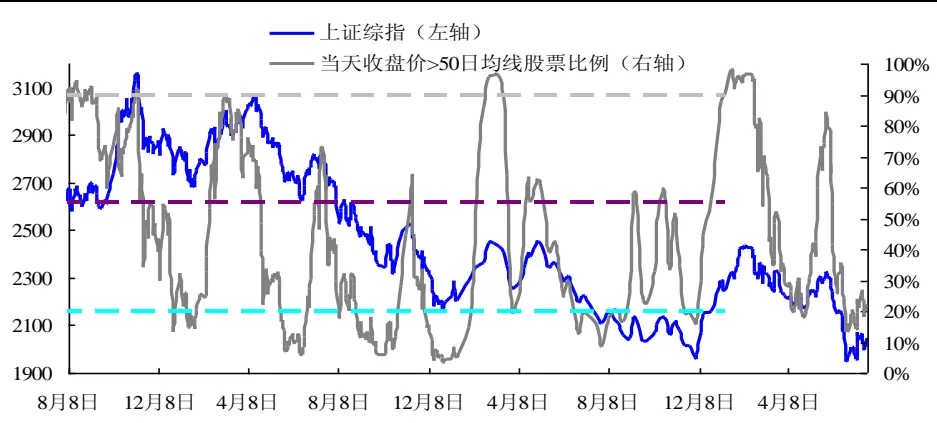
数据来源：国泰君安证券研究

## 3. 行业价格形态系数之和：-13.6，理论区间[-84,84]

根据价格短期移动均线到长期移动均线的排列顺序，可以定量地判断当前价格走势形态。8 根均线的排列顺序有 40320 种可能（如果不考虑均线交叉的情形）。最极端的情况有两种：一是短周期均线从高到低依次排列至长周期均线，表示价格走势最强；二是长周期均线从高到低依次排列至短周期均线，表示价格最弱，其他都属于中间状态，但中间状态也存在强弱之分。衡量此类排序的最恰当的量化指标为 Spearman 等级相关系数，即把均线的自上而下的排列顺序映射到一个[-1,1]的区间中，我们把这个指标称为“价格形态强弱系数”。

大盘走势可以用申万 84 个二级行业的形态来刻画，任何交易日，每个二级行业都有一个价格形态强弱系数，介于负 1到 1之间，表示了当前这个行业的走势形态。如果市场极度低迷，每一个二级行业的价格形态强弱系数都是-1，那么累计求和就是-84；如果市场处于大牛市，每一个二级行业的价格形态系数为 1，累计求和为 84。

图 5（2012 年 6 月 5 日-2013 年 7 月 29 日）
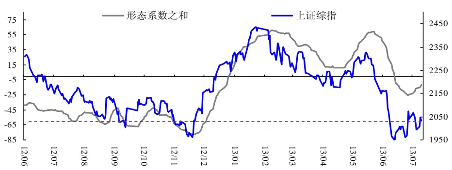
数据来源：国泰君安证券研究

从历史上来看，考虑到从 2001 年以来行业数据的完整性我们把后来加入的四个行业采掘服务、金属制品、医疗服务、保险去除掉，这样就有80 个行业列入计算。理论上二级行业系数求和最大值为 80，最小值为-80？这种情况在过去 10 年有没有出现？答案是否定的，但实际情况是已经非常接近理论值。最小值出现在 2008 年 11 月 6 日为-79.93，最大值出现在 2007 年 7 月 24 日为正的 79.93。

过去 12 年的历史数据显示：上证综指中级别（反弹幅度超过 20%）以上上涨行情对应的行业价格形态强弱系数都小于-60。但行业价格形态系数之和小于-60 未必预示是一个 20%以上级别上涨行情的出现。上涨行情能够使得行业价格形态强弱系数之和突破 40 出现五次，分别出现在2003 年 11 月份跨年度行情，上证综指上涨 36%；2006 和 2007 年由股权分置改革催生的大牛市，2008 年 4 万亿救市政策引发的 2009 年上半年牛市行情，而最近能够突破40的行情就是从1949点以来的上涨行情，最大值出现在 2月 22日，行业形态系数之和达到 60。

## 4. GARCH 波动率最新监测值 21.4%

截至本周一，上证综指 GARCH 波动率最新监测结果为 21.4%，股市波动性由 6 月 24 日波动率高位 34%回落。波动率在 6 月 3 日降至年内低点 14%，之后股指大幅下跌，波动率被推升至 34%的年内高位。目前波动率进入 20%附近震荡。继续警惕当波动率降至 15%之下带来的股指调正风险。

注：经验研究中发现, 当利空消息出现时, 预期股票收益会下降时, 波动趋向于增大; 当利好消息出现时, 预期股票收益会上升时, 波动趋向于减小。由于股指是一个扩散性序列，不容易度量其上涨的能量何时到顶，下跌的能量何时衰竭，而 GARCH做为一个均衡回归型序列，其见顶或者筑底反映了大盘在上涨或者下跌过程能量的消耗殆尽。有一种特殊情况需要指出的是，大盘处于横盘窄幅震荡时，GARCH 波动率也会减小，这时候根据大盘处的位置来判断，如果处于上涨的中继平台，那么大盘继续上行的概率很大；如果处于下跌的中继平台，则大盘很可能将加速下跌。

图 6上证综指与 GARCH 波动率
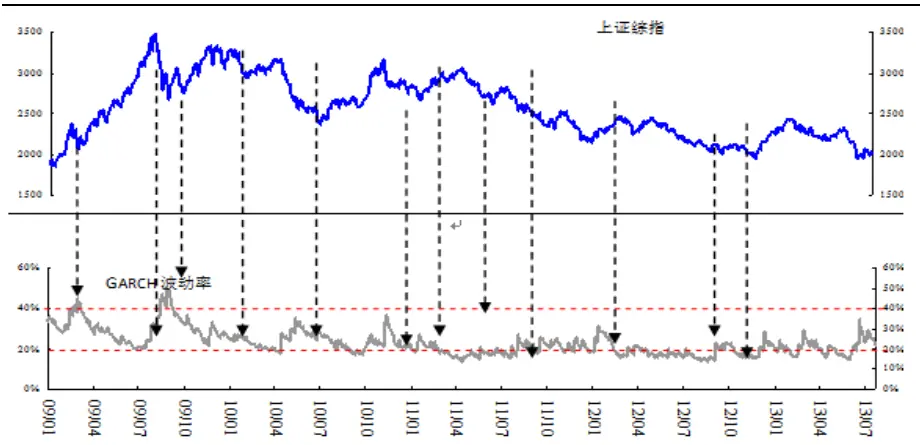
数据来源：国泰君安证券研究

广义自回归条件异方差模型 GARCH 是用历史交易数据对未来波动率的做出预测的数学模型。GARCH 模型主要捕捉金融时间序列的两种特性，一种是最近发生的事件对交易价格的冲击大于过去的事件，也就是说最新的价格变动较更早的历史数据对未来价格变动有更大的影响；另一种是“集束力量(clustering force)，大幅涨跌的价格后面往往出现大幅涨跌，而较平缓的价格往往是后续价格的平缓。用数学公式表示就是，

$$
\sigma_{{n+1}}^{~2}~=~\omega~+~\alpha~\left(u_{{n}}^{~}-\mu\right)^{2}~+~\beta~\sigma_{{n}}^{~2}
$$

其中， $\sigma_{{\scriptscriptstyle n+1}}$ 代表在当日对下一个交易日的波动率的预测， 表示增长率的平均值，u 代表当日的价格变化率， ， 分别表示当日变化率和最新方差的权重，并且 ， 满足约束条件:

$$
\alpha+\beta<1,\alpha>0,\beta>0
$$

## 5. 周度交易户数占比 7.4%，市场活跃度下降

截至 2013年 7月 19日，当周参与交易户数占比 7.4%，交易活跃度偏低。本轮上证综指从 1949 点开始反弹，对应周度参与交易户数占比为历史最低值 4.0%，最大值为 9.4%，没有达到 10%。而 2009以来周度参与交易占比的均值为 10.9%，从交易参与度来看，A股市场处于弱势。

从 2008年 1月至 2012年 7月，最多的一周有 2711万个账户参与交易，最少的一周只有 485万个账户参与交易。沪深两市参与交易户数占比的均值为 11.1%，最高为 23.3%，最低仅为 4.0%，标准差为 4.4%。

基于 2008 年以来的数据分析，当交易户数占比低值出现时往往是大盘一个阶段性的低点。参与交易户数占比最低的 18 个点与成交量最低的18个点对比可以看出这两者并不完全重合，而交易户数占比低值时市场在阶段性底部的出现概率也更高。

图 7周度交易户数占比低值出现时大盘走势
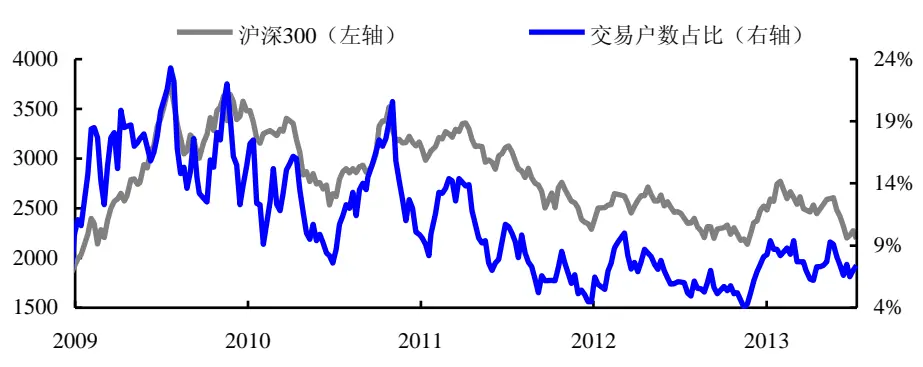
数据来源：国泰君安证券研究

图 8 沪深两市参与交易户数比例的周数分布直方图（2008 年 1 月-2013年 7 月）
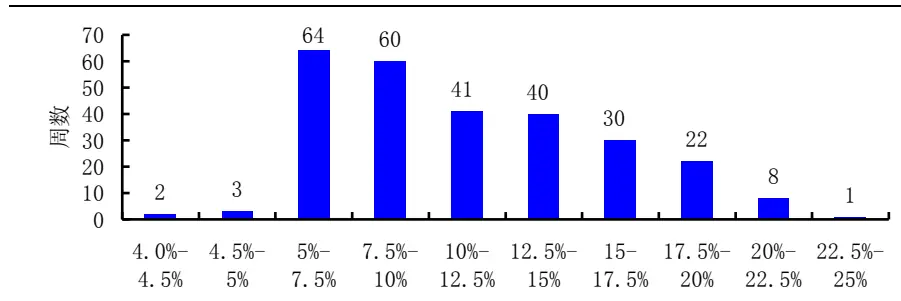
数据来源：国泰君安证券研究

## 6. 基金仓位变化观察

这里对普通股票型基金以及偏股混合型基金的仓位水平进行了估算：截至上周五，354 支普通股票型基金的平均估算仓位为 81.7%，其中大盘（沪深 300）和中小盘（中小盘指数 399005.SZ）的平均估算仓位分别为16.7%和 65.0%；154支偏股混合型基金的平均估算仓位为 72.0%，其中大盘和中小盘的估算仓位分别为 12.9%和 59.1%。

图 2普通股票型基金仓位
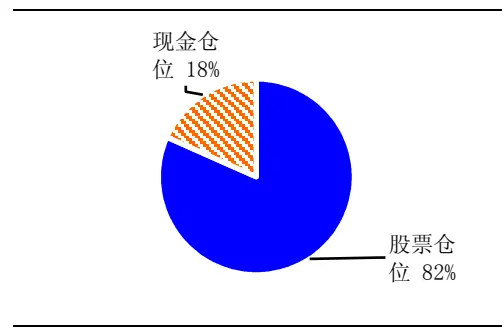
数据来源：国泰君安证券研究

图 3偏股混合型基金仓位
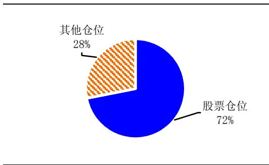
数据来源：国泰君安证券研究

图 2普通股票型基金大盘与中小盘仓位对比
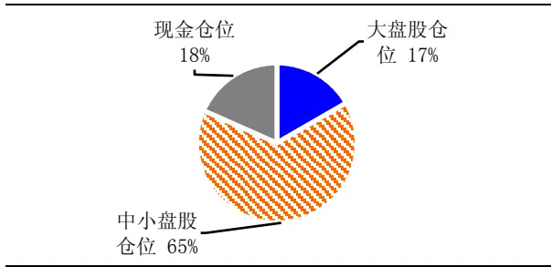
数据来源：国泰君安证券研究

图 3偏股混合型基金大盘与中小盘仓位对比
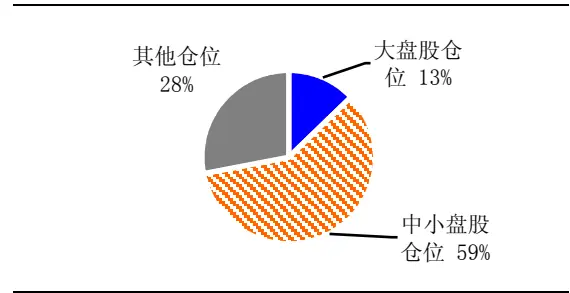
数据来源：国泰君安证券研究

注：基金仓位估算是基于基金净值数据和大盘、中小盘日度收盘价，进行多元线性回归的结果。历史数据计算显示，对基金的平均仓位误差在3%以内，但大盘和中小盘由于信息维度不够，测算误差可能较大。

## 7. 结论

上证综指的大盘均线强弱指数回落至 65，而 2013 年均线强弱指数最小值为 34，仍未达到理论最小值 23，预示大盘尚未见底。今年大盘的顶部对应均线强弱指数都是在 200附近见顶。这个指标过去三年对顶部判断准确的逻辑在于，上证综指处于一个周线级别的下跌走势中，所以任何上涨都是某个级别的反弹行情，由此决定了顶部都会被类似的指标压制。当前走势从周线来看，大盘指数仍处于小级别中枢结构中，上证综指即使再度反弹，高度仍然受制于中枢之中。同时关注大盘活力指数触底 10%。当周参与交易户数占比 7.4%，交易活跃度偏低。但 A 股要出现 15%以上的反弹行情，周度参与交易户数占比仍然偏高，4%至 5%是一个观察区间。

## 本公司具有中国证监会核准的证券投资咨询业务资格

## 分析师声明

作者具有中国证券业协会授予的证券投资咨询执业资格或相当的专业胜任能力，保证报告所采用的数据均来自合规渠道，分析逻辑基于作者的职业理解，本报告清晰准确地反映了作者的研究观点，力求独立、客观和公正，结论不受任何第三方的授意或影响，特此声明。

## 免责声明

本报告仅供国泰君安证券股份有限公司（以下简称“本公司”）的客户使用。本公司不会因接收人收到本报告而视其为本公司的当然客户。本报告仅在相关法律许可的情况下发放，并仅为提供信息而发放，概不构成任何广告。

本报告的信息来源于已公开的资料，本公司对该等信息的准确性、完整性或可靠性不作任何保证。本报告所载的资料、意见及推测仅反映本公司于发布本报告当日的判断，本报告所指的证券或投资标的的价格、价值及投资收入可升可跌。过往表现不应作为日后的表现依据。在不同时期，本公司可发出与本报告所载资料、意见及推测不一致的报告。本公司不保证本报告所含信息保持在最新状态。同时，本公司对本报告所含信息可在不发出通知的情形下做出修改，投资者应当自行关注相应的更新或修改。

本报告中所指的投资及服务可能不适合个别客户，不构成客户私人咨询建议。在任何情况下，本报告中的信息或所表述的意见均不构成对任何人的投资建议。在任何情况下，本公司、本公司员工或者关联机构不承诺投资者一定获利，不与投资者分享投资收益，也不对任何人因使用本报告中的任何内容所引致的任何损失负任何责任。投资者务必注意，其据此做出的任何投资决策与本公司、本公司员工或者关联机构无关。

本公司利用信息隔离墙控制内部一个或多个领域、部门或关联机构之间的信息流动。因此，投资者应注意，在法律许可的情况下，本公司及其所属关联机构可能会持有报告中提到的公司所发行的证券或期权并进行证券或期权交易，也可能为这些公司提供或者争取提供投资银行、财务顾问或者金融产品等相关服务。在法律许可的情况下，本公司的员工可能担任本报告所提到的公司的董事。

市场有风险，投资需谨慎。投资者不应将本报告为作出投资决策的惟一参考因素，亦不应认为本报告可以取代自己的判断。在决定投资前，如有需要，投资者务必向专业人士咨询并谨慎决策。

本报告版权仅为本公司所有，未经书面许可，任何机构和个人不得以任何形式翻版、复制、发表或引用。如征得本公司同意进行引用、刊发的，需在允许的范围内使用，并注明出处为“国泰君安证券研究”，且不得对本报告进行任何有悖原意的引用、删节和修改。

若本公司以外的其他机构（以下简称“该机构”）发送本报告，则由该机构独自为此发送行为负责。通过此途径获得本报告的投资者应自行联系该机构以要求获悉更详细信息或进而交易本报告中提及的证券。本报告不构成本公司向该机构之客户提供的投资建议，本公司、本公司员工或者关联机构亦不为该机构之客户因使用本报告或报告所载内容引起的任何损失承担任何责任。

## 评级说明

## 1.投资建议的比较标准

投资评级分为股票评级和行业评级。

以报告发布后的12个月内的市场表现为比较标准，报告发布日后的12个月内的公司股价（或行业指数）的涨跌幅相对同期的沪深300指数涨跌幅为基准。

## 2.投资建议的评级标准

报告发布日后的 12 个月内的公司股价（或行业指数）的涨跌幅相对同期的沪深300指数的涨跌幅。

|  | 评级 说明 |  |
| --- | --- | --- |
| 股票投资评级 | 增持 | 相对沪深300指数涨幅15%以上 |
|  | 谨慎增持 | 相对沪深300指数涨幅介于5%～15%之间 |
|  | 中性 | 相对沪深300指数涨幅介于-5%～5% |
|  | 减持 | 相对沪深300指数下跌5%以上 |
| 行业投资评级 | 增持 | 明显强于沪深 300指数 |
|  | 中性 | 基本与沪深 300指数持平 |
|  | 减持 | 明显弱于沪深 300指数 |

## 国泰君安证券研究

|  | 上海 | 深圳 | 北京 |
| --- | --- | --- | --- |
| 地址 | 上海市浦东新区银城中路168号上海 银行大厦29层 | 深圳市福田区益田路 6009 号新世界 商务中心34层 | 北京市西城区金融大街 28 号盈泰中 心2号楼10层 |
| 邮编 | 200120 | 518026 | 100140 |
| 电话 | （021)38676666 | (0755)23976888 | (010)59312799 |
|  | E-mail: gtjaresearch@gtjas.com |  |  |