2013.10.07

# 我们能打败最好的行业吗

# ——数量化专题之二十八

刘富兵（分析师）

8 021-38676673

liufubing008481@gtjas.com

证书编号 S0880511010017

本报告导读：本文我们试图利用相似匹配原理构建行业轮动策略，以打败最好的行业。事实上，该策略是个普适模型，也适用于选股与择时。10 月份，模型建议信息服务配置 78%，其它行业各 1%，节后第一周，模型建议信息服务 90%，农林牧渔 10%。

## 摘要：

[Table_Summary] • 本文，我们试图找到一种行业配置的思想以打败最好的行业。我们主要利用机器学习的相似匹配原理，去搜寻行业整体历史上相似的时点作为备选集，然后对备选集进行权重优化，得到的最优权重作为下一阶段行业的配置比例。

- 该模型在不考虑交易成本的情况下，自 2006 年至今能跑出189 倍的收益，远远跑赢沪深 300，也远远跑赢表现最好的医药生物。

即便考虑交易成本，不论日频、周频，该模型均有优异的表现，显示了模型较强的适用性。2013 年是特别适合相似匹配的行情，年初至今，模型的周策略跑出了 50%的累积超额收益，信息比率接近 3，最大回撤 6%；月策略跑出了 36%的累积超额收益，最大回撤 2%。

- 该模型是个普适模型，不仅适用于配置，还适用于择时与选股。从技术角度来看，择时的处理要远比配置简单，因为不用考虑内部相关性，当然实际效果就须另当别论了。

- 任何量化模型都有它的风险点，该模型也不例外。其最大风险在于它的前提假设，即历史是可以重复的，这就要求在运用该模型时，历史数据一定要足够多，而且股市结构要相对稳定。

- 事实上，并不是所有的股票池或行业池都适合我们的模型，该模型更适用于数量多、波动较大、同质性差的标的池。

- 模型最关键的核心点有两个：1、如何定义相似；2、如何进行权重优化。两个核心点处理的好坏直接决定了最终业绩的优劣。

- 10 月份，模型建议信息服务配置 78%，其它行业各 1%；节后第一周，模型建议信息服务 90%，农林牧渔 10%。

金融工程

## 金融工程团队：

刘富兵：（分析师）

电话：021-38676673

邮箱：liufubing008481@gtjas.com

证书编号：S0880511010017

何苗：（分析师）

电话：010-59312710

邮箱：hemiao@gtjas.com

证书编号：S0880511010049

## 严佳炜：（分析师）

电话：021-38674812

邮箱：yanjiawei008776@gtjas.com

证书编号：S0880512110001

## 耿帅军：（分析师）

电话：010-59312753

邮箱：gengshuaijun@gtjas.com

证书编号：S0880513080013

## 徐康：（分析师）

电话：021-38674939

邮箱：xukang010849@gtjas.com

证书编号：S0880513080018

## 赵延鸿：（研究助理）

电话：021-38674927邮箱：zhaoyanhong@gtjas.com证书编号：S0880113070047

## 陈睿：（研究助理）

电话：021-38675861

邮箱：chenrui012896@gtjas.com

证书编号：S0880112120012

## 刘正捷：（研究助理）

电话：021-38675860

邮箱：liuzhengjie012509@gtjas.com

证书编号：S0880112080087

## [Table_R相关报告

《沪深 300 指数期货展期策略研究》2013.09.23

《A 股走势拐点量化观察》2013.07.30

《基于技术分析的量化投资再思考》2013.07.29

《国泰君安阳光私募产品评级及私募市场分析》2013.07.23

《更快更准更稳的拐点预测：地震模型新进展》2013.07.16

## 1. 我们能打败最好的行业吗

从静态的角度来看,这是个没有意义的问题,因为我们永远不会打败最好的行业。不过从动态的角度，结果就不一样了：只要把一个长的投资周期细分成 n个短周期，在每个短周期里，选择相对较好的行业，就有可能打赢最好的行业。

事实上，在证券投资里，这是个投资组合问题，又是个行业轮动问题，只要策略得当，打败最好的行业是完全可以实现的。

下图给出了 06 年以来沪深 300 及强势行业的走势。由图 1 可以看出，表现最好的是医药生物，大约跑出了 6.4 倍的累积收益，而沪深 300 只跑出了两倍的累积收益。

图 1 沪深 300 及强势行业走势
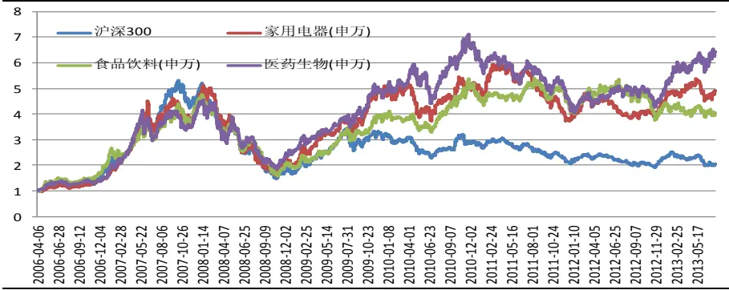
数据来源：国泰君安证券研究，wind

我们的行业配置策略在不考虑交易成本、每日调整的情况下，能跑出 189倍的收益。即便是在换手率 100%、单边交易成本万五、交易印花税千一的情况下，我们的行业配置策略仍能跑平最好的行业。

事实上，之所以选择最好的行业作为比较基准，是想给投资者传递一个思想：只要策略得当，选择哪种业绩基准其实并不重要。

图 2 零成本下行业配置策略走势
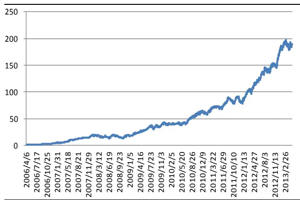
数据来源：国泰君安证券研究，wind

图 3 不同成本下行业配置策略走势
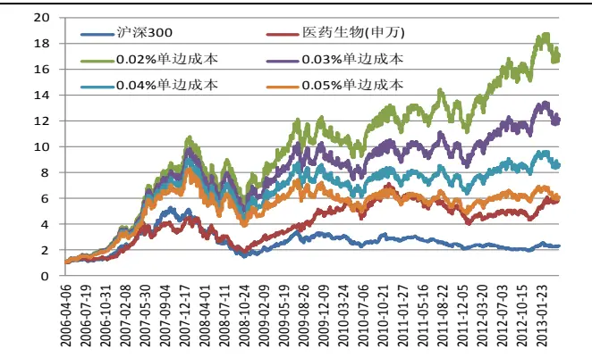

## 2. 如何打败最好的行业-机器学习的相似性匹配原理

当然，投资者最为关心的是如何打败最好的行业，本报告的核心思想就是利用机器学习的相似性匹配原理。实际上，这一思想在日常的投资及研究中经常投资者被使用，所不同的是，本文对该思想进行了更为客观、更为系统的定量化分析。

## 2.1.相似性匹配的基本原理

## 2.1.1. 机器学习概述

机器学习是近 20 年来兴起的一门多领域交叉学科，涉及概率论、统计学、逼近论、凸分析、计算复杂性理论等多门学科。机器学习理论主要是设计和分析一些让计算机可以自动“学习”的算法。机器学习算法是一类从数据中自动分析获得规律，并利用规律对未知数据进行预测的算法。因为学习算法中涉及了大量的统计学理论，机器学习与统计推断学联系尤为密切，也被称为统计学习理论。

随着近些年来机器学习的兴起，研究人员发现，机器的自我学习机制可以广泛的应用于金融市场，从而在海量的金融数据中，挖掘出最有用的数据，解决一系列金融市场中的问题。其中，尤为典型的一个研究方向就是投资组合的权重优化问题，即利用某种智能优化算法来解决投资组合的权重优化问题，通过机器自我学习的机制，在挖掘大量的历史数据的过程中，得到当下一期投资组合的配置权重。

本文所介绍的相似性匹配行业配置模型，正是基于这种思想，通过搜索大量的历史数据，利用机器自我学习机制，寻找所谓“相似集”，并以一定的优化算法得出当前组合配置的最优权重。

## 2.1.2. 相似性匹配的基本思想

众所周知，行业轮动是一种市场短期趋势的表现形式，本文的相似匹配模型在跟踪行业轮动的过程中，通过挖掘大量的历史走势数据，寻找与当期市场走势相似的若干历史走势，进而分析这些历史走势后一期的所有市场表现，通过最优化方法和多参数组合，得到下一期行业配置的最优权重，具体过程为：

第一步：在历史数据中，根据相似的定义规则，找到与当期走势相似的历史走势。

第二步：分析所有历史相似集后一期各行业的市场走势，利用最优化方法得到下一期各行业的配置子权重。

第三步：根据不同历史窗口以及相似集定义阀值，利用多参数组合的思想组合所有的子权重，以此得到最终所要求的下一期走势的行业配置权重。

图 4 历史相似集
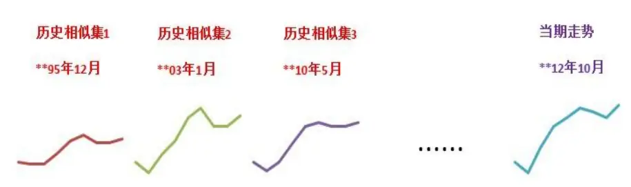
数据来源：国泰君安证券研究

## 2.2.相似性匹配的关键-如何定义相似

## 2.2.1. 必要的市场概述

我们首先标准化市场数据，假设某投资组合有个d 资产，则

## 定义 1：市场标准向量

$$
X_{t}=(x_{(t,1)},\ldots x_{(t,d)})
$$

其中 $x_{(t,i)}$ 表示组合中的某一资产i 在第t 交易段的收盘价比上一期的收盘价，即：

$$
x_{_{t}}=\frac{P_{_{t}}}{P_{_{t-1}}}
$$

定义 2：时间窗口W

$$
X_{t-W}^{t-1}=(X_{t-W},...,X_{t-1})
$$

表示距离当期时间为W 的历史时间段。比如，当W • 2 时，2012 年 12月的当期市场走势即为 $(X_{2012,11},X_{2012,12})$

## 定义 3：投资组合权重向量b

$$
b_{_t}=(b_{_{(t,1)}},\ldots,b_{_{(t,d)}})
$$

其中 $b_{_{(t,i)}}$ 表示第i 个资产在第t 期的权重。

## 定义 4：投资者资产总额

假设投资者的原始资产为 $S_{\mathrm{~0~}}$ ，则经过一期市场价格变动之后，投资者资产为：

$$
S_{_1}=S_{_0}\sum_{_{j=1}}^{^d}b_{_{(t,j)}}x_{_{(t,j)}}=S_{_0}<b,X>
$$

进一步的，在经过T 期之后，投资者的资产总额为：

$$
S_{_T}=S_{_0}\prod_{_{t=1}}^{^T}<b_{_t},X_{_t}>
$$

## 2.2.2. 相似的定义-相关系数

在有了上述了标准化定以后，我们来探讨相似的判断标准。

在传统的相似定义中，利用核函数方法，即两个向量之间的距离来判断相似较为常见，当两个向量之间的欧氏距离小于相似集阀值 c 时，即认为两向量相似。

然而，距离最大的问题在于只考虑了幅度，而没考虑方向。事实上，在找相似的时候，我们认为方向比幅度更重要。我们举个简单的例子加以说明：

假设某组合只包含一个资产，市场窗口W • 2 ，相似性阀值 $c=0.2$ 。假设离今天最近的市场向量为 $X_{n-2}^{n-1}=(1.10,1.10)$ 。考察下面三个存在的历史市场向量 A : (1 .1 0 ,1 .0 5 )， B : (0 .9 6, 0 .9 6 ) 和 C : (1 .2,1 .3) 。从直观上而言，显然向量A 和C 与X 拥有最为相同的走势，但是通过计算欧式距离结果，可以发现 $\left\|X-A\right\|=0.05<c,\quad\left\|X-B\right\|=0.198<c$ $\Big\|X-C\Big\|=0.224>c$ ， 即模型选择了市场向量A 和B 作为了“历史相似集”，而C 被排除在外。

显然，这样的结果是有违大家的直观认识的，其最大的原因就是利用欧式距离判断相似性的方法，并没有考虑市场走势的方向变化。模型选择的相似历史向量虽然满足欧式距离小于阀值的要求，但其走势可能完全与当前走势相反，这就是欧式距离方法存在的最大问题。

图 5 距离定义相似的局限性
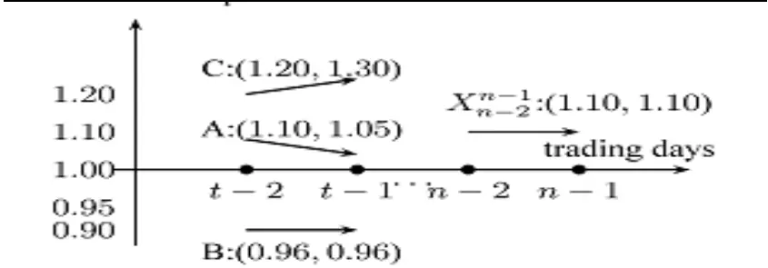
数据来源：国泰君安证券研究

为此，我们利用市场标准向量之间的相关系数作为其是否相似的标准，即设定阀值P ，当

$$
\frac{\mathrm{cov}(X_{i-w}^{i-1},X_{t-w}^{t-1})}{\sigma(X_{i-w}^{i-1})\sigma(X_{t-w}^{t-1})}\geq P
$$

时，我们认为历史市场向量与当期市场向量相似。相关系数基本能弥补距离的缺憾，既考虑了走势的方向，同时又兼顾了幅度。

## 2.3.相似性匹配实现的具体算法

在得到窗口W 下，所有的历史相似集 $X_{_{i-1}}$ 之后，我们根据所有相似集后

一期的市场向量 $X_{\textit{ i }}$ ，利用最优化方法找到目标权重b ，使得所有 $X_{\mathrm{~i~}}$ 的累计收益达到最大化，即：

$$
b_{_w}=\arg\max\prod_{_{i\in C_{_w}}}<b,X_{_i}>
$$

其中， $C_{\mathrm{~w~}}$ 表示在时间窗口W 下的历史相似空间集合，即

$$
\mathcal{C}_{t}(w,\rho)=\left\{w<i<t-1\bigg|\frac{\mathsf{cov}(\mathbf{X}_{i-w}^{i-1},\mathbf{X}_{t-w}^{t-1})}{\mathsf{std}(\mathbf{X}_{i-w}^{i-1})\mathsf{std}(\mathbf{X}_{t-w}^{t-1})}\geq\rho\right\},
$$

最后，在得到不同的时间窗口W 下，所有的优化权重 $b_{_{w}}$ 后，我们根据多参数组合的基本思想来组合所有的 $b_{w}$ ，得到策略最终所需要的目标权重。

相似匹配模型的具体算法如下：

算法 1：

输入变量：当日时间t ；历史市场向量X ；移动窗 $口_{W}$ ；相似系数阀值$\rho$

输出变量：基本权重 $b_{_t}(w,\rho)$

1：初始化历史相似集 $C_{t}(w,\rho)=\varnothing$ ， i = w + 1 ，转入 2

2：若 $t\leq w+1$ 则转入 3；否则转入 4；

3：输出 $b_{_t}(w,\rho)=(1/m,\ldots,1/m)$ ，算法结束。

4：若 $i\in[w+1,t-1]$ ，转入 5；否则 $7;$

5：若 $\rho\left(X_{_{i-w}}^{^{i-1}},X_{_{t-w}}^{^{t-1}}\right)\geq\rho$ ，转入 $6;$ ；否则 $i=i+1$ ，转入 5；

6： $C_{_t}(w,\rho)=C_{_t}(w,\rho)\cup\{i\}$ ， i = i + 1 ，转入 5;

7：若 $C_{_t}\left(w,\rho\right)=\emptyset$ ，输出 $b_{_t}(w,\rho)=(1/m,\ldots,1/m)$ ，算法结束；否则，转入 8；

8：求解 $b_{_t}(w,\rho)=\underset{b(w,\rho)\in\Delta_{_m}}{\arg\max}\prod_{_{i\in C_{_t}(w,\rho)}}<b(w,\rho)\cdot x_{_i}>$ ，输出 $b_{_t}(w,\rho)$ ，算

法结束。

算法 2：

输入变量：全部历史市场向量： $X_{\mathrm{~1~}}^{\mathrm{~}T}=(X_{\mathrm{~1~}},\dots,X_{\mathrm{~}T})$ ；移动窗口最大值W ；
相似性阀值 $\rho$ ；

输出变量：所有目标权重 $\boldsymbol{B}_{1}^{\textit{ T }}$ ；

1：初始化 $S_{_{\mathrm{~0~}}}=1$ $q\left(w,\rho\right)=1/W$ ， t • 1 ；

2: 若t ≤ T ，令 w = 1 ，转入 3；否则输出 $\boldsymbol{B}_{1}^{\textit{ T }}$ ，算法结束；

3：若 $w\leq W$ ，转入 4；否则转入 5；

4：运行算法 1，得到基本权重 $b_{_{t}}(w,\rho),\quad w=w+1$ ，转入 3；

5 ： 组 合 全 部 基 本 权 重 $b_{_t}\left(w_{_\nu}\rho,\right.$ )， 得 到

$b_{_t}=\frac{\sum_{_{w,\rho}}q\left(w\quad\rho,s_{_{t-1}}\quad w\quad\rho\quad b_{_t}(w\quad\rho)\right)}{\sum_{_{w,\rho}}q\left(w\quad\rho,s_{_{t-1}}\quad w\quad\rho\quad(\right.}$ ，转入 6；

6：更新总财富值： $S_{_t}=S_{_{t-1}}\times<b_{_t}\cdot X_{_t}>$ ，转入 7；

7 ： 更 新 全 部 基 本 策 略 的 总 财 富 值 ：

$s_{_t}(w,\rho)=s_{_{t-1}}(w,\rho)\times<b_{_t}(w,\rho)\cdot x_{_t}>$ ，转入 2。

## 3. 相似匹配行业配置 A 股策略实证

## 3.1.相似匹配周策略

按照上述相似匹配模型的构建过程，我们将其运用于 A股市场检验其实际表现。考虑到策略的稳定性，我们选用 23 个一级行业指数作为策略的标准组合，并且利用沪深 300指数作为基准对比指标。

在交易频率的选择上，我们考虑周频率数据进行检验。由于模型需要一段足够长的时间作为“学习期”，因此对周频率的数据进行测试中，实际策略收益阶段的时间跨度为 2009 年 12 月至 2013 年 7 月，测试结果如下：

图 6 0.05%单边成本下周策略与沪深 300比较
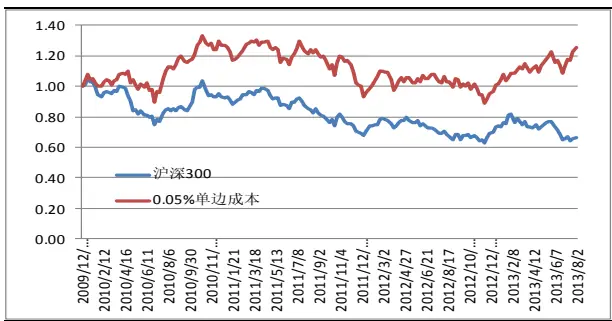
数据来源：国泰君安证券研究，wind

图 7周策略对冲收益走势
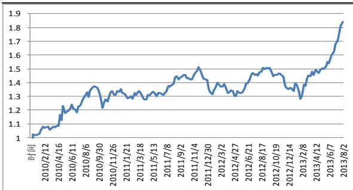

表 1 周对冲策略结果统计

| 统计指标 | 数值 |
| --- | --- |
| 财富终值 | 1.84 |
| 交易胜率 | 55.43% |
| 年化收益率 | 18.84% |
| 年化波动率 | 14.71% |
| 夏普比率 | 1.04 |
| 最大回撤 | 15.41% |
| VaR | -3.65% |
| ES | -4.76% |

数据来源：国泰君安证券研究，wind

由上述统计可以看出，相似匹配行业配置策略相对 hs300 有较好的表现，只是在稳健性上稍差:波动率和最大回撤均达到了 15%。

## 3.2. 2013年是适合相似性匹配的行情

2013 年是特别适合相似性匹配的行情，周策略从年初至今，模型已经获得了 50%的累积超额收益，胜率超过了 67%，回撤不到 6%。下图给出了周策略的绝对收益与对冲收益图。

图 8相似匹配周策略的绝对收益与对冲收益走势图
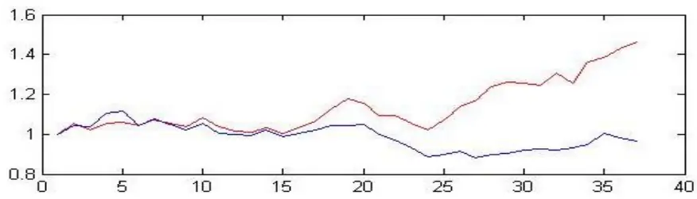

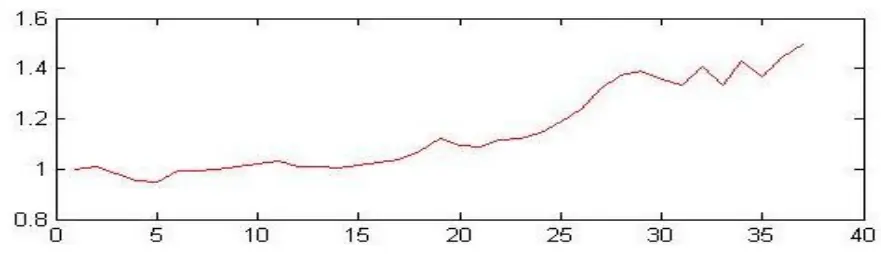
数据来源：国泰君安证券研究，wind，红线为配置走势图，蓝线为hs300。

表 22013 年周对冲策略结果统计

| 统计指标 | 数值 |
| --- | --- |
| 财富终值 | 1.50 |
| 交易胜率 | 66.67% |
| 年化收益率 | 79.33% |
| 年化波动率 | 21.73% |
| 夏普比率 | 2.67 |
| 最大回撤 | 0.06 |
| VaR | -0.05 |
| ES | -0.05 |

数据来源：国泰君安证券研究，wind

至于月策略，由于数据较短，仅供参考，见下图：

图 9 月策略的绝对收益与对冲收益走势图
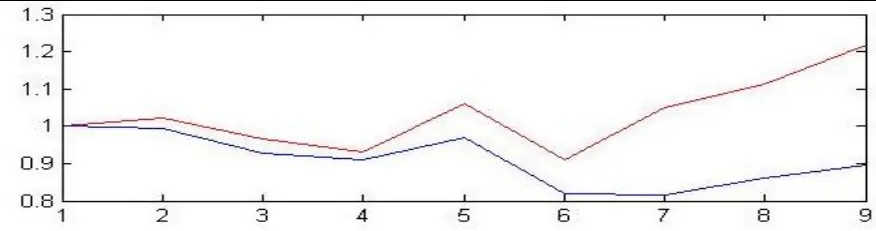

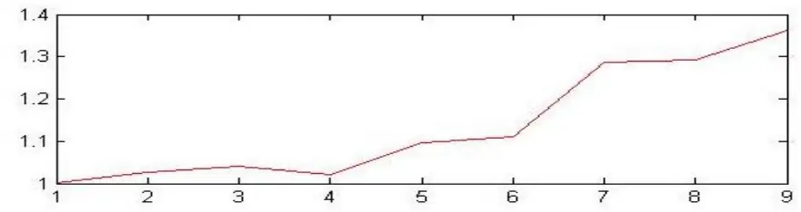
数据来源：国泰君安证券研究，wind，红线为配置走势图，蓝线为hs300。

由图 9 可知，除了在 4 月份有过 2%的负超额收益以外，其他月份都有较大幅度的正超额收益，截止 9月底已跑出了 36%的累积超额收益。

## 3.3.相似性匹配行业配置建议

上一期的月配置策略跑赢沪深 300 5.4%，利用最新的数据，10月份相似匹配模型的行业配置建议是

信息服务 78%，其它 22 个行业分别 1%

上一期的周配置策略跑赢沪深 300 3.7%，利用最新的数据，节后第一个交易周的行业配置建议是：

信息服务 90%，农林牧渔 10%

## 4. 相似匹配模型总结及前景展望

## 4.1. 模型小结

本报告我们主要介绍了基于机器学习的相似性匹配模型，其算法核心旨在通过寻找“历史相似集”，构建并动态调整投资组合的资产权重，使得投资者财富达到最大化。

相似匹配策略利用相关系数的方法定义了市场向量的相似，解决了由于欧式距离无法判断市场向量方向的缺陷，从而进一步提高了策略的有效性。

在对模型进行实证测试的过程中，无论是以日频率还是以周频率的数据，模型均有优异的结果，表现了模型较强的适用性。

## 4.2.相似性匹配模型适用的条件与环境

## 4.2.1. 模型的适用环境

任何模型都有其风险与适用条件，相似匹配最大的前提假设在于历史是可以重复的。目前我们还没有找到历史可以重复的统计检验，但有两点可以供参考：

1. 只有历史数据足够长，讲历史是否重复才是有意义的；

2. 市场结构相对稳定时，相似匹配模型更好用。

相似匹配模型在美国股市表现比中国好，与上述两个条件不无关系。

## 4.2.2. 模型对标的池的要求

对于标的池，该模型事实上也是有一定要求的：

1. 标的的同质性要差，同涨同跌很难跑出超额收益；

2. 标的的波动性要大，波动性太小难以跑赢交易成本；

3. 标的池数量要多，该模型还是遵从于投资组合理论，标的数量过少，难以达到分散投资，进行轮动的目的。

我们曾用二级行业也做过实证，发现二级行业的效果比一级行业要好，而且主要表现在稳健性上。

## 4.2.3. 模型对成本的敏感程度高

任何策略都不能忽视交易成本的存在，尤其是交易频率较高的策略，许多在理论上表现十分优秀的策略在实战中表现却乏善可陈，有一部分原因就是交易成本的存在吞噬了大量由于高频交易所产生的利润。

在我们上述的日频率测试中，在不考虑交易成本的情况下，模型表现极为优异，获得了将近 200倍的收益，但一考虑成本，结果就大不一样了。我 们 分 别 考 虑 分 别 考 察 单 边 交 易 成 本 r • {0 .0 1 % , 0 .0 2 % , 0 .0 3 % , ..., 0 .1 % } 的测试结果，结果如下图所示：

图 10 相似匹配模型的成本敏感性测试
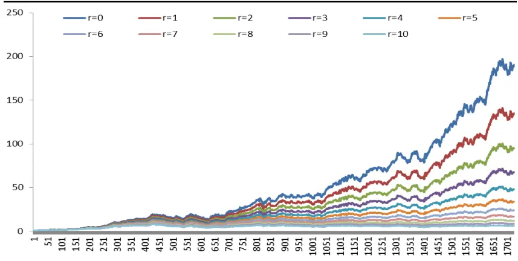
数据来源：国泰君安证券研究，wind

由图 10 可以发现，随着成本的上升，模型表现呈几何级数递减：当交易成本由0提高的双边千二的时，累积收益有189倍下降到了仅有6倍。这就要求我们：

1. 在历史学习期足够长的情况下，尽量降低调仓频率。就我国目前的情况而言，相似匹配模型选择周频是个相对比较适合的周期。

2. 尽量选择流动性好、交易成本低的品种作为标的池。目前，我们认为交易比较活跃的 ETF是最佳选择，毕竟每期都能省下千一的印花税。

## 4.3.相似性匹配模型的应用前景及展望

## 4.3.1. 相似匹配模型有待于进一步改进

尽管本文的相似匹配模型取得了很好的收益，但我们也看到，其缺点也极为明显，即波动太大，稳健性较差。这与相似匹配模型的两个核心点有关：1.如何来定义相似；2如何进行权重优化。

矩阵之间的相似定义有很多种，其实既可以利用距离，包括欧式距离、马氏距离、范数等，也可以利用相关系数；还可以运用信息熵来定义。尽管我们本文采取的是相关系数，但对于不同的投资者而言，可以选用不同的相似标准。事实上，这也属于计量经济学中的面板数据范畴。

解决了用什么来定义相似还不够，还有时间的伸缩尤其是非等比例伸缩问题。很多相似图形在时间上是不对应的，如何将这些相似片段纳入相似集也是有待于进一步研究的问题。相似集足够多的情况下，利用相似匹配得到的结果就会相对稳定些。

至于第二个问题权重优化，事实上，本文在设定目标函数时，选取的是收益最大化，没有考虑波动性、最大回撤、信息比率等因素，因此本文其实并没有用到权重优化方法，这就使得本文显示的最终结果是高风险高收益。投资者可以根据自己的目标与风险偏好，设定适当的目标函数，并采用合适的权重优化方式，结果或许会稳健很多。

## 4.3.2. 相似性匹配模型适用于择时配置选股等领域

相似性匹配模型是个普适模型，把单一指数、个股放入标的池，便成了判断市场及个股涨跌问题，属于择时范畴；把一篮子行业、股票放入标的池，便成了选股与配置问题。事实上，从技术处理的角度来看，在相似匹配模型中，择时的处理要远比配置简单，因为不用考虑内部相关性。当然实际效果就须另当别论了。

阿基米德曾经说过，给我一个支撑点，我就能撬起整个地球。而相似匹配模型则认为，给它一个标的池，在适当的条件下，它就能跑赢最好的标的。我们认为，未来随着中国股市数据的不断拉长，中国股市结构的相对稳定，相似匹配模型的表现会更出色，应用前景会更广阔。

## 本公司具有中国证监会核准的证券投资咨询业务资格

## 分析师声明

作者具有中国证券业协会授予的证券投资咨询执业资格或相当的专业胜任能力，保证报告所采用的数据均来自合规渠道，分析逻辑基于作者的职业理解，本报告清晰准确地反映了作者的研究观点，力求独立、客观和公正，结论不受任何第三方的授意或影响，特此声明。

## 免责声明

本报告仅供国泰君安证券股份有限公司（以下简称“本公司”）的客户使用。本公司不会因接收人收到本报告而视其为本公司的当然客户。本报告仅在相关法律许可的情况下发放，并仅为提供信息而发放，概不构成任何广告。

本报告的信息来源于已公开的资料，本公司对该等信息的准确性、完整性或可靠性不作任何保证。本报告所载的资料、意见及推测仅反映本公司于发布本报告当日的判断，本报告所指的证券或投资标的的价格、价值及投资收入可升可跌。过往表现不应作为日后的表现依据。在不同时期，本公司可发出与本报告所载资料、意见及推测不一致的报告。本公司不保证本报告所含信息保持在最新状态。同时，本公司对本报告所含信息可在不发出通知的情形下做出修改，投资者应当自行关注相应的更新或修改。

本报告中所指的投资及服务可能不适合个别客户，不构成客户私人咨询建议。在任何情况下，本报告中的信息或所表述的意见均不构成对任何人的投资建议。在任何情况下，本公司、本公司员工或者关联机构不承诺投资者一定获利，不与投资者分享投资收益，也不对任何人因使用本报告中的任何内容所引致的任何损失负任何责任。投资者务必注意，其据此做出的任何投资决策与本公司、本公司员工或者关联机构无关。

本公司利用信息隔离墙控制内部一个或多个领域、部门或关联机构之间的信息流动。因此，投资者应注意，在法律许可的情况下，本公司及其所属关联机构可能会持有报告中提到的公司所发行的证券或期权并进行证券或期权交易，也可能为这些公司提供或者争取提供投资银行、财务顾问或者金融产品等相关服务。在法律许可的情况下，本公司的员工可能担任本报告所提到的公司的董事。

市场有风险，投资需谨慎。投资者不应将本报告为作出投资决策的惟一参考因素，亦不应认为本报告可以取代自己的判断。在决定投资前，如有需要，投资者务必向专业人士咨询并谨慎决策。

本报告版权仅为本公司所有，未经书面许可，任何机构和个人不得以任何形式翻版、复制、发表或引用。如征得本公司同意进行引用、刊发的，需在允许的范围内使用，并注明出处为“国泰君安证券研究”，且不得对本报告进行任何有悖原意的引用、删节和修改。

若本公司以外的其他机构（以下简称“该机构”）发送本报告，则由该机构独自为此发送行为负责。通过此途径获得本报告的投资者应自行联系该机构以要求获悉更详细信息或进而交易本报告中提及的证券。本报告不构成本公司向该机构之客户提供的投资建议，本公司、本公司员工或者关联机构亦不为该机构之客户因使用本报告或报告所载内容引起的任何损失承担任何责任。

## 评级说明

## 1.投资建议的比较标准

投资评级分为股票评级和行业评级。

以报告发布后的12个月内的市场表现为比较标准，报告发布日后的12个月内的公司股价（或行业指数）的涨跌幅相对同期的沪深300指数涨跌幅为基准。

## 2.投资建议的评级标准

报告发布日后的 12 个月内的公司股价（或行业指数）的涨跌幅相对同期的沪深300指数的涨跌幅。

| 评级 | 说明 |  |
| --- | --- | --- |
| 股票投资评级 | 增持 | 相对沪深300指数涨幅15%以上 |
|  | 谨慎增持 | 相对沪深300指数涨幅介于5%～15%之间 |
|  | 中性 | 相对沪深300指数涨幅介于-5%～5% |
|  | 减持 | 相对沪深300指数下跌5%以上 |
| 行业投资评级 | 增持 | 明显强于沪深 300指数 |
|  | 中性 | 基本与沪深300指数持平 |
|  | 减持 | 明显弱于沪深300指数 |

## 国泰君安证券研究

|  | 上海 | 深圳 | 北京 |
| --- | --- | --- | --- |
| 地址 | 上海市浦东新区银城中路168号上海 银行大厦29层 | 深圳市福田区益田路 6009 号新世界 商务中心34层 | 北京市西城区金融大街 28 号盈泰中 心2号楼10层 |
| 邮编 | 200120 | 518026 | 100140 |
| 电话 | （021)38676666 | (0755)23976888 | (010)59312799 |
|  | E-mail: gtjaresearch@gtjas.com |  |  |