2013.12.09

# 发现价格走势规律之基于 MACD 分段研究

# ——数量化专题之二十九

刘富兵（分析师）

赵延鸿（研究助理）

8 021-38676673

021-38674927

liufubing008481@gtjas.com

zhaoyanhong@gtjas.com

证书编号 S0880511010017

S0880113070047

## 本报告导读：

发现价格走势规律的一个重要途径是基于特定规则对价格走势进行分段。本篇报告着重介绍了基于 MACD 的 DEA 指标对价格分段，并提出可疑拐点删除算法。总结了不同周期价格分段的规律，揭示了过去 13 年上证综指的价格结构，提升了对日线级别拐点和小级别买卖点的把握能力，价格分段结构既可用于择时也可用于选股。

## 摘要：

le_Summary] 价格走势分段有很多种方法，本篇报告主要介绍基于 MACD的 DEA指标分段方法。这个方法基于以下两个规则对价格序列进行分段：①波段低点对应 MACD 的DEA指标 <0，波段顶点对应 MACD的DEA指标 >0；②每个波段中价格的最大值和最小值只出现在波段的起点或终点。

通过对上证综指 30 分钟和日线价格分段比较，发现日线级别的一段上涨或下跌和 30 分钟图上的波段数存在很强的规律。过去十三年，上证综指日线上一段上涨对应 30 分钟级别波段数仅有 3次超过9段，等于 9段也有3次，这3次的顶点和次顶点非常接近，由此可知，上证综指日线级别的一段上涨如果 30 分钟线上出现 7 段，基本就是一个日线级别的顶点，意味着之后的下跌，日线 DEA指标至少要跌破零轴。另外一个观察显示日线上的一段在 30 分钟周期图上绝大多数情况出现三段以上，可知如果日线一段和 30 分钟第一段行情同时出现，那么 30 分钟级别的第二段下跌则是买点。反之对于日线下跌中的行情也是成立的。对于一些急剧涨跌的波段这个规律则不一定成立。

报告首次在金融工程研究中提出了度量“结构趋势”的指标“波段合并率”，波段合并率是基于两个时间级别的价格分段图，来刻画价格的结构趋势强弱程度。通过对上证综指日线和 30 分钟两个级别的分段走势研究发现，上证综指的上涨波段合并率为 13.4%，而下跌波段合并率为 20%，虽然二者都表现出较强的结构趋势，但上涨波段的结构趋势更强。

- 为了研究分析各类资产价格及其各个时间周期上的分段规律，需要程序化实现 MACD 的 DEA 指标的分段算法，因此我们定义了可疑底部拐点、可疑顶部拐点和异常波段等重要概念，并提出了可疑拐点删除算法。

金融工程

## 金融工程团队：

刘富兵：（分析师）

电话：021-38676673

邮箱：liufubing008481@gtjas.com

证书编号：S0880511010017

何苗：（分析师）

电话：010-59312710

邮箱：hemiao@gtjas.com

证书编号：S0880511010049

## 严佳炜：（分析师）

电话：021-38674812

邮箱：yanjiawei008776@gtjas.com

证书编号：S0880512110001

## 耿帅军：（分析师）

电话：010-59312753

邮箱：gengshuaijun@gtjas.com

证书编号：S0880513080013

## 徐康：（分析师）

电话：021-38674939邮箱：xukang010849@gtjas.com证书编号：S0880513080018

## 赵延鸿：（研究助理）

电话：021-38674927邮箱：zhaoyanhong@gtjas.com证书编号：S0880113070047

## 陈睿：（研究助理）

电话：021-38675861

邮箱：chenrui012896@gtjas.com

证书编号：S0880112120012

## 刘正捷：（研究助理）

电话：021-38675860

邮箱：liuzhengjie012509@gtjas.com

证书编号：S0880112080087

## [Table_R相关报告

《2013 年 12 月沪深 300 指数成分股调整预测》2013.11.05

《再构大盘均线强弱指数》2013.11.04

《我们能打败最好的行业吗》2013.10.03

《沪深 300 指数期货展期策略研究》2013.09.23

《A 股走势拐点量化观察》2013.07.30

## 1. 基于 MACD 的 DEA指标价格分段简介

量化投资策略的构建离不开寻找价格走势规律，如何发现价格走势规律是一个很有意义的研究方向。一般而言，有两个路径：一是基于成熟的量化模型来分析市场，另一个是直接研究价格本身。这篇研究报告则是沿着第二个路径。

到目前为止，我们认为发现价格规律最有效的途径是对价格走势进行分解，或者说对价格进行分段。任何投资交易都是基于低买高卖，如果可以做空，则高点做空低点买回，所以投资交易成功的关键在于把握价格走势的拐点，把握的波段级别越小，交易的回报率就越高，但对资金的容纳量也就越低。对已有价格走势进行分段之后，通过分析各个时间级别的价格拐点特征，可以提高预判当下拐点出现的择时能力。

价格走势被分解成上涨与下跌交替出现的波段结构的意义：

①发现价格运行的规律，构造量化交易策略；

②根据资金级别选择分解级别，进而决定操作级别；

③对价格的上涨和下跌，及拐点的顶与底等概念有了清晰严格的数学描述。

价格分段有很多种方法，没有哪一种方法是最优的，不同分段规则的存在意义在于：选取某种分段使得当下走势的不确定性降到最低。本篇报告我们主要介绍基于 MACD的 DEA指标分段方法。这个方法基于以下两个规则进行分段。

基于 MACD 的 DEA指标波段划分规则：

① 波段低点对应 MACD 的 DEA 指标 < 0，波段顶点对应 MACD 的DEA 指标 > 0；

② 每个波段中价格的最大值和最小值只出现在波段的起点或终点。

图 1 基于 MACD之 DEA指标分段示意图
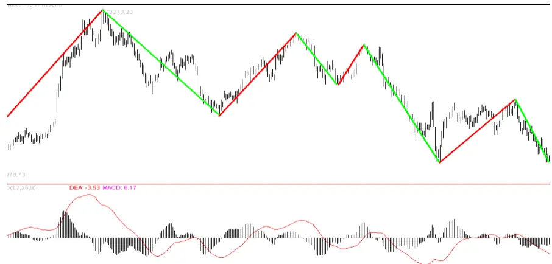
数据来源：国泰君安证券研究

两个规则中，第一个规则是对波段的顶部拐点和底部拐点定性，这个规则并不苛刻，只要顶点和低点对应的 DEA 指标大于零和小于零。第二个规则确保一个完成的波段中，不能出现价格大于顶点或者价格小于低点的情况。从投资交易角度，第二个规则符合波段交易的基本要求，买在低点卖在高点，如果可以融券做空的话，则可以卖在高点买在低点。

分段的规则很简单，只要严格按照这个规则对已有的价格进行分段，任何周期（1 分钟、5 分钟、日线、周线等等）资产价格都可以被唯一分解为上涨和下跌交替出现的波段。有了这些已有的上涨和下跌波段信息，一些价格走势规律就会被揭示。

虽然基于 DEA指标分段规则很简单，但程序化实现需要考虑细节很多。需要定义“可疑拐点”、“异常波段”、“可疑拐点删除算法”等概念，从而保证用程序化可以完美实现价格分段。

MACD 是技术分析领域一个非常重要且应用广泛的指标，在这篇报告中，使用了 MACD 最常用到的参数 MACD（12，26，9），没有设置其他参数。有一点特别需要指出的是，参数设置不是一个最优化问题，参数一旦固定好后，基于此参数进行分解，在此分解基础上寻找价格走势规律。价格分段的本质并不是寻找价格走势存在某种固化模式，而是在不同的分解视角下，对未来走势的可预测性达到最大化。

实际图形中有很多例子，看上去是一段，但如果不同时符合给定的两个规则，也不能形成一个分段，如下图所示，上涨行情出现一个明显回调，但从 MACD 的 DEA 指标可以看出，其回调波段的低点对应的 DEA 指标仍然位于零轴之上，因此这一段从分段规则上不构成一段。

图 2 回调不构成一段的情况
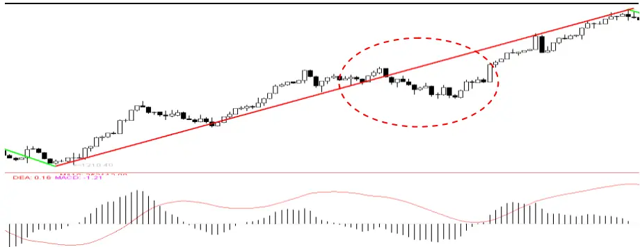
数据来源：国泰君安证券研究

实际中有些情况，一个波段从持续时间或者幅度上并不显著，但只要满足 DEA指标的分段规则，也必须构成一个波段。如下图，1到 2，带有一个跳空缺口，从交易时间上，比其他波段持续时间短，但其 DEA 指标从零轴上方穿到下方，而且整个波段的高低点分别对应 DEA 大于零和 DEA小于零。所以按照分段规则，1-2 是一个波段。

图 3 构成一段的例子（1-2）
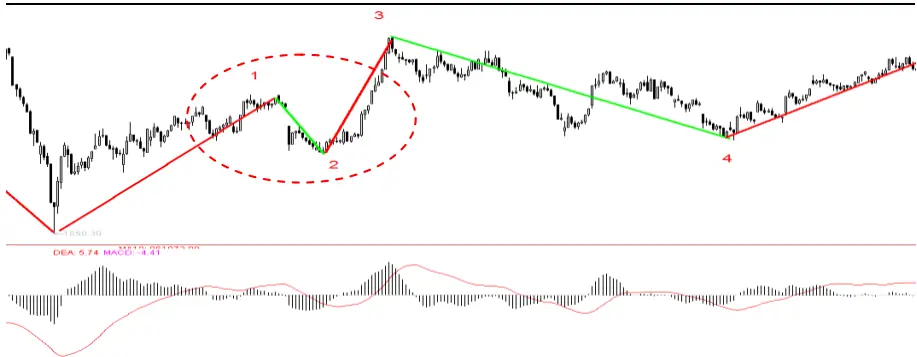
数据来源：国泰君安证券研究

## 2. MACD 指标简介

MACD（Moving Average Convergence Divergence）称为指数平滑移动平均线，是技术分析领域应用广泛的指标之一，包含了三个参数，常用的设置有（12，26，9）。MACD是计算两条不同速度（长期与中期）的指数平滑移动平均线（EMA）的差离状况来作为研判行情的基础。DIF 为12周期均值与 26周期均值之差，DEA为 DIF的 9周期均值，而 MACD则为 DIF与 DEA差值的两倍。

在传统技术分析领域，MACD常被用来做价格与指标背离进行择时，譬如价格越涨越高，而 MACD 的黄白线越走越低逼近零轴，这时候往往价格面临调整。MACD指标还有很多实战用法，但我们认为这些用法都难以摆脱固化操作模式范畴，实际应用起来容易出现似是而非的结果。

图 4 EMA 均线
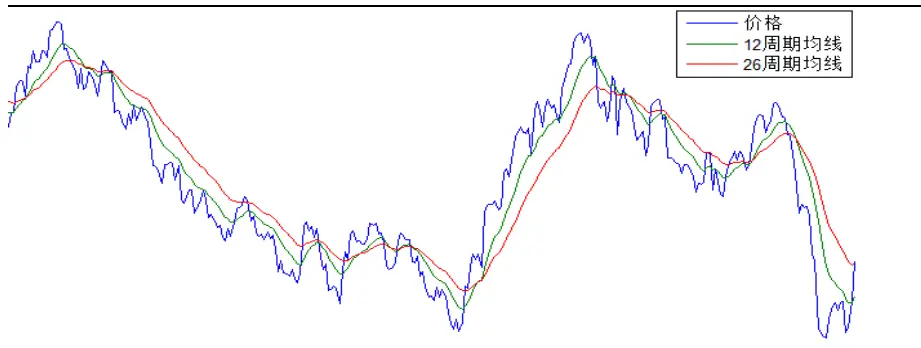
数据来源：国泰君安证券研究

图 5 MACD 的 DIF 与 DEA 指标
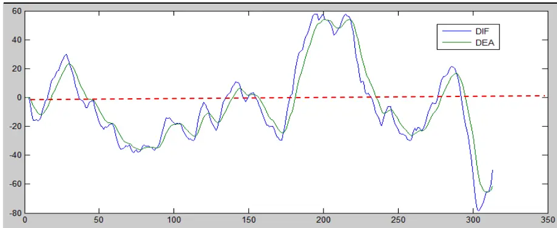
数据来源：国泰君安证券研究

这篇报告中，我们主要运用了 DEA 指标在价格上涨和下跌的过程中其穿越零轴这个特征对价格进行分段，没有使用 DIF的原因是 DIF走势稳定性较 DEA 差，价格上一些小的扰动会引起 DIF 在零轴上下穿越，而在这一点上 DEA稳定得多。

## 3. 基于 MACD 的 DEA指标分段拐点识别算法

为了能够程序化实现 MACD之 DEA指标分段算法，需要先定义两个重要概念：可疑底部拐点和可疑顶部拐点。

可疑底部拐点满足四个条件：

（1） DEA < 0；

（2） 向右遍历，直到找到满足两个条件的极大值点 RT（① DEA>0；② 这个极大值点是底点到此极大值点区间的最大值）；

（3） 向左遍历，直到找到满足两个条件的极大值点 LT（① DEA>0；

② 这个极大值点是底点到此极大值点区间的最大值）；

（4） 那么位于 LT与 RT 之间的最小值点就是可疑底部拐点。

图 6可疑底部拐点定义示意图
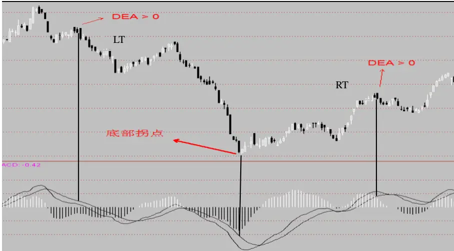
数据来源：国泰君安证券研究

可疑顶部拐点满足四个条件：

（1） DEA > 0；

（2） 向右遍历，直到找到满足两个条件的极小值点 RB（① DEA < 0；② 这个极小值点是顶点到此极小值点区间的最小值）；

（3） 向左遍历，直到找到满足两个条件的极小值点 LB（① DEA < 0；

② 这个极小值点是顶点到此极小值点区间的最小值）；

（4） 那么位于 LB与 RB之间的最大值点就是可疑顶部拐点。

图 7可疑顶部拐点定义示意图
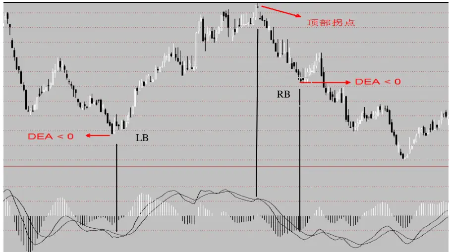
数据来源：国泰君安证券研究

## 4. 异常波段处理

## 4.1.什么是异常波段？

之所以把满足以上定义的拐点称为可疑底部拐点和可疑顶部拐点，原因在于根据此定义得到的相邻两个拐点连接而成的波段未必是符合分段规则的波段。举例说明，如果可疑顶部拐点与可疑底部拐点连接形成波段，但波段的最大值不是可疑顶部拐点或者最小值不是可疑底部拐点，这样的波段就不是符合 DEA 指标分段规则的波段。这种情况在实际走势分解中并不多见，但一旦出现，程序化算法必须做出正确处理。

我们选取 2009年 11月 13日至 2010 年 2 月 3日期间，出现的一个罕见的例子。从下图，A点是可疑顶部拐点，B点（2009年 12月 25日）也符合可疑底部拐点的条件，左侧与右侧都能找到局部极大值点而且DEA>0，但是显而易见，B 不是 AB 波段的最小值点，所以 AB 不能成为一个符合标准的波段。

图 8可疑顶部拐点与可疑底部拐点不能构成波段的例子
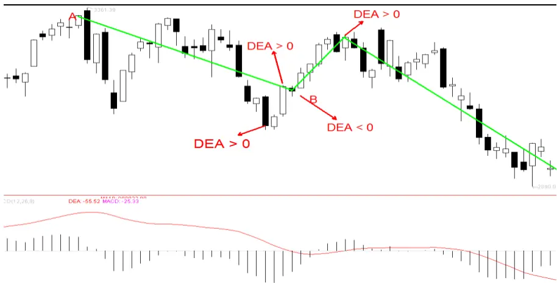
数据来源：国泰君安证券研究，WIND

基于以上这种特殊例子，我们定义一个新的概念“异常波段”。

异常波段：通过连接可疑顶部拐点和可疑底部拐点成为波段后，如果此波段的最大值或最小值不是波段的端点，这种波段称为异常波段。也就是说一个正常波段必须满足波段的最大值与最小值是波段的两个端点。

用数学语言描述，假定一个波段的两个端点分别是 $d$ 和 $g$ , 其中 $d$ 为波段低点， $g$ 为波段高点。 定义波段区间的最小值和最大值分别为dd,gg ，那么只要存在 $dd\neq d$ 或者 $gg\neq g$ ，这个波段就定义为异常波段。

## 4.2.异常波段处理一：下跌波段的顶点不是波段最大值

如何处理异常波段从而得到严格符合规则的基于 MACD 波段划分是关键。首先根据可疑顶部拐点和可疑底部拐点的定义把给定价格序列进行分段，得到…顶点 > 低点 > 顶点 > 低点 > 顶点 > 低点 > …交替出现的波段结构。如果这个波段划分中每一个波段都是正常波段，那么这个波段划分就是符合分段规则的划分。反之，如果这个波段划分中存在异常波段，首先按照时间顺序，找到第一个异常波段。如何处理这个异常波段需分几种情况讨论。

图 9 下跌波段的可疑顶部拐点g 不是波段最大值（ $g<gg,\mathrm{d}=\mathrm{d}\mathrm{d}$ ）
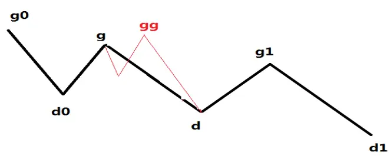
数据来源：国泰君安证券研究

$g\;<\;gg,\mathrm{d}=\mathrm{d}\mathrm{d}$ ，从 $g$ 点到 $d$ 的波段中，原始价格走势中存在一个最大值点 $gg$ 比 $g$ 点的位置还高，但 $gg$ 不是可疑拐点，因为其不满足可疑拐点的两个条件，而 $d$ 点仍是这个波段的最小值点。对于这种情况，$\pmb{\varepsilon}$ 必定不能成为一个波段的端点，所以 $\pmb{\varepsilon}$ 点必须从可疑拐点序列中删除，g 点被删除后，靠近 $g$ $g$ 左右两侧的其中一个可疑底部拐点也必须被删除，这样可以满足波段涨跌的可连接性。当然实际情况是可能 $g$ 点左侧底部拐点未必存在，即 $g$ 是整个可疑拐点序列中的第一个点。

情形一、 $g$ 点左侧不存在底部拐点，即 $g$ 是整个可疑拐点序列中的第一个点，那么把 $g$ 点删掉即可，然后重复可疑拐点的删除算法；

情形二、g 点左侧存在可疑底部拐点d0 ，d 点右侧不存在顶部拐点， $g$ 即d 点是整个可疑拐点序列中的最后一个点，保留d0 和d 二者中较低的点 m in { d 0 , d } ，删掉较高的点 m ax { d 0, d } ，然后重复可疑拐点的删除算法；

情形三、g 点左侧存在可疑底部拐点d0 ，d 点右侧存在可疑顶部拐点$g1$ ，如下图

图 10 情形三：g 点左侧存在d0 ，d 点右侧存在 $\pmb{\pmb{\mathscr{s}1}}$

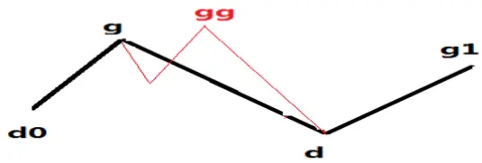
数据来源：国泰君安证券研究

具体需要删除d0 和d 中的哪一个点，我们分四种情况进行讨论：①$g<g1,\quad d0<d\quad\textcircled{2}g<g1,\quad d0>d\quad\textcircled{3}g>g1,\quad d0>d\quad\textcircled{4}g>g1$ $d0<d$ 。如果以上四种情况之外出现任何两个顶点相等或者两个低点相等的情况，可以加一个极小的随机项使其满足四种情况的一种。简单分析可知，对于③④两种情况，由于 $g\;>\;g1$ ，d0 就必须删除而保留 $d$ ，反之如果 $d$ 删除掉而保留d0 ，d0 需要和g1进行连接，但注意到 $gg>g>g1$ ，所以这种情况必然使得d0 到g1成为一个新的异常波段。特别需要指出的是④这种情况，如果d0 之前不存在可疑顶部拐点$g\;0$ ，那么这种处理就完美了；但如果 $d0$ 之前存在一个可疑顶部拐点$g\;0$ ，那么 $g\;0$ 至 $d$ 会成为异常波段，会在下一步可疑拐点删除算法中进行处理。

图 11 ③④情形处理（ g g • 1 ）： d 0 、 g 删除、保留 d 、 $\pmb{\pmb{\mathscr{s}1}}$ 对于①这种情形，比较简单，因为g < g1，d0 < d，所以保留d0，删除d ，这样d0 至g1之间构成一个线段，至于这个线段是否是一个异常波段，可以在下一个可疑拐点删除过程中进行检验。

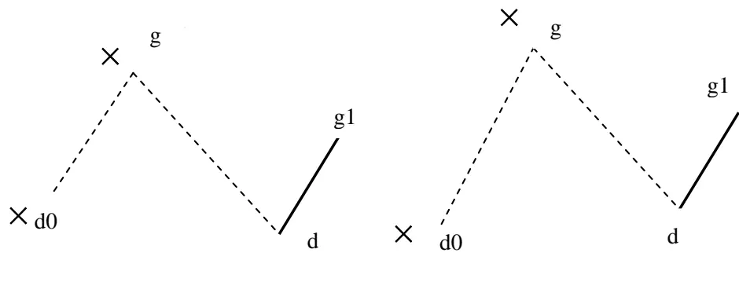
数据来源：国泰君安证券研究

$$
d0<d
$$

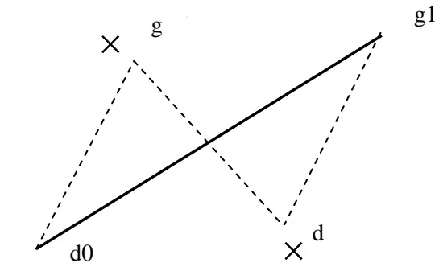
数据来源：国泰君安证券研究

对于情形②，d 到g1的线段包含了d0 至g 的线段，g 点被删除后， $d0$ 无法连接 $至g1$ ，因为之间存在一个 $d<d0$ ，如果 $d0$ 连接 $至g1$ ，就成为异常波段。

图 13 ②情形处理（ g g • 1 , $d0>d$ ）： d 0 、 g 删除、保留 $\pmb{d}$ 、 $\pmb{\pmb{\mathscr{s}1}}$
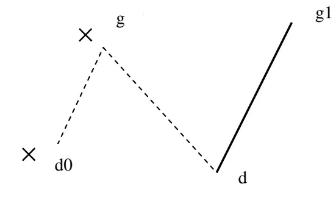
数据来源：国泰君安证券研究

4.3.异常波段处理二：下跌波段的低点不是波段的最小值
图 14 下 跌 波 段 的 可 疑 底 部 拐 点 d 不 是 波 段 的 最 小 值( g = gg,dd < d )
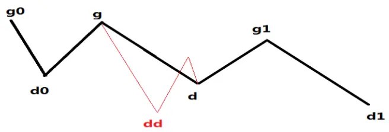
数据来源：国泰君安证券研究

g g g • , $\mathbf{d}\mathbf{d}<\mathbf{d}$ ，从g 点到 $d$ 的波段中，原始价格走势中存在一个最小值点 $dd$ 比 $d$ 点的位置还低，但 $dd$ 不是可疑底部拐点，因为其不满足可疑拐点的两个条件。而g 点仍是这个波段的最大值点。对于这种 $g$ 情况，d 必定不能成为一个波段的端点，所以 $\pmb{d}$ 点必须从可疑拐点序列中删除， $\pmb{d}$ 点被删除后，靠近d 左右两侧的其中一个可疑顶部拐点也必须被删除，这样可以满足波段涨跌的连接性。当然实际情况是可能d点右侧顶部拐点未必存在，即 $g$ 是整个可疑拐点序列中的最后一个点。

情形一、 $d$ 点右侧不存在顶部拐点，即d 是整个可疑拐点序列中的最后一个点，那么把d 点删掉即可。然后重复可疑拐点的删除算法；

情形二、 $d$ 点右侧存在可疑顶部拐点 g1，g 点左侧不存在底部拐点，

即 $g$ 点是整个可疑拐点序列中的第一个点，保留 $g$ 和 $g1$ 二者中较大的

点 m ax { g , g 1} ，删掉较小的点 m in { g , g 1} 。然后重复可疑拐点的删除算法；

情形三、g 点左侧存在可疑底部拐点d0 ，d 点右侧存在可疑顶部拐点$g1$ ，如下图：

图 15 g 点左侧存在d0 ， d 点右侧存在 $\pmb{\mathscr{s}1}$
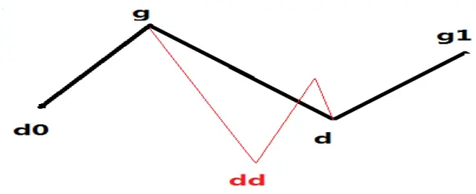

数据来源：国泰君安证券研究

具体需要删除 g 和 g1 中的哪一个点，我们分四种情况进行讨论：①

$$
\begin{array}{r}{d\quad0\quad<\quad d\quad,\quad g\quad<\quad g1\quad,\quad\textcircled{2}\quad d\quad0\quad<\quad d\quad,\quad g\quad>\quad g1\quad,\quad\textcircled{3}\quad d\quad0\quad>\quad d\quad,\quad g\quad>\quad g1\quad,\quad\textcircled{4}\quad d\quad0\quad>\quad d}\end{array}
$$

$$
g\;<\;g1\;.
$$

对于①这种情形，比较简单， $d0<d,g<g1$ , 因为d 必须被删除，d0

保留，这样 g 与 g1 中有一个必须被删除，如果保留 g 删除 g1，g 必须和 g1 之后的一个低点构成波段，但 g1 大于 g，这样会自动出现异常波段，所以必须保留 g1而删除 g。至于 d0到 g1这个线段是否是一个异常波段，可以在下一个可疑拐点删除过程中进行检验。

图 16 ①情形处理（d d0 • ， $\pmb{g}\ll\pmb{g}\pmb{1}$ ）： d 0 、 g 1 保留、删除 d 、 g
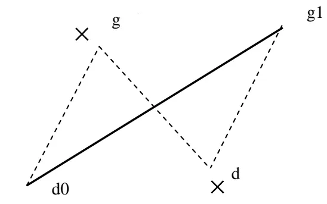
数据来源：国泰君安证券研究

对于②这种情形，d 被删除后，d0 保留，则 d0 必须连接 g，否则如果d0 连接 $\mathtt{g}1$ 会成为异常波段，因为 g 大于 g1。

图 17 ②情形处理（ d d 0 • ， $\pmb{g}\geq\pmb{g}\mathbf{1}$ ）： d 0 、 g 保留、删除 d 、 g 1
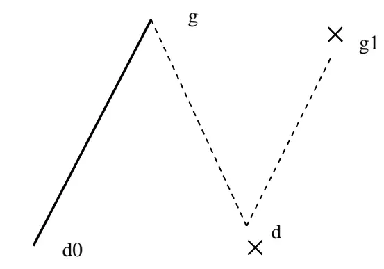
数据来源：国泰君安证券研究

对于③这种情形，d 被删除后，如果保留顶点 g1 删除 g，那么 d0 到 g1立刻成为异常波段，因为 g>g1，所以删除 g1 保留 g。

图 18 ③情形处理（ d d 0 • ， $\pmb{g}\geq\pmb{g}\pmb{1}$ ）： d 0 、 g 保留、删除 d 、 g 1
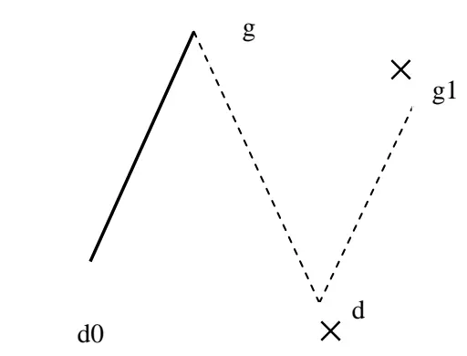
数据来源：国泰君安证券研究

对于④这种情形，d 被删除，如果保留 g1，d0 到 g1 会立刻成为异常波段，因为 d<d0，所以删除 g1 保留 g。

图 19④情形处理（d0>d，8< g1）：d0、g保留、删除d、g1
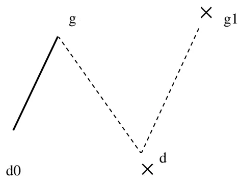
数据来源：国泰君安证券研究

综上四种情形，可以看出除了①之外，②③④都是保留了第一根线段，即 d 0 、 g 保留、删除 d 、 g 1 。

可疑拐点删除算法的核心原则：避免出现异常波段。

## 4.4.异常波段处理三：下跌波段的低点不是波段的最小值、顶点也不是波段的最大值

如果可疑拐点序列中存在一个异常波段，其最大值和最小值都不是波段端点的情况，虽然这种情况在现实价格序列是极其罕见的，但理论上是存在的，处理方法既可以归为异常波段处理一，也可以归为异常波段处理二，之后继续可疑拐点删除算法，直到所有的异常波段消失。

## 4.5.异常波段处理四：上涨波段为异常波段

之前讨论的都是下跌波段为异常波段情况，而对于上涨波段为异常波段的情况，不需要再做分类讨论，可以做一个简单的倒数映射变换，把上涨波段变为下跌波段，运用可疑拐点删除算法之后，再做同样的倒数映射变换回原始序列。

图 20 倒数映射
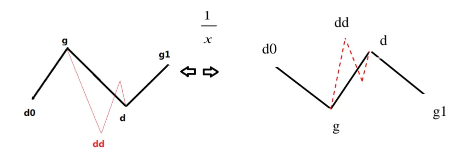
数据来源：国泰君安证券研究

## 5. 当下走势确认

价格分段的目的一方面是寻找价格走势的规律，另一方面则是对当下走势的可能发展方向、幅度、买卖点做出判断，以制定相应的操作策略。而当下一个波段的发展包含两个时点：第一、形成时点；第二、结束时点。一个新波段的形成时点正是前一个波段的结束时点，反之亦然，前一个波段的结束时点也是新波段的形成时点，二者互为因果。

## 5.1.新波段形成情况分类讨论

当 MACD的 DEA指标穿越零轴时，当下波段可能正好形成，也可能还没有形成，因此最新波段的形成时点包含两种情况：一、MACD 的 DEA指标穿越零轴时，对应的波段正好处于当前波段的最大值点（DEA向上穿越零轴）或者最小值点（DEA 向下穿越零轴），那么这个波段就在当下形成；二、MACD 的 DEA 指标穿越零轴时，对应波段的当前价格已经不是当前波段的最大值点（DEA向上穿越零轴）或者最小值点（DEA向下穿越零轴），但在之后继续创出波段的新高或者新低，直到那时才能确认新波段形成。我们以上涨波段为例，分析两种情况：

第一种情况：如下图可以看到，由 B点开始的上涨行情，MACD的 DEA指标从零轴下方向上延伸，在穿越零轴的时点，以 B为起始位置的上涨行情到达 C点，创反弹以来的最高点，这种情形下，A到 B的下跌波段被破坏，即 A 到 B 的下跌行情宣告终结在 B 点，AB 下跌波段完成，B到 C的上涨波段形成。

图 21 波段当下形成：第一种情形
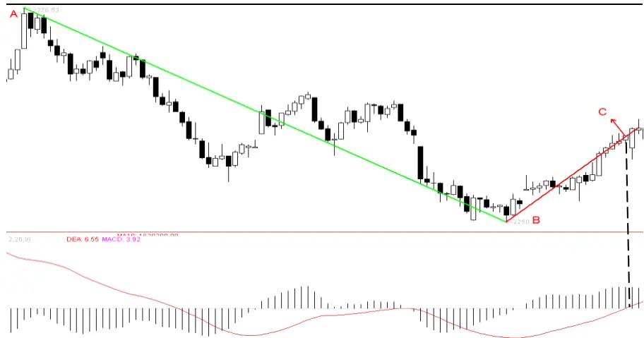
数据来源：国泰君安证券研究

第二种情形：如下图可以看到，由 B点开始的上涨行情，MACD 的 DEA指标从零轴下方向上延伸，穿越零轴的时点为 C点之后的第一根阴线，这个位置已经不是以 B为起始位置的上涨行情以来的新高，而 C点对应的 DEA指标在零轴之下，因此 B到 C点的上涨波段尚未形成。从 C点出现小的回调后，继续上涨在 D点创出反弹以来的新高，可以看到这时候 DEA 指标仍在零轴之上。在这个时点，A 到 B 的下跌波段被破坏，即 A到 B的下跌行情宣告终结在 B点，AB下跌波段完成，B到 D的上涨波段形成。

图 22 波段当下形成：第二种情形
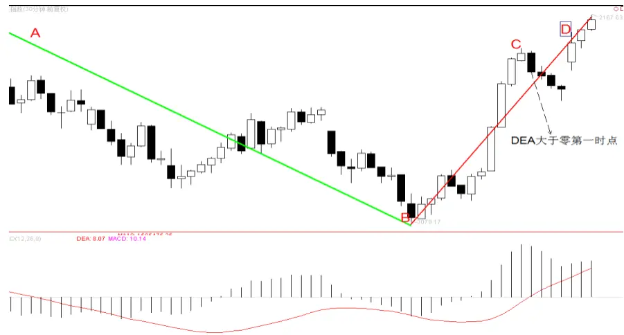
数据来源：国泰君安证券研究

## 5.2.旧波段结束情形讨论

以一个下跌行情为例，出现反弹后，当对应的MACD 的 DEA指标第一次自下而上穿越零轴时，是不是可以立刻判断之前的下跌行情宣告结束，新的上涨波段形成呢？根据前面讨论可知答案是否定的。从底部拐点的定义不难知道，反弹波段对应的 DEA 指标第一次从下向上穿越零轴时，如果当下的价格不是反弹波段的最大值，那么下跌波段是否被结束是不能确定的。

以下图举例说明，A到 B是一段下跌行情，从 B点开始出现反弹，反弹到 C点位置，虽然 C点为反弹行情的最高点，但其 DEA < 0，直到价格到达黑点标注位置，DEA指标才首次从下而上触到零轴，这种情况下，A到 B的下跌行情是否完成是不能确认的，在当下我们把 B点标记为可能底部拐点，意味着 B点可能是真正的底部拐点，也可能不是。当然在这个例子中，最后 D点比 B点的位置低，同时D满足底部拐点的定义，所以最终 D点成为底部拐点。

图 23 波段当下被破坏、可疑底部拐点确认
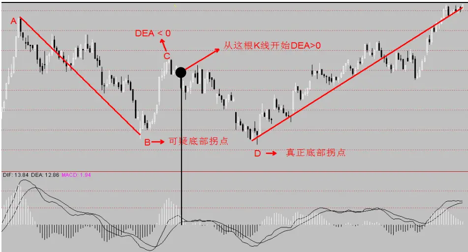
数据来源：国泰君安证券研究

## 6. 基于 MACD 分段应用举例

## 6.1. 数据统计

## 6.1.1. 上证综指日度数据

用 MACD 分段方法对上证综指日度收盘价进行分段，走势结构如下图。从 2001 年 1月至 2013 年 11月，波段共计 55个，平均每年出现 4个波段，其中 28个下跌，27个下跌。

图 24 上证综指分段图（2001 年 1 月 1 日-2013 年 11 月 20 日）
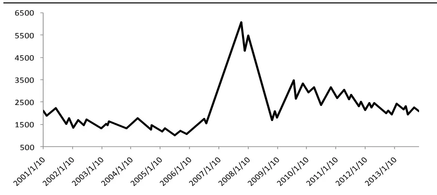
数据来源：国泰君安证券研究，WIND

如果我们做一个虚拟图形的话，扣除 2006年 8月 7日至 2008年 12月 8日四段行情，这四段行情包含一个极端上涨波段和一个极端下跌波段，从下图可以看出，大多数时间上证综指的波段走势是比较平稳的。

图 25 上证综指分段图（扣除 2006 年 8 月 7 日至 2008 年 12 月 8 日四段行情）
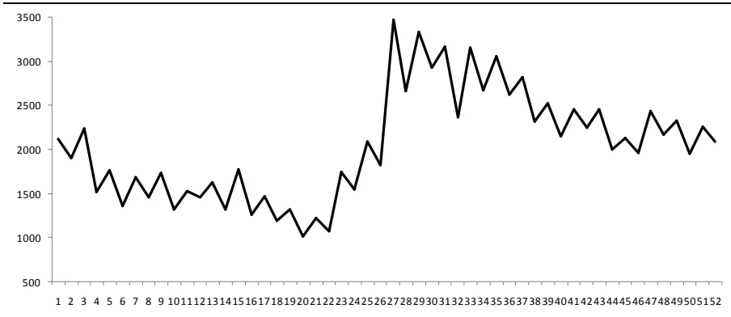
数据来源：国泰君安证券研究，WIND

上涨和下跌波段的具体统计结果如下，27 个上涨波段中，平均涨幅31.3%，最大值 293.7%，最小值涨幅 6.4%；而 28 个下跌波段中，平均跌幅 18.4%，最大跌幅 69%，最小跌幅 4.5%。

表 1：上证综指涨跌波段幅度统计（日度数据）

|  | 均值 | 标准差 | 最大值 | 最小值 | 样本数 |
| --- | --- | --- | --- | --- | --- |
| 上涨波段 | 31.3% | 55.4% | 293.7% | 6.4% | 27 |
| 下跌波段 | -18.4% | 12.0% | -69.0% | -4.5% | 28 |

数据来源：国泰君安证券研究

如果把上涨和下跌波段的前 10%和后 10%极端涨跌幅去掉的话，统计结果显示涨跌幅稳定性大幅提升。21 个上涨波段，平均涨幅 18%，最大35%，最小涨幅 7.9%，标准差 7.4%；22个下跌波段中，平均跌幅 16.6%，最大跌幅 25.3%，最小跌幅 8.5%，标准差 5.1%。

表 2：上证综指涨跌波段幅度统计（扣除 10%最大最小值，日度数据）

|  | 均值 | 标准差 | 最大值 | 最小值 | 样本数 |
| --- | --- | --- | --- | --- | --- |
| 上涨波段 | 18.0% | 7.4% | 35.0% | 7.9% | 21 |
| 下跌波段 | -16.6% | 5.1% | -25.3% | -8.5% | 22 |

数据来源：国泰君安证券研究

## 6.1.2. 上证综指 30分钟收盘价数据

数据：2008 年 10 月 6 日至 2013 年 11 月 21 日，出现 13 个异常波段，经过可疑拐点算法处理之后，最终涨跌波段共计 167 个，其中 84 个上涨波段，83个下跌波段。

图 26 上证综指30分钟分段图（2012年1月4日至2013年11月20日）
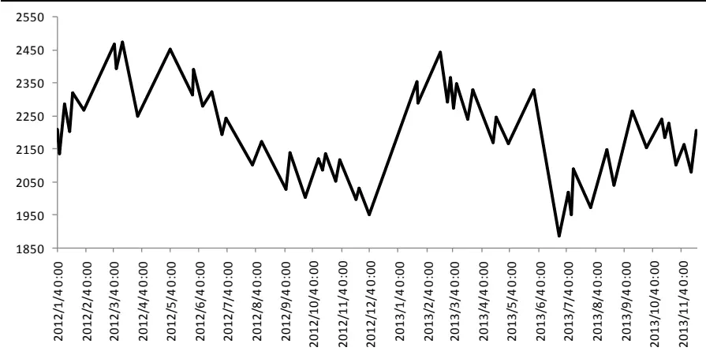
数据来源：国泰君安证券研究，WIND

30 分钟级别上涨和下跌波段的具体统计结果如下，84 个上涨波段中，平均涨幅 6.9%，最大值 28.2%，最小涨幅 1.7%；而 83个下跌波段中，平均跌幅 6.1%，最大跌幅 21%，最小跌幅 1.6%。

表 3：上证综指涨跌波段幅度统计（30分钟数据）

|  | 均值 | 标准差 | 最大值 | 最小值 | 样本数 |
| --- | --- | --- | --- | --- | --- |
| 上涨波段 | 6.9% | 5.4% | 28.2% | 1.7% | 84 |
| 下跌波段 | -6.1% | 4.0% | -21.0% | -1.6% | 83 |

数据来源：国泰君安证券研究

同样把上涨和下跌波段的前 10%和后 10%极端涨跌幅去掉的话，统计结果显示涨跌幅稳定性大幅提升。68 个上涨波段，平均涨幅 6%，最大涨幅 14.1%，最小涨幅 2.1%，标准差 2.9%； 67个下跌波段中，平均跌幅5.4%，最大跌幅 11.4%，最小跌幅 2.3%，标准差 2.2%。

表 4：上证综指涨跌波段幅度统计（扣除 10%最大最小值，30 分钟数据）

|  | 均值 | 标准差 | 最大值 | 最小值 | 样本数 |
| --- | --- | --- | --- | --- | --- |
| 上涨波段 | 6.0% | 2.9% | 14.1% | 2.1% | 68 |
| 下跌波段 | -5.4% | 2.2% | -11.4% | -2.3% | 67 |

数据来源：国泰君安证券研究

## 6.1.3. 上证综指 5分钟收盘价数据

数据：2008 年 10 月 6 日至 2013 年 11 月 21 日，出现 82 个异常波段，经过可疑拐点算法处理之后，最终涨跌波段共计 829个，其中 415个上涨波段，414个下跌波段。

5 分钟级别上涨和下跌波段的具体统计结果如下，415 个上涨波段中，平均涨幅 2.9%，最大涨幅 12.1%，最小涨幅 0.4%；而 414 个下跌波段中，平均跌幅 2.8%，最大跌幅 13.6%，最小跌幅 0.5%。

表 5：上证综指涨跌波段幅度统计（5分钟数据）

|  | 均值 | 标准差 | 最大值 | 最小值 | 样本数 |
| --- | --- | --- | --- | --- | --- |
| 上涨波段 | 2.9% | 2.2% | 12.1% | 0.4% | 415 |
| 下跌波段 | -2.8% | 2.1% | -13.6% | -0.5% | 414 |

数据来源：国泰君安证券研究

把上涨和下跌波段的前 10%和后 10%极端涨跌幅去掉的话，统计结果显示：331 个上涨波段，平均涨幅 2.5%，最大涨幅 5.9%，最小涨幅 0.9%，标准差 1.3%； 332个下跌波段中，平均跌幅 2.4%，最大跌幅 5.3%，最小跌幅 0.9%，标准差 1.1%。

表 6：上证综指涨跌波段幅度统计（扣除 10%最大最小值，5分钟数据）

|  | 均值 | 标准差 | 最大值 | 最小值 | 样本数 |
| --- | --- | --- | --- | --- | --- |
| 上涨波段 | 2.5% | 1.3% | 5.9% | 0.9% | 331 |
| 下跌波段 | -2.4% | 1.1% | -5.3% | -0.9% | 332 |

数据来源：国泰君安证券研究

## 6.1.4. 3个周期统计数据比较

图 27 上涨波段平均涨幅（扣除 10%最大最小值）
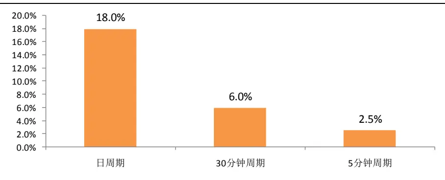
数据来源：国泰君安证券研究，WIND

图 28 下跌波段平均跌幅（扣除 10%最大最小值）
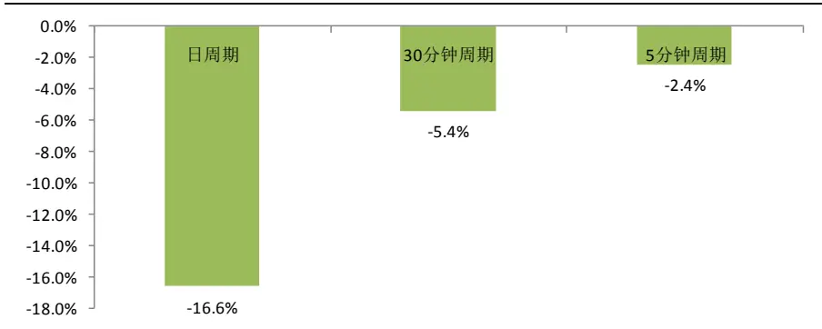
数据来源：国泰君安证券研究，WIND

## 6.2.不同周期的分段比例关系

## 6.2.1. 日线一段与 30分钟分段的比例关系

基于 MACD 之 DEA指标可以对任何周期图进行分段，比如可以用上证综指的日度收盘价分段，也可以基于上证综指 30 分钟收盘价分段。这里可以提出一个问题：日线图上的一段上涨或者下跌，如果放到 30 分钟图上看，一般能出现多少段？当然这个对应关系未必严格，因为基于日度收盘价计算得到拐点未必可以严格对应到基于 30 分钟收盘价得到的拐点上，实际情况是绝大数情况下，误差在 1到 2个交易日以内，所以寻求这种对应关系是非常有益的。

下表统计了上证综指自 2002年以来，日线上一段上涨和下跌在 30分钟周期图上出现的波段数。

表 7：上证综指日线上一段在 30 分钟走势图上对应的段数

| 上涨波段 |  | 下跌波段 |  |
| --- | --- | --- | --- |
| 原始波段数 | 合并之后波段数 | 原始波段数 | 合并之后波段数 |
| 23 | 21 | 23 | 15 |
| 17 | 15 | 11 | 11 |
| 13 | 11 | 17 | 9 |
| 11 | 9 | 9 | 9 |
| 13 | 9 | 9 | 7 |
| 9 | 9 | 9 | 7 |
| 7 | 7 | 9 | 7 |
| 5 | 5 | 11 | 7 |
| 7 | 5 | 7 | 7 |
| 5 | 5 | 9 | 7 |
| 9 | 5 | 7 | 5 |
| 7 | 5 | 7 | 5 |
| 3 | 3 | 7 | 5 |
| 3 | 3 | 5 | 5 |
| 3 | 3 | 5 | 5 |
| 3 | 3 | 5 | 5 |
| 3 | 3 | 7 | 5 |
| 3 | 3 | 3 | 3 |
| 1 | 1 | 3 | 3 |
| 1 | 1 | 3 | 3 |
| 1 | 1 | 3 | 3 |
| 1 |  | 3 | 3 |
| 1 | 1 | 1 | 1 |
|  | 1 | 1 | 1 |

数据来源：国泰君安证券研究

有两个概念需要阐述：原始波段数定义为实际基于 MACD 之 DEA指标分段得到的波段数，但由于波段存在包含和被包含的关系，有些波段属于既没有创新高也没有创新低的情况，对于这种情形我们会根据日线上波段涨跌属性做合并。合并的规则，如果日线是上涨波段，对应 30 分钟线上没有创新高的波段都要被合并；反之，如果日线是下跌波段，对应 30 分钟线上没有创新低的波段都有被合并。如下图，这是一个 30 分钟的走势结构图，7-12在日线上是一段下跌，因此 9-10虽然有三段，但合并后只有一段，也就是说，7-12 的原始 30 分钟波段数有 7 段，但合并后波段数为 5段。

图 29 波段合并
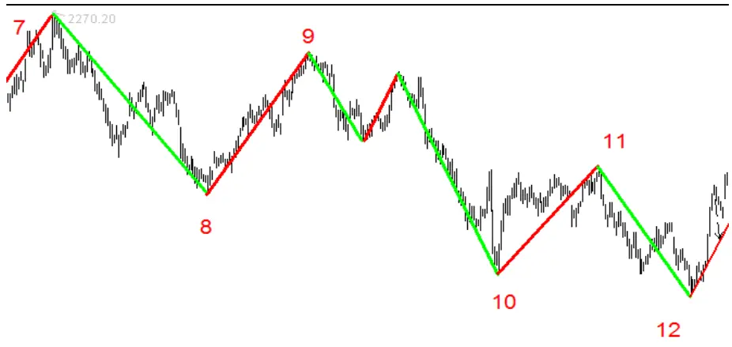
数据来源：国泰君安证券研究，WIND

合并之后波段数，统计上证综指日线与 30 分钟线对应关系显示：23 个日线上涨波段中，一个日线波段最多对应了 21个 30分钟级别合并之后的波段，出现在 2006年 8月 7日至 2007年 10月16日。日线上的这一段行情也是过去 10 多年 A 股历史上最大的一波牛市行情，上证综指从1547 点涨至6092，日线上一段涨幅达到 294%。另一点值得注意的是这波行情的原始波段数为 23 个，仅比合并之后波段数多 2 个波段，可见趋势性上涨的力度很强，也就是说几乎每一个 30分钟的上涨都创新高。这是结构趋势的典型例子。

图 30 日线上一段对应 30 分钟波段图（2006.8.7 ---2007.10.16，合并后21 段）
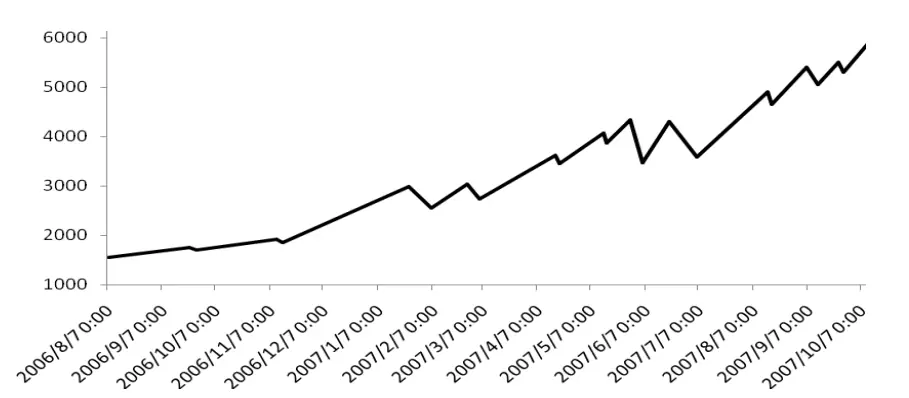
数据来源：国泰君安证券研究，WIND

另一个比较极端的例子出现在 2008年底到 2009年中一波牛市行情，从2008 年 12 月 31 日至 2009 年 8 月 4 日，上证综指日线一段的上涨，30分钟图上出现 17段，合并之后 15段。从这个例子再次看到了结构趋势的威力，总共 17 个波段，合并之后达到 15 个，同样几乎每一个 30 分钟级别的上涨都创新高。

图 31 日线上一段对应 30 分钟波段图（2008.12.31 ---2009.8.4，合并后15 段）
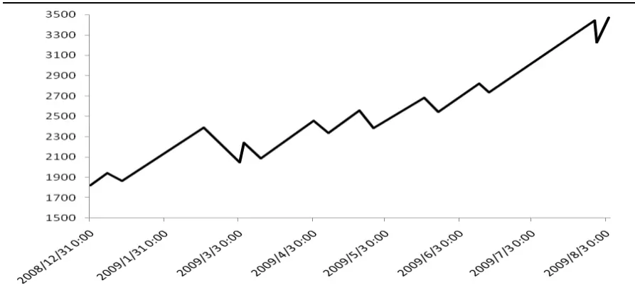
数据来源：国泰君安证券研究，WIND

第三个比较极端的例子出现在 2003年底，从 2003年 11月 13日至 2004年 4 月 7 日，上证综指日线一段的上涨，30 分钟图上出现 13 段，合并之后 11 段。从这个例子同样看到了结构趋势的威力，总共 13 个波段，合并之后达到 11个，同样几乎每一个 30 分钟级别的上涨都创新高。

图 32 日线上一段对应 30 分钟波段图（2003.11.13 ---2004.4.7，合并后11 段）
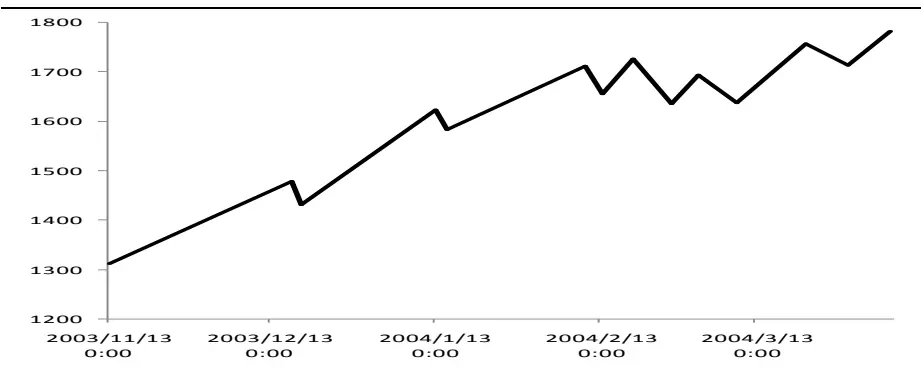
数据来源：国泰君安证券研究，WIND

## 6.2.2. 30 分钟分段的合并率分析

合并率的定义如下：

$$
合并率=\frac{\sum 原始波段数-\sum 合并后波段数}{\sum 原始波段数}
$$

合并率刻画了价格走势的趋势特征强弱，简单计算可知，上证综指 30分钟上涨波段的合并率为 13.4%，30分钟级别下跌波段的合并率 20.7%，表明上涨趋势特征更强。如果 30 分钟级别上涨波段合并率为零，意外着所有日线上一段上涨，在 30 分钟图形上每一段都是不断创出新高。合并率是用来刻画结构趋势的重要量化指标，合并率越小表明趋势特征越强，合并率越大表明结构趋势比较曲折。

## 6.2.3. 实战应用举例

应用之一： 一个日线上涨波段什么时候最有可能结束？

在实盘行情下，显然不能等一段下跌行情形成（对应的 MACD 之 DEA指标下穿零轴，并且当前价格为整个下跌波段的最低值）后，才判断上涨波段结束，那时下跌行情也许已经走了很长的一段。最理想的是在上涨行情的顶点判断整个日线级别的上涨结束。

图 33 日线级别上涨结束，在 30分钟图上为什么是 7的位置？
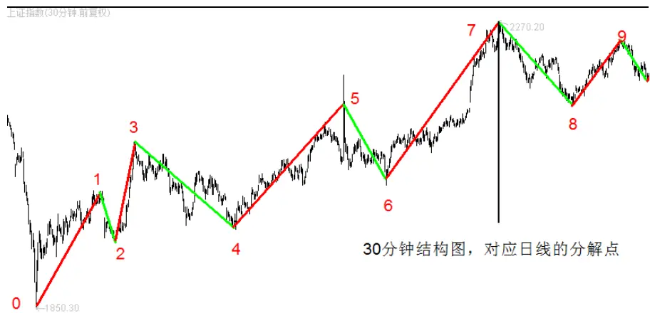
数据来源：国泰君安证券研究，WIND

图 34 上证综指日线级别走势图
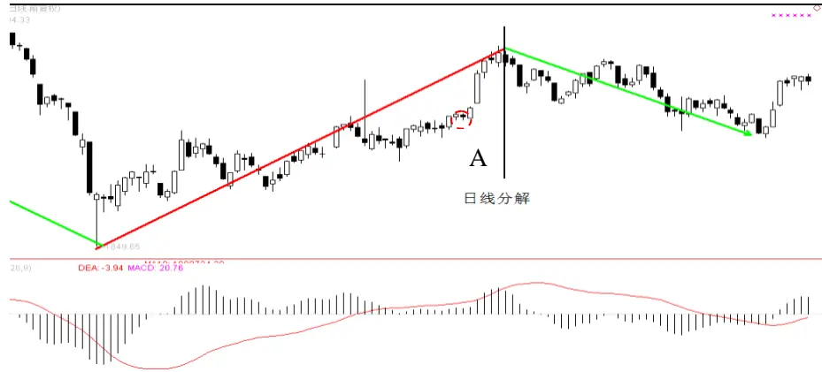
数据来源：国泰君安证券研究，WIND

根据 DEA指标分段的两个规则，上证综指日线图上，直到 A点位置日线一段上涨才形成，因为直到这个点的位置两个分段规则才同时成立：第一、DEA指标大于零；第二、自 6月 25日以来的反弹行情，当前收盘价创所有这个波段上日度收盘价的新高。对上证综指 30分钟和日线价格分段比较，发现日线级别的一段上涨或下跌和 30分钟图上的波段数存在很强的规律。过去十三年，上证综指日线上一段上涨对应 30分钟级别波段数仅有 3 次超过 9 段，等于 9 段也有 3 次，这 3 次的顶点和次顶点非常接近，由此可知，上证综指日线级别的一段上涨如果 30 分钟线上出现 7段，基本就是一个日线级别的顶点，意味着之后的下跌日线 DEA指标至少要跌破零轴。这也解释了为什么在 30分钟结构图上 7的位置很容易成为日线级别的拐点。

应用之二：1：3比例使用

另外一个观察显示日线上的一段在30分钟周期图上绝大多数情况出现三段以上，可知如果日线一段和 30 分钟第一段行情同时出现，那么 30 分钟级别的第二段下跌则是买点。反之对于日线下跌中的行情也是成立的。这个规律也适用于 30分钟级别和 5分钟级别联立。

图 35 30分钟级别结构图（回调行情为什么是买点？）
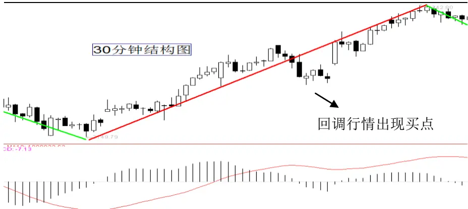
数据来源：国泰君安证券研究，WIND

图 36 5分钟级别结构图（第二段回拉是买点）
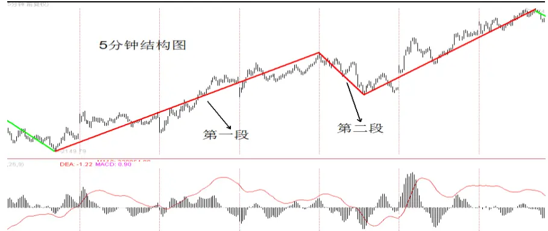
数据来源：国泰君安证券研究，WIND

## 7. 结论

这篇研究报告并不是阐释如何用MACD指标进行择时，而是基于MACD这个技术指标对价格走势进行同级别分解。这种分解的思想不仅应用在价格的日度数据上，可以应用于任何时间周期的价格序列，如 1分钟、5分钟、30分钟、日线、周线、月线乃至年线，这样的分解的优点在于联立不同级别的走势对当下走势进行分析判断。

以上提到的择时都是基于不同周期价格分段的统计规律，并不是任何时点对市场走势都能准确把握，比如如果日线上一段上涨或者下跌在 30分钟 K 线图出现了五段，这时候我们就比较难以判断 30 分钟图上最后是走出 7 段还是结束为 5 段。对于这种情况，仅仅基于 MACD 分段的统计规律是不够的，还需要深入研究价格的动力学部分。

## 本公司具有中国证监会核准的证券投资咨询业务资格

## 分析师声明

作者具有中国证券业协会授予的证券投资咨询执业资格或相当的专业胜任能力，保证报告所采用的数据均来自合规渠道，分析逻辑基于作者的职业理解，本报告清晰准确地反映了作者的研究观点，力求独立、客观和公正，结论不受任何第三方的授意或影响，特此声明。

## 免责声明

本报告仅供国泰君安证券股份有限公司（以下简称“本公司”）的客户使用。本公司不会因接收人收到本报告而视其为本公司的当然客户。本报告仅在相关法律许可的情况下发放，并仅为提供信息而发放，概不构成任何广告。

本报告的信息来源于已公开的资料，本公司对该等信息的准确性、完整性或可靠性不作任何保证。本报告所载的资料、意见及推测仅反映本公司于发布本报告当日的判断，本报告所指的证券或投资标的的价格、价值及投资收入可升可跌。过往表现不应作为日后的表现依据。在不同时期，本公司可发出与本报告所载资料、意见及推测不一致的报告。本公司不保证本报告所含信息保持在最新状态。同时，本公司对本报告所含信息可在不发出通知的情形下做出修改，投资者应当自行关注相应的更新或修改。

本报告中所指的投资及服务可能不适合个别客户，不构成客户私人咨询建议。在任何情况下，本报告中的信息或所表述的意见均不构成对任何人的投资建议。在任何情况下，本公司、本公司员工或者关联机构不承诺投资者一定获利，不与投资者分享投资收益，也不对任何人因使用本报告中的任何内容所引致的任何损失负任何责任。投资者务必注意，其据此做出的任何投资决策与本公司、本公司员工或者关联机构无关。

本公司利用信息隔离墙控制内部一个或多个领域、部门或关联机构之间的信息流动。因此，投资者应注意，在法律许可的情况下，本公司及其所属关联机构可能会持有报告中提到的公司所发行的证券或期权并进行证券或期权交易，也可能为这些公司提供或者争取提供投资银行、财务顾问或者金融产品等相关服务。在法律许可的情况下，本公司的员工可能担任本报告所提到的公司的董事。

市场有风险，投资需谨慎。投资者不应将本报告为作出投资决策的惟一参考因素，亦不应认为本报告可以取代自己的判断。在决定投资前，如有需要，投资者务必向专业人士咨询并谨慎决策。

本报告版权仅为本公司所有，未经书面许可，任何机构和个人不得以任何形式翻版、复制、发表或引用。如征得本公司同意进行引用、刊发的，需在允许的范围内使用，并注明出处为“国泰君安证券研究”，且不得对本报告进行任何有悖原意的引用、删节和修改。

若本公司以外的其他机构（以下简称“该机构”）发送本报告，则由该机构独自为此发送行为负责。通过此途径获得本报告的投资者应自行联系该机构以要求获悉更详细信息或进而交易本报告中提及的证券。本报告不构成本公司向该机构之客户提供的投资建议，本公司、本公司员工或者关联机构亦不为该机构之客户因使用本报告或报告所载内容引起的任何损失承担任何责任。

## 评级说明

## 1.投资建议的比较标准

投资评级分为股票评级和行业评级。

以报告发布后的12个月内的市场表现为比较标准，报告发布日后的12个月内的公司股价（或行业指数）的涨跌幅相对同期的沪深300指数涨跌幅为基准。

## 2.投资建议的评级标准

报告发布日后的 12 个月内的公司股价（或行业指数）的涨跌幅相对同期的沪深300指数的涨跌幅。

| 评级 |  | 说明 |
| --- | --- | --- |
| 股票投资评级 | 增持 | 相对沪深 300指数涨幅15%以上 |
|  | 谨慎增持 | 相对沪深300指数涨幅介于5%～15%之间 |
|  | 中性 | 相对沪深300指数涨幅介于-5%～5% |
|  | 减持 | 相对沪深300指数下跌5%以上 |
| 行业投资评级 | 增持 | 明显强于沪深 300 指数 |
|  | 中性 | 基本与沪深300指数持平 |
|  | 减持 | 明显弱于沪深 300指数 |

## 国泰君安证券研究

|  | 上海 | 深圳 | 北京 |
| --- | --- | --- | --- |
| 地址 | 上海市浦东新区银城中路168号上海 银行大厦29层 | 深圳市福田区益田路 6009 号新世界 商务中心34层 | 北京市西城区金融大街 28 号盈泰中 心2号楼10层 |
| 邮编 | 200120 | 518026 | 100140 |
| 电话 | （021)38676666 | (0755)23976888 | (010)59312799 |
|  | E-mail: gtjaresearch@gtjas.com |  |  |