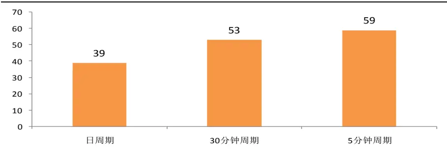
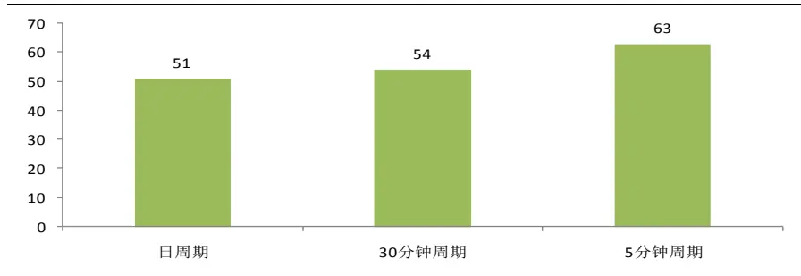
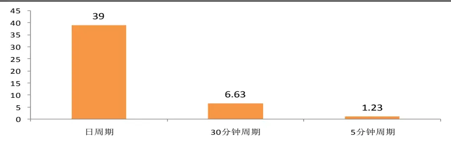
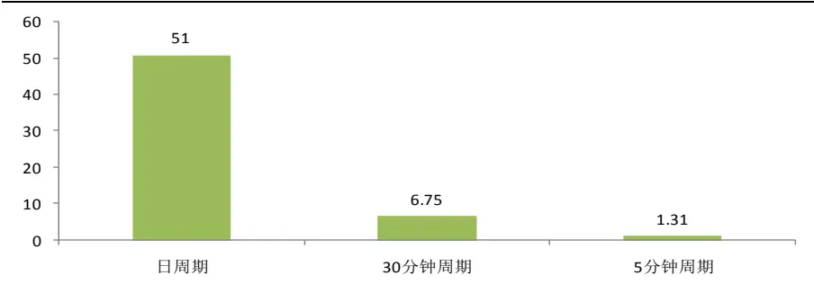
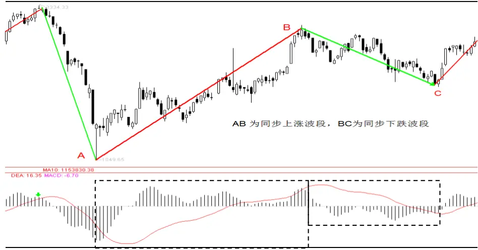
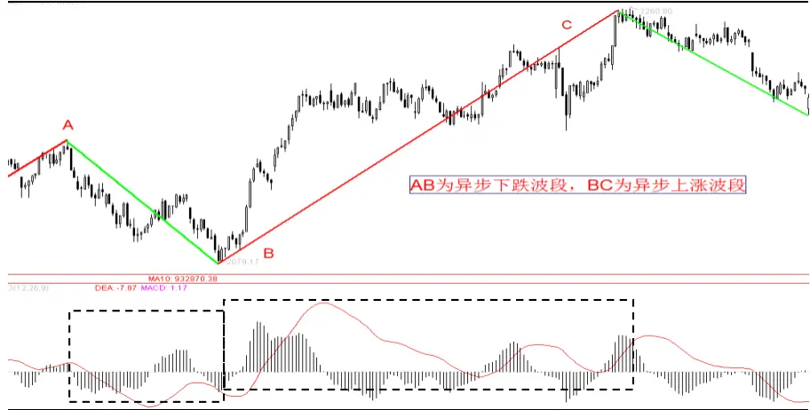
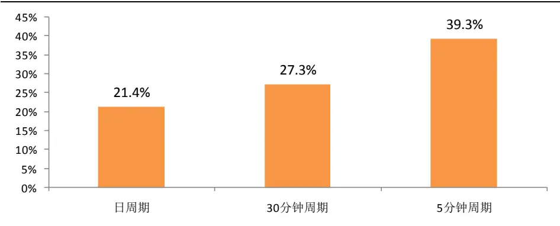
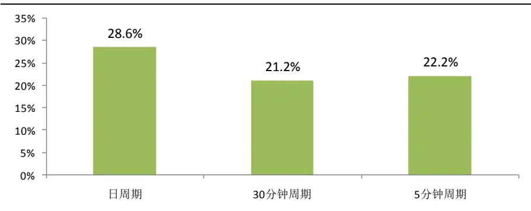

2013.12.19

# 基于 MACD 价格分段应用举例

## ——数量化专题之三十

刘富兵（分析师）

赵延鸿（研究助理）

8 021-38676673

021-38674927

liufubing008481@gtjas.com

证书编号 S0880511010017

zhaoyanhong@gtjas.com

S0880113070047

## 本报告导读：

价格走势与其 MACD 的 DEA 指标同步性分析；对涨跌波段的持续时间做了详细统计；波段形成后，上涨或下跌行情延续的概率高达 85%，在日线级别和 30分钟级别有很强的可操作性。

le_Summary] 价格走势最基本的规律就是上涨与下跌交替出现，这个简单的观察正是价格走势的客观事实。如何利用这种规律的前提需要对上涨和下跌给出一个严格的数学定义，否则任何关于价格上涨和下跌的表述都是不严谨的，同样也不具有可操作性。基于 MACD 的 DEA 指标价格分段方法正是对上涨和下跌进行数学化定义的方法之一。

技术分析中，MACD的DEA指标和价格走势是否保持同步是值得关注的问题。换言之，当DEA 指标转向的时候是否预示着当前级别的上涨结束并且同级别的下跌开始？我们对日线、30 分钟线和5分钟线三个级别分别作了统计，结果显示，异步波段出现的频率基本在50%左右，除了日线级别 28个上涨波段中，异步波段数为 8，出现频率 29%，其他都是接近50%。这个统计结果意味着根据DEA指标转向来预判当前级别的涨跌是否结束基本和猜硬币正反面的概率是一样的。

一个波段形成当下是可以确认的，从波段形成位臵到波段结束位臵一般还会延续一段行情，我们对延续行情的涨跌幅度和延续时间做了统计。以上涨波段为例，上证综指无论是日线级别、30 分钟级别还是 5 分钟级别行情延续的概率都在85%之上。而且日线级别上涨波段的延续涨幅均值为 8.3%，30 分钟级别延续涨幅的均值为 2.9%，从交易角度可构建量化策略。

波段的涨跌幅、持续时间、波段与 DEA指标同步性分析和延续性等统计分析，虽然报告中仅研究上证综指，但不局限于上证综指，可以应用于任何股票、股票指数、外汇、大宗商品等价格序列，只要统计规律显著并且资产流动性好，以上策略就具有很强的可操作性。

金融工程

## 金融工程团队：

刘富兵：（分析师）

电话：021-38676673

邮箱：liufubing008481@gtjas.com

证书编号：S0880511010017

何苗：（分析师）

电话：010-59312710

邮箱：hemiao@gtjas.com

证书编号：S0880511010049

## 严佳炜：（分析师）

电话：021-38674812

邮箱：yanjiawei008776@gtjas.com

证书编号：S0880512110001

## 耿帅军：（分析师）

电话：010-59312753

邮箱：gengshuaijun@gtjas.com

证书编号：S0880513080013

## 徐康：（分析师）

电话：021-38674939

邮箱：xukang010849@gtjas.com

证书编号：S0880513080018

## 赵延鸿：（研究助理）

电话：021-38674927

邮箱：zhaoyanhong@gtjas.com

证书编号：S0880113070047

## 陈睿：（研究助理）

电话：021-38675861

邮箱：chenrui012896@gtjas.com

证书编号：S0880112120012

## 刘正捷：（研究助理）

电话：021-38675860

邮箱：liuzhengjie012509@gtjas.com

证书编号：S0880112080087

## [Table_R相关报告

《发现价格走势规律之基于 MACD 分段研究》2013.12.09

《2013 年 12 月沪深 300 指数成分股调整预测》2013.11.05

《再构大盘均线强弱指数》2013.11.04

《我们能打败最好的行业吗》2013.10.03

《沪深 300 指数期货展期策略研究》2013.09.23

## 1. 简介

无论是大宗商品、外汇、股票、股票指数还是债券等价格走势是否存在这样一种规律？这种规律不随时间、地域、投资者而改变。回答这个问题可能要先定义什么是规律，对这个问题的深究属于哲学范畴的讨论。但通过对大量价格走势图的观察可知，任何价格走势最基本的规律就是不能永远上涨也不能永远下跌，一直是上涨与下跌交替出现。这个简单而基本的规律正是价格走势的客观事实，如何能够利用好这种规律至关重要。所以研究价格走势最重要的出发点则是定义何谓上涨何谓下跌，在对上涨和下跌给出一个严格的数学化定义之前，任何关于价格上涨和下跌的表述都是不严谨的，进一步而言也不具有可操作性。基于 MACD的 DEA 指标价格分段这种方法正是对上涨和下跌进行数学化定义的方法之一。分段的具体规则可参见之前报告《发现价格走势规律之基于MACD 分段研究》。

上涨与下跌波段有了严格数学定义后，波段的涨跌幅度和持续时间就自然而然成了关注点。然而在投资交易中，显然不能简单根据波段的涨跌幅度或者持续时间长短来判断当前波段是否要出现转折，因为无论是上涨波段还是下跌波段，其涨跌幅和持续时间同样是两个变量，但这两个变量和自然界大多数随机变量一样都具有类正态分布的特征，因此如果基于涨跌幅度或持续时间来构造交易策略，统计意义上有其合理性。这也是为什么我们在之前报告和本篇报告中给出了波段涨跌幅和持续时间的统计数据。

价格走势从表相上是不可复制的，包括波段的涨跌幅和持续时间，正如之前报告《基于技术分析的量化投资再思考》中分析的那样，因为股票走势，归根结底是参与者心理合力的痕迹，而心理是不可重复的。而几千万、上亿人的交易的可复制性，就更没可能了。为什么？每天都是新世界，影响市场的因素每天都在变化着，而这些因素对市场参与者的心理影响，更是模糊、混沌，由此产生的走势，很显然不具有任何百分百复制的可能性。所以我们相信，价格走势存在规律，这种规律绝非价格表相上显示的涨跌幅和持续 K线个数，而是存在一种内在的结构，这种结构本质上是不变的，超越了涨跌幅和持续时间这两种表相。

本篇报告我们会就三个问题对MACD的DEA指标价格分段做进一步的研究。第一个问题：上涨和下跌波段大概持续多长时间？第二个问题：价格走势和其 DEA 指标的走势是否存在同步性？换言之，DEA 指标转向是否预示当前级别价格走势出现转折？从操作层面，是否可以基于DEA指标的变化来制定有效的交易策略？第三个问题：上涨或者下跌波段形成时，之后的延续涨跌幅和延续时间大概是多少？对于这个问题的回答可以构造量化交易策略。因为无论是上涨还是下跌波段，根据MACD 的分段规则，其形成是当下可以唯一确认的，这种当下的确认性使其操作上有了清晰的介入信号，波段形成之后的进一步延伸性确定了其交易的可操作性。以下三个部分内容，我们会针对上述三个问题给出详细的统计数据。这些数据的统计分析都是以上证综指为例，其实不局限于上证综指，可以用在任何价格序列上。

## 2. 上证综指三个级别波段持续时间统计

## 2.1.日线级别波段持续时间

数据：2001 年 1 月 1 日至 2013 年 12 月 10 日的上证综指日度收盘价。基于 MACD 之 DEA指标分段后，涨跌波段共计 56个，其中 28个上涨波段，28个下跌波段。

上涨和下跌波段的具体统计结果如下，28 个上涨波段中，平均持续时间53个交易日，最大值 288，最小值 8；而 28个下跌波段中，平均持续时间 59 个交易日，最大值 196，最小值 17。

表 1：上证综指涨跌波段持续时间统计（日度数据）

|  | 均值 | 标准差 | 最大值 | 最小值 | 样本数 |
| --- | --- | --- | --- | --- | --- |
| 上涨波段 | 53 | 58 | 288 | 8 | 28 |
| 下跌波段 | 59 | 44 | 196 | 17 | 28 |

数据来源：国泰君安证券研究

如果把上涨和下跌波段的前 10%和后 10%极端持续时间去掉的话，统计结果显示波段持续时间标准差显著下降。22个上涨波段中，平均持续时间 39 个交易日，最大值 91，最小值 15；而 22 个下跌波段中，平均持续时间 51个交易日，最大值 109，最小值 19。

表 2：上证综指涨跌波段持续时间统计（扣除 10%最大最小值，日度数据）

|  | 均值 | 标准差 | 最大值 | 最小值 | 样本数 |
| --- | --- | --- | --- | --- | --- |
| 上涨波段 | 39 | 22 | 91 | 15 | 22 |
| 下跌波段 | 51 | 27 | 109 | 19 | 22 |

数据来源：国泰君安证券研究

## 2.2.30 分钟级别波段持续时间

数据：2003年3月7日至2013年11月20日的上证综指30分钟收盘价。
涨跌波段共计 329个，其中 165个上涨波段，164个下跌波段。

上涨和下跌波段的具体统计结果如下，165 个上涨波段中，平均持续时间 66 个 30分钟，最大值 386，最小值 10；而 164个下跌波段中，平均持续时间 65个 30分钟，最大值 322，最小值 10。

表 3：上证综指涨跌波段持续时间统计（30分钟数据）

|  | 均值 | 标准差 | 最大值 | 最小值 | 样本数 |
| --- | --- | --- | --- | --- | --- |
| 上涨波段 | 66 | 64 | 386 | 10 | 165 |
| 下跌波段 | 65 | 56 | 322 | 10 | 164 |

数据来源：国泰君安证券研究

如果把上涨和下跌波段的前 10%和后 10%极端持续时间去掉的话，统计结果显示波段持续时间标准差显著下降。131 个上涨波段中，平均持续时间 53 个 30分钟（相当于 6.5个交易日），最大值135，最小值 18；而132 个下跌波段中，平均持续时间 54 个 30 分钟，最大值 136，最小值17。

表 4：上证综指涨跌波段持续时间统计（扣除 10%最大最小值，30 分钟数据）

|  | 均值 | 标准差 | 最大值 | 最小值 | 样本数 |
| --- | --- | --- | --- | --- | --- |
| 上涨波段 | 53 | 31 | 135 | 18 | 131 |
| 下跌波段 | 54 | 29 | 136 | 17 | 132 |

数据来源：国泰君安证券研究

## 2.3.5 分钟级别波段持续时间

数据：2008年10月6日至2013年11月21日的上证综指5分钟收盘价。
涨跌波段共计 829个，其中 415个上涨波段，414个下跌波段。

上涨和下跌波段的具体统计结果如下，415 个上涨波段中，平均持续时间 72 个 5分钟，最大值 628，最小值 7；而 414个下跌波段中，平均持续时间 72个 5分钟，最大值 541，最小值 6。

表 5：上证综指涨跌波段持续时间统计（5分钟数据）

|  | 均值 | 标准差 | 最大值 | 最小值 | 样本数 |
| --- | --- | --- | --- | --- | --- |
| 上涨波段 | 72 | 70 | 628 | 7 | 415 |
| 下跌波段 | 72 | 60 | 541 | 6 | 414 |

数据来源：国泰君安证券研究

如果把上涨和下跌波段的前 10%和后 10%极端持续时间去掉的话，统计结果显示波段持续时间标准差显著下降。331 个上涨波段中，平均持续时间 59个 5分钟（相当于 1.25个交易日），最大值 152，最小值 17；而332个下跌波段中，平均持续时间 63个 5 分钟，最大值 146，最小值 19。

表 6：上证综指涨跌波段持续时间统计（扣除 10%最大最小值，5分钟数据）

|  | 均值 | 标准差 | 最大值 | 最小值 | 样本数 |
| --- | --- | --- | --- | --- | --- |
| 上涨波段 | 59 | 35 | 152 | 17 | 331 |
| 下跌波段 | 63 | 33 | 146 | 19 | 332 |

数据来源：国泰君安证券研究

## 2.4.3 个级别波段持续时间比较

把上涨和下跌波段的前 10%和后 10%极端持续时间去掉之后，上涨波段日线级别平均持续 39个交易日，30分钟级别平均持续 53个周期，5分钟级别平均持续 59个周期。下跌波段日线级别平均持续 51个交易日，30分钟级别平均持续 54个周期，5分钟级别平均持续 63个周期。

图 1 上涨波段平均持续时间（扣除 10%最大最小值）

数据来源：国泰君安证券研究，WIND

图 2 下跌波段平均跌幅（扣除 10%最大最小值）

数据来源：国泰君安证券研究，WIND

如果把 30 分钟和 5 分钟换算成交易日数，三个级别波段持续时间对比图如下：

图 3 上涨波段平均持续交易日数（扣除 10%最大最小值）

数据来源：国泰君安证券研究，WIND

图 4 下跌波段平均持续交易日数（扣除 10%最大最小值）

数据来源：国泰君安证券研究，WIND

## 3. 价格与其 DEA指标走势同步性分析

技术分析中，MACD 的 DEA 指标和价格走势是否保持同步是值得关注的问题。以上涨波段为例，一般来说价格处于上涨行情，DEA 指标也会上行，那么当 DEA 指标转向的时候是否预示着当前级别的上涨结束并且同级别的下跌开始？

为了能够科学严谨地回答这个问题，我们根据价格与 MACD之 DEA指标走势是否一致，把波段分为同步波段和异步波段两类。同步波段又分为同步上涨波段和同步下跌波段；同样，异步波段分为异步上涨波段和异步下跌波段。四种波段的定义如下：

同步上涨波段定义：一个已经完成的上涨波段，如果波段顶点对应的DEA 值是整个上涨波段时间窗口 DEA 值的最大值，那么这个上涨波段称为同步上涨波段。

同步下跌波段定义：一个已经完成的下跌波段，如果波段低点对应的DEA 值是整个下跌波段时间窗口 DEA 值的最小值，那么这个下跌波段称为同步下跌波段。

对于同步上涨波段而言，价格的顶部拐点出现在其 DEA 指标持续创新高过程中；对于同步下跌波段而言，价格的底部拐点出现在 DEA 指标持续创新低的过程中。

图 5 同步上涨波段 AB与同步下跌波段 BC示意图

数据来源：国泰君安证券研究，WIND

异步上涨波段定义：一个已经完成的上涨波段，如果波段顶点对应的DEA 值小于整个上涨波段时间窗口 DEA 值的最大值，那么这个上涨波段称为异步上涨波段。

异步下跌波段定义：一个已经完成的下跌波段，如果波段低点对应的DEA 值大于整个下跌波段 DEA 值的最小值，那么这个下跌波段称为异步下跌波段。

对于异步上涨波段而言，当 DEA 指标向下转向的时候，同级别的下跌还没有开始，之后价格还会创新高，真正顶部拐点出现的时候，DEA指标反而没有创新高；反之，对于异步下跌波段而言，当 DEA 指标向上转向的时候，同级别的上涨还没有开始，之后价格还会创新低，真正底部拐点出现的时候，DEA指标反而没有创新低。

图 6 异步下跌波段 AB与异步上涨波段 BC示意图

数据来源：国泰君安证券研究，WIND

根据异步波段的定义，不难看出，一个已经完成的波段如果是异步波段，其价格走势和 DEA 走势会出现背离，以异步上涨波段为例，意味着价格到达顶点的时候，DEA指标没有创新高，由此也回答了开始提出的问题：对于异常上涨波段而言，DEA指标转向的时候并不预示着当前级别的上涨结束并且同级别的下跌开始。

那么在实际价格走势中，异常波段出现的频率如何？我们对日线、30分钟线和 5分钟线三个级别分别作了统计，结果显示：异步波段出现的频率基本上 50%左右，除了日线级别的上涨波段，28个上涨波段中，异步波段数为 8，出现频率 29%，其他都接近 50%。这个统计结果意味着根据 DEA 指标转向来预判当前级别的涨跌结束基本和猜硬币正反面的概率是一样的。

表 7：异常波段数统计

| 周期级别 | 涨跌波段 | 样本数 | 异步波段数 | 占比 |
| --- | --- | --- | --- | --- |
| 日线级别 | 上涨波段 | 28 | 8 | 29% |
|  | 下跌波段 | 28 | 14 | 50% |
| 30 分钟级别 | 上涨波段 | 165 | 86 | 52% |
|  | 下跌波段 | 164 | 79 | 48% |
| 5 分钟级别 | 上涨波段 | 415 | 198 | 48% |
|  | 下跌波段 | 414 | 196 | 47% |

数据来源：国泰君安证券研究

数据说明：

日度数据：2001 年 1月 1日至 2013年 12 月 10日，涨跌波段共计 56个，其中 28 个上涨波段，28个下跌波段；

30 分钟数据：2003 年 3 月 7 日至 2013 年 11 月 20 日，涨跌波段共计 329个，其中 165个上涨波段，164个下跌波段；

5 分钟数据：2008 年 10 月 6 日至 2013 年 11 月 21 日，涨跌波段共计 829个，其中 415个上涨波段，414个下跌波段。

## 4. 波段形成后涨跌幅与延续时间统计

## 4.1.波段当下形成的两种情况回顾

一个波段形成是当下可以确认的，波段形成后到最终的拐点位臵一般还会延续一段行情，一个很自然的问题：这段延续的行情涨跌幅度大概有多少？能持续多长时间？

如前一篇研究报告所讨论的，当 MACD 的 DEA指标穿越零轴时，当下波段可能正好形成，也可能还没有形成，因此最新波段的形成时点包含两种情况：一、MACD 的 DEA 指标穿越零轴时，对应的波段正好处于当前波段的最大值点（DEA 向上穿越零轴）或者最小值点（DEA 向下穿越零轴），那么这个波段就在当下形成；二、MACD的 DEA指标穿越零轴时，对应波段的当前价格已经不是当前波段的最大值点（DEA向上穿越零轴）或者最小值点（DEA 向下穿越零轴），但在之后继续创出波段的新高或者新低，直到那时才能确认新波段形成。

我们分日线级别、30分钟级别和 5分钟级别分别统计了三个时间周期波段形成后的涨跌幅度和持续时间。从下述统计结果来看，日线级别和 30分钟级别都具有很强的可操作性，当然实际交易策略还需要考虑两个问题，第一、有些波段形成时也正好达到拐点位臵，因此在波段形成位臵介入容易被套，尽管这种情况占比较低，以上涨波段为例，上证综指日线级别无延续波段的占比是 21.4%，30 分钟级别是 27.3%，当然这两个统计数据是基于从形成位臵到最终拐点的涨跌幅在 0.5%以内的波段，如果仅统计波段形成位臵正是波段结束位臵的话，上证综指日线级别无延续波段占比 14.2%，30 分钟级别 14.0%。所以从交易角度，成功率都在85%之上。而且日线级别上涨波段的延续涨幅均值为 8.3%，30分钟级别延伸涨幅的均值为 2.9%。第二、买入点虽然安全，但什么时候卖出还是一个值得深入考虑的问题，比如可以加上顶分型出现等辅助条件。

## 4.2.日线级别统计

数据：2001年 1月 1日至 2013年 12月 10 日，涨跌波段共计 56个，其中 28 个上涨波段，28个下跌波段。

实际价格走势中有很多例子，在波段形成时，刚好为波段的顶部拐点或者底部拐点，对于波段涨跌幅而言，我们定义一个概念“无延续波段”，这个“延续”包括两层意思，一是涨跌幅的延续，二是时间上的延续。

对于一个已经完成的上涨波段或者下跌波段，涨跌幅意义上的“空间无延续波段”定义：波段形成后，如果形成位臵距离（上涨波段）顶部拐点或者（下跌波段）底部拐点的涨跌幅不大于 0.5%，这个波段称为空间无延续波段。而从延续时间意义上，“时间无延续波段”定义：波段形成后，如果形成位臵距离（上涨波段）顶部拐点或者（下跌波段）底部拐点的时间不大于 3个周期单位，这个波段称为时间无延续波段.。比如，如果一个已经完成的波段是日线级别的时间无延续波段，则意味着这个波段形成后，不超过 3 个交易日则见顶，对于 30 分钟数据，则为不超过 3个 30分钟见顶。

## 4.2.1. 波段形成后延续涨跌幅统计

上涨和下跌波段的具体统计结果如下，28 个上涨波段中，平均延续涨幅18.1%，最大涨幅 51.4%，最小涨幅 0%；而 28 个下跌波段中，平均延续跌幅 10.6%，最大跌幅 61.4%，最小跌幅 0%。其中上涨波段中出现无延续波段 6个，占比 21.4%，下跌波段出现无延续波段 3个，占比 10.7%。

表 8：上证综指波段延续涨跌幅统计（日度数据）

|  | 均值 | 标准差 | 最大值 | 最小值 | 无延续波段数 | 占比 | 样本数 |
| --- | --- | --- | --- | --- | --- | --- | --- |
| 上涨波段延续涨幅 | 18.1% | 51.4% | 266.1% | 0.0% | 6 | 21.4% | 28 |
| 下跌波段延续跌幅 | -10.6% | 12.6% | -61.4% | 0.0% | 3 | 10.7% | 28 |

数据来源：国泰君安证券研究

如果把上涨和下跌波段的前 10%和后 10%极端涨跌幅去掉的话，22个上涨波段中，平均延续涨幅 5.2%，最大涨幅 24.1%，最小涨幅 0%；而 22个下跌波段中，平均延续跌幅 8.3%，最大跌幅 20.4%，最小跌幅 0.7%。

表 9：上证综指涨跌波段延续涨跌幅统计（扣除 10%最大最小值，日度数据）

|  | 均值 | 标准差 | 最大值 | 最小值 | 样本数 |
| --- | --- | --- | --- | --- | --- |
| 上涨波段延续涨幅 | 5.2% | 6.3% | 24.1% | 0.0% | 22 |
| 下跌波段延续跌幅 | -8.3% | 6.0% | -20.4% | -0.7% | 22 |

数据来源：国泰君安证券研究

## 4.2.2. 波段形成后延续时间统计

上涨和下跌波段的具体统计结果如下，28 个上涨波段中，平均延续时间34个交易日，最大值 267，最小值 0；而 28个下跌波段中，平均延续时间 39 个交易日，最大值 186，最小值 0。其中上涨波段出现无延续波段数 8个，占比 28.6%；下跌波段出现无延续波段 5个，占比 17.9%。

表 10：上证综指涨跌波段延续时间统计（日度数据）

|  | 均值 | 标准差 | 最大值 | 最小值 | 无延续波段数 | 占比 | 样本数 |
| --- | --- | --- | --- | --- | --- | --- | --- |
| 上涨波段延续时间 | 34 | 58 | 267 | 0 | 8 | 28.6% | 28 |
| 下跌波段延续时间 | 39 | 44 | 186 | 0 | 5 | 17.9% | 28 |

数据来源：国泰君安证券研究

如果把上涨和下跌波段的前 10%和后 10%极端延续时间去掉的话，22个上涨波段中，平均延续时间 19 个交易日，最大值 82，最小值 0；而22个下跌波段中，平均延续时间 33个交易日，最大值 94，最小值 1。

表 11：上证综指涨跌波段延续时间统计（扣除 10%最大最小值，日度数据）

|  | 均值 | 标准差 | 最大值 | 最小值 | 样本数 |
| --- | --- | --- | --- | --- | --- |
| 上涨波段延续时间 | 19 | 23 | 82 | 0 | 22 |
| 下跌波段延续时间 | 33 | 29 | 94 | 1 | 22 |

数据来源：国泰君安证券研究

## 4.3. 30 分钟级别统计

数据：2003 年 3 月 7 日至 2013 年 11 月 20 日，涨跌波段共计 329 个，其中 165 个上涨波段，164个下跌波段。

## 4.3.1. 波段形成后延续涨跌幅统计

上涨和下跌波段的具体统计结果如下，165 个上涨波段中，平均延续涨幅 4.2%，最大涨幅 56.8%，最小涨幅 0%；而 164 个下跌波段中，平均延续跌幅 4.2%，最大跌幅 35.8%，最小跌幅 0%。其中上涨波段中出现无延续波段 45 个，占比 27.3%，下跌波段出现无延续波段 36 个，占比22.0%。

表 12：上证综指波段延续涨跌幅统计（30 分钟数据）

|  | 均值 | 标准差 | 最大 值 | 最小值 | 无延续波段数 | 占比 | 样本数 |
| --- | --- | --- | --- | --- | --- | --- | --- |
| 上涨波段延续涨幅 | 4.2% | 6.6% | 56.8% | 0.0% | 45 | 27.3% | 165 |
| 下跌波段延续跌幅 | -4.2% | 5.4% | -35.8% | 0.0% | 36 | 22.0% | 164 |

数据来源：国泰君安证券研究

如果把上涨和下跌波段的前 10%和后 10%极端涨跌幅去掉的话，131 个上涨波段中，平均延续涨幅 2.9%，最大涨幅 10.2%，最小涨幅 0%；而132个下跌波段中，平均延续跌幅3.0%，最大跌幅10.9%，最小跌幅0.0%。

表 13：上证综指涨跌波段延续涨跌幅统计（扣除 10%最大最小值，30分钟数据）

|  | 均值 | 标准差 | 最大值 | 最小值 | 样本数 |
| --- | --- | --- | --- | --- | --- |
| 上涨波段延续涨幅 | 2.9% | 2.9% | 10.2% | 0.0% | 131 |
| 下跌波段延续跌幅 | -3.0% | 2.7% | -10.9% | 0.0% | 132 |

数据来源：国泰君安证券研究

## 4.3.2. 波段形成后延续时间统计

上涨和下跌波段的具体统计结果如下，165 个上涨波段中，平均延续时间 47 个 30 分钟，最大值 377，最小值 0；而 164 个下跌波段中，平均延续时间 44 个 30 分钟，最大值 297，最小值 0。其中上涨波段出现无延续波段数 35 个，占比 21.2%；下跌波段出现无延续波段 31 个，占比18.9%。

表 14：上证综指涨跌波段延续时间统计（30分钟数据）

|  | 均值 | 标准差 | 最大值 | 最小值 | 无延续波段数 | 占比 | 样本数 |
| --- | --- | --- | --- | --- | --- | --- | --- |
| 上涨波段延续时间 | 47 | 64 | 377 | 0 | 35 | 21.2% | 165 |
| 下跌波段延续时间 | 44 | 56 | 297 | 0 | 31 | 18.9% | 164 |

数据来源：国泰君安证券研究

如果把上涨和下跌波段的前 10%和后 10%极端延续时间去掉的话，131个上涨波段中，平均延续时间 33个 30分钟，最大值 119，最小值 0；而132个下跌波段中，平均延续时间 33个交易日，最大值 118，最小值 1。

表 15：上证综指涨跌波段延续时间统计（扣除 10%最大最小值，30分钟数据）

|  | 均值 | 标准差 | 最大值 | 最小值 | 样本数 |
| --- | --- | --- | --- | --- | --- |
| 上涨波段延续时间 | 33 | 32 | 119 | 0 | 131 |
| 下跌波段延续时间 | 33 | 29 | 118 | 1 | 132 |

数据来源：国泰君安证券研究

## 4.4.5 分钟级别统计

数据：2008 年 10月 6日至 2013年 11月 21日，涨跌波段共计 829个，其中 415 个上涨波段，414个下跌波段。

## 4.4.1. 波段形成后延续涨跌幅统计

上涨和下跌波段的具体统计结果如下，415 个上涨波段中，平均延续涨幅 1.5%，最大涨幅 10.7%，最小涨幅 0%；而 414 个下跌波段中，平均延续跌幅 1.6%，最大跌幅 12.6%，最小跌幅 0%。其中上涨波段中出现无延续波段 163 个，占比 39.3%，下跌波段出现无延续波段 146 个，占比 35.3%。

表 16：上证综指波段延续涨跌幅统计（5 分钟数据）

|  | 均值 | 标准差 | 最大值 | 最小值 | 无延续波段数 | 占比 | 样本数 |
| --- | --- | --- | --- | --- | --- | --- | --- |
| 上涨波段延续涨幅 | 1.5% | 1.9% | 10.7% | 0.0% | 163 | 39.3% | 415 |
| 下跌波段延续跌幅 | -1.6% | 1.9% | -12.6% | 0.0% | 146 | 35.3% | 414 |

数据来源：国泰君安证券研究

如果把上涨和下跌波段的前 10%和后 10%极端涨跌幅去掉的话，331 个上涨波段中，平均延续涨幅 1.1%，最大涨幅 4.0%，最小涨幅 0%；而332个下跌波段中，平均延续跌幅 1.2%，最大跌幅 3.9%，最小跌幅 0.0%。

表 17：上证综指涨跌波段延续涨跌幅统计（扣除 10%最大最小值，5分钟数据）

|  | 均值 | 标准差 | 最大值 | 最小值 | 样本数 |
| --- | --- | --- | --- | --- | --- |
| 上涨波段延续涨幅 | 1.1% | 1.0% | 4.0% | 0.0% | 331 |
| 下跌波段延续跌幅 | -1.2% | 1.0% | -3.9% | 0.0% | 332 |

数据来源：国泰君安证券研究

## 4.4.2. 波段形成后延续时间统计

上涨和下跌波段的具体统计结果如下，415 个上涨波段中，平均延续时间 49 个 5分钟，最大值 618，最小值 0；而 414个下跌波段中，平均延续时间 46个 5分钟，最大值 516，最小值 0。其中上涨波段出现无延续波段数 92个，占比 22.2%；下跌波段出现无延续波段 71个，占比 17.1%。

表 18：上证综指涨跌波段延续时间统计（5分钟数据）

|  | 均值 | 标准差 | 最大值 | 最小值 | 无延续波段数 | 占比 | 样本数 |
| --- | --- | --- | --- | --- | --- | --- | --- |
| 上涨波段延续时间 | 49 | 70 | 618 | 0 | 92 | 22.2% | 415 |
| 下跌波段延续时间 | 46 | 58 | 516 | 0 | 71 | 17.1% | 414 |

数据来源：国泰君安证券研究

如果把上涨和下跌波段的前 10%和后 10%极端延续时间去掉的话，统计结果显示波段延续时间标准差显著下降。331 个上涨波段中，平均延续时间 35个 5分钟，最大值 127，最小值 0；而 332个下跌波段中，平均延续时间 36个交易日，最大值 120，最小值 1。

表 19：上证综指涨跌波段延续时间统计（扣除 10%最大最小值，5 分钟数据）

|  | 均值 | 标准差 | 最大值 | 最小值 | 样本数 |
| --- | --- | --- | --- | --- | --- |
| 上涨波段延续时间 | 35 | 34 | 127 | 0 | 331 |
| 下跌波段延续时间 | 36 | 31 | 120 | 1 | 332 |

数据来源：国泰君安证券研究

## 4.5.3 个级别无延续波段比较说明

无延续波段的占比决定了交易策略是否可行，从涨跌幅角度，可以看出无延续波段占比日线级别是 21.4%，30 分钟级别上升至 27.3%，5 分钟级别上升至 39.3%。占比越高，波段形成时顺势参与此级别的可操作性就越低。因为涨跌幅意义上，无误延续波段定义为从形成位臵至波段最终顶部拐点或底部拐点的涨跌幅不超过 0.5%，所以 5分钟级别的无延续波段的数量占比最高，日线级别的无延续波段数量占比最低。

图 7 无延续波段占比（延伸涨跌幅不大于 0.5%）

数据来源：国泰君安证券研究，WIND

而从延续时间意义上，无延续波段定义为，波段形成后，如果形成位臵距离顶部拐点或者底部拐点的时间不大于3个周期单位则称为无延续波段。因此，无论是日线级别、30分钟级别还是 5分钟级别，无延续波段的占比比较接近。日周期占比偏高主要是样本数少造成的，可以看到 30分钟周期和 5分钟周期的无延续波段占比基本一致。这也是不同周期走势图上自相似结构的一个实际例子。

图 8 无延续波段占比（延续时间不大于 3个周期）

数据来源：国泰君安证券研究，WIND

## 本公司具有中国证监会核准的证券投资咨询业务资格

## 分析师声明

作者具有中国证券业协会授予的证券投资咨询执业资格或相当的专业胜任能力，保证报告所采用的数据均来自合规渠道，分析逻辑基于作者的职业理解，本报告清晰准确地反映了作者的研究观点，力求独立、客观和公正，结论不受任何第三方的授意或影响，特此声明。

## 免责声明

本报告仅供国泰君安证券股份有限公司（以下简称“本公司”）的客户使用。本公司不会因接收人收到本报告而视其为本公司的当然客户。本报告仅在相关法律许可的情况下发放，并仅为提供信息而发放，概不构成任何广告。

本报告的信息来源于已公开的资料，本公司对该等信息的准确性、完整性或可靠性不作任何保证。本报告所载的资料、意见及推测仅反映本公司于发布本报告当日的判断，本报告所指的证券或投资标的的价格、价值及投资收入可升可跌。过往表现不应作为日后的表现依据。在不同时期，本公司可发出与本报告所载资料、意见及推测不一致的报告。本公司不保证本报告所含信息保持在最新状态。同时，本公司对本报告所含信息可在不发出通知的情形下做出修改，投资者应当自行关注相应的更新或修改。

本报告中所指的投资及服务可能不适合个别客户，不构成客户私人咨询建议。在任何情况下，本报告中的信息或所表述的意见均不构成对任何人的投资建议。在任何情况下，本公司、本公司员工或者关联机构不承诺投资者一定获利，不与投资者分享投资收益，也不对任何人因使用本报告中的任何内容所引致的任何损失负任何责任。投资者务必注意，其据此做出的任何投资决策与本公司、本公司员工或者关联机构无关。

本公司利用信息隔离墙控制内部一个或多个领域、部门或关联机构之间的信息流动。因此，投资者应注意，在法律许可的情况下，本公司及其所属关联机构可能会持有报告中提到的公司所发行的证券或期权并进行证券或期权交易，也可能为这些公司提供或者争取提供投资银行、财务顾问或者金融产品等相关服务。在法律许可的情况下，本公司的员工可能担任本报告所提到的公司的董事。

市场有风险，投资需谨慎。投资者不应将本报告为作出投资决策的惟一参考因素，亦不应认为本报告可以取代自己的判断。在决定投资前，如有需要，投资者务必向专业人士咨询并谨慎决策。

本报告版权仅为本公司所有，未经书面许可，任何机构和个人不得以任何形式翻版、复制、发表或引用。如征得本公司同意进行引用、刊发的，需在允许的范围内使用，并注明出处为“国泰君安证券研究”，且不得对本报告进行任何有悖原意的引用、删节和修改。

若本公司以外的其他机构（以下简称“该机构”）发送本报告，则由该机构独自为此发送行为负责。通过此途径获得本报告的投资者应自行联系该机构以要求获悉更详细信息或进而交易本报告中提及的证券。本报告不构成本公司向该机构之客户提供的投资建议，本公司、本公司员工或者关联机构亦不为该机构之客户因使用本报告或报告所载内容引起的任何损失承担任何责任。

## 评级说明

## 1.投资建议的比较标准

投资评级分为股票评级和行业评级。

以报告发布后的12个月内的市场表现为比较标准，报告发布日后的12个月内的公司股价（或行业指数）的涨跌幅相对同期的沪深300指数涨跌幅为基准。

## 2.投资建议的评级标准

报告发布日后的 12 个月内的公司股价（或行业指数）的涨跌幅相对同期的沪深300指数的涨跌幅。

| 评级 |  | 说明 |
| --- | --- | --- |
| 股票投资评级 | 增持 | 相对沪深 300指数涨幅15%以上 |
|  | 谨慎增持 | 相对沪深300指数涨幅介于5%～15%之间 |
|  | 中性 | 相对沪深300指数涨幅介于-5%～5% |
|  | 减持 | 相对沪深300指数下跌5%以上 |
| 行业投资评级 | 增持 | 明显强于沪深 300 指数 |
|  | 中性 | 基本与沪深300指数持平 |
|  | 减持 | 明显弱于沪深 300指数 |

## 国泰君安证券研究

|  | 上海 | 深圳 | 北京 |
| --- | --- | --- | --- |
| 地址 | 上海市浦东新区银城中路168号上海 银行大厦29层 | 深圳市福田区益田路 6009 号新世界 商务中心34层 | 北京市西城区金融大街 28 号盈泰中 心2号楼10层 |
| 邮编 | 200120 | 518026 | 100140 |
| 电话 | （021)38676666 | (0755)23976888 | (010)59312799 |
|  | E-mail: gtjaresearch@gtjas.com |  |  |